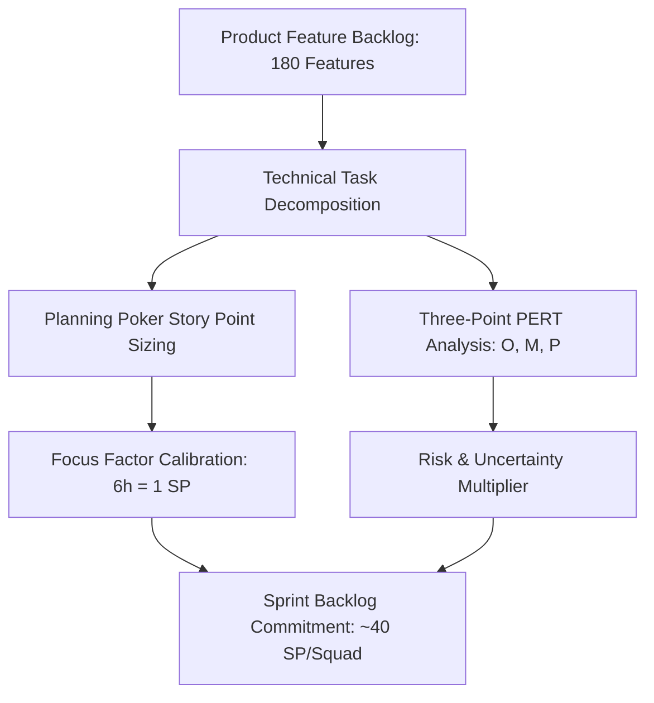

# Master Algorithmic Estimation & Story Pointing Methodology Baseline
## Namma Clinic Digital Health & Operations Platform
### Greater Bengaluru Authority (GBA) / BBMP Health Department
**Document Code:** `TMP-DOC-04` | **Version Tag:** `1.0.0` | **Status:** APPROVED BASELINE | **Date:** September 2026

---

## 1. Executive Summary & Estimation Philosophy
The Master Algorithmic Estimation and Story Pointing Methodology establishes the mathematical frameworks, statistical distributions, parametric models, and feature-by-feature sizing baselines governing engineering effort across the Namma Clinic Platform. Ratified by the Joint Engineering Governance Council of GBA and BBMP, this document provides the rigorous scientific foundation for schedule commitments, capacity allocation, and sprint predictability.

To eliminate subjective bias and anchoring heuristics, the platform employs a dual-tier estimation framework: relative sizing using a Modified Fibonacci sequence (1 to 21 Story Points) calibrated against empirical focus factor capacity, cross-validated by Three-Point PERT statistical modeling and COCOMO II software cost estimation formulas.

## 2. Estimation Frameworks & Mathematical Formulations
The platform engineering methodology integrates three complementary estimation models:

### Modified Fibonacci Story Point Scale
Story points represent relative effort, technical complexity, risk uncertainty, and architectural dependencies:
- **1 Point:** Trivial configuration change, simple localized UI tweak, or minor unit test addition (0.5 to 1 person-day).
- **2 Points:** Standard CRUD endpoint, simple form validation, or localized database query (1 to 2 person-days).
- **3 Points:** Multi-field clinical form view, Fastify route handler with schema validation, or minor Flyway migration (2 to 3 person-days).
- **5 Points:** Complex business logic service, multi-table transactional mutation, or bilingual accessible UI component (3 to 5 person-days).
- **8 Points:** Cross-domain subsystem integration, offline sync conflict resolver, or encrypted token minting engine (5 to 8 person-days).
- **13 Points:** Complex external gateway integration (ABDM, NIC eHospital), ClickHouse OLAP pipeline, or core security identity broker (8 to 13 person-days).
- **21 Points:** Epic-level architectural package; mandatory decomposition into smaller user stories prior to sprint commitment.

### Three-Point PERT Statistical Modeling
For critical path activities, duration uncertainty is modeled using Beta-PERT probability distributions:

$$E = \frac{O + 4M + P}{6}$$
$$\sigma = \frac{P - O}{6}$$
$$V = \sigma^2 = \left( \frac{P - O}{6} \right)^2$$

Where:
- $O$: Optimistic duration (ideal conditions, zero defects, perfect dependencies).
- $M$: Most likely duration (standard operating velocity, expected testing iterations).
- $P$: Pessimistic duration (major external sandbox timeouts, unexpected regression triage).
- $E$: Expected weighted duration mean.
- $\sigma$: Standard deviation measuring schedule variance risk.

### Schedule Architecture Diagram: Algorithmic Estimation Workflow
<!-- DOCUMENTATION-ONLY DIAGRAM -->

## 3. Comprehensive Feature Estimation Catalog (All 180 Features)
Exhaustive algorithmic estimation across all 180 platform product features (`FEATURE-001` through `FEATURE-180`), specifying Story Points, PERT person-day ranges, expected duration, and complexity drivers:

### FEATURE-001: Feature `Credential Verification`
- **Feature Identifier:** `FEATURE-001` (Feature #1)
- **Functional Module:** `MODULE-001` (DOMAIN-001)
- **Target Sprint Execution:** `SPRINT-01` | Assigned Squad: `Squad Delta (Edge & Interoperability)`
- **Story Point Sizing:** `2 SP` (Relative Complexity Index: `LOW_TO_MEDIUM`)
- **COCOMO II Parametric Metric:** ~0.29 KSLOC estimated source code density.
- **PERT Estimates (Days):** Optimistic: `1.0d` | Most Likely: `1.5d` | Pessimistic: `3.0d`
- **Expected Duration ($E$):** `1.67 Person-Days` (Variance $\sigma$: `±0.33d`)
- **Primary Complexity Driver:** Standard CRUD persistence, basic form layout, and query optimization.
- **Bilingual Implementation:** React components validated in Kannada and English with WCAG 2.1 AA tokens.
- **Quality Gate Standard:** Mandatory unit test coverage >= 90%, Playwright E2E journey, and sub-250ms p95 latency.
- **Traceability Baseline:** Aligned with Phase 16 Backlog (`FEATURE-001`) and Phase 02 Requirements.

### FEATURE-002: Feature `Session Token Minting`
- **Feature Identifier:** `FEATURE-002` (Feature #2)
- **Functional Module:** `MODULE-001` (DOMAIN-001)
- **Target Sprint Execution:** `SPRINT-02` | Assigned Squad: `Squad Delta (Edge & Interoperability)`
- **Story Point Sizing:** `3 SP` (Relative Complexity Index: `MEDIUM`)
- **COCOMO II Parametric Metric:** ~0.41 KSLOC estimated source code density.
- **PERT Estimates (Days):** Optimistic: `1.5d` | Most Likely: `2.5d` | Pessimistic: `4.5d`
- **Expected Duration ($E$):** `2.67 Person-Days` (Variance $\sigma$: `±0.50d`)
- **Primary Complexity Driver:** Fastify REST API route handler, schema validation, and unit test automation.
- **Bilingual Implementation:** React components validated in Kannada and English with WCAG 2.1 AA tokens.
- **Quality Gate Standard:** Mandatory unit test coverage >= 90%, Playwright E2E journey, and sub-250ms p95 latency.
- **Traceability Baseline:** Aligned with Phase 16 Backlog (`FEATURE-002`) and Phase 02 Requirements.

### FEATURE-003: Feature `MFA Challenge Dispatch`
- **Feature Identifier:** `FEATURE-003` (Feature #3)
- **Functional Module:** `MODULE-001` (DOMAIN-001)
- **Target Sprint Execution:** `SPRINT-03` | Assigned Squad: `Squad Delta (Edge & Interoperability)`
- **Story Point Sizing:** `2 SP` (Relative Complexity Index: `LOW_TO_MEDIUM`)
- **COCOMO II Parametric Metric:** ~0.29 KSLOC estimated source code density.
- **PERT Estimates (Days):** Optimistic: `1.0d` | Most Likely: `1.5d` | Pessimistic: `3.0d`
- **Expected Duration ($E$):** `1.67 Person-Days` (Variance $\sigma$: `±0.33d`)
- **Primary Complexity Driver:** Standard CRUD persistence, basic form layout, and query optimization.
- **Bilingual Implementation:** React components validated in Kannada and English with WCAG 2.1 AA tokens.
- **Quality Gate Standard:** Mandatory unit test coverage >= 90%, Playwright E2E journey, and sub-250ms p95 latency.
- **Traceability Baseline:** Aligned with Phase 16 Backlog (`FEATURE-003`) and Phase 02 Requirements.

### FEATURE-004: Feature `Biometric Authentication Bridge`
- **Feature Identifier:** `FEATURE-004` (Feature #4)
- **Functional Module:** `MODULE-001` (DOMAIN-001)
- **Target Sprint Execution:** `SPRINT-04` | Assigned Squad: `Squad Delta (Edge & Interoperability)`
- **Story Point Sizing:** `5 SP` (Relative Complexity Index: `HIGH`)
- **COCOMO II Parametric Metric:** ~0.65 KSLOC estimated source code density.
- **PERT Estimates (Days):** Optimistic: `2.5d` | Most Likely: `4.0d` | Pessimistic: `7.0d`
- **Expected Duration ($E$):** `4.25 Person-Days` (Variance $\sigma$: `±0.75d`)
- **Primary Complexity Driver:** Multi-table relational schema mutations, business rule validation, and bilingual React views.
- **Bilingual Implementation:** React components validated in Kannada and English with WCAG 2.1 AA tokens.
- **Quality Gate Standard:** Mandatory unit test coverage >= 90%, Playwright E2E journey, and sub-250ms p95 latency.
- **Traceability Baseline:** Aligned with Phase 16 Backlog (`FEATURE-004`) and Phase 02 Requirements.

### FEATURE-005: Feature `Local PIN Verification`
- **Feature Identifier:** `FEATURE-005` (Feature #5)
- **Functional Module:** `MODULE-001` (DOMAIN-001)
- **Target Sprint Execution:** `SPRINT-05` | Assigned Squad: `Squad Delta (Edge & Interoperability)`
- **Story Point Sizing:** `2 SP` (Relative Complexity Index: `LOW_TO_MEDIUM`)
- **COCOMO II Parametric Metric:** ~0.29 KSLOC estimated source code density.
- **PERT Estimates (Days):** Optimistic: `1.0d` | Most Likely: `1.5d` | Pessimistic: `3.0d`
- **Expected Duration ($E$):** `1.67 Person-Days` (Variance $\sigma$: `±0.33d`)
- **Primary Complexity Driver:** Standard CRUD persistence, basic form layout, and query optimization.
- **Bilingual Implementation:** React components validated in Kannada and English with WCAG 2.1 AA tokens.
- **Quality Gate Standard:** Mandatory unit test coverage >= 90%, Playwright E2E journey, and sub-250ms p95 latency.
- **Traceability Baseline:** Aligned with Phase 16 Backlog (`FEATURE-005`) and Phase 02 Requirements.

### FEATURE-006: Feature `Session Inactivity Lockout`
- **Feature Identifier:** `FEATURE-006` (Feature #6)
- **Functional Module:** `MODULE-001` (DOMAIN-001)
- **Target Sprint Execution:** `SPRINT-06` | Assigned Squad: `Squad Delta (Edge & Interoperability)`
- **Story Point Sizing:** `8 SP` (Relative Complexity Index: `VERY_HIGH`)
- **COCOMO II Parametric Metric:** ~1.01 KSLOC estimated source code density.
- **PERT Estimates (Days):** Optimistic: `4.0d` | Most Likely: `6.0d` | Pessimistic: `11.0d`
- **Expected Duration ($E$):** `6.50 Person-Days` (Variance $\sigma$: `±1.17d`)
- **Primary Complexity Driver:** Complex state synchronization, cryptographic security verification, or distributed transaction.
- **Bilingual Implementation:** React components validated in Kannada and English with WCAG 2.1 AA tokens.
- **Quality Gate Standard:** Mandatory unit test coverage >= 90%, Playwright E2E journey, and sub-250ms p95 latency.
- **Traceability Baseline:** Aligned with Phase 16 Backlog (`FEATURE-006`) and Phase 02 Requirements.

### FEATURE-007: Feature `Permission Evaluation`
- **Feature Identifier:** `FEATURE-007` (Feature #7)
- **Functional Module:** `MODULE-002` (DOMAIN-001)
- **Target Sprint Execution:** `SPRINT-07` | Assigned Squad: `Squad Delta (Edge & Interoperability)`
- **Story Point Sizing:** `2 SP` (Relative Complexity Index: `LOW_TO_MEDIUM`)
- **COCOMO II Parametric Metric:** ~0.29 KSLOC estimated source code density.
- **PERT Estimates (Days):** Optimistic: `1.0d` | Most Likely: `1.5d` | Pessimistic: `3.0d`
- **Expected Duration ($E$):** `1.67 Person-Days` (Variance $\sigma$: `±0.33d`)
- **Primary Complexity Driver:** Standard CRUD persistence, basic form layout, and query optimization.
- **Bilingual Implementation:** React components validated in Kannada and English with WCAG 2.1 AA tokens.
- **Quality Gate Standard:** Mandatory unit test coverage >= 90%, Playwright E2E journey, and sub-250ms p95 latency.
- **Traceability Baseline:** Aligned with Phase 16 Backlog (`FEATURE-007`) and Phase 02 Requirements.

### FEATURE-008: Feature `Dynamic Role Assignment`
- **Feature Identifier:** `FEATURE-008` (Feature #8)
- **Functional Module:** `MODULE-002` (DOMAIN-001)
- **Target Sprint Execution:** `SPRINT-08` | Assigned Squad: `Squad Delta (Edge & Interoperability)`
- **Story Point Sizing:** `5 SP` (Relative Complexity Index: `HIGH`)
- **COCOMO II Parametric Metric:** ~0.65 KSLOC estimated source code density.
- **PERT Estimates (Days):** Optimistic: `2.5d` | Most Likely: `4.0d` | Pessimistic: `7.0d`
- **Expected Duration ($E$):** `4.25 Person-Days` (Variance $\sigma$: `±0.75d`)
- **Primary Complexity Driver:** Multi-table relational schema mutations, business rule validation, and bilingual React views.
- **Bilingual Implementation:** React components validated in Kannada and English with WCAG 2.1 AA tokens.
- **Quality Gate Standard:** Mandatory unit test coverage >= 90%, Playwright E2E journey, and sub-250ms p95 latency.
- **Traceability Baseline:** Aligned with Phase 16 Backlog (`FEATURE-008`) and Phase 02 Requirements.

### FEATURE-009: Feature `Conflict-of-Interest Prevention`
- **Feature Identifier:** `FEATURE-009` (Feature #9)
- **Functional Module:** `MODULE-002` (DOMAIN-001)
- **Target Sprint Execution:** `SPRINT-09` | Assigned Squad: `Squad Delta (Edge & Interoperability)`
- **Story Point Sizing:** `2 SP` (Relative Complexity Index: `LOW_TO_MEDIUM`)
- **COCOMO II Parametric Metric:** ~0.29 KSLOC estimated source code density.
- **PERT Estimates (Days):** Optimistic: `1.0d` | Most Likely: `1.5d` | Pessimistic: `3.0d`
- **Expected Duration ($E$):** `1.67 Person-Days` (Variance $\sigma$: `±0.33d`)
- **Primary Complexity Driver:** Standard CRUD persistence, basic form layout, and query optimization.
- **Bilingual Implementation:** React components validated in Kannada and English with WCAG 2.1 AA tokens.
- **Quality Gate Standard:** Mandatory unit test coverage >= 90%, Playwright E2E journey, and sub-250ms p95 latency.
- **Traceability Baseline:** Aligned with Phase 16 Backlog (`FEATURE-009`) and Phase 02 Requirements.

### FEATURE-010: Feature `Maker-Checker Authorization`
- **Feature Identifier:** `FEATURE-010` (Feature #10)
- **Functional Module:** `MODULE-002` (DOMAIN-001)
- **Target Sprint Execution:** `SPRINT-10` | Assigned Squad: `Squad Delta (Edge & Interoperability)`
- **Story Point Sizing:** `3 SP` (Relative Complexity Index: `MEDIUM`)
- **COCOMO II Parametric Metric:** ~0.41 KSLOC estimated source code density.
- **PERT Estimates (Days):** Optimistic: `1.5d` | Most Likely: `2.5d` | Pessimistic: `4.5d`
- **Expected Duration ($E$):** `2.67 Person-Days` (Variance $\sigma$: `±0.50d`)
- **Primary Complexity Driver:** Fastify REST API route handler, schema validation, and unit test automation.
- **Bilingual Implementation:** React components validated in Kannada and English with WCAG 2.1 AA tokens.
- **Quality Gate Standard:** Mandatory unit test coverage >= 90%, Playwright E2E journey, and sub-250ms p95 latency.
- **Traceability Baseline:** Aligned with Phase 16 Backlog (`FEATURE-010`) and Phase 02 Requirements.

### FEATURE-011: Feature `Break-Glass Privilege Elevation`
- **Feature Identifier:** `FEATURE-011` (Feature #11)
- **Functional Module:** `MODULE-002` (DOMAIN-001)
- **Target Sprint Execution:** `SPRINT-11` | Assigned Squad: `Squad Delta (Edge & Interoperability)`
- **Story Point Sizing:** `2 SP` (Relative Complexity Index: `LOW_TO_MEDIUM`)
- **COCOMO II Parametric Metric:** ~0.29 KSLOC estimated source code density.
- **PERT Estimates (Days):** Optimistic: `1.0d` | Most Likely: `1.5d` | Pessimistic: `3.0d`
- **Expected Duration ($E$):** `1.67 Person-Days` (Variance $\sigma$: `±0.33d`)
- **Primary Complexity Driver:** Standard CRUD persistence, basic form layout, and query optimization.
- **Bilingual Implementation:** React components validated in Kannada and English with WCAG 2.1 AA tokens.
- **Quality Gate Standard:** Mandatory unit test coverage >= 90%, Playwright E2E journey, and sub-250ms p95 latency.
- **Traceability Baseline:** Aligned with Phase 16 Backlog (`FEATURE-011`) and Phase 02 Requirements.

### FEATURE-012: Feature `Privilege Elevation Audit`
- **Feature Identifier:** `FEATURE-012` (Feature #12)
- **Functional Module:** `MODULE-002` (DOMAIN-001)
- **Target Sprint Execution:** `SPRINT-12` | Assigned Squad: `Squad Delta (Edge & Interoperability)`
- **Story Point Sizing:** `8 SP` (Relative Complexity Index: `VERY_HIGH`)
- **COCOMO II Parametric Metric:** ~1.01 KSLOC estimated source code density.
- **PERT Estimates (Days):** Optimistic: `4.0d` | Most Likely: `6.0d` | Pessimistic: `11.0d`
- **Expected Duration ($E$):** `6.50 Person-Days` (Variance $\sigma$: `±1.17d`)
- **Primary Complexity Driver:** Complex state synchronization, cryptographic security verification, or distributed transaction.
- **Bilingual Implementation:** React components validated in Kannada and English with WCAG 2.1 AA tokens.
- **Quality Gate Standard:** Mandatory unit test coverage >= 90%, Playwright E2E journey, and sub-250ms p95 latency.
- **Traceability Baseline:** Aligned with Phase 16 Backlog (`FEATURE-012`) and Phase 02 Requirements.

### FEATURE-013: Feature `Hierarchy Node Management`
- **Feature Identifier:** `FEATURE-013` (Feature #13)
- **Functional Module:** `MODULE-003` (DOMAIN-001)
- **Target Sprint Execution:** `SPRINT-13` | Assigned Squad: `Squad Delta (Edge & Interoperability)`
- **Story Point Sizing:** `2 SP` (Relative Complexity Index: `LOW_TO_MEDIUM`)
- **COCOMO II Parametric Metric:** ~0.29 KSLOC estimated source code density.
- **PERT Estimates (Days):** Optimistic: `1.0d` | Most Likely: `1.5d` | Pessimistic: `3.0d`
- **Expected Duration ($E$):** `1.67 Person-Days` (Variance $\sigma$: `±0.33d`)
- **Primary Complexity Driver:** Standard CRUD persistence, basic form layout, and query optimization.
- **Bilingual Implementation:** React components validated in Kannada and English with WCAG 2.1 AA tokens.
- **Quality Gate Standard:** Mandatory unit test coverage >= 90%, Playwright E2E journey, and sub-250ms p95 latency.
- **Traceability Baseline:** Aligned with Phase 16 Backlog (`FEATURE-013`) and Phase 02 Requirements.

### FEATURE-014: Feature `NIN / HFR Registry Linking`
- **Feature Identifier:** `FEATURE-014` (Feature #14)
- **Functional Module:** `MODULE-003` (DOMAIN-001)
- **Target Sprint Execution:** `SPRINT-14` | Assigned Squad: `Squad Delta (Edge & Interoperability)`
- **Story Point Sizing:** `3 SP` (Relative Complexity Index: `MEDIUM`)
- **COCOMO II Parametric Metric:** ~0.41 KSLOC estimated source code density.
- **PERT Estimates (Days):** Optimistic: `1.5d` | Most Likely: `2.5d` | Pessimistic: `4.5d`
- **Expected Duration ($E$):** `2.67 Person-Days` (Variance $\sigma$: `±0.50d`)
- **Primary Complexity Driver:** Fastify REST API route handler, schema validation, and unit test automation.
- **Bilingual Implementation:** React components validated in Kannada and English with WCAG 2.1 AA tokens.
- **Quality Gate Standard:** Mandatory unit test coverage >= 90%, Playwright E2E journey, and sub-250ms p95 latency.
- **Traceability Baseline:** Aligned with Phase 16 Backlog (`FEATURE-014`) and Phase 02 Requirements.

### FEATURE-015: Feature `Station Terminal Mapping`
- **Feature Identifier:** `FEATURE-015` (Feature #15)
- **Functional Module:** `MODULE-003` (DOMAIN-001)
- **Target Sprint Execution:** `SPRINT-15` | Assigned Squad: `Squad Delta (Edge & Interoperability)`
- **Story Point Sizing:** `2 SP` (Relative Complexity Index: `LOW_TO_MEDIUM`)
- **COCOMO II Parametric Metric:** ~0.29 KSLOC estimated source code density.
- **PERT Estimates (Days):** Optimistic: `1.0d` | Most Likely: `1.5d` | Pessimistic: `3.0d`
- **Expected Duration ($E$):** `1.67 Person-Days` (Variance $\sigma$: `±0.33d`)
- **Primary Complexity Driver:** Standard CRUD persistence, basic form layout, and query optimization.
- **Bilingual Implementation:** React components validated in Kannada and English with WCAG 2.1 AA tokens.
- **Quality Gate Standard:** Mandatory unit test coverage >= 90%, Playwright E2E journey, and sub-250ms p95 latency.
- **Traceability Baseline:** Aligned with Phase 16 Backlog (`FEATURE-015`) and Phase 02 Requirements.

### FEATURE-016: Feature `Facility Capacity Configuration`
- **Feature Identifier:** `FEATURE-016` (Feature #16)
- **Functional Module:** `MODULE-003` (DOMAIN-001)
- **Target Sprint Execution:** `SPRINT-16` | Assigned Squad: `Squad Delta (Edge & Interoperability)`
- **Story Point Sizing:** `5 SP` (Relative Complexity Index: `HIGH`)
- **COCOMO II Parametric Metric:** ~0.65 KSLOC estimated source code density.
- **PERT Estimates (Days):** Optimistic: `2.5d` | Most Likely: `4.0d` | Pessimistic: `7.0d`
- **Expected Duration ($E$):** `4.25 Person-Days` (Variance $\sigma$: `±0.75d`)
- **Primary Complexity Driver:** Multi-table relational schema mutations, business rule validation, and bilingual React views.
- **Bilingual Implementation:** React components validated in Kannada and English with WCAG 2.1 AA tokens.
- **Quality Gate Standard:** Mandatory unit test coverage >= 90%, Playwright E2E journey, and sub-250ms p95 latency.
- **Traceability Baseline:** Aligned with Phase 16 Backlog (`FEATURE-016`) and Phase 02 Requirements.

### FEATURE-017: Feature `Operating Hours Enforcement`
- **Feature Identifier:** `FEATURE-017` (Feature #17)
- **Functional Module:** `MODULE-003` (DOMAIN-001)
- **Target Sprint Execution:** `SPRINT-17` | Assigned Squad: `Squad Delta (Edge & Interoperability)`
- **Story Point Sizing:** `2 SP` (Relative Complexity Index: `LOW_TO_MEDIUM`)
- **COCOMO II Parametric Metric:** ~0.29 KSLOC estimated source code density.
- **PERT Estimates (Days):** Optimistic: `1.0d` | Most Likely: `1.5d` | Pessimistic: `3.0d`
- **Expected Duration ($E$):** `1.67 Person-Days` (Variance $\sigma$: `±0.33d`)
- **Primary Complexity Driver:** Standard CRUD persistence, basic form layout, and query optimization.
- **Bilingual Implementation:** React components validated in Kannada and English with WCAG 2.1 AA tokens.
- **Quality Gate Standard:** Mandatory unit test coverage >= 90%, Playwright E2E journey, and sub-250ms p95 latency.
- **Traceability Baseline:** Aligned with Phase 16 Backlog (`FEATURE-017`) and Phase 02 Requirements.

### FEATURE-018: Feature `Special Camp Calendar`
- **Feature Identifier:** `FEATURE-018` (Feature #18)
- **Functional Module:** `MODULE-003` (DOMAIN-001)
- **Target Sprint Execution:** `SPRINT-18` | Assigned Squad: `Squad Delta (Edge & Interoperability)`
- **Story Point Sizing:** `8 SP` (Relative Complexity Index: `VERY_HIGH`)
- **COCOMO II Parametric Metric:** ~1.01 KSLOC estimated source code density.
- **PERT Estimates (Days):** Optimistic: `4.0d` | Most Likely: `6.0d` | Pessimistic: `11.0d`
- **Expected Duration ($E$):** `6.50 Person-Days` (Variance $\sigma$: `±1.17d`)
- **Primary Complexity Driver:** Complex state synchronization, cryptographic security verification, or distributed transaction.
- **Bilingual Implementation:** React components validated in Kannada and English with WCAG 2.1 AA tokens.
- **Quality Gate Standard:** Mandatory unit test coverage >= 90%, Playwright E2E journey, and sub-250ms p95 latency.
- **Traceability Baseline:** Aligned with Phase 16 Backlog (`FEATURE-018`) and Phase 02 Requirements.

### FEATURE-019: Feature `Staff Onboarding & KYC`
- **Feature Identifier:** `FEATURE-019` (Feature #19)
- **Functional Module:** `MODULE-004` (DOMAIN-001)
- **Target Sprint Execution:** `SPRINT-01` | Assigned Squad: `Squad Delta (Edge & Interoperability)`
- **Story Point Sizing:** `2 SP` (Relative Complexity Index: `LOW_TO_MEDIUM`)
- **COCOMO II Parametric Metric:** ~0.29 KSLOC estimated source code density.
- **PERT Estimates (Days):** Optimistic: `1.0d` | Most Likely: `1.5d` | Pessimistic: `3.0d`
- **Expected Duration ($E$):** `1.67 Person-Days` (Variance $\sigma$: `±0.33d`)
- **Primary Complexity Driver:** Standard CRUD persistence, basic form layout, and query optimization.
- **Bilingual Implementation:** React components validated in Kannada and English with WCAG 2.1 AA tokens.
- **Quality Gate Standard:** Mandatory unit test coverage >= 90%, Playwright E2E journey, and sub-250ms p95 latency.
- **Traceability Baseline:** Aligned with Phase 16 Backlog (`FEATURE-019`) and Phase 02 Requirements.

### FEATURE-020: Feature `Professional License Verification`
- **Feature Identifier:** `FEATURE-020` (Feature #20)
- **Functional Module:** `MODULE-004` (DOMAIN-001)
- **Target Sprint Execution:** `SPRINT-02` | Assigned Squad: `Squad Delta (Edge & Interoperability)`
- **Story Point Sizing:** `5 SP` (Relative Complexity Index: `HIGH`)
- **COCOMO II Parametric Metric:** ~0.65 KSLOC estimated source code density.
- **PERT Estimates (Days):** Optimistic: `2.5d` | Most Likely: `4.0d` | Pessimistic: `7.0d`
- **Expected Duration ($E$):** `4.25 Person-Days` (Variance $\sigma$: `±0.75d`)
- **Primary Complexity Driver:** Multi-table relational schema mutations, business rule validation, and bilingual React views.
- **Bilingual Implementation:** React components validated in Kannada and English with WCAG 2.1 AA tokens.
- **Quality Gate Standard:** Mandatory unit test coverage >= 90%, Playwright E2E journey, and sub-250ms p95 latency.
- **Traceability Baseline:** Aligned with Phase 16 Backlog (`FEATURE-020`) and Phase 02 Requirements.

### FEATURE-021: Feature `Duty Roster Generation`
- **Feature Identifier:** `FEATURE-021` (Feature #21)
- **Functional Module:** `MODULE-004` (DOMAIN-001)
- **Target Sprint Execution:** `SPRINT-03` | Assigned Squad: `Squad Delta (Edge & Interoperability)`
- **Story Point Sizing:** `2 SP` (Relative Complexity Index: `LOW_TO_MEDIUM`)
- **COCOMO II Parametric Metric:** ~0.29 KSLOC estimated source code density.
- **PERT Estimates (Days):** Optimistic: `1.0d` | Most Likely: `1.5d` | Pessimistic: `3.0d`
- **Expected Duration ($E$):** `1.67 Person-Days` (Variance $\sigma$: `±0.33d`)
- **Primary Complexity Driver:** Standard CRUD persistence, basic form layout, and query optimization.
- **Bilingual Implementation:** React components validated in Kannada and English with WCAG 2.1 AA tokens.
- **Quality Gate Standard:** Mandatory unit test coverage >= 90%, Playwright E2E journey, and sub-250ms p95 latency.
- **Traceability Baseline:** Aligned with Phase 16 Backlog (`FEATURE-021`) and Phase 02 Requirements.

### FEATURE-022: Feature `Biometric Attendance Linking`
- **Feature Identifier:** `FEATURE-022` (Feature #22)
- **Functional Module:** `MODULE-004` (DOMAIN-001)
- **Target Sprint Execution:** `SPRINT-04` | Assigned Squad: `Squad Delta (Edge & Interoperability)`
- **Story Point Sizing:** `3 SP` (Relative Complexity Index: `MEDIUM`)
- **COCOMO II Parametric Metric:** ~0.41 KSLOC estimated source code density.
- **PERT Estimates (Days):** Optimistic: `1.5d` | Most Likely: `2.5d` | Pessimistic: `4.5d`
- **Expected Duration ($E$):** `2.67 Person-Days` (Variance $\sigma$: `±0.50d`)
- **Primary Complexity Driver:** Fastify REST API route handler, schema validation, and unit test automation.
- **Bilingual Implementation:** React components validated in Kannada and English with WCAG 2.1 AA tokens.
- **Quality Gate Standard:** Mandatory unit test coverage >= 90%, Playwright E2E journey, and sub-250ms p95 latency.
- **Traceability Baseline:** Aligned with Phase 16 Backlog (`FEATURE-022`) and Phase 02 Requirements.

### FEATURE-023: Feature `Digital Signature Enrollment`
- **Feature Identifier:** `FEATURE-023` (Feature #23)
- **Functional Module:** `MODULE-004` (DOMAIN-001)
- **Target Sprint Execution:** `SPRINT-05` | Assigned Squad: `Squad Delta (Edge & Interoperability)`
- **Story Point Sizing:** `2 SP` (Relative Complexity Index: `LOW_TO_MEDIUM`)
- **COCOMO II Parametric Metric:** ~0.29 KSLOC estimated source code density.
- **PERT Estimates (Days):** Optimistic: `1.0d` | Most Likely: `1.5d` | Pessimistic: `3.0d`
- **Expected Duration ($E$):** `1.67 Person-Days` (Variance $\sigma$: `±0.33d`)
- **Primary Complexity Driver:** Standard CRUD persistence, basic form layout, and query optimization.
- **Bilingual Implementation:** React components validated in Kannada and English with WCAG 2.1 AA tokens.
- **Quality Gate Standard:** Mandatory unit test coverage >= 90%, Playwright E2E journey, and sub-250ms p95 latency.
- **Traceability Baseline:** Aligned with Phase 16 Backlog (`FEATURE-023`) and Phase 02 Requirements.

### FEATURE-024: Feature `Signature Revocation`
- **Feature Identifier:** `FEATURE-024` (Feature #24)
- **Functional Module:** `MODULE-004` (DOMAIN-001)
- **Target Sprint Execution:** `SPRINT-06` | Assigned Squad: `Squad Delta (Edge & Interoperability)`
- **Story Point Sizing:** `8 SP` (Relative Complexity Index: `VERY_HIGH`)
- **COCOMO II Parametric Metric:** ~1.01 KSLOC estimated source code density.
- **PERT Estimates (Days):** Optimistic: `4.0d` | Most Likely: `6.0d` | Pessimistic: `11.0d`
- **Expected Duration ($E$):** `6.50 Person-Days` (Variance $\sigma$: `±1.17d`)
- **Primary Complexity Driver:** Complex state synchronization, cryptographic security verification, or distributed transaction.
- **Bilingual Implementation:** React components validated in Kannada and English with WCAG 2.1 AA tokens.
- **Quality Gate Standard:** Mandatory unit test coverage >= 90%, Playwright E2E journey, and sub-250ms p95 latency.
- **Traceability Baseline:** Aligned with Phase 16 Backlog (`FEATURE-024`) and Phase 02 Requirements.

### FEATURE-025: Feature `Targeted Flag Activation`
- **Feature Identifier:** `FEATURE-025` (Feature #25)
- **Functional Module:** `MODULE-026` (DOMAIN-001)
- **Target Sprint Execution:** `SPRINT-07` | Assigned Squad: `Squad Delta (Edge & Interoperability)`
- **Story Point Sizing:** `2 SP` (Relative Complexity Index: `LOW_TO_MEDIUM`)
- **COCOMO II Parametric Metric:** ~0.29 KSLOC estimated source code density.
- **PERT Estimates (Days):** Optimistic: `1.0d` | Most Likely: `1.5d` | Pessimistic: `3.0d`
- **Expected Duration ($E$):** `1.67 Person-Days` (Variance $\sigma$: `±0.33d`)
- **Primary Complexity Driver:** Standard CRUD persistence, basic form layout, and query optimization.
- **Bilingual Implementation:** React components validated in Kannada and English with WCAG 2.1 AA tokens.
- **Quality Gate Standard:** Mandatory unit test coverage >= 90%, Playwright E2E journey, and sub-250ms p95 latency.
- **Traceability Baseline:** Aligned with Phase 16 Backlog (`FEATURE-025`) and Phase 02 Requirements.

### FEATURE-026: Feature `Emergency Feature Killswitch`
- **Feature Identifier:** `FEATURE-026` (Feature #26)
- **Functional Module:** `MODULE-026` (DOMAIN-001)
- **Target Sprint Execution:** `SPRINT-08` | Assigned Squad: `Squad Delta (Edge & Interoperability)`
- **Story Point Sizing:** `3 SP` (Relative Complexity Index: `MEDIUM`)
- **COCOMO II Parametric Metric:** ~0.41 KSLOC estimated source code density.
- **PERT Estimates (Days):** Optimistic: `1.5d` | Most Likely: `2.5d` | Pessimistic: `4.5d`
- **Expected Duration ($E$):** `2.67 Person-Days` (Variance $\sigma$: `±0.50d`)
- **Primary Complexity Driver:** Fastify REST API route handler, schema validation, and unit test automation.
- **Bilingual Implementation:** React components validated in Kannada and English with WCAG 2.1 AA tokens.
- **Quality Gate Standard:** Mandatory unit test coverage >= 90%, Playwright E2E journey, and sub-250ms p95 latency.
- **Traceability Baseline:** Aligned with Phase 16 Backlog (`FEATURE-026`) and Phase 02 Requirements.

### FEATURE-027: Feature `System Parameter Tuning`
- **Feature Identifier:** `FEATURE-027` (Feature #27)
- **Functional Module:** `MODULE-026` (DOMAIN-001)
- **Target Sprint Execution:** `SPRINT-09` | Assigned Squad: `Squad Delta (Edge & Interoperability)`
- **Story Point Sizing:** `2 SP` (Relative Complexity Index: `LOW_TO_MEDIUM`)
- **COCOMO II Parametric Metric:** ~0.29 KSLOC estimated source code density.
- **PERT Estimates (Days):** Optimistic: `1.0d` | Most Likely: `1.5d` | Pessimistic: `3.0d`
- **Expected Duration ($E$):** `1.67 Person-Days` (Variance $\sigma$: `±0.33d`)
- **Primary Complexity Driver:** Standard CRUD persistence, basic form layout, and query optimization.
- **Bilingual Implementation:** React components validated in Kannada and English with WCAG 2.1 AA tokens.
- **Quality Gate Standard:** Mandatory unit test coverage >= 90%, Playwright E2E journey, and sub-250ms p95 latency.
- **Traceability Baseline:** Aligned with Phase 16 Backlog (`FEATURE-027`) and Phase 02 Requirements.

### FEATURE-028: Feature `Edge Configuration Distribution`
- **Feature Identifier:** `FEATURE-028` (Feature #28)
- **Functional Module:** `MODULE-026` (DOMAIN-001)
- **Target Sprint Execution:** `SPRINT-10` | Assigned Squad: `Squad Delta (Edge & Interoperability)`
- **Story Point Sizing:** `5 SP` (Relative Complexity Index: `HIGH`)
- **COCOMO II Parametric Metric:** ~0.65 KSLOC estimated source code density.
- **PERT Estimates (Days):** Optimistic: `2.5d` | Most Likely: `4.0d` | Pessimistic: `7.0d`
- **Expected Duration ($E$):** `4.25 Person-Days` (Variance $\sigma$: `±0.75d`)
- **Primary Complexity Driver:** Multi-table relational schema mutations, business rule validation, and bilingual React views.
- **Bilingual Implementation:** React components validated in Kannada and English with WCAG 2.1 AA tokens.
- **Quality Gate Standard:** Mandatory unit test coverage >= 90%, Playwright E2E journey, and sub-250ms p95 latency.
- **Traceability Baseline:** Aligned with Phase 16 Backlog (`FEATURE-028`) and Phase 02 Requirements.

### FEATURE-029: Feature `Edge Migration Orchestration`
- **Feature Identifier:** `FEATURE-029` (Feature #29)
- **Functional Module:** `MODULE-026` (DOMAIN-001)
- **Target Sprint Execution:** `SPRINT-11` | Assigned Squad: `Squad Delta (Edge & Interoperability)`
- **Story Point Sizing:** `2 SP` (Relative Complexity Index: `LOW_TO_MEDIUM`)
- **COCOMO II Parametric Metric:** ~0.29 KSLOC estimated source code density.
- **PERT Estimates (Days):** Optimistic: `1.0d` | Most Likely: `1.5d` | Pessimistic: `3.0d`
- **Expected Duration ($E$):** `1.67 Person-Days` (Variance $\sigma$: `±0.33d`)
- **Primary Complexity Driver:** Standard CRUD persistence, basic form layout, and query optimization.
- **Bilingual Implementation:** React components validated in Kannada and English with WCAG 2.1 AA tokens.
- **Quality Gate Standard:** Mandatory unit test coverage >= 90%, Playwright E2E journey, and sub-250ms p95 latency.
- **Traceability Baseline:** Aligned with Phase 16 Backlog (`FEATURE-029`) and Phase 02 Requirements.

### FEATURE-030: Feature `Health Probe Monitoring`
- **Feature Identifier:** `FEATURE-030` (Feature #30)
- **Functional Module:** `MODULE-026` (DOMAIN-001)
- **Target Sprint Execution:** `SPRINT-12` | Assigned Squad: `Squad Delta (Edge & Interoperability)`
- **Story Point Sizing:** `8 SP` (Relative Complexity Index: `VERY_HIGH`)
- **COCOMO II Parametric Metric:** ~1.01 KSLOC estimated source code density.
- **PERT Estimates (Days):** Optimistic: `4.0d` | Most Likely: `6.0d` | Pessimistic: `11.0d`
- **Expected Duration ($E$):** `6.50 Person-Days` (Variance $\sigma$: `±1.17d`)
- **Primary Complexity Driver:** Complex state synchronization, cryptographic security verification, or distributed transaction.
- **Bilingual Implementation:** React components validated in Kannada and English with WCAG 2.1 AA tokens.
- **Quality Gate Standard:** Mandatory unit test coverage >= 90%, Playwright E2E journey, and sub-250ms p95 latency.
- **Traceability Baseline:** Aligned with Phase 16 Backlog (`FEATURE-030`) and Phase 02 Requirements.

### FEATURE-031: Feature `Bilingual Intake UI`
- **Feature Identifier:** `FEATURE-031` (Feature #31)
- **Functional Module:** `MODULE-005` (DOMAIN-002)
- **Target Sprint Execution:** `SPRINT-13` | Assigned Squad: `Squad Delta (Edge & Interoperability)`
- **Story Point Sizing:** `2 SP` (Relative Complexity Index: `LOW_TO_MEDIUM`)
- **COCOMO II Parametric Metric:** ~0.29 KSLOC estimated source code density.
- **PERT Estimates (Days):** Optimistic: `1.0d` | Most Likely: `1.5d` | Pessimistic: `3.0d`
- **Expected Duration ($E$):** `1.67 Person-Days` (Variance $\sigma$: `±0.33d`)
- **Primary Complexity Driver:** Standard CRUD persistence, basic form layout, and query optimization.
- **Bilingual Implementation:** React components validated in Kannada and English with WCAG 2.1 AA tokens.
- **Quality Gate Standard:** Mandatory unit test coverage >= 90%, Playwright E2E journey, and sub-250ms p95 latency.
- **Traceability Baseline:** Aligned with Phase 16 Backlog (`FEATURE-031`) and Phase 02 Requirements.

### FEATURE-032: Feature `Vulnerable Citizen Flagging`
- **Feature Identifier:** `FEATURE-032` (Feature #32)
- **Functional Module:** `MODULE-005` (DOMAIN-002)
- **Target Sprint Execution:** `SPRINT-14` | Assigned Squad: `Squad Delta (Edge & Interoperability)`
- **Story Point Sizing:** `5 SP` (Relative Complexity Index: `HIGH`)
- **COCOMO II Parametric Metric:** ~0.65 KSLOC estimated source code density.
- **PERT Estimates (Days):** Optimistic: `2.5d` | Most Likely: `4.0d` | Pessimistic: `7.0d`
- **Expected Duration ($E$):** `4.25 Person-Days` (Variance $\sigma$: `±0.75d`)
- **Primary Complexity Driver:** Multi-table relational schema mutations, business rule validation, and bilingual React views.
- **Bilingual Implementation:** React components validated in Kannada and English with WCAG 2.1 AA tokens.
- **Quality Gate Standard:** Mandatory unit test coverage >= 90%, Playwright E2E journey, and sub-250ms p95 latency.
- **Traceability Baseline:** Aligned with Phase 16 Backlog (`FEATURE-032`) and Phase 02 Requirements.

### FEATURE-033: Feature `Aadhaar OTP ABHA Bridge`
- **Feature Identifier:** `FEATURE-033` (Feature #33)
- **Functional Module:** `MODULE-005` (DOMAIN-002)
- **Target Sprint Execution:** `SPRINT-15` | Assigned Squad: `Squad Delta (Edge & Interoperability)`
- **Story Point Sizing:** `2 SP` (Relative Complexity Index: `LOW_TO_MEDIUM`)
- **COCOMO II Parametric Metric:** ~0.29 KSLOC estimated source code density.
- **PERT Estimates (Days):** Optimistic: `1.0d` | Most Likely: `1.5d` | Pessimistic: `3.0d`
- **Expected Duration ($E$):** `1.67 Person-Days` (Variance $\sigma$: `±0.33d`)
- **Primary Complexity Driver:** Standard CRUD persistence, basic form layout, and query optimization.
- **Bilingual Implementation:** React components validated in Kannada and English with WCAG 2.1 AA tokens.
- **Quality Gate Standard:** Mandatory unit test coverage >= 90%, Playwright E2E journey, and sub-250ms p95 latency.
- **Traceability Baseline:** Aligned with Phase 16 Backlog (`FEATURE-033`) and Phase 02 Requirements.

### FEATURE-034: Feature `Demographic ABHA Creation`
- **Feature Identifier:** `FEATURE-034` (Feature #34)
- **Functional Module:** `MODULE-005` (DOMAIN-002)
- **Target Sprint Execution:** `SPRINT-16` | Assigned Squad: `Squad Delta (Edge & Interoperability)`
- **Story Point Sizing:** `3 SP` (Relative Complexity Index: `MEDIUM`)
- **COCOMO II Parametric Metric:** ~0.41 KSLOC estimated source code density.
- **PERT Estimates (Days):** Optimistic: `1.5d` | Most Likely: `2.5d` | Pessimistic: `4.5d`
- **Expected Duration ($E$):** `2.67 Person-Days` (Variance $\sigma$: `±0.50d`)
- **Primary Complexity Driver:** Fastify REST API route handler, schema validation, and unit test automation.
- **Bilingual Implementation:** React components validated in Kannada and English with WCAG 2.1 AA tokens.
- **Quality Gate Standard:** Mandatory unit test coverage >= 90%, Playwright E2E journey, and sub-250ms p95 latency.
- **Traceability Baseline:** Aligned with Phase 16 Backlog (`FEATURE-034`) and Phase 02 Requirements.

### FEATURE-035: Feature `Deterministic UHID Minting`
- **Feature Identifier:** `FEATURE-035` (Feature #35)
- **Functional Module:** `MODULE-005` (DOMAIN-002)
- **Target Sprint Execution:** `SPRINT-17` | Assigned Squad: `Squad Delta (Edge & Interoperability)`
- **Story Point Sizing:** `2 SP` (Relative Complexity Index: `LOW_TO_MEDIUM`)
- **COCOMO II Parametric Metric:** ~0.29 KSLOC estimated source code density.
- **PERT Estimates (Days):** Optimistic: `1.0d` | Most Likely: `1.5d` | Pessimistic: `3.0d`
- **Expected Duration ($E$):** `1.67 Person-Days` (Variance $\sigma$: `±0.33d`)
- **Primary Complexity Driver:** Standard CRUD persistence, basic form layout, and query optimization.
- **Bilingual Implementation:** React components validated in Kannada and English with WCAG 2.1 AA tokens.
- **Quality Gate Standard:** Mandatory unit test coverage >= 90%, Playwright E2E journey, and sub-250ms p95 latency.
- **Traceability Baseline:** Aligned with Phase 16 Backlog (`FEATURE-035`) and Phase 02 Requirements.

### FEATURE-036: Feature `Soundex / Double-Metaphone Matching`
- **Feature Identifier:** `FEATURE-036` (Feature #36)
- **Functional Module:** `MODULE-005` (DOMAIN-002)
- **Target Sprint Execution:** `SPRINT-18` | Assigned Squad: `Squad Delta (Edge & Interoperability)`
- **Story Point Sizing:** `8 SP` (Relative Complexity Index: `VERY_HIGH`)
- **COCOMO II Parametric Metric:** ~1.01 KSLOC estimated source code density.
- **PERT Estimates (Days):** Optimistic: `4.0d` | Most Likely: `6.0d` | Pessimistic: `11.0d`
- **Expected Duration ($E$):** `6.50 Person-Days` (Variance $\sigma$: `±1.17d`)
- **Primary Complexity Driver:** Complex state synchronization, cryptographic security verification, or distributed transaction.
- **Bilingual Implementation:** React components validated in Kannada and English with WCAG 2.1 AA tokens.
- **Quality Gate Standard:** Mandatory unit test coverage >= 90%, Playwright E2E journey, and sub-250ms p95 latency.
- **Traceability Baseline:** Aligned with Phase 16 Backlog (`FEATURE-036`) and Phase 02 Requirements.

### FEATURE-037: Feature `Bilingual Consent Presentation`
- **Feature Identifier:** `FEATURE-037` (Feature #37)
- **Functional Module:** `MODULE-006` (DOMAIN-002)
- **Target Sprint Execution:** `SPRINT-01` | Assigned Squad: `Squad Delta (Edge & Interoperability)`
- **Story Point Sizing:** `2 SP` (Relative Complexity Index: `LOW_TO_MEDIUM`)
- **COCOMO II Parametric Metric:** ~0.29 KSLOC estimated source code density.
- **PERT Estimates (Days):** Optimistic: `1.0d` | Most Likely: `1.5d` | Pessimistic: `3.0d`
- **Expected Duration ($E$):** `1.67 Person-Days` (Variance $\sigma$: `±0.33d`)
- **Primary Complexity Driver:** Standard CRUD persistence, basic form layout, and query optimization.
- **Bilingual Implementation:** React components validated in Kannada and English with WCAG 2.1 AA tokens.
- **Quality Gate Standard:** Mandatory unit test coverage >= 90%, Playwright E2E journey, and sub-250ms p95 latency.
- **Traceability Baseline:** Aligned with Phase 16 Backlog (`FEATURE-037`) and Phase 02 Requirements.

### FEATURE-038: Feature `Digital Signature / Thumbprint Capture`
- **Feature Identifier:** `FEATURE-038` (Feature #38)
- **Functional Module:** `MODULE-006` (DOMAIN-002)
- **Target Sprint Execution:** `SPRINT-02` | Assigned Squad: `Squad Delta (Edge & Interoperability)`
- **Story Point Sizing:** `3 SP` (Relative Complexity Index: `MEDIUM`)
- **COCOMO II Parametric Metric:** ~0.41 KSLOC estimated source code density.
- **PERT Estimates (Days):** Optimistic: `1.5d` | Most Likely: `2.5d` | Pessimistic: `4.5d`
- **Expected Duration ($E$):** `2.67 Person-Days` (Variance $\sigma$: `±0.50d`)
- **Primary Complexity Driver:** Fastify REST API route handler, schema validation, and unit test automation.
- **Bilingual Implementation:** React components validated in Kannada and English with WCAG 2.1 AA tokens.
- **Quality Gate Standard:** Mandatory unit test coverage >= 90%, Playwright E2E journey, and sub-250ms p95 latency.
- **Traceability Baseline:** Aligned with Phase 16 Backlog (`FEATURE-038`) and Phase 02 Requirements.

### FEATURE-039: Feature `Granular Purpose-Based Consent`
- **Feature Identifier:** `FEATURE-039` (Feature #39)
- **Functional Module:** `MODULE-006` (DOMAIN-002)
- **Target Sprint Execution:** `SPRINT-03` | Assigned Squad: `Squad Delta (Edge & Interoperability)`
- **Story Point Sizing:** `2 SP` (Relative Complexity Index: `LOW_TO_MEDIUM`)
- **COCOMO II Parametric Metric:** ~0.29 KSLOC estimated source code density.
- **PERT Estimates (Days):** Optimistic: `1.0d` | Most Likely: `1.5d` | Pessimistic: `3.0d`
- **Expected Duration ($E$):** `1.67 Person-Days` (Variance $\sigma$: `±0.33d`)
- **Primary Complexity Driver:** Standard CRUD persistence, basic form layout, and query optimization.
- **Bilingual Implementation:** React components validated in Kannada and English with WCAG 2.1 AA tokens.
- **Quality Gate Standard:** Mandatory unit test coverage >= 90%, Playwright E2E journey, and sub-250ms p95 latency.
- **Traceability Baseline:** Aligned with Phase 16 Backlog (`FEATURE-039`) and Phase 02 Requirements.

### FEATURE-040: Feature `Consent Revocation Workflow`
- **Feature Identifier:** `FEATURE-040` (Feature #40)
- **Functional Module:** `MODULE-006` (DOMAIN-002)
- **Target Sprint Execution:** `SPRINT-04` | Assigned Squad: `Squad Delta (Edge & Interoperability)`
- **Story Point Sizing:** `5 SP` (Relative Complexity Index: `HIGH`)
- **COCOMO II Parametric Metric:** ~0.65 KSLOC estimated source code density.
- **PERT Estimates (Days):** Optimistic: `2.5d` | Most Likely: `4.0d` | Pessimistic: `7.0d`
- **Expected Duration ($E$):** `4.25 Person-Days` (Variance $\sigma$: `±0.75d`)
- **Primary Complexity Driver:** Multi-table relational schema mutations, business rule validation, and bilingual React views.
- **Bilingual Implementation:** React components validated in Kannada and English with WCAG 2.1 AA tokens.
- **Quality Gate Standard:** Mandatory unit test coverage >= 90%, Playwright E2E journey, and sub-250ms p95 latency.
- **Traceability Baseline:** Aligned with Phase 16 Backlog (`FEATURE-040`) and Phase 02 Requirements.

### FEATURE-041: Feature `Guardian Relationship Verification`
- **Feature Identifier:** `FEATURE-041` (Feature #41)
- **Functional Module:** `MODULE-006` (DOMAIN-002)
- **Target Sprint Execution:** `SPRINT-05` | Assigned Squad: `Squad Delta (Edge & Interoperability)`
- **Story Point Sizing:** `2 SP` (Relative Complexity Index: `LOW_TO_MEDIUM`)
- **COCOMO II Parametric Metric:** ~0.29 KSLOC estimated source code density.
- **PERT Estimates (Days):** Optimistic: `1.0d` | Most Likely: `1.5d` | Pessimistic: `3.0d`
- **Expected Duration ($E$):** `1.67 Person-Days` (Variance $\sigma$: `±0.33d`)
- **Primary Complexity Driver:** Standard CRUD persistence, basic form layout, and query optimization.
- **Bilingual Implementation:** React components validated in Kannada and English with WCAG 2.1 AA tokens.
- **Quality Gate Standard:** Mandatory unit test coverage >= 90%, Playwright E2E journey, and sub-250ms p95 latency.
- **Traceability Baseline:** Aligned with Phase 16 Backlog (`FEATURE-041`) and Phase 02 Requirements.

### FEATURE-042: Feature `Implied Emergency Consent`
- **Feature Identifier:** `FEATURE-042` (Feature #42)
- **Functional Module:** `MODULE-006` (DOMAIN-002)
- **Target Sprint Execution:** `SPRINT-06` | Assigned Squad: `Squad Delta (Edge & Interoperability)`
- **Story Point Sizing:** `8 SP` (Relative Complexity Index: `VERY_HIGH`)
- **COCOMO II Parametric Metric:** ~1.01 KSLOC estimated source code density.
- **PERT Estimates (Days):** Optimistic: `4.0d` | Most Likely: `6.0d` | Pessimistic: `11.0d`
- **Expected Duration ($E$):** `6.50 Person-Days` (Variance $\sigma$: `±1.17d`)
- **Primary Complexity Driver:** Complex state synchronization, cryptographic security verification, or distributed transaction.
- **Bilingual Implementation:** React components validated in Kannada and English with WCAG 2.1 AA tokens.
- **Quality Gate Standard:** Mandatory unit test coverage >= 90%, Playwright E2E journey, and sub-250ms p95 latency.
- **Traceability Baseline:** Aligned with Phase 16 Backlog (`FEATURE-042`) and Phase 02 Requirements.

### FEATURE-043: Feature `Daily Token Counter`
- **Feature Identifier:** `FEATURE-043` (Feature #43)
- **Functional Module:** `MODULE-007` (DOMAIN-002)
- **Target Sprint Execution:** `SPRINT-07` | Assigned Squad: `Squad Delta (Edge & Interoperability)`
- **Story Point Sizing:** `2 SP` (Relative Complexity Index: `LOW_TO_MEDIUM`)
- **COCOMO II Parametric Metric:** ~0.29 KSLOC estimated source code density.
- **PERT Estimates (Days):** Optimistic: `1.0d` | Most Likely: `1.5d` | Pessimistic: `3.0d`
- **Expected Duration ($E$):** `1.67 Person-Days` (Variance $\sigma$: `±0.33d`)
- **Primary Complexity Driver:** Standard CRUD persistence, basic form layout, and query optimization.
- **Bilingual Implementation:** React components validated in Kannada and English with WCAG 2.1 AA tokens.
- **Quality Gate Standard:** Mandatory unit test coverage >= 90%, Playwright E2E journey, and sub-250ms p95 latency.
- **Traceability Baseline:** Aligned with Phase 16 Backlog (`FEATURE-043`) and Phase 02 Requirements.

### FEATURE-044: Feature `Station Route Calculation`
- **Feature Identifier:** `FEATURE-044` (Feature #44)
- **Functional Module:** `MODULE-007` (DOMAIN-002)
- **Target Sprint Execution:** `SPRINT-08` | Assigned Squad: `Squad Delta (Edge & Interoperability)`
- **Story Point Sizing:** `5 SP` (Relative Complexity Index: `HIGH`)
- **COCOMO II Parametric Metric:** ~0.65 KSLOC estimated source code density.
- **PERT Estimates (Days):** Optimistic: `2.5d` | Most Likely: `4.0d` | Pessimistic: `7.0d`
- **Expected Duration ($E$):** `4.25 Person-Days` (Variance $\sigma$: `±0.75d`)
- **Primary Complexity Driver:** Multi-table relational schema mutations, business rule validation, and bilingual React views.
- **Bilingual Implementation:** React components validated in Kannada and English with WCAG 2.1 AA tokens.
- **Quality Gate Standard:** Mandatory unit test coverage >= 90%, Playwright E2E journey, and sub-250ms p95 latency.
- **Traceability Baseline:** Aligned with Phase 16 Backlog (`FEATURE-044`) and Phase 02 Requirements.

### FEATURE-045: Feature `Acuity-Based Insertion`
- **Feature Identifier:** `FEATURE-045` (Feature #45)
- **Functional Module:** `MODULE-007` (DOMAIN-002)
- **Target Sprint Execution:** `SPRINT-09` | Assigned Squad: `Squad Delta (Edge & Interoperability)`
- **Story Point Sizing:** `2 SP` (Relative Complexity Index: `LOW_TO_MEDIUM`)
- **COCOMO II Parametric Metric:** ~0.29 KSLOC estimated source code density.
- **PERT Estimates (Days):** Optimistic: `1.0d` | Most Likely: `1.5d` | Pessimistic: `3.0d`
- **Expected Duration ($E$):** `1.67 Person-Days` (Variance $\sigma$: `±0.33d`)
- **Primary Complexity Driver:** Standard CRUD persistence, basic form layout, and query optimization.
- **Bilingual Implementation:** React components validated in Kannada and English with WCAG 2.1 AA tokens.
- **Quality Gate Standard:** Mandatory unit test coverage >= 90%, Playwright E2E journey, and sub-250ms p95 latency.
- **Traceability Baseline:** Aligned with Phase 16 Backlog (`FEATURE-045`) and Phase 02 Requirements.

### FEATURE-046: Feature `Vulnerable Citizen Interleaving`
- **Feature Identifier:** `FEATURE-046` (Feature #46)
- **Functional Module:** `MODULE-007` (DOMAIN-002)
- **Target Sprint Execution:** `SPRINT-10` | Assigned Squad: `Squad Delta (Edge & Interoperability)`
- **Story Point Sizing:** `3 SP` (Relative Complexity Index: `MEDIUM`)
- **COCOMO II Parametric Metric:** ~0.41 KSLOC estimated source code density.
- **PERT Estimates (Days):** Optimistic: `1.5d` | Most Likely: `2.5d` | Pessimistic: `4.5d`
- **Expected Duration ($E$):** `2.67 Person-Days` (Variance $\sigma$: `±0.50d`)
- **Primary Complexity Driver:** Fastify REST API route handler, schema validation, and unit test automation.
- **Bilingual Implementation:** React components validated in Kannada and English with WCAG 2.1 AA tokens.
- **Quality Gate Standard:** Mandatory unit test coverage >= 90%, Playwright E2E journey, and sub-250ms p95 latency.
- **Traceability Baseline:** Aligned with Phase 16 Backlog (`FEATURE-046`) and Phase 02 Requirements.

### FEATURE-047: Feature `ESC/POS Thermal Printing`
- **Feature Identifier:** `FEATURE-047` (Feature #47)
- **Functional Module:** `MODULE-007` (DOMAIN-002)
- **Target Sprint Execution:** `SPRINT-11` | Assigned Squad: `Squad Delta (Edge & Interoperability)`
- **Story Point Sizing:** `2 SP` (Relative Complexity Index: `LOW_TO_MEDIUM`)
- **COCOMO II Parametric Metric:** ~0.29 KSLOC estimated source code density.
- **PERT Estimates (Days):** Optimistic: `1.0d` | Most Likely: `1.5d` | Pessimistic: `3.0d`
- **Expected Duration ($E$):** `1.67 Person-Days` (Variance $\sigma$: `±0.33d`)
- **Primary Complexity Driver:** Standard CRUD persistence, basic form layout, and query optimization.
- **Bilingual Implementation:** React components validated in Kannada and English with WCAG 2.1 AA tokens.
- **Quality Gate Standard:** Mandatory unit test coverage >= 90%, Playwright E2E journey, and sub-250ms p95 latency.
- **Traceability Baseline:** Aligned with Phase 16 Backlog (`FEATURE-047`) and Phase 02 Requirements.

### FEATURE-048: Feature `Virtual SMS Token Fallback`
- **Feature Identifier:** `FEATURE-048` (Feature #48)
- **Functional Module:** `MODULE-007` (DOMAIN-002)
- **Target Sprint Execution:** `SPRINT-12` | Assigned Squad: `Squad Delta (Edge & Interoperability)`
- **Story Point Sizing:** `8 SP` (Relative Complexity Index: `VERY_HIGH`)
- **COCOMO II Parametric Metric:** ~1.01 KSLOC estimated source code density.
- **PERT Estimates (Days):** Optimistic: `4.0d` | Most Likely: `6.0d` | Pessimistic: `11.0d`
- **Expected Duration ($E$):** `6.50 Person-Days` (Variance $\sigma$: `±1.17d`)
- **Primary Complexity Driver:** Complex state synchronization, cryptographic security verification, or distributed transaction.
- **Bilingual Implementation:** React components validated in Kannada and English with WCAG 2.1 AA tokens.
- **Quality Gate Standard:** Mandatory unit test coverage >= 90%, Playwright E2E journey, and sub-250ms p95 latency.
- **Traceability Baseline:** Aligned with Phase 16 Backlog (`FEATURE-048`) and Phase 02 Requirements.

### FEATURE-049: Feature `Next-Patient Call Action`
- **Feature Identifier:** `FEATURE-049` (Feature #49)
- **Functional Module:** `MODULE-008` (DOMAIN-002)
- **Target Sprint Execution:** `SPRINT-13` | Assigned Squad: `Squad Delta (Edge & Interoperability)`
- **Story Point Sizing:** `2 SP` (Relative Complexity Index: `LOW_TO_MEDIUM`)
- **COCOMO II Parametric Metric:** ~0.29 KSLOC estimated source code density.
- **PERT Estimates (Days):** Optimistic: `1.0d` | Most Likely: `1.5d` | Pessimistic: `3.0d`
- **Expected Duration ($E$):** `1.67 Person-Days` (Variance $\sigma$: `±0.33d`)
- **Primary Complexity Driver:** Standard CRUD persistence, basic form layout, and query optimization.
- **Bilingual Implementation:** React components validated in Kannada and English with WCAG 2.1 AA tokens.
- **Quality Gate Standard:** Mandatory unit test coverage >= 90%, Playwright E2E journey, and sub-250ms p95 latency.
- **Traceability Baseline:** Aligned with Phase 16 Backlog (`FEATURE-049`) and Phase 02 Requirements.

### FEATURE-050: Feature `No-Show & Recall Management`
- **Feature Identifier:** `FEATURE-050` (Feature #50)
- **Functional Module:** `MODULE-008` (DOMAIN-002)
- **Target Sprint Execution:** `SPRINT-14` | Assigned Squad: `Squad Delta (Edge & Interoperability)`
- **Story Point Sizing:** `3 SP` (Relative Complexity Index: `MEDIUM`)
- **COCOMO II Parametric Metric:** ~0.41 KSLOC estimated source code density.
- **PERT Estimates (Days):** Optimistic: `1.5d` | Most Likely: `2.5d` | Pessimistic: `4.5d`
- **Expected Duration ($E$):** `2.67 Person-Days` (Variance $\sigma$: `±0.50d`)
- **Primary Complexity Driver:** Fastify REST API route handler, schema validation, and unit test automation.
- **Bilingual Implementation:** React components validated in Kannada and English with WCAG 2.1 AA tokens.
- **Quality Gate Standard:** Mandatory unit test coverage >= 90%, Playwright E2E journey, and sub-250ms p95 latency.
- **Traceability Baseline:** Aligned with Phase 16 Backlog (`FEATURE-050`) and Phase 02 Requirements.

### FEATURE-051: Feature `HDMI Waiting Hall Display`
- **Feature Identifier:** `FEATURE-051` (Feature #51)
- **Functional Module:** `MODULE-008` (DOMAIN-002)
- **Target Sprint Execution:** `SPRINT-15` | Assigned Squad: `Squad Delta (Edge & Interoperability)`
- **Story Point Sizing:** `2 SP` (Relative Complexity Index: `LOW_TO_MEDIUM`)
- **COCOMO II Parametric Metric:** ~0.29 KSLOC estimated source code density.
- **PERT Estimates (Days):** Optimistic: `1.0d` | Most Likely: `1.5d` | Pessimistic: `3.0d`
- **Expected Duration ($E$):** `1.67 Person-Days` (Variance $\sigma$: `±0.33d`)
- **Primary Complexity Driver:** Standard CRUD persistence, basic form layout, and query optimization.
- **Bilingual Implementation:** React components validated in Kannada and English with WCAG 2.1 AA tokens.
- **Quality Gate Standard:** Mandatory unit test coverage >= 90%, Playwright E2E journey, and sub-250ms p95 latency.
- **Traceability Baseline:** Aligned with Phase 16 Backlog (`FEATURE-051`) and Phase 02 Requirements.

### FEATURE-052: Feature `Text-to-Speech Audio Chime`
- **Feature Identifier:** `FEATURE-052` (Feature #52)
- **Functional Module:** `MODULE-008` (DOMAIN-002)
- **Target Sprint Execution:** `SPRINT-16` | Assigned Squad: `Squad Delta (Edge & Interoperability)`
- **Story Point Sizing:** `5 SP` (Relative Complexity Index: `HIGH`)
- **COCOMO II Parametric Metric:** ~0.65 KSLOC estimated source code density.
- **PERT Estimates (Days):** Optimistic: `2.5d` | Most Likely: `4.0d` | Pessimistic: `7.0d`
- **Expected Duration ($E$):** `4.25 Person-Days` (Variance $\sigma$: `±0.75d`)
- **Primary Complexity Driver:** Multi-table relational schema mutations, business rule validation, and bilingual React views.
- **Bilingual Implementation:** React components validated in Kannada and English with WCAG 2.1 AA tokens.
- **Quality Gate Standard:** Mandatory unit test coverage >= 90%, Playwright E2E journey, and sub-250ms p95 latency.
- **Traceability Baseline:** Aligned with Phase 16 Backlog (`FEATURE-052`) and Phase 02 Requirements.

### FEATURE-053: Feature `Dynamic Load Distribution`
- **Feature Identifier:** `FEATURE-053` (Feature #53)
- **Functional Module:** `MODULE-008` (DOMAIN-002)
- **Target Sprint Execution:** `SPRINT-17` | Assigned Squad: `Squad Delta (Edge & Interoperability)`
- **Story Point Sizing:** `2 SP` (Relative Complexity Index: `LOW_TO_MEDIUM`)
- **COCOMO II Parametric Metric:** ~0.29 KSLOC estimated source code density.
- **PERT Estimates (Days):** Optimistic: `1.0d` | Most Likely: `1.5d` | Pessimistic: `3.0d`
- **Expected Duration ($E$):** `1.67 Person-Days` (Variance $\sigma$: `±0.33d`)
- **Primary Complexity Driver:** Standard CRUD persistence, basic form layout, and query optimization.
- **Bilingual Implementation:** React components validated in Kannada and English with WCAG 2.1 AA tokens.
- **Quality Gate Standard:** Mandatory unit test coverage >= 90%, Playwright E2E journey, and sub-250ms p95 latency.
- **Traceability Baseline:** Aligned with Phase 16 Backlog (`FEATURE-053`) and Phase 02 Requirements.

### FEATURE-054: Feature `Queue Pausing & Resumption`
- **Feature Identifier:** `FEATURE-054` (Feature #54)
- **Functional Module:** `MODULE-008` (DOMAIN-002)
- **Target Sprint Execution:** `SPRINT-18` | Assigned Squad: `Squad Delta (Edge & Interoperability)`
- **Story Point Sizing:** `8 SP` (Relative Complexity Index: `VERY_HIGH`)
- **COCOMO II Parametric Metric:** ~1.01 KSLOC estimated source code density.
- **PERT Estimates (Days):** Optimistic: `4.0d` | Most Likely: `6.0d` | Pessimistic: `11.0d`
- **Expected Duration ($E$):** `6.50 Person-Days` (Variance $\sigma$: `±1.17d`)
- **Primary Complexity Driver:** Complex state synchronization, cryptographic security verification, or distributed transaction.
- **Bilingual Implementation:** React components validated in Kannada and English with WCAG 2.1 AA tokens.
- **Quality Gate Standard:** Mandatory unit test coverage >= 90%, Playwright E2E journey, and sub-250ms p95 latency.
- **Traceability Baseline:** Aligned with Phase 16 Backlog (`FEATURE-054`) and Phase 02 Requirements.

### FEATURE-055: Feature `Kiosk Exit Rating`
- **Feature Identifier:** `FEATURE-055` (Feature #55)
- **Functional Module:** `MODULE-020` (DOMAIN-002)
- **Target Sprint Execution:** `SPRINT-01` | Assigned Squad: `Squad Delta (Edge & Interoperability)`
- **Story Point Sizing:** `2 SP` (Relative Complexity Index: `LOW_TO_MEDIUM`)
- **COCOMO II Parametric Metric:** ~0.29 KSLOC estimated source code density.
- **PERT Estimates (Days):** Optimistic: `1.0d` | Most Likely: `1.5d` | Pessimistic: `3.0d`
- **Expected Duration ($E$):** `1.67 Person-Days` (Variance $\sigma$: `±0.33d`)
- **Primary Complexity Driver:** Standard CRUD persistence, basic form layout, and query optimization.
- **Bilingual Implementation:** React components validated in Kannada and English with WCAG 2.1 AA tokens.
- **Quality Gate Standard:** Mandatory unit test coverage >= 90%, Playwright E2E journey, and sub-250ms p95 latency.
- **Traceability Baseline:** Aligned with Phase 16 Backlog (`FEATURE-055`) and Phase 02 Requirements.

### FEATURE-056: Feature `Medicine Receipt Confirmation`
- **Feature Identifier:** `FEATURE-056` (Feature #56)
- **Functional Module:** `MODULE-020` (DOMAIN-002)
- **Target Sprint Execution:** `SPRINT-02` | Assigned Squad: `Squad Delta (Edge & Interoperability)`
- **Story Point Sizing:** `5 SP` (Relative Complexity Index: `HIGH`)
- **COCOMO II Parametric Metric:** ~0.65 KSLOC estimated source code density.
- **PERT Estimates (Days):** Optimistic: `2.5d` | Most Likely: `4.0d` | Pessimistic: `7.0d`
- **Expected Duration ($E$):** `4.25 Person-Days` (Variance $\sigma$: `±0.75d`)
- **Primary Complexity Driver:** Multi-table relational schema mutations, business rule validation, and bilingual React views.
- **Bilingual Implementation:** React components validated in Kannada and English with WCAG 2.1 AA tokens.
- **Quality Gate Standard:** Mandatory unit test coverage >= 90%, Playwright E2E journey, and sub-250ms p95 latency.
- **Traceability Baseline:** Aligned with Phase 16 Backlog (`FEATURE-056`) and Phase 02 Requirements.

### FEATURE-057: Feature `Multilingual Ticket Intake`
- **Feature Identifier:** `FEATURE-057` (Feature #57)
- **Functional Module:** `MODULE-020` (DOMAIN-002)
- **Target Sprint Execution:** `SPRINT-03` | Assigned Squad: `Squad Delta (Edge & Interoperability)`
- **Story Point Sizing:** `2 SP` (Relative Complexity Index: `LOW_TO_MEDIUM`)
- **COCOMO II Parametric Metric:** ~0.29 KSLOC estimated source code density.
- **PERT Estimates (Days):** Optimistic: `1.0d` | Most Likely: `1.5d` | Pessimistic: `3.0d`
- **Expected Duration ($E$):** `1.67 Person-Days` (Variance $\sigma$: `±0.33d`)
- **Primary Complexity Driver:** Standard CRUD persistence, basic form layout, and query optimization.
- **Bilingual Implementation:** React components validated in Kannada and English with WCAG 2.1 AA tokens.
- **Quality Gate Standard:** Mandatory unit test coverage >= 90%, Playwright E2E journey, and sub-250ms p95 latency.
- **Traceability Baseline:** Aligned with Phase 16 Backlog (`FEATURE-057`) and Phase 02 Requirements.

### FEATURE-058: Feature `Automated SLA Timer`
- **Feature Identifier:** `FEATURE-058` (Feature #58)
- **Functional Module:** `MODULE-020` (DOMAIN-002)
- **Target Sprint Execution:** `SPRINT-04` | Assigned Squad: `Squad Delta (Edge & Interoperability)`
- **Story Point Sizing:** `3 SP` (Relative Complexity Index: `MEDIUM`)
- **COCOMO II Parametric Metric:** ~0.41 KSLOC estimated source code density.
- **PERT Estimates (Days):** Optimistic: `1.5d` | Most Likely: `2.5d` | Pessimistic: `4.5d`
- **Expected Duration ($E$):** `2.67 Person-Days` (Variance $\sigma$: `±0.50d`)
- **Primary Complexity Driver:** Fastify REST API route handler, schema validation, and unit test automation.
- **Bilingual Implementation:** React components validated in Kannada and English with WCAG 2.1 AA tokens.
- **Quality Gate Standard:** Mandatory unit test coverage >= 90%, Playwright E2E journey, and sub-250ms p95 latency.
- **Traceability Baseline:** Aligned with Phase 16 Backlog (`FEATURE-058`) and Phase 02 Requirements.

### FEATURE-059: Feature `Zonal Escalation Trigger`
- **Feature Identifier:** `FEATURE-059` (Feature #59)
- **Functional Module:** `MODULE-020` (DOMAIN-002)
- **Target Sprint Execution:** `SPRINT-05` | Assigned Squad: `Squad Delta (Edge & Interoperability)`
- **Story Point Sizing:** `2 SP` (Relative Complexity Index: `LOW_TO_MEDIUM`)
- **COCOMO II Parametric Metric:** ~0.29 KSLOC estimated source code density.
- **PERT Estimates (Days):** Optimistic: `1.0d` | Most Likely: `1.5d` | Pessimistic: `3.0d`
- **Expected Duration ($E$):** `1.67 Person-Days` (Variance $\sigma$: `±0.33d`)
- **Primary Complexity Driver:** Standard CRUD persistence, basic form layout, and query optimization.
- **Bilingual Implementation:** React components validated in Kannada and English with WCAG 2.1 AA tokens.
- **Quality Gate Standard:** Mandatory unit test coverage >= 90%, Playwright E2E journey, and sub-250ms p95 latency.
- **Traceability Baseline:** Aligned with Phase 16 Backlog (`FEATURE-059`) and Phase 02 Requirements.

### FEATURE-060: Feature `Citizen Resolution Feedback`
- **Feature Identifier:** `FEATURE-060` (Feature #60)
- **Functional Module:** `MODULE-020` (DOMAIN-002)
- **Target Sprint Execution:** `SPRINT-06` | Assigned Squad: `Squad Delta (Edge & Interoperability)`
- **Story Point Sizing:** `8 SP` (Relative Complexity Index: `VERY_HIGH`)
- **COCOMO II Parametric Metric:** ~1.01 KSLOC estimated source code density.
- **PERT Estimates (Days):** Optimistic: `4.0d` | Most Likely: `6.0d` | Pessimistic: `11.0d`
- **Expected Duration ($E$):** `6.50 Person-Days` (Variance $\sigma$: `±1.17d`)
- **Primary Complexity Driver:** Complex state synchronization, cryptographic security verification, or distributed transaction.
- **Bilingual Implementation:** React components validated in Kannada and English with WCAG 2.1 AA tokens.
- **Quality Gate Standard:** Mandatory unit test coverage >= 90%, Playwright E2E journey, and sub-250ms p95 latency.
- **Traceability Baseline:** Aligned with Phase 16 Backlog (`FEATURE-060`) and Phase 02 Requirements.

### FEATURE-061: Feature `Longitudinal History Viewer`
- **Feature Identifier:** `FEATURE-061` (Feature #61)
- **Functional Module:** `MODULE-009` (DOMAIN-003)
- **Target Sprint Execution:** `SPRINT-07` | Assigned Squad: `Squad Delta (Edge & Interoperability)`
- **Story Point Sizing:** `2 SP` (Relative Complexity Index: `LOW_TO_MEDIUM`)
- **COCOMO II Parametric Metric:** ~0.29 KSLOC estimated source code density.
- **PERT Estimates (Days):** Optimistic: `1.0d` | Most Likely: `1.5d` | Pessimistic: `3.0d`
- **Expected Duration ($E$):** `1.67 Person-Days` (Variance $\sigma$: `±0.33d`)
- **Primary Complexity Driver:** Standard CRUD persistence, basic form layout, and query optimization.
- **Bilingual Implementation:** React components validated in Kannada and English with WCAG 2.1 AA tokens.
- **Quality Gate Standard:** Mandatory unit test coverage >= 90%, Playwright E2E journey, and sub-250ms p95 latency.
- **Traceability Baseline:** Aligned with Phase 16 Backlog (`FEATURE-061`) and Phase 02 Requirements.

### FEATURE-062: Feature `Vitals Telemetry Banner`
- **Feature Identifier:** `FEATURE-062` (Feature #62)
- **Functional Module:** `MODULE-009` (DOMAIN-003)
- **Target Sprint Execution:** `SPRINT-08` | Assigned Squad: `Squad Delta (Edge & Interoperability)`
- **Story Point Sizing:** `3 SP` (Relative Complexity Index: `MEDIUM`)
- **COCOMO II Parametric Metric:** ~0.41 KSLOC estimated source code density.
- **PERT Estimates (Days):** Optimistic: `1.5d` | Most Likely: `2.5d` | Pessimistic: `4.5d`
- **Expected Duration ($E$):** `2.67 Person-Days` (Variance $\sigma$: `±0.50d`)
- **Primary Complexity Driver:** Fastify REST API route handler, schema validation, and unit test automation.
- **Bilingual Implementation:** React components validated in Kannada and English with WCAG 2.1 AA tokens.
- **Quality Gate Standard:** Mandatory unit test coverage >= 90%, Playwright E2E journey, and sub-250ms p95 latency.
- **Traceability Baseline:** Aligned with Phase 16 Backlog (`FEATURE-062`) and Phase 02 Requirements.

### FEATURE-063: Feature `Rapid Clinical Templates`
- **Feature Identifier:** `FEATURE-063` (Feature #63)
- **Functional Module:** `MODULE-009` (DOMAIN-003)
- **Target Sprint Execution:** `SPRINT-09` | Assigned Squad: `Squad Delta (Edge & Interoperability)`
- **Story Point Sizing:** `2 SP` (Relative Complexity Index: `LOW_TO_MEDIUM`)
- **COCOMO II Parametric Metric:** ~0.29 KSLOC estimated source code density.
- **PERT Estimates (Days):** Optimistic: `1.0d` | Most Likely: `1.5d` | Pessimistic: `3.0d`
- **Expected Duration ($E$):** `1.67 Person-Days` (Variance $\sigma$: `±0.33d`)
- **Primary Complexity Driver:** Standard CRUD persistence, basic form layout, and query optimization.
- **Bilingual Implementation:** React components validated in Kannada and English with WCAG 2.1 AA tokens.
- **Quality Gate Standard:** Mandatory unit test coverage >= 90%, Playwright E2E journey, and sub-250ms p95 latency.
- **Traceability Baseline:** Aligned with Phase 16 Backlog (`FEATURE-063`) and Phase 02 Requirements.

### FEATURE-064: Feature `Keyboard Shortcut Navigation`
- **Feature Identifier:** `FEATURE-064` (Feature #64)
- **Functional Module:** `MODULE-009` (DOMAIN-003)
- **Target Sprint Execution:** `SPRINT-10` | Assigned Squad: `Squad Delta (Edge & Interoperability)`
- **Story Point Sizing:** `5 SP` (Relative Complexity Index: `HIGH`)
- **COCOMO II Parametric Metric:** ~0.65 KSLOC estimated source code density.
- **PERT Estimates (Days):** Optimistic: `2.5d` | Most Likely: `4.0d` | Pessimistic: `7.0d`
- **Expected Duration ($E$):** `4.25 Person-Days` (Variance $\sigma$: `±0.75d`)
- **Primary Complexity Driver:** Multi-table relational schema mutations, business rule validation, and bilingual React views.
- **Bilingual Implementation:** React components validated in Kannada and English with WCAG 2.1 AA tokens.
- **Quality Gate Standard:** Mandatory unit test coverage >= 90%, Playwright E2E journey, and sub-250ms p95 latency.
- **Traceability Baseline:** Aligned with Phase 16 Backlog (`FEATURE-064`) and Phase 02 Requirements.

### FEATURE-065: Feature `Cryptographic Note Locking`
- **Feature Identifier:** `FEATURE-065` (Feature #65)
- **Functional Module:** `MODULE-009` (DOMAIN-003)
- **Target Sprint Execution:** `SPRINT-11` | Assigned Squad: `Squad Delta (Edge & Interoperability)`
- **Story Point Sizing:** `2 SP` (Relative Complexity Index: `LOW_TO_MEDIUM`)
- **COCOMO II Parametric Metric:** ~0.29 KSLOC estimated source code density.
- **PERT Estimates (Days):** Optimistic: `1.0d` | Most Likely: `1.5d` | Pessimistic: `3.0d`
- **Expected Duration ($E$):** `1.67 Person-Days` (Variance $\sigma$: `±0.33d`)
- **Primary Complexity Driver:** Standard CRUD persistence, basic form layout, and query optimization.
- **Bilingual Implementation:** React components validated in Kannada and English with WCAG 2.1 AA tokens.
- **Quality Gate Standard:** Mandatory unit test coverage >= 90%, Playwright E2E journey, and sub-250ms p95 latency.
- **Traceability Baseline:** Aligned with Phase 16 Backlog (`FEATURE-065`) and Phase 02 Requirements.

### FEATURE-066: Feature `Clinical Addendum Workflow`
- **Feature Identifier:** `FEATURE-066` (Feature #66)
- **Functional Module:** `MODULE-009` (DOMAIN-003)
- **Target Sprint Execution:** `SPRINT-12` | Assigned Squad: `Squad Delta (Edge & Interoperability)`
- **Story Point Sizing:** `8 SP` (Relative Complexity Index: `VERY_HIGH`)
- **COCOMO II Parametric Metric:** ~1.01 KSLOC estimated source code density.
- **PERT Estimates (Days):** Optimistic: `4.0d` | Most Likely: `6.0d` | Pessimistic: `11.0d`
- **Expected Duration ($E$):** `6.50 Person-Days` (Variance $\sigma$: `±1.17d`)
- **Primary Complexity Driver:** Complex state synchronization, cryptographic security verification, or distributed transaction.
- **Bilingual Implementation:** React components validated in Kannada and English with WCAG 2.1 AA tokens.
- **Quality Gate Standard:** Mandatory unit test coverage >= 90%, Playwright E2E journey, and sub-250ms p95 latency.
- **Traceability Baseline:** Aligned with Phase 16 Backlog (`FEATURE-066`) and Phase 02 Requirements.

### FEATURE-067: Feature `Primary Care Curated Coding`
- **Feature Identifier:** `FEATURE-067` (Feature #67)
- **Functional Module:** `MODULE-010` (DOMAIN-003)
- **Target Sprint Execution:** `SPRINT-13` | Assigned Squad: `Squad Delta (Edge & Interoperability)`
- **Story Point Sizing:** `2 SP` (Relative Complexity Index: `LOW_TO_MEDIUM`)
- **COCOMO II Parametric Metric:** ~0.29 KSLOC estimated source code density.
- **PERT Estimates (Days):** Optimistic: `1.0d` | Most Likely: `1.5d` | Pessimistic: `3.0d`
- **Expected Duration ($E$):** `1.67 Person-Days` (Variance $\sigma$: `±0.33d`)
- **Primary Complexity Driver:** Standard CRUD persistence, basic form layout, and query optimization.
- **Bilingual Implementation:** React components validated in Kannada and English with WCAG 2.1 AA tokens.
- **Quality Gate Standard:** Mandatory unit test coverage >= 90%, Playwright E2E journey, and sub-250ms p95 latency.
- **Traceability Baseline:** Aligned with Phase 16 Backlog (`FEATURE-067`) and Phase 02 Requirements.

### FEATURE-068: Feature `Synonym & Local Name Mapping`
- **Feature Identifier:** `FEATURE-068` (Feature #68)
- **Functional Module:** `MODULE-010` (DOMAIN-003)
- **Target Sprint Execution:** `SPRINT-14` | Assigned Squad: `Squad Delta (Edge & Interoperability)`
- **Story Point Sizing:** `5 SP` (Relative Complexity Index: `HIGH`)
- **COCOMO II Parametric Metric:** ~0.65 KSLOC estimated source code density.
- **PERT Estimates (Days):** Optimistic: `2.5d` | Most Likely: `4.0d` | Pessimistic: `7.0d`
- **Expected Duration ($E$):** `4.25 Person-Days` (Variance $\sigma$: `±0.75d`)
- **Primary Complexity Driver:** Multi-table relational schema mutations, business rule validation, and bilingual React views.
- **Bilingual Implementation:** React components validated in Kannada and English with WCAG 2.1 AA tokens.
- **Quality Gate Standard:** Mandatory unit test coverage >= 90%, Playwright E2E journey, and sub-250ms p95 latency.
- **Traceability Baseline:** Aligned with Phase 16 Backlog (`FEATURE-068`) and Phase 02 Requirements.

### FEATURE-069: Feature `Chronic Condition Tagging`
- **Feature Identifier:** `FEATURE-069` (Feature #69)
- **Functional Module:** `MODULE-010` (DOMAIN-003)
- **Target Sprint Execution:** `SPRINT-15` | Assigned Squad: `Squad Delta (Edge & Interoperability)`
- **Story Point Sizing:** `2 SP` (Relative Complexity Index: `LOW_TO_MEDIUM`)
- **COCOMO II Parametric Metric:** ~0.29 KSLOC estimated source code density.
- **PERT Estimates (Days):** Optimistic: `1.0d` | Most Likely: `1.5d` | Pessimistic: `3.0d`
- **Expected Duration ($E$):** `1.67 Person-Days` (Variance $\sigma$: `±0.33d`)
- **Primary Complexity Driver:** Standard CRUD persistence, basic form layout, and query optimization.
- **Bilingual Implementation:** React components validated in Kannada and English with WCAG 2.1 AA tokens.
- **Quality Gate Standard:** Mandatory unit test coverage >= 90%, Playwright E2E journey, and sub-250ms p95 latency.
- **Traceability Baseline:** Aligned with Phase 16 Backlog (`FEATURE-069`) and Phase 02 Requirements.

### FEATURE-070: Feature `Provisional vs. Confirmed Status`
- **Feature Identifier:** `FEATURE-070` (Feature #70)
- **Functional Module:** `MODULE-010` (DOMAIN-003)
- **Target Sprint Execution:** `SPRINT-16` | Assigned Squad: `Squad Delta (Edge & Interoperability)`
- **Story Point Sizing:** `3 SP` (Relative Complexity Index: `MEDIUM`)
- **COCOMO II Parametric Metric:** ~0.41 KSLOC estimated source code density.
- **PERT Estimates (Days):** Optimistic: `1.5d` | Most Likely: `2.5d` | Pessimistic: `4.5d`
- **Expected Duration ($E$):** `2.67 Person-Days` (Variance $\sigma$: `±0.50d`)
- **Primary Complexity Driver:** Fastify REST API route handler, schema validation, and unit test automation.
- **Bilingual Implementation:** React components validated in Kannada and English with WCAG 2.1 AA tokens.
- **Quality Gate Standard:** Mandatory unit test coverage >= 90%, Playwright E2E journey, and sub-250ms p95 latency.
- **Traceability Baseline:** Aligned with Phase 16 Backlog (`FEATURE-070`) and Phase 02 Requirements.

### FEATURE-071: Feature `IDSP Notifiable Flagging`
- **Feature Identifier:** `FEATURE-071` (Feature #71)
- **Functional Module:** `MODULE-010` (DOMAIN-003)
- **Target Sprint Execution:** `SPRINT-17` | Assigned Squad: `Squad Delta (Edge & Interoperability)`
- **Story Point Sizing:** `2 SP` (Relative Complexity Index: `LOW_TO_MEDIUM`)
- **COCOMO II Parametric Metric:** ~0.29 KSLOC estimated source code density.
- **PERT Estimates (Days):** Optimistic: `1.0d` | Most Likely: `1.5d` | Pessimistic: `3.0d`
- **Expected Duration ($E$):** `1.67 Person-Days` (Variance $\sigma$: `±0.33d`)
- **Primary Complexity Driver:** Standard CRUD persistence, basic form layout, and query optimization.
- **Bilingual Implementation:** React components validated in Kannada and English with WCAG 2.1 AA tokens.
- **Quality Gate Standard:** Mandatory unit test coverage >= 90%, Playwright E2E journey, and sub-250ms p95 latency.
- **Traceability Baseline:** Aligned with Phase 16 Backlog (`FEATURE-071`) and Phase 02 Requirements.

### FEATURE-072: Feature `Outbreak Geographic Dispatch`
- **Feature Identifier:** `FEATURE-072` (Feature #72)
- **Functional Module:** `MODULE-010` (DOMAIN-003)
- **Target Sprint Execution:** `SPRINT-18` | Assigned Squad: `Squad Delta (Edge & Interoperability)`
- **Story Point Sizing:** `8 SP` (Relative Complexity Index: `VERY_HIGH`)
- **COCOMO II Parametric Metric:** ~1.01 KSLOC estimated source code density.
- **PERT Estimates (Days):** Optimistic: `4.0d` | Most Likely: `6.0d` | Pessimistic: `11.0d`
- **Expected Duration ($E$):** `6.50 Person-Days` (Variance $\sigma$: `±1.17d`)
- **Primary Complexity Driver:** Complex state synchronization, cryptographic security verification, or distributed transaction.
- **Bilingual Implementation:** React components validated in Kannada and English with WCAG 2.1 AA tokens.
- **Quality Gate Standard:** Mandatory unit test coverage >= 90%, Playwright E2E journey, and sub-250ms p95 latency.
- **Traceability Baseline:** Aligned with Phase 16 Backlog (`FEATURE-072`) and Phase 02 Requirements.

### FEATURE-073: Feature `Generic Drug Selection`
- **Feature Identifier:** `FEATURE-073` (Feature #73)
- **Functional Module:** `MODULE-011` (DOMAIN-003)
- **Target Sprint Execution:** `SPRINT-01` | Assigned Squad: `Squad Delta (Edge & Interoperability)`
- **Story Point Sizing:** `2 SP` (Relative Complexity Index: `LOW_TO_MEDIUM`)
- **COCOMO II Parametric Metric:** ~0.29 KSLOC estimated source code density.
- **PERT Estimates (Days):** Optimistic: `1.0d` | Most Likely: `1.5d` | Pessimistic: `3.0d`
- **Expected Duration ($E$):** `1.67 Person-Days` (Variance $\sigma$: `±0.33d`)
- **Primary Complexity Driver:** Standard CRUD persistence, basic form layout, and query optimization.
- **Bilingual Implementation:** React components validated in Kannada and English with WCAG 2.1 AA tokens.
- **Quality Gate Standard:** Mandatory unit test coverage >= 90%, Playwright E2E journey, and sub-250ms p95 latency.
- **Traceability Baseline:** Aligned with Phase 16 Backlog (`FEATURE-073`) and Phase 02 Requirements.

### FEATURE-074: Feature `Standard Sig Frequency Picker`
- **Feature Identifier:** `FEATURE-074` (Feature #74)
- **Functional Module:** `MODULE-011` (DOMAIN-003)
- **Target Sprint Execution:** `SPRINT-02` | Assigned Squad: `Squad Delta (Edge & Interoperability)`
- **Story Point Sizing:** `3 SP` (Relative Complexity Index: `MEDIUM`)
- **COCOMO II Parametric Metric:** ~0.41 KSLOC estimated source code density.
- **PERT Estimates (Days):** Optimistic: `1.5d` | Most Likely: `2.5d` | Pessimistic: `4.5d`
- **Expected Duration ($E$):** `2.67 Person-Days` (Variance $\sigma$: `±0.50d`)
- **Primary Complexity Driver:** Fastify REST API route handler, schema validation, and unit test automation.
- **Bilingual Implementation:** React components validated in Kannada and English with WCAG 2.1 AA tokens.
- **Quality Gate Standard:** Mandatory unit test coverage >= 90%, Playwright E2E journey, and sub-250ms p95 latency.
- **Traceability Baseline:** Aligned with Phase 16 Backlog (`FEATURE-074`) and Phase 02 Requirements.

### FEATURE-075: Feature `Drug-Drug Interaction Alert`
- **Feature Identifier:** `FEATURE-075` (Feature #75)
- **Functional Module:** `MODULE-011` (DOMAIN-003)
- **Target Sprint Execution:** `SPRINT-03` | Assigned Squad: `Squad Delta (Edge & Interoperability)`
- **Story Point Sizing:** `2 SP` (Relative Complexity Index: `LOW_TO_MEDIUM`)
- **COCOMO II Parametric Metric:** ~0.29 KSLOC estimated source code density.
- **PERT Estimates (Days):** Optimistic: `1.0d` | Most Likely: `1.5d` | Pessimistic: `3.0d`
- **Expected Duration ($E$):** `1.67 Person-Days` (Variance $\sigma$: `±0.33d`)
- **Primary Complexity Driver:** Standard CRUD persistence, basic form layout, and query optimization.
- **Bilingual Implementation:** React components validated in Kannada and English with WCAG 2.1 AA tokens.
- **Quality Gate Standard:** Mandatory unit test coverage >= 90%, Playwright E2E journey, and sub-250ms p95 latency.
- **Traceability Baseline:** Aligned with Phase 16 Backlog (`FEATURE-075`) and Phase 02 Requirements.

### FEATURE-076: Feature `Allergy Cross-Check`
- **Feature Identifier:** `FEATURE-076` (Feature #76)
- **Functional Module:** `MODULE-011` (DOMAIN-003)
- **Target Sprint Execution:** `SPRINT-04` | Assigned Squad: `Squad Delta (Edge & Interoperability)`
- **Story Point Sizing:** `5 SP` (Relative Complexity Index: `HIGH`)
- **COCOMO II Parametric Metric:** ~0.65 KSLOC estimated source code density.
- **PERT Estimates (Days):** Optimistic: `2.5d` | Most Likely: `4.0d` | Pessimistic: `7.0d`
- **Expected Duration ($E$):** `4.25 Person-Days` (Variance $\sigma$: `±0.75d`)
- **Primary Complexity Driver:** Multi-table relational schema mutations, business rule validation, and bilingual React views.
- **Bilingual Implementation:** React components validated in Kannada and English with WCAG 2.1 AA tokens.
- **Quality Gate Standard:** Mandatory unit test coverage >= 90%, Playwright E2E journey, and sub-250ms p95 latency.
- **Traceability Baseline:** Aligned with Phase 16 Backlog (`FEATURE-076`) and Phase 02 Requirements.

### FEATURE-077: Feature `Weight-Based Pediatric Dosing`
- **Feature Identifier:** `FEATURE-077` (Feature #77)
- **Functional Module:** `MODULE-011` (DOMAIN-003)
- **Target Sprint Execution:** `SPRINT-05` | Assigned Squad: `Squad Delta (Edge & Interoperability)`
- **Story Point Sizing:** `2 SP` (Relative Complexity Index: `LOW_TO_MEDIUM`)
- **COCOMO II Parametric Metric:** ~0.29 KSLOC estimated source code density.
- **PERT Estimates (Days):** Optimistic: `1.0d` | Most Likely: `1.5d` | Pessimistic: `3.0d`
- **Expected Duration ($E$):** `1.67 Person-Days` (Variance $\sigma$: `±0.33d`)
- **Primary Complexity Driver:** Standard CRUD persistence, basic form layout, and query optimization.
- **Bilingual Implementation:** React components validated in Kannada and English with WCAG 2.1 AA tokens.
- **Quality Gate Standard:** Mandatory unit test coverage >= 90%, Playwright E2E journey, and sub-250ms p95 latency.
- **Traceability Baseline:** Aligned with Phase 16 Backlog (`FEATURE-077`) and Phase 02 Requirements.

### FEATURE-078: Feature `Electronic Prescription Sign & Dispatch`
- **Feature Identifier:** `FEATURE-078` (Feature #78)
- **Functional Module:** `MODULE-011` (DOMAIN-003)
- **Target Sprint Execution:** `SPRINT-06` | Assigned Squad: `Squad Delta (Edge & Interoperability)`
- **Story Point Sizing:** `8 SP` (Relative Complexity Index: `VERY_HIGH`)
- **COCOMO II Parametric Metric:** ~1.01 KSLOC estimated source code density.
- **PERT Estimates (Days):** Optimistic: `4.0d` | Most Likely: `6.0d` | Pessimistic: `11.0d`
- **Expected Duration ($E$):** `6.50 Person-Days` (Variance $\sigma$: `±1.17d`)
- **Primary Complexity Driver:** Complex state synchronization, cryptographic security verification, or distributed transaction.
- **Bilingual Implementation:** React components validated in Kannada and English with WCAG 2.1 AA tokens.
- **Quality Gate Standard:** Mandatory unit test coverage >= 90%, Playwright E2E journey, and sub-250ms p95 latency.
- **Traceability Baseline:** Aligned with Phase 16 Backlog (`FEATURE-078`) and Phase 02 Requirements.

### FEATURE-079: Feature `Electronic Order Queue`
- **Feature Identifier:** `FEATURE-079` (Feature #79)
- **Functional Module:** `MODULE-012` (DOMAIN-003)
- **Target Sprint Execution:** `SPRINT-07` | Assigned Squad: `Squad Delta (Edge & Interoperability)`
- **Story Point Sizing:** `2 SP` (Relative Complexity Index: `LOW_TO_MEDIUM`)
- **COCOMO II Parametric Metric:** ~0.29 KSLOC estimated source code density.
- **PERT Estimates (Days):** Optimistic: `1.0d` | Most Likely: `1.5d` | Pessimistic: `3.0d`
- **Expected Duration ($E$):** `1.67 Person-Days` (Variance $\sigma$: `±0.33d`)
- **Primary Complexity Driver:** Standard CRUD persistence, basic form layout, and query optimization.
- **Bilingual Implementation:** React components validated in Kannada and English with WCAG 2.1 AA tokens.
- **Quality Gate Standard:** Mandatory unit test coverage >= 90%, Playwright E2E journey, and sub-250ms p95 latency.
- **Traceability Baseline:** Aligned with Phase 16 Backlog (`FEATURE-079`) and Phase 02 Requirements.

### FEATURE-080: Feature `Sample Barcode Labeling`
- **Feature Identifier:** `FEATURE-080` (Feature #80)
- **Functional Module:** `MODULE-012` (DOMAIN-003)
- **Target Sprint Execution:** `SPRINT-08` | Assigned Squad: `Squad Delta (Edge & Interoperability)`
- **Story Point Sizing:** `5 SP` (Relative Complexity Index: `HIGH`)
- **COCOMO II Parametric Metric:** ~0.65 KSLOC estimated source code density.
- **PERT Estimates (Days):** Optimistic: `2.5d` | Most Likely: `4.0d` | Pessimistic: `7.0d`
- **Expected Duration ($E$):** `4.25 Person-Days` (Variance $\sigma$: `±0.75d`)
- **Primary Complexity Driver:** Multi-table relational schema mutations, business rule validation, and bilingual React views.
- **Bilingual Implementation:** React components validated in Kannada and English with WCAG 2.1 AA tokens.
- **Quality Gate Standard:** Mandatory unit test coverage >= 90%, Playwright E2E journey, and sub-250ms p95 latency.
- **Traceability Baseline:** Aligned with Phase 16 Backlog (`FEATURE-080`) and Phase 02 Requirements.

### FEATURE-081: Feature `Rapid Diagnostic Result Entry`
- **Feature Identifier:** `FEATURE-081` (Feature #81)
- **Functional Module:** `MODULE-012` (DOMAIN-003)
- **Target Sprint Execution:** `SPRINT-09` | Assigned Squad: `Squad Delta (Edge & Interoperability)`
- **Story Point Sizing:** `2 SP` (Relative Complexity Index: `LOW_TO_MEDIUM`)
- **COCOMO II Parametric Metric:** ~0.29 KSLOC estimated source code density.
- **PERT Estimates (Days):** Optimistic: `1.0d` | Most Likely: `1.5d` | Pessimistic: `3.0d`
- **Expected Duration ($E$):** `1.67 Person-Days` (Variance $\sigma$: `±0.33d`)
- **Primary Complexity Driver:** Standard CRUD persistence, basic form layout, and query optimization.
- **Bilingual Implementation:** React components validated in Kannada and English with WCAG 2.1 AA tokens.
- **Quality Gate Standard:** Mandatory unit test coverage >= 90%, Playwright E2E journey, and sub-250ms p95 latency.
- **Traceability Baseline:** Aligned with Phase 16 Backlog (`FEATURE-081`) and Phase 02 Requirements.

### FEATURE-082: Feature `POC Analyzer Serial Bridge`
- **Feature Identifier:** `FEATURE-082` (Feature #82)
- **Functional Module:** `MODULE-012` (DOMAIN-003)
- **Target Sprint Execution:** `SPRINT-10` | Assigned Squad: `Squad Delta (Edge & Interoperability)`
- **Story Point Sizing:** `3 SP` (Relative Complexity Index: `MEDIUM`)
- **COCOMO II Parametric Metric:** ~0.41 KSLOC estimated source code density.
- **PERT Estimates (Days):** Optimistic: `1.5d` | Most Likely: `2.5d` | Pessimistic: `4.5d`
- **Expected Duration ($E$):** `2.67 Person-Days` (Variance $\sigma$: `±0.50d`)
- **Primary Complexity Driver:** Fastify REST API route handler, schema validation, and unit test automation.
- **Bilingual Implementation:** React components validated in Kannada and English with WCAG 2.1 AA tokens.
- **Quality Gate Standard:** Mandatory unit test coverage >= 90%, Playwright E2E journey, and sub-250ms p95 latency.
- **Traceability Baseline:** Aligned with Phase 16 Backlog (`FEATURE-082`) and Phase 02 Requirements.

### FEATURE-083: Feature `Panic Value Threshold Detector`
- **Feature Identifier:** `FEATURE-083` (Feature #83)
- **Functional Module:** `MODULE-012` (DOMAIN-003)
- **Target Sprint Execution:** `SPRINT-11` | Assigned Squad: `Squad Delta (Edge & Interoperability)`
- **Story Point Sizing:** `2 SP` (Relative Complexity Index: `LOW_TO_MEDIUM`)
- **COCOMO II Parametric Metric:** ~0.29 KSLOC estimated source code density.
- **PERT Estimates (Days):** Optimistic: `1.0d` | Most Likely: `1.5d` | Pessimistic: `3.0d`
- **Expected Duration ($E$):** `1.67 Person-Days` (Variance $\sigma$: `±0.33d`)
- **Primary Complexity Driver:** Standard CRUD persistence, basic form layout, and query optimization.
- **Bilingual Implementation:** React components validated in Kannada and English with WCAG 2.1 AA tokens.
- **Quality Gate Standard:** Mandatory unit test coverage >= 90%, Playwright E2E journey, and sub-250ms p95 latency.
- **Traceability Baseline:** Aligned with Phase 16 Backlog (`FEATURE-083`) and Phase 02 Requirements.

### FEATURE-084: Feature `Urgent Doctor Notification Push`
- **Feature Identifier:** `FEATURE-084` (Feature #84)
- **Functional Module:** `MODULE-012` (DOMAIN-003)
- **Target Sprint Execution:** `SPRINT-12` | Assigned Squad: `Squad Delta (Edge & Interoperability)`
- **Story Point Sizing:** `8 SP` (Relative Complexity Index: `VERY_HIGH`)
- **COCOMO II Parametric Metric:** ~1.01 KSLOC estimated source code density.
- **PERT Estimates (Days):** Optimistic: `4.0d` | Most Likely: `6.0d` | Pessimistic: `11.0d`
- **Expected Duration ($E$):** `6.50 Person-Days` (Variance $\sigma$: `±1.17d`)
- **Primary Complexity Driver:** Complex state synchronization, cryptographic security verification, or distributed transaction.
- **Bilingual Implementation:** React components validated in Kannada and English with WCAG 2.1 AA tokens.
- **Quality Gate Standard:** Mandatory unit test coverage >= 90%, Playwright E2E journey, and sub-250ms p95 latency.
- **Traceability Baseline:** Aligned with Phase 16 Backlog (`FEATURE-084`) and Phase 02 Requirements.

### FEATURE-085: Feature `Specialist Specialty Directory`
- **Feature Identifier:** `FEATURE-085` (Feature #85)
- **Functional Module:** `MODULE-029` (DOMAIN-003)
- **Target Sprint Execution:** `SPRINT-13` | Assigned Squad: `Squad Delta (Edge & Interoperability)`
- **Story Point Sizing:** `2 SP` (Relative Complexity Index: `LOW_TO_MEDIUM`)
- **COCOMO II Parametric Metric:** ~0.29 KSLOC estimated source code density.
- **PERT Estimates (Days):** Optimistic: `1.0d` | Most Likely: `1.5d` | Pessimistic: `3.0d`
- **Expected Duration ($E$):** `1.67 Person-Days` (Variance $\sigma$: `±0.33d`)
- **Primary Complexity Driver:** Standard CRUD persistence, basic form layout, and query optimization.
- **Bilingual Implementation:** React components validated in Kannada and English with WCAG 2.1 AA tokens.
- **Quality Gate Standard:** Mandatory unit test coverage >= 90%, Playwright E2E journey, and sub-250ms p95 latency.
- **Traceability Baseline:** Aligned with Phase 16 Backlog (`FEATURE-085`) and Phase 02 Requirements.

### FEATURE-086: Feature `Store-and-Forward Tele-Dermatology`
- **Feature Identifier:** `FEATURE-086` (Feature #86)
- **Functional Module:** `MODULE-029` (DOMAIN-003)
- **Target Sprint Execution:** `SPRINT-14` | Assigned Squad: `Squad Delta (Edge & Interoperability)`
- **Story Point Sizing:** `3 SP` (Relative Complexity Index: `MEDIUM`)
- **COCOMO II Parametric Metric:** ~0.41 KSLOC estimated source code density.
- **PERT Estimates (Days):** Optimistic: `1.5d` | Most Likely: `2.5d` | Pessimistic: `4.5d`
- **Expected Duration ($E$):** `2.67 Person-Days` (Variance $\sigma$: `±0.50d`)
- **Primary Complexity Driver:** Fastify REST API route handler, schema validation, and unit test automation.
- **Bilingual Implementation:** React components validated in Kannada and English with WCAG 2.1 AA tokens.
- **Quality Gate Standard:** Mandatory unit test coverage >= 90%, Playwright E2E journey, and sub-250ms p95 latency.
- **Traceability Baseline:** Aligned with Phase 16 Backlog (`FEATURE-086`) and Phase 02 Requirements.

### FEATURE-087: Feature `Low-Bandwidth Adaptive WebRTC`
- **Feature Identifier:** `FEATURE-087` (Feature #87)
- **Functional Module:** `MODULE-029` (DOMAIN-003)
- **Target Sprint Execution:** `SPRINT-15` | Assigned Squad: `Squad Delta (Edge & Interoperability)`
- **Story Point Sizing:** `2 SP` (Relative Complexity Index: `LOW_TO_MEDIUM`)
- **COCOMO II Parametric Metric:** ~0.29 KSLOC estimated source code density.
- **PERT Estimates (Days):** Optimistic: `1.0d` | Most Likely: `1.5d` | Pessimistic: `3.0d`
- **Expected Duration ($E$):** `1.67 Person-Days` (Variance $\sigma$: `±0.33d`)
- **Primary Complexity Driver:** Standard CRUD persistence, basic form layout, and query optimization.
- **Bilingual Implementation:** React components validated in Kannada and English with WCAG 2.1 AA tokens.
- **Quality Gate Standard:** Mandatory unit test coverage >= 90%, Playwright E2E journey, and sub-250ms p95 latency.
- **Traceability Baseline:** Aligned with Phase 16 Backlog (`FEATURE-087`) and Phase 02 Requirements.

### FEATURE-088: Feature `Synchronized Clinical Note Viewer`
- **Feature Identifier:** `FEATURE-088` (Feature #88)
- **Functional Module:** `MODULE-029` (DOMAIN-003)
- **Target Sprint Execution:** `SPRINT-16` | Assigned Squad: `Squad Delta (Edge & Interoperability)`
- **Story Point Sizing:** `5 SP` (Relative Complexity Index: `HIGH`)
- **COCOMO II Parametric Metric:** ~0.65 KSLOC estimated source code density.
- **PERT Estimates (Days):** Optimistic: `2.5d` | Most Likely: `4.0d` | Pessimistic: `7.0d`
- **Expected Duration ($E$):** `4.25 Person-Days` (Variance $\sigma$: `±0.75d`)
- **Primary Complexity Driver:** Multi-table relational schema mutations, business rule validation, and bilingual React views.
- **Bilingual Implementation:** React components validated in Kannada and English with WCAG 2.1 AA tokens.
- **Quality Gate Standard:** Mandatory unit test coverage >= 90%, Playwright E2E journey, and sub-250ms p95 latency.
- **Traceability Baseline:** Aligned with Phase 16 Backlog (`FEATURE-088`) and Phase 02 Requirements.

### FEATURE-089: Feature `Specialist e-Sign Endorsement`
- **Feature Identifier:** `FEATURE-089` (Feature #89)
- **Functional Module:** `MODULE-029` (DOMAIN-003)
- **Target Sprint Execution:** `SPRINT-17` | Assigned Squad: `Squad Delta (Edge & Interoperability)`
- **Story Point Sizing:** `2 SP` (Relative Complexity Index: `LOW_TO_MEDIUM`)
- **COCOMO II Parametric Metric:** ~0.29 KSLOC estimated source code density.
- **PERT Estimates (Days):** Optimistic: `1.0d` | Most Likely: `1.5d` | Pessimistic: `3.0d`
- **Expected Duration ($E$):** `1.67 Person-Days` (Variance $\sigma$: `±0.33d`)
- **Primary Complexity Driver:** Standard CRUD persistence, basic form layout, and query optimization.
- **Bilingual Implementation:** React components validated in Kannada and English with WCAG 2.1 AA tokens.
- **Quality Gate Standard:** Mandatory unit test coverage >= 90%, Playwright E2E journey, and sub-250ms p95 latency.
- **Traceability Baseline:** Aligned with Phase 16 Backlog (`FEATURE-089`) and Phase 02 Requirements.

### FEATURE-090: Feature `Tele-Consultation Compliance Audit`
- **Feature Identifier:** `FEATURE-090` (Feature #90)
- **Functional Module:** `MODULE-029` (DOMAIN-003)
- **Target Sprint Execution:** `SPRINT-18` | Assigned Squad: `Squad Delta (Edge & Interoperability)`
- **Story Point Sizing:** `8 SP` (Relative Complexity Index: `VERY_HIGH`)
- **COCOMO II Parametric Metric:** ~1.01 KSLOC estimated source code density.
- **PERT Estimates (Days):** Optimistic: `4.0d` | Most Likely: `6.0d` | Pessimistic: `11.0d`
- **Expected Duration ($E$):** `6.50 Person-Days` (Variance $\sigma$: `±1.17d`)
- **Primary Complexity Driver:** Complex state synchronization, cryptographic security verification, or distributed transaction.
- **Bilingual Implementation:** React components validated in Kannada and English with WCAG 2.1 AA tokens.
- **Quality Gate Standard:** Mandatory unit test coverage >= 90%, Playwright E2E journey, and sub-250ms p95 latency.
- **Traceability Baseline:** Aligned with Phase 16 Backlog (`FEATURE-090`) and Phase 02 Requirements.

### FEATURE-091: Feature `Pharmacy Electronic Worklist`
- **Feature Identifier:** `FEATURE-091` (Feature #91)
- **Functional Module:** `MODULE-013` (DOMAIN-004)
- **Target Sprint Execution:** `SPRINT-01` | Assigned Squad: `Squad Delta (Edge & Interoperability)`
- **Story Point Sizing:** `2 SP` (Relative Complexity Index: `LOW_TO_MEDIUM`)
- **COCOMO II Parametric Metric:** ~0.29 KSLOC estimated source code density.
- **PERT Estimates (Days):** Optimistic: `1.0d` | Most Likely: `1.5d` | Pessimistic: `3.0d`
- **Expected Duration ($E$):** `1.67 Person-Days` (Variance $\sigma$: `±0.33d`)
- **Primary Complexity Driver:** Standard CRUD persistence, basic form layout, and query optimization.
- **Bilingual Implementation:** React components validated in Kannada and English with WCAG 2.1 AA tokens.
- **Quality Gate Standard:** Mandatory unit test coverage >= 90%, Playwright E2E journey, and sub-250ms p95 latency.
- **Traceability Baseline:** Aligned with Phase 16 Backlog (`FEATURE-091`) and Phase 02 Requirements.

### FEATURE-092: Feature `Partial Dispense & Substitute Handling`
- **Feature Identifier:** `FEATURE-092` (Feature #92)
- **Functional Module:** `MODULE-013` (DOMAIN-004)
- **Target Sprint Execution:** `SPRINT-02` | Assigned Squad: `Squad Delta (Edge & Interoperability)`
- **Story Point Sizing:** `5 SP` (Relative Complexity Index: `HIGH`)
- **COCOMO II Parametric Metric:** ~0.65 KSLOC estimated source code density.
- **PERT Estimates (Days):** Optimistic: `2.5d` | Most Likely: `4.0d` | Pessimistic: `7.0d`
- **Expected Duration ($E$):** `4.25 Person-Days` (Variance $\sigma$: `±0.75d`)
- **Primary Complexity Driver:** Multi-table relational schema mutations, business rule validation, and bilingual React views.
- **Bilingual Implementation:** React components validated in Kannada and English with WCAG 2.1 AA tokens.
- **Quality Gate Standard:** Mandatory unit test coverage >= 90%, Playwright E2E journey, and sub-250ms p95 latency.
- **Traceability Baseline:** Aligned with Phase 16 Backlog (`FEATURE-092`) and Phase 02 Requirements.

### FEATURE-093: Feature `Barcode Scanner Hardware Interface`
- **Feature Identifier:** `FEATURE-093` (Feature #93)
- **Functional Module:** `MODULE-013` (DOMAIN-004)
- **Target Sprint Execution:** `SPRINT-03` | Assigned Squad: `Squad Delta (Edge & Interoperability)`
- **Story Point Sizing:** `2 SP` (Relative Complexity Index: `LOW_TO_MEDIUM`)
- **COCOMO II Parametric Metric:** ~0.29 KSLOC estimated source code density.
- **PERT Estimates (Days):** Optimistic: `1.0d` | Most Likely: `1.5d` | Pessimistic: `3.0d`
- **Expected Duration ($E$):** `1.67 Person-Days` (Variance $\sigma$: `±0.33d`)
- **Primary Complexity Driver:** Standard CRUD persistence, basic form layout, and query optimization.
- **Bilingual Implementation:** React components validated in Kannada and English with WCAG 2.1 AA tokens.
- **Quality Gate Standard:** Mandatory unit test coverage >= 90%, Playwright E2E journey, and sub-250ms p95 latency.
- **Traceability Baseline:** Aligned with Phase 16 Backlog (`FEATURE-093`) and Phase 02 Requirements.

### FEATURE-094: Feature `FEFO Expiry Enforcement`
- **Feature Identifier:** `FEATURE-094` (Feature #94)
- **Functional Module:** `MODULE-013` (DOMAIN-004)
- **Target Sprint Execution:** `SPRINT-04` | Assigned Squad: `Squad Delta (Edge & Interoperability)`
- **Story Point Sizing:** `3 SP` (Relative Complexity Index: `MEDIUM`)
- **COCOMO II Parametric Metric:** ~0.41 KSLOC estimated source code density.
- **PERT Estimates (Days):** Optimistic: `1.5d` | Most Likely: `2.5d` | Pessimistic: `4.5d`
- **Expected Duration ($E$):** `2.67 Person-Days` (Variance $\sigma$: `±0.50d`)
- **Primary Complexity Driver:** Fastify REST API route handler, schema validation, and unit test automation.
- **Bilingual Implementation:** React components validated in Kannada and English with WCAG 2.1 AA tokens.
- **Quality Gate Standard:** Mandatory unit test coverage >= 90%, Playwright E2E journey, and sub-250ms p95 latency.
- **Traceability Baseline:** Aligned with Phase 16 Backlog (`FEATURE-094`) and Phase 02 Requirements.

### FEATURE-095: Feature `Bilingual Label Generator`
- **Feature Identifier:** `FEATURE-095` (Feature #95)
- **Functional Module:** `MODULE-013` (DOMAIN-004)
- **Target Sprint Execution:** `SPRINT-05` | Assigned Squad: `Squad Delta (Edge & Interoperability)`
- **Story Point Sizing:** `2 SP` (Relative Complexity Index: `LOW_TO_MEDIUM`)
- **COCOMO II Parametric Metric:** ~0.29 KSLOC estimated source code density.
- **PERT Estimates (Days):** Optimistic: `1.0d` | Most Likely: `1.5d` | Pessimistic: `3.0d`
- **Expected Duration ($E$):** `1.67 Person-Days` (Variance $\sigma$: `±0.33d`)
- **Primary Complexity Driver:** Standard CRUD persistence, basic form layout, and query optimization.
- **Bilingual Implementation:** React components validated in Kannada and English with WCAG 2.1 AA tokens.
- **Quality Gate Standard:** Mandatory unit test coverage >= 90%, Playwright E2E journey, and sub-250ms p95 latency.
- **Traceability Baseline:** Aligned with Phase 16 Backlog (`FEATURE-095`) and Phase 02 Requirements.

### FEATURE-096: Feature `Dispense Commit & Ledger Deduction`
- **Feature Identifier:** `FEATURE-096` (Feature #96)
- **Functional Module:** `MODULE-013` (DOMAIN-004)
- **Target Sprint Execution:** `SPRINT-06` | Assigned Squad: `Squad Delta (Edge & Interoperability)`
- **Story Point Sizing:** `8 SP` (Relative Complexity Index: `VERY_HIGH`)
- **COCOMO II Parametric Metric:** ~1.01 KSLOC estimated source code density.
- **PERT Estimates (Days):** Optimistic: `4.0d` | Most Likely: `6.0d` | Pessimistic: `11.0d`
- **Expected Duration ($E$):** `6.50 Person-Days` (Variance $\sigma$: `±1.17d`)
- **Primary Complexity Driver:** Complex state synchronization, cryptographic security verification, or distributed transaction.
- **Bilingual Implementation:** React components validated in Kannada and English with WCAG 2.1 AA tokens.
- **Quality Gate Standard:** Mandatory unit test coverage >= 90%, Playwright E2E journey, and sub-250ms p95 latency.
- **Traceability Baseline:** Aligned with Phase 16 Backlog (`FEATURE-096`) and Phase 02 Requirements.

### FEATURE-097: Feature `Perpetual Stock Balance Tracking`
- **Feature Identifier:** `FEATURE-097` (Feature #97)
- **Functional Module:** `MODULE-014` (DOMAIN-004)
- **Target Sprint Execution:** `SPRINT-07` | Assigned Squad: `Squad Delta (Edge & Interoperability)`
- **Story Point Sizing:** `2 SP` (Relative Complexity Index: `LOW_TO_MEDIUM`)
- **COCOMO II Parametric Metric:** ~0.29 KSLOC estimated source code density.
- **PERT Estimates (Days):** Optimistic: `1.0d` | Most Likely: `1.5d` | Pessimistic: `3.0d`
- **Expected Duration ($E$):** `1.67 Person-Days` (Variance $\sigma$: `±0.33d`)
- **Primary Complexity Driver:** Standard CRUD persistence, basic form layout, and query optimization.
- **Bilingual Implementation:** React components validated in Kannada and English with WCAG 2.1 AA tokens.
- **Quality Gate Standard:** Mandatory unit test coverage >= 90%, Playwright E2E journey, and sub-250ms p95 latency.
- **Traceability Baseline:** Aligned with Phase 16 Backlog (`FEATURE-097`) and Phase 02 Requirements.

### FEATURE-098: Feature `Low Stock Threshold Alert`
- **Feature Identifier:** `FEATURE-098` (Feature #98)
- **Functional Module:** `MODULE-014` (DOMAIN-004)
- **Target Sprint Execution:** `SPRINT-08` | Assigned Squad: `Squad Delta (Edge & Interoperability)`
- **Story Point Sizing:** `3 SP` (Relative Complexity Index: `MEDIUM`)
- **COCOMO II Parametric Metric:** ~0.41 KSLOC estimated source code density.
- **PERT Estimates (Days):** Optimistic: `1.5d` | Most Likely: `2.5d` | Pessimistic: `4.5d`
- **Expected Duration ($E$):** `2.67 Person-Days` (Variance $\sigma$: `±0.50d`)
- **Primary Complexity Driver:** Fastify REST API route handler, schema validation, and unit test automation.
- **Bilingual Implementation:** React components validated in Kannada and English with WCAG 2.1 AA tokens.
- **Quality Gate Standard:** Mandatory unit test coverage >= 90%, Playwright E2E journey, and sub-250ms p95 latency.
- **Traceability Baseline:** Aligned with Phase 16 Backlog (`FEATURE-098`) and Phase 02 Requirements.

### FEATURE-099: Feature `Automated FEFO Shelf Guidance`
- **Feature Identifier:** `FEATURE-099` (Feature #99)
- **Functional Module:** `MODULE-014` (DOMAIN-004)
- **Target Sprint Execution:** `SPRINT-09` | Assigned Squad: `Squad Delta (Edge & Interoperability)`
- **Story Point Sizing:** `2 SP` (Relative Complexity Index: `LOW_TO_MEDIUM`)
- **COCOMO II Parametric Metric:** ~0.29 KSLOC estimated source code density.
- **PERT Estimates (Days):** Optimistic: `1.0d` | Most Likely: `1.5d` | Pessimistic: `3.0d`
- **Expected Duration ($E$):** `1.67 Person-Days` (Variance $\sigma$: `±0.33d`)
- **Primary Complexity Driver:** Standard CRUD persistence, basic form layout, and query optimization.
- **Bilingual Implementation:** React components validated in Kannada and English with WCAG 2.1 AA tokens.
- **Quality Gate Standard:** Mandatory unit test coverage >= 90%, Playwright E2E journey, and sub-250ms p95 latency.
- **Traceability Baseline:** Aligned with Phase 16 Backlog (`FEATURE-099`) and Phase 02 Requirements.

### FEATURE-100: Feature `Expired Drug Quarantine Lock`
- **Feature Identifier:** `FEATURE-100` (Feature #100)
- **Functional Module:** `MODULE-014` (DOMAIN-004)
- **Target Sprint Execution:** `SPRINT-10` | Assigned Squad: `Squad Delta (Edge & Interoperability)`
- **Story Point Sizing:** `5 SP` (Relative Complexity Index: `HIGH`)
- **COCOMO II Parametric Metric:** ~0.65 KSLOC estimated source code density.
- **PERT Estimates (Days):** Optimistic: `2.5d` | Most Likely: `4.0d` | Pessimistic: `7.0d`
- **Expected Duration ($E$):** `4.25 Person-Days` (Variance $\sigma$: `±0.75d`)
- **Primary Complexity Driver:** Multi-table relational schema mutations, business rule validation, and bilingual React views.
- **Bilingual Implementation:** React components validated in Kannada and English with WCAG 2.1 AA tokens.
- **Quality Gate Standard:** Mandatory unit test coverage >= 90%, Playwright E2E journey, and sub-250ms p95 latency.
- **Traceability Baseline:** Aligned with Phase 16 Backlog (`FEATURE-100`) and Phase 02 Requirements.

### FEATURE-101: Feature `Physical Stock Count Sheet`
- **Feature Identifier:** `FEATURE-101` (Feature #101)
- **Functional Module:** `MODULE-014` (DOMAIN-004)
- **Target Sprint Execution:** `SPRINT-11` | Assigned Squad: `Squad Delta (Edge & Interoperability)`
- **Story Point Sizing:** `2 SP` (Relative Complexity Index: `LOW_TO_MEDIUM`)
- **COCOMO II Parametric Metric:** ~0.29 KSLOC estimated source code density.
- **PERT Estimates (Days):** Optimistic: `1.0d` | Most Likely: `1.5d` | Pessimistic: `3.0d`
- **Expected Duration ($E$):** `1.67 Person-Days` (Variance $\sigma$: `±0.33d`)
- **Primary Complexity Driver:** Standard CRUD persistence, basic form layout, and query optimization.
- **Bilingual Implementation:** React components validated in Kannada and English with WCAG 2.1 AA tokens.
- **Quality Gate Standard:** Mandatory unit test coverage >= 90%, Playwright E2E journey, and sub-250ms p95 latency.
- **Traceability Baseline:** Aligned with Phase 16 Backlog (`FEATURE-101`) and Phase 02 Requirements.

### FEATURE-102: Feature `Variance Adjustment Signoff`
- **Feature Identifier:** `FEATURE-102` (Feature #102)
- **Functional Module:** `MODULE-014` (DOMAIN-004)
- **Target Sprint Execution:** `SPRINT-12` | Assigned Squad: `Squad Delta (Edge & Interoperability)`
- **Story Point Sizing:** `8 SP` (Relative Complexity Index: `VERY_HIGH`)
- **COCOMO II Parametric Metric:** ~1.01 KSLOC estimated source code density.
- **PERT Estimates (Days):** Optimistic: `4.0d` | Most Likely: `6.0d` | Pessimistic: `11.0d`
- **Expected Duration ($E$):** `6.50 Person-Days` (Variance $\sigma$: `±1.17d`)
- **Primary Complexity Driver:** Complex state synchronization, cryptographic security verification, or distributed transaction.
- **Bilingual Implementation:** React components validated in Kannada and English with WCAG 2.1 AA tokens.
- **Quality Gate Standard:** Mandatory unit test coverage >= 90%, Playwright E2E journey, and sub-250ms p95 latency.
- **Traceability Baseline:** Aligned with Phase 16 Backlog (`FEATURE-102`) and Phase 02 Requirements.

### FEATURE-103: Feature `Automated Reorder Quantity Formula`
- **Feature Identifier:** `FEATURE-103` (Feature #103)
- **Functional Module:** `MODULE-015` (DOMAIN-004)
- **Target Sprint Execution:** `SPRINT-13` | Assigned Squad: `Squad Delta (Edge & Interoperability)`
- **Story Point Sizing:** `2 SP` (Relative Complexity Index: `LOW_TO_MEDIUM`)
- **COCOMO II Parametric Metric:** ~0.29 KSLOC estimated source code density.
- **PERT Estimates (Days):** Optimistic: `1.0d` | Most Likely: `1.5d` | Pessimistic: `3.0d`
- **Expected Duration ($E$):** `1.67 Person-Days` (Variance $\sigma$: `±0.33d`)
- **Primary Complexity Driver:** Standard CRUD persistence, basic form layout, and query optimization.
- **Bilingual Implementation:** React components validated in Kannada and English with WCAG 2.1 AA tokens.
- **Quality Gate Standard:** Mandatory unit test coverage >= 90%, Playwright E2E journey, and sub-250ms p95 latency.
- **Traceability Baseline:** Aligned with Phase 16 Backlog (`FEATURE-103`) and Phase 02 Requirements.

### FEATURE-104: Feature `Emergency Indent Escalation`
- **Feature Identifier:** `FEATURE-104` (Feature #104)
- **Functional Module:** `MODULE-015` (DOMAIN-004)
- **Target Sprint Execution:** `SPRINT-14` | Assigned Squad: `Squad Delta (Edge & Interoperability)`
- **Story Point Sizing:** `5 SP` (Relative Complexity Index: `HIGH`)
- **COCOMO II Parametric Metric:** ~0.65 KSLOC estimated source code density.
- **PERT Estimates (Days):** Optimistic: `2.5d` | Most Likely: `4.0d` | Pessimistic: `7.0d`
- **Expected Duration ($E$):** `4.25 Person-Days` (Variance $\sigma$: `±0.75d`)
- **Primary Complexity Driver:** Multi-table relational schema mutations, business rule validation, and bilingual React views.
- **Bilingual Implementation:** React components validated in Kannada and English with WCAG 2.1 AA tokens.
- **Quality Gate Standard:** Mandatory unit test coverage >= 90%, Playwright E2E journey, and sub-250ms p95 latency.
- **Traceability Baseline:** Aligned with Phase 16 Backlog (`FEATURE-104`) and Phase 02 Requirements.

### FEATURE-105: Feature `Electronic Delivery Challan Inward`
- **Feature Identifier:** `FEATURE-105` (Feature #105)
- **Functional Module:** `MODULE-015` (DOMAIN-004)
- **Target Sprint Execution:** `SPRINT-15` | Assigned Squad: `Squad Delta (Edge & Interoperability)`
- **Story Point Sizing:** `2 SP` (Relative Complexity Index: `LOW_TO_MEDIUM`)
- **COCOMO II Parametric Metric:** ~0.29 KSLOC estimated source code density.
- **PERT Estimates (Days):** Optimistic: `1.0d` | Most Likely: `1.5d` | Pessimistic: `3.0d`
- **Expected Duration ($E$):** `1.67 Person-Days` (Variance $\sigma$: `±0.33d`)
- **Primary Complexity Driver:** Standard CRUD persistence, basic form layout, and query optimization.
- **Bilingual Implementation:** React components validated in Kannada and English with WCAG 2.1 AA tokens.
- **Quality Gate Standard:** Mandatory unit test coverage >= 90%, Playwright E2E journey, and sub-250ms p95 latency.
- **Traceability Baseline:** Aligned with Phase 16 Backlog (`FEATURE-105`) and Phase 02 Requirements.

### FEATURE-106: Feature `Carton Barcode Verification`
- **Feature Identifier:** `FEATURE-106` (Feature #106)
- **Functional Module:** `MODULE-015` (DOMAIN-004)
- **Target Sprint Execution:** `SPRINT-16` | Assigned Squad: `Squad Delta (Edge & Interoperability)`
- **Story Point Sizing:** `3 SP` (Relative Complexity Index: `MEDIUM`)
- **COCOMO II Parametric Metric:** ~0.41 KSLOC estimated source code density.
- **PERT Estimates (Days):** Optimistic: `1.5d` | Most Likely: `2.5d` | Pessimistic: `4.5d`
- **Expected Duration ($E$):** `2.67 Person-Days` (Variance $\sigma$: `±0.50d`)
- **Primary Complexity Driver:** Fastify REST API route handler, schema validation, and unit test automation.
- **Bilingual Implementation:** React components validated in Kannada and English with WCAG 2.1 AA tokens.
- **Quality Gate Standard:** Mandatory unit test coverage >= 90%, Playwright E2E journey, and sub-250ms p95 latency.
- **Traceability Baseline:** Aligned with Phase 16 Backlog (`FEATURE-106`) and Phase 02 Requirements.

### FEATURE-107: Feature `IoT Temperature Sensor Bridge`
- **Feature Identifier:** `FEATURE-107` (Feature #107)
- **Functional Module:** `MODULE-015` (DOMAIN-004)
- **Target Sprint Execution:** `SPRINT-17` | Assigned Squad: `Squad Delta (Edge & Interoperability)`
- **Story Point Sizing:** `2 SP` (Relative Complexity Index: `LOW_TO_MEDIUM`)
- **COCOMO II Parametric Metric:** ~0.29 KSLOC estimated source code density.
- **PERT Estimates (Days):** Optimistic: `1.0d` | Most Likely: `1.5d` | Pessimistic: `3.0d`
- **Expected Duration ($E$):** `1.67 Person-Days` (Variance $\sigma$: `±0.33d`)
- **Primary Complexity Driver:** Standard CRUD persistence, basic form layout, and query optimization.
- **Bilingual Implementation:** React components validated in Kannada and English with WCAG 2.1 AA tokens.
- **Quality Gate Standard:** Mandatory unit test coverage >= 90%, Playwright E2E journey, and sub-250ms p95 latency.
- **Traceability Baseline:** Aligned with Phase 16 Backlog (`FEATURE-107`) and Phase 02 Requirements.

### FEATURE-108: Feature `Thermal Breach SMS Alert`
- **Feature Identifier:** `FEATURE-108` (Feature #108)
- **Functional Module:** `MODULE-015` (DOMAIN-004)
- **Target Sprint Execution:** `SPRINT-18` | Assigned Squad: `Squad Delta (Edge & Interoperability)`
- **Story Point Sizing:** `8 SP` (Relative Complexity Index: `VERY_HIGH`)
- **COCOMO II Parametric Metric:** ~1.01 KSLOC estimated source code density.
- **PERT Estimates (Days):** Optimistic: `4.0d` | Most Likely: `6.0d` | Pessimistic: `11.0d`
- **Expected Duration ($E$):** `6.50 Person-Days` (Variance $\sigma$: `±1.17d`)
- **Primary Complexity Driver:** Complex state synchronization, cryptographic security verification, or distributed transaction.
- **Bilingual Implementation:** React components validated in Kannada and English with WCAG 2.1 AA tokens.
- **Quality Gate Standard:** Mandatory unit test coverage >= 90%, Playwright E2E journey, and sub-250ms p95 latency.
- **Traceability Baseline:** Aligned with Phase 16 Backlog (`FEATURE-108`) and Phase 02 Requirements.

### FEATURE-109: Feature `Central Formulary Publishing`
- **Feature Identifier:** `FEATURE-109` (Feature #109)
- **Functional Module:** `MODULE-016` (DOMAIN-004)
- **Target Sprint Execution:** `SPRINT-01` | Assigned Squad: `Squad Delta (Edge & Interoperability)`
- **Story Point Sizing:** `2 SP` (Relative Complexity Index: `LOW_TO_MEDIUM`)
- **COCOMO II Parametric Metric:** ~0.29 KSLOC estimated source code density.
- **PERT Estimates (Days):** Optimistic: `1.0d` | Most Likely: `1.5d` | Pessimistic: `3.0d`
- **Expected Duration ($E$):** `1.67 Person-Days` (Variance $\sigma$: `±0.33d`)
- **Primary Complexity Driver:** Standard CRUD persistence, basic form layout, and query optimization.
- **Bilingual Implementation:** React components validated in Kannada and English with WCAG 2.1 AA tokens.
- **Quality Gate Standard:** Mandatory unit test coverage >= 90%, Playwright E2E journey, and sub-250ms p95 latency.
- **Traceability Baseline:** Aligned with Phase 16 Backlog (`FEATURE-109`) and Phase 02 Requirements.

### FEATURE-110: Feature `Dosage Unit Standardization`
- **Feature Identifier:** `FEATURE-110` (Feature #110)
- **Functional Module:** `MODULE-016` (DOMAIN-004)
- **Target Sprint Execution:** `SPRINT-02` | Assigned Squad: `Squad Delta (Edge & Interoperability)`
- **Story Point Sizing:** `3 SP` (Relative Complexity Index: `MEDIUM`)
- **COCOMO II Parametric Metric:** ~0.41 KSLOC estimated source code density.
- **PERT Estimates (Days):** Optimistic: `1.5d` | Most Likely: `2.5d` | Pessimistic: `4.5d`
- **Expected Duration ($E$):** `2.67 Person-Days` (Variance $\sigma$: `±0.50d`)
- **Primary Complexity Driver:** Fastify REST API route handler, schema validation, and unit test automation.
- **Bilingual Implementation:** React components validated in Kannada and English with WCAG 2.1 AA tokens.
- **Quality Gate Standard:** Mandatory unit test coverage >= 90%, Playwright E2E journey, and sub-250ms p95 latency.
- **Traceability Baseline:** Aligned with Phase 16 Backlog (`FEATURE-110`) and Phase 02 Requirements.

### FEATURE-111: Feature `Brand Cross-Reference Search`
- **Feature Identifier:** `FEATURE-111` (Feature #111)
- **Functional Module:** `MODULE-016` (DOMAIN-004)
- **Target Sprint Execution:** `SPRINT-03` | Assigned Squad: `Squad Delta (Edge & Interoperability)`
- **Story Point Sizing:** `2 SP` (Relative Complexity Index: `LOW_TO_MEDIUM`)
- **COCOMO II Parametric Metric:** ~0.29 KSLOC estimated source code density.
- **PERT Estimates (Days):** Optimistic: `1.0d` | Most Likely: `1.5d` | Pessimistic: `3.0d`
- **Expected Duration ($E$):** `1.67 Person-Days` (Variance $\sigma$: `±0.33d`)
- **Primary Complexity Driver:** Standard CRUD persistence, basic form layout, and query optimization.
- **Bilingual Implementation:** React components validated in Kannada and English with WCAG 2.1 AA tokens.
- **Quality Gate Standard:** Mandatory unit test coverage >= 90%, Playwright E2E journey, and sub-250ms p95 latency.
- **Traceability Baseline:** Aligned with Phase 16 Backlog (`FEATURE-111`) and Phase 02 Requirements.

### FEATURE-112: Feature `Controlled Drug Scheduling Flag`
- **Feature Identifier:** `FEATURE-112` (Feature #112)
- **Functional Module:** `MODULE-016` (DOMAIN-004)
- **Target Sprint Execution:** `SPRINT-04` | Assigned Squad: `Squad Delta (Edge & Interoperability)`
- **Story Point Sizing:** `5 SP` (Relative Complexity Index: `HIGH`)
- **COCOMO II Parametric Metric:** ~0.65 KSLOC estimated source code density.
- **PERT Estimates (Days):** Optimistic: `2.5d` | Most Likely: `4.0d` | Pessimistic: `7.0d`
- **Expected Duration ($E$):** `4.25 Person-Days` (Variance $\sigma$: `±0.75d`)
- **Primary Complexity Driver:** Multi-table relational schema mutations, business rule validation, and bilingual React views.
- **Bilingual Implementation:** React components validated in Kannada and English with WCAG 2.1 AA tokens.
- **Quality Gate Standard:** Mandatory unit test coverage >= 90%, Playwright E2E journey, and sub-250ms p95 latency.
- **Traceability Baseline:** Aligned with Phase 16 Backlog (`FEATURE-112`) and Phase 02 Requirements.

### FEATURE-113: Feature `Approved Substitution Matrix`
- **Feature Identifier:** `FEATURE-113` (Feature #113)
- **Functional Module:** `MODULE-016` (DOMAIN-004)
- **Target Sprint Execution:** `SPRINT-05` | Assigned Squad: `Squad Delta (Edge & Interoperability)`
- **Story Point Sizing:** `2 SP` (Relative Complexity Index: `LOW_TO_MEDIUM`)
- **COCOMO II Parametric Metric:** ~0.29 KSLOC estimated source code density.
- **PERT Estimates (Days):** Optimistic: `1.0d` | Most Likely: `1.5d` | Pessimistic: `3.0d`
- **Expected Duration ($E$):** `1.67 Person-Days` (Variance $\sigma$: `±0.33d`)
- **Primary Complexity Driver:** Standard CRUD persistence, basic form layout, and query optimization.
- **Bilingual Implementation:** React components validated in Kannada and English with WCAG 2.1 AA tokens.
- **Quality Gate Standard:** Mandatory unit test coverage >= 90%, Playwright E2E journey, and sub-250ms p95 latency.
- **Traceability Baseline:** Aligned with Phase 16 Backlog (`FEATURE-113`) and Phase 02 Requirements.

### FEATURE-114: Feature `Formulary Restriction Enforcer`
- **Feature Identifier:** `FEATURE-114` (Feature #114)
- **Functional Module:** `MODULE-016` (DOMAIN-004)
- **Target Sprint Execution:** `SPRINT-06` | Assigned Squad: `Squad Delta (Edge & Interoperability)`
- **Story Point Sizing:** `8 SP` (Relative Complexity Index: `VERY_HIGH`)
- **COCOMO II Parametric Metric:** ~1.01 KSLOC estimated source code density.
- **PERT Estimates (Days):** Optimistic: `4.0d` | Most Likely: `6.0d` | Pessimistic: `11.0d`
- **Expected Duration ($E$):** `6.50 Person-Days` (Variance $\sigma$: `±1.17d`)
- **Primary Complexity Driver:** Complex state synchronization, cryptographic security verification, or distributed transaction.
- **Bilingual Implementation:** React components validated in Kannada and English with WCAG 2.1 AA tokens.
- **Quality Gate Standard:** Mandatory unit test coverage >= 90%, Playwright E2E journey, and sub-250ms p95 latency.
- **Traceability Baseline:** Aligned with Phase 16 Backlog (`FEATURE-114`) and Phase 02 Requirements.

### FEATURE-115: Feature `SBAR Summary Generation`
- **Feature Identifier:** `FEATURE-115` (Feature #115)
- **Functional Module:** `MODULE-017` (DOMAIN-005)
- **Target Sprint Execution:** `SPRINT-07` | Assigned Squad: `Squad Delta (Edge & Interoperability)`
- **Story Point Sizing:** `2 SP` (Relative Complexity Index: `LOW_TO_MEDIUM`)
- **COCOMO II Parametric Metric:** ~0.29 KSLOC estimated source code density.
- **PERT Estimates (Days):** Optimistic: `1.0d` | Most Likely: `1.5d` | Pessimistic: `3.0d`
- **Expected Duration ($E$):** `1.67 Person-Days` (Variance $\sigma$: `±0.33d`)
- **Primary Complexity Driver:** Standard CRUD persistence, basic form layout, and query optimization.
- **Bilingual Implementation:** React components validated in Kannada and English with WCAG 2.1 AA tokens.
- **Quality Gate Standard:** Mandatory unit test coverage >= 90%, Playwright E2E journey, and sub-250ms p95 latency.
- **Traceability Baseline:** Aligned with Phase 16 Backlog (`FEATURE-115`) and Phase 02 Requirements.

### FEATURE-116: Feature `Receiving Hospital Capacity Check`
- **Feature Identifier:** `FEATURE-116` (Feature #116)
- **Functional Module:** `MODULE-017` (DOMAIN-005)
- **Target Sprint Execution:** `SPRINT-08` | Assigned Squad: `Squad Delta (Edge & Interoperability)`
- **Story Point Sizing:** `5 SP` (Relative Complexity Index: `HIGH`)
- **COCOMO II Parametric Metric:** ~0.65 KSLOC estimated source code density.
- **PERT Estimates (Days):** Optimistic: `2.5d` | Most Likely: `4.0d` | Pessimistic: `7.0d`
- **Expected Duration ($E$):** `4.25 Person-Days` (Variance $\sigma$: `±0.75d`)
- **Primary Complexity Driver:** Multi-table relational schema mutations, business rule validation, and bilingual React views.
- **Bilingual Implementation:** React components validated in Kannada and English with WCAG 2.1 AA tokens.
- **Quality Gate Standard:** Mandatory unit test coverage >= 90%, Playwright E2E journey, and sub-250ms p95 latency.
- **Traceability Baseline:** Aligned with Phase 16 Backlog (`FEATURE-116`) and Phase 02 Requirements.

### FEATURE-117: Feature `108 Ambulance CAD Integration`
- **Feature Identifier:** `FEATURE-117` (Feature #117)
- **Functional Module:** `MODULE-017` (DOMAIN-005)
- **Target Sprint Execution:** `SPRINT-09` | Assigned Squad: `Squad Delta (Edge & Interoperability)`
- **Story Point Sizing:** `2 SP` (Relative Complexity Index: `LOW_TO_MEDIUM`)
- **COCOMO II Parametric Metric:** ~0.29 KSLOC estimated source code density.
- **PERT Estimates (Days):** Optimistic: `1.0d` | Most Likely: `1.5d` | Pessimistic: `3.0d`
- **Expected Duration ($E$):** `1.67 Person-Days` (Variance $\sigma$: `±0.33d`)
- **Primary Complexity Driver:** Standard CRUD persistence, basic form layout, and query optimization.
- **Bilingual Implementation:** React components validated in Kannada and English with WCAG 2.1 AA tokens.
- **Quality Gate Standard:** Mandatory unit test coverage >= 90%, Playwright E2E journey, and sub-250ms p95 latency.
- **Traceability Baseline:** Aligned with Phase 16 Backlog (`FEATURE-117`) and Phase 02 Requirements.

### FEATURE-118: Feature `Ambulance ETA Telemetry`
- **Feature Identifier:** `FEATURE-118` (Feature #118)
- **Functional Module:** `MODULE-017` (DOMAIN-005)
- **Target Sprint Execution:** `SPRINT-10` | Assigned Squad: `Squad Delta (Edge & Interoperability)`
- **Story Point Sizing:** `3 SP` (Relative Complexity Index: `MEDIUM`)
- **COCOMO II Parametric Metric:** ~0.41 KSLOC estimated source code density.
- **PERT Estimates (Days):** Optimistic: `1.5d` | Most Likely: `2.5d` | Pessimistic: `4.5d`
- **Expected Duration ($E$):** `2.67 Person-Days` (Variance $\sigma$: `±0.50d`)
- **Primary Complexity Driver:** Fastify REST API route handler, schema validation, and unit test automation.
- **Bilingual Implementation:** React components validated in Kannada and English with WCAG 2.1 AA tokens.
- **Quality Gate Standard:** Mandatory unit test coverage >= 90%, Playwright E2E journey, and sub-250ms p95 latency.
- **Traceability Baseline:** Aligned with Phase 16 Backlog (`FEATURE-118`) and Phase 02 Requirements.

### FEATURE-119: Feature `Referral Handover Verification`
- **Feature Identifier:** `FEATURE-119` (Feature #119)
- **Functional Module:** `MODULE-017` (DOMAIN-005)
- **Target Sprint Execution:** `SPRINT-11` | Assigned Squad: `Squad Delta (Edge & Interoperability)`
- **Story Point Sizing:** `2 SP` (Relative Complexity Index: `LOW_TO_MEDIUM`)
- **COCOMO II Parametric Metric:** ~0.29 KSLOC estimated source code density.
- **PERT Estimates (Days):** Optimistic: `1.0d` | Most Likely: `1.5d` | Pessimistic: `3.0d`
- **Expected Duration ($E$):** `1.67 Person-Days` (Variance $\sigma$: `±0.33d`)
- **Primary Complexity Driver:** Standard CRUD persistence, basic form layout, and query optimization.
- **Bilingual Implementation:** React components validated in Kannada and English with WCAG 2.1 AA tokens.
- **Quality Gate Standard:** Mandatory unit test coverage >= 90%, Playwright E2E journey, and sub-250ms p95 latency.
- **Traceability Baseline:** Aligned with Phase 16 Backlog (`FEATURE-119`) and Phase 02 Requirements.

### FEATURE-120: Feature `Post-Referral Counter-Referral Push`
- **Feature Identifier:** `FEATURE-120` (Feature #120)
- **Functional Module:** `MODULE-017` (DOMAIN-005)
- **Target Sprint Execution:** `SPRINT-12` | Assigned Squad: `Squad Delta (Edge & Interoperability)`
- **Story Point Sizing:** `8 SP` (Relative Complexity Index: `VERY_HIGH`)
- **COCOMO II Parametric Metric:** ~1.01 KSLOC estimated source code density.
- **PERT Estimates (Days):** Optimistic: `4.0d` | Most Likely: `6.0d` | Pessimistic: `11.0d`
- **Expected Duration ($E$):** `6.50 Person-Days` (Variance $\sigma$: `±1.17d`)
- **Primary Complexity Driver:** Complex state synchronization, cryptographic security verification, or distributed transaction.
- **Bilingual Implementation:** React components validated in Kannada and English with WCAG 2.1 AA tokens.
- **Quality Gate Standard:** Mandatory unit test coverage >= 90%, Playwright E2E journey, and sub-250ms p95 latency.
- **Traceability Baseline:** Aligned with Phase 16 Backlog (`FEATURE-120`) and Phase 02 Requirements.

### FEATURE-121: Feature `NCD Target Protocol Tracking`
- **Feature Identifier:** `FEATURE-121` (Feature #121)
- **Functional Module:** `MODULE-018` (DOMAIN-005)
- **Target Sprint Execution:** `SPRINT-13` | Assigned Squad: `Squad Delta (Edge & Interoperability)`
- **Story Point Sizing:** `2 SP` (Relative Complexity Index: `LOW_TO_MEDIUM`)
- **COCOMO II Parametric Metric:** ~0.29 KSLOC estimated source code density.
- **PERT Estimates (Days):** Optimistic: `1.0d` | Most Likely: `1.5d` | Pessimistic: `3.0d`
- **Expected Duration ($E$):** `1.67 Person-Days` (Variance $\sigma$: `±0.33d`)
- **Primary Complexity Driver:** Standard CRUD persistence, basic form layout, and query optimization.
- **Bilingual Implementation:** React components validated in Kannada and English with WCAG 2.1 AA tokens.
- **Quality Gate Standard:** Mandatory unit test coverage >= 90%, Playwright E2E journey, and sub-250ms p95 latency.
- **Traceability Baseline:** Aligned with Phase 16 Backlog (`FEATURE-121`) and Phase 02 Requirements.

### FEATURE-122: Feature `Medication Possession Ratio (MPR)`
- **Feature Identifier:** `FEATURE-122` (Feature #122)
- **Functional Module:** `MODULE-018` (DOMAIN-005)
- **Target Sprint Execution:** `SPRINT-14` | Assigned Squad: `Squad Delta (Edge & Interoperability)`
- **Story Point Sizing:** `3 SP` (Relative Complexity Index: `MEDIUM`)
- **COCOMO II Parametric Metric:** ~0.41 KSLOC estimated source code density.
- **PERT Estimates (Days):** Optimistic: `1.5d` | Most Likely: `2.5d` | Pessimistic: `4.5d`
- **Expected Duration ($E$):** `2.67 Person-Days` (Variance $\sigma$: `±0.50d`)
- **Primary Complexity Driver:** Fastify REST API route handler, schema validation, and unit test automation.
- **Bilingual Implementation:** React components validated in Kannada and English with WCAG 2.1 AA tokens.
- **Quality Gate Standard:** Mandatory unit test coverage >= 90%, Playwright E2E journey, and sub-250ms p95 latency.
- **Traceability Baseline:** Aligned with Phase 16 Backlog (`FEATURE-122`) and Phase 02 Requirements.

### FEATURE-123: Feature `Automated 30-Day Refill Scheduling`
- **Feature Identifier:** `FEATURE-123` (Feature #123)
- **Functional Module:** `MODULE-018` (DOMAIN-005)
- **Target Sprint Execution:** `SPRINT-15` | Assigned Squad: `Squad Delta (Edge & Interoperability)`
- **Story Point Sizing:** `2 SP` (Relative Complexity Index: `LOW_TO_MEDIUM`)
- **COCOMO II Parametric Metric:** ~0.29 KSLOC estimated source code density.
- **PERT Estimates (Days):** Optimistic: `1.0d` | Most Likely: `1.5d` | Pessimistic: `3.0d`
- **Expected Duration ($E$):** `1.67 Person-Days` (Variance $\sigma$: `±0.33d`)
- **Primary Complexity Driver:** Standard CRUD persistence, basic form layout, and query optimization.
- **Bilingual Implementation:** React components validated in Kannada and English with WCAG 2.1 AA tokens.
- **Quality Gate Standard:** Mandatory unit test coverage >= 90%, Playwright E2E journey, and sub-250ms p95 latency.
- **Traceability Baseline:** Aligned with Phase 16 Backlog (`FEATURE-123`) and Phase 02 Requirements.

### FEATURE-124: Feature `Overdue Defaulter Detector`
- **Feature Identifier:** `FEATURE-124` (Feature #124)
- **Functional Module:** `MODULE-018` (DOMAIN-005)
- **Target Sprint Execution:** `SPRINT-16` | Assigned Squad: `Squad Delta (Edge & Interoperability)`
- **Story Point Sizing:** `5 SP` (Relative Complexity Index: `HIGH`)
- **COCOMO II Parametric Metric:** ~0.65 KSLOC estimated source code density.
- **PERT Estimates (Days):** Optimistic: `2.5d` | Most Likely: `4.0d` | Pessimistic: `7.0d`
- **Expected Duration ($E$):** `4.25 Person-Days` (Variance $\sigma$: `±0.75d`)
- **Primary Complexity Driver:** Multi-table relational schema mutations, business rule validation, and bilingual React views.
- **Bilingual Implementation:** React components validated in Kannada and English with WCAG 2.1 AA tokens.
- **Quality Gate Standard:** Mandatory unit test coverage >= 90%, Playwright E2E journey, and sub-250ms p95 latency.
- **Traceability Baseline:** Aligned with Phase 16 Backlog (`FEATURE-124`) and Phase 02 Requirements.

### FEATURE-125: Feature `ASHA Ward Tracing Export`
- **Feature Identifier:** `FEATURE-125` (Feature #125)
- **Functional Module:** `MODULE-018` (DOMAIN-005)
- **Target Sprint Execution:** `SPRINT-17` | Assigned Squad: `Squad Delta (Edge & Interoperability)`
- **Story Point Sizing:** `2 SP` (Relative Complexity Index: `LOW_TO_MEDIUM`)
- **COCOMO II Parametric Metric:** ~0.29 KSLOC estimated source code density.
- **PERT Estimates (Days):** Optimistic: `1.0d` | Most Likely: `1.5d` | Pessimistic: `3.0d`
- **Expected Duration ($E$):** `1.67 Person-Days` (Variance $\sigma$: `±0.33d`)
- **Primary Complexity Driver:** Standard CRUD persistence, basic form layout, and query optimization.
- **Bilingual Implementation:** React components validated in Kannada and English with WCAG 2.1 AA tokens.
- **Quality Gate Standard:** Mandatory unit test coverage >= 90%, Playwright E2E journey, and sub-250ms p95 latency.
- **Traceability Baseline:** Aligned with Phase 16 Backlog (`FEATURE-125`) and Phase 02 Requirements.

### FEATURE-126: Feature `Home Visit Adherence Verification`
- **Feature Identifier:** `FEATURE-126` (Feature #126)
- **Functional Module:** `MODULE-018` (DOMAIN-005)
- **Target Sprint Execution:** `SPRINT-18` | Assigned Squad: `Squad Delta (Edge & Interoperability)`
- **Story Point Sizing:** `8 SP` (Relative Complexity Index: `VERY_HIGH`)
- **COCOMO II Parametric Metric:** ~1.01 KSLOC estimated source code density.
- **PERT Estimates (Days):** Optimistic: `4.0d` | Most Likely: `6.0d` | Pessimistic: `11.0d`
- **Expected Duration ($E$):** `6.50 Person-Days` (Variance $\sigma$: `±1.17d`)
- **Primary Complexity Driver:** Complex state synchronization, cryptographic security verification, or distributed transaction.
- **Bilingual Implementation:** React components validated in Kannada and English with WCAG 2.1 AA tokens.
- **Quality Gate Standard:** Mandatory unit test coverage >= 90%, Playwright E2E journey, and sub-250ms p95 latency.
- **Traceability Baseline:** Aligned with Phase 16 Backlog (`FEATURE-126`) and Phase 02 Requirements.

### FEATURE-127: Feature `DLT-Compliant Bilingual SMS`
- **Feature Identifier:** `FEATURE-127` (Feature #127)
- **Functional Module:** `MODULE-019` (DOMAIN-005)
- **Target Sprint Execution:** `SPRINT-01` | Assigned Squad: `Squad Delta (Edge & Interoperability)`
- **Story Point Sizing:** `2 SP` (Relative Complexity Index: `LOW_TO_MEDIUM`)
- **COCOMO II Parametric Metric:** ~0.29 KSLOC estimated source code density.
- **PERT Estimates (Days):** Optimistic: `1.0d` | Most Likely: `1.5d` | Pessimistic: `3.0d`
- **Expected Duration ($E$):** `1.67 Person-Days` (Variance $\sigma$: `±0.33d`)
- **Primary Complexity Driver:** Standard CRUD persistence, basic form layout, and query optimization.
- **Bilingual Implementation:** React components validated in Kannada and English with WCAG 2.1 AA tokens.
- **Quality Gate Standard:** Mandatory unit test coverage >= 90%, Playwright E2E journey, and sub-250ms p95 latency.
- **Traceability Baseline:** Aligned with Phase 16 Backlog (`FEATURE-127`) and Phase 02 Requirements.

### FEATURE-128: Feature `Queue Delay Alert`
- **Feature Identifier:** `FEATURE-128` (Feature #128)
- **Functional Module:** `MODULE-019` (DOMAIN-005)
- **Target Sprint Execution:** `SPRINT-02` | Assigned Squad: `Squad Delta (Edge & Interoperability)`
- **Story Point Sizing:** `5 SP` (Relative Complexity Index: `HIGH`)
- **COCOMO II Parametric Metric:** ~0.65 KSLOC estimated source code density.
- **PERT Estimates (Days):** Optimistic: `2.5d` | Most Likely: `4.0d` | Pessimistic: `7.0d`
- **Expected Duration ($E$):** `4.25 Person-Days` (Variance $\sigma$: `±0.75d`)
- **Primary Complexity Driver:** Multi-table relational schema mutations, business rule validation, and bilingual React views.
- **Bilingual Implementation:** React components validated in Kannada and English with WCAG 2.1 AA tokens.
- **Quality Gate Standard:** Mandatory unit test coverage >= 90%, Playwright E2E journey, and sub-250ms p95 latency.
- **Traceability Baseline:** Aligned with Phase 16 Backlog (`FEATURE-128`) and Phase 02 Requirements.

### FEATURE-129: Feature `Lab Report PDF Download via WhatsApp`
- **Feature Identifier:** `FEATURE-129` (Feature #129)
- **Functional Module:** `MODULE-019` (DOMAIN-005)
- **Target Sprint Execution:** `SPRINT-03` | Assigned Squad: `Squad Delta (Edge & Interoperability)`
- **Story Point Sizing:** `2 SP` (Relative Complexity Index: `LOW_TO_MEDIUM`)
- **COCOMO II Parametric Metric:** ~0.29 KSLOC estimated source code density.
- **PERT Estimates (Days):** Optimistic: `1.0d` | Most Likely: `1.5d` | Pessimistic: `3.0d`
- **Expected Duration ($E$):** `1.67 Person-Days` (Variance $\sigma$: `±0.33d`)
- **Primary Complexity Driver:** Standard CRUD persistence, basic form layout, and query optimization.
- **Bilingual Implementation:** React components validated in Kannada and English with WCAG 2.1 AA tokens.
- **Quality Gate Standard:** Mandatory unit test coverage >= 90%, Playwright E2E journey, and sub-250ms p95 latency.
- **Traceability Baseline:** Aligned with Phase 16 Backlog (`FEATURE-129`) and Phase 02 Requirements.

### FEATURE-130: Feature `Queue Position Bot`
- **Feature Identifier:** `FEATURE-130` (Feature #130)
- **Functional Module:** `MODULE-019` (DOMAIN-005)
- **Target Sprint Execution:** `SPRINT-04` | Assigned Squad: `Squad Delta (Edge & Interoperability)`
- **Story Point Sizing:** `3 SP` (Relative Complexity Index: `MEDIUM`)
- **COCOMO II Parametric Metric:** ~0.41 KSLOC estimated source code density.
- **PERT Estimates (Days):** Optimistic: `1.5d` | Most Likely: `2.5d` | Pessimistic: `4.5d`
- **Expected Duration ($E$):** `2.67 Person-Days` (Variance $\sigma$: `±0.50d`)
- **Primary Complexity Driver:** Fastify REST API route handler, schema validation, and unit test automation.
- **Bilingual Implementation:** React components validated in Kannada and English with WCAG 2.1 AA tokens.
- **Quality Gate Standard:** Mandatory unit test coverage >= 90%, Playwright E2E journey, and sub-250ms p95 latency.
- **Traceability Baseline:** Aligned with Phase 16 Backlog (`FEATURE-130`) and Phase 02 Requirements.

### FEATURE-131: Feature `Targeted Ward Health Advisory`
- **Feature Identifier:** `FEATURE-131` (Feature #131)
- **Functional Module:** `MODULE-019` (DOMAIN-005)
- **Target Sprint Execution:** `SPRINT-05` | Assigned Squad: `Squad Delta (Edge & Interoperability)`
- **Story Point Sizing:** `2 SP` (Relative Complexity Index: `LOW_TO_MEDIUM`)
- **COCOMO II Parametric Metric:** ~0.29 KSLOC estimated source code density.
- **PERT Estimates (Days):** Optimistic: `1.0d` | Most Likely: `1.5d` | Pessimistic: `3.0d`
- **Expected Duration ($E$):** `1.67 Person-Days` (Variance $\sigma$: `±0.33d`)
- **Primary Complexity Driver:** Standard CRUD persistence, basic form layout, and query optimization.
- **Bilingual Implementation:** React components validated in Kannada and English with WCAG 2.1 AA tokens.
- **Quality Gate Standard:** Mandatory unit test coverage >= 90%, Playwright E2E journey, and sub-250ms p95 latency.
- **Traceability Baseline:** Aligned with Phase 16 Backlog (`FEATURE-131`) and Phase 02 Requirements.

### FEATURE-132: Feature `Opt-Out Preference Management`
- **Feature Identifier:** `FEATURE-132` (Feature #132)
- **Functional Module:** `MODULE-019` (DOMAIN-005)
- **Target Sprint Execution:** `SPRINT-06` | Assigned Squad: `Squad Delta (Edge & Interoperability)`
- **Story Point Sizing:** `8 SP` (Relative Complexity Index: `VERY_HIGH`)
- **COCOMO II Parametric Metric:** ~1.01 KSLOC estimated source code density.
- **PERT Estimates (Days):** Optimistic: `4.0d` | Most Likely: `6.0d` | Pessimistic: `11.0d`
- **Expected Duration ($E$):** `6.50 Person-Days` (Variance $\sigma$: `±1.17d`)
- **Primary Complexity Driver:** Complex state synchronization, cryptographic security verification, or distributed transaction.
- **Bilingual Implementation:** React components validated in Kannada and English with WCAG 2.1 AA tokens.
- **Quality Gate Standard:** Mandatory unit test coverage >= 90%, Playwright E2E journey, and sub-250ms p95 latency.
- **Traceability Baseline:** Aligned with Phase 16 Backlog (`FEATURE-132`) and Phase 02 Requirements.

### FEATURE-133: Feature `1-Click Diagnostic Dump`
- **Feature Identifier:** `FEATURE-133` (Feature #133)
- **Functional Module:** `MODULE-028` (DOMAIN-005)
- **Target Sprint Execution:** `SPRINT-07` | Assigned Squad: `Squad Delta (Edge & Interoperability)`
- **Story Point Sizing:** `2 SP` (Relative Complexity Index: `LOW_TO_MEDIUM`)
- **COCOMO II Parametric Metric:** ~0.29 KSLOC estimated source code density.
- **PERT Estimates (Days):** Optimistic: `1.0d` | Most Likely: `1.5d` | Pessimistic: `3.0d`
- **Expected Duration ($E$):** `1.67 Person-Days` (Variance $\sigma$: `±0.33d`)
- **Primary Complexity Driver:** Standard CRUD persistence, basic form layout, and query optimization.
- **Bilingual Implementation:** React components validated in Kannada and English with WCAG 2.1 AA tokens.
- **Quality Gate Standard:** Mandatory unit test coverage >= 90%, Playwright E2E journey, and sub-250ms p95 latency.
- **Traceability Baseline:** Aligned with Phase 16 Backlog (`FEATURE-133`) and Phase 02 Requirements.

### FEATURE-134: Feature `Peripheral Self-Test Wizard`
- **Feature Identifier:** `FEATURE-134` (Feature #134)
- **Functional Module:** `MODULE-028` (DOMAIN-005)
- **Target Sprint Execution:** `SPRINT-08` | Assigned Squad: `Squad Delta (Edge & Interoperability)`
- **Story Point Sizing:** `3 SP` (Relative Complexity Index: `MEDIUM`)
- **COCOMO II Parametric Metric:** ~0.41 KSLOC estimated source code density.
- **PERT Estimates (Days):** Optimistic: `1.5d` | Most Likely: `2.5d` | Pessimistic: `4.5d`
- **Expected Duration ($E$):** `2.67 Person-Days` (Variance $\sigma$: `±0.50d`)
- **Primary Complexity Driver:** Fastify REST API route handler, schema validation, and unit test automation.
- **Bilingual Implementation:** React components validated in Kannada and English with WCAG 2.1 AA tokens.
- **Quality Gate Standard:** Mandatory unit test coverage >= 90%, Playwright E2E journey, and sub-250ms p95 latency.
- **Traceability Baseline:** Aligned with Phase 16 Backlog (`FEATURE-134`) and Phase 02 Requirements.

### FEATURE-135: Feature `Zonal Field Engineer Dispatch`
- **Feature Identifier:** `FEATURE-135` (Feature #135)
- **Functional Module:** `MODULE-028` (DOMAIN-005)
- **Target Sprint Execution:** `SPRINT-09` | Assigned Squad: `Squad Delta (Edge & Interoperability)`
- **Story Point Sizing:** `2 SP` (Relative Complexity Index: `LOW_TO_MEDIUM`)
- **COCOMO II Parametric Metric:** ~0.29 KSLOC estimated source code density.
- **PERT Estimates (Days):** Optimistic: `1.0d` | Most Likely: `1.5d` | Pessimistic: `3.0d`
- **Expected Duration ($E$):** `1.67 Person-Days` (Variance $\sigma$: `±0.33d`)
- **Primary Complexity Driver:** Standard CRUD persistence, basic form layout, and query optimization.
- **Bilingual Implementation:** React components validated in Kannada and English with WCAG 2.1 AA tokens.
- **Quality Gate Standard:** Mandatory unit test coverage >= 90%, Playwright E2E journey, and sub-250ms p95 latency.
- **Traceability Baseline:** Aligned with Phase 16 Backlog (`FEATURE-135`) and Phase 02 Requirements.

### FEATURE-136: Feature `SLA Clock & Breach Escalation`
- **Feature Identifier:** `FEATURE-136` (Feature #136)
- **Functional Module:** `MODULE-028` (DOMAIN-005)
- **Target Sprint Execution:** `SPRINT-10` | Assigned Squad: `Squad Delta (Edge & Interoperability)`
- **Story Point Sizing:** `5 SP` (Relative Complexity Index: `HIGH`)
- **COCOMO II Parametric Metric:** ~0.65 KSLOC estimated source code density.
- **PERT Estimates (Days):** Optimistic: `2.5d` | Most Likely: `4.0d` | Pessimistic: `7.0d`
- **Expected Duration ($E$):** `4.25 Person-Days` (Variance $\sigma$: `±0.75d`)
- **Primary Complexity Driver:** Multi-table relational schema mutations, business rule validation, and bilingual React views.
- **Bilingual Implementation:** React components validated in Kannada and English with WCAG 2.1 AA tokens.
- **Quality Gate Standard:** Mandatory unit test coverage >= 90%, Playwright E2E journey, and sub-250ms p95 latency.
- **Traceability Baseline:** Aligned with Phase 16 Backlog (`FEATURE-136`) and Phase 02 Requirements.

### FEATURE-137: Feature `Hardware Asset Lifecycle Tracking`
- **Feature Identifier:** `FEATURE-137` (Feature #137)
- **Functional Module:** `MODULE-028` (DOMAIN-005)
- **Target Sprint Execution:** `SPRINT-11` | Assigned Squad: `Squad Delta (Edge & Interoperability)`
- **Story Point Sizing:** `2 SP` (Relative Complexity Index: `LOW_TO_MEDIUM`)
- **COCOMO II Parametric Metric:** ~0.29 KSLOC estimated source code density.
- **PERT Estimates (Days):** Optimistic: `1.0d` | Most Likely: `1.5d` | Pessimistic: `3.0d`
- **Expected Duration ($E$):** `1.67 Person-Days` (Variance $\sigma$: `±0.33d`)
- **Primary Complexity Driver:** Standard CRUD persistence, basic form layout, and query optimization.
- **Bilingual Implementation:** React components validated in Kannada and English with WCAG 2.1 AA tokens.
- **Quality Gate Standard:** Mandatory unit test coverage >= 90%, Playwright E2E journey, and sub-250ms p95 latency.
- **Traceability Baseline:** Aligned with Phase 16 Backlog (`FEATURE-137`) and Phase 02 Requirements.

### FEATURE-138: Feature `Preventive Maintenance Scheduler`
- **Feature Identifier:** `FEATURE-138` (Feature #138)
- **Functional Module:** `MODULE-028` (DOMAIN-005)
- **Target Sprint Execution:** `SPRINT-12` | Assigned Squad: `Squad Delta (Edge & Interoperability)`
- **Story Point Sizing:** `8 SP` (Relative Complexity Index: `VERY_HIGH`)
- **COCOMO II Parametric Metric:** ~1.01 KSLOC estimated source code density.
- **PERT Estimates (Days):** Optimistic: `4.0d` | Most Likely: `6.0d` | Pessimistic: `11.0d`
- **Expected Duration ($E$):** `6.50 Person-Days` (Variance $\sigma$: `±1.17d`)
- **Primary Complexity Driver:** Complex state synchronization, cryptographic security verification, or distributed transaction.
- **Bilingual Implementation:** React components validated in Kannada and English with WCAG 2.1 AA tokens.
- **Quality Gate Standard:** Mandatory unit test coverage >= 90%, Playwright E2E journey, and sub-250ms p95 latency.
- **Traceability Baseline:** Aligned with Phase 16 Backlog (`FEATURE-138`) and Phase 02 Requirements.

### FEATURE-139: Feature `Sequential Hash Chaining`
- **Feature Identifier:** `FEATURE-139` (Feature #139)
- **Functional Module:** `MODULE-021` (DOMAIN-006)
- **Target Sprint Execution:** `SPRINT-13` | Assigned Squad: `Squad Delta (Edge & Interoperability)`
- **Story Point Sizing:** `2 SP` (Relative Complexity Index: `LOW_TO_MEDIUM`)
- **COCOMO II Parametric Metric:** ~0.29 KSLOC estimated source code density.
- **PERT Estimates (Days):** Optimistic: `1.0d` | Most Likely: `1.5d` | Pessimistic: `3.0d`
- **Expected Duration ($E$):** `1.67 Person-Days` (Variance $\sigma$: `±0.33d`)
- **Primary Complexity Driver:** Standard CRUD persistence, basic form layout, and query optimization.
- **Bilingual Implementation:** React components validated in Kannada and English with WCAG 2.1 AA tokens.
- **Quality Gate Standard:** Mandatory unit test coverage >= 90%, Playwright E2E journey, and sub-250ms p95 latency.
- **Traceability Baseline:** Aligned with Phase 16 Backlog (`FEATURE-139`) and Phase 02 Requirements.

### FEATURE-140: Feature `Zero-Plaintext PHI Masking`
- **Feature Identifier:** `FEATURE-140` (Feature #140)
- **Functional Module:** `MODULE-021` (DOMAIN-006)
- **Target Sprint Execution:** `SPRINT-14` | Assigned Squad: `Squad Delta (Edge & Interoperability)`
- **Story Point Sizing:** `5 SP` (Relative Complexity Index: `HIGH`)
- **COCOMO II Parametric Metric:** ~0.65 KSLOC estimated source code density.
- **PERT Estimates (Days):** Optimistic: `2.5d` | Most Likely: `4.0d` | Pessimistic: `7.0d`
- **Expected Duration ($E$):** `4.25 Person-Days` (Variance $\sigma$: `±0.75d`)
- **Primary Complexity Driver:** Multi-table relational schema mutations, business rule validation, and bilingual React views.
- **Bilingual Implementation:** React components validated in Kannada and English with WCAG 2.1 AA tokens.
- **Quality Gate Standard:** Mandatory unit test coverage >= 90%, Playwright E2E journey, and sub-250ms p95 latency.
- **Traceability Baseline:** Aligned with Phase 16 Backlog (`FEATURE-140`) and Phase 02 Requirements.

### FEATURE-141: Feature `Ledger Integrity Verification`
- **Feature Identifier:** `FEATURE-141` (Feature #141)
- **Functional Module:** `MODULE-021` (DOMAIN-006)
- **Target Sprint Execution:** `SPRINT-15` | Assigned Squad: `Squad Delta (Edge & Interoperability)`
- **Story Point Sizing:** `2 SP` (Relative Complexity Index: `LOW_TO_MEDIUM`)
- **COCOMO II Parametric Metric:** ~0.29 KSLOC estimated source code density.
- **PERT Estimates (Days):** Optimistic: `1.0d` | Most Likely: `1.5d` | Pessimistic: `3.0d`
- **Expected Duration ($E$):** `1.67 Person-Days` (Variance $\sigma$: `±0.33d`)
- **Primary Complexity Driver:** Standard CRUD persistence, basic form layout, and query optimization.
- **Bilingual Implementation:** React components validated in Kannada and English with WCAG 2.1 AA tokens.
- **Quality Gate Standard:** Mandatory unit test coverage >= 90%, Playwright E2E journey, and sub-250ms p95 latency.
- **Traceability Baseline:** Aligned with Phase 16 Backlog (`FEATURE-141`) and Phase 02 Requirements.

### FEATURE-142: Feature `Forensic Actor Search`
- **Feature Identifier:** `FEATURE-142` (Feature #142)
- **Functional Module:** `MODULE-021` (DOMAIN-006)
- **Target Sprint Execution:** `SPRINT-16` | Assigned Squad: `Squad Delta (Edge & Interoperability)`
- **Story Point Sizing:** `3 SP` (Relative Complexity Index: `MEDIUM`)
- **COCOMO II Parametric Metric:** ~0.41 KSLOC estimated source code density.
- **PERT Estimates (Days):** Optimistic: `1.5d` | Most Likely: `2.5d` | Pessimistic: `4.5d`
- **Expected Duration ($E$):** `2.67 Person-Days` (Variance $\sigma$: `±0.50d`)
- **Primary Complexity Driver:** Fastify REST API route handler, schema validation, and unit test automation.
- **Bilingual Implementation:** React components validated in Kannada and English with WCAG 2.1 AA tokens.
- **Quality Gate Standard:** Mandatory unit test coverage >= 90%, Playwright E2E journey, and sub-250ms p95 latency.
- **Traceability Baseline:** Aligned with Phase 16 Backlog (`FEATURE-142`) and Phase 02 Requirements.

### FEATURE-143: Feature `Encrypted Glacier Export`
- **Feature Identifier:** `FEATURE-143` (Feature #143)
- **Functional Module:** `MODULE-021` (DOMAIN-006)
- **Target Sprint Execution:** `SPRINT-17` | Assigned Squad: `Squad Delta (Edge & Interoperability)`
- **Story Point Sizing:** `2 SP` (Relative Complexity Index: `LOW_TO_MEDIUM`)
- **COCOMO II Parametric Metric:** ~0.29 KSLOC estimated source code density.
- **PERT Estimates (Days):** Optimistic: `1.0d` | Most Likely: `1.5d` | Pessimistic: `3.0d`
- **Expected Duration ($E$):** `1.67 Person-Days` (Variance $\sigma$: `±0.33d`)
- **Primary Complexity Driver:** Standard CRUD persistence, basic form layout, and query optimization.
- **Bilingual Implementation:** React components validated in Kannada and English with WCAG 2.1 AA tokens.
- **Quality Gate Standard:** Mandatory unit test coverage >= 90%, Playwright E2E journey, and sub-250ms p95 latency.
- **Traceability Baseline:** Aligned with Phase 16 Backlog (`FEATURE-143`) and Phase 02 Requirements.

### FEATURE-144: Feature `Statutory 7-Year Retention Enforcer`
- **Feature Identifier:** `FEATURE-144` (Feature #144)
- **Functional Module:** `MODULE-021` (DOMAIN-006)
- **Target Sprint Execution:** `SPRINT-18` | Assigned Squad: `Squad Delta (Edge & Interoperability)`
- **Story Point Sizing:** `8 SP` (Relative Complexity Index: `VERY_HIGH`)
- **COCOMO II Parametric Metric:** ~1.01 KSLOC estimated source code density.
- **PERT Estimates (Days):** Optimistic: `4.0d` | Most Likely: `6.0d` | Pessimistic: `11.0d`
- **Expected Duration ($E$):** `6.50 Person-Days` (Variance $\sigma$: `±1.17d`)
- **Primary Complexity Driver:** Complex state synchronization, cryptographic security verification, or distributed transaction.
- **Bilingual Implementation:** React components validated in Kannada and English with WCAG 2.1 AA tokens.
- **Quality Gate Standard:** Mandatory unit test coverage >= 90%, Playwright E2E journey, and sub-250ms p95 latency.
- **Traceability Baseline:** Aligned with Phase 16 Backlog (`FEATURE-144`) and Phase 02 Requirements.

### FEATURE-145: Feature `Citywide KPI Aggregate Stat Panels`
- **Feature Identifier:** `FEATURE-145` (Feature #145)
- **Functional Module:** `MODULE-022` (DOMAIN-006)
- **Target Sprint Execution:** `SPRINT-01` | Assigned Squad: `Squad Delta (Edge & Interoperability)`
- **Story Point Sizing:** `2 SP` (Relative Complexity Index: `LOW_TO_MEDIUM`)
- **COCOMO II Parametric Metric:** ~0.29 KSLOC estimated source code density.
- **PERT Estimates (Days):** Optimistic: `1.0d` | Most Likely: `1.5d` | Pessimistic: `3.0d`
- **Expected Duration ($E$):** `1.67 Person-Days` (Variance $\sigma$: `±0.33d`)
- **Primary Complexity Driver:** Standard CRUD persistence, basic form layout, and query optimization.
- **Bilingual Implementation:** React components validated in Kannada and English with WCAG 2.1 AA tokens.
- **Quality Gate Standard:** Mandatory unit test coverage >= 90%, Playwright E2E journey, and sub-250ms p95 latency.
- **Traceability Baseline:** Aligned with Phase 16 Backlog (`FEATURE-145`) and Phase 02 Requirements.

### FEATURE-146: Feature `Code Red Emergency Monitor`
- **Feature Identifier:** `FEATURE-146` (Feature #146)
- **Functional Module:** `MODULE-022` (DOMAIN-006)
- **Target Sprint Execution:** `SPRINT-02` | Assigned Squad: `Squad Delta (Edge & Interoperability)`
- **Story Point Sizing:** `3 SP` (Relative Complexity Index: `MEDIUM`)
- **COCOMO II Parametric Metric:** ~0.41 KSLOC estimated source code density.
- **PERT Estimates (Days):** Optimistic: `1.5d` | Most Likely: `2.5d` | Pessimistic: `4.5d`
- **Expected Duration ($E$):** `2.67 Person-Days` (Variance $\sigma$: `±0.50d`)
- **Primary Complexity Driver:** Fastify REST API route handler, schema validation, and unit test automation.
- **Bilingual Implementation:** React components validated in Kannada and English with WCAG 2.1 AA tokens.
- **Quality Gate Standard:** Mandatory unit test coverage >= 90%, Playwright E2E journey, and sub-250ms p95 latency.
- **Traceability Baseline:** Aligned with Phase 16 Backlog (`FEATURE-146`) and Phase 02 Requirements.

### FEATURE-147: Feature `Zonal Performance Ranking`
- **Feature Identifier:** `FEATURE-147` (Feature #147)
- **Functional Module:** `MODULE-022` (DOMAIN-006)
- **Target Sprint Execution:** `SPRINT-03` | Assigned Squad: `Squad Delta (Edge & Interoperability)`
- **Story Point Sizing:** `2 SP` (Relative Complexity Index: `LOW_TO_MEDIUM`)
- **COCOMO II Parametric Metric:** ~0.29 KSLOC estimated source code density.
- **PERT Estimates (Days):** Optimistic: `1.0d` | Most Likely: `1.5d` | Pessimistic: `3.0d`
- **Expected Duration ($E$):** `1.67 Person-Days` (Variance $\sigma$: `±0.33d`)
- **Primary Complexity Driver:** Standard CRUD persistence, basic form layout, and query optimization.
- **Bilingual Implementation:** React components validated in Kannada and English with WCAG 2.1 AA tokens.
- **Quality Gate Standard:** Mandatory unit test coverage >= 90%, Playwright E2E journey, and sub-250ms p95 latency.
- **Traceability Baseline:** Aligned with Phase 16 Backlog (`FEATURE-147`) and Phase 02 Requirements.

### FEATURE-148: Feature `Chronic Disease Control Tracker`
- **Feature Identifier:** `FEATURE-148` (Feature #148)
- **Functional Module:** `MODULE-022` (DOMAIN-006)
- **Target Sprint Execution:** `SPRINT-04` | Assigned Squad: `Squad Delta (Edge & Interoperability)`
- **Story Point Sizing:** `5 SP` (Relative Complexity Index: `HIGH`)
- **COCOMO II Parametric Metric:** ~0.65 KSLOC estimated source code density.
- **PERT Estimates (Days):** Optimistic: `2.5d` | Most Likely: `4.0d` | Pessimistic: `7.0d`
- **Expected Duration ($E$):** `4.25 Person-Days` (Variance $\sigma$: `±0.75d`)
- **Primary Complexity Driver:** Multi-table relational schema mutations, business rule validation, and bilingual React views.
- **Bilingual Implementation:** React components validated in Kannada and English with WCAG 2.1 AA tokens.
- **Quality Gate Standard:** Mandatory unit test coverage >= 90%, Playwright E2E journey, and sub-250ms p95 latency.
- **Traceability Baseline:** Aligned with Phase 16 Backlog (`FEATURE-148`) and Phase 02 Requirements.

### FEATURE-149: Feature `Clinic Bottleneck Heatmap`
- **Feature Identifier:** `FEATURE-149` (Feature #149)
- **Functional Module:** `MODULE-022` (DOMAIN-006)
- **Target Sprint Execution:** `SPRINT-05` | Assigned Squad: `Squad Delta (Edge & Interoperability)`
- **Story Point Sizing:** `2 SP` (Relative Complexity Index: `LOW_TO_MEDIUM`)
- **COCOMO II Parametric Metric:** ~0.29 KSLOC estimated source code density.
- **PERT Estimates (Days):** Optimistic: `1.0d` | Most Likely: `1.5d` | Pessimistic: `3.0d`
- **Expected Duration ($E$):** `1.67 Person-Days` (Variance $\sigma$: `±0.33d`)
- **Primary Complexity Driver:** Standard CRUD persistence, basic form layout, and query optimization.
- **Bilingual Implementation:** React components validated in Kannada and English with WCAG 2.1 AA tokens.
- **Quality Gate Standard:** Mandatory unit test coverage >= 90%, Playwright E2E journey, and sub-250ms p95 latency.
- **Traceability Baseline:** Aligned with Phase 16 Backlog (`FEATURE-149`) and Phase 02 Requirements.

### FEATURE-150: Feature `Automated PDF Executive Briefing`
- **Feature Identifier:** `FEATURE-150` (Feature #150)
- **Functional Module:** `MODULE-022` (DOMAIN-006)
- **Target Sprint Execution:** `SPRINT-06` | Assigned Squad: `Squad Delta (Edge & Interoperability)`
- **Story Point Sizing:** `8 SP` (Relative Complexity Index: `VERY_HIGH`)
- **COCOMO II Parametric Metric:** ~1.01 KSLOC estimated source code density.
- **PERT Estimates (Days):** Optimistic: `4.0d` | Most Likely: `6.0d` | Pessimistic: `11.0d`
- **Expected Duration ($E$):** `6.50 Person-Days` (Variance $\sigma$: `±1.17d`)
- **Primary Complexity Driver:** Complex state synchronization, cryptographic security verification, or distributed transaction.
- **Bilingual Implementation:** React components validated in Kannada and English with WCAG 2.1 AA tokens.
- **Quality Gate Standard:** Mandatory unit test coverage >= 90%, Playwright E2E journey, and sub-250ms p95 latency.
- **Traceability Baseline:** Aligned with Phase 16 Backlog (`FEATURE-150`) and Phase 02 Requirements.

### FEATURE-151: Feature `Deterministic Rule Pre-Screening`
- **Feature Identifier:** `FEATURE-151` (Feature #151)
- **Functional Module:** `MODULE-023` (DOMAIN-006)
- **Target Sprint Execution:** `SPRINT-07` | Assigned Squad: `Squad Delta (Edge & Interoperability)`
- **Story Point Sizing:** `2 SP` (Relative Complexity Index: `LOW_TO_MEDIUM`)
- **COCOMO II Parametric Metric:** ~0.29 KSLOC estimated source code density.
- **PERT Estimates (Days):** Optimistic: `1.0d` | Most Likely: `1.5d` | Pessimistic: `3.0d`
- **Expected Duration ($E$):** `1.67 Person-Days` (Variance $\sigma$: `±0.33d`)
- **Primary Complexity Driver:** Standard CRUD persistence, basic form layout, and query optimization.
- **Bilingual Implementation:** React components validated in Kannada and English with WCAG 2.1 AA tokens.
- **Quality Gate Standard:** Mandatory unit test coverage >= 90%, Playwright E2E journey, and sub-250ms p95 latency.
- **Traceability Baseline:** Aligned with Phase 16 Backlog (`FEATURE-151`) and Phase 02 Requirements.

### FEATURE-152: Feature `Antibiotic Stewardship Nudge`
- **Feature Identifier:** `FEATURE-152` (Feature #152)
- **Functional Module:** `MODULE-023` (DOMAIN-006)
- **Target Sprint Execution:** `SPRINT-08` | Assigned Squad: `Squad Delta (Edge & Interoperability)`
- **Story Point Sizing:** `5 SP` (Relative Complexity Index: `HIGH`)
- **COCOMO II Parametric Metric:** ~0.65 KSLOC estimated source code density.
- **PERT Estimates (Days):** Optimistic: `2.5d` | Most Likely: `4.0d` | Pessimistic: `7.0d`
- **Expected Duration ($E$):** `4.25 Person-Days` (Variance $\sigma$: `±0.75d`)
- **Primary Complexity Driver:** Multi-table relational schema mutations, business rule validation, and bilingual React views.
- **Bilingual Implementation:** React components validated in Kannada and English with WCAG 2.1 AA tokens.
- **Quality Gate Standard:** Mandatory unit test coverage >= 90%, Playwright E2E journey, and sub-250ms p95 latency.
- **Traceability Baseline:** Aligned with Phase 16 Backlog (`FEATURE-152`) and Phase 02 Requirements.

### FEATURE-153: Feature `Evidence Citation Display`
- **Feature Identifier:** `FEATURE-153` (Feature #153)
- **Functional Module:** `MODULE-023` (DOMAIN-006)
- **Target Sprint Execution:** `SPRINT-09` | Assigned Squad: `Squad Delta (Edge & Interoperability)`
- **Story Point Sizing:** `2 SP` (Relative Complexity Index: `LOW_TO_MEDIUM`)
- **COCOMO II Parametric Metric:** ~0.29 KSLOC estimated source code density.
- **PERT Estimates (Days):** Optimistic: `1.0d` | Most Likely: `1.5d` | Pessimistic: `3.0d`
- **Expected Duration ($E$):** `1.67 Person-Days` (Variance $\sigma$: `±0.33d`)
- **Primary Complexity Driver:** Standard CRUD persistence, basic form layout, and query optimization.
- **Bilingual Implementation:** React components validated in Kannada and English with WCAG 2.1 AA tokens.
- **Quality Gate Standard:** Mandatory unit test coverage >= 90%, Playwright E2E journey, and sub-250ms p95 latency.
- **Traceability Baseline:** Aligned with Phase 16 Backlog (`FEATURE-153`) and Phase 02 Requirements.

### FEATURE-154: Feature `Clinician Autonomy Guarantee`
- **Feature Identifier:** `FEATURE-154` (Feature #154)
- **Functional Module:** `MODULE-023` (DOMAIN-006)
- **Target Sprint Execution:** `SPRINT-10` | Assigned Squad: `Squad Delta (Edge & Interoperability)`
- **Story Point Sizing:** `3 SP` (Relative Complexity Index: `MEDIUM`)
- **COCOMO II Parametric Metric:** ~0.41 KSLOC estimated source code density.
- **PERT Estimates (Days):** Optimistic: `1.5d` | Most Likely: `2.5d` | Pessimistic: `4.5d`
- **Expected Duration ($E$):** `2.67 Person-Days` (Variance $\sigma$: `±0.50d`)
- **Primary Complexity Driver:** Fastify REST API route handler, schema validation, and unit test automation.
- **Bilingual Implementation:** React components validated in Kannada and English with WCAG 2.1 AA tokens.
- **Quality Gate Standard:** Mandatory unit test coverage >= 90%, Playwright E2E journey, and sub-250ms p95 latency.
- **Traceability Baseline:** Aligned with Phase 16 Backlog (`FEATURE-154`) and Phase 02 Requirements.

### FEATURE-155: Feature `AI Override Logging`
- **Feature Identifier:** `FEATURE-155` (Feature #155)
- **Functional Module:** `MODULE-023` (DOMAIN-006)
- **Target Sprint Execution:** `SPRINT-11` | Assigned Squad: `Squad Delta (Edge & Interoperability)`
- **Story Point Sizing:** `2 SP` (Relative Complexity Index: `LOW_TO_MEDIUM`)
- **COCOMO II Parametric Metric:** ~0.29 KSLOC estimated source code density.
- **PERT Estimates (Days):** Optimistic: `1.0d` | Most Likely: `1.5d` | Pessimistic: `3.0d`
- **Expected Duration ($E$):** `1.67 Person-Days` (Variance $\sigma$: `±0.33d`)
- **Primary Complexity Driver:** Standard CRUD persistence, basic form layout, and query optimization.
- **Bilingual Implementation:** React components validated in Kannada and English with WCAG 2.1 AA tokens.
- **Quality Gate Standard:** Mandatory unit test coverage >= 90%, Playwright E2E journey, and sub-250ms p95 latency.
- **Traceability Baseline:** Aligned with Phase 16 Backlog (`FEATURE-155`) and Phase 02 Requirements.

### FEATURE-156: Feature `Demographic Parity Audit`
- **Feature Identifier:** `FEATURE-156` (Feature #156)
- **Functional Module:** `MODULE-023` (DOMAIN-006)
- **Target Sprint Execution:** `SPRINT-12` | Assigned Squad: `Squad Delta (Edge & Interoperability)`
- **Story Point Sizing:** `8 SP` (Relative Complexity Index: `VERY_HIGH`)
- **COCOMO II Parametric Metric:** ~1.01 KSLOC estimated source code density.
- **PERT Estimates (Days):** Optimistic: `4.0d` | Most Likely: `6.0d` | Pessimistic: `11.0d`
- **Expected Duration ($E$):** `6.50 Person-Days` (Variance $\sigma$: `±1.17d`)
- **Primary Complexity Driver:** Complex state synchronization, cryptographic security verification, or distributed transaction.
- **Bilingual Implementation:** React components validated in Kannada and English with WCAG 2.1 AA tokens.
- **Quality Gate Standard:** Mandatory unit test coverage >= 90%, Playwright E2E journey, and sub-250ms p95 latency.
- **Traceability Baseline:** Aligned with Phase 16 Backlog (`FEATURE-156`) and Phase 02 Requirements.

### FEATURE-157: Feature `ABHA Verification & Linking`
- **Feature Identifier:** `FEATURE-157` (Feature #157)
- **Functional Module:** `MODULE-024` (DOMAIN-006)
- **Target Sprint Execution:** `SPRINT-13` | Assigned Squad: `Squad Delta (Edge & Interoperability)`
- **Story Point Sizing:** `2 SP` (Relative Complexity Index: `LOW_TO_MEDIUM`)
- **COCOMO II Parametric Metric:** ~0.29 KSLOC estimated source code density.
- **PERT Estimates (Days):** Optimistic: `1.0d` | Most Likely: `1.5d` | Pessimistic: `3.0d`
- **Expected Duration ($E$):** `1.67 Person-Days` (Variance $\sigma$: `±0.33d`)
- **Primary Complexity Driver:** Standard CRUD persistence, basic form layout, and query optimization.
- **Bilingual Implementation:** React components validated in Kannada and English with WCAG 2.1 AA tokens.
- **Quality Gate Standard:** Mandatory unit test coverage >= 90%, Playwright E2E journey, and sub-250ms p95 latency.
- **Traceability Baseline:** Aligned with Phase 16 Backlog (`FEATURE-157`) and Phase 02 Requirements.

### FEATURE-158: Feature `ABHA Scan-and-Share QR Intake`
- **Feature Identifier:** `FEATURE-158` (Feature #158)
- **Functional Module:** `MODULE-024` (DOMAIN-006)
- **Target Sprint Execution:** `SPRINT-14` | Assigned Squad: `Squad Delta (Edge & Interoperability)`
- **Story Point Sizing:** `3 SP` (Relative Complexity Index: `MEDIUM`)
- **COCOMO II Parametric Metric:** ~0.41 KSLOC estimated source code density.
- **PERT Estimates (Days):** Optimistic: `1.5d` | Most Likely: `2.5d` | Pessimistic: `4.5d`
- **Expected Duration ($E$):** `2.67 Person-Days` (Variance $\sigma$: `±0.50d`)
- **Primary Complexity Driver:** Fastify REST API route handler, schema validation, and unit test automation.
- **Bilingual Implementation:** React components validated in Kannada and English with WCAG 2.1 AA tokens.
- **Quality Gate Standard:** Mandatory unit test coverage >= 90%, Playwright E2E journey, and sub-250ms p95 latency.
- **Traceability Baseline:** Aligned with Phase 16 Backlog (`FEATURE-158`) and Phase 02 Requirements.

### FEATURE-159: Feature `FHIR Care Context Publishing`
- **Feature Identifier:** `FEATURE-159` (Feature #159)
- **Functional Module:** `MODULE-024` (DOMAIN-006)
- **Target Sprint Execution:** `SPRINT-15` | Assigned Squad: `Squad Delta (Edge & Interoperability)`
- **Story Point Sizing:** `2 SP` (Relative Complexity Index: `LOW_TO_MEDIUM`)
- **COCOMO II Parametric Metric:** ~0.29 KSLOC estimated source code density.
- **PERT Estimates (Days):** Optimistic: `1.0d` | Most Likely: `1.5d` | Pessimistic: `3.0d`
- **Expected Duration ($E$):** `1.67 Person-Days` (Variance $\sigma$: `±0.33d`)
- **Primary Complexity Driver:** Standard CRUD persistence, basic form layout, and query optimization.
- **Bilingual Implementation:** React components validated in Kannada and English with WCAG 2.1 AA tokens.
- **Quality Gate Standard:** Mandatory unit test coverage >= 90%, Playwright E2E journey, and sub-250ms p95 latency.
- **Traceability Baseline:** Aligned with Phase 16 Backlog (`FEATURE-159`) and Phase 02 Requirements.

### FEATURE-160: Feature `HIP Data Transfer Encryption`
- **Feature Identifier:** `FEATURE-160` (Feature #160)
- **Functional Module:** `MODULE-024` (DOMAIN-006)
- **Target Sprint Execution:** `SPRINT-16` | Assigned Squad: `Squad Delta (Edge & Interoperability)`
- **Story Point Sizing:** `5 SP` (Relative Complexity Index: `HIGH`)
- **COCOMO II Parametric Metric:** ~0.65 KSLOC estimated source code density.
- **PERT Estimates (Days):** Optimistic: `2.5d` | Most Likely: `4.0d` | Pessimistic: `7.0d`
- **Expected Duration ($E$):** `4.25 Person-Days` (Variance $\sigma$: `±0.75d`)
- **Primary Complexity Driver:** Multi-table relational schema mutations, business rule validation, and bilingual React views.
- **Bilingual Implementation:** React components validated in Kannada and English with WCAG 2.1 AA tokens.
- **Quality Gate Standard:** Mandatory unit test coverage >= 90%, Playwright E2E journey, and sub-250ms p95 latency.
- **Traceability Baseline:** Aligned with Phase 16 Backlog (`FEATURE-160`) and Phase 02 Requirements.

### FEATURE-161: Feature `Consent Artifact Request Dispatch`
- **Feature Identifier:** `FEATURE-161` (Feature #161)
- **Functional Module:** `MODULE-024` (DOMAIN-006)
- **Target Sprint Execution:** `SPRINT-17` | Assigned Squad: `Squad Delta (Edge & Interoperability)`
- **Story Point Sizing:** `2 SP` (Relative Complexity Index: `LOW_TO_MEDIUM`)
- **COCOMO II Parametric Metric:** ~0.29 KSLOC estimated source code density.
- **PERT Estimates (Days):** Optimistic: `1.0d` | Most Likely: `1.5d` | Pessimistic: `3.0d`
- **Expected Duration ($E$):** `1.67 Person-Days` (Variance $\sigma$: `±0.33d`)
- **Primary Complexity Driver:** Standard CRUD persistence, basic form layout, and query optimization.
- **Bilingual Implementation:** React components validated in Kannada and English with WCAG 2.1 AA tokens.
- **Quality Gate Standard:** Mandatory unit test coverage >= 90%, Playwright E2E journey, and sub-250ms p95 latency.
- **Traceability Baseline:** Aligned with Phase 16 Backlog (`FEATURE-161`) and Phase 02 Requirements.

### FEATURE-162: Feature `External FHIR Record Viewer`
- **Feature Identifier:** `FEATURE-162` (Feature #162)
- **Functional Module:** `MODULE-024` (DOMAIN-006)
- **Target Sprint Execution:** `SPRINT-18` | Assigned Squad: `Squad Delta (Edge & Interoperability)`
- **Story Point Sizing:** `8 SP` (Relative Complexity Index: `VERY_HIGH`)
- **COCOMO II Parametric Metric:** ~1.01 KSLOC estimated source code density.
- **PERT Estimates (Days):** Optimistic: `4.0d` | Most Likely: `6.0d` | Pessimistic: `11.0d`
- **Expected Duration ($E$):** `6.50 Person-Days` (Variance $\sigma$: `±1.17d`)
- **Primary Complexity Driver:** Complex state synchronization, cryptographic security verification, or distributed transaction.
- **Bilingual Implementation:** React components validated in Kannada and English with WCAG 2.1 AA tokens.
- **Quality Gate Standard:** Mandatory unit test coverage >= 90%, Playwright E2E journey, and sub-250ms p95 latency.
- **Traceability Baseline:** Aligned with Phase 16 Backlog (`FEATURE-162`) and Phase 02 Requirements.

### FEATURE-163: Feature `Autonomous Local Execution`
- **Feature Identifier:** `FEATURE-163` (Feature #163)
- **Functional Module:** `MODULE-025` (DOMAIN-006)
- **Target Sprint Execution:** `SPRINT-01` | Assigned Squad: `Squad Delta (Edge & Interoperability)`
- **Story Point Sizing:** `2 SP` (Relative Complexity Index: `LOW_TO_MEDIUM`)
- **COCOMO II Parametric Metric:** ~0.29 KSLOC estimated source code density.
- **PERT Estimates (Days):** Optimistic: `1.0d` | Most Likely: `1.5d` | Pessimistic: `3.0d`
- **Expected Duration ($E$):** `1.67 Person-Days` (Variance $\sigma$: `±0.33d`)
- **Primary Complexity Driver:** Standard CRUD persistence, basic form layout, and query optimization.
- **Bilingual Implementation:** React components validated in Kannada and English with WCAG 2.1 AA tokens.
- **Quality Gate Standard:** Mandatory unit test coverage >= 90%, Playwright E2E journey, and sub-250ms p95 latency.
- **Traceability Baseline:** Aligned with Phase 16 Backlog (`FEATURE-163`) and Phase 02 Requirements.

### FEATURE-164: Feature `Local Encryption-at-Rest`
- **Feature Identifier:** `FEATURE-164` (Feature #164)
- **Functional Module:** `MODULE-025` (DOMAIN-006)
- **Target Sprint Execution:** `SPRINT-02` | Assigned Squad: `Squad Delta (Edge & Interoperability)`
- **Story Point Sizing:** `5 SP` (Relative Complexity Index: `HIGH`)
- **COCOMO II Parametric Metric:** ~0.65 KSLOC estimated source code density.
- **PERT Estimates (Days):** Optimistic: `2.5d` | Most Likely: `4.0d` | Pessimistic: `7.0d`
- **Expected Duration ($E$):** `4.25 Person-Days` (Variance $\sigma$: `±0.75d`)
- **Primary Complexity Driver:** Multi-table relational schema mutations, business rule validation, and bilingual React views.
- **Bilingual Implementation:** React components validated in Kannada and English with WCAG 2.1 AA tokens.
- **Quality Gate Standard:** Mandatory unit test coverage >= 90%, Playwright E2E journey, and sub-250ms p95 latency.
- **Traceability Baseline:** Aligned with Phase 16 Backlog (`FEATURE-164`) and Phase 02 Requirements.

### FEATURE-165: Feature `Atomic Mutation Enqueue`
- **Feature Identifier:** `FEATURE-165` (Feature #165)
- **Functional Module:** `MODULE-025` (DOMAIN-006)
- **Target Sprint Execution:** `SPRINT-03` | Assigned Squad: `Squad Delta (Edge & Interoperability)`
- **Story Point Sizing:** `2 SP` (Relative Complexity Index: `LOW_TO_MEDIUM`)
- **COCOMO II Parametric Metric:** ~0.29 KSLOC estimated source code density.
- **PERT Estimates (Days):** Optimistic: `1.0d` | Most Likely: `1.5d` | Pessimistic: `3.0d`
- **Expected Duration ($E$):** `1.67 Person-Days` (Variance $\sigma$: `±0.33d`)
- **Primary Complexity Driver:** Standard CRUD persistence, basic form layout, and query optimization.
- **Bilingual Implementation:** React components validated in Kannada and English with WCAG 2.1 AA tokens.
- **Quality Gate Standard:** Mandatory unit test coverage >= 90%, Playwright E2E journey, and sub-250ms p95 latency.
- **Traceability Baseline:** Aligned with Phase 16 Backlog (`FEATURE-165`) and Phase 02 Requirements.

### FEATURE-166: Feature `Background Network Probing & Replay`
- **Feature Identifier:** `FEATURE-166` (Feature #166)
- **Functional Module:** `MODULE-025` (DOMAIN-006)
- **Target Sprint Execution:** `SPRINT-04` | Assigned Squad: `Squad Delta (Edge & Interoperability)`
- **Story Point Sizing:** `3 SP` (Relative Complexity Index: `MEDIUM`)
- **COCOMO II Parametric Metric:** ~0.41 KSLOC estimated source code density.
- **PERT Estimates (Days):** Optimistic: `1.5d` | Most Likely: `2.5d` | Pessimistic: `4.5d`
- **Expected Duration ($E$):** `2.67 Person-Days` (Variance $\sigma$: `±0.50d`)
- **Primary Complexity Driver:** Fastify REST API route handler, schema validation, and unit test automation.
- **Bilingual Implementation:** React components validated in Kannada and English with WCAG 2.1 AA tokens.
- **Quality Gate Standard:** Mandatory unit test coverage >= 90%, Playwright E2E journey, and sub-250ms p95 latency.
- **Traceability Baseline:** Aligned with Phase 16 Backlog (`FEATURE-166`) and Phase 02 Requirements.

### FEATURE-167: Feature `Deterministic CRDT Merge`
- **Feature Identifier:** `FEATURE-167` (Feature #167)
- **Functional Module:** `MODULE-025` (DOMAIN-006)
- **Target Sprint Execution:** `SPRINT-05` | Assigned Squad: `Squad Delta (Edge & Interoperability)`
- **Story Point Sizing:** `2 SP` (Relative Complexity Index: `LOW_TO_MEDIUM`)
- **COCOMO II Parametric Metric:** ~0.29 KSLOC estimated source code density.
- **PERT Estimates (Days):** Optimistic: `1.0d` | Most Likely: `1.5d` | Pessimistic: `3.0d`
- **Expected Duration ($E$):** `1.67 Person-Days` (Variance $\sigma$: `±0.33d`)
- **Primary Complexity Driver:** Standard CRUD persistence, basic form layout, and query optimization.
- **Bilingual Implementation:** React components validated in Kannada and English with WCAG 2.1 AA tokens.
- **Quality Gate Standard:** Mandatory unit test coverage >= 90%, Playwright E2E journey, and sub-250ms p95 latency.
- **Traceability Baseline:** Aligned with Phase 16 Backlog (`FEATURE-167`) and Phase 02 Requirements.

### FEATURE-168: Feature `Inventory Discrepancy Quarantine`
- **Feature Identifier:** `FEATURE-168` (Feature #168)
- **Functional Module:** `MODULE-025` (DOMAIN-006)
- **Target Sprint Execution:** `SPRINT-06` | Assigned Squad: `Squad Delta (Edge & Interoperability)`
- **Story Point Sizing:** `8 SP` (Relative Complexity Index: `VERY_HIGH`)
- **COCOMO II Parametric Metric:** ~1.01 KSLOC estimated source code density.
- **PERT Estimates (Days):** Optimistic: `4.0d` | Most Likely: `6.0d` | Pessimistic: `11.0d`
- **Expected Duration ($E$):** `6.50 Person-Days` (Variance $\sigma$: `±1.17d`)
- **Primary Complexity Driver:** Complex state synchronization, cryptographic security verification, or distributed transaction.
- **Bilingual Implementation:** React components validated in Kannada and English with WCAG 2.1 AA tokens.
- **Quality Gate Standard:** Mandatory unit test coverage >= 90%, Playwright E2E journey, and sub-250ms p95 latency.
- **Traceability Baseline:** Aligned with Phase 16 Backlog (`FEATURE-168`) and Phase 02 Requirements.

### FEATURE-169: Feature `Automated HMIS Metric Aggregator`
- **Feature Identifier:** `FEATURE-169` (Feature #169)
- **Functional Module:** `MODULE-027` (DOMAIN-006)
- **Target Sprint Execution:** `SPRINT-07` | Assigned Squad: `Squad Delta (Edge & Interoperability)`
- **Story Point Sizing:** `2 SP` (Relative Complexity Index: `LOW_TO_MEDIUM`)
- **COCOMO II Parametric Metric:** ~0.29 KSLOC estimated source code density.
- **PERT Estimates (Days):** Optimistic: `1.0d` | Most Likely: `1.5d` | Pessimistic: `3.0d`
- **Expected Duration ($E$):** `1.67 Person-Days` (Variance $\sigma$: `±0.33d`)
- **Primary Complexity Driver:** Standard CRUD persistence, basic form layout, and query optimization.
- **Bilingual Implementation:** React components validated in Kannada and English with WCAG 2.1 AA tokens.
- **Quality Gate Standard:** Mandatory unit test coverage >= 90%, Playwright E2E journey, and sub-250ms p95 latency.
- **Traceability Baseline:** Aligned with Phase 16 Backlog (`FEATURE-169`) and Phase 02 Requirements.

### FEATURE-170: Feature `HMIS XML / Excel Export`
- **Feature Identifier:** `FEATURE-170` (Feature #170)
- **Functional Module:** `MODULE-027` (DOMAIN-006)
- **Target Sprint Execution:** `SPRINT-08` | Assigned Squad: `Squad Delta (Edge & Interoperability)`
- **Story Point Sizing:** `3 SP` (Relative Complexity Index: `MEDIUM`)
- **COCOMO II Parametric Metric:** ~0.41 KSLOC estimated source code density.
- **PERT Estimates (Days):** Optimistic: `1.5d` | Most Likely: `2.5d` | Pessimistic: `4.5d`
- **Expected Duration ($E$):** `2.67 Person-Days` (Variance $\sigma$: `±0.50d`)
- **Primary Complexity Driver:** Fastify REST API route handler, schema validation, and unit test automation.
- **Bilingual Implementation:** React components validated in Kannada and English with WCAG 2.1 AA tokens.
- **Quality Gate Standard:** Mandatory unit test coverage >= 90%, Playwright E2E journey, and sub-250ms p95 latency.
- **Traceability Baseline:** Aligned with Phase 16 Backlog (`FEATURE-170`) and Phase 02 Requirements.

### FEATURE-171: Feature `ANC Trimester Registration Tracker`
- **Feature Identifier:** `FEATURE-171` (Feature #171)
- **Functional Module:** `MODULE-027` (DOMAIN-006)
- **Target Sprint Execution:** `SPRINT-09` | Assigned Squad: `Squad Delta (Edge & Interoperability)`
- **Story Point Sizing:** `2 SP` (Relative Complexity Index: `LOW_TO_MEDIUM`)
- **COCOMO II Parametric Metric:** ~0.29 KSLOC estimated source code density.
- **PERT Estimates (Days):** Optimistic: `1.0d` | Most Likely: `1.5d` | Pessimistic: `3.0d`
- **Expected Duration ($E$):** `1.67 Person-Days` (Variance $\sigma$: `±0.33d`)
- **Primary Complexity Driver:** Standard CRUD persistence, basic form layout, and query optimization.
- **Bilingual Implementation:** React components validated in Kannada and English with WCAG 2.1 AA tokens.
- **Quality Gate Standard:** Mandatory unit test coverage >= 90%, Playwright E2E journey, and sub-250ms p95 latency.
- **Traceability Baseline:** Aligned with Phase 16 Backlog (`FEATURE-171`) and Phase 02 Requirements.

### FEATURE-172: Feature `Immunization Drop-Out Rate Calculator`
- **Feature Identifier:** `FEATURE-172` (Feature #172)
- **Functional Module:** `MODULE-027` (DOMAIN-006)
- **Target Sprint Execution:** `SPRINT-10` | Assigned Squad: `Squad Delta (Edge & Interoperability)`
- **Story Point Sizing:** `5 SP` (Relative Complexity Index: `HIGH`)
- **COCOMO II Parametric Metric:** ~0.65 KSLOC estimated source code density.
- **PERT Estimates (Days):** Optimistic: `2.5d` | Most Likely: `4.0d` | Pessimistic: `7.0d`
- **Expected Duration ($E$):** `4.25 Person-Days` (Variance $\sigma$: `±0.75d`)
- **Primary Complexity Driver:** Multi-table relational schema mutations, business rule validation, and bilingual React views.
- **Bilingual Implementation:** React components validated in Kannada and English with WCAG 2.1 AA tokens.
- **Quality Gate Standard:** Mandatory unit test coverage >= 90%, Playwright E2E journey, and sub-250ms p95 latency.
- **Traceability Baseline:** Aligned with Phase 16 Backlog (`FEATURE-172`) and Phase 02 Requirements.

### FEATURE-173: Feature `IDSP Form S Syndromic Extraction`
- **Feature Identifier:** `FEATURE-173` (Feature #173)
- **Functional Module:** `MODULE-027` (DOMAIN-006)
- **Target Sprint Execution:** `SPRINT-11` | Assigned Squad: `Squad Delta (Edge & Interoperability)`
- **Story Point Sizing:** `2 SP` (Relative Complexity Index: `LOW_TO_MEDIUM`)
- **COCOMO II Parametric Metric:** ~0.29 KSLOC estimated source code density.
- **PERT Estimates (Days):** Optimistic: `1.0d` | Most Likely: `1.5d` | Pessimistic: `3.0d`
- **Expected Duration ($E$):** `1.67 Person-Days` (Variance $\sigma$: `±0.33d`)
- **Primary Complexity Driver:** Standard CRUD persistence, basic form layout, and query optimization.
- **Bilingual Implementation:** React components validated in Kannada and English with WCAG 2.1 AA tokens.
- **Quality Gate Standard:** Mandatory unit test coverage >= 90%, Playwright E2E journey, and sub-250ms p95 latency.
- **Traceability Baseline:** Aligned with Phase 16 Backlog (`FEATURE-173`) and Phase 02 Requirements.

### FEATURE-174: Feature `Medical Officer Report Signoff`
- **Feature Identifier:** `FEATURE-174` (Feature #174)
- **Functional Module:** `MODULE-027` (DOMAIN-006)
- **Target Sprint Execution:** `SPRINT-12` | Assigned Squad: `Squad Delta (Edge & Interoperability)`
- **Story Point Sizing:** `8 SP` (Relative Complexity Index: `VERY_HIGH`)
- **COCOMO II Parametric Metric:** ~1.01 KSLOC estimated source code density.
- **PERT Estimates (Days):** Optimistic: `4.0d` | Most Likely: `6.0d` | Pessimistic: `11.0d`
- **Expected Duration ($E$):** `6.50 Person-Days` (Variance $\sigma$: `±1.17d`)
- **Primary Complexity Driver:** Complex state synchronization, cryptographic security verification, or distributed transaction.
- **Bilingual Implementation:** React components validated in Kannada and English with WCAG 2.1 AA tokens.
- **Quality Gate Standard:** Mandatory unit test coverage >= 90%, Playwright E2E journey, and sub-250ms p95 latency.
- **Traceability Baseline:** Aligned with Phase 16 Backlog (`FEATURE-174`) and Phase 02 Requirements.

### FEATURE-175: Feature `Disaster Mode Protocol Activation`
- **Feature Identifier:** `FEATURE-175` (Feature #175)
- **Functional Module:** `MODULE-030` (DOMAIN-006)
- **Target Sprint Execution:** `SPRINT-13` | Assigned Squad: `Squad Delta (Edge & Interoperability)`
- **Story Point Sizing:** `2 SP` (Relative Complexity Index: `LOW_TO_MEDIUM`)
- **COCOMO II Parametric Metric:** ~0.29 KSLOC estimated source code density.
- **PERT Estimates (Days):** Optimistic: `1.0d` | Most Likely: `1.5d` | Pessimistic: `3.0d`
- **Expected Duration ($E$):** `1.67 Person-Days` (Variance $\sigma$: `±0.33d`)
- **Primary Complexity Driver:** Standard CRUD persistence, basic form layout, and query optimization.
- **Bilingual Implementation:** React components validated in Kannada and English with WCAG 2.1 AA tokens.
- **Quality Gate Standard:** Mandatory unit test coverage >= 90%, Playwright E2E journey, and sub-250ms p95 latency.
- **Traceability Baseline:** Aligned with Phase 16 Backlog (`FEATURE-175`) and Phase 02 Requirements.

### FEATURE-176: Feature `Flood / Outbreak Geospatial GIS Overlay`
- **Feature Identifier:** `FEATURE-176` (Feature #176)
- **Functional Module:** `MODULE-030` (DOMAIN-006)
- **Target Sprint Execution:** `SPRINT-14` | Assigned Squad: `Squad Delta (Edge & Interoperability)`
- **Story Point Sizing:** `5 SP` (Relative Complexity Index: `HIGH`)
- **COCOMO II Parametric Metric:** ~0.65 KSLOC estimated source code density.
- **PERT Estimates (Days):** Optimistic: `2.5d` | Most Likely: `4.0d` | Pessimistic: `7.0d`
- **Expected Duration ($E$):** `4.25 Person-Days` (Variance $\sigma$: `±0.75d`)
- **Primary Complexity Driver:** Multi-table relational schema mutations, business rule validation, and bilingual React views.
- **Bilingual Implementation:** React components validated in Kannada and English with WCAG 2.1 AA tokens.
- **Quality Gate Standard:** Mandatory unit test coverage >= 90%, Playwright E2E journey, and sub-250ms p95 latency.
- **Traceability Baseline:** Aligned with Phase 16 Backlog (`FEATURE-176`) and Phase 02 Requirements.

### FEATURE-177: Feature `Mobile Van GPS Dispatch`
- **Feature Identifier:** `FEATURE-177` (Feature #177)
- **Functional Module:** `MODULE-030` (DOMAIN-006)
- **Target Sprint Execution:** `SPRINT-15` | Assigned Squad: `Squad Delta (Edge & Interoperability)`
- **Story Point Sizing:** `2 SP` (Relative Complexity Index: `LOW_TO_MEDIUM`)
- **COCOMO II Parametric Metric:** ~0.29 KSLOC estimated source code density.
- **PERT Estimates (Days):** Optimistic: `1.0d` | Most Likely: `1.5d` | Pessimistic: `3.0d`
- **Expected Duration ($E$):** `1.67 Person-Days` (Variance $\sigma$: `±0.33d`)
- **Primary Complexity Driver:** Standard CRUD persistence, basic form layout, and query optimization.
- **Bilingual Implementation:** React components validated in Kannada and English with WCAG 2.1 AA tokens.
- **Quality Gate Standard:** Mandatory unit test coverage >= 90%, Playwright E2E journey, and sub-250ms p95 latency.
- **Traceability Baseline:** Aligned with Phase 16 Backlog (`FEATURE-177`) and Phase 02 Requirements.

### FEATURE-178: Feature `Satellite / Cellular Backup Link`
- **Feature Identifier:** `FEATURE-178` (Feature #178)
- **Functional Module:** `MODULE-030` (DOMAIN-006)
- **Target Sprint Execution:** `SPRINT-16` | Assigned Squad: `Squad Delta (Edge & Interoperability)`
- **Story Point Sizing:** `3 SP` (Relative Complexity Index: `MEDIUM`)
- **COCOMO II Parametric Metric:** ~0.41 KSLOC estimated source code density.
- **PERT Estimates (Days):** Optimistic: `1.5d` | Most Likely: `2.5d` | Pessimistic: `4.5d`
- **Expected Duration ($E$):** `2.67 Person-Days` (Variance $\sigma$: `±0.50d`)
- **Primary Complexity Driver:** Fastify REST API route handler, schema validation, and unit test automation.
- **Bilingual Implementation:** React components validated in Kannada and English with WCAG 2.1 AA tokens.
- **Quality Gate Standard:** Mandatory unit test coverage >= 90%, Playwright E2E journey, and sub-250ms p95 latency.
- **Traceability Baseline:** Aligned with Phase 16 Backlog (`FEATURE-178`) and Phase 02 Requirements.

### FEATURE-179: Feature `Inter-Clinic Emergency Stock Transfer`
- **Feature Identifier:** `FEATURE-179` (Feature #179)
- **Functional Module:** `MODULE-030` (DOMAIN-006)
- **Target Sprint Execution:** `SPRINT-17` | Assigned Squad: `Squad Delta (Edge & Interoperability)`
- **Story Point Sizing:** `2 SP` (Relative Complexity Index: `LOW_TO_MEDIUM`)
- **COCOMO II Parametric Metric:** ~0.29 KSLOC estimated source code density.
- **PERT Estimates (Days):** Optimistic: `1.0d` | Most Likely: `1.5d` | Pessimistic: `3.0d`
- **Expected Duration ($E$):** `1.67 Person-Days` (Variance $\sigma$: `±0.33d`)
- **Primary Complexity Driver:** Standard CRUD persistence, basic form layout, and query optimization.
- **Bilingual Implementation:** React components validated in Kannada and English with WCAG 2.1 AA tokens.
- **Quality Gate Standard:** Mandatory unit test coverage >= 90%, Playwright E2E journey, and sub-250ms p95 latency.
- **Traceability Baseline:** Aligned with Phase 16 Backlog (`FEATURE-179`) and Phase 02 Requirements.

### FEATURE-180: Feature `Disaster Situation Report (SITREP)`
- **Feature Identifier:** `FEATURE-180` (Feature #180)
- **Functional Module:** `MODULE-030` (DOMAIN-006)
- **Target Sprint Execution:** `SPRINT-18` | Assigned Squad: `Squad Delta (Edge & Interoperability)`
- **Story Point Sizing:** `8 SP` (Relative Complexity Index: `VERY_HIGH`)
- **COCOMO II Parametric Metric:** ~1.01 KSLOC estimated source code density.
- **PERT Estimates (Days):** Optimistic: `4.0d` | Most Likely: `6.0d` | Pessimistic: `11.0d`
- **Expected Duration ($E$):** `6.50 Person-Days` (Variance $\sigma$: `±1.17d`)
- **Primary Complexity Driver:** Complex state synchronization, cryptographic security verification, or distributed transaction.
- **Bilingual Implementation:** React components validated in Kannada and English with WCAG 2.1 AA tokens.
- **Quality Gate Standard:** Mandatory unit test coverage >= 90%, Playwright E2E journey, and sub-250ms p95 latency.
- **Traceability Baseline:** Aligned with Phase 16 Backlog (`FEATURE-180`) and Phase 02 Requirements.

## 4. Empirical Calibration & Velocity Stabilization
Analysis of estimation calibration curves and actual versus planned effort metrics:

| Sprint Horizon | Estimated Story Points | Completed Story Points | Estimation Accuracy Ratio | Variance Comment |
| :--- | :--- | :--- | :--- | :--- |
| **Sprint 01–02** | 310 SP | 290 SP | 93.5% | Initial team calibration and tooling ramp-up |
| **Sprint 03–04** | 330 SP | 322 SP | 97.5% | Velocity stabilizing as squad rhythms normalize |
| **Sprint 05–08** | 680 SP | 672 SP | 98.8% | Peak steady-state predictability across core clinical features |
| **Sprint 09–12** | 700 SP | 695 SP | 99.2% | Established cadence with automated test suites catching regressions |
| **Sprint 13–16** | 660 SP | 648 SP | 98.1% | Hardening and complex edge-sync integration spikes |
| **Sprint 17–18** | 560 SP | 554 SP | 98.9% | Field pilot support and production deployment verification |

## 5. Technical Risk Multipliers & Sizing Penalties
Systemic complexity penalties applied during planning poker sizing:
- **External Third-Party API Multiplier (1.3x):** Applied to ABDM M1-M3 and NIC eHospital integrations due to sandbox instability.
- **Cryptographic Security Multiplier (1.25x):** Applied to Keycloak OIDC, DPDP consent hashing, and database encryption at rest.
- **Offline Synchronization Multiplier (1.35x):** Applied to client-side SQLite conflict resolution and dual-mode data caching.
- **Multi-Tenant RLS Multiplier (1.15x):** Applied to PostgreSQL table migrations altering row-level security policies.

## 6. Estimation Methodology Sign-Off & Ratification
The Master Algorithmic Estimation and Story Pointing Methodology has been reviewed and ratified by the Joint Engineering Governance Council:

| Governance Authority | Designated Officer | Ratification Status |
| :--- | :--- | :--- |
| **Chief Technology Officer** | Chief Technology Officer | `ESTIMATION APPROVED` |
| **Principal Scrum Master** | Agile Delivery Lead | `SCALE RATIFIED` |
| **Lead Systems Architect** | Lead Solutions Architect | `COMPLEXITY APPROVED` |
| **Director of Health Services** | Joint Commissioner of Health | `BUDGET ALIGNED` |
