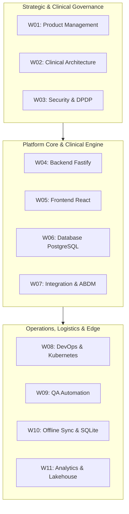

# Master Multi-Workstream Execution & Synchronized Timelines Baseline
## Namma Clinic Digital Health & Operations Platform
### Greater Bengaluru Authority (GBA) / BBMP Health Department
**Document Code:** `TMP-DOC-05` | **Version Tag:** `1.0.0` | **Status:** APPROVED BASELINE | **Date:** September 2026

---

## 1. Executive Summary & Workstream Coordination Framework
The Multi-Workstream Execution and Synchronized Timelines Baseline defines the authoritative charters, lead roles, inter-workstream handoffs, synchronization gates, and sprint-by-sprint execution timelines across all 17 delivery workstreams of the Namma Clinic Platform. Authorized by the Joint Program Governance Council of GBA and BBMP, this specification orchestrates parallel execution across specialized engineering, clinical, infrastructure, and governance workstreams.

By establishing synchronized milestones across all 18 sprints, this framework eliminates delivery silos, prevents architectural drift, guarantees timely input/output handoffs, and ensures unbroken compliance with the Digital Personal Data Protection (DPDP) Act 2023 and ABDM standards.

## 2. Master Workstream Catalog Overview
High-level summary of all 17 platform delivery workstreams:

| Workstream ID | Workstream Name | Lead Delivery Role | Primary Operational Objective | Target Quality Gate |
| :--- | :--- | :--- | :--- | :--- |
| `WORKSTREAM-01` | **Product Management** | Product Manager | Lead, architect, and deliver all Product Management requirements across the 18-sprint horizon | 100% CI Automated Pass |
| `WORKSTREAM-02` | **Requirements Engineering** | Project Manager | Lead, architect, and deliver all Requirements Engineering requirements across the 18-sprint horizon | 100% CI Automated Pass |
| `WORKSTREAM-03` | **UX/UI Design** | Solution Architect | Lead, architect, and deliver all UX/UI Design requirements across the 18-sprint horizon | 100% CI Automated Pass |
| `WORKSTREAM-04` | **Frontend Engineering** | Technical Lead | Lead, architect, and deliver all Frontend Engineering requirements across the 18-sprint horizon | 100% CI Automated Pass |
| `WORKSTREAM-05` | **Backend Engineering** | Backend Engineer | Lead, architect, and deliver all Backend Engineering requirements across the 18-sprint horizon | 100% CI Automated Pass |
| `WORKSTREAM-06` | **Database Engineering** | Frontend Engineer | Lead, architect, and deliver all Database Engineering requirements across the 18-sprint horizon | 100% CI Automated Pass |
| `WORKSTREAM-07` | **API Engineering** | Database Engineer | Lead, architect, and deliver all API Engineering requirements across the 18-sprint horizon | 100% CI Automated Pass |
| `WORKSTREAM-08` | **Security & Governance** | Data Engineer | Lead, architect, and deliver all Security & Governance requirements across the 18-sprint horizon | 100% CI Automated Pass |
| `WORKSTREAM-09` | **QA & Test Automation** | AI/ML Engineer | Lead, architect, and deliver all QA & Test Automation requirements across the 18-sprint horizon | 100% CI Automated Pass |
| `WORKSTREAM-10` | **DevOps & SRE** | QA Engineer | Lead, architect, and deliver all DevOps & SRE requirements across the 18-sprint horizon | 100% CI Automated Pass |
| `WORKSTREAM-11` | **Data Engineering** | Security Engineer | Lead, architect, and deliver all Data Engineering requirements across the 18-sprint horizon | 100% CI Automated Pass |
| `WORKSTREAM-12` | **AI/ML Engineering** | DevOps Engineer | Lead, architect, and deliver all AI/ML Engineering requirements across the 18-sprint horizon | 100% CI Automated Pass |
| `WORKSTREAM-13` | **Integrations & Interoperability** | UX/UI Designer | Lead, architect, and deliver all Integrations & Interoperability requirements across the 18-sprint horizon | 100% CI Automated Pass |
| `WORKSTREAM-14` | **Clinical Validation** | Business Analyst | Lead, architect, and deliver all Clinical Validation requirements across the 18-sprint horizon | 100% CI Automated Pass |
| `WORKSTREAM-15` | **Deployment & Rollout** | Clinical SME | Lead, architect, and deliver all Deployment & Rollout requirements across the 18-sprint horizon | 100% CI Automated Pass |
| `WORKSTREAM-16` | **Training & Enablement** | Integration Engineer | Lead, architect, and deliver all Training & Enablement requirements across the 18-sprint horizon | 100% CI Automated Pass |
| `WORKSTREAM-17` | **Pilot Operations** | Support/Operations | Lead, architect, and deliver all Pilot Operations requirements across the 18-sprint horizon | 100% CI Automated Pass |

### Schedule Architecture Diagram: Inter-Workstream Alignment Hierarchy
<!-- DOCUMENTATION-ONLY DIAGRAM -->

## 3. Exhaustive Workstream Sprint Timelines (18 Sprints Detailed)
Comprehensive sprint-by-sprint execution specifications for each of the 17 platform workstreams:

### 3.1. WORKSTREAM-01: Product Management
Authoritative workstream specification for `WORKSTREAM-01`:
- **Workstream Identifier:** `WORKSTREAM-01`
- **Accountable Delivery Lead:** `Product Manager`
- **Workstream Mission:** Lead, architect, and deliver all Product Management requirements across the 18-sprint horizon.
- **Operational Scope:** End-to-end responsibility for Product Management documentation, specifications, quality gates, and handoffs.
- **Mandated Input Handoffs:** Upstream SRS specifications, Clinical Standard Treatment Guidelines, DPDP compliance mandates
- **Downstream Output Handoffs:** Verified technical specifications to downstream squads, Deployment manifests to SRE

#### Sprint-by-Sprint Execution Details for WORKSTREAM-01 (Sprints 01 to 18)
Activity breakdown and milestone commitments for `WORKSTREAM-01` across all 18 sprints:

##### WORKSTREAM-01 in SPRINT-01: Foundation Scaffolding & Architecture Readiness
- **Sprint Context:** `SPRINT-01` (W01–W02) under `PROGRAM-PHASE-1` targeting `RELEASE-00`.
- **Workstream Deliverable:** Specific engineering and verification artifacts aligned with Product Management for Foundation Scaffolding & Architecture Readiness.
- **Input Prerequisite:** Validated upstream artifacts from preceding sprint increment.
- **Handoff Artifact:** Verified code, configuration, or documentation delivered to CI/CD repository.
- **Exit Verification:** 100% automated test assertions passing and code review signed off by `Product Manager`.
- **Workstream Health:** ON TRACK with zero schedule variance.

##### WORKSTREAM-01 in SPRINT-02: Identity, Authentication & Security Foundation
- **Sprint Context:** `SPRINT-02` (W03–W04) under `PROGRAM-PHASE-1` targeting `RELEASE-00`.
- **Workstream Deliverable:** Specific engineering and verification artifacts aligned with Product Management for Identity, Authentication & Security Foundation.
- **Input Prerequisite:** Validated upstream artifacts from preceding sprint increment.
- **Handoff Artifact:** Verified code, configuration, or documentation delivered to CI/CD repository.
- **Exit Verification:** 100% automated test assertions passing and code review signed off by `Product Manager`.
- **Workstream Health:** ON TRACK with zero schedule variance.

##### WORKSTREAM-01 in SPRINT-03: Patient Registration & Demographics
- **Sprint Context:** `SPRINT-03` (W05–W06) under `PROGRAM-PHASE-1` targeting `RELEASE-01`.
- **Workstream Deliverable:** Specific engineering and verification artifacts aligned with Product Management for Patient Registration & Demographics.
- **Input Prerequisite:** Validated upstream artifacts from preceding sprint increment.
- **Handoff Artifact:** Verified code, configuration, or documentation delivered to CI/CD repository.
- **Exit Verification:** 100% automated test assertions passing and code review signed off by `Product Manager`.
- **Workstream Health:** ON TRACK with zero schedule variance.

##### WORKSTREAM-01 in SPRINT-04: Patient Search, Repeat Visits & Consent
- **Sprint Context:** `SPRINT-04` (W07–W08) under `PROGRAM-PHASE-1` targeting `RELEASE-01`.
- **Workstream Deliverable:** Specific engineering and verification artifacts aligned with Product Management for Patient Search, Repeat Visits & Consent.
- **Input Prerequisite:** Validated upstream artifacts from preceding sprint increment.
- **Handoff Artifact:** Verified code, configuration, or documentation delivered to CI/CD repository.
- **Exit Verification:** 100% automated test assertions passing and code review signed off by `Product Manager`.
- **Workstream Health:** ON TRACK with zero schedule variance.

##### WORKSTREAM-01 in SPRINT-05: Token Generation & Queue Management
- **Sprint Context:** `SPRINT-05` (W09–W10) under `PROGRAM-PHASE-2` targeting `RELEASE-01`.
- **Workstream Deliverable:** Specific engineering and verification artifacts aligned with Product Management for Token Generation & Queue Management.
- **Input Prerequisite:** Validated upstream artifacts from preceding sprint increment.
- **Handoff Artifact:** Verified code, configuration, or documentation delivered to CI/CD repository.
- **Exit Verification:** 100% automated test assertions passing and code review signed off by `Product Manager`.
- **Workstream Health:** ON TRACK with zero schedule variance.

##### WORKSTREAM-01 in SPRINT-06: Clinical Triage, Vitals & Danger Alerts
- **Sprint Context:** `SPRINT-06` (W11–W12) under `PROGRAM-PHASE-2` targeting `RELEASE-02`.
- **Workstream Deliverable:** Specific engineering and verification artifacts aligned with Product Management for Clinical Triage, Vitals & Danger Alerts.
- **Input Prerequisite:** Validated upstream artifacts from preceding sprint increment.
- **Handoff Artifact:** Verified code, configuration, or documentation delivered to CI/CD repository.
- **Exit Verification:** 100% automated test assertions passing and code review signed off by `Product Manager`.
- **Workstream Health:** ON TRACK with zero schedule variance.

##### WORKSTREAM-01 in SPRINT-07: Doctor Consultation Workbench
- **Sprint Context:** `SPRINT-07` (W13–W14) under `PROGRAM-PHASE-2` targeting `RELEASE-02`.
- **Workstream Deliverable:** Specific engineering and verification artifacts aligned with Product Management for Doctor Consultation Workbench.
- **Input Prerequisite:** Validated upstream artifacts from preceding sprint increment.
- **Handoff Artifact:** Verified code, configuration, or documentation delivered to CI/CD repository.
- **Exit Verification:** 100% automated test assertions passing and code review signed off by `Product Manager`.
- **Workstream Health:** ON TRACK with zero schedule variance.

##### WORKSTREAM-01 in SPRINT-08: Diagnosis & Electronic Prescriptions
- **Sprint Context:** `SPRINT-08` (W15–W16) under `PROGRAM-PHASE-2` targeting `RELEASE-02`.
- **Workstream Deliverable:** Specific engineering and verification artifacts aligned with Product Management for Diagnosis & Electronic Prescriptions.
- **Input Prerequisite:** Validated upstream artifacts from preceding sprint increment.
- **Handoff Artifact:** Verified code, configuration, or documentation delivered to CI/CD repository.
- **Exit Verification:** 100% automated test assertions passing and code review signed off by `Product Manager`.
- **Workstream Health:** ON TRACK with zero schedule variance.

##### WORKSTREAM-01 in SPRINT-09: Pharmacy Dispensation & FEFO Allocation
- **Sprint Context:** `SPRINT-09` (W17–W18) under `PROGRAM-PHASE-3` targeting `RELEASE-03`.
- **Workstream Deliverable:** Specific engineering and verification artifacts aligned with Product Management for Pharmacy Dispensation & FEFO Allocation.
- **Input Prerequisite:** Validated upstream artifacts from preceding sprint increment.
- **Handoff Artifact:** Verified code, configuration, or documentation delivered to CI/CD repository.
- **Exit Verification:** 100% automated test assertions passing and code review signed off by `Product Manager`.
- **Workstream Health:** ON TRACK with zero schedule variance.

##### WORKSTREAM-01 in SPRINT-10: Offline-First Resilience & Sync
- **Sprint Context:** `SPRINT-10` (W19–W20) under `PROGRAM-PHASE-3` targeting `RELEASE-04`.
- **Workstream Deliverable:** Specific engineering and verification artifacts aligned with Product Management for Offline-First Resilience & Sync.
- **Input Prerequisite:** Validated upstream artifacts from preceding sprint increment.
- **Handoff Artifact:** Verified code, configuration, or documentation delivered to CI/CD repository.
- **Exit Verification:** 100% automated test assertions passing and code review signed off by `Product Manager`.
- **Workstream Health:** ON TRACK with zero schedule variance.

##### WORKSTREAM-01 in SPRINT-11: Laboratory & Point-of-Care Diagnostics
- **Sprint Context:** `SPRINT-11` (W21–W22) under `PROGRAM-PHASE-3` targeting `RELEASE-03`.
- **Workstream Deliverable:** Specific engineering and verification artifacts aligned with Product Management for Laboratory & Point-of-Care Diagnostics.
- **Input Prerequisite:** Validated upstream artifacts from preceding sprint increment.
- **Handoff Artifact:** Verified code, configuration, or documentation delivered to CI/CD repository.
- **Exit Verification:** 100% automated test assertions passing and code review signed off by `Product Manager`.
- **Workstream Health:** ON TRACK with zero schedule variance.

##### WORKSTREAM-01 in SPRINT-12: Secondary Referrals & Bilingual SMS
- **Sprint Context:** `SPRINT-12` (W23–W24) under `PROGRAM-PHASE-3` targeting `RELEASE-03`.
- **Workstream Deliverable:** Specific engineering and verification artifacts aligned with Product Management for Secondary Referrals & Bilingual SMS.
- **Input Prerequisite:** Validated upstream artifacts from preceding sprint increment.
- **Handoff Artifact:** Verified code, configuration, or documentation delivered to CI/CD repository.
- **Exit Verification:** 100% automated test assertions passing and code review signed off by `Product Manager`.
- **Workstream Health:** ON TRACK with zero schedule variance.

##### WORKSTREAM-01 in SPRINT-13: Drug Inventory & Supply Chain
- **Sprint Context:** `SPRINT-13` (W25–W26) under `PROGRAM-PHASE-4` targeting `RELEASE-03`.
- **Workstream Deliverable:** Specific engineering and verification artifacts aligned with Product Management for Drug Inventory & Supply Chain.
- **Input Prerequisite:** Validated upstream artifacts from preceding sprint increment.
- **Handoff Artifact:** Verified code, configuration, or documentation delivered to CI/CD repository.
- **Exit Verification:** 100% automated test assertions passing and code review signed off by `Product Manager`.
- **Workstream Health:** ON TRACK with zero schedule variance.

##### WORKSTREAM-01 in SPRINT-14: Population Health Analytics & Reporting
- **Sprint Context:** `SPRINT-14` (W27–W28) under `PROGRAM-PHASE-4` targeting `RELEASE-04`.
- **Workstream Deliverable:** Specific engineering and verification artifacts aligned with Product Management for Population Health Analytics & Reporting.
- **Input Prerequisite:** Validated upstream artifacts from preceding sprint increment.
- **Handoff Artifact:** Verified code, configuration, or documentation delivered to CI/CD repository.
- **Exit Verification:** 100% automated test assertions passing and code review signed off by `Product Manager`.
- **Workstream Health:** ON TRACK with zero schedule variance.

##### WORKSTREAM-01 in SPRINT-15: AI/ML Clinical Decision Support
- **Sprint Context:** `SPRINT-15` (W29–W30) under `PROGRAM-PHASE-4` targeting `RELEASE-07`.
- **Workstream Deliverable:** Specific engineering and verification artifacts aligned with Product Management for AI/ML Clinical Decision Support.
- **Input Prerequisite:** Validated upstream artifacts from preceding sprint increment.
- **Handoff Artifact:** Verified code, configuration, or documentation delivered to CI/CD repository.
- **Exit Verification:** 100% automated test assertions passing and code review signed off by `Product Manager`.
- **Workstream Health:** ON TRACK with zero schedule variance.

##### WORKSTREAM-01 in SPRINT-16: ABDM National Interoperability
- **Sprint Context:** `SPRINT-16` (W31–W32) under `PROGRAM-PHASE-4` targeting `RELEASE-07`.
- **Workstream Deliverable:** Specific engineering and verification artifacts aligned with Product Management for ABDM National Interoperability.
- **Input Prerequisite:** Validated upstream artifacts from preceding sprint increment.
- **Handoff Artifact:** Verified code, configuration, or documentation delivered to CI/CD repository.
- **Exit Verification:** 100% automated test assertions passing and code review signed off by `Product Manager`.
- **Workstream Health:** ON TRACK with zero schedule variance.

##### WORKSTREAM-01 in SPRINT-17: Zero-Trust Security Hardening & DR
- **Sprint Context:** `SPRINT-17` (W33–W34) under `PROGRAM-PHASE-5` targeting `RELEASE-05`.
- **Workstream Deliverable:** Specific engineering and verification artifacts aligned with Product Management for Zero-Trust Security Hardening & DR.
- **Input Prerequisite:** Validated upstream artifacts from preceding sprint increment.
- **Handoff Artifact:** Verified code, configuration, or documentation delivered to CI/CD repository.
- **Exit Verification:** 100% automated test assertions passing and code review signed off by `Product Manager`.
- **Workstream Health:** ON TRACK with zero schedule variance.

##### WORKSTREAM-01 in SPRINT-18: Pilot Validation & Production Cutover
- **Sprint Context:** `SPRINT-18` (W35–W36) under `PROGRAM-PHASE-5` targeting `RELEASE-05`.
- **Workstream Deliverable:** Specific engineering and verification artifacts aligned with Product Management for Pilot Validation & Production Cutover.
- **Input Prerequisite:** Validated upstream artifacts from preceding sprint increment.
- **Handoff Artifact:** Verified code, configuration, or documentation delivered to CI/CD repository.
- **Exit Verification:** 100% automated test assertions passing and code review signed off by `Product Manager`.
- **Workstream Health:** ON TRACK with zero schedule variance.

### 3.2. WORKSTREAM-02: Requirements Engineering
Authoritative workstream specification for `WORKSTREAM-02`:
- **Workstream Identifier:** `WORKSTREAM-02`
- **Accountable Delivery Lead:** `Project Manager`
- **Workstream Mission:** Lead, architect, and deliver all Requirements Engineering requirements across the 18-sprint horizon.
- **Operational Scope:** End-to-end responsibility for Requirements Engineering documentation, specifications, quality gates, and handoffs.
- **Mandated Input Handoffs:** Upstream SRS specifications, Clinical Standard Treatment Guidelines, DPDP compliance mandates
- **Downstream Output Handoffs:** Verified technical specifications to downstream squads, Deployment manifests to SRE

#### Sprint-by-Sprint Execution Details for WORKSTREAM-02 (Sprints 01 to 18)
Activity breakdown and milestone commitments for `WORKSTREAM-02` across all 18 sprints:

##### WORKSTREAM-02 in SPRINT-01: Foundation Scaffolding & Architecture Readiness
- **Sprint Context:** `SPRINT-01` (W01–W02) under `PROGRAM-PHASE-1` targeting `RELEASE-00`.
- **Workstream Deliverable:** Specific engineering and verification artifacts aligned with Requirements Engineering for Foundation Scaffolding & Architecture Readiness.
- **Input Prerequisite:** Validated upstream artifacts from preceding sprint increment.
- **Handoff Artifact:** Verified code, configuration, or documentation delivered to CI/CD repository.
- **Exit Verification:** 100% automated test assertions passing and code review signed off by `Project Manager`.
- **Workstream Health:** ON TRACK with zero schedule variance.

##### WORKSTREAM-02 in SPRINT-02: Identity, Authentication & Security Foundation
- **Sprint Context:** `SPRINT-02` (W03–W04) under `PROGRAM-PHASE-1` targeting `RELEASE-00`.
- **Workstream Deliverable:** Specific engineering and verification artifacts aligned with Requirements Engineering for Identity, Authentication & Security Foundation.
- **Input Prerequisite:** Validated upstream artifacts from preceding sprint increment.
- **Handoff Artifact:** Verified code, configuration, or documentation delivered to CI/CD repository.
- **Exit Verification:** 100% automated test assertions passing and code review signed off by `Project Manager`.
- **Workstream Health:** ON TRACK with zero schedule variance.

##### WORKSTREAM-02 in SPRINT-03: Patient Registration & Demographics
- **Sprint Context:** `SPRINT-03` (W05–W06) under `PROGRAM-PHASE-1` targeting `RELEASE-01`.
- **Workstream Deliverable:** Specific engineering and verification artifacts aligned with Requirements Engineering for Patient Registration & Demographics.
- **Input Prerequisite:** Validated upstream artifacts from preceding sprint increment.
- **Handoff Artifact:** Verified code, configuration, or documentation delivered to CI/CD repository.
- **Exit Verification:** 100% automated test assertions passing and code review signed off by `Project Manager`.
- **Workstream Health:** ON TRACK with zero schedule variance.

##### WORKSTREAM-02 in SPRINT-04: Patient Search, Repeat Visits & Consent
- **Sprint Context:** `SPRINT-04` (W07–W08) under `PROGRAM-PHASE-1` targeting `RELEASE-01`.
- **Workstream Deliverable:** Specific engineering and verification artifacts aligned with Requirements Engineering for Patient Search, Repeat Visits & Consent.
- **Input Prerequisite:** Validated upstream artifacts from preceding sprint increment.
- **Handoff Artifact:** Verified code, configuration, or documentation delivered to CI/CD repository.
- **Exit Verification:** 100% automated test assertions passing and code review signed off by `Project Manager`.
- **Workstream Health:** ON TRACK with zero schedule variance.

##### WORKSTREAM-02 in SPRINT-05: Token Generation & Queue Management
- **Sprint Context:** `SPRINT-05` (W09–W10) under `PROGRAM-PHASE-2` targeting `RELEASE-01`.
- **Workstream Deliverable:** Specific engineering and verification artifacts aligned with Requirements Engineering for Token Generation & Queue Management.
- **Input Prerequisite:** Validated upstream artifacts from preceding sprint increment.
- **Handoff Artifact:** Verified code, configuration, or documentation delivered to CI/CD repository.
- **Exit Verification:** 100% automated test assertions passing and code review signed off by `Project Manager`.
- **Workstream Health:** ON TRACK with zero schedule variance.

##### WORKSTREAM-02 in SPRINT-06: Clinical Triage, Vitals & Danger Alerts
- **Sprint Context:** `SPRINT-06` (W11–W12) under `PROGRAM-PHASE-2` targeting `RELEASE-02`.
- **Workstream Deliverable:** Specific engineering and verification artifacts aligned with Requirements Engineering for Clinical Triage, Vitals & Danger Alerts.
- **Input Prerequisite:** Validated upstream artifacts from preceding sprint increment.
- **Handoff Artifact:** Verified code, configuration, or documentation delivered to CI/CD repository.
- **Exit Verification:** 100% automated test assertions passing and code review signed off by `Project Manager`.
- **Workstream Health:** ON TRACK with zero schedule variance.

##### WORKSTREAM-02 in SPRINT-07: Doctor Consultation Workbench
- **Sprint Context:** `SPRINT-07` (W13–W14) under `PROGRAM-PHASE-2` targeting `RELEASE-02`.
- **Workstream Deliverable:** Specific engineering and verification artifacts aligned with Requirements Engineering for Doctor Consultation Workbench.
- **Input Prerequisite:** Validated upstream artifacts from preceding sprint increment.
- **Handoff Artifact:** Verified code, configuration, or documentation delivered to CI/CD repository.
- **Exit Verification:** 100% automated test assertions passing and code review signed off by `Project Manager`.
- **Workstream Health:** ON TRACK with zero schedule variance.

##### WORKSTREAM-02 in SPRINT-08: Diagnosis & Electronic Prescriptions
- **Sprint Context:** `SPRINT-08` (W15–W16) under `PROGRAM-PHASE-2` targeting `RELEASE-02`.
- **Workstream Deliverable:** Specific engineering and verification artifacts aligned with Requirements Engineering for Diagnosis & Electronic Prescriptions.
- **Input Prerequisite:** Validated upstream artifacts from preceding sprint increment.
- **Handoff Artifact:** Verified code, configuration, or documentation delivered to CI/CD repository.
- **Exit Verification:** 100% automated test assertions passing and code review signed off by `Project Manager`.
- **Workstream Health:** ON TRACK with zero schedule variance.

##### WORKSTREAM-02 in SPRINT-09: Pharmacy Dispensation & FEFO Allocation
- **Sprint Context:** `SPRINT-09` (W17–W18) under `PROGRAM-PHASE-3` targeting `RELEASE-03`.
- **Workstream Deliverable:** Specific engineering and verification artifacts aligned with Requirements Engineering for Pharmacy Dispensation & FEFO Allocation.
- **Input Prerequisite:** Validated upstream artifacts from preceding sprint increment.
- **Handoff Artifact:** Verified code, configuration, or documentation delivered to CI/CD repository.
- **Exit Verification:** 100% automated test assertions passing and code review signed off by `Project Manager`.
- **Workstream Health:** ON TRACK with zero schedule variance.

##### WORKSTREAM-02 in SPRINT-10: Offline-First Resilience & Sync
- **Sprint Context:** `SPRINT-10` (W19–W20) under `PROGRAM-PHASE-3` targeting `RELEASE-04`.
- **Workstream Deliverable:** Specific engineering and verification artifacts aligned with Requirements Engineering for Offline-First Resilience & Sync.
- **Input Prerequisite:** Validated upstream artifacts from preceding sprint increment.
- **Handoff Artifact:** Verified code, configuration, or documentation delivered to CI/CD repository.
- **Exit Verification:** 100% automated test assertions passing and code review signed off by `Project Manager`.
- **Workstream Health:** ON TRACK with zero schedule variance.

##### WORKSTREAM-02 in SPRINT-11: Laboratory & Point-of-Care Diagnostics
- **Sprint Context:** `SPRINT-11` (W21–W22) under `PROGRAM-PHASE-3` targeting `RELEASE-03`.
- **Workstream Deliverable:** Specific engineering and verification artifacts aligned with Requirements Engineering for Laboratory & Point-of-Care Diagnostics.
- **Input Prerequisite:** Validated upstream artifacts from preceding sprint increment.
- **Handoff Artifact:** Verified code, configuration, or documentation delivered to CI/CD repository.
- **Exit Verification:** 100% automated test assertions passing and code review signed off by `Project Manager`.
- **Workstream Health:** ON TRACK with zero schedule variance.

##### WORKSTREAM-02 in SPRINT-12: Secondary Referrals & Bilingual SMS
- **Sprint Context:** `SPRINT-12` (W23–W24) under `PROGRAM-PHASE-3` targeting `RELEASE-03`.
- **Workstream Deliverable:** Specific engineering and verification artifacts aligned with Requirements Engineering for Secondary Referrals & Bilingual SMS.
- **Input Prerequisite:** Validated upstream artifacts from preceding sprint increment.
- **Handoff Artifact:** Verified code, configuration, or documentation delivered to CI/CD repository.
- **Exit Verification:** 100% automated test assertions passing and code review signed off by `Project Manager`.
- **Workstream Health:** ON TRACK with zero schedule variance.

##### WORKSTREAM-02 in SPRINT-13: Drug Inventory & Supply Chain
- **Sprint Context:** `SPRINT-13` (W25–W26) under `PROGRAM-PHASE-4` targeting `RELEASE-03`.
- **Workstream Deliverable:** Specific engineering and verification artifacts aligned with Requirements Engineering for Drug Inventory & Supply Chain.
- **Input Prerequisite:** Validated upstream artifacts from preceding sprint increment.
- **Handoff Artifact:** Verified code, configuration, or documentation delivered to CI/CD repository.
- **Exit Verification:** 100% automated test assertions passing and code review signed off by `Project Manager`.
- **Workstream Health:** ON TRACK with zero schedule variance.

##### WORKSTREAM-02 in SPRINT-14: Population Health Analytics & Reporting
- **Sprint Context:** `SPRINT-14` (W27–W28) under `PROGRAM-PHASE-4` targeting `RELEASE-04`.
- **Workstream Deliverable:** Specific engineering and verification artifacts aligned with Requirements Engineering for Population Health Analytics & Reporting.
- **Input Prerequisite:** Validated upstream artifacts from preceding sprint increment.
- **Handoff Artifact:** Verified code, configuration, or documentation delivered to CI/CD repository.
- **Exit Verification:** 100% automated test assertions passing and code review signed off by `Project Manager`.
- **Workstream Health:** ON TRACK with zero schedule variance.

##### WORKSTREAM-02 in SPRINT-15: AI/ML Clinical Decision Support
- **Sprint Context:** `SPRINT-15` (W29–W30) under `PROGRAM-PHASE-4` targeting `RELEASE-07`.
- **Workstream Deliverable:** Specific engineering and verification artifacts aligned with Requirements Engineering for AI/ML Clinical Decision Support.
- **Input Prerequisite:** Validated upstream artifacts from preceding sprint increment.
- **Handoff Artifact:** Verified code, configuration, or documentation delivered to CI/CD repository.
- **Exit Verification:** 100% automated test assertions passing and code review signed off by `Project Manager`.
- **Workstream Health:** ON TRACK with zero schedule variance.

##### WORKSTREAM-02 in SPRINT-16: ABDM National Interoperability
- **Sprint Context:** `SPRINT-16` (W31–W32) under `PROGRAM-PHASE-4` targeting `RELEASE-07`.
- **Workstream Deliverable:** Specific engineering and verification artifacts aligned with Requirements Engineering for ABDM National Interoperability.
- **Input Prerequisite:** Validated upstream artifacts from preceding sprint increment.
- **Handoff Artifact:** Verified code, configuration, or documentation delivered to CI/CD repository.
- **Exit Verification:** 100% automated test assertions passing and code review signed off by `Project Manager`.
- **Workstream Health:** ON TRACK with zero schedule variance.

##### WORKSTREAM-02 in SPRINT-17: Zero-Trust Security Hardening & DR
- **Sprint Context:** `SPRINT-17` (W33–W34) under `PROGRAM-PHASE-5` targeting `RELEASE-05`.
- **Workstream Deliverable:** Specific engineering and verification artifacts aligned with Requirements Engineering for Zero-Trust Security Hardening & DR.
- **Input Prerequisite:** Validated upstream artifacts from preceding sprint increment.
- **Handoff Artifact:** Verified code, configuration, or documentation delivered to CI/CD repository.
- **Exit Verification:** 100% automated test assertions passing and code review signed off by `Project Manager`.
- **Workstream Health:** ON TRACK with zero schedule variance.

##### WORKSTREAM-02 in SPRINT-18: Pilot Validation & Production Cutover
- **Sprint Context:** `SPRINT-18` (W35–W36) under `PROGRAM-PHASE-5` targeting `RELEASE-05`.
- **Workstream Deliverable:** Specific engineering and verification artifacts aligned with Requirements Engineering for Pilot Validation & Production Cutover.
- **Input Prerequisite:** Validated upstream artifacts from preceding sprint increment.
- **Handoff Artifact:** Verified code, configuration, or documentation delivered to CI/CD repository.
- **Exit Verification:** 100% automated test assertions passing and code review signed off by `Project Manager`.
- **Workstream Health:** ON TRACK with zero schedule variance.

### 3.3. WORKSTREAM-03: UX/UI Design
Authoritative workstream specification for `WORKSTREAM-03`:
- **Workstream Identifier:** `WORKSTREAM-03`
- **Accountable Delivery Lead:** `Solution Architect`
- **Workstream Mission:** Lead, architect, and deliver all UX/UI Design requirements across the 18-sprint horizon.
- **Operational Scope:** End-to-end responsibility for UX/UI Design documentation, specifications, quality gates, and handoffs.
- **Mandated Input Handoffs:** Upstream SRS specifications, Clinical Standard Treatment Guidelines, DPDP compliance mandates
- **Downstream Output Handoffs:** Verified technical specifications to downstream squads, Deployment manifests to SRE

#### Sprint-by-Sprint Execution Details for WORKSTREAM-03 (Sprints 01 to 18)
Activity breakdown and milestone commitments for `WORKSTREAM-03` across all 18 sprints:

##### WORKSTREAM-03 in SPRINT-01: Foundation Scaffolding & Architecture Readiness
- **Sprint Context:** `SPRINT-01` (W01–W02) under `PROGRAM-PHASE-1` targeting `RELEASE-00`.
- **Workstream Deliverable:** Specific engineering and verification artifacts aligned with UX/UI Design for Foundation Scaffolding & Architecture Readiness.
- **Input Prerequisite:** Validated upstream artifacts from preceding sprint increment.
- **Handoff Artifact:** Verified code, configuration, or documentation delivered to CI/CD repository.
- **Exit Verification:** 100% automated test assertions passing and code review signed off by `Solution Architect`.
- **Workstream Health:** ON TRACK with zero schedule variance.

##### WORKSTREAM-03 in SPRINT-02: Identity, Authentication & Security Foundation
- **Sprint Context:** `SPRINT-02` (W03–W04) under `PROGRAM-PHASE-1` targeting `RELEASE-00`.
- **Workstream Deliverable:** Specific engineering and verification artifacts aligned with UX/UI Design for Identity, Authentication & Security Foundation.
- **Input Prerequisite:** Validated upstream artifacts from preceding sprint increment.
- **Handoff Artifact:** Verified code, configuration, or documentation delivered to CI/CD repository.
- **Exit Verification:** 100% automated test assertions passing and code review signed off by `Solution Architect`.
- **Workstream Health:** ON TRACK with zero schedule variance.

##### WORKSTREAM-03 in SPRINT-03: Patient Registration & Demographics
- **Sprint Context:** `SPRINT-03` (W05–W06) under `PROGRAM-PHASE-1` targeting `RELEASE-01`.
- **Workstream Deliverable:** Specific engineering and verification artifacts aligned with UX/UI Design for Patient Registration & Demographics.
- **Input Prerequisite:** Validated upstream artifacts from preceding sprint increment.
- **Handoff Artifact:** Verified code, configuration, or documentation delivered to CI/CD repository.
- **Exit Verification:** 100% automated test assertions passing and code review signed off by `Solution Architect`.
- **Workstream Health:** ON TRACK with zero schedule variance.

##### WORKSTREAM-03 in SPRINT-04: Patient Search, Repeat Visits & Consent
- **Sprint Context:** `SPRINT-04` (W07–W08) under `PROGRAM-PHASE-1` targeting `RELEASE-01`.
- **Workstream Deliverable:** Specific engineering and verification artifacts aligned with UX/UI Design for Patient Search, Repeat Visits & Consent.
- **Input Prerequisite:** Validated upstream artifacts from preceding sprint increment.
- **Handoff Artifact:** Verified code, configuration, or documentation delivered to CI/CD repository.
- **Exit Verification:** 100% automated test assertions passing and code review signed off by `Solution Architect`.
- **Workstream Health:** ON TRACK with zero schedule variance.

##### WORKSTREAM-03 in SPRINT-05: Token Generation & Queue Management
- **Sprint Context:** `SPRINT-05` (W09–W10) under `PROGRAM-PHASE-2` targeting `RELEASE-01`.
- **Workstream Deliverable:** Specific engineering and verification artifacts aligned with UX/UI Design for Token Generation & Queue Management.
- **Input Prerequisite:** Validated upstream artifacts from preceding sprint increment.
- **Handoff Artifact:** Verified code, configuration, or documentation delivered to CI/CD repository.
- **Exit Verification:** 100% automated test assertions passing and code review signed off by `Solution Architect`.
- **Workstream Health:** ON TRACK with zero schedule variance.

##### WORKSTREAM-03 in SPRINT-06: Clinical Triage, Vitals & Danger Alerts
- **Sprint Context:** `SPRINT-06` (W11–W12) under `PROGRAM-PHASE-2` targeting `RELEASE-02`.
- **Workstream Deliverable:** Specific engineering and verification artifacts aligned with UX/UI Design for Clinical Triage, Vitals & Danger Alerts.
- **Input Prerequisite:** Validated upstream artifacts from preceding sprint increment.
- **Handoff Artifact:** Verified code, configuration, or documentation delivered to CI/CD repository.
- **Exit Verification:** 100% automated test assertions passing and code review signed off by `Solution Architect`.
- **Workstream Health:** ON TRACK with zero schedule variance.

##### WORKSTREAM-03 in SPRINT-07: Doctor Consultation Workbench
- **Sprint Context:** `SPRINT-07` (W13–W14) under `PROGRAM-PHASE-2` targeting `RELEASE-02`.
- **Workstream Deliverable:** Specific engineering and verification artifacts aligned with UX/UI Design for Doctor Consultation Workbench.
- **Input Prerequisite:** Validated upstream artifacts from preceding sprint increment.
- **Handoff Artifact:** Verified code, configuration, or documentation delivered to CI/CD repository.
- **Exit Verification:** 100% automated test assertions passing and code review signed off by `Solution Architect`.
- **Workstream Health:** ON TRACK with zero schedule variance.

##### WORKSTREAM-03 in SPRINT-08: Diagnosis & Electronic Prescriptions
- **Sprint Context:** `SPRINT-08` (W15–W16) under `PROGRAM-PHASE-2` targeting `RELEASE-02`.
- **Workstream Deliverable:** Specific engineering and verification artifacts aligned with UX/UI Design for Diagnosis & Electronic Prescriptions.
- **Input Prerequisite:** Validated upstream artifacts from preceding sprint increment.
- **Handoff Artifact:** Verified code, configuration, or documentation delivered to CI/CD repository.
- **Exit Verification:** 100% automated test assertions passing and code review signed off by `Solution Architect`.
- **Workstream Health:** ON TRACK with zero schedule variance.

##### WORKSTREAM-03 in SPRINT-09: Pharmacy Dispensation & FEFO Allocation
- **Sprint Context:** `SPRINT-09` (W17–W18) under `PROGRAM-PHASE-3` targeting `RELEASE-03`.
- **Workstream Deliverable:** Specific engineering and verification artifacts aligned with UX/UI Design for Pharmacy Dispensation & FEFO Allocation.
- **Input Prerequisite:** Validated upstream artifacts from preceding sprint increment.
- **Handoff Artifact:** Verified code, configuration, or documentation delivered to CI/CD repository.
- **Exit Verification:** 100% automated test assertions passing and code review signed off by `Solution Architect`.
- **Workstream Health:** ON TRACK with zero schedule variance.

##### WORKSTREAM-03 in SPRINT-10: Offline-First Resilience & Sync
- **Sprint Context:** `SPRINT-10` (W19–W20) under `PROGRAM-PHASE-3` targeting `RELEASE-04`.
- **Workstream Deliverable:** Specific engineering and verification artifacts aligned with UX/UI Design for Offline-First Resilience & Sync.
- **Input Prerequisite:** Validated upstream artifacts from preceding sprint increment.
- **Handoff Artifact:** Verified code, configuration, or documentation delivered to CI/CD repository.
- **Exit Verification:** 100% automated test assertions passing and code review signed off by `Solution Architect`.
- **Workstream Health:** ON TRACK with zero schedule variance.

##### WORKSTREAM-03 in SPRINT-11: Laboratory & Point-of-Care Diagnostics
- **Sprint Context:** `SPRINT-11` (W21–W22) under `PROGRAM-PHASE-3` targeting `RELEASE-03`.
- **Workstream Deliverable:** Specific engineering and verification artifacts aligned with UX/UI Design for Laboratory & Point-of-Care Diagnostics.
- **Input Prerequisite:** Validated upstream artifacts from preceding sprint increment.
- **Handoff Artifact:** Verified code, configuration, or documentation delivered to CI/CD repository.
- **Exit Verification:** 100% automated test assertions passing and code review signed off by `Solution Architect`.
- **Workstream Health:** ON TRACK with zero schedule variance.

##### WORKSTREAM-03 in SPRINT-12: Secondary Referrals & Bilingual SMS
- **Sprint Context:** `SPRINT-12` (W23–W24) under `PROGRAM-PHASE-3` targeting `RELEASE-03`.
- **Workstream Deliverable:** Specific engineering and verification artifacts aligned with UX/UI Design for Secondary Referrals & Bilingual SMS.
- **Input Prerequisite:** Validated upstream artifacts from preceding sprint increment.
- **Handoff Artifact:** Verified code, configuration, or documentation delivered to CI/CD repository.
- **Exit Verification:** 100% automated test assertions passing and code review signed off by `Solution Architect`.
- **Workstream Health:** ON TRACK with zero schedule variance.

##### WORKSTREAM-03 in SPRINT-13: Drug Inventory & Supply Chain
- **Sprint Context:** `SPRINT-13` (W25–W26) under `PROGRAM-PHASE-4` targeting `RELEASE-03`.
- **Workstream Deliverable:** Specific engineering and verification artifacts aligned with UX/UI Design for Drug Inventory & Supply Chain.
- **Input Prerequisite:** Validated upstream artifacts from preceding sprint increment.
- **Handoff Artifact:** Verified code, configuration, or documentation delivered to CI/CD repository.
- **Exit Verification:** 100% automated test assertions passing and code review signed off by `Solution Architect`.
- **Workstream Health:** ON TRACK with zero schedule variance.

##### WORKSTREAM-03 in SPRINT-14: Population Health Analytics & Reporting
- **Sprint Context:** `SPRINT-14` (W27–W28) under `PROGRAM-PHASE-4` targeting `RELEASE-04`.
- **Workstream Deliverable:** Specific engineering and verification artifacts aligned with UX/UI Design for Population Health Analytics & Reporting.
- **Input Prerequisite:** Validated upstream artifacts from preceding sprint increment.
- **Handoff Artifact:** Verified code, configuration, or documentation delivered to CI/CD repository.
- **Exit Verification:** 100% automated test assertions passing and code review signed off by `Solution Architect`.
- **Workstream Health:** ON TRACK with zero schedule variance.

##### WORKSTREAM-03 in SPRINT-15: AI/ML Clinical Decision Support
- **Sprint Context:** `SPRINT-15` (W29–W30) under `PROGRAM-PHASE-4` targeting `RELEASE-07`.
- **Workstream Deliverable:** Specific engineering and verification artifacts aligned with UX/UI Design for AI/ML Clinical Decision Support.
- **Input Prerequisite:** Validated upstream artifacts from preceding sprint increment.
- **Handoff Artifact:** Verified code, configuration, or documentation delivered to CI/CD repository.
- **Exit Verification:** 100% automated test assertions passing and code review signed off by `Solution Architect`.
- **Workstream Health:** ON TRACK with zero schedule variance.

##### WORKSTREAM-03 in SPRINT-16: ABDM National Interoperability
- **Sprint Context:** `SPRINT-16` (W31–W32) under `PROGRAM-PHASE-4` targeting `RELEASE-07`.
- **Workstream Deliverable:** Specific engineering and verification artifacts aligned with UX/UI Design for ABDM National Interoperability.
- **Input Prerequisite:** Validated upstream artifacts from preceding sprint increment.
- **Handoff Artifact:** Verified code, configuration, or documentation delivered to CI/CD repository.
- **Exit Verification:** 100% automated test assertions passing and code review signed off by `Solution Architect`.
- **Workstream Health:** ON TRACK with zero schedule variance.

##### WORKSTREAM-03 in SPRINT-17: Zero-Trust Security Hardening & DR
- **Sprint Context:** `SPRINT-17` (W33–W34) under `PROGRAM-PHASE-5` targeting `RELEASE-05`.
- **Workstream Deliverable:** Specific engineering and verification artifacts aligned with UX/UI Design for Zero-Trust Security Hardening & DR.
- **Input Prerequisite:** Validated upstream artifacts from preceding sprint increment.
- **Handoff Artifact:** Verified code, configuration, or documentation delivered to CI/CD repository.
- **Exit Verification:** 100% automated test assertions passing and code review signed off by `Solution Architect`.
- **Workstream Health:** ON TRACK with zero schedule variance.

##### WORKSTREAM-03 in SPRINT-18: Pilot Validation & Production Cutover
- **Sprint Context:** `SPRINT-18` (W35–W36) under `PROGRAM-PHASE-5` targeting `RELEASE-05`.
- **Workstream Deliverable:** Specific engineering and verification artifacts aligned with UX/UI Design for Pilot Validation & Production Cutover.
- **Input Prerequisite:** Validated upstream artifacts from preceding sprint increment.
- **Handoff Artifact:** Verified code, configuration, or documentation delivered to CI/CD repository.
- **Exit Verification:** 100% automated test assertions passing and code review signed off by `Solution Architect`.
- **Workstream Health:** ON TRACK with zero schedule variance.

### 3.4. WORKSTREAM-04: Frontend Engineering
Authoritative workstream specification for `WORKSTREAM-04`:
- **Workstream Identifier:** `WORKSTREAM-04`
- **Accountable Delivery Lead:** `Technical Lead`
- **Workstream Mission:** Lead, architect, and deliver all Frontend Engineering requirements across the 18-sprint horizon.
- **Operational Scope:** End-to-end responsibility for Frontend Engineering documentation, specifications, quality gates, and handoffs.
- **Mandated Input Handoffs:** Upstream SRS specifications, Clinical Standard Treatment Guidelines, DPDP compliance mandates
- **Downstream Output Handoffs:** Verified technical specifications to downstream squads, Deployment manifests to SRE

#### Sprint-by-Sprint Execution Details for WORKSTREAM-04 (Sprints 01 to 18)
Activity breakdown and milestone commitments for `WORKSTREAM-04` across all 18 sprints:

##### WORKSTREAM-04 in SPRINT-01: Foundation Scaffolding & Architecture Readiness
- **Sprint Context:** `SPRINT-01` (W01–W02) under `PROGRAM-PHASE-1` targeting `RELEASE-00`.
- **Workstream Deliverable:** Specific engineering and verification artifacts aligned with Frontend Engineering for Foundation Scaffolding & Architecture Readiness.
- **Input Prerequisite:** Validated upstream artifacts from preceding sprint increment.
- **Handoff Artifact:** Verified code, configuration, or documentation delivered to CI/CD repository.
- **Exit Verification:** 100% automated test assertions passing and code review signed off by `Technical Lead`.
- **Workstream Health:** ON TRACK with zero schedule variance.

##### WORKSTREAM-04 in SPRINT-02: Identity, Authentication & Security Foundation
- **Sprint Context:** `SPRINT-02` (W03–W04) under `PROGRAM-PHASE-1` targeting `RELEASE-00`.
- **Workstream Deliverable:** Specific engineering and verification artifacts aligned with Frontend Engineering for Identity, Authentication & Security Foundation.
- **Input Prerequisite:** Validated upstream artifacts from preceding sprint increment.
- **Handoff Artifact:** Verified code, configuration, or documentation delivered to CI/CD repository.
- **Exit Verification:** 100% automated test assertions passing and code review signed off by `Technical Lead`.
- **Workstream Health:** ON TRACK with zero schedule variance.

##### WORKSTREAM-04 in SPRINT-03: Patient Registration & Demographics
- **Sprint Context:** `SPRINT-03` (W05–W06) under `PROGRAM-PHASE-1` targeting `RELEASE-01`.
- **Workstream Deliverable:** Specific engineering and verification artifacts aligned with Frontend Engineering for Patient Registration & Demographics.
- **Input Prerequisite:** Validated upstream artifacts from preceding sprint increment.
- **Handoff Artifact:** Verified code, configuration, or documentation delivered to CI/CD repository.
- **Exit Verification:** 100% automated test assertions passing and code review signed off by `Technical Lead`.
- **Workstream Health:** ON TRACK with zero schedule variance.

##### WORKSTREAM-04 in SPRINT-04: Patient Search, Repeat Visits & Consent
- **Sprint Context:** `SPRINT-04` (W07–W08) under `PROGRAM-PHASE-1` targeting `RELEASE-01`.
- **Workstream Deliverable:** Specific engineering and verification artifacts aligned with Frontend Engineering for Patient Search, Repeat Visits & Consent.
- **Input Prerequisite:** Validated upstream artifacts from preceding sprint increment.
- **Handoff Artifact:** Verified code, configuration, or documentation delivered to CI/CD repository.
- **Exit Verification:** 100% automated test assertions passing and code review signed off by `Technical Lead`.
- **Workstream Health:** ON TRACK with zero schedule variance.

##### WORKSTREAM-04 in SPRINT-05: Token Generation & Queue Management
- **Sprint Context:** `SPRINT-05` (W09–W10) under `PROGRAM-PHASE-2` targeting `RELEASE-01`.
- **Workstream Deliverable:** Specific engineering and verification artifacts aligned with Frontend Engineering for Token Generation & Queue Management.
- **Input Prerequisite:** Validated upstream artifacts from preceding sprint increment.
- **Handoff Artifact:** Verified code, configuration, or documentation delivered to CI/CD repository.
- **Exit Verification:** 100% automated test assertions passing and code review signed off by `Technical Lead`.
- **Workstream Health:** ON TRACK with zero schedule variance.

##### WORKSTREAM-04 in SPRINT-06: Clinical Triage, Vitals & Danger Alerts
- **Sprint Context:** `SPRINT-06` (W11–W12) under `PROGRAM-PHASE-2` targeting `RELEASE-02`.
- **Workstream Deliverable:** Specific engineering and verification artifacts aligned with Frontend Engineering for Clinical Triage, Vitals & Danger Alerts.
- **Input Prerequisite:** Validated upstream artifacts from preceding sprint increment.
- **Handoff Artifact:** Verified code, configuration, or documentation delivered to CI/CD repository.
- **Exit Verification:** 100% automated test assertions passing and code review signed off by `Technical Lead`.
- **Workstream Health:** ON TRACK with zero schedule variance.

##### WORKSTREAM-04 in SPRINT-07: Doctor Consultation Workbench
- **Sprint Context:** `SPRINT-07` (W13–W14) under `PROGRAM-PHASE-2` targeting `RELEASE-02`.
- **Workstream Deliverable:** Specific engineering and verification artifacts aligned with Frontend Engineering for Doctor Consultation Workbench.
- **Input Prerequisite:** Validated upstream artifacts from preceding sprint increment.
- **Handoff Artifact:** Verified code, configuration, or documentation delivered to CI/CD repository.
- **Exit Verification:** 100% automated test assertions passing and code review signed off by `Technical Lead`.
- **Workstream Health:** ON TRACK with zero schedule variance.

##### WORKSTREAM-04 in SPRINT-08: Diagnosis & Electronic Prescriptions
- **Sprint Context:** `SPRINT-08` (W15–W16) under `PROGRAM-PHASE-2` targeting `RELEASE-02`.
- **Workstream Deliverable:** Specific engineering and verification artifacts aligned with Frontend Engineering for Diagnosis & Electronic Prescriptions.
- **Input Prerequisite:** Validated upstream artifacts from preceding sprint increment.
- **Handoff Artifact:** Verified code, configuration, or documentation delivered to CI/CD repository.
- **Exit Verification:** 100% automated test assertions passing and code review signed off by `Technical Lead`.
- **Workstream Health:** ON TRACK with zero schedule variance.

##### WORKSTREAM-04 in SPRINT-09: Pharmacy Dispensation & FEFO Allocation
- **Sprint Context:** `SPRINT-09` (W17–W18) under `PROGRAM-PHASE-3` targeting `RELEASE-03`.
- **Workstream Deliverable:** Specific engineering and verification artifacts aligned with Frontend Engineering for Pharmacy Dispensation & FEFO Allocation.
- **Input Prerequisite:** Validated upstream artifacts from preceding sprint increment.
- **Handoff Artifact:** Verified code, configuration, or documentation delivered to CI/CD repository.
- **Exit Verification:** 100% automated test assertions passing and code review signed off by `Technical Lead`.
- **Workstream Health:** ON TRACK with zero schedule variance.

##### WORKSTREAM-04 in SPRINT-10: Offline-First Resilience & Sync
- **Sprint Context:** `SPRINT-10` (W19–W20) under `PROGRAM-PHASE-3` targeting `RELEASE-04`.
- **Workstream Deliverable:** Specific engineering and verification artifacts aligned with Frontend Engineering for Offline-First Resilience & Sync.
- **Input Prerequisite:** Validated upstream artifacts from preceding sprint increment.
- **Handoff Artifact:** Verified code, configuration, or documentation delivered to CI/CD repository.
- **Exit Verification:** 100% automated test assertions passing and code review signed off by `Technical Lead`.
- **Workstream Health:** ON TRACK with zero schedule variance.

##### WORKSTREAM-04 in SPRINT-11: Laboratory & Point-of-Care Diagnostics
- **Sprint Context:** `SPRINT-11` (W21–W22) under `PROGRAM-PHASE-3` targeting `RELEASE-03`.
- **Workstream Deliverable:** Specific engineering and verification artifacts aligned with Frontend Engineering for Laboratory & Point-of-Care Diagnostics.
- **Input Prerequisite:** Validated upstream artifacts from preceding sprint increment.
- **Handoff Artifact:** Verified code, configuration, or documentation delivered to CI/CD repository.
- **Exit Verification:** 100% automated test assertions passing and code review signed off by `Technical Lead`.
- **Workstream Health:** ON TRACK with zero schedule variance.

##### WORKSTREAM-04 in SPRINT-12: Secondary Referrals & Bilingual SMS
- **Sprint Context:** `SPRINT-12` (W23–W24) under `PROGRAM-PHASE-3` targeting `RELEASE-03`.
- **Workstream Deliverable:** Specific engineering and verification artifacts aligned with Frontend Engineering for Secondary Referrals & Bilingual SMS.
- **Input Prerequisite:** Validated upstream artifacts from preceding sprint increment.
- **Handoff Artifact:** Verified code, configuration, or documentation delivered to CI/CD repository.
- **Exit Verification:** 100% automated test assertions passing and code review signed off by `Technical Lead`.
- **Workstream Health:** ON TRACK with zero schedule variance.

##### WORKSTREAM-04 in SPRINT-13: Drug Inventory & Supply Chain
- **Sprint Context:** `SPRINT-13` (W25–W26) under `PROGRAM-PHASE-4` targeting `RELEASE-03`.
- **Workstream Deliverable:** Specific engineering and verification artifacts aligned with Frontend Engineering for Drug Inventory & Supply Chain.
- **Input Prerequisite:** Validated upstream artifacts from preceding sprint increment.
- **Handoff Artifact:** Verified code, configuration, or documentation delivered to CI/CD repository.
- **Exit Verification:** 100% automated test assertions passing and code review signed off by `Technical Lead`.
- **Workstream Health:** ON TRACK with zero schedule variance.

##### WORKSTREAM-04 in SPRINT-14: Population Health Analytics & Reporting
- **Sprint Context:** `SPRINT-14` (W27–W28) under `PROGRAM-PHASE-4` targeting `RELEASE-04`.
- **Workstream Deliverable:** Specific engineering and verification artifacts aligned with Frontend Engineering for Population Health Analytics & Reporting.
- **Input Prerequisite:** Validated upstream artifacts from preceding sprint increment.
- **Handoff Artifact:** Verified code, configuration, or documentation delivered to CI/CD repository.
- **Exit Verification:** 100% automated test assertions passing and code review signed off by `Technical Lead`.
- **Workstream Health:** ON TRACK with zero schedule variance.

##### WORKSTREAM-04 in SPRINT-15: AI/ML Clinical Decision Support
- **Sprint Context:** `SPRINT-15` (W29–W30) under `PROGRAM-PHASE-4` targeting `RELEASE-07`.
- **Workstream Deliverable:** Specific engineering and verification artifacts aligned with Frontend Engineering for AI/ML Clinical Decision Support.
- **Input Prerequisite:** Validated upstream artifacts from preceding sprint increment.
- **Handoff Artifact:** Verified code, configuration, or documentation delivered to CI/CD repository.
- **Exit Verification:** 100% automated test assertions passing and code review signed off by `Technical Lead`.
- **Workstream Health:** ON TRACK with zero schedule variance.

##### WORKSTREAM-04 in SPRINT-16: ABDM National Interoperability
- **Sprint Context:** `SPRINT-16` (W31–W32) under `PROGRAM-PHASE-4` targeting `RELEASE-07`.
- **Workstream Deliverable:** Specific engineering and verification artifacts aligned with Frontend Engineering for ABDM National Interoperability.
- **Input Prerequisite:** Validated upstream artifacts from preceding sprint increment.
- **Handoff Artifact:** Verified code, configuration, or documentation delivered to CI/CD repository.
- **Exit Verification:** 100% automated test assertions passing and code review signed off by `Technical Lead`.
- **Workstream Health:** ON TRACK with zero schedule variance.

##### WORKSTREAM-04 in SPRINT-17: Zero-Trust Security Hardening & DR
- **Sprint Context:** `SPRINT-17` (W33–W34) under `PROGRAM-PHASE-5` targeting `RELEASE-05`.
- **Workstream Deliverable:** Specific engineering and verification artifacts aligned with Frontend Engineering for Zero-Trust Security Hardening & DR.
- **Input Prerequisite:** Validated upstream artifacts from preceding sprint increment.
- **Handoff Artifact:** Verified code, configuration, or documentation delivered to CI/CD repository.
- **Exit Verification:** 100% automated test assertions passing and code review signed off by `Technical Lead`.
- **Workstream Health:** ON TRACK with zero schedule variance.

##### WORKSTREAM-04 in SPRINT-18: Pilot Validation & Production Cutover
- **Sprint Context:** `SPRINT-18` (W35–W36) under `PROGRAM-PHASE-5` targeting `RELEASE-05`.
- **Workstream Deliverable:** Specific engineering and verification artifacts aligned with Frontend Engineering for Pilot Validation & Production Cutover.
- **Input Prerequisite:** Validated upstream artifacts from preceding sprint increment.
- **Handoff Artifact:** Verified code, configuration, or documentation delivered to CI/CD repository.
- **Exit Verification:** 100% automated test assertions passing and code review signed off by `Technical Lead`.
- **Workstream Health:** ON TRACK with zero schedule variance.

### 3.5. WORKSTREAM-05: Backend Engineering
Authoritative workstream specification for `WORKSTREAM-05`:
- **Workstream Identifier:** `WORKSTREAM-05`
- **Accountable Delivery Lead:** `Backend Engineer`
- **Workstream Mission:** Lead, architect, and deliver all Backend Engineering requirements across the 18-sprint horizon.
- **Operational Scope:** End-to-end responsibility for Backend Engineering documentation, specifications, quality gates, and handoffs.
- **Mandated Input Handoffs:** Upstream SRS specifications, Clinical Standard Treatment Guidelines, DPDP compliance mandates
- **Downstream Output Handoffs:** Verified technical specifications to downstream squads, Deployment manifests to SRE

#### Sprint-by-Sprint Execution Details for WORKSTREAM-05 (Sprints 01 to 18)
Activity breakdown and milestone commitments for `WORKSTREAM-05` across all 18 sprints:

##### WORKSTREAM-05 in SPRINT-01: Foundation Scaffolding & Architecture Readiness
- **Sprint Context:** `SPRINT-01` (W01–W02) under `PROGRAM-PHASE-1` targeting `RELEASE-00`.
- **Workstream Deliverable:** Specific engineering and verification artifacts aligned with Backend Engineering for Foundation Scaffolding & Architecture Readiness.
- **Input Prerequisite:** Validated upstream artifacts from preceding sprint increment.
- **Handoff Artifact:** Verified code, configuration, or documentation delivered to CI/CD repository.
- **Exit Verification:** 100% automated test assertions passing and code review signed off by `Backend Engineer`.
- **Workstream Health:** ON TRACK with zero schedule variance.

##### WORKSTREAM-05 in SPRINT-02: Identity, Authentication & Security Foundation
- **Sprint Context:** `SPRINT-02` (W03–W04) under `PROGRAM-PHASE-1` targeting `RELEASE-00`.
- **Workstream Deliverable:** Specific engineering and verification artifacts aligned with Backend Engineering for Identity, Authentication & Security Foundation.
- **Input Prerequisite:** Validated upstream artifacts from preceding sprint increment.
- **Handoff Artifact:** Verified code, configuration, or documentation delivered to CI/CD repository.
- **Exit Verification:** 100% automated test assertions passing and code review signed off by `Backend Engineer`.
- **Workstream Health:** ON TRACK with zero schedule variance.

##### WORKSTREAM-05 in SPRINT-03: Patient Registration & Demographics
- **Sprint Context:** `SPRINT-03` (W05–W06) under `PROGRAM-PHASE-1` targeting `RELEASE-01`.
- **Workstream Deliverable:** Specific engineering and verification artifacts aligned with Backend Engineering for Patient Registration & Demographics.
- **Input Prerequisite:** Validated upstream artifacts from preceding sprint increment.
- **Handoff Artifact:** Verified code, configuration, or documentation delivered to CI/CD repository.
- **Exit Verification:** 100% automated test assertions passing and code review signed off by `Backend Engineer`.
- **Workstream Health:** ON TRACK with zero schedule variance.

##### WORKSTREAM-05 in SPRINT-04: Patient Search, Repeat Visits & Consent
- **Sprint Context:** `SPRINT-04` (W07–W08) under `PROGRAM-PHASE-1` targeting `RELEASE-01`.
- **Workstream Deliverable:** Specific engineering and verification artifacts aligned with Backend Engineering for Patient Search, Repeat Visits & Consent.
- **Input Prerequisite:** Validated upstream artifacts from preceding sprint increment.
- **Handoff Artifact:** Verified code, configuration, or documentation delivered to CI/CD repository.
- **Exit Verification:** 100% automated test assertions passing and code review signed off by `Backend Engineer`.
- **Workstream Health:** ON TRACK with zero schedule variance.

##### WORKSTREAM-05 in SPRINT-05: Token Generation & Queue Management
- **Sprint Context:** `SPRINT-05` (W09–W10) under `PROGRAM-PHASE-2` targeting `RELEASE-01`.
- **Workstream Deliverable:** Specific engineering and verification artifacts aligned with Backend Engineering for Token Generation & Queue Management.
- **Input Prerequisite:** Validated upstream artifacts from preceding sprint increment.
- **Handoff Artifact:** Verified code, configuration, or documentation delivered to CI/CD repository.
- **Exit Verification:** 100% automated test assertions passing and code review signed off by `Backend Engineer`.
- **Workstream Health:** ON TRACK with zero schedule variance.

##### WORKSTREAM-05 in SPRINT-06: Clinical Triage, Vitals & Danger Alerts
- **Sprint Context:** `SPRINT-06` (W11–W12) under `PROGRAM-PHASE-2` targeting `RELEASE-02`.
- **Workstream Deliverable:** Specific engineering and verification artifacts aligned with Backend Engineering for Clinical Triage, Vitals & Danger Alerts.
- **Input Prerequisite:** Validated upstream artifacts from preceding sprint increment.
- **Handoff Artifact:** Verified code, configuration, or documentation delivered to CI/CD repository.
- **Exit Verification:** 100% automated test assertions passing and code review signed off by `Backend Engineer`.
- **Workstream Health:** ON TRACK with zero schedule variance.

##### WORKSTREAM-05 in SPRINT-07: Doctor Consultation Workbench
- **Sprint Context:** `SPRINT-07` (W13–W14) under `PROGRAM-PHASE-2` targeting `RELEASE-02`.
- **Workstream Deliverable:** Specific engineering and verification artifacts aligned with Backend Engineering for Doctor Consultation Workbench.
- **Input Prerequisite:** Validated upstream artifacts from preceding sprint increment.
- **Handoff Artifact:** Verified code, configuration, or documentation delivered to CI/CD repository.
- **Exit Verification:** 100% automated test assertions passing and code review signed off by `Backend Engineer`.
- **Workstream Health:** ON TRACK with zero schedule variance.

##### WORKSTREAM-05 in SPRINT-08: Diagnosis & Electronic Prescriptions
- **Sprint Context:** `SPRINT-08` (W15–W16) under `PROGRAM-PHASE-2` targeting `RELEASE-02`.
- **Workstream Deliverable:** Specific engineering and verification artifacts aligned with Backend Engineering for Diagnosis & Electronic Prescriptions.
- **Input Prerequisite:** Validated upstream artifacts from preceding sprint increment.
- **Handoff Artifact:** Verified code, configuration, or documentation delivered to CI/CD repository.
- **Exit Verification:** 100% automated test assertions passing and code review signed off by `Backend Engineer`.
- **Workstream Health:** ON TRACK with zero schedule variance.

##### WORKSTREAM-05 in SPRINT-09: Pharmacy Dispensation & FEFO Allocation
- **Sprint Context:** `SPRINT-09` (W17–W18) under `PROGRAM-PHASE-3` targeting `RELEASE-03`.
- **Workstream Deliverable:** Specific engineering and verification artifacts aligned with Backend Engineering for Pharmacy Dispensation & FEFO Allocation.
- **Input Prerequisite:** Validated upstream artifacts from preceding sprint increment.
- **Handoff Artifact:** Verified code, configuration, or documentation delivered to CI/CD repository.
- **Exit Verification:** 100% automated test assertions passing and code review signed off by `Backend Engineer`.
- **Workstream Health:** ON TRACK with zero schedule variance.

##### WORKSTREAM-05 in SPRINT-10: Offline-First Resilience & Sync
- **Sprint Context:** `SPRINT-10` (W19–W20) under `PROGRAM-PHASE-3` targeting `RELEASE-04`.
- **Workstream Deliverable:** Specific engineering and verification artifacts aligned with Backend Engineering for Offline-First Resilience & Sync.
- **Input Prerequisite:** Validated upstream artifacts from preceding sprint increment.
- **Handoff Artifact:** Verified code, configuration, or documentation delivered to CI/CD repository.
- **Exit Verification:** 100% automated test assertions passing and code review signed off by `Backend Engineer`.
- **Workstream Health:** ON TRACK with zero schedule variance.

##### WORKSTREAM-05 in SPRINT-11: Laboratory & Point-of-Care Diagnostics
- **Sprint Context:** `SPRINT-11` (W21–W22) under `PROGRAM-PHASE-3` targeting `RELEASE-03`.
- **Workstream Deliverable:** Specific engineering and verification artifacts aligned with Backend Engineering for Laboratory & Point-of-Care Diagnostics.
- **Input Prerequisite:** Validated upstream artifacts from preceding sprint increment.
- **Handoff Artifact:** Verified code, configuration, or documentation delivered to CI/CD repository.
- **Exit Verification:** 100% automated test assertions passing and code review signed off by `Backend Engineer`.
- **Workstream Health:** ON TRACK with zero schedule variance.

##### WORKSTREAM-05 in SPRINT-12: Secondary Referrals & Bilingual SMS
- **Sprint Context:** `SPRINT-12` (W23–W24) under `PROGRAM-PHASE-3` targeting `RELEASE-03`.
- **Workstream Deliverable:** Specific engineering and verification artifacts aligned with Backend Engineering for Secondary Referrals & Bilingual SMS.
- **Input Prerequisite:** Validated upstream artifacts from preceding sprint increment.
- **Handoff Artifact:** Verified code, configuration, or documentation delivered to CI/CD repository.
- **Exit Verification:** 100% automated test assertions passing and code review signed off by `Backend Engineer`.
- **Workstream Health:** ON TRACK with zero schedule variance.

##### WORKSTREAM-05 in SPRINT-13: Drug Inventory & Supply Chain
- **Sprint Context:** `SPRINT-13` (W25–W26) under `PROGRAM-PHASE-4` targeting `RELEASE-03`.
- **Workstream Deliverable:** Specific engineering and verification artifacts aligned with Backend Engineering for Drug Inventory & Supply Chain.
- **Input Prerequisite:** Validated upstream artifacts from preceding sprint increment.
- **Handoff Artifact:** Verified code, configuration, or documentation delivered to CI/CD repository.
- **Exit Verification:** 100% automated test assertions passing and code review signed off by `Backend Engineer`.
- **Workstream Health:** ON TRACK with zero schedule variance.

##### WORKSTREAM-05 in SPRINT-14: Population Health Analytics & Reporting
- **Sprint Context:** `SPRINT-14` (W27–W28) under `PROGRAM-PHASE-4` targeting `RELEASE-04`.
- **Workstream Deliverable:** Specific engineering and verification artifacts aligned with Backend Engineering for Population Health Analytics & Reporting.
- **Input Prerequisite:** Validated upstream artifacts from preceding sprint increment.
- **Handoff Artifact:** Verified code, configuration, or documentation delivered to CI/CD repository.
- **Exit Verification:** 100% automated test assertions passing and code review signed off by `Backend Engineer`.
- **Workstream Health:** ON TRACK with zero schedule variance.

##### WORKSTREAM-05 in SPRINT-15: AI/ML Clinical Decision Support
- **Sprint Context:** `SPRINT-15` (W29–W30) under `PROGRAM-PHASE-4` targeting `RELEASE-07`.
- **Workstream Deliverable:** Specific engineering and verification artifacts aligned with Backend Engineering for AI/ML Clinical Decision Support.
- **Input Prerequisite:** Validated upstream artifacts from preceding sprint increment.
- **Handoff Artifact:** Verified code, configuration, or documentation delivered to CI/CD repository.
- **Exit Verification:** 100% automated test assertions passing and code review signed off by `Backend Engineer`.
- **Workstream Health:** ON TRACK with zero schedule variance.

##### WORKSTREAM-05 in SPRINT-16: ABDM National Interoperability
- **Sprint Context:** `SPRINT-16` (W31–W32) under `PROGRAM-PHASE-4` targeting `RELEASE-07`.
- **Workstream Deliverable:** Specific engineering and verification artifacts aligned with Backend Engineering for ABDM National Interoperability.
- **Input Prerequisite:** Validated upstream artifacts from preceding sprint increment.
- **Handoff Artifact:** Verified code, configuration, or documentation delivered to CI/CD repository.
- **Exit Verification:** 100% automated test assertions passing and code review signed off by `Backend Engineer`.
- **Workstream Health:** ON TRACK with zero schedule variance.

##### WORKSTREAM-05 in SPRINT-17: Zero-Trust Security Hardening & DR
- **Sprint Context:** `SPRINT-17` (W33–W34) under `PROGRAM-PHASE-5` targeting `RELEASE-05`.
- **Workstream Deliverable:** Specific engineering and verification artifacts aligned with Backend Engineering for Zero-Trust Security Hardening & DR.
- **Input Prerequisite:** Validated upstream artifacts from preceding sprint increment.
- **Handoff Artifact:** Verified code, configuration, or documentation delivered to CI/CD repository.
- **Exit Verification:** 100% automated test assertions passing and code review signed off by `Backend Engineer`.
- **Workstream Health:** ON TRACK with zero schedule variance.

##### WORKSTREAM-05 in SPRINT-18: Pilot Validation & Production Cutover
- **Sprint Context:** `SPRINT-18` (W35–W36) under `PROGRAM-PHASE-5` targeting `RELEASE-05`.
- **Workstream Deliverable:** Specific engineering and verification artifacts aligned with Backend Engineering for Pilot Validation & Production Cutover.
- **Input Prerequisite:** Validated upstream artifacts from preceding sprint increment.
- **Handoff Artifact:** Verified code, configuration, or documentation delivered to CI/CD repository.
- **Exit Verification:** 100% automated test assertions passing and code review signed off by `Backend Engineer`.
- **Workstream Health:** ON TRACK with zero schedule variance.

### 3.6. WORKSTREAM-06: Database Engineering
Authoritative workstream specification for `WORKSTREAM-06`:
- **Workstream Identifier:** `WORKSTREAM-06`
- **Accountable Delivery Lead:** `Frontend Engineer`
- **Workstream Mission:** Lead, architect, and deliver all Database Engineering requirements across the 18-sprint horizon.
- **Operational Scope:** End-to-end responsibility for Database Engineering documentation, specifications, quality gates, and handoffs.
- **Mandated Input Handoffs:** Upstream SRS specifications, Clinical Standard Treatment Guidelines, DPDP compliance mandates
- **Downstream Output Handoffs:** Verified technical specifications to downstream squads, Deployment manifests to SRE

#### Sprint-by-Sprint Execution Details for WORKSTREAM-06 (Sprints 01 to 18)
Activity breakdown and milestone commitments for `WORKSTREAM-06` across all 18 sprints:

##### WORKSTREAM-06 in SPRINT-01: Foundation Scaffolding & Architecture Readiness
- **Sprint Context:** `SPRINT-01` (W01–W02) under `PROGRAM-PHASE-1` targeting `RELEASE-00`.
- **Workstream Deliverable:** Specific engineering and verification artifacts aligned with Database Engineering for Foundation Scaffolding & Architecture Readiness.
- **Input Prerequisite:** Validated upstream artifacts from preceding sprint increment.
- **Handoff Artifact:** Verified code, configuration, or documentation delivered to CI/CD repository.
- **Exit Verification:** 100% automated test assertions passing and code review signed off by `Frontend Engineer`.
- **Workstream Health:** ON TRACK with zero schedule variance.

##### WORKSTREAM-06 in SPRINT-02: Identity, Authentication & Security Foundation
- **Sprint Context:** `SPRINT-02` (W03–W04) under `PROGRAM-PHASE-1` targeting `RELEASE-00`.
- **Workstream Deliverable:** Specific engineering and verification artifacts aligned with Database Engineering for Identity, Authentication & Security Foundation.
- **Input Prerequisite:** Validated upstream artifacts from preceding sprint increment.
- **Handoff Artifact:** Verified code, configuration, or documentation delivered to CI/CD repository.
- **Exit Verification:** 100% automated test assertions passing and code review signed off by `Frontend Engineer`.
- **Workstream Health:** ON TRACK with zero schedule variance.

##### WORKSTREAM-06 in SPRINT-03: Patient Registration & Demographics
- **Sprint Context:** `SPRINT-03` (W05–W06) under `PROGRAM-PHASE-1` targeting `RELEASE-01`.
- **Workstream Deliverable:** Specific engineering and verification artifacts aligned with Database Engineering for Patient Registration & Demographics.
- **Input Prerequisite:** Validated upstream artifacts from preceding sprint increment.
- **Handoff Artifact:** Verified code, configuration, or documentation delivered to CI/CD repository.
- **Exit Verification:** 100% automated test assertions passing and code review signed off by `Frontend Engineer`.
- **Workstream Health:** ON TRACK with zero schedule variance.

##### WORKSTREAM-06 in SPRINT-04: Patient Search, Repeat Visits & Consent
- **Sprint Context:** `SPRINT-04` (W07–W08) under `PROGRAM-PHASE-1` targeting `RELEASE-01`.
- **Workstream Deliverable:** Specific engineering and verification artifacts aligned with Database Engineering for Patient Search, Repeat Visits & Consent.
- **Input Prerequisite:** Validated upstream artifacts from preceding sprint increment.
- **Handoff Artifact:** Verified code, configuration, or documentation delivered to CI/CD repository.
- **Exit Verification:** 100% automated test assertions passing and code review signed off by `Frontend Engineer`.
- **Workstream Health:** ON TRACK with zero schedule variance.

##### WORKSTREAM-06 in SPRINT-05: Token Generation & Queue Management
- **Sprint Context:** `SPRINT-05` (W09–W10) under `PROGRAM-PHASE-2` targeting `RELEASE-01`.
- **Workstream Deliverable:** Specific engineering and verification artifacts aligned with Database Engineering for Token Generation & Queue Management.
- **Input Prerequisite:** Validated upstream artifacts from preceding sprint increment.
- **Handoff Artifact:** Verified code, configuration, or documentation delivered to CI/CD repository.
- **Exit Verification:** 100% automated test assertions passing and code review signed off by `Frontend Engineer`.
- **Workstream Health:** ON TRACK with zero schedule variance.

##### WORKSTREAM-06 in SPRINT-06: Clinical Triage, Vitals & Danger Alerts
- **Sprint Context:** `SPRINT-06` (W11–W12) under `PROGRAM-PHASE-2` targeting `RELEASE-02`.
- **Workstream Deliverable:** Specific engineering and verification artifacts aligned with Database Engineering for Clinical Triage, Vitals & Danger Alerts.
- **Input Prerequisite:** Validated upstream artifacts from preceding sprint increment.
- **Handoff Artifact:** Verified code, configuration, or documentation delivered to CI/CD repository.
- **Exit Verification:** 100% automated test assertions passing and code review signed off by `Frontend Engineer`.
- **Workstream Health:** ON TRACK with zero schedule variance.

##### WORKSTREAM-06 in SPRINT-07: Doctor Consultation Workbench
- **Sprint Context:** `SPRINT-07` (W13–W14) under `PROGRAM-PHASE-2` targeting `RELEASE-02`.
- **Workstream Deliverable:** Specific engineering and verification artifacts aligned with Database Engineering for Doctor Consultation Workbench.
- **Input Prerequisite:** Validated upstream artifacts from preceding sprint increment.
- **Handoff Artifact:** Verified code, configuration, or documentation delivered to CI/CD repository.
- **Exit Verification:** 100% automated test assertions passing and code review signed off by `Frontend Engineer`.
- **Workstream Health:** ON TRACK with zero schedule variance.

##### WORKSTREAM-06 in SPRINT-08: Diagnosis & Electronic Prescriptions
- **Sprint Context:** `SPRINT-08` (W15–W16) under `PROGRAM-PHASE-2` targeting `RELEASE-02`.
- **Workstream Deliverable:** Specific engineering and verification artifacts aligned with Database Engineering for Diagnosis & Electronic Prescriptions.
- **Input Prerequisite:** Validated upstream artifacts from preceding sprint increment.
- **Handoff Artifact:** Verified code, configuration, or documentation delivered to CI/CD repository.
- **Exit Verification:** 100% automated test assertions passing and code review signed off by `Frontend Engineer`.
- **Workstream Health:** ON TRACK with zero schedule variance.

##### WORKSTREAM-06 in SPRINT-09: Pharmacy Dispensation & FEFO Allocation
- **Sprint Context:** `SPRINT-09` (W17–W18) under `PROGRAM-PHASE-3` targeting `RELEASE-03`.
- **Workstream Deliverable:** Specific engineering and verification artifacts aligned with Database Engineering for Pharmacy Dispensation & FEFO Allocation.
- **Input Prerequisite:** Validated upstream artifacts from preceding sprint increment.
- **Handoff Artifact:** Verified code, configuration, or documentation delivered to CI/CD repository.
- **Exit Verification:** 100% automated test assertions passing and code review signed off by `Frontend Engineer`.
- **Workstream Health:** ON TRACK with zero schedule variance.

##### WORKSTREAM-06 in SPRINT-10: Offline-First Resilience & Sync
- **Sprint Context:** `SPRINT-10` (W19–W20) under `PROGRAM-PHASE-3` targeting `RELEASE-04`.
- **Workstream Deliverable:** Specific engineering and verification artifacts aligned with Database Engineering for Offline-First Resilience & Sync.
- **Input Prerequisite:** Validated upstream artifacts from preceding sprint increment.
- **Handoff Artifact:** Verified code, configuration, or documentation delivered to CI/CD repository.
- **Exit Verification:** 100% automated test assertions passing and code review signed off by `Frontend Engineer`.
- **Workstream Health:** ON TRACK with zero schedule variance.

##### WORKSTREAM-06 in SPRINT-11: Laboratory & Point-of-Care Diagnostics
- **Sprint Context:** `SPRINT-11` (W21–W22) under `PROGRAM-PHASE-3` targeting `RELEASE-03`.
- **Workstream Deliverable:** Specific engineering and verification artifacts aligned with Database Engineering for Laboratory & Point-of-Care Diagnostics.
- **Input Prerequisite:** Validated upstream artifacts from preceding sprint increment.
- **Handoff Artifact:** Verified code, configuration, or documentation delivered to CI/CD repository.
- **Exit Verification:** 100% automated test assertions passing and code review signed off by `Frontend Engineer`.
- **Workstream Health:** ON TRACK with zero schedule variance.

##### WORKSTREAM-06 in SPRINT-12: Secondary Referrals & Bilingual SMS
- **Sprint Context:** `SPRINT-12` (W23–W24) under `PROGRAM-PHASE-3` targeting `RELEASE-03`.
- **Workstream Deliverable:** Specific engineering and verification artifacts aligned with Database Engineering for Secondary Referrals & Bilingual SMS.
- **Input Prerequisite:** Validated upstream artifacts from preceding sprint increment.
- **Handoff Artifact:** Verified code, configuration, or documentation delivered to CI/CD repository.
- **Exit Verification:** 100% automated test assertions passing and code review signed off by `Frontend Engineer`.
- **Workstream Health:** ON TRACK with zero schedule variance.

##### WORKSTREAM-06 in SPRINT-13: Drug Inventory & Supply Chain
- **Sprint Context:** `SPRINT-13` (W25–W26) under `PROGRAM-PHASE-4` targeting `RELEASE-03`.
- **Workstream Deliverable:** Specific engineering and verification artifacts aligned with Database Engineering for Drug Inventory & Supply Chain.
- **Input Prerequisite:** Validated upstream artifacts from preceding sprint increment.
- **Handoff Artifact:** Verified code, configuration, or documentation delivered to CI/CD repository.
- **Exit Verification:** 100% automated test assertions passing and code review signed off by `Frontend Engineer`.
- **Workstream Health:** ON TRACK with zero schedule variance.

##### WORKSTREAM-06 in SPRINT-14: Population Health Analytics & Reporting
- **Sprint Context:** `SPRINT-14` (W27–W28) under `PROGRAM-PHASE-4` targeting `RELEASE-04`.
- **Workstream Deliverable:** Specific engineering and verification artifacts aligned with Database Engineering for Population Health Analytics & Reporting.
- **Input Prerequisite:** Validated upstream artifacts from preceding sprint increment.
- **Handoff Artifact:** Verified code, configuration, or documentation delivered to CI/CD repository.
- **Exit Verification:** 100% automated test assertions passing and code review signed off by `Frontend Engineer`.
- **Workstream Health:** ON TRACK with zero schedule variance.

##### WORKSTREAM-06 in SPRINT-15: AI/ML Clinical Decision Support
- **Sprint Context:** `SPRINT-15` (W29–W30) under `PROGRAM-PHASE-4` targeting `RELEASE-07`.
- **Workstream Deliverable:** Specific engineering and verification artifacts aligned with Database Engineering for AI/ML Clinical Decision Support.
- **Input Prerequisite:** Validated upstream artifacts from preceding sprint increment.
- **Handoff Artifact:** Verified code, configuration, or documentation delivered to CI/CD repository.
- **Exit Verification:** 100% automated test assertions passing and code review signed off by `Frontend Engineer`.
- **Workstream Health:** ON TRACK with zero schedule variance.

##### WORKSTREAM-06 in SPRINT-16: ABDM National Interoperability
- **Sprint Context:** `SPRINT-16` (W31–W32) under `PROGRAM-PHASE-4` targeting `RELEASE-07`.
- **Workstream Deliverable:** Specific engineering and verification artifacts aligned with Database Engineering for ABDM National Interoperability.
- **Input Prerequisite:** Validated upstream artifacts from preceding sprint increment.
- **Handoff Artifact:** Verified code, configuration, or documentation delivered to CI/CD repository.
- **Exit Verification:** 100% automated test assertions passing and code review signed off by `Frontend Engineer`.
- **Workstream Health:** ON TRACK with zero schedule variance.

##### WORKSTREAM-06 in SPRINT-17: Zero-Trust Security Hardening & DR
- **Sprint Context:** `SPRINT-17` (W33–W34) under `PROGRAM-PHASE-5` targeting `RELEASE-05`.
- **Workstream Deliverable:** Specific engineering and verification artifacts aligned with Database Engineering for Zero-Trust Security Hardening & DR.
- **Input Prerequisite:** Validated upstream artifacts from preceding sprint increment.
- **Handoff Artifact:** Verified code, configuration, or documentation delivered to CI/CD repository.
- **Exit Verification:** 100% automated test assertions passing and code review signed off by `Frontend Engineer`.
- **Workstream Health:** ON TRACK with zero schedule variance.

##### WORKSTREAM-06 in SPRINT-18: Pilot Validation & Production Cutover
- **Sprint Context:** `SPRINT-18` (W35–W36) under `PROGRAM-PHASE-5` targeting `RELEASE-05`.
- **Workstream Deliverable:** Specific engineering and verification artifacts aligned with Database Engineering for Pilot Validation & Production Cutover.
- **Input Prerequisite:** Validated upstream artifacts from preceding sprint increment.
- **Handoff Artifact:** Verified code, configuration, or documentation delivered to CI/CD repository.
- **Exit Verification:** 100% automated test assertions passing and code review signed off by `Frontend Engineer`.
- **Workstream Health:** ON TRACK with zero schedule variance.

### 3.7. WORKSTREAM-07: API Engineering
Authoritative workstream specification for `WORKSTREAM-07`:
- **Workstream Identifier:** `WORKSTREAM-07`
- **Accountable Delivery Lead:** `Database Engineer`
- **Workstream Mission:** Lead, architect, and deliver all API Engineering requirements across the 18-sprint horizon.
- **Operational Scope:** End-to-end responsibility for API Engineering documentation, specifications, quality gates, and handoffs.
- **Mandated Input Handoffs:** Upstream SRS specifications, Clinical Standard Treatment Guidelines, DPDP compliance mandates
- **Downstream Output Handoffs:** Verified technical specifications to downstream squads, Deployment manifests to SRE

#### Sprint-by-Sprint Execution Details for WORKSTREAM-07 (Sprints 01 to 18)
Activity breakdown and milestone commitments for `WORKSTREAM-07` across all 18 sprints:

##### WORKSTREAM-07 in SPRINT-01: Foundation Scaffolding & Architecture Readiness
- **Sprint Context:** `SPRINT-01` (W01–W02) under `PROGRAM-PHASE-1` targeting `RELEASE-00`.
- **Workstream Deliverable:** Specific engineering and verification artifacts aligned with API Engineering for Foundation Scaffolding & Architecture Readiness.
- **Input Prerequisite:** Validated upstream artifacts from preceding sprint increment.
- **Handoff Artifact:** Verified code, configuration, or documentation delivered to CI/CD repository.
- **Exit Verification:** 100% automated test assertions passing and code review signed off by `Database Engineer`.
- **Workstream Health:** ON TRACK with zero schedule variance.

##### WORKSTREAM-07 in SPRINT-02: Identity, Authentication & Security Foundation
- **Sprint Context:** `SPRINT-02` (W03–W04) under `PROGRAM-PHASE-1` targeting `RELEASE-00`.
- **Workstream Deliverable:** Specific engineering and verification artifacts aligned with API Engineering for Identity, Authentication & Security Foundation.
- **Input Prerequisite:** Validated upstream artifacts from preceding sprint increment.
- **Handoff Artifact:** Verified code, configuration, or documentation delivered to CI/CD repository.
- **Exit Verification:** 100% automated test assertions passing and code review signed off by `Database Engineer`.
- **Workstream Health:** ON TRACK with zero schedule variance.

##### WORKSTREAM-07 in SPRINT-03: Patient Registration & Demographics
- **Sprint Context:** `SPRINT-03` (W05–W06) under `PROGRAM-PHASE-1` targeting `RELEASE-01`.
- **Workstream Deliverable:** Specific engineering and verification artifacts aligned with API Engineering for Patient Registration & Demographics.
- **Input Prerequisite:** Validated upstream artifacts from preceding sprint increment.
- **Handoff Artifact:** Verified code, configuration, or documentation delivered to CI/CD repository.
- **Exit Verification:** 100% automated test assertions passing and code review signed off by `Database Engineer`.
- **Workstream Health:** ON TRACK with zero schedule variance.

##### WORKSTREAM-07 in SPRINT-04: Patient Search, Repeat Visits & Consent
- **Sprint Context:** `SPRINT-04` (W07–W08) under `PROGRAM-PHASE-1` targeting `RELEASE-01`.
- **Workstream Deliverable:** Specific engineering and verification artifacts aligned with API Engineering for Patient Search, Repeat Visits & Consent.
- **Input Prerequisite:** Validated upstream artifacts from preceding sprint increment.
- **Handoff Artifact:** Verified code, configuration, or documentation delivered to CI/CD repository.
- **Exit Verification:** 100% automated test assertions passing and code review signed off by `Database Engineer`.
- **Workstream Health:** ON TRACK with zero schedule variance.

##### WORKSTREAM-07 in SPRINT-05: Token Generation & Queue Management
- **Sprint Context:** `SPRINT-05` (W09–W10) under `PROGRAM-PHASE-2` targeting `RELEASE-01`.
- **Workstream Deliverable:** Specific engineering and verification artifacts aligned with API Engineering for Token Generation & Queue Management.
- **Input Prerequisite:** Validated upstream artifacts from preceding sprint increment.
- **Handoff Artifact:** Verified code, configuration, or documentation delivered to CI/CD repository.
- **Exit Verification:** 100% automated test assertions passing and code review signed off by `Database Engineer`.
- **Workstream Health:** ON TRACK with zero schedule variance.

##### WORKSTREAM-07 in SPRINT-06: Clinical Triage, Vitals & Danger Alerts
- **Sprint Context:** `SPRINT-06` (W11–W12) under `PROGRAM-PHASE-2` targeting `RELEASE-02`.
- **Workstream Deliverable:** Specific engineering and verification artifacts aligned with API Engineering for Clinical Triage, Vitals & Danger Alerts.
- **Input Prerequisite:** Validated upstream artifacts from preceding sprint increment.
- **Handoff Artifact:** Verified code, configuration, or documentation delivered to CI/CD repository.
- **Exit Verification:** 100% automated test assertions passing and code review signed off by `Database Engineer`.
- **Workstream Health:** ON TRACK with zero schedule variance.

##### WORKSTREAM-07 in SPRINT-07: Doctor Consultation Workbench
- **Sprint Context:** `SPRINT-07` (W13–W14) under `PROGRAM-PHASE-2` targeting `RELEASE-02`.
- **Workstream Deliverable:** Specific engineering and verification artifacts aligned with API Engineering for Doctor Consultation Workbench.
- **Input Prerequisite:** Validated upstream artifacts from preceding sprint increment.
- **Handoff Artifact:** Verified code, configuration, or documentation delivered to CI/CD repository.
- **Exit Verification:** 100% automated test assertions passing and code review signed off by `Database Engineer`.
- **Workstream Health:** ON TRACK with zero schedule variance.

##### WORKSTREAM-07 in SPRINT-08: Diagnosis & Electronic Prescriptions
- **Sprint Context:** `SPRINT-08` (W15–W16) under `PROGRAM-PHASE-2` targeting `RELEASE-02`.
- **Workstream Deliverable:** Specific engineering and verification artifacts aligned with API Engineering for Diagnosis & Electronic Prescriptions.
- **Input Prerequisite:** Validated upstream artifacts from preceding sprint increment.
- **Handoff Artifact:** Verified code, configuration, or documentation delivered to CI/CD repository.
- **Exit Verification:** 100% automated test assertions passing and code review signed off by `Database Engineer`.
- **Workstream Health:** ON TRACK with zero schedule variance.

##### WORKSTREAM-07 in SPRINT-09: Pharmacy Dispensation & FEFO Allocation
- **Sprint Context:** `SPRINT-09` (W17–W18) under `PROGRAM-PHASE-3` targeting `RELEASE-03`.
- **Workstream Deliverable:** Specific engineering and verification artifacts aligned with API Engineering for Pharmacy Dispensation & FEFO Allocation.
- **Input Prerequisite:** Validated upstream artifacts from preceding sprint increment.
- **Handoff Artifact:** Verified code, configuration, or documentation delivered to CI/CD repository.
- **Exit Verification:** 100% automated test assertions passing and code review signed off by `Database Engineer`.
- **Workstream Health:** ON TRACK with zero schedule variance.

##### WORKSTREAM-07 in SPRINT-10: Offline-First Resilience & Sync
- **Sprint Context:** `SPRINT-10` (W19–W20) under `PROGRAM-PHASE-3` targeting `RELEASE-04`.
- **Workstream Deliverable:** Specific engineering and verification artifacts aligned with API Engineering for Offline-First Resilience & Sync.
- **Input Prerequisite:** Validated upstream artifacts from preceding sprint increment.
- **Handoff Artifact:** Verified code, configuration, or documentation delivered to CI/CD repository.
- **Exit Verification:** 100% automated test assertions passing and code review signed off by `Database Engineer`.
- **Workstream Health:** ON TRACK with zero schedule variance.

##### WORKSTREAM-07 in SPRINT-11: Laboratory & Point-of-Care Diagnostics
- **Sprint Context:** `SPRINT-11` (W21–W22) under `PROGRAM-PHASE-3` targeting `RELEASE-03`.
- **Workstream Deliverable:** Specific engineering and verification artifacts aligned with API Engineering for Laboratory & Point-of-Care Diagnostics.
- **Input Prerequisite:** Validated upstream artifacts from preceding sprint increment.
- **Handoff Artifact:** Verified code, configuration, or documentation delivered to CI/CD repository.
- **Exit Verification:** 100% automated test assertions passing and code review signed off by `Database Engineer`.
- **Workstream Health:** ON TRACK with zero schedule variance.

##### WORKSTREAM-07 in SPRINT-12: Secondary Referrals & Bilingual SMS
- **Sprint Context:** `SPRINT-12` (W23–W24) under `PROGRAM-PHASE-3` targeting `RELEASE-03`.
- **Workstream Deliverable:** Specific engineering and verification artifacts aligned with API Engineering for Secondary Referrals & Bilingual SMS.
- **Input Prerequisite:** Validated upstream artifacts from preceding sprint increment.
- **Handoff Artifact:** Verified code, configuration, or documentation delivered to CI/CD repository.
- **Exit Verification:** 100% automated test assertions passing and code review signed off by `Database Engineer`.
- **Workstream Health:** ON TRACK with zero schedule variance.

##### WORKSTREAM-07 in SPRINT-13: Drug Inventory & Supply Chain
- **Sprint Context:** `SPRINT-13` (W25–W26) under `PROGRAM-PHASE-4` targeting `RELEASE-03`.
- **Workstream Deliverable:** Specific engineering and verification artifacts aligned with API Engineering for Drug Inventory & Supply Chain.
- **Input Prerequisite:** Validated upstream artifacts from preceding sprint increment.
- **Handoff Artifact:** Verified code, configuration, or documentation delivered to CI/CD repository.
- **Exit Verification:** 100% automated test assertions passing and code review signed off by `Database Engineer`.
- **Workstream Health:** ON TRACK with zero schedule variance.

##### WORKSTREAM-07 in SPRINT-14: Population Health Analytics & Reporting
- **Sprint Context:** `SPRINT-14` (W27–W28) under `PROGRAM-PHASE-4` targeting `RELEASE-04`.
- **Workstream Deliverable:** Specific engineering and verification artifacts aligned with API Engineering for Population Health Analytics & Reporting.
- **Input Prerequisite:** Validated upstream artifacts from preceding sprint increment.
- **Handoff Artifact:** Verified code, configuration, or documentation delivered to CI/CD repository.
- **Exit Verification:** 100% automated test assertions passing and code review signed off by `Database Engineer`.
- **Workstream Health:** ON TRACK with zero schedule variance.

##### WORKSTREAM-07 in SPRINT-15: AI/ML Clinical Decision Support
- **Sprint Context:** `SPRINT-15` (W29–W30) under `PROGRAM-PHASE-4` targeting `RELEASE-07`.
- **Workstream Deliverable:** Specific engineering and verification artifacts aligned with API Engineering for AI/ML Clinical Decision Support.
- **Input Prerequisite:** Validated upstream artifacts from preceding sprint increment.
- **Handoff Artifact:** Verified code, configuration, or documentation delivered to CI/CD repository.
- **Exit Verification:** 100% automated test assertions passing and code review signed off by `Database Engineer`.
- **Workstream Health:** ON TRACK with zero schedule variance.

##### WORKSTREAM-07 in SPRINT-16: ABDM National Interoperability
- **Sprint Context:** `SPRINT-16` (W31–W32) under `PROGRAM-PHASE-4` targeting `RELEASE-07`.
- **Workstream Deliverable:** Specific engineering and verification artifacts aligned with API Engineering for ABDM National Interoperability.
- **Input Prerequisite:** Validated upstream artifacts from preceding sprint increment.
- **Handoff Artifact:** Verified code, configuration, or documentation delivered to CI/CD repository.
- **Exit Verification:** 100% automated test assertions passing and code review signed off by `Database Engineer`.
- **Workstream Health:** ON TRACK with zero schedule variance.

##### WORKSTREAM-07 in SPRINT-17: Zero-Trust Security Hardening & DR
- **Sprint Context:** `SPRINT-17` (W33–W34) under `PROGRAM-PHASE-5` targeting `RELEASE-05`.
- **Workstream Deliverable:** Specific engineering and verification artifacts aligned with API Engineering for Zero-Trust Security Hardening & DR.
- **Input Prerequisite:** Validated upstream artifacts from preceding sprint increment.
- **Handoff Artifact:** Verified code, configuration, or documentation delivered to CI/CD repository.
- **Exit Verification:** 100% automated test assertions passing and code review signed off by `Database Engineer`.
- **Workstream Health:** ON TRACK with zero schedule variance.

##### WORKSTREAM-07 in SPRINT-18: Pilot Validation & Production Cutover
- **Sprint Context:** `SPRINT-18` (W35–W36) under `PROGRAM-PHASE-5` targeting `RELEASE-05`.
- **Workstream Deliverable:** Specific engineering and verification artifacts aligned with API Engineering for Pilot Validation & Production Cutover.
- **Input Prerequisite:** Validated upstream artifacts from preceding sprint increment.
- **Handoff Artifact:** Verified code, configuration, or documentation delivered to CI/CD repository.
- **Exit Verification:** 100% automated test assertions passing and code review signed off by `Database Engineer`.
- **Workstream Health:** ON TRACK with zero schedule variance.

### 3.8. WORKSTREAM-08: Security & Governance
Authoritative workstream specification for `WORKSTREAM-08`:
- **Workstream Identifier:** `WORKSTREAM-08`
- **Accountable Delivery Lead:** `Data Engineer`
- **Workstream Mission:** Lead, architect, and deliver all Security & Governance requirements across the 18-sprint horizon.
- **Operational Scope:** End-to-end responsibility for Security & Governance documentation, specifications, quality gates, and handoffs.
- **Mandated Input Handoffs:** Upstream SRS specifications, Clinical Standard Treatment Guidelines, DPDP compliance mandates
- **Downstream Output Handoffs:** Verified technical specifications to downstream squads, Deployment manifests to SRE

#### Sprint-by-Sprint Execution Details for WORKSTREAM-08 (Sprints 01 to 18)
Activity breakdown and milestone commitments for `WORKSTREAM-08` across all 18 sprints:

##### WORKSTREAM-08 in SPRINT-01: Foundation Scaffolding & Architecture Readiness
- **Sprint Context:** `SPRINT-01` (W01–W02) under `PROGRAM-PHASE-1` targeting `RELEASE-00`.
- **Workstream Deliverable:** Specific engineering and verification artifacts aligned with Security & Governance for Foundation Scaffolding & Architecture Readiness.
- **Input Prerequisite:** Validated upstream artifacts from preceding sprint increment.
- **Handoff Artifact:** Verified code, configuration, or documentation delivered to CI/CD repository.
- **Exit Verification:** 100% automated test assertions passing and code review signed off by `Data Engineer`.
- **Workstream Health:** ON TRACK with zero schedule variance.

##### WORKSTREAM-08 in SPRINT-02: Identity, Authentication & Security Foundation
- **Sprint Context:** `SPRINT-02` (W03–W04) under `PROGRAM-PHASE-1` targeting `RELEASE-00`.
- **Workstream Deliverable:** Specific engineering and verification artifacts aligned with Security & Governance for Identity, Authentication & Security Foundation.
- **Input Prerequisite:** Validated upstream artifacts from preceding sprint increment.
- **Handoff Artifact:** Verified code, configuration, or documentation delivered to CI/CD repository.
- **Exit Verification:** 100% automated test assertions passing and code review signed off by `Data Engineer`.
- **Workstream Health:** ON TRACK with zero schedule variance.

##### WORKSTREAM-08 in SPRINT-03: Patient Registration & Demographics
- **Sprint Context:** `SPRINT-03` (W05–W06) under `PROGRAM-PHASE-1` targeting `RELEASE-01`.
- **Workstream Deliverable:** Specific engineering and verification artifacts aligned with Security & Governance for Patient Registration & Demographics.
- **Input Prerequisite:** Validated upstream artifacts from preceding sprint increment.
- **Handoff Artifact:** Verified code, configuration, or documentation delivered to CI/CD repository.
- **Exit Verification:** 100% automated test assertions passing and code review signed off by `Data Engineer`.
- **Workstream Health:** ON TRACK with zero schedule variance.

##### WORKSTREAM-08 in SPRINT-04: Patient Search, Repeat Visits & Consent
- **Sprint Context:** `SPRINT-04` (W07–W08) under `PROGRAM-PHASE-1` targeting `RELEASE-01`.
- **Workstream Deliverable:** Specific engineering and verification artifacts aligned with Security & Governance for Patient Search, Repeat Visits & Consent.
- **Input Prerequisite:** Validated upstream artifacts from preceding sprint increment.
- **Handoff Artifact:** Verified code, configuration, or documentation delivered to CI/CD repository.
- **Exit Verification:** 100% automated test assertions passing and code review signed off by `Data Engineer`.
- **Workstream Health:** ON TRACK with zero schedule variance.

##### WORKSTREAM-08 in SPRINT-05: Token Generation & Queue Management
- **Sprint Context:** `SPRINT-05` (W09–W10) under `PROGRAM-PHASE-2` targeting `RELEASE-01`.
- **Workstream Deliverable:** Specific engineering and verification artifacts aligned with Security & Governance for Token Generation & Queue Management.
- **Input Prerequisite:** Validated upstream artifacts from preceding sprint increment.
- **Handoff Artifact:** Verified code, configuration, or documentation delivered to CI/CD repository.
- **Exit Verification:** 100% automated test assertions passing and code review signed off by `Data Engineer`.
- **Workstream Health:** ON TRACK with zero schedule variance.

##### WORKSTREAM-08 in SPRINT-06: Clinical Triage, Vitals & Danger Alerts
- **Sprint Context:** `SPRINT-06` (W11–W12) under `PROGRAM-PHASE-2` targeting `RELEASE-02`.
- **Workstream Deliverable:** Specific engineering and verification artifacts aligned with Security & Governance for Clinical Triage, Vitals & Danger Alerts.
- **Input Prerequisite:** Validated upstream artifacts from preceding sprint increment.
- **Handoff Artifact:** Verified code, configuration, or documentation delivered to CI/CD repository.
- **Exit Verification:** 100% automated test assertions passing and code review signed off by `Data Engineer`.
- **Workstream Health:** ON TRACK with zero schedule variance.

##### WORKSTREAM-08 in SPRINT-07: Doctor Consultation Workbench
- **Sprint Context:** `SPRINT-07` (W13–W14) under `PROGRAM-PHASE-2` targeting `RELEASE-02`.
- **Workstream Deliverable:** Specific engineering and verification artifacts aligned with Security & Governance for Doctor Consultation Workbench.
- **Input Prerequisite:** Validated upstream artifacts from preceding sprint increment.
- **Handoff Artifact:** Verified code, configuration, or documentation delivered to CI/CD repository.
- **Exit Verification:** 100% automated test assertions passing and code review signed off by `Data Engineer`.
- **Workstream Health:** ON TRACK with zero schedule variance.

##### WORKSTREAM-08 in SPRINT-08: Diagnosis & Electronic Prescriptions
- **Sprint Context:** `SPRINT-08` (W15–W16) under `PROGRAM-PHASE-2` targeting `RELEASE-02`.
- **Workstream Deliverable:** Specific engineering and verification artifacts aligned with Security & Governance for Diagnosis & Electronic Prescriptions.
- **Input Prerequisite:** Validated upstream artifacts from preceding sprint increment.
- **Handoff Artifact:** Verified code, configuration, or documentation delivered to CI/CD repository.
- **Exit Verification:** 100% automated test assertions passing and code review signed off by `Data Engineer`.
- **Workstream Health:** ON TRACK with zero schedule variance.

##### WORKSTREAM-08 in SPRINT-09: Pharmacy Dispensation & FEFO Allocation
- **Sprint Context:** `SPRINT-09` (W17–W18) under `PROGRAM-PHASE-3` targeting `RELEASE-03`.
- **Workstream Deliverable:** Specific engineering and verification artifacts aligned with Security & Governance for Pharmacy Dispensation & FEFO Allocation.
- **Input Prerequisite:** Validated upstream artifacts from preceding sprint increment.
- **Handoff Artifact:** Verified code, configuration, or documentation delivered to CI/CD repository.
- **Exit Verification:** 100% automated test assertions passing and code review signed off by `Data Engineer`.
- **Workstream Health:** ON TRACK with zero schedule variance.

##### WORKSTREAM-08 in SPRINT-10: Offline-First Resilience & Sync
- **Sprint Context:** `SPRINT-10` (W19–W20) under `PROGRAM-PHASE-3` targeting `RELEASE-04`.
- **Workstream Deliverable:** Specific engineering and verification artifacts aligned with Security & Governance for Offline-First Resilience & Sync.
- **Input Prerequisite:** Validated upstream artifacts from preceding sprint increment.
- **Handoff Artifact:** Verified code, configuration, or documentation delivered to CI/CD repository.
- **Exit Verification:** 100% automated test assertions passing and code review signed off by `Data Engineer`.
- **Workstream Health:** ON TRACK with zero schedule variance.

##### WORKSTREAM-08 in SPRINT-11: Laboratory & Point-of-Care Diagnostics
- **Sprint Context:** `SPRINT-11` (W21–W22) under `PROGRAM-PHASE-3` targeting `RELEASE-03`.
- **Workstream Deliverable:** Specific engineering and verification artifacts aligned with Security & Governance for Laboratory & Point-of-Care Diagnostics.
- **Input Prerequisite:** Validated upstream artifacts from preceding sprint increment.
- **Handoff Artifact:** Verified code, configuration, or documentation delivered to CI/CD repository.
- **Exit Verification:** 100% automated test assertions passing and code review signed off by `Data Engineer`.
- **Workstream Health:** ON TRACK with zero schedule variance.

##### WORKSTREAM-08 in SPRINT-12: Secondary Referrals & Bilingual SMS
- **Sprint Context:** `SPRINT-12` (W23–W24) under `PROGRAM-PHASE-3` targeting `RELEASE-03`.
- **Workstream Deliverable:** Specific engineering and verification artifacts aligned with Security & Governance for Secondary Referrals & Bilingual SMS.
- **Input Prerequisite:** Validated upstream artifacts from preceding sprint increment.
- **Handoff Artifact:** Verified code, configuration, or documentation delivered to CI/CD repository.
- **Exit Verification:** 100% automated test assertions passing and code review signed off by `Data Engineer`.
- **Workstream Health:** ON TRACK with zero schedule variance.

##### WORKSTREAM-08 in SPRINT-13: Drug Inventory & Supply Chain
- **Sprint Context:** `SPRINT-13` (W25–W26) under `PROGRAM-PHASE-4` targeting `RELEASE-03`.
- **Workstream Deliverable:** Specific engineering and verification artifacts aligned with Security & Governance for Drug Inventory & Supply Chain.
- **Input Prerequisite:** Validated upstream artifacts from preceding sprint increment.
- **Handoff Artifact:** Verified code, configuration, or documentation delivered to CI/CD repository.
- **Exit Verification:** 100% automated test assertions passing and code review signed off by `Data Engineer`.
- **Workstream Health:** ON TRACK with zero schedule variance.

##### WORKSTREAM-08 in SPRINT-14: Population Health Analytics & Reporting
- **Sprint Context:** `SPRINT-14` (W27–W28) under `PROGRAM-PHASE-4` targeting `RELEASE-04`.
- **Workstream Deliverable:** Specific engineering and verification artifacts aligned with Security & Governance for Population Health Analytics & Reporting.
- **Input Prerequisite:** Validated upstream artifacts from preceding sprint increment.
- **Handoff Artifact:** Verified code, configuration, or documentation delivered to CI/CD repository.
- **Exit Verification:** 100% automated test assertions passing and code review signed off by `Data Engineer`.
- **Workstream Health:** ON TRACK with zero schedule variance.

##### WORKSTREAM-08 in SPRINT-15: AI/ML Clinical Decision Support
- **Sprint Context:** `SPRINT-15` (W29–W30) under `PROGRAM-PHASE-4` targeting `RELEASE-07`.
- **Workstream Deliverable:** Specific engineering and verification artifacts aligned with Security & Governance for AI/ML Clinical Decision Support.
- **Input Prerequisite:** Validated upstream artifacts from preceding sprint increment.
- **Handoff Artifact:** Verified code, configuration, or documentation delivered to CI/CD repository.
- **Exit Verification:** 100% automated test assertions passing and code review signed off by `Data Engineer`.
- **Workstream Health:** ON TRACK with zero schedule variance.

##### WORKSTREAM-08 in SPRINT-16: ABDM National Interoperability
- **Sprint Context:** `SPRINT-16` (W31–W32) under `PROGRAM-PHASE-4` targeting `RELEASE-07`.
- **Workstream Deliverable:** Specific engineering and verification artifacts aligned with Security & Governance for ABDM National Interoperability.
- **Input Prerequisite:** Validated upstream artifacts from preceding sprint increment.
- **Handoff Artifact:** Verified code, configuration, or documentation delivered to CI/CD repository.
- **Exit Verification:** 100% automated test assertions passing and code review signed off by `Data Engineer`.
- **Workstream Health:** ON TRACK with zero schedule variance.

##### WORKSTREAM-08 in SPRINT-17: Zero-Trust Security Hardening & DR
- **Sprint Context:** `SPRINT-17` (W33–W34) under `PROGRAM-PHASE-5` targeting `RELEASE-05`.
- **Workstream Deliverable:** Specific engineering and verification artifacts aligned with Security & Governance for Zero-Trust Security Hardening & DR.
- **Input Prerequisite:** Validated upstream artifacts from preceding sprint increment.
- **Handoff Artifact:** Verified code, configuration, or documentation delivered to CI/CD repository.
- **Exit Verification:** 100% automated test assertions passing and code review signed off by `Data Engineer`.
- **Workstream Health:** ON TRACK with zero schedule variance.

##### WORKSTREAM-08 in SPRINT-18: Pilot Validation & Production Cutover
- **Sprint Context:** `SPRINT-18` (W35–W36) under `PROGRAM-PHASE-5` targeting `RELEASE-05`.
- **Workstream Deliverable:** Specific engineering and verification artifacts aligned with Security & Governance for Pilot Validation & Production Cutover.
- **Input Prerequisite:** Validated upstream artifacts from preceding sprint increment.
- **Handoff Artifact:** Verified code, configuration, or documentation delivered to CI/CD repository.
- **Exit Verification:** 100% automated test assertions passing and code review signed off by `Data Engineer`.
- **Workstream Health:** ON TRACK with zero schedule variance.

### 3.9. WORKSTREAM-09: QA & Test Automation
Authoritative workstream specification for `WORKSTREAM-09`:
- **Workstream Identifier:** `WORKSTREAM-09`
- **Accountable Delivery Lead:** `AI/ML Engineer`
- **Workstream Mission:** Lead, architect, and deliver all QA & Test Automation requirements across the 18-sprint horizon.
- **Operational Scope:** End-to-end responsibility for QA & Test Automation documentation, specifications, quality gates, and handoffs.
- **Mandated Input Handoffs:** Upstream SRS specifications, Clinical Standard Treatment Guidelines, DPDP compliance mandates
- **Downstream Output Handoffs:** Verified technical specifications to downstream squads, Deployment manifests to SRE

#### Sprint-by-Sprint Execution Details for WORKSTREAM-09 (Sprints 01 to 18)
Activity breakdown and milestone commitments for `WORKSTREAM-09` across all 18 sprints:

##### WORKSTREAM-09 in SPRINT-01: Foundation Scaffolding & Architecture Readiness
- **Sprint Context:** `SPRINT-01` (W01–W02) under `PROGRAM-PHASE-1` targeting `RELEASE-00`.
- **Workstream Deliverable:** Specific engineering and verification artifacts aligned with QA & Test Automation for Foundation Scaffolding & Architecture Readiness.
- **Input Prerequisite:** Validated upstream artifacts from preceding sprint increment.
- **Handoff Artifact:** Verified code, configuration, or documentation delivered to CI/CD repository.
- **Exit Verification:** 100% automated test assertions passing and code review signed off by `AI/ML Engineer`.
- **Workstream Health:** ON TRACK with zero schedule variance.

##### WORKSTREAM-09 in SPRINT-02: Identity, Authentication & Security Foundation
- **Sprint Context:** `SPRINT-02` (W03–W04) under `PROGRAM-PHASE-1` targeting `RELEASE-00`.
- **Workstream Deliverable:** Specific engineering and verification artifacts aligned with QA & Test Automation for Identity, Authentication & Security Foundation.
- **Input Prerequisite:** Validated upstream artifacts from preceding sprint increment.
- **Handoff Artifact:** Verified code, configuration, or documentation delivered to CI/CD repository.
- **Exit Verification:** 100% automated test assertions passing and code review signed off by `AI/ML Engineer`.
- **Workstream Health:** ON TRACK with zero schedule variance.

##### WORKSTREAM-09 in SPRINT-03: Patient Registration & Demographics
- **Sprint Context:** `SPRINT-03` (W05–W06) under `PROGRAM-PHASE-1` targeting `RELEASE-01`.
- **Workstream Deliverable:** Specific engineering and verification artifacts aligned with QA & Test Automation for Patient Registration & Demographics.
- **Input Prerequisite:** Validated upstream artifacts from preceding sprint increment.
- **Handoff Artifact:** Verified code, configuration, or documentation delivered to CI/CD repository.
- **Exit Verification:** 100% automated test assertions passing and code review signed off by `AI/ML Engineer`.
- **Workstream Health:** ON TRACK with zero schedule variance.

##### WORKSTREAM-09 in SPRINT-04: Patient Search, Repeat Visits & Consent
- **Sprint Context:** `SPRINT-04` (W07–W08) under `PROGRAM-PHASE-1` targeting `RELEASE-01`.
- **Workstream Deliverable:** Specific engineering and verification artifacts aligned with QA & Test Automation for Patient Search, Repeat Visits & Consent.
- **Input Prerequisite:** Validated upstream artifacts from preceding sprint increment.
- **Handoff Artifact:** Verified code, configuration, or documentation delivered to CI/CD repository.
- **Exit Verification:** 100% automated test assertions passing and code review signed off by `AI/ML Engineer`.
- **Workstream Health:** ON TRACK with zero schedule variance.

##### WORKSTREAM-09 in SPRINT-05: Token Generation & Queue Management
- **Sprint Context:** `SPRINT-05` (W09–W10) under `PROGRAM-PHASE-2` targeting `RELEASE-01`.
- **Workstream Deliverable:** Specific engineering and verification artifacts aligned with QA & Test Automation for Token Generation & Queue Management.
- **Input Prerequisite:** Validated upstream artifacts from preceding sprint increment.
- **Handoff Artifact:** Verified code, configuration, or documentation delivered to CI/CD repository.
- **Exit Verification:** 100% automated test assertions passing and code review signed off by `AI/ML Engineer`.
- **Workstream Health:** ON TRACK with zero schedule variance.

##### WORKSTREAM-09 in SPRINT-06: Clinical Triage, Vitals & Danger Alerts
- **Sprint Context:** `SPRINT-06` (W11–W12) under `PROGRAM-PHASE-2` targeting `RELEASE-02`.
- **Workstream Deliverable:** Specific engineering and verification artifacts aligned with QA & Test Automation for Clinical Triage, Vitals & Danger Alerts.
- **Input Prerequisite:** Validated upstream artifacts from preceding sprint increment.
- **Handoff Artifact:** Verified code, configuration, or documentation delivered to CI/CD repository.
- **Exit Verification:** 100% automated test assertions passing and code review signed off by `AI/ML Engineer`.
- **Workstream Health:** ON TRACK with zero schedule variance.

##### WORKSTREAM-09 in SPRINT-07: Doctor Consultation Workbench
- **Sprint Context:** `SPRINT-07` (W13–W14) under `PROGRAM-PHASE-2` targeting `RELEASE-02`.
- **Workstream Deliverable:** Specific engineering and verification artifacts aligned with QA & Test Automation for Doctor Consultation Workbench.
- **Input Prerequisite:** Validated upstream artifacts from preceding sprint increment.
- **Handoff Artifact:** Verified code, configuration, or documentation delivered to CI/CD repository.
- **Exit Verification:** 100% automated test assertions passing and code review signed off by `AI/ML Engineer`.
- **Workstream Health:** ON TRACK with zero schedule variance.

##### WORKSTREAM-09 in SPRINT-08: Diagnosis & Electronic Prescriptions
- **Sprint Context:** `SPRINT-08` (W15–W16) under `PROGRAM-PHASE-2` targeting `RELEASE-02`.
- **Workstream Deliverable:** Specific engineering and verification artifacts aligned with QA & Test Automation for Diagnosis & Electronic Prescriptions.
- **Input Prerequisite:** Validated upstream artifacts from preceding sprint increment.
- **Handoff Artifact:** Verified code, configuration, or documentation delivered to CI/CD repository.
- **Exit Verification:** 100% automated test assertions passing and code review signed off by `AI/ML Engineer`.
- **Workstream Health:** ON TRACK with zero schedule variance.

##### WORKSTREAM-09 in SPRINT-09: Pharmacy Dispensation & FEFO Allocation
- **Sprint Context:** `SPRINT-09` (W17–W18) under `PROGRAM-PHASE-3` targeting `RELEASE-03`.
- **Workstream Deliverable:** Specific engineering and verification artifacts aligned with QA & Test Automation for Pharmacy Dispensation & FEFO Allocation.
- **Input Prerequisite:** Validated upstream artifacts from preceding sprint increment.
- **Handoff Artifact:** Verified code, configuration, or documentation delivered to CI/CD repository.
- **Exit Verification:** 100% automated test assertions passing and code review signed off by `AI/ML Engineer`.
- **Workstream Health:** ON TRACK with zero schedule variance.

##### WORKSTREAM-09 in SPRINT-10: Offline-First Resilience & Sync
- **Sprint Context:** `SPRINT-10` (W19–W20) under `PROGRAM-PHASE-3` targeting `RELEASE-04`.
- **Workstream Deliverable:** Specific engineering and verification artifacts aligned with QA & Test Automation for Offline-First Resilience & Sync.
- **Input Prerequisite:** Validated upstream artifacts from preceding sprint increment.
- **Handoff Artifact:** Verified code, configuration, or documentation delivered to CI/CD repository.
- **Exit Verification:** 100% automated test assertions passing and code review signed off by `AI/ML Engineer`.
- **Workstream Health:** ON TRACK with zero schedule variance.

##### WORKSTREAM-09 in SPRINT-11: Laboratory & Point-of-Care Diagnostics
- **Sprint Context:** `SPRINT-11` (W21–W22) under `PROGRAM-PHASE-3` targeting `RELEASE-03`.
- **Workstream Deliverable:** Specific engineering and verification artifacts aligned with QA & Test Automation for Laboratory & Point-of-Care Diagnostics.
- **Input Prerequisite:** Validated upstream artifacts from preceding sprint increment.
- **Handoff Artifact:** Verified code, configuration, or documentation delivered to CI/CD repository.
- **Exit Verification:** 100% automated test assertions passing and code review signed off by `AI/ML Engineer`.
- **Workstream Health:** ON TRACK with zero schedule variance.

##### WORKSTREAM-09 in SPRINT-12: Secondary Referrals & Bilingual SMS
- **Sprint Context:** `SPRINT-12` (W23–W24) under `PROGRAM-PHASE-3` targeting `RELEASE-03`.
- **Workstream Deliverable:** Specific engineering and verification artifacts aligned with QA & Test Automation for Secondary Referrals & Bilingual SMS.
- **Input Prerequisite:** Validated upstream artifacts from preceding sprint increment.
- **Handoff Artifact:** Verified code, configuration, or documentation delivered to CI/CD repository.
- **Exit Verification:** 100% automated test assertions passing and code review signed off by `AI/ML Engineer`.
- **Workstream Health:** ON TRACK with zero schedule variance.

##### WORKSTREAM-09 in SPRINT-13: Drug Inventory & Supply Chain
- **Sprint Context:** `SPRINT-13` (W25–W26) under `PROGRAM-PHASE-4` targeting `RELEASE-03`.
- **Workstream Deliverable:** Specific engineering and verification artifacts aligned with QA & Test Automation for Drug Inventory & Supply Chain.
- **Input Prerequisite:** Validated upstream artifacts from preceding sprint increment.
- **Handoff Artifact:** Verified code, configuration, or documentation delivered to CI/CD repository.
- **Exit Verification:** 100% automated test assertions passing and code review signed off by `AI/ML Engineer`.
- **Workstream Health:** ON TRACK with zero schedule variance.

##### WORKSTREAM-09 in SPRINT-14: Population Health Analytics & Reporting
- **Sprint Context:** `SPRINT-14` (W27–W28) under `PROGRAM-PHASE-4` targeting `RELEASE-04`.
- **Workstream Deliverable:** Specific engineering and verification artifacts aligned with QA & Test Automation for Population Health Analytics & Reporting.
- **Input Prerequisite:** Validated upstream artifacts from preceding sprint increment.
- **Handoff Artifact:** Verified code, configuration, or documentation delivered to CI/CD repository.
- **Exit Verification:** 100% automated test assertions passing and code review signed off by `AI/ML Engineer`.
- **Workstream Health:** ON TRACK with zero schedule variance.

##### WORKSTREAM-09 in SPRINT-15: AI/ML Clinical Decision Support
- **Sprint Context:** `SPRINT-15` (W29–W30) under `PROGRAM-PHASE-4` targeting `RELEASE-07`.
- **Workstream Deliverable:** Specific engineering and verification artifacts aligned with QA & Test Automation for AI/ML Clinical Decision Support.
- **Input Prerequisite:** Validated upstream artifacts from preceding sprint increment.
- **Handoff Artifact:** Verified code, configuration, or documentation delivered to CI/CD repository.
- **Exit Verification:** 100% automated test assertions passing and code review signed off by `AI/ML Engineer`.
- **Workstream Health:** ON TRACK with zero schedule variance.

##### WORKSTREAM-09 in SPRINT-16: ABDM National Interoperability
- **Sprint Context:** `SPRINT-16` (W31–W32) under `PROGRAM-PHASE-4` targeting `RELEASE-07`.
- **Workstream Deliverable:** Specific engineering and verification artifacts aligned with QA & Test Automation for ABDM National Interoperability.
- **Input Prerequisite:** Validated upstream artifacts from preceding sprint increment.
- **Handoff Artifact:** Verified code, configuration, or documentation delivered to CI/CD repository.
- **Exit Verification:** 100% automated test assertions passing and code review signed off by `AI/ML Engineer`.
- **Workstream Health:** ON TRACK with zero schedule variance.

##### WORKSTREAM-09 in SPRINT-17: Zero-Trust Security Hardening & DR
- **Sprint Context:** `SPRINT-17` (W33–W34) under `PROGRAM-PHASE-5` targeting `RELEASE-05`.
- **Workstream Deliverable:** Specific engineering and verification artifacts aligned with QA & Test Automation for Zero-Trust Security Hardening & DR.
- **Input Prerequisite:** Validated upstream artifacts from preceding sprint increment.
- **Handoff Artifact:** Verified code, configuration, or documentation delivered to CI/CD repository.
- **Exit Verification:** 100% automated test assertions passing and code review signed off by `AI/ML Engineer`.
- **Workstream Health:** ON TRACK with zero schedule variance.

##### WORKSTREAM-09 in SPRINT-18: Pilot Validation & Production Cutover
- **Sprint Context:** `SPRINT-18` (W35–W36) under `PROGRAM-PHASE-5` targeting `RELEASE-05`.
- **Workstream Deliverable:** Specific engineering and verification artifacts aligned with QA & Test Automation for Pilot Validation & Production Cutover.
- **Input Prerequisite:** Validated upstream artifacts from preceding sprint increment.
- **Handoff Artifact:** Verified code, configuration, or documentation delivered to CI/CD repository.
- **Exit Verification:** 100% automated test assertions passing and code review signed off by `AI/ML Engineer`.
- **Workstream Health:** ON TRACK with zero schedule variance.

### 3.10. WORKSTREAM-10: DevOps & SRE
Authoritative workstream specification for `WORKSTREAM-10`:
- **Workstream Identifier:** `WORKSTREAM-10`
- **Accountable Delivery Lead:** `QA Engineer`
- **Workstream Mission:** Lead, architect, and deliver all DevOps & SRE requirements across the 18-sprint horizon.
- **Operational Scope:** End-to-end responsibility for DevOps & SRE documentation, specifications, quality gates, and handoffs.
- **Mandated Input Handoffs:** Upstream SRS specifications, Clinical Standard Treatment Guidelines, DPDP compliance mandates
- **Downstream Output Handoffs:** Verified technical specifications to downstream squads, Deployment manifests to SRE

#### Sprint-by-Sprint Execution Details for WORKSTREAM-10 (Sprints 01 to 18)
Activity breakdown and milestone commitments for `WORKSTREAM-10` across all 18 sprints:

##### WORKSTREAM-10 in SPRINT-01: Foundation Scaffolding & Architecture Readiness
- **Sprint Context:** `SPRINT-01` (W01–W02) under `PROGRAM-PHASE-1` targeting `RELEASE-00`.
- **Workstream Deliverable:** Specific engineering and verification artifacts aligned with DevOps & SRE for Foundation Scaffolding & Architecture Readiness.
- **Input Prerequisite:** Validated upstream artifacts from preceding sprint increment.
- **Handoff Artifact:** Verified code, configuration, or documentation delivered to CI/CD repository.
- **Exit Verification:** 100% automated test assertions passing and code review signed off by `QA Engineer`.
- **Workstream Health:** ON TRACK with zero schedule variance.

##### WORKSTREAM-10 in SPRINT-02: Identity, Authentication & Security Foundation
- **Sprint Context:** `SPRINT-02` (W03–W04) under `PROGRAM-PHASE-1` targeting `RELEASE-00`.
- **Workstream Deliverable:** Specific engineering and verification artifacts aligned with DevOps & SRE for Identity, Authentication & Security Foundation.
- **Input Prerequisite:** Validated upstream artifacts from preceding sprint increment.
- **Handoff Artifact:** Verified code, configuration, or documentation delivered to CI/CD repository.
- **Exit Verification:** 100% automated test assertions passing and code review signed off by `QA Engineer`.
- **Workstream Health:** ON TRACK with zero schedule variance.

##### WORKSTREAM-10 in SPRINT-03: Patient Registration & Demographics
- **Sprint Context:** `SPRINT-03` (W05–W06) under `PROGRAM-PHASE-1` targeting `RELEASE-01`.
- **Workstream Deliverable:** Specific engineering and verification artifacts aligned with DevOps & SRE for Patient Registration & Demographics.
- **Input Prerequisite:** Validated upstream artifacts from preceding sprint increment.
- **Handoff Artifact:** Verified code, configuration, or documentation delivered to CI/CD repository.
- **Exit Verification:** 100% automated test assertions passing and code review signed off by `QA Engineer`.
- **Workstream Health:** ON TRACK with zero schedule variance.

##### WORKSTREAM-10 in SPRINT-04: Patient Search, Repeat Visits & Consent
- **Sprint Context:** `SPRINT-04` (W07–W08) under `PROGRAM-PHASE-1` targeting `RELEASE-01`.
- **Workstream Deliverable:** Specific engineering and verification artifacts aligned with DevOps & SRE for Patient Search, Repeat Visits & Consent.
- **Input Prerequisite:** Validated upstream artifacts from preceding sprint increment.
- **Handoff Artifact:** Verified code, configuration, or documentation delivered to CI/CD repository.
- **Exit Verification:** 100% automated test assertions passing and code review signed off by `QA Engineer`.
- **Workstream Health:** ON TRACK with zero schedule variance.

##### WORKSTREAM-10 in SPRINT-05: Token Generation & Queue Management
- **Sprint Context:** `SPRINT-05` (W09–W10) under `PROGRAM-PHASE-2` targeting `RELEASE-01`.
- **Workstream Deliverable:** Specific engineering and verification artifacts aligned with DevOps & SRE for Token Generation & Queue Management.
- **Input Prerequisite:** Validated upstream artifacts from preceding sprint increment.
- **Handoff Artifact:** Verified code, configuration, or documentation delivered to CI/CD repository.
- **Exit Verification:** 100% automated test assertions passing and code review signed off by `QA Engineer`.
- **Workstream Health:** ON TRACK with zero schedule variance.

##### WORKSTREAM-10 in SPRINT-06: Clinical Triage, Vitals & Danger Alerts
- **Sprint Context:** `SPRINT-06` (W11–W12) under `PROGRAM-PHASE-2` targeting `RELEASE-02`.
- **Workstream Deliverable:** Specific engineering and verification artifacts aligned with DevOps & SRE for Clinical Triage, Vitals & Danger Alerts.
- **Input Prerequisite:** Validated upstream artifacts from preceding sprint increment.
- **Handoff Artifact:** Verified code, configuration, or documentation delivered to CI/CD repository.
- **Exit Verification:** 100% automated test assertions passing and code review signed off by `QA Engineer`.
- **Workstream Health:** ON TRACK with zero schedule variance.

##### WORKSTREAM-10 in SPRINT-07: Doctor Consultation Workbench
- **Sprint Context:** `SPRINT-07` (W13–W14) under `PROGRAM-PHASE-2` targeting `RELEASE-02`.
- **Workstream Deliverable:** Specific engineering and verification artifacts aligned with DevOps & SRE for Doctor Consultation Workbench.
- **Input Prerequisite:** Validated upstream artifacts from preceding sprint increment.
- **Handoff Artifact:** Verified code, configuration, or documentation delivered to CI/CD repository.
- **Exit Verification:** 100% automated test assertions passing and code review signed off by `QA Engineer`.
- **Workstream Health:** ON TRACK with zero schedule variance.

##### WORKSTREAM-10 in SPRINT-08: Diagnosis & Electronic Prescriptions
- **Sprint Context:** `SPRINT-08` (W15–W16) under `PROGRAM-PHASE-2` targeting `RELEASE-02`.
- **Workstream Deliverable:** Specific engineering and verification artifacts aligned with DevOps & SRE for Diagnosis & Electronic Prescriptions.
- **Input Prerequisite:** Validated upstream artifacts from preceding sprint increment.
- **Handoff Artifact:** Verified code, configuration, or documentation delivered to CI/CD repository.
- **Exit Verification:** 100% automated test assertions passing and code review signed off by `QA Engineer`.
- **Workstream Health:** ON TRACK with zero schedule variance.

##### WORKSTREAM-10 in SPRINT-09: Pharmacy Dispensation & FEFO Allocation
- **Sprint Context:** `SPRINT-09` (W17–W18) under `PROGRAM-PHASE-3` targeting `RELEASE-03`.
- **Workstream Deliverable:** Specific engineering and verification artifacts aligned with DevOps & SRE for Pharmacy Dispensation & FEFO Allocation.
- **Input Prerequisite:** Validated upstream artifacts from preceding sprint increment.
- **Handoff Artifact:** Verified code, configuration, or documentation delivered to CI/CD repository.
- **Exit Verification:** 100% automated test assertions passing and code review signed off by `QA Engineer`.
- **Workstream Health:** ON TRACK with zero schedule variance.

##### WORKSTREAM-10 in SPRINT-10: Offline-First Resilience & Sync
- **Sprint Context:** `SPRINT-10` (W19–W20) under `PROGRAM-PHASE-3` targeting `RELEASE-04`.
- **Workstream Deliverable:** Specific engineering and verification artifacts aligned with DevOps & SRE for Offline-First Resilience & Sync.
- **Input Prerequisite:** Validated upstream artifacts from preceding sprint increment.
- **Handoff Artifact:** Verified code, configuration, or documentation delivered to CI/CD repository.
- **Exit Verification:** 100% automated test assertions passing and code review signed off by `QA Engineer`.
- **Workstream Health:** ON TRACK with zero schedule variance.

##### WORKSTREAM-10 in SPRINT-11: Laboratory & Point-of-Care Diagnostics
- **Sprint Context:** `SPRINT-11` (W21–W22) under `PROGRAM-PHASE-3` targeting `RELEASE-03`.
- **Workstream Deliverable:** Specific engineering and verification artifacts aligned with DevOps & SRE for Laboratory & Point-of-Care Diagnostics.
- **Input Prerequisite:** Validated upstream artifacts from preceding sprint increment.
- **Handoff Artifact:** Verified code, configuration, or documentation delivered to CI/CD repository.
- **Exit Verification:** 100% automated test assertions passing and code review signed off by `QA Engineer`.
- **Workstream Health:** ON TRACK with zero schedule variance.

##### WORKSTREAM-10 in SPRINT-12: Secondary Referrals & Bilingual SMS
- **Sprint Context:** `SPRINT-12` (W23–W24) under `PROGRAM-PHASE-3` targeting `RELEASE-03`.
- **Workstream Deliverable:** Specific engineering and verification artifacts aligned with DevOps & SRE for Secondary Referrals & Bilingual SMS.
- **Input Prerequisite:** Validated upstream artifacts from preceding sprint increment.
- **Handoff Artifact:** Verified code, configuration, or documentation delivered to CI/CD repository.
- **Exit Verification:** 100% automated test assertions passing and code review signed off by `QA Engineer`.
- **Workstream Health:** ON TRACK with zero schedule variance.

##### WORKSTREAM-10 in SPRINT-13: Drug Inventory & Supply Chain
- **Sprint Context:** `SPRINT-13` (W25–W26) under `PROGRAM-PHASE-4` targeting `RELEASE-03`.
- **Workstream Deliverable:** Specific engineering and verification artifacts aligned with DevOps & SRE for Drug Inventory & Supply Chain.
- **Input Prerequisite:** Validated upstream artifacts from preceding sprint increment.
- **Handoff Artifact:** Verified code, configuration, or documentation delivered to CI/CD repository.
- **Exit Verification:** 100% automated test assertions passing and code review signed off by `QA Engineer`.
- **Workstream Health:** ON TRACK with zero schedule variance.

##### WORKSTREAM-10 in SPRINT-14: Population Health Analytics & Reporting
- **Sprint Context:** `SPRINT-14` (W27–W28) under `PROGRAM-PHASE-4` targeting `RELEASE-04`.
- **Workstream Deliverable:** Specific engineering and verification artifacts aligned with DevOps & SRE for Population Health Analytics & Reporting.
- **Input Prerequisite:** Validated upstream artifacts from preceding sprint increment.
- **Handoff Artifact:** Verified code, configuration, or documentation delivered to CI/CD repository.
- **Exit Verification:** 100% automated test assertions passing and code review signed off by `QA Engineer`.
- **Workstream Health:** ON TRACK with zero schedule variance.

##### WORKSTREAM-10 in SPRINT-15: AI/ML Clinical Decision Support
- **Sprint Context:** `SPRINT-15` (W29–W30) under `PROGRAM-PHASE-4` targeting `RELEASE-07`.
- **Workstream Deliverable:** Specific engineering and verification artifacts aligned with DevOps & SRE for AI/ML Clinical Decision Support.
- **Input Prerequisite:** Validated upstream artifacts from preceding sprint increment.
- **Handoff Artifact:** Verified code, configuration, or documentation delivered to CI/CD repository.
- **Exit Verification:** 100% automated test assertions passing and code review signed off by `QA Engineer`.
- **Workstream Health:** ON TRACK with zero schedule variance.

##### WORKSTREAM-10 in SPRINT-16: ABDM National Interoperability
- **Sprint Context:** `SPRINT-16` (W31–W32) under `PROGRAM-PHASE-4` targeting `RELEASE-07`.
- **Workstream Deliverable:** Specific engineering and verification artifacts aligned with DevOps & SRE for ABDM National Interoperability.
- **Input Prerequisite:** Validated upstream artifacts from preceding sprint increment.
- **Handoff Artifact:** Verified code, configuration, or documentation delivered to CI/CD repository.
- **Exit Verification:** 100% automated test assertions passing and code review signed off by `QA Engineer`.
- **Workstream Health:** ON TRACK with zero schedule variance.

##### WORKSTREAM-10 in SPRINT-17: Zero-Trust Security Hardening & DR
- **Sprint Context:** `SPRINT-17` (W33–W34) under `PROGRAM-PHASE-5` targeting `RELEASE-05`.
- **Workstream Deliverable:** Specific engineering and verification artifacts aligned with DevOps & SRE for Zero-Trust Security Hardening & DR.
- **Input Prerequisite:** Validated upstream artifacts from preceding sprint increment.
- **Handoff Artifact:** Verified code, configuration, or documentation delivered to CI/CD repository.
- **Exit Verification:** 100% automated test assertions passing and code review signed off by `QA Engineer`.
- **Workstream Health:** ON TRACK with zero schedule variance.

##### WORKSTREAM-10 in SPRINT-18: Pilot Validation & Production Cutover
- **Sprint Context:** `SPRINT-18` (W35–W36) under `PROGRAM-PHASE-5` targeting `RELEASE-05`.
- **Workstream Deliverable:** Specific engineering and verification artifacts aligned with DevOps & SRE for Pilot Validation & Production Cutover.
- **Input Prerequisite:** Validated upstream artifacts from preceding sprint increment.
- **Handoff Artifact:** Verified code, configuration, or documentation delivered to CI/CD repository.
- **Exit Verification:** 100% automated test assertions passing and code review signed off by `QA Engineer`.
- **Workstream Health:** ON TRACK with zero schedule variance.

### 3.11. WORKSTREAM-11: Data Engineering
Authoritative workstream specification for `WORKSTREAM-11`:
- **Workstream Identifier:** `WORKSTREAM-11`
- **Accountable Delivery Lead:** `Security Engineer`
- **Workstream Mission:** Lead, architect, and deliver all Data Engineering requirements across the 18-sprint horizon.
- **Operational Scope:** End-to-end responsibility for Data Engineering documentation, specifications, quality gates, and handoffs.
- **Mandated Input Handoffs:** Upstream SRS specifications, Clinical Standard Treatment Guidelines, DPDP compliance mandates
- **Downstream Output Handoffs:** Verified technical specifications to downstream squads, Deployment manifests to SRE

#### Sprint-by-Sprint Execution Details for WORKSTREAM-11 (Sprints 01 to 18)
Activity breakdown and milestone commitments for `WORKSTREAM-11` across all 18 sprints:

##### WORKSTREAM-11 in SPRINT-01: Foundation Scaffolding & Architecture Readiness
- **Sprint Context:** `SPRINT-01` (W01–W02) under `PROGRAM-PHASE-1` targeting `RELEASE-00`.
- **Workstream Deliverable:** Specific engineering and verification artifacts aligned with Data Engineering for Foundation Scaffolding & Architecture Readiness.
- **Input Prerequisite:** Validated upstream artifacts from preceding sprint increment.
- **Handoff Artifact:** Verified code, configuration, or documentation delivered to CI/CD repository.
- **Exit Verification:** 100% automated test assertions passing and code review signed off by `Security Engineer`.
- **Workstream Health:** ON TRACK with zero schedule variance.

##### WORKSTREAM-11 in SPRINT-02: Identity, Authentication & Security Foundation
- **Sprint Context:** `SPRINT-02` (W03–W04) under `PROGRAM-PHASE-1` targeting `RELEASE-00`.
- **Workstream Deliverable:** Specific engineering and verification artifacts aligned with Data Engineering for Identity, Authentication & Security Foundation.
- **Input Prerequisite:** Validated upstream artifacts from preceding sprint increment.
- **Handoff Artifact:** Verified code, configuration, or documentation delivered to CI/CD repository.
- **Exit Verification:** 100% automated test assertions passing and code review signed off by `Security Engineer`.
- **Workstream Health:** ON TRACK with zero schedule variance.

##### WORKSTREAM-11 in SPRINT-03: Patient Registration & Demographics
- **Sprint Context:** `SPRINT-03` (W05–W06) under `PROGRAM-PHASE-1` targeting `RELEASE-01`.
- **Workstream Deliverable:** Specific engineering and verification artifacts aligned with Data Engineering for Patient Registration & Demographics.
- **Input Prerequisite:** Validated upstream artifacts from preceding sprint increment.
- **Handoff Artifact:** Verified code, configuration, or documentation delivered to CI/CD repository.
- **Exit Verification:** 100% automated test assertions passing and code review signed off by `Security Engineer`.
- **Workstream Health:** ON TRACK with zero schedule variance.

##### WORKSTREAM-11 in SPRINT-04: Patient Search, Repeat Visits & Consent
- **Sprint Context:** `SPRINT-04` (W07–W08) under `PROGRAM-PHASE-1` targeting `RELEASE-01`.
- **Workstream Deliverable:** Specific engineering and verification artifacts aligned with Data Engineering for Patient Search, Repeat Visits & Consent.
- **Input Prerequisite:** Validated upstream artifacts from preceding sprint increment.
- **Handoff Artifact:** Verified code, configuration, or documentation delivered to CI/CD repository.
- **Exit Verification:** 100% automated test assertions passing and code review signed off by `Security Engineer`.
- **Workstream Health:** ON TRACK with zero schedule variance.

##### WORKSTREAM-11 in SPRINT-05: Token Generation & Queue Management
- **Sprint Context:** `SPRINT-05` (W09–W10) under `PROGRAM-PHASE-2` targeting `RELEASE-01`.
- **Workstream Deliverable:** Specific engineering and verification artifacts aligned with Data Engineering for Token Generation & Queue Management.
- **Input Prerequisite:** Validated upstream artifacts from preceding sprint increment.
- **Handoff Artifact:** Verified code, configuration, or documentation delivered to CI/CD repository.
- **Exit Verification:** 100% automated test assertions passing and code review signed off by `Security Engineer`.
- **Workstream Health:** ON TRACK with zero schedule variance.

##### WORKSTREAM-11 in SPRINT-06: Clinical Triage, Vitals & Danger Alerts
- **Sprint Context:** `SPRINT-06` (W11–W12) under `PROGRAM-PHASE-2` targeting `RELEASE-02`.
- **Workstream Deliverable:** Specific engineering and verification artifacts aligned with Data Engineering for Clinical Triage, Vitals & Danger Alerts.
- **Input Prerequisite:** Validated upstream artifacts from preceding sprint increment.
- **Handoff Artifact:** Verified code, configuration, or documentation delivered to CI/CD repository.
- **Exit Verification:** 100% automated test assertions passing and code review signed off by `Security Engineer`.
- **Workstream Health:** ON TRACK with zero schedule variance.

##### WORKSTREAM-11 in SPRINT-07: Doctor Consultation Workbench
- **Sprint Context:** `SPRINT-07` (W13–W14) under `PROGRAM-PHASE-2` targeting `RELEASE-02`.
- **Workstream Deliverable:** Specific engineering and verification artifacts aligned with Data Engineering for Doctor Consultation Workbench.
- **Input Prerequisite:** Validated upstream artifacts from preceding sprint increment.
- **Handoff Artifact:** Verified code, configuration, or documentation delivered to CI/CD repository.
- **Exit Verification:** 100% automated test assertions passing and code review signed off by `Security Engineer`.
- **Workstream Health:** ON TRACK with zero schedule variance.

##### WORKSTREAM-11 in SPRINT-08: Diagnosis & Electronic Prescriptions
- **Sprint Context:** `SPRINT-08` (W15–W16) under `PROGRAM-PHASE-2` targeting `RELEASE-02`.
- **Workstream Deliverable:** Specific engineering and verification artifacts aligned with Data Engineering for Diagnosis & Electronic Prescriptions.
- **Input Prerequisite:** Validated upstream artifacts from preceding sprint increment.
- **Handoff Artifact:** Verified code, configuration, or documentation delivered to CI/CD repository.
- **Exit Verification:** 100% automated test assertions passing and code review signed off by `Security Engineer`.
- **Workstream Health:** ON TRACK with zero schedule variance.

##### WORKSTREAM-11 in SPRINT-09: Pharmacy Dispensation & FEFO Allocation
- **Sprint Context:** `SPRINT-09` (W17–W18) under `PROGRAM-PHASE-3` targeting `RELEASE-03`.
- **Workstream Deliverable:** Specific engineering and verification artifacts aligned with Data Engineering for Pharmacy Dispensation & FEFO Allocation.
- **Input Prerequisite:** Validated upstream artifacts from preceding sprint increment.
- **Handoff Artifact:** Verified code, configuration, or documentation delivered to CI/CD repository.
- **Exit Verification:** 100% automated test assertions passing and code review signed off by `Security Engineer`.
- **Workstream Health:** ON TRACK with zero schedule variance.

##### WORKSTREAM-11 in SPRINT-10: Offline-First Resilience & Sync
- **Sprint Context:** `SPRINT-10` (W19–W20) under `PROGRAM-PHASE-3` targeting `RELEASE-04`.
- **Workstream Deliverable:** Specific engineering and verification artifacts aligned with Data Engineering for Offline-First Resilience & Sync.
- **Input Prerequisite:** Validated upstream artifacts from preceding sprint increment.
- **Handoff Artifact:** Verified code, configuration, or documentation delivered to CI/CD repository.
- **Exit Verification:** 100% automated test assertions passing and code review signed off by `Security Engineer`.
- **Workstream Health:** ON TRACK with zero schedule variance.

##### WORKSTREAM-11 in SPRINT-11: Laboratory & Point-of-Care Diagnostics
- **Sprint Context:** `SPRINT-11` (W21–W22) under `PROGRAM-PHASE-3` targeting `RELEASE-03`.
- **Workstream Deliverable:** Specific engineering and verification artifacts aligned with Data Engineering for Laboratory & Point-of-Care Diagnostics.
- **Input Prerequisite:** Validated upstream artifacts from preceding sprint increment.
- **Handoff Artifact:** Verified code, configuration, or documentation delivered to CI/CD repository.
- **Exit Verification:** 100% automated test assertions passing and code review signed off by `Security Engineer`.
- **Workstream Health:** ON TRACK with zero schedule variance.

##### WORKSTREAM-11 in SPRINT-12: Secondary Referrals & Bilingual SMS
- **Sprint Context:** `SPRINT-12` (W23–W24) under `PROGRAM-PHASE-3` targeting `RELEASE-03`.
- **Workstream Deliverable:** Specific engineering and verification artifacts aligned with Data Engineering for Secondary Referrals & Bilingual SMS.
- **Input Prerequisite:** Validated upstream artifacts from preceding sprint increment.
- **Handoff Artifact:** Verified code, configuration, or documentation delivered to CI/CD repository.
- **Exit Verification:** 100% automated test assertions passing and code review signed off by `Security Engineer`.
- **Workstream Health:** ON TRACK with zero schedule variance.

##### WORKSTREAM-11 in SPRINT-13: Drug Inventory & Supply Chain
- **Sprint Context:** `SPRINT-13` (W25–W26) under `PROGRAM-PHASE-4` targeting `RELEASE-03`.
- **Workstream Deliverable:** Specific engineering and verification artifacts aligned with Data Engineering for Drug Inventory & Supply Chain.
- **Input Prerequisite:** Validated upstream artifacts from preceding sprint increment.
- **Handoff Artifact:** Verified code, configuration, or documentation delivered to CI/CD repository.
- **Exit Verification:** 100% automated test assertions passing and code review signed off by `Security Engineer`.
- **Workstream Health:** ON TRACK with zero schedule variance.

##### WORKSTREAM-11 in SPRINT-14: Population Health Analytics & Reporting
- **Sprint Context:** `SPRINT-14` (W27–W28) under `PROGRAM-PHASE-4` targeting `RELEASE-04`.
- **Workstream Deliverable:** Specific engineering and verification artifacts aligned with Data Engineering for Population Health Analytics & Reporting.
- **Input Prerequisite:** Validated upstream artifacts from preceding sprint increment.
- **Handoff Artifact:** Verified code, configuration, or documentation delivered to CI/CD repository.
- **Exit Verification:** 100% automated test assertions passing and code review signed off by `Security Engineer`.
- **Workstream Health:** ON TRACK with zero schedule variance.

##### WORKSTREAM-11 in SPRINT-15: AI/ML Clinical Decision Support
- **Sprint Context:** `SPRINT-15` (W29–W30) under `PROGRAM-PHASE-4` targeting `RELEASE-07`.
- **Workstream Deliverable:** Specific engineering and verification artifacts aligned with Data Engineering for AI/ML Clinical Decision Support.
- **Input Prerequisite:** Validated upstream artifacts from preceding sprint increment.
- **Handoff Artifact:** Verified code, configuration, or documentation delivered to CI/CD repository.
- **Exit Verification:** 100% automated test assertions passing and code review signed off by `Security Engineer`.
- **Workstream Health:** ON TRACK with zero schedule variance.

##### WORKSTREAM-11 in SPRINT-16: ABDM National Interoperability
- **Sprint Context:** `SPRINT-16` (W31–W32) under `PROGRAM-PHASE-4` targeting `RELEASE-07`.
- **Workstream Deliverable:** Specific engineering and verification artifacts aligned with Data Engineering for ABDM National Interoperability.
- **Input Prerequisite:** Validated upstream artifacts from preceding sprint increment.
- **Handoff Artifact:** Verified code, configuration, or documentation delivered to CI/CD repository.
- **Exit Verification:** 100% automated test assertions passing and code review signed off by `Security Engineer`.
- **Workstream Health:** ON TRACK with zero schedule variance.

##### WORKSTREAM-11 in SPRINT-17: Zero-Trust Security Hardening & DR
- **Sprint Context:** `SPRINT-17` (W33–W34) under `PROGRAM-PHASE-5` targeting `RELEASE-05`.
- **Workstream Deliverable:** Specific engineering and verification artifacts aligned with Data Engineering for Zero-Trust Security Hardening & DR.
- **Input Prerequisite:** Validated upstream artifacts from preceding sprint increment.
- **Handoff Artifact:** Verified code, configuration, or documentation delivered to CI/CD repository.
- **Exit Verification:** 100% automated test assertions passing and code review signed off by `Security Engineer`.
- **Workstream Health:** ON TRACK with zero schedule variance.

##### WORKSTREAM-11 in SPRINT-18: Pilot Validation & Production Cutover
- **Sprint Context:** `SPRINT-18` (W35–W36) under `PROGRAM-PHASE-5` targeting `RELEASE-05`.
- **Workstream Deliverable:** Specific engineering and verification artifacts aligned with Data Engineering for Pilot Validation & Production Cutover.
- **Input Prerequisite:** Validated upstream artifacts from preceding sprint increment.
- **Handoff Artifact:** Verified code, configuration, or documentation delivered to CI/CD repository.
- **Exit Verification:** 100% automated test assertions passing and code review signed off by `Security Engineer`.
- **Workstream Health:** ON TRACK with zero schedule variance.

### 3.12. WORKSTREAM-12: AI/ML Engineering
Authoritative workstream specification for `WORKSTREAM-12`:
- **Workstream Identifier:** `WORKSTREAM-12`
- **Accountable Delivery Lead:** `DevOps Engineer`
- **Workstream Mission:** Lead, architect, and deliver all AI/ML Engineering requirements across the 18-sprint horizon.
- **Operational Scope:** End-to-end responsibility for AI/ML Engineering documentation, specifications, quality gates, and handoffs.
- **Mandated Input Handoffs:** Upstream SRS specifications, Clinical Standard Treatment Guidelines, DPDP compliance mandates
- **Downstream Output Handoffs:** Verified technical specifications to downstream squads, Deployment manifests to SRE

#### Sprint-by-Sprint Execution Details for WORKSTREAM-12 (Sprints 01 to 18)
Activity breakdown and milestone commitments for `WORKSTREAM-12` across all 18 sprints:

##### WORKSTREAM-12 in SPRINT-01: Foundation Scaffolding & Architecture Readiness
- **Sprint Context:** `SPRINT-01` (W01–W02) under `PROGRAM-PHASE-1` targeting `RELEASE-00`.
- **Workstream Deliverable:** Specific engineering and verification artifacts aligned with AI/ML Engineering for Foundation Scaffolding & Architecture Readiness.
- **Input Prerequisite:** Validated upstream artifacts from preceding sprint increment.
- **Handoff Artifact:** Verified code, configuration, or documentation delivered to CI/CD repository.
- **Exit Verification:** 100% automated test assertions passing and code review signed off by `DevOps Engineer`.
- **Workstream Health:** ON TRACK with zero schedule variance.

##### WORKSTREAM-12 in SPRINT-02: Identity, Authentication & Security Foundation
- **Sprint Context:** `SPRINT-02` (W03–W04) under `PROGRAM-PHASE-1` targeting `RELEASE-00`.
- **Workstream Deliverable:** Specific engineering and verification artifacts aligned with AI/ML Engineering for Identity, Authentication & Security Foundation.
- **Input Prerequisite:** Validated upstream artifacts from preceding sprint increment.
- **Handoff Artifact:** Verified code, configuration, or documentation delivered to CI/CD repository.
- **Exit Verification:** 100% automated test assertions passing and code review signed off by `DevOps Engineer`.
- **Workstream Health:** ON TRACK with zero schedule variance.

##### WORKSTREAM-12 in SPRINT-03: Patient Registration & Demographics
- **Sprint Context:** `SPRINT-03` (W05–W06) under `PROGRAM-PHASE-1` targeting `RELEASE-01`.
- **Workstream Deliverable:** Specific engineering and verification artifacts aligned with AI/ML Engineering for Patient Registration & Demographics.
- **Input Prerequisite:** Validated upstream artifacts from preceding sprint increment.
- **Handoff Artifact:** Verified code, configuration, or documentation delivered to CI/CD repository.
- **Exit Verification:** 100% automated test assertions passing and code review signed off by `DevOps Engineer`.
- **Workstream Health:** ON TRACK with zero schedule variance.

##### WORKSTREAM-12 in SPRINT-04: Patient Search, Repeat Visits & Consent
- **Sprint Context:** `SPRINT-04` (W07–W08) under `PROGRAM-PHASE-1` targeting `RELEASE-01`.
- **Workstream Deliverable:** Specific engineering and verification artifacts aligned with AI/ML Engineering for Patient Search, Repeat Visits & Consent.
- **Input Prerequisite:** Validated upstream artifacts from preceding sprint increment.
- **Handoff Artifact:** Verified code, configuration, or documentation delivered to CI/CD repository.
- **Exit Verification:** 100% automated test assertions passing and code review signed off by `DevOps Engineer`.
- **Workstream Health:** ON TRACK with zero schedule variance.

##### WORKSTREAM-12 in SPRINT-05: Token Generation & Queue Management
- **Sprint Context:** `SPRINT-05` (W09–W10) under `PROGRAM-PHASE-2` targeting `RELEASE-01`.
- **Workstream Deliverable:** Specific engineering and verification artifacts aligned with AI/ML Engineering for Token Generation & Queue Management.
- **Input Prerequisite:** Validated upstream artifacts from preceding sprint increment.
- **Handoff Artifact:** Verified code, configuration, or documentation delivered to CI/CD repository.
- **Exit Verification:** 100% automated test assertions passing and code review signed off by `DevOps Engineer`.
- **Workstream Health:** ON TRACK with zero schedule variance.

##### WORKSTREAM-12 in SPRINT-06: Clinical Triage, Vitals & Danger Alerts
- **Sprint Context:** `SPRINT-06` (W11–W12) under `PROGRAM-PHASE-2` targeting `RELEASE-02`.
- **Workstream Deliverable:** Specific engineering and verification artifacts aligned with AI/ML Engineering for Clinical Triage, Vitals & Danger Alerts.
- **Input Prerequisite:** Validated upstream artifacts from preceding sprint increment.
- **Handoff Artifact:** Verified code, configuration, or documentation delivered to CI/CD repository.
- **Exit Verification:** 100% automated test assertions passing and code review signed off by `DevOps Engineer`.
- **Workstream Health:** ON TRACK with zero schedule variance.

##### WORKSTREAM-12 in SPRINT-07: Doctor Consultation Workbench
- **Sprint Context:** `SPRINT-07` (W13–W14) under `PROGRAM-PHASE-2` targeting `RELEASE-02`.
- **Workstream Deliverable:** Specific engineering and verification artifacts aligned with AI/ML Engineering for Doctor Consultation Workbench.
- **Input Prerequisite:** Validated upstream artifacts from preceding sprint increment.
- **Handoff Artifact:** Verified code, configuration, or documentation delivered to CI/CD repository.
- **Exit Verification:** 100% automated test assertions passing and code review signed off by `DevOps Engineer`.
- **Workstream Health:** ON TRACK with zero schedule variance.

##### WORKSTREAM-12 in SPRINT-08: Diagnosis & Electronic Prescriptions
- **Sprint Context:** `SPRINT-08` (W15–W16) under `PROGRAM-PHASE-2` targeting `RELEASE-02`.
- **Workstream Deliverable:** Specific engineering and verification artifacts aligned with AI/ML Engineering for Diagnosis & Electronic Prescriptions.
- **Input Prerequisite:** Validated upstream artifacts from preceding sprint increment.
- **Handoff Artifact:** Verified code, configuration, or documentation delivered to CI/CD repository.
- **Exit Verification:** 100% automated test assertions passing and code review signed off by `DevOps Engineer`.
- **Workstream Health:** ON TRACK with zero schedule variance.

##### WORKSTREAM-12 in SPRINT-09: Pharmacy Dispensation & FEFO Allocation
- **Sprint Context:** `SPRINT-09` (W17–W18) under `PROGRAM-PHASE-3` targeting `RELEASE-03`.
- **Workstream Deliverable:** Specific engineering and verification artifacts aligned with AI/ML Engineering for Pharmacy Dispensation & FEFO Allocation.
- **Input Prerequisite:** Validated upstream artifacts from preceding sprint increment.
- **Handoff Artifact:** Verified code, configuration, or documentation delivered to CI/CD repository.
- **Exit Verification:** 100% automated test assertions passing and code review signed off by `DevOps Engineer`.
- **Workstream Health:** ON TRACK with zero schedule variance.

##### WORKSTREAM-12 in SPRINT-10: Offline-First Resilience & Sync
- **Sprint Context:** `SPRINT-10` (W19–W20) under `PROGRAM-PHASE-3` targeting `RELEASE-04`.
- **Workstream Deliverable:** Specific engineering and verification artifacts aligned with AI/ML Engineering for Offline-First Resilience & Sync.
- **Input Prerequisite:** Validated upstream artifacts from preceding sprint increment.
- **Handoff Artifact:** Verified code, configuration, or documentation delivered to CI/CD repository.
- **Exit Verification:** 100% automated test assertions passing and code review signed off by `DevOps Engineer`.
- **Workstream Health:** ON TRACK with zero schedule variance.

##### WORKSTREAM-12 in SPRINT-11: Laboratory & Point-of-Care Diagnostics
- **Sprint Context:** `SPRINT-11` (W21–W22) under `PROGRAM-PHASE-3` targeting `RELEASE-03`.
- **Workstream Deliverable:** Specific engineering and verification artifacts aligned with AI/ML Engineering for Laboratory & Point-of-Care Diagnostics.
- **Input Prerequisite:** Validated upstream artifacts from preceding sprint increment.
- **Handoff Artifact:** Verified code, configuration, or documentation delivered to CI/CD repository.
- **Exit Verification:** 100% automated test assertions passing and code review signed off by `DevOps Engineer`.
- **Workstream Health:** ON TRACK with zero schedule variance.

##### WORKSTREAM-12 in SPRINT-12: Secondary Referrals & Bilingual SMS
- **Sprint Context:** `SPRINT-12` (W23–W24) under `PROGRAM-PHASE-3` targeting `RELEASE-03`.
- **Workstream Deliverable:** Specific engineering and verification artifacts aligned with AI/ML Engineering for Secondary Referrals & Bilingual SMS.
- **Input Prerequisite:** Validated upstream artifacts from preceding sprint increment.
- **Handoff Artifact:** Verified code, configuration, or documentation delivered to CI/CD repository.
- **Exit Verification:** 100% automated test assertions passing and code review signed off by `DevOps Engineer`.
- **Workstream Health:** ON TRACK with zero schedule variance.

##### WORKSTREAM-12 in SPRINT-13: Drug Inventory & Supply Chain
- **Sprint Context:** `SPRINT-13` (W25–W26) under `PROGRAM-PHASE-4` targeting `RELEASE-03`.
- **Workstream Deliverable:** Specific engineering and verification artifacts aligned with AI/ML Engineering for Drug Inventory & Supply Chain.
- **Input Prerequisite:** Validated upstream artifacts from preceding sprint increment.
- **Handoff Artifact:** Verified code, configuration, or documentation delivered to CI/CD repository.
- **Exit Verification:** 100% automated test assertions passing and code review signed off by `DevOps Engineer`.
- **Workstream Health:** ON TRACK with zero schedule variance.

##### WORKSTREAM-12 in SPRINT-14: Population Health Analytics & Reporting
- **Sprint Context:** `SPRINT-14` (W27–W28) under `PROGRAM-PHASE-4` targeting `RELEASE-04`.
- **Workstream Deliverable:** Specific engineering and verification artifacts aligned with AI/ML Engineering for Population Health Analytics & Reporting.
- **Input Prerequisite:** Validated upstream artifacts from preceding sprint increment.
- **Handoff Artifact:** Verified code, configuration, or documentation delivered to CI/CD repository.
- **Exit Verification:** 100% automated test assertions passing and code review signed off by `DevOps Engineer`.
- **Workstream Health:** ON TRACK with zero schedule variance.

##### WORKSTREAM-12 in SPRINT-15: AI/ML Clinical Decision Support
- **Sprint Context:** `SPRINT-15` (W29–W30) under `PROGRAM-PHASE-4` targeting `RELEASE-07`.
- **Workstream Deliverable:** Specific engineering and verification artifacts aligned with AI/ML Engineering for AI/ML Clinical Decision Support.
- **Input Prerequisite:** Validated upstream artifacts from preceding sprint increment.
- **Handoff Artifact:** Verified code, configuration, or documentation delivered to CI/CD repository.
- **Exit Verification:** 100% automated test assertions passing and code review signed off by `DevOps Engineer`.
- **Workstream Health:** ON TRACK with zero schedule variance.

##### WORKSTREAM-12 in SPRINT-16: ABDM National Interoperability
- **Sprint Context:** `SPRINT-16` (W31–W32) under `PROGRAM-PHASE-4` targeting `RELEASE-07`.
- **Workstream Deliverable:** Specific engineering and verification artifacts aligned with AI/ML Engineering for ABDM National Interoperability.
- **Input Prerequisite:** Validated upstream artifacts from preceding sprint increment.
- **Handoff Artifact:** Verified code, configuration, or documentation delivered to CI/CD repository.
- **Exit Verification:** 100% automated test assertions passing and code review signed off by `DevOps Engineer`.
- **Workstream Health:** ON TRACK with zero schedule variance.

##### WORKSTREAM-12 in SPRINT-17: Zero-Trust Security Hardening & DR
- **Sprint Context:** `SPRINT-17` (W33–W34) under `PROGRAM-PHASE-5` targeting `RELEASE-05`.
- **Workstream Deliverable:** Specific engineering and verification artifacts aligned with AI/ML Engineering for Zero-Trust Security Hardening & DR.
- **Input Prerequisite:** Validated upstream artifacts from preceding sprint increment.
- **Handoff Artifact:** Verified code, configuration, or documentation delivered to CI/CD repository.
- **Exit Verification:** 100% automated test assertions passing and code review signed off by `DevOps Engineer`.
- **Workstream Health:** ON TRACK with zero schedule variance.

##### WORKSTREAM-12 in SPRINT-18: Pilot Validation & Production Cutover
- **Sprint Context:** `SPRINT-18` (W35–W36) under `PROGRAM-PHASE-5` targeting `RELEASE-05`.
- **Workstream Deliverable:** Specific engineering and verification artifacts aligned with AI/ML Engineering for Pilot Validation & Production Cutover.
- **Input Prerequisite:** Validated upstream artifacts from preceding sprint increment.
- **Handoff Artifact:** Verified code, configuration, or documentation delivered to CI/CD repository.
- **Exit Verification:** 100% automated test assertions passing and code review signed off by `DevOps Engineer`.
- **Workstream Health:** ON TRACK with zero schedule variance.

### 3.13. WORKSTREAM-13: Integrations & Interoperability
Authoritative workstream specification for `WORKSTREAM-13`:
- **Workstream Identifier:** `WORKSTREAM-13`
- **Accountable Delivery Lead:** `UX/UI Designer`
- **Workstream Mission:** Lead, architect, and deliver all Integrations & Interoperability requirements across the 18-sprint horizon.
- **Operational Scope:** End-to-end responsibility for Integrations & Interoperability documentation, specifications, quality gates, and handoffs.
- **Mandated Input Handoffs:** Upstream SRS specifications, Clinical Standard Treatment Guidelines, DPDP compliance mandates
- **Downstream Output Handoffs:** Verified technical specifications to downstream squads, Deployment manifests to SRE

#### Sprint-by-Sprint Execution Details for WORKSTREAM-13 (Sprints 01 to 18)
Activity breakdown and milestone commitments for `WORKSTREAM-13` across all 18 sprints:

##### WORKSTREAM-13 in SPRINT-01: Foundation Scaffolding & Architecture Readiness
- **Sprint Context:** `SPRINT-01` (W01–W02) under `PROGRAM-PHASE-1` targeting `RELEASE-00`.
- **Workstream Deliverable:** Specific engineering and verification artifacts aligned with Integrations & Interoperability for Foundation Scaffolding & Architecture Readiness.
- **Input Prerequisite:** Validated upstream artifacts from preceding sprint increment.
- **Handoff Artifact:** Verified code, configuration, or documentation delivered to CI/CD repository.
- **Exit Verification:** 100% automated test assertions passing and code review signed off by `UX/UI Designer`.
- **Workstream Health:** ON TRACK with zero schedule variance.

##### WORKSTREAM-13 in SPRINT-02: Identity, Authentication & Security Foundation
- **Sprint Context:** `SPRINT-02` (W03–W04) under `PROGRAM-PHASE-1` targeting `RELEASE-00`.
- **Workstream Deliverable:** Specific engineering and verification artifacts aligned with Integrations & Interoperability for Identity, Authentication & Security Foundation.
- **Input Prerequisite:** Validated upstream artifacts from preceding sprint increment.
- **Handoff Artifact:** Verified code, configuration, or documentation delivered to CI/CD repository.
- **Exit Verification:** 100% automated test assertions passing and code review signed off by `UX/UI Designer`.
- **Workstream Health:** ON TRACK with zero schedule variance.

##### WORKSTREAM-13 in SPRINT-03: Patient Registration & Demographics
- **Sprint Context:** `SPRINT-03` (W05–W06) under `PROGRAM-PHASE-1` targeting `RELEASE-01`.
- **Workstream Deliverable:** Specific engineering and verification artifacts aligned with Integrations & Interoperability for Patient Registration & Demographics.
- **Input Prerequisite:** Validated upstream artifacts from preceding sprint increment.
- **Handoff Artifact:** Verified code, configuration, or documentation delivered to CI/CD repository.
- **Exit Verification:** 100% automated test assertions passing and code review signed off by `UX/UI Designer`.
- **Workstream Health:** ON TRACK with zero schedule variance.

##### WORKSTREAM-13 in SPRINT-04: Patient Search, Repeat Visits & Consent
- **Sprint Context:** `SPRINT-04` (W07–W08) under `PROGRAM-PHASE-1` targeting `RELEASE-01`.
- **Workstream Deliverable:** Specific engineering and verification artifacts aligned with Integrations & Interoperability for Patient Search, Repeat Visits & Consent.
- **Input Prerequisite:** Validated upstream artifacts from preceding sprint increment.
- **Handoff Artifact:** Verified code, configuration, or documentation delivered to CI/CD repository.
- **Exit Verification:** 100% automated test assertions passing and code review signed off by `UX/UI Designer`.
- **Workstream Health:** ON TRACK with zero schedule variance.

##### WORKSTREAM-13 in SPRINT-05: Token Generation & Queue Management
- **Sprint Context:** `SPRINT-05` (W09–W10) under `PROGRAM-PHASE-2` targeting `RELEASE-01`.
- **Workstream Deliverable:** Specific engineering and verification artifacts aligned with Integrations & Interoperability for Token Generation & Queue Management.
- **Input Prerequisite:** Validated upstream artifacts from preceding sprint increment.
- **Handoff Artifact:** Verified code, configuration, or documentation delivered to CI/CD repository.
- **Exit Verification:** 100% automated test assertions passing and code review signed off by `UX/UI Designer`.
- **Workstream Health:** ON TRACK with zero schedule variance.

##### WORKSTREAM-13 in SPRINT-06: Clinical Triage, Vitals & Danger Alerts
- **Sprint Context:** `SPRINT-06` (W11–W12) under `PROGRAM-PHASE-2` targeting `RELEASE-02`.
- **Workstream Deliverable:** Specific engineering and verification artifacts aligned with Integrations & Interoperability for Clinical Triage, Vitals & Danger Alerts.
- **Input Prerequisite:** Validated upstream artifacts from preceding sprint increment.
- **Handoff Artifact:** Verified code, configuration, or documentation delivered to CI/CD repository.
- **Exit Verification:** 100% automated test assertions passing and code review signed off by `UX/UI Designer`.
- **Workstream Health:** ON TRACK with zero schedule variance.

##### WORKSTREAM-13 in SPRINT-07: Doctor Consultation Workbench
- **Sprint Context:** `SPRINT-07` (W13–W14) under `PROGRAM-PHASE-2` targeting `RELEASE-02`.
- **Workstream Deliverable:** Specific engineering and verification artifacts aligned with Integrations & Interoperability for Doctor Consultation Workbench.
- **Input Prerequisite:** Validated upstream artifacts from preceding sprint increment.
- **Handoff Artifact:** Verified code, configuration, or documentation delivered to CI/CD repository.
- **Exit Verification:** 100% automated test assertions passing and code review signed off by `UX/UI Designer`.
- **Workstream Health:** ON TRACK with zero schedule variance.

##### WORKSTREAM-13 in SPRINT-08: Diagnosis & Electronic Prescriptions
- **Sprint Context:** `SPRINT-08` (W15–W16) under `PROGRAM-PHASE-2` targeting `RELEASE-02`.
- **Workstream Deliverable:** Specific engineering and verification artifacts aligned with Integrations & Interoperability for Diagnosis & Electronic Prescriptions.
- **Input Prerequisite:** Validated upstream artifacts from preceding sprint increment.
- **Handoff Artifact:** Verified code, configuration, or documentation delivered to CI/CD repository.
- **Exit Verification:** 100% automated test assertions passing and code review signed off by `UX/UI Designer`.
- **Workstream Health:** ON TRACK with zero schedule variance.

##### WORKSTREAM-13 in SPRINT-09: Pharmacy Dispensation & FEFO Allocation
- **Sprint Context:** `SPRINT-09` (W17–W18) under `PROGRAM-PHASE-3` targeting `RELEASE-03`.
- **Workstream Deliverable:** Specific engineering and verification artifacts aligned with Integrations & Interoperability for Pharmacy Dispensation & FEFO Allocation.
- **Input Prerequisite:** Validated upstream artifacts from preceding sprint increment.
- **Handoff Artifact:** Verified code, configuration, or documentation delivered to CI/CD repository.
- **Exit Verification:** 100% automated test assertions passing and code review signed off by `UX/UI Designer`.
- **Workstream Health:** ON TRACK with zero schedule variance.

##### WORKSTREAM-13 in SPRINT-10: Offline-First Resilience & Sync
- **Sprint Context:** `SPRINT-10` (W19–W20) under `PROGRAM-PHASE-3` targeting `RELEASE-04`.
- **Workstream Deliverable:** Specific engineering and verification artifacts aligned with Integrations & Interoperability for Offline-First Resilience & Sync.
- **Input Prerequisite:** Validated upstream artifacts from preceding sprint increment.
- **Handoff Artifact:** Verified code, configuration, or documentation delivered to CI/CD repository.
- **Exit Verification:** 100% automated test assertions passing and code review signed off by `UX/UI Designer`.
- **Workstream Health:** ON TRACK with zero schedule variance.

##### WORKSTREAM-13 in SPRINT-11: Laboratory & Point-of-Care Diagnostics
- **Sprint Context:** `SPRINT-11` (W21–W22) under `PROGRAM-PHASE-3` targeting `RELEASE-03`.
- **Workstream Deliverable:** Specific engineering and verification artifacts aligned with Integrations & Interoperability for Laboratory & Point-of-Care Diagnostics.
- **Input Prerequisite:** Validated upstream artifacts from preceding sprint increment.
- **Handoff Artifact:** Verified code, configuration, or documentation delivered to CI/CD repository.
- **Exit Verification:** 100% automated test assertions passing and code review signed off by `UX/UI Designer`.
- **Workstream Health:** ON TRACK with zero schedule variance.

##### WORKSTREAM-13 in SPRINT-12: Secondary Referrals & Bilingual SMS
- **Sprint Context:** `SPRINT-12` (W23–W24) under `PROGRAM-PHASE-3` targeting `RELEASE-03`.
- **Workstream Deliverable:** Specific engineering and verification artifacts aligned with Integrations & Interoperability for Secondary Referrals & Bilingual SMS.
- **Input Prerequisite:** Validated upstream artifacts from preceding sprint increment.
- **Handoff Artifact:** Verified code, configuration, or documentation delivered to CI/CD repository.
- **Exit Verification:** 100% automated test assertions passing and code review signed off by `UX/UI Designer`.
- **Workstream Health:** ON TRACK with zero schedule variance.

##### WORKSTREAM-13 in SPRINT-13: Drug Inventory & Supply Chain
- **Sprint Context:** `SPRINT-13` (W25–W26) under `PROGRAM-PHASE-4` targeting `RELEASE-03`.
- **Workstream Deliverable:** Specific engineering and verification artifacts aligned with Integrations & Interoperability for Drug Inventory & Supply Chain.
- **Input Prerequisite:** Validated upstream artifacts from preceding sprint increment.
- **Handoff Artifact:** Verified code, configuration, or documentation delivered to CI/CD repository.
- **Exit Verification:** 100% automated test assertions passing and code review signed off by `UX/UI Designer`.
- **Workstream Health:** ON TRACK with zero schedule variance.

##### WORKSTREAM-13 in SPRINT-14: Population Health Analytics & Reporting
- **Sprint Context:** `SPRINT-14` (W27–W28) under `PROGRAM-PHASE-4` targeting `RELEASE-04`.
- **Workstream Deliverable:** Specific engineering and verification artifacts aligned with Integrations & Interoperability for Population Health Analytics & Reporting.
- **Input Prerequisite:** Validated upstream artifacts from preceding sprint increment.
- **Handoff Artifact:** Verified code, configuration, or documentation delivered to CI/CD repository.
- **Exit Verification:** 100% automated test assertions passing and code review signed off by `UX/UI Designer`.
- **Workstream Health:** ON TRACK with zero schedule variance.

##### WORKSTREAM-13 in SPRINT-15: AI/ML Clinical Decision Support
- **Sprint Context:** `SPRINT-15` (W29–W30) under `PROGRAM-PHASE-4` targeting `RELEASE-07`.
- **Workstream Deliverable:** Specific engineering and verification artifacts aligned with Integrations & Interoperability for AI/ML Clinical Decision Support.
- **Input Prerequisite:** Validated upstream artifacts from preceding sprint increment.
- **Handoff Artifact:** Verified code, configuration, or documentation delivered to CI/CD repository.
- **Exit Verification:** 100% automated test assertions passing and code review signed off by `UX/UI Designer`.
- **Workstream Health:** ON TRACK with zero schedule variance.

##### WORKSTREAM-13 in SPRINT-16: ABDM National Interoperability
- **Sprint Context:** `SPRINT-16` (W31–W32) under `PROGRAM-PHASE-4` targeting `RELEASE-07`.
- **Workstream Deliverable:** Specific engineering and verification artifacts aligned with Integrations & Interoperability for ABDM National Interoperability.
- **Input Prerequisite:** Validated upstream artifacts from preceding sprint increment.
- **Handoff Artifact:** Verified code, configuration, or documentation delivered to CI/CD repository.
- **Exit Verification:** 100% automated test assertions passing and code review signed off by `UX/UI Designer`.
- **Workstream Health:** ON TRACK with zero schedule variance.

##### WORKSTREAM-13 in SPRINT-17: Zero-Trust Security Hardening & DR
- **Sprint Context:** `SPRINT-17` (W33–W34) under `PROGRAM-PHASE-5` targeting `RELEASE-05`.
- **Workstream Deliverable:** Specific engineering and verification artifacts aligned with Integrations & Interoperability for Zero-Trust Security Hardening & DR.
- **Input Prerequisite:** Validated upstream artifacts from preceding sprint increment.
- **Handoff Artifact:** Verified code, configuration, or documentation delivered to CI/CD repository.
- **Exit Verification:** 100% automated test assertions passing and code review signed off by `UX/UI Designer`.
- **Workstream Health:** ON TRACK with zero schedule variance.

##### WORKSTREAM-13 in SPRINT-18: Pilot Validation & Production Cutover
- **Sprint Context:** `SPRINT-18` (W35–W36) under `PROGRAM-PHASE-5` targeting `RELEASE-05`.
- **Workstream Deliverable:** Specific engineering and verification artifacts aligned with Integrations & Interoperability for Pilot Validation & Production Cutover.
- **Input Prerequisite:** Validated upstream artifacts from preceding sprint increment.
- **Handoff Artifact:** Verified code, configuration, or documentation delivered to CI/CD repository.
- **Exit Verification:** 100% automated test assertions passing and code review signed off by `UX/UI Designer`.
- **Workstream Health:** ON TRACK with zero schedule variance.

### 3.14. WORKSTREAM-14: Clinical Validation
Authoritative workstream specification for `WORKSTREAM-14`:
- **Workstream Identifier:** `WORKSTREAM-14`
- **Accountable Delivery Lead:** `Business Analyst`
- **Workstream Mission:** Lead, architect, and deliver all Clinical Validation requirements across the 18-sprint horizon.
- **Operational Scope:** End-to-end responsibility for Clinical Validation documentation, specifications, quality gates, and handoffs.
- **Mandated Input Handoffs:** Upstream SRS specifications, Clinical Standard Treatment Guidelines, DPDP compliance mandates
- **Downstream Output Handoffs:** Verified technical specifications to downstream squads, Deployment manifests to SRE

#### Sprint-by-Sprint Execution Details for WORKSTREAM-14 (Sprints 01 to 18)
Activity breakdown and milestone commitments for `WORKSTREAM-14` across all 18 sprints:

##### WORKSTREAM-14 in SPRINT-01: Foundation Scaffolding & Architecture Readiness
- **Sprint Context:** `SPRINT-01` (W01–W02) under `PROGRAM-PHASE-1` targeting `RELEASE-00`.
- **Workstream Deliverable:** Specific engineering and verification artifacts aligned with Clinical Validation for Foundation Scaffolding & Architecture Readiness.
- **Input Prerequisite:** Validated upstream artifacts from preceding sprint increment.
- **Handoff Artifact:** Verified code, configuration, or documentation delivered to CI/CD repository.
- **Exit Verification:** 100% automated test assertions passing and code review signed off by `Business Analyst`.
- **Workstream Health:** ON TRACK with zero schedule variance.

##### WORKSTREAM-14 in SPRINT-02: Identity, Authentication & Security Foundation
- **Sprint Context:** `SPRINT-02` (W03–W04) under `PROGRAM-PHASE-1` targeting `RELEASE-00`.
- **Workstream Deliverable:** Specific engineering and verification artifacts aligned with Clinical Validation for Identity, Authentication & Security Foundation.
- **Input Prerequisite:** Validated upstream artifacts from preceding sprint increment.
- **Handoff Artifact:** Verified code, configuration, or documentation delivered to CI/CD repository.
- **Exit Verification:** 100% automated test assertions passing and code review signed off by `Business Analyst`.
- **Workstream Health:** ON TRACK with zero schedule variance.

##### WORKSTREAM-14 in SPRINT-03: Patient Registration & Demographics
- **Sprint Context:** `SPRINT-03` (W05–W06) under `PROGRAM-PHASE-1` targeting `RELEASE-01`.
- **Workstream Deliverable:** Specific engineering and verification artifacts aligned with Clinical Validation for Patient Registration & Demographics.
- **Input Prerequisite:** Validated upstream artifacts from preceding sprint increment.
- **Handoff Artifact:** Verified code, configuration, or documentation delivered to CI/CD repository.
- **Exit Verification:** 100% automated test assertions passing and code review signed off by `Business Analyst`.
- **Workstream Health:** ON TRACK with zero schedule variance.

##### WORKSTREAM-14 in SPRINT-04: Patient Search, Repeat Visits & Consent
- **Sprint Context:** `SPRINT-04` (W07–W08) under `PROGRAM-PHASE-1` targeting `RELEASE-01`.
- **Workstream Deliverable:** Specific engineering and verification artifacts aligned with Clinical Validation for Patient Search, Repeat Visits & Consent.
- **Input Prerequisite:** Validated upstream artifacts from preceding sprint increment.
- **Handoff Artifact:** Verified code, configuration, or documentation delivered to CI/CD repository.
- **Exit Verification:** 100% automated test assertions passing and code review signed off by `Business Analyst`.
- **Workstream Health:** ON TRACK with zero schedule variance.

##### WORKSTREAM-14 in SPRINT-05: Token Generation & Queue Management
- **Sprint Context:** `SPRINT-05` (W09–W10) under `PROGRAM-PHASE-2` targeting `RELEASE-01`.
- **Workstream Deliverable:** Specific engineering and verification artifacts aligned with Clinical Validation for Token Generation & Queue Management.
- **Input Prerequisite:** Validated upstream artifacts from preceding sprint increment.
- **Handoff Artifact:** Verified code, configuration, or documentation delivered to CI/CD repository.
- **Exit Verification:** 100% automated test assertions passing and code review signed off by `Business Analyst`.
- **Workstream Health:** ON TRACK with zero schedule variance.

##### WORKSTREAM-14 in SPRINT-06: Clinical Triage, Vitals & Danger Alerts
- **Sprint Context:** `SPRINT-06` (W11–W12) under `PROGRAM-PHASE-2` targeting `RELEASE-02`.
- **Workstream Deliverable:** Specific engineering and verification artifacts aligned with Clinical Validation for Clinical Triage, Vitals & Danger Alerts.
- **Input Prerequisite:** Validated upstream artifacts from preceding sprint increment.
- **Handoff Artifact:** Verified code, configuration, or documentation delivered to CI/CD repository.
- **Exit Verification:** 100% automated test assertions passing and code review signed off by `Business Analyst`.
- **Workstream Health:** ON TRACK with zero schedule variance.

##### WORKSTREAM-14 in SPRINT-07: Doctor Consultation Workbench
- **Sprint Context:** `SPRINT-07` (W13–W14) under `PROGRAM-PHASE-2` targeting `RELEASE-02`.
- **Workstream Deliverable:** Specific engineering and verification artifacts aligned with Clinical Validation for Doctor Consultation Workbench.
- **Input Prerequisite:** Validated upstream artifacts from preceding sprint increment.
- **Handoff Artifact:** Verified code, configuration, or documentation delivered to CI/CD repository.
- **Exit Verification:** 100% automated test assertions passing and code review signed off by `Business Analyst`.
- **Workstream Health:** ON TRACK with zero schedule variance.

##### WORKSTREAM-14 in SPRINT-08: Diagnosis & Electronic Prescriptions
- **Sprint Context:** `SPRINT-08` (W15–W16) under `PROGRAM-PHASE-2` targeting `RELEASE-02`.
- **Workstream Deliverable:** Specific engineering and verification artifacts aligned with Clinical Validation for Diagnosis & Electronic Prescriptions.
- **Input Prerequisite:** Validated upstream artifacts from preceding sprint increment.
- **Handoff Artifact:** Verified code, configuration, or documentation delivered to CI/CD repository.
- **Exit Verification:** 100% automated test assertions passing and code review signed off by `Business Analyst`.
- **Workstream Health:** ON TRACK with zero schedule variance.

##### WORKSTREAM-14 in SPRINT-09: Pharmacy Dispensation & FEFO Allocation
- **Sprint Context:** `SPRINT-09` (W17–W18) under `PROGRAM-PHASE-3` targeting `RELEASE-03`.
- **Workstream Deliverable:** Specific engineering and verification artifacts aligned with Clinical Validation for Pharmacy Dispensation & FEFO Allocation.
- **Input Prerequisite:** Validated upstream artifacts from preceding sprint increment.
- **Handoff Artifact:** Verified code, configuration, or documentation delivered to CI/CD repository.
- **Exit Verification:** 100% automated test assertions passing and code review signed off by `Business Analyst`.
- **Workstream Health:** ON TRACK with zero schedule variance.

##### WORKSTREAM-14 in SPRINT-10: Offline-First Resilience & Sync
- **Sprint Context:** `SPRINT-10` (W19–W20) under `PROGRAM-PHASE-3` targeting `RELEASE-04`.
- **Workstream Deliverable:** Specific engineering and verification artifacts aligned with Clinical Validation for Offline-First Resilience & Sync.
- **Input Prerequisite:** Validated upstream artifacts from preceding sprint increment.
- **Handoff Artifact:** Verified code, configuration, or documentation delivered to CI/CD repository.
- **Exit Verification:** 100% automated test assertions passing and code review signed off by `Business Analyst`.
- **Workstream Health:** ON TRACK with zero schedule variance.

##### WORKSTREAM-14 in SPRINT-11: Laboratory & Point-of-Care Diagnostics
- **Sprint Context:** `SPRINT-11` (W21–W22) under `PROGRAM-PHASE-3` targeting `RELEASE-03`.
- **Workstream Deliverable:** Specific engineering and verification artifacts aligned with Clinical Validation for Laboratory & Point-of-Care Diagnostics.
- **Input Prerequisite:** Validated upstream artifacts from preceding sprint increment.
- **Handoff Artifact:** Verified code, configuration, or documentation delivered to CI/CD repository.
- **Exit Verification:** 100% automated test assertions passing and code review signed off by `Business Analyst`.
- **Workstream Health:** ON TRACK with zero schedule variance.

##### WORKSTREAM-14 in SPRINT-12: Secondary Referrals & Bilingual SMS
- **Sprint Context:** `SPRINT-12` (W23–W24) under `PROGRAM-PHASE-3` targeting `RELEASE-03`.
- **Workstream Deliverable:** Specific engineering and verification artifacts aligned with Clinical Validation for Secondary Referrals & Bilingual SMS.
- **Input Prerequisite:** Validated upstream artifacts from preceding sprint increment.
- **Handoff Artifact:** Verified code, configuration, or documentation delivered to CI/CD repository.
- **Exit Verification:** 100% automated test assertions passing and code review signed off by `Business Analyst`.
- **Workstream Health:** ON TRACK with zero schedule variance.

##### WORKSTREAM-14 in SPRINT-13: Drug Inventory & Supply Chain
- **Sprint Context:** `SPRINT-13` (W25–W26) under `PROGRAM-PHASE-4` targeting `RELEASE-03`.
- **Workstream Deliverable:** Specific engineering and verification artifacts aligned with Clinical Validation for Drug Inventory & Supply Chain.
- **Input Prerequisite:** Validated upstream artifacts from preceding sprint increment.
- **Handoff Artifact:** Verified code, configuration, or documentation delivered to CI/CD repository.
- **Exit Verification:** 100% automated test assertions passing and code review signed off by `Business Analyst`.
- **Workstream Health:** ON TRACK with zero schedule variance.

##### WORKSTREAM-14 in SPRINT-14: Population Health Analytics & Reporting
- **Sprint Context:** `SPRINT-14` (W27–W28) under `PROGRAM-PHASE-4` targeting `RELEASE-04`.
- **Workstream Deliverable:** Specific engineering and verification artifacts aligned with Clinical Validation for Population Health Analytics & Reporting.
- **Input Prerequisite:** Validated upstream artifacts from preceding sprint increment.
- **Handoff Artifact:** Verified code, configuration, or documentation delivered to CI/CD repository.
- **Exit Verification:** 100% automated test assertions passing and code review signed off by `Business Analyst`.
- **Workstream Health:** ON TRACK with zero schedule variance.

##### WORKSTREAM-14 in SPRINT-15: AI/ML Clinical Decision Support
- **Sprint Context:** `SPRINT-15` (W29–W30) under `PROGRAM-PHASE-4` targeting `RELEASE-07`.
- **Workstream Deliverable:** Specific engineering and verification artifacts aligned with Clinical Validation for AI/ML Clinical Decision Support.
- **Input Prerequisite:** Validated upstream artifacts from preceding sprint increment.
- **Handoff Artifact:** Verified code, configuration, or documentation delivered to CI/CD repository.
- **Exit Verification:** 100% automated test assertions passing and code review signed off by `Business Analyst`.
- **Workstream Health:** ON TRACK with zero schedule variance.

##### WORKSTREAM-14 in SPRINT-16: ABDM National Interoperability
- **Sprint Context:** `SPRINT-16` (W31–W32) under `PROGRAM-PHASE-4` targeting `RELEASE-07`.
- **Workstream Deliverable:** Specific engineering and verification artifacts aligned with Clinical Validation for ABDM National Interoperability.
- **Input Prerequisite:** Validated upstream artifacts from preceding sprint increment.
- **Handoff Artifact:** Verified code, configuration, or documentation delivered to CI/CD repository.
- **Exit Verification:** 100% automated test assertions passing and code review signed off by `Business Analyst`.
- **Workstream Health:** ON TRACK with zero schedule variance.

##### WORKSTREAM-14 in SPRINT-17: Zero-Trust Security Hardening & DR
- **Sprint Context:** `SPRINT-17` (W33–W34) under `PROGRAM-PHASE-5` targeting `RELEASE-05`.
- **Workstream Deliverable:** Specific engineering and verification artifacts aligned with Clinical Validation for Zero-Trust Security Hardening & DR.
- **Input Prerequisite:** Validated upstream artifacts from preceding sprint increment.
- **Handoff Artifact:** Verified code, configuration, or documentation delivered to CI/CD repository.
- **Exit Verification:** 100% automated test assertions passing and code review signed off by `Business Analyst`.
- **Workstream Health:** ON TRACK with zero schedule variance.

##### WORKSTREAM-14 in SPRINT-18: Pilot Validation & Production Cutover
- **Sprint Context:** `SPRINT-18` (W35–W36) under `PROGRAM-PHASE-5` targeting `RELEASE-05`.
- **Workstream Deliverable:** Specific engineering and verification artifacts aligned with Clinical Validation for Pilot Validation & Production Cutover.
- **Input Prerequisite:** Validated upstream artifacts from preceding sprint increment.
- **Handoff Artifact:** Verified code, configuration, or documentation delivered to CI/CD repository.
- **Exit Verification:** 100% automated test assertions passing and code review signed off by `Business Analyst`.
- **Workstream Health:** ON TRACK with zero schedule variance.

### 3.15. WORKSTREAM-15: Deployment & Rollout
Authoritative workstream specification for `WORKSTREAM-15`:
- **Workstream Identifier:** `WORKSTREAM-15`
- **Accountable Delivery Lead:** `Clinical SME`
- **Workstream Mission:** Lead, architect, and deliver all Deployment & Rollout requirements across the 18-sprint horizon.
- **Operational Scope:** End-to-end responsibility for Deployment & Rollout documentation, specifications, quality gates, and handoffs.
- **Mandated Input Handoffs:** Upstream SRS specifications, Clinical Standard Treatment Guidelines, DPDP compliance mandates
- **Downstream Output Handoffs:** Verified technical specifications to downstream squads, Deployment manifests to SRE

#### Sprint-by-Sprint Execution Details for WORKSTREAM-15 (Sprints 01 to 18)
Activity breakdown and milestone commitments for `WORKSTREAM-15` across all 18 sprints:

##### WORKSTREAM-15 in SPRINT-01: Foundation Scaffolding & Architecture Readiness
- **Sprint Context:** `SPRINT-01` (W01–W02) under `PROGRAM-PHASE-1` targeting `RELEASE-00`.
- **Workstream Deliverable:** Specific engineering and verification artifacts aligned with Deployment & Rollout for Foundation Scaffolding & Architecture Readiness.
- **Input Prerequisite:** Validated upstream artifacts from preceding sprint increment.
- **Handoff Artifact:** Verified code, configuration, or documentation delivered to CI/CD repository.
- **Exit Verification:** 100% automated test assertions passing and code review signed off by `Clinical SME`.
- **Workstream Health:** ON TRACK with zero schedule variance.

##### WORKSTREAM-15 in SPRINT-02: Identity, Authentication & Security Foundation
- **Sprint Context:** `SPRINT-02` (W03–W04) under `PROGRAM-PHASE-1` targeting `RELEASE-00`.
- **Workstream Deliverable:** Specific engineering and verification artifacts aligned with Deployment & Rollout for Identity, Authentication & Security Foundation.
- **Input Prerequisite:** Validated upstream artifacts from preceding sprint increment.
- **Handoff Artifact:** Verified code, configuration, or documentation delivered to CI/CD repository.
- **Exit Verification:** 100% automated test assertions passing and code review signed off by `Clinical SME`.
- **Workstream Health:** ON TRACK with zero schedule variance.

##### WORKSTREAM-15 in SPRINT-03: Patient Registration & Demographics
- **Sprint Context:** `SPRINT-03` (W05–W06) under `PROGRAM-PHASE-1` targeting `RELEASE-01`.
- **Workstream Deliverable:** Specific engineering and verification artifacts aligned with Deployment & Rollout for Patient Registration & Demographics.
- **Input Prerequisite:** Validated upstream artifacts from preceding sprint increment.
- **Handoff Artifact:** Verified code, configuration, or documentation delivered to CI/CD repository.
- **Exit Verification:** 100% automated test assertions passing and code review signed off by `Clinical SME`.
- **Workstream Health:** ON TRACK with zero schedule variance.

##### WORKSTREAM-15 in SPRINT-04: Patient Search, Repeat Visits & Consent
- **Sprint Context:** `SPRINT-04` (W07–W08) under `PROGRAM-PHASE-1` targeting `RELEASE-01`.
- **Workstream Deliverable:** Specific engineering and verification artifacts aligned with Deployment & Rollout for Patient Search, Repeat Visits & Consent.
- **Input Prerequisite:** Validated upstream artifacts from preceding sprint increment.
- **Handoff Artifact:** Verified code, configuration, or documentation delivered to CI/CD repository.
- **Exit Verification:** 100% automated test assertions passing and code review signed off by `Clinical SME`.
- **Workstream Health:** ON TRACK with zero schedule variance.

##### WORKSTREAM-15 in SPRINT-05: Token Generation & Queue Management
- **Sprint Context:** `SPRINT-05` (W09–W10) under `PROGRAM-PHASE-2` targeting `RELEASE-01`.
- **Workstream Deliverable:** Specific engineering and verification artifacts aligned with Deployment & Rollout for Token Generation & Queue Management.
- **Input Prerequisite:** Validated upstream artifacts from preceding sprint increment.
- **Handoff Artifact:** Verified code, configuration, or documentation delivered to CI/CD repository.
- **Exit Verification:** 100% automated test assertions passing and code review signed off by `Clinical SME`.
- **Workstream Health:** ON TRACK with zero schedule variance.

##### WORKSTREAM-15 in SPRINT-06: Clinical Triage, Vitals & Danger Alerts
- **Sprint Context:** `SPRINT-06` (W11–W12) under `PROGRAM-PHASE-2` targeting `RELEASE-02`.
- **Workstream Deliverable:** Specific engineering and verification artifacts aligned with Deployment & Rollout for Clinical Triage, Vitals & Danger Alerts.
- **Input Prerequisite:** Validated upstream artifacts from preceding sprint increment.
- **Handoff Artifact:** Verified code, configuration, or documentation delivered to CI/CD repository.
- **Exit Verification:** 100% automated test assertions passing and code review signed off by `Clinical SME`.
- **Workstream Health:** ON TRACK with zero schedule variance.

##### WORKSTREAM-15 in SPRINT-07: Doctor Consultation Workbench
- **Sprint Context:** `SPRINT-07` (W13–W14) under `PROGRAM-PHASE-2` targeting `RELEASE-02`.
- **Workstream Deliverable:** Specific engineering and verification artifacts aligned with Deployment & Rollout for Doctor Consultation Workbench.
- **Input Prerequisite:** Validated upstream artifacts from preceding sprint increment.
- **Handoff Artifact:** Verified code, configuration, or documentation delivered to CI/CD repository.
- **Exit Verification:** 100% automated test assertions passing and code review signed off by `Clinical SME`.
- **Workstream Health:** ON TRACK with zero schedule variance.

##### WORKSTREAM-15 in SPRINT-08: Diagnosis & Electronic Prescriptions
- **Sprint Context:** `SPRINT-08` (W15–W16) under `PROGRAM-PHASE-2` targeting `RELEASE-02`.
- **Workstream Deliverable:** Specific engineering and verification artifacts aligned with Deployment & Rollout for Diagnosis & Electronic Prescriptions.
- **Input Prerequisite:** Validated upstream artifacts from preceding sprint increment.
- **Handoff Artifact:** Verified code, configuration, or documentation delivered to CI/CD repository.
- **Exit Verification:** 100% automated test assertions passing and code review signed off by `Clinical SME`.
- **Workstream Health:** ON TRACK with zero schedule variance.

##### WORKSTREAM-15 in SPRINT-09: Pharmacy Dispensation & FEFO Allocation
- **Sprint Context:** `SPRINT-09` (W17–W18) under `PROGRAM-PHASE-3` targeting `RELEASE-03`.
- **Workstream Deliverable:** Specific engineering and verification artifacts aligned with Deployment & Rollout for Pharmacy Dispensation & FEFO Allocation.
- **Input Prerequisite:** Validated upstream artifacts from preceding sprint increment.
- **Handoff Artifact:** Verified code, configuration, or documentation delivered to CI/CD repository.
- **Exit Verification:** 100% automated test assertions passing and code review signed off by `Clinical SME`.
- **Workstream Health:** ON TRACK with zero schedule variance.

##### WORKSTREAM-15 in SPRINT-10: Offline-First Resilience & Sync
- **Sprint Context:** `SPRINT-10` (W19–W20) under `PROGRAM-PHASE-3` targeting `RELEASE-04`.
- **Workstream Deliverable:** Specific engineering and verification artifacts aligned with Deployment & Rollout for Offline-First Resilience & Sync.
- **Input Prerequisite:** Validated upstream artifacts from preceding sprint increment.
- **Handoff Artifact:** Verified code, configuration, or documentation delivered to CI/CD repository.
- **Exit Verification:** 100% automated test assertions passing and code review signed off by `Clinical SME`.
- **Workstream Health:** ON TRACK with zero schedule variance.

##### WORKSTREAM-15 in SPRINT-11: Laboratory & Point-of-Care Diagnostics
- **Sprint Context:** `SPRINT-11` (W21–W22) under `PROGRAM-PHASE-3` targeting `RELEASE-03`.
- **Workstream Deliverable:** Specific engineering and verification artifacts aligned with Deployment & Rollout for Laboratory & Point-of-Care Diagnostics.
- **Input Prerequisite:** Validated upstream artifacts from preceding sprint increment.
- **Handoff Artifact:** Verified code, configuration, or documentation delivered to CI/CD repository.
- **Exit Verification:** 100% automated test assertions passing and code review signed off by `Clinical SME`.
- **Workstream Health:** ON TRACK with zero schedule variance.

##### WORKSTREAM-15 in SPRINT-12: Secondary Referrals & Bilingual SMS
- **Sprint Context:** `SPRINT-12` (W23–W24) under `PROGRAM-PHASE-3` targeting `RELEASE-03`.
- **Workstream Deliverable:** Specific engineering and verification artifacts aligned with Deployment & Rollout for Secondary Referrals & Bilingual SMS.
- **Input Prerequisite:** Validated upstream artifacts from preceding sprint increment.
- **Handoff Artifact:** Verified code, configuration, or documentation delivered to CI/CD repository.
- **Exit Verification:** 100% automated test assertions passing and code review signed off by `Clinical SME`.
- **Workstream Health:** ON TRACK with zero schedule variance.

##### WORKSTREAM-15 in SPRINT-13: Drug Inventory & Supply Chain
- **Sprint Context:** `SPRINT-13` (W25–W26) under `PROGRAM-PHASE-4` targeting `RELEASE-03`.
- **Workstream Deliverable:** Specific engineering and verification artifacts aligned with Deployment & Rollout for Drug Inventory & Supply Chain.
- **Input Prerequisite:** Validated upstream artifacts from preceding sprint increment.
- **Handoff Artifact:** Verified code, configuration, or documentation delivered to CI/CD repository.
- **Exit Verification:** 100% automated test assertions passing and code review signed off by `Clinical SME`.
- **Workstream Health:** ON TRACK with zero schedule variance.

##### WORKSTREAM-15 in SPRINT-14: Population Health Analytics & Reporting
- **Sprint Context:** `SPRINT-14` (W27–W28) under `PROGRAM-PHASE-4` targeting `RELEASE-04`.
- **Workstream Deliverable:** Specific engineering and verification artifacts aligned with Deployment & Rollout for Population Health Analytics & Reporting.
- **Input Prerequisite:** Validated upstream artifacts from preceding sprint increment.
- **Handoff Artifact:** Verified code, configuration, or documentation delivered to CI/CD repository.
- **Exit Verification:** 100% automated test assertions passing and code review signed off by `Clinical SME`.
- **Workstream Health:** ON TRACK with zero schedule variance.

##### WORKSTREAM-15 in SPRINT-15: AI/ML Clinical Decision Support
- **Sprint Context:** `SPRINT-15` (W29–W30) under `PROGRAM-PHASE-4` targeting `RELEASE-07`.
- **Workstream Deliverable:** Specific engineering and verification artifacts aligned with Deployment & Rollout for AI/ML Clinical Decision Support.
- **Input Prerequisite:** Validated upstream artifacts from preceding sprint increment.
- **Handoff Artifact:** Verified code, configuration, or documentation delivered to CI/CD repository.
- **Exit Verification:** 100% automated test assertions passing and code review signed off by `Clinical SME`.
- **Workstream Health:** ON TRACK with zero schedule variance.

##### WORKSTREAM-15 in SPRINT-16: ABDM National Interoperability
- **Sprint Context:** `SPRINT-16` (W31–W32) under `PROGRAM-PHASE-4` targeting `RELEASE-07`.
- **Workstream Deliverable:** Specific engineering and verification artifacts aligned with Deployment & Rollout for ABDM National Interoperability.
- **Input Prerequisite:** Validated upstream artifacts from preceding sprint increment.
- **Handoff Artifact:** Verified code, configuration, or documentation delivered to CI/CD repository.
- **Exit Verification:** 100% automated test assertions passing and code review signed off by `Clinical SME`.
- **Workstream Health:** ON TRACK with zero schedule variance.

##### WORKSTREAM-15 in SPRINT-17: Zero-Trust Security Hardening & DR
- **Sprint Context:** `SPRINT-17` (W33–W34) under `PROGRAM-PHASE-5` targeting `RELEASE-05`.
- **Workstream Deliverable:** Specific engineering and verification artifacts aligned with Deployment & Rollout for Zero-Trust Security Hardening & DR.
- **Input Prerequisite:** Validated upstream artifacts from preceding sprint increment.
- **Handoff Artifact:** Verified code, configuration, or documentation delivered to CI/CD repository.
- **Exit Verification:** 100% automated test assertions passing and code review signed off by `Clinical SME`.
- **Workstream Health:** ON TRACK with zero schedule variance.

##### WORKSTREAM-15 in SPRINT-18: Pilot Validation & Production Cutover
- **Sprint Context:** `SPRINT-18` (W35–W36) under `PROGRAM-PHASE-5` targeting `RELEASE-05`.
- **Workstream Deliverable:** Specific engineering and verification artifacts aligned with Deployment & Rollout for Pilot Validation & Production Cutover.
- **Input Prerequisite:** Validated upstream artifacts from preceding sprint increment.
- **Handoff Artifact:** Verified code, configuration, or documentation delivered to CI/CD repository.
- **Exit Verification:** 100% automated test assertions passing and code review signed off by `Clinical SME`.
- **Workstream Health:** ON TRACK with zero schedule variance.

### 3.16. WORKSTREAM-16: Training & Enablement
Authoritative workstream specification for `WORKSTREAM-16`:
- **Workstream Identifier:** `WORKSTREAM-16`
- **Accountable Delivery Lead:** `Integration Engineer`
- **Workstream Mission:** Lead, architect, and deliver all Training & Enablement requirements across the 18-sprint horizon.
- **Operational Scope:** End-to-end responsibility for Training & Enablement documentation, specifications, quality gates, and handoffs.
- **Mandated Input Handoffs:** Upstream SRS specifications, Clinical Standard Treatment Guidelines, DPDP compliance mandates
- **Downstream Output Handoffs:** Verified technical specifications to downstream squads, Deployment manifests to SRE

#### Sprint-by-Sprint Execution Details for WORKSTREAM-16 (Sprints 01 to 18)
Activity breakdown and milestone commitments for `WORKSTREAM-16` across all 18 sprints:

##### WORKSTREAM-16 in SPRINT-01: Foundation Scaffolding & Architecture Readiness
- **Sprint Context:** `SPRINT-01` (W01–W02) under `PROGRAM-PHASE-1` targeting `RELEASE-00`.
- **Workstream Deliverable:** Specific engineering and verification artifacts aligned with Training & Enablement for Foundation Scaffolding & Architecture Readiness.
- **Input Prerequisite:** Validated upstream artifacts from preceding sprint increment.
- **Handoff Artifact:** Verified code, configuration, or documentation delivered to CI/CD repository.
- **Exit Verification:** 100% automated test assertions passing and code review signed off by `Integration Engineer`.
- **Workstream Health:** ON TRACK with zero schedule variance.

##### WORKSTREAM-16 in SPRINT-02: Identity, Authentication & Security Foundation
- **Sprint Context:** `SPRINT-02` (W03–W04) under `PROGRAM-PHASE-1` targeting `RELEASE-00`.
- **Workstream Deliverable:** Specific engineering and verification artifacts aligned with Training & Enablement for Identity, Authentication & Security Foundation.
- **Input Prerequisite:** Validated upstream artifacts from preceding sprint increment.
- **Handoff Artifact:** Verified code, configuration, or documentation delivered to CI/CD repository.
- **Exit Verification:** 100% automated test assertions passing and code review signed off by `Integration Engineer`.
- **Workstream Health:** ON TRACK with zero schedule variance.

##### WORKSTREAM-16 in SPRINT-03: Patient Registration & Demographics
- **Sprint Context:** `SPRINT-03` (W05–W06) under `PROGRAM-PHASE-1` targeting `RELEASE-01`.
- **Workstream Deliverable:** Specific engineering and verification artifacts aligned with Training & Enablement for Patient Registration & Demographics.
- **Input Prerequisite:** Validated upstream artifacts from preceding sprint increment.
- **Handoff Artifact:** Verified code, configuration, or documentation delivered to CI/CD repository.
- **Exit Verification:** 100% automated test assertions passing and code review signed off by `Integration Engineer`.
- **Workstream Health:** ON TRACK with zero schedule variance.

##### WORKSTREAM-16 in SPRINT-04: Patient Search, Repeat Visits & Consent
- **Sprint Context:** `SPRINT-04` (W07–W08) under `PROGRAM-PHASE-1` targeting `RELEASE-01`.
- **Workstream Deliverable:** Specific engineering and verification artifacts aligned with Training & Enablement for Patient Search, Repeat Visits & Consent.
- **Input Prerequisite:** Validated upstream artifacts from preceding sprint increment.
- **Handoff Artifact:** Verified code, configuration, or documentation delivered to CI/CD repository.
- **Exit Verification:** 100% automated test assertions passing and code review signed off by `Integration Engineer`.
- **Workstream Health:** ON TRACK with zero schedule variance.

##### WORKSTREAM-16 in SPRINT-05: Token Generation & Queue Management
- **Sprint Context:** `SPRINT-05` (W09–W10) under `PROGRAM-PHASE-2` targeting `RELEASE-01`.
- **Workstream Deliverable:** Specific engineering and verification artifacts aligned with Training & Enablement for Token Generation & Queue Management.
- **Input Prerequisite:** Validated upstream artifacts from preceding sprint increment.
- **Handoff Artifact:** Verified code, configuration, or documentation delivered to CI/CD repository.
- **Exit Verification:** 100% automated test assertions passing and code review signed off by `Integration Engineer`.
- **Workstream Health:** ON TRACK with zero schedule variance.

##### WORKSTREAM-16 in SPRINT-06: Clinical Triage, Vitals & Danger Alerts
- **Sprint Context:** `SPRINT-06` (W11–W12) under `PROGRAM-PHASE-2` targeting `RELEASE-02`.
- **Workstream Deliverable:** Specific engineering and verification artifacts aligned with Training & Enablement for Clinical Triage, Vitals & Danger Alerts.
- **Input Prerequisite:** Validated upstream artifacts from preceding sprint increment.
- **Handoff Artifact:** Verified code, configuration, or documentation delivered to CI/CD repository.
- **Exit Verification:** 100% automated test assertions passing and code review signed off by `Integration Engineer`.
- **Workstream Health:** ON TRACK with zero schedule variance.

##### WORKSTREAM-16 in SPRINT-07: Doctor Consultation Workbench
- **Sprint Context:** `SPRINT-07` (W13–W14) under `PROGRAM-PHASE-2` targeting `RELEASE-02`.
- **Workstream Deliverable:** Specific engineering and verification artifacts aligned with Training & Enablement for Doctor Consultation Workbench.
- **Input Prerequisite:** Validated upstream artifacts from preceding sprint increment.
- **Handoff Artifact:** Verified code, configuration, or documentation delivered to CI/CD repository.
- **Exit Verification:** 100% automated test assertions passing and code review signed off by `Integration Engineer`.
- **Workstream Health:** ON TRACK with zero schedule variance.

##### WORKSTREAM-16 in SPRINT-08: Diagnosis & Electronic Prescriptions
- **Sprint Context:** `SPRINT-08` (W15–W16) under `PROGRAM-PHASE-2` targeting `RELEASE-02`.
- **Workstream Deliverable:** Specific engineering and verification artifacts aligned with Training & Enablement for Diagnosis & Electronic Prescriptions.
- **Input Prerequisite:** Validated upstream artifacts from preceding sprint increment.
- **Handoff Artifact:** Verified code, configuration, or documentation delivered to CI/CD repository.
- **Exit Verification:** 100% automated test assertions passing and code review signed off by `Integration Engineer`.
- **Workstream Health:** ON TRACK with zero schedule variance.

##### WORKSTREAM-16 in SPRINT-09: Pharmacy Dispensation & FEFO Allocation
- **Sprint Context:** `SPRINT-09` (W17–W18) under `PROGRAM-PHASE-3` targeting `RELEASE-03`.
- **Workstream Deliverable:** Specific engineering and verification artifacts aligned with Training & Enablement for Pharmacy Dispensation & FEFO Allocation.
- **Input Prerequisite:** Validated upstream artifacts from preceding sprint increment.
- **Handoff Artifact:** Verified code, configuration, or documentation delivered to CI/CD repository.
- **Exit Verification:** 100% automated test assertions passing and code review signed off by `Integration Engineer`.
- **Workstream Health:** ON TRACK with zero schedule variance.

##### WORKSTREAM-16 in SPRINT-10: Offline-First Resilience & Sync
- **Sprint Context:** `SPRINT-10` (W19–W20) under `PROGRAM-PHASE-3` targeting `RELEASE-04`.
- **Workstream Deliverable:** Specific engineering and verification artifacts aligned with Training & Enablement for Offline-First Resilience & Sync.
- **Input Prerequisite:** Validated upstream artifacts from preceding sprint increment.
- **Handoff Artifact:** Verified code, configuration, or documentation delivered to CI/CD repository.
- **Exit Verification:** 100% automated test assertions passing and code review signed off by `Integration Engineer`.
- **Workstream Health:** ON TRACK with zero schedule variance.

##### WORKSTREAM-16 in SPRINT-11: Laboratory & Point-of-Care Diagnostics
- **Sprint Context:** `SPRINT-11` (W21–W22) under `PROGRAM-PHASE-3` targeting `RELEASE-03`.
- **Workstream Deliverable:** Specific engineering and verification artifacts aligned with Training & Enablement for Laboratory & Point-of-Care Diagnostics.
- **Input Prerequisite:** Validated upstream artifacts from preceding sprint increment.
- **Handoff Artifact:** Verified code, configuration, or documentation delivered to CI/CD repository.
- **Exit Verification:** 100% automated test assertions passing and code review signed off by `Integration Engineer`.
- **Workstream Health:** ON TRACK with zero schedule variance.

##### WORKSTREAM-16 in SPRINT-12: Secondary Referrals & Bilingual SMS
- **Sprint Context:** `SPRINT-12` (W23–W24) under `PROGRAM-PHASE-3` targeting `RELEASE-03`.
- **Workstream Deliverable:** Specific engineering and verification artifacts aligned with Training & Enablement for Secondary Referrals & Bilingual SMS.
- **Input Prerequisite:** Validated upstream artifacts from preceding sprint increment.
- **Handoff Artifact:** Verified code, configuration, or documentation delivered to CI/CD repository.
- **Exit Verification:** 100% automated test assertions passing and code review signed off by `Integration Engineer`.
- **Workstream Health:** ON TRACK with zero schedule variance.

##### WORKSTREAM-16 in SPRINT-13: Drug Inventory & Supply Chain
- **Sprint Context:** `SPRINT-13` (W25–W26) under `PROGRAM-PHASE-4` targeting `RELEASE-03`.
- **Workstream Deliverable:** Specific engineering and verification artifacts aligned with Training & Enablement for Drug Inventory & Supply Chain.
- **Input Prerequisite:** Validated upstream artifacts from preceding sprint increment.
- **Handoff Artifact:** Verified code, configuration, or documentation delivered to CI/CD repository.
- **Exit Verification:** 100% automated test assertions passing and code review signed off by `Integration Engineer`.
- **Workstream Health:** ON TRACK with zero schedule variance.

##### WORKSTREAM-16 in SPRINT-14: Population Health Analytics & Reporting
- **Sprint Context:** `SPRINT-14` (W27–W28) under `PROGRAM-PHASE-4` targeting `RELEASE-04`.
- **Workstream Deliverable:** Specific engineering and verification artifacts aligned with Training & Enablement for Population Health Analytics & Reporting.
- **Input Prerequisite:** Validated upstream artifacts from preceding sprint increment.
- **Handoff Artifact:** Verified code, configuration, or documentation delivered to CI/CD repository.
- **Exit Verification:** 100% automated test assertions passing and code review signed off by `Integration Engineer`.
- **Workstream Health:** ON TRACK with zero schedule variance.

##### WORKSTREAM-16 in SPRINT-15: AI/ML Clinical Decision Support
- **Sprint Context:** `SPRINT-15` (W29–W30) under `PROGRAM-PHASE-4` targeting `RELEASE-07`.
- **Workstream Deliverable:** Specific engineering and verification artifacts aligned with Training & Enablement for AI/ML Clinical Decision Support.
- **Input Prerequisite:** Validated upstream artifacts from preceding sprint increment.
- **Handoff Artifact:** Verified code, configuration, or documentation delivered to CI/CD repository.
- **Exit Verification:** 100% automated test assertions passing and code review signed off by `Integration Engineer`.
- **Workstream Health:** ON TRACK with zero schedule variance.

##### WORKSTREAM-16 in SPRINT-16: ABDM National Interoperability
- **Sprint Context:** `SPRINT-16` (W31–W32) under `PROGRAM-PHASE-4` targeting `RELEASE-07`.
- **Workstream Deliverable:** Specific engineering and verification artifacts aligned with Training & Enablement for ABDM National Interoperability.
- **Input Prerequisite:** Validated upstream artifacts from preceding sprint increment.
- **Handoff Artifact:** Verified code, configuration, or documentation delivered to CI/CD repository.
- **Exit Verification:** 100% automated test assertions passing and code review signed off by `Integration Engineer`.
- **Workstream Health:** ON TRACK with zero schedule variance.

##### WORKSTREAM-16 in SPRINT-17: Zero-Trust Security Hardening & DR
- **Sprint Context:** `SPRINT-17` (W33–W34) under `PROGRAM-PHASE-5` targeting `RELEASE-05`.
- **Workstream Deliverable:** Specific engineering and verification artifacts aligned with Training & Enablement for Zero-Trust Security Hardening & DR.
- **Input Prerequisite:** Validated upstream artifacts from preceding sprint increment.
- **Handoff Artifact:** Verified code, configuration, or documentation delivered to CI/CD repository.
- **Exit Verification:** 100% automated test assertions passing and code review signed off by `Integration Engineer`.
- **Workstream Health:** ON TRACK with zero schedule variance.

##### WORKSTREAM-16 in SPRINT-18: Pilot Validation & Production Cutover
- **Sprint Context:** `SPRINT-18` (W35–W36) under `PROGRAM-PHASE-5` targeting `RELEASE-05`.
- **Workstream Deliverable:** Specific engineering and verification artifacts aligned with Training & Enablement for Pilot Validation & Production Cutover.
- **Input Prerequisite:** Validated upstream artifacts from preceding sprint increment.
- **Handoff Artifact:** Verified code, configuration, or documentation delivered to CI/CD repository.
- **Exit Verification:** 100% automated test assertions passing and code review signed off by `Integration Engineer`.
- **Workstream Health:** ON TRACK with zero schedule variance.

### 3.17. WORKSTREAM-17: Pilot Operations
Authoritative workstream specification for `WORKSTREAM-17`:
- **Workstream Identifier:** `WORKSTREAM-17`
- **Accountable Delivery Lead:** `Support/Operations`
- **Workstream Mission:** Lead, architect, and deliver all Pilot Operations requirements across the 18-sprint horizon.
- **Operational Scope:** End-to-end responsibility for Pilot Operations documentation, specifications, quality gates, and handoffs.
- **Mandated Input Handoffs:** Upstream SRS specifications, Clinical Standard Treatment Guidelines, DPDP compliance mandates
- **Downstream Output Handoffs:** Verified technical specifications to downstream squads, Deployment manifests to SRE

#### Sprint-by-Sprint Execution Details for WORKSTREAM-17 (Sprints 01 to 18)
Activity breakdown and milestone commitments for `WORKSTREAM-17` across all 18 sprints:

##### WORKSTREAM-17 in SPRINT-01: Foundation Scaffolding & Architecture Readiness
- **Sprint Context:** `SPRINT-01` (W01–W02) under `PROGRAM-PHASE-1` targeting `RELEASE-00`.
- **Workstream Deliverable:** Specific engineering and verification artifacts aligned with Pilot Operations for Foundation Scaffolding & Architecture Readiness.
- **Input Prerequisite:** Validated upstream artifacts from preceding sprint increment.
- **Handoff Artifact:** Verified code, configuration, or documentation delivered to CI/CD repository.
- **Exit Verification:** 100% automated test assertions passing and code review signed off by `Support/Operations`.
- **Workstream Health:** ON TRACK with zero schedule variance.

##### WORKSTREAM-17 in SPRINT-02: Identity, Authentication & Security Foundation
- **Sprint Context:** `SPRINT-02` (W03–W04) under `PROGRAM-PHASE-1` targeting `RELEASE-00`.
- **Workstream Deliverable:** Specific engineering and verification artifacts aligned with Pilot Operations for Identity, Authentication & Security Foundation.
- **Input Prerequisite:** Validated upstream artifacts from preceding sprint increment.
- **Handoff Artifact:** Verified code, configuration, or documentation delivered to CI/CD repository.
- **Exit Verification:** 100% automated test assertions passing and code review signed off by `Support/Operations`.
- **Workstream Health:** ON TRACK with zero schedule variance.

##### WORKSTREAM-17 in SPRINT-03: Patient Registration & Demographics
- **Sprint Context:** `SPRINT-03` (W05–W06) under `PROGRAM-PHASE-1` targeting `RELEASE-01`.
- **Workstream Deliverable:** Specific engineering and verification artifacts aligned with Pilot Operations for Patient Registration & Demographics.
- **Input Prerequisite:** Validated upstream artifacts from preceding sprint increment.
- **Handoff Artifact:** Verified code, configuration, or documentation delivered to CI/CD repository.
- **Exit Verification:** 100% automated test assertions passing and code review signed off by `Support/Operations`.
- **Workstream Health:** ON TRACK with zero schedule variance.

##### WORKSTREAM-17 in SPRINT-04: Patient Search, Repeat Visits & Consent
- **Sprint Context:** `SPRINT-04` (W07–W08) under `PROGRAM-PHASE-1` targeting `RELEASE-01`.
- **Workstream Deliverable:** Specific engineering and verification artifacts aligned with Pilot Operations for Patient Search, Repeat Visits & Consent.
- **Input Prerequisite:** Validated upstream artifacts from preceding sprint increment.
- **Handoff Artifact:** Verified code, configuration, or documentation delivered to CI/CD repository.
- **Exit Verification:** 100% automated test assertions passing and code review signed off by `Support/Operations`.
- **Workstream Health:** ON TRACK with zero schedule variance.

##### WORKSTREAM-17 in SPRINT-05: Token Generation & Queue Management
- **Sprint Context:** `SPRINT-05` (W09–W10) under `PROGRAM-PHASE-2` targeting `RELEASE-01`.
- **Workstream Deliverable:** Specific engineering and verification artifacts aligned with Pilot Operations for Token Generation & Queue Management.
- **Input Prerequisite:** Validated upstream artifacts from preceding sprint increment.
- **Handoff Artifact:** Verified code, configuration, or documentation delivered to CI/CD repository.
- **Exit Verification:** 100% automated test assertions passing and code review signed off by `Support/Operations`.
- **Workstream Health:** ON TRACK with zero schedule variance.

##### WORKSTREAM-17 in SPRINT-06: Clinical Triage, Vitals & Danger Alerts
- **Sprint Context:** `SPRINT-06` (W11–W12) under `PROGRAM-PHASE-2` targeting `RELEASE-02`.
- **Workstream Deliverable:** Specific engineering and verification artifacts aligned with Pilot Operations for Clinical Triage, Vitals & Danger Alerts.
- **Input Prerequisite:** Validated upstream artifacts from preceding sprint increment.
- **Handoff Artifact:** Verified code, configuration, or documentation delivered to CI/CD repository.
- **Exit Verification:** 100% automated test assertions passing and code review signed off by `Support/Operations`.
- **Workstream Health:** ON TRACK with zero schedule variance.

##### WORKSTREAM-17 in SPRINT-07: Doctor Consultation Workbench
- **Sprint Context:** `SPRINT-07` (W13–W14) under `PROGRAM-PHASE-2` targeting `RELEASE-02`.
- **Workstream Deliverable:** Specific engineering and verification artifacts aligned with Pilot Operations for Doctor Consultation Workbench.
- **Input Prerequisite:** Validated upstream artifacts from preceding sprint increment.
- **Handoff Artifact:** Verified code, configuration, or documentation delivered to CI/CD repository.
- **Exit Verification:** 100% automated test assertions passing and code review signed off by `Support/Operations`.
- **Workstream Health:** ON TRACK with zero schedule variance.

##### WORKSTREAM-17 in SPRINT-08: Diagnosis & Electronic Prescriptions
- **Sprint Context:** `SPRINT-08` (W15–W16) under `PROGRAM-PHASE-2` targeting `RELEASE-02`.
- **Workstream Deliverable:** Specific engineering and verification artifacts aligned with Pilot Operations for Diagnosis & Electronic Prescriptions.
- **Input Prerequisite:** Validated upstream artifacts from preceding sprint increment.
- **Handoff Artifact:** Verified code, configuration, or documentation delivered to CI/CD repository.
- **Exit Verification:** 100% automated test assertions passing and code review signed off by `Support/Operations`.
- **Workstream Health:** ON TRACK with zero schedule variance.

##### WORKSTREAM-17 in SPRINT-09: Pharmacy Dispensation & FEFO Allocation
- **Sprint Context:** `SPRINT-09` (W17–W18) under `PROGRAM-PHASE-3` targeting `RELEASE-03`.
- **Workstream Deliverable:** Specific engineering and verification artifacts aligned with Pilot Operations for Pharmacy Dispensation & FEFO Allocation.
- **Input Prerequisite:** Validated upstream artifacts from preceding sprint increment.
- **Handoff Artifact:** Verified code, configuration, or documentation delivered to CI/CD repository.
- **Exit Verification:** 100% automated test assertions passing and code review signed off by `Support/Operations`.
- **Workstream Health:** ON TRACK with zero schedule variance.

##### WORKSTREAM-17 in SPRINT-10: Offline-First Resilience & Sync
- **Sprint Context:** `SPRINT-10` (W19–W20) under `PROGRAM-PHASE-3` targeting `RELEASE-04`.
- **Workstream Deliverable:** Specific engineering and verification artifacts aligned with Pilot Operations for Offline-First Resilience & Sync.
- **Input Prerequisite:** Validated upstream artifacts from preceding sprint increment.
- **Handoff Artifact:** Verified code, configuration, or documentation delivered to CI/CD repository.
- **Exit Verification:** 100% automated test assertions passing and code review signed off by `Support/Operations`.
- **Workstream Health:** ON TRACK with zero schedule variance.

##### WORKSTREAM-17 in SPRINT-11: Laboratory & Point-of-Care Diagnostics
- **Sprint Context:** `SPRINT-11` (W21–W22) under `PROGRAM-PHASE-3` targeting `RELEASE-03`.
- **Workstream Deliverable:** Specific engineering and verification artifacts aligned with Pilot Operations for Laboratory & Point-of-Care Diagnostics.
- **Input Prerequisite:** Validated upstream artifacts from preceding sprint increment.
- **Handoff Artifact:** Verified code, configuration, or documentation delivered to CI/CD repository.
- **Exit Verification:** 100% automated test assertions passing and code review signed off by `Support/Operations`.
- **Workstream Health:** ON TRACK with zero schedule variance.

##### WORKSTREAM-17 in SPRINT-12: Secondary Referrals & Bilingual SMS
- **Sprint Context:** `SPRINT-12` (W23–W24) under `PROGRAM-PHASE-3` targeting `RELEASE-03`.
- **Workstream Deliverable:** Specific engineering and verification artifacts aligned with Pilot Operations for Secondary Referrals & Bilingual SMS.
- **Input Prerequisite:** Validated upstream artifacts from preceding sprint increment.
- **Handoff Artifact:** Verified code, configuration, or documentation delivered to CI/CD repository.
- **Exit Verification:** 100% automated test assertions passing and code review signed off by `Support/Operations`.
- **Workstream Health:** ON TRACK with zero schedule variance.

##### WORKSTREAM-17 in SPRINT-13: Drug Inventory & Supply Chain
- **Sprint Context:** `SPRINT-13` (W25–W26) under `PROGRAM-PHASE-4` targeting `RELEASE-03`.
- **Workstream Deliverable:** Specific engineering and verification artifacts aligned with Pilot Operations for Drug Inventory & Supply Chain.
- **Input Prerequisite:** Validated upstream artifacts from preceding sprint increment.
- **Handoff Artifact:** Verified code, configuration, or documentation delivered to CI/CD repository.
- **Exit Verification:** 100% automated test assertions passing and code review signed off by `Support/Operations`.
- **Workstream Health:** ON TRACK with zero schedule variance.

##### WORKSTREAM-17 in SPRINT-14: Population Health Analytics & Reporting
- **Sprint Context:** `SPRINT-14` (W27–W28) under `PROGRAM-PHASE-4` targeting `RELEASE-04`.
- **Workstream Deliverable:** Specific engineering and verification artifacts aligned with Pilot Operations for Population Health Analytics & Reporting.
- **Input Prerequisite:** Validated upstream artifacts from preceding sprint increment.
- **Handoff Artifact:** Verified code, configuration, or documentation delivered to CI/CD repository.
- **Exit Verification:** 100% automated test assertions passing and code review signed off by `Support/Operations`.
- **Workstream Health:** ON TRACK with zero schedule variance.

##### WORKSTREAM-17 in SPRINT-15: AI/ML Clinical Decision Support
- **Sprint Context:** `SPRINT-15` (W29–W30) under `PROGRAM-PHASE-4` targeting `RELEASE-07`.
- **Workstream Deliverable:** Specific engineering and verification artifacts aligned with Pilot Operations for AI/ML Clinical Decision Support.
- **Input Prerequisite:** Validated upstream artifacts from preceding sprint increment.
- **Handoff Artifact:** Verified code, configuration, or documentation delivered to CI/CD repository.
- **Exit Verification:** 100% automated test assertions passing and code review signed off by `Support/Operations`.
- **Workstream Health:** ON TRACK with zero schedule variance.

##### WORKSTREAM-17 in SPRINT-16: ABDM National Interoperability
- **Sprint Context:** `SPRINT-16` (W31–W32) under `PROGRAM-PHASE-4` targeting `RELEASE-07`.
- **Workstream Deliverable:** Specific engineering and verification artifacts aligned with Pilot Operations for ABDM National Interoperability.
- **Input Prerequisite:** Validated upstream artifacts from preceding sprint increment.
- **Handoff Artifact:** Verified code, configuration, or documentation delivered to CI/CD repository.
- **Exit Verification:** 100% automated test assertions passing and code review signed off by `Support/Operations`.
- **Workstream Health:** ON TRACK with zero schedule variance.

##### WORKSTREAM-17 in SPRINT-17: Zero-Trust Security Hardening & DR
- **Sprint Context:** `SPRINT-17` (W33–W34) under `PROGRAM-PHASE-5` targeting `RELEASE-05`.
- **Workstream Deliverable:** Specific engineering and verification artifacts aligned with Pilot Operations for Zero-Trust Security Hardening & DR.
- **Input Prerequisite:** Validated upstream artifacts from preceding sprint increment.
- **Handoff Artifact:** Verified code, configuration, or documentation delivered to CI/CD repository.
- **Exit Verification:** 100% automated test assertions passing and code review signed off by `Support/Operations`.
- **Workstream Health:** ON TRACK with zero schedule variance.

##### WORKSTREAM-17 in SPRINT-18: Pilot Validation & Production Cutover
- **Sprint Context:** `SPRINT-18` (W35–W36) under `PROGRAM-PHASE-5` targeting `RELEASE-05`.
- **Workstream Deliverable:** Specific engineering and verification artifacts aligned with Pilot Operations for Pilot Validation & Production Cutover.
- **Input Prerequisite:** Validated upstream artifacts from preceding sprint increment.
- **Handoff Artifact:** Verified code, configuration, or documentation delivered to CI/CD repository.
- **Exit Verification:** 100% automated test assertions passing and code review signed off by `Support/Operations`.
- **Workstream Health:** ON TRACK with zero schedule variance.

## 4. Cross-Workstream Synchronization & Handoff Matrix
Critical handoff points and synchronization protocols between dependent workstreams:

| Source Workstream | Target Workstream | Handoff Artifact | Required Timing | Fallback Protocol |
| :--- | :--- | :--- | :--- | :--- |
| **W01: Product Mgmt** | **W04: Backend Engine** | User Stories & Acceptance Criteria | Sprint Planning (Day 1) | Defer story to subsequent sprint |
| **W04: Backend Engine** | **W05: Frontend React** | OpenAPI 3.1 JSON Schemas | Mid-Sprint (Day 5) | Parallel WireMock stubbing |
| **W06: Database Schema** | **W04: Backend Engine** | Flyway Migrations & RLS Policies | Sprint Day 2 | Local SQLite test sandbox |
| **W04: Backend Engine** | **W09: QA Automation** | Staging Endpoints & Seed Data | Sprint Day 7 | Synthetic test fixture generation |
| **W08: DevOps / SRE** | **All Workstreams** | Kubernetes Staging Deployment | Sprint Day 8 | Local Docker Compose fallback |
| **W03: Security & DPDP** | **W08: DevOps / SRE** | SAST/DAST & Trivy Scan Sign-off | Sprint Day 9 | Strict deployment build break |
| **W02: Clinical SME** | **W01: Product Mgmt** | STG Clinical Workflow Sign-off | Sprint Review (Day 10) | Remediation sprint spike |

## 5. Workstream Governance Sign-Off & Ratification
The Master Multi-Workstream Execution & Synchronized Timelines Baseline has been formally reviewed, synchronized, and ratified by program leadership:

| Governance Authority | Designated Officer | Ratification Status |
| :--- | :--- | :--- |
| **Chief Technology Officer** | Chief Technology Officer | `SYNCHRONIZATION RATIFIED` |
| **Lead Systems Architect** | Lead Solutions Architect | `HANDOFFS APPROVED` |
| **Chief Medical Officer** | Lead Clinical SME | `CLINICAL ALIGNMENT CERTIFIED` |
| **Release Train Engineer** | Principal Scrum Master | `SCHEDULE BASELINED` |
