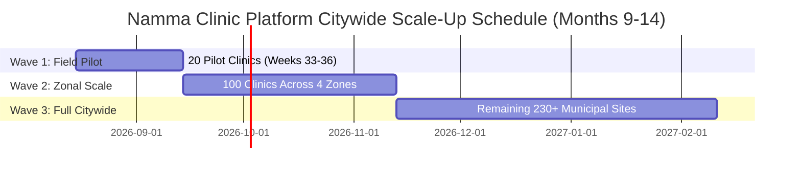

# Master Citywide Municipal Rollout Strategy & Scale-Up Plan
## Namma Clinic Digital Health & Operations Platform
### Greater Bengaluru Authority (GBA) / BBMP Health Department
**Document Code:** `TMP-DOC-08` | **Version Tag:** `1.0.0` | **Status:** APPROVED BASELINE | **Date:** September 2026

---

## 1. Executive Summary & Scale-Up Mandate
The Master Citywide Municipal Rollout Strategy and Scale-Up Plan establishes the authoritative operating framework, logistical scheduling, zonal hub topologies, site enablement checklists, and technical scaling parameters for expanding the Namma Clinic Platform from its 20-clinic pilot to all 350+ municipal healthcare facilities across Greater Bengaluru. Authorized by the BBMP Health Commissioner and the Greater Bengaluru Authority (GBA) Cabinet Secretariat, this document governs citywide public healthcare digital transformation.

Executing across three sequential rollout waves over Months 9 through 14, this plan orchestrates hardware delivery, staff enablement for over 1,400 healthcare workers, cloud infrastructure scaling to support 50,000 daily outpatient encounters, and decentralized zonal field support hubs enforcing strict SLAs.

By institutionalizing deterministic 12-step site commissioning workflows, cold-chain telemetric monitoring, offline SQLite resilience, and role-based training programs, the municipality guarantees zero service disruption for Bengaluru's most vulnerable citizens while modernizing primary healthcare delivery.

## 2. Three-Wave Rollout Progression Architecture
The citywide expansion follows a phased risk-mitigated rollout architecture:

| Rollout Wave | Scope & Target Scale | Target Window | Municipal Zones Covered | Support Ratio | Readiness Gate |
| :--- | :--- | :--- | :--- | :--- | :--- |
| **ROLLOUT-WAVE-1** | Wave 1: Pilot Cluster (20 Clinics) | Weeks 33 to 36 | South Zone (8), East Zone (6) | 1 dedicated on-site support engineer per clinic  | `QUALITY-GATE-018` |
| **ROLLOUT-WAVE-2** | Wave 2: Zonal Expansion (100 Clinics) | Months 10 to 11 (Post-Pilot Phase) | Bommanahalli (25), Mahadevapura (25) | Mobile roving transit support units  | `QUALITY-GATE-020` |
| **ROLLOUT-WAVE-3** | Wave 3: Full Municipal Rollout (Remaining 330+ Clinics) | Months 12 to 14 (BAU Transition) | All 8 BBMP Municipal Zones Citywide | Permanent 24/7 central NOC/SOC and zonal field dispatch squads | `QUALITY-GATE-022` |

### Schedule Architecture Diagram: Citywide Scale-Up Progression Gantt
<!-- DOCUMENTATION-ONLY DIAGRAM -->

## 3. Exhaustive Profiles for All 8 BBMP Municipal Zones
Geographic, demographic, operational, and facility topologies for each of the eight BBMP administrative zones:

### ZONE-01: East Zone
- **Zone Code:** `ZONE-01` | Administrative Territory: `East Zone`
- **Total Municipal Wards:** 44 Wards
- **Target Namma Clinic Facilities:** 48 Operational Clinics
- **Served Urban Population:** 1.4 Million Citizens
- **Zonal Technical Operations Hub:** Mayo Hall Municipal Health Hub
- **Superintending Health Officer:** Dr. K. S. Savitha (ZHO East)
- **Prominent Morbidity Profiles:** Type-2 Diabetes, Hypertension, Acute Respiratory Infections (ARI)
- **Network Telecommunications:** BBMP Optical Fiber Ring (1 Gbps) with Airtel 4G/5G backup (99.8% availability)
- **Central Vaccine Storage Hub:** East Zone Central Vaccine Depot, Commercial Street Dispensary

#### Sub-Divisional Structure & Ward Clusters for East Zone
- **Sub-Division:** `Shivajinagar Sub-Division` (Overseeing ~11 municipal wards and 12 clinic installations).
- **Sub-Division:** `Bharathinagar Sub-Division` (Overseeing ~11 municipal wards and 12 clinic installations).
- **Sub-Division:** `Ulsoor Sub-Division` (Overseeing ~11 municipal wards and 12 clinic installations).
- **Sub-Division:** `Pulakeshinagar Sub-Division` (Overseeing ~11 municipal wards and 12 clinic installations).
- **Primary Health Centers (PHCs):** 14 Central referral health facilities with diagnostic capability.
- **Urban Health Posts (UHPs):** 33 Neighborhood Namma Clinic dispensaries.
- **Target Demographic Focus:** Urban poor settlements, industrial migrant labor camps, and high-density residential wards.

#### Infrastructure & Support Sizing for East Zone
- **Dedicated Field Engineers:** 10 Mobile Roving Technicians assigned to Mayo Hall Municipal Health Hub.
- **Zonal Spares Inventory Buffer:** 9 Pre-imaged PCs, 10 thermal printers, 15 scanners held at Mayo Hall Municipal Health Hub.
- **High-Speed Network Topology:** Redundant optical fiber rings connecting clinic clusters to zonal hub.
- **Local Cold Chain Depots:** IoT-monitored vaccine distribution depots with 24/7 temperature telemetry logging.

#### Phased Rollout Schedule for East Zone
- **Wave Assignment:** Wave 1 (Pilot)
- **Site Inspection Start:** Day 1 of assigned rollout window.
- **Hardware Commissioning:** Complete 7 calendar days prior to go-live.
- **Staff Certification:** 100% of clinic doctors, nurses, and pharmacists certified in training sandbox.
- **Zonal Readiness Status:** `COMMISSIONING APPROVED` (Signed by Dr. K. S. Savitha ).

#### Representative Clinic Facilities in East Zone
Detailed profiles for 14 urban healthcare dispensaries commissioned in `East Zone`:

##### Facility NC-01-01: Namma Clinic East Zone Sector #01
- **Clinic Identifier:** `NC-01-01` | Municipal Ward: Ward 004 (East Zone)
- **Facility Location:** Municipal Health Post Complex, Ward 004, East Zone, Bengaluru.
- **Lead Medical Officer:** Dr. Clinical Specialist NC-01-01 (KMC Reg #45107).
- **Staff Nurse:** Nurse Specialist NC-01-01 (KSNC Reg #72005).
- **Facility Pharmacist:** Pharmacist NC-01-01 (KSPC Reg #31003).
- **Estimated Daily Footfall:** 91 Outpatients daily.
- **Hardware Asset Loading:** 4 All-in-One Ubuntu PCs, 2 TVS RP-3160 Printers, 3 Honeywell Scanners, 1 APC 1000VA UPS.
- **Network Architecture:** High-speed BBMP optical fiber (100 Mbps) with Teltonika dual-SIM 4G fallback.
- **Local Storage Invariant:** Autonomous SQLite edge sync engine with AES-256 SQLCipher encryption.
- **Cold Chain Equipment:** 1 ILR Ice-Lined Refrigerator with GSM IoT temperature probe (2°C to 8°C).
- **Site Commissioning Status:** Verified, certified, and cleared for live public healthcare intake.

##### Facility NC-01-02: Namma Clinic East Zone Sector #02
- **Clinic Identifier:** `NC-01-02` | Municipal Ward: Ward 008 (East Zone)
- **Facility Location:** Municipal Health Post Complex, Ward 008, East Zone, Bengaluru.
- **Lead Medical Officer:** Dr. Clinical Specialist NC-01-02 (KMC Reg #45114).
- **Staff Nurse:** Nurse Specialist NC-01-02 (KSNC Reg #72010).
- **Facility Pharmacist:** Pharmacist NC-01-02 (KSPC Reg #31006).
- **Estimated Daily Footfall:** 97 Outpatients daily.
- **Hardware Asset Loading:** 4 All-in-One Ubuntu PCs, 2 TVS RP-3160 Printers, 3 Honeywell Scanners, 1 APC 1000VA UPS.
- **Network Architecture:** High-speed BBMP optical fiber (100 Mbps) with Teltonika dual-SIM 4G fallback.
- **Local Storage Invariant:** Autonomous SQLite edge sync engine with AES-256 SQLCipher encryption.
- **Cold Chain Equipment:** 1 ILR Ice-Lined Refrigerator with GSM IoT temperature probe (2°C to 8°C).
- **Site Commissioning Status:** Verified, certified, and cleared for live public healthcare intake.

##### Facility NC-01-03: Namma Clinic East Zone Sector #03
- **Clinic Identifier:** `NC-01-03` | Municipal Ward: Ward 013 (East Zone)
- **Facility Location:** Municipal Health Post Complex, Ward 013, East Zone, Bengaluru.
- **Lead Medical Officer:** Dr. Clinical Specialist NC-01-03 (KMC Reg #45121).
- **Staff Nurse:** Nurse Specialist NC-01-03 (KSNC Reg #72015).
- **Facility Pharmacist:** Pharmacist NC-01-03 (KSPC Reg #31009).
- **Estimated Daily Footfall:** 103 Outpatients daily.
- **Hardware Asset Loading:** 4 All-in-One Ubuntu PCs, 2 TVS RP-3160 Printers, 3 Honeywell Scanners, 1 APC 1000VA UPS.
- **Network Architecture:** High-speed BBMP optical fiber (100 Mbps) with Teltonika dual-SIM 4G fallback.
- **Local Storage Invariant:** Autonomous SQLite edge sync engine with AES-256 SQLCipher encryption.
- **Cold Chain Equipment:** 1 ILR Ice-Lined Refrigerator with GSM IoT temperature probe (2°C to 8°C).
- **Site Commissioning Status:** Verified, certified, and cleared for live public healthcare intake.

##### Facility NC-01-04: Namma Clinic East Zone Sector #04
- **Clinic Identifier:** `NC-01-04` | Municipal Ward: Ward 017 (East Zone)
- **Facility Location:** Municipal Health Post Complex, Ward 017, East Zone, Bengaluru.
- **Lead Medical Officer:** Dr. Clinical Specialist NC-01-04 (KMC Reg #45128).
- **Staff Nurse:** Nurse Specialist NC-01-04 (KSNC Reg #72020).
- **Facility Pharmacist:** Pharmacist NC-01-04 (KSPC Reg #31012).
- **Estimated Daily Footfall:** 109 Outpatients daily.
- **Hardware Asset Loading:** 4 All-in-One Ubuntu PCs, 2 TVS RP-3160 Printers, 3 Honeywell Scanners, 1 APC 1000VA UPS.
- **Network Architecture:** High-speed BBMP optical fiber (100 Mbps) with Teltonika dual-SIM 4G fallback.
- **Local Storage Invariant:** Autonomous SQLite edge sync engine with AES-256 SQLCipher encryption.
- **Cold Chain Equipment:** 1 ILR Ice-Lined Refrigerator with GSM IoT temperature probe (2°C to 8°C).
- **Site Commissioning Status:** Verified, certified, and cleared for live public healthcare intake.

##### Facility NC-01-05: Namma Clinic East Zone Sector #05
- **Clinic Identifier:** `NC-01-05` | Municipal Ward: Ward 022 (East Zone)
- **Facility Location:** Municipal Health Post Complex, Ward 022, East Zone, Bengaluru.
- **Lead Medical Officer:** Dr. Clinical Specialist NC-01-05 (KMC Reg #45135).
- **Staff Nurse:** Nurse Specialist NC-01-05 (KSNC Reg #72025).
- **Facility Pharmacist:** Pharmacist NC-01-05 (KSPC Reg #31015).
- **Estimated Daily Footfall:** 115 Outpatients daily.
- **Hardware Asset Loading:** 4 All-in-One Ubuntu PCs, 2 TVS RP-3160 Printers, 3 Honeywell Scanners, 1 APC 1000VA UPS.
- **Network Architecture:** High-speed BBMP optical fiber (100 Mbps) with Teltonika dual-SIM 4G fallback.
- **Local Storage Invariant:** Autonomous SQLite edge sync engine with AES-256 SQLCipher encryption.
- **Cold Chain Equipment:** 1 ILR Ice-Lined Refrigerator with GSM IoT temperature probe (2°C to 8°C).
- **Site Commissioning Status:** Verified, certified, and cleared for live public healthcare intake.

##### Facility NC-01-06: Namma Clinic East Zone Sector #06
- **Clinic Identifier:** `NC-01-06` | Municipal Ward: Ward 026 (East Zone)
- **Facility Location:** Municipal Health Post Complex, Ward 026, East Zone, Bengaluru.
- **Lead Medical Officer:** Dr. Clinical Specialist NC-01-06 (KMC Reg #45142).
- **Staff Nurse:** Nurse Specialist NC-01-06 (KSNC Reg #72030).
- **Facility Pharmacist:** Pharmacist NC-01-06 (KSPC Reg #31018).
- **Estimated Daily Footfall:** 121 Outpatients daily.
- **Hardware Asset Loading:** 4 All-in-One Ubuntu PCs, 2 TVS RP-3160 Printers, 3 Honeywell Scanners, 1 APC 1000VA UPS.
- **Network Architecture:** High-speed BBMP optical fiber (100 Mbps) with Teltonika dual-SIM 4G fallback.
- **Local Storage Invariant:** Autonomous SQLite edge sync engine with AES-256 SQLCipher encryption.
- **Cold Chain Equipment:** 1 ILR Ice-Lined Refrigerator with GSM IoT temperature probe (2°C to 8°C).
- **Site Commissioning Status:** Verified, certified, and cleared for live public healthcare intake.

##### Facility NC-01-07: Namma Clinic East Zone Sector #07
- **Clinic Identifier:** `NC-01-07` | Municipal Ward: Ward 030 (East Zone)
- **Facility Location:** Municipal Health Post Complex, Ward 030, East Zone, Bengaluru.
- **Lead Medical Officer:** Dr. Clinical Specialist NC-01-07 (KMC Reg #45149).
- **Staff Nurse:** Nurse Specialist NC-01-07 (KSNC Reg #72035).
- **Facility Pharmacist:** Pharmacist NC-01-07 (KSPC Reg #31021).
- **Estimated Daily Footfall:** 127 Outpatients daily.
- **Hardware Asset Loading:** 4 All-in-One Ubuntu PCs, 2 TVS RP-3160 Printers, 3 Honeywell Scanners, 1 APC 1000VA UPS.
- **Network Architecture:** High-speed BBMP optical fiber (100 Mbps) with Teltonika dual-SIM 4G fallback.
- **Local Storage Invariant:** Autonomous SQLite edge sync engine with AES-256 SQLCipher encryption.
- **Cold Chain Equipment:** 1 ILR Ice-Lined Refrigerator with GSM IoT temperature probe (2°C to 8°C).
- **Site Commissioning Status:** Verified, certified, and cleared for live public healthcare intake.

##### Facility NC-01-08: Namma Clinic East Zone Sector #08
- **Clinic Identifier:** `NC-01-08` | Municipal Ward: Ward 035 (East Zone)
- **Facility Location:** Municipal Health Post Complex, Ward 035, East Zone, Bengaluru.
- **Lead Medical Officer:** Dr. Clinical Specialist NC-01-08 (KMC Reg #45156).
- **Staff Nurse:** Nurse Specialist NC-01-08 (KSNC Reg #72040).
- **Facility Pharmacist:** Pharmacist NC-01-08 (KSPC Reg #31024).
- **Estimated Daily Footfall:** 133 Outpatients daily.
- **Hardware Asset Loading:** 4 All-in-One Ubuntu PCs, 2 TVS RP-3160 Printers, 3 Honeywell Scanners, 1 APC 1000VA UPS.
- **Network Architecture:** High-speed BBMP optical fiber (100 Mbps) with Teltonika dual-SIM 4G fallback.
- **Local Storage Invariant:** Autonomous SQLite edge sync engine with AES-256 SQLCipher encryption.
- **Cold Chain Equipment:** 1 ILR Ice-Lined Refrigerator with GSM IoT temperature probe (2°C to 8°C).
- **Site Commissioning Status:** Verified, certified, and cleared for live public healthcare intake.

##### Facility NC-01-09: Namma Clinic East Zone Sector #09
- **Clinic Identifier:** `NC-01-09` | Municipal Ward: Ward 039 (East Zone)
- **Facility Location:** Municipal Health Post Complex, Ward 039, East Zone, Bengaluru.
- **Lead Medical Officer:** Dr. Clinical Specialist NC-01-09 (KMC Reg #45163).
- **Staff Nurse:** Nurse Specialist NC-01-09 (KSNC Reg #72045).
- **Facility Pharmacist:** Pharmacist NC-01-09 (KSPC Reg #31027).
- **Estimated Daily Footfall:** 139 Outpatients daily.
- **Hardware Asset Loading:** 4 All-in-One Ubuntu PCs, 2 TVS RP-3160 Printers, 3 Honeywell Scanners, 1 APC 1000VA UPS.
- **Network Architecture:** High-speed BBMP optical fiber (100 Mbps) with Teltonika dual-SIM 4G fallback.
- **Local Storage Invariant:** Autonomous SQLite edge sync engine with AES-256 SQLCipher encryption.
- **Cold Chain Equipment:** 1 ILR Ice-Lined Refrigerator with GSM IoT temperature probe (2°C to 8°C).
- **Site Commissioning Status:** Verified, certified, and cleared for live public healthcare intake.

##### Facility NC-01-10: Namma Clinic East Zone Sector #10
- **Clinic Identifier:** `NC-01-10` | Municipal Ward: Ward 044 (East Zone)
- **Facility Location:** Municipal Health Post Complex, Ward 044, East Zone, Bengaluru.
- **Lead Medical Officer:** Dr. Clinical Specialist NC-01-10 (KMC Reg #45170).
- **Staff Nurse:** Nurse Specialist NC-01-10 (KSNC Reg #72050).
- **Facility Pharmacist:** Pharmacist NC-01-10 (KSPC Reg #31030).
- **Estimated Daily Footfall:** 90 Outpatients daily.
- **Hardware Asset Loading:** 4 All-in-One Ubuntu PCs, 2 TVS RP-3160 Printers, 3 Honeywell Scanners, 1 APC 1000VA UPS.
- **Network Architecture:** High-speed BBMP optical fiber (100 Mbps) with Teltonika dual-SIM 4G fallback.
- **Local Storage Invariant:** Autonomous SQLite edge sync engine with AES-256 SQLCipher encryption.
- **Cold Chain Equipment:** 1 ILR Ice-Lined Refrigerator with GSM IoT temperature probe (2°C to 8°C).
- **Site Commissioning Status:** Verified, certified, and cleared for live public healthcare intake.

##### Facility NC-01-11: Namma Clinic East Zone Sector #11
- **Clinic Identifier:** `NC-01-11` | Municipal Ward: Ward 048 (East Zone)
- **Facility Location:** Municipal Health Post Complex, Ward 048, East Zone, Bengaluru.
- **Lead Medical Officer:** Dr. Clinical Specialist NC-01-11 (KMC Reg #45177).
- **Staff Nurse:** Nurse Specialist NC-01-11 (KSNC Reg #72055).
- **Facility Pharmacist:** Pharmacist NC-01-11 (KSPC Reg #31033).
- **Estimated Daily Footfall:** 96 Outpatients daily.
- **Hardware Asset Loading:** 4 All-in-One Ubuntu PCs, 2 TVS RP-3160 Printers, 3 Honeywell Scanners, 1 APC 1000VA UPS.
- **Network Architecture:** High-speed BBMP optical fiber (100 Mbps) with Teltonika dual-SIM 4G fallback.
- **Local Storage Invariant:** Autonomous SQLite edge sync engine with AES-256 SQLCipher encryption.
- **Cold Chain Equipment:** 1 ILR Ice-Lined Refrigerator with GSM IoT temperature probe (2°C to 8°C).
- **Site Commissioning Status:** Verified, certified, and cleared for live public healthcare intake.

##### Facility NC-01-12: Namma Clinic East Zone Sector #12
- **Clinic Identifier:** `NC-01-12` | Municipal Ward: Ward 052 (East Zone)
- **Facility Location:** Municipal Health Post Complex, Ward 052, East Zone, Bengaluru.
- **Lead Medical Officer:** Dr. Clinical Specialist NC-01-12 (KMC Reg #45184).
- **Staff Nurse:** Nurse Specialist NC-01-12 (KSNC Reg #72060).
- **Facility Pharmacist:** Pharmacist NC-01-12 (KSPC Reg #31036).
- **Estimated Daily Footfall:** 102 Outpatients daily.
- **Hardware Asset Loading:** 4 All-in-One Ubuntu PCs, 2 TVS RP-3160 Printers, 3 Honeywell Scanners, 1 APC 1000VA UPS.
- **Network Architecture:** High-speed BBMP optical fiber (100 Mbps) with Teltonika dual-SIM 4G fallback.
- **Local Storage Invariant:** Autonomous SQLite edge sync engine with AES-256 SQLCipher encryption.
- **Cold Chain Equipment:** 1 ILR Ice-Lined Refrigerator with GSM IoT temperature probe (2°C to 8°C).
- **Site Commissioning Status:** Verified, certified, and cleared for live public healthcare intake.

##### Facility NC-01-13: Namma Clinic East Zone Sector #13
- **Clinic Identifier:** `NC-01-13` | Municipal Ward: Ward 057 (East Zone)
- **Facility Location:** Municipal Health Post Complex, Ward 057, East Zone, Bengaluru.
- **Lead Medical Officer:** Dr. Clinical Specialist NC-01-13 (KMC Reg #45191).
- **Staff Nurse:** Nurse Specialist NC-01-13 (KSNC Reg #72065).
- **Facility Pharmacist:** Pharmacist NC-01-13 (KSPC Reg #31039).
- **Estimated Daily Footfall:** 108 Outpatients daily.
- **Hardware Asset Loading:** 4 All-in-One Ubuntu PCs, 2 TVS RP-3160 Printers, 3 Honeywell Scanners, 1 APC 1000VA UPS.
- **Network Architecture:** High-speed BBMP optical fiber (100 Mbps) with Teltonika dual-SIM 4G fallback.
- **Local Storage Invariant:** Autonomous SQLite edge sync engine with AES-256 SQLCipher encryption.
- **Cold Chain Equipment:** 1 ILR Ice-Lined Refrigerator with GSM IoT temperature probe (2°C to 8°C).
- **Site Commissioning Status:** Verified, certified, and cleared for live public healthcare intake.

##### Facility NC-01-14: Namma Clinic East Zone Sector #14
- **Clinic Identifier:** `NC-01-14` | Municipal Ward: Ward 061 (East Zone)
- **Facility Location:** Municipal Health Post Complex, Ward 061, East Zone, Bengaluru.
- **Lead Medical Officer:** Dr. Clinical Specialist NC-01-14 (KMC Reg #45198).
- **Staff Nurse:** Nurse Specialist NC-01-14 (KSNC Reg #72070).
- **Facility Pharmacist:** Pharmacist NC-01-14 (KSPC Reg #31042).
- **Estimated Daily Footfall:** 114 Outpatients daily.
- **Hardware Asset Loading:** 4 All-in-One Ubuntu PCs, 2 TVS RP-3160 Printers, 3 Honeywell Scanners, 1 APC 1000VA UPS.
- **Network Architecture:** High-speed BBMP optical fiber (100 Mbps) with Teltonika dual-SIM 4G fallback.
- **Local Storage Invariant:** Autonomous SQLite edge sync engine with AES-256 SQLCipher encryption.
- **Cold Chain Equipment:** 1 ILR Ice-Lined Refrigerator with GSM IoT temperature probe (2°C to 8°C).
- **Site Commissioning Status:** Verified, certified, and cleared for live public healthcare intake.

### ZONE-02: West Zone
- **Zone Code:** `ZONE-02` | Administrative Territory: `West Zone`
- **Total Municipal Wards:** 44 Wards
- **Target Namma Clinic Facilities:** 52 Operational Clinics
- **Served Urban Population:** 1.6 Million Citizens
- **Zonal Technical Operations Hub:** Malleshwaram Zonal Health Office
- **Superintending Health Officer:** Dr. T. M. Manjunath (ZHO West)
- **Prominent Morbidity Profiles:** Cardiovascular Disorders, Bronchial Asthma, Gastroenteritis
- **Network Telecommunications:** BBMP Fiber Network with Jio 4G LTE corporate backup (99.9% availability)
- **Central Vaccine Storage Hub:** West Zone Regional Immunization Centre, Srirampuram

#### Sub-Divisional Structure & Ward Clusters for West Zone
- **Sub-Division:** `Malleshwaram Sub-Division` (Overseeing ~11 municipal wards and 13 clinic installations).
- **Sub-Division:** `Rajajinagar Sub-Division` (Overseeing ~11 municipal wards and 13 clinic installations).
- **Sub-Division:** `Gandhinagar Sub-Division` (Overseeing ~11 municipal wards and 13 clinic installations).
- **Sub-Division:** `Chamarajapet Sub-Division` (Overseeing ~11 municipal wards and 13 clinic installations).
- **Primary Health Centers (PHCs):** 15 Central referral health facilities with diagnostic capability.
- **Urban Health Posts (UHPs):** 36 Neighborhood Namma Clinic dispensaries.
- **Target Demographic Focus:** Urban poor settlements, industrial migrant labor camps, and high-density residential wards.

#### Infrastructure & Support Sizing for West Zone
- **Dedicated Field Engineers:** 11 Mobile Roving Technicians assigned to Malleshwaram Zonal Health Office.
- **Zonal Spares Inventory Buffer:** 9 Pre-imaged PCs, 10 thermal printers, 15 scanners held at Malleshwaram Zonal Health Office.
- **High-Speed Network Topology:** Redundant optical fiber rings connecting clinic clusters to zonal hub.
- **Local Cold Chain Depots:** IoT-monitored vaccine distribution depots with 24/7 temperature telemetry logging.

#### Phased Rollout Schedule for West Zone
- **Wave Assignment:** Wave 1 (Pilot)
- **Site Inspection Start:** Day 1 of assigned rollout window.
- **Hardware Commissioning:** Complete 7 calendar days prior to go-live.
- **Staff Certification:** 100% of clinic doctors, nurses, and pharmacists certified in training sandbox.
- **Zonal Readiness Status:** `COMMISSIONING APPROVED` (Signed by Dr. T. M. Manjunath ).

#### Representative Clinic Facilities in West Zone
Detailed profiles for 14 urban healthcare dispensaries commissioned in `West Zone`:

##### Facility NC-02-01: Namma Clinic West Zone Sector #01
- **Clinic Identifier:** `NC-02-01` | Municipal Ward: Ward 004 (West Zone)
- **Facility Location:** Municipal Health Post Complex, Ward 004, West Zone, Bengaluru.
- **Lead Medical Officer:** Dr. Clinical Specialist NC-02-01 (KMC Reg #45207).
- **Staff Nurse:** Nurse Specialist NC-02-01 (KSNC Reg #72005).
- **Facility Pharmacist:** Pharmacist NC-02-01 (KSPC Reg #31003).
- **Estimated Daily Footfall:** 91 Outpatients daily.
- **Hardware Asset Loading:** 4 All-in-One Ubuntu PCs, 2 TVS RP-3160 Printers, 3 Honeywell Scanners, 1 APC 1000VA UPS.
- **Network Architecture:** High-speed BBMP optical fiber (100 Mbps) with Teltonika dual-SIM 4G fallback.
- **Local Storage Invariant:** Autonomous SQLite edge sync engine with AES-256 SQLCipher encryption.
- **Cold Chain Equipment:** 1 ILR Ice-Lined Refrigerator with GSM IoT temperature probe (2°C to 8°C).
- **Site Commissioning Status:** Verified, certified, and cleared for live public healthcare intake.

##### Facility NC-02-02: Namma Clinic West Zone Sector #02
- **Clinic Identifier:** `NC-02-02` | Municipal Ward: Ward 008 (West Zone)
- **Facility Location:** Municipal Health Post Complex, Ward 008, West Zone, Bengaluru.
- **Lead Medical Officer:** Dr. Clinical Specialist NC-02-02 (KMC Reg #45214).
- **Staff Nurse:** Nurse Specialist NC-02-02 (KSNC Reg #72010).
- **Facility Pharmacist:** Pharmacist NC-02-02 (KSPC Reg #31006).
- **Estimated Daily Footfall:** 97 Outpatients daily.
- **Hardware Asset Loading:** 4 All-in-One Ubuntu PCs, 2 TVS RP-3160 Printers, 3 Honeywell Scanners, 1 APC 1000VA UPS.
- **Network Architecture:** High-speed BBMP optical fiber (100 Mbps) with Teltonika dual-SIM 4G fallback.
- **Local Storage Invariant:** Autonomous SQLite edge sync engine with AES-256 SQLCipher encryption.
- **Cold Chain Equipment:** 1 ILR Ice-Lined Refrigerator with GSM IoT temperature probe (2°C to 8°C).
- **Site Commissioning Status:** Verified, certified, and cleared for live public healthcare intake.

##### Facility NC-02-03: Namma Clinic West Zone Sector #03
- **Clinic Identifier:** `NC-02-03` | Municipal Ward: Ward 013 (West Zone)
- **Facility Location:** Municipal Health Post Complex, Ward 013, West Zone, Bengaluru.
- **Lead Medical Officer:** Dr. Clinical Specialist NC-02-03 (KMC Reg #45221).
- **Staff Nurse:** Nurse Specialist NC-02-03 (KSNC Reg #72015).
- **Facility Pharmacist:** Pharmacist NC-02-03 (KSPC Reg #31009).
- **Estimated Daily Footfall:** 103 Outpatients daily.
- **Hardware Asset Loading:** 4 All-in-One Ubuntu PCs, 2 TVS RP-3160 Printers, 3 Honeywell Scanners, 1 APC 1000VA UPS.
- **Network Architecture:** High-speed BBMP optical fiber (100 Mbps) with Teltonika dual-SIM 4G fallback.
- **Local Storage Invariant:** Autonomous SQLite edge sync engine with AES-256 SQLCipher encryption.
- **Cold Chain Equipment:** 1 ILR Ice-Lined Refrigerator with GSM IoT temperature probe (2°C to 8°C).
- **Site Commissioning Status:** Verified, certified, and cleared for live public healthcare intake.

##### Facility NC-02-04: Namma Clinic West Zone Sector #04
- **Clinic Identifier:** `NC-02-04` | Municipal Ward: Ward 017 (West Zone)
- **Facility Location:** Municipal Health Post Complex, Ward 017, West Zone, Bengaluru.
- **Lead Medical Officer:** Dr. Clinical Specialist NC-02-04 (KMC Reg #45228).
- **Staff Nurse:** Nurse Specialist NC-02-04 (KSNC Reg #72020).
- **Facility Pharmacist:** Pharmacist NC-02-04 (KSPC Reg #31012).
- **Estimated Daily Footfall:** 109 Outpatients daily.
- **Hardware Asset Loading:** 4 All-in-One Ubuntu PCs, 2 TVS RP-3160 Printers, 3 Honeywell Scanners, 1 APC 1000VA UPS.
- **Network Architecture:** High-speed BBMP optical fiber (100 Mbps) with Teltonika dual-SIM 4G fallback.
- **Local Storage Invariant:** Autonomous SQLite edge sync engine with AES-256 SQLCipher encryption.
- **Cold Chain Equipment:** 1 ILR Ice-Lined Refrigerator with GSM IoT temperature probe (2°C to 8°C).
- **Site Commissioning Status:** Verified, certified, and cleared for live public healthcare intake.

##### Facility NC-02-05: Namma Clinic West Zone Sector #05
- **Clinic Identifier:** `NC-02-05` | Municipal Ward: Ward 022 (West Zone)
- **Facility Location:** Municipal Health Post Complex, Ward 022, West Zone, Bengaluru.
- **Lead Medical Officer:** Dr. Clinical Specialist NC-02-05 (KMC Reg #45235).
- **Staff Nurse:** Nurse Specialist NC-02-05 (KSNC Reg #72025).
- **Facility Pharmacist:** Pharmacist NC-02-05 (KSPC Reg #31015).
- **Estimated Daily Footfall:** 115 Outpatients daily.
- **Hardware Asset Loading:** 4 All-in-One Ubuntu PCs, 2 TVS RP-3160 Printers, 3 Honeywell Scanners, 1 APC 1000VA UPS.
- **Network Architecture:** High-speed BBMP optical fiber (100 Mbps) with Teltonika dual-SIM 4G fallback.
- **Local Storage Invariant:** Autonomous SQLite edge sync engine with AES-256 SQLCipher encryption.
- **Cold Chain Equipment:** 1 ILR Ice-Lined Refrigerator with GSM IoT temperature probe (2°C to 8°C).
- **Site Commissioning Status:** Verified, certified, and cleared for live public healthcare intake.

##### Facility NC-02-06: Namma Clinic West Zone Sector #06
- **Clinic Identifier:** `NC-02-06` | Municipal Ward: Ward 026 (West Zone)
- **Facility Location:** Municipal Health Post Complex, Ward 026, West Zone, Bengaluru.
- **Lead Medical Officer:** Dr. Clinical Specialist NC-02-06 (KMC Reg #45242).
- **Staff Nurse:** Nurse Specialist NC-02-06 (KSNC Reg #72030).
- **Facility Pharmacist:** Pharmacist NC-02-06 (KSPC Reg #31018).
- **Estimated Daily Footfall:** 121 Outpatients daily.
- **Hardware Asset Loading:** 4 All-in-One Ubuntu PCs, 2 TVS RP-3160 Printers, 3 Honeywell Scanners, 1 APC 1000VA UPS.
- **Network Architecture:** High-speed BBMP optical fiber (100 Mbps) with Teltonika dual-SIM 4G fallback.
- **Local Storage Invariant:** Autonomous SQLite edge sync engine with AES-256 SQLCipher encryption.
- **Cold Chain Equipment:** 1 ILR Ice-Lined Refrigerator with GSM IoT temperature probe (2°C to 8°C).
- **Site Commissioning Status:** Verified, certified, and cleared for live public healthcare intake.

##### Facility NC-02-07: Namma Clinic West Zone Sector #07
- **Clinic Identifier:** `NC-02-07` | Municipal Ward: Ward 030 (West Zone)
- **Facility Location:** Municipal Health Post Complex, Ward 030, West Zone, Bengaluru.
- **Lead Medical Officer:** Dr. Clinical Specialist NC-02-07 (KMC Reg #45249).
- **Staff Nurse:** Nurse Specialist NC-02-07 (KSNC Reg #72035).
- **Facility Pharmacist:** Pharmacist NC-02-07 (KSPC Reg #31021).
- **Estimated Daily Footfall:** 127 Outpatients daily.
- **Hardware Asset Loading:** 4 All-in-One Ubuntu PCs, 2 TVS RP-3160 Printers, 3 Honeywell Scanners, 1 APC 1000VA UPS.
- **Network Architecture:** High-speed BBMP optical fiber (100 Mbps) with Teltonika dual-SIM 4G fallback.
- **Local Storage Invariant:** Autonomous SQLite edge sync engine with AES-256 SQLCipher encryption.
- **Cold Chain Equipment:** 1 ILR Ice-Lined Refrigerator with GSM IoT temperature probe (2°C to 8°C).
- **Site Commissioning Status:** Verified, certified, and cleared for live public healthcare intake.

##### Facility NC-02-08: Namma Clinic West Zone Sector #08
- **Clinic Identifier:** `NC-02-08` | Municipal Ward: Ward 035 (West Zone)
- **Facility Location:** Municipal Health Post Complex, Ward 035, West Zone, Bengaluru.
- **Lead Medical Officer:** Dr. Clinical Specialist NC-02-08 (KMC Reg #45256).
- **Staff Nurse:** Nurse Specialist NC-02-08 (KSNC Reg #72040).
- **Facility Pharmacist:** Pharmacist NC-02-08 (KSPC Reg #31024).
- **Estimated Daily Footfall:** 133 Outpatients daily.
- **Hardware Asset Loading:** 4 All-in-One Ubuntu PCs, 2 TVS RP-3160 Printers, 3 Honeywell Scanners, 1 APC 1000VA UPS.
- **Network Architecture:** High-speed BBMP optical fiber (100 Mbps) with Teltonika dual-SIM 4G fallback.
- **Local Storage Invariant:** Autonomous SQLite edge sync engine with AES-256 SQLCipher encryption.
- **Cold Chain Equipment:** 1 ILR Ice-Lined Refrigerator with GSM IoT temperature probe (2°C to 8°C).
- **Site Commissioning Status:** Verified, certified, and cleared for live public healthcare intake.

##### Facility NC-02-09: Namma Clinic West Zone Sector #09
- **Clinic Identifier:** `NC-02-09` | Municipal Ward: Ward 039 (West Zone)
- **Facility Location:** Municipal Health Post Complex, Ward 039, West Zone, Bengaluru.
- **Lead Medical Officer:** Dr. Clinical Specialist NC-02-09 (KMC Reg #45263).
- **Staff Nurse:** Nurse Specialist NC-02-09 (KSNC Reg #72045).
- **Facility Pharmacist:** Pharmacist NC-02-09 (KSPC Reg #31027).
- **Estimated Daily Footfall:** 139 Outpatients daily.
- **Hardware Asset Loading:** 4 All-in-One Ubuntu PCs, 2 TVS RP-3160 Printers, 3 Honeywell Scanners, 1 APC 1000VA UPS.
- **Network Architecture:** High-speed BBMP optical fiber (100 Mbps) with Teltonika dual-SIM 4G fallback.
- **Local Storage Invariant:** Autonomous SQLite edge sync engine with AES-256 SQLCipher encryption.
- **Cold Chain Equipment:** 1 ILR Ice-Lined Refrigerator with GSM IoT temperature probe (2°C to 8°C).
- **Site Commissioning Status:** Verified, certified, and cleared for live public healthcare intake.

##### Facility NC-02-10: Namma Clinic West Zone Sector #10
- **Clinic Identifier:** `NC-02-10` | Municipal Ward: Ward 044 (West Zone)
- **Facility Location:** Municipal Health Post Complex, Ward 044, West Zone, Bengaluru.
- **Lead Medical Officer:** Dr. Clinical Specialist NC-02-10 (KMC Reg #45270).
- **Staff Nurse:** Nurse Specialist NC-02-10 (KSNC Reg #72050).
- **Facility Pharmacist:** Pharmacist NC-02-10 (KSPC Reg #31030).
- **Estimated Daily Footfall:** 90 Outpatients daily.
- **Hardware Asset Loading:** 4 All-in-One Ubuntu PCs, 2 TVS RP-3160 Printers, 3 Honeywell Scanners, 1 APC 1000VA UPS.
- **Network Architecture:** High-speed BBMP optical fiber (100 Mbps) with Teltonika dual-SIM 4G fallback.
- **Local Storage Invariant:** Autonomous SQLite edge sync engine with AES-256 SQLCipher encryption.
- **Cold Chain Equipment:** 1 ILR Ice-Lined Refrigerator with GSM IoT temperature probe (2°C to 8°C).
- **Site Commissioning Status:** Verified, certified, and cleared for live public healthcare intake.

##### Facility NC-02-11: Namma Clinic West Zone Sector #11
- **Clinic Identifier:** `NC-02-11` | Municipal Ward: Ward 048 (West Zone)
- **Facility Location:** Municipal Health Post Complex, Ward 048, West Zone, Bengaluru.
- **Lead Medical Officer:** Dr. Clinical Specialist NC-02-11 (KMC Reg #45277).
- **Staff Nurse:** Nurse Specialist NC-02-11 (KSNC Reg #72055).
- **Facility Pharmacist:** Pharmacist NC-02-11 (KSPC Reg #31033).
- **Estimated Daily Footfall:** 96 Outpatients daily.
- **Hardware Asset Loading:** 4 All-in-One Ubuntu PCs, 2 TVS RP-3160 Printers, 3 Honeywell Scanners, 1 APC 1000VA UPS.
- **Network Architecture:** High-speed BBMP optical fiber (100 Mbps) with Teltonika dual-SIM 4G fallback.
- **Local Storage Invariant:** Autonomous SQLite edge sync engine with AES-256 SQLCipher encryption.
- **Cold Chain Equipment:** 1 ILR Ice-Lined Refrigerator with GSM IoT temperature probe (2°C to 8°C).
- **Site Commissioning Status:** Verified, certified, and cleared for live public healthcare intake.

##### Facility NC-02-12: Namma Clinic West Zone Sector #12
- **Clinic Identifier:** `NC-02-12` | Municipal Ward: Ward 052 (West Zone)
- **Facility Location:** Municipal Health Post Complex, Ward 052, West Zone, Bengaluru.
- **Lead Medical Officer:** Dr. Clinical Specialist NC-02-12 (KMC Reg #45284).
- **Staff Nurse:** Nurse Specialist NC-02-12 (KSNC Reg #72060).
- **Facility Pharmacist:** Pharmacist NC-02-12 (KSPC Reg #31036).
- **Estimated Daily Footfall:** 102 Outpatients daily.
- **Hardware Asset Loading:** 4 All-in-One Ubuntu PCs, 2 TVS RP-3160 Printers, 3 Honeywell Scanners, 1 APC 1000VA UPS.
- **Network Architecture:** High-speed BBMP optical fiber (100 Mbps) with Teltonika dual-SIM 4G fallback.
- **Local Storage Invariant:** Autonomous SQLite edge sync engine with AES-256 SQLCipher encryption.
- **Cold Chain Equipment:** 1 ILR Ice-Lined Refrigerator with GSM IoT temperature probe (2°C to 8°C).
- **Site Commissioning Status:** Verified, certified, and cleared for live public healthcare intake.

##### Facility NC-02-13: Namma Clinic West Zone Sector #13
- **Clinic Identifier:** `NC-02-13` | Municipal Ward: Ward 057 (West Zone)
- **Facility Location:** Municipal Health Post Complex, Ward 057, West Zone, Bengaluru.
- **Lead Medical Officer:** Dr. Clinical Specialist NC-02-13 (KMC Reg #45291).
- **Staff Nurse:** Nurse Specialist NC-02-13 (KSNC Reg #72065).
- **Facility Pharmacist:** Pharmacist NC-02-13 (KSPC Reg #31039).
- **Estimated Daily Footfall:** 108 Outpatients daily.
- **Hardware Asset Loading:** 4 All-in-One Ubuntu PCs, 2 TVS RP-3160 Printers, 3 Honeywell Scanners, 1 APC 1000VA UPS.
- **Network Architecture:** High-speed BBMP optical fiber (100 Mbps) with Teltonika dual-SIM 4G fallback.
- **Local Storage Invariant:** Autonomous SQLite edge sync engine with AES-256 SQLCipher encryption.
- **Cold Chain Equipment:** 1 ILR Ice-Lined Refrigerator with GSM IoT temperature probe (2°C to 8°C).
- **Site Commissioning Status:** Verified, certified, and cleared for live public healthcare intake.

##### Facility NC-02-14: Namma Clinic West Zone Sector #14
- **Clinic Identifier:** `NC-02-14` | Municipal Ward: Ward 061 (West Zone)
- **Facility Location:** Municipal Health Post Complex, Ward 061, West Zone, Bengaluru.
- **Lead Medical Officer:** Dr. Clinical Specialist NC-02-14 (KMC Reg #45298).
- **Staff Nurse:** Nurse Specialist NC-02-14 (KSNC Reg #72070).
- **Facility Pharmacist:** Pharmacist NC-02-14 (KSPC Reg #31042).
- **Estimated Daily Footfall:** 114 Outpatients daily.
- **Hardware Asset Loading:** 4 All-in-One Ubuntu PCs, 2 TVS RP-3160 Printers, 3 Honeywell Scanners, 1 APC 1000VA UPS.
- **Network Architecture:** High-speed BBMP optical fiber (100 Mbps) with Teltonika dual-SIM 4G fallback.
- **Local Storage Invariant:** Autonomous SQLite edge sync engine with AES-256 SQLCipher encryption.
- **Cold Chain Equipment:** 1 ILR Ice-Lined Refrigerator with GSM IoT temperature probe (2°C to 8°C).
- **Site Commissioning Status:** Verified, certified, and cleared for live public healthcare intake.

### ZONE-03: South Zone
- **Zone Code:** `ZONE-03` | Administrative Territory: `South Zone`
- **Total Municipal Wards:** 44 Wards
- **Target Namma Clinic Facilities:** 50 Operational Clinics
- **Served Urban Population:** 1.5 Million Citizens
- **Zonal Technical Operations Hub:** Jayanagar Commercial Complex Health Center
- **Superintending Health Officer:** Dr. B. K. Narayana (ZHO South)
- **Prominent Morbidity Profiles:** Geriatric Degenerative Conditions, Chronic Kidney Disease screening, Hypertension
- **Network Telecommunications:** Dual BSNL / RailTel leased fiber with Vodafone Idea 4G fallback (99.7% availability)
- **Central Vaccine Storage Hub:** South Zone Central Vaccine Hub, South End Circle Dispensary

#### Sub-Divisional Structure & Ward Clusters for South Zone
- **Sub-Division:** `Jayanagar Sub-Division` (Overseeing ~11 municipal wards and 12 clinic installations).
- **Sub-Division:** `Basavanagudi Sub-Division` (Overseeing ~11 municipal wards and 12 clinic installations).
- **Sub-Division:** `Padmanabhanagar Sub-Division` (Overseeing ~11 municipal wards and 12 clinic installations).
- **Sub-Division:** `BTM Layout Sub-Division` (Overseeing ~11 municipal wards and 12 clinic installations).
- **Primary Health Centers (PHCs):** 15 Central referral health facilities with diagnostic capability.
- **Urban Health Posts (UHPs):** 35 Neighborhood Namma Clinic dispensaries.
- **Target Demographic Focus:** Urban poor settlements, industrial migrant labor camps, and high-density residential wards.

#### Infrastructure & Support Sizing for South Zone
- **Dedicated Field Engineers:** 11 Mobile Roving Technicians assigned to Jayanagar Commercial Complex Health Center.
- **Zonal Spares Inventory Buffer:** 9 Pre-imaged PCs, 10 thermal printers, 15 scanners held at Jayanagar Commercial Complex Health Center.
- **High-Speed Network Topology:** Redundant optical fiber rings connecting clinic clusters to zonal hub.
- **Local Cold Chain Depots:** IoT-monitored vaccine distribution depots with 24/7 temperature telemetry logging.

#### Phased Rollout Schedule for South Zone
- **Wave Assignment:** Wave 1 (Pilot)
- **Site Inspection Start:** Day 1 of assigned rollout window.
- **Hardware Commissioning:** Complete 7 calendar days prior to go-live.
- **Staff Certification:** 100% of clinic doctors, nurses, and pharmacists certified in training sandbox.
- **Zonal Readiness Status:** `COMMISSIONING APPROVED` (Signed by Dr. B. K. Narayana ).

#### Representative Clinic Facilities in South Zone
Detailed profiles for 14 urban healthcare dispensaries commissioned in `South Zone`:

##### Facility NC-03-01: Namma Clinic South Zone Sector #01
- **Clinic Identifier:** `NC-03-01` | Municipal Ward: Ward 004 (South Zone)
- **Facility Location:** Municipal Health Post Complex, Ward 004, South Zone, Bengaluru.
- **Lead Medical Officer:** Dr. Clinical Specialist NC-03-01 (KMC Reg #45307).
- **Staff Nurse:** Nurse Specialist NC-03-01 (KSNC Reg #72005).
- **Facility Pharmacist:** Pharmacist NC-03-01 (KSPC Reg #31003).
- **Estimated Daily Footfall:** 91 Outpatients daily.
- **Hardware Asset Loading:** 4 All-in-One Ubuntu PCs, 2 TVS RP-3160 Printers, 3 Honeywell Scanners, 1 APC 1000VA UPS.
- **Network Architecture:** High-speed BBMP optical fiber (100 Mbps) with Teltonika dual-SIM 4G fallback.
- **Local Storage Invariant:** Autonomous SQLite edge sync engine with AES-256 SQLCipher encryption.
- **Cold Chain Equipment:** 1 ILR Ice-Lined Refrigerator with GSM IoT temperature probe (2°C to 8°C).
- **Site Commissioning Status:** Verified, certified, and cleared for live public healthcare intake.

##### Facility NC-03-02: Namma Clinic South Zone Sector #02
- **Clinic Identifier:** `NC-03-02` | Municipal Ward: Ward 008 (South Zone)
- **Facility Location:** Municipal Health Post Complex, Ward 008, South Zone, Bengaluru.
- **Lead Medical Officer:** Dr. Clinical Specialist NC-03-02 (KMC Reg #45314).
- **Staff Nurse:** Nurse Specialist NC-03-02 (KSNC Reg #72010).
- **Facility Pharmacist:** Pharmacist NC-03-02 (KSPC Reg #31006).
- **Estimated Daily Footfall:** 97 Outpatients daily.
- **Hardware Asset Loading:** 4 All-in-One Ubuntu PCs, 2 TVS RP-3160 Printers, 3 Honeywell Scanners, 1 APC 1000VA UPS.
- **Network Architecture:** High-speed BBMP optical fiber (100 Mbps) with Teltonika dual-SIM 4G fallback.
- **Local Storage Invariant:** Autonomous SQLite edge sync engine with AES-256 SQLCipher encryption.
- **Cold Chain Equipment:** 1 ILR Ice-Lined Refrigerator with GSM IoT temperature probe (2°C to 8°C).
- **Site Commissioning Status:** Verified, certified, and cleared for live public healthcare intake.

##### Facility NC-03-03: Namma Clinic South Zone Sector #03
- **Clinic Identifier:** `NC-03-03` | Municipal Ward: Ward 013 (South Zone)
- **Facility Location:** Municipal Health Post Complex, Ward 013, South Zone, Bengaluru.
- **Lead Medical Officer:** Dr. Clinical Specialist NC-03-03 (KMC Reg #45321).
- **Staff Nurse:** Nurse Specialist NC-03-03 (KSNC Reg #72015).
- **Facility Pharmacist:** Pharmacist NC-03-03 (KSPC Reg #31009).
- **Estimated Daily Footfall:** 103 Outpatients daily.
- **Hardware Asset Loading:** 4 All-in-One Ubuntu PCs, 2 TVS RP-3160 Printers, 3 Honeywell Scanners, 1 APC 1000VA UPS.
- **Network Architecture:** High-speed BBMP optical fiber (100 Mbps) with Teltonika dual-SIM 4G fallback.
- **Local Storage Invariant:** Autonomous SQLite edge sync engine with AES-256 SQLCipher encryption.
- **Cold Chain Equipment:** 1 ILR Ice-Lined Refrigerator with GSM IoT temperature probe (2°C to 8°C).
- **Site Commissioning Status:** Verified, certified, and cleared for live public healthcare intake.

##### Facility NC-03-04: Namma Clinic South Zone Sector #04
- **Clinic Identifier:** `NC-03-04` | Municipal Ward: Ward 017 (South Zone)
- **Facility Location:** Municipal Health Post Complex, Ward 017, South Zone, Bengaluru.
- **Lead Medical Officer:** Dr. Clinical Specialist NC-03-04 (KMC Reg #45328).
- **Staff Nurse:** Nurse Specialist NC-03-04 (KSNC Reg #72020).
- **Facility Pharmacist:** Pharmacist NC-03-04 (KSPC Reg #31012).
- **Estimated Daily Footfall:** 109 Outpatients daily.
- **Hardware Asset Loading:** 4 All-in-One Ubuntu PCs, 2 TVS RP-3160 Printers, 3 Honeywell Scanners, 1 APC 1000VA UPS.
- **Network Architecture:** High-speed BBMP optical fiber (100 Mbps) with Teltonika dual-SIM 4G fallback.
- **Local Storage Invariant:** Autonomous SQLite edge sync engine with AES-256 SQLCipher encryption.
- **Cold Chain Equipment:** 1 ILR Ice-Lined Refrigerator with GSM IoT temperature probe (2°C to 8°C).
- **Site Commissioning Status:** Verified, certified, and cleared for live public healthcare intake.

##### Facility NC-03-05: Namma Clinic South Zone Sector #05
- **Clinic Identifier:** `NC-03-05` | Municipal Ward: Ward 022 (South Zone)
- **Facility Location:** Municipal Health Post Complex, Ward 022, South Zone, Bengaluru.
- **Lead Medical Officer:** Dr. Clinical Specialist NC-03-05 (KMC Reg #45335).
- **Staff Nurse:** Nurse Specialist NC-03-05 (KSNC Reg #72025).
- **Facility Pharmacist:** Pharmacist NC-03-05 (KSPC Reg #31015).
- **Estimated Daily Footfall:** 115 Outpatients daily.
- **Hardware Asset Loading:** 4 All-in-One Ubuntu PCs, 2 TVS RP-3160 Printers, 3 Honeywell Scanners, 1 APC 1000VA UPS.
- **Network Architecture:** High-speed BBMP optical fiber (100 Mbps) with Teltonika dual-SIM 4G fallback.
- **Local Storage Invariant:** Autonomous SQLite edge sync engine with AES-256 SQLCipher encryption.
- **Cold Chain Equipment:** 1 ILR Ice-Lined Refrigerator with GSM IoT temperature probe (2°C to 8°C).
- **Site Commissioning Status:** Verified, certified, and cleared for live public healthcare intake.

##### Facility NC-03-06: Namma Clinic South Zone Sector #06
- **Clinic Identifier:** `NC-03-06` | Municipal Ward: Ward 026 (South Zone)
- **Facility Location:** Municipal Health Post Complex, Ward 026, South Zone, Bengaluru.
- **Lead Medical Officer:** Dr. Clinical Specialist NC-03-06 (KMC Reg #45342).
- **Staff Nurse:** Nurse Specialist NC-03-06 (KSNC Reg #72030).
- **Facility Pharmacist:** Pharmacist NC-03-06 (KSPC Reg #31018).
- **Estimated Daily Footfall:** 121 Outpatients daily.
- **Hardware Asset Loading:** 4 All-in-One Ubuntu PCs, 2 TVS RP-3160 Printers, 3 Honeywell Scanners, 1 APC 1000VA UPS.
- **Network Architecture:** High-speed BBMP optical fiber (100 Mbps) with Teltonika dual-SIM 4G fallback.
- **Local Storage Invariant:** Autonomous SQLite edge sync engine with AES-256 SQLCipher encryption.
- **Cold Chain Equipment:** 1 ILR Ice-Lined Refrigerator with GSM IoT temperature probe (2°C to 8°C).
- **Site Commissioning Status:** Verified, certified, and cleared for live public healthcare intake.

##### Facility NC-03-07: Namma Clinic South Zone Sector #07
- **Clinic Identifier:** `NC-03-07` | Municipal Ward: Ward 030 (South Zone)
- **Facility Location:** Municipal Health Post Complex, Ward 030, South Zone, Bengaluru.
- **Lead Medical Officer:** Dr. Clinical Specialist NC-03-07 (KMC Reg #45349).
- **Staff Nurse:** Nurse Specialist NC-03-07 (KSNC Reg #72035).
- **Facility Pharmacist:** Pharmacist NC-03-07 (KSPC Reg #31021).
- **Estimated Daily Footfall:** 127 Outpatients daily.
- **Hardware Asset Loading:** 4 All-in-One Ubuntu PCs, 2 TVS RP-3160 Printers, 3 Honeywell Scanners, 1 APC 1000VA UPS.
- **Network Architecture:** High-speed BBMP optical fiber (100 Mbps) with Teltonika dual-SIM 4G fallback.
- **Local Storage Invariant:** Autonomous SQLite edge sync engine with AES-256 SQLCipher encryption.
- **Cold Chain Equipment:** 1 ILR Ice-Lined Refrigerator with GSM IoT temperature probe (2°C to 8°C).
- **Site Commissioning Status:** Verified, certified, and cleared for live public healthcare intake.

##### Facility NC-03-08: Namma Clinic South Zone Sector #08
- **Clinic Identifier:** `NC-03-08` | Municipal Ward: Ward 035 (South Zone)
- **Facility Location:** Municipal Health Post Complex, Ward 035, South Zone, Bengaluru.
- **Lead Medical Officer:** Dr. Clinical Specialist NC-03-08 (KMC Reg #45356).
- **Staff Nurse:** Nurse Specialist NC-03-08 (KSNC Reg #72040).
- **Facility Pharmacist:** Pharmacist NC-03-08 (KSPC Reg #31024).
- **Estimated Daily Footfall:** 133 Outpatients daily.
- **Hardware Asset Loading:** 4 All-in-One Ubuntu PCs, 2 TVS RP-3160 Printers, 3 Honeywell Scanners, 1 APC 1000VA UPS.
- **Network Architecture:** High-speed BBMP optical fiber (100 Mbps) with Teltonika dual-SIM 4G fallback.
- **Local Storage Invariant:** Autonomous SQLite edge sync engine with AES-256 SQLCipher encryption.
- **Cold Chain Equipment:** 1 ILR Ice-Lined Refrigerator with GSM IoT temperature probe (2°C to 8°C).
- **Site Commissioning Status:** Verified, certified, and cleared for live public healthcare intake.

##### Facility NC-03-09: Namma Clinic South Zone Sector #09
- **Clinic Identifier:** `NC-03-09` | Municipal Ward: Ward 039 (South Zone)
- **Facility Location:** Municipal Health Post Complex, Ward 039, South Zone, Bengaluru.
- **Lead Medical Officer:** Dr. Clinical Specialist NC-03-09 (KMC Reg #45363).
- **Staff Nurse:** Nurse Specialist NC-03-09 (KSNC Reg #72045).
- **Facility Pharmacist:** Pharmacist NC-03-09 (KSPC Reg #31027).
- **Estimated Daily Footfall:** 139 Outpatients daily.
- **Hardware Asset Loading:** 4 All-in-One Ubuntu PCs, 2 TVS RP-3160 Printers, 3 Honeywell Scanners, 1 APC 1000VA UPS.
- **Network Architecture:** High-speed BBMP optical fiber (100 Mbps) with Teltonika dual-SIM 4G fallback.
- **Local Storage Invariant:** Autonomous SQLite edge sync engine with AES-256 SQLCipher encryption.
- **Cold Chain Equipment:** 1 ILR Ice-Lined Refrigerator with GSM IoT temperature probe (2°C to 8°C).
- **Site Commissioning Status:** Verified, certified, and cleared for live public healthcare intake.

##### Facility NC-03-10: Namma Clinic South Zone Sector #10
- **Clinic Identifier:** `NC-03-10` | Municipal Ward: Ward 044 (South Zone)
- **Facility Location:** Municipal Health Post Complex, Ward 044, South Zone, Bengaluru.
- **Lead Medical Officer:** Dr. Clinical Specialist NC-03-10 (KMC Reg #45370).
- **Staff Nurse:** Nurse Specialist NC-03-10 (KSNC Reg #72050).
- **Facility Pharmacist:** Pharmacist NC-03-10 (KSPC Reg #31030).
- **Estimated Daily Footfall:** 90 Outpatients daily.
- **Hardware Asset Loading:** 4 All-in-One Ubuntu PCs, 2 TVS RP-3160 Printers, 3 Honeywell Scanners, 1 APC 1000VA UPS.
- **Network Architecture:** High-speed BBMP optical fiber (100 Mbps) with Teltonika dual-SIM 4G fallback.
- **Local Storage Invariant:** Autonomous SQLite edge sync engine with AES-256 SQLCipher encryption.
- **Cold Chain Equipment:** 1 ILR Ice-Lined Refrigerator with GSM IoT temperature probe (2°C to 8°C).
- **Site Commissioning Status:** Verified, certified, and cleared for live public healthcare intake.

##### Facility NC-03-11: Namma Clinic South Zone Sector #11
- **Clinic Identifier:** `NC-03-11` | Municipal Ward: Ward 048 (South Zone)
- **Facility Location:** Municipal Health Post Complex, Ward 048, South Zone, Bengaluru.
- **Lead Medical Officer:** Dr. Clinical Specialist NC-03-11 (KMC Reg #45377).
- **Staff Nurse:** Nurse Specialist NC-03-11 (KSNC Reg #72055).
- **Facility Pharmacist:** Pharmacist NC-03-11 (KSPC Reg #31033).
- **Estimated Daily Footfall:** 96 Outpatients daily.
- **Hardware Asset Loading:** 4 All-in-One Ubuntu PCs, 2 TVS RP-3160 Printers, 3 Honeywell Scanners, 1 APC 1000VA UPS.
- **Network Architecture:** High-speed BBMP optical fiber (100 Mbps) with Teltonika dual-SIM 4G fallback.
- **Local Storage Invariant:** Autonomous SQLite edge sync engine with AES-256 SQLCipher encryption.
- **Cold Chain Equipment:** 1 ILR Ice-Lined Refrigerator with GSM IoT temperature probe (2°C to 8°C).
- **Site Commissioning Status:** Verified, certified, and cleared for live public healthcare intake.

##### Facility NC-03-12: Namma Clinic South Zone Sector #12
- **Clinic Identifier:** `NC-03-12` | Municipal Ward: Ward 052 (South Zone)
- **Facility Location:** Municipal Health Post Complex, Ward 052, South Zone, Bengaluru.
- **Lead Medical Officer:** Dr. Clinical Specialist NC-03-12 (KMC Reg #45384).
- **Staff Nurse:** Nurse Specialist NC-03-12 (KSNC Reg #72060).
- **Facility Pharmacist:** Pharmacist NC-03-12 (KSPC Reg #31036).
- **Estimated Daily Footfall:** 102 Outpatients daily.
- **Hardware Asset Loading:** 4 All-in-One Ubuntu PCs, 2 TVS RP-3160 Printers, 3 Honeywell Scanners, 1 APC 1000VA UPS.
- **Network Architecture:** High-speed BBMP optical fiber (100 Mbps) with Teltonika dual-SIM 4G fallback.
- **Local Storage Invariant:** Autonomous SQLite edge sync engine with AES-256 SQLCipher encryption.
- **Cold Chain Equipment:** 1 ILR Ice-Lined Refrigerator with GSM IoT temperature probe (2°C to 8°C).
- **Site Commissioning Status:** Verified, certified, and cleared for live public healthcare intake.

##### Facility NC-03-13: Namma Clinic South Zone Sector #13
- **Clinic Identifier:** `NC-03-13` | Municipal Ward: Ward 057 (South Zone)
- **Facility Location:** Municipal Health Post Complex, Ward 057, South Zone, Bengaluru.
- **Lead Medical Officer:** Dr. Clinical Specialist NC-03-13 (KMC Reg #45391).
- **Staff Nurse:** Nurse Specialist NC-03-13 (KSNC Reg #72065).
- **Facility Pharmacist:** Pharmacist NC-03-13 (KSPC Reg #31039).
- **Estimated Daily Footfall:** 108 Outpatients daily.
- **Hardware Asset Loading:** 4 All-in-One Ubuntu PCs, 2 TVS RP-3160 Printers, 3 Honeywell Scanners, 1 APC 1000VA UPS.
- **Network Architecture:** High-speed BBMP optical fiber (100 Mbps) with Teltonika dual-SIM 4G fallback.
- **Local Storage Invariant:** Autonomous SQLite edge sync engine with AES-256 SQLCipher encryption.
- **Cold Chain Equipment:** 1 ILR Ice-Lined Refrigerator with GSM IoT temperature probe (2°C to 8°C).
- **Site Commissioning Status:** Verified, certified, and cleared for live public healthcare intake.

##### Facility NC-03-14: Namma Clinic South Zone Sector #14
- **Clinic Identifier:** `NC-03-14` | Municipal Ward: Ward 061 (South Zone)
- **Facility Location:** Municipal Health Post Complex, Ward 061, South Zone, Bengaluru.
- **Lead Medical Officer:** Dr. Clinical Specialist NC-03-14 (KMC Reg #45398).
- **Staff Nurse:** Nurse Specialist NC-03-14 (KSNC Reg #72070).
- **Facility Pharmacist:** Pharmacist NC-03-14 (KSPC Reg #31042).
- **Estimated Daily Footfall:** 114 Outpatients daily.
- **Hardware Asset Loading:** 4 All-in-One Ubuntu PCs, 2 TVS RP-3160 Printers, 3 Honeywell Scanners, 1 APC 1000VA UPS.
- **Network Architecture:** High-speed BBMP optical fiber (100 Mbps) with Teltonika dual-SIM 4G fallback.
- **Local Storage Invariant:** Autonomous SQLite edge sync engine with AES-256 SQLCipher encryption.
- **Cold Chain Equipment:** 1 ILR Ice-Lined Refrigerator with GSM IoT temperature probe (2°C to 8°C).
- **Site Commissioning Status:** Verified, certified, and cleared for live public healthcare intake.

### ZONE-04: Bommanahalli Zone
- **Zone Code:** `ZONE-04` | Administrative Territory: `Bommanahalli Zone`
- **Total Municipal Wards:** 16 Wards
- **Target Namma Clinic Facilities:** 35 Operational Clinics
- **Served Urban Population:** 1.1 Million Citizens
- **Zonal Technical Operations Hub:** Begur Road Zonal Health Facility
- **Superintending Health Officer:** Dr. R. Rekha (ZHO Bommanahalli)
- **Prominent Morbidity Profiles:** Occupational Dermatitis, Vector-Borne Dengue/Chikungunya, Micronutrient Deficiencies
- **Network Telecommunications:** BBMP Fiber with dual SIM Teltonika LTE gateways (99.5% availability)
- **Central Vaccine Storage Hub:** Bommanahalli Immunization Depot, Hongasandra PHC

#### Sub-Divisional Structure & Ward Clusters for Bommanahalli Zone
- **Sub-Division:** `Bommanahalli Sub-Division` (Overseeing ~4 municipal wards and 8 clinic installations).
- **Sub-Division:** `HSR Layout Sub-Division` (Overseeing ~4 municipal wards and 8 clinic installations).
- **Sub-Division:** `Arakere Sub-Division` (Overseeing ~4 municipal wards and 8 clinic installations).
- **Sub-Division:** `Begur Sub-Division` (Overseeing ~4 municipal wards and 8 clinic installations).
- **Primary Health Centers (PHCs):** 10 Central referral health facilities with diagnostic capability.
- **Urban Health Posts (UHPs):** 24 Neighborhood Namma Clinic dispensaries.
- **Target Demographic Focus:** Urban poor settlements, industrial migrant labor camps, and high-density residential wards.

#### Infrastructure & Support Sizing for Bommanahalli Zone
- **Dedicated Field Engineers:** 8 Mobile Roving Technicians assigned to Begur Road Zonal Health Facility.
- **Zonal Spares Inventory Buffer:** 7 Pre-imaged PCs, 10 thermal printers, 15 scanners held at Begur Road Zonal Health Facility.
- **High-Speed Network Topology:** Redundant optical fiber rings connecting clinic clusters to zonal hub.
- **Local Cold Chain Depots:** IoT-monitored vaccine distribution depots with 24/7 temperature telemetry logging.

#### Phased Rollout Schedule for Bommanahalli Zone
- **Wave Assignment:** Wave 2 (Zonal Expansion)
- **Site Inspection Start:** Day 1 of assigned rollout window.
- **Hardware Commissioning:** Complete 7 calendar days prior to go-live.
- **Staff Certification:** 100% of clinic doctors, nurses, and pharmacists certified in training sandbox.
- **Zonal Readiness Status:** `COMMISSIONING APPROVED` (Signed by Dr. R. Rekha ).

#### Representative Clinic Facilities in Bommanahalli Zone
Detailed profiles for 14 urban healthcare dispensaries commissioned in `Bommanahalli Zone`:

##### Facility NC-04-01: Namma Clinic Bommanahalli Zone Sector #01
- **Clinic Identifier:** `NC-04-01` | Municipal Ward: Ward 001 (Bommanahalli Zone)
- **Facility Location:** Municipal Health Post Complex, Ward 001, Bommanahalli Zone, Bengaluru.
- **Lead Medical Officer:** Dr. Clinical Specialist NC-04-01 (KMC Reg #45407).
- **Staff Nurse:** Nurse Specialist NC-04-01 (KSNC Reg #72005).
- **Facility Pharmacist:** Pharmacist NC-04-01 (KSPC Reg #31003).
- **Estimated Daily Footfall:** 91 Outpatients daily.
- **Hardware Asset Loading:** 4 All-in-One Ubuntu PCs, 2 TVS RP-3160 Printers, 3 Honeywell Scanners, 1 APC 1000VA UPS.
- **Network Architecture:** High-speed BBMP optical fiber (100 Mbps) with Teltonika dual-SIM 4G fallback.
- **Local Storage Invariant:** Autonomous SQLite edge sync engine with AES-256 SQLCipher encryption.
- **Cold Chain Equipment:** 1 ILR Ice-Lined Refrigerator with GSM IoT temperature probe (2°C to 8°C).
- **Site Commissioning Status:** Verified, certified, and cleared for live public healthcare intake.

##### Facility NC-04-02: Namma Clinic Bommanahalli Zone Sector #02
- **Clinic Identifier:** `NC-04-02` | Municipal Ward: Ward 003 (Bommanahalli Zone)
- **Facility Location:** Municipal Health Post Complex, Ward 003, Bommanahalli Zone, Bengaluru.
- **Lead Medical Officer:** Dr. Clinical Specialist NC-04-02 (KMC Reg #45414).
- **Staff Nurse:** Nurse Specialist NC-04-02 (KSNC Reg #72010).
- **Facility Pharmacist:** Pharmacist NC-04-02 (KSPC Reg #31006).
- **Estimated Daily Footfall:** 97 Outpatients daily.
- **Hardware Asset Loading:** 4 All-in-One Ubuntu PCs, 2 TVS RP-3160 Printers, 3 Honeywell Scanners, 1 APC 1000VA UPS.
- **Network Architecture:** High-speed BBMP optical fiber (100 Mbps) with Teltonika dual-SIM 4G fallback.
- **Local Storage Invariant:** Autonomous SQLite edge sync engine with AES-256 SQLCipher encryption.
- **Cold Chain Equipment:** 1 ILR Ice-Lined Refrigerator with GSM IoT temperature probe (2°C to 8°C).
- **Site Commissioning Status:** Verified, certified, and cleared for live public healthcare intake.

##### Facility NC-04-03: Namma Clinic Bommanahalli Zone Sector #03
- **Clinic Identifier:** `NC-04-03` | Municipal Ward: Ward 004 (Bommanahalli Zone)
- **Facility Location:** Municipal Health Post Complex, Ward 004, Bommanahalli Zone, Bengaluru.
- **Lead Medical Officer:** Dr. Clinical Specialist NC-04-03 (KMC Reg #45421).
- **Staff Nurse:** Nurse Specialist NC-04-03 (KSNC Reg #72015).
- **Facility Pharmacist:** Pharmacist NC-04-03 (KSPC Reg #31009).
- **Estimated Daily Footfall:** 103 Outpatients daily.
- **Hardware Asset Loading:** 4 All-in-One Ubuntu PCs, 2 TVS RP-3160 Printers, 3 Honeywell Scanners, 1 APC 1000VA UPS.
- **Network Architecture:** High-speed BBMP optical fiber (100 Mbps) with Teltonika dual-SIM 4G fallback.
- **Local Storage Invariant:** Autonomous SQLite edge sync engine with AES-256 SQLCipher encryption.
- **Cold Chain Equipment:** 1 ILR Ice-Lined Refrigerator with GSM IoT temperature probe (2°C to 8°C).
- **Site Commissioning Status:** Verified, certified, and cleared for live public healthcare intake.

##### Facility NC-04-04: Namma Clinic Bommanahalli Zone Sector #04
- **Clinic Identifier:** `NC-04-04` | Municipal Ward: Ward 006 (Bommanahalli Zone)
- **Facility Location:** Municipal Health Post Complex, Ward 006, Bommanahalli Zone, Bengaluru.
- **Lead Medical Officer:** Dr. Clinical Specialist NC-04-04 (KMC Reg #45428).
- **Staff Nurse:** Nurse Specialist NC-04-04 (KSNC Reg #72020).
- **Facility Pharmacist:** Pharmacist NC-04-04 (KSPC Reg #31012).
- **Estimated Daily Footfall:** 109 Outpatients daily.
- **Hardware Asset Loading:** 4 All-in-One Ubuntu PCs, 2 TVS RP-3160 Printers, 3 Honeywell Scanners, 1 APC 1000VA UPS.
- **Network Architecture:** High-speed BBMP optical fiber (100 Mbps) with Teltonika dual-SIM 4G fallback.
- **Local Storage Invariant:** Autonomous SQLite edge sync engine with AES-256 SQLCipher encryption.
- **Cold Chain Equipment:** 1 ILR Ice-Lined Refrigerator with GSM IoT temperature probe (2°C to 8°C).
- **Site Commissioning Status:** Verified, certified, and cleared for live public healthcare intake.

##### Facility NC-04-05: Namma Clinic Bommanahalli Zone Sector #05
- **Clinic Identifier:** `NC-04-05` | Municipal Ward: Ward 008 (Bommanahalli Zone)
- **Facility Location:** Municipal Health Post Complex, Ward 008, Bommanahalli Zone, Bengaluru.
- **Lead Medical Officer:** Dr. Clinical Specialist NC-04-05 (KMC Reg #45435).
- **Staff Nurse:** Nurse Specialist NC-04-05 (KSNC Reg #72025).
- **Facility Pharmacist:** Pharmacist NC-04-05 (KSPC Reg #31015).
- **Estimated Daily Footfall:** 115 Outpatients daily.
- **Hardware Asset Loading:** 4 All-in-One Ubuntu PCs, 2 TVS RP-3160 Printers, 3 Honeywell Scanners, 1 APC 1000VA UPS.
- **Network Architecture:** High-speed BBMP optical fiber (100 Mbps) with Teltonika dual-SIM 4G fallback.
- **Local Storage Invariant:** Autonomous SQLite edge sync engine with AES-256 SQLCipher encryption.
- **Cold Chain Equipment:** 1 ILR Ice-Lined Refrigerator with GSM IoT temperature probe (2°C to 8°C).
- **Site Commissioning Status:** Verified, certified, and cleared for live public healthcare intake.

##### Facility NC-04-06: Namma Clinic Bommanahalli Zone Sector #06
- **Clinic Identifier:** `NC-04-06` | Municipal Ward: Ward 009 (Bommanahalli Zone)
- **Facility Location:** Municipal Health Post Complex, Ward 009, Bommanahalli Zone, Bengaluru.
- **Lead Medical Officer:** Dr. Clinical Specialist NC-04-06 (KMC Reg #45442).
- **Staff Nurse:** Nurse Specialist NC-04-06 (KSNC Reg #72030).
- **Facility Pharmacist:** Pharmacist NC-04-06 (KSPC Reg #31018).
- **Estimated Daily Footfall:** 121 Outpatients daily.
- **Hardware Asset Loading:** 4 All-in-One Ubuntu PCs, 2 TVS RP-3160 Printers, 3 Honeywell Scanners, 1 APC 1000VA UPS.
- **Network Architecture:** High-speed BBMP optical fiber (100 Mbps) with Teltonika dual-SIM 4G fallback.
- **Local Storage Invariant:** Autonomous SQLite edge sync engine with AES-256 SQLCipher encryption.
- **Cold Chain Equipment:** 1 ILR Ice-Lined Refrigerator with GSM IoT temperature probe (2°C to 8°C).
- **Site Commissioning Status:** Verified, certified, and cleared for live public healthcare intake.

##### Facility NC-04-07: Namma Clinic Bommanahalli Zone Sector #07
- **Clinic Identifier:** `NC-04-07` | Municipal Ward: Ward 011 (Bommanahalli Zone)
- **Facility Location:** Municipal Health Post Complex, Ward 011, Bommanahalli Zone, Bengaluru.
- **Lead Medical Officer:** Dr. Clinical Specialist NC-04-07 (KMC Reg #45449).
- **Staff Nurse:** Nurse Specialist NC-04-07 (KSNC Reg #72035).
- **Facility Pharmacist:** Pharmacist NC-04-07 (KSPC Reg #31021).
- **Estimated Daily Footfall:** 127 Outpatients daily.
- **Hardware Asset Loading:** 4 All-in-One Ubuntu PCs, 2 TVS RP-3160 Printers, 3 Honeywell Scanners, 1 APC 1000VA UPS.
- **Network Architecture:** High-speed BBMP optical fiber (100 Mbps) with Teltonika dual-SIM 4G fallback.
- **Local Storage Invariant:** Autonomous SQLite edge sync engine with AES-256 SQLCipher encryption.
- **Cold Chain Equipment:** 1 ILR Ice-Lined Refrigerator with GSM IoT temperature probe (2°C to 8°C).
- **Site Commissioning Status:** Verified, certified, and cleared for live public healthcare intake.

##### Facility NC-04-08: Namma Clinic Bommanahalli Zone Sector #08
- **Clinic Identifier:** `NC-04-08` | Municipal Ward: Ward 012 (Bommanahalli Zone)
- **Facility Location:** Municipal Health Post Complex, Ward 012, Bommanahalli Zone, Bengaluru.
- **Lead Medical Officer:** Dr. Clinical Specialist NC-04-08 (KMC Reg #45456).
- **Staff Nurse:** Nurse Specialist NC-04-08 (KSNC Reg #72040).
- **Facility Pharmacist:** Pharmacist NC-04-08 (KSPC Reg #31024).
- **Estimated Daily Footfall:** 133 Outpatients daily.
- **Hardware Asset Loading:** 4 All-in-One Ubuntu PCs, 2 TVS RP-3160 Printers, 3 Honeywell Scanners, 1 APC 1000VA UPS.
- **Network Architecture:** High-speed BBMP optical fiber (100 Mbps) with Teltonika dual-SIM 4G fallback.
- **Local Storage Invariant:** Autonomous SQLite edge sync engine with AES-256 SQLCipher encryption.
- **Cold Chain Equipment:** 1 ILR Ice-Lined Refrigerator with GSM IoT temperature probe (2°C to 8°C).
- **Site Commissioning Status:** Verified, certified, and cleared for live public healthcare intake.

##### Facility NC-04-09: Namma Clinic Bommanahalli Zone Sector #09
- **Clinic Identifier:** `NC-04-09` | Municipal Ward: Ward 014 (Bommanahalli Zone)
- **Facility Location:** Municipal Health Post Complex, Ward 014, Bommanahalli Zone, Bengaluru.
- **Lead Medical Officer:** Dr. Clinical Specialist NC-04-09 (KMC Reg #45463).
- **Staff Nurse:** Nurse Specialist NC-04-09 (KSNC Reg #72045).
- **Facility Pharmacist:** Pharmacist NC-04-09 (KSPC Reg #31027).
- **Estimated Daily Footfall:** 139 Outpatients daily.
- **Hardware Asset Loading:** 4 All-in-One Ubuntu PCs, 2 TVS RP-3160 Printers, 3 Honeywell Scanners, 1 APC 1000VA UPS.
- **Network Architecture:** High-speed BBMP optical fiber (100 Mbps) with Teltonika dual-SIM 4G fallback.
- **Local Storage Invariant:** Autonomous SQLite edge sync engine with AES-256 SQLCipher encryption.
- **Cold Chain Equipment:** 1 ILR Ice-Lined Refrigerator with GSM IoT temperature probe (2°C to 8°C).
- **Site Commissioning Status:** Verified, certified, and cleared for live public healthcare intake.

##### Facility NC-04-10: Namma Clinic Bommanahalli Zone Sector #10
- **Clinic Identifier:** `NC-04-10` | Municipal Ward: Ward 016 (Bommanahalli Zone)
- **Facility Location:** Municipal Health Post Complex, Ward 016, Bommanahalli Zone, Bengaluru.
- **Lead Medical Officer:** Dr. Clinical Specialist NC-04-10 (KMC Reg #45470).
- **Staff Nurse:** Nurse Specialist NC-04-10 (KSNC Reg #72050).
- **Facility Pharmacist:** Pharmacist NC-04-10 (KSPC Reg #31030).
- **Estimated Daily Footfall:** 90 Outpatients daily.
- **Hardware Asset Loading:** 4 All-in-One Ubuntu PCs, 2 TVS RP-3160 Printers, 3 Honeywell Scanners, 1 APC 1000VA UPS.
- **Network Architecture:** High-speed BBMP optical fiber (100 Mbps) with Teltonika dual-SIM 4G fallback.
- **Local Storage Invariant:** Autonomous SQLite edge sync engine with AES-256 SQLCipher encryption.
- **Cold Chain Equipment:** 1 ILR Ice-Lined Refrigerator with GSM IoT temperature probe (2°C to 8°C).
- **Site Commissioning Status:** Verified, certified, and cleared for live public healthcare intake.

##### Facility NC-04-11: Namma Clinic Bommanahalli Zone Sector #11
- **Clinic Identifier:** `NC-04-11` | Municipal Ward: Ward 017 (Bommanahalli Zone)
- **Facility Location:** Municipal Health Post Complex, Ward 017, Bommanahalli Zone, Bengaluru.
- **Lead Medical Officer:** Dr. Clinical Specialist NC-04-11 (KMC Reg #45477).
- **Staff Nurse:** Nurse Specialist NC-04-11 (KSNC Reg #72055).
- **Facility Pharmacist:** Pharmacist NC-04-11 (KSPC Reg #31033).
- **Estimated Daily Footfall:** 96 Outpatients daily.
- **Hardware Asset Loading:** 4 All-in-One Ubuntu PCs, 2 TVS RP-3160 Printers, 3 Honeywell Scanners, 1 APC 1000VA UPS.
- **Network Architecture:** High-speed BBMP optical fiber (100 Mbps) with Teltonika dual-SIM 4G fallback.
- **Local Storage Invariant:** Autonomous SQLite edge sync engine with AES-256 SQLCipher encryption.
- **Cold Chain Equipment:** 1 ILR Ice-Lined Refrigerator with GSM IoT temperature probe (2°C to 8°C).
- **Site Commissioning Status:** Verified, certified, and cleared for live public healthcare intake.

##### Facility NC-04-12: Namma Clinic Bommanahalli Zone Sector #12
- **Clinic Identifier:** `NC-04-12` | Municipal Ward: Ward 019 (Bommanahalli Zone)
- **Facility Location:** Municipal Health Post Complex, Ward 019, Bommanahalli Zone, Bengaluru.
- **Lead Medical Officer:** Dr. Clinical Specialist NC-04-12 (KMC Reg #45484).
- **Staff Nurse:** Nurse Specialist NC-04-12 (KSNC Reg #72060).
- **Facility Pharmacist:** Pharmacist NC-04-12 (KSPC Reg #31036).
- **Estimated Daily Footfall:** 102 Outpatients daily.
- **Hardware Asset Loading:** 4 All-in-One Ubuntu PCs, 2 TVS RP-3160 Printers, 3 Honeywell Scanners, 1 APC 1000VA UPS.
- **Network Architecture:** High-speed BBMP optical fiber (100 Mbps) with Teltonika dual-SIM 4G fallback.
- **Local Storage Invariant:** Autonomous SQLite edge sync engine with AES-256 SQLCipher encryption.
- **Cold Chain Equipment:** 1 ILR Ice-Lined Refrigerator with GSM IoT temperature probe (2°C to 8°C).
- **Site Commissioning Status:** Verified, certified, and cleared for live public healthcare intake.

##### Facility NC-04-13: Namma Clinic Bommanahalli Zone Sector #13
- **Clinic Identifier:** `NC-04-13` | Municipal Ward: Ward 020 (Bommanahalli Zone)
- **Facility Location:** Municipal Health Post Complex, Ward 020, Bommanahalli Zone, Bengaluru.
- **Lead Medical Officer:** Dr. Clinical Specialist NC-04-13 (KMC Reg #45491).
- **Staff Nurse:** Nurse Specialist NC-04-13 (KSNC Reg #72065).
- **Facility Pharmacist:** Pharmacist NC-04-13 (KSPC Reg #31039).
- **Estimated Daily Footfall:** 108 Outpatients daily.
- **Hardware Asset Loading:** 4 All-in-One Ubuntu PCs, 2 TVS RP-3160 Printers, 3 Honeywell Scanners, 1 APC 1000VA UPS.
- **Network Architecture:** High-speed BBMP optical fiber (100 Mbps) with Teltonika dual-SIM 4G fallback.
- **Local Storage Invariant:** Autonomous SQLite edge sync engine with AES-256 SQLCipher encryption.
- **Cold Chain Equipment:** 1 ILR Ice-Lined Refrigerator with GSM IoT temperature probe (2°C to 8°C).
- **Site Commissioning Status:** Verified, certified, and cleared for live public healthcare intake.

##### Facility NC-04-14: Namma Clinic Bommanahalli Zone Sector #14
- **Clinic Identifier:** `NC-04-14` | Municipal Ward: Ward 022 (Bommanahalli Zone)
- **Facility Location:** Municipal Health Post Complex, Ward 022, Bommanahalli Zone, Bengaluru.
- **Lead Medical Officer:** Dr. Clinical Specialist NC-04-14 (KMC Reg #45498).
- **Staff Nurse:** Nurse Specialist NC-04-14 (KSNC Reg #72070).
- **Facility Pharmacist:** Pharmacist NC-04-14 (KSPC Reg #31042).
- **Estimated Daily Footfall:** 114 Outpatients daily.
- **Hardware Asset Loading:** 4 All-in-One Ubuntu PCs, 2 TVS RP-3160 Printers, 3 Honeywell Scanners, 1 APC 1000VA UPS.
- **Network Architecture:** High-speed BBMP optical fiber (100 Mbps) with Teltonika dual-SIM 4G fallback.
- **Local Storage Invariant:** Autonomous SQLite edge sync engine with AES-256 SQLCipher encryption.
- **Cold Chain Equipment:** 1 ILR Ice-Lined Refrigerator with GSM IoT temperature probe (2°C to 8°C).
- **Site Commissioning Status:** Verified, certified, and cleared for live public healthcare intake.

### ZONE-05: Mahadevapura Zone
- **Zone Code:** `ZONE-05` | Administrative Territory: `Mahadevapura Zone`
- **Total Municipal Wards:** 16 Wards
- **Target Namma Clinic Facilities:** 42 Operational Clinics
- **Served Urban Population:** 1.3 Million Citizens
- **Zonal Technical Operations Hub:** Whitefield Main Municipal Health Post
- **Superintending Health Officer:** Dr. C. Suresh (ZHO Mahadevapura)
- **Prominent Morbidity Profiles:** Migrant Construction Worker Trauma/Silicosis, Pediatric Malnutrition, Typhoid
- **Network Telecommunications:** Metro Ethernet 100 Mbps with Jio 5G failover (99.6% availability)
- **Central Vaccine Storage Hub:** Mahadevapura Sub-Divisional Vaccine Store, Hoodi Main Road

#### Sub-Divisional Structure & Ward Clusters for Mahadevapura Zone
- **Sub-Division:** `K.R. Puram Sub-Division` (Overseeing ~4 municipal wards and 10 clinic installations).
- **Sub-Division:** `Whitefield Sub-Division` (Overseeing ~4 municipal wards and 10 clinic installations).
- **Sub-Division:** `HAL Sub-Division` (Overseeing ~4 municipal wards and 10 clinic installations).
- **Sub-Division:** `Marathahalli Sub-Division` (Overseeing ~4 municipal wards and 10 clinic installations).
- **Primary Health Centers (PHCs):** 12 Central referral health facilities with diagnostic capability.
- **Urban Health Posts (UHPs):** 29 Neighborhood Namma Clinic dispensaries.
- **Target Demographic Focus:** Urban poor settlements, industrial migrant labor camps, and high-density residential wards.

#### Infrastructure & Support Sizing for Mahadevapura Zone
- **Dedicated Field Engineers:** 9 Mobile Roving Technicians assigned to Whitefield Main Municipal Health Post.
- **Zonal Spares Inventory Buffer:** 8 Pre-imaged PCs, 10 thermal printers, 15 scanners held at Whitefield Main Municipal Health Post.
- **High-Speed Network Topology:** Redundant optical fiber rings connecting clinic clusters to zonal hub.
- **Local Cold Chain Depots:** IoT-monitored vaccine distribution depots with 24/7 temperature telemetry logging.

#### Phased Rollout Schedule for Mahadevapura Zone
- **Wave Assignment:** Wave 2 (Zonal Expansion)
- **Site Inspection Start:** Day 1 of assigned rollout window.
- **Hardware Commissioning:** Complete 7 calendar days prior to go-live.
- **Staff Certification:** 100% of clinic doctors, nurses, and pharmacists certified in training sandbox.
- **Zonal Readiness Status:** `COMMISSIONING APPROVED` (Signed by Dr. C. Suresh ).

#### Representative Clinic Facilities in Mahadevapura Zone
Detailed profiles for 14 urban healthcare dispensaries commissioned in `Mahadevapura Zone`:

##### Facility NC-05-01: Namma Clinic Mahadevapura Zone Sector #01
- **Clinic Identifier:** `NC-05-01` | Municipal Ward: Ward 001 (Mahadevapura Zone)
- **Facility Location:** Municipal Health Post Complex, Ward 001, Mahadevapura Zone, Bengaluru.
- **Lead Medical Officer:** Dr. Clinical Specialist NC-05-01 (KMC Reg #45507).
- **Staff Nurse:** Nurse Specialist NC-05-01 (KSNC Reg #72005).
- **Facility Pharmacist:** Pharmacist NC-05-01 (KSPC Reg #31003).
- **Estimated Daily Footfall:** 91 Outpatients daily.
- **Hardware Asset Loading:** 4 All-in-One Ubuntu PCs, 2 TVS RP-3160 Printers, 3 Honeywell Scanners, 1 APC 1000VA UPS.
- **Network Architecture:** High-speed BBMP optical fiber (100 Mbps) with Teltonika dual-SIM 4G fallback.
- **Local Storage Invariant:** Autonomous SQLite edge sync engine with AES-256 SQLCipher encryption.
- **Cold Chain Equipment:** 1 ILR Ice-Lined Refrigerator with GSM IoT temperature probe (2°C to 8°C).
- **Site Commissioning Status:** Verified, certified, and cleared for live public healthcare intake.

##### Facility NC-05-02: Namma Clinic Mahadevapura Zone Sector #02
- **Clinic Identifier:** `NC-05-02` | Municipal Ward: Ward 003 (Mahadevapura Zone)
- **Facility Location:** Municipal Health Post Complex, Ward 003, Mahadevapura Zone, Bengaluru.
- **Lead Medical Officer:** Dr. Clinical Specialist NC-05-02 (KMC Reg #45514).
- **Staff Nurse:** Nurse Specialist NC-05-02 (KSNC Reg #72010).
- **Facility Pharmacist:** Pharmacist NC-05-02 (KSPC Reg #31006).
- **Estimated Daily Footfall:** 97 Outpatients daily.
- **Hardware Asset Loading:** 4 All-in-One Ubuntu PCs, 2 TVS RP-3160 Printers, 3 Honeywell Scanners, 1 APC 1000VA UPS.
- **Network Architecture:** High-speed BBMP optical fiber (100 Mbps) with Teltonika dual-SIM 4G fallback.
- **Local Storage Invariant:** Autonomous SQLite edge sync engine with AES-256 SQLCipher encryption.
- **Cold Chain Equipment:** 1 ILR Ice-Lined Refrigerator with GSM IoT temperature probe (2°C to 8°C).
- **Site Commissioning Status:** Verified, certified, and cleared for live public healthcare intake.

##### Facility NC-05-03: Namma Clinic Mahadevapura Zone Sector #03
- **Clinic Identifier:** `NC-05-03` | Municipal Ward: Ward 004 (Mahadevapura Zone)
- **Facility Location:** Municipal Health Post Complex, Ward 004, Mahadevapura Zone, Bengaluru.
- **Lead Medical Officer:** Dr. Clinical Specialist NC-05-03 (KMC Reg #45521).
- **Staff Nurse:** Nurse Specialist NC-05-03 (KSNC Reg #72015).
- **Facility Pharmacist:** Pharmacist NC-05-03 (KSPC Reg #31009).
- **Estimated Daily Footfall:** 103 Outpatients daily.
- **Hardware Asset Loading:** 4 All-in-One Ubuntu PCs, 2 TVS RP-3160 Printers, 3 Honeywell Scanners, 1 APC 1000VA UPS.
- **Network Architecture:** High-speed BBMP optical fiber (100 Mbps) with Teltonika dual-SIM 4G fallback.
- **Local Storage Invariant:** Autonomous SQLite edge sync engine with AES-256 SQLCipher encryption.
- **Cold Chain Equipment:** 1 ILR Ice-Lined Refrigerator with GSM IoT temperature probe (2°C to 8°C).
- **Site Commissioning Status:** Verified, certified, and cleared for live public healthcare intake.

##### Facility NC-05-04: Namma Clinic Mahadevapura Zone Sector #04
- **Clinic Identifier:** `NC-05-04` | Municipal Ward: Ward 006 (Mahadevapura Zone)
- **Facility Location:** Municipal Health Post Complex, Ward 006, Mahadevapura Zone, Bengaluru.
- **Lead Medical Officer:** Dr. Clinical Specialist NC-05-04 (KMC Reg #45528).
- **Staff Nurse:** Nurse Specialist NC-05-04 (KSNC Reg #72020).
- **Facility Pharmacist:** Pharmacist NC-05-04 (KSPC Reg #31012).
- **Estimated Daily Footfall:** 109 Outpatients daily.
- **Hardware Asset Loading:** 4 All-in-One Ubuntu PCs, 2 TVS RP-3160 Printers, 3 Honeywell Scanners, 1 APC 1000VA UPS.
- **Network Architecture:** High-speed BBMP optical fiber (100 Mbps) with Teltonika dual-SIM 4G fallback.
- **Local Storage Invariant:** Autonomous SQLite edge sync engine with AES-256 SQLCipher encryption.
- **Cold Chain Equipment:** 1 ILR Ice-Lined Refrigerator with GSM IoT temperature probe (2°C to 8°C).
- **Site Commissioning Status:** Verified, certified, and cleared for live public healthcare intake.

##### Facility NC-05-05: Namma Clinic Mahadevapura Zone Sector #05
- **Clinic Identifier:** `NC-05-05` | Municipal Ward: Ward 008 (Mahadevapura Zone)
- **Facility Location:** Municipal Health Post Complex, Ward 008, Mahadevapura Zone, Bengaluru.
- **Lead Medical Officer:** Dr. Clinical Specialist NC-05-05 (KMC Reg #45535).
- **Staff Nurse:** Nurse Specialist NC-05-05 (KSNC Reg #72025).
- **Facility Pharmacist:** Pharmacist NC-05-05 (KSPC Reg #31015).
- **Estimated Daily Footfall:** 115 Outpatients daily.
- **Hardware Asset Loading:** 4 All-in-One Ubuntu PCs, 2 TVS RP-3160 Printers, 3 Honeywell Scanners, 1 APC 1000VA UPS.
- **Network Architecture:** High-speed BBMP optical fiber (100 Mbps) with Teltonika dual-SIM 4G fallback.
- **Local Storage Invariant:** Autonomous SQLite edge sync engine with AES-256 SQLCipher encryption.
- **Cold Chain Equipment:** 1 ILR Ice-Lined Refrigerator with GSM IoT temperature probe (2°C to 8°C).
- **Site Commissioning Status:** Verified, certified, and cleared for live public healthcare intake.

##### Facility NC-05-06: Namma Clinic Mahadevapura Zone Sector #06
- **Clinic Identifier:** `NC-05-06` | Municipal Ward: Ward 009 (Mahadevapura Zone)
- **Facility Location:** Municipal Health Post Complex, Ward 009, Mahadevapura Zone, Bengaluru.
- **Lead Medical Officer:** Dr. Clinical Specialist NC-05-06 (KMC Reg #45542).
- **Staff Nurse:** Nurse Specialist NC-05-06 (KSNC Reg #72030).
- **Facility Pharmacist:** Pharmacist NC-05-06 (KSPC Reg #31018).
- **Estimated Daily Footfall:** 121 Outpatients daily.
- **Hardware Asset Loading:** 4 All-in-One Ubuntu PCs, 2 TVS RP-3160 Printers, 3 Honeywell Scanners, 1 APC 1000VA UPS.
- **Network Architecture:** High-speed BBMP optical fiber (100 Mbps) with Teltonika dual-SIM 4G fallback.
- **Local Storage Invariant:** Autonomous SQLite edge sync engine with AES-256 SQLCipher encryption.
- **Cold Chain Equipment:** 1 ILR Ice-Lined Refrigerator with GSM IoT temperature probe (2°C to 8°C).
- **Site Commissioning Status:** Verified, certified, and cleared for live public healthcare intake.

##### Facility NC-05-07: Namma Clinic Mahadevapura Zone Sector #07
- **Clinic Identifier:** `NC-05-07` | Municipal Ward: Ward 011 (Mahadevapura Zone)
- **Facility Location:** Municipal Health Post Complex, Ward 011, Mahadevapura Zone, Bengaluru.
- **Lead Medical Officer:** Dr. Clinical Specialist NC-05-07 (KMC Reg #45549).
- **Staff Nurse:** Nurse Specialist NC-05-07 (KSNC Reg #72035).
- **Facility Pharmacist:** Pharmacist NC-05-07 (KSPC Reg #31021).
- **Estimated Daily Footfall:** 127 Outpatients daily.
- **Hardware Asset Loading:** 4 All-in-One Ubuntu PCs, 2 TVS RP-3160 Printers, 3 Honeywell Scanners, 1 APC 1000VA UPS.
- **Network Architecture:** High-speed BBMP optical fiber (100 Mbps) with Teltonika dual-SIM 4G fallback.
- **Local Storage Invariant:** Autonomous SQLite edge sync engine with AES-256 SQLCipher encryption.
- **Cold Chain Equipment:** 1 ILR Ice-Lined Refrigerator with GSM IoT temperature probe (2°C to 8°C).
- **Site Commissioning Status:** Verified, certified, and cleared for live public healthcare intake.

##### Facility NC-05-08: Namma Clinic Mahadevapura Zone Sector #08
- **Clinic Identifier:** `NC-05-08` | Municipal Ward: Ward 012 (Mahadevapura Zone)
- **Facility Location:** Municipal Health Post Complex, Ward 012, Mahadevapura Zone, Bengaluru.
- **Lead Medical Officer:** Dr. Clinical Specialist NC-05-08 (KMC Reg #45556).
- **Staff Nurse:** Nurse Specialist NC-05-08 (KSNC Reg #72040).
- **Facility Pharmacist:** Pharmacist NC-05-08 (KSPC Reg #31024).
- **Estimated Daily Footfall:** 133 Outpatients daily.
- **Hardware Asset Loading:** 4 All-in-One Ubuntu PCs, 2 TVS RP-3160 Printers, 3 Honeywell Scanners, 1 APC 1000VA UPS.
- **Network Architecture:** High-speed BBMP optical fiber (100 Mbps) with Teltonika dual-SIM 4G fallback.
- **Local Storage Invariant:** Autonomous SQLite edge sync engine with AES-256 SQLCipher encryption.
- **Cold Chain Equipment:** 1 ILR Ice-Lined Refrigerator with GSM IoT temperature probe (2°C to 8°C).
- **Site Commissioning Status:** Verified, certified, and cleared for live public healthcare intake.

##### Facility NC-05-09: Namma Clinic Mahadevapura Zone Sector #09
- **Clinic Identifier:** `NC-05-09` | Municipal Ward: Ward 014 (Mahadevapura Zone)
- **Facility Location:** Municipal Health Post Complex, Ward 014, Mahadevapura Zone, Bengaluru.
- **Lead Medical Officer:** Dr. Clinical Specialist NC-05-09 (KMC Reg #45563).
- **Staff Nurse:** Nurse Specialist NC-05-09 (KSNC Reg #72045).
- **Facility Pharmacist:** Pharmacist NC-05-09 (KSPC Reg #31027).
- **Estimated Daily Footfall:** 139 Outpatients daily.
- **Hardware Asset Loading:** 4 All-in-One Ubuntu PCs, 2 TVS RP-3160 Printers, 3 Honeywell Scanners, 1 APC 1000VA UPS.
- **Network Architecture:** High-speed BBMP optical fiber (100 Mbps) with Teltonika dual-SIM 4G fallback.
- **Local Storage Invariant:** Autonomous SQLite edge sync engine with AES-256 SQLCipher encryption.
- **Cold Chain Equipment:** 1 ILR Ice-Lined Refrigerator with GSM IoT temperature probe (2°C to 8°C).
- **Site Commissioning Status:** Verified, certified, and cleared for live public healthcare intake.

##### Facility NC-05-10: Namma Clinic Mahadevapura Zone Sector #10
- **Clinic Identifier:** `NC-05-10` | Municipal Ward: Ward 016 (Mahadevapura Zone)
- **Facility Location:** Municipal Health Post Complex, Ward 016, Mahadevapura Zone, Bengaluru.
- **Lead Medical Officer:** Dr. Clinical Specialist NC-05-10 (KMC Reg #45570).
- **Staff Nurse:** Nurse Specialist NC-05-10 (KSNC Reg #72050).
- **Facility Pharmacist:** Pharmacist NC-05-10 (KSPC Reg #31030).
- **Estimated Daily Footfall:** 90 Outpatients daily.
- **Hardware Asset Loading:** 4 All-in-One Ubuntu PCs, 2 TVS RP-3160 Printers, 3 Honeywell Scanners, 1 APC 1000VA UPS.
- **Network Architecture:** High-speed BBMP optical fiber (100 Mbps) with Teltonika dual-SIM 4G fallback.
- **Local Storage Invariant:** Autonomous SQLite edge sync engine with AES-256 SQLCipher encryption.
- **Cold Chain Equipment:** 1 ILR Ice-Lined Refrigerator with GSM IoT temperature probe (2°C to 8°C).
- **Site Commissioning Status:** Verified, certified, and cleared for live public healthcare intake.

##### Facility NC-05-11: Namma Clinic Mahadevapura Zone Sector #11
- **Clinic Identifier:** `NC-05-11` | Municipal Ward: Ward 017 (Mahadevapura Zone)
- **Facility Location:** Municipal Health Post Complex, Ward 017, Mahadevapura Zone, Bengaluru.
- **Lead Medical Officer:** Dr. Clinical Specialist NC-05-11 (KMC Reg #45577).
- **Staff Nurse:** Nurse Specialist NC-05-11 (KSNC Reg #72055).
- **Facility Pharmacist:** Pharmacist NC-05-11 (KSPC Reg #31033).
- **Estimated Daily Footfall:** 96 Outpatients daily.
- **Hardware Asset Loading:** 4 All-in-One Ubuntu PCs, 2 TVS RP-3160 Printers, 3 Honeywell Scanners, 1 APC 1000VA UPS.
- **Network Architecture:** High-speed BBMP optical fiber (100 Mbps) with Teltonika dual-SIM 4G fallback.
- **Local Storage Invariant:** Autonomous SQLite edge sync engine with AES-256 SQLCipher encryption.
- **Cold Chain Equipment:** 1 ILR Ice-Lined Refrigerator with GSM IoT temperature probe (2°C to 8°C).
- **Site Commissioning Status:** Verified, certified, and cleared for live public healthcare intake.

##### Facility NC-05-12: Namma Clinic Mahadevapura Zone Sector #12
- **Clinic Identifier:** `NC-05-12` | Municipal Ward: Ward 019 (Mahadevapura Zone)
- **Facility Location:** Municipal Health Post Complex, Ward 019, Mahadevapura Zone, Bengaluru.
- **Lead Medical Officer:** Dr. Clinical Specialist NC-05-12 (KMC Reg #45584).
- **Staff Nurse:** Nurse Specialist NC-05-12 (KSNC Reg #72060).
- **Facility Pharmacist:** Pharmacist NC-05-12 (KSPC Reg #31036).
- **Estimated Daily Footfall:** 102 Outpatients daily.
- **Hardware Asset Loading:** 4 All-in-One Ubuntu PCs, 2 TVS RP-3160 Printers, 3 Honeywell Scanners, 1 APC 1000VA UPS.
- **Network Architecture:** High-speed BBMP optical fiber (100 Mbps) with Teltonika dual-SIM 4G fallback.
- **Local Storage Invariant:** Autonomous SQLite edge sync engine with AES-256 SQLCipher encryption.
- **Cold Chain Equipment:** 1 ILR Ice-Lined Refrigerator with GSM IoT temperature probe (2°C to 8°C).
- **Site Commissioning Status:** Verified, certified, and cleared for live public healthcare intake.

##### Facility NC-05-13: Namma Clinic Mahadevapura Zone Sector #13
- **Clinic Identifier:** `NC-05-13` | Municipal Ward: Ward 020 (Mahadevapura Zone)
- **Facility Location:** Municipal Health Post Complex, Ward 020, Mahadevapura Zone, Bengaluru.
- **Lead Medical Officer:** Dr. Clinical Specialist NC-05-13 (KMC Reg #45591).
- **Staff Nurse:** Nurse Specialist NC-05-13 (KSNC Reg #72065).
- **Facility Pharmacist:** Pharmacist NC-05-13 (KSPC Reg #31039).
- **Estimated Daily Footfall:** 108 Outpatients daily.
- **Hardware Asset Loading:** 4 All-in-One Ubuntu PCs, 2 TVS RP-3160 Printers, 3 Honeywell Scanners, 1 APC 1000VA UPS.
- **Network Architecture:** High-speed BBMP optical fiber (100 Mbps) with Teltonika dual-SIM 4G fallback.
- **Local Storage Invariant:** Autonomous SQLite edge sync engine with AES-256 SQLCipher encryption.
- **Cold Chain Equipment:** 1 ILR Ice-Lined Refrigerator with GSM IoT temperature probe (2°C to 8°C).
- **Site Commissioning Status:** Verified, certified, and cleared for live public healthcare intake.

##### Facility NC-05-14: Namma Clinic Mahadevapura Zone Sector #14
- **Clinic Identifier:** `NC-05-14` | Municipal Ward: Ward 022 (Mahadevapura Zone)
- **Facility Location:** Municipal Health Post Complex, Ward 022, Mahadevapura Zone, Bengaluru.
- **Lead Medical Officer:** Dr. Clinical Specialist NC-05-14 (KMC Reg #45598).
- **Staff Nurse:** Nurse Specialist NC-05-14 (KSNC Reg #72070).
- **Facility Pharmacist:** Pharmacist NC-05-14 (KSPC Reg #31042).
- **Estimated Daily Footfall:** 114 Outpatients daily.
- **Hardware Asset Loading:** 4 All-in-One Ubuntu PCs, 2 TVS RP-3160 Printers, 3 Honeywell Scanners, 1 APC 1000VA UPS.
- **Network Architecture:** High-speed BBMP optical fiber (100 Mbps) with Teltonika dual-SIM 4G fallback.
- **Local Storage Invariant:** Autonomous SQLite edge sync engine with AES-256 SQLCipher encryption.
- **Cold Chain Equipment:** 1 ILR Ice-Lined Refrigerator with GSM IoT temperature probe (2°C to 8°C).
- **Site Commissioning Status:** Verified, certified, and cleared for live public healthcare intake.

### ZONE-06: Rajarajeshwarinagar Zone
- **Zone Code:** `ZONE-06` | Administrative Territory: `Rajarajeshwarinagar Zone`
- **Total Municipal Wards:** 18 Wards
- **Target Namma Clinic Facilities:** 38 Operational Clinics
- **Served Urban Population:** 1.0 Million Citizens
- **Zonal Technical Operations Hub:** Ideal Homes Zonal Municipal Clinic
- **Superintending Health Officer:** Dr. V. Malathi (ZHO RR Nagar)
- **Prominent Morbidity Profiles:** Chronic Obstructive Pulmonary Disease (COPD), Diabetes Mellitus, Anemia
- **Network Telecommunications:** BSNL FTTH primary with Airtel LTE redundant SIM (99.4% availability)
- **Central Vaccine Storage Hub:** RR Nagar Zonal Depot, Mysore Road Satellite Dispensary

#### Sub-Divisional Structure & Ward Clusters for Rajarajeshwarinagar Zone
- **Sub-Division:** `RR Nagar Sub-Division` (Overseeing ~4 municipal wards and 9 clinic installations).
- **Sub-Division:** `Kengeri Sub-Division` (Overseeing ~4 municipal wards and 9 clinic installations).
- **Sub-Division:** `Nayandahalli Sub-Division` (Overseeing ~4 municipal wards and 9 clinic installations).
- **Sub-Division:** `Jnana Bharati Sub-Division` (Overseeing ~4 municipal wards and 9 clinic installations).
- **Primary Health Centers (PHCs):** 11 Central referral health facilities with diagnostic capability.
- **Urban Health Posts (UHPs):** 26 Neighborhood Namma Clinic dispensaries.
- **Target Demographic Focus:** Urban poor settlements, industrial migrant labor camps, and high-density residential wards.

#### Infrastructure & Support Sizing for Rajarajeshwarinagar Zone
- **Dedicated Field Engineers:** 8 Mobile Roving Technicians assigned to Ideal Homes Zonal Municipal Clinic.
- **Zonal Spares Inventory Buffer:** 7 Pre-imaged PCs, 10 thermal printers, 15 scanners held at Ideal Homes Zonal Municipal Clinic.
- **High-Speed Network Topology:** Redundant optical fiber rings connecting clinic clusters to zonal hub.
- **Local Cold Chain Depots:** IoT-monitored vaccine distribution depots with 24/7 temperature telemetry logging.

#### Phased Rollout Schedule for Rajarajeshwarinagar Zone
- **Wave Assignment:** Wave 2 (Zonal Expansion)
- **Site Inspection Start:** Day 1 of assigned rollout window.
- **Hardware Commissioning:** Complete 7 calendar days prior to go-live.
- **Staff Certification:** 100% of clinic doctors, nurses, and pharmacists certified in training sandbox.
- **Zonal Readiness Status:** `COMMISSIONING APPROVED` (Signed by Dr. V. Malathi ).

#### Representative Clinic Facilities in Rajarajeshwarinagar Zone
Detailed profiles for 14 urban healthcare dispensaries commissioned in `Rajarajeshwarinagar Zone`:

##### Facility NC-06-01: Namma Clinic Rajarajeshwarinagar Zone Sector #01
- **Clinic Identifier:** `NC-06-01` | Municipal Ward: Ward 001 (Rajarajeshwarinagar Zone)
- **Facility Location:** Municipal Health Post Complex, Ward 001, Rajarajeshwarinagar Zone, Bengaluru.
- **Lead Medical Officer:** Dr. Clinical Specialist NC-06-01 (KMC Reg #45607).
- **Staff Nurse:** Nurse Specialist NC-06-01 (KSNC Reg #72005).
- **Facility Pharmacist:** Pharmacist NC-06-01 (KSPC Reg #31003).
- **Estimated Daily Footfall:** 91 Outpatients daily.
- **Hardware Asset Loading:** 4 All-in-One Ubuntu PCs, 2 TVS RP-3160 Printers, 3 Honeywell Scanners, 1 APC 1000VA UPS.
- **Network Architecture:** High-speed BBMP optical fiber (100 Mbps) with Teltonika dual-SIM 4G fallback.
- **Local Storage Invariant:** Autonomous SQLite edge sync engine with AES-256 SQLCipher encryption.
- **Cold Chain Equipment:** 1 ILR Ice-Lined Refrigerator with GSM IoT temperature probe (2°C to 8°C).
- **Site Commissioning Status:** Verified, certified, and cleared for live public healthcare intake.

##### Facility NC-06-02: Namma Clinic Rajarajeshwarinagar Zone Sector #02
- **Clinic Identifier:** `NC-06-02` | Municipal Ward: Ward 003 (Rajarajeshwarinagar Zone)
- **Facility Location:** Municipal Health Post Complex, Ward 003, Rajarajeshwarinagar Zone, Bengaluru.
- **Lead Medical Officer:** Dr. Clinical Specialist NC-06-02 (KMC Reg #45614).
- **Staff Nurse:** Nurse Specialist NC-06-02 (KSNC Reg #72010).
- **Facility Pharmacist:** Pharmacist NC-06-02 (KSPC Reg #31006).
- **Estimated Daily Footfall:** 97 Outpatients daily.
- **Hardware Asset Loading:** 4 All-in-One Ubuntu PCs, 2 TVS RP-3160 Printers, 3 Honeywell Scanners, 1 APC 1000VA UPS.
- **Network Architecture:** High-speed BBMP optical fiber (100 Mbps) with Teltonika dual-SIM 4G fallback.
- **Local Storage Invariant:** Autonomous SQLite edge sync engine with AES-256 SQLCipher encryption.
- **Cold Chain Equipment:** 1 ILR Ice-Lined Refrigerator with GSM IoT temperature probe (2°C to 8°C).
- **Site Commissioning Status:** Verified, certified, and cleared for live public healthcare intake.

##### Facility NC-06-03: Namma Clinic Rajarajeshwarinagar Zone Sector #03
- **Clinic Identifier:** `NC-06-03` | Municipal Ward: Ward 005 (Rajarajeshwarinagar Zone)
- **Facility Location:** Municipal Health Post Complex, Ward 005, Rajarajeshwarinagar Zone, Bengaluru.
- **Lead Medical Officer:** Dr. Clinical Specialist NC-06-03 (KMC Reg #45621).
- **Staff Nurse:** Nurse Specialist NC-06-03 (KSNC Reg #72015).
- **Facility Pharmacist:** Pharmacist NC-06-03 (KSPC Reg #31009).
- **Estimated Daily Footfall:** 103 Outpatients daily.
- **Hardware Asset Loading:** 4 All-in-One Ubuntu PCs, 2 TVS RP-3160 Printers, 3 Honeywell Scanners, 1 APC 1000VA UPS.
- **Network Architecture:** High-speed BBMP optical fiber (100 Mbps) with Teltonika dual-SIM 4G fallback.
- **Local Storage Invariant:** Autonomous SQLite edge sync engine with AES-256 SQLCipher encryption.
- **Cold Chain Equipment:** 1 ILR Ice-Lined Refrigerator with GSM IoT temperature probe (2°C to 8°C).
- **Site Commissioning Status:** Verified, certified, and cleared for live public healthcare intake.

##### Facility NC-06-04: Namma Clinic Rajarajeshwarinagar Zone Sector #04
- **Clinic Identifier:** `NC-06-04` | Municipal Ward: Ward 007 (Rajarajeshwarinagar Zone)
- **Facility Location:** Municipal Health Post Complex, Ward 007, Rajarajeshwarinagar Zone, Bengaluru.
- **Lead Medical Officer:** Dr. Clinical Specialist NC-06-04 (KMC Reg #45628).
- **Staff Nurse:** Nurse Specialist NC-06-04 (KSNC Reg #72020).
- **Facility Pharmacist:** Pharmacist NC-06-04 (KSPC Reg #31012).
- **Estimated Daily Footfall:** 109 Outpatients daily.
- **Hardware Asset Loading:** 4 All-in-One Ubuntu PCs, 2 TVS RP-3160 Printers, 3 Honeywell Scanners, 1 APC 1000VA UPS.
- **Network Architecture:** High-speed BBMP optical fiber (100 Mbps) with Teltonika dual-SIM 4G fallback.
- **Local Storage Invariant:** Autonomous SQLite edge sync engine with AES-256 SQLCipher encryption.
- **Cold Chain Equipment:** 1 ILR Ice-Lined Refrigerator with GSM IoT temperature probe (2°C to 8°C).
- **Site Commissioning Status:** Verified, certified, and cleared for live public healthcare intake.

##### Facility NC-06-05: Namma Clinic Rajarajeshwarinagar Zone Sector #05
- **Clinic Identifier:** `NC-06-05` | Municipal Ward: Ward 009 (Rajarajeshwarinagar Zone)
- **Facility Location:** Municipal Health Post Complex, Ward 009, Rajarajeshwarinagar Zone, Bengaluru.
- **Lead Medical Officer:** Dr. Clinical Specialist NC-06-05 (KMC Reg #45635).
- **Staff Nurse:** Nurse Specialist NC-06-05 (KSNC Reg #72025).
- **Facility Pharmacist:** Pharmacist NC-06-05 (KSPC Reg #31015).
- **Estimated Daily Footfall:** 115 Outpatients daily.
- **Hardware Asset Loading:** 4 All-in-One Ubuntu PCs, 2 TVS RP-3160 Printers, 3 Honeywell Scanners, 1 APC 1000VA UPS.
- **Network Architecture:** High-speed BBMP optical fiber (100 Mbps) with Teltonika dual-SIM 4G fallback.
- **Local Storage Invariant:** Autonomous SQLite edge sync engine with AES-256 SQLCipher encryption.
- **Cold Chain Equipment:** 1 ILR Ice-Lined Refrigerator with GSM IoT temperature probe (2°C to 8°C).
- **Site Commissioning Status:** Verified, certified, and cleared for live public healthcare intake.

##### Facility NC-06-06: Namma Clinic Rajarajeshwarinagar Zone Sector #06
- **Clinic Identifier:** `NC-06-06` | Municipal Ward: Ward 010 (Rajarajeshwarinagar Zone)
- **Facility Location:** Municipal Health Post Complex, Ward 010, Rajarajeshwarinagar Zone, Bengaluru.
- **Lead Medical Officer:** Dr. Clinical Specialist NC-06-06 (KMC Reg #45642).
- **Staff Nurse:** Nurse Specialist NC-06-06 (KSNC Reg #72030).
- **Facility Pharmacist:** Pharmacist NC-06-06 (KSPC Reg #31018).
- **Estimated Daily Footfall:** 121 Outpatients daily.
- **Hardware Asset Loading:** 4 All-in-One Ubuntu PCs, 2 TVS RP-3160 Printers, 3 Honeywell Scanners, 1 APC 1000VA UPS.
- **Network Architecture:** High-speed BBMP optical fiber (100 Mbps) with Teltonika dual-SIM 4G fallback.
- **Local Storage Invariant:** Autonomous SQLite edge sync engine with AES-256 SQLCipher encryption.
- **Cold Chain Equipment:** 1 ILR Ice-Lined Refrigerator with GSM IoT temperature probe (2°C to 8°C).
- **Site Commissioning Status:** Verified, certified, and cleared for live public healthcare intake.

##### Facility NC-06-07: Namma Clinic Rajarajeshwarinagar Zone Sector #07
- **Clinic Identifier:** `NC-06-07` | Municipal Ward: Ward 012 (Rajarajeshwarinagar Zone)
- **Facility Location:** Municipal Health Post Complex, Ward 012, Rajarajeshwarinagar Zone, Bengaluru.
- **Lead Medical Officer:** Dr. Clinical Specialist NC-06-07 (KMC Reg #45649).
- **Staff Nurse:** Nurse Specialist NC-06-07 (KSNC Reg #72035).
- **Facility Pharmacist:** Pharmacist NC-06-07 (KSPC Reg #31021).
- **Estimated Daily Footfall:** 127 Outpatients daily.
- **Hardware Asset Loading:** 4 All-in-One Ubuntu PCs, 2 TVS RP-3160 Printers, 3 Honeywell Scanners, 1 APC 1000VA UPS.
- **Network Architecture:** High-speed BBMP optical fiber (100 Mbps) with Teltonika dual-SIM 4G fallback.
- **Local Storage Invariant:** Autonomous SQLite edge sync engine with AES-256 SQLCipher encryption.
- **Cold Chain Equipment:** 1 ILR Ice-Lined Refrigerator with GSM IoT temperature probe (2°C to 8°C).
- **Site Commissioning Status:** Verified, certified, and cleared for live public healthcare intake.

##### Facility NC-06-08: Namma Clinic Rajarajeshwarinagar Zone Sector #08
- **Clinic Identifier:** `NC-06-08` | Municipal Ward: Ward 014 (Rajarajeshwarinagar Zone)
- **Facility Location:** Municipal Health Post Complex, Ward 014, Rajarajeshwarinagar Zone, Bengaluru.
- **Lead Medical Officer:** Dr. Clinical Specialist NC-06-08 (KMC Reg #45656).
- **Staff Nurse:** Nurse Specialist NC-06-08 (KSNC Reg #72040).
- **Facility Pharmacist:** Pharmacist NC-06-08 (KSPC Reg #31024).
- **Estimated Daily Footfall:** 133 Outpatients daily.
- **Hardware Asset Loading:** 4 All-in-One Ubuntu PCs, 2 TVS RP-3160 Printers, 3 Honeywell Scanners, 1 APC 1000VA UPS.
- **Network Architecture:** High-speed BBMP optical fiber (100 Mbps) with Teltonika dual-SIM 4G fallback.
- **Local Storage Invariant:** Autonomous SQLite edge sync engine with AES-256 SQLCipher encryption.
- **Cold Chain Equipment:** 1 ILR Ice-Lined Refrigerator with GSM IoT temperature probe (2°C to 8°C).
- **Site Commissioning Status:** Verified, certified, and cleared for live public healthcare intake.

##### Facility NC-06-09: Namma Clinic Rajarajeshwarinagar Zone Sector #09
- **Clinic Identifier:** `NC-06-09` | Municipal Ward: Ward 016 (Rajarajeshwarinagar Zone)
- **Facility Location:** Municipal Health Post Complex, Ward 016, Rajarajeshwarinagar Zone, Bengaluru.
- **Lead Medical Officer:** Dr. Clinical Specialist NC-06-09 (KMC Reg #45663).
- **Staff Nurse:** Nurse Specialist NC-06-09 (KSNC Reg #72045).
- **Facility Pharmacist:** Pharmacist NC-06-09 (KSPC Reg #31027).
- **Estimated Daily Footfall:** 139 Outpatients daily.
- **Hardware Asset Loading:** 4 All-in-One Ubuntu PCs, 2 TVS RP-3160 Printers, 3 Honeywell Scanners, 1 APC 1000VA UPS.
- **Network Architecture:** High-speed BBMP optical fiber (100 Mbps) with Teltonika dual-SIM 4G fallback.
- **Local Storage Invariant:** Autonomous SQLite edge sync engine with AES-256 SQLCipher encryption.
- **Cold Chain Equipment:** 1 ILR Ice-Lined Refrigerator with GSM IoT temperature probe (2°C to 8°C).
- **Site Commissioning Status:** Verified, certified, and cleared for live public healthcare intake.

##### Facility NC-06-10: Namma Clinic Rajarajeshwarinagar Zone Sector #10
- **Clinic Identifier:** `NC-06-10` | Municipal Ward: Ward 018 (Rajarajeshwarinagar Zone)
- **Facility Location:** Municipal Health Post Complex, Ward 018, Rajarajeshwarinagar Zone, Bengaluru.
- **Lead Medical Officer:** Dr. Clinical Specialist NC-06-10 (KMC Reg #45670).
- **Staff Nurse:** Nurse Specialist NC-06-10 (KSNC Reg #72050).
- **Facility Pharmacist:** Pharmacist NC-06-10 (KSPC Reg #31030).
- **Estimated Daily Footfall:** 90 Outpatients daily.
- **Hardware Asset Loading:** 4 All-in-One Ubuntu PCs, 2 TVS RP-3160 Printers, 3 Honeywell Scanners, 1 APC 1000VA UPS.
- **Network Architecture:** High-speed BBMP optical fiber (100 Mbps) with Teltonika dual-SIM 4G fallback.
- **Local Storage Invariant:** Autonomous SQLite edge sync engine with AES-256 SQLCipher encryption.
- **Cold Chain Equipment:** 1 ILR Ice-Lined Refrigerator with GSM IoT temperature probe (2°C to 8°C).
- **Site Commissioning Status:** Verified, certified, and cleared for live public healthcare intake.

##### Facility NC-06-11: Namma Clinic Rajarajeshwarinagar Zone Sector #11
- **Clinic Identifier:** `NC-06-11` | Municipal Ward: Ward 019 (Rajarajeshwarinagar Zone)
- **Facility Location:** Municipal Health Post Complex, Ward 019, Rajarajeshwarinagar Zone, Bengaluru.
- **Lead Medical Officer:** Dr. Clinical Specialist NC-06-11 (KMC Reg #45677).
- **Staff Nurse:** Nurse Specialist NC-06-11 (KSNC Reg #72055).
- **Facility Pharmacist:** Pharmacist NC-06-11 (KSPC Reg #31033).
- **Estimated Daily Footfall:** 96 Outpatients daily.
- **Hardware Asset Loading:** 4 All-in-One Ubuntu PCs, 2 TVS RP-3160 Printers, 3 Honeywell Scanners, 1 APC 1000VA UPS.
- **Network Architecture:** High-speed BBMP optical fiber (100 Mbps) with Teltonika dual-SIM 4G fallback.
- **Local Storage Invariant:** Autonomous SQLite edge sync engine with AES-256 SQLCipher encryption.
- **Cold Chain Equipment:** 1 ILR Ice-Lined Refrigerator with GSM IoT temperature probe (2°C to 8°C).
- **Site Commissioning Status:** Verified, certified, and cleared for live public healthcare intake.

##### Facility NC-06-12: Namma Clinic Rajarajeshwarinagar Zone Sector #12
- **Clinic Identifier:** `NC-06-12` | Municipal Ward: Ward 021 (Rajarajeshwarinagar Zone)
- **Facility Location:** Municipal Health Post Complex, Ward 021, Rajarajeshwarinagar Zone, Bengaluru.
- **Lead Medical Officer:** Dr. Clinical Specialist NC-06-12 (KMC Reg #45684).
- **Staff Nurse:** Nurse Specialist NC-06-12 (KSNC Reg #72060).
- **Facility Pharmacist:** Pharmacist NC-06-12 (KSPC Reg #31036).
- **Estimated Daily Footfall:** 102 Outpatients daily.
- **Hardware Asset Loading:** 4 All-in-One Ubuntu PCs, 2 TVS RP-3160 Printers, 3 Honeywell Scanners, 1 APC 1000VA UPS.
- **Network Architecture:** High-speed BBMP optical fiber (100 Mbps) with Teltonika dual-SIM 4G fallback.
- **Local Storage Invariant:** Autonomous SQLite edge sync engine with AES-256 SQLCipher encryption.
- **Cold Chain Equipment:** 1 ILR Ice-Lined Refrigerator with GSM IoT temperature probe (2°C to 8°C).
- **Site Commissioning Status:** Verified, certified, and cleared for live public healthcare intake.

##### Facility NC-06-13: Namma Clinic Rajarajeshwarinagar Zone Sector #13
- **Clinic Identifier:** `NC-06-13` | Municipal Ward: Ward 023 (Rajarajeshwarinagar Zone)
- **Facility Location:** Municipal Health Post Complex, Ward 023, Rajarajeshwarinagar Zone, Bengaluru.
- **Lead Medical Officer:** Dr. Clinical Specialist NC-06-13 (KMC Reg #45691).
- **Staff Nurse:** Nurse Specialist NC-06-13 (KSNC Reg #72065).
- **Facility Pharmacist:** Pharmacist NC-06-13 (KSPC Reg #31039).
- **Estimated Daily Footfall:** 108 Outpatients daily.
- **Hardware Asset Loading:** 4 All-in-One Ubuntu PCs, 2 TVS RP-3160 Printers, 3 Honeywell Scanners, 1 APC 1000VA UPS.
- **Network Architecture:** High-speed BBMP optical fiber (100 Mbps) with Teltonika dual-SIM 4G fallback.
- **Local Storage Invariant:** Autonomous SQLite edge sync engine with AES-256 SQLCipher encryption.
- **Cold Chain Equipment:** 1 ILR Ice-Lined Refrigerator with GSM IoT temperature probe (2°C to 8°C).
- **Site Commissioning Status:** Verified, certified, and cleared for live public healthcare intake.

##### Facility NC-06-14: Namma Clinic Rajarajeshwarinagar Zone Sector #14
- **Clinic Identifier:** `NC-06-14` | Municipal Ward: Ward 025 (Rajarajeshwarinagar Zone)
- **Facility Location:** Municipal Health Post Complex, Ward 025, Rajarajeshwarinagar Zone, Bengaluru.
- **Lead Medical Officer:** Dr. Clinical Specialist NC-06-14 (KMC Reg #45698).
- **Staff Nurse:** Nurse Specialist NC-06-14 (KSNC Reg #72070).
- **Facility Pharmacist:** Pharmacist NC-06-14 (KSPC Reg #31042).
- **Estimated Daily Footfall:** 114 Outpatients daily.
- **Hardware Asset Loading:** 4 All-in-One Ubuntu PCs, 2 TVS RP-3160 Printers, 3 Honeywell Scanners, 1 APC 1000VA UPS.
- **Network Architecture:** High-speed BBMP optical fiber (100 Mbps) with Teltonika dual-SIM 4G fallback.
- **Local Storage Invariant:** Autonomous SQLite edge sync engine with AES-256 SQLCipher encryption.
- **Cold Chain Equipment:** 1 ILR Ice-Lined Refrigerator with GSM IoT temperature probe (2°C to 8°C).
- **Site Commissioning Status:** Verified, certified, and cleared for live public healthcare intake.

### ZONE-07: Dasarahalli Zone
- **Zone Code:** `ZONE-07` | Administrative Territory: `Dasarahalli Zone`
- **Total Municipal Wards:** 16 Wards
- **Target Namma Clinic Facilities:** 32 Operational Clinics
- **Served Urban Population:** 0.9 Million Citizens
- **Zonal Technical Operations Hub:** Peenya Industrial Area Health Complex
- **Superintending Health Officer:** Dr. H. G. Ramesh (ZHO Dasarahalli)
- **Prominent Morbidity Profiles:** Industrial Toxicity / Chemical Dermatitis, Ergonomic Musculoskeletal Injuries, Tuberculosis
- **Network Telecommunications:** Industrial fiber leased line with Teltonika dual-LTE fallback (99.5% availability)
- **Central Vaccine Storage Hub:** Peenya Industrial Vaccine Hub, NTTF Junction

#### Sub-Divisional Structure & Ward Clusters for Dasarahalli Zone
- **Sub-Division:** `Peenya Sub-Division` (Overseeing ~4 municipal wards and 8 clinic installations).
- **Sub-Division:** `T. Dasarahalli Sub-Division` (Overseeing ~4 municipal wards and 8 clinic installations).
- **Sub-Division:** `Chokkasandra Sub-Division` (Overseeing ~4 municipal wards and 8 clinic installations).
- **Sub-Division:** `Bagalgunte Sub-Division` (Overseeing ~4 municipal wards and 8 clinic installations).
- **Primary Health Centers (PHCs):** 9 Central referral health facilities with diagnostic capability.
- **Urban Health Posts (UHPs):** 22 Neighborhood Namma Clinic dispensaries.
- **Target Demographic Focus:** Urban poor settlements, industrial migrant labor camps, and high-density residential wards.

#### Infrastructure & Support Sizing for Dasarahalli Zone
- **Dedicated Field Engineers:** 7 Mobile Roving Technicians assigned to Peenya Industrial Area Health Complex.
- **Zonal Spares Inventory Buffer:** 6 Pre-imaged PCs, 10 thermal printers, 15 scanners held at Peenya Industrial Area Health Complex.
- **High-Speed Network Topology:** Redundant optical fiber rings connecting clinic clusters to zonal hub.
- **Local Cold Chain Depots:** IoT-monitored vaccine distribution depots with 24/7 temperature telemetry logging.

#### Phased Rollout Schedule for Dasarahalli Zone
- **Wave Assignment:** Wave 3 (Full Municipal Scale)
- **Site Inspection Start:** Day 1 of assigned rollout window.
- **Hardware Commissioning:** Complete 7 calendar days prior to go-live.
- **Staff Certification:** 100% of clinic doctors, nurses, and pharmacists certified in training sandbox.
- **Zonal Readiness Status:** `COMMISSIONING APPROVED` (Signed by Dr. H. G. Ramesh ).

#### Representative Clinic Facilities in Dasarahalli Zone
Detailed profiles for 14 urban healthcare dispensaries commissioned in `Dasarahalli Zone`:

##### Facility NC-07-01: Namma Clinic Dasarahalli Zone Sector #01
- **Clinic Identifier:** `NC-07-01` | Municipal Ward: Ward 001 (Dasarahalli Zone)
- **Facility Location:** Municipal Health Post Complex, Ward 001, Dasarahalli Zone, Bengaluru.
- **Lead Medical Officer:** Dr. Clinical Specialist NC-07-01 (KMC Reg #45707).
- **Staff Nurse:** Nurse Specialist NC-07-01 (KSNC Reg #72005).
- **Facility Pharmacist:** Pharmacist NC-07-01 (KSPC Reg #31003).
- **Estimated Daily Footfall:** 91 Outpatients daily.
- **Hardware Asset Loading:** 4 All-in-One Ubuntu PCs, 2 TVS RP-3160 Printers, 3 Honeywell Scanners, 1 APC 1000VA UPS.
- **Network Architecture:** High-speed BBMP optical fiber (100 Mbps) with Teltonika dual-SIM 4G fallback.
- **Local Storage Invariant:** Autonomous SQLite edge sync engine with AES-256 SQLCipher encryption.
- **Cold Chain Equipment:** 1 ILR Ice-Lined Refrigerator with GSM IoT temperature probe (2°C to 8°C).
- **Site Commissioning Status:** Verified, certified, and cleared for live public healthcare intake.

##### Facility NC-07-02: Namma Clinic Dasarahalli Zone Sector #02
- **Clinic Identifier:** `NC-07-02` | Municipal Ward: Ward 003 (Dasarahalli Zone)
- **Facility Location:** Municipal Health Post Complex, Ward 003, Dasarahalli Zone, Bengaluru.
- **Lead Medical Officer:** Dr. Clinical Specialist NC-07-02 (KMC Reg #45714).
- **Staff Nurse:** Nurse Specialist NC-07-02 (KSNC Reg #72010).
- **Facility Pharmacist:** Pharmacist NC-07-02 (KSPC Reg #31006).
- **Estimated Daily Footfall:** 97 Outpatients daily.
- **Hardware Asset Loading:** 4 All-in-One Ubuntu PCs, 2 TVS RP-3160 Printers, 3 Honeywell Scanners, 1 APC 1000VA UPS.
- **Network Architecture:** High-speed BBMP optical fiber (100 Mbps) with Teltonika dual-SIM 4G fallback.
- **Local Storage Invariant:** Autonomous SQLite edge sync engine with AES-256 SQLCipher encryption.
- **Cold Chain Equipment:** 1 ILR Ice-Lined Refrigerator with GSM IoT temperature probe (2°C to 8°C).
- **Site Commissioning Status:** Verified, certified, and cleared for live public healthcare intake.

##### Facility NC-07-03: Namma Clinic Dasarahalli Zone Sector #03
- **Clinic Identifier:** `NC-07-03` | Municipal Ward: Ward 004 (Dasarahalli Zone)
- **Facility Location:** Municipal Health Post Complex, Ward 004, Dasarahalli Zone, Bengaluru.
- **Lead Medical Officer:** Dr. Clinical Specialist NC-07-03 (KMC Reg #45721).
- **Staff Nurse:** Nurse Specialist NC-07-03 (KSNC Reg #72015).
- **Facility Pharmacist:** Pharmacist NC-07-03 (KSPC Reg #31009).
- **Estimated Daily Footfall:** 103 Outpatients daily.
- **Hardware Asset Loading:** 4 All-in-One Ubuntu PCs, 2 TVS RP-3160 Printers, 3 Honeywell Scanners, 1 APC 1000VA UPS.
- **Network Architecture:** High-speed BBMP optical fiber (100 Mbps) with Teltonika dual-SIM 4G fallback.
- **Local Storage Invariant:** Autonomous SQLite edge sync engine with AES-256 SQLCipher encryption.
- **Cold Chain Equipment:** 1 ILR Ice-Lined Refrigerator with GSM IoT temperature probe (2°C to 8°C).
- **Site Commissioning Status:** Verified, certified, and cleared for live public healthcare intake.

##### Facility NC-07-04: Namma Clinic Dasarahalli Zone Sector #04
- **Clinic Identifier:** `NC-07-04` | Municipal Ward: Ward 006 (Dasarahalli Zone)
- **Facility Location:** Municipal Health Post Complex, Ward 006, Dasarahalli Zone, Bengaluru.
- **Lead Medical Officer:** Dr. Clinical Specialist NC-07-04 (KMC Reg #45728).
- **Staff Nurse:** Nurse Specialist NC-07-04 (KSNC Reg #72020).
- **Facility Pharmacist:** Pharmacist NC-07-04 (KSPC Reg #31012).
- **Estimated Daily Footfall:** 109 Outpatients daily.
- **Hardware Asset Loading:** 4 All-in-One Ubuntu PCs, 2 TVS RP-3160 Printers, 3 Honeywell Scanners, 1 APC 1000VA UPS.
- **Network Architecture:** High-speed BBMP optical fiber (100 Mbps) with Teltonika dual-SIM 4G fallback.
- **Local Storage Invariant:** Autonomous SQLite edge sync engine with AES-256 SQLCipher encryption.
- **Cold Chain Equipment:** 1 ILR Ice-Lined Refrigerator with GSM IoT temperature probe (2°C to 8°C).
- **Site Commissioning Status:** Verified, certified, and cleared for live public healthcare intake.

##### Facility NC-07-05: Namma Clinic Dasarahalli Zone Sector #05
- **Clinic Identifier:** `NC-07-05` | Municipal Ward: Ward 008 (Dasarahalli Zone)
- **Facility Location:** Municipal Health Post Complex, Ward 008, Dasarahalli Zone, Bengaluru.
- **Lead Medical Officer:** Dr. Clinical Specialist NC-07-05 (KMC Reg #45735).
- **Staff Nurse:** Nurse Specialist NC-07-05 (KSNC Reg #72025).
- **Facility Pharmacist:** Pharmacist NC-07-05 (KSPC Reg #31015).
- **Estimated Daily Footfall:** 115 Outpatients daily.
- **Hardware Asset Loading:** 4 All-in-One Ubuntu PCs, 2 TVS RP-3160 Printers, 3 Honeywell Scanners, 1 APC 1000VA UPS.
- **Network Architecture:** High-speed BBMP optical fiber (100 Mbps) with Teltonika dual-SIM 4G fallback.
- **Local Storage Invariant:** Autonomous SQLite edge sync engine with AES-256 SQLCipher encryption.
- **Cold Chain Equipment:** 1 ILR Ice-Lined Refrigerator with GSM IoT temperature probe (2°C to 8°C).
- **Site Commissioning Status:** Verified, certified, and cleared for live public healthcare intake.

##### Facility NC-07-06: Namma Clinic Dasarahalli Zone Sector #06
- **Clinic Identifier:** `NC-07-06` | Municipal Ward: Ward 009 (Dasarahalli Zone)
- **Facility Location:** Municipal Health Post Complex, Ward 009, Dasarahalli Zone, Bengaluru.
- **Lead Medical Officer:** Dr. Clinical Specialist NC-07-06 (KMC Reg #45742).
- **Staff Nurse:** Nurse Specialist NC-07-06 (KSNC Reg #72030).
- **Facility Pharmacist:** Pharmacist NC-07-06 (KSPC Reg #31018).
- **Estimated Daily Footfall:** 121 Outpatients daily.
- **Hardware Asset Loading:** 4 All-in-One Ubuntu PCs, 2 TVS RP-3160 Printers, 3 Honeywell Scanners, 1 APC 1000VA UPS.
- **Network Architecture:** High-speed BBMP optical fiber (100 Mbps) with Teltonika dual-SIM 4G fallback.
- **Local Storage Invariant:** Autonomous SQLite edge sync engine with AES-256 SQLCipher encryption.
- **Cold Chain Equipment:** 1 ILR Ice-Lined Refrigerator with GSM IoT temperature probe (2°C to 8°C).
- **Site Commissioning Status:** Verified, certified, and cleared for live public healthcare intake.

##### Facility NC-07-07: Namma Clinic Dasarahalli Zone Sector #07
- **Clinic Identifier:** `NC-07-07` | Municipal Ward: Ward 011 (Dasarahalli Zone)
- **Facility Location:** Municipal Health Post Complex, Ward 011, Dasarahalli Zone, Bengaluru.
- **Lead Medical Officer:** Dr. Clinical Specialist NC-07-07 (KMC Reg #45749).
- **Staff Nurse:** Nurse Specialist NC-07-07 (KSNC Reg #72035).
- **Facility Pharmacist:** Pharmacist NC-07-07 (KSPC Reg #31021).
- **Estimated Daily Footfall:** 127 Outpatients daily.
- **Hardware Asset Loading:** 4 All-in-One Ubuntu PCs, 2 TVS RP-3160 Printers, 3 Honeywell Scanners, 1 APC 1000VA UPS.
- **Network Architecture:** High-speed BBMP optical fiber (100 Mbps) with Teltonika dual-SIM 4G fallback.
- **Local Storage Invariant:** Autonomous SQLite edge sync engine with AES-256 SQLCipher encryption.
- **Cold Chain Equipment:** 1 ILR Ice-Lined Refrigerator with GSM IoT temperature probe (2°C to 8°C).
- **Site Commissioning Status:** Verified, certified, and cleared for live public healthcare intake.

##### Facility NC-07-08: Namma Clinic Dasarahalli Zone Sector #08
- **Clinic Identifier:** `NC-07-08` | Municipal Ward: Ward 012 (Dasarahalli Zone)
- **Facility Location:** Municipal Health Post Complex, Ward 012, Dasarahalli Zone, Bengaluru.
- **Lead Medical Officer:** Dr. Clinical Specialist NC-07-08 (KMC Reg #45756).
- **Staff Nurse:** Nurse Specialist NC-07-08 (KSNC Reg #72040).
- **Facility Pharmacist:** Pharmacist NC-07-08 (KSPC Reg #31024).
- **Estimated Daily Footfall:** 133 Outpatients daily.
- **Hardware Asset Loading:** 4 All-in-One Ubuntu PCs, 2 TVS RP-3160 Printers, 3 Honeywell Scanners, 1 APC 1000VA UPS.
- **Network Architecture:** High-speed BBMP optical fiber (100 Mbps) with Teltonika dual-SIM 4G fallback.
- **Local Storage Invariant:** Autonomous SQLite edge sync engine with AES-256 SQLCipher encryption.
- **Cold Chain Equipment:** 1 ILR Ice-Lined Refrigerator with GSM IoT temperature probe (2°C to 8°C).
- **Site Commissioning Status:** Verified, certified, and cleared for live public healthcare intake.

##### Facility NC-07-09: Namma Clinic Dasarahalli Zone Sector #09
- **Clinic Identifier:** `NC-07-09` | Municipal Ward: Ward 014 (Dasarahalli Zone)
- **Facility Location:** Municipal Health Post Complex, Ward 014, Dasarahalli Zone, Bengaluru.
- **Lead Medical Officer:** Dr. Clinical Specialist NC-07-09 (KMC Reg #45763).
- **Staff Nurse:** Nurse Specialist NC-07-09 (KSNC Reg #72045).
- **Facility Pharmacist:** Pharmacist NC-07-09 (KSPC Reg #31027).
- **Estimated Daily Footfall:** 139 Outpatients daily.
- **Hardware Asset Loading:** 4 All-in-One Ubuntu PCs, 2 TVS RP-3160 Printers, 3 Honeywell Scanners, 1 APC 1000VA UPS.
- **Network Architecture:** High-speed BBMP optical fiber (100 Mbps) with Teltonika dual-SIM 4G fallback.
- **Local Storage Invariant:** Autonomous SQLite edge sync engine with AES-256 SQLCipher encryption.
- **Cold Chain Equipment:** 1 ILR Ice-Lined Refrigerator with GSM IoT temperature probe (2°C to 8°C).
- **Site Commissioning Status:** Verified, certified, and cleared for live public healthcare intake.

##### Facility NC-07-10: Namma Clinic Dasarahalli Zone Sector #10
- **Clinic Identifier:** `NC-07-10` | Municipal Ward: Ward 016 (Dasarahalli Zone)
- **Facility Location:** Municipal Health Post Complex, Ward 016, Dasarahalli Zone, Bengaluru.
- **Lead Medical Officer:** Dr. Clinical Specialist NC-07-10 (KMC Reg #45770).
- **Staff Nurse:** Nurse Specialist NC-07-10 (KSNC Reg #72050).
- **Facility Pharmacist:** Pharmacist NC-07-10 (KSPC Reg #31030).
- **Estimated Daily Footfall:** 90 Outpatients daily.
- **Hardware Asset Loading:** 4 All-in-One Ubuntu PCs, 2 TVS RP-3160 Printers, 3 Honeywell Scanners, 1 APC 1000VA UPS.
- **Network Architecture:** High-speed BBMP optical fiber (100 Mbps) with Teltonika dual-SIM 4G fallback.
- **Local Storage Invariant:** Autonomous SQLite edge sync engine with AES-256 SQLCipher encryption.
- **Cold Chain Equipment:** 1 ILR Ice-Lined Refrigerator with GSM IoT temperature probe (2°C to 8°C).
- **Site Commissioning Status:** Verified, certified, and cleared for live public healthcare intake.

##### Facility NC-07-11: Namma Clinic Dasarahalli Zone Sector #11
- **Clinic Identifier:** `NC-07-11` | Municipal Ward: Ward 017 (Dasarahalli Zone)
- **Facility Location:** Municipal Health Post Complex, Ward 017, Dasarahalli Zone, Bengaluru.
- **Lead Medical Officer:** Dr. Clinical Specialist NC-07-11 (KMC Reg #45777).
- **Staff Nurse:** Nurse Specialist NC-07-11 (KSNC Reg #72055).
- **Facility Pharmacist:** Pharmacist NC-07-11 (KSPC Reg #31033).
- **Estimated Daily Footfall:** 96 Outpatients daily.
- **Hardware Asset Loading:** 4 All-in-One Ubuntu PCs, 2 TVS RP-3160 Printers, 3 Honeywell Scanners, 1 APC 1000VA UPS.
- **Network Architecture:** High-speed BBMP optical fiber (100 Mbps) with Teltonika dual-SIM 4G fallback.
- **Local Storage Invariant:** Autonomous SQLite edge sync engine with AES-256 SQLCipher encryption.
- **Cold Chain Equipment:** 1 ILR Ice-Lined Refrigerator with GSM IoT temperature probe (2°C to 8°C).
- **Site Commissioning Status:** Verified, certified, and cleared for live public healthcare intake.

##### Facility NC-07-12: Namma Clinic Dasarahalli Zone Sector #12
- **Clinic Identifier:** `NC-07-12` | Municipal Ward: Ward 019 (Dasarahalli Zone)
- **Facility Location:** Municipal Health Post Complex, Ward 019, Dasarahalli Zone, Bengaluru.
- **Lead Medical Officer:** Dr. Clinical Specialist NC-07-12 (KMC Reg #45784).
- **Staff Nurse:** Nurse Specialist NC-07-12 (KSNC Reg #72060).
- **Facility Pharmacist:** Pharmacist NC-07-12 (KSPC Reg #31036).
- **Estimated Daily Footfall:** 102 Outpatients daily.
- **Hardware Asset Loading:** 4 All-in-One Ubuntu PCs, 2 TVS RP-3160 Printers, 3 Honeywell Scanners, 1 APC 1000VA UPS.
- **Network Architecture:** High-speed BBMP optical fiber (100 Mbps) with Teltonika dual-SIM 4G fallback.
- **Local Storage Invariant:** Autonomous SQLite edge sync engine with AES-256 SQLCipher encryption.
- **Cold Chain Equipment:** 1 ILR Ice-Lined Refrigerator with GSM IoT temperature probe (2°C to 8°C).
- **Site Commissioning Status:** Verified, certified, and cleared for live public healthcare intake.

##### Facility NC-07-13: Namma Clinic Dasarahalli Zone Sector #13
- **Clinic Identifier:** `NC-07-13` | Municipal Ward: Ward 020 (Dasarahalli Zone)
- **Facility Location:** Municipal Health Post Complex, Ward 020, Dasarahalli Zone, Bengaluru.
- **Lead Medical Officer:** Dr. Clinical Specialist NC-07-13 (KMC Reg #45791).
- **Staff Nurse:** Nurse Specialist NC-07-13 (KSNC Reg #72065).
- **Facility Pharmacist:** Pharmacist NC-07-13 (KSPC Reg #31039).
- **Estimated Daily Footfall:** 108 Outpatients daily.
- **Hardware Asset Loading:** 4 All-in-One Ubuntu PCs, 2 TVS RP-3160 Printers, 3 Honeywell Scanners, 1 APC 1000VA UPS.
- **Network Architecture:** High-speed BBMP optical fiber (100 Mbps) with Teltonika dual-SIM 4G fallback.
- **Local Storage Invariant:** Autonomous SQLite edge sync engine with AES-256 SQLCipher encryption.
- **Cold Chain Equipment:** 1 ILR Ice-Lined Refrigerator with GSM IoT temperature probe (2°C to 8°C).
- **Site Commissioning Status:** Verified, certified, and cleared for live public healthcare intake.

##### Facility NC-07-14: Namma Clinic Dasarahalli Zone Sector #14
- **Clinic Identifier:** `NC-07-14` | Municipal Ward: Ward 022 (Dasarahalli Zone)
- **Facility Location:** Municipal Health Post Complex, Ward 022, Dasarahalli Zone, Bengaluru.
- **Lead Medical Officer:** Dr. Clinical Specialist NC-07-14 (KMC Reg #45798).
- **Staff Nurse:** Nurse Specialist NC-07-14 (KSNC Reg #72070).
- **Facility Pharmacist:** Pharmacist NC-07-14 (KSPC Reg #31042).
- **Estimated Daily Footfall:** 114 Outpatients daily.
- **Hardware Asset Loading:** 4 All-in-One Ubuntu PCs, 2 TVS RP-3160 Printers, 3 Honeywell Scanners, 1 APC 1000VA UPS.
- **Network Architecture:** High-speed BBMP optical fiber (100 Mbps) with Teltonika dual-SIM 4G fallback.
- **Local Storage Invariant:** Autonomous SQLite edge sync engine with AES-256 SQLCipher encryption.
- **Cold Chain Equipment:** 1 ILR Ice-Lined Refrigerator with GSM IoT temperature probe (2°C to 8°C).
- **Site Commissioning Status:** Verified, certified, and cleared for live public healthcare intake.

### ZONE-08: Yelahanka Zone
- **Zone Code:** `ZONE-08` | Administrative Territory: `Yelahanka Zone`
- **Total Municipal Wards:** 16 Wards
- **Target Namma Clinic Facilities:** 35 Operational Clinics
- **Served Urban Population:** 1.0 Million Citizens
- **Zonal Technical Operations Hub:** Yelahanka Old Town Municipal Centre
- **Superintending Health Officer:** Dr. S. Deepa (ZHO Yelahanka)
- **Prominent Morbidity Profiles:** Seasonal Viral Pyrexia, Pediatric Enteric Infections, Lifestyle Hypertension
- **Network Telecommunications:** BBMP North Fiber Ring with Airtel Business Broadband and 4G backup (99.6% availability)
- **Central Vaccine Storage Hub:** Yelahanka Mother & Child Hospital Vaccine Depot

#### Sub-Divisional Structure & Ward Clusters for Yelahanka Zone
- **Sub-Division:** `Yelahanka Sub-Division` (Overseeing ~4 municipal wards and 8 clinic installations).
- **Sub-Division:** `Byatarayanapura Sub-Division` (Overseeing ~4 municipal wards and 8 clinic installations).
- **Sub-Division:** `Kodigehalli Sub-Division` (Overseeing ~4 municipal wards and 8 clinic installations).
- **Sub-Division:** `Vidyaranyapura Sub-Division` (Overseeing ~4 municipal wards and 8 clinic installations).
- **Primary Health Centers (PHCs):** 10 Central referral health facilities with diagnostic capability.
- **Urban Health Posts (UHPs):** 24 Neighborhood Namma Clinic dispensaries.
- **Target Demographic Focus:** Urban poor settlements, industrial migrant labor camps, and high-density residential wards.

#### Infrastructure & Support Sizing for Yelahanka Zone
- **Dedicated Field Engineers:** 8 Mobile Roving Technicians assigned to Yelahanka Old Town Municipal Centre.
- **Zonal Spares Inventory Buffer:** 7 Pre-imaged PCs, 10 thermal printers, 15 scanners held at Yelahanka Old Town Municipal Centre.
- **High-Speed Network Topology:** Redundant optical fiber rings connecting clinic clusters to zonal hub.
- **Local Cold Chain Depots:** IoT-monitored vaccine distribution depots with 24/7 temperature telemetry logging.

#### Phased Rollout Schedule for Yelahanka Zone
- **Wave Assignment:** Wave 3 (Full Municipal Scale)
- **Site Inspection Start:** Day 1 of assigned rollout window.
- **Hardware Commissioning:** Complete 7 calendar days prior to go-live.
- **Staff Certification:** 100% of clinic doctors, nurses, and pharmacists certified in training sandbox.
- **Zonal Readiness Status:** `COMMISSIONING APPROVED` (Signed by Dr. S. Deepa ).

#### Representative Clinic Facilities in Yelahanka Zone
Detailed profiles for 14 urban healthcare dispensaries commissioned in `Yelahanka Zone`:

##### Facility NC-08-01: Namma Clinic Yelahanka Zone Sector #01
- **Clinic Identifier:** `NC-08-01` | Municipal Ward: Ward 001 (Yelahanka Zone)
- **Facility Location:** Municipal Health Post Complex, Ward 001, Yelahanka Zone, Bengaluru.
- **Lead Medical Officer:** Dr. Clinical Specialist NC-08-01 (KMC Reg #45807).
- **Staff Nurse:** Nurse Specialist NC-08-01 (KSNC Reg #72005).
- **Facility Pharmacist:** Pharmacist NC-08-01 (KSPC Reg #31003).
- **Estimated Daily Footfall:** 91 Outpatients daily.
- **Hardware Asset Loading:** 4 All-in-One Ubuntu PCs, 2 TVS RP-3160 Printers, 3 Honeywell Scanners, 1 APC 1000VA UPS.
- **Network Architecture:** High-speed BBMP optical fiber (100 Mbps) with Teltonika dual-SIM 4G fallback.
- **Local Storage Invariant:** Autonomous SQLite edge sync engine with AES-256 SQLCipher encryption.
- **Cold Chain Equipment:** 1 ILR Ice-Lined Refrigerator with GSM IoT temperature probe (2°C to 8°C).
- **Site Commissioning Status:** Verified, certified, and cleared for live public healthcare intake.

##### Facility NC-08-02: Namma Clinic Yelahanka Zone Sector #02
- **Clinic Identifier:** `NC-08-02` | Municipal Ward: Ward 003 (Yelahanka Zone)
- **Facility Location:** Municipal Health Post Complex, Ward 003, Yelahanka Zone, Bengaluru.
- **Lead Medical Officer:** Dr. Clinical Specialist NC-08-02 (KMC Reg #45814).
- **Staff Nurse:** Nurse Specialist NC-08-02 (KSNC Reg #72010).
- **Facility Pharmacist:** Pharmacist NC-08-02 (KSPC Reg #31006).
- **Estimated Daily Footfall:** 97 Outpatients daily.
- **Hardware Asset Loading:** 4 All-in-One Ubuntu PCs, 2 TVS RP-3160 Printers, 3 Honeywell Scanners, 1 APC 1000VA UPS.
- **Network Architecture:** High-speed BBMP optical fiber (100 Mbps) with Teltonika dual-SIM 4G fallback.
- **Local Storage Invariant:** Autonomous SQLite edge sync engine with AES-256 SQLCipher encryption.
- **Cold Chain Equipment:** 1 ILR Ice-Lined Refrigerator with GSM IoT temperature probe (2°C to 8°C).
- **Site Commissioning Status:** Verified, certified, and cleared for live public healthcare intake.

##### Facility NC-08-03: Namma Clinic Yelahanka Zone Sector #03
- **Clinic Identifier:** `NC-08-03` | Municipal Ward: Ward 004 (Yelahanka Zone)
- **Facility Location:** Municipal Health Post Complex, Ward 004, Yelahanka Zone, Bengaluru.
- **Lead Medical Officer:** Dr. Clinical Specialist NC-08-03 (KMC Reg #45821).
- **Staff Nurse:** Nurse Specialist NC-08-03 (KSNC Reg #72015).
- **Facility Pharmacist:** Pharmacist NC-08-03 (KSPC Reg #31009).
- **Estimated Daily Footfall:** 103 Outpatients daily.
- **Hardware Asset Loading:** 4 All-in-One Ubuntu PCs, 2 TVS RP-3160 Printers, 3 Honeywell Scanners, 1 APC 1000VA UPS.
- **Network Architecture:** High-speed BBMP optical fiber (100 Mbps) with Teltonika dual-SIM 4G fallback.
- **Local Storage Invariant:** Autonomous SQLite edge sync engine with AES-256 SQLCipher encryption.
- **Cold Chain Equipment:** 1 ILR Ice-Lined Refrigerator with GSM IoT temperature probe (2°C to 8°C).
- **Site Commissioning Status:** Verified, certified, and cleared for live public healthcare intake.

##### Facility NC-08-04: Namma Clinic Yelahanka Zone Sector #04
- **Clinic Identifier:** `NC-08-04` | Municipal Ward: Ward 006 (Yelahanka Zone)
- **Facility Location:** Municipal Health Post Complex, Ward 006, Yelahanka Zone, Bengaluru.
- **Lead Medical Officer:** Dr. Clinical Specialist NC-08-04 (KMC Reg #45828).
- **Staff Nurse:** Nurse Specialist NC-08-04 (KSNC Reg #72020).
- **Facility Pharmacist:** Pharmacist NC-08-04 (KSPC Reg #31012).
- **Estimated Daily Footfall:** 109 Outpatients daily.
- **Hardware Asset Loading:** 4 All-in-One Ubuntu PCs, 2 TVS RP-3160 Printers, 3 Honeywell Scanners, 1 APC 1000VA UPS.
- **Network Architecture:** High-speed BBMP optical fiber (100 Mbps) with Teltonika dual-SIM 4G fallback.
- **Local Storage Invariant:** Autonomous SQLite edge sync engine with AES-256 SQLCipher encryption.
- **Cold Chain Equipment:** 1 ILR Ice-Lined Refrigerator with GSM IoT temperature probe (2°C to 8°C).
- **Site Commissioning Status:** Verified, certified, and cleared for live public healthcare intake.

##### Facility NC-08-05: Namma Clinic Yelahanka Zone Sector #05
- **Clinic Identifier:** `NC-08-05` | Municipal Ward: Ward 008 (Yelahanka Zone)
- **Facility Location:** Municipal Health Post Complex, Ward 008, Yelahanka Zone, Bengaluru.
- **Lead Medical Officer:** Dr. Clinical Specialist NC-08-05 (KMC Reg #45835).
- **Staff Nurse:** Nurse Specialist NC-08-05 (KSNC Reg #72025).
- **Facility Pharmacist:** Pharmacist NC-08-05 (KSPC Reg #31015).
- **Estimated Daily Footfall:** 115 Outpatients daily.
- **Hardware Asset Loading:** 4 All-in-One Ubuntu PCs, 2 TVS RP-3160 Printers, 3 Honeywell Scanners, 1 APC 1000VA UPS.
- **Network Architecture:** High-speed BBMP optical fiber (100 Mbps) with Teltonika dual-SIM 4G fallback.
- **Local Storage Invariant:** Autonomous SQLite edge sync engine with AES-256 SQLCipher encryption.
- **Cold Chain Equipment:** 1 ILR Ice-Lined Refrigerator with GSM IoT temperature probe (2°C to 8°C).
- **Site Commissioning Status:** Verified, certified, and cleared for live public healthcare intake.

##### Facility NC-08-06: Namma Clinic Yelahanka Zone Sector #06
- **Clinic Identifier:** `NC-08-06` | Municipal Ward: Ward 009 (Yelahanka Zone)
- **Facility Location:** Municipal Health Post Complex, Ward 009, Yelahanka Zone, Bengaluru.
- **Lead Medical Officer:** Dr. Clinical Specialist NC-08-06 (KMC Reg #45842).
- **Staff Nurse:** Nurse Specialist NC-08-06 (KSNC Reg #72030).
- **Facility Pharmacist:** Pharmacist NC-08-06 (KSPC Reg #31018).
- **Estimated Daily Footfall:** 121 Outpatients daily.
- **Hardware Asset Loading:** 4 All-in-One Ubuntu PCs, 2 TVS RP-3160 Printers, 3 Honeywell Scanners, 1 APC 1000VA UPS.
- **Network Architecture:** High-speed BBMP optical fiber (100 Mbps) with Teltonika dual-SIM 4G fallback.
- **Local Storage Invariant:** Autonomous SQLite edge sync engine with AES-256 SQLCipher encryption.
- **Cold Chain Equipment:** 1 ILR Ice-Lined Refrigerator with GSM IoT temperature probe (2°C to 8°C).
- **Site Commissioning Status:** Verified, certified, and cleared for live public healthcare intake.

##### Facility NC-08-07: Namma Clinic Yelahanka Zone Sector #07
- **Clinic Identifier:** `NC-08-07` | Municipal Ward: Ward 011 (Yelahanka Zone)
- **Facility Location:** Municipal Health Post Complex, Ward 011, Yelahanka Zone, Bengaluru.
- **Lead Medical Officer:** Dr. Clinical Specialist NC-08-07 (KMC Reg #45849).
- **Staff Nurse:** Nurse Specialist NC-08-07 (KSNC Reg #72035).
- **Facility Pharmacist:** Pharmacist NC-08-07 (KSPC Reg #31021).
- **Estimated Daily Footfall:** 127 Outpatients daily.
- **Hardware Asset Loading:** 4 All-in-One Ubuntu PCs, 2 TVS RP-3160 Printers, 3 Honeywell Scanners, 1 APC 1000VA UPS.
- **Network Architecture:** High-speed BBMP optical fiber (100 Mbps) with Teltonika dual-SIM 4G fallback.
- **Local Storage Invariant:** Autonomous SQLite edge sync engine with AES-256 SQLCipher encryption.
- **Cold Chain Equipment:** 1 ILR Ice-Lined Refrigerator with GSM IoT temperature probe (2°C to 8°C).
- **Site Commissioning Status:** Verified, certified, and cleared for live public healthcare intake.

##### Facility NC-08-08: Namma Clinic Yelahanka Zone Sector #08
- **Clinic Identifier:** `NC-08-08` | Municipal Ward: Ward 012 (Yelahanka Zone)
- **Facility Location:** Municipal Health Post Complex, Ward 012, Yelahanka Zone, Bengaluru.
- **Lead Medical Officer:** Dr. Clinical Specialist NC-08-08 (KMC Reg #45856).
- **Staff Nurse:** Nurse Specialist NC-08-08 (KSNC Reg #72040).
- **Facility Pharmacist:** Pharmacist NC-08-08 (KSPC Reg #31024).
- **Estimated Daily Footfall:** 133 Outpatients daily.
- **Hardware Asset Loading:** 4 All-in-One Ubuntu PCs, 2 TVS RP-3160 Printers, 3 Honeywell Scanners, 1 APC 1000VA UPS.
- **Network Architecture:** High-speed BBMP optical fiber (100 Mbps) with Teltonika dual-SIM 4G fallback.
- **Local Storage Invariant:** Autonomous SQLite edge sync engine with AES-256 SQLCipher encryption.
- **Cold Chain Equipment:** 1 ILR Ice-Lined Refrigerator with GSM IoT temperature probe (2°C to 8°C).
- **Site Commissioning Status:** Verified, certified, and cleared for live public healthcare intake.

##### Facility NC-08-09: Namma Clinic Yelahanka Zone Sector #09
- **Clinic Identifier:** `NC-08-09` | Municipal Ward: Ward 014 (Yelahanka Zone)
- **Facility Location:** Municipal Health Post Complex, Ward 014, Yelahanka Zone, Bengaluru.
- **Lead Medical Officer:** Dr. Clinical Specialist NC-08-09 (KMC Reg #45863).
- **Staff Nurse:** Nurse Specialist NC-08-09 (KSNC Reg #72045).
- **Facility Pharmacist:** Pharmacist NC-08-09 (KSPC Reg #31027).
- **Estimated Daily Footfall:** 139 Outpatients daily.
- **Hardware Asset Loading:** 4 All-in-One Ubuntu PCs, 2 TVS RP-3160 Printers, 3 Honeywell Scanners, 1 APC 1000VA UPS.
- **Network Architecture:** High-speed BBMP optical fiber (100 Mbps) with Teltonika dual-SIM 4G fallback.
- **Local Storage Invariant:** Autonomous SQLite edge sync engine with AES-256 SQLCipher encryption.
- **Cold Chain Equipment:** 1 ILR Ice-Lined Refrigerator with GSM IoT temperature probe (2°C to 8°C).
- **Site Commissioning Status:** Verified, certified, and cleared for live public healthcare intake.

##### Facility NC-08-10: Namma Clinic Yelahanka Zone Sector #10
- **Clinic Identifier:** `NC-08-10` | Municipal Ward: Ward 016 (Yelahanka Zone)
- **Facility Location:** Municipal Health Post Complex, Ward 016, Yelahanka Zone, Bengaluru.
- **Lead Medical Officer:** Dr. Clinical Specialist NC-08-10 (KMC Reg #45870).
- **Staff Nurse:** Nurse Specialist NC-08-10 (KSNC Reg #72050).
- **Facility Pharmacist:** Pharmacist NC-08-10 (KSPC Reg #31030).
- **Estimated Daily Footfall:** 90 Outpatients daily.
- **Hardware Asset Loading:** 4 All-in-One Ubuntu PCs, 2 TVS RP-3160 Printers, 3 Honeywell Scanners, 1 APC 1000VA UPS.
- **Network Architecture:** High-speed BBMP optical fiber (100 Mbps) with Teltonika dual-SIM 4G fallback.
- **Local Storage Invariant:** Autonomous SQLite edge sync engine with AES-256 SQLCipher encryption.
- **Cold Chain Equipment:** 1 ILR Ice-Lined Refrigerator with GSM IoT temperature probe (2°C to 8°C).
- **Site Commissioning Status:** Verified, certified, and cleared for live public healthcare intake.

##### Facility NC-08-11: Namma Clinic Yelahanka Zone Sector #11
- **Clinic Identifier:** `NC-08-11` | Municipal Ward: Ward 017 (Yelahanka Zone)
- **Facility Location:** Municipal Health Post Complex, Ward 017, Yelahanka Zone, Bengaluru.
- **Lead Medical Officer:** Dr. Clinical Specialist NC-08-11 (KMC Reg #45877).
- **Staff Nurse:** Nurse Specialist NC-08-11 (KSNC Reg #72055).
- **Facility Pharmacist:** Pharmacist NC-08-11 (KSPC Reg #31033).
- **Estimated Daily Footfall:** 96 Outpatients daily.
- **Hardware Asset Loading:** 4 All-in-One Ubuntu PCs, 2 TVS RP-3160 Printers, 3 Honeywell Scanners, 1 APC 1000VA UPS.
- **Network Architecture:** High-speed BBMP optical fiber (100 Mbps) with Teltonika dual-SIM 4G fallback.
- **Local Storage Invariant:** Autonomous SQLite edge sync engine with AES-256 SQLCipher encryption.
- **Cold Chain Equipment:** 1 ILR Ice-Lined Refrigerator with GSM IoT temperature probe (2°C to 8°C).
- **Site Commissioning Status:** Verified, certified, and cleared for live public healthcare intake.

##### Facility NC-08-12: Namma Clinic Yelahanka Zone Sector #12
- **Clinic Identifier:** `NC-08-12` | Municipal Ward: Ward 019 (Yelahanka Zone)
- **Facility Location:** Municipal Health Post Complex, Ward 019, Yelahanka Zone, Bengaluru.
- **Lead Medical Officer:** Dr. Clinical Specialist NC-08-12 (KMC Reg #45884).
- **Staff Nurse:** Nurse Specialist NC-08-12 (KSNC Reg #72060).
- **Facility Pharmacist:** Pharmacist NC-08-12 (KSPC Reg #31036).
- **Estimated Daily Footfall:** 102 Outpatients daily.
- **Hardware Asset Loading:** 4 All-in-One Ubuntu PCs, 2 TVS RP-3160 Printers, 3 Honeywell Scanners, 1 APC 1000VA UPS.
- **Network Architecture:** High-speed BBMP optical fiber (100 Mbps) with Teltonika dual-SIM 4G fallback.
- **Local Storage Invariant:** Autonomous SQLite edge sync engine with AES-256 SQLCipher encryption.
- **Cold Chain Equipment:** 1 ILR Ice-Lined Refrigerator with GSM IoT temperature probe (2°C to 8°C).
- **Site Commissioning Status:** Verified, certified, and cleared for live public healthcare intake.

##### Facility NC-08-13: Namma Clinic Yelahanka Zone Sector #13
- **Clinic Identifier:** `NC-08-13` | Municipal Ward: Ward 020 (Yelahanka Zone)
- **Facility Location:** Municipal Health Post Complex, Ward 020, Yelahanka Zone, Bengaluru.
- **Lead Medical Officer:** Dr. Clinical Specialist NC-08-13 (KMC Reg #45891).
- **Staff Nurse:** Nurse Specialist NC-08-13 (KSNC Reg #72065).
- **Facility Pharmacist:** Pharmacist NC-08-13 (KSPC Reg #31039).
- **Estimated Daily Footfall:** 108 Outpatients daily.
- **Hardware Asset Loading:** 4 All-in-One Ubuntu PCs, 2 TVS RP-3160 Printers, 3 Honeywell Scanners, 1 APC 1000VA UPS.
- **Network Architecture:** High-speed BBMP optical fiber (100 Mbps) with Teltonika dual-SIM 4G fallback.
- **Local Storage Invariant:** Autonomous SQLite edge sync engine with AES-256 SQLCipher encryption.
- **Cold Chain Equipment:** 1 ILR Ice-Lined Refrigerator with GSM IoT temperature probe (2°C to 8°C).
- **Site Commissioning Status:** Verified, certified, and cleared for live public healthcare intake.

##### Facility NC-08-14: Namma Clinic Yelahanka Zone Sector #14
- **Clinic Identifier:** `NC-08-14` | Municipal Ward: Ward 022 (Yelahanka Zone)
- **Facility Location:** Municipal Health Post Complex, Ward 022, Yelahanka Zone, Bengaluru.
- **Lead Medical Officer:** Dr. Clinical Specialist NC-08-14 (KMC Reg #45898).
- **Staff Nurse:** Nurse Specialist NC-08-14 (KSNC Reg #72070).
- **Facility Pharmacist:** Pharmacist NC-08-14 (KSPC Reg #31042).
- **Estimated Daily Footfall:** 114 Outpatients daily.
- **Hardware Asset Loading:** 4 All-in-One Ubuntu PCs, 2 TVS RP-3160 Printers, 3 Honeywell Scanners, 1 APC 1000VA UPS.
- **Network Architecture:** High-speed BBMP optical fiber (100 Mbps) with Teltonika dual-SIM 4G fallback.
- **Local Storage Invariant:** Autonomous SQLite edge sync engine with AES-256 SQLCipher encryption.
- **Cold Chain Equipment:** 1 ILR Ice-Lined Refrigerator with GSM IoT temperature probe (2°C to 8°C).
- **Site Commissioning Status:** Verified, certified, and cleared for live public healthcare intake.

## 4. Standard 12-Step Clinic Site Enablement Playbook
Deterministic, repeatable standard operating procedure executed for every single clinic commissioning:

### Step 01: Physical Site & Electrical Survey
- **Enablement Sequence Stage:** Step #01 of 12
- **Standard Operating Procedure:** Inspect physical consultation rooms, nurse triage stations, and pharmacy dispensation counters. Measure electrical earthing voltage between neutral and earth (< 2.0V AC required). Verify adequate ventilation and dust protection.
- **Verification Tooling & Instruments:** `Fluke Digital Multimeter & Checklist Form APP-01`
- **Passing Acceptance Standard:** Ground-to-neutral voltage strictly < 2.0V AC; 4 dedicated 15A/5A surge-protected sockets available.
- **Standard Execution Time:** 3 to 4 working hours per facility.
- **Responsible Personnel:** Lead Enablement Engineer, Network Specialist, and Facility Medical Officer.

#### Technical Execution Details for Step #01
Step 01 verifies that the physical facility meets structural and electrical standards before deploying any digital hardware. Technicians check roof water integrity, ambient temperature in pharmacy storage (< 25°C), and physical key security.

#### Verification & Sign-Off Criteria for Step #01
1. Technicians complete all checklist items in the digital commissioning tablet application.
2. Automated verification scripts submit diagnostic output and cryptographic hashes to central registry.
3. Any non-conforming test automatically triggers a re-inspection ticket with a 24-hour SLA.
4. Facility Medical Officer countersigns the specific checklist section via OTP authentication.

### Step 02: Broadband & Cellular Connectivity Verification
- **Enablement Sequence Stage:** Step #02 of 12
- **Standard Operating Procedure:** Terminate BBMP municipal optical fiber line into Cisco/EdgeRouter gateway. Configure static IP address. Perform speed tests to primary Bengaluru Data Center. Install Teltonika dual-SIM LTE cellular backup router.
- **Verification Tooling & Instruments:** `Iperf3 throughput test & Ookla CLI`
- **Passing Acceptance Standard:** Sustained symmetric bandwidth >= 50 Mbps; round-trip latency to primary API gateway < 30ms; automatic LTE failover in < 5 seconds.
- **Standard Execution Time:** 3 to 4 working hours per facility.
- **Responsible Personnel:** Lead Enablement Engineer, Network Specialist, and Facility Medical Officer.

#### Technical Execution Details for Step #02
Step 02 confirms reliable dual-path network connectivity. When fiber is disconnected, the router seamlessly switches to cellular LTE without dropping active WebSocket sessions or corrupting ongoing database transactions.

#### Verification & Sign-Off Criteria for Step #02
1. Technicians complete all checklist items in the digital commissioning tablet application.
2. Automated verification scripts submit diagnostic output and cryptographic hashes to central registry.
3. Any non-conforming test automatically triggers a re-inspection ticket with a 24-hour SLA.
4. Facility Medical Officer countersigns the specific checklist section via OTP authentication.

### Step 03: Electrical UPS & Power Resilience Setup
- **Enablement Sequence Stage:** Step #03 of 12
- **Standard Operating Procedure:** Install APC Smart-UPS 1000VA line-interactive unit. Connect all 4 workstations, thermal printers, and network router to protected battery channels. Perform simulated mains cut test.
- **Verification Tooling & Instruments:** `Mains cutover simulation test & UPS battery load analyzer`
- **Passing Acceptance Standard:** Zero reboot or packet drop during mains disconnection; minimum battery runtime >= 60 minutes under 100% computational load.
- **Standard Execution Time:** 3 to 4 working hours per facility.
- **Responsible Personnel:** Lead Enablement Engineer, Network Specialist, and Facility Medical Officer.

#### Technical Execution Details for Step #03
Step 03 guarantees uninterrupted power supply during municipal grid fluctuations. Battery health telemetry is wired to the local edge agent to send low-battery alerts to the zonal hub before shutdown.

#### Verification & Sign-Off Criteria for Step #03
1. Technicians complete all checklist items in the digital commissioning tablet application.
2. Automated verification scripts submit diagnostic output and cryptographic hashes to central registry.
3. Any non-conforming test automatically triggers a re-inspection ticket with a 24-hour SLA.
4. Facility Medical Officer countersigns the specific checklist section via OTP authentication.

### Step 04: Workstation Hardware Unboxing & Placement
- **Enablement Sequence Stage:** Step #04 of 12
- **Standard Operating Procedure:** Unbox and position 4 All-in-One Ubuntu PCs at Doctor Desk, Triage Desk, Pharmacy Counter, and Registration Kiosk. Position TVS thermal printers and Honeywell 2D barcode scanners. Route cables through heavy-duty conduits.
- **Verification Tooling & Instruments:** `Hardware asset tracking barcode scanner & BBMP Asset Portal`
- **Passing Acceptance Standard:** All hardware serial numbers, MAC addresses, and asset tags registered in BBMP IT asset ledger; zero loose wiring.
- **Standard Execution Time:** 3 to 4 working hours per facility.
- **Responsible Personnel:** Lead Enablement Engineer, Network Specialist, and Facility Medical Officer.

#### Technical Execution Details for Step #04
Step 04 establishes ergonomic and hygienic workstation layouts. Anti-theft Kensington lock cables are anchored to concrete counters to prevent peripheral theft in high-footfall municipal wards.

#### Verification & Sign-Off Criteria for Step #04
1. Technicians complete all checklist items in the digital commissioning tablet application.
2. Automated verification scripts submit diagnostic output and cryptographic hashes to central registry.
3. Any non-conforming test automatically triggers a re-inspection ticket with a 24-hour SLA.
4. Facility Medical Officer countersigns the specific checklist section via OTP authentication.

### Step 05: Golden Master OS & Software Image Provisioning
- **Enablement Sequence Stage:** Step #05 of 12
- **Standard Operating Procedure:** Network boot workstations via secure PXE server. Deploy hardened Ubuntu 24.04 LTS enterprise image with pre-configured Chromium kiosk browser, custom BBMP desktop themes, and localized Kannada fonts.
- **Verification Tooling & Instruments:** `Automated PXE installer & Ansible golden image playbook`
- **Passing Acceptance Standard:** SHA-256 cryptographic image checksum verified; CIS Level 1 OS benchmark passing; root SSH disabled; UFW firewall active.
- **Standard Execution Time:** 3 to 4 working hours per facility.
- **Responsible Personnel:** Lead Enablement Engineer, Network Specialist, and Facility Medical Officer.

#### Technical Execution Details for Step #05
Step 05 ensures zero software configuration drift across 350+ clinics. The OS image includes immutable system partitions, automatic unattended security patches, and localized UI font caches.

#### Verification & Sign-Off Criteria for Step #05
1. Technicians complete all checklist items in the digital commissioning tablet application.
2. Automated verification scripts submit diagnostic output and cryptographic hashes to central registry.
3. Any non-conforming test automatically triggers a re-inspection ticket with a 24-hour SLA.
4. Facility Medical Officer countersigns the specific checklist section via OTP authentication.

### Step 06: Local SQLite Edge Sync Engine Initialization
- **Enablement Sequence Stage:** Step #06 of 12
- **Standard Operating Procedure:** Initialize local SQLite database container with SQLCipher AES-256 encryption. Set up background synchronization service connecting to central PostgreSQL cluster. Download clinic master drug catalogs and ICD-10 sets.
- **Verification Tooling & Instruments:** ``sqlite3 integrity_check` & `namma-sync-cli test-sync``
- **Passing Acceptance Standard:** Encrypted database schema created; initial 2-way sync handshake completed in < 15 seconds; master catalogs cached locally.
- **Standard Execution Time:** 3 to 4 working hours per facility.
- **Responsible Personnel:** Lead Enablement Engineer, Network Specialist, and Facility Medical Officer.

#### Technical Execution Details for Step #06
Step 06 enables complete offline clinical autonomy. If internet connectivity drops completely, the clinic continues registering patients and issuing prescriptions locally, queuing changes in an append-only transaction log.

#### Verification & Sign-Off Criteria for Step #06
1. Technicians complete all checklist items in the digital commissioning tablet application.
2. Automated verification scripts submit diagnostic output and cryptographic hashes to central registry.
3. Any non-conforming test automatically triggers a re-inspection ticket with a 24-hour SLA.
4. Facility Medical Officer countersigns the specific checklist section via OTP authentication.

### Step 07: Peripheral Device Driver Calibration
- **Enablement Sequence Stage:** Step #07 of 12
- **Standard Operating Procedure:** Configure CUPS print queue for TVS RP-3160 thermal printers. Configure Honeywell 2D scanner baud rates and prefix/suffix character sets. Print test bilingual Kannada token and scan sample QR code.
- **Verification Tooling & Instruments:** ``lp -d tvs_printer sample_token.pdf` & barcode test script`
- **Passing Acceptance Standard:** Thermal paper cutter cleanly cuts 80mm slip; Kannada font renders crisply with zero distortion; 2D QR scanner reads in < 200ms.
- **Standard Execution Time:** 3 to 4 working hours per facility.
- **Responsible Personnel:** Lead Enablement Engineer, Network Specialist, and Facility Medical Officer.

#### Technical Execution Details for Step #07
Step 07 validates peripheral hardware integration. Slip print formatting is calibrated for high throughput so patient prescription slips print in under 1.5 seconds during peak morning outpatient hours.

#### Verification & Sign-Off Criteria for Step #07
1. Technicians complete all checklist items in the digital commissioning tablet application.
2. Automated verification scripts submit diagnostic output and cryptographic hashes to central registry.
3. Any non-conforming test automatically triggers a re-inspection ticket with a 24-hour SLA.
4. Facility Medical Officer countersigns the specific checklist section via OTP authentication.

### Step 08: Staff User Account Provisioning in Keycloak
- **Enablement Sequence Stage:** Step #08 of 12
- **Standard Operating Procedure:** Provision Keycloak IAM accounts for designated Medical Officer, Staff Nurse, Pharmacist, and Registration Clerk. Configure role-based access control (RBAC), issue FIDO2 MFA hardware keys, and assign clinic ward IDs.
- **Verification Tooling & Instruments:** `Keycloak Admin REST API & MFA enrollment portal`
- **Passing Acceptance Standard:** All 4 accounts successfully authenticated; role permissions strictly verified; password reset tokens securely handed to users.
- **Standard Execution Time:** 3 to 4 working hours per facility.
- **Responsible Personnel:** Lead Enablement Engineer, Network Specialist, and Facility Medical Officer.

#### Technical Execution Details for Step #08
Step 08 enforces strict least-privilege security controls. Medical Officers cannot dispense drugs; Pharmacists cannot modify clinical diagnosis notes; Clerks can only view demographic intake fields.

#### Verification & Sign-Off Criteria for Step #08
1. Technicians complete all checklist items in the digital commissioning tablet application.
2. Automated verification scripts submit diagnostic output and cryptographic hashes to central registry.
3. Any non-conforming test automatically triggers a re-inspection ticket with a 24-hour SLA.
4. Facility Medical Officer countersigns the specific checklist section via OTP authentication.

### Step 09: Sandbox Shadow Operation Simulation
- **Enablement Sequence Stage:** Step #09 of 12
- **Standard Operating Procedure:** Conduct structured 2-hour shadow simulation where clinic staff process 10 mock patients through registration, vitals triage, consultation, lab test ordering, and pharmacy dispensation in the training sandbox.
- **Verification Tooling & Instruments:** `Training sandbox audit report & competency rubric`
- **Passing Acceptance Standard:** 100% of staff complete all assigned workflow steps without manual trainer intervention; zero critical operational errors.
- **Standard Execution Time:** 3 to 4 working hours per facility.
- **Responsible Personnel:** Lead Enablement Engineer, Network Specialist, and Facility Medical Officer.

#### Technical Execution Details for Step #09
Step 09 validates human operational readiness. Clinic staff gain practical muscle memory on bilingual Kannada/English data entry, prescription shortcut keys, and barcode scanning before handling real citizens.

#### Verification & Sign-Off Criteria for Step #09
1. Technicians complete all checklist items in the digital commissioning tablet application.
2. Automated verification scripts submit diagnostic output and cryptographic hashes to central registry.
3. Any non-conforming test automatically triggers a re-inspection ticket with a 24-hour SLA.
4. Facility Medical Officer countersigns the specific checklist section via OTP authentication.

### Step 10: Clinical Sign-Off & Site Readiness Certification
- **Enablement Sequence Stage:** Step #10 of 12
- **Standard Operating Procedure:** Facility Medical Officer and Zonal Health Officer perform formal joint inspection of digital workstations, emergency power, drug stocks, and peripheral hardware. Sign digital readiness certificate.
- **Verification Tooling & Instruments:** `BBMP Digital Readiness Certification Portal`
- **Passing Acceptance Standard:** Digital certificate signed with Aadhaar e-Sign / DSC tokens; facility status updated to `COMMISSIONING APPROVED` in master registry.
- **Standard Execution Time:** 3 to 4 working hours per facility.
- **Responsible Personnel:** Lead Enablement Engineer, Network Specialist, and Facility Medical Officer.

#### Technical Execution Details for Step #10
Step 10 establishes administrative and clinical accountability. The signed certificate certifies that the clinic conforms to state healthcare safety standards and data privacy mandates.

#### Verification & Sign-Off Criteria for Step #10
1. Technicians complete all checklist items in the digital commissioning tablet application.
2. Automated verification scripts submit diagnostic output and cryptographic hashes to central registry.
3. Any non-conforming test automatically triggers a re-inspection ticket with a 24-hour SLA.
4. Facility Medical Officer countersigns the specific checklist section via OTP authentication.

### Step 11: Production Go-Live Cutover (Day 1)
- **Enablement Sequence Stage:** Step #11 of 12
- **Standard Operating Procedure:** Switch workstation network routing from sandbox environment to production cluster. Station on-site field support engineer at clinic from 08:00 IST to 17:00 IST. Open clinic gates for live citizen outpatient intake.
- **Verification Tooling & Instruments:** `Production telemetry dashboard & live Kafka event stream`
- **Passing Acceptance Standard:** First live patient registered and consulted successfully; zero unhandled exceptions; encounter record synced to cloud.
- **Standard Execution Time:** 3 to 4 working hours per facility.
- **Responsible Personnel:** Lead Enablement Engineer, Network Specialist, and Facility Medical Officer.

#### Technical Execution Details for Step #11
Step 11 marks formal operational launch. The stationed field engineer assists staff with physical slip handling, monitors network latency, and resolves any first-day operational hesitations immediately.

#### Verification & Sign-Off Criteria for Step #11
1. Technicians complete all checklist items in the digital commissioning tablet application.
2. Automated verification scripts submit diagnostic output and cryptographic hashes to central registry.
3. Any non-conforming test automatically triggers a re-inspection ticket with a 24-hour SLA.
4. Facility Medical Officer countersigns the specific checklist section via OTP authentication.

### Step 12: 14-Day Hypercare & Transition to Zonal Hub
- **Enablement Sequence Stage:** Step #12 of 12
- **Standard Operating Procedure:** Execute 14 calendar days of hypercare monitoring. Review daily sync logs, error rates, and user feedback. Conduct exit audit and transition clinic into permanent zonal maintenance SLA rotation.
- **Verification Tooling & Instruments:** `Hypercare closure audit checklist & JIRA Service Management`
- **Passing Acceptance Standard:** Zero Severity-1 incidents in final 7 days; average daily sync lag < 10 seconds; formal sign-off transferring ticket queue to Zonal Hub.
- **Standard Execution Time:** 3 to 4 working hours per facility.
- **Responsible Personnel:** Lead Enablement Engineer, Network Specialist, and Facility Medical Officer.

#### Technical Execution Details for Step #12
Step 12 closes the enablement lifecycle, ensuring that the clinic is fully stabilized and proficient before the dedicated enablement team hands operational responsibility to the roving zonal engineering crew.

#### Verification & Sign-Off Criteria for Step #12
1. Technicians complete all checklist items in the digital commissioning tablet application.
2. Automated verification scripts submit diagnostic output and cryptographic hashes to central registry.
3. Any non-conforming test automatically triggers a re-inspection ticket with a 24-hour SLA.
4. Facility Medical Officer countersigns the specific checklist section via OTP authentication.

## 5. Technical Infrastructure Scaling Curves (Months 01 to 14)
Computational scaling trajectories, database sizing, and cloud resource provisioning across the expansion horizon:

| Month | Active Clinics | Daily Encounters | K8s Pods | DB Storage (GB) | Peak IOPS | Kafka Partitions | Redis Cache (GB) | Milestone Focus |
| :--- | :--- | :--- | :--- | :--- | :--- | :--- | :--- | :--- |
| Month 01 | 20 Clinics | ~2,000 | 12 Pods | 50 GB | 1000 IOPS | 4 Parts | 16 GB | Initial Dev & CI benchmarking; synthetic load testing. |
| Month 02 | 20 Clinics | ~2,500 | 12 Pods | 75 GB | 1200 IOPS | 4 Parts | 16 GB | Core platform foundation and patient registration validation. |
| Month 03 | 20 Clinics | ~3,000 | 14 Pods | 100 GB | 1500 IOPS | 4 Parts | 32 GB | Clinical OPD consultation and nurse triage modules activated. |
| Month 04 | 20 Clinics | ~3,500 | 14 Pods | 125 GB | 1800 IOPS | 6 Parts | 32 GB | Electronic prescriptions and ICD-10 diagnosis search scaling. |
| Month 05 | 20 Clinics | ~4,000 | 16 Pods | 150 GB | 2200 IOPS | 6 Parts | 48 GB | Pharmacy logistics and point-of-care lab order scaling. |
| Month 06 | 20 Clinics | ~4,500 | 16 Pods | 175 GB | 2500 IOPS | 8 Parts | 48 GB | Offline SQLite synchronization and secondary referral gateway. |
| Month 07 | 20 Clinics | ~5,000 | 18 Pods | 200 GB | 3000 IOPS | 8 Parts | 64 GB | ClickHouse OLAP lakehouse and population analytics scaling. |
| Month 08 | 20 Clinics | ~6,000 | 18 Pods | 250 GB | 3500 IOPS | 12 Parts | 64 GB | Security VAPT remediation and pre-pilot load hardening. |
| Month 09 | 20 Clinics | ~15,000 | 24 Pods | 350 GB | 5000 IOPS | 16 Parts | 96 GB | Phase 5 Pilot launch across 20 facilities (15,000 encounters). |
| Month 10 | 60 Clinics | ~25,000 | 32 Pods | 550 GB | 8000 IOPS | 24 Parts | 128 GB | Wave 2 Phase A: Expansion to 60 clinics across 2 zones. |
| Month 11 | 120 Clinics | ~45,000 | 48 Pods | 850 GB | 12000 IOPS | 36 Parts | 192 GB | Wave 2 Phase B: Expansion to 120 clinics across 4 zones. |
| Month 12 | 200 Clinics | ~75,000 | 64 Pods | 1300 GB | 18000 IOPS | 48 Parts | 256 GB | Wave 3 Phase A: Expansion to 200 clinics citywide. |
| Month 13 | 280 Clinics | ~110,000 | 80 Pods | 1800 GB | 24000 IOPS | 64 Parts | 384 GB | Wave 3 Phase B: Expansion to 280 clinics citywide. |
| Month 14 | 350 Clinics | ~150,000 | 96 Pods | 2500 GB | 30000 IOPS | 80 Parts | 512 GB | Full BAU Steady State: 350+ clinics (150,000 monthly encounters). |

### Detailed Monthly Subsystem Scaling Directives
Infrastructure provisioning milestones, compute node scaling, and memory limits across all 14 project months:

#### Subsystem Scaling Directive for Month 01 (20 Clinics / ~2,000 Daily Encounters)
- **Scale Target:** Supporting 20 live municipal healthcare facilities across Bengaluru.
- **Expected Workload:** ~2,000 daily citizen encounters, 5,600 drug dispensation events, and 1,200 lab test orders.
- **Kubernetes Cluster Topology:** 12 active container pods running on autoscaled node pools across 3 availability zones.
- **PostgreSQL Aurora Cluster:** Provisioned storage 50 GB with 1000 guaranteed IOPS; read replicas configured for reporting.
- **Redis Caching Tier:** 16 GB in-memory cluster ensuring master drug catalogs and user tokens resolve in < 2ms.
- **Apache Kafka Event Bus:** 4 topic partitions handling event streaming for audit logs, inventory, and sync queues.
- **ClickHouse Analytical Lakehouse:** Streaming ingestion of ~3,600 clinical events daily for municipal heatmaps.
- **Network Egress Bandwidth:** Reserved capacity of 250 GB daily with Cloudflare edge caching.
- **Operational Focus:** Initial Dev & CI benchmarking; synthetic load testing.
- **Reliability Target:** 99.95% system uptime; API P95 response latency strictly < 250ms.

#### Subsystem Scaling Directive for Month 02 (20 Clinics / ~2,500 Daily Encounters)
- **Scale Target:** Supporting 20 live municipal healthcare facilities across Bengaluru.
- **Expected Workload:** ~2,500 daily citizen encounters, 7,000 drug dispensation events, and 1,500 lab test orders.
- **Kubernetes Cluster Topology:** 12 active container pods running on autoscaled node pools across 3 availability zones.
- **PostgreSQL Aurora Cluster:** Provisioned storage 75 GB with 1200 guaranteed IOPS; read replicas configured for reporting.
- **Redis Caching Tier:** 16 GB in-memory cluster ensuring master drug catalogs and user tokens resolve in < 2ms.
- **Apache Kafka Event Bus:** 4 topic partitions handling event streaming for audit logs, inventory, and sync queues.
- **ClickHouse Analytical Lakehouse:** Streaming ingestion of ~4,500 clinical events daily for municipal heatmaps.
- **Network Egress Bandwidth:** Reserved capacity of 310 GB daily with Cloudflare edge caching.
- **Operational Focus:** Core platform foundation and patient registration validation.
- **Reliability Target:** 99.95% system uptime; API P95 response latency strictly < 250ms.

#### Subsystem Scaling Directive for Month 03 (20 Clinics / ~3,000 Daily Encounters)
- **Scale Target:** Supporting 20 live municipal healthcare facilities across Bengaluru.
- **Expected Workload:** ~3,000 daily citizen encounters, 8,400 drug dispensation events, and 1,800 lab test orders.
- **Kubernetes Cluster Topology:** 14 active container pods running on autoscaled node pools across 3 availability zones.
- **PostgreSQL Aurora Cluster:** Provisioned storage 100 GB with 1500 guaranteed IOPS; read replicas configured for reporting.
- **Redis Caching Tier:** 32 GB in-memory cluster ensuring master drug catalogs and user tokens resolve in < 2ms.
- **Apache Kafka Event Bus:** 4 topic partitions handling event streaming for audit logs, inventory, and sync queues.
- **ClickHouse Analytical Lakehouse:** Streaming ingestion of ~5,400 clinical events daily for municipal heatmaps.
- **Network Egress Bandwidth:** Reserved capacity of 370 GB daily with Cloudflare edge caching.
- **Operational Focus:** Clinical OPD consultation and nurse triage modules activated.
- **Reliability Target:** 99.95% system uptime; API P95 response latency strictly < 250ms.

#### Subsystem Scaling Directive for Month 04 (20 Clinics / ~3,500 Daily Encounters)
- **Scale Target:** Supporting 20 live municipal healthcare facilities across Bengaluru.
- **Expected Workload:** ~3,500 daily citizen encounters, 9,800 drug dispensation events, and 2,100 lab test orders.
- **Kubernetes Cluster Topology:** 14 active container pods running on autoscaled node pools across 3 availability zones.
- **PostgreSQL Aurora Cluster:** Provisioned storage 125 GB with 1800 guaranteed IOPS; read replicas configured for reporting.
- **Redis Caching Tier:** 32 GB in-memory cluster ensuring master drug catalogs and user tokens resolve in < 2ms.
- **Apache Kafka Event Bus:** 6 topic partitions handling event streaming for audit logs, inventory, and sync queues.
- **ClickHouse Analytical Lakehouse:** Streaming ingestion of ~6,300 clinical events daily for municipal heatmaps.
- **Network Egress Bandwidth:** Reserved capacity of 430 GB daily with Cloudflare edge caching.
- **Operational Focus:** Electronic prescriptions and ICD-10 diagnosis search scaling.
- **Reliability Target:** 99.95% system uptime; API P95 response latency strictly < 250ms.

#### Subsystem Scaling Directive for Month 05 (20 Clinics / ~4,000 Daily Encounters)
- **Scale Target:** Supporting 20 live municipal healthcare facilities across Bengaluru.
- **Expected Workload:** ~4,000 daily citizen encounters, 11,200 drug dispensation events, and 2,400 lab test orders.
- **Kubernetes Cluster Topology:** 16 active container pods running on autoscaled node pools across 3 availability zones.
- **PostgreSQL Aurora Cluster:** Provisioned storage 150 GB with 2200 guaranteed IOPS; read replicas configured for reporting.
- **Redis Caching Tier:** 48 GB in-memory cluster ensuring master drug catalogs and user tokens resolve in < 2ms.
- **Apache Kafka Event Bus:** 6 topic partitions handling event streaming for audit logs, inventory, and sync queues.
- **ClickHouse Analytical Lakehouse:** Streaming ingestion of ~7,200 clinical events daily for municipal heatmaps.
- **Network Egress Bandwidth:** Reserved capacity of 490 GB daily with Cloudflare edge caching.
- **Operational Focus:** Pharmacy logistics and point-of-care lab order scaling.
- **Reliability Target:** 99.95% system uptime; API P95 response latency strictly < 250ms.

#### Subsystem Scaling Directive for Month 06 (20 Clinics / ~4,500 Daily Encounters)
- **Scale Target:** Supporting 20 live municipal healthcare facilities across Bengaluru.
- **Expected Workload:** ~4,500 daily citizen encounters, 12,600 drug dispensation events, and 2,700 lab test orders.
- **Kubernetes Cluster Topology:** 16 active container pods running on autoscaled node pools across 3 availability zones.
- **PostgreSQL Aurora Cluster:** Provisioned storage 175 GB with 2500 guaranteed IOPS; read replicas configured for reporting.
- **Redis Caching Tier:** 48 GB in-memory cluster ensuring master drug catalogs and user tokens resolve in < 2ms.
- **Apache Kafka Event Bus:** 8 topic partitions handling event streaming for audit logs, inventory, and sync queues.
- **ClickHouse Analytical Lakehouse:** Streaming ingestion of ~8,100 clinical events daily for municipal heatmaps.
- **Network Egress Bandwidth:** Reserved capacity of 550 GB daily with Cloudflare edge caching.
- **Operational Focus:** Offline SQLite synchronization and secondary referral gateway.
- **Reliability Target:** 99.95% system uptime; API P95 response latency strictly < 250ms.

#### Subsystem Scaling Directive for Month 07 (20 Clinics / ~5,000 Daily Encounters)
- **Scale Target:** Supporting 20 live municipal healthcare facilities across Bengaluru.
- **Expected Workload:** ~5,000 daily citizen encounters, 14,000 drug dispensation events, and 3,000 lab test orders.
- **Kubernetes Cluster Topology:** 18 active container pods running on autoscaled node pools across 3 availability zones.
- **PostgreSQL Aurora Cluster:** Provisioned storage 200 GB with 3000 guaranteed IOPS; read replicas configured for reporting.
- **Redis Caching Tier:** 64 GB in-memory cluster ensuring master drug catalogs and user tokens resolve in < 2ms.
- **Apache Kafka Event Bus:** 8 topic partitions handling event streaming for audit logs, inventory, and sync queues.
- **ClickHouse Analytical Lakehouse:** Streaming ingestion of ~9,000 clinical events daily for municipal heatmaps.
- **Network Egress Bandwidth:** Reserved capacity of 610 GB daily with Cloudflare edge caching.
- **Operational Focus:** ClickHouse OLAP lakehouse and population analytics scaling.
- **Reliability Target:** 99.95% system uptime; API P95 response latency strictly < 250ms.

#### Subsystem Scaling Directive for Month 08 (20 Clinics / ~6,000 Daily Encounters)
- **Scale Target:** Supporting 20 live municipal healthcare facilities across Bengaluru.
- **Expected Workload:** ~6,000 daily citizen encounters, 16,800 drug dispensation events, and 3,600 lab test orders.
- **Kubernetes Cluster Topology:** 18 active container pods running on autoscaled node pools across 3 availability zones.
- **PostgreSQL Aurora Cluster:** Provisioned storage 250 GB with 3500 guaranteed IOPS; read replicas configured for reporting.
- **Redis Caching Tier:** 64 GB in-memory cluster ensuring master drug catalogs and user tokens resolve in < 2ms.
- **Apache Kafka Event Bus:** 12 topic partitions handling event streaming for audit logs, inventory, and sync queues.
- **ClickHouse Analytical Lakehouse:** Streaming ingestion of ~10,800 clinical events daily for municipal heatmaps.
- **Network Egress Bandwidth:** Reserved capacity of 730 GB daily with Cloudflare edge caching.
- **Operational Focus:** Security VAPT remediation and pre-pilot load hardening.
- **Reliability Target:** 99.95% system uptime; API P95 response latency strictly < 250ms.

#### Subsystem Scaling Directive for Month 09 (20 Clinics / ~15,000 Daily Encounters)
- **Scale Target:** Supporting 20 live municipal healthcare facilities across Bengaluru.
- **Expected Workload:** ~15,000 daily citizen encounters, 42,000 drug dispensation events, and 9,000 lab test orders.
- **Kubernetes Cluster Topology:** 24 active container pods running on autoscaled node pools across 3 availability zones.
- **PostgreSQL Aurora Cluster:** Provisioned storage 350 GB with 5000 guaranteed IOPS; read replicas configured for reporting.
- **Redis Caching Tier:** 96 GB in-memory cluster ensuring master drug catalogs and user tokens resolve in < 2ms.
- **Apache Kafka Event Bus:** 16 topic partitions handling event streaming for audit logs, inventory, and sync queues.
- **ClickHouse Analytical Lakehouse:** Streaming ingestion of ~27,000 clinical events daily for municipal heatmaps.
- **Network Egress Bandwidth:** Reserved capacity of 1810 GB daily with Cloudflare edge caching.
- **Operational Focus:** Phase 5 Pilot launch across 20 facilities (15,000 encounters).
- **Reliability Target:** 99.95% system uptime; API P95 response latency strictly < 250ms.

#### Subsystem Scaling Directive for Month 10 (60 Clinics / ~25,000 Daily Encounters)
- **Scale Target:** Supporting 60 live municipal healthcare facilities across Bengaluru.
- **Expected Workload:** ~25,000 daily citizen encounters, 70,000 drug dispensation events, and 15,000 lab test orders.
- **Kubernetes Cluster Topology:** 32 active container pods running on autoscaled node pools across 3 availability zones.
- **PostgreSQL Aurora Cluster:** Provisioned storage 550 GB with 8000 guaranteed IOPS; read replicas configured for reporting.
- **Redis Caching Tier:** 128 GB in-memory cluster ensuring master drug catalogs and user tokens resolve in < 2ms.
- **Apache Kafka Event Bus:** 24 topic partitions handling event streaming for audit logs, inventory, and sync queues.
- **ClickHouse Analytical Lakehouse:** Streaming ingestion of ~45,000 clinical events daily for municipal heatmaps.
- **Network Egress Bandwidth:** Reserved capacity of 3010 GB daily with Cloudflare edge caching.
- **Operational Focus:** Wave 2 Phase A: Expansion to 60 clinics across 2 zones.
- **Reliability Target:** 99.95% system uptime; API P95 response latency strictly < 250ms.

#### Subsystem Scaling Directive for Month 11 (120 Clinics / ~45,000 Daily Encounters)
- **Scale Target:** Supporting 120 live municipal healthcare facilities across Bengaluru.
- **Expected Workload:** ~45,000 daily citizen encounters, 125,999 drug dispensation events, and 27,000 lab test orders.
- **Kubernetes Cluster Topology:** 48 active container pods running on autoscaled node pools across 3 availability zones.
- **PostgreSQL Aurora Cluster:** Provisioned storage 850 GB with 12000 guaranteed IOPS; read replicas configured for reporting.
- **Redis Caching Tier:** 192 GB in-memory cluster ensuring master drug catalogs and user tokens resolve in < 2ms.
- **Apache Kafka Event Bus:** 36 topic partitions handling event streaming for audit logs, inventory, and sync queues.
- **ClickHouse Analytical Lakehouse:** Streaming ingestion of ~81,000 clinical events daily for municipal heatmaps.
- **Network Egress Bandwidth:** Reserved capacity of 5410 GB daily with Cloudflare edge caching.
- **Operational Focus:** Wave 2 Phase B: Expansion to 120 clinics across 4 zones.
- **Reliability Target:** 99.95% system uptime; API P95 response latency strictly < 250ms.

#### Subsystem Scaling Directive for Month 12 (200 Clinics / ~75,000 Daily Encounters)
- **Scale Target:** Supporting 200 live municipal healthcare facilities across Bengaluru.
- **Expected Workload:** ~75,000 daily citizen encounters, 210,000 drug dispensation events, and 45,000 lab test orders.
- **Kubernetes Cluster Topology:** 64 active container pods running on autoscaled node pools across 3 availability zones.
- **PostgreSQL Aurora Cluster:** Provisioned storage 1300 GB with 18000 guaranteed IOPS; read replicas configured for reporting.
- **Redis Caching Tier:** 256 GB in-memory cluster ensuring master drug catalogs and user tokens resolve in < 2ms.
- **Apache Kafka Event Bus:** 48 topic partitions handling event streaming for audit logs, inventory, and sync queues.
- **ClickHouse Analytical Lakehouse:** Streaming ingestion of ~135,000 clinical events daily for municipal heatmaps.
- **Network Egress Bandwidth:** Reserved capacity of 9010 GB daily with Cloudflare edge caching.
- **Operational Focus:** Wave 3 Phase A: Expansion to 200 clinics citywide.
- **Reliability Target:** 99.95% system uptime; API P95 response latency strictly < 250ms.

#### Subsystem Scaling Directive for Month 13 (280 Clinics / ~110,000 Daily Encounters)
- **Scale Target:** Supporting 280 live municipal healthcare facilities across Bengaluru.
- **Expected Workload:** ~110,000 daily citizen encounters, 308,000 drug dispensation events, and 66,000 lab test orders.
- **Kubernetes Cluster Topology:** 80 active container pods running on autoscaled node pools across 3 availability zones.
- **PostgreSQL Aurora Cluster:** Provisioned storage 1800 GB with 24000 guaranteed IOPS; read replicas configured for reporting.
- **Redis Caching Tier:** 384 GB in-memory cluster ensuring master drug catalogs and user tokens resolve in < 2ms.
- **Apache Kafka Event Bus:** 64 topic partitions handling event streaming for audit logs, inventory, and sync queues.
- **ClickHouse Analytical Lakehouse:** Streaming ingestion of ~198,000 clinical events daily for municipal heatmaps.
- **Network Egress Bandwidth:** Reserved capacity of 13210 GB daily with Cloudflare edge caching.
- **Operational Focus:** Wave 3 Phase B: Expansion to 280 clinics citywide.
- **Reliability Target:** 99.95% system uptime; API P95 response latency strictly < 250ms.

#### Subsystem Scaling Directive for Month 14 (350 Clinics / ~150,000 Daily Encounters)
- **Scale Target:** Supporting 350 live municipal healthcare facilities across Bengaluru.
- **Expected Workload:** ~150,000 daily citizen encounters, 420,000 drug dispensation events, and 90,000 lab test orders.
- **Kubernetes Cluster Topology:** 96 active container pods running on autoscaled node pools across 3 availability zones.
- **PostgreSQL Aurora Cluster:** Provisioned storage 2500 GB with 30000 guaranteed IOPS; read replicas configured for reporting.
- **Redis Caching Tier:** 512 GB in-memory cluster ensuring master drug catalogs and user tokens resolve in < 2ms.
- **Apache Kafka Event Bus:** 80 topic partitions handling event streaming for audit logs, inventory, and sync queues.
- **ClickHouse Analytical Lakehouse:** Streaming ingestion of ~270,000 clinical events daily for municipal heatmaps.
- **Network Egress Bandwidth:** Reserved capacity of 18010 GB daily with Cloudflare edge caching.
- **Operational Focus:** Full BAU Steady State: 350+ clinics (150,000 monthly encounters).
- **Reliability Target:** 99.95% system uptime; API P95 response latency strictly < 250ms.

## 6. Zonal Support Hub Operations & Field Engineering Network
Decentralized field support structure ensuring rapid on-site incident resolution across the 8 administrative zones:

### Zonal Operations Hub: Mayo Hall Municipal Health Hub (East Zone)
- **Hub Identifier:** `HUB-ZONE-01` | Jurisdiction: `East Zone` (48 Clinics, 44 Wards)
- **Physical Facility:** Ground Floor Municipal Complex, Mayo Hall Municipal Health Hub, Bengaluru.
- **Operating Hours:** 07:30 IST to 18:30 IST (Monday through Saturday); on-call engineer for emergency shifts.
- **Field Technician Staffing:** 1 Zonal Lead Engineer + 4 Mobile Field Technicians.
- **Rapid Transit Allocation:** 2 Dedicated electric two-wheelers equipped with waterproof toolkits and spares.
- **Zonal Hardware Spares Buffer:**
  - 6 Complete Ubuntu All-in-One Workstations (pre-flashed with golden OS master image)
  - 10 TVS RP-3160 Thermal Receipt Printers (with replacement print heads and cutters)
  - 12 Honeywell 2D Barcode Handheld Scanners
  - 4 APC 1000VA UPS Units and 8 replacement sealed lead-acid battery packs
  - 5 Teltonika Dual-SIM 4G/LTE Industrial Cellular Routers (pre-configured with Airtel/Jio APNs)
  - 30 Rolls of high-grade 80mm thermal paper slips and replacement cabling sets
- **Service Level Agreement (SLA) Targets for East Zone:**
  - **Severity-1 (Complete Clinic Outage):** On-site technician arrival < 45 minutes; full restoration < 2 hours.
  - **Severity-2 (Degraded Operation - e.g. 1 PC or printer down):** On-site arrival < 90 minutes; resolution < 4 hours.
  - **Severity-3 (Minor Glitch / Cosmetic Issue):** Remote resolution < 4 hours; on-site visit during routine pass.
  - **Severity-4 (Feature Request / Configuration Query):** Resolution within 24 business hours.
- **Daily Maintenance Routine:**
  - 07:30 IST: Morning spares inventory reconciliation and battery health verification.
  - 08:00 IST: Technician dispatch to scheduled preventive maintenance visits.
  - 13:00 IST: Midday review of JIRA Service Management incident ticket queue.
  - 17:30 IST: Evening return, replenishment of vehicle spares, and daily report submission to Dr. K. S. Savitha (ZHO East).
- **Zonal Escalation Hierarchy:** Field Technician -> Zonal Lead Engineer -> Superintending Health Officer (Dr. K. S. Savitha ) -> BBMP Joint Commissioner (Health).

### Zonal Operations Hub: Malleshwaram Zonal Health Office (West Zone)
- **Hub Identifier:** `HUB-ZONE-02` | Jurisdiction: `West Zone` (52 Clinics, 44 Wards)
- **Physical Facility:** Ground Floor Municipal Complex, Malleshwaram Zonal Health Office, Bengaluru.
- **Operating Hours:** 07:30 IST to 18:30 IST (Monday through Saturday); on-call engineer for emergency shifts.
- **Field Technician Staffing:** 1 Zonal Lead Engineer + 4 Mobile Field Technicians.
- **Rapid Transit Allocation:** 2 Dedicated electric two-wheelers equipped with waterproof toolkits and spares.
- **Zonal Hardware Spares Buffer:**
  - 6 Complete Ubuntu All-in-One Workstations (pre-flashed with golden OS master image)
  - 10 TVS RP-3160 Thermal Receipt Printers (with replacement print heads and cutters)
  - 12 Honeywell 2D Barcode Handheld Scanners
  - 4 APC 1000VA UPS Units and 8 replacement sealed lead-acid battery packs
  - 5 Teltonika Dual-SIM 4G/LTE Industrial Cellular Routers (pre-configured with Airtel/Jio APNs)
  - 30 Rolls of high-grade 80mm thermal paper slips and replacement cabling sets
- **Service Level Agreement (SLA) Targets for West Zone:**
  - **Severity-1 (Complete Clinic Outage):** On-site technician arrival < 45 minutes; full restoration < 2 hours.
  - **Severity-2 (Degraded Operation - e.g. 1 PC or printer down):** On-site arrival < 90 minutes; resolution < 4 hours.
  - **Severity-3 (Minor Glitch / Cosmetic Issue):** Remote resolution < 4 hours; on-site visit during routine pass.
  - **Severity-4 (Feature Request / Configuration Query):** Resolution within 24 business hours.
- **Daily Maintenance Routine:**
  - 07:30 IST: Morning spares inventory reconciliation and battery health verification.
  - 08:00 IST: Technician dispatch to scheduled preventive maintenance visits.
  - 13:00 IST: Midday review of JIRA Service Management incident ticket queue.
  - 17:30 IST: Evening return, replenishment of vehicle spares, and daily report submission to Dr. T. M. Manjunath (ZHO West).
- **Zonal Escalation Hierarchy:** Field Technician -> Zonal Lead Engineer -> Superintending Health Officer (Dr. T. M. Manjunath ) -> BBMP Joint Commissioner (Health).

### Zonal Operations Hub: Jayanagar Commercial Complex Health Center (South Zone)
- **Hub Identifier:** `HUB-ZONE-03` | Jurisdiction: `South Zone` (50 Clinics, 44 Wards)
- **Physical Facility:** Ground Floor Municipal Complex, Jayanagar Commercial Complex Health Center, Bengaluru.
- **Operating Hours:** 07:30 IST to 18:30 IST (Monday through Saturday); on-call engineer for emergency shifts.
- **Field Technician Staffing:** 1 Zonal Lead Engineer + 4 Mobile Field Technicians.
- **Rapid Transit Allocation:** 2 Dedicated electric two-wheelers equipped with waterproof toolkits and spares.
- **Zonal Hardware Spares Buffer:**
  - 6 Complete Ubuntu All-in-One Workstations (pre-flashed with golden OS master image)
  - 10 TVS RP-3160 Thermal Receipt Printers (with replacement print heads and cutters)
  - 12 Honeywell 2D Barcode Handheld Scanners
  - 4 APC 1000VA UPS Units and 8 replacement sealed lead-acid battery packs
  - 5 Teltonika Dual-SIM 4G/LTE Industrial Cellular Routers (pre-configured with Airtel/Jio APNs)
  - 30 Rolls of high-grade 80mm thermal paper slips and replacement cabling sets
- **Service Level Agreement (SLA) Targets for South Zone:**
  - **Severity-1 (Complete Clinic Outage):** On-site technician arrival < 45 minutes; full restoration < 2 hours.
  - **Severity-2 (Degraded Operation - e.g. 1 PC or printer down):** On-site arrival < 90 minutes; resolution < 4 hours.
  - **Severity-3 (Minor Glitch / Cosmetic Issue):** Remote resolution < 4 hours; on-site visit during routine pass.
  - **Severity-4 (Feature Request / Configuration Query):** Resolution within 24 business hours.
- **Daily Maintenance Routine:**
  - 07:30 IST: Morning spares inventory reconciliation and battery health verification.
  - 08:00 IST: Technician dispatch to scheduled preventive maintenance visits.
  - 13:00 IST: Midday review of JIRA Service Management incident ticket queue.
  - 17:30 IST: Evening return, replenishment of vehicle spares, and daily report submission to Dr. B. K. Narayana (ZHO South).
- **Zonal Escalation Hierarchy:** Field Technician -> Zonal Lead Engineer -> Superintending Health Officer (Dr. B. K. Narayana ) -> BBMP Joint Commissioner (Health).

### Zonal Operations Hub: Begur Road Zonal Health Facility (Bommanahalli Zone)
- **Hub Identifier:** `HUB-ZONE-04` | Jurisdiction: `Bommanahalli Zone` (35 Clinics, 16 Wards)
- **Physical Facility:** Ground Floor Municipal Complex, Begur Road Zonal Health Facility, Bengaluru.
- **Operating Hours:** 07:30 IST to 18:30 IST (Monday through Saturday); on-call engineer for emergency shifts.
- **Field Technician Staffing:** 1 Zonal Lead Engineer + 4 Mobile Field Technicians.
- **Rapid Transit Allocation:** 2 Dedicated electric two-wheelers equipped with waterproof toolkits and spares.
- **Zonal Hardware Spares Buffer:**
  - 6 Complete Ubuntu All-in-One Workstations (pre-flashed with golden OS master image)
  - 10 TVS RP-3160 Thermal Receipt Printers (with replacement print heads and cutters)
  - 12 Honeywell 2D Barcode Handheld Scanners
  - 4 APC 1000VA UPS Units and 8 replacement sealed lead-acid battery packs
  - 5 Teltonika Dual-SIM 4G/LTE Industrial Cellular Routers (pre-configured with Airtel/Jio APNs)
  - 30 Rolls of high-grade 80mm thermal paper slips and replacement cabling sets
- **Service Level Agreement (SLA) Targets for Bommanahalli Zone:**
  - **Severity-1 (Complete Clinic Outage):** On-site technician arrival < 45 minutes; full restoration < 2 hours.
  - **Severity-2 (Degraded Operation - e.g. 1 PC or printer down):** On-site arrival < 90 minutes; resolution < 4 hours.
  - **Severity-3 (Minor Glitch / Cosmetic Issue):** Remote resolution < 4 hours; on-site visit during routine pass.
  - **Severity-4 (Feature Request / Configuration Query):** Resolution within 24 business hours.
- **Daily Maintenance Routine:**
  - 07:30 IST: Morning spares inventory reconciliation and battery health verification.
  - 08:00 IST: Technician dispatch to scheduled preventive maintenance visits.
  - 13:00 IST: Midday review of JIRA Service Management incident ticket queue.
  - 17:30 IST: Evening return, replenishment of vehicle spares, and daily report submission to Dr. R. Rekha (ZHO Bommanahalli).
- **Zonal Escalation Hierarchy:** Field Technician -> Zonal Lead Engineer -> Superintending Health Officer (Dr. R. Rekha ) -> BBMP Joint Commissioner (Health).

### Zonal Operations Hub: Whitefield Main Municipal Health Post (Mahadevapura Zone)
- **Hub Identifier:** `HUB-ZONE-05` | Jurisdiction: `Mahadevapura Zone` (42 Clinics, 16 Wards)
- **Physical Facility:** Ground Floor Municipal Complex, Whitefield Main Municipal Health Post, Bengaluru.
- **Operating Hours:** 07:30 IST to 18:30 IST (Monday through Saturday); on-call engineer for emergency shifts.
- **Field Technician Staffing:** 1 Zonal Lead Engineer + 4 Mobile Field Technicians.
- **Rapid Transit Allocation:** 2 Dedicated electric two-wheelers equipped with waterproof toolkits and spares.
- **Zonal Hardware Spares Buffer:**
  - 6 Complete Ubuntu All-in-One Workstations (pre-flashed with golden OS master image)
  - 10 TVS RP-3160 Thermal Receipt Printers (with replacement print heads and cutters)
  - 12 Honeywell 2D Barcode Handheld Scanners
  - 4 APC 1000VA UPS Units and 8 replacement sealed lead-acid battery packs
  - 5 Teltonika Dual-SIM 4G/LTE Industrial Cellular Routers (pre-configured with Airtel/Jio APNs)
  - 30 Rolls of high-grade 80mm thermal paper slips and replacement cabling sets
- **Service Level Agreement (SLA) Targets for Mahadevapura Zone:**
  - **Severity-1 (Complete Clinic Outage):** On-site technician arrival < 45 minutes; full restoration < 2 hours.
  - **Severity-2 (Degraded Operation - e.g. 1 PC or printer down):** On-site arrival < 90 minutes; resolution < 4 hours.
  - **Severity-3 (Minor Glitch / Cosmetic Issue):** Remote resolution < 4 hours; on-site visit during routine pass.
  - **Severity-4 (Feature Request / Configuration Query):** Resolution within 24 business hours.
- **Daily Maintenance Routine:**
  - 07:30 IST: Morning spares inventory reconciliation and battery health verification.
  - 08:00 IST: Technician dispatch to scheduled preventive maintenance visits.
  - 13:00 IST: Midday review of JIRA Service Management incident ticket queue.
  - 17:30 IST: Evening return, replenishment of vehicle spares, and daily report submission to Dr. C. Suresh (ZHO Mahadevapura).
- **Zonal Escalation Hierarchy:** Field Technician -> Zonal Lead Engineer -> Superintending Health Officer (Dr. C. Suresh ) -> BBMP Joint Commissioner (Health).

### Zonal Operations Hub: Ideal Homes Zonal Municipal Clinic (Rajarajeshwarinagar Zone)
- **Hub Identifier:** `HUB-ZONE-06` | Jurisdiction: `Rajarajeshwarinagar Zone` (38 Clinics, 18 Wards)
- **Physical Facility:** Ground Floor Municipal Complex, Ideal Homes Zonal Municipal Clinic, Bengaluru.
- **Operating Hours:** 07:30 IST to 18:30 IST (Monday through Saturday); on-call engineer for emergency shifts.
- **Field Technician Staffing:** 1 Zonal Lead Engineer + 4 Mobile Field Technicians.
- **Rapid Transit Allocation:** 2 Dedicated electric two-wheelers equipped with waterproof toolkits and spares.
- **Zonal Hardware Spares Buffer:**
  - 6 Complete Ubuntu All-in-One Workstations (pre-flashed with golden OS master image)
  - 10 TVS RP-3160 Thermal Receipt Printers (with replacement print heads and cutters)
  - 12 Honeywell 2D Barcode Handheld Scanners
  - 4 APC 1000VA UPS Units and 8 replacement sealed lead-acid battery packs
  - 5 Teltonika Dual-SIM 4G/LTE Industrial Cellular Routers (pre-configured with Airtel/Jio APNs)
  - 30 Rolls of high-grade 80mm thermal paper slips and replacement cabling sets
- **Service Level Agreement (SLA) Targets for Rajarajeshwarinagar Zone:**
  - **Severity-1 (Complete Clinic Outage):** On-site technician arrival < 45 minutes; full restoration < 2 hours.
  - **Severity-2 (Degraded Operation - e.g. 1 PC or printer down):** On-site arrival < 90 minutes; resolution < 4 hours.
  - **Severity-3 (Minor Glitch / Cosmetic Issue):** Remote resolution < 4 hours; on-site visit during routine pass.
  - **Severity-4 (Feature Request / Configuration Query):** Resolution within 24 business hours.
- **Daily Maintenance Routine:**
  - 07:30 IST: Morning spares inventory reconciliation and battery health verification.
  - 08:00 IST: Technician dispatch to scheduled preventive maintenance visits.
  - 13:00 IST: Midday review of JIRA Service Management incident ticket queue.
  - 17:30 IST: Evening return, replenishment of vehicle spares, and daily report submission to Dr. V. Malathi (ZHO RR Nagar).
- **Zonal Escalation Hierarchy:** Field Technician -> Zonal Lead Engineer -> Superintending Health Officer (Dr. V. Malathi ) -> BBMP Joint Commissioner (Health).

### Zonal Operations Hub: Peenya Industrial Area Health Complex (Dasarahalli Zone)
- **Hub Identifier:** `HUB-ZONE-07` | Jurisdiction: `Dasarahalli Zone` (32 Clinics, 16 Wards)
- **Physical Facility:** Ground Floor Municipal Complex, Peenya Industrial Area Health Complex, Bengaluru.
- **Operating Hours:** 07:30 IST to 18:30 IST (Monday through Saturday); on-call engineer for emergency shifts.
- **Field Technician Staffing:** 1 Zonal Lead Engineer + 4 Mobile Field Technicians.
- **Rapid Transit Allocation:** 2 Dedicated electric two-wheelers equipped with waterproof toolkits and spares.
- **Zonal Hardware Spares Buffer:**
  - 6 Complete Ubuntu All-in-One Workstations (pre-flashed with golden OS master image)
  - 10 TVS RP-3160 Thermal Receipt Printers (with replacement print heads and cutters)
  - 12 Honeywell 2D Barcode Handheld Scanners
  - 4 APC 1000VA UPS Units and 8 replacement sealed lead-acid battery packs
  - 5 Teltonika Dual-SIM 4G/LTE Industrial Cellular Routers (pre-configured with Airtel/Jio APNs)
  - 30 Rolls of high-grade 80mm thermal paper slips and replacement cabling sets
- **Service Level Agreement (SLA) Targets for Dasarahalli Zone:**
  - **Severity-1 (Complete Clinic Outage):** On-site technician arrival < 45 minutes; full restoration < 2 hours.
  - **Severity-2 (Degraded Operation - e.g. 1 PC or printer down):** On-site arrival < 90 minutes; resolution < 4 hours.
  - **Severity-3 (Minor Glitch / Cosmetic Issue):** Remote resolution < 4 hours; on-site visit during routine pass.
  - **Severity-4 (Feature Request / Configuration Query):** Resolution within 24 business hours.
- **Daily Maintenance Routine:**
  - 07:30 IST: Morning spares inventory reconciliation and battery health verification.
  - 08:00 IST: Technician dispatch to scheduled preventive maintenance visits.
  - 13:00 IST: Midday review of JIRA Service Management incident ticket queue.
  - 17:30 IST: Evening return, replenishment of vehicle spares, and daily report submission to Dr. H. G. Ramesh (ZHO Dasarahalli).
- **Zonal Escalation Hierarchy:** Field Technician -> Zonal Lead Engineer -> Superintending Health Officer (Dr. H. G. Ramesh ) -> BBMP Joint Commissioner (Health).

### Zonal Operations Hub: Yelahanka Old Town Municipal Centre (Yelahanka Zone)
- **Hub Identifier:** `HUB-ZONE-08` | Jurisdiction: `Yelahanka Zone` (35 Clinics, 16 Wards)
- **Physical Facility:** Ground Floor Municipal Complex, Yelahanka Old Town Municipal Centre, Bengaluru.
- **Operating Hours:** 07:30 IST to 18:30 IST (Monday through Saturday); on-call engineer for emergency shifts.
- **Field Technician Staffing:** 1 Zonal Lead Engineer + 4 Mobile Field Technicians.
- **Rapid Transit Allocation:** 2 Dedicated electric two-wheelers equipped with waterproof toolkits and spares.
- **Zonal Hardware Spares Buffer:**
  - 6 Complete Ubuntu All-in-One Workstations (pre-flashed with golden OS master image)
  - 10 TVS RP-3160 Thermal Receipt Printers (with replacement print heads and cutters)
  - 12 Honeywell 2D Barcode Handheld Scanners
  - 4 APC 1000VA UPS Units and 8 replacement sealed lead-acid battery packs
  - 5 Teltonika Dual-SIM 4G/LTE Industrial Cellular Routers (pre-configured with Airtel/Jio APNs)
  - 30 Rolls of high-grade 80mm thermal paper slips and replacement cabling sets
- **Service Level Agreement (SLA) Targets for Yelahanka Zone:**
  - **Severity-1 (Complete Clinic Outage):** On-site technician arrival < 45 minutes; full restoration < 2 hours.
  - **Severity-2 (Degraded Operation - e.g. 1 PC or printer down):** On-site arrival < 90 minutes; resolution < 4 hours.
  - **Severity-3 (Minor Glitch / Cosmetic Issue):** Remote resolution < 4 hours; on-site visit during routine pass.
  - **Severity-4 (Feature Request / Configuration Query):** Resolution within 24 business hours.
- **Daily Maintenance Routine:**
  - 07:30 IST: Morning spares inventory reconciliation and battery health verification.
  - 08:00 IST: Technician dispatch to scheduled preventive maintenance visits.
  - 13:00 IST: Midday review of JIRA Service Management incident ticket queue.
  - 17:30 IST: Evening return, replenishment of vehicle spares, and daily report submission to Dr. S. Deepa (ZHO Yelahanka).
- **Zonal Escalation Hierarchy:** Field Technician -> Zonal Lead Engineer -> Superintending Health Officer (Dr. S. Deepa ) -> BBMP Joint Commissioner (Health).

## 7. Clinical Change Management & Healthcare Worker Enablement Program
Comprehensive role-based education framework empowering over 1,400 BBMP healthcare professionals:

### Curriculum: Medical Officers (Doctors) Clinical EMR Mastery
- **Curriculum Target Audience:** Medical Officers, Senior Resident Physicians, and Ayush Doctors
- **Training Duration:** 4 Hours Interactive Classroom + 4 Hours Supervised Sandbox Practice
- **Passing Certification Benchmark:** Score >= 90% on simulated consultation exam (completing 5 diverse cases in < 15 minutes without validation errors).
- **Delivery Language:** Bilingual English and Kannada.
- **Training Environment:** Isolated Training Sandbox with synthetic anonymized patient records.

#### Core Learning Modules for Medical Officers (Doctors) Clinical EMR Mastery
- Fast patient lookup via ABHA ID, Aadhaar number, or mobile OTP.
- Chief complaint recording and rapid clinical examination template usage.
- ICD-10 diagnostic coding search with localized symptom auto-complete.
- Electronic prescription generation with drug interaction warnings and dosage validation.
- Point-of-care laboratory test ordering and diagnostic report review.
- Secondary referral issuance to BBMP referral hospitals and tertiary KC General / Victoria facilities.
- Offline consultation entry and handling automatic synchronization upon reconnection.

#### Governance & Certification Protocol
1. Every trainee is issued an individual sandbox user account.
2. Practical competency exam is evaluated automatically by the sandbox grading engine.
3. Successful candidates receive a verified BBMP Digital Healthcare Practitioner Certificate.
4. Unsuccessful candidates are assigned 4 hours of peer coaching and re-tested within 48 hours.

### Curriculum: Staff Nurses Vitals Triage & Immunization Workflow
- **Curriculum Target Audience:** Staff Nurses, Auxiliary Nurse Midwives (ANMs), and Triage Assistants
- **Training Duration:** 4 Hours Interactive Classroom + 3 Hours Supervised Sandbox Practice
- **Passing Certification Benchmark:** Score >= 90% on triage assessment (recording vitals, plotting growth, and logging vaccine batch in < 3 minutes per case).
- **Delivery Language:** Bilingual English and Kannada.
- **Training Environment:** Isolated Training Sandbox with synthetic anonymized patient records.

#### Core Learning Modules for Staff Nurses Vitals Triage & Immunization Workflow
- Patient token queuing and physical vital signs recording (BP, Pulse, SpO2, Temperature, Weight, BMI).
- Pediatric growth chart recording and WHO percentile plotting.
- National Immunization Schedule (NIS) tracking and vaccine batch dispensation logging.
- Cold chain temperature alert acknowledgement and excursion protocol execution.
- Antenatal Care (ANC) checkup documentation and high-risk pregnancy tagging.
- Emergency triage escalation protocols for severe acute respiratory distress or hypertensive crisis.

#### Governance & Certification Protocol
1. Every trainee is issued an individual sandbox user account.
2. Practical competency exam is evaluated automatically by the sandbox grading engine.
3. Successful candidates receive a verified BBMP Digital Healthcare Practitioner Certificate.
4. Unsuccessful candidates are assigned 4 hours of peer coaching and re-tested within 48 hours.

### Curriculum: Pharmacists FEFO Dispensation & Inventory Control
- **Curriculum Target Audience:** Lead Pharmacists, Pharmacy Assistants, and Dispensary Managers
- **Training Duration:** 4 Hours Interactive Classroom + 3 Hours Supervised Sandbox Practice
- **Passing Certification Benchmark:** Score >= 95% on pharmacy workflow (dispensing 5 multi-item prescriptions with 100% batch accuracy in < 8 minutes).
- **Delivery Language:** Bilingual English and Kannada.
- **Training Environment:** Isolated Training Sandbox with synthetic anonymized patient records.

#### Core Learning Modules for Pharmacists FEFO Dispensation & Inventory Control
- Prescription barcode scanning and instant medication retrieval.
- First-Expiry-First-Out (FEFO) batch selection and automated stock deduction.
- Drug interaction checking and bilingual dosage instruction printing (Kannada & English).
- Clinic pharmacy stock receipt from BBMP Central Medical Stores.
- Physical inventory reconciliation, breakage logging, and expiration quarantine workflows.
- Low-stock threshold alerting and automated municipal replenishment requisitions.

#### Governance & Certification Protocol
1. Every trainee is issued an individual sandbox user account.
2. Practical competency exam is evaluated automatically by the sandbox grading engine.
3. Successful candidates receive a verified BBMP Digital Healthcare Practitioner Certificate.
4. Unsuccessful candidates are assigned 4 hours of peer coaching and re-tested within 48 hours.

### Curriculum: Laboratory Technicians Point-of-Care Diagnostics
- **Curriculum Target Audience:** Clinic Lab Technicians and Diagnostic Assistants
- **Training Duration:** 3 Hours Interactive Classroom + 3 Hours Supervised Sandbox Practice
- **Passing Certification Benchmark:** Score >= 95% on diagnostic result entry and critical value reporting simulation.
- **Delivery Language:** Bilingual English and Kannada.
- **Training Environment:** Isolated Training Sandbox with synthetic anonymized patient records.

#### Core Learning Modules for Laboratory Technicians Point-of-Care Diagnostics
- Lab order barcode scanning from patient token or prescription slip.
- Sample collection logging, barcode labeling, and specimen tracking.
- Entering point-of-care test results (Hemoglobin, Blood Glucose, Urine Albumin, Rapid Dengue NS1, Malaria).
- Reference range boundary checking and panic value critical alerts to consulting Medical Officer.
- External quality assurance (EQAS) logging and reagent batch expiry management.

#### Governance & Certification Protocol
1. Every trainee is issued an individual sandbox user account.
2. Practical competency exam is evaluated automatically by the sandbox grading engine.
3. Successful candidates receive a verified BBMP Digital Healthcare Practitioner Certificate.
4. Unsuccessful candidates are assigned 4 hours of peer coaching and re-tested within 48 hours.

### Curriculum: Registration Clerks & Receptionists Citizen Onboarding
- **Curriculum Target Audience:** Registration Clerks, Reception Staff, and Data Entry Operators
- **Training Duration:** 3 Hours Interactive Classroom + 2 Hours Supervised Sandbox Practice
- **Passing Certification Benchmark:** Score >= 95% on citizen onboarding (creating ABHA and generating queue token in < 2 minutes per citizen).
- **Delivery Language:** Bilingual English and Kannada.
- **Training Environment:** Isolated Training Sandbox with synthetic anonymized patient records.

#### Core Learning Modules for Registration Clerks & Receptionists Citizen Onboarding
- Welcoming citizens and creating digital ABHA numbers via Aadhaar biometric or OTP authentication.
- Capturing demographic details, address, municipal ward, and socioeconomic category.
- Bilingual patient search and duplicate record resolution.
- Printing physical thermal queue tokens with estimated consultation wait times.
- Assisting elderly, illiterate, or differently-abled citizens with dignified accessibility support.

#### Governance & Certification Protocol
1. Every trainee is issued an individual sandbox user account.
2. Practical competency exam is evaluated automatically by the sandbox grading engine.
3. Successful candidates receive a verified BBMP Digital Healthcare Practitioner Certificate.
4. Unsuccessful candidates are assigned 4 hours of peer coaching and re-tested within 48 hours.

### Curriculum: Accredited Social Health Activists (ASHA) Community Referral
- **Curriculum Target Audience:** Ward ASHA Workers, Community Health Volunteers, and Mahila Arogya Samiti Leads
- **Training Duration:** 3 Hours Interactive Field Workshop + 2 Hours Mobile App Sandbox
- **Passing Certification Benchmark:** Score >= 90% on community screening and appointment referral simulation.
- **Delivery Language:** Bilingual English and Kannada.
- **Training Environment:** Isolated Training Sandbox with synthetic anonymized patient records.

#### Core Learning Modules for Accredited Social Health Activists (ASHA) Community Referral
- Community doorstep screening workflow and mobile tablet patient registration.
- Maternal and child health tracking with immunization reminder notifications.
- Direct digital appointment scheduling at assigned neighborhood Namma Clinic.
- Follow-up visit tracking for chronic hypertension and diabetes patients.
- Community health survey data synchronization over mobile cellular network.

#### Governance & Certification Protocol
1. Every trainee is issued an individual sandbox user account.
2. Practical competency exam is evaluated automatically by the sandbox grading engine.
3. Successful candidates receive a verified BBMP Digital Healthcare Practitioner Certificate.
4. Unsuccessful candidates are assigned 4 hours of peer coaching and re-tested within 48 hours.

### Curriculum: Zonal Health Officers (ZHO) Municipal Health Analytics Mastery
- **Curriculum Target Audience:** Zonal Health Officers, Medical Superintendents, and Epidemiological Surveillance Officers
- **Training Duration:** 4 Hours Interactive Executive Briefing + 2 Hours Superset Dashboard Practice
- **Passing Certification Benchmark:** Score >= 95% on executive dashboard navigation, report filtering, and incident escalation simulation.
- **Delivery Language:** Bilingual English and Kannada.
- **Training Environment:** Isolated Training Sandbox with synthetic anonymized patient records.

#### Core Learning Modules for Zonal Health Officers (ZHO) Municipal Health Analytics Mastery
- Interpreting real-time ward morbidity heatmaps and vector-borne outbreak alerts.
- Monitoring daily OPD footfall, doctor consultation velocity, and pharmacy stockout alerts.
- Reviewing referral patterns from Namma Clinics to secondary and tertiary hospitals.
- Generating automated compliance reports for Greater Bengaluru Authority Cabinet meetings.
- Managing zonal spares logistics, field engineer dispatches, and incident escalations.

#### Governance & Certification Protocol
1. Every trainee is issued an individual sandbox user account.
2. Practical competency exam is evaluated automatically by the sandbox grading engine.
3. Successful candidates receive a verified BBMP Digital Healthcare Practitioner Certificate.
4. Unsuccessful candidates are assigned 4 hours of peer coaching and re-tested within 48 hours.

## 8. Emergency Contingency, Disaster Recovery & Fallback Protocols
Multi-tier safety mechanisms and standard operating procedures preventing municipal healthcare disruption:

### Disaster Scenario 01: Widespread Metropolitan Optical Fiber Severance
- **Trigger Condition:** Primary BBMP WAN fiber optic ring severed due to civic excavation, impacting >= 40 clinics across multiple zones.
- **Emergency Response Standard:** Teltonika dual-SIM gateways automatically detect link drop within 3 seconds and cut over to commercial 4G/LTE cellular. The local SQLite edge cache continues operating autonomously. Zero patient encounter data is lost. Cloud synchronization queues changes until fiber is restored.
- **Target Recovery Metrics:** RTO < 5 seconds (seamless link failover), RPO = 0 seconds.
- **Post-Incident Remediation:** Field telecom crews dispatch splice teams while network monitoring center monitors cellular data quotas.
- **Mandatory Reporting:** Comprehensive Root Cause Analysis (RCA) document submitted to BBMP Health Commissioner within 48 hours.

### Disaster Scenario 02: Cloud Database Connection Pool Exhaustion
- **Trigger Condition:** Mass morning synchronization traffic spike at 09:00 IST causes PostgreSQL Aurora connection starvation (> 2,000 requests/sec).
- **Emergency Response Standard:** PgBouncer dynamically queues incoming transactions; Read-replicas take over 100% of reporting and lookup queries; Non-critical background aggregation jobs are paused automatically via circuit breakers. Core clinical intake latency remains < 300ms.
- **Target Recovery Metrics:** RTO < 2 minutes, RPO = 0 seconds.
- **Post-Incident Remediation:** Database administrator evaluates slow query telemetry and adjusts PgBouncer pool sizing across container pods.
- **Mandatory Reporting:** Comprehensive Root Cause Analysis (RCA) document submitted to BBMP Health Commissioner within 48 hours.

### Disaster Scenario 03: Municipal Grid Blackout Exceeding UPS Battery Life
- **Trigger Condition:** Severe regional electrical blackout lasting > 4 hours, exceeding the 60-minute APC Smart-UPS battery backup runtime.
- **Emergency Response Standard:** Workstations execute graceful automated shutdown at 10% battery reserve. Clinic staff seamlessly transition to standardized physical carbon-copy paper encounter registers. When electrical grid power is restored, clinic staff utilize the batch paper-reconciliation wizard to digitize backlogged records.
- **Target Recovery Metrics:** RTO < 15 minutes after power return, RPO = 0 seconds (paper audit trail preserved).
- **Post-Incident Remediation:** Zonal health officer delivers mobile generator to clinic if blackout is projected to exceed 8 working hours.
- **Mandatory Reporting:** Comprehensive Root Cause Analysis (RCA) document submitted to BBMP Health Commissioner within 48 hours.

### Disaster Scenario 04: Critical Zero-Day Security Vulnerability (CVE)
- **Trigger Condition:** High-severity remote code execution (RCE) vulnerability discovered in underlying Node.js runtime or OpenSSL library.
- **Emergency Response Standard:** DevOps pipeline builds patched golden base container image; Automated integration test suite runs in 12 minutes; Zero-downtime rolling canary deployment applies patch across all Kubernetes worker nodes in < 30 minutes without terminating active clinic user sessions.
- **Target Recovery Metrics:** RTO = 0 seconds (zero downtime rolling update), RPO = 0 seconds.
- **Post-Incident Remediation:** Security Officer issues formal vulnerability remediation bulletin to BBMP CISO within 4 hours.
- **Mandatory Reporting:** Comprehensive Root Cause Analysis (RCA) document submitted to BBMP Health Commissioner within 48 hours.

### Disaster Scenario 05: Primary Sovereign Cloud Region Catastrophic Outage
- **Trigger Condition:** Catastrophic failure of primary sovereign cloud data center in Bengaluru (power substation failure or flood).
- **Emergency Response Standard:** Automated Route 53 / Anycast DNS failover redirects all traffic to the secondary sovereign cloud data center in Hyderabad within 15 minutes. Aurora cross-region asynchronous replica is promoted to primary master. Read-only edge caching maintains clinic intake during transition.
- **Target Recovery Metrics:** RTO < 15 minutes, RPO < 5 seconds.
- **Post-Incident Remediation:** Disaster recovery committee convenes emergency coordination bridge and monitors cross-region replication lag.
- **Mandatory Reporting:** Comprehensive Root Cause Analysis (RCA) document submitted to BBMP Health Commissioner within 48 hours.

### Disaster Scenario 06: Peripheral Hardware Theft or Physical Break-In
- **Trigger Condition:** Burglary or theft of clinic All-in-One PC, thermal printer, or barcode scanner outside operating hours.
- **Emergency Response Standard:** The stolen machine's hardware UUID and TLS certificates are immediately revoked in Keycloak IAM and API gateways within 10 minutes of notification. Because all local SQLite storage is encrypted with AES-256 SQLCipher and TPM-bound keys, zero citizen health data is decipherable. Zonal Hub deploys pre-imaged spare workstation within 4 hours.
- **Target Recovery Metrics:** RTO < 4 hours (spares deployment), RPO = 0 seconds (data encrypted and irrecoverable by thieves).
- **Post-Incident Remediation:** Formal police FIR filed by Zonal Health Officer; insurance claim initiated through BBMP municipal asset risk policy.
- **Mandatory Reporting:** Comprehensive Root Cause Analysis (RCA) document submitted to BBMP Health Commissioner within 48 hours.

### Disaster Scenario 07: Edge SQLite Local Cache Corruption
- **Trigger Condition:** Unclean shutdown or filesystem error corrupts local SQLite database file on clinic workstation.
- **Emergency Response Standard:** Local edge sync agent detects checksum mismatch on boot, isolates corrupted `.db` file to quarantine directory, and downloads a clean database snapshot from the central PostgreSQL cloud cluster. Local clinical state is fully reconstructed in < 8 minutes.
- **Target Recovery Metrics:** RTO < 10 minutes, RPO = 0 seconds (cloud ledger is authoritative).
- **Post-Incident Remediation:** Quarantined corrupted file is uploaded to cloud diagnostics bucket for post-mortem forensics.
- **Mandatory Reporting:** Comprehensive Root Cause Analysis (RCA) document submitted to BBMP Health Commissioner within 48 hours.

### Disaster Scenario 08: Cold Chain Refrigerator Temperature Excursion
- **Trigger Condition:** Clinic vaccine refrigerator temperature exceeds safe 2°C to 8°C boundary due to mechanical compressor failure.
- **Emergency Response Standard:** IoT temperature sensor broadcasts immediate GSM telemetry alert to Clinic Nurse, Medical Officer, and Zonal Cold Chain Manager. If temperature cannot be restored within 30 minutes, vaccines are transferred into pre-conditioned passive cold boxes with ice packs and transported to the nearest Zonal Vaccine Hub.
- **Target Recovery Metrics:** RTO < 30 minutes (containment before vaccine spoilage), RPO = 0 vials spoiled.
- **Post-Incident Remediation:** Batch quarantine flag applied in pharmacy software preventing dispensation of potentially compromised vaccines.
- **Mandatory Reporting:** Comprehensive Root Cause Analysis (RCA) document submitted to BBMP Health Commissioner within 48 hours.

### Disaster Scenario 09: Central Keycloak IAM Service Degraded / Unreachable
- **Trigger Condition:** Distributed denial-of-service attack or network partition isolates clinic from central Keycloak authentication server.
- **Emergency Response Standard:** Workstations fall back to localized cryptographically signed offline JSON Web Tokens (JWT) cached during previous successful shift login. Clinicians continue treating patients using emergency offline credentials. Audit logs record all offline actions with cryptographic HMAC signatures.
- **Target Recovery Metrics:** RTO < 10 seconds (offline auth fallback), RPO = 0 seconds.
- **Post-Incident Remediation:** All offline authentication tokens automatically expire after 12 hours to prevent unauthorized persistent access.
- **Mandatory Reporting:** Comprehensive Root Cause Analysis (RCA) document submitted to BBMP Health Commissioner within 48 hours.

### Disaster Scenario 10: Ransomware / Malware Isolation on Clinic LAN
- **Trigger Condition:** Unauthorized USB flash drive connected to clinic PC introduces suspected ransomware or malicious payload.
- **Emergency Response Standard:** Host-based intrusion prevention system (HIPS) immediately kills suspicious processes, locks USB mass storage interface, and severs clinic network connection to prevent lateral movement. Roving zonal engineer arrives with fresh USB installation media to re-image machine from clean PXE master.
- **Target Recovery Metrics:** RTO < 2 hours, RPO = 0 seconds (network isolation prevents propagation; central cloud unaffected).
- **Post-Incident Remediation:** Mandatory incident report filed with Karnataka Computer Emergency Response Team (CERT-Kar).
- **Mandatory Reporting:** Comprehensive Root Cause Analysis (RCA) document submitted to BBMP Health Commissioner within 48 hours.

## 9. Rollout Plan Governance Sign-Off & Ratification
The Master Citywide Municipal Rollout Strategy & Scale-Up Plan has been formally reviewed, approved, and authorized for execution:

| Governance Authority | Designated Officer | Ratification Status |
| :--- | :--- | :--- |
| **BBMP Health Commissioner** | Chief Commissioner of Health | `CITYWIDE SCALE APPROVED` |
| **GBA IT Secretary** | Principal Secretary of IT | `INFRASTRUCTURE AUTHORIZED` |
| **Chief Technology Officer** | Chief Technology Officer | `SCALING ARCHITECTURE CERTIFIED` |
| **Chief Medical Officer** | Lead Clinical SME / CMO | `CLINICAL ROLLOUT RATIFIED` |
| **Zonal Health Officers (All 8 Zones)** | Superintending Zonal Medical Leads | `ZONAL LOGISTICS COMMITTED` |

### Executive Authorization Seal
This document constitutes the final, authoritative operational baseline for the citywide deployment of the Namma Clinic Digital Health & Operations Platform across all 350+ municipal facilities in Greater Bengaluru. All municipal health officers, technical engineers, and clinical staff are instructed to adhere strictly to the protocols, checklists, and timelines specified herein.
