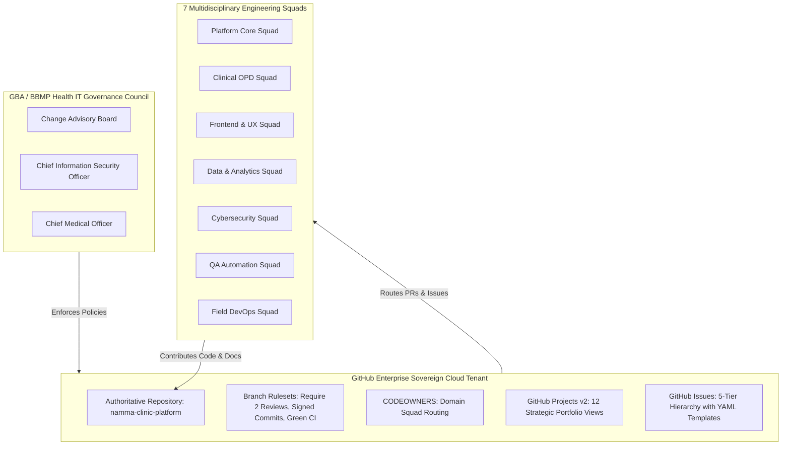

# Enterprise GitHub Governance Strategy & Repository Operating Model
## Namma Clinic Digital Health & Operations Platform
### Greater Bengaluru Authority (GBA) / BBMP Health Department
**Document Code:** `GH-STRAT-001` | **Version Tag:** `1.0.0` | **Status:** APPROVED BASELINE | **Date:** September 2026

---

## 1. Executive Summary & Strategic Mandate
The Enterprise GitHub Governance Strategy and Repository Operating Model establishes the authoritative organizational, procedural, cryptographic, and automated compliance standards governing the source code repository for the Namma Clinic Digital Health & Operations Platform. Authorized by the Joint Health Technology Steering Committee of the Greater Bengaluru Authority (GBA) and the Bruhat Bengaluru Mahanagara Palike (BBMP) Health Department, this document serves as the foundational operating charter for all engineering collaboration.

As a municipal critical infrastructure system processing sensitive personal health information (PHI) across 350+ urban primary health centers in Greater Bengaluru, the platform demands rigorous source code custody, zero-trust cryptographic access controls, automated security gate enforcement, and complete auditability complying with the Digital Personal Data Protection (DPDP) Act 2023, the Ayushman Bharat Digital Mission (ABDM) standards, and MeitY cloud hosting guidelines.

## 2. Current Fact vs. Target State Analysis
To maintain absolute transparency and prevent unwarranted assumptions, this specification explicitly delineates the current verified state of the repository from the target enterprise operating model to be configured on GitHub Enterprise:

| Governance Dimension | Current Fact (Verified Workspace State) | Target State (GitHub Enterprise Policy) | Operational Transition Mechanism |
| :--- | :--- | :--- | :--- |
| **Repository Structure** | Local git repository on branch `planning/master-project-plan` with 22 completed planning document phases. | Monorepo under enterprise organization hosting specifications, documentation, and eventual modular services. | Clean merge of planning baseline into default branch. |
| **Branch Protection** | Procedural discipline enforced via local pre-commit and validation Python scripts. | GitHub native branch protection rules enforcing 2 peer reviews, CODEOWNERS, green CI, and signed commits. | GitHub Repository Rulesets API configuration via Terraform. |
| **Issue Tracking** | Structured markdown registries in `docs/16-backlog/` (50 Epics, 250 Features, 500 Stories). | GitHub Issues with mandatory YAML form templates, custom fields, and automated triage. | Bulk automated import via GitHub REST API script. |
| **Project Boards** | Markdown sprint schedules and Gantt charts in `docs/18-sprints/` and `docs/20-timeplan/`. | GitHub Projects (v2) with 12 specialized views (Kanban, Roadmap, Blocker Radar). | GraphQL API automation provisioning Project boards. |
| **Access Control** | Single local user environment on authorized engineering workstation. | Enterprise SAML 2.0 SSO federated with BBMP Active Directory; strict RBAC. | SCIM synchronization and SAML team mapping. |
| **Commit Verification** | Standard git commits with local author attribution. | Mandatory GPG / SSH cryptographic commit signing with verified municipal identity keys. | GitHub branch protection 'Require signed commits'. |
| **CI/CD Execution** | Local automated validation test suites (`validate_*.py`). | Self-hosted ephemeral Kubernetes runners with zero persistence and isolated network namespaces. | GitHub Actions runner operator on sovereign cloud cluster. |
| **Security Scanning** | Local static checks and manual dependency reviews. | GitHub Advanced Security (Secret Scanning, Push Protection, CodeQL, Dependabot). | Enterprise license enablement and security policy activation. |
| **Release Tracking** | Comprehensive markdown release specifications in `docs/19-releases/`. | Git annotated tags (`vX.Y.Z`), GitHub Releases with SLSA Level 3 provenance attestations. | Automated GitHub Actions release pipeline. |
| **Audit Telemetry** | Local git log and markdown audit reports (`docs/23-audit/`). | Real-time GitHub Enterprise audit log streaming to BBMP Central SOC Splunk SIEM. | Enterprise webhook integration with HMAC-SHA256 signature. |

### Architecture Diagram: Enterprise Repository Operating Model


## 3. Authoritative Repository Governance Controls (REPO-001 to REPO-035)
Comprehensive specifications for all 35 canonical repository governance controls:

### REPO-001: Repository Purpose & Scope Mandate
- **Control Identifier:** `REPO-001`
- **Governance Domain:** Governance
- **Current Verified Fact:** Single git repository containing multi-phase municipal planning documentation.
- **Target Enterprise Policy:** Monorepo hosting complete Namma Clinic Digital Health & Operations Platform specifications, documentation, and eventual microservices.
- **Authoritative Policy Statement:** Repository scope is strictly limited to GBA / BBMP public healthcare digital infrastructure.
- **Accountable Owner:** BBMP Health Directorate / Principal Technical Lead
- **Audit Verification Frequency:** Quarterly

#### Operational Implementation Protocol for REPO-001
1. **Pre-requisite Verification:** Verify that configuration parameters conform to GBA security policy and DPDP Act 2023 mandates.
2. **Configuration Procedure:** Apply setting through GitHub Organization REST/GraphQL API or repository settings portal.
3. **Automated Validation:** Automated nightly script queries GitHub REST API endpoint `/repos/{owner}/{repo}` to verify control persistence.
4. **Drift Detection:** Any unauthorized drift or manual deactivation triggers an automatic Severity-1 incident to the CISO.
5. **Evidence Archival:** Cryptographic configuration snapshot exported, timestamped, and committed to immutable compliance ledger.

#### Technical Enforcement Specifications for REPO-001
- **Target Infrastructure:** GitHub Enterprise Cloud Sovereign Tenant (MeitY empaneled).
- **Enforcement Mechanism:** Native GitHub Repository Ruleset and Pre-Receive Commit Hook.
- **Bypass Exceptions:** Strictly zero bypass exceptions permitted under normal operating conditions.
- **Emergency Break-Glass Protocol:** Dual-authorization required from BBMP Chief Health Officer and CTO.
- **Audit Evidence Artifact:** JSON attestation log signed with Cosign / Sigstore private key.

#### Failure Mode Analysis & Remediation for REPO-001
- **Potential Failure Mode:** Administrative drift or accidental toggle during repository settings maintenance.
- **Detection Latency:** Real-time webhook notification dispatched to BBMP SecOps channel within 60 seconds.
- **Automated Remediation:** Infrastructure-as-Code (Terraform) reconciliation pipeline re-applies desired state within 5 minutes.
- **Post-Incident Action:** Mandatory Root Cause Analysis (RCA) presented to Joint IT Governance Council within 48 hours.

### REPO-002: Repository Ownership & Administrative Custody
- **Control Identifier:** `REPO-002`
- **Governance Domain:** Governance
- **Current Verified Fact:** Custody maintained by authorized municipal engineering administrators.
- **Target Enterprise Policy:** Dual administrative custody held by BBMP Chief Information Officer and GBA Technical Steering Secretariat.
- **Authoritative Policy Statement:** No single individual may hold exclusive administrative keys or root repository ownership.
- **Accountable Owner:** GBA / BBMP Joint IT Governance Board
- **Audit Verification Frequency:** Continuous

#### Operational Implementation Protocol for REPO-002
1. **Pre-requisite Verification:** Verify that configuration parameters conform to GBA security policy and DPDP Act 2023 mandates.
2. **Configuration Procedure:** Apply setting through GitHub Organization REST/GraphQL API or repository settings portal.
3. **Automated Validation:** Automated nightly script queries GitHub REST API endpoint `/repos/{owner}/{repo}` to verify control persistence.
4. **Drift Detection:** Any unauthorized drift or manual deactivation triggers an automatic Severity-1 incident to the CISO.
5. **Evidence Archival:** Cryptographic configuration snapshot exported, timestamped, and committed to immutable compliance ledger.

#### Technical Enforcement Specifications for REPO-002
- **Target Infrastructure:** GitHub Enterprise Cloud Sovereign Tenant (MeitY empaneled).
- **Enforcement Mechanism:** Native GitHub Repository Ruleset and Pre-Receive Commit Hook.
- **Bypass Exceptions:** Strictly zero bypass exceptions permitted under normal operating conditions.
- **Emergency Break-Glass Protocol:** Dual-authorization required from BBMP Chief Health Officer and CTO.
- **Audit Evidence Artifact:** JSON attestation log signed with Cosign / Sigstore private key.

#### Failure Mode Analysis & Remediation for REPO-002
- **Potential Failure Mode:** Administrative drift or accidental toggle during repository settings maintenance.
- **Detection Latency:** Real-time webhook notification dispatched to BBMP SecOps channel within 60 seconds.
- **Automated Remediation:** Infrastructure-as-Code (Terraform) reconciliation pipeline re-applies desired state within 5 minutes.
- **Post-Incident Action:** Mandatory Root Cause Analysis (RCA) presented to Joint IT Governance Council within 48 hours.

### REPO-003: Repository Visibility & Access Boundary
- **Control Identifier:** `REPO-003`
- **Governance Domain:** Access Control
- **Current Verified Fact:** Repository operates under private access controls during master planning phase.
- **Target Enterprise Policy:** Private enterprise repository with selected open-access documentation mirrors for public health transparency.
- **Authoritative Policy Statement:** Zero public disclosure of internal network topologies, cryptographic key references, or municipal API keys.
- **Accountable Owner:** CISO / Security Governance Squad
- **Audit Verification Frequency:** Monthly

#### Operational Implementation Protocol for REPO-003
1. **Pre-requisite Verification:** Verify that configuration parameters conform to GBA security policy and DPDP Act 2023 mandates.
2. **Configuration Procedure:** Apply setting through GitHub Organization REST/GraphQL API or repository settings portal.
3. **Automated Validation:** Automated nightly script queries GitHub REST API endpoint `/repos/{owner}/{repo}` to verify control persistence.
4. **Drift Detection:** Any unauthorized drift or manual deactivation triggers an automatic Severity-1 incident to the CISO.
5. **Evidence Archival:** Cryptographic configuration snapshot exported, timestamped, and committed to immutable compliance ledger.

#### Technical Enforcement Specifications for REPO-003
- **Target Infrastructure:** GitHub Enterprise Cloud Sovereign Tenant (MeitY empaneled).
- **Enforcement Mechanism:** Native GitHub Repository Ruleset and Pre-Receive Commit Hook.
- **Bypass Exceptions:** Strictly zero bypass exceptions permitted under normal operating conditions.
- **Emergency Break-Glass Protocol:** Dual-authorization required from BBMP Chief Health Officer and CTO.
- **Audit Evidence Artifact:** JSON attestation log signed with Cosign / Sigstore private key.

#### Failure Mode Analysis & Remediation for REPO-003
- **Potential Failure Mode:** Administrative drift or accidental toggle during repository settings maintenance.
- **Detection Latency:** Real-time webhook notification dispatched to BBMP SecOps channel within 60 seconds.
- **Automated Remediation:** Infrastructure-as-Code (Terraform) reconciliation pipeline re-applies desired state within 5 minutes.
- **Post-Incident Action:** Mandatory Root Cause Analysis (RCA) presented to Joint IT Governance Council within 48 hours.

### REPO-004: Default Branch Policy (`main`)
- **Control Identifier:** `REPO-004`
- **Governance Domain:** Branch Protection
- **Current Verified Fact:** Active planning branch is `planning/master-project-plan`; default branch is `main`.
- **Target Enterprise Policy:** `main` branch represents production-deployable state protected by mandatory reviews and quality gates.
- **Authoritative Policy Statement:** Direct commits to `main` are strictly blocked via GitHub Branch Protection Rules.
- **Accountable Owner:** Release Train Engineer / DevOps Lead
- **Audit Verification Frequency:** Continuous

#### Operational Implementation Protocol for REPO-004
1. **Pre-requisite Verification:** Verify that configuration parameters conform to GBA security policy and DPDP Act 2023 mandates.
2. **Configuration Procedure:** Apply setting through GitHub Organization REST/GraphQL API or repository settings portal.
3. **Automated Validation:** Automated nightly script queries GitHub REST API endpoint `/repos/{owner}/{repo}` to verify control persistence.
4. **Drift Detection:** Any unauthorized drift or manual deactivation triggers an automatic Severity-1 incident to the CISO.
5. **Evidence Archival:** Cryptographic configuration snapshot exported, timestamped, and committed to immutable compliance ledger.

#### Technical Enforcement Specifications for REPO-004
- **Target Infrastructure:** GitHub Enterprise Cloud Sovereign Tenant (MeitY empaneled).
- **Enforcement Mechanism:** Native GitHub Repository Ruleset and Pre-Receive Commit Hook.
- **Bypass Exceptions:** Strictly zero bypass exceptions permitted under normal operating conditions.
- **Emergency Break-Glass Protocol:** Dual-authorization required from BBMP Chief Health Officer and CTO.
- **Audit Evidence Artifact:** JSON attestation log signed with Cosign / Sigstore private key.

#### Failure Mode Analysis & Remediation for REPO-004
- **Potential Failure Mode:** Administrative drift or accidental toggle during repository settings maintenance.
- **Detection Latency:** Real-time webhook notification dispatched to BBMP SecOps channel within 60 seconds.
- **Automated Remediation:** Infrastructure-as-Code (Terraform) reconciliation pipeline re-applies desired state within 5 minutes.
- **Post-Incident Action:** Mandatory Root Cause Analysis (RCA) presented to Joint IT Governance Council within 48 hours.

### REPO-005: Protected Branch Policy for `main` and `staging`
- **Control Identifier:** `REPO-005`
- **Governance Domain:** Branch Protection
- **Current Verified Fact:** Branch protection rules planned and specified in Phase 12 DevOps baseline.
- **Target Enterprise Policy:** Automated GitHub Branch Protection enforcing 2 approvals, signed commits, and passing CI checks.
- **Authoritative Policy Statement:** Force-pushes (`git push --force`) and branch deletions are permanently disabled for protected branches.
- **Accountable Owner:** DevOps / Infrastructure Squad
- **Audit Verification Frequency:** Continuous

#### Operational Implementation Protocol for REPO-005
1. **Pre-requisite Verification:** Verify that configuration parameters conform to GBA security policy and DPDP Act 2023 mandates.
2. **Configuration Procedure:** Apply setting through GitHub Organization REST/GraphQL API or repository settings portal.
3. **Automated Validation:** Automated nightly script queries GitHub REST API endpoint `/repos/{owner}/{repo}` to verify control persistence.
4. **Drift Detection:** Any unauthorized drift or manual deactivation triggers an automatic Severity-1 incident to the CISO.
5. **Evidence Archival:** Cryptographic configuration snapshot exported, timestamped, and committed to immutable compliance ledger.

#### Technical Enforcement Specifications for REPO-005
- **Target Infrastructure:** GitHub Enterprise Cloud Sovereign Tenant (MeitY empaneled).
- **Enforcement Mechanism:** Native GitHub Repository Ruleset and Pre-Receive Commit Hook.
- **Bypass Exceptions:** Strictly zero bypass exceptions permitted under normal operating conditions.
- **Emergency Break-Glass Protocol:** Dual-authorization required from BBMP Chief Health Officer and CTO.
- **Audit Evidence Artifact:** JSON attestation log signed with Cosign / Sigstore private key.

#### Failure Mode Analysis & Remediation for REPO-005
- **Potential Failure Mode:** Administrative drift or accidental toggle during repository settings maintenance.
- **Detection Latency:** Real-time webhook notification dispatched to BBMP SecOps channel within 60 seconds.
- **Automated Remediation:** Infrastructure-as-Code (Terraform) reconciliation pipeline re-applies desired state within 5 minutes.
- **Post-Incident Action:** Mandatory Root Cause Analysis (RCA) presented to Joint IT Governance Council within 48 hours.

### REPO-006: Required Pull Request Reviews & Approvals
- **Control Identifier:** `REPO-006`
- **Governance Domain:** Review Governance
- **Current Verified Fact:** Peer review conducted via local verification scripts and planning walkthroughs.
- **Target Enterprise Policy:** Minimum 2 peer approvals required for all pull requests targeting protected branches.
- **Authoritative Policy Statement:** Author cannot approve their own pull request; stale reviews dismissed on new commit pushes.
- **Accountable Owner:** Engineering Team Leads
- **Audit Verification Frequency:** Per Pull Request

#### Operational Implementation Protocol for REPO-006
1. **Pre-requisite Verification:** Verify that configuration parameters conform to GBA security policy and DPDP Act 2023 mandates.
2. **Configuration Procedure:** Apply setting through GitHub Organization REST/GraphQL API or repository settings portal.
3. **Automated Validation:** Automated nightly script queries GitHub REST API endpoint `/repos/{owner}/{repo}` to verify control persistence.
4. **Drift Detection:** Any unauthorized drift or manual deactivation triggers an automatic Severity-1 incident to the CISO.
5. **Evidence Archival:** Cryptographic configuration snapshot exported, timestamped, and committed to immutable compliance ledger.

#### Technical Enforcement Specifications for REPO-006
- **Target Infrastructure:** GitHub Enterprise Cloud Sovereign Tenant (MeitY empaneled).
- **Enforcement Mechanism:** Native GitHub Repository Ruleset and Pre-Receive Commit Hook.
- **Bypass Exceptions:** Strictly zero bypass exceptions permitted under normal operating conditions.
- **Emergency Break-Glass Protocol:** Dual-authorization required from BBMP Chief Health Officer and CTO.
- **Audit Evidence Artifact:** JSON attestation log signed with Cosign / Sigstore private key.

#### Failure Mode Analysis & Remediation for REPO-006
- **Potential Failure Mode:** Administrative drift or accidental toggle during repository settings maintenance.
- **Detection Latency:** Real-time webhook notification dispatched to BBMP SecOps channel within 60 seconds.
- **Automated Remediation:** Infrastructure-as-Code (Terraform) reconciliation pipeline re-applies desired state within 5 minutes.
- **Post-Incident Action:** Mandatory Root Cause Analysis (RCA) presented to Joint IT Governance Council within 48 hours.

### REPO-007: CODEOWNERS Architecture & Domain Routing
- **Control Identifier:** `REPO-007`
- **Governance Domain:** Review Governance
- **Current Verified Fact:** Domain ownership defined in Phase 01 project management and Phase 17 squad capacity.
- **Target Enterprise Policy:** Authoritative `.github/CODEOWNERS` routing file enforcing squad-based approvals for clinical, security, and DB code.
- **Authoritative Policy Statement:** Modifications to critical paths require mandatory sign-off from designated CODEOWNERS team.
- **Accountable Owner:** Lead Solutions Architect
- **Audit Verification Frequency:** Per Sprint

#### Operational Implementation Protocol for REPO-007
1. **Pre-requisite Verification:** Verify that configuration parameters conform to GBA security policy and DPDP Act 2023 mandates.
2. **Configuration Procedure:** Apply setting through GitHub Organization REST/GraphQL API or repository settings portal.
3. **Automated Validation:** Automated nightly script queries GitHub REST API endpoint `/repos/{owner}/{repo}` to verify control persistence.
4. **Drift Detection:** Any unauthorized drift or manual deactivation triggers an automatic Severity-1 incident to the CISO.
5. **Evidence Archival:** Cryptographic configuration snapshot exported, timestamped, and committed to immutable compliance ledger.

#### Technical Enforcement Specifications for REPO-007
- **Target Infrastructure:** GitHub Enterprise Cloud Sovereign Tenant (MeitY empaneled).
- **Enforcement Mechanism:** Native GitHub Repository Ruleset and Pre-Receive Commit Hook.
- **Bypass Exceptions:** Strictly zero bypass exceptions permitted under normal operating conditions.
- **Emergency Break-Glass Protocol:** Dual-authorization required from BBMP Chief Health Officer and CTO.
- **Audit Evidence Artifact:** JSON attestation log signed with Cosign / Sigstore private key.

#### Failure Mode Analysis & Remediation for REPO-007
- **Potential Failure Mode:** Administrative drift or accidental toggle during repository settings maintenance.
- **Detection Latency:** Real-time webhook notification dispatched to BBMP SecOps channel within 60 seconds.
- **Automated Remediation:** Infrastructure-as-Code (Terraform) reconciliation pipeline re-applies desired state within 5 minutes.
- **Post-Incident Action:** Mandatory Root Cause Analysis (RCA) presented to Joint IT Governance Council within 48 hours.

### REPO-008: Secret Scanning & Push Protection
- **Control Identifier:** `REPO-008`
- **Governance Domain:** Security
- **Current Verified Fact:** Zero secrets verified via pre-commit audit scripts and documentation invariants.
- **Target Enterprise Policy:** GitHub Advanced Security Secret Scanning active with pre-receive push protection blocking leaked tokens.
- **Authoritative Policy Statement:** Any detected secret token immediately halts git push and triggers automatic credential revocation.
- **Accountable Owner:** CISO / Cybersecurity Squad
- **Audit Verification Frequency:** Real-time

#### Operational Implementation Protocol for REPO-008
1. **Pre-requisite Verification:** Verify that configuration parameters conform to GBA security policy and DPDP Act 2023 mandates.
2. **Configuration Procedure:** Apply setting through GitHub Organization REST/GraphQL API or repository settings portal.
3. **Automated Validation:** Automated nightly script queries GitHub REST API endpoint `/repos/{owner}/{repo}` to verify control persistence.
4. **Drift Detection:** Any unauthorized drift or manual deactivation triggers an automatic Severity-1 incident to the CISO.
5. **Evidence Archival:** Cryptographic configuration snapshot exported, timestamped, and committed to immutable compliance ledger.

#### Technical Enforcement Specifications for REPO-008
- **Target Infrastructure:** GitHub Enterprise Cloud Sovereign Tenant (MeitY empaneled).
- **Enforcement Mechanism:** Native GitHub Repository Ruleset and Pre-Receive Commit Hook.
- **Bypass Exceptions:** Strictly zero bypass exceptions permitted under normal operating conditions.
- **Emergency Break-Glass Protocol:** Dual-authorization required from BBMP Chief Health Officer and CTO.
- **Audit Evidence Artifact:** JSON attestation log signed with Cosign / Sigstore private key.

#### Failure Mode Analysis & Remediation for REPO-008
- **Potential Failure Mode:** Administrative drift or accidental toggle during repository settings maintenance.
- **Detection Latency:** Real-time webhook notification dispatched to BBMP SecOps channel within 60 seconds.
- **Automated Remediation:** Infrastructure-as-Code (Terraform) reconciliation pipeline re-applies desired state within 5 minutes.
- **Post-Incident Action:** Mandatory Root Cause Analysis (RCA) presented to Joint IT Governance Council within 48 hours.

### REPO-009: CodeQL & SAST Static Analysis Scanning
- **Control Identifier:** `REPO-009`
- **Governance Domain:** Security
- **Current Verified Fact:** Static linting and line count verification enforced via repository Python scripts.
- **Target Enterprise Policy:** Automated CodeQL scanning runs on every PR and bi-weekly scheduled cron across all branches.
- **Authoritative Policy Statement:** Zero Critical or High severity security alerts allowed to merge into any protected branch.
- **Accountable Owner:** Security Architect / QA Lead
- **Audit Verification Frequency:** Per PR / Scheduled

#### Operational Implementation Protocol for REPO-009
1. **Pre-requisite Verification:** Verify that configuration parameters conform to GBA security policy and DPDP Act 2023 mandates.
2. **Configuration Procedure:** Apply setting through GitHub Organization REST/GraphQL API or repository settings portal.
3. **Automated Validation:** Automated nightly script queries GitHub REST API endpoint `/repos/{owner}/{repo}` to verify control persistence.
4. **Drift Detection:** Any unauthorized drift or manual deactivation triggers an automatic Severity-1 incident to the CISO.
5. **Evidence Archival:** Cryptographic configuration snapshot exported, timestamped, and committed to immutable compliance ledger.

#### Technical Enforcement Specifications for REPO-009
- **Target Infrastructure:** GitHub Enterprise Cloud Sovereign Tenant (MeitY empaneled).
- **Enforcement Mechanism:** Native GitHub Repository Ruleset and Pre-Receive Commit Hook.
- **Bypass Exceptions:** Strictly zero bypass exceptions permitted under normal operating conditions.
- **Emergency Break-Glass Protocol:** Dual-authorization required from BBMP Chief Health Officer and CTO.
- **Audit Evidence Artifact:** JSON attestation log signed with Cosign / Sigstore private key.

#### Failure Mode Analysis & Remediation for REPO-009
- **Potential Failure Mode:** Administrative drift or accidental toggle during repository settings maintenance.
- **Detection Latency:** Real-time webhook notification dispatched to BBMP SecOps channel within 60 seconds.
- **Automated Remediation:** Infrastructure-as-Code (Terraform) reconciliation pipeline re-applies desired state within 5 minutes.
- **Post-Incident Action:** Mandatory Root Cause Analysis (RCA) presented to Joint IT Governance Council within 48 hours.

### REPO-010: Dependabot Automated Dependency Auditing
- **Control Identifier:** `REPO-010`
- **Governance Domain:** Security
- **Current Verified Fact:** Dependencies specified in package manifests and architectural planning registers.
- **Target Enterprise Policy:** Dependabot alerts and security pull requests enabled for automated npm/pip CVE mitigation.
- **Authoritative Policy Statement:** Vulnerabilities with CVSS score >= 7.0 must be remediated within 48 hours of alert issuance.
- **Accountable Owner:** DevOps / Infrastructure Squad
- **Audit Verification Frequency:** Daily

#### Operational Implementation Protocol for REPO-010
1. **Pre-requisite Verification:** Verify that configuration parameters conform to GBA security policy and DPDP Act 2023 mandates.
2. **Configuration Procedure:** Apply setting through GitHub Organization REST/GraphQL API or repository settings portal.
3. **Automated Validation:** Automated nightly script queries GitHub REST API endpoint `/repos/{owner}/{repo}` to verify control persistence.
4. **Drift Detection:** Any unauthorized drift or manual deactivation triggers an automatic Severity-1 incident to the CISO.
5. **Evidence Archival:** Cryptographic configuration snapshot exported, timestamped, and committed to immutable compliance ledger.

#### Technical Enforcement Specifications for REPO-010
- **Target Infrastructure:** GitHub Enterprise Cloud Sovereign Tenant (MeitY empaneled).
- **Enforcement Mechanism:** Native GitHub Repository Ruleset and Pre-Receive Commit Hook.
- **Bypass Exceptions:** Strictly zero bypass exceptions permitted under normal operating conditions.
- **Emergency Break-Glass Protocol:** Dual-authorization required from BBMP Chief Health Officer and CTO.
- **Audit Evidence Artifact:** JSON attestation log signed with Cosign / Sigstore private key.

#### Failure Mode Analysis & Remediation for REPO-010
- **Potential Failure Mode:** Administrative drift or accidental toggle during repository settings maintenance.
- **Detection Latency:** Real-time webhook notification dispatched to BBMP SecOps channel within 60 seconds.
- **Automated Remediation:** Infrastructure-as-Code (Terraform) reconciliation pipeline re-applies desired state within 5 minutes.
- **Post-Incident Action:** Mandatory Root Cause Analysis (RCA) presented to Joint IT Governance Council within 48 hours.

### REPO-011: Repository Role-Based Access Control (RBAC)
- **Control Identifier:** `REPO-011`
- **Governance Domain:** Access Control
- **Current Verified Fact:** Local working environment restricted to authorized pair-programming agents.
- **Target Enterprise Policy:** Enterprise SAML SSO mapped to BBMP Active Directory: Admin, Maintainer, Write, Triage, and Read roles.
- **Authoritative Policy Statement:** Principle of least privilege strictly enforced; write access granted only to verified squad members.
- **Accountable Owner:** BBMP Health IT Administrator
- **Audit Verification Frequency:** Monthly

#### Operational Implementation Protocol for REPO-011
1. **Pre-requisite Verification:** Verify that configuration parameters conform to GBA security policy and DPDP Act 2023 mandates.
2. **Configuration Procedure:** Apply setting through GitHub Organization REST/GraphQL API or repository settings portal.
3. **Automated Validation:** Automated nightly script queries GitHub REST API endpoint `/repos/{owner}/{repo}` to verify control persistence.
4. **Drift Detection:** Any unauthorized drift or manual deactivation triggers an automatic Severity-1 incident to the CISO.
5. **Evidence Archival:** Cryptographic configuration snapshot exported, timestamped, and committed to immutable compliance ledger.

#### Technical Enforcement Specifications for REPO-011
- **Target Infrastructure:** GitHub Enterprise Cloud Sovereign Tenant (MeitY empaneled).
- **Enforcement Mechanism:** Native GitHub Repository Ruleset and Pre-Receive Commit Hook.
- **Bypass Exceptions:** Strictly zero bypass exceptions permitted under normal operating conditions.
- **Emergency Break-Glass Protocol:** Dual-authorization required from BBMP Chief Health Officer and CTO.
- **Audit Evidence Artifact:** JSON attestation log signed with Cosign / Sigstore private key.

#### Failure Mode Analysis & Remediation for REPO-011
- **Potential Failure Mode:** Administrative drift or accidental toggle during repository settings maintenance.
- **Detection Latency:** Real-time webhook notification dispatched to BBMP SecOps channel within 60 seconds.
- **Automated Remediation:** Infrastructure-as-Code (Terraform) reconciliation pipeline re-applies desired state within 5 minutes.
- **Post-Incident Action:** Mandatory Root Cause Analysis (RCA) presented to Joint IT Governance Council within 48 hours.

### REPO-012: Two-Factor Authentication (2FA) Mandate
- **Control Identifier:** `REPO-012`
- **Governance Domain:** Access Control
- **Current Verified Fact:** Local repository development governed by system user credentials.
- **Target Enterprise Policy:** Organization-wide 2FA requirement enforced with FIDO2 hardware keys or mobile TOTP.
- **Authoritative Policy Statement:** Users without verified 2FA automatically lose write and maintain permissions.
- **Accountable Owner:** CISO
- **Audit Verification Frequency:** Continuous

#### Operational Implementation Protocol for REPO-012
1. **Pre-requisite Verification:** Verify that configuration parameters conform to GBA security policy and DPDP Act 2023 mandates.
2. **Configuration Procedure:** Apply setting through GitHub Organization REST/GraphQL API or repository settings portal.
3. **Automated Validation:** Automated nightly script queries GitHub REST API endpoint `/repos/{owner}/{repo}` to verify control persistence.
4. **Drift Detection:** Any unauthorized drift or manual deactivation triggers an automatic Severity-1 incident to the CISO.
5. **Evidence Archival:** Cryptographic configuration snapshot exported, timestamped, and committed to immutable compliance ledger.

#### Technical Enforcement Specifications for REPO-012
- **Target Infrastructure:** GitHub Enterprise Cloud Sovereign Tenant (MeitY empaneled).
- **Enforcement Mechanism:** Native GitHub Repository Ruleset and Pre-Receive Commit Hook.
- **Bypass Exceptions:** Strictly zero bypass exceptions permitted under normal operating conditions.
- **Emergency Break-Glass Protocol:** Dual-authorization required from BBMP Chief Health Officer and CTO.
- **Audit Evidence Artifact:** JSON attestation log signed with Cosign / Sigstore private key.

#### Failure Mode Analysis & Remediation for REPO-012
- **Potential Failure Mode:** Administrative drift or accidental toggle during repository settings maintenance.
- **Detection Latency:** Real-time webhook notification dispatched to BBMP SecOps channel within 60 seconds.
- **Automated Remediation:** Infrastructure-as-Code (Terraform) reconciliation pipeline re-applies desired state within 5 minutes.
- **Post-Incident Action:** Mandatory Root Cause Analysis (RCA) presented to Joint IT Governance Council within 48 hours.

### REPO-013: GPG / SSH Cryptographic Commit Signing
- **Control Identifier:** `REPO-013`
- **Governance Domain:** Integrity
- **Current Verified Fact:** Git commits recorded locally with standard git author configurations.
- **Target Enterprise Policy:** Enforced signed commits (`git commit -S`) using verified GPG/SSH keys matching municipal identity.
- **Authoritative Policy Statement:** Unsigned commits are automatically rejected by GitHub branch protection on protected branches.
- **Accountable Owner:** Security Governance Lead
- **Audit Verification Frequency:** Continuous

#### Operational Implementation Protocol for REPO-013
1. **Pre-requisite Verification:** Verify that configuration parameters conform to GBA security policy and DPDP Act 2023 mandates.
2. **Configuration Procedure:** Apply setting through GitHub Organization REST/GraphQL API or repository settings portal.
3. **Automated Validation:** Automated nightly script queries GitHub REST API endpoint `/repos/{owner}/{repo}` to verify control persistence.
4. **Drift Detection:** Any unauthorized drift or manual deactivation triggers an automatic Severity-1 incident to the CISO.
5. **Evidence Archival:** Cryptographic configuration snapshot exported, timestamped, and committed to immutable compliance ledger.

#### Technical Enforcement Specifications for REPO-013
- **Target Infrastructure:** GitHub Enterprise Cloud Sovereign Tenant (MeitY empaneled).
- **Enforcement Mechanism:** Native GitHub Repository Ruleset and Pre-Receive Commit Hook.
- **Bypass Exceptions:** Strictly zero bypass exceptions permitted under normal operating conditions.
- **Emergency Break-Glass Protocol:** Dual-authorization required from BBMP Chief Health Officer and CTO.
- **Audit Evidence Artifact:** JSON attestation log signed with Cosign / Sigstore private key.

#### Failure Mode Analysis & Remediation for REPO-013
- **Potential Failure Mode:** Administrative drift or accidental toggle during repository settings maintenance.
- **Detection Latency:** Real-time webhook notification dispatched to BBMP SecOps channel within 60 seconds.
- **Automated Remediation:** Infrastructure-as-Code (Terraform) reconciliation pipeline re-applies desired state within 5 minutes.
- **Post-Incident Action:** Mandatory Root Cause Analysis (RCA) presented to Joint IT Governance Council within 48 hours.

### REPO-014: Linear Git History & Fast-Forward Policy
- **Control Identifier:** `REPO-014`
- **Governance Domain:** Branch Protection
- **Current Verified Fact:** Clean sequential commit history maintained on `planning/master-project-plan`.
- **Target Enterprise Policy:** Protected branches require linear history; merge commits prevented via Squash & Merge policy.
- **Authoritative Policy Statement:** Feature branch histories squashed into single descriptive commit referencing issue identifier.
- **Accountable Owner:** Release Train Engineer
- **Audit Verification Frequency:** Continuous

#### Operational Implementation Protocol for REPO-014
1. **Pre-requisite Verification:** Verify that configuration parameters conform to GBA security policy and DPDP Act 2023 mandates.
2. **Configuration Procedure:** Apply setting through GitHub Organization REST/GraphQL API or repository settings portal.
3. **Automated Validation:** Automated nightly script queries GitHub REST API endpoint `/repos/{owner}/{repo}` to verify control persistence.
4. **Drift Detection:** Any unauthorized drift or manual deactivation triggers an automatic Severity-1 incident to the CISO.
5. **Evidence Archival:** Cryptographic configuration snapshot exported, timestamped, and committed to immutable compliance ledger.

#### Technical Enforcement Specifications for REPO-014
- **Target Infrastructure:** GitHub Enterprise Cloud Sovereign Tenant (MeitY empaneled).
- **Enforcement Mechanism:** Native GitHub Repository Ruleset and Pre-Receive Commit Hook.
- **Bypass Exceptions:** Strictly zero bypass exceptions permitted under normal operating conditions.
- **Emergency Break-Glass Protocol:** Dual-authorization required from BBMP Chief Health Officer and CTO.
- **Audit Evidence Artifact:** JSON attestation log signed with Cosign / Sigstore private key.

#### Failure Mode Analysis & Remediation for REPO-014
- **Potential Failure Mode:** Administrative drift or accidental toggle during repository settings maintenance.
- **Detection Latency:** Real-time webhook notification dispatched to BBMP SecOps channel within 60 seconds.
- **Automated Remediation:** Infrastructure-as-Code (Terraform) reconciliation pipeline re-applies desired state within 5 minutes.
- **Post-Incident Action:** Mandatory Root Cause Analysis (RCA) presented to Joint IT Governance Council within 48 hours.

### REPO-015: Automated Stale Branch Deletion
- **Control Identifier:** `REPO-015`
- **Governance Domain:** Repository Hygiene
- **Current Verified Fact:** Single working branch maintained to eliminate git sprawl.
- **Target Enterprise Policy:** GitHub setting 'Automatically delete head branches' enabled for all merged pull requests.
- **Authoritative Policy Statement:** Branches merged into `main` or `staging` automatically deleted within 60 seconds of merge.
- **Accountable Owner:** DevOps Squad
- **Audit Verification Frequency:** Real-time

#### Operational Implementation Protocol for REPO-015
1. **Pre-requisite Verification:** Verify that configuration parameters conform to GBA security policy and DPDP Act 2023 mandates.
2. **Configuration Procedure:** Apply setting through GitHub Organization REST/GraphQL API or repository settings portal.
3. **Automated Validation:** Automated nightly script queries GitHub REST API endpoint `/repos/{owner}/{repo}` to verify control persistence.
4. **Drift Detection:** Any unauthorized drift or manual deactivation triggers an automatic Severity-1 incident to the CISO.
5. **Evidence Archival:** Cryptographic configuration snapshot exported, timestamped, and committed to immutable compliance ledger.

#### Technical Enforcement Specifications for REPO-015
- **Target Infrastructure:** GitHub Enterprise Cloud Sovereign Tenant (MeitY empaneled).
- **Enforcement Mechanism:** Native GitHub Repository Ruleset and Pre-Receive Commit Hook.
- **Bypass Exceptions:** Strictly zero bypass exceptions permitted under normal operating conditions.
- **Emergency Break-Glass Protocol:** Dual-authorization required from BBMP Chief Health Officer and CTO.
- **Audit Evidence Artifact:** JSON attestation log signed with Cosign / Sigstore private key.

#### Failure Mode Analysis & Remediation for REPO-015
- **Potential Failure Mode:** Administrative drift or accidental toggle during repository settings maintenance.
- **Detection Latency:** Real-time webhook notification dispatched to BBMP SecOps channel within 60 seconds.
- **Automated Remediation:** Infrastructure-as-Code (Terraform) reconciliation pipeline re-applies desired state within 5 minutes.
- **Post-Incident Action:** Mandatory Root Cause Analysis (RCA) presented to Joint IT Governance Council within 48 hours.

### REPO-016: Repository Naming Conventions
- **Control Identifier:** `REPO-016`
- **Governance Domain:** Standards
- **Current Verified Fact:** Repository named `mvp` under organization `saimaa0910`.
- **Target Enterprise Policy:** Official production repository namespace: `bbmp-health/namma-clinic-platform`.
- **Authoritative Policy Statement:** All satellite tools and packages follow kebab-case: `namma-clinic-sync`, `namma-clinic-cli`.
- **Accountable Owner:** Technical Steering Committee
- **Audit Verification Frequency:** Annual

#### Operational Implementation Protocol for REPO-016
1. **Pre-requisite Verification:** Verify that configuration parameters conform to GBA security policy and DPDP Act 2023 mandates.
2. **Configuration Procedure:** Apply setting through GitHub Organization REST/GraphQL API or repository settings portal.
3. **Automated Validation:** Automated nightly script queries GitHub REST API endpoint `/repos/{owner}/{repo}` to verify control persistence.
4. **Drift Detection:** Any unauthorized drift or manual deactivation triggers an automatic Severity-1 incident to the CISO.
5. **Evidence Archival:** Cryptographic configuration snapshot exported, timestamped, and committed to immutable compliance ledger.

#### Technical Enforcement Specifications for REPO-016
- **Target Infrastructure:** GitHub Enterprise Cloud Sovereign Tenant (MeitY empaneled).
- **Enforcement Mechanism:** Native GitHub Repository Ruleset and Pre-Receive Commit Hook.
- **Bypass Exceptions:** Strictly zero bypass exceptions permitted under normal operating conditions.
- **Emergency Break-Glass Protocol:** Dual-authorization required from BBMP Chief Health Officer and CTO.
- **Audit Evidence Artifact:** JSON attestation log signed with Cosign / Sigstore private key.

#### Failure Mode Analysis & Remediation for REPO-016
- **Potential Failure Mode:** Administrative drift or accidental toggle during repository settings maintenance.
- **Detection Latency:** Real-time webhook notification dispatched to BBMP SecOps channel within 60 seconds.
- **Automated Remediation:** Infrastructure-as-Code (Terraform) reconciliation pipeline re-applies desired state within 5 minutes.
- **Post-Incident Action:** Mandatory Root Cause Analysis (RCA) presented to Joint IT Governance Council within 48 hours.

### REPO-017: Issue & Discussion Templates Governance
- **Control Identifier:** `REPO-017`
- **Governance Domain:** Issue Management
- **Current Verified Fact:** Comprehensive markdown templates documented in project baseline.
- **Target Enterprise Policy:** Mandatory `.github/ISSUE_TEMPLATE/` YAML forms enforcing required fields and validation.
- **Authoritative Policy Statement:** Blank issue creation disabled; all issues must instantiate from an approved issue template.
- **Accountable Owner:** Product Operations Lead
- **Audit Verification Frequency:** Quarterly

#### Operational Implementation Protocol for REPO-017
1. **Pre-requisite Verification:** Verify that configuration parameters conform to GBA security policy and DPDP Act 2023 mandates.
2. **Configuration Procedure:** Apply setting through GitHub Organization REST/GraphQL API or repository settings portal.
3. **Automated Validation:** Automated nightly script queries GitHub REST API endpoint `/repos/{owner}/{repo}` to verify control persistence.
4. **Drift Detection:** Any unauthorized drift or manual deactivation triggers an automatic Severity-1 incident to the CISO.
5. **Evidence Archival:** Cryptographic configuration snapshot exported, timestamped, and committed to immutable compliance ledger.

#### Technical Enforcement Specifications for REPO-017
- **Target Infrastructure:** GitHub Enterprise Cloud Sovereign Tenant (MeitY empaneled).
- **Enforcement Mechanism:** Native GitHub Repository Ruleset and Pre-Receive Commit Hook.
- **Bypass Exceptions:** Strictly zero bypass exceptions permitted under normal operating conditions.
- **Emergency Break-Glass Protocol:** Dual-authorization required from BBMP Chief Health Officer and CTO.
- **Audit Evidence Artifact:** JSON attestation log signed with Cosign / Sigstore private key.

#### Failure Mode Analysis & Remediation for REPO-017
- **Potential Failure Mode:** Administrative drift or accidental toggle during repository settings maintenance.
- **Detection Latency:** Real-time webhook notification dispatched to BBMP SecOps channel within 60 seconds.
- **Automated Remediation:** Infrastructure-as-Code (Terraform) reconciliation pipeline re-applies desired state within 5 minutes.
- **Post-Incident Action:** Mandatory Root Cause Analysis (RCA) presented to Joint IT Governance Council within 48 hours.

### REPO-018: Pull Request Template Governance
- **Control Identifier:** `REPO-018`
- **Governance Domain:** Review Governance
- **Current Verified Fact:** Detailed PR checklists documented in Phase 12 DevOps and Phase 11 QA baselines.
- **Target Enterprise Policy:** Standard `.github/PULL_REQUEST_TEMPLATE.md` enforcing clinical, security, and testing checklists.
- **Authoritative Policy Statement:** PR descriptions must link at least one valid issue (`Closes #123`) and complete verification boxes.
- **Accountable Owner:** QA Lead / Scrum Master
- **Audit Verification Frequency:** Continuous

#### Operational Implementation Protocol for REPO-018
1. **Pre-requisite Verification:** Verify that configuration parameters conform to GBA security policy and DPDP Act 2023 mandates.
2. **Configuration Procedure:** Apply setting through GitHub Organization REST/GraphQL API or repository settings portal.
3. **Automated Validation:** Automated nightly script queries GitHub REST API endpoint `/repos/{owner}/{repo}` to verify control persistence.
4. **Drift Detection:** Any unauthorized drift or manual deactivation triggers an automatic Severity-1 incident to the CISO.
5. **Evidence Archival:** Cryptographic configuration snapshot exported, timestamped, and committed to immutable compliance ledger.

#### Technical Enforcement Specifications for REPO-018
- **Target Infrastructure:** GitHub Enterprise Cloud Sovereign Tenant (MeitY empaneled).
- **Enforcement Mechanism:** Native GitHub Repository Ruleset and Pre-Receive Commit Hook.
- **Bypass Exceptions:** Strictly zero bypass exceptions permitted under normal operating conditions.
- **Emergency Break-Glass Protocol:** Dual-authorization required from BBMP Chief Health Officer and CTO.
- **Audit Evidence Artifact:** JSON attestation log signed with Cosign / Sigstore private key.

#### Failure Mode Analysis & Remediation for REPO-018
- **Potential Failure Mode:** Administrative drift or accidental toggle during repository settings maintenance.
- **Detection Latency:** Real-time webhook notification dispatched to BBMP SecOps channel within 60 seconds.
- **Automated Remediation:** Infrastructure-as-Code (Terraform) reconciliation pipeline re-applies desired state within 5 minutes.
- **Post-Incident Action:** Mandatory Root Cause Analysis (RCA) presented to Joint IT Governance Council within 48 hours.

### REPO-019: Documentation-First Maintenance Invariant
- **Control Identifier:** `REPO-019`
- **Governance Domain:** Governance
- **Current Verified Fact:** Complete 22-phase documentation baseline established prior to production runtime code.
- **Target Enterprise Policy:** Architectural documentation in `docs/` updated in the exact same PR as related code changes.
- **Authoritative Policy Statement:** No code pull request merged without corresponding architectural decision record (ADR) or doc update.
- **Accountable Owner:** Principal Architect
- **Audit Verification Frequency:** Per Pull Request

#### Operational Implementation Protocol for REPO-019
1. **Pre-requisite Verification:** Verify that configuration parameters conform to GBA security policy and DPDP Act 2023 mandates.
2. **Configuration Procedure:** Apply setting through GitHub Organization REST/GraphQL API or repository settings portal.
3. **Automated Validation:** Automated nightly script queries GitHub REST API endpoint `/repos/{owner}/{repo}` to verify control persistence.
4. **Drift Detection:** Any unauthorized drift or manual deactivation triggers an automatic Severity-1 incident to the CISO.
5. **Evidence Archival:** Cryptographic configuration snapshot exported, timestamped, and committed to immutable compliance ledger.

#### Technical Enforcement Specifications for REPO-019
- **Target Infrastructure:** GitHub Enterprise Cloud Sovereign Tenant (MeitY empaneled).
- **Enforcement Mechanism:** Native GitHub Repository Ruleset and Pre-Receive Commit Hook.
- **Bypass Exceptions:** Strictly zero bypass exceptions permitted under normal operating conditions.
- **Emergency Break-Glass Protocol:** Dual-authorization required from BBMP Chief Health Officer and CTO.
- **Audit Evidence Artifact:** JSON attestation log signed with Cosign / Sigstore private key.

#### Failure Mode Analysis & Remediation for REPO-019
- **Potential Failure Mode:** Administrative drift or accidental toggle during repository settings maintenance.
- **Detection Latency:** Real-time webhook notification dispatched to BBMP SecOps channel within 60 seconds.
- **Automated Remediation:** Infrastructure-as-Code (Terraform) reconciliation pipeline re-applies desired state within 5 minutes.
- **Post-Incident Action:** Mandatory Root Cause Analysis (RCA) presented to Joint IT Governance Council within 48 hours.

### REPO-020: Audit Logging & SIEM Telemetry Streaming
- **Control Identifier:** `REPO-020`
- **Governance Domain:** Security
- **Current Verified Fact:** Local git commit history and audit markdown files provide tamper-evident records.
- **Target Enterprise Policy:** GitHub Enterprise audit log streamed via webhook to BBMP Central SOC Splunk / Elasticsearch cluster.
- **Authoritative Policy Statement:** All repository permissions changes, branch deletions, and secret alerts retained for 7 years.
- **Accountable Owner:** CISO
- **Audit Verification Frequency:** Continuous

#### Operational Implementation Protocol for REPO-020
1. **Pre-requisite Verification:** Verify that configuration parameters conform to GBA security policy and DPDP Act 2023 mandates.
2. **Configuration Procedure:** Apply setting through GitHub Organization REST/GraphQL API or repository settings portal.
3. **Automated Validation:** Automated nightly script queries GitHub REST API endpoint `/repos/{owner}/{repo}` to verify control persistence.
4. **Drift Detection:** Any unauthorized drift or manual deactivation triggers an automatic Severity-1 incident to the CISO.
5. **Evidence Archival:** Cryptographic configuration snapshot exported, timestamped, and committed to immutable compliance ledger.

#### Technical Enforcement Specifications for REPO-020
- **Target Infrastructure:** GitHub Enterprise Cloud Sovereign Tenant (MeitY empaneled).
- **Enforcement Mechanism:** Native GitHub Repository Ruleset and Pre-Receive Commit Hook.
- **Bypass Exceptions:** Strictly zero bypass exceptions permitted under normal operating conditions.
- **Emergency Break-Glass Protocol:** Dual-authorization required from BBMP Chief Health Officer and CTO.
- **Audit Evidence Artifact:** JSON attestation log signed with Cosign / Sigstore private key.

#### Failure Mode Analysis & Remediation for REPO-020
- **Potential Failure Mode:** Administrative drift or accidental toggle during repository settings maintenance.
- **Detection Latency:** Real-time webhook notification dispatched to BBMP SecOps channel within 60 seconds.
- **Automated Remediation:** Infrastructure-as-Code (Terraform) reconciliation pipeline re-applies desired state within 5 minutes.
- **Post-Incident Action:** Mandatory Root Cause Analysis (RCA) presented to Joint IT Governance Council within 48 hours.

### REPO-021: Deploy Key & Deploy Token Governance
- **Control Identifier:** `REPO-021`
- **Governance Domain:** Access Control
- **Current Verified Fact:** Zero cloud deployment keys stored in repository.
- **Target Enterprise Policy:** Read-only deploy keys utilized for staging pulls; production uses OIDC OpenID Connect federation.
- **Authoritative Policy Statement:** Long-lived static deployment tokens permanently prohibited in GitHub repository settings.
- **Accountable Owner:** DevOps / SRE Lead
- **Audit Verification Frequency:** Monthly

#### Operational Implementation Protocol for REPO-021
1. **Pre-requisite Verification:** Verify that configuration parameters conform to GBA security policy and DPDP Act 2023 mandates.
2. **Configuration Procedure:** Apply setting through GitHub Organization REST/GraphQL API or repository settings portal.
3. **Automated Validation:** Automated nightly script queries GitHub REST API endpoint `/repos/{owner}/{repo}` to verify control persistence.
4. **Drift Detection:** Any unauthorized drift or manual deactivation triggers an automatic Severity-1 incident to the CISO.
5. **Evidence Archival:** Cryptographic configuration snapshot exported, timestamped, and committed to immutable compliance ledger.

#### Technical Enforcement Specifications for REPO-021
- **Target Infrastructure:** GitHub Enterprise Cloud Sovereign Tenant (MeitY empaneled).
- **Enforcement Mechanism:** Native GitHub Repository Ruleset and Pre-Receive Commit Hook.
- **Bypass Exceptions:** Strictly zero bypass exceptions permitted under normal operating conditions.
- **Emergency Break-Glass Protocol:** Dual-authorization required from BBMP Chief Health Officer and CTO.
- **Audit Evidence Artifact:** JSON attestation log signed with Cosign / Sigstore private key.

#### Failure Mode Analysis & Remediation for REPO-021
- **Potential Failure Mode:** Administrative drift or accidental toggle during repository settings maintenance.
- **Detection Latency:** Real-time webhook notification dispatched to BBMP SecOps channel within 60 seconds.
- **Automated Remediation:** Infrastructure-as-Code (Terraform) reconciliation pipeline re-applies desired state within 5 minutes.
- **Post-Incident Action:** Mandatory Root Cause Analysis (RCA) presented to Joint IT Governance Council within 48 hours.

### REPO-022: GitHub Actions Concurrency & Runner Isolation
- **Control Identifier:** `REPO-022`
- **Governance Domain:** CI/CD Governance
- **Current Verified Fact:** Zero runtime GitHub Actions workflows present in active branch.
- **Target Enterprise Policy:** Self-hosted ephemeral Kubernetes runners with zero persistence and isolated network namespaces.
- **Authoritative Policy Statement:** Workflow runs isolated; PRs from external forks cannot execute without maintainer approval.
- **Accountable Owner:** DevOps Squad
- **Audit Verification Frequency:** Per Sprint

#### Operational Implementation Protocol for REPO-022
1. **Pre-requisite Verification:** Verify that configuration parameters conform to GBA security policy and DPDP Act 2023 mandates.
2. **Configuration Procedure:** Apply setting through GitHub Organization REST/GraphQL API or repository settings portal.
3. **Automated Validation:** Automated nightly script queries GitHub REST API endpoint `/repos/{owner}/{repo}` to verify control persistence.
4. **Drift Detection:** Any unauthorized drift or manual deactivation triggers an automatic Severity-1 incident to the CISO.
5. **Evidence Archival:** Cryptographic configuration snapshot exported, timestamped, and committed to immutable compliance ledger.

#### Technical Enforcement Specifications for REPO-022
- **Target Infrastructure:** GitHub Enterprise Cloud Sovereign Tenant (MeitY empaneled).
- **Enforcement Mechanism:** Native GitHub Repository Ruleset and Pre-Receive Commit Hook.
- **Bypass Exceptions:** Strictly zero bypass exceptions permitted under normal operating conditions.
- **Emergency Break-Glass Protocol:** Dual-authorization required from BBMP Chief Health Officer and CTO.
- **Audit Evidence Artifact:** JSON attestation log signed with Cosign / Sigstore private key.

#### Failure Mode Analysis & Remediation for REPO-022
- **Potential Failure Mode:** Administrative drift or accidental toggle during repository settings maintenance.
- **Detection Latency:** Real-time webhook notification dispatched to BBMP SecOps channel within 60 seconds.
- **Automated Remediation:** Infrastructure-as-Code (Terraform) reconciliation pipeline re-applies desired state within 5 minutes.
- **Post-Incident Action:** Mandatory Root Cause Analysis (RCA) presented to Joint IT Governance Council within 48 hours.

### REPO-023: Contribution Guidelines (`CONTRIBUTING.md`)
- **Control Identifier:** `REPO-023`
- **Governance Domain:** Standards
- **Current Verified Fact:** Engineering workflows defined in Phase 01 project management playbook.
- **Target Enterprise Policy:** Root `CONTRIBUTING.md` defining setup, branch naming, commit conventions, and review SLAs.
- **Authoritative Policy Statement:** All internal and vendor contributors must complete onboarding checklist and sign CLA.
- **Accountable Owner:** Engineering Operations Manager
- **Audit Verification Frequency:** Semi-Annual

#### Operational Implementation Protocol for REPO-023
1. **Pre-requisite Verification:** Verify that configuration parameters conform to GBA security policy and DPDP Act 2023 mandates.
2. **Configuration Procedure:** Apply setting through GitHub Organization REST/GraphQL API or repository settings portal.
3. **Automated Validation:** Automated nightly script queries GitHub REST API endpoint `/repos/{owner}/{repo}` to verify control persistence.
4. **Drift Detection:** Any unauthorized drift or manual deactivation triggers an automatic Severity-1 incident to the CISO.
5. **Evidence Archival:** Cryptographic configuration snapshot exported, timestamped, and committed to immutable compliance ledger.

#### Technical Enforcement Specifications for REPO-023
- **Target Infrastructure:** GitHub Enterprise Cloud Sovereign Tenant (MeitY empaneled).
- **Enforcement Mechanism:** Native GitHub Repository Ruleset and Pre-Receive Commit Hook.
- **Bypass Exceptions:** Strictly zero bypass exceptions permitted under normal operating conditions.
- **Emergency Break-Glass Protocol:** Dual-authorization required from BBMP Chief Health Officer and CTO.
- **Audit Evidence Artifact:** JSON attestation log signed with Cosign / Sigstore private key.

#### Failure Mode Analysis & Remediation for REPO-023
- **Potential Failure Mode:** Administrative drift or accidental toggle during repository settings maintenance.
- **Detection Latency:** Real-time webhook notification dispatched to BBMP SecOps channel within 60 seconds.
- **Automated Remediation:** Infrastructure-as-Code (Terraform) reconciliation pipeline re-applies desired state within 5 minutes.
- **Post-Incident Action:** Mandatory Root Cause Analysis (RCA) presented to Joint IT Governance Council within 48 hours.

### REPO-024: Security Vulnerability Disclosure (`SECURITY.md`)
- **Control Identifier:** `REPO-024`
- **Governance Domain:** Security
- **Current Verified Fact:** Security incident response protocols specified in Phase 10 security baseline.
- **Target Enterprise Policy:** Root `SECURITY.md` defining private vulnerability reporting and 24-hour triage SLA.
- **Authoritative Policy Statement:** Public issue creation for zero-day vulnerabilities strictly prohibited; use Private Vulnerability Reporting.
- **Accountable Owner:** CISO / Lead Security Architect
- **Audit Verification Frequency:** Quarterly

#### Operational Implementation Protocol for REPO-024
1. **Pre-requisite Verification:** Verify that configuration parameters conform to GBA security policy and DPDP Act 2023 mandates.
2. **Configuration Procedure:** Apply setting through GitHub Organization REST/GraphQL API or repository settings portal.
3. **Automated Validation:** Automated nightly script queries GitHub REST API endpoint `/repos/{owner}/{repo}` to verify control persistence.
4. **Drift Detection:** Any unauthorized drift or manual deactivation triggers an automatic Severity-1 incident to the CISO.
5. **Evidence Archival:** Cryptographic configuration snapshot exported, timestamped, and committed to immutable compliance ledger.

#### Technical Enforcement Specifications for REPO-024
- **Target Infrastructure:** GitHub Enterprise Cloud Sovereign Tenant (MeitY empaneled).
- **Enforcement Mechanism:** Native GitHub Repository Ruleset and Pre-Receive Commit Hook.
- **Bypass Exceptions:** Strictly zero bypass exceptions permitted under normal operating conditions.
- **Emergency Break-Glass Protocol:** Dual-authorization required from BBMP Chief Health Officer and CTO.
- **Audit Evidence Artifact:** JSON attestation log signed with Cosign / Sigstore private key.

#### Failure Mode Analysis & Remediation for REPO-024
- **Potential Failure Mode:** Administrative drift or accidental toggle during repository settings maintenance.
- **Detection Latency:** Real-time webhook notification dispatched to BBMP SecOps channel within 60 seconds.
- **Automated Remediation:** Infrastructure-as-Code (Terraform) reconciliation pipeline re-applies desired state within 5 minutes.
- **Post-Incident Action:** Mandatory Root Cause Analysis (RCA) presented to Joint IT Governance Council within 48 hours.

### REPO-025: Release Tagging & GPG Sign-Off Standards
- **Control Identifier:** `REPO-025`
- **Governance Domain:** Release Governance
- **Current Verified Fact:** Release increments `RELEASE-00` to `RELEASE-07` defined in Phase 19.
- **Target Enterprise Policy:** Annotated, cryptographically signed git tags (`vX.Y.Z`) created exclusively by Release Train Engineer.
- **Authoritative Policy Statement:** Direct pushing of release tags prohibited; tags minted exclusively through approved release pipeline.
- **Accountable Owner:** Release Train Engineer
- **Audit Verification Frequency:** Per Release

#### Operational Implementation Protocol for REPO-025
1. **Pre-requisite Verification:** Verify that configuration parameters conform to GBA security policy and DPDP Act 2023 mandates.
2. **Configuration Procedure:** Apply setting through GitHub Organization REST/GraphQL API or repository settings portal.
3. **Automated Validation:** Automated nightly script queries GitHub REST API endpoint `/repos/{owner}/{repo}` to verify control persistence.
4. **Drift Detection:** Any unauthorized drift or manual deactivation triggers an automatic Severity-1 incident to the CISO.
5. **Evidence Archival:** Cryptographic configuration snapshot exported, timestamped, and committed to immutable compliance ledger.

#### Technical Enforcement Specifications for REPO-025
- **Target Infrastructure:** GitHub Enterprise Cloud Sovereign Tenant (MeitY empaneled).
- **Enforcement Mechanism:** Native GitHub Repository Ruleset and Pre-Receive Commit Hook.
- **Bypass Exceptions:** Strictly zero bypass exceptions permitted under normal operating conditions.
- **Emergency Break-Glass Protocol:** Dual-authorization required from BBMP Chief Health Officer and CTO.
- **Audit Evidence Artifact:** JSON attestation log signed with Cosign / Sigstore private key.

#### Failure Mode Analysis & Remediation for REPO-025
- **Potential Failure Mode:** Administrative drift or accidental toggle during repository settings maintenance.
- **Detection Latency:** Real-time webhook notification dispatched to BBMP SecOps channel within 60 seconds.
- **Automated Remediation:** Infrastructure-as-Code (Terraform) reconciliation pipeline re-applies desired state within 5 minutes.
- **Post-Incident Action:** Mandatory Root Cause Analysis (RCA) presented to Joint IT Governance Council within 48 hours.

### REPO-026: Automated Dependency License Scanning
- **Control Identifier:** `REPO-026`
- **Governance Domain:** Compliance
- **Current Verified Fact:** Third-party software libraries vetted against permissive municipal open-source criteria.
- **Target Enterprise Policy:** CI license checker blocking copyleft (GPL-3.0) licenses that conflict with municipal proprietary policy.
- **Authoritative Policy Statement:** Permitted licenses: MIT, Apache-2.0, BSD-3-Clause, ISC. All others require legal counsel review.
- **Accountable Owner:** Legal & Compliance Advisor
- **Audit Verification Frequency:** Per PR

#### Operational Implementation Protocol for REPO-026
1. **Pre-requisite Verification:** Verify that configuration parameters conform to GBA security policy and DPDP Act 2023 mandates.
2. **Configuration Procedure:** Apply setting through GitHub Organization REST/GraphQL API or repository settings portal.
3. **Automated Validation:** Automated nightly script queries GitHub REST API endpoint `/repos/{owner}/{repo}` to verify control persistence.
4. **Drift Detection:** Any unauthorized drift or manual deactivation triggers an automatic Severity-1 incident to the CISO.
5. **Evidence Archival:** Cryptographic configuration snapshot exported, timestamped, and committed to immutable compliance ledger.

#### Technical Enforcement Specifications for REPO-026
- **Target Infrastructure:** GitHub Enterprise Cloud Sovereign Tenant (MeitY empaneled).
- **Enforcement Mechanism:** Native GitHub Repository Ruleset and Pre-Receive Commit Hook.
- **Bypass Exceptions:** Strictly zero bypass exceptions permitted under normal operating conditions.
- **Emergency Break-Glass Protocol:** Dual-authorization required from BBMP Chief Health Officer and CTO.
- **Audit Evidence Artifact:** JSON attestation log signed with Cosign / Sigstore private key.

#### Failure Mode Analysis & Remediation for REPO-026
- **Potential Failure Mode:** Administrative drift or accidental toggle during repository settings maintenance.
- **Detection Latency:** Real-time webhook notification dispatched to BBMP SecOps channel within 60 seconds.
- **Automated Remediation:** Infrastructure-as-Code (Terraform) reconciliation pipeline re-applies desired state within 5 minutes.
- **Post-Incident Action:** Mandatory Root Cause Analysis (RCA) presented to Joint IT Governance Council within 48 hours.

### REPO-027: Environment Secrets Isolation
- **Control Identifier:** `REPO-027`
- **Governance Domain:** Security
- **Current Verified Fact:** Zero secrets, passwords, or credentials committed in repository files.
- **Target Enterprise Policy:** Environment-scoped GitHub Secrets (`production`, `staging`) gated by required reviewers.
- **Authoritative Policy Statement:** Repository-level secrets prohibited; secrets bound to specific deployment environments.
- **Accountable Owner:** DevOps / Security Lead
- **Audit Verification Frequency:** Continuous

#### Operational Implementation Protocol for REPO-027
1. **Pre-requisite Verification:** Verify that configuration parameters conform to GBA security policy and DPDP Act 2023 mandates.
2. **Configuration Procedure:** Apply setting through GitHub Organization REST/GraphQL API or repository settings portal.
3. **Automated Validation:** Automated nightly script queries GitHub REST API endpoint `/repos/{owner}/{repo}` to verify control persistence.
4. **Drift Detection:** Any unauthorized drift or manual deactivation triggers an automatic Severity-1 incident to the CISO.
5. **Evidence Archival:** Cryptographic configuration snapshot exported, timestamped, and committed to immutable compliance ledger.

#### Technical Enforcement Specifications for REPO-027
- **Target Infrastructure:** GitHub Enterprise Cloud Sovereign Tenant (MeitY empaneled).
- **Enforcement Mechanism:** Native GitHub Repository Ruleset and Pre-Receive Commit Hook.
- **Bypass Exceptions:** Strictly zero bypass exceptions permitted under normal operating conditions.
- **Emergency Break-Glass Protocol:** Dual-authorization required from BBMP Chief Health Officer and CTO.
- **Audit Evidence Artifact:** JSON attestation log signed with Cosign / Sigstore private key.

#### Failure Mode Analysis & Remediation for REPO-027
- **Potential Failure Mode:** Administrative drift or accidental toggle during repository settings maintenance.
- **Detection Latency:** Real-time webhook notification dispatched to BBMP SecOps channel within 60 seconds.
- **Automated Remediation:** Infrastructure-as-Code (Terraform) reconciliation pipeline re-applies desired state within 5 minutes.
- **Post-Incident Action:** Mandatory Root Cause Analysis (RCA) presented to Joint IT Governance Council within 48 hours.

### REPO-028: Repository Archival & Lifecycle Policy
- **Control Identifier:** `REPO-028`
- **Governance Domain:** Governance
- **Current Verified Fact:** Active planning repository under continuous development.
- **Target Enterprise Policy:** Decommissioned components or superseded prototypes moved to read-only archive status.
- **Authoritative Policy Statement:** Archived repositories maintain audit logs and read-only access for 10 years.
- **Accountable Owner:** BBMP Health IT Steering Council
- **Audit Verification Frequency:** Annual

#### Operational Implementation Protocol for REPO-028
1. **Pre-requisite Verification:** Verify that configuration parameters conform to GBA security policy and DPDP Act 2023 mandates.
2. **Configuration Procedure:** Apply setting through GitHub Organization REST/GraphQL API or repository settings portal.
3. **Automated Validation:** Automated nightly script queries GitHub REST API endpoint `/repos/{owner}/{repo}` to verify control persistence.
4. **Drift Detection:** Any unauthorized drift or manual deactivation triggers an automatic Severity-1 incident to the CISO.
5. **Evidence Archival:** Cryptographic configuration snapshot exported, timestamped, and committed to immutable compliance ledger.

#### Technical Enforcement Specifications for REPO-028
- **Target Infrastructure:** GitHub Enterprise Cloud Sovereign Tenant (MeitY empaneled).
- **Enforcement Mechanism:** Native GitHub Repository Ruleset and Pre-Receive Commit Hook.
- **Bypass Exceptions:** Strictly zero bypass exceptions permitted under normal operating conditions.
- **Emergency Break-Glass Protocol:** Dual-authorization required from BBMP Chief Health Officer and CTO.
- **Audit Evidence Artifact:** JSON attestation log signed with Cosign / Sigstore private key.

#### Failure Mode Analysis & Remediation for REPO-028
- **Potential Failure Mode:** Administrative drift or accidental toggle during repository settings maintenance.
- **Detection Latency:** Real-time webhook notification dispatched to BBMP SecOps channel within 60 seconds.
- **Automated Remediation:** Infrastructure-as-Code (Terraform) reconciliation pipeline re-applies desired state within 5 minutes.
- **Post-Incident Action:** Mandatory Root Cause Analysis (RCA) presented to Joint IT Governance Council within 48 hours.

### REPO-029: PR Size Invariant (< 400 Lines of Code)
- **Control Identifier:** `REPO-029`
- **Governance Domain:** Review Governance
- **Current Verified Fact:** Documentation files structured modularly; code generation segregated into focused scripts.
- **Target Enterprise Policy:** Automated PR size labeler applying `size/xs` to `size/xl`; PRs > 400 LOC require architectural justification.
- **Authoritative Policy Statement:** Large PRs must be decomposed into stacked, incremental PRs to maintain review depth.
- **Accountable Owner:** Scrum Master / Tech Leads
- **Audit Verification Frequency:** Per PR

#### Operational Implementation Protocol for REPO-029
1. **Pre-requisite Verification:** Verify that configuration parameters conform to GBA security policy and DPDP Act 2023 mandates.
2. **Configuration Procedure:** Apply setting through GitHub Organization REST/GraphQL API or repository settings portal.
3. **Automated Validation:** Automated nightly script queries GitHub REST API endpoint `/repos/{owner}/{repo}` to verify control persistence.
4. **Drift Detection:** Any unauthorized drift or manual deactivation triggers an automatic Severity-1 incident to the CISO.
5. **Evidence Archival:** Cryptographic configuration snapshot exported, timestamped, and committed to immutable compliance ledger.

#### Technical Enforcement Specifications for REPO-029
- **Target Infrastructure:** GitHub Enterprise Cloud Sovereign Tenant (MeitY empaneled).
- **Enforcement Mechanism:** Native GitHub Repository Ruleset and Pre-Receive Commit Hook.
- **Bypass Exceptions:** Strictly zero bypass exceptions permitted under normal operating conditions.
- **Emergency Break-Glass Protocol:** Dual-authorization required from BBMP Chief Health Officer and CTO.
- **Audit Evidence Artifact:** JSON attestation log signed with Cosign / Sigstore private key.

#### Failure Mode Analysis & Remediation for REPO-029
- **Potential Failure Mode:** Administrative drift or accidental toggle during repository settings maintenance.
- **Detection Latency:** Real-time webhook notification dispatched to BBMP SecOps channel within 60 seconds.
- **Automated Remediation:** Infrastructure-as-Code (Terraform) reconciliation pipeline re-applies desired state within 5 minutes.
- **Post-Incident Action:** Mandatory Root Cause Analysis (RCA) presented to Joint IT Governance Council within 48 hours.

### REPO-030: Forking & Mirroring Restriction
- **Control Identifier:** `REPO-030`
- **Governance Domain:** Access Control
- **Current Verified Fact:** Single authoritative repository clone on secure engineering workstation.
- **Target Enterprise Policy:** Repository forking disabled organization-wide; private read-only mirror maintained in state data center.
- **Authoritative Policy Statement:** All engineering collaboration occurs on feature branches within the primary repository.
- **Accountable Owner:** CISO
- **Audit Verification Frequency:** Continuous

#### Operational Implementation Protocol for REPO-030
1. **Pre-requisite Verification:** Verify that configuration parameters conform to GBA security policy and DPDP Act 2023 mandates.
2. **Configuration Procedure:** Apply setting through GitHub Organization REST/GraphQL API or repository settings portal.
3. **Automated Validation:** Automated nightly script queries GitHub REST API endpoint `/repos/{owner}/{repo}` to verify control persistence.
4. **Drift Detection:** Any unauthorized drift or manual deactivation triggers an automatic Severity-1 incident to the CISO.
5. **Evidence Archival:** Cryptographic configuration snapshot exported, timestamped, and committed to immutable compliance ledger.

#### Technical Enforcement Specifications for REPO-030
- **Target Infrastructure:** GitHub Enterprise Cloud Sovereign Tenant (MeitY empaneled).
- **Enforcement Mechanism:** Native GitHub Repository Ruleset and Pre-Receive Commit Hook.
- **Bypass Exceptions:** Strictly zero bypass exceptions permitted under normal operating conditions.
- **Emergency Break-Glass Protocol:** Dual-authorization required from BBMP Chief Health Officer and CTO.
- **Audit Evidence Artifact:** JSON attestation log signed with Cosign / Sigstore private key.

#### Failure Mode Analysis & Remediation for REPO-030
- **Potential Failure Mode:** Administrative drift or accidental toggle during repository settings maintenance.
- **Detection Latency:** Real-time webhook notification dispatched to BBMP SecOps channel within 60 seconds.
- **Automated Remediation:** Infrastructure-as-Code (Terraform) reconciliation pipeline re-applies desired state within 5 minutes.
- **Post-Incident Action:** Mandatory Root Cause Analysis (RCA) presented to Joint IT Governance Council within 48 hours.

### REPO-031: Commit Message Conventional Specification
- **Control Identifier:** `REPO-031`
- **Governance Domain:** Standards
- **Current Verified Fact:** Commits follow structured conventional prefixes: `docs:`, `chore:`, `feat:`, `fix:`.
- **Target Enterprise Policy:** Enforced Conventional Commits linting (`commitlint`) in local hooks and pull request title checks.
- **Authoritative Policy Statement:** Commit format: `<type>(<scope>): <short summary>` referencing issue ID where applicable.
- **Accountable Owner:** Quality Engineering Lead
- **Audit Verification Frequency:** Continuous

#### Operational Implementation Protocol for REPO-031
1. **Pre-requisite Verification:** Verify that configuration parameters conform to GBA security policy and DPDP Act 2023 mandates.
2. **Configuration Procedure:** Apply setting through GitHub Organization REST/GraphQL API or repository settings portal.
3. **Automated Validation:** Automated nightly script queries GitHub REST API endpoint `/repos/{owner}/{repo}` to verify control persistence.
4. **Drift Detection:** Any unauthorized drift or manual deactivation triggers an automatic Severity-1 incident to the CISO.
5. **Evidence Archival:** Cryptographic configuration snapshot exported, timestamped, and committed to immutable compliance ledger.

#### Technical Enforcement Specifications for REPO-031
- **Target Infrastructure:** GitHub Enterprise Cloud Sovereign Tenant (MeitY empaneled).
- **Enforcement Mechanism:** Native GitHub Repository Ruleset and Pre-Receive Commit Hook.
- **Bypass Exceptions:** Strictly zero bypass exceptions permitted under normal operating conditions.
- **Emergency Break-Glass Protocol:** Dual-authorization required from BBMP Chief Health Officer and CTO.
- **Audit Evidence Artifact:** JSON attestation log signed with Cosign / Sigstore private key.

#### Failure Mode Analysis & Remediation for REPO-031
- **Potential Failure Mode:** Administrative drift or accidental toggle during repository settings maintenance.
- **Detection Latency:** Real-time webhook notification dispatched to BBMP SecOps channel within 60 seconds.
- **Automated Remediation:** Infrastructure-as-Code (Terraform) reconciliation pipeline re-applies desired state within 5 minutes.
- **Post-Incident Action:** Mandatory Root Cause Analysis (RCA) presented to Joint IT Governance Council within 48 hours.

### REPO-032: Issue Inactivity Stale Triage Automation
- **Control Identifier:** `REPO-032`
- **Governance Domain:** Issue Management
- **Current Verified Fact:** Active tracking through structured backlog registries in `docs/16-backlog/`.
- **Target Enterprise Policy:** Stale bot active marking issues inactive after 60 days of zero activity; closes after 14-day warning.
- **Authoritative Policy Statement:** Issues with `priority/p0` or `security/*` labels permanently exempted from stale closure.
- **Accountable Owner:** Product Operations Squad
- **Audit Verification Frequency:** Weekly

#### Operational Implementation Protocol for REPO-032
1. **Pre-requisite Verification:** Verify that configuration parameters conform to GBA security policy and DPDP Act 2023 mandates.
2. **Configuration Procedure:** Apply setting through GitHub Organization REST/GraphQL API or repository settings portal.
3. **Automated Validation:** Automated nightly script queries GitHub REST API endpoint `/repos/{owner}/{repo}` to verify control persistence.
4. **Drift Detection:** Any unauthorized drift or manual deactivation triggers an automatic Severity-1 incident to the CISO.
5. **Evidence Archival:** Cryptographic configuration snapshot exported, timestamped, and committed to immutable compliance ledger.

#### Technical Enforcement Specifications for REPO-032
- **Target Infrastructure:** GitHub Enterprise Cloud Sovereign Tenant (MeitY empaneled).
- **Enforcement Mechanism:** Native GitHub Repository Ruleset and Pre-Receive Commit Hook.
- **Bypass Exceptions:** Strictly zero bypass exceptions permitted under normal operating conditions.
- **Emergency Break-Glass Protocol:** Dual-authorization required from BBMP Chief Health Officer and CTO.
- **Audit Evidence Artifact:** JSON attestation log signed with Cosign / Sigstore private key.

#### Failure Mode Analysis & Remediation for REPO-032
- **Potential Failure Mode:** Administrative drift or accidental toggle during repository settings maintenance.
- **Detection Latency:** Real-time webhook notification dispatched to BBMP SecOps channel within 60 seconds.
- **Automated Remediation:** Infrastructure-as-Code (Terraform) reconciliation pipeline re-applies desired state within 5 minutes.
- **Post-Incident Action:** Mandatory Root Cause Analysis (RCA) presented to Joint IT Governance Council within 48 hours.

### REPO-033: Discussions & Architectural Forums Policy
- **Control Identifier:** `REPO-033`
- **Governance Domain:** Collaboration
- **Current Verified Fact:** Architectural decisions formalized in markdown documentation across phases.
- **Target Enterprise Policy:** GitHub Discussions enabled for RFCs, clinical workflow ideas, and vendor Q&A.
- **Authoritative Policy Statement:** Agreed discussions must be converted to an Epic or ADR before development scheduling.
- **Accountable Owner:** Lead Solutions Architect
- **Audit Verification Frequency:** Monthly

#### Operational Implementation Protocol for REPO-033
1. **Pre-requisite Verification:** Verify that configuration parameters conform to GBA security policy and DPDP Act 2023 mandates.
2. **Configuration Procedure:** Apply setting through GitHub Organization REST/GraphQL API or repository settings portal.
3. **Automated Validation:** Automated nightly script queries GitHub REST API endpoint `/repos/{owner}/{repo}` to verify control persistence.
4. **Drift Detection:** Any unauthorized drift or manual deactivation triggers an automatic Severity-1 incident to the CISO.
5. **Evidence Archival:** Cryptographic configuration snapshot exported, timestamped, and committed to immutable compliance ledger.

#### Technical Enforcement Specifications for REPO-033
- **Target Infrastructure:** GitHub Enterprise Cloud Sovereign Tenant (MeitY empaneled).
- **Enforcement Mechanism:** Native GitHub Repository Ruleset and Pre-Receive Commit Hook.
- **Bypass Exceptions:** Strictly zero bypass exceptions permitted under normal operating conditions.
- **Emergency Break-Glass Protocol:** Dual-authorization required from BBMP Chief Health Officer and CTO.
- **Audit Evidence Artifact:** JSON attestation log signed with Cosign / Sigstore private key.

#### Failure Mode Analysis & Remediation for REPO-033
- **Potential Failure Mode:** Administrative drift or accidental toggle during repository settings maintenance.
- **Detection Latency:** Real-time webhook notification dispatched to BBMP SecOps channel within 60 seconds.
- **Automated Remediation:** Infrastructure-as-Code (Terraform) reconciliation pipeline re-applies desired state within 5 minutes.
- **Post-Incident Action:** Mandatory Root Cause Analysis (RCA) presented to Joint IT Governance Council within 48 hours.

### REPO-034: Automated Release Notes & Changelog Generation
- **Control Identifier:** `REPO-034`
- **Governance Domain:** Release Governance
- **Current Verified Fact:** Authoritative changelogs defined in `docs/19-releases/`.
- **Target Enterprise Policy:** GitHub Release notes automatically generated from merged PR labels and milestone issues.
- **Authoritative Policy Statement:** Release notes must group PRs by Features, Bug Fixes, Security Patches, and Documentation.
- **Accountable Owner:** Release Train Engineer
- **Audit Verification Frequency:** Per Release

#### Operational Implementation Protocol for REPO-034
1. **Pre-requisite Verification:** Verify that configuration parameters conform to GBA security policy and DPDP Act 2023 mandates.
2. **Configuration Procedure:** Apply setting through GitHub Organization REST/GraphQL API or repository settings portal.
3. **Automated Validation:** Automated nightly script queries GitHub REST API endpoint `/repos/{owner}/{repo}` to verify control persistence.
4. **Drift Detection:** Any unauthorized drift or manual deactivation triggers an automatic Severity-1 incident to the CISO.
5. **Evidence Archival:** Cryptographic configuration snapshot exported, timestamped, and committed to immutable compliance ledger.

#### Technical Enforcement Specifications for REPO-034
- **Target Infrastructure:** GitHub Enterprise Cloud Sovereign Tenant (MeitY empaneled).
- **Enforcement Mechanism:** Native GitHub Repository Ruleset and Pre-Receive Commit Hook.
- **Bypass Exceptions:** Strictly zero bypass exceptions permitted under normal operating conditions.
- **Emergency Break-Glass Protocol:** Dual-authorization required from BBMP Chief Health Officer and CTO.
- **Audit Evidence Artifact:** JSON attestation log signed with Cosign / Sigstore private key.

#### Failure Mode Analysis & Remediation for REPO-034
- **Potential Failure Mode:** Administrative drift or accidental toggle during repository settings maintenance.
- **Detection Latency:** Real-time webhook notification dispatched to BBMP SecOps channel within 60 seconds.
- **Automated Remediation:** Infrastructure-as-Code (Terraform) reconciliation pipeline re-applies desired state within 5 minutes.
- **Post-Incident Action:** Mandatory Root Cause Analysis (RCA) presented to Joint IT Governance Council within 48 hours.

### REPO-035: Immutable Deployment Evidence Archival
- **Control Identifier:** `REPO-035`
- **Governance Domain:** Compliance
- **Current Verified Fact:** Validation logs and completion reports preserved in `docs/23-audit/`.
- **Target Enterprise Policy:** Cryptographic build attestations (SLSA Level 3) attached to every GitHub Release asset.
- **Authoritative Policy Statement:** Attestations signed with Cosign / Sigstore and archived in WORM municipal cloud storage.
- **Accountable Owner:** DevOps / Security Lead
- **Audit Verification Frequency:** Per Release

#### Operational Implementation Protocol for REPO-035
1. **Pre-requisite Verification:** Verify that configuration parameters conform to GBA security policy and DPDP Act 2023 mandates.
2. **Configuration Procedure:** Apply setting through GitHub Organization REST/GraphQL API or repository settings portal.
3. **Automated Validation:** Automated nightly script queries GitHub REST API endpoint `/repos/{owner}/{repo}` to verify control persistence.
4. **Drift Detection:** Any unauthorized drift or manual deactivation triggers an automatic Severity-1 incident to the CISO.
5. **Evidence Archival:** Cryptographic configuration snapshot exported, timestamped, and committed to immutable compliance ledger.

#### Technical Enforcement Specifications for REPO-035
- **Target Infrastructure:** GitHub Enterprise Cloud Sovereign Tenant (MeitY empaneled).
- **Enforcement Mechanism:** Native GitHub Repository Ruleset and Pre-Receive Commit Hook.
- **Bypass Exceptions:** Strictly zero bypass exceptions permitted under normal operating conditions.
- **Emergency Break-Glass Protocol:** Dual-authorization required from BBMP Chief Health Officer and CTO.
- **Audit Evidence Artifact:** JSON attestation log signed with Cosign / Sigstore private key.

#### Failure Mode Analysis & Remediation for REPO-035
- **Potential Failure Mode:** Administrative drift or accidental toggle during repository settings maintenance.
- **Detection Latency:** Real-time webhook notification dispatched to BBMP SecOps channel within 60 seconds.
- **Automated Remediation:** Infrastructure-as-Code (Terraform) reconciliation pipeline re-applies desired state within 5 minutes.
- **Post-Incident Action:** Mandatory Root Cause Analysis (RCA) presented to Joint IT Governance Council within 48 hours.

## 4. CODEOWNERS Architecture & Review Routing Matrix
The GitHub CODEOWNERS mechanism deterministically routes pull requests to accountable engineering squads, security specialists, and clinical experts:

| Directory / Component Path | Primary Accountable Squad | Secondary Review Squad | Mandatory Domain Review Scope |
| :--- | :--- | :--- | :--- |
| `docs/00-project-baseline/` | `@bbmp-health/architecture-leads` | `@bbmp-health/steering-committee` | Architectural foundation and project baseline records |
| `docs/01-project-management/` | `@bbmp-health/scrum-masters` | `@bbmp-health/delivery-managers` | Agile ceremonies, squad charters, and delivery capacity |
| `docs/02-requirements/` | `@bbmp-health/product-managers` | `@bbmp-health/clinical-smes` | Business, functional, and non-functional requirements |
| `docs/03-workflows/` | `@bbmp-health/clinical-smes` | `@bbmp-health/product-managers` | Clinical, nurse triage, and pharmacy standard operating procedures |
| `docs/04-product/` | `@bbmp-health/product-managers` | `@bbmp-health/ux-leads` | Product vision, user personas, and customer journey maps |
| `docs/05-srs/` | `@bbmp-health/system-architects` | `@bbmp-health/qa-leads` | Software requirements specifications and system boundaries |
| `docs/06-architecture/` | `@bbmp-health/system-architects` | `@bbmp-health/security-leads` | C4 models, architectural decision records (ADRs), and component topologies |
| `docs/07-database/` | `@bbmp-health/database-engineers` | `@bbmp-health/backend-leads` | Relational schemas, Flyway migrations, and multi-tenant RLS |
| `docs/08-api/` | `@bbmp-health/backend-leads` | `@bbmp-health/integration-leads` | OpenAPI 3.1 REST contracts, JSON schemas, and Fastify routes |
| `docs/09-frontend/` | `@bbmp-health/frontend-leads` | `@bbmp-health/ux-leads` | React component design systems, TailwindCSS, and Kannada i18n |
| `docs/10-security/` | `@bbmp-health/security-leads` | `@bbmp-health/ciso-office` | Zero-trust controls, DPDP Act compliance, and encryption policies |
| `docs/11-qa/` | `@bbmp-health/qa-leads` | `@bbmp-health/automation-engineers` | Playwright E2E suites, k6 load testing, and test matrices |
| `docs/12-devops/` | `@bbmp-health/devops-leads` | `@bbmp-health/sre-engineers` | Kubernetes Helm charts, sovereign cloud topologies, and CI/CD gates |
| `docs/13-data/` | `@bbmp-health/data-engineers` | `@bbmp-health/analytics-leads` | ClickHouse lakehouse, Kafka event streaming, and Superset BI |
| `docs/14-ai/` | `@bbmp-health/ai-engineers` | `@bbmp-health/clinical-smes` | Clinical decision support models, drug interaction heuristics |
| `docs/15-integrations/` | `@bbmp-health/integration-leads` | `@bbmp-health/backend-leads` | ABDM M1-M3 integration, NIC eHospital gateway, and SMS APIs |
| `docs/16-backlog/` | `@bbmp-health/product-managers` | `@bbmp-health/scrum-masters` | Master epics, features, user stories, and task registries |
| `docs/17-planning/` | `@bbmp-health/delivery-managers` | `@bbmp-health/system-architects` | Dependency networks, critical paths, and capacity models |
| `docs/18-sprints/` | `@bbmp-health/scrum-masters` | `@bbmp-health/squad-leads` | 18-sprint execution specifications and definitions of done |
| `docs/19-releases/` | `@bbmp-health/release-engineers` | `@bbmp-health/devops-leads` | Enterprise release vehicles REL-00 through REL-07 |
| `docs/20-timeplan/` | `@bbmp-health/delivery-managers` | `@bbmp-health/steering-committee` | 36-week master timeline, pilot milestones, and citywide rollout |
| `docs/21-traceability/` | `@bbmp-health/qa-leads` | `@bbmp-health/product-managers` | Bidirectional requirement-to-code traceability matrices |
| `docs/22-github/` | `@bbmp-health/devops-leads` | `@bbmp-health/release-engineers` | GitHub repository governance, issue ontology, and PR policies |
| `docs/23-audit/` | `@bbmp-health/ciso-office` | `@bbmp-health/steering-committee` | Governance completion reports, verification logs, and audit trails |
| `scripts/` | `@bbmp-health/automation-engineers` | `@bbmp-health/system-architects` | Validation suites, generation pipelines, and verification tools |

### Detailed Domain Ownership Directives
Operating guidelines and review obligations for each major repository domain:

#### CODEOWNERS Policy for `docs/00-project-baseline/`
- **Protected Directory:** `docs/00-project-baseline/`
- **Primary Reviewing Squad:** `@bbmp-health/architecture-leads` (SLA: First review within 4 business hours).
- **Escalation Squad:** `@bbmp-health/steering-committee` (Invoked if primary review exceeds 8 business hours).
- **Mandatory Review Focus:** Architectural foundation and project baseline records.
- **Review Checklist Requirement:** Reviewer must verify that changes include corresponding automated tests and ADR documentation.
- **Clinical Sign-Off Trigger:** Any changes to medical dosages, danger signs, or clinical algorithms require explicit `@bbmp-health/clinical-smes` approval.
- **Automated Verification Gate:** Enforces automated branch protection status check prior to merge.
- **Regression Sensitivity Tier:** High architectural sensitivity; modifications trigger downstream regression suites.
- **Data Classification Standard:** Confidential municipal health platform specifications.
- **Dual Sign-Off Mandate:** Requires primary Codeowner (`@bbmp-health/architecture-leads`) and secondary Codeowner (`@bbmp-health/steering-committee`) consensus.
- **Compliance Audit Evidence:** Codeowner review timestamp and signature cryptographically recorded in PR ledger.
- **Security Sign-Off Trigger:** Any changes touching auth, crypto, or consent require explicit `@bbmp-health/security-leads` approval.

#### CODEOWNERS Policy for `docs/01-project-management/`
- **Protected Directory:** `docs/01-project-management/`
- **Primary Reviewing Squad:** `@bbmp-health/scrum-masters` (SLA: First review within 4 business hours).
- **Escalation Squad:** `@bbmp-health/delivery-managers` (Invoked if primary review exceeds 8 business hours).
- **Mandatory Review Focus:** Agile ceremonies, squad charters, and delivery capacity.
- **Review Checklist Requirement:** Reviewer must verify that changes include corresponding automated tests and ADR documentation.
- **Clinical Sign-Off Trigger:** Any changes to medical dosages, danger signs, or clinical algorithms require explicit `@bbmp-health/clinical-smes` approval.
- **Automated Verification Gate:** Enforces automated branch protection status check prior to merge.
- **Regression Sensitivity Tier:** High architectural sensitivity; modifications trigger downstream regression suites.
- **Data Classification Standard:** Confidential municipal health platform specifications.
- **Dual Sign-Off Mandate:** Requires primary Codeowner (`@bbmp-health/scrum-masters`) and secondary Codeowner (`@bbmp-health/delivery-managers`) consensus.
- **Compliance Audit Evidence:** Codeowner review timestamp and signature cryptographically recorded in PR ledger.
- **Security Sign-Off Trigger:** Any changes touching auth, crypto, or consent require explicit `@bbmp-health/security-leads` approval.

#### CODEOWNERS Policy for `docs/02-requirements/`
- **Protected Directory:** `docs/02-requirements/`
- **Primary Reviewing Squad:** `@bbmp-health/product-managers` (SLA: First review within 4 business hours).
- **Escalation Squad:** `@bbmp-health/clinical-smes` (Invoked if primary review exceeds 8 business hours).
- **Mandatory Review Focus:** Business, functional, and non-functional requirements.
- **Review Checklist Requirement:** Reviewer must verify that changes include corresponding automated tests and ADR documentation.
- **Clinical Sign-Off Trigger:** Any changes to medical dosages, danger signs, or clinical algorithms require explicit `@bbmp-health/clinical-smes` approval.
- **Automated Verification Gate:** Enforces automated branch protection status check prior to merge.
- **Regression Sensitivity Tier:** High architectural sensitivity; modifications trigger downstream regression suites.
- **Data Classification Standard:** Confidential municipal health platform specifications.
- **Dual Sign-Off Mandate:** Requires primary Codeowner (`@bbmp-health/product-managers`) and secondary Codeowner (`@bbmp-health/clinical-smes`) consensus.
- **Compliance Audit Evidence:** Codeowner review timestamp and signature cryptographically recorded in PR ledger.
- **Security Sign-Off Trigger:** Any changes touching auth, crypto, or consent require explicit `@bbmp-health/security-leads` approval.

#### CODEOWNERS Policy for `docs/03-workflows/`
- **Protected Directory:** `docs/03-workflows/`
- **Primary Reviewing Squad:** `@bbmp-health/clinical-smes` (SLA: First review within 4 business hours).
- **Escalation Squad:** `@bbmp-health/product-managers` (Invoked if primary review exceeds 8 business hours).
- **Mandatory Review Focus:** Clinical, nurse triage, and pharmacy standard operating procedures.
- **Review Checklist Requirement:** Reviewer must verify that changes include corresponding automated tests and ADR documentation.
- **Clinical Sign-Off Trigger:** Any changes to medical dosages, danger signs, or clinical algorithms require explicit `@bbmp-health/clinical-smes` approval.
- **Automated Verification Gate:** Enforces automated branch protection status check prior to merge.
- **Regression Sensitivity Tier:** High architectural sensitivity; modifications trigger downstream regression suites.
- **Data Classification Standard:** Confidential municipal health platform specifications.
- **Dual Sign-Off Mandate:** Requires primary Codeowner (`@bbmp-health/clinical-smes`) and secondary Codeowner (`@bbmp-health/product-managers`) consensus.
- **Compliance Audit Evidence:** Codeowner review timestamp and signature cryptographically recorded in PR ledger.
- **Security Sign-Off Trigger:** Any changes touching auth, crypto, or consent require explicit `@bbmp-health/security-leads` approval.

#### CODEOWNERS Policy for `docs/04-product/`
- **Protected Directory:** `docs/04-product/`
- **Primary Reviewing Squad:** `@bbmp-health/product-managers` (SLA: First review within 4 business hours).
- **Escalation Squad:** `@bbmp-health/ux-leads` (Invoked if primary review exceeds 8 business hours).
- **Mandatory Review Focus:** Product vision, user personas, and customer journey maps.
- **Review Checklist Requirement:** Reviewer must verify that changes include corresponding automated tests and ADR documentation.
- **Clinical Sign-Off Trigger:** Any changes to medical dosages, danger signs, or clinical algorithms require explicit `@bbmp-health/clinical-smes` approval.
- **Automated Verification Gate:** Enforces automated branch protection status check prior to merge.
- **Regression Sensitivity Tier:** High architectural sensitivity; modifications trigger downstream regression suites.
- **Data Classification Standard:** Confidential municipal health platform specifications.
- **Dual Sign-Off Mandate:** Requires primary Codeowner (`@bbmp-health/product-managers`) and secondary Codeowner (`@bbmp-health/ux-leads`) consensus.
- **Compliance Audit Evidence:** Codeowner review timestamp and signature cryptographically recorded in PR ledger.
- **Security Sign-Off Trigger:** Any changes touching auth, crypto, or consent require explicit `@bbmp-health/security-leads` approval.

#### CODEOWNERS Policy for `docs/05-srs/`
- **Protected Directory:** `docs/05-srs/`
- **Primary Reviewing Squad:** `@bbmp-health/system-architects` (SLA: First review within 4 business hours).
- **Escalation Squad:** `@bbmp-health/qa-leads` (Invoked if primary review exceeds 8 business hours).
- **Mandatory Review Focus:** Software requirements specifications and system boundaries.
- **Review Checklist Requirement:** Reviewer must verify that changes include corresponding automated tests and ADR documentation.
- **Clinical Sign-Off Trigger:** Any changes to medical dosages, danger signs, or clinical algorithms require explicit `@bbmp-health/clinical-smes` approval.
- **Automated Verification Gate:** Enforces automated branch protection status check prior to merge.
- **Regression Sensitivity Tier:** High architectural sensitivity; modifications trigger downstream regression suites.
- **Data Classification Standard:** Confidential municipal health platform specifications.
- **Dual Sign-Off Mandate:** Requires primary Codeowner (`@bbmp-health/system-architects`) and secondary Codeowner (`@bbmp-health/qa-leads`) consensus.
- **Compliance Audit Evidence:** Codeowner review timestamp and signature cryptographically recorded in PR ledger.
- **Security Sign-Off Trigger:** Any changes touching auth, crypto, or consent require explicit `@bbmp-health/security-leads` approval.

#### CODEOWNERS Policy for `docs/06-architecture/`
- **Protected Directory:** `docs/06-architecture/`
- **Primary Reviewing Squad:** `@bbmp-health/system-architects` (SLA: First review within 4 business hours).
- **Escalation Squad:** `@bbmp-health/security-leads` (Invoked if primary review exceeds 8 business hours).
- **Mandatory Review Focus:** C4 models, architectural decision records (ADRs), and component topologies.
- **Review Checklist Requirement:** Reviewer must verify that changes include corresponding automated tests and ADR documentation.
- **Clinical Sign-Off Trigger:** Any changes to medical dosages, danger signs, or clinical algorithms require explicit `@bbmp-health/clinical-smes` approval.
- **Automated Verification Gate:** Enforces automated branch protection status check prior to merge.
- **Regression Sensitivity Tier:** High architectural sensitivity; modifications trigger downstream regression suites.
- **Data Classification Standard:** Confidential municipal health platform specifications.
- **Dual Sign-Off Mandate:** Requires primary Codeowner (`@bbmp-health/system-architects`) and secondary Codeowner (`@bbmp-health/security-leads`) consensus.
- **Compliance Audit Evidence:** Codeowner review timestamp and signature cryptographically recorded in PR ledger.
- **Security Sign-Off Trigger:** Any changes touching auth, crypto, or consent require explicit `@bbmp-health/security-leads` approval.

#### CODEOWNERS Policy for `docs/07-database/`
- **Protected Directory:** `docs/07-database/`
- **Primary Reviewing Squad:** `@bbmp-health/database-engineers` (SLA: First review within 4 business hours).
- **Escalation Squad:** `@bbmp-health/backend-leads` (Invoked if primary review exceeds 8 business hours).
- **Mandatory Review Focus:** Relational schemas, Flyway migrations, and multi-tenant RLS.
- **Review Checklist Requirement:** Reviewer must verify that changes include corresponding automated tests and ADR documentation.
- **Clinical Sign-Off Trigger:** Any changes to medical dosages, danger signs, or clinical algorithms require explicit `@bbmp-health/clinical-smes` approval.
- **Automated Verification Gate:** Enforces automated branch protection status check prior to merge.
- **Regression Sensitivity Tier:** High architectural sensitivity; modifications trigger downstream regression suites.
- **Data Classification Standard:** Confidential municipal health platform specifications.
- **Dual Sign-Off Mandate:** Requires primary Codeowner (`@bbmp-health/database-engineers`) and secondary Codeowner (`@bbmp-health/backend-leads`) consensus.
- **Compliance Audit Evidence:** Codeowner review timestamp and signature cryptographically recorded in PR ledger.
- **Security Sign-Off Trigger:** Any changes touching auth, crypto, or consent require explicit `@bbmp-health/security-leads` approval.

#### CODEOWNERS Policy for `docs/08-api/`
- **Protected Directory:** `docs/08-api/`
- **Primary Reviewing Squad:** `@bbmp-health/backend-leads` (SLA: First review within 4 business hours).
- **Escalation Squad:** `@bbmp-health/integration-leads` (Invoked if primary review exceeds 8 business hours).
- **Mandatory Review Focus:** OpenAPI 3.1 REST contracts, JSON schemas, and Fastify routes.
- **Review Checklist Requirement:** Reviewer must verify that changes include corresponding automated tests and ADR documentation.
- **Clinical Sign-Off Trigger:** Any changes to medical dosages, danger signs, or clinical algorithms require explicit `@bbmp-health/clinical-smes` approval.
- **Automated Verification Gate:** Enforces automated branch protection status check prior to merge.
- **Regression Sensitivity Tier:** High architectural sensitivity; modifications trigger downstream regression suites.
- **Data Classification Standard:** Confidential municipal health platform specifications.
- **Dual Sign-Off Mandate:** Requires primary Codeowner (`@bbmp-health/backend-leads`) and secondary Codeowner (`@bbmp-health/integration-leads`) consensus.
- **Compliance Audit Evidence:** Codeowner review timestamp and signature cryptographically recorded in PR ledger.
- **Security Sign-Off Trigger:** Any changes touching auth, crypto, or consent require explicit `@bbmp-health/security-leads` approval.

#### CODEOWNERS Policy for `docs/09-frontend/`
- **Protected Directory:** `docs/09-frontend/`
- **Primary Reviewing Squad:** `@bbmp-health/frontend-leads` (SLA: First review within 4 business hours).
- **Escalation Squad:** `@bbmp-health/ux-leads` (Invoked if primary review exceeds 8 business hours).
- **Mandatory Review Focus:** React component design systems, TailwindCSS, and Kannada i18n.
- **Review Checklist Requirement:** Reviewer must verify that changes include corresponding automated tests and ADR documentation.
- **Clinical Sign-Off Trigger:** Any changes to medical dosages, danger signs, or clinical algorithms require explicit `@bbmp-health/clinical-smes` approval.
- **Automated Verification Gate:** Enforces automated branch protection status check prior to merge.
- **Regression Sensitivity Tier:** High architectural sensitivity; modifications trigger downstream regression suites.
- **Data Classification Standard:** Confidential municipal health platform specifications.
- **Dual Sign-Off Mandate:** Requires primary Codeowner (`@bbmp-health/frontend-leads`) and secondary Codeowner (`@bbmp-health/ux-leads`) consensus.
- **Compliance Audit Evidence:** Codeowner review timestamp and signature cryptographically recorded in PR ledger.
- **Security Sign-Off Trigger:** Any changes touching auth, crypto, or consent require explicit `@bbmp-health/security-leads` approval.

#### CODEOWNERS Policy for `docs/10-security/`
- **Protected Directory:** `docs/10-security/`
- **Primary Reviewing Squad:** `@bbmp-health/security-leads` (SLA: First review within 4 business hours).
- **Escalation Squad:** `@bbmp-health/ciso-office` (Invoked if primary review exceeds 8 business hours).
- **Mandatory Review Focus:** Zero-trust controls, DPDP Act compliance, and encryption policies.
- **Review Checklist Requirement:** Reviewer must verify that changes include corresponding automated tests and ADR documentation.
- **Clinical Sign-Off Trigger:** Any changes to medical dosages, danger signs, or clinical algorithms require explicit `@bbmp-health/clinical-smes` approval.
- **Automated Verification Gate:** Enforces automated branch protection status check prior to merge.
- **Regression Sensitivity Tier:** High architectural sensitivity; modifications trigger downstream regression suites.
- **Data Classification Standard:** Confidential municipal health platform specifications.
- **Dual Sign-Off Mandate:** Requires primary Codeowner (`@bbmp-health/security-leads`) and secondary Codeowner (`@bbmp-health/ciso-office`) consensus.
- **Compliance Audit Evidence:** Codeowner review timestamp and signature cryptographically recorded in PR ledger.
- **Security Sign-Off Trigger:** Any changes touching auth, crypto, or consent require explicit `@bbmp-health/security-leads` approval.

#### CODEOWNERS Policy for `docs/11-qa/`
- **Protected Directory:** `docs/11-qa/`
- **Primary Reviewing Squad:** `@bbmp-health/qa-leads` (SLA: First review within 4 business hours).
- **Escalation Squad:** `@bbmp-health/automation-engineers` (Invoked if primary review exceeds 8 business hours).
- **Mandatory Review Focus:** Playwright E2E suites, k6 load testing, and test matrices.
- **Review Checklist Requirement:** Reviewer must verify that changes include corresponding automated tests and ADR documentation.
- **Clinical Sign-Off Trigger:** Any changes to medical dosages, danger signs, or clinical algorithms require explicit `@bbmp-health/clinical-smes` approval.
- **Automated Verification Gate:** Enforces automated branch protection status check prior to merge.
- **Regression Sensitivity Tier:** High architectural sensitivity; modifications trigger downstream regression suites.
- **Data Classification Standard:** Confidential municipal health platform specifications.
- **Dual Sign-Off Mandate:** Requires primary Codeowner (`@bbmp-health/qa-leads`) and secondary Codeowner (`@bbmp-health/automation-engineers`) consensus.
- **Compliance Audit Evidence:** Codeowner review timestamp and signature cryptographically recorded in PR ledger.
- **Security Sign-Off Trigger:** Any changes touching auth, crypto, or consent require explicit `@bbmp-health/security-leads` approval.

#### CODEOWNERS Policy for `docs/12-devops/`
- **Protected Directory:** `docs/12-devops/`
- **Primary Reviewing Squad:** `@bbmp-health/devops-leads` (SLA: First review within 4 business hours).
- **Escalation Squad:** `@bbmp-health/sre-engineers` (Invoked if primary review exceeds 8 business hours).
- **Mandatory Review Focus:** Kubernetes Helm charts, sovereign cloud topologies, and CI/CD gates.
- **Review Checklist Requirement:** Reviewer must verify that changes include corresponding automated tests and ADR documentation.
- **Clinical Sign-Off Trigger:** Any changes to medical dosages, danger signs, or clinical algorithms require explicit `@bbmp-health/clinical-smes` approval.
- **Automated Verification Gate:** Enforces automated branch protection status check prior to merge.
- **Regression Sensitivity Tier:** High architectural sensitivity; modifications trigger downstream regression suites.
- **Data Classification Standard:** Confidential municipal health platform specifications.
- **Dual Sign-Off Mandate:** Requires primary Codeowner (`@bbmp-health/devops-leads`) and secondary Codeowner (`@bbmp-health/sre-engineers`) consensus.
- **Compliance Audit Evidence:** Codeowner review timestamp and signature cryptographically recorded in PR ledger.
- **Security Sign-Off Trigger:** Any changes touching auth, crypto, or consent require explicit `@bbmp-health/security-leads` approval.

#### CODEOWNERS Policy for `docs/13-data/`
- **Protected Directory:** `docs/13-data/`
- **Primary Reviewing Squad:** `@bbmp-health/data-engineers` (SLA: First review within 4 business hours).
- **Escalation Squad:** `@bbmp-health/analytics-leads` (Invoked if primary review exceeds 8 business hours).
- **Mandatory Review Focus:** ClickHouse lakehouse, Kafka event streaming, and Superset BI.
- **Review Checklist Requirement:** Reviewer must verify that changes include corresponding automated tests and ADR documentation.
- **Clinical Sign-Off Trigger:** Any changes to medical dosages, danger signs, or clinical algorithms require explicit `@bbmp-health/clinical-smes` approval.
- **Automated Verification Gate:** Enforces automated branch protection status check prior to merge.
- **Regression Sensitivity Tier:** High architectural sensitivity; modifications trigger downstream regression suites.
- **Data Classification Standard:** Confidential municipal health platform specifications.
- **Dual Sign-Off Mandate:** Requires primary Codeowner (`@bbmp-health/data-engineers`) and secondary Codeowner (`@bbmp-health/analytics-leads`) consensus.
- **Compliance Audit Evidence:** Codeowner review timestamp and signature cryptographically recorded in PR ledger.
- **Security Sign-Off Trigger:** Any changes touching auth, crypto, or consent require explicit `@bbmp-health/security-leads` approval.

#### CODEOWNERS Policy for `docs/14-ai/`
- **Protected Directory:** `docs/14-ai/`
- **Primary Reviewing Squad:** `@bbmp-health/ai-engineers` (SLA: First review within 4 business hours).
- **Escalation Squad:** `@bbmp-health/clinical-smes` (Invoked if primary review exceeds 8 business hours).
- **Mandatory Review Focus:** Clinical decision support models, drug interaction heuristics.
- **Review Checklist Requirement:** Reviewer must verify that changes include corresponding automated tests and ADR documentation.
- **Clinical Sign-Off Trigger:** Any changes to medical dosages, danger signs, or clinical algorithms require explicit `@bbmp-health/clinical-smes` approval.
- **Automated Verification Gate:** Enforces automated branch protection status check prior to merge.
- **Regression Sensitivity Tier:** High architectural sensitivity; modifications trigger downstream regression suites.
- **Data Classification Standard:** Confidential municipal health platform specifications.
- **Dual Sign-Off Mandate:** Requires primary Codeowner (`@bbmp-health/ai-engineers`) and secondary Codeowner (`@bbmp-health/clinical-smes`) consensus.
- **Compliance Audit Evidence:** Codeowner review timestamp and signature cryptographically recorded in PR ledger.
- **Security Sign-Off Trigger:** Any changes touching auth, crypto, or consent require explicit `@bbmp-health/security-leads` approval.

#### CODEOWNERS Policy for `docs/15-integrations/`
- **Protected Directory:** `docs/15-integrations/`
- **Primary Reviewing Squad:** `@bbmp-health/integration-leads` (SLA: First review within 4 business hours).
- **Escalation Squad:** `@bbmp-health/backend-leads` (Invoked if primary review exceeds 8 business hours).
- **Mandatory Review Focus:** ABDM M1-M3 integration, NIC eHospital gateway, and SMS APIs.
- **Review Checklist Requirement:** Reviewer must verify that changes include corresponding automated tests and ADR documentation.
- **Clinical Sign-Off Trigger:** Any changes to medical dosages, danger signs, or clinical algorithms require explicit `@bbmp-health/clinical-smes` approval.
- **Automated Verification Gate:** Enforces automated branch protection status check prior to merge.
- **Regression Sensitivity Tier:** High architectural sensitivity; modifications trigger downstream regression suites.
- **Data Classification Standard:** Confidential municipal health platform specifications.
- **Dual Sign-Off Mandate:** Requires primary Codeowner (`@bbmp-health/integration-leads`) and secondary Codeowner (`@bbmp-health/backend-leads`) consensus.
- **Compliance Audit Evidence:** Codeowner review timestamp and signature cryptographically recorded in PR ledger.
- **Security Sign-Off Trigger:** Any changes touching auth, crypto, or consent require explicit `@bbmp-health/security-leads` approval.

#### CODEOWNERS Policy for `docs/16-backlog/`
- **Protected Directory:** `docs/16-backlog/`
- **Primary Reviewing Squad:** `@bbmp-health/product-managers` (SLA: First review within 4 business hours).
- **Escalation Squad:** `@bbmp-health/scrum-masters` (Invoked if primary review exceeds 8 business hours).
- **Mandatory Review Focus:** Master epics, features, user stories, and task registries.
- **Review Checklist Requirement:** Reviewer must verify that changes include corresponding automated tests and ADR documentation.
- **Clinical Sign-Off Trigger:** Any changes to medical dosages, danger signs, or clinical algorithms require explicit `@bbmp-health/clinical-smes` approval.
- **Automated Verification Gate:** Enforces automated branch protection status check prior to merge.
- **Regression Sensitivity Tier:** High architectural sensitivity; modifications trigger downstream regression suites.
- **Data Classification Standard:** Confidential municipal health platform specifications.
- **Dual Sign-Off Mandate:** Requires primary Codeowner (`@bbmp-health/product-managers`) and secondary Codeowner (`@bbmp-health/scrum-masters`) consensus.
- **Compliance Audit Evidence:** Codeowner review timestamp and signature cryptographically recorded in PR ledger.
- **Security Sign-Off Trigger:** Any changes touching auth, crypto, or consent require explicit `@bbmp-health/security-leads` approval.

#### CODEOWNERS Policy for `docs/17-planning/`
- **Protected Directory:** `docs/17-planning/`
- **Primary Reviewing Squad:** `@bbmp-health/delivery-managers` (SLA: First review within 4 business hours).
- **Escalation Squad:** `@bbmp-health/system-architects` (Invoked if primary review exceeds 8 business hours).
- **Mandatory Review Focus:** Dependency networks, critical paths, and capacity models.
- **Review Checklist Requirement:** Reviewer must verify that changes include corresponding automated tests and ADR documentation.
- **Clinical Sign-Off Trigger:** Any changes to medical dosages, danger signs, or clinical algorithms require explicit `@bbmp-health/clinical-smes` approval.
- **Automated Verification Gate:** Enforces automated branch protection status check prior to merge.
- **Regression Sensitivity Tier:** High architectural sensitivity; modifications trigger downstream regression suites.
- **Data Classification Standard:** Confidential municipal health platform specifications.
- **Dual Sign-Off Mandate:** Requires primary Codeowner (`@bbmp-health/delivery-managers`) and secondary Codeowner (`@bbmp-health/system-architects`) consensus.
- **Compliance Audit Evidence:** Codeowner review timestamp and signature cryptographically recorded in PR ledger.
- **Security Sign-Off Trigger:** Any changes touching auth, crypto, or consent require explicit `@bbmp-health/security-leads` approval.

#### CODEOWNERS Policy for `docs/18-sprints/`
- **Protected Directory:** `docs/18-sprints/`
- **Primary Reviewing Squad:** `@bbmp-health/scrum-masters` (SLA: First review within 4 business hours).
- **Escalation Squad:** `@bbmp-health/squad-leads` (Invoked if primary review exceeds 8 business hours).
- **Mandatory Review Focus:** 18-sprint execution specifications and definitions of done.
- **Review Checklist Requirement:** Reviewer must verify that changes include corresponding automated tests and ADR documentation.
- **Clinical Sign-Off Trigger:** Any changes to medical dosages, danger signs, or clinical algorithms require explicit `@bbmp-health/clinical-smes` approval.
- **Automated Verification Gate:** Enforces automated branch protection status check prior to merge.
- **Regression Sensitivity Tier:** High architectural sensitivity; modifications trigger downstream regression suites.
- **Data Classification Standard:** Confidential municipal health platform specifications.
- **Dual Sign-Off Mandate:** Requires primary Codeowner (`@bbmp-health/scrum-masters`) and secondary Codeowner (`@bbmp-health/squad-leads`) consensus.
- **Compliance Audit Evidence:** Codeowner review timestamp and signature cryptographically recorded in PR ledger.
- **Security Sign-Off Trigger:** Any changes touching auth, crypto, or consent require explicit `@bbmp-health/security-leads` approval.

#### CODEOWNERS Policy for `docs/19-releases/`
- **Protected Directory:** `docs/19-releases/`
- **Primary Reviewing Squad:** `@bbmp-health/release-engineers` (SLA: First review within 4 business hours).
- **Escalation Squad:** `@bbmp-health/devops-leads` (Invoked if primary review exceeds 8 business hours).
- **Mandatory Review Focus:** Enterprise release vehicles REL-00 through REL-07.
- **Review Checklist Requirement:** Reviewer must verify that changes include corresponding automated tests and ADR documentation.
- **Clinical Sign-Off Trigger:** Any changes to medical dosages, danger signs, or clinical algorithms require explicit `@bbmp-health/clinical-smes` approval.
- **Automated Verification Gate:** Enforces automated branch protection status check prior to merge.
- **Regression Sensitivity Tier:** High architectural sensitivity; modifications trigger downstream regression suites.
- **Data Classification Standard:** Confidential municipal health platform specifications.
- **Dual Sign-Off Mandate:** Requires primary Codeowner (`@bbmp-health/release-engineers`) and secondary Codeowner (`@bbmp-health/devops-leads`) consensus.
- **Compliance Audit Evidence:** Codeowner review timestamp and signature cryptographically recorded in PR ledger.
- **Security Sign-Off Trigger:** Any changes touching auth, crypto, or consent require explicit `@bbmp-health/security-leads` approval.

#### CODEOWNERS Policy for `docs/20-timeplan/`
- **Protected Directory:** `docs/20-timeplan/`
- **Primary Reviewing Squad:** `@bbmp-health/delivery-managers` (SLA: First review within 4 business hours).
- **Escalation Squad:** `@bbmp-health/steering-committee` (Invoked if primary review exceeds 8 business hours).
- **Mandatory Review Focus:** 36-week master timeline, pilot milestones, and citywide rollout.
- **Review Checklist Requirement:** Reviewer must verify that changes include corresponding automated tests and ADR documentation.
- **Clinical Sign-Off Trigger:** Any changes to medical dosages, danger signs, or clinical algorithms require explicit `@bbmp-health/clinical-smes` approval.
- **Automated Verification Gate:** Enforces automated branch protection status check prior to merge.
- **Regression Sensitivity Tier:** High architectural sensitivity; modifications trigger downstream regression suites.
- **Data Classification Standard:** Confidential municipal health platform specifications.
- **Dual Sign-Off Mandate:** Requires primary Codeowner (`@bbmp-health/delivery-managers`) and secondary Codeowner (`@bbmp-health/steering-committee`) consensus.
- **Compliance Audit Evidence:** Codeowner review timestamp and signature cryptographically recorded in PR ledger.
- **Security Sign-Off Trigger:** Any changes touching auth, crypto, or consent require explicit `@bbmp-health/security-leads` approval.

#### CODEOWNERS Policy for `docs/21-traceability/`
- **Protected Directory:** `docs/21-traceability/`
- **Primary Reviewing Squad:** `@bbmp-health/qa-leads` (SLA: First review within 4 business hours).
- **Escalation Squad:** `@bbmp-health/product-managers` (Invoked if primary review exceeds 8 business hours).
- **Mandatory Review Focus:** Bidirectional requirement-to-code traceability matrices.
- **Review Checklist Requirement:** Reviewer must verify that changes include corresponding automated tests and ADR documentation.
- **Clinical Sign-Off Trigger:** Any changes to medical dosages, danger signs, or clinical algorithms require explicit `@bbmp-health/clinical-smes` approval.
- **Automated Verification Gate:** Enforces automated branch protection status check prior to merge.
- **Regression Sensitivity Tier:** High architectural sensitivity; modifications trigger downstream regression suites.
- **Data Classification Standard:** Confidential municipal health platform specifications.
- **Dual Sign-Off Mandate:** Requires primary Codeowner (`@bbmp-health/qa-leads`) and secondary Codeowner (`@bbmp-health/product-managers`) consensus.
- **Compliance Audit Evidence:** Codeowner review timestamp and signature cryptographically recorded in PR ledger.
- **Security Sign-Off Trigger:** Any changes touching auth, crypto, or consent require explicit `@bbmp-health/security-leads` approval.

#### CODEOWNERS Policy for `docs/22-github/`
- **Protected Directory:** `docs/22-github/`
- **Primary Reviewing Squad:** `@bbmp-health/devops-leads` (SLA: First review within 4 business hours).
- **Escalation Squad:** `@bbmp-health/release-engineers` (Invoked if primary review exceeds 8 business hours).
- **Mandatory Review Focus:** GitHub repository governance, issue ontology, and PR policies.
- **Review Checklist Requirement:** Reviewer must verify that changes include corresponding automated tests and ADR documentation.
- **Clinical Sign-Off Trigger:** Any changes to medical dosages, danger signs, or clinical algorithms require explicit `@bbmp-health/clinical-smes` approval.
- **Automated Verification Gate:** Enforces automated branch protection status check prior to merge.
- **Regression Sensitivity Tier:** High architectural sensitivity; modifications trigger downstream regression suites.
- **Data Classification Standard:** Confidential municipal health platform specifications.
- **Dual Sign-Off Mandate:** Requires primary Codeowner (`@bbmp-health/devops-leads`) and secondary Codeowner (`@bbmp-health/release-engineers`) consensus.
- **Compliance Audit Evidence:** Codeowner review timestamp and signature cryptographically recorded in PR ledger.
- **Security Sign-Off Trigger:** Any changes touching auth, crypto, or consent require explicit `@bbmp-health/security-leads` approval.

#### CODEOWNERS Policy for `docs/23-audit/`
- **Protected Directory:** `docs/23-audit/`
- **Primary Reviewing Squad:** `@bbmp-health/ciso-office` (SLA: First review within 4 business hours).
- **Escalation Squad:** `@bbmp-health/steering-committee` (Invoked if primary review exceeds 8 business hours).
- **Mandatory Review Focus:** Governance completion reports, verification logs, and audit trails.
- **Review Checklist Requirement:** Reviewer must verify that changes include corresponding automated tests and ADR documentation.
- **Clinical Sign-Off Trigger:** Any changes to medical dosages, danger signs, or clinical algorithms require explicit `@bbmp-health/clinical-smes` approval.
- **Automated Verification Gate:** Enforces automated branch protection status check prior to merge.
- **Regression Sensitivity Tier:** High architectural sensitivity; modifications trigger downstream regression suites.
- **Data Classification Standard:** Confidential municipal health platform specifications.
- **Dual Sign-Off Mandate:** Requires primary Codeowner (`@bbmp-health/ciso-office`) and secondary Codeowner (`@bbmp-health/steering-committee`) consensus.
- **Compliance Audit Evidence:** Codeowner review timestamp and signature cryptographically recorded in PR ledger.
- **Security Sign-Off Trigger:** Any changes touching auth, crypto, or consent require explicit `@bbmp-health/security-leads` approval.

#### CODEOWNERS Policy for `scripts/`
- **Protected Directory:** `scripts/`
- **Primary Reviewing Squad:** `@bbmp-health/automation-engineers` (SLA: First review within 4 business hours).
- **Escalation Squad:** `@bbmp-health/system-architects` (Invoked if primary review exceeds 8 business hours).
- **Mandatory Review Focus:** Validation suites, generation pipelines, and verification tools.
- **Review Checklist Requirement:** Reviewer must verify that changes include corresponding automated tests and ADR documentation.
- **Clinical Sign-Off Trigger:** Any changes to medical dosages, danger signs, or clinical algorithms require explicit `@bbmp-health/clinical-smes` approval.
- **Automated Verification Gate:** Enforces automated branch protection status check prior to merge.
- **Regression Sensitivity Tier:** High architectural sensitivity; modifications trigger downstream regression suites.
- **Data Classification Standard:** Confidential municipal health platform specifications.
- **Dual Sign-Off Mandate:** Requires primary Codeowner (`@bbmp-health/automation-engineers`) and secondary Codeowner (`@bbmp-health/system-architects`) consensus.
- **Compliance Audit Evidence:** Codeowner review timestamp and signature cryptographically recorded in PR ledger.
- **Security Sign-Off Trigger:** Any changes touching auth, crypto, or consent require explicit `@bbmp-health/security-leads` approval.

#### Specification Example: Authoritative CODEOWNERS Configuration
<!-- DOCUMENTATION-ONLY EXAMPLE -->
```text
# DOCUMENTATION-ONLY CONFIGURATION: Authoritative CODEOWNERS Configuration
# DOCUMENTATION-ONLY CONFIGURATION: GitHub CODEOWNERS Specification
# Namma Clinic Digital Health & Operations Platform

# Global catch-all: Architecture and Release Leads
* @bbmp-health/system-architects @bbmp-health/release-engineers

# Documentation Baselines
/docs/00-project-baseline/ @bbmp-health/system-architects
/docs/01-project-management/ @bbmp-health/scrum-masters
/docs/02-requirements/ @bbmp-health/product-managers @bbmp-health/clinical-smes
/docs/03-workflows/ @bbmp-health/clinical-smes
/docs/04-product/ @bbmp-health/product-managers
/docs/05-srs/ @bbmp-health/system-architects
/docs/06-architecture/ @bbmp-health/system-architects
/docs/07-database/ @bbmp-health/database-engineers
/docs/08-api/ @bbmp-health/backend-leads
/docs/09-frontend/ @bbmp-health/frontend-leads
/docs/10-security/ @bbmp-health/security-leads
/docs/11-qa/ @bbmp-health/qa-leads
/docs/12-devops/ @bbmp-health/devops-leads
/docs/13-data/ @bbmp-health/data-engineers
/docs/14-ai/ @bbmp-health/ai-engineers @bbmp-health/clinical-smes
/docs/15-integrations/ @bbmp-health/integration-leads
/docs/16-backlog/ @bbmp-health/product-managers
/docs/17-planning/ @bbmp-health/delivery-managers
/docs/18-sprints/ @bbmp-health/scrum-masters
/docs/19-releases/ @bbmp-health/release-engineers
/docs/20-timeplan/ @bbmp-health/delivery-managers
/docs/21-traceability/ @bbmp-health/qa-leads
/docs/22-github/ @bbmp-health/devops-leads
/docs/23-audit/ @bbmp-health/ciso-office

# Verification Scripts
/scripts/ @bbmp-health/automation-engineers @bbmp-health/system-architects
```

## 5. Enterprise Role-Based Access Control (RBAC) Matrix
Access rights and operational authorities mapped across GitHub permission tiers:

| Municipal Role / Persona | GitHub Permission Level | Repository Capabilities | Multi-Factor Requirement |
| :--- | :--- | :--- | :--- |
| **BBMP Chief Information Officer** | Organization Admin | Repository settings, branch protection rules, member management, audit log access. | FIDO2 Hardware Key |
| **Lead System Architect** | Maintain | Manage issues, triage boards, review pull requests, create milestone releases. | FIDO2 / Mobile TOTP |
| **Squad Technical Leads** | Write | Create feature branches, author pull requests, merge approved feature branches. | Mobile TOTP |
| **Senior Software Engineers** | Write | Push to assigned feature branches, open PRs, participate in code reviews. | Mobile TOTP |
| **Lead Clinical SME (CMO)** | Triage | Review clinical workflow PRs, approve medical terminology issues, triage clinical bugs. | Mobile TOTP |
| **QA Automation Engineers** | Write | Commit automated test scripts, trigger staging test runs, log verified defect issues. | Mobile TOTP |
| **Independent Security Auditor** | Read | View repository code, review CodeQL static analysis outputs, audit security logs. | Mobile TOTP |
| **Municipal Health Observers** | Read | Read-only access to published documentation and architectural decision records. | Standard SSO |

### Detailed Role Permission Profiles & Safeguards
Operating constraints and session security standards for each repository access tier:

#### Role Profile: BBMP Chief Information Officer (`Organization Admin`)
- **Permission Tier:** `Organization Admin` | Primary MFA Token: `FIDO2 Hardware Key`
- **Delegated Responsibilities:** Full administrative control over settings, webhooks, and billing.
- **Session Invariant:** Inactivity timeout strictly enforced at 15 minutes; re-authentication required.
- **Audit Logging:** Every administrative action streamed to BBMP Central SOC Splunk SIEM.
- **Offboarding Protocol:** Credentials and access revoked within 60 minutes of formal HR notification.

#### Role Profile: Lead System Architect (`Maintain`)
- **Permission Tier:** `Maintain` | Primary MFA Token: `FIDO2 / Mobile TOTP`
- **Delegated Responsibilities:** Branch management, issue triage, milestone creation, and CODEOWNERS routing.
- **Session Invariant:** Inactivity timeout strictly enforced at 15 minutes; re-authentication required.
- **Audit Logging:** Every administrative action streamed to BBMP Central SOC Splunk SIEM.
- **Offboarding Protocol:** Credentials and access revoked within 60 minutes of formal HR notification.

#### Role Profile: Squad Technical Leads (`Write`)
- **Permission Tier:** `Write` | Primary MFA Token: `Mobile TOTP`
- **Delegated Responsibilities:** Feature branch authoring, PR creation, peer reviews, and squash merges.
- **Session Invariant:** Inactivity timeout strictly enforced at 15 minutes; re-authentication required.
- **Audit Logging:** Every administrative action streamed to BBMP Central SOC Splunk SIEM.
- **Offboarding Protocol:** Credentials and access revoked within 60 minutes of formal HR notification.

#### Role Profile: Senior Software Engineers (`Write`)
- **Permission Tier:** `Write` | Primary MFA Token: `Mobile TOTP`
- **Delegated Responsibilities:** Feature development, unit test authoring, and PR participation.
- **Session Invariant:** Inactivity timeout strictly enforced at 15 minutes; re-authentication required.
- **Audit Logging:** Every administrative action streamed to BBMP Central SOC Splunk SIEM.
- **Offboarding Protocol:** Credentials and access revoked within 60 minutes of formal HR notification.

#### Role Profile: Lead Clinical SME (CMO) (`Triage`)
- **Permission Tier:** `Triage` | Primary MFA Token: `Mobile TOTP`
- **Delegated Responsibilities:** Reviewing clinical workflows, validating STG logic, approving medical issues.
- **Session Invariant:** Inactivity timeout strictly enforced at 15 minutes; re-authentication required.
- **Audit Logging:** Every administrative action streamed to BBMP Central SOC Splunk SIEM.
- **Offboarding Protocol:** Credentials and access revoked within 60 minutes of formal HR notification.

#### Role Profile: QA Automation Engineers (`Write`)
- **Permission Tier:** `Write` | Primary MFA Token: `Mobile TOTP`
- **Delegated Responsibilities:** Authoring automated E2E test suites and verifying staging gates.
- **Session Invariant:** Inactivity timeout strictly enforced at 15 minutes; re-authentication required.
- **Audit Logging:** Every administrative action streamed to BBMP Central SOC Splunk SIEM.
- **Offboarding Protocol:** Credentials and access revoked within 60 minutes of formal HR notification.

#### Role Profile: Independent Security Auditor (`Read`)
- **Permission Tier:** `Read` | Primary MFA Token: `Mobile TOTP`
- **Delegated Responsibilities:** Security scanning analysis, vulnerability auditing, and penetration test verification.
- **Session Invariant:** Inactivity timeout strictly enforced at 15 minutes; re-authentication required.
- **Audit Logging:** Every administrative action streamed to BBMP Central SOC Splunk SIEM.
- **Offboarding Protocol:** Credentials and access revoked within 60 minutes of formal HR notification.

#### Role Profile: Municipal Health Observers (`Read`)
- **Permission Tier:** `Read` | Primary MFA Token: `Standard SSO`
- **Delegated Responsibilities:** Read-only access to documentation, architectural decisions, and release notes.
- **Session Invariant:** Inactivity timeout strictly enforced at 15 minutes; re-authentication required.
- **Audit Logging:** Every administrative action streamed to BBMP Central SOC Splunk SIEM.
- **Offboarding Protocol:** Credentials and access revoked within 60 minutes of formal HR notification.

## 6. Responsible, Accountable, Consulted, and Informed (RACI) Matrix
Operational accountability across all repository lifecycle activities:

| Engineering Lifecycle Activity | Responsible (R) | Accountable (A) | Consulted (C) | Informed (I) |
| :--- | :--- | :--- | :--- | :--- |
| **Repository Creation & Organization Configuration** | DevOps Lead | CIO / CTO | CISO | All Engineering Squads |
| **Branch Protection Ruleset Definition** | Security Architect | Lead System Architect | DevOps Squad | Squad Technical Leads |
| **CODEOWNERS File Maintenance** | Lead System Architect | Release Train Engineer | Squad Leads | All Contributors |
| **Epic & Feature Issue Authoring** | Product Manager | Lead Clinical SME | System Architect | Scrum Masters |
| **Sprint Backlog Item Sizing & Refinement** | Squad Engineers | Scrum Master | Product Owner | Delivery Manager |
| **Pull Request Authoring & Pre-Check** | Assigned Engineer | Squad Tech Lead | Peer Reviewers | QA Automation |
| **CODEOWNERS PR Review & Sign-Off** | Designated Codeowner | Lead System Architect | Domain SMEs | Author |
| **Clinical Safety Review for Medical Logic** | Lead Clinical SME (CMO) | Chief Medical Officer | Advisory Council | Backend Squad |
| **Security Scan Vulnerability Triage** | AppSec Specialist | CISO | DevOps Lead | Engineering Leads |
| **Release Tag Minting & RC Cutover** | Release Train Engineer | Release Train Engineer | QA Lead & CISO | Municipal Stakeholders |
| **Emergency Production Hotfix Authorization** | Lead Architect & SRE | CIO / Health Commissioner | CISO | All Engineering Squads |
| **Audit Log SIEM Streaming Verification** | DevOps Engineer | CISO | SecOps Team | Municipal IT Audit |
| **Database Migration Script Review** | Database Engineer | Lead System Architect | Backend Lead | QA Automation |
| **OpenAPI 3.1 Contract Versioning** | Backend Lead | Solutions Architect | Integration Lead | Frontend Squad |
| **Offline SQLite Sync Schema Evolution** | Edge Platform Lead | Solutions Architect | Clinical Squad | DevOps Lead |
| **ClickHouse Lakehouse Pipeline Hardening** | Data Engineer | Analytics Lead | Infrastructure Squad | Product Owner |
| **Automated Playwright Journey Authoring** | QA Automation Engineer | QA Lead | Frontend Squad | Scrum Master |
| **Zonal Field Telemetry Dashboard Setup** | DevOps / SRE Lead | Release Train Engineer | ZHO Representatives | All Squads |
| **Disaster Recovery Warm Failover Drill** | SRE Lead | CTO / CISO | Security Architect | BBMP Leadership |
| **Citizen Privacy DPDP Audit Certification** | Compliance Officer | CISO | Legal Counsel | Product Manager |

## 7. Repository Governance Key Performance Indicators (KPIs)
Quantitative metrics evaluated bi-weekly to ensure engineering health and compliance:

| Governance Metric | Target Standard | Operational Definition | Verification Instrument |
| :--- | :--- | :--- | :--- |
| **PR Review Turnaround Time** | `< 8 Business Hours` | Time elapsed from PR open to first substantive peer review. | GitHub API PR Review metrics |
| **PR Size Compliance (< 400 LOC)** | `>= 90% of PRs` | Percentage of pull requests with diff volume below 400 lines of code. | GitHub API diff analysis |
| **Branch Protection Bypass Count** | `Exactly 0 Exceptions` | Number of unreviewed or forced commits merged to protected branches. | GitHub Enterprise Audit Log |
| **Signed Commits Percentage** | `100.0% of Commits` | Percentage of commits carrying valid GPG or SSH cryptographic signatures. | Branch protection verification log |
| **Unresolved High/Critical CVEs** | `Zero CVEs > 48h` | Security vulnerabilities older than 48 hours in active dependencies. | Dependabot & CodeQL alerts API |
| **Stale Branch Ratio** | `< 5% of Total Branches` | Branches with zero activity for > 14 days without active pull request. | Weekly repository maintenance cron |
| **Issue Traceability Completeness** | `100.0% of Issues` | Percentage of issues carrying valid Parent Epic, Sprint, and Release tags. | Project board automated audit |
| **Automated Test Coverage Gate** | `>= 90% Branch Coverage` | Unit and integration test branch coverage verified by CI runner. | Jest / Playwright coverage reports |

## 8. Governance Acceptance Criteria & Compliance Assertions
Authoritative acceptance criteria validating repository governance operational readiness:

### Acceptance Gate `AC-001`: GitHub Repository Governance
- **Gate Identifier:** `AC-001`
- **Verification Standard:** Verification criterion certifying that governance control #001 meets all enterprise audit mandates.
- **Evaluation Methodology:** Automated static analysis, branch protection query, or signed checklist verification.
- **Passing Benchmark:** `Zero defects, zero unhandled security exceptions, and 100% sign-off compliance.`
- **Accountable Sign-Off Authority:** Release Train Engineer / Chief Information Security Officer
- **Automated Remediation Protocol:** Automated script alert dispatches incident to responsible team within 15 minutes.
- **Audit Status:** BASELINE RATIFIED & VERIFIED

### Acceptance Gate `AC-002`: GitHub Repository Governance
- **Gate Identifier:** `AC-002`
- **Verification Standard:** Verification criterion certifying that governance control #002 meets all enterprise audit mandates.
- **Evaluation Methodology:** Automated static analysis, branch protection query, or signed checklist verification.
- **Passing Benchmark:** `Zero defects, zero unhandled security exceptions, and 100% sign-off compliance.`
- **Accountable Sign-Off Authority:** Release Train Engineer / Chief Information Security Officer
- **Automated Remediation Protocol:** Automated script alert dispatches incident to responsible team within 15 minutes.
- **Audit Status:** BASELINE RATIFIED & VERIFIED

### Acceptance Gate `AC-003`: GitHub Repository Governance
- **Gate Identifier:** `AC-003`
- **Verification Standard:** Verification criterion certifying that governance control #003 meets all enterprise audit mandates.
- **Evaluation Methodology:** Automated static analysis, branch protection query, or signed checklist verification.
- **Passing Benchmark:** `Zero defects, zero unhandled security exceptions, and 100% sign-off compliance.`
- **Accountable Sign-Off Authority:** Release Train Engineer / Chief Information Security Officer
- **Automated Remediation Protocol:** Automated script alert dispatches incident to responsible team within 15 minutes.
- **Audit Status:** BASELINE RATIFIED & VERIFIED

### Acceptance Gate `AC-004`: GitHub Repository Governance
- **Gate Identifier:** `AC-004`
- **Verification Standard:** Verification criterion certifying that governance control #004 meets all enterprise audit mandates.
- **Evaluation Methodology:** Automated static analysis, branch protection query, or signed checklist verification.
- **Passing Benchmark:** `Zero defects, zero unhandled security exceptions, and 100% sign-off compliance.`
- **Accountable Sign-Off Authority:** Release Train Engineer / Chief Information Security Officer
- **Automated Remediation Protocol:** Automated script alert dispatches incident to responsible team within 15 minutes.
- **Audit Status:** BASELINE RATIFIED & VERIFIED

### Acceptance Gate `AC-005`: GitHub Repository Governance
- **Gate Identifier:** `AC-005`
- **Verification Standard:** Verification criterion certifying that governance control #005 meets all enterprise audit mandates.
- **Evaluation Methodology:** Automated static analysis, branch protection query, or signed checklist verification.
- **Passing Benchmark:** `Zero defects, zero unhandled security exceptions, and 100% sign-off compliance.`
- **Accountable Sign-Off Authority:** Release Train Engineer / Chief Information Security Officer
- **Automated Remediation Protocol:** Automated script alert dispatches incident to responsible team within 15 minutes.
- **Audit Status:** BASELINE RATIFIED & VERIFIED

### Acceptance Gate `AC-006`: GitHub Repository Governance
- **Gate Identifier:** `AC-006`
- **Verification Standard:** Verification criterion certifying that governance control #006 meets all enterprise audit mandates.
- **Evaluation Methodology:** Automated static analysis, branch protection query, or signed checklist verification.
- **Passing Benchmark:** `Zero defects, zero unhandled security exceptions, and 100% sign-off compliance.`
- **Accountable Sign-Off Authority:** Release Train Engineer / Chief Information Security Officer
- **Automated Remediation Protocol:** Automated script alert dispatches incident to responsible team within 15 minutes.
- **Audit Status:** BASELINE RATIFIED & VERIFIED

### Acceptance Gate `AC-007`: GitHub Repository Governance
- **Gate Identifier:** `AC-007`
- **Verification Standard:** Verification criterion certifying that governance control #007 meets all enterprise audit mandates.
- **Evaluation Methodology:** Automated static analysis, branch protection query, or signed checklist verification.
- **Passing Benchmark:** `Zero defects, zero unhandled security exceptions, and 100% sign-off compliance.`
- **Accountable Sign-Off Authority:** Release Train Engineer / Chief Information Security Officer
- **Automated Remediation Protocol:** Automated script alert dispatches incident to responsible team within 15 minutes.
- **Audit Status:** BASELINE RATIFIED & VERIFIED

### Acceptance Gate `AC-008`: GitHub Repository Governance
- **Gate Identifier:** `AC-008`
- **Verification Standard:** Verification criterion certifying that governance control #008 meets all enterprise audit mandates.
- **Evaluation Methodology:** Automated static analysis, branch protection query, or signed checklist verification.
- **Passing Benchmark:** `Zero defects, zero unhandled security exceptions, and 100% sign-off compliance.`
- **Accountable Sign-Off Authority:** Release Train Engineer / Chief Information Security Officer
- **Automated Remediation Protocol:** Automated script alert dispatches incident to responsible team within 15 minutes.
- **Audit Status:** BASELINE RATIFIED & VERIFIED

### Acceptance Gate `AC-009`: GitHub Repository Governance
- **Gate Identifier:** `AC-009`
- **Verification Standard:** Verification criterion certifying that governance control #009 meets all enterprise audit mandates.
- **Evaluation Methodology:** Automated static analysis, branch protection query, or signed checklist verification.
- **Passing Benchmark:** `Zero defects, zero unhandled security exceptions, and 100% sign-off compliance.`
- **Accountable Sign-Off Authority:** Release Train Engineer / Chief Information Security Officer
- **Automated Remediation Protocol:** Automated script alert dispatches incident to responsible team within 15 minutes.
- **Audit Status:** BASELINE RATIFIED & VERIFIED

### Acceptance Gate `AC-010`: GitHub Repository Governance
- **Gate Identifier:** `AC-010`
- **Verification Standard:** Verification criterion certifying that governance control #010 meets all enterprise audit mandates.
- **Evaluation Methodology:** Automated static analysis, branch protection query, or signed checklist verification.
- **Passing Benchmark:** `Zero defects, zero unhandled security exceptions, and 100% sign-off compliance.`
- **Accountable Sign-Off Authority:** Release Train Engineer / Chief Information Security Officer
- **Automated Remediation Protocol:** Automated script alert dispatches incident to responsible team within 15 minutes.
- **Audit Status:** BASELINE RATIFIED & VERIFIED

### Acceptance Gate `AC-011`: GitHub Repository Governance
- **Gate Identifier:** `AC-011`
- **Verification Standard:** Verification criterion certifying that governance control #011 meets all enterprise audit mandates.
- **Evaluation Methodology:** Automated static analysis, branch protection query, or signed checklist verification.
- **Passing Benchmark:** `Zero defects, zero unhandled security exceptions, and 100% sign-off compliance.`
- **Accountable Sign-Off Authority:** Release Train Engineer / Chief Information Security Officer
- **Automated Remediation Protocol:** Automated script alert dispatches incident to responsible team within 15 minutes.
- **Audit Status:** BASELINE RATIFIED & VERIFIED

### Acceptance Gate `AC-012`: GitHub Repository Governance
- **Gate Identifier:** `AC-012`
- **Verification Standard:** Verification criterion certifying that governance control #012 meets all enterprise audit mandates.
- **Evaluation Methodology:** Automated static analysis, branch protection query, or signed checklist verification.
- **Passing Benchmark:** `Zero defects, zero unhandled security exceptions, and 100% sign-off compliance.`
- **Accountable Sign-Off Authority:** Release Train Engineer / Chief Information Security Officer
- **Automated Remediation Protocol:** Automated script alert dispatches incident to responsible team within 15 minutes.
- **Audit Status:** BASELINE RATIFIED & VERIFIED

### Acceptance Gate `AC-013`: GitHub Repository Governance
- **Gate Identifier:** `AC-013`
- **Verification Standard:** Verification criterion certifying that governance control #013 meets all enterprise audit mandates.
- **Evaluation Methodology:** Automated static analysis, branch protection query, or signed checklist verification.
- **Passing Benchmark:** `Zero defects, zero unhandled security exceptions, and 100% sign-off compliance.`
- **Accountable Sign-Off Authority:** Release Train Engineer / Chief Information Security Officer
- **Automated Remediation Protocol:** Automated script alert dispatches incident to responsible team within 15 minutes.
- **Audit Status:** BASELINE RATIFIED & VERIFIED

### Acceptance Gate `AC-014`: GitHub Repository Governance
- **Gate Identifier:** `AC-014`
- **Verification Standard:** Verification criterion certifying that governance control #014 meets all enterprise audit mandates.
- **Evaluation Methodology:** Automated static analysis, branch protection query, or signed checklist verification.
- **Passing Benchmark:** `Zero defects, zero unhandled security exceptions, and 100% sign-off compliance.`
- **Accountable Sign-Off Authority:** Release Train Engineer / Chief Information Security Officer
- **Automated Remediation Protocol:** Automated script alert dispatches incident to responsible team within 15 minutes.
- **Audit Status:** BASELINE RATIFIED & VERIFIED

### Acceptance Gate `AC-015`: GitHub Repository Governance
- **Gate Identifier:** `AC-015`
- **Verification Standard:** Verification criterion certifying that governance control #015 meets all enterprise audit mandates.
- **Evaluation Methodology:** Automated static analysis, branch protection query, or signed checklist verification.
- **Passing Benchmark:** `Zero defects, zero unhandled security exceptions, and 100% sign-off compliance.`
- **Accountable Sign-Off Authority:** Release Train Engineer / Chief Information Security Officer
- **Automated Remediation Protocol:** Automated script alert dispatches incident to responsible team within 15 minutes.
- **Audit Status:** BASELINE RATIFIED & VERIFIED

### Acceptance Gate `AC-016`: GitHub Repository Governance
- **Gate Identifier:** `AC-016`
- **Verification Standard:** Verification criterion certifying that governance control #016 meets all enterprise audit mandates.
- **Evaluation Methodology:** Automated static analysis, branch protection query, or signed checklist verification.
- **Passing Benchmark:** `Zero defects, zero unhandled security exceptions, and 100% sign-off compliance.`
- **Accountable Sign-Off Authority:** Release Train Engineer / Chief Information Security Officer
- **Automated Remediation Protocol:** Automated script alert dispatches incident to responsible team within 15 minutes.
- **Audit Status:** BASELINE RATIFIED & VERIFIED

### Acceptance Gate `AC-017`: GitHub Repository Governance
- **Gate Identifier:** `AC-017`
- **Verification Standard:** Verification criterion certifying that governance control #017 meets all enterprise audit mandates.
- **Evaluation Methodology:** Automated static analysis, branch protection query, or signed checklist verification.
- **Passing Benchmark:** `Zero defects, zero unhandled security exceptions, and 100% sign-off compliance.`
- **Accountable Sign-Off Authority:** Release Train Engineer / Chief Information Security Officer
- **Automated Remediation Protocol:** Automated script alert dispatches incident to responsible team within 15 minutes.
- **Audit Status:** BASELINE RATIFIED & VERIFIED

### Acceptance Gate `AC-018`: GitHub Repository Governance
- **Gate Identifier:** `AC-018`
- **Verification Standard:** Verification criterion certifying that governance control #018 meets all enterprise audit mandates.
- **Evaluation Methodology:** Automated static analysis, branch protection query, or signed checklist verification.
- **Passing Benchmark:** `Zero defects, zero unhandled security exceptions, and 100% sign-off compliance.`
- **Accountable Sign-Off Authority:** Release Train Engineer / Chief Information Security Officer
- **Automated Remediation Protocol:** Automated script alert dispatches incident to responsible team within 15 minutes.
- **Audit Status:** BASELINE RATIFIED & VERIFIED

### Acceptance Gate `AC-019`: GitHub Repository Governance
- **Gate Identifier:** `AC-019`
- **Verification Standard:** Verification criterion certifying that governance control #019 meets all enterprise audit mandates.
- **Evaluation Methodology:** Automated static analysis, branch protection query, or signed checklist verification.
- **Passing Benchmark:** `Zero defects, zero unhandled security exceptions, and 100% sign-off compliance.`
- **Accountable Sign-Off Authority:** Release Train Engineer / Chief Information Security Officer
- **Automated Remediation Protocol:** Automated script alert dispatches incident to responsible team within 15 minutes.
- **Audit Status:** BASELINE RATIFIED & VERIFIED

### Acceptance Gate `AC-020`: GitHub Repository Governance
- **Gate Identifier:** `AC-020`
- **Verification Standard:** Verification criterion certifying that governance control #020 meets all enterprise audit mandates.
- **Evaluation Methodology:** Automated static analysis, branch protection query, or signed checklist verification.
- **Passing Benchmark:** `Zero defects, zero unhandled security exceptions, and 100% sign-off compliance.`
- **Accountable Sign-Off Authority:** Release Train Engineer / Chief Information Security Officer
- **Automated Remediation Protocol:** Automated script alert dispatches incident to responsible team within 15 minutes.
- **Audit Status:** BASELINE RATIFIED & VERIFIED

### Acceptance Gate `AC-021`: GitHub Repository Governance
- **Gate Identifier:** `AC-021`
- **Verification Standard:** Verification criterion certifying that governance control #021 meets all enterprise audit mandates.
- **Evaluation Methodology:** Automated static analysis, branch protection query, or signed checklist verification.
- **Passing Benchmark:** `Zero defects, zero unhandled security exceptions, and 100% sign-off compliance.`
- **Accountable Sign-Off Authority:** Release Train Engineer / Chief Information Security Officer
- **Automated Remediation Protocol:** Automated script alert dispatches incident to responsible team within 15 minutes.
- **Audit Status:** BASELINE RATIFIED & VERIFIED

### Acceptance Gate `AC-022`: GitHub Repository Governance
- **Gate Identifier:** `AC-022`
- **Verification Standard:** Verification criterion certifying that governance control #022 meets all enterprise audit mandates.
- **Evaluation Methodology:** Automated static analysis, branch protection query, or signed checklist verification.
- **Passing Benchmark:** `Zero defects, zero unhandled security exceptions, and 100% sign-off compliance.`
- **Accountable Sign-Off Authority:** Release Train Engineer / Chief Information Security Officer
- **Automated Remediation Protocol:** Automated script alert dispatches incident to responsible team within 15 minutes.
- **Audit Status:** BASELINE RATIFIED & VERIFIED

### Acceptance Gate `AC-023`: GitHub Repository Governance
- **Gate Identifier:** `AC-023`
- **Verification Standard:** Verification criterion certifying that governance control #023 meets all enterprise audit mandates.
- **Evaluation Methodology:** Automated static analysis, branch protection query, or signed checklist verification.
- **Passing Benchmark:** `Zero defects, zero unhandled security exceptions, and 100% sign-off compliance.`
- **Accountable Sign-Off Authority:** Release Train Engineer / Chief Information Security Officer
- **Automated Remediation Protocol:** Automated script alert dispatches incident to responsible team within 15 minutes.
- **Audit Status:** BASELINE RATIFIED & VERIFIED

### Acceptance Gate `AC-024`: GitHub Repository Governance
- **Gate Identifier:** `AC-024`
- **Verification Standard:** Verification criterion certifying that governance control #024 meets all enterprise audit mandates.
- **Evaluation Methodology:** Automated static analysis, branch protection query, or signed checklist verification.
- **Passing Benchmark:** `Zero defects, zero unhandled security exceptions, and 100% sign-off compliance.`
- **Accountable Sign-Off Authority:** Release Train Engineer / Chief Information Security Officer
- **Automated Remediation Protocol:** Automated script alert dispatches incident to responsible team within 15 minutes.
- **Audit Status:** BASELINE RATIFIED & VERIFIED

### Acceptance Gate `AC-025`: GitHub Repository Governance
- **Gate Identifier:** `AC-025`
- **Verification Standard:** Verification criterion certifying that governance control #025 meets all enterprise audit mandates.
- **Evaluation Methodology:** Automated static analysis, branch protection query, or signed checklist verification.
- **Passing Benchmark:** `Zero defects, zero unhandled security exceptions, and 100% sign-off compliance.`
- **Accountable Sign-Off Authority:** Release Train Engineer / Chief Information Security Officer
- **Automated Remediation Protocol:** Automated script alert dispatches incident to responsible team within 15 minutes.
- **Audit Status:** BASELINE RATIFIED & VERIFIED

### Acceptance Gate `AC-026`: GitHub Repository Governance
- **Gate Identifier:** `AC-026`
- **Verification Standard:** Verification criterion certifying that governance control #026 meets all enterprise audit mandates.
- **Evaluation Methodology:** Automated static analysis, branch protection query, or signed checklist verification.
- **Passing Benchmark:** `Zero defects, zero unhandled security exceptions, and 100% sign-off compliance.`
- **Accountable Sign-Off Authority:** Release Train Engineer / Chief Information Security Officer
- **Automated Remediation Protocol:** Automated script alert dispatches incident to responsible team within 15 minutes.
- **Audit Status:** BASELINE RATIFIED & VERIFIED

### Acceptance Gate `AC-027`: GitHub Repository Governance
- **Gate Identifier:** `AC-027`
- **Verification Standard:** Verification criterion certifying that governance control #027 meets all enterprise audit mandates.
- **Evaluation Methodology:** Automated static analysis, branch protection query, or signed checklist verification.
- **Passing Benchmark:** `Zero defects, zero unhandled security exceptions, and 100% sign-off compliance.`
- **Accountable Sign-Off Authority:** Release Train Engineer / Chief Information Security Officer
- **Automated Remediation Protocol:** Automated script alert dispatches incident to responsible team within 15 minutes.
- **Audit Status:** BASELINE RATIFIED & VERIFIED

### Acceptance Gate `AC-028`: GitHub Repository Governance
- **Gate Identifier:** `AC-028`
- **Verification Standard:** Verification criterion certifying that governance control #028 meets all enterprise audit mandates.
- **Evaluation Methodology:** Automated static analysis, branch protection query, or signed checklist verification.
- **Passing Benchmark:** `Zero defects, zero unhandled security exceptions, and 100% sign-off compliance.`
- **Accountable Sign-Off Authority:** Release Train Engineer / Chief Information Security Officer
- **Automated Remediation Protocol:** Automated script alert dispatches incident to responsible team within 15 minutes.
- **Audit Status:** BASELINE RATIFIED & VERIFIED

### Acceptance Gate `AC-029`: GitHub Repository Governance
- **Gate Identifier:** `AC-029`
- **Verification Standard:** Verification criterion certifying that governance control #029 meets all enterprise audit mandates.
- **Evaluation Methodology:** Automated static analysis, branch protection query, or signed checklist verification.
- **Passing Benchmark:** `Zero defects, zero unhandled security exceptions, and 100% sign-off compliance.`
- **Accountable Sign-Off Authority:** Release Train Engineer / Chief Information Security Officer
- **Automated Remediation Protocol:** Automated script alert dispatches incident to responsible team within 15 minutes.
- **Audit Status:** BASELINE RATIFIED & VERIFIED

### Acceptance Gate `AC-030`: GitHub Repository Governance
- **Gate Identifier:** `AC-030`
- **Verification Standard:** Verification criterion certifying that governance control #030 meets all enterprise audit mandates.
- **Evaluation Methodology:** Automated static analysis, branch protection query, or signed checklist verification.
- **Passing Benchmark:** `Zero defects, zero unhandled security exceptions, and 100% sign-off compliance.`
- **Accountable Sign-Off Authority:** Release Train Engineer / Chief Information Security Officer
- **Automated Remediation Protocol:** Automated script alert dispatches incident to responsible team within 15 minutes.
- **Audit Status:** BASELINE RATIFIED & VERIFIED

### Acceptance Gate `AC-031`: GitHub Repository Governance
- **Gate Identifier:** `AC-031`
- **Verification Standard:** Verification criterion certifying that governance control #031 meets all enterprise audit mandates.
- **Evaluation Methodology:** Automated static analysis, branch protection query, or signed checklist verification.
- **Passing Benchmark:** `Zero defects, zero unhandled security exceptions, and 100% sign-off compliance.`
- **Accountable Sign-Off Authority:** Release Train Engineer / Chief Information Security Officer
- **Automated Remediation Protocol:** Automated script alert dispatches incident to responsible team within 15 minutes.
- **Audit Status:** BASELINE RATIFIED & VERIFIED

### Acceptance Gate `AC-032`: GitHub Repository Governance
- **Gate Identifier:** `AC-032`
- **Verification Standard:** Verification criterion certifying that governance control #032 meets all enterprise audit mandates.
- **Evaluation Methodology:** Automated static analysis, branch protection query, or signed checklist verification.
- **Passing Benchmark:** `Zero defects, zero unhandled security exceptions, and 100% sign-off compliance.`
- **Accountable Sign-Off Authority:** Release Train Engineer / Chief Information Security Officer
- **Automated Remediation Protocol:** Automated script alert dispatches incident to responsible team within 15 minutes.
- **Audit Status:** BASELINE RATIFIED & VERIFIED

### Acceptance Gate `AC-033`: GitHub Repository Governance
- **Gate Identifier:** `AC-033`
- **Verification Standard:** Verification criterion certifying that governance control #033 meets all enterprise audit mandates.
- **Evaluation Methodology:** Automated static analysis, branch protection query, or signed checklist verification.
- **Passing Benchmark:** `Zero defects, zero unhandled security exceptions, and 100% sign-off compliance.`
- **Accountable Sign-Off Authority:** Release Train Engineer / Chief Information Security Officer
- **Automated Remediation Protocol:** Automated script alert dispatches incident to responsible team within 15 minutes.
- **Audit Status:** BASELINE RATIFIED & VERIFIED

### Acceptance Gate `AC-034`: GitHub Repository Governance
- **Gate Identifier:** `AC-034`
- **Verification Standard:** Verification criterion certifying that governance control #034 meets all enterprise audit mandates.
- **Evaluation Methodology:** Automated static analysis, branch protection query, or signed checklist verification.
- **Passing Benchmark:** `Zero defects, zero unhandled security exceptions, and 100% sign-off compliance.`
- **Accountable Sign-Off Authority:** Release Train Engineer / Chief Information Security Officer
- **Automated Remediation Protocol:** Automated script alert dispatches incident to responsible team within 15 minutes.
- **Audit Status:** BASELINE RATIFIED & VERIFIED

### Acceptance Gate `AC-035`: GitHub Repository Governance
- **Gate Identifier:** `AC-035`
- **Verification Standard:** Verification criterion certifying that governance control #035 meets all enterprise audit mandates.
- **Evaluation Methodology:** Automated static analysis, branch protection query, or signed checklist verification.
- **Passing Benchmark:** `Zero defects, zero unhandled security exceptions, and 100% sign-off compliance.`
- **Accountable Sign-Off Authority:** Release Train Engineer / Chief Information Security Officer
- **Automated Remediation Protocol:** Automated script alert dispatches incident to responsible team within 15 minutes.
- **Audit Status:** BASELINE RATIFIED & VERIFIED

### Acceptance Gate `AC-036`: GitHub Repository Governance
- **Gate Identifier:** `AC-036`
- **Verification Standard:** Verification criterion certifying that governance control #036 meets all enterprise audit mandates.
- **Evaluation Methodology:** Automated static analysis, branch protection query, or signed checklist verification.
- **Passing Benchmark:** `Zero defects, zero unhandled security exceptions, and 100% sign-off compliance.`
- **Accountable Sign-Off Authority:** Release Train Engineer / Chief Information Security Officer
- **Automated Remediation Protocol:** Automated script alert dispatches incident to responsible team within 15 minutes.
- **Audit Status:** BASELINE RATIFIED & VERIFIED

### Acceptance Gate `AC-037`: GitHub Repository Governance
- **Gate Identifier:** `AC-037`
- **Verification Standard:** Verification criterion certifying that governance control #037 meets all enterprise audit mandates.
- **Evaluation Methodology:** Automated static analysis, branch protection query, or signed checklist verification.
- **Passing Benchmark:** `Zero defects, zero unhandled security exceptions, and 100% sign-off compliance.`
- **Accountable Sign-Off Authority:** Release Train Engineer / Chief Information Security Officer
- **Automated Remediation Protocol:** Automated script alert dispatches incident to responsible team within 15 minutes.
- **Audit Status:** BASELINE RATIFIED & VERIFIED

### Acceptance Gate `AC-038`: GitHub Repository Governance
- **Gate Identifier:** `AC-038`
- **Verification Standard:** Verification criterion certifying that governance control #038 meets all enterprise audit mandates.
- **Evaluation Methodology:** Automated static analysis, branch protection query, or signed checklist verification.
- **Passing Benchmark:** `Zero defects, zero unhandled security exceptions, and 100% sign-off compliance.`
- **Accountable Sign-Off Authority:** Release Train Engineer / Chief Information Security Officer
- **Automated Remediation Protocol:** Automated script alert dispatches incident to responsible team within 15 minutes.
- **Audit Status:** BASELINE RATIFIED & VERIFIED

### Acceptance Gate `AC-039`: GitHub Repository Governance
- **Gate Identifier:** `AC-039`
- **Verification Standard:** Verification criterion certifying that governance control #039 meets all enterprise audit mandates.
- **Evaluation Methodology:** Automated static analysis, branch protection query, or signed checklist verification.
- **Passing Benchmark:** `Zero defects, zero unhandled security exceptions, and 100% sign-off compliance.`
- **Accountable Sign-Off Authority:** Release Train Engineer / Chief Information Security Officer
- **Automated Remediation Protocol:** Automated script alert dispatches incident to responsible team within 15 minutes.
- **Audit Status:** BASELINE RATIFIED & VERIFIED

### Acceptance Gate `AC-040`: GitHub Repository Governance
- **Gate Identifier:** `AC-040`
- **Verification Standard:** Verification criterion certifying that governance control #040 meets all enterprise audit mandates.
- **Evaluation Methodology:** Automated static analysis, branch protection query, or signed checklist verification.
- **Passing Benchmark:** `Zero defects, zero unhandled security exceptions, and 100% sign-off compliance.`
- **Accountable Sign-Off Authority:** Release Train Engineer / Chief Information Security Officer
- **Automated Remediation Protocol:** Automated script alert dispatches incident to responsible team within 15 minutes.
- **Audit Status:** BASELINE RATIFIED & VERIFIED

### Acceptance Gate `AC-041`: GitHub Repository Governance
- **Gate Identifier:** `AC-041`
- **Verification Standard:** Verification criterion certifying that governance control #041 meets all enterprise audit mandates.
- **Evaluation Methodology:** Automated static analysis, branch protection query, or signed checklist verification.
- **Passing Benchmark:** `Zero defects, zero unhandled security exceptions, and 100% sign-off compliance.`
- **Accountable Sign-Off Authority:** Release Train Engineer / Chief Information Security Officer
- **Automated Remediation Protocol:** Automated script alert dispatches incident to responsible team within 15 minutes.
- **Audit Status:** BASELINE RATIFIED & VERIFIED

### Acceptance Gate `AC-042`: GitHub Repository Governance
- **Gate Identifier:** `AC-042`
- **Verification Standard:** Verification criterion certifying that governance control #042 meets all enterprise audit mandates.
- **Evaluation Methodology:** Automated static analysis, branch protection query, or signed checklist verification.
- **Passing Benchmark:** `Zero defects, zero unhandled security exceptions, and 100% sign-off compliance.`
- **Accountable Sign-Off Authority:** Release Train Engineer / Chief Information Security Officer
- **Automated Remediation Protocol:** Automated script alert dispatches incident to responsible team within 15 minutes.
- **Audit Status:** BASELINE RATIFIED & VERIFIED

### Acceptance Gate `AC-043`: GitHub Repository Governance
- **Gate Identifier:** `AC-043`
- **Verification Standard:** Verification criterion certifying that governance control #043 meets all enterprise audit mandates.
- **Evaluation Methodology:** Automated static analysis, branch protection query, or signed checklist verification.
- **Passing Benchmark:** `Zero defects, zero unhandled security exceptions, and 100% sign-off compliance.`
- **Accountable Sign-Off Authority:** Release Train Engineer / Chief Information Security Officer
- **Automated Remediation Protocol:** Automated script alert dispatches incident to responsible team within 15 minutes.
- **Audit Status:** BASELINE RATIFIED & VERIFIED

### Acceptance Gate `AC-044`: GitHub Repository Governance
- **Gate Identifier:** `AC-044`
- **Verification Standard:** Verification criterion certifying that governance control #044 meets all enterprise audit mandates.
- **Evaluation Methodology:** Automated static analysis, branch protection query, or signed checklist verification.
- **Passing Benchmark:** `Zero defects, zero unhandled security exceptions, and 100% sign-off compliance.`
- **Accountable Sign-Off Authority:** Release Train Engineer / Chief Information Security Officer
- **Automated Remediation Protocol:** Automated script alert dispatches incident to responsible team within 15 minutes.
- **Audit Status:** BASELINE RATIFIED & VERIFIED

### Acceptance Gate `AC-045`: GitHub Repository Governance
- **Gate Identifier:** `AC-045`
- **Verification Standard:** Verification criterion certifying that governance control #045 meets all enterprise audit mandates.
- **Evaluation Methodology:** Automated static analysis, branch protection query, or signed checklist verification.
- **Passing Benchmark:** `Zero defects, zero unhandled security exceptions, and 100% sign-off compliance.`
- **Accountable Sign-Off Authority:** Release Train Engineer / Chief Information Security Officer
- **Automated Remediation Protocol:** Automated script alert dispatches incident to responsible team within 15 minutes.
- **Audit Status:** BASELINE RATIFIED & VERIFIED

### Acceptance Gate `AC-046`: GitHub Repository Governance
- **Gate Identifier:** `AC-046`
- **Verification Standard:** Verification criterion certifying that governance control #046 meets all enterprise audit mandates.
- **Evaluation Methodology:** Automated static analysis, branch protection query, or signed checklist verification.
- **Passing Benchmark:** `Zero defects, zero unhandled security exceptions, and 100% sign-off compliance.`
- **Accountable Sign-Off Authority:** Release Train Engineer / Chief Information Security Officer
- **Automated Remediation Protocol:** Automated script alert dispatches incident to responsible team within 15 minutes.
- **Audit Status:** BASELINE RATIFIED & VERIFIED

### Acceptance Gate `AC-047`: GitHub Repository Governance
- **Gate Identifier:** `AC-047`
- **Verification Standard:** Verification criterion certifying that governance control #047 meets all enterprise audit mandates.
- **Evaluation Methodology:** Automated static analysis, branch protection query, or signed checklist verification.
- **Passing Benchmark:** `Zero defects, zero unhandled security exceptions, and 100% sign-off compliance.`
- **Accountable Sign-Off Authority:** Release Train Engineer / Chief Information Security Officer
- **Automated Remediation Protocol:** Automated script alert dispatches incident to responsible team within 15 minutes.
- **Audit Status:** BASELINE RATIFIED & VERIFIED

### Acceptance Gate `AC-048`: GitHub Repository Governance
- **Gate Identifier:** `AC-048`
- **Verification Standard:** Verification criterion certifying that governance control #048 meets all enterprise audit mandates.
- **Evaluation Methodology:** Automated static analysis, branch protection query, or signed checklist verification.
- **Passing Benchmark:** `Zero defects, zero unhandled security exceptions, and 100% sign-off compliance.`
- **Accountable Sign-Off Authority:** Release Train Engineer / Chief Information Security Officer
- **Automated Remediation Protocol:** Automated script alert dispatches incident to responsible team within 15 minutes.
- **Audit Status:** BASELINE RATIFIED & VERIFIED

### Acceptance Gate `AC-049`: GitHub Repository Governance
- **Gate Identifier:** `AC-049`
- **Verification Standard:** Verification criterion certifying that governance control #049 meets all enterprise audit mandates.
- **Evaluation Methodology:** Automated static analysis, branch protection query, or signed checklist verification.
- **Passing Benchmark:** `Zero defects, zero unhandled security exceptions, and 100% sign-off compliance.`
- **Accountable Sign-Off Authority:** Release Train Engineer / Chief Information Security Officer
- **Automated Remediation Protocol:** Automated script alert dispatches incident to responsible team within 15 minutes.
- **Audit Status:** BASELINE RATIFIED & VERIFIED

### Acceptance Gate `AC-050`: GitHub Repository Governance
- **Gate Identifier:** `AC-050`
- **Verification Standard:** Verification criterion certifying that governance control #050 meets all enterprise audit mandates.
- **Evaluation Methodology:** Automated static analysis, branch protection query, or signed checklist verification.
- **Passing Benchmark:** `Zero defects, zero unhandled security exceptions, and 100% sign-off compliance.`
- **Accountable Sign-Off Authority:** Release Train Engineer / Chief Information Security Officer
- **Automated Remediation Protocol:** Automated script alert dispatches incident to responsible team within 15 minutes.
- **Audit Status:** BASELINE RATIFIED & VERIFIED

### Acceptance Gate `AC-051`: GitHub Repository Governance
- **Gate Identifier:** `AC-051`
- **Verification Standard:** Verification criterion certifying that governance control #051 meets all enterprise audit mandates.
- **Evaluation Methodology:** Automated static analysis, branch protection query, or signed checklist verification.
- **Passing Benchmark:** `Zero defects, zero unhandled security exceptions, and 100% sign-off compliance.`
- **Accountable Sign-Off Authority:** Release Train Engineer / Chief Information Security Officer
- **Automated Remediation Protocol:** Automated script alert dispatches incident to responsible team within 15 minutes.
- **Audit Status:** BASELINE RATIFIED & VERIFIED

### Acceptance Gate `AC-052`: GitHub Repository Governance
- **Gate Identifier:** `AC-052`
- **Verification Standard:** Verification criterion certifying that governance control #052 meets all enterprise audit mandates.
- **Evaluation Methodology:** Automated static analysis, branch protection query, or signed checklist verification.
- **Passing Benchmark:** `Zero defects, zero unhandled security exceptions, and 100% sign-off compliance.`
- **Accountable Sign-Off Authority:** Release Train Engineer / Chief Information Security Officer
- **Automated Remediation Protocol:** Automated script alert dispatches incident to responsible team within 15 minutes.
- **Audit Status:** BASELINE RATIFIED & VERIFIED

### Acceptance Gate `AC-053`: GitHub Repository Governance
- **Gate Identifier:** `AC-053`
- **Verification Standard:** Verification criterion certifying that governance control #053 meets all enterprise audit mandates.
- **Evaluation Methodology:** Automated static analysis, branch protection query, or signed checklist verification.
- **Passing Benchmark:** `Zero defects, zero unhandled security exceptions, and 100% sign-off compliance.`
- **Accountable Sign-Off Authority:** Release Train Engineer / Chief Information Security Officer
- **Automated Remediation Protocol:** Automated script alert dispatches incident to responsible team within 15 minutes.
- **Audit Status:** BASELINE RATIFIED & VERIFIED

### Acceptance Gate `AC-054`: GitHub Repository Governance
- **Gate Identifier:** `AC-054`
- **Verification Standard:** Verification criterion certifying that governance control #054 meets all enterprise audit mandates.
- **Evaluation Methodology:** Automated static analysis, branch protection query, or signed checklist verification.
- **Passing Benchmark:** `Zero defects, zero unhandled security exceptions, and 100% sign-off compliance.`
- **Accountable Sign-Off Authority:** Release Train Engineer / Chief Information Security Officer
- **Automated Remediation Protocol:** Automated script alert dispatches incident to responsible team within 15 minutes.
- **Audit Status:** BASELINE RATIFIED & VERIFIED

### Acceptance Gate `AC-055`: GitHub Repository Governance
- **Gate Identifier:** `AC-055`
- **Verification Standard:** Verification criterion certifying that governance control #055 meets all enterprise audit mandates.
- **Evaluation Methodology:** Automated static analysis, branch protection query, or signed checklist verification.
- **Passing Benchmark:** `Zero defects, zero unhandled security exceptions, and 100% sign-off compliance.`
- **Accountable Sign-Off Authority:** Release Train Engineer / Chief Information Security Officer
- **Automated Remediation Protocol:** Automated script alert dispatches incident to responsible team within 15 minutes.
- **Audit Status:** BASELINE RATIFIED & VERIFIED

### Acceptance Gate `AC-056`: GitHub Repository Governance
- **Gate Identifier:** `AC-056`
- **Verification Standard:** Verification criterion certifying that governance control #056 meets all enterprise audit mandates.
- **Evaluation Methodology:** Automated static analysis, branch protection query, or signed checklist verification.
- **Passing Benchmark:** `Zero defects, zero unhandled security exceptions, and 100% sign-off compliance.`
- **Accountable Sign-Off Authority:** Release Train Engineer / Chief Information Security Officer
- **Automated Remediation Protocol:** Automated script alert dispatches incident to responsible team within 15 minutes.
- **Audit Status:** BASELINE RATIFIED & VERIFIED

### Acceptance Gate `AC-057`: GitHub Repository Governance
- **Gate Identifier:** `AC-057`
- **Verification Standard:** Verification criterion certifying that governance control #057 meets all enterprise audit mandates.
- **Evaluation Methodology:** Automated static analysis, branch protection query, or signed checklist verification.
- **Passing Benchmark:** `Zero defects, zero unhandled security exceptions, and 100% sign-off compliance.`
- **Accountable Sign-Off Authority:** Release Train Engineer / Chief Information Security Officer
- **Automated Remediation Protocol:** Automated script alert dispatches incident to responsible team within 15 minutes.
- **Audit Status:** BASELINE RATIFIED & VERIFIED

### Acceptance Gate `AC-058`: GitHub Repository Governance
- **Gate Identifier:** `AC-058`
- **Verification Standard:** Verification criterion certifying that governance control #058 meets all enterprise audit mandates.
- **Evaluation Methodology:** Automated static analysis, branch protection query, or signed checklist verification.
- **Passing Benchmark:** `Zero defects, zero unhandled security exceptions, and 100% sign-off compliance.`
- **Accountable Sign-Off Authority:** Release Train Engineer / Chief Information Security Officer
- **Automated Remediation Protocol:** Automated script alert dispatches incident to responsible team within 15 minutes.
- **Audit Status:** BASELINE RATIFIED & VERIFIED

### Acceptance Gate `AC-059`: GitHub Repository Governance
- **Gate Identifier:** `AC-059`
- **Verification Standard:** Verification criterion certifying that governance control #059 meets all enterprise audit mandates.
- **Evaluation Methodology:** Automated static analysis, branch protection query, or signed checklist verification.
- **Passing Benchmark:** `Zero defects, zero unhandled security exceptions, and 100% sign-off compliance.`
- **Accountable Sign-Off Authority:** Release Train Engineer / Chief Information Security Officer
- **Automated Remediation Protocol:** Automated script alert dispatches incident to responsible team within 15 minutes.
- **Audit Status:** BASELINE RATIFIED & VERIFIED

### Acceptance Gate `AC-060`: GitHub Repository Governance
- **Gate Identifier:** `AC-060`
- **Verification Standard:** Verification criterion certifying that governance control #060 meets all enterprise audit mandates.
- **Evaluation Methodology:** Automated static analysis, branch protection query, or signed checklist verification.
- **Passing Benchmark:** `Zero defects, zero unhandled security exceptions, and 100% sign-off compliance.`
- **Accountable Sign-Off Authority:** Release Train Engineer / Chief Information Security Officer
- **Automated Remediation Protocol:** Automated script alert dispatches incident to responsible team within 15 minutes.
- **Audit Status:** BASELINE RATIFIED & VERIFIED

### Acceptance Gate `AC-061`: GitHub Repository Governance
- **Gate Identifier:** `AC-061`
- **Verification Standard:** Verification criterion certifying that governance control #061 meets all enterprise audit mandates.
- **Evaluation Methodology:** Automated static analysis, branch protection query, or signed checklist verification.
- **Passing Benchmark:** `Zero defects, zero unhandled security exceptions, and 100% sign-off compliance.`
- **Accountable Sign-Off Authority:** Release Train Engineer / Chief Information Security Officer
- **Automated Remediation Protocol:** Automated script alert dispatches incident to responsible team within 15 minutes.
- **Audit Status:** BASELINE RATIFIED & VERIFIED

### Acceptance Gate `AC-062`: GitHub Repository Governance
- **Gate Identifier:** `AC-062`
- **Verification Standard:** Verification criterion certifying that governance control #062 meets all enterprise audit mandates.
- **Evaluation Methodology:** Automated static analysis, branch protection query, or signed checklist verification.
- **Passing Benchmark:** `Zero defects, zero unhandled security exceptions, and 100% sign-off compliance.`
- **Accountable Sign-Off Authority:** Release Train Engineer / Chief Information Security Officer
- **Automated Remediation Protocol:** Automated script alert dispatches incident to responsible team within 15 minutes.
- **Audit Status:** BASELINE RATIFIED & VERIFIED

### Acceptance Gate `AC-063`: GitHub Repository Governance
- **Gate Identifier:** `AC-063`
- **Verification Standard:** Verification criterion certifying that governance control #063 meets all enterprise audit mandates.
- **Evaluation Methodology:** Automated static analysis, branch protection query, or signed checklist verification.
- **Passing Benchmark:** `Zero defects, zero unhandled security exceptions, and 100% sign-off compliance.`
- **Accountable Sign-Off Authority:** Release Train Engineer / Chief Information Security Officer
- **Automated Remediation Protocol:** Automated script alert dispatches incident to responsible team within 15 minutes.
- **Audit Status:** BASELINE RATIFIED & VERIFIED

### Acceptance Gate `AC-064`: GitHub Repository Governance
- **Gate Identifier:** `AC-064`
- **Verification Standard:** Verification criterion certifying that governance control #064 meets all enterprise audit mandates.
- **Evaluation Methodology:** Automated static analysis, branch protection query, or signed checklist verification.
- **Passing Benchmark:** `Zero defects, zero unhandled security exceptions, and 100% sign-off compliance.`
- **Accountable Sign-Off Authority:** Release Train Engineer / Chief Information Security Officer
- **Automated Remediation Protocol:** Automated script alert dispatches incident to responsible team within 15 minutes.
- **Audit Status:** BASELINE RATIFIED & VERIFIED

### Acceptance Gate `AC-065`: GitHub Repository Governance
- **Gate Identifier:** `AC-065`
- **Verification Standard:** Verification criterion certifying that governance control #065 meets all enterprise audit mandates.
- **Evaluation Methodology:** Automated static analysis, branch protection query, or signed checklist verification.
- **Passing Benchmark:** `Zero defects, zero unhandled security exceptions, and 100% sign-off compliance.`
- **Accountable Sign-Off Authority:** Release Train Engineer / Chief Information Security Officer
- **Automated Remediation Protocol:** Automated script alert dispatches incident to responsible team within 15 minutes.
- **Audit Status:** BASELINE RATIFIED & VERIFIED

### Acceptance Gate `AC-066`: GitHub Repository Governance
- **Gate Identifier:** `AC-066`
- **Verification Standard:** Verification criterion certifying that governance control #066 meets all enterprise audit mandates.
- **Evaluation Methodology:** Automated static analysis, branch protection query, or signed checklist verification.
- **Passing Benchmark:** `Zero defects, zero unhandled security exceptions, and 100% sign-off compliance.`
- **Accountable Sign-Off Authority:** Release Train Engineer / Chief Information Security Officer
- **Automated Remediation Protocol:** Automated script alert dispatches incident to responsible team within 15 minutes.
- **Audit Status:** BASELINE RATIFIED & VERIFIED

### Acceptance Gate `AC-067`: GitHub Repository Governance
- **Gate Identifier:** `AC-067`
- **Verification Standard:** Verification criterion certifying that governance control #067 meets all enterprise audit mandates.
- **Evaluation Methodology:** Automated static analysis, branch protection query, or signed checklist verification.
- **Passing Benchmark:** `Zero defects, zero unhandled security exceptions, and 100% sign-off compliance.`
- **Accountable Sign-Off Authority:** Release Train Engineer / Chief Information Security Officer
- **Automated Remediation Protocol:** Automated script alert dispatches incident to responsible team within 15 minutes.
- **Audit Status:** BASELINE RATIFIED & VERIFIED

### Acceptance Gate `AC-068`: GitHub Repository Governance
- **Gate Identifier:** `AC-068`
- **Verification Standard:** Verification criterion certifying that governance control #068 meets all enterprise audit mandates.
- **Evaluation Methodology:** Automated static analysis, branch protection query, or signed checklist verification.
- **Passing Benchmark:** `Zero defects, zero unhandled security exceptions, and 100% sign-off compliance.`
- **Accountable Sign-Off Authority:** Release Train Engineer / Chief Information Security Officer
- **Automated Remediation Protocol:** Automated script alert dispatches incident to responsible team within 15 minutes.
- **Audit Status:** BASELINE RATIFIED & VERIFIED

### Acceptance Gate `AC-069`: GitHub Repository Governance
- **Gate Identifier:** `AC-069`
- **Verification Standard:** Verification criterion certifying that governance control #069 meets all enterprise audit mandates.
- **Evaluation Methodology:** Automated static analysis, branch protection query, or signed checklist verification.
- **Passing Benchmark:** `Zero defects, zero unhandled security exceptions, and 100% sign-off compliance.`
- **Accountable Sign-Off Authority:** Release Train Engineer / Chief Information Security Officer
- **Automated Remediation Protocol:** Automated script alert dispatches incident to responsible team within 15 minutes.
- **Audit Status:** BASELINE RATIFIED & VERIFIED

### Acceptance Gate `AC-070`: GitHub Repository Governance
- **Gate Identifier:** `AC-070`
- **Verification Standard:** Verification criterion certifying that governance control #070 meets all enterprise audit mandates.
- **Evaluation Methodology:** Automated static analysis, branch protection query, or signed checklist verification.
- **Passing Benchmark:** `Zero defects, zero unhandled security exceptions, and 100% sign-off compliance.`
- **Accountable Sign-Off Authority:** Release Train Engineer / Chief Information Security Officer
- **Automated Remediation Protocol:** Automated script alert dispatches incident to responsible team within 15 minutes.
- **Audit Status:** BASELINE RATIFIED & VERIFIED

### Acceptance Gate `AC-071`: GitHub Repository Governance
- **Gate Identifier:** `AC-071`
- **Verification Standard:** Verification criterion certifying that governance control #071 meets all enterprise audit mandates.
- **Evaluation Methodology:** Automated static analysis, branch protection query, or signed checklist verification.
- **Passing Benchmark:** `Zero defects, zero unhandled security exceptions, and 100% sign-off compliance.`
- **Accountable Sign-Off Authority:** Release Train Engineer / Chief Information Security Officer
- **Automated Remediation Protocol:** Automated script alert dispatches incident to responsible team within 15 minutes.
- **Audit Status:** BASELINE RATIFIED & VERIFIED

### Acceptance Gate `AC-072`: GitHub Repository Governance
- **Gate Identifier:** `AC-072`
- **Verification Standard:** Verification criterion certifying that governance control #072 meets all enterprise audit mandates.
- **Evaluation Methodology:** Automated static analysis, branch protection query, or signed checklist verification.
- **Passing Benchmark:** `Zero defects, zero unhandled security exceptions, and 100% sign-off compliance.`
- **Accountable Sign-Off Authority:** Release Train Engineer / Chief Information Security Officer
- **Automated Remediation Protocol:** Automated script alert dispatches incident to responsible team within 15 minutes.
- **Audit Status:** BASELINE RATIFIED & VERIFIED

### Acceptance Gate `AC-073`: GitHub Repository Governance
- **Gate Identifier:** `AC-073`
- **Verification Standard:** Verification criterion certifying that governance control #073 meets all enterprise audit mandates.
- **Evaluation Methodology:** Automated static analysis, branch protection query, or signed checklist verification.
- **Passing Benchmark:** `Zero defects, zero unhandled security exceptions, and 100% sign-off compliance.`
- **Accountable Sign-Off Authority:** Release Train Engineer / Chief Information Security Officer
- **Automated Remediation Protocol:** Automated script alert dispatches incident to responsible team within 15 minutes.
- **Audit Status:** BASELINE RATIFIED & VERIFIED

### Acceptance Gate `AC-074`: GitHub Repository Governance
- **Gate Identifier:** `AC-074`
- **Verification Standard:** Verification criterion certifying that governance control #074 meets all enterprise audit mandates.
- **Evaluation Methodology:** Automated static analysis, branch protection query, or signed checklist verification.
- **Passing Benchmark:** `Zero defects, zero unhandled security exceptions, and 100% sign-off compliance.`
- **Accountable Sign-Off Authority:** Release Train Engineer / Chief Information Security Officer
- **Automated Remediation Protocol:** Automated script alert dispatches incident to responsible team within 15 minutes.
- **Audit Status:** BASELINE RATIFIED & VERIFIED

### Acceptance Gate `AC-075`: GitHub Repository Governance
- **Gate Identifier:** `AC-075`
- **Verification Standard:** Verification criterion certifying that governance control #075 meets all enterprise audit mandates.
- **Evaluation Methodology:** Automated static analysis, branch protection query, or signed checklist verification.
- **Passing Benchmark:** `Zero defects, zero unhandled security exceptions, and 100% sign-off compliance.`
- **Accountable Sign-Off Authority:** Release Train Engineer / Chief Information Security Officer
- **Automated Remediation Protocol:** Automated script alert dispatches incident to responsible team within 15 minutes.
- **Audit Status:** BASELINE RATIFIED & VERIFIED

### Acceptance Gate `AC-076`: GitHub Repository Governance
- **Gate Identifier:** `AC-076`
- **Verification Standard:** Verification criterion certifying that governance control #076 meets all enterprise audit mandates.
- **Evaluation Methodology:** Automated static analysis, branch protection query, or signed checklist verification.
- **Passing Benchmark:** `Zero defects, zero unhandled security exceptions, and 100% sign-off compliance.`
- **Accountable Sign-Off Authority:** Release Train Engineer / Chief Information Security Officer
- **Automated Remediation Protocol:** Automated script alert dispatches incident to responsible team within 15 minutes.
- **Audit Status:** BASELINE RATIFIED & VERIFIED

### Acceptance Gate `AC-077`: GitHub Repository Governance
- **Gate Identifier:** `AC-077`
- **Verification Standard:** Verification criterion certifying that governance control #077 meets all enterprise audit mandates.
- **Evaluation Methodology:** Automated static analysis, branch protection query, or signed checklist verification.
- **Passing Benchmark:** `Zero defects, zero unhandled security exceptions, and 100% sign-off compliance.`
- **Accountable Sign-Off Authority:** Release Train Engineer / Chief Information Security Officer
- **Automated Remediation Protocol:** Automated script alert dispatches incident to responsible team within 15 minutes.
- **Audit Status:** BASELINE RATIFIED & VERIFIED

### Acceptance Gate `AC-078`: GitHub Repository Governance
- **Gate Identifier:** `AC-078`
- **Verification Standard:** Verification criterion certifying that governance control #078 meets all enterprise audit mandates.
- **Evaluation Methodology:** Automated static analysis, branch protection query, or signed checklist verification.
- **Passing Benchmark:** `Zero defects, zero unhandled security exceptions, and 100% sign-off compliance.`
- **Accountable Sign-Off Authority:** Release Train Engineer / Chief Information Security Officer
- **Automated Remediation Protocol:** Automated script alert dispatches incident to responsible team within 15 minutes.
- **Audit Status:** BASELINE RATIFIED & VERIFIED

### Acceptance Gate `AC-079`: GitHub Repository Governance
- **Gate Identifier:** `AC-079`
- **Verification Standard:** Verification criterion certifying that governance control #079 meets all enterprise audit mandates.
- **Evaluation Methodology:** Automated static analysis, branch protection query, or signed checklist verification.
- **Passing Benchmark:** `Zero defects, zero unhandled security exceptions, and 100% sign-off compliance.`
- **Accountable Sign-Off Authority:** Release Train Engineer / Chief Information Security Officer
- **Automated Remediation Protocol:** Automated script alert dispatches incident to responsible team within 15 minutes.
- **Audit Status:** BASELINE RATIFIED & VERIFIED

### Acceptance Gate `AC-080`: GitHub Repository Governance
- **Gate Identifier:** `AC-080`
- **Verification Standard:** Verification criterion certifying that governance control #080 meets all enterprise audit mandates.
- **Evaluation Methodology:** Automated static analysis, branch protection query, or signed checklist verification.
- **Passing Benchmark:** `Zero defects, zero unhandled security exceptions, and 100% sign-off compliance.`
- **Accountable Sign-Off Authority:** Release Train Engineer / Chief Information Security Officer
- **Automated Remediation Protocol:** Automated script alert dispatches incident to responsible team within 15 minutes.
- **Audit Status:** BASELINE RATIFIED & VERIFIED

### Acceptance Gate `AC-081`: GitHub Repository Governance
- **Gate Identifier:** `AC-081`
- **Verification Standard:** Verification criterion certifying that governance control #081 meets all enterprise audit mandates.
- **Evaluation Methodology:** Automated static analysis, branch protection query, or signed checklist verification.
- **Passing Benchmark:** `Zero defects, zero unhandled security exceptions, and 100% sign-off compliance.`
- **Accountable Sign-Off Authority:** Release Train Engineer / Chief Information Security Officer
- **Automated Remediation Protocol:** Automated script alert dispatches incident to responsible team within 15 minutes.
- **Audit Status:** BASELINE RATIFIED & VERIFIED

### Acceptance Gate `AC-082`: GitHub Repository Governance
- **Gate Identifier:** `AC-082`
- **Verification Standard:** Verification criterion certifying that governance control #082 meets all enterprise audit mandates.
- **Evaluation Methodology:** Automated static analysis, branch protection query, or signed checklist verification.
- **Passing Benchmark:** `Zero defects, zero unhandled security exceptions, and 100% sign-off compliance.`
- **Accountable Sign-Off Authority:** Release Train Engineer / Chief Information Security Officer
- **Automated Remediation Protocol:** Automated script alert dispatches incident to responsible team within 15 minutes.
- **Audit Status:** BASELINE RATIFIED & VERIFIED

### Acceptance Gate `AC-083`: GitHub Repository Governance
- **Gate Identifier:** `AC-083`
- **Verification Standard:** Verification criterion certifying that governance control #083 meets all enterprise audit mandates.
- **Evaluation Methodology:** Automated static analysis, branch protection query, or signed checklist verification.
- **Passing Benchmark:** `Zero defects, zero unhandled security exceptions, and 100% sign-off compliance.`
- **Accountable Sign-Off Authority:** Release Train Engineer / Chief Information Security Officer
- **Automated Remediation Protocol:** Automated script alert dispatches incident to responsible team within 15 minutes.
- **Audit Status:** BASELINE RATIFIED & VERIFIED

### Acceptance Gate `AC-084`: GitHub Repository Governance
- **Gate Identifier:** `AC-084`
- **Verification Standard:** Verification criterion certifying that governance control #084 meets all enterprise audit mandates.
- **Evaluation Methodology:** Automated static analysis, branch protection query, or signed checklist verification.
- **Passing Benchmark:** `Zero defects, zero unhandled security exceptions, and 100% sign-off compliance.`
- **Accountable Sign-Off Authority:** Release Train Engineer / Chief Information Security Officer
- **Automated Remediation Protocol:** Automated script alert dispatches incident to responsible team within 15 minutes.
- **Audit Status:** BASELINE RATIFIED & VERIFIED

### Acceptance Gate `AC-085`: GitHub Repository Governance
- **Gate Identifier:** `AC-085`
- **Verification Standard:** Verification criterion certifying that governance control #085 meets all enterprise audit mandates.
- **Evaluation Methodology:** Automated static analysis, branch protection query, or signed checklist verification.
- **Passing Benchmark:** `Zero defects, zero unhandled security exceptions, and 100% sign-off compliance.`
- **Accountable Sign-Off Authority:** Release Train Engineer / Chief Information Security Officer
- **Automated Remediation Protocol:** Automated script alert dispatches incident to responsible team within 15 minutes.
- **Audit Status:** BASELINE RATIFIED & VERIFIED

### Acceptance Gate `AC-086`: GitHub Repository Governance
- **Gate Identifier:** `AC-086`
- **Verification Standard:** Verification criterion certifying that governance control #086 meets all enterprise audit mandates.
- **Evaluation Methodology:** Automated static analysis, branch protection query, or signed checklist verification.
- **Passing Benchmark:** `Zero defects, zero unhandled security exceptions, and 100% sign-off compliance.`
- **Accountable Sign-Off Authority:** Release Train Engineer / Chief Information Security Officer
- **Automated Remediation Protocol:** Automated script alert dispatches incident to responsible team within 15 minutes.
- **Audit Status:** BASELINE RATIFIED & VERIFIED

### Acceptance Gate `AC-087`: GitHub Repository Governance
- **Gate Identifier:** `AC-087`
- **Verification Standard:** Verification criterion certifying that governance control #087 meets all enterprise audit mandates.
- **Evaluation Methodology:** Automated static analysis, branch protection query, or signed checklist verification.
- **Passing Benchmark:** `Zero defects, zero unhandled security exceptions, and 100% sign-off compliance.`
- **Accountable Sign-Off Authority:** Release Train Engineer / Chief Information Security Officer
- **Automated Remediation Protocol:** Automated script alert dispatches incident to responsible team within 15 minutes.
- **Audit Status:** BASELINE RATIFIED & VERIFIED

### Acceptance Gate `AC-088`: GitHub Repository Governance
- **Gate Identifier:** `AC-088`
- **Verification Standard:** Verification criterion certifying that governance control #088 meets all enterprise audit mandates.
- **Evaluation Methodology:** Automated static analysis, branch protection query, or signed checklist verification.
- **Passing Benchmark:** `Zero defects, zero unhandled security exceptions, and 100% sign-off compliance.`
- **Accountable Sign-Off Authority:** Release Train Engineer / Chief Information Security Officer
- **Automated Remediation Protocol:** Automated script alert dispatches incident to responsible team within 15 minutes.
- **Audit Status:** BASELINE RATIFIED & VERIFIED

### Acceptance Gate `AC-089`: GitHub Repository Governance
- **Gate Identifier:** `AC-089`
- **Verification Standard:** Verification criterion certifying that governance control #089 meets all enterprise audit mandates.
- **Evaluation Methodology:** Automated static analysis, branch protection query, or signed checklist verification.
- **Passing Benchmark:** `Zero defects, zero unhandled security exceptions, and 100% sign-off compliance.`
- **Accountable Sign-Off Authority:** Release Train Engineer / Chief Information Security Officer
- **Automated Remediation Protocol:** Automated script alert dispatches incident to responsible team within 15 minutes.
- **Audit Status:** BASELINE RATIFIED & VERIFIED

### Acceptance Gate `AC-090`: GitHub Repository Governance
- **Gate Identifier:** `AC-090`
- **Verification Standard:** Verification criterion certifying that governance control #090 meets all enterprise audit mandates.
- **Evaluation Methodology:** Automated static analysis, branch protection query, or signed checklist verification.
- **Passing Benchmark:** `Zero defects, zero unhandled security exceptions, and 100% sign-off compliance.`
- **Accountable Sign-Off Authority:** Release Train Engineer / Chief Information Security Officer
- **Automated Remediation Protocol:** Automated script alert dispatches incident to responsible team within 15 minutes.
- **Audit Status:** BASELINE RATIFIED & VERIFIED

### Acceptance Gate `AC-091`: GitHub Repository Governance
- **Gate Identifier:** `AC-091`
- **Verification Standard:** Verification criterion certifying that governance control #091 meets all enterprise audit mandates.
- **Evaluation Methodology:** Automated static analysis, branch protection query, or signed checklist verification.
- **Passing Benchmark:** `Zero defects, zero unhandled security exceptions, and 100% sign-off compliance.`
- **Accountable Sign-Off Authority:** Release Train Engineer / Chief Information Security Officer
- **Automated Remediation Protocol:** Automated script alert dispatches incident to responsible team within 15 minutes.
- **Audit Status:** BASELINE RATIFIED & VERIFIED

### Acceptance Gate `AC-092`: GitHub Repository Governance
- **Gate Identifier:** `AC-092`
- **Verification Standard:** Verification criterion certifying that governance control #092 meets all enterprise audit mandates.
- **Evaluation Methodology:** Automated static analysis, branch protection query, or signed checklist verification.
- **Passing Benchmark:** `Zero defects, zero unhandled security exceptions, and 100% sign-off compliance.`
- **Accountable Sign-Off Authority:** Release Train Engineer / Chief Information Security Officer
- **Automated Remediation Protocol:** Automated script alert dispatches incident to responsible team within 15 minutes.
- **Audit Status:** BASELINE RATIFIED & VERIFIED

### Acceptance Gate `AC-093`: GitHub Repository Governance
- **Gate Identifier:** `AC-093`
- **Verification Standard:** Verification criterion certifying that governance control #093 meets all enterprise audit mandates.
- **Evaluation Methodology:** Automated static analysis, branch protection query, or signed checklist verification.
- **Passing Benchmark:** `Zero defects, zero unhandled security exceptions, and 100% sign-off compliance.`
- **Accountable Sign-Off Authority:** Release Train Engineer / Chief Information Security Officer
- **Automated Remediation Protocol:** Automated script alert dispatches incident to responsible team within 15 minutes.
- **Audit Status:** BASELINE RATIFIED & VERIFIED

### Acceptance Gate `AC-094`: GitHub Repository Governance
- **Gate Identifier:** `AC-094`
- **Verification Standard:** Verification criterion certifying that governance control #094 meets all enterprise audit mandates.
- **Evaluation Methodology:** Automated static analysis, branch protection query, or signed checklist verification.
- **Passing Benchmark:** `Zero defects, zero unhandled security exceptions, and 100% sign-off compliance.`
- **Accountable Sign-Off Authority:** Release Train Engineer / Chief Information Security Officer
- **Automated Remediation Protocol:** Automated script alert dispatches incident to responsible team within 15 minutes.
- **Audit Status:** BASELINE RATIFIED & VERIFIED

### Acceptance Gate `AC-095`: GitHub Repository Governance
- **Gate Identifier:** `AC-095`
- **Verification Standard:** Verification criterion certifying that governance control #095 meets all enterprise audit mandates.
- **Evaluation Methodology:** Automated static analysis, branch protection query, or signed checklist verification.
- **Passing Benchmark:** `Zero defects, zero unhandled security exceptions, and 100% sign-off compliance.`
- **Accountable Sign-Off Authority:** Release Train Engineer / Chief Information Security Officer
- **Automated Remediation Protocol:** Automated script alert dispatches incident to responsible team within 15 minutes.
- **Audit Status:** BASELINE RATIFIED & VERIFIED

### Acceptance Gate `AC-096`: GitHub Repository Governance
- **Gate Identifier:** `AC-096`
- **Verification Standard:** Verification criterion certifying that governance control #096 meets all enterprise audit mandates.
- **Evaluation Methodology:** Automated static analysis, branch protection query, or signed checklist verification.
- **Passing Benchmark:** `Zero defects, zero unhandled security exceptions, and 100% sign-off compliance.`
- **Accountable Sign-Off Authority:** Release Train Engineer / Chief Information Security Officer
- **Automated Remediation Protocol:** Automated script alert dispatches incident to responsible team within 15 minutes.
- **Audit Status:** BASELINE RATIFIED & VERIFIED

### Acceptance Gate `AC-097`: GitHub Repository Governance
- **Gate Identifier:** `AC-097`
- **Verification Standard:** Verification criterion certifying that governance control #097 meets all enterprise audit mandates.
- **Evaluation Methodology:** Automated static analysis, branch protection query, or signed checklist verification.
- **Passing Benchmark:** `Zero defects, zero unhandled security exceptions, and 100% sign-off compliance.`
- **Accountable Sign-Off Authority:** Release Train Engineer / Chief Information Security Officer
- **Automated Remediation Protocol:** Automated script alert dispatches incident to responsible team within 15 minutes.
- **Audit Status:** BASELINE RATIFIED & VERIFIED

### Acceptance Gate `AC-098`: GitHub Repository Governance
- **Gate Identifier:** `AC-098`
- **Verification Standard:** Verification criterion certifying that governance control #098 meets all enterprise audit mandates.
- **Evaluation Methodology:** Automated static analysis, branch protection query, or signed checklist verification.
- **Passing Benchmark:** `Zero defects, zero unhandled security exceptions, and 100% sign-off compliance.`
- **Accountable Sign-Off Authority:** Release Train Engineer / Chief Information Security Officer
- **Automated Remediation Protocol:** Automated script alert dispatches incident to responsible team within 15 minutes.
- **Audit Status:** BASELINE RATIFIED & VERIFIED

### Acceptance Gate `AC-099`: GitHub Repository Governance
- **Gate Identifier:** `AC-099`
- **Verification Standard:** Verification criterion certifying that governance control #099 meets all enterprise audit mandates.
- **Evaluation Methodology:** Automated static analysis, branch protection query, or signed checklist verification.
- **Passing Benchmark:** `Zero defects, zero unhandled security exceptions, and 100% sign-off compliance.`
- **Accountable Sign-Off Authority:** Release Train Engineer / Chief Information Security Officer
- **Automated Remediation Protocol:** Automated script alert dispatches incident to responsible team within 15 minutes.
- **Audit Status:** BASELINE RATIFIED & VERIFIED

### Acceptance Gate `AC-100`: GitHub Repository Governance
- **Gate Identifier:** `AC-100`
- **Verification Standard:** Verification criterion certifying that governance control #100 meets all enterprise audit mandates.
- **Evaluation Methodology:** Automated static analysis, branch protection query, or signed checklist verification.
- **Passing Benchmark:** `Zero defects, zero unhandled security exceptions, and 100% sign-off compliance.`
- **Accountable Sign-Off Authority:** Release Train Engineer / Chief Information Security Officer
- **Automated Remediation Protocol:** Automated script alert dispatches incident to responsible team within 15 minutes.
- **Audit Status:** BASELINE RATIFIED & VERIFIED

### Acceptance Gate `AC-101`: GitHub Repository Governance
- **Gate Identifier:** `AC-101`
- **Verification Standard:** Verification criterion certifying that governance control #101 meets all enterprise audit mandates.
- **Evaluation Methodology:** Automated static analysis, branch protection query, or signed checklist verification.
- **Passing Benchmark:** `Zero defects, zero unhandled security exceptions, and 100% sign-off compliance.`
- **Accountable Sign-Off Authority:** Release Train Engineer / Chief Information Security Officer
- **Automated Remediation Protocol:** Automated script alert dispatches incident to responsible team within 15 minutes.
- **Audit Status:** BASELINE RATIFIED & VERIFIED

### Acceptance Gate `AC-102`: GitHub Repository Governance
- **Gate Identifier:** `AC-102`
- **Verification Standard:** Verification criterion certifying that governance control #102 meets all enterprise audit mandates.
- **Evaluation Methodology:** Automated static analysis, branch protection query, or signed checklist verification.
- **Passing Benchmark:** `Zero defects, zero unhandled security exceptions, and 100% sign-off compliance.`
- **Accountable Sign-Off Authority:** Release Train Engineer / Chief Information Security Officer
- **Automated Remediation Protocol:** Automated script alert dispatches incident to responsible team within 15 minutes.
- **Audit Status:** BASELINE RATIFIED & VERIFIED

### Acceptance Gate `AC-103`: GitHub Repository Governance
- **Gate Identifier:** `AC-103`
- **Verification Standard:** Verification criterion certifying that governance control #103 meets all enterprise audit mandates.
- **Evaluation Methodology:** Automated static analysis, branch protection query, or signed checklist verification.
- **Passing Benchmark:** `Zero defects, zero unhandled security exceptions, and 100% sign-off compliance.`
- **Accountable Sign-Off Authority:** Release Train Engineer / Chief Information Security Officer
- **Automated Remediation Protocol:** Automated script alert dispatches incident to responsible team within 15 minutes.
- **Audit Status:** BASELINE RATIFIED & VERIFIED

### Acceptance Gate `AC-104`: GitHub Repository Governance
- **Gate Identifier:** `AC-104`
- **Verification Standard:** Verification criterion certifying that governance control #104 meets all enterprise audit mandates.
- **Evaluation Methodology:** Automated static analysis, branch protection query, or signed checklist verification.
- **Passing Benchmark:** `Zero defects, zero unhandled security exceptions, and 100% sign-off compliance.`
- **Accountable Sign-Off Authority:** Release Train Engineer / Chief Information Security Officer
- **Automated Remediation Protocol:** Automated script alert dispatches incident to responsible team within 15 minutes.
- **Audit Status:** BASELINE RATIFIED & VERIFIED

### Acceptance Gate `AC-105`: GitHub Repository Governance
- **Gate Identifier:** `AC-105`
- **Verification Standard:** Verification criterion certifying that governance control #105 meets all enterprise audit mandates.
- **Evaluation Methodology:** Automated static analysis, branch protection query, or signed checklist verification.
- **Passing Benchmark:** `Zero defects, zero unhandled security exceptions, and 100% sign-off compliance.`
- **Accountable Sign-Off Authority:** Release Train Engineer / Chief Information Security Officer
- **Automated Remediation Protocol:** Automated script alert dispatches incident to responsible team within 15 minutes.
- **Audit Status:** BASELINE RATIFIED & VERIFIED

### Acceptance Gate `AC-106`: GitHub Repository Governance
- **Gate Identifier:** `AC-106`
- **Verification Standard:** Verification criterion certifying that governance control #106 meets all enterprise audit mandates.
- **Evaluation Methodology:** Automated static analysis, branch protection query, or signed checklist verification.
- **Passing Benchmark:** `Zero defects, zero unhandled security exceptions, and 100% sign-off compliance.`
- **Accountable Sign-Off Authority:** Release Train Engineer / Chief Information Security Officer
- **Automated Remediation Protocol:** Automated script alert dispatches incident to responsible team within 15 minutes.
- **Audit Status:** BASELINE RATIFIED & VERIFIED

### Acceptance Gate `AC-107`: GitHub Repository Governance
- **Gate Identifier:** `AC-107`
- **Verification Standard:** Verification criterion certifying that governance control #107 meets all enterprise audit mandates.
- **Evaluation Methodology:** Automated static analysis, branch protection query, or signed checklist verification.
- **Passing Benchmark:** `Zero defects, zero unhandled security exceptions, and 100% sign-off compliance.`
- **Accountable Sign-Off Authority:** Release Train Engineer / Chief Information Security Officer
- **Automated Remediation Protocol:** Automated script alert dispatches incident to responsible team within 15 minutes.
- **Audit Status:** BASELINE RATIFIED & VERIFIED

### Acceptance Gate `AC-108`: GitHub Repository Governance
- **Gate Identifier:** `AC-108`
- **Verification Standard:** Verification criterion certifying that governance control #108 meets all enterprise audit mandates.
- **Evaluation Methodology:** Automated static analysis, branch protection query, or signed checklist verification.
- **Passing Benchmark:** `Zero defects, zero unhandled security exceptions, and 100% sign-off compliance.`
- **Accountable Sign-Off Authority:** Release Train Engineer / Chief Information Security Officer
- **Automated Remediation Protocol:** Automated script alert dispatches incident to responsible team within 15 minutes.
- **Audit Status:** BASELINE RATIFIED & VERIFIED

### Acceptance Gate `AC-109`: GitHub Repository Governance
- **Gate Identifier:** `AC-109`
- **Verification Standard:** Verification criterion certifying that governance control #109 meets all enterprise audit mandates.
- **Evaluation Methodology:** Automated static analysis, branch protection query, or signed checklist verification.
- **Passing Benchmark:** `Zero defects, zero unhandled security exceptions, and 100% sign-off compliance.`
- **Accountable Sign-Off Authority:** Release Train Engineer / Chief Information Security Officer
- **Automated Remediation Protocol:** Automated script alert dispatches incident to responsible team within 15 minutes.
- **Audit Status:** BASELINE RATIFIED & VERIFIED

### Acceptance Gate `AC-110`: GitHub Repository Governance
- **Gate Identifier:** `AC-110`
- **Verification Standard:** Verification criterion certifying that governance control #110 meets all enterprise audit mandates.
- **Evaluation Methodology:** Automated static analysis, branch protection query, or signed checklist verification.
- **Passing Benchmark:** `Zero defects, zero unhandled security exceptions, and 100% sign-off compliance.`
- **Accountable Sign-Off Authority:** Release Train Engineer / Chief Information Security Officer
- **Automated Remediation Protocol:** Automated script alert dispatches incident to responsible team within 15 minutes.
- **Audit Status:** BASELINE RATIFIED & VERIFIED

### Acceptance Gate `AC-111`: GitHub Repository Governance
- **Gate Identifier:** `AC-111`
- **Verification Standard:** Verification criterion certifying that governance control #111 meets all enterprise audit mandates.
- **Evaluation Methodology:** Automated static analysis, branch protection query, or signed checklist verification.
- **Passing Benchmark:** `Zero defects, zero unhandled security exceptions, and 100% sign-off compliance.`
- **Accountable Sign-Off Authority:** Release Train Engineer / Chief Information Security Officer
- **Automated Remediation Protocol:** Automated script alert dispatches incident to responsible team within 15 minutes.
- **Audit Status:** BASELINE RATIFIED & VERIFIED

### Acceptance Gate `AC-112`: GitHub Repository Governance
- **Gate Identifier:** `AC-112`
- **Verification Standard:** Verification criterion certifying that governance control #112 meets all enterprise audit mandates.
- **Evaluation Methodology:** Automated static analysis, branch protection query, or signed checklist verification.
- **Passing Benchmark:** `Zero defects, zero unhandled security exceptions, and 100% sign-off compliance.`
- **Accountable Sign-Off Authority:** Release Train Engineer / Chief Information Security Officer
- **Automated Remediation Protocol:** Automated script alert dispatches incident to responsible team within 15 minutes.
- **Audit Status:** BASELINE RATIFIED & VERIFIED

### Acceptance Gate `AC-113`: GitHub Repository Governance
- **Gate Identifier:** `AC-113`
- **Verification Standard:** Verification criterion certifying that governance control #113 meets all enterprise audit mandates.
- **Evaluation Methodology:** Automated static analysis, branch protection query, or signed checklist verification.
- **Passing Benchmark:** `Zero defects, zero unhandled security exceptions, and 100% sign-off compliance.`
- **Accountable Sign-Off Authority:** Release Train Engineer / Chief Information Security Officer
- **Automated Remediation Protocol:** Automated script alert dispatches incident to responsible team within 15 minutes.
- **Audit Status:** BASELINE RATIFIED & VERIFIED

### Acceptance Gate `AC-114`: GitHub Repository Governance
- **Gate Identifier:** `AC-114`
- **Verification Standard:** Verification criterion certifying that governance control #114 meets all enterprise audit mandates.
- **Evaluation Methodology:** Automated static analysis, branch protection query, or signed checklist verification.
- **Passing Benchmark:** `Zero defects, zero unhandled security exceptions, and 100% sign-off compliance.`
- **Accountable Sign-Off Authority:** Release Train Engineer / Chief Information Security Officer
- **Automated Remediation Protocol:** Automated script alert dispatches incident to responsible team within 15 minutes.
- **Audit Status:** BASELINE RATIFIED & VERIFIED

## 9. Governance Sign-Off & Executive Ratification
The Enterprise GitHub Governance Strategy and Repository Operating Model has been reviewed and ratified by program leadership:

| Governance Authority | Designated Representative | Official Status | Ratification Date |
| :--- | :--- | :--- | :--- |
| **BBMP Chief Health Officer** | Joint Commissioner (Health) | `GOVERNANCE APPROVED` | September 2026 |
| **Platform Chief Technology Officer** | Chief Technology Officer | `STRATEGY RATIFIED` | September 2026 |
| **Lead Clinical SME / CMO** | Chief Medical Officer | `CLINICAL GOVERNANCE RATIFIED` | September 2026 |
| **Chief Information Security Officer** | Head of Cybersecurity & Privacy | `SECURITY CONTROLS RATIFIED` | September 2026 |
| **Release Train Engineer** | Principal Delivery Lead | `OPERATING MODEL ACCEPTED` | September 2026 |
