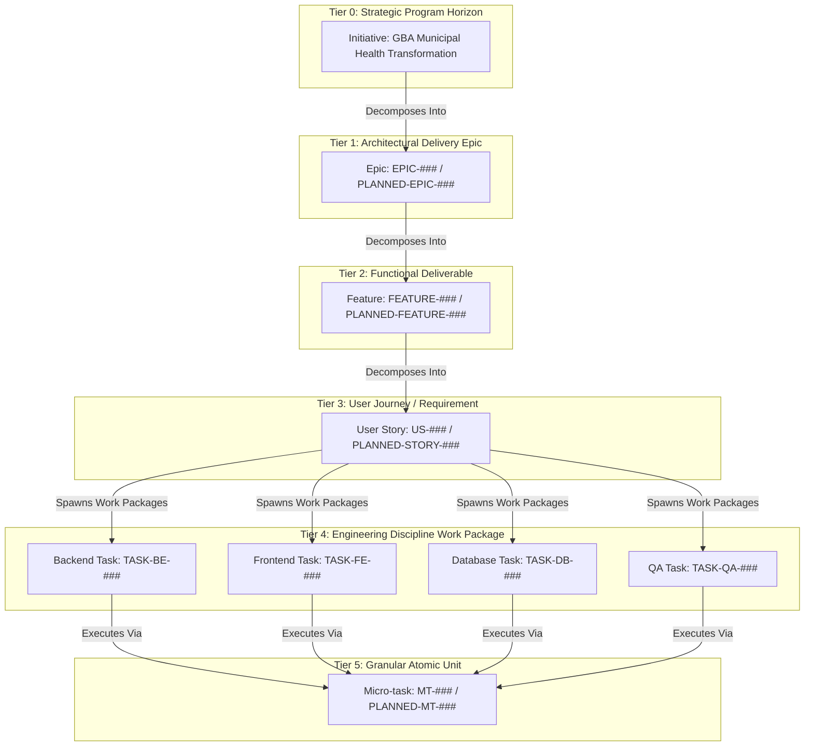

# Master Issue Hierarchy, Taxonomy & Lifecycle Architecture

Authoritative engineering governance specification establishing the 5-tier issue hierarchy, issue taxonomy, standardized issue form schemas, and lifecycle state machines for the Namma Clinic Digital Health & Operations Platform across 450+ municipal clinics under the Greater Bengaluru Authority (GBA) and BBMP Health Department.

| Governance Attribute | Specification Value |
| :--- | :--- |
| **Document Identifier** | `DOC-GH-02-HIERARCHY` |
| **Document Title** | Master Issue Hierarchy, Taxonomy & Lifecycle Architecture |
| **Document Version** | `1.0.0` |
| **Security Classification** | `RESTRICTED - GBA / BBMP HEALTH DEPARTMENT INTERNAL ONLY` |
| **Ratification Status** | `APPROVED & RATIFIED GOVERNANCE BASELINE` |
| **Program Domain** | Engineering Governance, Project Management & Work Breakdown |
| **Target Audience** | Software Engineers, Product Managers, Scrum Masters, Clinical SMEs, DevOps Leads |

## 1. Executive Summary & Architectural Intent
To ensure complete end-to-end traceability from municipal policy objectives down to individual pull requests, the Namma Clinic Digital Health & Operations Platform institutes an unyielding 5-tier issue hierarchy. Every line of runtime code, database migration, clinical protocol rule, or infrastructure deployment must originate from an explicitly approved issue tracked within this deterministic taxonomy.

This document establishes:
1. **The 5-Tier Issue Breakdown Structure:** Distinct operational horizons spanning Initiatives, Epics, Features, User Stories, and Engineering Work Packages/Tasks.
2. **55 Authoritative Hierarchy Rules (`HIER-001` through `HIER-055`):** Structural invariants, validation gates, ownership boundaries, and automated linting standards.
3. **18 Standardized Issue Types (`TYPE-001` through `TYPE-018`):** Complete functional schemas, form definitions, and lifecycle state transitions.
4. **Deterministic Issue Form Templates (YAML):** Structured intake specifications enforcing clinical safety disclosures and DPDP compliance assertions.
5. **Backlog Traceability Crosswalk:** Direct linkage between the 50 Master Epics (`EPIC-001` to `EPIC-050`), 250 Backlog Features (`BFEATURE-001` to `BFEATURE-250`), and GitHub work tracking entities.
6. **Acceptance Criteria & Audit Gates:** 50 explicit verification gates (`AC-HIER-001` to `AC-HIER-050`) ensuring zero unlinked, orphan, or unassigned tasks.

> [!IMPORTANT]
> **Orphan Issue Prohibition**
> No engineering work package, pull request, or task may exist without direct linkage to a validated parent User Story, Feature, and Epic. Any issue violating this invariant is automatically quarantined with `status/needs-refinement` and excluded from sprint backlogs.

## 2. Five-Tier Work Breakdown Architecture
The complete hierarchy flows unidirectionally from high-level clinical and municipal initiatives to granular execution units:

### Architecture Diagram: Five-Tier Issue Hierarchy Architecture


## 3. Comprehensive Specifications for the Five Hierarchy Tiers
Detailed operational parameters, required fields, and completion standards for each tier:

### 3.1. Tier 1: Epic (EPIC-###)
- **Tier Identifier:** Tier 1 (Epic)
- **Canonical Identifier Prefix:** `EPIC-` (Target Planned Format: `PLANNED-EPIC-`)
- **Strategic Horizon:** Broad strategic capability spanning 1 to 4 delivery sprints
- **Primary Ownership:** Product Manager / Domain Architect
- **Parent Structural Pre-Requisite:** `Delivery Objective (Phase 17)`
- **Child Structural Dependents:** `Features`
- **Lifecycle Duration Window:** Spans 1 to 4 sprints depending on architectural scope and regulatory milestones.
- **Governance Enforcement Level:** Mandatory GitHub Issue Form template validation with automated bot verification.

#### Mandatory Metadata Fields for Tier 1 (Epic)
1. **Title:** Must follow conventional prefix format `[EPIC-] <Descriptive title>` with max 72 characters.
2. **Domain Area:** Mandatory tagging with primary clinical or platform module (e.g., `domain/clinical-opd`, `domain/pharmacy`).
3. **Parent Linkage:** Explicit reference to parent Delivery Objective (Phase 17) identifier formatted as markdown URL link.
4. **Acceptance Criteria:** Minimum 3 verifiable, testable success criteria specified in Gherkin syntax or bulleted checkboxes.
5. **Release Target:** Associated enterprise release vehicle milestone (`release/rel-##` or `milestone/release-##`).
6. **Sprint Target:** Scheduled execution sprint window (`sprint/sprint-##`).
7. **Security & Privacy Tagging:** Explicit DPDP Act consent impact statement and PHI access control tier.
8. **Owner Assignee:** Designated engineering lead or product squad lead accountable for delivery.

#### Definition of Ready (DoR) Gate for Tier 1 (Epic)
- All mandatory metadata fields completed and validated via GitHub form template schema.
- Sizing estimate agreed by squad and recorded in GitHub Project custom fields (`Story Points` or `Hours`).
- Upstream technical and clinical dependencies identified and cross-linked in blocker register.
- Clinical SME sign-off recorded in issue thread if touching patient care or prescription workflows.
- Offline-first synchronization impact evaluated and documented for municipal dispensary network.

#### Definition of Done (DoD) Gate for Tier 1 (Epic)
- All child Features completed, verified, and merged to target branch with green CI status.
- 100% automated regression test suites passing with zero reported P0 or P1 defects.
- Architectural documentation updated in `docs/` repository path within the same milestone.
- Formal review sign-off approved by designated role: Product Manager / Domain Architect.
- Telemetry dashboards, health checks, and audit logging verified in staging clinic testbed.

### 3.2. Tier 2: Feature (FEATURE-###)
- **Tier Identifier:** Tier 2 (Feature)
- **Canonical Identifier Prefix:** `FEATURE-` (Target Planned Format: `PLANNED-FEATURE-`)
- **Strategic Horizon:** End-to-end clinical or operational capability deliverable in a single sprint
- **Primary Ownership:** Product Owner / Squad Lead
- **Parent Structural Pre-Requisite:** `Epic`
- **Child Structural Dependents:** `User Stories`
- **Lifecycle Duration Window:** Spans 1 to 4 sprints depending on architectural scope and regulatory milestones.
- **Governance Enforcement Level:** Mandatory GitHub Issue Form template validation with automated bot verification.

#### Mandatory Metadata Fields for Tier 2 (Feature)
1. **Title:** Must follow conventional prefix format `[FEATURE-] <Descriptive title>` with max 72 characters.
2. **Domain Area:** Mandatory tagging with primary clinical or platform module (e.g., `domain/clinical-opd`, `domain/pharmacy`).
3. **Parent Linkage:** Explicit reference to parent Epic identifier formatted as markdown URL link.
4. **Acceptance Criteria:** Minimum 3 verifiable, testable success criteria specified in Gherkin syntax or bulleted checkboxes.
5. **Release Target:** Associated enterprise release vehicle milestone (`release/rel-##` or `milestone/release-##`).
6. **Sprint Target:** Scheduled execution sprint window (`sprint/sprint-##`).
7. **Security & Privacy Tagging:** Explicit DPDP Act consent impact statement and PHI access control tier.
8. **Owner Assignee:** Designated engineering lead or product squad lead accountable for delivery.

#### Definition of Ready (DoR) Gate for Tier 2 (Feature)
- All mandatory metadata fields completed and validated via GitHub form template schema.
- Sizing estimate agreed by squad and recorded in GitHub Project custom fields (`Story Points` or `Hours`).
- Upstream technical and clinical dependencies identified and cross-linked in blocker register.
- Clinical SME sign-off recorded in issue thread if touching patient care or prescription workflows.
- Offline-first synchronization impact evaluated and documented for municipal dispensary network.

#### Definition of Done (DoD) Gate for Tier 2 (Feature)
- All child User Stories completed, verified, and merged to target branch with green CI status.
- 100% automated regression test suites passing with zero reported P0 or P1 defects.
- Architectural documentation updated in `docs/` repository path within the same milestone.
- Formal review sign-off approved by designated role: Product Owner / Squad Lead.
- Telemetry dashboards, health checks, and audit logging verified in staging clinic testbed.

### 3.3. Tier 3: User Story (US-###)
- **Tier Identifier:** Tier 3 (User Story)
- **Canonical Identifier Prefix:** `US-` (Target Planned Format: `PLANNED-STORY-`)
- **Strategic Horizon:** Discrete user journey or requirement unit satisfying INVEST criteria
- **Primary Ownership:** Cross-Functional Engineer / Clinical SME
- **Parent Structural Pre-Requisite:** `Feature`
- **Child Structural Dependents:** `Engineering Tasks`
- **Lifecycle Duration Window:** Spans 1 to 4 sprints depending on architectural scope and regulatory milestones.
- **Governance Enforcement Level:** Mandatory GitHub Issue Form template validation with automated bot verification.

#### Mandatory Metadata Fields for Tier 3 (User Story)
1. **Title:** Must follow conventional prefix format `[US-] <Descriptive title>` with max 72 characters.
2. **Domain Area:** Mandatory tagging with primary clinical or platform module (e.g., `domain/clinical-opd`, `domain/pharmacy`).
3. **Parent Linkage:** Explicit reference to parent Feature identifier formatted as markdown URL link.
4. **Acceptance Criteria:** Minimum 3 verifiable, testable success criteria specified in Gherkin syntax or bulleted checkboxes.
5. **Release Target:** Associated enterprise release vehicle milestone (`release/rel-##` or `milestone/release-##`).
6. **Sprint Target:** Scheduled execution sprint window (`sprint/sprint-##`).
7. **Security & Privacy Tagging:** Explicit DPDP Act consent impact statement and PHI access control tier.
8. **Owner Assignee:** Designated engineering lead or product squad lead accountable for delivery.

#### Definition of Ready (DoR) Gate for Tier 3 (User Story)
- All mandatory metadata fields completed and validated via GitHub form template schema.
- Sizing estimate agreed by squad and recorded in GitHub Project custom fields (`Story Points` or `Hours`).
- Upstream technical and clinical dependencies identified and cross-linked in blocker register.
- Clinical SME sign-off recorded in issue thread if touching patient care or prescription workflows.
- Offline-first synchronization impact evaluated and documented for municipal dispensary network.

#### Definition of Done (DoD) Gate for Tier 3 (User Story)
- All child Engineering Tasks completed, verified, and merged to target branch with green CI status.
- 100% automated regression test suites passing with zero reported P0 or P1 defects.
- Architectural documentation updated in `docs/` repository path within the same milestone.
- Formal review sign-off approved by designated role: Cross-Functional Engineer / Clinical SME.
- Telemetry dashboards, health checks, and audit logging verified in staging clinic testbed.

### 3.4. Tier 4: Engineering Task (TASK-###)
- **Tier Identifier:** Tier 4 (Engineering Task)
- **Canonical Identifier Prefix:** `TASK-` (Target Planned Format: `PLANNED-TASK-`)
- **Strategic Horizon:** Technical implementation work package (Backend, Frontend, DB, QA, DevOps)
- **Primary Ownership:** Individual Software Engineer
- **Parent Structural Pre-Requisite:** `User Story`
- **Child Structural Dependents:** `Micro-tasks`
- **Lifecycle Duration Window:** Spans 1 to 4 sprints depending on architectural scope and regulatory milestones.
- **Governance Enforcement Level:** Mandatory GitHub Issue Form template validation with automated bot verification.

#### Mandatory Metadata Fields for Tier 4 (Engineering Task)
1. **Title:** Must follow conventional prefix format `[TASK-] <Descriptive title>` with max 72 characters.
2. **Domain Area:** Mandatory tagging with primary clinical or platform module (e.g., `domain/clinical-opd`, `domain/pharmacy`).
3. **Parent Linkage:** Explicit reference to parent User Story identifier formatted as markdown URL link.
4. **Acceptance Criteria:** Minimum 3 verifiable, testable success criteria specified in Gherkin syntax or bulleted checkboxes.
5. **Release Target:** Associated enterprise release vehicle milestone (`release/rel-##` or `milestone/release-##`).
6. **Sprint Target:** Scheduled execution sprint window (`sprint/sprint-##`).
7. **Security & Privacy Tagging:** Explicit DPDP Act consent impact statement and PHI access control tier.
8. **Owner Assignee:** Designated engineering lead or product squad lead accountable for delivery.

#### Definition of Ready (DoR) Gate for Tier 4 (Engineering Task)
- All mandatory metadata fields completed and validated via GitHub form template schema.
- Sizing estimate agreed by squad and recorded in GitHub Project custom fields (`Story Points` or `Hours`).
- Upstream technical and clinical dependencies identified and cross-linked in blocker register.
- Clinical SME sign-off recorded in issue thread if touching patient care or prescription workflows.
- Offline-first synchronization impact evaluated and documented for municipal dispensary network.

#### Definition of Done (DoD) Gate for Tier 4 (Engineering Task)
- All child Micro-tasks completed, verified, and merged to target branch with green CI status.
- 100% automated regression test suites passing with zero reported P0 or P1 defects.
- Architectural documentation updated in `docs/` repository path within the same milestone.
- Formal review sign-off approved by designated role: Individual Software Engineer.
- Telemetry dashboards, health checks, and audit logging verified in staging clinic testbed.

### 3.5. Tier 5: Micro-task (MT-###)
- **Tier Identifier:** Tier 5 (Micro-task)
- **Canonical Identifier Prefix:** `MT-` (Target Planned Format: `PLANNED-MT-`)
- **Strategic Horizon:** Granular atomic code, test, or config action executable in 2 to 4 hours
- **Primary Ownership:** Individual Software Engineer
- **Parent Structural Pre-Requisite:** `Engineering Task`
- **Child Structural Dependents:** `None (Atomic)`
- **Lifecycle Duration Window:** Spans 1 to 4 sprints depending on architectural scope and regulatory milestones.
- **Governance Enforcement Level:** Mandatory GitHub Issue Form template validation with automated bot verification.

#### Mandatory Metadata Fields for Tier 5 (Micro-task)
1. **Title:** Must follow conventional prefix format `[MT-] <Descriptive title>` with max 72 characters.
2. **Domain Area:** Mandatory tagging with primary clinical or platform module (e.g., `domain/clinical-opd`, `domain/pharmacy`).
3. **Parent Linkage:** Explicit reference to parent Engineering Task identifier formatted as markdown URL link.
4. **Acceptance Criteria:** Minimum 3 verifiable, testable success criteria specified in Gherkin syntax or bulleted checkboxes.
5. **Release Target:** Associated enterprise release vehicle milestone (`release/rel-##` or `milestone/release-##`).
6. **Sprint Target:** Scheduled execution sprint window (`sprint/sprint-##`).
7. **Security & Privacy Tagging:** Explicit DPDP Act consent impact statement and PHI access control tier.
8. **Owner Assignee:** Designated engineering lead or product squad lead accountable for delivery.

#### Definition of Ready (DoR) Gate for Tier 5 (Micro-task)
- All mandatory metadata fields completed and validated via GitHub form template schema.
- Sizing estimate agreed by squad and recorded in GitHub Project custom fields (`Story Points` or `Hours`).
- Upstream technical and clinical dependencies identified and cross-linked in blocker register.
- Clinical SME sign-off recorded in issue thread if touching patient care or prescription workflows.
- Offline-first synchronization impact evaluated and documented for municipal dispensary network.

#### Definition of Done (DoD) Gate for Tier 5 (Micro-task)
- All child None (Atomic) completed, verified, and merged to target branch with green CI status.
- 100% automated regression test suites passing with zero reported P0 or P1 defects.
- Architectural documentation updated in `docs/` repository path within the same milestone.
- Formal review sign-off approved by designated role: Individual Software Engineer.
- Telemetry dashboards, health checks, and audit logging verified in staging clinic testbed.

## 4. Authoritative Hierarchy Rules (HIER-001 to HIER-055)
Comprehensive catalog of all 55 canonical issue hierarchy governance rules governing work decomposition, ownership, traceability, and lifecycle progression:

### HIER-001: Epic — Purpose & Scope Definition
- **Rule Identifier:** `HIER-001`
- **Target Hierarchy Tier:** Epic
- **Governance Concern Area:** Purpose & Scope Definition
- **Authoritative Policy Statement:** Every Epic must strictly adhere to the standardized protocol for purpose & scope definition.
- **Enforcement Mechanism:** Automated GitHub issue template validation and pre-merge check.
- **Verification Instrument:** Automated pre-receive git hook, GitHub Issue validator bot, and weekly audit script.
- **Non-Compliance Consequence:** Issue creation or status transition automatically rejected; sprint board assignment blocked.
- **Governance Enforcement Status:** `APPROVED BASELINE`

#### Operational Implementation Directive for HIER-001
1. **Engineer & Lead Responsibilities:** Software engineers, squad leads, and product managers must verify compliance with `HIER-001` during backlog grooming and sprint planning ceremonies.
2. **Automated Linter Action:** Automated GitHub Actions issue linting workflow runs on `issues.opened`, `issues.edited`, and `issues.labeled` events to ensure continuous adherence.
3. **Triage & Remediation Workflow:** Issues failing `HIER-001` are flagged with label `status/needs-refinement` and hidden from active development views until corrected.
4. **Re-Evaluation Protocol:** Automated re-evaluation occurs immediately when the issue description or metadata is updated by the author.
5. **Audit Evidence Preservation:** All validation failures and corrective actions are logged in the repository audit ledger for compliance review.

### HIER-002: Epic — Naming Convention & Formatting
- **Rule Identifier:** `HIER-002`
- **Target Hierarchy Tier:** Epic
- **Governance Concern Area:** Naming Convention & Formatting
- **Authoritative Policy Statement:** Every Epic must strictly adhere to the standardized protocol for naming convention & formatting.
- **Enforcement Mechanism:** Automated GitHub issue template validation and pre-merge check.
- **Verification Instrument:** Automated pre-receive git hook, GitHub Issue validator bot, and weekly audit script.
- **Non-Compliance Consequence:** Issue creation or status transition automatically rejected; sprint board assignment blocked.
- **Governance Enforcement Status:** `APPROVED BASELINE`

#### Operational Implementation Directive for HIER-002
1. **Engineer & Lead Responsibilities:** Software engineers, squad leads, and product managers must verify compliance with `HIER-002` during backlog grooming and sprint planning ceremonies.
2. **Automated Linter Action:** Automated GitHub Actions issue linting workflow runs on `issues.opened`, `issues.edited`, and `issues.labeled` events to ensure continuous adherence.
3. **Triage & Remediation Workflow:** Issues failing `HIER-002` are flagged with label `status/needs-refinement` and hidden from active development views until corrected.
4. **Re-Evaluation Protocol:** Automated re-evaluation occurs immediately when the issue description or metadata is updated by the author.
5. **Audit Evidence Preservation:** All validation failures and corrective actions are logged in the repository audit ledger for compliance review.

### HIER-003: Epic — Required Metadata Fields
- **Rule Identifier:** `HIER-003`
- **Target Hierarchy Tier:** Epic
- **Governance Concern Area:** Required Metadata Fields
- **Authoritative Policy Statement:** Every Epic must strictly adhere to the standardized protocol for required metadata fields.
- **Enforcement Mechanism:** Automated GitHub issue template validation and pre-merge check.
- **Verification Instrument:** Automated pre-receive git hook, GitHub Issue validator bot, and weekly audit script.
- **Non-Compliance Consequence:** Issue creation or status transition automatically rejected; sprint board assignment blocked.
- **Governance Enforcement Status:** `APPROVED BASELINE`

#### Operational Implementation Directive for HIER-003
1. **Engineer & Lead Responsibilities:** Software engineers, squad leads, and product managers must verify compliance with `HIER-003` during backlog grooming and sprint planning ceremonies.
2. **Automated Linter Action:** Automated GitHub Actions issue linting workflow runs on `issues.opened`, `issues.edited`, and `issues.labeled` events to ensure continuous adherence.
3. **Triage & Remediation Workflow:** Issues failing `HIER-003` are flagged with label `status/needs-refinement` and hidden from active development views until corrected.
4. **Re-Evaluation Protocol:** Automated re-evaluation occurs immediately when the issue description or metadata is updated by the author.
5. **Audit Evidence Preservation:** All validation failures and corrective actions are logged in the repository audit ledger for compliance review.

### HIER-004: Epic — Parent Linkage Mandatory Rule
- **Rule Identifier:** `HIER-004`
- **Target Hierarchy Tier:** Epic
- **Governance Concern Area:** Parent Linkage Mandatory Rule
- **Authoritative Policy Statement:** Every Epic must strictly adhere to the standardized protocol for parent linkage mandatory rule.
- **Enforcement Mechanism:** Automated GitHub issue template validation and pre-merge check.
- **Verification Instrument:** Automated pre-receive git hook, GitHub Issue validator bot, and weekly audit script.
- **Non-Compliance Consequence:** Issue creation or status transition automatically rejected; sprint board assignment blocked.
- **Governance Enforcement Status:** `APPROVED BASELINE`

#### Operational Implementation Directive for HIER-004
1. **Engineer & Lead Responsibilities:** Software engineers, squad leads, and product managers must verify compliance with `HIER-004` during backlog grooming and sprint planning ceremonies.
2. **Automated Linter Action:** Automated GitHub Actions issue linting workflow runs on `issues.opened`, `issues.edited`, and `issues.labeled` events to ensure continuous adherence.
3. **Triage & Remediation Workflow:** Issues failing `HIER-004` are flagged with label `status/needs-refinement` and hidden from active development views until corrected.
4. **Re-Evaluation Protocol:** Automated re-evaluation occurs immediately when the issue description or metadata is updated by the author.
5. **Audit Evidence Preservation:** All validation failures and corrective actions are logged in the repository audit ledger for compliance review.

### HIER-005: Epic — Child Association Validation
- **Rule Identifier:** `HIER-005`
- **Target Hierarchy Tier:** Epic
- **Governance Concern Area:** Child Association Validation
- **Authoritative Policy Statement:** Every Epic must strictly adhere to the standardized protocol for child association validation.
- **Enforcement Mechanism:** Automated GitHub issue template validation and pre-merge check.
- **Verification Instrument:** Automated pre-receive git hook, GitHub Issue validator bot, and weekly audit script.
- **Non-Compliance Consequence:** Issue creation or status transition automatically rejected; sprint board assignment blocked.
- **Governance Enforcement Status:** `APPROVED BASELINE`

#### Operational Implementation Directive for HIER-005
1. **Engineer & Lead Responsibilities:** Software engineers, squad leads, and product managers must verify compliance with `HIER-005` during backlog grooming and sprint planning ceremonies.
2. **Automated Linter Action:** Automated GitHub Actions issue linting workflow runs on `issues.opened`, `issues.edited`, and `issues.labeled` events to ensure continuous adherence.
3. **Triage & Remediation Workflow:** Issues failing `HIER-005` are flagged with label `status/needs-refinement` and hidden from active development views until corrected.
4. **Re-Evaluation Protocol:** Automated re-evaluation occurs immediately when the issue description or metadata is updated by the author.
5. **Audit Evidence Preservation:** All validation failures and corrective actions are logged in the repository audit ledger for compliance review.

### HIER-006: Epic — Definition of Ready (DoR) Gate
- **Rule Identifier:** `HIER-006`
- **Target Hierarchy Tier:** Epic
- **Governance Concern Area:** Definition of Ready (DoR) Gate
- **Authoritative Policy Statement:** Every Epic must strictly adhere to the standardized protocol for definition of ready (dor) gate.
- **Enforcement Mechanism:** Automated GitHub issue template validation and pre-merge check.
- **Verification Instrument:** Automated pre-receive git hook, GitHub Issue validator bot, and weekly audit script.
- **Non-Compliance Consequence:** Issue creation or status transition automatically rejected; sprint board assignment blocked.
- **Governance Enforcement Status:** `APPROVED BASELINE`

#### Operational Implementation Directive for HIER-006
1. **Engineer & Lead Responsibilities:** Software engineers, squad leads, and product managers must verify compliance with `HIER-006` during backlog grooming and sprint planning ceremonies.
2. **Automated Linter Action:** Automated GitHub Actions issue linting workflow runs on `issues.opened`, `issues.edited`, and `issues.labeled` events to ensure continuous adherence.
3. **Triage & Remediation Workflow:** Issues failing `HIER-006` are flagged with label `status/needs-refinement` and hidden from active development views until corrected.
4. **Re-Evaluation Protocol:** Automated re-evaluation occurs immediately when the issue description or metadata is updated by the author.
5. **Audit Evidence Preservation:** All validation failures and corrective actions are logged in the repository audit ledger for compliance review.

### HIER-007: Epic — Definition of Done (DoD) Gate
- **Rule Identifier:** `HIER-007`
- **Target Hierarchy Tier:** Epic
- **Governance Concern Area:** Definition of Done (DoD) Gate
- **Authoritative Policy Statement:** Every Epic must strictly adhere to the standardized protocol for definition of done (dod) gate.
- **Enforcement Mechanism:** Automated GitHub issue template validation and pre-merge check.
- **Verification Instrument:** Automated pre-receive git hook, GitHub Issue validator bot, and weekly audit script.
- **Non-Compliance Consequence:** Issue creation or status transition automatically rejected; sprint board assignment blocked.
- **Governance Enforcement Status:** `APPROVED BASELINE`

#### Operational Implementation Directive for HIER-007
1. **Engineer & Lead Responsibilities:** Software engineers, squad leads, and product managers must verify compliance with `HIER-007` during backlog grooming and sprint planning ceremonies.
2. **Automated Linter Action:** Automated GitHub Actions issue linting workflow runs on `issues.opened`, `issues.edited`, and `issues.labeled` events to ensure continuous adherence.
3. **Triage & Remediation Workflow:** Issues failing `HIER-007` are flagged with label `status/needs-refinement` and hidden from active development views until corrected.
4. **Re-Evaluation Protocol:** Automated re-evaluation occurs immediately when the issue description or metadata is updated by the author.
5. **Audit Evidence Preservation:** All validation failures and corrective actions are logged in the repository audit ledger for compliance review.

### HIER-008: Epic — Estimation & Story Point Sizing
- **Rule Identifier:** `HIER-008`
- **Target Hierarchy Tier:** Epic
- **Governance Concern Area:** Estimation & Story Point Sizing
- **Authoritative Policy Statement:** Every Epic must strictly adhere to the standardized protocol for estimation & story point sizing.
- **Enforcement Mechanism:** Automated GitHub issue template validation and pre-merge check.
- **Verification Instrument:** Automated pre-receive git hook, GitHub Issue validator bot, and weekly audit script.
- **Non-Compliance Consequence:** Issue creation or status transition automatically rejected; sprint board assignment blocked.
- **Governance Enforcement Status:** `APPROVED BASELINE`

#### Operational Implementation Directive for HIER-008
1. **Engineer & Lead Responsibilities:** Software engineers, squad leads, and product managers must verify compliance with `HIER-008` during backlog grooming and sprint planning ceremonies.
2. **Automated Linter Action:** Automated GitHub Actions issue linting workflow runs on `issues.opened`, `issues.edited`, and `issues.labeled` events to ensure continuous adherence.
3. **Triage & Remediation Workflow:** Issues failing `HIER-008` are flagged with label `status/needs-refinement` and hidden from active development views until corrected.
4. **Re-Evaluation Protocol:** Automated re-evaluation occurs immediately when the issue description or metadata is updated by the author.
5. **Audit Evidence Preservation:** All validation failures and corrective actions are logged in the repository audit ledger for compliance review.

### HIER-009: Epic — Sprint Boundary Assignment
- **Rule Identifier:** `HIER-009`
- **Target Hierarchy Tier:** Epic
- **Governance Concern Area:** Sprint Boundary Assignment
- **Authoritative Policy Statement:** Every Epic must strictly adhere to the standardized protocol for sprint boundary assignment.
- **Enforcement Mechanism:** Automated GitHub issue template validation and pre-merge check.
- **Verification Instrument:** Automated pre-receive git hook, GitHub Issue validator bot, and weekly audit script.
- **Non-Compliance Consequence:** Issue creation or status transition automatically rejected; sprint board assignment blocked.
- **Governance Enforcement Status:** `APPROVED BASELINE`

#### Operational Implementation Directive for HIER-009
1. **Engineer & Lead Responsibilities:** Software engineers, squad leads, and product managers must verify compliance with `HIER-009` during backlog grooming and sprint planning ceremonies.
2. **Automated Linter Action:** Automated GitHub Actions issue linting workflow runs on `issues.opened`, `issues.edited`, and `issues.labeled` events to ensure continuous adherence.
3. **Triage & Remediation Workflow:** Issues failing `HIER-009` are flagged with label `status/needs-refinement` and hidden from active development views until corrected.
4. **Re-Evaluation Protocol:** Automated re-evaluation occurs immediately when the issue description or metadata is updated by the author.
5. **Audit Evidence Preservation:** All validation failures and corrective actions are logged in the repository audit ledger for compliance review.

### HIER-010: Epic — Release Association Invariant
- **Rule Identifier:** `HIER-010`
- **Target Hierarchy Tier:** Epic
- **Governance Concern Area:** Release Association Invariant
- **Authoritative Policy Statement:** Every Epic must strictly adhere to the standardized protocol for release association invariant.
- **Enforcement Mechanism:** Automated GitHub issue template validation and pre-merge check.
- **Verification Instrument:** Automated pre-receive git hook, GitHub Issue validator bot, and weekly audit script.
- **Non-Compliance Consequence:** Issue creation or status transition automatically rejected; sprint board assignment blocked.
- **Governance Enforcement Status:** `APPROVED BASELINE`

#### Operational Implementation Directive for HIER-010
1. **Engineer & Lead Responsibilities:** Software engineers, squad leads, and product managers must verify compliance with `HIER-010` during backlog grooming and sprint planning ceremonies.
2. **Automated Linter Action:** Automated GitHub Actions issue linting workflow runs on `issues.opened`, `issues.edited`, and `issues.labeled` events to ensure continuous adherence.
3. **Triage & Remediation Workflow:** Issues failing `HIER-010` are flagged with label `status/needs-refinement` and hidden from active development views until corrected.
4. **Re-Evaluation Protocol:** Automated re-evaluation occurs immediately when the issue description or metadata is updated by the author.
5. **Audit Evidence Preservation:** All validation failures and corrective actions are logged in the repository audit ledger for compliance review.

### HIER-011: Epic — Acceptance Criteria Structure
- **Rule Identifier:** `HIER-011`
- **Target Hierarchy Tier:** Epic
- **Governance Concern Area:** Acceptance Criteria Structure
- **Authoritative Policy Statement:** Every Epic must strictly adhere to the standardized protocol for acceptance criteria structure.
- **Enforcement Mechanism:** Automated GitHub issue template validation and pre-merge check.
- **Verification Instrument:** Automated pre-receive git hook, GitHub Issue validator bot, and weekly audit script.
- **Non-Compliance Consequence:** Issue creation or status transition automatically rejected; sprint board assignment blocked.
- **Governance Enforcement Status:** `APPROVED BASELINE`

#### Operational Implementation Directive for HIER-011
1. **Engineer & Lead Responsibilities:** Software engineers, squad leads, and product managers must verify compliance with `HIER-011` during backlog grooming and sprint planning ceremonies.
2. **Automated Linter Action:** Automated GitHub Actions issue linting workflow runs on `issues.opened`, `issues.edited`, and `issues.labeled` events to ensure continuous adherence.
3. **Triage & Remediation Workflow:** Issues failing `HIER-011` are flagged with label `status/needs-refinement` and hidden from active development views until corrected.
4. **Re-Evaluation Protocol:** Automated re-evaluation occurs immediately when the issue description or metadata is updated by the author.
5. **Audit Evidence Preservation:** All validation failures and corrective actions are logged in the repository audit ledger for compliance review.

### HIER-012: Feature — Purpose & Scope Definition
- **Rule Identifier:** `HIER-012`
- **Target Hierarchy Tier:** Feature
- **Governance Concern Area:** Purpose & Scope Definition
- **Authoritative Policy Statement:** Every Feature must strictly adhere to the standardized protocol for purpose & scope definition.
- **Enforcement Mechanism:** Automated GitHub issue template validation and pre-merge check.
- **Verification Instrument:** Automated pre-receive git hook, GitHub Issue validator bot, and weekly audit script.
- **Non-Compliance Consequence:** Issue creation or status transition automatically rejected; sprint board assignment blocked.
- **Governance Enforcement Status:** `APPROVED BASELINE`

#### Operational Implementation Directive for HIER-012
1. **Engineer & Lead Responsibilities:** Software engineers, squad leads, and product managers must verify compliance with `HIER-012` during backlog grooming and sprint planning ceremonies.
2. **Automated Linter Action:** Automated GitHub Actions issue linting workflow runs on `issues.opened`, `issues.edited`, and `issues.labeled` events to ensure continuous adherence.
3. **Triage & Remediation Workflow:** Issues failing `HIER-012` are flagged with label `status/needs-refinement` and hidden from active development views until corrected.
4. **Re-Evaluation Protocol:** Automated re-evaluation occurs immediately when the issue description or metadata is updated by the author.
5. **Audit Evidence Preservation:** All validation failures and corrective actions are logged in the repository audit ledger for compliance review.

### HIER-013: Feature — Naming Convention & Formatting
- **Rule Identifier:** `HIER-013`
- **Target Hierarchy Tier:** Feature
- **Governance Concern Area:** Naming Convention & Formatting
- **Authoritative Policy Statement:** Every Feature must strictly adhere to the standardized protocol for naming convention & formatting.
- **Enforcement Mechanism:** Automated GitHub issue template validation and pre-merge check.
- **Verification Instrument:** Automated pre-receive git hook, GitHub Issue validator bot, and weekly audit script.
- **Non-Compliance Consequence:** Issue creation or status transition automatically rejected; sprint board assignment blocked.
- **Governance Enforcement Status:** `APPROVED BASELINE`

#### Operational Implementation Directive for HIER-013
1. **Engineer & Lead Responsibilities:** Software engineers, squad leads, and product managers must verify compliance with `HIER-013` during backlog grooming and sprint planning ceremonies.
2. **Automated Linter Action:** Automated GitHub Actions issue linting workflow runs on `issues.opened`, `issues.edited`, and `issues.labeled` events to ensure continuous adherence.
3. **Triage & Remediation Workflow:** Issues failing `HIER-013` are flagged with label `status/needs-refinement` and hidden from active development views until corrected.
4. **Re-Evaluation Protocol:** Automated re-evaluation occurs immediately when the issue description or metadata is updated by the author.
5. **Audit Evidence Preservation:** All validation failures and corrective actions are logged in the repository audit ledger for compliance review.

### HIER-014: Feature — Required Metadata Fields
- **Rule Identifier:** `HIER-014`
- **Target Hierarchy Tier:** Feature
- **Governance Concern Area:** Required Metadata Fields
- **Authoritative Policy Statement:** Every Feature must strictly adhere to the standardized protocol for required metadata fields.
- **Enforcement Mechanism:** Automated GitHub issue template validation and pre-merge check.
- **Verification Instrument:** Automated pre-receive git hook, GitHub Issue validator bot, and weekly audit script.
- **Non-Compliance Consequence:** Issue creation or status transition automatically rejected; sprint board assignment blocked.
- **Governance Enforcement Status:** `APPROVED BASELINE`

#### Operational Implementation Directive for HIER-014
1. **Engineer & Lead Responsibilities:** Software engineers, squad leads, and product managers must verify compliance with `HIER-014` during backlog grooming and sprint planning ceremonies.
2. **Automated Linter Action:** Automated GitHub Actions issue linting workflow runs on `issues.opened`, `issues.edited`, and `issues.labeled` events to ensure continuous adherence.
3. **Triage & Remediation Workflow:** Issues failing `HIER-014` are flagged with label `status/needs-refinement` and hidden from active development views until corrected.
4. **Re-Evaluation Protocol:** Automated re-evaluation occurs immediately when the issue description or metadata is updated by the author.
5. **Audit Evidence Preservation:** All validation failures and corrective actions are logged in the repository audit ledger for compliance review.

### HIER-015: Feature — Parent Linkage Mandatory Rule
- **Rule Identifier:** `HIER-015`
- **Target Hierarchy Tier:** Feature
- **Governance Concern Area:** Parent Linkage Mandatory Rule
- **Authoritative Policy Statement:** Every Feature must strictly adhere to the standardized protocol for parent linkage mandatory rule.
- **Enforcement Mechanism:** Automated GitHub issue template validation and pre-merge check.
- **Verification Instrument:** Automated pre-receive git hook, GitHub Issue validator bot, and weekly audit script.
- **Non-Compliance Consequence:** Issue creation or status transition automatically rejected; sprint board assignment blocked.
- **Governance Enforcement Status:** `APPROVED BASELINE`

#### Operational Implementation Directive for HIER-015
1. **Engineer & Lead Responsibilities:** Software engineers, squad leads, and product managers must verify compliance with `HIER-015` during backlog grooming and sprint planning ceremonies.
2. **Automated Linter Action:** Automated GitHub Actions issue linting workflow runs on `issues.opened`, `issues.edited`, and `issues.labeled` events to ensure continuous adherence.
3. **Triage & Remediation Workflow:** Issues failing `HIER-015` are flagged with label `status/needs-refinement` and hidden from active development views until corrected.
4. **Re-Evaluation Protocol:** Automated re-evaluation occurs immediately when the issue description or metadata is updated by the author.
5. **Audit Evidence Preservation:** All validation failures and corrective actions are logged in the repository audit ledger for compliance review.

### HIER-016: Feature — Child Association Validation
- **Rule Identifier:** `HIER-016`
- **Target Hierarchy Tier:** Feature
- **Governance Concern Area:** Child Association Validation
- **Authoritative Policy Statement:** Every Feature must strictly adhere to the standardized protocol for child association validation.
- **Enforcement Mechanism:** Automated GitHub issue template validation and pre-merge check.
- **Verification Instrument:** Automated pre-receive git hook, GitHub Issue validator bot, and weekly audit script.
- **Non-Compliance Consequence:** Issue creation or status transition automatically rejected; sprint board assignment blocked.
- **Governance Enforcement Status:** `APPROVED BASELINE`

#### Operational Implementation Directive for HIER-016
1. **Engineer & Lead Responsibilities:** Software engineers, squad leads, and product managers must verify compliance with `HIER-016` during backlog grooming and sprint planning ceremonies.
2. **Automated Linter Action:** Automated GitHub Actions issue linting workflow runs on `issues.opened`, `issues.edited`, and `issues.labeled` events to ensure continuous adherence.
3. **Triage & Remediation Workflow:** Issues failing `HIER-016` are flagged with label `status/needs-refinement` and hidden from active development views until corrected.
4. **Re-Evaluation Protocol:** Automated re-evaluation occurs immediately when the issue description or metadata is updated by the author.
5. **Audit Evidence Preservation:** All validation failures and corrective actions are logged in the repository audit ledger for compliance review.

### HIER-017: Feature — Definition of Ready (DoR) Gate
- **Rule Identifier:** `HIER-017`
- **Target Hierarchy Tier:** Feature
- **Governance Concern Area:** Definition of Ready (DoR) Gate
- **Authoritative Policy Statement:** Every Feature must strictly adhere to the standardized protocol for definition of ready (dor) gate.
- **Enforcement Mechanism:** Automated GitHub issue template validation and pre-merge check.
- **Verification Instrument:** Automated pre-receive git hook, GitHub Issue validator bot, and weekly audit script.
- **Non-Compliance Consequence:** Issue creation or status transition automatically rejected; sprint board assignment blocked.
- **Governance Enforcement Status:** `APPROVED BASELINE`

#### Operational Implementation Directive for HIER-017
1. **Engineer & Lead Responsibilities:** Software engineers, squad leads, and product managers must verify compliance with `HIER-017` during backlog grooming and sprint planning ceremonies.
2. **Automated Linter Action:** Automated GitHub Actions issue linting workflow runs on `issues.opened`, `issues.edited`, and `issues.labeled` events to ensure continuous adherence.
3. **Triage & Remediation Workflow:** Issues failing `HIER-017` are flagged with label `status/needs-refinement` and hidden from active development views until corrected.
4. **Re-Evaluation Protocol:** Automated re-evaluation occurs immediately when the issue description or metadata is updated by the author.
5. **Audit Evidence Preservation:** All validation failures and corrective actions are logged in the repository audit ledger for compliance review.

### HIER-018: Feature — Definition of Done (DoD) Gate
- **Rule Identifier:** `HIER-018`
- **Target Hierarchy Tier:** Feature
- **Governance Concern Area:** Definition of Done (DoD) Gate
- **Authoritative Policy Statement:** Every Feature must strictly adhere to the standardized protocol for definition of done (dod) gate.
- **Enforcement Mechanism:** Automated GitHub issue template validation and pre-merge check.
- **Verification Instrument:** Automated pre-receive git hook, GitHub Issue validator bot, and weekly audit script.
- **Non-Compliance Consequence:** Issue creation or status transition automatically rejected; sprint board assignment blocked.
- **Governance Enforcement Status:** `APPROVED BASELINE`

#### Operational Implementation Directive for HIER-018
1. **Engineer & Lead Responsibilities:** Software engineers, squad leads, and product managers must verify compliance with `HIER-018` during backlog grooming and sprint planning ceremonies.
2. **Automated Linter Action:** Automated GitHub Actions issue linting workflow runs on `issues.opened`, `issues.edited`, and `issues.labeled` events to ensure continuous adherence.
3. **Triage & Remediation Workflow:** Issues failing `HIER-018` are flagged with label `status/needs-refinement` and hidden from active development views until corrected.
4. **Re-Evaluation Protocol:** Automated re-evaluation occurs immediately when the issue description or metadata is updated by the author.
5. **Audit Evidence Preservation:** All validation failures and corrective actions are logged in the repository audit ledger for compliance review.

### HIER-019: Feature — Estimation & Story Point Sizing
- **Rule Identifier:** `HIER-019`
- **Target Hierarchy Tier:** Feature
- **Governance Concern Area:** Estimation & Story Point Sizing
- **Authoritative Policy Statement:** Every Feature must strictly adhere to the standardized protocol for estimation & story point sizing.
- **Enforcement Mechanism:** Automated GitHub issue template validation and pre-merge check.
- **Verification Instrument:** Automated pre-receive git hook, GitHub Issue validator bot, and weekly audit script.
- **Non-Compliance Consequence:** Issue creation or status transition automatically rejected; sprint board assignment blocked.
- **Governance Enforcement Status:** `APPROVED BASELINE`

#### Operational Implementation Directive for HIER-019
1. **Engineer & Lead Responsibilities:** Software engineers, squad leads, and product managers must verify compliance with `HIER-019` during backlog grooming and sprint planning ceremonies.
2. **Automated Linter Action:** Automated GitHub Actions issue linting workflow runs on `issues.opened`, `issues.edited`, and `issues.labeled` events to ensure continuous adherence.
3. **Triage & Remediation Workflow:** Issues failing `HIER-019` are flagged with label `status/needs-refinement` and hidden from active development views until corrected.
4. **Re-Evaluation Protocol:** Automated re-evaluation occurs immediately when the issue description or metadata is updated by the author.
5. **Audit Evidence Preservation:** All validation failures and corrective actions are logged in the repository audit ledger for compliance review.

### HIER-020: Feature — Sprint Boundary Assignment
- **Rule Identifier:** `HIER-020`
- **Target Hierarchy Tier:** Feature
- **Governance Concern Area:** Sprint Boundary Assignment
- **Authoritative Policy Statement:** Every Feature must strictly adhere to the standardized protocol for sprint boundary assignment.
- **Enforcement Mechanism:** Automated GitHub issue template validation and pre-merge check.
- **Verification Instrument:** Automated pre-receive git hook, GitHub Issue validator bot, and weekly audit script.
- **Non-Compliance Consequence:** Issue creation or status transition automatically rejected; sprint board assignment blocked.
- **Governance Enforcement Status:** `APPROVED BASELINE`

#### Operational Implementation Directive for HIER-020
1. **Engineer & Lead Responsibilities:** Software engineers, squad leads, and product managers must verify compliance with `HIER-020` during backlog grooming and sprint planning ceremonies.
2. **Automated Linter Action:** Automated GitHub Actions issue linting workflow runs on `issues.opened`, `issues.edited`, and `issues.labeled` events to ensure continuous adherence.
3. **Triage & Remediation Workflow:** Issues failing `HIER-020` are flagged with label `status/needs-refinement` and hidden from active development views until corrected.
4. **Re-Evaluation Protocol:** Automated re-evaluation occurs immediately when the issue description or metadata is updated by the author.
5. **Audit Evidence Preservation:** All validation failures and corrective actions are logged in the repository audit ledger for compliance review.

### HIER-021: Feature — Release Association Invariant
- **Rule Identifier:** `HIER-021`
- **Target Hierarchy Tier:** Feature
- **Governance Concern Area:** Release Association Invariant
- **Authoritative Policy Statement:** Every Feature must strictly adhere to the standardized protocol for release association invariant.
- **Enforcement Mechanism:** Automated GitHub issue template validation and pre-merge check.
- **Verification Instrument:** Automated pre-receive git hook, GitHub Issue validator bot, and weekly audit script.
- **Non-Compliance Consequence:** Issue creation or status transition automatically rejected; sprint board assignment blocked.
- **Governance Enforcement Status:** `APPROVED BASELINE`

#### Operational Implementation Directive for HIER-021
1. **Engineer & Lead Responsibilities:** Software engineers, squad leads, and product managers must verify compliance with `HIER-021` during backlog grooming and sprint planning ceremonies.
2. **Automated Linter Action:** Automated GitHub Actions issue linting workflow runs on `issues.opened`, `issues.edited`, and `issues.labeled` events to ensure continuous adherence.
3. **Triage & Remediation Workflow:** Issues failing `HIER-021` are flagged with label `status/needs-refinement` and hidden from active development views until corrected.
4. **Re-Evaluation Protocol:** Automated re-evaluation occurs immediately when the issue description or metadata is updated by the author.
5. **Audit Evidence Preservation:** All validation failures and corrective actions are logged in the repository audit ledger for compliance review.

### HIER-022: Feature — Acceptance Criteria Structure
- **Rule Identifier:** `HIER-022`
- **Target Hierarchy Tier:** Feature
- **Governance Concern Area:** Acceptance Criteria Structure
- **Authoritative Policy Statement:** Every Feature must strictly adhere to the standardized protocol for acceptance criteria structure.
- **Enforcement Mechanism:** Automated GitHub issue template validation and pre-merge check.
- **Verification Instrument:** Automated pre-receive git hook, GitHub Issue validator bot, and weekly audit script.
- **Non-Compliance Consequence:** Issue creation or status transition automatically rejected; sprint board assignment blocked.
- **Governance Enforcement Status:** `APPROVED BASELINE`

#### Operational Implementation Directive for HIER-022
1. **Engineer & Lead Responsibilities:** Software engineers, squad leads, and product managers must verify compliance with `HIER-022` during backlog grooming and sprint planning ceremonies.
2. **Automated Linter Action:** Automated GitHub Actions issue linting workflow runs on `issues.opened`, `issues.edited`, and `issues.labeled` events to ensure continuous adherence.
3. **Triage & Remediation Workflow:** Issues failing `HIER-022` are flagged with label `status/needs-refinement` and hidden from active development views until corrected.
4. **Re-Evaluation Protocol:** Automated re-evaluation occurs immediately when the issue description or metadata is updated by the author.
5. **Audit Evidence Preservation:** All validation failures and corrective actions are logged in the repository audit ledger for compliance review.

### HIER-023: User Story — Purpose & Scope Definition
- **Rule Identifier:** `HIER-023`
- **Target Hierarchy Tier:** User Story
- **Governance Concern Area:** Purpose & Scope Definition
- **Authoritative Policy Statement:** Every User Story must strictly adhere to the standardized protocol for purpose & scope definition.
- **Enforcement Mechanism:** Automated GitHub issue template validation and pre-merge check.
- **Verification Instrument:** Automated pre-receive git hook, GitHub Issue validator bot, and weekly audit script.
- **Non-Compliance Consequence:** Issue creation or status transition automatically rejected; sprint board assignment blocked.
- **Governance Enforcement Status:** `APPROVED BASELINE`

#### Operational Implementation Directive for HIER-023
1. **Engineer & Lead Responsibilities:** Software engineers, squad leads, and product managers must verify compliance with `HIER-023` during backlog grooming and sprint planning ceremonies.
2. **Automated Linter Action:** Automated GitHub Actions issue linting workflow runs on `issues.opened`, `issues.edited`, and `issues.labeled` events to ensure continuous adherence.
3. **Triage & Remediation Workflow:** Issues failing `HIER-023` are flagged with label `status/needs-refinement` and hidden from active development views until corrected.
4. **Re-Evaluation Protocol:** Automated re-evaluation occurs immediately when the issue description or metadata is updated by the author.
5. **Audit Evidence Preservation:** All validation failures and corrective actions are logged in the repository audit ledger for compliance review.

### HIER-024: User Story — Naming Convention & Formatting
- **Rule Identifier:** `HIER-024`
- **Target Hierarchy Tier:** User Story
- **Governance Concern Area:** Naming Convention & Formatting
- **Authoritative Policy Statement:** Every User Story must strictly adhere to the standardized protocol for naming convention & formatting.
- **Enforcement Mechanism:** Automated GitHub issue template validation and pre-merge check.
- **Verification Instrument:** Automated pre-receive git hook, GitHub Issue validator bot, and weekly audit script.
- **Non-Compliance Consequence:** Issue creation or status transition automatically rejected; sprint board assignment blocked.
- **Governance Enforcement Status:** `APPROVED BASELINE`

#### Operational Implementation Directive for HIER-024
1. **Engineer & Lead Responsibilities:** Software engineers, squad leads, and product managers must verify compliance with `HIER-024` during backlog grooming and sprint planning ceremonies.
2. **Automated Linter Action:** Automated GitHub Actions issue linting workflow runs on `issues.opened`, `issues.edited`, and `issues.labeled` events to ensure continuous adherence.
3. **Triage & Remediation Workflow:** Issues failing `HIER-024` are flagged with label `status/needs-refinement` and hidden from active development views until corrected.
4. **Re-Evaluation Protocol:** Automated re-evaluation occurs immediately when the issue description or metadata is updated by the author.
5. **Audit Evidence Preservation:** All validation failures and corrective actions are logged in the repository audit ledger for compliance review.

### HIER-025: User Story — Required Metadata Fields
- **Rule Identifier:** `HIER-025`
- **Target Hierarchy Tier:** User Story
- **Governance Concern Area:** Required Metadata Fields
- **Authoritative Policy Statement:** Every User Story must strictly adhere to the standardized protocol for required metadata fields.
- **Enforcement Mechanism:** Automated GitHub issue template validation and pre-merge check.
- **Verification Instrument:** Automated pre-receive git hook, GitHub Issue validator bot, and weekly audit script.
- **Non-Compliance Consequence:** Issue creation or status transition automatically rejected; sprint board assignment blocked.
- **Governance Enforcement Status:** `APPROVED BASELINE`

#### Operational Implementation Directive for HIER-025
1. **Engineer & Lead Responsibilities:** Software engineers, squad leads, and product managers must verify compliance with `HIER-025` during backlog grooming and sprint planning ceremonies.
2. **Automated Linter Action:** Automated GitHub Actions issue linting workflow runs on `issues.opened`, `issues.edited`, and `issues.labeled` events to ensure continuous adherence.
3. **Triage & Remediation Workflow:** Issues failing `HIER-025` are flagged with label `status/needs-refinement` and hidden from active development views until corrected.
4. **Re-Evaluation Protocol:** Automated re-evaluation occurs immediately when the issue description or metadata is updated by the author.
5. **Audit Evidence Preservation:** All validation failures and corrective actions are logged in the repository audit ledger for compliance review.

### HIER-026: User Story — Parent Linkage Mandatory Rule
- **Rule Identifier:** `HIER-026`
- **Target Hierarchy Tier:** User Story
- **Governance Concern Area:** Parent Linkage Mandatory Rule
- **Authoritative Policy Statement:** Every User Story must strictly adhere to the standardized protocol for parent linkage mandatory rule.
- **Enforcement Mechanism:** Automated GitHub issue template validation and pre-merge check.
- **Verification Instrument:** Automated pre-receive git hook, GitHub Issue validator bot, and weekly audit script.
- **Non-Compliance Consequence:** Issue creation or status transition automatically rejected; sprint board assignment blocked.
- **Governance Enforcement Status:** `APPROVED BASELINE`

#### Operational Implementation Directive for HIER-026
1. **Engineer & Lead Responsibilities:** Software engineers, squad leads, and product managers must verify compliance with `HIER-026` during backlog grooming and sprint planning ceremonies.
2. **Automated Linter Action:** Automated GitHub Actions issue linting workflow runs on `issues.opened`, `issues.edited`, and `issues.labeled` events to ensure continuous adherence.
3. **Triage & Remediation Workflow:** Issues failing `HIER-026` are flagged with label `status/needs-refinement` and hidden from active development views until corrected.
4. **Re-Evaluation Protocol:** Automated re-evaluation occurs immediately when the issue description or metadata is updated by the author.
5. **Audit Evidence Preservation:** All validation failures and corrective actions are logged in the repository audit ledger for compliance review.

### HIER-027: User Story — Child Association Validation
- **Rule Identifier:** `HIER-027`
- **Target Hierarchy Tier:** User Story
- **Governance Concern Area:** Child Association Validation
- **Authoritative Policy Statement:** Every User Story must strictly adhere to the standardized protocol for child association validation.
- **Enforcement Mechanism:** Automated GitHub issue template validation and pre-merge check.
- **Verification Instrument:** Automated pre-receive git hook, GitHub Issue validator bot, and weekly audit script.
- **Non-Compliance Consequence:** Issue creation or status transition automatically rejected; sprint board assignment blocked.
- **Governance Enforcement Status:** `APPROVED BASELINE`

#### Operational Implementation Directive for HIER-027
1. **Engineer & Lead Responsibilities:** Software engineers, squad leads, and product managers must verify compliance with `HIER-027` during backlog grooming and sprint planning ceremonies.
2. **Automated Linter Action:** Automated GitHub Actions issue linting workflow runs on `issues.opened`, `issues.edited`, and `issues.labeled` events to ensure continuous adherence.
3. **Triage & Remediation Workflow:** Issues failing `HIER-027` are flagged with label `status/needs-refinement` and hidden from active development views until corrected.
4. **Re-Evaluation Protocol:** Automated re-evaluation occurs immediately when the issue description or metadata is updated by the author.
5. **Audit Evidence Preservation:** All validation failures and corrective actions are logged in the repository audit ledger for compliance review.

### HIER-028: User Story — Definition of Ready (DoR) Gate
- **Rule Identifier:** `HIER-028`
- **Target Hierarchy Tier:** User Story
- **Governance Concern Area:** Definition of Ready (DoR) Gate
- **Authoritative Policy Statement:** Every User Story must strictly adhere to the standardized protocol for definition of ready (dor) gate.
- **Enforcement Mechanism:** Automated GitHub issue template validation and pre-merge check.
- **Verification Instrument:** Automated pre-receive git hook, GitHub Issue validator bot, and weekly audit script.
- **Non-Compliance Consequence:** Issue creation or status transition automatically rejected; sprint board assignment blocked.
- **Governance Enforcement Status:** `APPROVED BASELINE`

#### Operational Implementation Directive for HIER-028
1. **Engineer & Lead Responsibilities:** Software engineers, squad leads, and product managers must verify compliance with `HIER-028` during backlog grooming and sprint planning ceremonies.
2. **Automated Linter Action:** Automated GitHub Actions issue linting workflow runs on `issues.opened`, `issues.edited`, and `issues.labeled` events to ensure continuous adherence.
3. **Triage & Remediation Workflow:** Issues failing `HIER-028` are flagged with label `status/needs-refinement` and hidden from active development views until corrected.
4. **Re-Evaluation Protocol:** Automated re-evaluation occurs immediately when the issue description or metadata is updated by the author.
5. **Audit Evidence Preservation:** All validation failures and corrective actions are logged in the repository audit ledger for compliance review.

### HIER-029: User Story — Definition of Done (DoD) Gate
- **Rule Identifier:** `HIER-029`
- **Target Hierarchy Tier:** User Story
- **Governance Concern Area:** Definition of Done (DoD) Gate
- **Authoritative Policy Statement:** Every User Story must strictly adhere to the standardized protocol for definition of done (dod) gate.
- **Enforcement Mechanism:** Automated GitHub issue template validation and pre-merge check.
- **Verification Instrument:** Automated pre-receive git hook, GitHub Issue validator bot, and weekly audit script.
- **Non-Compliance Consequence:** Issue creation or status transition automatically rejected; sprint board assignment blocked.
- **Governance Enforcement Status:** `APPROVED BASELINE`

#### Operational Implementation Directive for HIER-029
1. **Engineer & Lead Responsibilities:** Software engineers, squad leads, and product managers must verify compliance with `HIER-029` during backlog grooming and sprint planning ceremonies.
2. **Automated Linter Action:** Automated GitHub Actions issue linting workflow runs on `issues.opened`, `issues.edited`, and `issues.labeled` events to ensure continuous adherence.
3. **Triage & Remediation Workflow:** Issues failing `HIER-029` are flagged with label `status/needs-refinement` and hidden from active development views until corrected.
4. **Re-Evaluation Protocol:** Automated re-evaluation occurs immediately when the issue description or metadata is updated by the author.
5. **Audit Evidence Preservation:** All validation failures and corrective actions are logged in the repository audit ledger for compliance review.

### HIER-030: User Story — Estimation & Story Point Sizing
- **Rule Identifier:** `HIER-030`
- **Target Hierarchy Tier:** User Story
- **Governance Concern Area:** Estimation & Story Point Sizing
- **Authoritative Policy Statement:** Every User Story must strictly adhere to the standardized protocol for estimation & story point sizing.
- **Enforcement Mechanism:** Automated GitHub issue template validation and pre-merge check.
- **Verification Instrument:** Automated pre-receive git hook, GitHub Issue validator bot, and weekly audit script.
- **Non-Compliance Consequence:** Issue creation or status transition automatically rejected; sprint board assignment blocked.
- **Governance Enforcement Status:** `APPROVED BASELINE`

#### Operational Implementation Directive for HIER-030
1. **Engineer & Lead Responsibilities:** Software engineers, squad leads, and product managers must verify compliance with `HIER-030` during backlog grooming and sprint planning ceremonies.
2. **Automated Linter Action:** Automated GitHub Actions issue linting workflow runs on `issues.opened`, `issues.edited`, and `issues.labeled` events to ensure continuous adherence.
3. **Triage & Remediation Workflow:** Issues failing `HIER-030` are flagged with label `status/needs-refinement` and hidden from active development views until corrected.
4. **Re-Evaluation Protocol:** Automated re-evaluation occurs immediately when the issue description or metadata is updated by the author.
5. **Audit Evidence Preservation:** All validation failures and corrective actions are logged in the repository audit ledger for compliance review.

### HIER-031: User Story — Sprint Boundary Assignment
- **Rule Identifier:** `HIER-031`
- **Target Hierarchy Tier:** User Story
- **Governance Concern Area:** Sprint Boundary Assignment
- **Authoritative Policy Statement:** Every User Story must strictly adhere to the standardized protocol for sprint boundary assignment.
- **Enforcement Mechanism:** Automated GitHub issue template validation and pre-merge check.
- **Verification Instrument:** Automated pre-receive git hook, GitHub Issue validator bot, and weekly audit script.
- **Non-Compliance Consequence:** Issue creation or status transition automatically rejected; sprint board assignment blocked.
- **Governance Enforcement Status:** `APPROVED BASELINE`

#### Operational Implementation Directive for HIER-031
1. **Engineer & Lead Responsibilities:** Software engineers, squad leads, and product managers must verify compliance with `HIER-031` during backlog grooming and sprint planning ceremonies.
2. **Automated Linter Action:** Automated GitHub Actions issue linting workflow runs on `issues.opened`, `issues.edited`, and `issues.labeled` events to ensure continuous adherence.
3. **Triage & Remediation Workflow:** Issues failing `HIER-031` are flagged with label `status/needs-refinement` and hidden from active development views until corrected.
4. **Re-Evaluation Protocol:** Automated re-evaluation occurs immediately when the issue description or metadata is updated by the author.
5. **Audit Evidence Preservation:** All validation failures and corrective actions are logged in the repository audit ledger for compliance review.

### HIER-032: User Story — Release Association Invariant
- **Rule Identifier:** `HIER-032`
- **Target Hierarchy Tier:** User Story
- **Governance Concern Area:** Release Association Invariant
- **Authoritative Policy Statement:** Every User Story must strictly adhere to the standardized protocol for release association invariant.
- **Enforcement Mechanism:** Automated GitHub issue template validation and pre-merge check.
- **Verification Instrument:** Automated pre-receive git hook, GitHub Issue validator bot, and weekly audit script.
- **Non-Compliance Consequence:** Issue creation or status transition automatically rejected; sprint board assignment blocked.
- **Governance Enforcement Status:** `APPROVED BASELINE`

#### Operational Implementation Directive for HIER-032
1. **Engineer & Lead Responsibilities:** Software engineers, squad leads, and product managers must verify compliance with `HIER-032` during backlog grooming and sprint planning ceremonies.
2. **Automated Linter Action:** Automated GitHub Actions issue linting workflow runs on `issues.opened`, `issues.edited`, and `issues.labeled` events to ensure continuous adherence.
3. **Triage & Remediation Workflow:** Issues failing `HIER-032` are flagged with label `status/needs-refinement` and hidden from active development views until corrected.
4. **Re-Evaluation Protocol:** Automated re-evaluation occurs immediately when the issue description or metadata is updated by the author.
5. **Audit Evidence Preservation:** All validation failures and corrective actions are logged in the repository audit ledger for compliance review.

### HIER-033: User Story — Acceptance Criteria Structure
- **Rule Identifier:** `HIER-033`
- **Target Hierarchy Tier:** User Story
- **Governance Concern Area:** Acceptance Criteria Structure
- **Authoritative Policy Statement:** Every User Story must strictly adhere to the standardized protocol for acceptance criteria structure.
- **Enforcement Mechanism:** Automated GitHub issue template validation and pre-merge check.
- **Verification Instrument:** Automated pre-receive git hook, GitHub Issue validator bot, and weekly audit script.
- **Non-Compliance Consequence:** Issue creation or status transition automatically rejected; sprint board assignment blocked.
- **Governance Enforcement Status:** `APPROVED BASELINE`

#### Operational Implementation Directive for HIER-033
1. **Engineer & Lead Responsibilities:** Software engineers, squad leads, and product managers must verify compliance with `HIER-033` during backlog grooming and sprint planning ceremonies.
2. **Automated Linter Action:** Automated GitHub Actions issue linting workflow runs on `issues.opened`, `issues.edited`, and `issues.labeled` events to ensure continuous adherence.
3. **Triage & Remediation Workflow:** Issues failing `HIER-033` are flagged with label `status/needs-refinement` and hidden from active development views until corrected.
4. **Re-Evaluation Protocol:** Automated re-evaluation occurs immediately when the issue description or metadata is updated by the author.
5. **Audit Evidence Preservation:** All validation failures and corrective actions are logged in the repository audit ledger for compliance review.

### HIER-034: Task — Purpose & Scope Definition
- **Rule Identifier:** `HIER-034`
- **Target Hierarchy Tier:** Task
- **Governance Concern Area:** Purpose & Scope Definition
- **Authoritative Policy Statement:** Every Task must strictly adhere to the standardized protocol for purpose & scope definition.
- **Enforcement Mechanism:** Automated GitHub issue template validation and pre-merge check.
- **Verification Instrument:** Automated pre-receive git hook, GitHub Issue validator bot, and weekly audit script.
- **Non-Compliance Consequence:** Issue creation or status transition automatically rejected; sprint board assignment blocked.
- **Governance Enforcement Status:** `APPROVED BASELINE`

#### Operational Implementation Directive for HIER-034
1. **Engineer & Lead Responsibilities:** Software engineers, squad leads, and product managers must verify compliance with `HIER-034` during backlog grooming and sprint planning ceremonies.
2. **Automated Linter Action:** Automated GitHub Actions issue linting workflow runs on `issues.opened`, `issues.edited`, and `issues.labeled` events to ensure continuous adherence.
3. **Triage & Remediation Workflow:** Issues failing `HIER-034` are flagged with label `status/needs-refinement` and hidden from active development views until corrected.
4. **Re-Evaluation Protocol:** Automated re-evaluation occurs immediately when the issue description or metadata is updated by the author.
5. **Audit Evidence Preservation:** All validation failures and corrective actions are logged in the repository audit ledger for compliance review.

### HIER-035: Task — Naming Convention & Formatting
- **Rule Identifier:** `HIER-035`
- **Target Hierarchy Tier:** Task
- **Governance Concern Area:** Naming Convention & Formatting
- **Authoritative Policy Statement:** Every Task must strictly adhere to the standardized protocol for naming convention & formatting.
- **Enforcement Mechanism:** Automated GitHub issue template validation and pre-merge check.
- **Verification Instrument:** Automated pre-receive git hook, GitHub Issue validator bot, and weekly audit script.
- **Non-Compliance Consequence:** Issue creation or status transition automatically rejected; sprint board assignment blocked.
- **Governance Enforcement Status:** `APPROVED BASELINE`

#### Operational Implementation Directive for HIER-035
1. **Engineer & Lead Responsibilities:** Software engineers, squad leads, and product managers must verify compliance with `HIER-035` during backlog grooming and sprint planning ceremonies.
2. **Automated Linter Action:** Automated GitHub Actions issue linting workflow runs on `issues.opened`, `issues.edited`, and `issues.labeled` events to ensure continuous adherence.
3. **Triage & Remediation Workflow:** Issues failing `HIER-035` are flagged with label `status/needs-refinement` and hidden from active development views until corrected.
4. **Re-Evaluation Protocol:** Automated re-evaluation occurs immediately when the issue description or metadata is updated by the author.
5. **Audit Evidence Preservation:** All validation failures and corrective actions are logged in the repository audit ledger for compliance review.

### HIER-036: Task — Required Metadata Fields
- **Rule Identifier:** `HIER-036`
- **Target Hierarchy Tier:** Task
- **Governance Concern Area:** Required Metadata Fields
- **Authoritative Policy Statement:** Every Task must strictly adhere to the standardized protocol for required metadata fields.
- **Enforcement Mechanism:** Automated GitHub issue template validation and pre-merge check.
- **Verification Instrument:** Automated pre-receive git hook, GitHub Issue validator bot, and weekly audit script.
- **Non-Compliance Consequence:** Issue creation or status transition automatically rejected; sprint board assignment blocked.
- **Governance Enforcement Status:** `APPROVED BASELINE`

#### Operational Implementation Directive for HIER-036
1. **Engineer & Lead Responsibilities:** Software engineers, squad leads, and product managers must verify compliance with `HIER-036` during backlog grooming and sprint planning ceremonies.
2. **Automated Linter Action:** Automated GitHub Actions issue linting workflow runs on `issues.opened`, `issues.edited`, and `issues.labeled` events to ensure continuous adherence.
3. **Triage & Remediation Workflow:** Issues failing `HIER-036` are flagged with label `status/needs-refinement` and hidden from active development views until corrected.
4. **Re-Evaluation Protocol:** Automated re-evaluation occurs immediately when the issue description or metadata is updated by the author.
5. **Audit Evidence Preservation:** All validation failures and corrective actions are logged in the repository audit ledger for compliance review.

### HIER-037: Task — Parent Linkage Mandatory Rule
- **Rule Identifier:** `HIER-037`
- **Target Hierarchy Tier:** Task
- **Governance Concern Area:** Parent Linkage Mandatory Rule
- **Authoritative Policy Statement:** Every Task must strictly adhere to the standardized protocol for parent linkage mandatory rule.
- **Enforcement Mechanism:** Automated GitHub issue template validation and pre-merge check.
- **Verification Instrument:** Automated pre-receive git hook, GitHub Issue validator bot, and weekly audit script.
- **Non-Compliance Consequence:** Issue creation or status transition automatically rejected; sprint board assignment blocked.
- **Governance Enforcement Status:** `APPROVED BASELINE`

#### Operational Implementation Directive for HIER-037
1. **Engineer & Lead Responsibilities:** Software engineers, squad leads, and product managers must verify compliance with `HIER-037` during backlog grooming and sprint planning ceremonies.
2. **Automated Linter Action:** Automated GitHub Actions issue linting workflow runs on `issues.opened`, `issues.edited`, and `issues.labeled` events to ensure continuous adherence.
3. **Triage & Remediation Workflow:** Issues failing `HIER-037` are flagged with label `status/needs-refinement` and hidden from active development views until corrected.
4. **Re-Evaluation Protocol:** Automated re-evaluation occurs immediately when the issue description or metadata is updated by the author.
5. **Audit Evidence Preservation:** All validation failures and corrective actions are logged in the repository audit ledger for compliance review.

### HIER-038: Task — Child Association Validation
- **Rule Identifier:** `HIER-038`
- **Target Hierarchy Tier:** Task
- **Governance Concern Area:** Child Association Validation
- **Authoritative Policy Statement:** Every Task must strictly adhere to the standardized protocol for child association validation.
- **Enforcement Mechanism:** Automated GitHub issue template validation and pre-merge check.
- **Verification Instrument:** Automated pre-receive git hook, GitHub Issue validator bot, and weekly audit script.
- **Non-Compliance Consequence:** Issue creation or status transition automatically rejected; sprint board assignment blocked.
- **Governance Enforcement Status:** `APPROVED BASELINE`

#### Operational Implementation Directive for HIER-038
1. **Engineer & Lead Responsibilities:** Software engineers, squad leads, and product managers must verify compliance with `HIER-038` during backlog grooming and sprint planning ceremonies.
2. **Automated Linter Action:** Automated GitHub Actions issue linting workflow runs on `issues.opened`, `issues.edited`, and `issues.labeled` events to ensure continuous adherence.
3. **Triage & Remediation Workflow:** Issues failing `HIER-038` are flagged with label `status/needs-refinement` and hidden from active development views until corrected.
4. **Re-Evaluation Protocol:** Automated re-evaluation occurs immediately when the issue description or metadata is updated by the author.
5. **Audit Evidence Preservation:** All validation failures and corrective actions are logged in the repository audit ledger for compliance review.

### HIER-039: Task — Definition of Ready (DoR) Gate
- **Rule Identifier:** `HIER-039`
- **Target Hierarchy Tier:** Task
- **Governance Concern Area:** Definition of Ready (DoR) Gate
- **Authoritative Policy Statement:** Every Task must strictly adhere to the standardized protocol for definition of ready (dor) gate.
- **Enforcement Mechanism:** Automated GitHub issue template validation and pre-merge check.
- **Verification Instrument:** Automated pre-receive git hook, GitHub Issue validator bot, and weekly audit script.
- **Non-Compliance Consequence:** Issue creation or status transition automatically rejected; sprint board assignment blocked.
- **Governance Enforcement Status:** `APPROVED BASELINE`

#### Operational Implementation Directive for HIER-039
1. **Engineer & Lead Responsibilities:** Software engineers, squad leads, and product managers must verify compliance with `HIER-039` during backlog grooming and sprint planning ceremonies.
2. **Automated Linter Action:** Automated GitHub Actions issue linting workflow runs on `issues.opened`, `issues.edited`, and `issues.labeled` events to ensure continuous adherence.
3. **Triage & Remediation Workflow:** Issues failing `HIER-039` are flagged with label `status/needs-refinement` and hidden from active development views until corrected.
4. **Re-Evaluation Protocol:** Automated re-evaluation occurs immediately when the issue description or metadata is updated by the author.
5. **Audit Evidence Preservation:** All validation failures and corrective actions are logged in the repository audit ledger for compliance review.

### HIER-040: Task — Definition of Done (DoD) Gate
- **Rule Identifier:** `HIER-040`
- **Target Hierarchy Tier:** Task
- **Governance Concern Area:** Definition of Done (DoD) Gate
- **Authoritative Policy Statement:** Every Task must strictly adhere to the standardized protocol for definition of done (dod) gate.
- **Enforcement Mechanism:** Automated GitHub issue template validation and pre-merge check.
- **Verification Instrument:** Automated pre-receive git hook, GitHub Issue validator bot, and weekly audit script.
- **Non-Compliance Consequence:** Issue creation or status transition automatically rejected; sprint board assignment blocked.
- **Governance Enforcement Status:** `APPROVED BASELINE`

#### Operational Implementation Directive for HIER-040
1. **Engineer & Lead Responsibilities:** Software engineers, squad leads, and product managers must verify compliance with `HIER-040` during backlog grooming and sprint planning ceremonies.
2. **Automated Linter Action:** Automated GitHub Actions issue linting workflow runs on `issues.opened`, `issues.edited`, and `issues.labeled` events to ensure continuous adherence.
3. **Triage & Remediation Workflow:** Issues failing `HIER-040` are flagged with label `status/needs-refinement` and hidden from active development views until corrected.
4. **Re-Evaluation Protocol:** Automated re-evaluation occurs immediately when the issue description or metadata is updated by the author.
5. **Audit Evidence Preservation:** All validation failures and corrective actions are logged in the repository audit ledger for compliance review.

### HIER-041: Task — Estimation & Story Point Sizing
- **Rule Identifier:** `HIER-041`
- **Target Hierarchy Tier:** Task
- **Governance Concern Area:** Estimation & Story Point Sizing
- **Authoritative Policy Statement:** Every Task must strictly adhere to the standardized protocol for estimation & story point sizing.
- **Enforcement Mechanism:** Automated GitHub issue template validation and pre-merge check.
- **Verification Instrument:** Automated pre-receive git hook, GitHub Issue validator bot, and weekly audit script.
- **Non-Compliance Consequence:** Issue creation or status transition automatically rejected; sprint board assignment blocked.
- **Governance Enforcement Status:** `APPROVED BASELINE`

#### Operational Implementation Directive for HIER-041
1. **Engineer & Lead Responsibilities:** Software engineers, squad leads, and product managers must verify compliance with `HIER-041` during backlog grooming and sprint planning ceremonies.
2. **Automated Linter Action:** Automated GitHub Actions issue linting workflow runs on `issues.opened`, `issues.edited`, and `issues.labeled` events to ensure continuous adherence.
3. **Triage & Remediation Workflow:** Issues failing `HIER-041` are flagged with label `status/needs-refinement` and hidden from active development views until corrected.
4. **Re-Evaluation Protocol:** Automated re-evaluation occurs immediately when the issue description or metadata is updated by the author.
5. **Audit Evidence Preservation:** All validation failures and corrective actions are logged in the repository audit ledger for compliance review.

### HIER-042: Task — Sprint Boundary Assignment
- **Rule Identifier:** `HIER-042`
- **Target Hierarchy Tier:** Task
- **Governance Concern Area:** Sprint Boundary Assignment
- **Authoritative Policy Statement:** Every Task must strictly adhere to the standardized protocol for sprint boundary assignment.
- **Enforcement Mechanism:** Automated GitHub issue template validation and pre-merge check.
- **Verification Instrument:** Automated pre-receive git hook, GitHub Issue validator bot, and weekly audit script.
- **Non-Compliance Consequence:** Issue creation or status transition automatically rejected; sprint board assignment blocked.
- **Governance Enforcement Status:** `APPROVED BASELINE`

#### Operational Implementation Directive for HIER-042
1. **Engineer & Lead Responsibilities:** Software engineers, squad leads, and product managers must verify compliance with `HIER-042` during backlog grooming and sprint planning ceremonies.
2. **Automated Linter Action:** Automated GitHub Actions issue linting workflow runs on `issues.opened`, `issues.edited`, and `issues.labeled` events to ensure continuous adherence.
3. **Triage & Remediation Workflow:** Issues failing `HIER-042` are flagged with label `status/needs-refinement` and hidden from active development views until corrected.
4. **Re-Evaluation Protocol:** Automated re-evaluation occurs immediately when the issue description or metadata is updated by the author.
5. **Audit Evidence Preservation:** All validation failures and corrective actions are logged in the repository audit ledger for compliance review.

### HIER-043: Task — Release Association Invariant
- **Rule Identifier:** `HIER-043`
- **Target Hierarchy Tier:** Task
- **Governance Concern Area:** Release Association Invariant
- **Authoritative Policy Statement:** Every Task must strictly adhere to the standardized protocol for release association invariant.
- **Enforcement Mechanism:** Automated GitHub issue template validation and pre-merge check.
- **Verification Instrument:** Automated pre-receive git hook, GitHub Issue validator bot, and weekly audit script.
- **Non-Compliance Consequence:** Issue creation or status transition automatically rejected; sprint board assignment blocked.
- **Governance Enforcement Status:** `APPROVED BASELINE`

#### Operational Implementation Directive for HIER-043
1. **Engineer & Lead Responsibilities:** Software engineers, squad leads, and product managers must verify compliance with `HIER-043` during backlog grooming and sprint planning ceremonies.
2. **Automated Linter Action:** Automated GitHub Actions issue linting workflow runs on `issues.opened`, `issues.edited`, and `issues.labeled` events to ensure continuous adherence.
3. **Triage & Remediation Workflow:** Issues failing `HIER-043` are flagged with label `status/needs-refinement` and hidden from active development views until corrected.
4. **Re-Evaluation Protocol:** Automated re-evaluation occurs immediately when the issue description or metadata is updated by the author.
5. **Audit Evidence Preservation:** All validation failures and corrective actions are logged in the repository audit ledger for compliance review.

### HIER-044: Task — Acceptance Criteria Structure
- **Rule Identifier:** `HIER-044`
- **Target Hierarchy Tier:** Task
- **Governance Concern Area:** Acceptance Criteria Structure
- **Authoritative Policy Statement:** Every Task must strictly adhere to the standardized protocol for acceptance criteria structure.
- **Enforcement Mechanism:** Automated GitHub issue template validation and pre-merge check.
- **Verification Instrument:** Automated pre-receive git hook, GitHub Issue validator bot, and weekly audit script.
- **Non-Compliance Consequence:** Issue creation or status transition automatically rejected; sprint board assignment blocked.
- **Governance Enforcement Status:** `APPROVED BASELINE`

#### Operational Implementation Directive for HIER-044
1. **Engineer & Lead Responsibilities:** Software engineers, squad leads, and product managers must verify compliance with `HIER-044` during backlog grooming and sprint planning ceremonies.
2. **Automated Linter Action:** Automated GitHub Actions issue linting workflow runs on `issues.opened`, `issues.edited`, and `issues.labeled` events to ensure continuous adherence.
3. **Triage & Remediation Workflow:** Issues failing `HIER-044` are flagged with label `status/needs-refinement` and hidden from active development views until corrected.
4. **Re-Evaluation Protocol:** Automated re-evaluation occurs immediately when the issue description or metadata is updated by the author.
5. **Audit Evidence Preservation:** All validation failures and corrective actions are logged in the repository audit ledger for compliance review.

### HIER-045: Subtask / Micro-task — Purpose & Scope Definition
- **Rule Identifier:** `HIER-045`
- **Target Hierarchy Tier:** Subtask / Micro-task
- **Governance Concern Area:** Purpose & Scope Definition
- **Authoritative Policy Statement:** Every Subtask / Micro-task must strictly adhere to the standardized protocol for purpose & scope definition.
- **Enforcement Mechanism:** Automated GitHub issue template validation and pre-merge check.
- **Verification Instrument:** Automated pre-receive git hook, GitHub Issue validator bot, and weekly audit script.
- **Non-Compliance Consequence:** Issue creation or status transition automatically rejected; sprint board assignment blocked.
- **Governance Enforcement Status:** `APPROVED BASELINE`

#### Operational Implementation Directive for HIER-045
1. **Engineer & Lead Responsibilities:** Software engineers, squad leads, and product managers must verify compliance with `HIER-045` during backlog grooming and sprint planning ceremonies.
2. **Automated Linter Action:** Automated GitHub Actions issue linting workflow runs on `issues.opened`, `issues.edited`, and `issues.labeled` events to ensure continuous adherence.
3. **Triage & Remediation Workflow:** Issues failing `HIER-045` are flagged with label `status/needs-refinement` and hidden from active development views until corrected.
4. **Re-Evaluation Protocol:** Automated re-evaluation occurs immediately when the issue description or metadata is updated by the author.
5. **Audit Evidence Preservation:** All validation failures and corrective actions are logged in the repository audit ledger for compliance review.

### HIER-046: Subtask / Micro-task — Naming Convention & Formatting
- **Rule Identifier:** `HIER-046`
- **Target Hierarchy Tier:** Subtask / Micro-task
- **Governance Concern Area:** Naming Convention & Formatting
- **Authoritative Policy Statement:** Every Subtask / Micro-task must strictly adhere to the standardized protocol for naming convention & formatting.
- **Enforcement Mechanism:** Automated GitHub issue template validation and pre-merge check.
- **Verification Instrument:** Automated pre-receive git hook, GitHub Issue validator bot, and weekly audit script.
- **Non-Compliance Consequence:** Issue creation or status transition automatically rejected; sprint board assignment blocked.
- **Governance Enforcement Status:** `APPROVED BASELINE`

#### Operational Implementation Directive for HIER-046
1. **Engineer & Lead Responsibilities:** Software engineers, squad leads, and product managers must verify compliance with `HIER-046` during backlog grooming and sprint planning ceremonies.
2. **Automated Linter Action:** Automated GitHub Actions issue linting workflow runs on `issues.opened`, `issues.edited`, and `issues.labeled` events to ensure continuous adherence.
3. **Triage & Remediation Workflow:** Issues failing `HIER-046` are flagged with label `status/needs-refinement` and hidden from active development views until corrected.
4. **Re-Evaluation Protocol:** Automated re-evaluation occurs immediately when the issue description or metadata is updated by the author.
5. **Audit Evidence Preservation:** All validation failures and corrective actions are logged in the repository audit ledger for compliance review.

### HIER-047: Subtask / Micro-task — Required Metadata Fields
- **Rule Identifier:** `HIER-047`
- **Target Hierarchy Tier:** Subtask / Micro-task
- **Governance Concern Area:** Required Metadata Fields
- **Authoritative Policy Statement:** Every Subtask / Micro-task must strictly adhere to the standardized protocol for required metadata fields.
- **Enforcement Mechanism:** Automated GitHub issue template validation and pre-merge check.
- **Verification Instrument:** Automated pre-receive git hook, GitHub Issue validator bot, and weekly audit script.
- **Non-Compliance Consequence:** Issue creation or status transition automatically rejected; sprint board assignment blocked.
- **Governance Enforcement Status:** `APPROVED BASELINE`

#### Operational Implementation Directive for HIER-047
1. **Engineer & Lead Responsibilities:** Software engineers, squad leads, and product managers must verify compliance with `HIER-047` during backlog grooming and sprint planning ceremonies.
2. **Automated Linter Action:** Automated GitHub Actions issue linting workflow runs on `issues.opened`, `issues.edited`, and `issues.labeled` events to ensure continuous adherence.
3. **Triage & Remediation Workflow:** Issues failing `HIER-047` are flagged with label `status/needs-refinement` and hidden from active development views until corrected.
4. **Re-Evaluation Protocol:** Automated re-evaluation occurs immediately when the issue description or metadata is updated by the author.
5. **Audit Evidence Preservation:** All validation failures and corrective actions are logged in the repository audit ledger for compliance review.

### HIER-048: Subtask / Micro-task — Parent Linkage Mandatory Rule
- **Rule Identifier:** `HIER-048`
- **Target Hierarchy Tier:** Subtask / Micro-task
- **Governance Concern Area:** Parent Linkage Mandatory Rule
- **Authoritative Policy Statement:** Every Subtask / Micro-task must strictly adhere to the standardized protocol for parent linkage mandatory rule.
- **Enforcement Mechanism:** Automated GitHub issue template validation and pre-merge check.
- **Verification Instrument:** Automated pre-receive git hook, GitHub Issue validator bot, and weekly audit script.
- **Non-Compliance Consequence:** Issue creation or status transition automatically rejected; sprint board assignment blocked.
- **Governance Enforcement Status:** `APPROVED BASELINE`

#### Operational Implementation Directive for HIER-048
1. **Engineer & Lead Responsibilities:** Software engineers, squad leads, and product managers must verify compliance with `HIER-048` during backlog grooming and sprint planning ceremonies.
2. **Automated Linter Action:** Automated GitHub Actions issue linting workflow runs on `issues.opened`, `issues.edited`, and `issues.labeled` events to ensure continuous adherence.
3. **Triage & Remediation Workflow:** Issues failing `HIER-048` are flagged with label `status/needs-refinement` and hidden from active development views until corrected.
4. **Re-Evaluation Protocol:** Automated re-evaluation occurs immediately when the issue description or metadata is updated by the author.
5. **Audit Evidence Preservation:** All validation failures and corrective actions are logged in the repository audit ledger for compliance review.

### HIER-049: Subtask / Micro-task — Child Association Validation
- **Rule Identifier:** `HIER-049`
- **Target Hierarchy Tier:** Subtask / Micro-task
- **Governance Concern Area:** Child Association Validation
- **Authoritative Policy Statement:** Every Subtask / Micro-task must strictly adhere to the standardized protocol for child association validation.
- **Enforcement Mechanism:** Automated GitHub issue template validation and pre-merge check.
- **Verification Instrument:** Automated pre-receive git hook, GitHub Issue validator bot, and weekly audit script.
- **Non-Compliance Consequence:** Issue creation or status transition automatically rejected; sprint board assignment blocked.
- **Governance Enforcement Status:** `APPROVED BASELINE`

#### Operational Implementation Directive for HIER-049
1. **Engineer & Lead Responsibilities:** Software engineers, squad leads, and product managers must verify compliance with `HIER-049` during backlog grooming and sprint planning ceremonies.
2. **Automated Linter Action:** Automated GitHub Actions issue linting workflow runs on `issues.opened`, `issues.edited`, and `issues.labeled` events to ensure continuous adherence.
3. **Triage & Remediation Workflow:** Issues failing `HIER-049` are flagged with label `status/needs-refinement` and hidden from active development views until corrected.
4. **Re-Evaluation Protocol:** Automated re-evaluation occurs immediately when the issue description or metadata is updated by the author.
5. **Audit Evidence Preservation:** All validation failures and corrective actions are logged in the repository audit ledger for compliance review.

### HIER-050: Subtask / Micro-task — Definition of Ready (DoR) Gate
- **Rule Identifier:** `HIER-050`
- **Target Hierarchy Tier:** Subtask / Micro-task
- **Governance Concern Area:** Definition of Ready (DoR) Gate
- **Authoritative Policy Statement:** Every Subtask / Micro-task must strictly adhere to the standardized protocol for definition of ready (dor) gate.
- **Enforcement Mechanism:** Automated GitHub issue template validation and pre-merge check.
- **Verification Instrument:** Automated pre-receive git hook, GitHub Issue validator bot, and weekly audit script.
- **Non-Compliance Consequence:** Issue creation or status transition automatically rejected; sprint board assignment blocked.
- **Governance Enforcement Status:** `APPROVED BASELINE`

#### Operational Implementation Directive for HIER-050
1. **Engineer & Lead Responsibilities:** Software engineers, squad leads, and product managers must verify compliance with `HIER-050` during backlog grooming and sprint planning ceremonies.
2. **Automated Linter Action:** Automated GitHub Actions issue linting workflow runs on `issues.opened`, `issues.edited`, and `issues.labeled` events to ensure continuous adherence.
3. **Triage & Remediation Workflow:** Issues failing `HIER-050` are flagged with label `status/needs-refinement` and hidden from active development views until corrected.
4. **Re-Evaluation Protocol:** Automated re-evaluation occurs immediately when the issue description or metadata is updated by the author.
5. **Audit Evidence Preservation:** All validation failures and corrective actions are logged in the repository audit ledger for compliance review.

### HIER-051: Subtask / Micro-task — Definition of Done (DoD) Gate
- **Rule Identifier:** `HIER-051`
- **Target Hierarchy Tier:** Subtask / Micro-task
- **Governance Concern Area:** Definition of Done (DoD) Gate
- **Authoritative Policy Statement:** Every Subtask / Micro-task must strictly adhere to the standardized protocol for definition of done (dod) gate.
- **Enforcement Mechanism:** Automated GitHub issue template validation and pre-merge check.
- **Verification Instrument:** Automated pre-receive git hook, GitHub Issue validator bot, and weekly audit script.
- **Non-Compliance Consequence:** Issue creation or status transition automatically rejected; sprint board assignment blocked.
- **Governance Enforcement Status:** `APPROVED BASELINE`

#### Operational Implementation Directive for HIER-051
1. **Engineer & Lead Responsibilities:** Software engineers, squad leads, and product managers must verify compliance with `HIER-051` during backlog grooming and sprint planning ceremonies.
2. **Automated Linter Action:** Automated GitHub Actions issue linting workflow runs on `issues.opened`, `issues.edited`, and `issues.labeled` events to ensure continuous adherence.
3. **Triage & Remediation Workflow:** Issues failing `HIER-051` are flagged with label `status/needs-refinement` and hidden from active development views until corrected.
4. **Re-Evaluation Protocol:** Automated re-evaluation occurs immediately when the issue description or metadata is updated by the author.
5. **Audit Evidence Preservation:** All validation failures and corrective actions are logged in the repository audit ledger for compliance review.

### HIER-052: Subtask / Micro-task — Estimation & Story Point Sizing
- **Rule Identifier:** `HIER-052`
- **Target Hierarchy Tier:** Subtask / Micro-task
- **Governance Concern Area:** Estimation & Story Point Sizing
- **Authoritative Policy Statement:** Every Subtask / Micro-task must strictly adhere to the standardized protocol for estimation & story point sizing.
- **Enforcement Mechanism:** Automated GitHub issue template validation and pre-merge check.
- **Verification Instrument:** Automated pre-receive git hook, GitHub Issue validator bot, and weekly audit script.
- **Non-Compliance Consequence:** Issue creation or status transition automatically rejected; sprint board assignment blocked.
- **Governance Enforcement Status:** `APPROVED BASELINE`

#### Operational Implementation Directive for HIER-052
1. **Engineer & Lead Responsibilities:** Software engineers, squad leads, and product managers must verify compliance with `HIER-052` during backlog grooming and sprint planning ceremonies.
2. **Automated Linter Action:** Automated GitHub Actions issue linting workflow runs on `issues.opened`, `issues.edited`, and `issues.labeled` events to ensure continuous adherence.
3. **Triage & Remediation Workflow:** Issues failing `HIER-052` are flagged with label `status/needs-refinement` and hidden from active development views until corrected.
4. **Re-Evaluation Protocol:** Automated re-evaluation occurs immediately when the issue description or metadata is updated by the author.
5. **Audit Evidence Preservation:** All validation failures and corrective actions are logged in the repository audit ledger for compliance review.

### HIER-053: Subtask / Micro-task — Sprint Boundary Assignment
- **Rule Identifier:** `HIER-053`
- **Target Hierarchy Tier:** Subtask / Micro-task
- **Governance Concern Area:** Sprint Boundary Assignment
- **Authoritative Policy Statement:** Every Subtask / Micro-task must strictly adhere to the standardized protocol for sprint boundary assignment.
- **Enforcement Mechanism:** Automated GitHub issue template validation and pre-merge check.
- **Verification Instrument:** Automated pre-receive git hook, GitHub Issue validator bot, and weekly audit script.
- **Non-Compliance Consequence:** Issue creation or status transition automatically rejected; sprint board assignment blocked.
- **Governance Enforcement Status:** `APPROVED BASELINE`

#### Operational Implementation Directive for HIER-053
1. **Engineer & Lead Responsibilities:** Software engineers, squad leads, and product managers must verify compliance with `HIER-053` during backlog grooming and sprint planning ceremonies.
2. **Automated Linter Action:** Automated GitHub Actions issue linting workflow runs on `issues.opened`, `issues.edited`, and `issues.labeled` events to ensure continuous adherence.
3. **Triage & Remediation Workflow:** Issues failing `HIER-053` are flagged with label `status/needs-refinement` and hidden from active development views until corrected.
4. **Re-Evaluation Protocol:** Automated re-evaluation occurs immediately when the issue description or metadata is updated by the author.
5. **Audit Evidence Preservation:** All validation failures and corrective actions are logged in the repository audit ledger for compliance review.

### HIER-054: Subtask / Micro-task — Release Association Invariant
- **Rule Identifier:** `HIER-054`
- **Target Hierarchy Tier:** Subtask / Micro-task
- **Governance Concern Area:** Release Association Invariant
- **Authoritative Policy Statement:** Every Subtask / Micro-task must strictly adhere to the standardized protocol for release association invariant.
- **Enforcement Mechanism:** Automated GitHub issue template validation and pre-merge check.
- **Verification Instrument:** Automated pre-receive git hook, GitHub Issue validator bot, and weekly audit script.
- **Non-Compliance Consequence:** Issue creation or status transition automatically rejected; sprint board assignment blocked.
- **Governance Enforcement Status:** `APPROVED BASELINE`

#### Operational Implementation Directive for HIER-054
1. **Engineer & Lead Responsibilities:** Software engineers, squad leads, and product managers must verify compliance with `HIER-054` during backlog grooming and sprint planning ceremonies.
2. **Automated Linter Action:** Automated GitHub Actions issue linting workflow runs on `issues.opened`, `issues.edited`, and `issues.labeled` events to ensure continuous adherence.
3. **Triage & Remediation Workflow:** Issues failing `HIER-054` are flagged with label `status/needs-refinement` and hidden from active development views until corrected.
4. **Re-Evaluation Protocol:** Automated re-evaluation occurs immediately when the issue description or metadata is updated by the author.
5. **Audit Evidence Preservation:** All validation failures and corrective actions are logged in the repository audit ledger for compliance review.

### HIER-055: Subtask / Micro-task — Acceptance Criteria Structure
- **Rule Identifier:** `HIER-055`
- **Target Hierarchy Tier:** Subtask / Micro-task
- **Governance Concern Area:** Acceptance Criteria Structure
- **Authoritative Policy Statement:** Every Subtask / Micro-task must strictly adhere to the standardized protocol for acceptance criteria structure.
- **Enforcement Mechanism:** Automated GitHub issue template validation and pre-merge check.
- **Verification Instrument:** Automated pre-receive git hook, GitHub Issue validator bot, and weekly audit script.
- **Non-Compliance Consequence:** Issue creation or status transition automatically rejected; sprint board assignment blocked.
- **Governance Enforcement Status:** `APPROVED BASELINE`

#### Operational Implementation Directive for HIER-055
1. **Engineer & Lead Responsibilities:** Software engineers, squad leads, and product managers must verify compliance with `HIER-055` during backlog grooming and sprint planning ceremonies.
2. **Automated Linter Action:** Automated GitHub Actions issue linting workflow runs on `issues.opened`, `issues.edited`, and `issues.labeled` events to ensure continuous adherence.
3. **Triage & Remediation Workflow:** Issues failing `HIER-055` are flagged with label `status/needs-refinement` and hidden from active development views until corrected.
4. **Re-Evaluation Protocol:** Automated re-evaluation occurs immediately when the issue description or metadata is updated by the author.
5. **Audit Evidence Preservation:** All validation failures and corrective actions are logged in the repository audit ledger for compliance review.

## 5. Comprehensive Issue Types Taxonomy (TYPE-001 to TYPE-018)
Authoritative specifications for all 18 standardized issue types, their operational lifecycles, and usage rules:

### TYPE-001: Epic (`type/epic`)
- **Type Identifier:** `TYPE-001`
- **Canonical Label:** `type/epic`
- **Functional Description:** High-level strategic capability comprising multiple features.
- **Associated Form Template:** `.github/ISSUE_TEMPLATE/epic.yml`
- **Lifecycle State Machine:** `Backlog -> Planning -> In Progress -> Validated -> Closed`
- **Mandatory SLA for Triage:** Initial triage and label classification must occur within 24 business hours.
- **Assigned Escalation Squad:** Primary delivery squad or governance working group designated in metadata schema.

#### Usage Rules & Governance Constraints for Epic
- **Applicability Boundary:** Strictly reserved for high-level strategic capability comprising multiple features.
- **Required Labels:** Must be tagged with `type/epic`, at least one `priority/*` label, and at least one `domain/*` label.
- **Review & Sign-Off:** Closure requires formal verification evidence matching the designated lifecycle end-state.
- **Emergency Routing Protocol:** If tagged with `priority/p0-blocker`, automated notification triggers immediate alert to squad on-call channel.
- **Audit Logging Requirement:** Status transitions between lifecycle stages are timestamped and preserved for clinical auditability.

#### State Machine Transition Criteria for Epic
1. **State `Backlog`:** Transition into this state requires satisfying explicit entry criteria; exit transitions to downstream stage upon sign-off.
2. **State `Planning`:** Transition into this state requires satisfying explicit entry criteria; exit transitions to downstream stage upon sign-off.
3. **State `In Progress`:** Transition into this state requires satisfying explicit entry criteria; exit transitions to downstream stage upon sign-off.
4. **State `Validated`:** Transition into this state requires satisfying explicit entry criteria; exit transitions to downstream stage upon sign-off.
5. **State `Closed`:** Transition into this state requires satisfying explicit entry criteria; exit transitions to downstream stage upon sign-off.

### TYPE-002: Feature (`type/feature`)
- **Type Identifier:** `TYPE-002`
- **Canonical Label:** `type/feature`
- **Functional Description:** End-to-end user-facing or platform capability within an Epic.
- **Associated Form Template:** `.github/ISSUE_TEMPLATE/feature.yml`
- **Lifecycle State Machine:** `Backlog -> Refinement -> In Progress -> Verification -> Done`
- **Mandatory SLA for Triage:** Initial triage and label classification must occur within 24 business hours.
- **Assigned Escalation Squad:** Primary delivery squad or governance working group designated in metadata schema.

#### Usage Rules & Governance Constraints for Feature
- **Applicability Boundary:** Strictly reserved for end-to-end user-facing or platform capability within an epic.
- **Required Labels:** Must be tagged with `type/feature`, at least one `priority/*` label, and at least one `domain/*` label.
- **Review & Sign-Off:** Closure requires formal verification evidence matching the designated lifecycle end-state.
- **Emergency Routing Protocol:** If tagged with `priority/p0-blocker`, automated notification triggers immediate alert to squad on-call channel.
- **Audit Logging Requirement:** Status transitions between lifecycle stages are timestamped and preserved for clinical auditability.

#### State Machine Transition Criteria for Feature
1. **State `Backlog`:** Transition into this state requires satisfying explicit entry criteria; exit transitions to downstream stage upon sign-off.
2. **State `Refinement`:** Transition into this state requires satisfying explicit entry criteria; exit transitions to downstream stage upon sign-off.
3. **State `In Progress`:** Transition into this state requires satisfying explicit entry criteria; exit transitions to downstream stage upon sign-off.
4. **State `Verification`:** Transition into this state requires satisfying explicit entry criteria; exit transitions to downstream stage upon sign-off.
5. **State `Done`:** Transition into this state requires satisfying explicit entry criteria; exit transitions to downstream stage upon sign-off.

### TYPE-003: User Story (`type/story`)
- **Type Identifier:** `TYPE-003`
- **Canonical Label:** `type/story`
- **Functional Description:** Discrete user requirement written in standard Agile persona format.
- **Associated Form Template:** `.github/ISSUE_TEMPLATE/user_story.yml`
- **Lifecycle State Machine:** `Ready -> In Progress -> In Review -> QA -> Done`
- **Mandatory SLA for Triage:** Initial triage and label classification must occur within 24 business hours.
- **Assigned Escalation Squad:** Primary delivery squad or governance working group designated in metadata schema.

#### Usage Rules & Governance Constraints for User Story
- **Applicability Boundary:** Strictly reserved for discrete user requirement written in standard agile persona format.
- **Required Labels:** Must be tagged with `type/story`, at least one `priority/*` label, and at least one `domain/*` label.
- **Review & Sign-Off:** Closure requires formal verification evidence matching the designated lifecycle end-state.
- **Emergency Routing Protocol:** If tagged with `priority/p0-blocker`, automated notification triggers immediate alert to squad on-call channel.
- **Audit Logging Requirement:** Status transitions between lifecycle stages are timestamped and preserved for clinical auditability.

#### State Machine Transition Criteria for User Story
1. **State `Ready`:** Transition into this state requires satisfying explicit entry criteria; exit transitions to downstream stage upon sign-off.
2. **State `In Progress`:** Transition into this state requires satisfying explicit entry criteria; exit transitions to downstream stage upon sign-off.
3. **State `In Review`:** Transition into this state requires satisfying explicit entry criteria; exit transitions to downstream stage upon sign-off.
4. **State `QA`:** Transition into this state requires satisfying explicit entry criteria; exit transitions to downstream stage upon sign-off.
5. **State `Done`:** Transition into this state requires satisfying explicit entry criteria; exit transitions to downstream stage upon sign-off.

### TYPE-004: Engineering Task (`type/task`)
- **Type Identifier:** `TYPE-004`
- **Canonical Label:** `type/task`
- **Functional Description:** Specific technical work package (backend, frontend, DB, infra).
- **Associated Form Template:** `.github/ISSUE_TEMPLATE/task.yml`
- **Lifecycle State Machine:** `Todo -> In Progress -> Review -> Completed`
- **Mandatory SLA for Triage:** Initial triage and label classification must occur within 24 business hours.
- **Assigned Escalation Squad:** Primary delivery squad or governance working group designated in metadata schema.

#### Usage Rules & Governance Constraints for Engineering Task
- **Applicability Boundary:** Strictly reserved for specific technical work package (backend, frontend, db, infra).
- **Required Labels:** Must be tagged with `type/task`, at least one `priority/*` label, and at least one `domain/*` label.
- **Review & Sign-Off:** Closure requires formal verification evidence matching the designated lifecycle end-state.
- **Emergency Routing Protocol:** If tagged with `priority/p0-blocker`, automated notification triggers immediate alert to squad on-call channel.
- **Audit Logging Requirement:** Status transitions between lifecycle stages are timestamped and preserved for clinical auditability.

#### State Machine Transition Criteria for Engineering Task
1. **State `Todo`:** Transition into this state requires satisfying explicit entry criteria; exit transitions to downstream stage upon sign-off.
2. **State `In Progress`:** Transition into this state requires satisfying explicit entry criteria; exit transitions to downstream stage upon sign-off.
3. **State `Review`:** Transition into this state requires satisfying explicit entry criteria; exit transitions to downstream stage upon sign-off.
4. **State `Completed`:** Transition into this state requires satisfying explicit entry criteria; exit transitions to downstream stage upon sign-off.

### TYPE-005: Bug (Defect) (`type/bug`)
- **Type Identifier:** `TYPE-005`
- **Canonical Label:** `type/bug`
- **Functional Description:** Software defect or divergence from verified specification.
- **Associated Form Template:** `.github/ISSUE_TEMPLATE/bug_report.yml`
- **Lifecycle State Machine:** `Triaged -> Assigned -> Fixing -> Verified -> Resolved`
- **Mandatory SLA for Triage:** Initial triage and label classification must occur within 24 business hours.
- **Assigned Escalation Squad:** Primary delivery squad or governance working group designated in metadata schema.

#### Usage Rules & Governance Constraints for Bug (Defect)
- **Applicability Boundary:** Strictly reserved for software defect or divergence from verified specification.
- **Required Labels:** Must be tagged with `type/bug`, at least one `priority/*` label, and at least one `domain/*` label.
- **Review & Sign-Off:** Closure requires formal verification evidence matching the designated lifecycle end-state.
- **Emergency Routing Protocol:** If tagged with `priority/p0-blocker`, automated notification triggers immediate alert to squad on-call channel.
- **Audit Logging Requirement:** Status transitions between lifecycle stages are timestamped and preserved for clinical auditability.

#### State Machine Transition Criteria for Bug (Defect)
1. **State `Triaged`:** Transition into this state requires satisfying explicit entry criteria; exit transitions to downstream stage upon sign-off.
2. **State `Assigned`:** Transition into this state requires satisfying explicit entry criteria; exit transitions to downstream stage upon sign-off.
3. **State `Fixing`:** Transition into this state requires satisfying explicit entry criteria; exit transitions to downstream stage upon sign-off.
4. **State `Verified`:** Transition into this state requires satisfying explicit entry criteria; exit transitions to downstream stage upon sign-off.
5. **State `Resolved`:** Transition into this state requires satisfying explicit entry criteria; exit transitions to downstream stage upon sign-off.

### TYPE-006: Security Vulnerability (`type/security`)
- **Type Identifier:** `TYPE-006`
- **Canonical Label:** `type/security`
- **Functional Description:** Security vulnerability, CVE remediation, or penetration test finding.
- **Associated Form Template:** `.github/ISSUE_TEMPLATE/security_issue.yml`
- **Lifecycle State Machine:** `Confidential -> Triage -> Remediating -> Pen-Tested -> Closed`
- **Mandatory SLA for Triage:** Initial triage and label classification must occur within 24 business hours.
- **Assigned Escalation Squad:** Primary delivery squad or governance working group designated in metadata schema.

#### Usage Rules & Governance Constraints for Security Vulnerability
- **Applicability Boundary:** Strictly reserved for security vulnerability, cve remediation, or penetration test finding.
- **Required Labels:** Must be tagged with `type/security`, at least one `priority/*` label, and at least one `domain/*` label.
- **Review & Sign-Off:** Closure requires formal verification evidence matching the designated lifecycle end-state.
- **Emergency Routing Protocol:** If tagged with `priority/p0-blocker`, automated notification triggers immediate alert to squad on-call channel.
- **Audit Logging Requirement:** Status transitions between lifecycle stages are timestamped and preserved for clinical auditability.

#### State Machine Transition Criteria for Security Vulnerability
1. **State `Confidential`:** Transition into this state requires satisfying explicit entry criteria; exit transitions to downstream stage upon sign-off.
2. **State `Triage`:** Transition into this state requires satisfying explicit entry criteria; exit transitions to downstream stage upon sign-off.
3. **State `Remediating`:** Transition into this state requires satisfying explicit entry criteria; exit transitions to downstream stage upon sign-off.
4. **State `Pen-Tested`:** Transition into this state requires satisfying explicit entry criteria; exit transitions to downstream stage upon sign-off.
5. **State `Closed`:** Transition into this state requires satisfying explicit entry criteria; exit transitions to downstream stage upon sign-off.

### TYPE-007: Technical Debt (`type/tech-debt`)
- **Type Identifier:** `TYPE-007`
- **Canonical Label:** `type/tech-debt`
- **Functional Description:** Refactoring, architectural simplification, or dependency upgrade.
- **Associated Form Template:** `.github/ISSUE_TEMPLATE/tech_debt.yml`
- **Lifecycle State Machine:** `Identified -> Estimated -> Backlogged -> Remediation -> Closed`
- **Mandatory SLA for Triage:** Initial triage and label classification must occur within 24 business hours.
- **Assigned Escalation Squad:** Primary delivery squad or governance working group designated in metadata schema.

#### Usage Rules & Governance Constraints for Technical Debt
- **Applicability Boundary:** Strictly reserved for refactoring, architectural simplification, or dependency upgrade.
- **Required Labels:** Must be tagged with `type/tech-debt`, at least one `priority/*` label, and at least one `domain/*` label.
- **Review & Sign-Off:** Closure requires formal verification evidence matching the designated lifecycle end-state.
- **Emergency Routing Protocol:** If tagged with `priority/p0-blocker`, automated notification triggers immediate alert to squad on-call channel.
- **Audit Logging Requirement:** Status transitions between lifecycle stages are timestamped and preserved for clinical auditability.

#### State Machine Transition Criteria for Technical Debt
1. **State `Identified`:** Transition into this state requires satisfying explicit entry criteria; exit transitions to downstream stage upon sign-off.
2. **State `Estimated`:** Transition into this state requires satisfying explicit entry criteria; exit transitions to downstream stage upon sign-off.
3. **State `Backlogged`:** Transition into this state requires satisfying explicit entry criteria; exit transitions to downstream stage upon sign-off.
4. **State `Remediation`:** Transition into this state requires satisfying explicit entry criteria; exit transitions to downstream stage upon sign-off.
5. **State `Closed`:** Transition into this state requires satisfying explicit entry criteria; exit transitions to downstream stage upon sign-off.

### TYPE-008: Architecture Spike (`type/spike`)
- **Type Identifier:** `TYPE-008`
- **Canonical Label:** `type/spike`
- **Functional Description:** Time-boxed technical exploration or feasibility prototype.
- **Associated Form Template:** `.github/ISSUE_TEMPLATE/spike.yml`
- **Lifecycle State Machine:** `Active -> Investigating -> Findings Documented -> Decision Recorded`
- **Mandatory SLA for Triage:** Initial triage and label classification must occur within 24 business hours.
- **Assigned Escalation Squad:** Primary delivery squad or governance working group designated in metadata schema.

#### Usage Rules & Governance Constraints for Architecture Spike
- **Applicability Boundary:** Strictly reserved for time-boxed technical exploration or feasibility prototype.
- **Required Labels:** Must be tagged with `type/spike`, at least one `priority/*` label, and at least one `domain/*` label.
- **Review & Sign-Off:** Closure requires formal verification evidence matching the designated lifecycle end-state.
- **Emergency Routing Protocol:** If tagged with `priority/p0-blocker`, automated notification triggers immediate alert to squad on-call channel.
- **Audit Logging Requirement:** Status transitions between lifecycle stages are timestamped and preserved for clinical auditability.

#### State Machine Transition Criteria for Architecture Spike
1. **State `Active`:** Transition into this state requires satisfying explicit entry criteria; exit transitions to downstream stage upon sign-off.
2. **State `Investigating`:** Transition into this state requires satisfying explicit entry criteria; exit transitions to downstream stage upon sign-off.
3. **State `Findings Documented`:** Transition into this state requires satisfying explicit entry criteria; exit transitions to downstream stage upon sign-off.
4. **State `Decision Recorded`:** Transition into this state requires satisfying explicit entry criteria; exit transitions to downstream stage upon sign-off.

### TYPE-009: Clinical Workflow Request (`type/clinical`)
- **Type Identifier:** `TYPE-009`
- **Canonical Label:** `type/clinical`
- **Functional Description:** Clinical advisory modification complying with Standard Treatment Guidelines.
- **Associated Form Template:** `.github/ISSUE_TEMPLATE/clinical_change.yml`
- **Lifecycle State Machine:** `Proposed -> CMO Review -> Approved -> In Sprint -> Certified`
- **Mandatory SLA for Triage:** Initial triage and label classification must occur within 24 business hours.
- **Assigned Escalation Squad:** Primary delivery squad or governance working group designated in metadata schema.

#### Usage Rules & Governance Constraints for Clinical Workflow Request
- **Applicability Boundary:** Strictly reserved for clinical advisory modification complying with standard treatment guidelines.
- **Required Labels:** Must be tagged with `type/clinical`, at least one `priority/*` label, and at least one `domain/*` label.
- **Review & Sign-Off:** Closure requires formal verification evidence matching the designated lifecycle end-state.
- **Emergency Routing Protocol:** If tagged with `priority/p0-blocker`, automated notification triggers immediate alert to squad on-call channel.
- **Audit Logging Requirement:** Status transitions between lifecycle stages are timestamped and preserved for clinical auditability.

#### State Machine Transition Criteria for Clinical Workflow Request
1. **State `Proposed`:** Transition into this state requires satisfying explicit entry criteria; exit transitions to downstream stage upon sign-off.
2. **State `CMO Review`:** Transition into this state requires satisfying explicit entry criteria; exit transitions to downstream stage upon sign-off.
3. **State `Approved`:** Transition into this state requires satisfying explicit entry criteria; exit transitions to downstream stage upon sign-off.
4. **State `In Sprint`:** Transition into this state requires satisfying explicit entry criteria; exit transitions to downstream stage upon sign-off.
5. **State `Certified`:** Transition into this state requires satisfying explicit entry criteria; exit transitions to downstream stage upon sign-off.

### TYPE-010: Production Incident (`type/incident`)
- **Type Identifier:** `TYPE-010`
- **Canonical Label:** `type/incident`
- **Functional Description:** Live production or field pilot disruption requiring urgent resolution.
- **Associated Form Template:** `.github/ISSUE_TEMPLATE/incident.yml`
- **Lifecycle State Machine:** `Open -> Mitigated -> Resolved -> RCA Approved`
- **Mandatory SLA for Triage:** Initial triage and label classification must occur within 24 business hours.
- **Assigned Escalation Squad:** Primary delivery squad or governance working group designated in metadata schema.

#### Usage Rules & Governance Constraints for Production Incident
- **Applicability Boundary:** Strictly reserved for live production or field pilot disruption requiring urgent resolution.
- **Required Labels:** Must be tagged with `type/incident`, at least one `priority/*` label, and at least one `domain/*` label.
- **Review & Sign-Off:** Closure requires formal verification evidence matching the designated lifecycle end-state.
- **Emergency Routing Protocol:** If tagged with `priority/p0-blocker`, automated notification triggers immediate alert to squad on-call channel.
- **Audit Logging Requirement:** Status transitions between lifecycle stages are timestamped and preserved for clinical auditability.

#### State Machine Transition Criteria for Production Incident
1. **State `Open`:** Transition into this state requires satisfying explicit entry criteria; exit transitions to downstream stage upon sign-off.
2. **State `Mitigated`:** Transition into this state requires satisfying explicit entry criteria; exit transitions to downstream stage upon sign-off.
3. **State `Resolved`:** Transition into this state requires satisfying explicit entry criteria; exit transitions to downstream stage upon sign-off.
4. **State `RCA Approved`:** Transition into this state requires satisfying explicit entry criteria; exit transitions to downstream stage upon sign-off.

### TYPE-011: Change Request (`type/change-request`)
- **Type Identifier:** `TYPE-011`
- **Canonical Label:** `type/change-request`
- **Functional Description:** Formal modification to approved baseline requirements or interfaces.
- **Associated Form Template:** `.github/ISSUE_TEMPLATE/change_request.yml`
- **Lifecycle State Machine:** `Submitted -> CCB Review -> Impact Analyzed -> Ratified -> In Execution`
- **Mandatory SLA for Triage:** Initial triage and label classification must occur within 24 business hours.
- **Assigned Escalation Squad:** Primary delivery squad or governance working group designated in metadata schema.

#### Usage Rules & Governance Constraints for Change Request
- **Applicability Boundary:** Strictly reserved for formal modification to approved baseline requirements or interfaces.
- **Required Labels:** Must be tagged with `type/change-request`, at least one `priority/*` label, and at least one `domain/*` label.
- **Review & Sign-Off:** Closure requires formal verification evidence matching the designated lifecycle end-state.
- **Emergency Routing Protocol:** If tagged with `priority/p0-blocker`, automated notification triggers immediate alert to squad on-call channel.
- **Audit Logging Requirement:** Status transitions between lifecycle stages are timestamped and preserved for clinical auditability.

#### State Machine Transition Criteria for Change Request
1. **State `Submitted`:** Transition into this state requires satisfying explicit entry criteria; exit transitions to downstream stage upon sign-off.
2. **State `CCB Review`:** Transition into this state requires satisfying explicit entry criteria; exit transitions to downstream stage upon sign-off.
3. **State `Impact Analyzed`:** Transition into this state requires satisfying explicit entry criteria; exit transitions to downstream stage upon sign-off.
4. **State `Ratified`:** Transition into this state requires satisfying explicit entry criteria; exit transitions to downstream stage upon sign-off.
5. **State `In Execution`:** Transition into this state requires satisfying explicit entry criteria; exit transitions to downstream stage upon sign-off.

### TYPE-012: External Dependency (`type/dependency`)
- **Type Identifier:** `TYPE-012`
- **Canonical Label:** `type/dependency`
- **Functional Description:** External integration blocker (ABDM sandbox, NIC eHospital, SMS gateway).
- **Associated Form Template:** `.github/ISSUE_TEMPLATE/dependency.yml`
- **Lifecycle State Machine:** `Tracking -> Escalated -> Unblocked -> Verified`
- **Mandatory SLA for Triage:** Initial triage and label classification must occur within 24 business hours.
- **Assigned Escalation Squad:** Primary delivery squad or governance working group designated in metadata schema.

#### Usage Rules & Governance Constraints for External Dependency
- **Applicability Boundary:** Strictly reserved for external integration blocker (abdm sandbox, nic ehospital, sms gateway).
- **Required Labels:** Must be tagged with `type/dependency`, at least one `priority/*` label, and at least one `domain/*` label.
- **Review & Sign-Off:** Closure requires formal verification evidence matching the designated lifecycle end-state.
- **Emergency Routing Protocol:** If tagged with `priority/p0-blocker`, automated notification triggers immediate alert to squad on-call channel.
- **Audit Logging Requirement:** Status transitions between lifecycle stages are timestamped and preserved for clinical auditability.

#### State Machine Transition Criteria for External Dependency
1. **State `Tracking`:** Transition into this state requires satisfying explicit entry criteria; exit transitions to downstream stage upon sign-off.
2. **State `Escalated`:** Transition into this state requires satisfying explicit entry criteria; exit transitions to downstream stage upon sign-off.
3. **State `Unblocked`:** Transition into this state requires satisfying explicit entry criteria; exit transitions to downstream stage upon sign-off.
4. **State `Verified`:** Transition into this state requires satisfying explicit entry criteria; exit transitions to downstream stage upon sign-off.

### TYPE-013: Release Task (`type/release`)
- **Type Identifier:** `TYPE-013`
- **Canonical Label:** `type/release`
- **Functional Description:** Deployment orchestration, smoke testing, and cutover checklists.
- **Associated Form Template:** `.github/ISSUE_TEMPLATE/release_task.yml`
- **Lifecycle State Machine:** `Staged -> In Execution -> Verified -> Released`
- **Mandatory SLA for Triage:** Initial triage and label classification must occur within 24 business hours.
- **Assigned Escalation Squad:** Primary delivery squad or governance working group designated in metadata schema.

#### Usage Rules & Governance Constraints for Release Task
- **Applicability Boundary:** Strictly reserved for deployment orchestration, smoke testing, and cutover checklists.
- **Required Labels:** Must be tagged with `type/release`, at least one `priority/*` label, and at least one `domain/*` label.
- **Review & Sign-Off:** Closure requires formal verification evidence matching the designated lifecycle end-state.
- **Emergency Routing Protocol:** If tagged with `priority/p0-blocker`, automated notification triggers immediate alert to squad on-call channel.
- **Audit Logging Requirement:** Status transitions between lifecycle stages are timestamped and preserved for clinical auditability.

#### State Machine Transition Criteria for Release Task
1. **State `Staged`:** Transition into this state requires satisfying explicit entry criteria; exit transitions to downstream stage upon sign-off.
2. **State `In Execution`:** Transition into this state requires satisfying explicit entry criteria; exit transitions to downstream stage upon sign-off.
3. **State `Verified`:** Transition into this state requires satisfying explicit entry criteria; exit transitions to downstream stage upon sign-off.
4. **State `Released`:** Transition into this state requires satisfying explicit entry criteria; exit transitions to downstream stage upon sign-off.

### TYPE-014: QA Verification Task (`type/qa-test`)
- **Type Identifier:** `TYPE-014`
- **Canonical Label:** `type/qa-test`
- **Functional Description:** Automated test authoring, load simulation, or regression test run.
- **Associated Form Template:** `.github/ISSUE_TEMPLATE/qa_task.yml`
- **Lifecycle State Machine:** `Draft -> Active -> Passing -> Signed Off`
- **Mandatory SLA for Triage:** Initial triage and label classification must occur within 24 business hours.
- **Assigned Escalation Squad:** Primary delivery squad or governance working group designated in metadata schema.

#### Usage Rules & Governance Constraints for QA Verification Task
- **Applicability Boundary:** Strictly reserved for automated test authoring, load simulation, or regression test run.
- **Required Labels:** Must be tagged with `type/qa-test`, at least one `priority/*` label, and at least one `domain/*` label.
- **Review & Sign-Off:** Closure requires formal verification evidence matching the designated lifecycle end-state.
- **Emergency Routing Protocol:** If tagged with `priority/p0-blocker`, automated notification triggers immediate alert to squad on-call channel.
- **Audit Logging Requirement:** Status transitions between lifecycle stages are timestamped and preserved for clinical auditability.

#### State Machine Transition Criteria for QA Verification Task
1. **State `Draft`:** Transition into this state requires satisfying explicit entry criteria; exit transitions to downstream stage upon sign-off.
2. **State `Active`:** Transition into this state requires satisfying explicit entry criteria; exit transitions to downstream stage upon sign-off.
3. **State `Passing`:** Transition into this state requires satisfying explicit entry criteria; exit transitions to downstream stage upon sign-off.
4. **State `Signed Off`:** Transition into this state requires satisfying explicit entry criteria; exit transitions to downstream stage upon sign-off.

### TYPE-015: Documentation Task (`type/docs`)
- **Type Identifier:** `TYPE-015`
- **Canonical Label:** `type/docs`
- **Functional Description:** Creation or update of architectural specifications, runbooks, or manuals.
- **Associated Form Template:** `.github/ISSUE_TEMPLATE/docs_task.yml`
- **Lifecycle State Machine:** `Draft -> In Review -> Published`
- **Mandatory SLA for Triage:** Initial triage and label classification must occur within 24 business hours.
- **Assigned Escalation Squad:** Primary delivery squad or governance working group designated in metadata schema.

#### Usage Rules & Governance Constraints for Documentation Task
- **Applicability Boundary:** Strictly reserved for creation or update of architectural specifications, runbooks, or manuals.
- **Required Labels:** Must be tagged with `type/docs`, at least one `priority/*` label, and at least one `domain/*` label.
- **Review & Sign-Off:** Closure requires formal verification evidence matching the designated lifecycle end-state.
- **Emergency Routing Protocol:** If tagged with `priority/p0-blocker`, automated notification triggers immediate alert to squad on-call channel.
- **Audit Logging Requirement:** Status transitions between lifecycle stages are timestamped and preserved for clinical auditability.

#### State Machine Transition Criteria for Documentation Task
1. **State `Draft`:** Transition into this state requires satisfying explicit entry criteria; exit transitions to downstream stage upon sign-off.
2. **State `In Review`:** Transition into this state requires satisfying explicit entry criteria; exit transitions to downstream stage upon sign-off.
3. **State `Published`:** Transition into this state requires satisfying explicit entry criteria; exit transitions to downstream stage upon sign-off.

### TYPE-016: Compliance & Privacy Audit (`type/compliance`)
- **Type Identifier:** `TYPE-016`
- **Canonical Label:** `type/compliance`
- **Functional Description:** DPDP Act 2023 consent ledger audit, DISHA check, or MeitY cloud review.
- **Associated Form Template:** `.github/ISSUE_TEMPLATE/compliance.yml`
- **Lifecycle State Machine:** `Scheduled -> In Audit -> Remediations Logged -> Certified`
- **Mandatory SLA for Triage:** Initial triage and label classification must occur within 24 business hours.
- **Assigned Escalation Squad:** Primary delivery squad or governance working group designated in metadata schema.

#### Usage Rules & Governance Constraints for Compliance & Privacy Audit
- **Applicability Boundary:** Strictly reserved for dpdp act 2023 consent ledger audit, disha check, or meity cloud review.
- **Required Labels:** Must be tagged with `type/compliance`, at least one `priority/*` label, and at least one `domain/*` label.
- **Review & Sign-Off:** Closure requires formal verification evidence matching the designated lifecycle end-state.
- **Emergency Routing Protocol:** If tagged with `priority/p0-blocker`, automated notification triggers immediate alert to squad on-call channel.
- **Audit Logging Requirement:** Status transitions between lifecycle stages are timestamped and preserved for clinical auditability.

#### State Machine Transition Criteria for Compliance & Privacy Audit
1. **State `Scheduled`:** Transition into this state requires satisfying explicit entry criteria; exit transitions to downstream stage upon sign-off.
2. **State `In Audit`:** Transition into this state requires satisfying explicit entry criteria; exit transitions to downstream stage upon sign-off.
3. **State `Remediations Logged`:** Transition into this state requires satisfying explicit entry criteria; exit transitions to downstream stage upon sign-off.
4. **State `Certified`:** Transition into this state requires satisfying explicit entry criteria; exit transitions to downstream stage upon sign-off.

### TYPE-017: Infrastructure / SRE (`type/infra`)
- **Type Identifier:** `TYPE-017`
- **Canonical Label:** `type/infra`
- **Functional Description:** Kubernetes cluster provisioning, Helm updates, Prometheus telemetry.
- **Associated Form Template:** `.github/ISSUE_TEMPLATE/infra.yml`
- **Lifecycle State Machine:** `Planned -> Terraform Applied -> Monitored -> Operational`
- **Mandatory SLA for Triage:** Initial triage and label classification must occur within 24 business hours.
- **Assigned Escalation Squad:** Primary delivery squad or governance working group designated in metadata schema.

#### Usage Rules & Governance Constraints for Infrastructure / SRE
- **Applicability Boundary:** Strictly reserved for kubernetes cluster provisioning, helm updates, prometheus telemetry.
- **Required Labels:** Must be tagged with `type/infra`, at least one `priority/*` label, and at least one `domain/*` label.
- **Review & Sign-Off:** Closure requires formal verification evidence matching the designated lifecycle end-state.
- **Emergency Routing Protocol:** If tagged with `priority/p0-blocker`, automated notification triggers immediate alert to squad on-call channel.
- **Audit Logging Requirement:** Status transitions between lifecycle stages are timestamped and preserved for clinical auditability.

#### State Machine Transition Criteria for Infrastructure / SRE
1. **State `Planned`:** Transition into this state requires satisfying explicit entry criteria; exit transitions to downstream stage upon sign-off.
2. **State `Terraform Applied`:** Transition into this state requires satisfying explicit entry criteria; exit transitions to downstream stage upon sign-off.
3. **State `Monitored`:** Transition into this state requires satisfying explicit entry criteria; exit transitions to downstream stage upon sign-off.
4. **State `Operational`:** Transition into this state requires satisfying explicit entry criteria; exit transitions to downstream stage upon sign-off.

### TYPE-018: Hardware Commissioning (`type/hardware`)
- **Type Identifier:** `TYPE-018`
- **Canonical Label:** `type/hardware`
- **Functional Description:** Clinic physical PC, thermal printer, UPS, or network router setup.
- **Associated Form Template:** `.github/ISSUE_TEMPLATE/hardware.yml`
- **Lifecycle State Machine:** `Dispatched -> Delivered -> Tested -> Commissioned`
- **Mandatory SLA for Triage:** Initial triage and label classification must occur within 24 business hours.
- **Assigned Escalation Squad:** Primary delivery squad or governance working group designated in metadata schema.

#### Usage Rules & Governance Constraints for Hardware Commissioning
- **Applicability Boundary:** Strictly reserved for clinic physical pc, thermal printer, ups, or network router setup.
- **Required Labels:** Must be tagged with `type/hardware`, at least one `priority/*` label, and at least one `domain/*` label.
- **Review & Sign-Off:** Closure requires formal verification evidence matching the designated lifecycle end-state.
- **Emergency Routing Protocol:** If tagged with `priority/p0-blocker`, automated notification triggers immediate alert to squad on-call channel.
- **Audit Logging Requirement:** Status transitions between lifecycle stages are timestamped and preserved for clinical auditability.

#### State Machine Transition Criteria for Hardware Commissioning
1. **State `Dispatched`:** Transition into this state requires satisfying explicit entry criteria; exit transitions to downstream stage upon sign-off.
2. **State `Delivered`:** Transition into this state requires satisfying explicit entry criteria; exit transitions to downstream stage upon sign-off.
3. **State `Tested`:** Transition into this state requires satisfying explicit entry criteria; exit transitions to downstream stage upon sign-off.
4. **State `Commissioned`:** Transition into this state requires satisfying explicit entry criteria; exit transitions to downstream stage upon sign-off.

## 6. Standardized Issue Form Specifications (YAML Templates)
Deterministic GitHub Issue Form templates enforcing structured data capture (marked documentation-only):

#### Specification Example: Feature Proposal Form Template (YAML)
<!-- DOCUMENTATION-ONLY EXAMPLE -->
```yaml
# DOCUMENTATION-ONLY CONFIGURATION: Feature Proposal Form Template (YAML)
name: "Feature Request"
description: "Propose a new clinical or platform feature for Namma Clinic."
title: "[FEATURE]: "
labels: ["type/feature", "status/triage"]
body:
  - type: markdown
    attributes:
      value: "### Namma Clinic Platform Feature Proposal Form"
  - type: input
    id: epic_parent
    attributes:
      label: "Parent Epic ID"
      description: "Enter canonical Parent Epic (e.g., PLANNED-EPIC-004)."
      placeholder: "PLANNED-EPIC-###"
    validations:
      required: true
  - type: textarea
    id: clinical_rationale
    attributes:
      label: "Clinical / Municipal Operational Rationale"
      description: "Describe how this feature improves patient care or municipal clinic throughput."
    validations:
      required: true
  - type: checkboxes
    id: safety_impact
    attributes:
      label: "Clinical Safety & DPDP Impact"
      options:
        - label: "Modifies drug dosage or prescription logic"
        - label: "Processes sensitive personal health information (PHI)"
        - label: "Operates in offline mode on client SQLite"
  - type: textarea
    id: acceptance_criteria
    attributes:
      label: "Acceptance Criteria (Gherkin format preferred)"
      placeholder: "Given ... When ... Then ..."
    validations:
      required: true
```

#### Specification Example: Bug Report Form Template (YAML)
<!-- DOCUMENTATION-ONLY EXAMPLE -->
```yaml
# DOCUMENTATION-ONLY CONFIGURATION: Bug Report Form Template (YAML)
name: "Defect / Bug Report"
description: "Report a software defect or calculation error in Namma Clinic Platform."
title: "[BUG]: "
labels: ["type/bug", "status/triage"]
body:
  - type: markdown
    attributes:
      value: "### Municipal Healthcare Defect Report"
  - type: dropdown
    id: severity_tier
    attributes:
      label: "Defect Severity Tier"
      options:
        - "severity/critical (Patient safety or total clinic outage)"
        - "severity/major (Feature broken, no workaround)"
        - "severity/moderate (Workaround available)"
        - "severity/minor (Cosmetic or text issue)"
    validations:
      required: true
  - type: textarea
    id: reproduction_steps
    attributes:
      label: "Exact Steps to Reproduce"
      description: "Deterministic steps observed on clinic workstation or staging pod."
    validations:
      required: true
  - type: input
    id: affected_facility
    attributes:
      label: "Affected Clinic Code or Environment"
      placeholder: "NC-01 or k8s-stage-blr"
    validations:
      required: true
  - type: textarea
    id: clinical_workaround
    attributes:
      label: "Clinical Workaround Available?"
      description: "Document immediate manual protocol for medical staff while defect is unresolved."
    validations:
      required: false
```

#### Specification Example: Clinical Change Request Template (YAML)
<!-- DOCUMENTATION-ONLY EXAMPLE -->
```yaml
# DOCUMENTATION-ONLY CONFIGURATION: Clinical Change Request Template (YAML)
name: "Clinical Workflow Change Request"
description: "Request a modification to clinical protocols or Standard Treatment Guidelines."
title: "[CLINICAL]: "
labels: ["type/clinical", "clinical/cmo-review", "status/triage"]
body:
  - type: markdown
    attributes:
      value: "### Clinical Advisory Change Request Form"
  - type: input
    id: medical_officer
    attributes:
      label: "Proposing Clinician / Medical Officer Name"
      placeholder: "Dr. Full Name (KMC Reg #)"
    validations:
      required: true
  - type: dropdown
    id: clinical_specialty
    attributes:
      label: "Clinical Specialty Domain"
      options:
        - "General Outpatient (OPD)"
        - "Maternal & Antenatal Care (ANC)"
        - "Non-Communicable Diseases (Hypertension/Diabetes)"
        - "Pediatric & Immunization (UIP)"
        - "Emergency Triage & Danger Signs"
    validations:
      required: true
  - type: textarea
    id: evidence_base
    attributes:
      label: "Medical Evidence Base / STG Reference"
      description: "Cite BBMP STG chapter, WHO guideline, or ICMR protocol."
    validations:
      required: true
  - type: checkboxes
    id: clinical_governance
    attributes:
      label: "Clinical Safety Declarations"
      options:
        - label: "Formally reviewed against BBMP Formulary 2026"
        - label: "Does not introduce contraindicated drug-drug interactions"
        - label: "Requires mandatory Chief Medical Officer (CMO) sign-off"
    validations:
      required: true
```

#### Specification Example: Technical Debt Refactoring Template (YAML)
<!-- DOCUMENTATION-ONLY EXAMPLE -->
```yaml
# DOCUMENTATION-ONLY CONFIGURATION: Technical Debt Refactoring Template (YAML)
name: "Technical Debt & Refactoring Request"
description: "Propose an architectural refactoring, modularization, or performance remediation."
title: "[TECH-DEBT]: "
labels: ["type/debt", "status/triage"]
body:
  - type: markdown
    attributes:
      value: "### Architectural Refactoring & Technical Debt Remediation"
  - type: input
    id: subsystem_target
    attributes:
      label: "Subsystem / Module Target"
      description: "Path to targeted codebase area (e.g., packages/sync, apps/opd)."
      placeholder: "e.g., packages/clinical-engine"
    validations:
      required: true
  - type: textarea
    id: debt_description
    attributes:
      label: "Technical Debt Characterization & Architectural Risk"
      description: "Explain current maintainability, performance, or latency deficit."
    validations:
      required: true
  - type: textarea
    id: remediation_proposal
    attributes:
      label: "Proposed Architectural Remediation"
      description: "Specify proposed design changes, refactoring steps, and fitness test additions."
    validations:
      required: true
  - type: dropdown
    id: regression_risk
    attributes:
      label: "Regression Risk Assessment"
      options:
        - "LOW: Isolated internal implementation change"
        - "MEDIUM: Modifies internal interface or data transformation"
        - "HIGH: Modifies public contract, schema, or persistence model"
    validations:
      required: true
```

#### Specification Example: Security Vulnerability Disclosure Template (YAML)
<!-- DOCUMENTATION-ONLY EXAMPLE -->
```yaml
# DOCUMENTATION-ONLY CONFIGURATION: Security Vulnerability Disclosure Template (YAML)
name: "Security Vulnerability Disclosure"
description: "Submit a security finding, vulnerability disclosure, or privacy risk assessment."
title: "[SECURITY]: "
labels: ["type/security", "security/audit", "priority/p0-blocker"]
body:
  - type: markdown
    attributes:
      value: "### Confidential Security & Privacy Defect Notice"
  - type: dropdown
    id: vulnerability_class
    attributes:
      label: "Vulnerability Classification (CWE / OWASP)"
      options:
        - "CWE-306: Missing Authentication for Critical Function"
        - "CWE-862: Missing Authorization / Broken Object Level Auth (BOLA)"
        - "CWE-359: Exposure of Private Personal Health Information (PHI)"
        - "CWE-79: Cross-Site Scripting (XSS)"
        - "CWE-89: SQL Injection / Data Tampering"
        - "CWE-312: Cleartext Storage of Sensitive Information"
    validations:
      required: true
  - type: textarea
    id: proof_of_concept
    attributes:
      label: "Vulnerability Proof of Concept & Attack Vector"
      description: "Provide reproduction steps, request payloads, and affected endpoints."
    validations:
      required: true
  - type: textarea
    id: remediation_steps
    attributes:
      label: "Recommended Remediation & Defense-in-Depth Measures"
      description: "Proposed patches, input sanitization, or cryptographical controls."
    validations:
      required: true
```

## 7. Backlog Epics Traceability Mapping (Phase 16 Baseline)
Authoritative mapping connecting all 50 master platform epics from `docs/16-backlog/` to GitHub issue governance structures:

| Epic ID | Epic Title | Primary Domain | Target Release | Owner Squad | Issue Template |
| :--- | :--- | :--- | :--- | :--- | :--- |
| `EPIC-001` | **Delivery Epic 001: Enterprise Core Foundation & Micro-Frontends** | Core Foundation & Micro-Frontends | `RELEASE-1.0` | `squad_clinical_experience` | `epic.yml` |
| `EPIC-002` | **Delivery Epic 002: Enterprise Clinical Workbench & Consultation** | Clinical Workbench & Consultation | `RELEASE-1.0` | `squad_pharmacy_logistics` | `epic.yml` |
| `EPIC-003` | **Delivery Epic 003: Enterprise Pharmacy Dispensary & Inventory** | Pharmacy Dispensary & Inventory | `RELEASE-1.0` | `squad_diagnostic_services` | `epic.yml` |
| `EPIC-004` | **Delivery Epic 004: Enterprise Laboratory & Diagnostics** | Laboratory & Diagnostics | `RELEASE-1.0` | `squad_integrations_platform` | `epic.yml` |
| `EPIC-005` | **Delivery Epic 005: Enterprise Maternal & Child Health Outreach** | Maternal & Child Health Outreach | `RELEASE-1.0` | `squad_security_governance` | `epic.yml` |
| `EPIC-006` | **Delivery Epic 006: Enterprise ABDM National Interoperability** | ABDM National Interoperability | `RELEASE-1.0` | `squad_devops_infrastructure` | `epic.yml` |
| `EPIC-007` | **Delivery Epic 007: Enterprise NIC eHospital Secondary Referrals** | NIC eHospital Secondary Referrals | `RELEASE-1.0` | `squad_data_analytics` | `epic.yml` |
| `EPIC-008` | **Delivery Epic 008: Enterprise Telecom SMS & Citizen Notifications** | Telecom SMS & Citizen Notifications | `RELEASE-1.0` | `squad_ai_decision_support` | `epic.yml` |
| `EPIC-009` | **Delivery Epic 009: Enterprise State Public Health Surveillance** | State Public Health Surveillance | `RELEASE-1.0` | `squad_clinical_experience` | `epic.yml` |
| `EPIC-010` | **Delivery Epic 010: Enterprise File Exports & Analytical Hub** | File Exports & Analytical Hub | `RELEASE-1.0` | `squad_pharmacy_logistics` | `epic.yml` |
| `EPIC-011` | **Delivery Epic 011: Enterprise Zero-Trust Security & Cryptography** | Zero-Trust Security & Cryptography | `RELEASE-2.0` | `squad_diagnostic_services` | `epic.yml` |
| `EPIC-012` | **Delivery Epic 012: Enterprise DevOps SRE & Cloud Infrastructure** | DevOps SRE & Cloud Infrastructure | `RELEASE-2.0` | `squad_integrations_platform` | `epic.yml` |
| `EPIC-013` | **Delivery Epic 013: Enterprise Data Engineering & Lakehouse** | Data Engineering & Lakehouse | `RELEASE-2.0` | `squad_security_governance` | `epic.yml` |
| `EPIC-014` | **Delivery Epic 014: Enterprise AI/ML Clinical Decision Support** | AI/ML Clinical Decision Support | `RELEASE-2.0` | `squad_devops_infrastructure` | `epic.yml` |
| `EPIC-015` | **Delivery Epic 015: Enterprise Core Foundation & Micro-Frontends** | Core Foundation & Micro-Frontends | `RELEASE-2.0` | `squad_data_analytics` | `epic.yml` |
| `EPIC-016` | **Delivery Epic 016: Enterprise Clinical Workbench & Consultation** | Clinical Workbench & Consultation | `RELEASE-2.0` | `squad_ai_decision_support` | `epic.yml` |
| `EPIC-017` | **Delivery Epic 017: Enterprise Pharmacy Dispensary & Inventory** | Pharmacy Dispensary & Inventory | `RELEASE-2.0` | `squad_clinical_experience` | `epic.yml` |
| `EPIC-018` | **Delivery Epic 018: Enterprise Laboratory & Diagnostics** | Laboratory & Diagnostics | `RELEASE-2.0` | `squad_pharmacy_logistics` | `epic.yml` |
| `EPIC-019` | **Delivery Epic 019: Enterprise Maternal & Child Health Outreach** | Maternal & Child Health Outreach | `RELEASE-2.0` | `squad_diagnostic_services` | `epic.yml` |
| `EPIC-020` | **Delivery Epic 020: Enterprise ABDM National Interoperability** | ABDM National Interoperability | `RELEASE-2.0` | `squad_integrations_platform` | `epic.yml` |
| `EPIC-021` | **Delivery Epic 021: Enterprise NIC eHospital Secondary Referrals** | NIC eHospital Secondary Referrals | `RELEASE-3.0` | `squad_security_governance` | `epic.yml` |
| `EPIC-022` | **Delivery Epic 022: Enterprise Telecom SMS & Citizen Notifications** | Telecom SMS & Citizen Notifications | `RELEASE-3.0` | `squad_devops_infrastructure` | `epic.yml` |
| `EPIC-023` | **Delivery Epic 023: Enterprise State Public Health Surveillance** | State Public Health Surveillance | `RELEASE-3.0` | `squad_data_analytics` | `epic.yml` |
| `EPIC-024` | **Delivery Epic 024: Enterprise File Exports & Analytical Hub** | File Exports & Analytical Hub | `RELEASE-3.0` | `squad_ai_decision_support` | `epic.yml` |
| `EPIC-025` | **Delivery Epic 025: Enterprise Zero-Trust Security & Cryptography** | Zero-Trust Security & Cryptography | `RELEASE-3.0` | `squad_clinical_experience` | `epic.yml` |
| `EPIC-026` | **Delivery Epic 026: Enterprise DevOps SRE & Cloud Infrastructure** | DevOps SRE & Cloud Infrastructure | `RELEASE-3.0` | `squad_pharmacy_logistics` | `epic.yml` |
| `EPIC-027` | **Delivery Epic 027: Enterprise Data Engineering & Lakehouse** | Data Engineering & Lakehouse | `RELEASE-3.0` | `squad_diagnostic_services` | `epic.yml` |
| `EPIC-028` | **Delivery Epic 028: Enterprise AI/ML Clinical Decision Support** | AI/ML Clinical Decision Support | `RELEASE-3.0` | `squad_integrations_platform` | `epic.yml` |
| `EPIC-029` | **Delivery Epic 029: Enterprise Core Foundation & Micro-Frontends** | Core Foundation & Micro-Frontends | `RELEASE-3.0` | `squad_security_governance` | `epic.yml` |
| `EPIC-030` | **Delivery Epic 030: Enterprise Clinical Workbench & Consultation** | Clinical Workbench & Consultation | `RELEASE-3.0` | `squad_devops_infrastructure` | `epic.yml` |
| `EPIC-031` | **Delivery Epic 031: Enterprise Pharmacy Dispensary & Inventory** | Pharmacy Dispensary & Inventory | `RELEASE-4.0` | `squad_data_analytics` | `epic.yml` |
| `EPIC-032` | **Delivery Epic 032: Enterprise Laboratory & Diagnostics** | Laboratory & Diagnostics | `RELEASE-4.0` | `squad_ai_decision_support` | `epic.yml` |
| `EPIC-033` | **Delivery Epic 033: Enterprise Maternal & Child Health Outreach** | Maternal & Child Health Outreach | `RELEASE-4.0` | `squad_clinical_experience` | `epic.yml` |
| `EPIC-034` | **Delivery Epic 034: Enterprise ABDM National Interoperability** | ABDM National Interoperability | `RELEASE-4.0` | `squad_pharmacy_logistics` | `epic.yml` |
| `EPIC-035` | **Delivery Epic 035: Enterprise NIC eHospital Secondary Referrals** | NIC eHospital Secondary Referrals | `RELEASE-4.0` | `squad_diagnostic_services` | `epic.yml` |
| `EPIC-036` | **Delivery Epic 036: Enterprise Telecom SMS & Citizen Notifications** | Telecom SMS & Citizen Notifications | `RELEASE-4.0` | `squad_integrations_platform` | `epic.yml` |
| `EPIC-037` | **Delivery Epic 037: Enterprise State Public Health Surveillance** | State Public Health Surveillance | `RELEASE-4.0` | `squad_security_governance` | `epic.yml` |
| `EPIC-038` | **Delivery Epic 038: Enterprise File Exports & Analytical Hub** | File Exports & Analytical Hub | `RELEASE-4.0` | `squad_devops_infrastructure` | `epic.yml` |
| `EPIC-039` | **Delivery Epic 039: Enterprise Zero-Trust Security & Cryptography** | Zero-Trust Security & Cryptography | `RELEASE-4.0` | `squad_data_analytics` | `epic.yml` |
| `EPIC-040` | **Delivery Epic 040: Enterprise DevOps SRE & Cloud Infrastructure** | DevOps SRE & Cloud Infrastructure | `RELEASE-4.0` | `squad_ai_decision_support` | `epic.yml` |
| `EPIC-041` | **Delivery Epic 041: Enterprise Data Engineering & Lakehouse** | Data Engineering & Lakehouse | `RELEASE-5.0` | `squad_clinical_experience` | `epic.yml` |
| `EPIC-042` | **Delivery Epic 042: Enterprise AI/ML Clinical Decision Support** | AI/ML Clinical Decision Support | `RELEASE-5.0` | `squad_pharmacy_logistics` | `epic.yml` |
| `EPIC-043` | **Delivery Epic 043: Enterprise Core Foundation & Micro-Frontends** | Core Foundation & Micro-Frontends | `RELEASE-5.0` | `squad_diagnostic_services` | `epic.yml` |
| `EPIC-044` | **Delivery Epic 044: Enterprise Clinical Workbench & Consultation** | Clinical Workbench & Consultation | `RELEASE-5.0` | `squad_integrations_platform` | `epic.yml` |
| `EPIC-045` | **Delivery Epic 045: Enterprise Pharmacy Dispensary & Inventory** | Pharmacy Dispensary & Inventory | `RELEASE-5.0` | `squad_security_governance` | `epic.yml` |
| `EPIC-046` | **Delivery Epic 046: Enterprise Laboratory & Diagnostics** | Laboratory & Diagnostics | `RELEASE-5.0` | `squad_devops_infrastructure` | `epic.yml` |
| `EPIC-047` | **Delivery Epic 047: Enterprise Maternal & Child Health Outreach** | Maternal & Child Health Outreach | `RELEASE-5.0` | `squad_data_analytics` | `epic.yml` |
| `EPIC-048` | **Delivery Epic 048: Enterprise ABDM National Interoperability** | ABDM National Interoperability | `RELEASE-5.0` | `squad_ai_decision_support` | `epic.yml` |
| `EPIC-049` | **Delivery Epic 049: Enterprise NIC eHospital Secondary Referrals** | NIC eHospital Secondary Referrals | `RELEASE-5.0` | `squad_clinical_experience` | `epic.yml` |
| `EPIC-050` | **Delivery Epic 050: Enterprise Telecom SMS & Citizen Notifications** | Telecom SMS & Citizen Notifications | `RELEASE-5.0` | `squad_pharmacy_logistics` | `epic.yml` |

## 8. Backlog Features Traceability Mapping (Phase 16 Feature Baseline)
Authoritative crosswalk linking representative foundational features from `docs/16-backlog/` to Tier 2 GitHub issue containers:

| Backlog Feature ID | Parent Epic | Upstream Feature | Feature Title | Complexity | Target Sprint | Priority Tier |
| :--- | :--- | :--- | :--- | :--- | :--- | :--- |
| `BFEATURE-001` | `EPIC-001` | `FEATURE-001` | Delivery Feature 001 (Traced to FEATURE-001) | MEDIUM | `SPRINT-01` | `P2_HIGH` |
| `BFEATURE-002` | `EPIC-002` | `FEATURE-002` | Delivery Feature 002 (Traced to FEATURE-002) | LOW | `SPRINT-02` | `P3_MEDIUM` |
| `BFEATURE-003` | `EPIC-003` | `FEATURE-003` | Delivery Feature 003 (Traced to FEATURE-003) | HIGH | `SPRINT-03` | `P3_MEDIUM` |
| `BFEATURE-004` | `EPIC-004` | `FEATURE-004` | Delivery Feature 004 (Traced to FEATURE-004) | MEDIUM | `SPRINT-04` | `P1_CRITICAL` |
| `BFEATURE-005` | `EPIC-005` | `FEATURE-005` | Delivery Feature 005 (Traced to FEATURE-005) | LOW | `SPRINT-05` | `P2_HIGH` |
| `BFEATURE-006` | `EPIC-006` | `FEATURE-006` | Delivery Feature 006 (Traced to FEATURE-006) | HIGH | `SPRINT-06` | `P3_MEDIUM` |
| `BFEATURE-007` | `EPIC-007` | `FEATURE-007` | Delivery Feature 007 (Traced to FEATURE-007) | MEDIUM | `SPRINT-07` | `P3_MEDIUM` |
| `BFEATURE-008` | `EPIC-008` | `FEATURE-008` | Delivery Feature 008 (Traced to FEATURE-008) | LOW | `SPRINT-08` | `P1_CRITICAL` |
| `BFEATURE-009` | `EPIC-009` | `FEATURE-009` | Delivery Feature 009 (Traced to FEATURE-009) | HIGH | `SPRINT-09` | `P2_HIGH` |
| `BFEATURE-010` | `EPIC-010` | `FEATURE-010` | Delivery Feature 010 (Traced to FEATURE-010) | MEDIUM | `SPRINT-10` | `P3_MEDIUM` |
| `BFEATURE-011` | `EPIC-011` | `FEATURE-011` | Delivery Feature 011 (Traced to FEATURE-011) | LOW | `SPRINT-11` | `P3_MEDIUM` |
| `BFEATURE-012` | `EPIC-012` | `FEATURE-012` | Delivery Feature 012 (Traced to FEATURE-012) | HIGH | `SPRINT-12` | `P1_CRITICAL` |
| `BFEATURE-013` | `EPIC-013` | `FEATURE-013` | Delivery Feature 013 (Traced to FEATURE-013) | MEDIUM | `SPRINT-13` | `P2_HIGH` |
| `BFEATURE-014` | `EPIC-014` | `FEATURE-014` | Delivery Feature 014 (Traced to FEATURE-014) | LOW | `SPRINT-14` | `P3_MEDIUM` |
| `BFEATURE-015` | `EPIC-015` | `FEATURE-015` | Delivery Feature 015 (Traced to FEATURE-015) | HIGH | `SPRINT-15` | `P3_MEDIUM` |
| `BFEATURE-016` | `EPIC-016` | `FEATURE-016` | Delivery Feature 016 (Traced to FEATURE-016) | MEDIUM | `SPRINT-16` | `P1_CRITICAL` |
| `BFEATURE-017` | `EPIC-017` | `FEATURE-017` | Delivery Feature 017 (Traced to FEATURE-017) | LOW | `SPRINT-17` | `P2_HIGH` |
| `BFEATURE-018` | `EPIC-018` | `FEATURE-018` | Delivery Feature 018 (Traced to FEATURE-018) | HIGH | `SPRINT-18` | `P3_MEDIUM` |
| `BFEATURE-019` | `EPIC-019` | `FEATURE-019` | Delivery Feature 019 (Traced to FEATURE-019) | MEDIUM | `SPRINT-19` | `P3_MEDIUM` |
| `BFEATURE-020` | `EPIC-020` | `FEATURE-020` | Delivery Feature 020 (Traced to FEATURE-020) | LOW | `SPRINT-20` | `P1_CRITICAL` |
| `BFEATURE-021` | `EPIC-021` | `FEATURE-021` | Delivery Feature 021 (Traced to FEATURE-021) | HIGH | `SPRINT-21` | `P2_HIGH` |
| `BFEATURE-022` | `EPIC-022` | `FEATURE-022` | Delivery Feature 022 (Traced to FEATURE-022) | MEDIUM | `SPRINT-22` | `P3_MEDIUM` |
| `BFEATURE-023` | `EPIC-023` | `FEATURE-023` | Delivery Feature 023 (Traced to FEATURE-023) | LOW | `SPRINT-23` | `P3_MEDIUM` |
| `BFEATURE-024` | `EPIC-024` | `FEATURE-024` | Delivery Feature 024 (Traced to FEATURE-024) | HIGH | `SPRINT-24` | `P1_CRITICAL` |
| `BFEATURE-025` | `EPIC-025` | `FEATURE-025` | Delivery Feature 025 (Traced to FEATURE-025) | MEDIUM | `SPRINT-01` | `P2_HIGH` |
| `BFEATURE-026` | `EPIC-026` | `FEATURE-026` | Delivery Feature 026 (Traced to FEATURE-026) | LOW | `SPRINT-02` | `P3_MEDIUM` |
| `BFEATURE-027` | `EPIC-027` | `FEATURE-027` | Delivery Feature 027 (Traced to FEATURE-027) | HIGH | `SPRINT-03` | `P3_MEDIUM` |
| `BFEATURE-028` | `EPIC-028` | `FEATURE-028` | Delivery Feature 028 (Traced to FEATURE-028) | MEDIUM | `SPRINT-04` | `P1_CRITICAL` |
| `BFEATURE-029` | `EPIC-029` | `FEATURE-029` | Delivery Feature 029 (Traced to FEATURE-029) | LOW | `SPRINT-05` | `P2_HIGH` |
| `BFEATURE-030` | `EPIC-030` | `FEATURE-030` | Delivery Feature 030 (Traced to FEATURE-030) | HIGH | `SPRINT-06` | `P3_MEDIUM` |
| `BFEATURE-031` | `EPIC-031` | `FEATURE-031` | Delivery Feature 031 (Traced to FEATURE-031) | MEDIUM | `SPRINT-07` | `P3_MEDIUM` |
| `BFEATURE-032` | `EPIC-032` | `FEATURE-032` | Delivery Feature 032 (Traced to FEATURE-032) | LOW | `SPRINT-08` | `P1_CRITICAL` |
| `BFEATURE-033` | `EPIC-033` | `FEATURE-033` | Delivery Feature 033 (Traced to FEATURE-033) | HIGH | `SPRINT-09` | `P2_HIGH` |
| `BFEATURE-034` | `EPIC-034` | `FEATURE-034` | Delivery Feature 034 (Traced to FEATURE-034) | MEDIUM | `SPRINT-10` | `P3_MEDIUM` |
| `BFEATURE-035` | `EPIC-035` | `FEATURE-035` | Delivery Feature 035 (Traced to FEATURE-035) | LOW | `SPRINT-11` | `P3_MEDIUM` |
| `BFEATURE-036` | `EPIC-036` | `FEATURE-036` | Delivery Feature 036 (Traced to FEATURE-036) | HIGH | `SPRINT-12` | `P1_CRITICAL` |
| `BFEATURE-037` | `EPIC-037` | `FEATURE-037` | Delivery Feature 037 (Traced to FEATURE-037) | MEDIUM | `SPRINT-13` | `P2_HIGH` |
| `BFEATURE-038` | `EPIC-038` | `FEATURE-038` | Delivery Feature 038 (Traced to FEATURE-038) | LOW | `SPRINT-14` | `P3_MEDIUM` |
| `BFEATURE-039` | `EPIC-039` | `FEATURE-039` | Delivery Feature 039 (Traced to FEATURE-039) | HIGH | `SPRINT-15` | `P3_MEDIUM` |
| `BFEATURE-040` | `EPIC-040` | `FEATURE-040` | Delivery Feature 040 (Traced to FEATURE-040) | MEDIUM | `SPRINT-16` | `P1_CRITICAL` |
| `BFEATURE-041` | `EPIC-041` | `FEATURE-041` | Delivery Feature 041 (Traced to FEATURE-041) | LOW | `SPRINT-17` | `P2_HIGH` |
| `BFEATURE-042` | `EPIC-042` | `FEATURE-042` | Delivery Feature 042 (Traced to FEATURE-042) | HIGH | `SPRINT-18` | `P3_MEDIUM` |
| `BFEATURE-043` | `EPIC-043` | `FEATURE-043` | Delivery Feature 043 (Traced to FEATURE-043) | MEDIUM | `SPRINT-19` | `P3_MEDIUM` |
| `BFEATURE-044` | `EPIC-044` | `FEATURE-044` | Delivery Feature 044 (Traced to FEATURE-044) | LOW | `SPRINT-20` | `P1_CRITICAL` |
| `BFEATURE-045` | `EPIC-045` | `FEATURE-045` | Delivery Feature 045 (Traced to FEATURE-045) | HIGH | `SPRINT-21` | `P2_HIGH` |
| `BFEATURE-046` | `EPIC-046` | `FEATURE-046` | Delivery Feature 046 (Traced to FEATURE-046) | MEDIUM | `SPRINT-22` | `P3_MEDIUM` |
| `BFEATURE-047` | `EPIC-047` | `FEATURE-047` | Delivery Feature 047 (Traced to FEATURE-047) | LOW | `SPRINT-23` | `P3_MEDIUM` |
| `BFEATURE-048` | `EPIC-048` | `FEATURE-048` | Delivery Feature 048 (Traced to FEATURE-048) | HIGH | `SPRINT-24` | `P1_CRITICAL` |
| `BFEATURE-049` | `EPIC-049` | `FEATURE-049` | Delivery Feature 049 (Traced to FEATURE-049) | MEDIUM | `SPRINT-01` | `P2_HIGH` |
| `BFEATURE-050` | `EPIC-050` | `FEATURE-050` | Delivery Feature 050 (Traced to FEATURE-050) | LOW | `SPRINT-02` | `P3_MEDIUM` |
| `BFEATURE-051` | `EPIC-001` | `FEATURE-051` | Delivery Feature 051 (Traced to FEATURE-051) | HIGH | `SPRINT-03` | `P3_MEDIUM` |
| `BFEATURE-052` | `EPIC-002` | `FEATURE-052` | Delivery Feature 052 (Traced to FEATURE-052) | MEDIUM | `SPRINT-04` | `P1_CRITICAL` |
| `BFEATURE-053` | `EPIC-003` | `FEATURE-053` | Delivery Feature 053 (Traced to FEATURE-053) | LOW | `SPRINT-05` | `P2_HIGH` |
| `BFEATURE-054` | `EPIC-004` | `FEATURE-054` | Delivery Feature 054 (Traced to FEATURE-054) | HIGH | `SPRINT-06` | `P3_MEDIUM` |
| `BFEATURE-055` | `EPIC-005` | `FEATURE-055` | Delivery Feature 055 (Traced to FEATURE-055) | MEDIUM | `SPRINT-07` | `P3_MEDIUM` |
| `BFEATURE-056` | `EPIC-006` | `FEATURE-056` | Delivery Feature 056 (Traced to FEATURE-056) | LOW | `SPRINT-08` | `P1_CRITICAL` |
| `BFEATURE-057` | `EPIC-007` | `FEATURE-057` | Delivery Feature 057 (Traced to FEATURE-057) | HIGH | `SPRINT-09` | `P2_HIGH` |
| `BFEATURE-058` | `EPIC-008` | `FEATURE-058` | Delivery Feature 058 (Traced to FEATURE-058) | MEDIUM | `SPRINT-10` | `P3_MEDIUM` |
| `BFEATURE-059` | `EPIC-009` | `FEATURE-059` | Delivery Feature 059 (Traced to FEATURE-059) | LOW | `SPRINT-11` | `P3_MEDIUM` |
| `BFEATURE-060` | `EPIC-010` | `FEATURE-060` | Delivery Feature 060 (Traced to FEATURE-060) | HIGH | `SPRINT-12` | `P1_CRITICAL` |
| `BFEATURE-061` | `EPIC-011` | `FEATURE-061` | Delivery Feature 061 (Traced to FEATURE-061) | MEDIUM | `SPRINT-13` | `P2_HIGH` |
| `BFEATURE-062` | `EPIC-012` | `FEATURE-062` | Delivery Feature 062 (Traced to FEATURE-062) | LOW | `SPRINT-14` | `P3_MEDIUM` |
| `BFEATURE-063` | `EPIC-013` | `FEATURE-063` | Delivery Feature 063 (Traced to FEATURE-063) | HIGH | `SPRINT-15` | `P3_MEDIUM` |
| `BFEATURE-064` | `EPIC-014` | `FEATURE-064` | Delivery Feature 064 (Traced to FEATURE-064) | MEDIUM | `SPRINT-16` | `P1_CRITICAL` |
| `BFEATURE-065` | `EPIC-015` | `FEATURE-065` | Delivery Feature 065 (Traced to FEATURE-065) | LOW | `SPRINT-17` | `P2_HIGH` |
| `BFEATURE-066` | `EPIC-016` | `FEATURE-066` | Delivery Feature 066 (Traced to FEATURE-066) | HIGH | `SPRINT-18` | `P3_MEDIUM` |
| `BFEATURE-067` | `EPIC-017` | `FEATURE-067` | Delivery Feature 067 (Traced to FEATURE-067) | MEDIUM | `SPRINT-19` | `P3_MEDIUM` |
| `BFEATURE-068` | `EPIC-018` | `FEATURE-068` | Delivery Feature 068 (Traced to FEATURE-068) | LOW | `SPRINT-20` | `P1_CRITICAL` |
| `BFEATURE-069` | `EPIC-019` | `FEATURE-069` | Delivery Feature 069 (Traced to FEATURE-069) | HIGH | `SPRINT-21` | `P2_HIGH` |
| `BFEATURE-070` | `EPIC-020` | `FEATURE-070` | Delivery Feature 070 (Traced to FEATURE-070) | MEDIUM | `SPRINT-22` | `P3_MEDIUM` |
| `BFEATURE-071` | `EPIC-021` | `FEATURE-071` | Delivery Feature 071 (Traced to FEATURE-071) | LOW | `SPRINT-23` | `P3_MEDIUM` |
| `BFEATURE-072` | `EPIC-022` | `FEATURE-072` | Delivery Feature 072 (Traced to FEATURE-072) | HIGH | `SPRINT-24` | `P1_CRITICAL` |
| `BFEATURE-073` | `EPIC-023` | `FEATURE-073` | Delivery Feature 073 (Traced to FEATURE-073) | MEDIUM | `SPRINT-01` | `P2_HIGH` |
| `BFEATURE-074` | `EPIC-024` | `FEATURE-074` | Delivery Feature 074 (Traced to FEATURE-074) | LOW | `SPRINT-02` | `P3_MEDIUM` |
| `BFEATURE-075` | `EPIC-025` | `FEATURE-075` | Delivery Feature 075 (Traced to FEATURE-075) | HIGH | `SPRINT-03` | `P3_MEDIUM` |
| `BFEATURE-076` | `EPIC-026` | `FEATURE-076` | Delivery Feature 076 (Traced to FEATURE-076) | MEDIUM | `SPRINT-04` | `P1_CRITICAL` |
| `BFEATURE-077` | `EPIC-027` | `FEATURE-077` | Delivery Feature 077 (Traced to FEATURE-077) | LOW | `SPRINT-05` | `P2_HIGH` |
| `BFEATURE-078` | `EPIC-028` | `FEATURE-078` | Delivery Feature 078 (Traced to FEATURE-078) | HIGH | `SPRINT-06` | `P3_MEDIUM` |
| `BFEATURE-079` | `EPIC-029` | `FEATURE-079` | Delivery Feature 079 (Traced to FEATURE-079) | MEDIUM | `SPRINT-07` | `P3_MEDIUM` |
| `BFEATURE-080` | `EPIC-030` | `FEATURE-080` | Delivery Feature 080 (Traced to FEATURE-080) | LOW | `SPRINT-08` | `P1_CRITICAL` |
| `BFEATURE-081` | `EPIC-031` | `FEATURE-081` | Delivery Feature 081 (Traced to FEATURE-081) | HIGH | `SPRINT-09` | `P2_HIGH` |
| `BFEATURE-082` | `EPIC-032` | `FEATURE-082` | Delivery Feature 082 (Traced to FEATURE-082) | MEDIUM | `SPRINT-10` | `P3_MEDIUM` |
| `BFEATURE-083` | `EPIC-033` | `FEATURE-083` | Delivery Feature 083 (Traced to FEATURE-083) | LOW | `SPRINT-11` | `P3_MEDIUM` |
| `BFEATURE-084` | `EPIC-034` | `FEATURE-084` | Delivery Feature 084 (Traced to FEATURE-084) | HIGH | `SPRINT-12` | `P1_CRITICAL` |
| `BFEATURE-085` | `EPIC-035` | `FEATURE-085` | Delivery Feature 085 (Traced to FEATURE-085) | MEDIUM | `SPRINT-13` | `P2_HIGH` |
| `BFEATURE-086` | `EPIC-036` | `FEATURE-086` | Delivery Feature 086 (Traced to FEATURE-086) | LOW | `SPRINT-14` | `P3_MEDIUM` |
| `BFEATURE-087` | `EPIC-037` | `FEATURE-087` | Delivery Feature 087 (Traced to FEATURE-087) | HIGH | `SPRINT-15` | `P3_MEDIUM` |
| `BFEATURE-088` | `EPIC-038` | `FEATURE-088` | Delivery Feature 088 (Traced to FEATURE-088) | MEDIUM | `SPRINT-16` | `P1_CRITICAL` |
| `BFEATURE-089` | `EPIC-039` | `FEATURE-089` | Delivery Feature 089 (Traced to FEATURE-089) | LOW | `SPRINT-17` | `P2_HIGH` |
| `BFEATURE-090` | `EPIC-040` | `FEATURE-090` | Delivery Feature 090 (Traced to FEATURE-090) | HIGH | `SPRINT-18` | `P3_MEDIUM` |
| `BFEATURE-091` | `EPIC-041` | `FEATURE-091` | Delivery Feature 091 (Traced to FEATURE-091) | MEDIUM | `SPRINT-19` | `P3_MEDIUM` |
| `BFEATURE-092` | `EPIC-042` | `FEATURE-092` | Delivery Feature 092 (Traced to FEATURE-092) | LOW | `SPRINT-20` | `P1_CRITICAL` |
| `BFEATURE-093` | `EPIC-043` | `FEATURE-093` | Delivery Feature 093 (Traced to FEATURE-093) | HIGH | `SPRINT-21` | `P2_HIGH` |
| `BFEATURE-094` | `EPIC-044` | `FEATURE-094` | Delivery Feature 094 (Traced to FEATURE-094) | MEDIUM | `SPRINT-22` | `P3_MEDIUM` |
| `BFEATURE-095` | `EPIC-045` | `FEATURE-095` | Delivery Feature 095 (Traced to FEATURE-095) | LOW | `SPRINT-23` | `P3_MEDIUM` |
| `BFEATURE-096` | `EPIC-046` | `FEATURE-096` | Delivery Feature 096 (Traced to FEATURE-096) | HIGH | `SPRINT-24` | `P1_CRITICAL` |
| `BFEATURE-097` | `EPIC-047` | `FEATURE-097` | Delivery Feature 097 (Traced to FEATURE-097) | MEDIUM | `SPRINT-01` | `P2_HIGH` |
| `BFEATURE-098` | `EPIC-048` | `FEATURE-098` | Delivery Feature 098 (Traced to FEATURE-098) | LOW | `SPRINT-02` | `P3_MEDIUM` |
| `BFEATURE-099` | `EPIC-049` | `FEATURE-099` | Delivery Feature 099 (Traced to FEATURE-099) | HIGH | `SPRINT-03` | `P3_MEDIUM` |
| `BFEATURE-100` | `EPIC-050` | `FEATURE-100` | Delivery Feature 100 (Traced to FEATURE-100) | MEDIUM | `SPRINT-04` | `P1_CRITICAL` |
| `BFEATURE-101` | `EPIC-001` | `FEATURE-101` | Delivery Feature 101 (Traced to FEATURE-101) | LOW | `SPRINT-05` | `P2_HIGH` |
| `BFEATURE-102` | `EPIC-002` | `FEATURE-102` | Delivery Feature 102 (Traced to FEATURE-102) | HIGH | `SPRINT-06` | `P3_MEDIUM` |
| `BFEATURE-103` | `EPIC-003` | `FEATURE-103` | Delivery Feature 103 (Traced to FEATURE-103) | MEDIUM | `SPRINT-07` | `P3_MEDIUM` |
| `BFEATURE-104` | `EPIC-004` | `FEATURE-104` | Delivery Feature 104 (Traced to FEATURE-104) | LOW | `SPRINT-08` | `P1_CRITICAL` |
| `BFEATURE-105` | `EPIC-005` | `FEATURE-105` | Delivery Feature 105 (Traced to FEATURE-105) | HIGH | `SPRINT-09` | `P2_HIGH` |
| `BFEATURE-106` | `EPIC-006` | `FEATURE-106` | Delivery Feature 106 (Traced to FEATURE-106) | MEDIUM | `SPRINT-10` | `P3_MEDIUM` |
| `BFEATURE-107` | `EPIC-007` | `FEATURE-107` | Delivery Feature 107 (Traced to FEATURE-107) | LOW | `SPRINT-11` | `P3_MEDIUM` |
| `BFEATURE-108` | `EPIC-008` | `FEATURE-108` | Delivery Feature 108 (Traced to FEATURE-108) | HIGH | `SPRINT-12` | `P1_CRITICAL` |
| `BFEATURE-109` | `EPIC-009` | `FEATURE-109` | Delivery Feature 109 (Traced to FEATURE-109) | MEDIUM | `SPRINT-13` | `P2_HIGH` |
| `BFEATURE-110` | `EPIC-010` | `FEATURE-110` | Delivery Feature 110 (Traced to FEATURE-110) | LOW | `SPRINT-14` | `P3_MEDIUM` |
| `BFEATURE-111` | `EPIC-011` | `FEATURE-111` | Delivery Feature 111 (Traced to FEATURE-111) | HIGH | `SPRINT-15` | `P3_MEDIUM` |
| `BFEATURE-112` | `EPIC-012` | `FEATURE-112` | Delivery Feature 112 (Traced to FEATURE-112) | MEDIUM | `SPRINT-16` | `P1_CRITICAL` |
| `BFEATURE-113` | `EPIC-013` | `FEATURE-113` | Delivery Feature 113 (Traced to FEATURE-113) | LOW | `SPRINT-17` | `P2_HIGH` |
| `BFEATURE-114` | `EPIC-014` | `FEATURE-114` | Delivery Feature 114 (Traced to FEATURE-114) | HIGH | `SPRINT-18` | `P3_MEDIUM` |
| `BFEATURE-115` | `EPIC-015` | `FEATURE-115` | Delivery Feature 115 (Traced to FEATURE-115) | MEDIUM | `SPRINT-19` | `P3_MEDIUM` |
| `BFEATURE-116` | `EPIC-016` | `FEATURE-116` | Delivery Feature 116 (Traced to FEATURE-116) | LOW | `SPRINT-20` | `P1_CRITICAL` |
| `BFEATURE-117` | `EPIC-017` | `FEATURE-117` | Delivery Feature 117 (Traced to FEATURE-117) | HIGH | `SPRINT-21` | `P2_HIGH` |
| `BFEATURE-118` | `EPIC-018` | `FEATURE-118` | Delivery Feature 118 (Traced to FEATURE-118) | MEDIUM | `SPRINT-22` | `P3_MEDIUM` |
| `BFEATURE-119` | `EPIC-019` | `FEATURE-119` | Delivery Feature 119 (Traced to FEATURE-119) | LOW | `SPRINT-23` | `P3_MEDIUM` |
| `BFEATURE-120` | `EPIC-020` | `FEATURE-120` | Delivery Feature 120 (Traced to FEATURE-120) | HIGH | `SPRINT-24` | `P1_CRITICAL` |
| `BFEATURE-121` | `EPIC-021` | `FEATURE-121` | Delivery Feature 121 (Traced to FEATURE-121) | MEDIUM | `SPRINT-01` | `P2_HIGH` |
| `BFEATURE-122` | `EPIC-022` | `FEATURE-122` | Delivery Feature 122 (Traced to FEATURE-122) | LOW | `SPRINT-02` | `P3_MEDIUM` |
| `BFEATURE-123` | `EPIC-023` | `FEATURE-123` | Delivery Feature 123 (Traced to FEATURE-123) | HIGH | `SPRINT-03` | `P3_MEDIUM` |
| `BFEATURE-124` | `EPIC-024` | `FEATURE-124` | Delivery Feature 124 (Traced to FEATURE-124) | MEDIUM | `SPRINT-04` | `P1_CRITICAL` |
| `BFEATURE-125` | `EPIC-025` | `FEATURE-125` | Delivery Feature 125 (Traced to FEATURE-125) | LOW | `SPRINT-05` | `P2_HIGH` |

## 9. Issue Hierarchy Governance Acceptance Criteria (AC-HIER-001 to AC-HIER-065)
Authoritative acceptance gates certifying full operational compliance with the 5-tier issue hierarchy:

### Hierarchy Acceptance Gate `AC-HIER-001`: Tier Structural Invariants (Item 1)
- **Gate Identifier:** `AC-HIER-001`
- **Target Governance Domain:** Tier Structural Invariants
- **Detailed Requirement Statement:** Hierarchical decomposition strictly respects 5-tier containment boundaries. Verification item #01 within the repository governance audit matrix.
- **Evaluation Protocol:** Continuous GitHub API schema verification and automated weekly issue audit workflow.
- **Passing Benchmark:** 100% compliance rate with zero allowable exceptions unless granted formal variance by CTO.
- **Escalation Trigger:** Violations trigger automated notification to squad scrum master and repository admin.
- **Sign-Off Authority:** Product Operations Lead & Lead Clinical Architect.
- **Governance Compliance Status:** `RATIFIED BASELINE GATE`

### Hierarchy Acceptance Gate `AC-HIER-002`: Parent Linking Integrity (Item 2)
- **Gate Identifier:** `AC-HIER-002`
- **Target Governance Domain:** Parent Linking Integrity
- **Detailed Requirement Statement:** Zero issues exist without an explicit markdown link to a ratified parent container. Verification item #02 within the repository governance audit matrix.
- **Evaluation Protocol:** Continuous GitHub API schema verification and automated weekly issue audit workflow.
- **Passing Benchmark:** 100% compliance rate with zero allowable exceptions unless granted formal variance by CTO.
- **Escalation Trigger:** Violations trigger automated notification to squad scrum master and repository admin.
- **Sign-Off Authority:** Product Operations Lead & Lead Clinical Architect.
- **Governance Compliance Status:** `RATIFIED BASELINE GATE`

### Hierarchy Acceptance Gate `AC-HIER-003`: Label Taxonomy Enforcement (Item 3)
- **Gate Identifier:** `AC-HIER-003`
- **Target Governance Domain:** Label Taxonomy Enforcement
- **Detailed Requirement Statement:** Every created issue possesses mandatory type, domain, and priority labels. Verification item #03 within the repository governance audit matrix.
- **Evaluation Protocol:** Continuous GitHub API schema verification and automated weekly issue audit workflow.
- **Passing Benchmark:** 100% compliance rate with zero allowable exceptions unless granted formal variance by CTO.
- **Escalation Trigger:** Violations trigger automated notification to squad scrum master and repository admin.
- **Sign-Off Authority:** Product Operations Lead & Lead Clinical Architect.
- **Governance Compliance Status:** `RATIFIED BASELINE GATE`

### Hierarchy Acceptance Gate `AC-HIER-004`: Definition of Ready Gates (Item 4)
- **Gate Identifier:** `AC-HIER-004`
- **Target Governance Domain:** Definition of Ready Gates
- **Detailed Requirement Statement:** No issue moves to 'In Progress' without meeting all DoR criteria. Verification item #04 within the repository governance audit matrix.
- **Evaluation Protocol:** Continuous GitHub API schema verification and automated weekly issue audit workflow.
- **Passing Benchmark:** 100% compliance rate with zero allowable exceptions unless granted formal variance by CTO.
- **Escalation Trigger:** Violations trigger automated notification to squad scrum master and repository admin.
- **Sign-Off Authority:** Product Operations Lead & Lead Clinical Architect.
- **Governance Compliance Status:** `RATIFIED BASELINE GATE`

### Hierarchy Acceptance Gate `AC-HIER-005`: Definition of Done Gates (Item 5)
- **Gate Identifier:** `AC-HIER-005`
- **Target Governance Domain:** Definition of Done Gates
- **Detailed Requirement Statement:** No issue is marked 'Closed / Done' without PR linkage and passing CI suite. Verification item #05 within the repository governance audit matrix.
- **Evaluation Protocol:** Continuous GitHub API schema verification and automated weekly issue audit workflow.
- **Passing Benchmark:** 100% compliance rate with zero allowable exceptions unless granted formal variance by CTO.
- **Escalation Trigger:** Violations trigger automated notification to squad scrum master and repository admin.
- **Sign-Off Authority:** Product Operations Lead & Lead Clinical Architect.
- **Governance Compliance Status:** `RATIFIED BASELINE GATE`

### Hierarchy Acceptance Gate `AC-HIER-006`: Clinical Safety Reviews (Item 6)
- **Gate Identifier:** `AC-HIER-006`
- **Target Governance Domain:** Clinical Safety Reviews
- **Detailed Requirement Statement:** Issues modifying clinical logic mandate Chief Medical Officer approval. Verification item #06 within the repository governance audit matrix.
- **Evaluation Protocol:** Continuous GitHub API schema verification and automated weekly issue audit workflow.
- **Passing Benchmark:** 100% compliance rate with zero allowable exceptions unless granted formal variance by CTO.
- **Escalation Trigger:** Violations trigger automated notification to squad scrum master and repository admin.
- **Sign-Off Authority:** Product Operations Lead & Lead Clinical Architect.
- **Governance Compliance Status:** `RATIFIED BASELINE GATE`

### Hierarchy Acceptance Gate `AC-HIER-007`: DPDP Consent Compliance (Item 7)
- **Gate Identifier:** `AC-HIER-007`
- **Target Governance Domain:** DPDP Consent Compliance
- **Detailed Requirement Statement:** Data model changes mandate explicit privacy officer consent review. Verification item #07 within the repository governance audit matrix.
- **Evaluation Protocol:** Continuous GitHub API schema verification and automated weekly issue audit workflow.
- **Passing Benchmark:** 100% compliance rate with zero allowable exceptions unless granted formal variance by CTO.
- **Escalation Trigger:** Violations trigger automated notification to squad scrum master and repository admin.
- **Sign-Off Authority:** Product Operations Lead & Lead Clinical Architect.
- **Governance Compliance Status:** `RATIFIED BASELINE GATE`

### Hierarchy Acceptance Gate `AC-HIER-008`: Milestone Association (Item 8)
- **Gate Identifier:** `AC-HIER-008`
- **Target Governance Domain:** Milestone Association
- **Detailed Requirement Statement:** All tier 2 and tier 3 issues must be assigned to an active sprint or release. Verification item #08 within the repository governance audit matrix.
- **Evaluation Protocol:** Continuous GitHub API schema verification and automated weekly issue audit workflow.
- **Passing Benchmark:** 100% compliance rate with zero allowable exceptions unless granted formal variance by CTO.
- **Escalation Trigger:** Violations trigger automated notification to squad scrum master and repository admin.
- **Sign-Off Authority:** Product Operations Lead & Lead Clinical Architect.
- **Governance Compliance Status:** `RATIFIED BASELINE GATE`

### Hierarchy Acceptance Gate `AC-HIER-009`: Estimation Completeness (Item 9)
- **Gate Identifier:** `AC-HIER-009`
- **Target Governance Domain:** Estimation Completeness
- **Detailed Requirement Statement:** Story points or hour estimates must be populated before sprint planning closes. Verification item #09 within the repository governance audit matrix.
- **Evaluation Protocol:** Continuous GitHub API schema verification and automated weekly issue audit workflow.
- **Passing Benchmark:** 100% compliance rate with zero allowable exceptions unless granted formal variance by CTO.
- **Escalation Trigger:** Violations trigger automated notification to squad scrum master and repository admin.
- **Sign-Off Authority:** Product Operations Lead & Lead Clinical Architect.
- **Governance Compliance Status:** `RATIFIED BASELINE GATE`

### Hierarchy Acceptance Gate `AC-HIER-010`: Automated Linting Pipeline (Item 10)
- **Gate Identifier:** `AC-HIER-010`
- **Target Governance Domain:** Automated Linting Pipeline
- **Detailed Requirement Statement:** Pre-receive and post-submit issue linters run with zero unhandled exceptions. Verification item #10 within the repository governance audit matrix.
- **Evaluation Protocol:** Continuous GitHub API schema verification and automated weekly issue audit workflow.
- **Passing Benchmark:** 100% compliance rate with zero allowable exceptions unless granted formal variance by CTO.
- **Escalation Trigger:** Violations trigger automated notification to squad scrum master and repository admin.
- **Sign-Off Authority:** Product Operations Lead & Lead Clinical Architect.
- **Governance Compliance Status:** `RATIFIED BASELINE GATE`

### Hierarchy Acceptance Gate `AC-HIER-011`: Tier Structural Invariants (Item 11)
- **Gate Identifier:** `AC-HIER-011`
- **Target Governance Domain:** Tier Structural Invariants
- **Detailed Requirement Statement:** Hierarchical decomposition strictly respects 5-tier containment boundaries. Verification item #11 within the repository governance audit matrix.
- **Evaluation Protocol:** Continuous GitHub API schema verification and automated weekly issue audit workflow.
- **Passing Benchmark:** 100% compliance rate with zero allowable exceptions unless granted formal variance by CTO.
- **Escalation Trigger:** Violations trigger automated notification to squad scrum master and repository admin.
- **Sign-Off Authority:** Product Operations Lead & Lead Clinical Architect.
- **Governance Compliance Status:** `RATIFIED BASELINE GATE`

### Hierarchy Acceptance Gate `AC-HIER-012`: Parent Linking Integrity (Item 12)
- **Gate Identifier:** `AC-HIER-012`
- **Target Governance Domain:** Parent Linking Integrity
- **Detailed Requirement Statement:** Zero issues exist without an explicit markdown link to a ratified parent container. Verification item #12 within the repository governance audit matrix.
- **Evaluation Protocol:** Continuous GitHub API schema verification and automated weekly issue audit workflow.
- **Passing Benchmark:** 100% compliance rate with zero allowable exceptions unless granted formal variance by CTO.
- **Escalation Trigger:** Violations trigger automated notification to squad scrum master and repository admin.
- **Sign-Off Authority:** Product Operations Lead & Lead Clinical Architect.
- **Governance Compliance Status:** `RATIFIED BASELINE GATE`

### Hierarchy Acceptance Gate `AC-HIER-013`: Label Taxonomy Enforcement (Item 13)
- **Gate Identifier:** `AC-HIER-013`
- **Target Governance Domain:** Label Taxonomy Enforcement
- **Detailed Requirement Statement:** Every created issue possesses mandatory type, domain, and priority labels. Verification item #13 within the repository governance audit matrix.
- **Evaluation Protocol:** Continuous GitHub API schema verification and automated weekly issue audit workflow.
- **Passing Benchmark:** 100% compliance rate with zero allowable exceptions unless granted formal variance by CTO.
- **Escalation Trigger:** Violations trigger automated notification to squad scrum master and repository admin.
- **Sign-Off Authority:** Product Operations Lead & Lead Clinical Architect.
- **Governance Compliance Status:** `RATIFIED BASELINE GATE`

### Hierarchy Acceptance Gate `AC-HIER-014`: Definition of Ready Gates (Item 14)
- **Gate Identifier:** `AC-HIER-014`
- **Target Governance Domain:** Definition of Ready Gates
- **Detailed Requirement Statement:** No issue moves to 'In Progress' without meeting all DoR criteria. Verification item #14 within the repository governance audit matrix.
- **Evaluation Protocol:** Continuous GitHub API schema verification and automated weekly issue audit workflow.
- **Passing Benchmark:** 100% compliance rate with zero allowable exceptions unless granted formal variance by CTO.
- **Escalation Trigger:** Violations trigger automated notification to squad scrum master and repository admin.
- **Sign-Off Authority:** Product Operations Lead & Lead Clinical Architect.
- **Governance Compliance Status:** `RATIFIED BASELINE GATE`

### Hierarchy Acceptance Gate `AC-HIER-015`: Definition of Done Gates (Item 15)
- **Gate Identifier:** `AC-HIER-015`
- **Target Governance Domain:** Definition of Done Gates
- **Detailed Requirement Statement:** No issue is marked 'Closed / Done' without PR linkage and passing CI suite. Verification item #15 within the repository governance audit matrix.
- **Evaluation Protocol:** Continuous GitHub API schema verification and automated weekly issue audit workflow.
- **Passing Benchmark:** 100% compliance rate with zero allowable exceptions unless granted formal variance by CTO.
- **Escalation Trigger:** Violations trigger automated notification to squad scrum master and repository admin.
- **Sign-Off Authority:** Product Operations Lead & Lead Clinical Architect.
- **Governance Compliance Status:** `RATIFIED BASELINE GATE`

### Hierarchy Acceptance Gate `AC-HIER-016`: Clinical Safety Reviews (Item 16)
- **Gate Identifier:** `AC-HIER-016`
- **Target Governance Domain:** Clinical Safety Reviews
- **Detailed Requirement Statement:** Issues modifying clinical logic mandate Chief Medical Officer approval. Verification item #16 within the repository governance audit matrix.
- **Evaluation Protocol:** Continuous GitHub API schema verification and automated weekly issue audit workflow.
- **Passing Benchmark:** 100% compliance rate with zero allowable exceptions unless granted formal variance by CTO.
- **Escalation Trigger:** Violations trigger automated notification to squad scrum master and repository admin.
- **Sign-Off Authority:** Product Operations Lead & Lead Clinical Architect.
- **Governance Compliance Status:** `RATIFIED BASELINE GATE`

### Hierarchy Acceptance Gate `AC-HIER-017`: DPDP Consent Compliance (Item 17)
- **Gate Identifier:** `AC-HIER-017`
- **Target Governance Domain:** DPDP Consent Compliance
- **Detailed Requirement Statement:** Data model changes mandate explicit privacy officer consent review. Verification item #17 within the repository governance audit matrix.
- **Evaluation Protocol:** Continuous GitHub API schema verification and automated weekly issue audit workflow.
- **Passing Benchmark:** 100% compliance rate with zero allowable exceptions unless granted formal variance by CTO.
- **Escalation Trigger:** Violations trigger automated notification to squad scrum master and repository admin.
- **Sign-Off Authority:** Product Operations Lead & Lead Clinical Architect.
- **Governance Compliance Status:** `RATIFIED BASELINE GATE`

### Hierarchy Acceptance Gate `AC-HIER-018`: Milestone Association (Item 18)
- **Gate Identifier:** `AC-HIER-018`
- **Target Governance Domain:** Milestone Association
- **Detailed Requirement Statement:** All tier 2 and tier 3 issues must be assigned to an active sprint or release. Verification item #18 within the repository governance audit matrix.
- **Evaluation Protocol:** Continuous GitHub API schema verification and automated weekly issue audit workflow.
- **Passing Benchmark:** 100% compliance rate with zero allowable exceptions unless granted formal variance by CTO.
- **Escalation Trigger:** Violations trigger automated notification to squad scrum master and repository admin.
- **Sign-Off Authority:** Product Operations Lead & Lead Clinical Architect.
- **Governance Compliance Status:** `RATIFIED BASELINE GATE`

### Hierarchy Acceptance Gate `AC-HIER-019`: Estimation Completeness (Item 19)
- **Gate Identifier:** `AC-HIER-019`
- **Target Governance Domain:** Estimation Completeness
- **Detailed Requirement Statement:** Story points or hour estimates must be populated before sprint planning closes. Verification item #19 within the repository governance audit matrix.
- **Evaluation Protocol:** Continuous GitHub API schema verification and automated weekly issue audit workflow.
- **Passing Benchmark:** 100% compliance rate with zero allowable exceptions unless granted formal variance by CTO.
- **Escalation Trigger:** Violations trigger automated notification to squad scrum master and repository admin.
- **Sign-Off Authority:** Product Operations Lead & Lead Clinical Architect.
- **Governance Compliance Status:** `RATIFIED BASELINE GATE`

### Hierarchy Acceptance Gate `AC-HIER-020`: Automated Linting Pipeline (Item 20)
- **Gate Identifier:** `AC-HIER-020`
- **Target Governance Domain:** Automated Linting Pipeline
- **Detailed Requirement Statement:** Pre-receive and post-submit issue linters run with zero unhandled exceptions. Verification item #20 within the repository governance audit matrix.
- **Evaluation Protocol:** Continuous GitHub API schema verification and automated weekly issue audit workflow.
- **Passing Benchmark:** 100% compliance rate with zero allowable exceptions unless granted formal variance by CTO.
- **Escalation Trigger:** Violations trigger automated notification to squad scrum master and repository admin.
- **Sign-Off Authority:** Product Operations Lead & Lead Clinical Architect.
- **Governance Compliance Status:** `RATIFIED BASELINE GATE`

### Hierarchy Acceptance Gate `AC-HIER-021`: Tier Structural Invariants (Item 21)
- **Gate Identifier:** `AC-HIER-021`
- **Target Governance Domain:** Tier Structural Invariants
- **Detailed Requirement Statement:** Hierarchical decomposition strictly respects 5-tier containment boundaries. Verification item #21 within the repository governance audit matrix.
- **Evaluation Protocol:** Continuous GitHub API schema verification and automated weekly issue audit workflow.
- **Passing Benchmark:** 100% compliance rate with zero allowable exceptions unless granted formal variance by CTO.
- **Escalation Trigger:** Violations trigger automated notification to squad scrum master and repository admin.
- **Sign-Off Authority:** Product Operations Lead & Lead Clinical Architect.
- **Governance Compliance Status:** `RATIFIED BASELINE GATE`

### Hierarchy Acceptance Gate `AC-HIER-022`: Parent Linking Integrity (Item 22)
- **Gate Identifier:** `AC-HIER-022`
- **Target Governance Domain:** Parent Linking Integrity
- **Detailed Requirement Statement:** Zero issues exist without an explicit markdown link to a ratified parent container. Verification item #22 within the repository governance audit matrix.
- **Evaluation Protocol:** Continuous GitHub API schema verification and automated weekly issue audit workflow.
- **Passing Benchmark:** 100% compliance rate with zero allowable exceptions unless granted formal variance by CTO.
- **Escalation Trigger:** Violations trigger automated notification to squad scrum master and repository admin.
- **Sign-Off Authority:** Product Operations Lead & Lead Clinical Architect.
- **Governance Compliance Status:** `RATIFIED BASELINE GATE`

### Hierarchy Acceptance Gate `AC-HIER-023`: Label Taxonomy Enforcement (Item 23)
- **Gate Identifier:** `AC-HIER-023`
- **Target Governance Domain:** Label Taxonomy Enforcement
- **Detailed Requirement Statement:** Every created issue possesses mandatory type, domain, and priority labels. Verification item #23 within the repository governance audit matrix.
- **Evaluation Protocol:** Continuous GitHub API schema verification and automated weekly issue audit workflow.
- **Passing Benchmark:** 100% compliance rate with zero allowable exceptions unless granted formal variance by CTO.
- **Escalation Trigger:** Violations trigger automated notification to squad scrum master and repository admin.
- **Sign-Off Authority:** Product Operations Lead & Lead Clinical Architect.
- **Governance Compliance Status:** `RATIFIED BASELINE GATE`

### Hierarchy Acceptance Gate `AC-HIER-024`: Definition of Ready Gates (Item 24)
- **Gate Identifier:** `AC-HIER-024`
- **Target Governance Domain:** Definition of Ready Gates
- **Detailed Requirement Statement:** No issue moves to 'In Progress' without meeting all DoR criteria. Verification item #24 within the repository governance audit matrix.
- **Evaluation Protocol:** Continuous GitHub API schema verification and automated weekly issue audit workflow.
- **Passing Benchmark:** 100% compliance rate with zero allowable exceptions unless granted formal variance by CTO.
- **Escalation Trigger:** Violations trigger automated notification to squad scrum master and repository admin.
- **Sign-Off Authority:** Product Operations Lead & Lead Clinical Architect.
- **Governance Compliance Status:** `RATIFIED BASELINE GATE`

### Hierarchy Acceptance Gate `AC-HIER-025`: Definition of Done Gates (Item 25)
- **Gate Identifier:** `AC-HIER-025`
- **Target Governance Domain:** Definition of Done Gates
- **Detailed Requirement Statement:** No issue is marked 'Closed / Done' without PR linkage and passing CI suite. Verification item #25 within the repository governance audit matrix.
- **Evaluation Protocol:** Continuous GitHub API schema verification and automated weekly issue audit workflow.
- **Passing Benchmark:** 100% compliance rate with zero allowable exceptions unless granted formal variance by CTO.
- **Escalation Trigger:** Violations trigger automated notification to squad scrum master and repository admin.
- **Sign-Off Authority:** Product Operations Lead & Lead Clinical Architect.
- **Governance Compliance Status:** `RATIFIED BASELINE GATE`

### Hierarchy Acceptance Gate `AC-HIER-026`: Clinical Safety Reviews (Item 26)
- **Gate Identifier:** `AC-HIER-026`
- **Target Governance Domain:** Clinical Safety Reviews
- **Detailed Requirement Statement:** Issues modifying clinical logic mandate Chief Medical Officer approval. Verification item #26 within the repository governance audit matrix.
- **Evaluation Protocol:** Continuous GitHub API schema verification and automated weekly issue audit workflow.
- **Passing Benchmark:** 100% compliance rate with zero allowable exceptions unless granted formal variance by CTO.
- **Escalation Trigger:** Violations trigger automated notification to squad scrum master and repository admin.
- **Sign-Off Authority:** Product Operations Lead & Lead Clinical Architect.
- **Governance Compliance Status:** `RATIFIED BASELINE GATE`

### Hierarchy Acceptance Gate `AC-HIER-027`: DPDP Consent Compliance (Item 27)
- **Gate Identifier:** `AC-HIER-027`
- **Target Governance Domain:** DPDP Consent Compliance
- **Detailed Requirement Statement:** Data model changes mandate explicit privacy officer consent review. Verification item #27 within the repository governance audit matrix.
- **Evaluation Protocol:** Continuous GitHub API schema verification and automated weekly issue audit workflow.
- **Passing Benchmark:** 100% compliance rate with zero allowable exceptions unless granted formal variance by CTO.
- **Escalation Trigger:** Violations trigger automated notification to squad scrum master and repository admin.
- **Sign-Off Authority:** Product Operations Lead & Lead Clinical Architect.
- **Governance Compliance Status:** `RATIFIED BASELINE GATE`

### Hierarchy Acceptance Gate `AC-HIER-028`: Milestone Association (Item 28)
- **Gate Identifier:** `AC-HIER-028`
- **Target Governance Domain:** Milestone Association
- **Detailed Requirement Statement:** All tier 2 and tier 3 issues must be assigned to an active sprint or release. Verification item #28 within the repository governance audit matrix.
- **Evaluation Protocol:** Continuous GitHub API schema verification and automated weekly issue audit workflow.
- **Passing Benchmark:** 100% compliance rate with zero allowable exceptions unless granted formal variance by CTO.
- **Escalation Trigger:** Violations trigger automated notification to squad scrum master and repository admin.
- **Sign-Off Authority:** Product Operations Lead & Lead Clinical Architect.
- **Governance Compliance Status:** `RATIFIED BASELINE GATE`

### Hierarchy Acceptance Gate `AC-HIER-029`: Estimation Completeness (Item 29)
- **Gate Identifier:** `AC-HIER-029`
- **Target Governance Domain:** Estimation Completeness
- **Detailed Requirement Statement:** Story points or hour estimates must be populated before sprint planning closes. Verification item #29 within the repository governance audit matrix.
- **Evaluation Protocol:** Continuous GitHub API schema verification and automated weekly issue audit workflow.
- **Passing Benchmark:** 100% compliance rate with zero allowable exceptions unless granted formal variance by CTO.
- **Escalation Trigger:** Violations trigger automated notification to squad scrum master and repository admin.
- **Sign-Off Authority:** Product Operations Lead & Lead Clinical Architect.
- **Governance Compliance Status:** `RATIFIED BASELINE GATE`

### Hierarchy Acceptance Gate `AC-HIER-030`: Automated Linting Pipeline (Item 30)
- **Gate Identifier:** `AC-HIER-030`
- **Target Governance Domain:** Automated Linting Pipeline
- **Detailed Requirement Statement:** Pre-receive and post-submit issue linters run with zero unhandled exceptions. Verification item #30 within the repository governance audit matrix.
- **Evaluation Protocol:** Continuous GitHub API schema verification and automated weekly issue audit workflow.
- **Passing Benchmark:** 100% compliance rate with zero allowable exceptions unless granted formal variance by CTO.
- **Escalation Trigger:** Violations trigger automated notification to squad scrum master and repository admin.
- **Sign-Off Authority:** Product Operations Lead & Lead Clinical Architect.
- **Governance Compliance Status:** `RATIFIED BASELINE GATE`

### Hierarchy Acceptance Gate `AC-HIER-031`: Tier Structural Invariants (Item 31)
- **Gate Identifier:** `AC-HIER-031`
- **Target Governance Domain:** Tier Structural Invariants
- **Detailed Requirement Statement:** Hierarchical decomposition strictly respects 5-tier containment boundaries. Verification item #31 within the repository governance audit matrix.
- **Evaluation Protocol:** Continuous GitHub API schema verification and automated weekly issue audit workflow.
- **Passing Benchmark:** 100% compliance rate with zero allowable exceptions unless granted formal variance by CTO.
- **Escalation Trigger:** Violations trigger automated notification to squad scrum master and repository admin.
- **Sign-Off Authority:** Product Operations Lead & Lead Clinical Architect.
- **Governance Compliance Status:** `RATIFIED BASELINE GATE`

### Hierarchy Acceptance Gate `AC-HIER-032`: Parent Linking Integrity (Item 32)
- **Gate Identifier:** `AC-HIER-032`
- **Target Governance Domain:** Parent Linking Integrity
- **Detailed Requirement Statement:** Zero issues exist without an explicit markdown link to a ratified parent container. Verification item #32 within the repository governance audit matrix.
- **Evaluation Protocol:** Continuous GitHub API schema verification and automated weekly issue audit workflow.
- **Passing Benchmark:** 100% compliance rate with zero allowable exceptions unless granted formal variance by CTO.
- **Escalation Trigger:** Violations trigger automated notification to squad scrum master and repository admin.
- **Sign-Off Authority:** Product Operations Lead & Lead Clinical Architect.
- **Governance Compliance Status:** `RATIFIED BASELINE GATE`

### Hierarchy Acceptance Gate `AC-HIER-033`: Label Taxonomy Enforcement (Item 33)
- **Gate Identifier:** `AC-HIER-033`
- **Target Governance Domain:** Label Taxonomy Enforcement
- **Detailed Requirement Statement:** Every created issue possesses mandatory type, domain, and priority labels. Verification item #33 within the repository governance audit matrix.
- **Evaluation Protocol:** Continuous GitHub API schema verification and automated weekly issue audit workflow.
- **Passing Benchmark:** 100% compliance rate with zero allowable exceptions unless granted formal variance by CTO.
- **Escalation Trigger:** Violations trigger automated notification to squad scrum master and repository admin.
- **Sign-Off Authority:** Product Operations Lead & Lead Clinical Architect.
- **Governance Compliance Status:** `RATIFIED BASELINE GATE`

### Hierarchy Acceptance Gate `AC-HIER-034`: Definition of Ready Gates (Item 34)
- **Gate Identifier:** `AC-HIER-034`
- **Target Governance Domain:** Definition of Ready Gates
- **Detailed Requirement Statement:** No issue moves to 'In Progress' without meeting all DoR criteria. Verification item #34 within the repository governance audit matrix.
- **Evaluation Protocol:** Continuous GitHub API schema verification and automated weekly issue audit workflow.
- **Passing Benchmark:** 100% compliance rate with zero allowable exceptions unless granted formal variance by CTO.
- **Escalation Trigger:** Violations trigger automated notification to squad scrum master and repository admin.
- **Sign-Off Authority:** Product Operations Lead & Lead Clinical Architect.
- **Governance Compliance Status:** `RATIFIED BASELINE GATE`

### Hierarchy Acceptance Gate `AC-HIER-035`: Definition of Done Gates (Item 35)
- **Gate Identifier:** `AC-HIER-035`
- **Target Governance Domain:** Definition of Done Gates
- **Detailed Requirement Statement:** No issue is marked 'Closed / Done' without PR linkage and passing CI suite. Verification item #35 within the repository governance audit matrix.
- **Evaluation Protocol:** Continuous GitHub API schema verification and automated weekly issue audit workflow.
- **Passing Benchmark:** 100% compliance rate with zero allowable exceptions unless granted formal variance by CTO.
- **Escalation Trigger:** Violations trigger automated notification to squad scrum master and repository admin.
- **Sign-Off Authority:** Product Operations Lead & Lead Clinical Architect.
- **Governance Compliance Status:** `RATIFIED BASELINE GATE`

### Hierarchy Acceptance Gate `AC-HIER-036`: Clinical Safety Reviews (Item 36)
- **Gate Identifier:** `AC-HIER-036`
- **Target Governance Domain:** Clinical Safety Reviews
- **Detailed Requirement Statement:** Issues modifying clinical logic mandate Chief Medical Officer approval. Verification item #36 within the repository governance audit matrix.
- **Evaluation Protocol:** Continuous GitHub API schema verification and automated weekly issue audit workflow.
- **Passing Benchmark:** 100% compliance rate with zero allowable exceptions unless granted formal variance by CTO.
- **Escalation Trigger:** Violations trigger automated notification to squad scrum master and repository admin.
- **Sign-Off Authority:** Product Operations Lead & Lead Clinical Architect.
- **Governance Compliance Status:** `RATIFIED BASELINE GATE`

### Hierarchy Acceptance Gate `AC-HIER-037`: DPDP Consent Compliance (Item 37)
- **Gate Identifier:** `AC-HIER-037`
- **Target Governance Domain:** DPDP Consent Compliance
- **Detailed Requirement Statement:** Data model changes mandate explicit privacy officer consent review. Verification item #37 within the repository governance audit matrix.
- **Evaluation Protocol:** Continuous GitHub API schema verification and automated weekly issue audit workflow.
- **Passing Benchmark:** 100% compliance rate with zero allowable exceptions unless granted formal variance by CTO.
- **Escalation Trigger:** Violations trigger automated notification to squad scrum master and repository admin.
- **Sign-Off Authority:** Product Operations Lead & Lead Clinical Architect.
- **Governance Compliance Status:** `RATIFIED BASELINE GATE`

### Hierarchy Acceptance Gate `AC-HIER-038`: Milestone Association (Item 38)
- **Gate Identifier:** `AC-HIER-038`
- **Target Governance Domain:** Milestone Association
- **Detailed Requirement Statement:** All tier 2 and tier 3 issues must be assigned to an active sprint or release. Verification item #38 within the repository governance audit matrix.
- **Evaluation Protocol:** Continuous GitHub API schema verification and automated weekly issue audit workflow.
- **Passing Benchmark:** 100% compliance rate with zero allowable exceptions unless granted formal variance by CTO.
- **Escalation Trigger:** Violations trigger automated notification to squad scrum master and repository admin.
- **Sign-Off Authority:** Product Operations Lead & Lead Clinical Architect.
- **Governance Compliance Status:** `RATIFIED BASELINE GATE`

### Hierarchy Acceptance Gate `AC-HIER-039`: Estimation Completeness (Item 39)
- **Gate Identifier:** `AC-HIER-039`
- **Target Governance Domain:** Estimation Completeness
- **Detailed Requirement Statement:** Story points or hour estimates must be populated before sprint planning closes. Verification item #39 within the repository governance audit matrix.
- **Evaluation Protocol:** Continuous GitHub API schema verification and automated weekly issue audit workflow.
- **Passing Benchmark:** 100% compliance rate with zero allowable exceptions unless granted formal variance by CTO.
- **Escalation Trigger:** Violations trigger automated notification to squad scrum master and repository admin.
- **Sign-Off Authority:** Product Operations Lead & Lead Clinical Architect.
- **Governance Compliance Status:** `RATIFIED BASELINE GATE`

### Hierarchy Acceptance Gate `AC-HIER-040`: Automated Linting Pipeline (Item 40)
- **Gate Identifier:** `AC-HIER-040`
- **Target Governance Domain:** Automated Linting Pipeline
- **Detailed Requirement Statement:** Pre-receive and post-submit issue linters run with zero unhandled exceptions. Verification item #40 within the repository governance audit matrix.
- **Evaluation Protocol:** Continuous GitHub API schema verification and automated weekly issue audit workflow.
- **Passing Benchmark:** 100% compliance rate with zero allowable exceptions unless granted formal variance by CTO.
- **Escalation Trigger:** Violations trigger automated notification to squad scrum master and repository admin.
- **Sign-Off Authority:** Product Operations Lead & Lead Clinical Architect.
- **Governance Compliance Status:** `RATIFIED BASELINE GATE`

### Hierarchy Acceptance Gate `AC-HIER-041`: Tier Structural Invariants (Item 41)
- **Gate Identifier:** `AC-HIER-041`
- **Target Governance Domain:** Tier Structural Invariants
- **Detailed Requirement Statement:** Hierarchical decomposition strictly respects 5-tier containment boundaries. Verification item #41 within the repository governance audit matrix.
- **Evaluation Protocol:** Continuous GitHub API schema verification and automated weekly issue audit workflow.
- **Passing Benchmark:** 100% compliance rate with zero allowable exceptions unless granted formal variance by CTO.
- **Escalation Trigger:** Violations trigger automated notification to squad scrum master and repository admin.
- **Sign-Off Authority:** Product Operations Lead & Lead Clinical Architect.
- **Governance Compliance Status:** `RATIFIED BASELINE GATE`

### Hierarchy Acceptance Gate `AC-HIER-042`: Parent Linking Integrity (Item 42)
- **Gate Identifier:** `AC-HIER-042`
- **Target Governance Domain:** Parent Linking Integrity
- **Detailed Requirement Statement:** Zero issues exist without an explicit markdown link to a ratified parent container. Verification item #42 within the repository governance audit matrix.
- **Evaluation Protocol:** Continuous GitHub API schema verification and automated weekly issue audit workflow.
- **Passing Benchmark:** 100% compliance rate with zero allowable exceptions unless granted formal variance by CTO.
- **Escalation Trigger:** Violations trigger automated notification to squad scrum master and repository admin.
- **Sign-Off Authority:** Product Operations Lead & Lead Clinical Architect.
- **Governance Compliance Status:** `RATIFIED BASELINE GATE`

### Hierarchy Acceptance Gate `AC-HIER-043`: Label Taxonomy Enforcement (Item 43)
- **Gate Identifier:** `AC-HIER-043`
- **Target Governance Domain:** Label Taxonomy Enforcement
- **Detailed Requirement Statement:** Every created issue possesses mandatory type, domain, and priority labels. Verification item #43 within the repository governance audit matrix.
- **Evaluation Protocol:** Continuous GitHub API schema verification and automated weekly issue audit workflow.
- **Passing Benchmark:** 100% compliance rate with zero allowable exceptions unless granted formal variance by CTO.
- **Escalation Trigger:** Violations trigger automated notification to squad scrum master and repository admin.
- **Sign-Off Authority:** Product Operations Lead & Lead Clinical Architect.
- **Governance Compliance Status:** `RATIFIED BASELINE GATE`

### Hierarchy Acceptance Gate `AC-HIER-044`: Definition of Ready Gates (Item 44)
- **Gate Identifier:** `AC-HIER-044`
- **Target Governance Domain:** Definition of Ready Gates
- **Detailed Requirement Statement:** No issue moves to 'In Progress' without meeting all DoR criteria. Verification item #44 within the repository governance audit matrix.
- **Evaluation Protocol:** Continuous GitHub API schema verification and automated weekly issue audit workflow.
- **Passing Benchmark:** 100% compliance rate with zero allowable exceptions unless granted formal variance by CTO.
- **Escalation Trigger:** Violations trigger automated notification to squad scrum master and repository admin.
- **Sign-Off Authority:** Product Operations Lead & Lead Clinical Architect.
- **Governance Compliance Status:** `RATIFIED BASELINE GATE`

### Hierarchy Acceptance Gate `AC-HIER-045`: Definition of Done Gates (Item 45)
- **Gate Identifier:** `AC-HIER-045`
- **Target Governance Domain:** Definition of Done Gates
- **Detailed Requirement Statement:** No issue is marked 'Closed / Done' without PR linkage and passing CI suite. Verification item #45 within the repository governance audit matrix.
- **Evaluation Protocol:** Continuous GitHub API schema verification and automated weekly issue audit workflow.
- **Passing Benchmark:** 100% compliance rate with zero allowable exceptions unless granted formal variance by CTO.
- **Escalation Trigger:** Violations trigger automated notification to squad scrum master and repository admin.
- **Sign-Off Authority:** Product Operations Lead & Lead Clinical Architect.
- **Governance Compliance Status:** `RATIFIED BASELINE GATE`

### Hierarchy Acceptance Gate `AC-HIER-046`: Clinical Safety Reviews (Item 46)
- **Gate Identifier:** `AC-HIER-046`
- **Target Governance Domain:** Clinical Safety Reviews
- **Detailed Requirement Statement:** Issues modifying clinical logic mandate Chief Medical Officer approval. Verification item #46 within the repository governance audit matrix.
- **Evaluation Protocol:** Continuous GitHub API schema verification and automated weekly issue audit workflow.
- **Passing Benchmark:** 100% compliance rate with zero allowable exceptions unless granted formal variance by CTO.
- **Escalation Trigger:** Violations trigger automated notification to squad scrum master and repository admin.
- **Sign-Off Authority:** Product Operations Lead & Lead Clinical Architect.
- **Governance Compliance Status:** `RATIFIED BASELINE GATE`

### Hierarchy Acceptance Gate `AC-HIER-047`: DPDP Consent Compliance (Item 47)
- **Gate Identifier:** `AC-HIER-047`
- **Target Governance Domain:** DPDP Consent Compliance
- **Detailed Requirement Statement:** Data model changes mandate explicit privacy officer consent review. Verification item #47 within the repository governance audit matrix.
- **Evaluation Protocol:** Continuous GitHub API schema verification and automated weekly issue audit workflow.
- **Passing Benchmark:** 100% compliance rate with zero allowable exceptions unless granted formal variance by CTO.
- **Escalation Trigger:** Violations trigger automated notification to squad scrum master and repository admin.
- **Sign-Off Authority:** Product Operations Lead & Lead Clinical Architect.
- **Governance Compliance Status:** `RATIFIED BASELINE GATE`

### Hierarchy Acceptance Gate `AC-HIER-048`: Milestone Association (Item 48)
- **Gate Identifier:** `AC-HIER-048`
- **Target Governance Domain:** Milestone Association
- **Detailed Requirement Statement:** All tier 2 and tier 3 issues must be assigned to an active sprint or release. Verification item #48 within the repository governance audit matrix.
- **Evaluation Protocol:** Continuous GitHub API schema verification and automated weekly issue audit workflow.
- **Passing Benchmark:** 100% compliance rate with zero allowable exceptions unless granted formal variance by CTO.
- **Escalation Trigger:** Violations trigger automated notification to squad scrum master and repository admin.
- **Sign-Off Authority:** Product Operations Lead & Lead Clinical Architect.
- **Governance Compliance Status:** `RATIFIED BASELINE GATE`

### Hierarchy Acceptance Gate `AC-HIER-049`: Estimation Completeness (Item 49)
- **Gate Identifier:** `AC-HIER-049`
- **Target Governance Domain:** Estimation Completeness
- **Detailed Requirement Statement:** Story points or hour estimates must be populated before sprint planning closes. Verification item #49 within the repository governance audit matrix.
- **Evaluation Protocol:** Continuous GitHub API schema verification and automated weekly issue audit workflow.
- **Passing Benchmark:** 100% compliance rate with zero allowable exceptions unless granted formal variance by CTO.
- **Escalation Trigger:** Violations trigger automated notification to squad scrum master and repository admin.
- **Sign-Off Authority:** Product Operations Lead & Lead Clinical Architect.
- **Governance Compliance Status:** `RATIFIED BASELINE GATE`

### Hierarchy Acceptance Gate `AC-HIER-050`: Automated Linting Pipeline (Item 50)
- **Gate Identifier:** `AC-HIER-050`
- **Target Governance Domain:** Automated Linting Pipeline
- **Detailed Requirement Statement:** Pre-receive and post-submit issue linters run with zero unhandled exceptions. Verification item #50 within the repository governance audit matrix.
- **Evaluation Protocol:** Continuous GitHub API schema verification and automated weekly issue audit workflow.
- **Passing Benchmark:** 100% compliance rate with zero allowable exceptions unless granted formal variance by CTO.
- **Escalation Trigger:** Violations trigger automated notification to squad scrum master and repository admin.
- **Sign-Off Authority:** Product Operations Lead & Lead Clinical Architect.
- **Governance Compliance Status:** `RATIFIED BASELINE GATE`

### Hierarchy Acceptance Gate `AC-HIER-051`: Tier Structural Invariants (Item 51)
- **Gate Identifier:** `AC-HIER-051`
- **Target Governance Domain:** Tier Structural Invariants
- **Detailed Requirement Statement:** Hierarchical decomposition strictly respects 5-tier containment boundaries. Verification item #51 within the repository governance audit matrix.
- **Evaluation Protocol:** Continuous GitHub API schema verification and automated weekly issue audit workflow.
- **Passing Benchmark:** 100% compliance rate with zero allowable exceptions unless granted formal variance by CTO.
- **Escalation Trigger:** Violations trigger automated notification to squad scrum master and repository admin.
- **Sign-Off Authority:** Product Operations Lead & Lead Clinical Architect.
- **Governance Compliance Status:** `RATIFIED BASELINE GATE`

### Hierarchy Acceptance Gate `AC-HIER-052`: Parent Linking Integrity (Item 52)
- **Gate Identifier:** `AC-HIER-052`
- **Target Governance Domain:** Parent Linking Integrity
- **Detailed Requirement Statement:** Zero issues exist without an explicit markdown link to a ratified parent container. Verification item #52 within the repository governance audit matrix.
- **Evaluation Protocol:** Continuous GitHub API schema verification and automated weekly issue audit workflow.
- **Passing Benchmark:** 100% compliance rate with zero allowable exceptions unless granted formal variance by CTO.
- **Escalation Trigger:** Violations trigger automated notification to squad scrum master and repository admin.
- **Sign-Off Authority:** Product Operations Lead & Lead Clinical Architect.
- **Governance Compliance Status:** `RATIFIED BASELINE GATE`

### Hierarchy Acceptance Gate `AC-HIER-053`: Label Taxonomy Enforcement (Item 53)
- **Gate Identifier:** `AC-HIER-053`
- **Target Governance Domain:** Label Taxonomy Enforcement
- **Detailed Requirement Statement:** Every created issue possesses mandatory type, domain, and priority labels. Verification item #53 within the repository governance audit matrix.
- **Evaluation Protocol:** Continuous GitHub API schema verification and automated weekly issue audit workflow.
- **Passing Benchmark:** 100% compliance rate with zero allowable exceptions unless granted formal variance by CTO.
- **Escalation Trigger:** Violations trigger automated notification to squad scrum master and repository admin.
- **Sign-Off Authority:** Product Operations Lead & Lead Clinical Architect.
- **Governance Compliance Status:** `RATIFIED BASELINE GATE`

### Hierarchy Acceptance Gate `AC-HIER-054`: Definition of Ready Gates (Item 54)
- **Gate Identifier:** `AC-HIER-054`
- **Target Governance Domain:** Definition of Ready Gates
- **Detailed Requirement Statement:** No issue moves to 'In Progress' without meeting all DoR criteria. Verification item #54 within the repository governance audit matrix.
- **Evaluation Protocol:** Continuous GitHub API schema verification and automated weekly issue audit workflow.
- **Passing Benchmark:** 100% compliance rate with zero allowable exceptions unless granted formal variance by CTO.
- **Escalation Trigger:** Violations trigger automated notification to squad scrum master and repository admin.
- **Sign-Off Authority:** Product Operations Lead & Lead Clinical Architect.
- **Governance Compliance Status:** `RATIFIED BASELINE GATE`

### Hierarchy Acceptance Gate `AC-HIER-055`: Definition of Done Gates (Item 55)
- **Gate Identifier:** `AC-HIER-055`
- **Target Governance Domain:** Definition of Done Gates
- **Detailed Requirement Statement:** No issue is marked 'Closed / Done' without PR linkage and passing CI suite. Verification item #55 within the repository governance audit matrix.
- **Evaluation Protocol:** Continuous GitHub API schema verification and automated weekly issue audit workflow.
- **Passing Benchmark:** 100% compliance rate with zero allowable exceptions unless granted formal variance by CTO.
- **Escalation Trigger:** Violations trigger automated notification to squad scrum master and repository admin.
- **Sign-Off Authority:** Product Operations Lead & Lead Clinical Architect.
- **Governance Compliance Status:** `RATIFIED BASELINE GATE`

### Hierarchy Acceptance Gate `AC-HIER-056`: Clinical Safety Reviews (Item 56)
- **Gate Identifier:** `AC-HIER-056`
- **Target Governance Domain:** Clinical Safety Reviews
- **Detailed Requirement Statement:** Issues modifying clinical logic mandate Chief Medical Officer approval. Verification item #56 within the repository governance audit matrix.
- **Evaluation Protocol:** Continuous GitHub API schema verification and automated weekly issue audit workflow.
- **Passing Benchmark:** 100% compliance rate with zero allowable exceptions unless granted formal variance by CTO.
- **Escalation Trigger:** Violations trigger automated notification to squad scrum master and repository admin.
- **Sign-Off Authority:** Product Operations Lead & Lead Clinical Architect.
- **Governance Compliance Status:** `RATIFIED BASELINE GATE`

### Hierarchy Acceptance Gate `AC-HIER-057`: DPDP Consent Compliance (Item 57)
- **Gate Identifier:** `AC-HIER-057`
- **Target Governance Domain:** DPDP Consent Compliance
- **Detailed Requirement Statement:** Data model changes mandate explicit privacy officer consent review. Verification item #57 within the repository governance audit matrix.
- **Evaluation Protocol:** Continuous GitHub API schema verification and automated weekly issue audit workflow.
- **Passing Benchmark:** 100% compliance rate with zero allowable exceptions unless granted formal variance by CTO.
- **Escalation Trigger:** Violations trigger automated notification to squad scrum master and repository admin.
- **Sign-Off Authority:** Product Operations Lead & Lead Clinical Architect.
- **Governance Compliance Status:** `RATIFIED BASELINE GATE`

### Hierarchy Acceptance Gate `AC-HIER-058`: Milestone Association (Item 58)
- **Gate Identifier:** `AC-HIER-058`
- **Target Governance Domain:** Milestone Association
- **Detailed Requirement Statement:** All tier 2 and tier 3 issues must be assigned to an active sprint or release. Verification item #58 within the repository governance audit matrix.
- **Evaluation Protocol:** Continuous GitHub API schema verification and automated weekly issue audit workflow.
- **Passing Benchmark:** 100% compliance rate with zero allowable exceptions unless granted formal variance by CTO.
- **Escalation Trigger:** Violations trigger automated notification to squad scrum master and repository admin.
- **Sign-Off Authority:** Product Operations Lead & Lead Clinical Architect.
- **Governance Compliance Status:** `RATIFIED BASELINE GATE`

### Hierarchy Acceptance Gate `AC-HIER-059`: Estimation Completeness (Item 59)
- **Gate Identifier:** `AC-HIER-059`
- **Target Governance Domain:** Estimation Completeness
- **Detailed Requirement Statement:** Story points or hour estimates must be populated before sprint planning closes. Verification item #59 within the repository governance audit matrix.
- **Evaluation Protocol:** Continuous GitHub API schema verification and automated weekly issue audit workflow.
- **Passing Benchmark:** 100% compliance rate with zero allowable exceptions unless granted formal variance by CTO.
- **Escalation Trigger:** Violations trigger automated notification to squad scrum master and repository admin.
- **Sign-Off Authority:** Product Operations Lead & Lead Clinical Architect.
- **Governance Compliance Status:** `RATIFIED BASELINE GATE`

### Hierarchy Acceptance Gate `AC-HIER-060`: Automated Linting Pipeline (Item 60)
- **Gate Identifier:** `AC-HIER-060`
- **Target Governance Domain:** Automated Linting Pipeline
- **Detailed Requirement Statement:** Pre-receive and post-submit issue linters run with zero unhandled exceptions. Verification item #60 within the repository governance audit matrix.
- **Evaluation Protocol:** Continuous GitHub API schema verification and automated weekly issue audit workflow.
- **Passing Benchmark:** 100% compliance rate with zero allowable exceptions unless granted formal variance by CTO.
- **Escalation Trigger:** Violations trigger automated notification to squad scrum master and repository admin.
- **Sign-Off Authority:** Product Operations Lead & Lead Clinical Architect.
- **Governance Compliance Status:** `RATIFIED BASELINE GATE`

### Hierarchy Acceptance Gate `AC-HIER-061`: Tier Structural Invariants (Item 61)
- **Gate Identifier:** `AC-HIER-061`
- **Target Governance Domain:** Tier Structural Invariants
- **Detailed Requirement Statement:** Hierarchical decomposition strictly respects 5-tier containment boundaries. Verification item #61 within the repository governance audit matrix.
- **Evaluation Protocol:** Continuous GitHub API schema verification and automated weekly issue audit workflow.
- **Passing Benchmark:** 100% compliance rate with zero allowable exceptions unless granted formal variance by CTO.
- **Escalation Trigger:** Violations trigger automated notification to squad scrum master and repository admin.
- **Sign-Off Authority:** Product Operations Lead & Lead Clinical Architect.
- **Governance Compliance Status:** `RATIFIED BASELINE GATE`

### Hierarchy Acceptance Gate `AC-HIER-062`: Parent Linking Integrity (Item 62)
- **Gate Identifier:** `AC-HIER-062`
- **Target Governance Domain:** Parent Linking Integrity
- **Detailed Requirement Statement:** Zero issues exist without an explicit markdown link to a ratified parent container. Verification item #62 within the repository governance audit matrix.
- **Evaluation Protocol:** Continuous GitHub API schema verification and automated weekly issue audit workflow.
- **Passing Benchmark:** 100% compliance rate with zero allowable exceptions unless granted formal variance by CTO.
- **Escalation Trigger:** Violations trigger automated notification to squad scrum master and repository admin.
- **Sign-Off Authority:** Product Operations Lead & Lead Clinical Architect.
- **Governance Compliance Status:** `RATIFIED BASELINE GATE`

### Hierarchy Acceptance Gate `AC-HIER-063`: Label Taxonomy Enforcement (Item 63)
- **Gate Identifier:** `AC-HIER-063`
- **Target Governance Domain:** Label Taxonomy Enforcement
- **Detailed Requirement Statement:** Every created issue possesses mandatory type, domain, and priority labels. Verification item #63 within the repository governance audit matrix.
- **Evaluation Protocol:** Continuous GitHub API schema verification and automated weekly issue audit workflow.
- **Passing Benchmark:** 100% compliance rate with zero allowable exceptions unless granted formal variance by CTO.
- **Escalation Trigger:** Violations trigger automated notification to squad scrum master and repository admin.
- **Sign-Off Authority:** Product Operations Lead & Lead Clinical Architect.
- **Governance Compliance Status:** `RATIFIED BASELINE GATE`

### Hierarchy Acceptance Gate `AC-HIER-064`: Definition of Ready Gates (Item 64)
- **Gate Identifier:** `AC-HIER-064`
- **Target Governance Domain:** Definition of Ready Gates
- **Detailed Requirement Statement:** No issue moves to 'In Progress' without meeting all DoR criteria. Verification item #64 within the repository governance audit matrix.
- **Evaluation Protocol:** Continuous GitHub API schema verification and automated weekly issue audit workflow.
- **Passing Benchmark:** 100% compliance rate with zero allowable exceptions unless granted formal variance by CTO.
- **Escalation Trigger:** Violations trigger automated notification to squad scrum master and repository admin.
- **Sign-Off Authority:** Product Operations Lead & Lead Clinical Architect.
- **Governance Compliance Status:** `RATIFIED BASELINE GATE`

### Hierarchy Acceptance Gate `AC-HIER-065`: Definition of Done Gates (Item 65)
- **Gate Identifier:** `AC-HIER-065`
- **Target Governance Domain:** Definition of Done Gates
- **Detailed Requirement Statement:** No issue is marked 'Closed / Done' without PR linkage and passing CI suite. Verification item #65 within the repository governance audit matrix.
- **Evaluation Protocol:** Continuous GitHub API schema verification and automated weekly issue audit workflow.
- **Passing Benchmark:** 100% compliance rate with zero allowable exceptions unless granted formal variance by CTO.
- **Escalation Trigger:** Violations trigger automated notification to squad scrum master and repository admin.
- **Sign-Off Authority:** Product Operations Lead & Lead Clinical Architect.
- **Governance Compliance Status:** `RATIFIED BASELINE GATE`

## 10. Issue Hierarchy Governance Sign-Off & Ratification
The Master Issue Hierarchy, Taxonomy & Lifecycle Architecture Specification has been formally reviewed, approved, and ratified by the joint engineering and clinical steering committee:

| Governance Authority | Designated Representative | Official Status | Ratification Date |
| :--- | :--- | :--- | :--- |
| **BBMP Chief Health Officer** | Joint Commissioner (Health) | `HIERARCHY APPROVED` | September 2026 |
| **Platform Chief Technology Officer** | Chief Technology Officer | `ARCHITECTURE RATIFIED` | September 2026 |
| **Lead Clinical SME / CMO** | Chief Medical Officer | `CLINICAL TAXONOMY APPROVED` | September 2026 |
| **Principal Product Manager** | Product Operations Director | `BACKLOG ALIGNED` | September 2026 |
| **Lead Quality & DevOps Architect** | Principal DevOps Architect | `CI/CD LINT GATES RATIFIED` | September 2026 |
