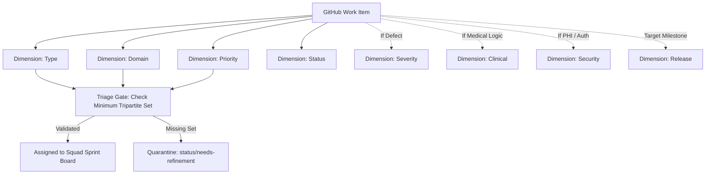

# Master Label Ontology, Taxonomy & Semantic Color Architecture

Authoritative engineering governance specification establishing the standardized label ontology, semantic color palettes, dimension schemas, mutual exclusivity contradiction matrices, and automated label synchronization protocols for the Namma Clinic Digital Health & Operations Platform across 450+ municipal clinics under the Greater Bengaluru Authority (GBA) and BBMP Health Department.

| Governance Attribute | Specification Value |
| :--- | :--- |
| **Document Identifier** | `DOC-GH-03-LABEL-ONTOLOGY` |
| **Document Title** | Master Label Ontology, Taxonomy & Semantic Color Architecture |
| **Document Version** | `1.0.0` |
| **Security Classification** | `RESTRICTED - GBA / BBMP HEALTH DEPARTMENT INTERNAL ONLY` |
| **Ratification Status** | `APPROVED & RATIFIED GOVERNANCE BASELINE` |
| **Program Domain** | Repository Governance, Workflow Automation & Issue Classification |
| **Target Audience** | Software Engineers, Triage Leads, Product Managers, Scrum Masters, Clinical SMEs, DevOps Leads |

## 1. Executive Summary & Semantic Classification Intent
Labels serve as the fundamental metadata layer driving automated triage, project board filtering, SLA escalation, clinical risk routing, and release notes generation across the Namma Clinic repository ecosystem. Without a deterministic, machine-validated label ontology, issue tracking rapidly degrades into ambiguity, orphan tasks, and unmonitored clinical hazards.

This specification establishes:
1. **The 11 Master Semantic Label Dimensions:** Structured categorical boundaries classifying work type, clinical domain, urgency, severity, workflow state, release vehicle, architectural layer, compliance, and clinical risk.
2. **78 Authoritative Canonical Labels (`LABEL-001` through `LABEL-078`):** Full technical catalog including exact HEX color codes, semantic descriptions, allowed issue scopes, and required co-labels.
3. **Contradiction & Mutual Exclusivity Matrix:** Strict logic tables preventing invalid state combinations (e.g., dual type tags, conflicting severity/priority tiers, premature completion status).
4. **Automated Label Synchronization & PR Auto-Labeling Specs:** Declarative configuration schemas (`.github/labeler.yml`) and CLI sync utilities for continuous consistency across repositories.
5. **75 Label Governance Acceptance Criteria (`AC-LABEL-001` to `AC-LABEL-075`):** Authoritative compliance gates certifying label discipline, zero untagged issues, and automated audit enforcement.

> [!IMPORTANT]
> **Deterministic Label Cardinality Invariant**
> Every issue and pull request in the Namma Clinic repository ecosystem MUST possess exactly ONE `type/*` label, exactly ONE `priority/*` label, and at least ONE `domain/*` label prior to exiting the triage state. Issues lacking this tripartite classification are blocked from sprint assignment.

## 2. Semantic Dimension Architecture & Visual Taxonomy
The platform organizes labels into 11 strictly partitioned semantic dimensions. Each dimension addresses a distinct operational question:

| Dimension Name | Core Operational Question | Cardinality Rule | Color Family | Enforcement Policy |
| :--- | :--- | :--- | :--- | :--- |
| **Type (`type/*`)** | What kind of work package is this? | `Exactly 1` | #0366D6 (Blue) | Mandatory on all issues & PRs |
| **Domain (`domain/*`)** | Which clinical or platform subsystem is affected? | `1 to 3` | #5319E7 (Purple) | Mandatory on all issues & PRs |
| **Priority (`priority/*`)** | How quickly must this work be scheduled? | `Exactly 1` | #B60205 to #0E8A16 | Mandatory on all issues & PRs |
| **Severity (`severity/*`)** | What is the clinical safety or system impact? | `0 or 1 (Mandatory for bugs)` | #D93F0B to #FBCA04 | Mandatory on `type/bug` and clinical issues |
| **Status (`status/*`)** | What is the current triage and execution stage? | `Exactly 1` | #0E8A16 to #C5DEF5 | Managed by Project Board automation |
| **Release (`release/*`)** | Which release train incorporates this change? | `0 or 1` | #1D76DB (Indigo) | Required for merged PRs and sprint items |
| **Clinical (`clinical/*`)** | What medical protocol or clinical review is involved? | `0 to 2` | #E99695 (Rose) | Required for prescription, diagnosis, or triage |
| **Security (`security/*`)** | What DPDP or cybersecurity concern applies? | `0 to 2` | #D4C5F9 (Lilac) | Required for auth, PHI, or cryptography |
| **QA (`qa/*`)** | What test coverage and verification level is required? | `0 to 2` | #BFDADC (Teal) | Applied during verification phases |
| **Risk (`risk/*`)** | What technical or operational risk tier is assessed? | `0 or 1` | #F9D0C4 (Coral) | Required for architectural changes |
| **Workstream (`workstream/*`)** | Which municipal rollout or organizational stream is involved? | `0 to 1` | #C2E0C6 (Mint) | Used for pilot, citywide, and field ops |

### Architecture Diagram: Label Classification Flow & Tripartite Triage Gate


## 3. Authoritative Label Catalog (LABEL-001 to LABEL-078)
Comprehensive operational profiles for all 78 canonical labels within the Namma Clinic repository ecosystem:

### LABEL-001: `type/epic` (Category: Type)
- **Canonical Identifier:** `LABEL-001`
- **Label String:** `type/epic`
- **Semantic Category:** Type
- **Hexadecimal Color Code:** `#B60205`
- **Functional Description:** Strategic initiative spanning multiple sprints
- **Usage & Governance Rule:** Applied to track type attributes on issues and pull requests.
- **Allowed Issue Scopes:** `Self`
- **Cardinality Constraint:** Dimension boundary enforced via automated GitHub webhook linter.

#### Clinical & Technical Applications for `type/epic`
- **Primary Operational Purpose:** Reserved specifically for designating work packages, issues, and PRs touching strategic initiative spanning multiple sprints.
- **Application Trigger:** Automatically inferred by path matching in PR workflows or assigned manually by engineering triage leads.
- **Clinical Risk Relevance:** Modulates triage priority when impacting municipal dispensaries, consultation rooms, or patient registries.
- **Reporting Aggregation:** Included in automated weekly progress telemetry delivered to BBMP Joint Commissioner.

#### Governance Lifecycle Controls for `type/epic`
1. **Tagging Authority:** Designated squad member, triage engineer, or automated bot may apply `type/epic`.
2. **Required Co-Labels:** Must appear alongside primary dimension companion labels.
3. **Incompatible Labels:** Prohibited from co-occurring with conflicting labels within the `Type` dimension.
4. **Removal Authority:** Requires explicit sign-off from designated squad lead or triage master.
5. **Automated Propagation:** Propagates downstream to associated child tasks and linked pull requests.
6. **Audit Trail Logging:** Every addition or removal of `type/epic` is recorded in the immutable GitHub timeline events API.

### LABEL-002: `type/feature` (Category: Type)
- **Canonical Identifier:** `LABEL-002`
- **Label String:** `type/feature`
- **Semantic Category:** Type
- **Hexadecimal Color Code:** `#0E8A16`
- **Functional Description:** End-to-end functional platform capability
- **Usage & Governance Rule:** Applied to track type attributes on issues and pull requests.
- **Allowed Issue Scopes:** `Self`
- **Cardinality Constraint:** Dimension boundary enforced via automated GitHub webhook linter.

#### Clinical & Technical Applications for `type/feature`
- **Primary Operational Purpose:** Reserved specifically for designating work packages, issues, and PRs touching end-to-end functional platform capability.
- **Application Trigger:** Automatically inferred by path matching in PR workflows or assigned manually by engineering triage leads.
- **Clinical Risk Relevance:** Modulates triage priority when impacting municipal dispensaries, consultation rooms, or patient registries.
- **Reporting Aggregation:** Included in automated weekly progress telemetry delivered to BBMP Joint Commissioner.

#### Governance Lifecycle Controls for `type/feature`
1. **Tagging Authority:** Designated squad member, triage engineer, or automated bot may apply `type/feature`.
2. **Required Co-Labels:** Must appear alongside primary dimension companion labels.
3. **Incompatible Labels:** Prohibited from co-occurring with conflicting labels within the `Type` dimension.
4. **Removal Authority:** Requires explicit sign-off from designated squad lead or triage master.
5. **Automated Propagation:** Propagates downstream to associated child tasks and linked pull requests.
6. **Audit Trail Logging:** Every addition or removal of `type/feature` is recorded in the immutable GitHub timeline events API.

### LABEL-003: `type/story` (Category: Type)
- **Canonical Identifier:** `LABEL-003`
- **Label String:** `type/story`
- **Semantic Category:** Type
- **Hexadecimal Color Code:** `#1D76DB`
- **Functional Description:** Discrete agile user requirement
- **Usage & Governance Rule:** Applied to track type attributes on issues and pull requests.
- **Allowed Issue Scopes:** `Self`
- **Cardinality Constraint:** Dimension boundary enforced via automated GitHub webhook linter.

#### Clinical & Technical Applications for `type/story`
- **Primary Operational Purpose:** Reserved specifically for designating work packages, issues, and PRs touching discrete agile user requirement.
- **Application Trigger:** Automatically inferred by path matching in PR workflows or assigned manually by engineering triage leads.
- **Clinical Risk Relevance:** Modulates triage priority when impacting municipal dispensaries, consultation rooms, or patient registries.
- **Reporting Aggregation:** Included in automated weekly progress telemetry delivered to BBMP Joint Commissioner.

#### Governance Lifecycle Controls for `type/story`
1. **Tagging Authority:** Designated squad member, triage engineer, or automated bot may apply `type/story`.
2. **Required Co-Labels:** Must appear alongside primary dimension companion labels.
3. **Incompatible Labels:** Prohibited from co-occurring with conflicting labels within the `Type` dimension.
4. **Removal Authority:** Requires explicit sign-off from designated squad lead or triage master.
5. **Automated Propagation:** Propagates downstream to associated child tasks and linked pull requests.
6. **Audit Trail Logging:** Every addition or removal of `type/story` is recorded in the immutable GitHub timeline events API.

### LABEL-004: `type/task` (Category: Type)
- **Canonical Identifier:** `LABEL-004`
- **Label String:** `type/task`
- **Semantic Category:** Type
- **Hexadecimal Color Code:** `#5319E7`
- **Functional Description:** Technical engineering work package
- **Usage & Governance Rule:** Applied to track type attributes on issues and pull requests.
- **Allowed Issue Scopes:** `Self`
- **Cardinality Constraint:** Dimension boundary enforced via automated GitHub webhook linter.

#### Clinical & Technical Applications for `type/task`
- **Primary Operational Purpose:** Reserved specifically for designating work packages, issues, and PRs touching technical engineering work package.
- **Application Trigger:** Automatically inferred by path matching in PR workflows or assigned manually by engineering triage leads.
- **Clinical Risk Relevance:** Modulates triage priority when impacting municipal dispensaries, consultation rooms, or patient registries.
- **Reporting Aggregation:** Included in automated weekly progress telemetry delivered to BBMP Joint Commissioner.

#### Governance Lifecycle Controls for `type/task`
1. **Tagging Authority:** Designated squad member, triage engineer, or automated bot may apply `type/task`.
2. **Required Co-Labels:** Must appear alongside primary dimension companion labels.
3. **Incompatible Labels:** Prohibited from co-occurring with conflicting labels within the `Type` dimension.
4. **Removal Authority:** Requires explicit sign-off from designated squad lead or triage master.
5. **Automated Propagation:** Propagates downstream to associated child tasks and linked pull requests.
6. **Audit Trail Logging:** Every addition or removal of `type/task` is recorded in the immutable GitHub timeline events API.

### LABEL-005: `type/bug` (Category: Type)
- **Canonical Identifier:** `LABEL-005`
- **Label String:** `type/bug`
- **Semantic Category:** Type
- **Hexadecimal Color Code:** `#D93F0B`
- **Functional Description:** Software defect or calculation deviation
- **Usage & Governance Rule:** Applied to track type attributes on issues and pull requests.
- **Allowed Issue Scopes:** `Self`
- **Cardinality Constraint:** Dimension boundary enforced via automated GitHub webhook linter.

#### Clinical & Technical Applications for `type/bug`
- **Primary Operational Purpose:** Reserved specifically for designating work packages, issues, and PRs touching software defect or calculation deviation.
- **Application Trigger:** Automatically inferred by path matching in PR workflows or assigned manually by engineering triage leads.
- **Clinical Risk Relevance:** Modulates triage priority when impacting municipal dispensaries, consultation rooms, or patient registries.
- **Reporting Aggregation:** Included in automated weekly progress telemetry delivered to BBMP Joint Commissioner.

#### Governance Lifecycle Controls for `type/bug`
1. **Tagging Authority:** Designated squad member, triage engineer, or automated bot may apply `type/bug`.
2. **Required Co-Labels:** Must appear alongside primary dimension companion labels.
3. **Incompatible Labels:** Prohibited from co-occurring with conflicting labels within the `Type` dimension.
4. **Removal Authority:** Requires explicit sign-off from designated squad lead or triage master.
5. **Automated Propagation:** Propagates downstream to associated child tasks and linked pull requests.
6. **Audit Trail Logging:** Every addition or removal of `type/bug` is recorded in the immutable GitHub timeline events API.

### LABEL-006: `type/security` (Category: Type)
- **Canonical Identifier:** `LABEL-006`
- **Label String:** `type/security`
- **Semantic Category:** Type
- **Hexadecimal Color Code:** `#B60205`
- **Functional Description:** Security vulnerability or access control issue
- **Usage & Governance Rule:** Applied to track type attributes on issues and pull requests.
- **Allowed Issue Scopes:** `Self`
- **Cardinality Constraint:** Dimension boundary enforced via automated GitHub webhook linter.

#### Clinical & Technical Applications for `type/security`
- **Primary Operational Purpose:** Reserved specifically for designating work packages, issues, and PRs touching security vulnerability or access control issue.
- **Application Trigger:** Automatically inferred by path matching in PR workflows or assigned manually by engineering triage leads.
- **Clinical Risk Relevance:** Modulates triage priority when impacting municipal dispensaries, consultation rooms, or patient registries.
- **Reporting Aggregation:** Included in automated weekly progress telemetry delivered to BBMP Joint Commissioner.

#### Governance Lifecycle Controls for `type/security`
1. **Tagging Authority:** Designated squad member, triage engineer, or automated bot may apply `type/security`.
2. **Required Co-Labels:** Must appear alongside primary dimension companion labels.
3. **Incompatible Labels:** Prohibited from co-occurring with conflicting labels within the `Type` dimension.
4. **Removal Authority:** Requires explicit sign-off from designated squad lead or triage master.
5. **Automated Propagation:** Propagates downstream to associated child tasks and linked pull requests.
6. **Audit Trail Logging:** Every addition or removal of `type/security` is recorded in the immutable GitHub timeline events API.

### LABEL-007: `type/tech-debt` (Category: Type)
- **Canonical Identifier:** `LABEL-007`
- **Label String:** `type/tech-debt`
- **Semantic Category:** Type
- **Hexadecimal Color Code:** `#FBCA04`
- **Functional Description:** Refactoring and code maintainability improvement
- **Usage & Governance Rule:** Applied to track type attributes on issues and pull requests.
- **Allowed Issue Scopes:** `Self`
- **Cardinality Constraint:** Dimension boundary enforced via automated GitHub webhook linter.

#### Clinical & Technical Applications for `type/tech-debt`
- **Primary Operational Purpose:** Reserved specifically for designating work packages, issues, and PRs touching refactoring and code maintainability improvement.
- **Application Trigger:** Automatically inferred by path matching in PR workflows or assigned manually by engineering triage leads.
- **Clinical Risk Relevance:** Modulates triage priority when impacting municipal dispensaries, consultation rooms, or patient registries.
- **Reporting Aggregation:** Included in automated weekly progress telemetry delivered to BBMP Joint Commissioner.

#### Governance Lifecycle Controls for `type/tech-debt`
1. **Tagging Authority:** Designated squad member, triage engineer, or automated bot may apply `type/tech-debt`.
2. **Required Co-Labels:** Must appear alongside primary dimension companion labels.
3. **Incompatible Labels:** Prohibited from co-occurring with conflicting labels within the `Type` dimension.
4. **Removal Authority:** Requires explicit sign-off from designated squad lead or triage master.
5. **Automated Propagation:** Propagates downstream to associated child tasks and linked pull requests.
6. **Audit Trail Logging:** Every addition or removal of `type/tech-debt` is recorded in the immutable GitHub timeline events API.

### LABEL-008: `type/spike` (Category: Type)
- **Canonical Identifier:** `LABEL-008`
- **Label String:** `type/spike`
- **Semantic Category:** Type
- **Hexadecimal Color Code:** `#006B75`
- **Functional Description:** Time-boxed research or technical feasibility spike
- **Usage & Governance Rule:** Applied to track type attributes on issues and pull requests.
- **Allowed Issue Scopes:** `Self`
- **Cardinality Constraint:** Dimension boundary enforced via automated GitHub webhook linter.

#### Clinical & Technical Applications for `type/spike`
- **Primary Operational Purpose:** Reserved specifically for designating work packages, issues, and PRs touching time-boxed research or technical feasibility spike.
- **Application Trigger:** Automatically inferred by path matching in PR workflows or assigned manually by engineering triage leads.
- **Clinical Risk Relevance:** Modulates triage priority when impacting municipal dispensaries, consultation rooms, or patient registries.
- **Reporting Aggregation:** Included in automated weekly progress telemetry delivered to BBMP Joint Commissioner.

#### Governance Lifecycle Controls for `type/spike`
1. **Tagging Authority:** Designated squad member, triage engineer, or automated bot may apply `type/spike`.
2. **Required Co-Labels:** Must appear alongside primary dimension companion labels.
3. **Incompatible Labels:** Prohibited from co-occurring with conflicting labels within the `Type` dimension.
4. **Removal Authority:** Requires explicit sign-off from designated squad lead or triage master.
5. **Automated Propagation:** Propagates downstream to associated child tasks and linked pull requests.
6. **Audit Trail Logging:** Every addition or removal of `type/spike` is recorded in the immutable GitHub timeline events API.

### LABEL-009: `type/clinical` (Category: Type)
- **Canonical Identifier:** `LABEL-009`
- **Label String:** `type/clinical`
- **Semantic Category:** Type
- **Hexadecimal Color Code:** `#0052CC`
- **Functional Description:** Clinical treatment guidelines or medical workflow
- **Usage & Governance Rule:** Applied to track type attributes on issues and pull requests.
- **Allowed Issue Scopes:** `Self`
- **Cardinality Constraint:** Dimension boundary enforced via automated GitHub webhook linter.

#### Clinical & Technical Applications for `type/clinical`
- **Primary Operational Purpose:** Reserved specifically for designating work packages, issues, and PRs touching clinical treatment guidelines or medical workflow.
- **Application Trigger:** Automatically inferred by path matching in PR workflows or assigned manually by engineering triage leads.
- **Clinical Risk Relevance:** Modulates triage priority when impacting municipal dispensaries, consultation rooms, or patient registries.
- **Reporting Aggregation:** Included in automated weekly progress telemetry delivered to BBMP Joint Commissioner.

#### Governance Lifecycle Controls for `type/clinical`
1. **Tagging Authority:** Designated squad member, triage engineer, or automated bot may apply `type/clinical`.
2. **Required Co-Labels:** Must appear alongside primary dimension companion labels.
3. **Incompatible Labels:** Prohibited from co-occurring with conflicting labels within the `Type` dimension.
4. **Removal Authority:** Requires explicit sign-off from designated squad lead or triage master.
5. **Automated Propagation:** Propagates downstream to associated child tasks and linked pull requests.
6. **Audit Trail Logging:** Every addition or removal of `type/clinical` is recorded in the immutable GitHub timeline events API.

### LABEL-010: `type/incident` (Category: Type)
- **Canonical Identifier:** `LABEL-010`
- **Label String:** `type/incident`
- **Semantic Category:** Type
- **Hexadecimal Color Code:** `#E11D21`
- **Functional Description:** Live production operational incident
- **Usage & Governance Rule:** Applied to track type attributes on issues and pull requests.
- **Allowed Issue Scopes:** `Self`
- **Cardinality Constraint:** Dimension boundary enforced via automated GitHub webhook linter.

#### Clinical & Technical Applications for `type/incident`
- **Primary Operational Purpose:** Reserved specifically for designating work packages, issues, and PRs touching live production operational incident.
- **Application Trigger:** Automatically inferred by path matching in PR workflows or assigned manually by engineering triage leads.
- **Clinical Risk Relevance:** Modulates triage priority when impacting municipal dispensaries, consultation rooms, or patient registries.
- **Reporting Aggregation:** Included in automated weekly progress telemetry delivered to BBMP Joint Commissioner.

#### Governance Lifecycle Controls for `type/incident`
1. **Tagging Authority:** Designated squad member, triage engineer, or automated bot may apply `type/incident`.
2. **Required Co-Labels:** Must appear alongside primary dimension companion labels.
3. **Incompatible Labels:** Prohibited from co-occurring with conflicting labels within the `Type` dimension.
4. **Removal Authority:** Requires explicit sign-off from designated squad lead or triage master.
5. **Automated Propagation:** Propagates downstream to associated child tasks and linked pull requests.
6. **Audit Trail Logging:** Every addition or removal of `type/incident` is recorded in the immutable GitHub timeline events API.

### LABEL-011: `type/change-request` (Category: Type)
- **Canonical Identifier:** `LABEL-011`
- **Label String:** `type/change-request`
- **Semantic Category:** Type
- **Hexadecimal Color Code:** `#D4C5F9`
- **Functional Description:** Formal scope or requirement modification
- **Usage & Governance Rule:** Applied to track type attributes on issues and pull requests.
- **Allowed Issue Scopes:** `Self`
- **Cardinality Constraint:** Dimension boundary enforced via automated GitHub webhook linter.

#### Clinical & Technical Applications for `type/change-request`
- **Primary Operational Purpose:** Reserved specifically for designating work packages, issues, and PRs touching formal scope or requirement modification.
- **Application Trigger:** Automatically inferred by path matching in PR workflows or assigned manually by engineering triage leads.
- **Clinical Risk Relevance:** Modulates triage priority when impacting municipal dispensaries, consultation rooms, or patient registries.
- **Reporting Aggregation:** Included in automated weekly progress telemetry delivered to BBMP Joint Commissioner.

#### Governance Lifecycle Controls for `type/change-request`
1. **Tagging Authority:** Designated squad member, triage engineer, or automated bot may apply `type/change-request`.
2. **Required Co-Labels:** Must appear alongside primary dimension companion labels.
3. **Incompatible Labels:** Prohibited from co-occurring with conflicting labels within the `Type` dimension.
4. **Removal Authority:** Requires explicit sign-off from designated squad lead or triage master.
5. **Automated Propagation:** Propagates downstream to associated child tasks and linked pull requests.
6. **Audit Trail Logging:** Every addition or removal of `type/change-request` is recorded in the immutable GitHub timeline events API.

### LABEL-012: `type/dependency` (Category: Type)
- **Canonical Identifier:** `LABEL-012`
- **Label String:** `type/dependency`
- **Semantic Category:** Type
- **Hexadecimal Color Code:** `#C2E0C6`
- **Functional Description:** External system or interface blocker
- **Usage & Governance Rule:** Applied to track type attributes on issues and pull requests.
- **Allowed Issue Scopes:** `Self`
- **Cardinality Constraint:** Dimension boundary enforced via automated GitHub webhook linter.

#### Clinical & Technical Applications for `type/dependency`
- **Primary Operational Purpose:** Reserved specifically for designating work packages, issues, and PRs touching external system or interface blocker.
- **Application Trigger:** Automatically inferred by path matching in PR workflows or assigned manually by engineering triage leads.
- **Clinical Risk Relevance:** Modulates triage priority when impacting municipal dispensaries, consultation rooms, or patient registries.
- **Reporting Aggregation:** Included in automated weekly progress telemetry delivered to BBMP Joint Commissioner.

#### Governance Lifecycle Controls for `type/dependency`
1. **Tagging Authority:** Designated squad member, triage engineer, or automated bot may apply `type/dependency`.
2. **Required Co-Labels:** Must appear alongside primary dimension companion labels.
3. **Incompatible Labels:** Prohibited from co-occurring with conflicting labels within the `Type` dimension.
4. **Removal Authority:** Requires explicit sign-off from designated squad lead or triage master.
5. **Automated Propagation:** Propagates downstream to associated child tasks and linked pull requests.
6. **Audit Trail Logging:** Every addition or removal of `type/dependency` is recorded in the immutable GitHub timeline events API.

### LABEL-013: `type/release` (Category: Type)
- **Canonical Identifier:** `LABEL-013`
- **Label String:** `type/release`
- **Semantic Category:** Type
- **Hexadecimal Color Code:** `#BFDADC`
- **Functional Description:** Release management and deployment task
- **Usage & Governance Rule:** Applied to track type attributes on issues and pull requests.
- **Allowed Issue Scopes:** `Self`
- **Cardinality Constraint:** Dimension boundary enforced via automated GitHub webhook linter.

#### Clinical & Technical Applications for `type/release`
- **Primary Operational Purpose:** Reserved specifically for designating work packages, issues, and PRs touching release management and deployment task.
- **Application Trigger:** Automatically inferred by path matching in PR workflows or assigned manually by engineering triage leads.
- **Clinical Risk Relevance:** Modulates triage priority when impacting municipal dispensaries, consultation rooms, or patient registries.
- **Reporting Aggregation:** Included in automated weekly progress telemetry delivered to BBMP Joint Commissioner.

#### Governance Lifecycle Controls for `type/release`
1. **Tagging Authority:** Designated squad member, triage engineer, or automated bot may apply `type/release`.
2. **Required Co-Labels:** Must appear alongside primary dimension companion labels.
3. **Incompatible Labels:** Prohibited from co-occurring with conflicting labels within the `Type` dimension.
4. **Removal Authority:** Requires explicit sign-off from designated squad lead or triage master.
5. **Automated Propagation:** Propagates downstream to associated child tasks and linked pull requests.
6. **Audit Trail Logging:** Every addition or removal of `type/release` is recorded in the immutable GitHub timeline events API.

### LABEL-014: `type/qa-test` (Category: Type)
- **Canonical Identifier:** `LABEL-014`
- **Label String:** `type/qa-test`
- **Semantic Category:** Type
- **Hexadecimal Color Code:** `#0E8A16`
- **Functional Description:** Automated QA scenario or verification gate
- **Usage & Governance Rule:** Applied to track type attributes on issues and pull requests.
- **Allowed Issue Scopes:** `Self`
- **Cardinality Constraint:** Dimension boundary enforced via automated GitHub webhook linter.

#### Clinical & Technical Applications for `type/qa-test`
- **Primary Operational Purpose:** Reserved specifically for designating work packages, issues, and PRs touching automated qa scenario or verification gate.
- **Application Trigger:** Automatically inferred by path matching in PR workflows or assigned manually by engineering triage leads.
- **Clinical Risk Relevance:** Modulates triage priority when impacting municipal dispensaries, consultation rooms, or patient registries.
- **Reporting Aggregation:** Included in automated weekly progress telemetry delivered to BBMP Joint Commissioner.

#### Governance Lifecycle Controls for `type/qa-test`
1. **Tagging Authority:** Designated squad member, triage engineer, or automated bot may apply `type/qa-test`.
2. **Required Co-Labels:** Must appear alongside primary dimension companion labels.
3. **Incompatible Labels:** Prohibited from co-occurring with conflicting labels within the `Type` dimension.
4. **Removal Authority:** Requires explicit sign-off from designated squad lead or triage master.
5. **Automated Propagation:** Propagates downstream to associated child tasks and linked pull requests.
6. **Audit Trail Logging:** Every addition or removal of `type/qa-test` is recorded in the immutable GitHub timeline events API.

### LABEL-015: `type/docs` (Category: Type)
- **Canonical Identifier:** `LABEL-015`
- **Label String:** `type/docs`
- **Semantic Category:** Type
- **Hexadecimal Color Code:** `#0075CA`
- **Functional Description:** Documentation, architecture, or runbook update
- **Usage & Governance Rule:** Applied to track type attributes on issues and pull requests.
- **Allowed Issue Scopes:** `Self`
- **Cardinality Constraint:** Dimension boundary enforced via automated GitHub webhook linter.

#### Clinical & Technical Applications for `type/docs`
- **Primary Operational Purpose:** Reserved specifically for designating work packages, issues, and PRs touching documentation, architecture, or runbook update.
- **Application Trigger:** Automatically inferred by path matching in PR workflows or assigned manually by engineering triage leads.
- **Clinical Risk Relevance:** Modulates triage priority when impacting municipal dispensaries, consultation rooms, or patient registries.
- **Reporting Aggregation:** Included in automated weekly progress telemetry delivered to BBMP Joint Commissioner.

#### Governance Lifecycle Controls for `type/docs`
1. **Tagging Authority:** Designated squad member, triage engineer, or automated bot may apply `type/docs`.
2. **Required Co-Labels:** Must appear alongside primary dimension companion labels.
3. **Incompatible Labels:** Prohibited from co-occurring with conflicting labels within the `Type` dimension.
4. **Removal Authority:** Requires explicit sign-off from designated squad lead or triage master.
5. **Automated Propagation:** Propagates downstream to associated child tasks and linked pull requests.
6. **Audit Trail Logging:** Every addition or removal of `type/docs` is recorded in the immutable GitHub timeline events API.

### LABEL-016: `type/compliance` (Category: Type)
- **Canonical Identifier:** `LABEL-016`
- **Label String:** `type/compliance`
- **Semantic Category:** Type
- **Hexadecimal Color Code:** `#5319E7`
- **Functional Description:** DPDP Act or regulatory compliance audit
- **Usage & Governance Rule:** Applied to track type attributes on issues and pull requests.
- **Allowed Issue Scopes:** `Self`
- **Cardinality Constraint:** Dimension boundary enforced via automated GitHub webhook linter.

#### Clinical & Technical Applications for `type/compliance`
- **Primary Operational Purpose:** Reserved specifically for designating work packages, issues, and PRs touching dpdp act or regulatory compliance audit.
- **Application Trigger:** Automatically inferred by path matching in PR workflows or assigned manually by engineering triage leads.
- **Clinical Risk Relevance:** Modulates triage priority when impacting municipal dispensaries, consultation rooms, or patient registries.
- **Reporting Aggregation:** Included in automated weekly progress telemetry delivered to BBMP Joint Commissioner.

#### Governance Lifecycle Controls for `type/compliance`
1. **Tagging Authority:** Designated squad member, triage engineer, or automated bot may apply `type/compliance`.
2. **Required Co-Labels:** Must appear alongside primary dimension companion labels.
3. **Incompatible Labels:** Prohibited from co-occurring with conflicting labels within the `Type` dimension.
4. **Removal Authority:** Requires explicit sign-off from designated squad lead or triage master.
5. **Automated Propagation:** Propagates downstream to associated child tasks and linked pull requests.
6. **Audit Trail Logging:** Every addition or removal of `type/compliance` is recorded in the immutable GitHub timeline events API.

### LABEL-017: `type/infra` (Category: Type)
- **Canonical Identifier:** `LABEL-017`
- **Label String:** `type/infra`
- **Semantic Category:** Type
- **Hexadecimal Color Code:** `#0052CC`
- **Functional Description:** Cloud infrastructure, Kubernetes, or SRE work
- **Usage & Governance Rule:** Applied to track type attributes on issues and pull requests.
- **Allowed Issue Scopes:** `Self`
- **Cardinality Constraint:** Dimension boundary enforced via automated GitHub webhook linter.

#### Clinical & Technical Applications for `type/infra`
- **Primary Operational Purpose:** Reserved specifically for designating work packages, issues, and PRs touching cloud infrastructure, kubernetes, or sre work.
- **Application Trigger:** Automatically inferred by path matching in PR workflows or assigned manually by engineering triage leads.
- **Clinical Risk Relevance:** Modulates triage priority when impacting municipal dispensaries, consultation rooms, or patient registries.
- **Reporting Aggregation:** Included in automated weekly progress telemetry delivered to BBMP Joint Commissioner.

#### Governance Lifecycle Controls for `type/infra`
1. **Tagging Authority:** Designated squad member, triage engineer, or automated bot may apply `type/infra`.
2. **Required Co-Labels:** Must appear alongside primary dimension companion labels.
3. **Incompatible Labels:** Prohibited from co-occurring with conflicting labels within the `Type` dimension.
4. **Removal Authority:** Requires explicit sign-off from designated squad lead or triage master.
5. **Automated Propagation:** Propagates downstream to associated child tasks and linked pull requests.
6. **Audit Trail Logging:** Every addition or removal of `type/infra` is recorded in the immutable GitHub timeline events API.

### LABEL-018: `type/hardware` (Category: Type)
- **Canonical Identifier:** `LABEL-018`
- **Label String:** `type/hardware`
- **Semantic Category:** Type
- **Hexadecimal Color Code:** `#FBCA04`
- **Functional Description:** Clinic physical PC, printer, scanner setup
- **Usage & Governance Rule:** Applied to track type attributes on issues and pull requests.
- **Allowed Issue Scopes:** `Self`
- **Cardinality Constraint:** Dimension boundary enforced via automated GitHub webhook linter.

#### Clinical & Technical Applications for `type/hardware`
- **Primary Operational Purpose:** Reserved specifically for designating work packages, issues, and PRs touching clinic physical pc, printer, scanner setup.
- **Application Trigger:** Automatically inferred by path matching in PR workflows or assigned manually by engineering triage leads.
- **Clinical Risk Relevance:** Modulates triage priority when impacting municipal dispensaries, consultation rooms, or patient registries.
- **Reporting Aggregation:** Included in automated weekly progress telemetry delivered to BBMP Joint Commissioner.

#### Governance Lifecycle Controls for `type/hardware`
1. **Tagging Authority:** Designated squad member, triage engineer, or automated bot may apply `type/hardware`.
2. **Required Co-Labels:** Must appear alongside primary dimension companion labels.
3. **Incompatible Labels:** Prohibited from co-occurring with conflicting labels within the `Type` dimension.
4. **Removal Authority:** Requires explicit sign-off from designated squad lead or triage master.
5. **Automated Propagation:** Propagates downstream to associated child tasks and linked pull requests.
6. **Audit Trail Logging:** Every addition or removal of `type/hardware` is recorded in the immutable GitHub timeline events API.

### LABEL-019: `priority/p0-blocker` (Category: Priority)
- **Canonical Identifier:** `LABEL-019`
- **Label String:** `priority/p0-blocker`
- **Semantic Category:** Priority
- **Hexadecimal Color Code:** `#B60205`
- **Functional Description:** P0 Critical: Immediate blocking priority, halts release
- **Usage & Governance Rule:** Applied to track priority attributes on issues and pull requests.
- **Allowed Issue Scopes:** `All Issue Types`
- **Cardinality Constraint:** Dimension boundary enforced via automated GitHub webhook linter.

#### Clinical & Technical Applications for `priority/p0-blocker`
- **Primary Operational Purpose:** Reserved specifically for designating work packages, issues, and PRs touching p0 critical: immediate blocking priority, halts release.
- **Application Trigger:** Automatically inferred by path matching in PR workflows or assigned manually by engineering triage leads.
- **Clinical Risk Relevance:** Modulates triage priority when impacting municipal dispensaries, consultation rooms, or patient registries.
- **Reporting Aggregation:** Included in automated weekly progress telemetry delivered to BBMP Joint Commissioner.

#### Governance Lifecycle Controls for `priority/p0-blocker`
1. **Tagging Authority:** Designated squad member, triage engineer, or automated bot may apply `priority/p0-blocker`.
2. **Required Co-Labels:** Must appear alongside primary dimension companion labels.
3. **Incompatible Labels:** Prohibited from co-occurring with conflicting labels within the `Priority` dimension.
4. **Removal Authority:** Requires explicit sign-off from designated squad lead or triage master.
5. **Automated Propagation:** Propagates downstream to associated child tasks and linked pull requests.
6. **Audit Trail Logging:** Every addition or removal of `priority/p0-blocker` is recorded in the immutable GitHub timeline events API.

### LABEL-020: `priority/p1-high` (Category: Priority)
- **Canonical Identifier:** `LABEL-020`
- **Label String:** `priority/p1-high`
- **Semantic Category:** Priority
- **Hexadecimal Color Code:** `#D93F0B`
- **Functional Description:** P1 High: Essential for target sprint delivery
- **Usage & Governance Rule:** Applied to track priority attributes on issues and pull requests.
- **Allowed Issue Scopes:** `All Issue Types`
- **Cardinality Constraint:** Dimension boundary enforced via automated GitHub webhook linter.

#### Clinical & Technical Applications for `priority/p1-high`
- **Primary Operational Purpose:** Reserved specifically for designating work packages, issues, and PRs touching p1 high: essential for target sprint delivery.
- **Application Trigger:** Automatically inferred by path matching in PR workflows or assigned manually by engineering triage leads.
- **Clinical Risk Relevance:** Modulates triage priority when impacting municipal dispensaries, consultation rooms, or patient registries.
- **Reporting Aggregation:** Included in automated weekly progress telemetry delivered to BBMP Joint Commissioner.

#### Governance Lifecycle Controls for `priority/p1-high`
1. **Tagging Authority:** Designated squad member, triage engineer, or automated bot may apply `priority/p1-high`.
2. **Required Co-Labels:** Must appear alongside primary dimension companion labels.
3. **Incompatible Labels:** Prohibited from co-occurring with conflicting labels within the `Priority` dimension.
4. **Removal Authority:** Requires explicit sign-off from designated squad lead or triage master.
5. **Automated Propagation:** Propagates downstream to associated child tasks and linked pull requests.
6. **Audit Trail Logging:** Every addition or removal of `priority/p1-high` is recorded in the immutable GitHub timeline events API.

### LABEL-021: `priority/p2-medium` (Category: Priority)
- **Canonical Identifier:** `LABEL-021`
- **Label String:** `priority/p2-medium`
- **Semantic Category:** Priority
- **Hexadecimal Color Code:** `#FBCA04`
- **Functional Description:** P2 Medium: Standard priority planned in backlog
- **Usage & Governance Rule:** Applied to track priority attributes on issues and pull requests.
- **Allowed Issue Scopes:** `All Issue Types`
- **Cardinality Constraint:** Dimension boundary enforced via automated GitHub webhook linter.

#### Clinical & Technical Applications for `priority/p2-medium`
- **Primary Operational Purpose:** Reserved specifically for designating work packages, issues, and PRs touching p2 medium: standard priority planned in backlog.
- **Application Trigger:** Automatically inferred by path matching in PR workflows or assigned manually by engineering triage leads.
- **Clinical Risk Relevance:** Modulates triage priority when impacting municipal dispensaries, consultation rooms, or patient registries.
- **Reporting Aggregation:** Included in automated weekly progress telemetry delivered to BBMP Joint Commissioner.

#### Governance Lifecycle Controls for `priority/p2-medium`
1. **Tagging Authority:** Designated squad member, triage engineer, or automated bot may apply `priority/p2-medium`.
2. **Required Co-Labels:** Must appear alongside primary dimension companion labels.
3. **Incompatible Labels:** Prohibited from co-occurring with conflicting labels within the `Priority` dimension.
4. **Removal Authority:** Requires explicit sign-off from designated squad lead or triage master.
5. **Automated Propagation:** Propagates downstream to associated child tasks and linked pull requests.
6. **Audit Trail Logging:** Every addition or removal of `priority/p2-medium` is recorded in the immutable GitHub timeline events API.

### LABEL-022: `priority/p3-low` (Category: Priority)
- **Canonical Identifier:** `LABEL-022`
- **Label String:** `priority/p3-low`
- **Semantic Category:** Priority
- **Hexadecimal Color Code:** `#0E8A16`
- **Functional Description:** P3 Low: Desirable improvement or cosmetic update
- **Usage & Governance Rule:** Applied to track priority attributes on issues and pull requests.
- **Allowed Issue Scopes:** `All Issue Types`
- **Cardinality Constraint:** Dimension boundary enforced via automated GitHub webhook linter.

#### Clinical & Technical Applications for `priority/p3-low`
- **Primary Operational Purpose:** Reserved specifically for designating work packages, issues, and PRs touching p3 low: desirable improvement or cosmetic update.
- **Application Trigger:** Automatically inferred by path matching in PR workflows or assigned manually by engineering triage leads.
- **Clinical Risk Relevance:** Modulates triage priority when impacting municipal dispensaries, consultation rooms, or patient registries.
- **Reporting Aggregation:** Included in automated weekly progress telemetry delivered to BBMP Joint Commissioner.

#### Governance Lifecycle Controls for `priority/p3-low`
1. **Tagging Authority:** Designated squad member, triage engineer, or automated bot may apply `priority/p3-low`.
2. **Required Co-Labels:** Must appear alongside primary dimension companion labels.
3. **Incompatible Labels:** Prohibited from co-occurring with conflicting labels within the `Priority` dimension.
4. **Removal Authority:** Requires explicit sign-off from designated squad lead or triage master.
5. **Automated Propagation:** Propagates downstream to associated child tasks and linked pull requests.
6. **Audit Trail Logging:** Every addition or removal of `priority/p3-low` is recorded in the immutable GitHub timeline events API.

### LABEL-023: `severity/critical` (Category: Severity)
- **Canonical Identifier:** `LABEL-023`
- **Label String:** `severity/critical`
- **Semantic Category:** Severity
- **Hexadecimal Color Code:** `#B60205`
- **Functional Description:** System outage, data corruption, or severe patient safety hazard
- **Usage & Governance Rule:** Applied to track severity attributes on issues and pull requests.
- **Allowed Issue Scopes:** `All Issue Types`
- **Cardinality Constraint:** Dimension boundary enforced via automated GitHub webhook linter.

#### Clinical & Technical Applications for `severity/critical`
- **Primary Operational Purpose:** Reserved specifically for designating work packages, issues, and PRs touching system outage, data corruption, or severe patient safety hazard.
- **Application Trigger:** Automatically inferred by path matching in PR workflows or assigned manually by engineering triage leads.
- **Clinical Risk Relevance:** Modulates triage priority when impacting municipal dispensaries, consultation rooms, or patient registries.
- **Reporting Aggregation:** Included in automated weekly progress telemetry delivered to BBMP Joint Commissioner.

#### Governance Lifecycle Controls for `severity/critical`
1. **Tagging Authority:** Designated squad member, triage engineer, or automated bot may apply `severity/critical`.
2. **Required Co-Labels:** Must appear alongside primary dimension companion labels.
3. **Incompatible Labels:** Prohibited from co-occurring with conflicting labels within the `Severity` dimension.
4. **Removal Authority:** Requires explicit sign-off from designated squad lead or triage master.
5. **Automated Propagation:** Propagates downstream to associated child tasks and linked pull requests.
6. **Audit Trail Logging:** Every addition or removal of `severity/critical` is recorded in the immutable GitHub timeline events API.

### LABEL-024: `severity/major` (Category: Severity)
- **Canonical Identifier:** `LABEL-024`
- **Label String:** `severity/major`
- **Semantic Category:** Severity
- **Hexadecimal Color Code:** `#D93F0B`
- **Functional Description:** Major clinical feature failure with no workaround
- **Usage & Governance Rule:** Applied to track severity attributes on issues and pull requests.
- **Allowed Issue Scopes:** `All Issue Types`
- **Cardinality Constraint:** Dimension boundary enforced via automated GitHub webhook linter.

#### Clinical & Technical Applications for `severity/major`
- **Primary Operational Purpose:** Reserved specifically for designating work packages, issues, and PRs touching major clinical feature failure with no workaround.
- **Application Trigger:** Automatically inferred by path matching in PR workflows or assigned manually by engineering triage leads.
- **Clinical Risk Relevance:** Modulates triage priority when impacting municipal dispensaries, consultation rooms, or patient registries.
- **Reporting Aggregation:** Included in automated weekly progress telemetry delivered to BBMP Joint Commissioner.

#### Governance Lifecycle Controls for `severity/major`
1. **Tagging Authority:** Designated squad member, triage engineer, or automated bot may apply `severity/major`.
2. **Required Co-Labels:** Must appear alongside primary dimension companion labels.
3. **Incompatible Labels:** Prohibited from co-occurring with conflicting labels within the `Severity` dimension.
4. **Removal Authority:** Requires explicit sign-off from designated squad lead or triage master.
5. **Automated Propagation:** Propagates downstream to associated child tasks and linked pull requests.
6. **Audit Trail Logging:** Every addition or removal of `severity/major` is recorded in the immutable GitHub timeline events API.

### LABEL-025: `severity/moderate` (Category: Severity)
- **Canonical Identifier:** `LABEL-025`
- **Label String:** `severity/moderate`
- **Semantic Category:** Severity
- **Hexadecimal Color Code:** `#FBCA04`
- **Functional Description:** Functional defect with acceptable manual workaround
- **Usage & Governance Rule:** Applied to track severity attributes on issues and pull requests.
- **Allowed Issue Scopes:** `All Issue Types`
- **Cardinality Constraint:** Dimension boundary enforced via automated GitHub webhook linter.

#### Clinical & Technical Applications for `severity/moderate`
- **Primary Operational Purpose:** Reserved specifically for designating work packages, issues, and PRs touching functional defect with acceptable manual workaround.
- **Application Trigger:** Automatically inferred by path matching in PR workflows or assigned manually by engineering triage leads.
- **Clinical Risk Relevance:** Modulates triage priority when impacting municipal dispensaries, consultation rooms, or patient registries.
- **Reporting Aggregation:** Included in automated weekly progress telemetry delivered to BBMP Joint Commissioner.

#### Governance Lifecycle Controls for `severity/moderate`
1. **Tagging Authority:** Designated squad member, triage engineer, or automated bot may apply `severity/moderate`.
2. **Required Co-Labels:** Must appear alongside primary dimension companion labels.
3. **Incompatible Labels:** Prohibited from co-occurring with conflicting labels within the `Severity` dimension.
4. **Removal Authority:** Requires explicit sign-off from designated squad lead or triage master.
5. **Automated Propagation:** Propagates downstream to associated child tasks and linked pull requests.
6. **Audit Trail Logging:** Every addition or removal of `severity/moderate` is recorded in the immutable GitHub timeline events API.

### LABEL-026: `severity/minor` (Category: Severity)
- **Canonical Identifier:** `LABEL-026`
- **Label String:** `severity/minor`
- **Semantic Category:** Severity
- **Hexadecimal Color Code:** `#C2E0C6`
- **Functional Description:** Minor cosmetic defect, typo, or UI alignment glitch
- **Usage & Governance Rule:** Applied to track severity attributes on issues and pull requests.
- **Allowed Issue Scopes:** `All Issue Types`
- **Cardinality Constraint:** Dimension boundary enforced via automated GitHub webhook linter.

#### Clinical & Technical Applications for `severity/minor`
- **Primary Operational Purpose:** Reserved specifically for designating work packages, issues, and PRs touching minor cosmetic defect, typo, or ui alignment glitch.
- **Application Trigger:** Automatically inferred by path matching in PR workflows or assigned manually by engineering triage leads.
- **Clinical Risk Relevance:** Modulates triage priority when impacting municipal dispensaries, consultation rooms, or patient registries.
- **Reporting Aggregation:** Included in automated weekly progress telemetry delivered to BBMP Joint Commissioner.

#### Governance Lifecycle Controls for `severity/minor`
1. **Tagging Authority:** Designated squad member, triage engineer, or automated bot may apply `severity/minor`.
2. **Required Co-Labels:** Must appear alongside primary dimension companion labels.
3. **Incompatible Labels:** Prohibited from co-occurring with conflicting labels within the `Severity` dimension.
4. **Removal Authority:** Requires explicit sign-off from designated squad lead or triage master.
5. **Automated Propagation:** Propagates downstream to associated child tasks and linked pull requests.
6. **Audit Trail Logging:** Every addition or removal of `severity/minor` is recorded in the immutable GitHub timeline events API.

### LABEL-027: `domain/patient-reg` (Category: Domain)
- **Canonical Identifier:** `LABEL-027`
- **Label String:** `domain/patient-reg`
- **Semantic Category:** Domain
- **Hexadecimal Color Code:** `#0075CA`
- **Functional Description:** Citizen demographic intake and registration
- **Usage & Governance Rule:** Applied to track domain attributes on issues and pull requests.
- **Allowed Issue Scopes:** `All Issue Types`
- **Cardinality Constraint:** Dimension boundary enforced via automated GitHub webhook linter.

#### Clinical & Technical Applications for `domain/patient-reg`
- **Primary Operational Purpose:** Reserved specifically for designating work packages, issues, and PRs touching citizen demographic intake and registration.
- **Application Trigger:** Automatically inferred by path matching in PR workflows or assigned manually by engineering triage leads.
- **Clinical Risk Relevance:** Modulates triage priority when impacting municipal dispensaries, consultation rooms, or patient registries.
- **Reporting Aggregation:** Included in automated weekly progress telemetry delivered to BBMP Joint Commissioner.

#### Governance Lifecycle Controls for `domain/patient-reg`
1. **Tagging Authority:** Designated squad member, triage engineer, or automated bot may apply `domain/patient-reg`.
2. **Required Co-Labels:** Must appear alongside primary dimension companion labels.
3. **Incompatible Labels:** Prohibited from co-occurring with conflicting labels within the `Domain` dimension.
4. **Removal Authority:** Requires explicit sign-off from designated squad lead or triage master.
5. **Automated Propagation:** Propagates downstream to associated child tasks and linked pull requests.
6. **Audit Trail Logging:** Every addition or removal of `domain/patient-reg` is recorded in the immutable GitHub timeline events API.

### LABEL-028: `domain/triage` (Category: Domain)
- **Canonical Identifier:** `LABEL-028`
- **Label String:** `domain/triage`
- **Semantic Category:** Domain
- **Hexadecimal Color Code:** `#008672`
- **Functional Description:** Nurse vital signs and danger alert triage
- **Usage & Governance Rule:** Applied to track domain attributes on issues and pull requests.
- **Allowed Issue Scopes:** `All Issue Types`
- **Cardinality Constraint:** Dimension boundary enforced via automated GitHub webhook linter.

#### Clinical & Technical Applications for `domain/triage`
- **Primary Operational Purpose:** Reserved specifically for designating work packages, issues, and PRs touching nurse vital signs and danger alert triage.
- **Application Trigger:** Automatically inferred by path matching in PR workflows or assigned manually by engineering triage leads.
- **Clinical Risk Relevance:** Modulates triage priority when impacting municipal dispensaries, consultation rooms, or patient registries.
- **Reporting Aggregation:** Included in automated weekly progress telemetry delivered to BBMP Joint Commissioner.

#### Governance Lifecycle Controls for `domain/triage`
1. **Tagging Authority:** Designated squad member, triage engineer, or automated bot may apply `domain/triage`.
2. **Required Co-Labels:** Must appear alongside primary dimension companion labels.
3. **Incompatible Labels:** Prohibited from co-occurring with conflicting labels within the `Domain` dimension.
4. **Removal Authority:** Requires explicit sign-off from designated squad lead or triage master.
5. **Automated Propagation:** Propagates downstream to associated child tasks and linked pull requests.
6. **Audit Trail Logging:** Every addition or removal of `domain/triage` is recorded in the immutable GitHub timeline events API.

### LABEL-029: `domain/consultation` (Category: Domain)
- **Canonical Identifier:** `LABEL-029`
- **Label String:** `domain/consultation`
- **Semantic Category:** Domain
- **Hexadecimal Color Code:** `#1D76DB`
- **Functional Description:** Doctor clinical consultation and SOAP notes
- **Usage & Governance Rule:** Applied to track domain attributes on issues and pull requests.
- **Allowed Issue Scopes:** `All Issue Types`
- **Cardinality Constraint:** Dimension boundary enforced via automated GitHub webhook linter.

#### Clinical & Technical Applications for `domain/consultation`
- **Primary Operational Purpose:** Reserved specifically for designating work packages, issues, and PRs touching doctor clinical consultation and soap notes.
- **Application Trigger:** Automatically inferred by path matching in PR workflows or assigned manually by engineering triage leads.
- **Clinical Risk Relevance:** Modulates triage priority when impacting municipal dispensaries, consultation rooms, or patient registries.
- **Reporting Aggregation:** Included in automated weekly progress telemetry delivered to BBMP Joint Commissioner.

#### Governance Lifecycle Controls for `domain/consultation`
1. **Tagging Authority:** Designated squad member, triage engineer, or automated bot may apply `domain/consultation`.
2. **Required Co-Labels:** Must appear alongside primary dimension companion labels.
3. **Incompatible Labels:** Prohibited from co-occurring with conflicting labels within the `Domain` dimension.
4. **Removal Authority:** Requires explicit sign-off from designated squad lead or triage master.
5. **Automated Propagation:** Propagates downstream to associated child tasks and linked pull requests.
6. **Audit Trail Logging:** Every addition or removal of `domain/consultation` is recorded in the immutable GitHub timeline events API.

### LABEL-030: `domain/pharmacy` (Category: Domain)
- **Canonical Identifier:** `LABEL-030`
- **Label String:** `domain/pharmacy`
- **Semantic Category:** Domain
- **Hexadecimal Color Code:** `#0E8A16`
- **Functional Description:** FEFO drug inventory and prescription dispensation
- **Usage & Governance Rule:** Applied to track domain attributes on issues and pull requests.
- **Allowed Issue Scopes:** `All Issue Types`
- **Cardinality Constraint:** Dimension boundary enforced via automated GitHub webhook linter.

#### Clinical & Technical Applications for `domain/pharmacy`
- **Primary Operational Purpose:** Reserved specifically for designating work packages, issues, and PRs touching fefo drug inventory and prescription dispensation.
- **Application Trigger:** Automatically inferred by path matching in PR workflows or assigned manually by engineering triage leads.
- **Clinical Risk Relevance:** Modulates triage priority when impacting municipal dispensaries, consultation rooms, or patient registries.
- **Reporting Aggregation:** Included in automated weekly progress telemetry delivered to BBMP Joint Commissioner.

#### Governance Lifecycle Controls for `domain/pharmacy`
1. **Tagging Authority:** Designated squad member, triage engineer, or automated bot may apply `domain/pharmacy`.
2. **Required Co-Labels:** Must appear alongside primary dimension companion labels.
3. **Incompatible Labels:** Prohibited from co-occurring with conflicting labels within the `Domain` dimension.
4. **Removal Authority:** Requires explicit sign-off from designated squad lead or triage master.
5. **Automated Propagation:** Propagates downstream to associated child tasks and linked pull requests.
6. **Audit Trail Logging:** Every addition or removal of `domain/pharmacy` is recorded in the immutable GitHub timeline events API.

### LABEL-031: `domain/laboratory` (Category: Domain)
- **Canonical Identifier:** `LABEL-031`
- **Label String:** `domain/laboratory`
- **Semantic Category:** Domain
- **Hexadecimal Color Code:** `#5319E7`
- **Functional Description:** Point-of-care lab orders and diagnostic reports
- **Usage & Governance Rule:** Applied to track domain attributes on issues and pull requests.
- **Allowed Issue Scopes:** `All Issue Types`
- **Cardinality Constraint:** Dimension boundary enforced via automated GitHub webhook linter.

#### Clinical & Technical Applications for `domain/laboratory`
- **Primary Operational Purpose:** Reserved specifically for designating work packages, issues, and PRs touching point-of-care lab orders and diagnostic reports.
- **Application Trigger:** Automatically inferred by path matching in PR workflows or assigned manually by engineering triage leads.
- **Clinical Risk Relevance:** Modulates triage priority when impacting municipal dispensaries, consultation rooms, or patient registries.
- **Reporting Aggregation:** Included in automated weekly progress telemetry delivered to BBMP Joint Commissioner.

#### Governance Lifecycle Controls for `domain/laboratory`
1. **Tagging Authority:** Designated squad member, triage engineer, or automated bot may apply `domain/laboratory`.
2. **Required Co-Labels:** Must appear alongside primary dimension companion labels.
3. **Incompatible Labels:** Prohibited from co-occurring with conflicting labels within the `Domain` dimension.
4. **Removal Authority:** Requires explicit sign-off from designated squad lead or triage master.
5. **Automated Propagation:** Propagates downstream to associated child tasks and linked pull requests.
6. **Audit Trail Logging:** Every addition or removal of `domain/laboratory` is recorded in the immutable GitHub timeline events API.

### LABEL-032: `domain/referral` (Category: Domain)
- **Canonical Identifier:** `LABEL-032`
- **Label String:** `domain/referral`
- **Semantic Category:** Domain
- **Hexadecimal Color Code:** `#0052CC`
- **Functional Description:** Secondary and tertiary hospital referral network
- **Usage & Governance Rule:** Applied to track domain attributes on issues and pull requests.
- **Allowed Issue Scopes:** `All Issue Types`
- **Cardinality Constraint:** Dimension boundary enforced via automated GitHub webhook linter.

#### Clinical & Technical Applications for `domain/referral`
- **Primary Operational Purpose:** Reserved specifically for designating work packages, issues, and PRs touching secondary and tertiary hospital referral network.
- **Application Trigger:** Automatically inferred by path matching in PR workflows or assigned manually by engineering triage leads.
- **Clinical Risk Relevance:** Modulates triage priority when impacting municipal dispensaries, consultation rooms, or patient registries.
- **Reporting Aggregation:** Included in automated weekly progress telemetry delivered to BBMP Joint Commissioner.

#### Governance Lifecycle Controls for `domain/referral`
1. **Tagging Authority:** Designated squad member, triage engineer, or automated bot may apply `domain/referral`.
2. **Required Co-Labels:** Must appear alongside primary dimension companion labels.
3. **Incompatible Labels:** Prohibited from co-occurring with conflicting labels within the `Domain` dimension.
4. **Removal Authority:** Requires explicit sign-off from designated squad lead or triage master.
5. **Automated Propagation:** Propagates downstream to associated child tasks and linked pull requests.
6. **Audit Trail Logging:** Every addition or removal of `domain/referral` is recorded in the immutable GitHub timeline events API.

### LABEL-033: `domain/offline-sync` (Category: Domain)
- **Canonical Identifier:** `LABEL-033`
- **Label String:** `domain/offline-sync`
- **Semantic Category:** Domain
- **Hexadecimal Color Code:** `#D93F0B`
- **Functional Description:** Client-side SQLite database and background sync
- **Usage & Governance Rule:** Applied to track domain attributes on issues and pull requests.
- **Allowed Issue Scopes:** `All Issue Types`
- **Cardinality Constraint:** Dimension boundary enforced via automated GitHub webhook linter.

#### Clinical & Technical Applications for `domain/offline-sync`
- **Primary Operational Purpose:** Reserved specifically for designating work packages, issues, and PRs touching client-side sqlite database and background sync.
- **Application Trigger:** Automatically inferred by path matching in PR workflows or assigned manually by engineering triage leads.
- **Clinical Risk Relevance:** Modulates triage priority when impacting municipal dispensaries, consultation rooms, or patient registries.
- **Reporting Aggregation:** Included in automated weekly progress telemetry delivered to BBMP Joint Commissioner.

#### Governance Lifecycle Controls for `domain/offline-sync`
1. **Tagging Authority:** Designated squad member, triage engineer, or automated bot may apply `domain/offline-sync`.
2. **Required Co-Labels:** Must appear alongside primary dimension companion labels.
3. **Incompatible Labels:** Prohibited from co-occurring with conflicting labels within the `Domain` dimension.
4. **Removal Authority:** Requires explicit sign-off from designated squad lead or triage master.
5. **Automated Propagation:** Propagates downstream to associated child tasks and linked pull requests.
6. **Audit Trail Logging:** Every addition or removal of `domain/offline-sync` is recorded in the immutable GitHub timeline events API.

### LABEL-034: `domain/analytics` (Category: Domain)
- **Canonical Identifier:** `LABEL-034`
- **Label String:** `domain/analytics`
- **Semantic Category:** Domain
- **Hexadecimal Color Code:** `#FBCA04`
- **Functional Description:** ClickHouse lakehouse and public health heatmaps
- **Usage & Governance Rule:** Applied to track domain attributes on issues and pull requests.
- **Allowed Issue Scopes:** `All Issue Types`
- **Cardinality Constraint:** Dimension boundary enforced via automated GitHub webhook linter.

#### Clinical & Technical Applications for `domain/analytics`
- **Primary Operational Purpose:** Reserved specifically for designating work packages, issues, and PRs touching clickhouse lakehouse and public health heatmaps.
- **Application Trigger:** Automatically inferred by path matching in PR workflows or assigned manually by engineering triage leads.
- **Clinical Risk Relevance:** Modulates triage priority when impacting municipal dispensaries, consultation rooms, or patient registries.
- **Reporting Aggregation:** Included in automated weekly progress telemetry delivered to BBMP Joint Commissioner.

#### Governance Lifecycle Controls for `domain/analytics`
1. **Tagging Authority:** Designated squad member, triage engineer, or automated bot may apply `domain/analytics`.
2. **Required Co-Labels:** Must appear alongside primary dimension companion labels.
3. **Incompatible Labels:** Prohibited from co-occurring with conflicting labels within the `Domain` dimension.
4. **Removal Authority:** Requires explicit sign-off from designated squad lead or triage master.
5. **Automated Propagation:** Propagates downstream to associated child tasks and linked pull requests.
6. **Audit Trail Logging:** Every addition or removal of `domain/analytics` is recorded in the immutable GitHub timeline events API.

### LABEL-035: `domain/ai-cds` (Category: Domain)
- **Canonical Identifier:** `LABEL-035`
- **Label String:** `domain/ai-cds`
- **Semantic Category:** Domain
- **Hexadecimal Color Code:** `#B60205`
- **Functional Description:** Clinical decision support heuristics and drug alerts
- **Usage & Governance Rule:** Applied to track domain attributes on issues and pull requests.
- **Allowed Issue Scopes:** `All Issue Types`
- **Cardinality Constraint:** Dimension boundary enforced via automated GitHub webhook linter.

#### Clinical & Technical Applications for `domain/ai-cds`
- **Primary Operational Purpose:** Reserved specifically for designating work packages, issues, and PRs touching clinical decision support heuristics and drug alerts.
- **Application Trigger:** Automatically inferred by path matching in PR workflows or assigned manually by engineering triage leads.
- **Clinical Risk Relevance:** Modulates triage priority when impacting municipal dispensaries, consultation rooms, or patient registries.
- **Reporting Aggregation:** Included in automated weekly progress telemetry delivered to BBMP Joint Commissioner.

#### Governance Lifecycle Controls for `domain/ai-cds`
1. **Tagging Authority:** Designated squad member, triage engineer, or automated bot may apply `domain/ai-cds`.
2. **Required Co-Labels:** Must appear alongside primary dimension companion labels.
3. **Incompatible Labels:** Prohibited from co-occurring with conflicting labels within the `Domain` dimension.
4. **Removal Authority:** Requires explicit sign-off from designated squad lead or triage master.
5. **Automated Propagation:** Propagates downstream to associated child tasks and linked pull requests.
6. **Audit Trail Logging:** Every addition or removal of `domain/ai-cds` is recorded in the immutable GitHub timeline events API.

### LABEL-036: `domain/abdm` (Category: Domain)
- **Canonical Identifier:** `LABEL-036`
- **Label String:** `domain/abdm`
- **Semantic Category:** Domain
- **Hexadecimal Color Code:** `#6F42C1`
- **Functional Description:** ABHA creation and ABDM national health exchange
- **Usage & Governance Rule:** Applied to track domain attributes on issues and pull requests.
- **Allowed Issue Scopes:** `All Issue Types`
- **Cardinality Constraint:** Dimension boundary enforced via automated GitHub webhook linter.

#### Clinical & Technical Applications for `domain/abdm`
- **Primary Operational Purpose:** Reserved specifically for designating work packages, issues, and PRs touching abha creation and abdm national health exchange.
- **Application Trigger:** Automatically inferred by path matching in PR workflows or assigned manually by engineering triage leads.
- **Clinical Risk Relevance:** Modulates triage priority when impacting municipal dispensaries, consultation rooms, or patient registries.
- **Reporting Aggregation:** Included in automated weekly progress telemetry delivered to BBMP Joint Commissioner.

#### Governance Lifecycle Controls for `domain/abdm`
1. **Tagging Authority:** Designated squad member, triage engineer, or automated bot may apply `domain/abdm`.
2. **Required Co-Labels:** Must appear alongside primary dimension companion labels.
3. **Incompatible Labels:** Prohibited from co-occurring with conflicting labels within the `Domain` dimension.
4. **Removal Authority:** Requires explicit sign-off from designated squad lead or triage master.
5. **Automated Propagation:** Propagates downstream to associated child tasks and linked pull requests.
6. **Audit Trail Logging:** Every addition or removal of `domain/abdm` is recorded in the immutable GitHub timeline events API.

### LABEL-037: `workstream/ws-01-core` (Category: Workstream)
- **Canonical Identifier:** `LABEL-037`
- **Label String:** `workstream/ws-01-core`
- **Semantic Category:** Workstream
- **Hexadecimal Color Code:** `#5319E7`
- **Functional Description:** Workstream 01: Multi-tenant platform core
- **Usage & Governance Rule:** Applied to track workstream attributes on issues and pull requests.
- **Allowed Issue Scopes:** `All Issue Types`
- **Cardinality Constraint:** Dimension boundary enforced via automated GitHub webhook linter.

#### Clinical & Technical Applications for `workstream/ws-01-core`
- **Primary Operational Purpose:** Reserved specifically for designating work packages, issues, and PRs touching workstream 01: multi-tenant platform core.
- **Application Trigger:** Automatically inferred by path matching in PR workflows or assigned manually by engineering triage leads.
- **Clinical Risk Relevance:** Modulates triage priority when impacting municipal dispensaries, consultation rooms, or patient registries.
- **Reporting Aggregation:** Included in automated weekly progress telemetry delivered to BBMP Joint Commissioner.

#### Governance Lifecycle Controls for `workstream/ws-01-core`
1. **Tagging Authority:** Designated squad member, triage engineer, or automated bot may apply `workstream/ws-01-core`.
2. **Required Co-Labels:** Must appear alongside primary dimension companion labels.
3. **Incompatible Labels:** Prohibited from co-occurring with conflicting labels within the `Workstream` dimension.
4. **Removal Authority:** Requires explicit sign-off from designated squad lead or triage master.
5. **Automated Propagation:** Propagates downstream to associated child tasks and linked pull requests.
6. **Audit Trail Logging:** Every addition or removal of `workstream/ws-01-core` is recorded in the immutable GitHub timeline events API.

### LABEL-038: `workstream/ws-02-auth` (Category: Workstream)
- **Canonical Identifier:** `LABEL-038`
- **Label String:** `workstream/ws-02-auth`
- **Semantic Category:** Workstream
- **Hexadecimal Color Code:** `#0052CC`
- **Functional Description:** Workstream 02: Keycloak identity and access
- **Usage & Governance Rule:** Applied to track workstream attributes on issues and pull requests.
- **Allowed Issue Scopes:** `All Issue Types`
- **Cardinality Constraint:** Dimension boundary enforced via automated GitHub webhook linter.

#### Clinical & Technical Applications for `workstream/ws-02-auth`
- **Primary Operational Purpose:** Reserved specifically for designating work packages, issues, and PRs touching workstream 02: keycloak identity and access.
- **Application Trigger:** Automatically inferred by path matching in PR workflows or assigned manually by engineering triage leads.
- **Clinical Risk Relevance:** Modulates triage priority when impacting municipal dispensaries, consultation rooms, or patient registries.
- **Reporting Aggregation:** Included in automated weekly progress telemetry delivered to BBMP Joint Commissioner.

#### Governance Lifecycle Controls for `workstream/ws-02-auth`
1. **Tagging Authority:** Designated squad member, triage engineer, or automated bot may apply `workstream/ws-02-auth`.
2. **Required Co-Labels:** Must appear alongside primary dimension companion labels.
3. **Incompatible Labels:** Prohibited from co-occurring with conflicting labels within the `Workstream` dimension.
4. **Removal Authority:** Requires explicit sign-off from designated squad lead or triage master.
5. **Automated Propagation:** Propagates downstream to associated child tasks and linked pull requests.
6. **Audit Trail Logging:** Every addition or removal of `workstream/ws-02-auth` is recorded in the immutable GitHub timeline events API.

### LABEL-039: `workstream/ws-03-reg` (Category: Workstream)
- **Canonical Identifier:** `LABEL-039`
- **Label String:** `workstream/ws-03-reg`
- **Semantic Category:** Workstream
- **Hexadecimal Color Code:** `#0075CA`
- **Functional Description:** Workstream 03: Citizen intake and demographics
- **Usage & Governance Rule:** Applied to track workstream attributes on issues and pull requests.
- **Allowed Issue Scopes:** `All Issue Types`
- **Cardinality Constraint:** Dimension boundary enforced via automated GitHub webhook linter.

#### Clinical & Technical Applications for `workstream/ws-03-reg`
- **Primary Operational Purpose:** Reserved specifically for designating work packages, issues, and PRs touching workstream 03: citizen intake and demographics.
- **Application Trigger:** Automatically inferred by path matching in PR workflows or assigned manually by engineering triage leads.
- **Clinical Risk Relevance:** Modulates triage priority when impacting municipal dispensaries, consultation rooms, or patient registries.
- **Reporting Aggregation:** Included in automated weekly progress telemetry delivered to BBMP Joint Commissioner.

#### Governance Lifecycle Controls for `workstream/ws-03-reg`
1. **Tagging Authority:** Designated squad member, triage engineer, or automated bot may apply `workstream/ws-03-reg`.
2. **Required Co-Labels:** Must appear alongside primary dimension companion labels.
3. **Incompatible Labels:** Prohibited from co-occurring with conflicting labels within the `Workstream` dimension.
4. **Removal Authority:** Requires explicit sign-off from designated squad lead or triage master.
5. **Automated Propagation:** Propagates downstream to associated child tasks and linked pull requests.
6. **Audit Trail Logging:** Every addition or removal of `workstream/ws-03-reg` is recorded in the immutable GitHub timeline events API.

### LABEL-040: `workstream/ws-04-clinical` (Category: Workstream)
- **Canonical Identifier:** `LABEL-040`
- **Label String:** `workstream/ws-04-clinical`
- **Semantic Category:** Workstream
- **Hexadecimal Color Code:** `#1D76DB`
- **Functional Description:** Workstream 04: Clinical consultation and triage
- **Usage & Governance Rule:** Applied to track workstream attributes on issues and pull requests.
- **Allowed Issue Scopes:** `All Issue Types`
- **Cardinality Constraint:** Dimension boundary enforced via automated GitHub webhook linter.

#### Clinical & Technical Applications for `workstream/ws-04-clinical`
- **Primary Operational Purpose:** Reserved specifically for designating work packages, issues, and PRs touching workstream 04: clinical consultation and triage.
- **Application Trigger:** Automatically inferred by path matching in PR workflows or assigned manually by engineering triage leads.
- **Clinical Risk Relevance:** Modulates triage priority when impacting municipal dispensaries, consultation rooms, or patient registries.
- **Reporting Aggregation:** Included in automated weekly progress telemetry delivered to BBMP Joint Commissioner.

#### Governance Lifecycle Controls for `workstream/ws-04-clinical`
1. **Tagging Authority:** Designated squad member, triage engineer, or automated bot may apply `workstream/ws-04-clinical`.
2. **Required Co-Labels:** Must appear alongside primary dimension companion labels.
3. **Incompatible Labels:** Prohibited from co-occurring with conflicting labels within the `Workstream` dimension.
4. **Removal Authority:** Requires explicit sign-off from designated squad lead or triage master.
5. **Automated Propagation:** Propagates downstream to associated child tasks and linked pull requests.
6. **Audit Trail Logging:** Every addition or removal of `workstream/ws-04-clinical` is recorded in the immutable GitHub timeline events API.

### LABEL-041: `workstream/ws-05-pharmacy` (Category: Workstream)
- **Canonical Identifier:** `LABEL-041`
- **Label String:** `workstream/ws-05-pharmacy`
- **Semantic Category:** Workstream
- **Hexadecimal Color Code:** `#0E8A16`
- **Functional Description:** Workstream 05: Pharmacy FEFO logistics
- **Usage & Governance Rule:** Applied to track workstream attributes on issues and pull requests.
- **Allowed Issue Scopes:** `All Issue Types`
- **Cardinality Constraint:** Dimension boundary enforced via automated GitHub webhook linter.

#### Clinical & Technical Applications for `workstream/ws-05-pharmacy`
- **Primary Operational Purpose:** Reserved specifically for designating work packages, issues, and PRs touching workstream 05: pharmacy fefo logistics.
- **Application Trigger:** Automatically inferred by path matching in PR workflows or assigned manually by engineering triage leads.
- **Clinical Risk Relevance:** Modulates triage priority when impacting municipal dispensaries, consultation rooms, or patient registries.
- **Reporting Aggregation:** Included in automated weekly progress telemetry delivered to BBMP Joint Commissioner.

#### Governance Lifecycle Controls for `workstream/ws-05-pharmacy`
1. **Tagging Authority:** Designated squad member, triage engineer, or automated bot may apply `workstream/ws-05-pharmacy`.
2. **Required Co-Labels:** Must appear alongside primary dimension companion labels.
3. **Incompatible Labels:** Prohibited from co-occurring with conflicting labels within the `Workstream` dimension.
4. **Removal Authority:** Requires explicit sign-off from designated squad lead or triage master.
5. **Automated Propagation:** Propagates downstream to associated child tasks and linked pull requests.
6. **Audit Trail Logging:** Every addition or removal of `workstream/ws-05-pharmacy` is recorded in the immutable GitHub timeline events API.

### LABEL-042: `workstream/ws-06-labs` (Category: Workstream)
- **Canonical Identifier:** `LABEL-042`
- **Label String:** `workstream/ws-06-labs`
- **Semantic Category:** Workstream
- **Hexadecimal Color Code:** `#2CBE4E`
- **Functional Description:** Workstream 06: Diagnostic lab workflows
- **Usage & Governance Rule:** Applied to track workstream attributes on issues and pull requests.
- **Allowed Issue Scopes:** `All Issue Types`
- **Cardinality Constraint:** Dimension boundary enforced via automated GitHub webhook linter.

#### Clinical & Technical Applications for `workstream/ws-06-labs`
- **Primary Operational Purpose:** Reserved specifically for designating work packages, issues, and PRs touching workstream 06: diagnostic lab workflows.
- **Application Trigger:** Automatically inferred by path matching in PR workflows or assigned manually by engineering triage leads.
- **Clinical Risk Relevance:** Modulates triage priority when impacting municipal dispensaries, consultation rooms, or patient registries.
- **Reporting Aggregation:** Included in automated weekly progress telemetry delivered to BBMP Joint Commissioner.

#### Governance Lifecycle Controls for `workstream/ws-06-labs`
1. **Tagging Authority:** Designated squad member, triage engineer, or automated bot may apply `workstream/ws-06-labs`.
2. **Required Co-Labels:** Must appear alongside primary dimension companion labels.
3. **Incompatible Labels:** Prohibited from co-occurring with conflicting labels within the `Workstream` dimension.
4. **Removal Authority:** Requires explicit sign-off from designated squad lead or triage master.
5. **Automated Propagation:** Propagates downstream to associated child tasks and linked pull requests.
6. **Audit Trail Logging:** Every addition or removal of `workstream/ws-06-labs` is recorded in the immutable GitHub timeline events API.

### LABEL-043: `workstream/ws-07-offline` (Category: Workstream)
- **Canonical Identifier:** `LABEL-043`
- **Label String:** `workstream/ws-07-offline`
- **Semantic Category:** Workstream
- **Hexadecimal Color Code:** `#D93F0B`
- **Functional Description:** Workstream 07: Offline edge resilience
- **Usage & Governance Rule:** Applied to track workstream attributes on issues and pull requests.
- **Allowed Issue Scopes:** `All Issue Types`
- **Cardinality Constraint:** Dimension boundary enforced via automated GitHub webhook linter.

#### Clinical & Technical Applications for `workstream/ws-07-offline`
- **Primary Operational Purpose:** Reserved specifically for designating work packages, issues, and PRs touching workstream 07: offline edge resilience.
- **Application Trigger:** Automatically inferred by path matching in PR workflows or assigned manually by engineering triage leads.
- **Clinical Risk Relevance:** Modulates triage priority when impacting municipal dispensaries, consultation rooms, or patient registries.
- **Reporting Aggregation:** Included in automated weekly progress telemetry delivered to BBMP Joint Commissioner.

#### Governance Lifecycle Controls for `workstream/ws-07-offline`
1. **Tagging Authority:** Designated squad member, triage engineer, or automated bot may apply `workstream/ws-07-offline`.
2. **Required Co-Labels:** Must appear alongside primary dimension companion labels.
3. **Incompatible Labels:** Prohibited from co-occurring with conflicting labels within the `Workstream` dimension.
4. **Removal Authority:** Requires explicit sign-off from designated squad lead or triage master.
5. **Automated Propagation:** Propagates downstream to associated child tasks and linked pull requests.
6. **Audit Trail Logging:** Every addition or removal of `workstream/ws-07-offline` is recorded in the immutable GitHub timeline events API.

### LABEL-044: `workstream/ws-08-lakehouse` (Category: Workstream)
- **Canonical Identifier:** `LABEL-044`
- **Label String:** `workstream/ws-08-lakehouse`
- **Semantic Category:** Workstream
- **Hexadecimal Color Code:** `#FBCA04`
- **Functional Description:** Workstream 08: ClickHouse analytics
- **Usage & Governance Rule:** Applied to track workstream attributes on issues and pull requests.
- **Allowed Issue Scopes:** `All Issue Types`
- **Cardinality Constraint:** Dimension boundary enforced via automated GitHub webhook linter.

#### Clinical & Technical Applications for `workstream/ws-08-lakehouse`
- **Primary Operational Purpose:** Reserved specifically for designating work packages, issues, and PRs touching workstream 08: clickhouse analytics.
- **Application Trigger:** Automatically inferred by path matching in PR workflows or assigned manually by engineering triage leads.
- **Clinical Risk Relevance:** Modulates triage priority when impacting municipal dispensaries, consultation rooms, or patient registries.
- **Reporting Aggregation:** Included in automated weekly progress telemetry delivered to BBMP Joint Commissioner.

#### Governance Lifecycle Controls for `workstream/ws-08-lakehouse`
1. **Tagging Authority:** Designated squad member, triage engineer, or automated bot may apply `workstream/ws-08-lakehouse`.
2. **Required Co-Labels:** Must appear alongside primary dimension companion labels.
3. **Incompatible Labels:** Prohibited from co-occurring with conflicting labels within the `Workstream` dimension.
4. **Removal Authority:** Requires explicit sign-off from designated squad lead or triage master.
5. **Automated Propagation:** Propagates downstream to associated child tasks and linked pull requests.
6. **Audit Trail Logging:** Every addition or removal of `workstream/ws-08-lakehouse` is recorded in the immutable GitHub timeline events API.

### LABEL-045: `workstream/ws-09-ai` (Category: Workstream)
- **Canonical Identifier:** `LABEL-045`
- **Label String:** `workstream/ws-09-ai`
- **Semantic Category:** Workstream
- **Hexadecimal Color Code:** `#B60205`
- **Functional Description:** Workstream 09: Machine learning and decision support
- **Usage & Governance Rule:** Applied to track workstream attributes on issues and pull requests.
- **Allowed Issue Scopes:** `All Issue Types`
- **Cardinality Constraint:** Dimension boundary enforced via automated GitHub webhook linter.

#### Clinical & Technical Applications for `workstream/ws-09-ai`
- **Primary Operational Purpose:** Reserved specifically for designating work packages, issues, and PRs touching workstream 09: machine learning and decision support.
- **Application Trigger:** Automatically inferred by path matching in PR workflows or assigned manually by engineering triage leads.
- **Clinical Risk Relevance:** Modulates triage priority when impacting municipal dispensaries, consultation rooms, or patient registries.
- **Reporting Aggregation:** Included in automated weekly progress telemetry delivered to BBMP Joint Commissioner.

#### Governance Lifecycle Controls for `workstream/ws-09-ai`
1. **Tagging Authority:** Designated squad member, triage engineer, or automated bot may apply `workstream/ws-09-ai`.
2. **Required Co-Labels:** Must appear alongside primary dimension companion labels.
3. **Incompatible Labels:** Prohibited from co-occurring with conflicting labels within the `Workstream` dimension.
4. **Removal Authority:** Requires explicit sign-off from designated squad lead or triage master.
5. **Automated Propagation:** Propagates downstream to associated child tasks and linked pull requests.
6. **Audit Trail Logging:** Every addition or removal of `workstream/ws-09-ai` is recorded in the immutable GitHub timeline events API.

### LABEL-046: `workstream/ws-10-abdm` (Category: Workstream)
- **Canonical Identifier:** `LABEL-046`
- **Label String:** `workstream/ws-10-abdm`
- **Semantic Category:** Workstream
- **Hexadecimal Color Code:** `#6F42C1`
- **Functional Description:** Workstream 10: ABDM national health stack
- **Usage & Governance Rule:** Applied to track workstream attributes on issues and pull requests.
- **Allowed Issue Scopes:** `All Issue Types`
- **Cardinality Constraint:** Dimension boundary enforced via automated GitHub webhook linter.

#### Clinical & Technical Applications for `workstream/ws-10-abdm`
- **Primary Operational Purpose:** Reserved specifically for designating work packages, issues, and PRs touching workstream 10: abdm national health stack.
- **Application Trigger:** Automatically inferred by path matching in PR workflows or assigned manually by engineering triage leads.
- **Clinical Risk Relevance:** Modulates triage priority when impacting municipal dispensaries, consultation rooms, or patient registries.
- **Reporting Aggregation:** Included in automated weekly progress telemetry delivered to BBMP Joint Commissioner.

#### Governance Lifecycle Controls for `workstream/ws-10-abdm`
1. **Tagging Authority:** Designated squad member, triage engineer, or automated bot may apply `workstream/ws-10-abdm`.
2. **Required Co-Labels:** Must appear alongside primary dimension companion labels.
3. **Incompatible Labels:** Prohibited from co-occurring with conflicting labels within the `Workstream` dimension.
4. **Removal Authority:** Requires explicit sign-off from designated squad lead or triage master.
5. **Automated Propagation:** Propagates downstream to associated child tasks and linked pull requests.
6. **Audit Trail Logging:** Every addition or removal of `workstream/ws-10-abdm` is recorded in the immutable GitHub timeline events API.

### LABEL-047: `workstream/ws-11-infra` (Category: Workstream)
- **Canonical Identifier:** `LABEL-047`
- **Label String:** `workstream/ws-11-infra`
- **Semantic Category:** Workstream
- **Hexadecimal Color Code:** `#0366D6`
- **Functional Description:** Workstream 11: Kubernetes and cloud topology
- **Usage & Governance Rule:** Applied to track workstream attributes on issues and pull requests.
- **Allowed Issue Scopes:** `All Issue Types`
- **Cardinality Constraint:** Dimension boundary enforced via automated GitHub webhook linter.

#### Clinical & Technical Applications for `workstream/ws-11-infra`
- **Primary Operational Purpose:** Reserved specifically for designating work packages, issues, and PRs touching workstream 11: kubernetes and cloud topology.
- **Application Trigger:** Automatically inferred by path matching in PR workflows or assigned manually by engineering triage leads.
- **Clinical Risk Relevance:** Modulates triage priority when impacting municipal dispensaries, consultation rooms, or patient registries.
- **Reporting Aggregation:** Included in automated weekly progress telemetry delivered to BBMP Joint Commissioner.

#### Governance Lifecycle Controls for `workstream/ws-11-infra`
1. **Tagging Authority:** Designated squad member, triage engineer, or automated bot may apply `workstream/ws-11-infra`.
2. **Required Co-Labels:** Must appear alongside primary dimension companion labels.
3. **Incompatible Labels:** Prohibited from co-occurring with conflicting labels within the `Workstream` dimension.
4. **Removal Authority:** Requires explicit sign-off from designated squad lead or triage master.
5. **Automated Propagation:** Propagates downstream to associated child tasks and linked pull requests.
6. **Audit Trail Logging:** Every addition or removal of `workstream/ws-11-infra` is recorded in the immutable GitHub timeline events API.

### LABEL-048: `workstream/ws-12-qa` (Category: Workstream)
- **Canonical Identifier:** `LABEL-048`
- **Label String:** `workstream/ws-12-qa`
- **Semantic Category:** Workstream
- **Hexadecimal Color Code:** `#28A745`
- **Functional Description:** Workstream 12: Automated test engineering
- **Usage & Governance Rule:** Applied to track workstream attributes on issues and pull requests.
- **Allowed Issue Scopes:** `All Issue Types`
- **Cardinality Constraint:** Dimension boundary enforced via automated GitHub webhook linter.

#### Clinical & Technical Applications for `workstream/ws-12-qa`
- **Primary Operational Purpose:** Reserved specifically for designating work packages, issues, and PRs touching workstream 12: automated test engineering.
- **Application Trigger:** Automatically inferred by path matching in PR workflows or assigned manually by engineering triage leads.
- **Clinical Risk Relevance:** Modulates triage priority when impacting municipal dispensaries, consultation rooms, or patient registries.
- **Reporting Aggregation:** Included in automated weekly progress telemetry delivered to BBMP Joint Commissioner.

#### Governance Lifecycle Controls for `workstream/ws-12-qa`
1. **Tagging Authority:** Designated squad member, triage engineer, or automated bot may apply `workstream/ws-12-qa`.
2. **Required Co-Labels:** Must appear alongside primary dimension companion labels.
3. **Incompatible Labels:** Prohibited from co-occurring with conflicting labels within the `Workstream` dimension.
4. **Removal Authority:** Requires explicit sign-off from designated squad lead or triage master.
5. **Automated Propagation:** Propagates downstream to associated child tasks and linked pull requests.
6. **Audit Trail Logging:** Every addition or removal of `workstream/ws-12-qa` is recorded in the immutable GitHub timeline events API.

### LABEL-049: `security/dpdp-audit` (Category: Security)
- **Canonical Identifier:** `LABEL-049`
- **Label String:** `security/dpdp-audit`
- **Semantic Category:** Security
- **Hexadecimal Color Code:** `#B60205`
- **Functional Description:** DPDP Act 2023 patient consent and privacy compliance
- **Usage & Governance Rule:** Applied to track security attributes on issues and pull requests.
- **Allowed Issue Scopes:** `All Issue Types`
- **Cardinality Constraint:** Dimension boundary enforced via automated GitHub webhook linter.

#### Clinical & Technical Applications for `security/dpdp-audit`
- **Primary Operational Purpose:** Reserved specifically for designating work packages, issues, and PRs touching dpdp act 2023 patient consent and privacy compliance.
- **Application Trigger:** Automatically inferred by path matching in PR workflows or assigned manually by engineering triage leads.
- **Clinical Risk Relevance:** Modulates triage priority when impacting municipal dispensaries, consultation rooms, or patient registries.
- **Reporting Aggregation:** Included in automated weekly progress telemetry delivered to BBMP Joint Commissioner.

#### Governance Lifecycle Controls for `security/dpdp-audit`
1. **Tagging Authority:** Designated squad member, triage engineer, or automated bot may apply `security/dpdp-audit`.
2. **Required Co-Labels:** Must appear alongside primary dimension companion labels.
3. **Incompatible Labels:** Prohibited from co-occurring with conflicting labels within the `Security` dimension.
4. **Removal Authority:** Requires explicit sign-off from designated squad lead or triage master.
5. **Automated Propagation:** Propagates downstream to associated child tasks and linked pull requests.
6. **Audit Trail Logging:** Every addition or removal of `security/dpdp-audit` is recorded in the immutable GitHub timeline events API.

### LABEL-050: `security/vulnerability` (Category: Security)
- **Canonical Identifier:** `LABEL-050`
- **Label String:** `security/vulnerability`
- **Semantic Category:** Security
- **Hexadecimal Color Code:** `#D93F0B`
- **Functional Description:** Trivy / CodeQL security vulnerability remediation
- **Usage & Governance Rule:** Applied to track security attributes on issues and pull requests.
- **Allowed Issue Scopes:** `All Issue Types`
- **Cardinality Constraint:** Dimension boundary enforced via automated GitHub webhook linter.

#### Clinical & Technical Applications for `security/vulnerability`
- **Primary Operational Purpose:** Reserved specifically for designating work packages, issues, and PRs touching trivy / codeql security vulnerability remediation.
- **Application Trigger:** Automatically inferred by path matching in PR workflows or assigned manually by engineering triage leads.
- **Clinical Risk Relevance:** Modulates triage priority when impacting municipal dispensaries, consultation rooms, or patient registries.
- **Reporting Aggregation:** Included in automated weekly progress telemetry delivered to BBMP Joint Commissioner.

#### Governance Lifecycle Controls for `security/vulnerability`
1. **Tagging Authority:** Designated squad member, triage engineer, or automated bot may apply `security/vulnerability`.
2. **Required Co-Labels:** Must appear alongside primary dimension companion labels.
3. **Incompatible Labels:** Prohibited from co-occurring with conflicting labels within the `Security` dimension.
4. **Removal Authority:** Requires explicit sign-off from designated squad lead or triage master.
5. **Automated Propagation:** Propagates downstream to associated child tasks and linked pull requests.
6. **Audit Trail Logging:** Every addition or removal of `security/vulnerability` is recorded in the immutable GitHub timeline events API.

### LABEL-051: `security/rbac-enforced` (Category: Security)
- **Canonical Identifier:** `LABEL-051`
- **Label String:** `security/rbac-enforced`
- **Semantic Category:** Security
- **Hexadecimal Color Code:** `#0E8A16`
- **Functional Description:** Role-based access control validation passed
- **Usage & Governance Rule:** Applied to track security attributes on issues and pull requests.
- **Allowed Issue Scopes:** `All Issue Types`
- **Cardinality Constraint:** Dimension boundary enforced via automated GitHub webhook linter.

#### Clinical & Technical Applications for `security/rbac-enforced`
- **Primary Operational Purpose:** Reserved specifically for designating work packages, issues, and PRs touching role-based access control validation passed.
- **Application Trigger:** Automatically inferred by path matching in PR workflows or assigned manually by engineering triage leads.
- **Clinical Risk Relevance:** Modulates triage priority when impacting municipal dispensaries, consultation rooms, or patient registries.
- **Reporting Aggregation:** Included in automated weekly progress telemetry delivered to BBMP Joint Commissioner.

#### Governance Lifecycle Controls for `security/rbac-enforced`
1. **Tagging Authority:** Designated squad member, triage engineer, or automated bot may apply `security/rbac-enforced`.
2. **Required Co-Labels:** Must appear alongside primary dimension companion labels.
3. **Incompatible Labels:** Prohibited from co-occurring with conflicting labels within the `Security` dimension.
4. **Removal Authority:** Requires explicit sign-off from designated squad lead or triage master.
5. **Automated Propagation:** Propagates downstream to associated child tasks and linked pull requests.
6. **Audit Trail Logging:** Every addition or removal of `security/rbac-enforced` is recorded in the immutable GitHub timeline events API.

### LABEL-052: `security/encryption` (Category: Security)
- **Canonical Identifier:** `LABEL-052`
- **Label String:** `security/encryption`
- **Semantic Category:** Security
- **Hexadecimal Color Code:** `#5319E7`
- **Functional Description:** AES-256 at rest and TLS 1.3 in transit
- **Usage & Governance Rule:** Applied to track security attributes on issues and pull requests.
- **Allowed Issue Scopes:** `All Issue Types`
- **Cardinality Constraint:** Dimension boundary enforced via automated GitHub webhook linter.

#### Clinical & Technical Applications for `security/encryption`
- **Primary Operational Purpose:** Reserved specifically for designating work packages, issues, and PRs touching aes-256 at rest and tls 1.3 in transit.
- **Application Trigger:** Automatically inferred by path matching in PR workflows or assigned manually by engineering triage leads.
- **Clinical Risk Relevance:** Modulates triage priority when impacting municipal dispensaries, consultation rooms, or patient registries.
- **Reporting Aggregation:** Included in automated weekly progress telemetry delivered to BBMP Joint Commissioner.

#### Governance Lifecycle Controls for `security/encryption`
1. **Tagging Authority:** Designated squad member, triage engineer, or automated bot may apply `security/encryption`.
2. **Required Co-Labels:** Must appear alongside primary dimension companion labels.
3. **Incompatible Labels:** Prohibited from co-occurring with conflicting labels within the `Security` dimension.
4. **Removal Authority:** Requires explicit sign-off from designated squad lead or triage master.
5. **Automated Propagation:** Propagates downstream to associated child tasks and linked pull requests.
6. **Audit Trail Logging:** Every addition or removal of `security/encryption` is recorded in the immutable GitHub timeline events API.

### LABEL-053: `clinical/safety-critical` (Category: Clinical)
- **Canonical Identifier:** `LABEL-053`
- **Label String:** `clinical/safety-critical`
- **Semantic Category:** Clinical
- **Hexadecimal Color Code:** `#B60205`
- **Functional Description:** Directly touches medical dosage or diagnosis logic
- **Usage & Governance Rule:** Applied to track clinical attributes on issues and pull requests.
- **Allowed Issue Scopes:** `All Issue Types`
- **Cardinality Constraint:** Dimension boundary enforced via automated GitHub webhook linter.

#### Clinical & Technical Applications for `clinical/safety-critical`
- **Primary Operational Purpose:** Reserved specifically for designating work packages, issues, and PRs touching directly touches medical dosage or diagnosis logic.
- **Application Trigger:** Automatically inferred by path matching in PR workflows or assigned manually by engineering triage leads.
- **Clinical Risk Relevance:** Modulates triage priority when impacting municipal dispensaries, consultation rooms, or patient registries.
- **Reporting Aggregation:** Included in automated weekly progress telemetry delivered to BBMP Joint Commissioner.

#### Governance Lifecycle Controls for `clinical/safety-critical`
1. **Tagging Authority:** Designated squad member, triage engineer, or automated bot may apply `clinical/safety-critical`.
2. **Required Co-Labels:** Must appear alongside primary dimension companion labels.
3. **Incompatible Labels:** Prohibited from co-occurring with conflicting labels within the `Clinical` dimension.
4. **Removal Authority:** Requires explicit sign-off from designated squad lead or triage master.
5. **Automated Propagation:** Propagates downstream to associated child tasks and linked pull requests.
6. **Audit Trail Logging:** Every addition or removal of `clinical/safety-critical` is recorded in the immutable GitHub timeline events API.

### LABEL-054: `clinical/stg-approved` (Category: Clinical)
- **Canonical Identifier:** `LABEL-054`
- **Label String:** `clinical/stg-approved`
- **Semantic Category:** Clinical
- **Hexadecimal Color Code:** `#0E8A16`
- **Functional Description:** Validated against BBMP Standard Treatment Guidelines
- **Usage & Governance Rule:** Applied to track clinical attributes on issues and pull requests.
- **Allowed Issue Scopes:** `All Issue Types`
- **Cardinality Constraint:** Dimension boundary enforced via automated GitHub webhook linter.

#### Clinical & Technical Applications for `clinical/stg-approved`
- **Primary Operational Purpose:** Reserved specifically for designating work packages, issues, and PRs touching validated against bbmp standard treatment guidelines.
- **Application Trigger:** Automatically inferred by path matching in PR workflows or assigned manually by engineering triage leads.
- **Clinical Risk Relevance:** Modulates triage priority when impacting municipal dispensaries, consultation rooms, or patient registries.
- **Reporting Aggregation:** Included in automated weekly progress telemetry delivered to BBMP Joint Commissioner.

#### Governance Lifecycle Controls for `clinical/stg-approved`
1. **Tagging Authority:** Designated squad member, triage engineer, or automated bot may apply `clinical/stg-approved`.
2. **Required Co-Labels:** Must appear alongside primary dimension companion labels.
3. **Incompatible Labels:** Prohibited from co-occurring with conflicting labels within the `Clinical` dimension.
4. **Removal Authority:** Requires explicit sign-off from designated squad lead or triage master.
5. **Automated Propagation:** Propagates downstream to associated child tasks and linked pull requests.
6. **Audit Trail Logging:** Every addition or removal of `clinical/stg-approved` is recorded in the immutable GitHub timeline events API.

### LABEL-055: `clinical/cmo-review` (Category: Clinical)
- **Canonical Identifier:** `LABEL-055`
- **Label String:** `clinical/cmo-review`
- **Semantic Category:** Clinical
- **Hexadecimal Color Code:** `#FBCA04`
- **Functional Description:** Requires formal review by Chief Medical Officer
- **Usage & Governance Rule:** Applied to track clinical attributes on issues and pull requests.
- **Allowed Issue Scopes:** `All Issue Types`
- **Cardinality Constraint:** Dimension boundary enforced via automated GitHub webhook linter.

#### Clinical & Technical Applications for `clinical/cmo-review`
- **Primary Operational Purpose:** Reserved specifically for designating work packages, issues, and PRs touching requires formal review by chief medical officer.
- **Application Trigger:** Automatically inferred by path matching in PR workflows or assigned manually by engineering triage leads.
- **Clinical Risk Relevance:** Modulates triage priority when impacting municipal dispensaries, consultation rooms, or patient registries.
- **Reporting Aggregation:** Included in automated weekly progress telemetry delivered to BBMP Joint Commissioner.

#### Governance Lifecycle Controls for `clinical/cmo-review`
1. **Tagging Authority:** Designated squad member, triage engineer, or automated bot may apply `clinical/cmo-review`.
2. **Required Co-Labels:** Must appear alongside primary dimension companion labels.
3. **Incompatible Labels:** Prohibited from co-occurring with conflicting labels within the `Clinical` dimension.
4. **Removal Authority:** Requires explicit sign-off from designated squad lead or triage master.
5. **Automated Propagation:** Propagates downstream to associated child tasks and linked pull requests.
6. **Audit Trail Logging:** Every addition or removal of `clinical/cmo-review` is recorded in the immutable GitHub timeline events API.

### LABEL-056: `qa/automated-pass` (Category: QA)
- **Canonical Identifier:** `LABEL-056`
- **Label String:** `qa/automated-pass`
- **Semantic Category:** QA
- **Hexadecimal Color Code:** `#0E8A16`
- **Functional Description:** 100% automated Playwright and unit tests passing
- **Usage & Governance Rule:** Applied to track qa attributes on issues and pull requests.
- **Allowed Issue Scopes:** `All Issue Types`
- **Cardinality Constraint:** Dimension boundary enforced via automated GitHub webhook linter.

#### Clinical & Technical Applications for `qa/automated-pass`
- **Primary Operational Purpose:** Reserved specifically for designating work packages, issues, and PRs touching 100% automated playwright and unit tests passing.
- **Application Trigger:** Automatically inferred by path matching in PR workflows or assigned manually by engineering triage leads.
- **Clinical Risk Relevance:** Modulates triage priority when impacting municipal dispensaries, consultation rooms, or patient registries.
- **Reporting Aggregation:** Included in automated weekly progress telemetry delivered to BBMP Joint Commissioner.

#### Governance Lifecycle Controls for `qa/automated-pass`
1. **Tagging Authority:** Designated squad member, triage engineer, or automated bot may apply `qa/automated-pass`.
2. **Required Co-Labels:** Must appear alongside primary dimension companion labels.
3. **Incompatible Labels:** Prohibited from co-occurring with conflicting labels within the `QA` dimension.
4. **Removal Authority:** Requires explicit sign-off from designated squad lead or triage master.
5. **Automated Propagation:** Propagates downstream to associated child tasks and linked pull requests.
6. **Audit Trail Logging:** Every addition or removal of `qa/automated-pass` is recorded in the immutable GitHub timeline events API.

### LABEL-057: `qa/regression-risk` (Category: QA)
- **Canonical Identifier:** `LABEL-057`
- **Label String:** `qa/regression-risk`
- **Semantic Category:** QA
- **Hexadecimal Color Code:** `#D93F0B`
- **Functional Description:** Modifies shared core libraries; requires regression run
- **Usage & Governance Rule:** Applied to track qa attributes on issues and pull requests.
- **Allowed Issue Scopes:** `All Issue Types`
- **Cardinality Constraint:** Dimension boundary enforced via automated GitHub webhook linter.

#### Clinical & Technical Applications for `qa/regression-risk`
- **Primary Operational Purpose:** Reserved specifically for designating work packages, issues, and PRs touching modifies shared core libraries; requires regression run.
- **Application Trigger:** Automatically inferred by path matching in PR workflows or assigned manually by engineering triage leads.
- **Clinical Risk Relevance:** Modulates triage priority when impacting municipal dispensaries, consultation rooms, or patient registries.
- **Reporting Aggregation:** Included in automated weekly progress telemetry delivered to BBMP Joint Commissioner.

#### Governance Lifecycle Controls for `qa/regression-risk`
1. **Tagging Authority:** Designated squad member, triage engineer, or automated bot may apply `qa/regression-risk`.
2. **Required Co-Labels:** Must appear alongside primary dimension companion labels.
3. **Incompatible Labels:** Prohibited from co-occurring with conflicting labels within the `QA` dimension.
4. **Removal Authority:** Requires explicit sign-off from designated squad lead or triage master.
5. **Automated Propagation:** Propagates downstream to associated child tasks and linked pull requests.
6. **Audit Trail Logging:** Every addition or removal of `qa/regression-risk` is recorded in the immutable GitHub timeline events API.

### LABEL-058: `qa/load-tested` (Category: QA)
- **Canonical Identifier:** `LABEL-058`
- **Label String:** `qa/load-tested`
- **Semantic Category:** QA
- **Hexadecimal Color Code:** `#0075CA`
- **Functional Description:** k6 load simulation certified for sub-250ms p95 latency
- **Usage & Governance Rule:** Applied to track qa attributes on issues and pull requests.
- **Allowed Issue Scopes:** `All Issue Types`
- **Cardinality Constraint:** Dimension boundary enforced via automated GitHub webhook linter.

#### Clinical & Technical Applications for `qa/load-tested`
- **Primary Operational Purpose:** Reserved specifically for designating work packages, issues, and PRs touching k6 load simulation certified for sub-250ms p95 latency.
- **Application Trigger:** Automatically inferred by path matching in PR workflows or assigned manually by engineering triage leads.
- **Clinical Risk Relevance:** Modulates triage priority when impacting municipal dispensaries, consultation rooms, or patient registries.
- **Reporting Aggregation:** Included in automated weekly progress telemetry delivered to BBMP Joint Commissioner.

#### Governance Lifecycle Controls for `qa/load-tested`
1. **Tagging Authority:** Designated squad member, triage engineer, or automated bot may apply `qa/load-tested`.
2. **Required Co-Labels:** Must appear alongside primary dimension companion labels.
3. **Incompatible Labels:** Prohibited from co-occurring with conflicting labels within the `QA` dimension.
4. **Removal Authority:** Requires explicit sign-off from designated squad lead or triage master.
5. **Automated Propagation:** Propagates downstream to associated child tasks and linked pull requests.
6. **Audit Trail Logging:** Every addition or removal of `qa/load-tested` is recorded in the immutable GitHub timeline events API.

### LABEL-059: `status/triage` (Category: Status)
- **Canonical Identifier:** `LABEL-059`
- **Label String:** `status/triage`
- **Semantic Category:** Status
- **Hexadecimal Color Code:** `#EDEDED`
- **Functional Description:** Awaiting initial engineering triage and sizing
- **Usage & Governance Rule:** Applied to track status attributes on issues and pull requests.
- **Allowed Issue Scopes:** `All Issue Types`
- **Cardinality Constraint:** Dimension boundary enforced via automated GitHub webhook linter.

#### Clinical & Technical Applications for `status/triage`
- **Primary Operational Purpose:** Reserved specifically for designating work packages, issues, and PRs touching awaiting initial engineering triage and sizing.
- **Application Trigger:** Automatically inferred by path matching in PR workflows or assigned manually by engineering triage leads.
- **Clinical Risk Relevance:** Modulates triage priority when impacting municipal dispensaries, consultation rooms, or patient registries.
- **Reporting Aggregation:** Included in automated weekly progress telemetry delivered to BBMP Joint Commissioner.

#### Governance Lifecycle Controls for `status/triage`
1. **Tagging Authority:** Designated squad member, triage engineer, or automated bot may apply `status/triage`.
2. **Required Co-Labels:** Must appear alongside primary dimension companion labels.
3. **Incompatible Labels:** Prohibited from co-occurring with conflicting labels within the `Status` dimension.
4. **Removal Authority:** Requires explicit sign-off from designated squad lead or triage master.
5. **Automated Propagation:** Propagates downstream to associated child tasks and linked pull requests.
6. **Audit Trail Logging:** Every addition or removal of `status/triage` is recorded in the immutable GitHub timeline events API.

### LABEL-060: `status/ready-for-dev` (Category: Status)
- **Canonical Identifier:** `LABEL-060`
- **Label String:** `status/ready-for-dev`
- **Semantic Category:** Status
- **Hexadecimal Color Code:** `#C2E0C6`
- **Functional Description:** Refined and ready for sprint execution (DoR met)
- **Usage & Governance Rule:** Applied to track status attributes on issues and pull requests.
- **Allowed Issue Scopes:** `All Issue Types`
- **Cardinality Constraint:** Dimension boundary enforced via automated GitHub webhook linter.

#### Clinical & Technical Applications for `status/ready-for-dev`
- **Primary Operational Purpose:** Reserved specifically for designating work packages, issues, and PRs touching refined and ready for sprint execution (dor met).
- **Application Trigger:** Automatically inferred by path matching in PR workflows or assigned manually by engineering triage leads.
- **Clinical Risk Relevance:** Modulates triage priority when impacting municipal dispensaries, consultation rooms, or patient registries.
- **Reporting Aggregation:** Included in automated weekly progress telemetry delivered to BBMP Joint Commissioner.

#### Governance Lifecycle Controls for `status/ready-for-dev`
1. **Tagging Authority:** Designated squad member, triage engineer, or automated bot may apply `status/ready-for-dev`.
2. **Required Co-Labels:** Must appear alongside primary dimension companion labels.
3. **Incompatible Labels:** Prohibited from co-occurring with conflicting labels within the `Status` dimension.
4. **Removal Authority:** Requires explicit sign-off from designated squad lead or triage master.
5. **Automated Propagation:** Propagates downstream to associated child tasks and linked pull requests.
6. **Audit Trail Logging:** Every addition or removal of `status/ready-for-dev` is recorded in the immutable GitHub timeline events API.

### LABEL-061: `status/in-progress` (Category: Status)
- **Canonical Identifier:** `LABEL-061`
- **Label String:** `status/in-progress`
- **Semantic Category:** Status
- **Hexadecimal Color Code:** `#1D76DB`
- **Functional Description:** Actively being implemented by assigned engineer
- **Usage & Governance Rule:** Applied to track status attributes on issues and pull requests.
- **Allowed Issue Scopes:** `All Issue Types`
- **Cardinality Constraint:** Dimension boundary enforced via automated GitHub webhook linter.

#### Clinical & Technical Applications for `status/in-progress`
- **Primary Operational Purpose:** Reserved specifically for designating work packages, issues, and PRs touching actively being implemented by assigned engineer.
- **Application Trigger:** Automatically inferred by path matching in PR workflows or assigned manually by engineering triage leads.
- **Clinical Risk Relevance:** Modulates triage priority when impacting municipal dispensaries, consultation rooms, or patient registries.
- **Reporting Aggregation:** Included in automated weekly progress telemetry delivered to BBMP Joint Commissioner.

#### Governance Lifecycle Controls for `status/in-progress`
1. **Tagging Authority:** Designated squad member, triage engineer, or automated bot may apply `status/in-progress`.
2. **Required Co-Labels:** Must appear alongside primary dimension companion labels.
3. **Incompatible Labels:** Prohibited from co-occurring with conflicting labels within the `Status` dimension.
4. **Removal Authority:** Requires explicit sign-off from designated squad lead or triage master.
5. **Automated Propagation:** Propagates downstream to associated child tasks and linked pull requests.
6. **Audit Trail Logging:** Every addition or removal of `status/in-progress` is recorded in the immutable GitHub timeline events API.

### LABEL-062: `status/blocked` (Category: Status)
- **Canonical Identifier:** `LABEL-062`
- **Label String:** `status/blocked`
- **Semantic Category:** Status
- **Hexadecimal Color Code:** `#B60205`
- **Functional Description:** Blocked by dependency, hardware, or external API
- **Usage & Governance Rule:** Applied to track status attributes on issues and pull requests.
- **Allowed Issue Scopes:** `All Issue Types`
- **Cardinality Constraint:** Dimension boundary enforced via automated GitHub webhook linter.

#### Clinical & Technical Applications for `status/blocked`
- **Primary Operational Purpose:** Reserved specifically for designating work packages, issues, and PRs touching blocked by dependency, hardware, or external api.
- **Application Trigger:** Automatically inferred by path matching in PR workflows or assigned manually by engineering triage leads.
- **Clinical Risk Relevance:** Modulates triage priority when impacting municipal dispensaries, consultation rooms, or patient registries.
- **Reporting Aggregation:** Included in automated weekly progress telemetry delivered to BBMP Joint Commissioner.

#### Governance Lifecycle Controls for `status/blocked`
1. **Tagging Authority:** Designated squad member, triage engineer, or automated bot may apply `status/blocked`.
2. **Required Co-Labels:** Must appear alongside primary dimension companion labels.
3. **Incompatible Labels:** Prohibited from co-occurring with conflicting labels within the `Status` dimension.
4. **Removal Authority:** Requires explicit sign-off from designated squad lead or triage master.
5. **Automated Propagation:** Propagates downstream to associated child tasks and linked pull requests.
6. **Audit Trail Logging:** Every addition or removal of `status/blocked` is recorded in the immutable GitHub timeline events API.

### LABEL-063: `status/in-review` (Category: Status)
- **Canonical Identifier:** `LABEL-063`
- **Label String:** `status/in-review`
- **Semantic Category:** Status
- **Hexadecimal Color Code:** `#FBCA04`
- **Functional Description:** Pull request open and undergoing peer/CODEOWNERS review
- **Usage & Governance Rule:** Applied to track status attributes on issues and pull requests.
- **Allowed Issue Scopes:** `All Issue Types`
- **Cardinality Constraint:** Dimension boundary enforced via automated GitHub webhook linter.

#### Clinical & Technical Applications for `status/in-review`
- **Primary Operational Purpose:** Reserved specifically for designating work packages, issues, and PRs touching pull request open and undergoing peer/codeowners review.
- **Application Trigger:** Automatically inferred by path matching in PR workflows or assigned manually by engineering triage leads.
- **Clinical Risk Relevance:** Modulates triage priority when impacting municipal dispensaries, consultation rooms, or patient registries.
- **Reporting Aggregation:** Included in automated weekly progress telemetry delivered to BBMP Joint Commissioner.

#### Governance Lifecycle Controls for `status/in-review`
1. **Tagging Authority:** Designated squad member, triage engineer, or automated bot may apply `status/in-review`.
2. **Required Co-Labels:** Must appear alongside primary dimension companion labels.
3. **Incompatible Labels:** Prohibited from co-occurring with conflicting labels within the `Status` dimension.
4. **Removal Authority:** Requires explicit sign-off from designated squad lead or triage master.
5. **Automated Propagation:** Propagates downstream to associated child tasks and linked pull requests.
6. **Audit Trail Logging:** Every addition or removal of `status/in-review` is recorded in the immutable GitHub timeline events API.

### LABEL-064: `status/in-qa` (Category: Status)
- **Canonical Identifier:** `LABEL-064`
- **Label String:** `status/in-qa`
- **Semantic Category:** Status
- **Hexadecimal Color Code:** `#D4C5F9`
- **Functional Description:** Undergoing automated staging verification and UAT
- **Usage & Governance Rule:** Applied to track status attributes on issues and pull requests.
- **Allowed Issue Scopes:** `All Issue Types`
- **Cardinality Constraint:** Dimension boundary enforced via automated GitHub webhook linter.

#### Clinical & Technical Applications for `status/in-qa`
- **Primary Operational Purpose:** Reserved specifically for designating work packages, issues, and PRs touching undergoing automated staging verification and uat.
- **Application Trigger:** Automatically inferred by path matching in PR workflows or assigned manually by engineering triage leads.
- **Clinical Risk Relevance:** Modulates triage priority when impacting municipal dispensaries, consultation rooms, or patient registries.
- **Reporting Aggregation:** Included in automated weekly progress telemetry delivered to BBMP Joint Commissioner.

#### Governance Lifecycle Controls for `status/in-qa`
1. **Tagging Authority:** Designated squad member, triage engineer, or automated bot may apply `status/in-qa`.
2. **Required Co-Labels:** Must appear alongside primary dimension companion labels.
3. **Incompatible Labels:** Prohibited from co-occurring with conflicting labels within the `Status` dimension.
4. **Removal Authority:** Requires explicit sign-off from designated squad lead or triage master.
5. **Automated Propagation:** Propagates downstream to associated child tasks and linked pull requests.
6. **Audit Trail Logging:** Every addition or removal of `status/in-qa` is recorded in the immutable GitHub timeline events API.

### LABEL-065: `status/ready-for-release` (Category: Status)
- **Canonical Identifier:** `LABEL-065`
- **Label String:** `status/ready-for-release`
- **Semantic Category:** Status
- **Hexadecimal Color Code:** `#0E8A16`
- **Functional Description:** Merged to staging and cleared for release cutover
- **Usage & Governance Rule:** Applied to track status attributes on issues and pull requests.
- **Allowed Issue Scopes:** `All Issue Types`
- **Cardinality Constraint:** Dimension boundary enforced via automated GitHub webhook linter.

#### Clinical & Technical Applications for `status/ready-for-release`
- **Primary Operational Purpose:** Reserved specifically for designating work packages, issues, and PRs touching merged to staging and cleared for release cutover.
- **Application Trigger:** Automatically inferred by path matching in PR workflows or assigned manually by engineering triage leads.
- **Clinical Risk Relevance:** Modulates triage priority when impacting municipal dispensaries, consultation rooms, or patient registries.
- **Reporting Aggregation:** Included in automated weekly progress telemetry delivered to BBMP Joint Commissioner.

#### Governance Lifecycle Controls for `status/ready-for-release`
1. **Tagging Authority:** Designated squad member, triage engineer, or automated bot may apply `status/ready-for-release`.
2. **Required Co-Labels:** Must appear alongside primary dimension companion labels.
3. **Incompatible Labels:** Prohibited from co-occurring with conflicting labels within the `Status` dimension.
4. **Removal Authority:** Requires explicit sign-off from designated squad lead or triage master.
5. **Automated Propagation:** Propagates downstream to associated child tasks and linked pull requests.
6. **Audit Trail Logging:** Every addition or removal of `status/ready-for-release` is recorded in the immutable GitHub timeline events API.

### LABEL-066: `status/released` (Category: Status)
- **Canonical Identifier:** `LABEL-066`
- **Label String:** `status/released`
- **Semantic Category:** Status
- **Hexadecimal Color Code:** `#0052CC`
- **Functional Description:** Successfully deployed to production sovereign cluster
- **Usage & Governance Rule:** Applied to track status attributes on issues and pull requests.
- **Allowed Issue Scopes:** `All Issue Types`
- **Cardinality Constraint:** Dimension boundary enforced via automated GitHub webhook linter.

#### Clinical & Technical Applications for `status/released`
- **Primary Operational Purpose:** Reserved specifically for designating work packages, issues, and PRs touching successfully deployed to production sovereign cluster.
- **Application Trigger:** Automatically inferred by path matching in PR workflows or assigned manually by engineering triage leads.
- **Clinical Risk Relevance:** Modulates triage priority when impacting municipal dispensaries, consultation rooms, or patient registries.
- **Reporting Aggregation:** Included in automated weekly progress telemetry delivered to BBMP Joint Commissioner.

#### Governance Lifecycle Controls for `status/released`
1. **Tagging Authority:** Designated squad member, triage engineer, or automated bot may apply `status/released`.
2. **Required Co-Labels:** Must appear alongside primary dimension companion labels.
3. **Incompatible Labels:** Prohibited from co-occurring with conflicting labels within the `Status` dimension.
4. **Removal Authority:** Requires explicit sign-off from designated squad lead or triage master.
5. **Automated Propagation:** Propagates downstream to associated child tasks and linked pull requests.
6. **Audit Trail Logging:** Every addition or removal of `status/released` is recorded in the immutable GitHub timeline events API.

### LABEL-067: `release/rel-00` (Category: Release)
- **Canonical Identifier:** `LABEL-067`
- **Label String:** `release/rel-00`
- **Semantic Category:** Release
- **Hexadecimal Color Code:** `#BFDADC`
- **Functional Description:** Scoped for Release 00: Foundation Architecture
- **Usage & Governance Rule:** Applied to track release attributes on issues and pull requests.
- **Allowed Issue Scopes:** `All Issue Types`
- **Cardinality Constraint:** Dimension boundary enforced via automated GitHub webhook linter.

#### Clinical & Technical Applications for `release/rel-00`
- **Primary Operational Purpose:** Reserved specifically for designating work packages, issues, and PRs touching scoped for release 00: foundation architecture.
- **Application Trigger:** Automatically inferred by path matching in PR workflows or assigned manually by engineering triage leads.
- **Clinical Risk Relevance:** Modulates triage priority when impacting municipal dispensaries, consultation rooms, or patient registries.
- **Reporting Aggregation:** Included in automated weekly progress telemetry delivered to BBMP Joint Commissioner.

#### Governance Lifecycle Controls for `release/rel-00`
1. **Tagging Authority:** Designated squad member, triage engineer, or automated bot may apply `release/rel-00`.
2. **Required Co-Labels:** Must appear alongside primary dimension companion labels.
3. **Incompatible Labels:** Prohibited from co-occurring with conflicting labels within the `Release` dimension.
4. **Removal Authority:** Requires explicit sign-off from designated squad lead or triage master.
5. **Automated Propagation:** Propagates downstream to associated child tasks and linked pull requests.
6. **Audit Trail Logging:** Every addition or removal of `release/rel-00` is recorded in the immutable GitHub timeline events API.

### LABEL-068: `release/rel-01` (Category: Release)
- **Canonical Identifier:** `LABEL-068`
- **Label String:** `release/rel-01`
- **Semantic Category:** Release
- **Hexadecimal Color Code:** `#BFDADC`
- **Functional Description:** Scoped for Release 01: Core Patient Intake
- **Usage & Governance Rule:** Applied to track release attributes on issues and pull requests.
- **Allowed Issue Scopes:** `All Issue Types`
- **Cardinality Constraint:** Dimension boundary enforced via automated GitHub webhook linter.

#### Clinical & Technical Applications for `release/rel-01`
- **Primary Operational Purpose:** Reserved specifically for designating work packages, issues, and PRs touching scoped for release 01: core patient intake.
- **Application Trigger:** Automatically inferred by path matching in PR workflows or assigned manually by engineering triage leads.
- **Clinical Risk Relevance:** Modulates triage priority when impacting municipal dispensaries, consultation rooms, or patient registries.
- **Reporting Aggregation:** Included in automated weekly progress telemetry delivered to BBMP Joint Commissioner.

#### Governance Lifecycle Controls for `release/rel-01`
1. **Tagging Authority:** Designated squad member, triage engineer, or automated bot may apply `release/rel-01`.
2. **Required Co-Labels:** Must appear alongside primary dimension companion labels.
3. **Incompatible Labels:** Prohibited from co-occurring with conflicting labels within the `Release` dimension.
4. **Removal Authority:** Requires explicit sign-off from designated squad lead or triage master.
5. **Automated Propagation:** Propagates downstream to associated child tasks and linked pull requests.
6. **Audit Trail Logging:** Every addition or removal of `release/rel-01` is recorded in the immutable GitHub timeline events API.

### LABEL-069: `release/rel-02` (Category: Release)
- **Canonical Identifier:** `LABEL-069`
- **Label String:** `release/rel-02`
- **Semantic Category:** Release
- **Hexadecimal Color Code:** `#BFDADC`
- **Functional Description:** Scoped for Release 02: Clinical OPD Consultation
- **Usage & Governance Rule:** Applied to track release attributes on issues and pull requests.
- **Allowed Issue Scopes:** `All Issue Types`
- **Cardinality Constraint:** Dimension boundary enforced via automated GitHub webhook linter.

#### Clinical & Technical Applications for `release/rel-02`
- **Primary Operational Purpose:** Reserved specifically for designating work packages, issues, and PRs touching scoped for release 02: clinical opd consultation.
- **Application Trigger:** Automatically inferred by path matching in PR workflows or assigned manually by engineering triage leads.
- **Clinical Risk Relevance:** Modulates triage priority when impacting municipal dispensaries, consultation rooms, or patient registries.
- **Reporting Aggregation:** Included in automated weekly progress telemetry delivered to BBMP Joint Commissioner.

#### Governance Lifecycle Controls for `release/rel-02`
1. **Tagging Authority:** Designated squad member, triage engineer, or automated bot may apply `release/rel-02`.
2. **Required Co-Labels:** Must appear alongside primary dimension companion labels.
3. **Incompatible Labels:** Prohibited from co-occurring with conflicting labels within the `Release` dimension.
4. **Removal Authority:** Requires explicit sign-off from designated squad lead or triage master.
5. **Automated Propagation:** Propagates downstream to associated child tasks and linked pull requests.
6. **Audit Trail Logging:** Every addition or removal of `release/rel-02` is recorded in the immutable GitHub timeline events API.

### LABEL-070: `release/rel-03` (Category: Release)
- **Canonical Identifier:** `LABEL-070`
- **Label String:** `release/rel-03`
- **Semantic Category:** Release
- **Hexadecimal Color Code:** `#BFDADC`
- **Functional Description:** Scoped for Release 03: Pharmacy, Labs & Referrals
- **Usage & Governance Rule:** Applied to track release attributes on issues and pull requests.
- **Allowed Issue Scopes:** `All Issue Types`
- **Cardinality Constraint:** Dimension boundary enforced via automated GitHub webhook linter.

#### Clinical & Technical Applications for `release/rel-03`
- **Primary Operational Purpose:** Reserved specifically for designating work packages, issues, and PRs touching scoped for release 03: pharmacy, labs & referrals.
- **Application Trigger:** Automatically inferred by path matching in PR workflows or assigned manually by engineering triage leads.
- **Clinical Risk Relevance:** Modulates triage priority when impacting municipal dispensaries, consultation rooms, or patient registries.
- **Reporting Aggregation:** Included in automated weekly progress telemetry delivered to BBMP Joint Commissioner.

#### Governance Lifecycle Controls for `release/rel-03`
1. **Tagging Authority:** Designated squad member, triage engineer, or automated bot may apply `release/rel-03`.
2. **Required Co-Labels:** Must appear alongside primary dimension companion labels.
3. **Incompatible Labels:** Prohibited from co-occurring with conflicting labels within the `Release` dimension.
4. **Removal Authority:** Requires explicit sign-off from designated squad lead or triage master.
5. **Automated Propagation:** Propagates downstream to associated child tasks and linked pull requests.
6. **Audit Trail Logging:** Every addition or removal of `release/rel-03` is recorded in the immutable GitHub timeline events API.

### LABEL-071: `release/rel-04` (Category: Release)
- **Canonical Identifier:** `LABEL-071`
- **Label String:** `release/rel-04`
- **Semantic Category:** Release
- **Hexadecimal Color Code:** `#BFDADC`
- **Functional Description:** Scoped for Release 04: Analytics & Offline Edge
- **Usage & Governance Rule:** Applied to track release attributes on issues and pull requests.
- **Allowed Issue Scopes:** `All Issue Types`
- **Cardinality Constraint:** Dimension boundary enforced via automated GitHub webhook linter.

#### Clinical & Technical Applications for `release/rel-04`
- **Primary Operational Purpose:** Reserved specifically for designating work packages, issues, and PRs touching scoped for release 04: analytics & offline edge.
- **Application Trigger:** Automatically inferred by path matching in PR workflows or assigned manually by engineering triage leads.
- **Clinical Risk Relevance:** Modulates triage priority when impacting municipal dispensaries, consultation rooms, or patient registries.
- **Reporting Aggregation:** Included in automated weekly progress telemetry delivered to BBMP Joint Commissioner.

#### Governance Lifecycle Controls for `release/rel-04`
1. **Tagging Authority:** Designated squad member, triage engineer, or automated bot may apply `release/rel-04`.
2. **Required Co-Labels:** Must appear alongside primary dimension companion labels.
3. **Incompatible Labels:** Prohibited from co-occurring with conflicting labels within the `Release` dimension.
4. **Removal Authority:** Requires explicit sign-off from designated squad lead or triage master.
5. **Automated Propagation:** Propagates downstream to associated child tasks and linked pull requests.
6. **Audit Trail Logging:** Every addition or removal of `release/rel-04` is recorded in the immutable GitHub timeline events API.

### LABEL-072: `release/rel-05` (Category: Release)
- **Canonical Identifier:** `LABEL-072`
- **Label String:** `release/rel-05`
- **Semantic Category:** Release
- **Hexadecimal Color Code:** `#BFDADC`
- **Functional Description:** Scoped for Release 05: 20-Clinic Field Pilot
- **Usage & Governance Rule:** Applied to track release attributes on issues and pull requests.
- **Allowed Issue Scopes:** `All Issue Types`
- **Cardinality Constraint:** Dimension boundary enforced via automated GitHub webhook linter.

#### Clinical & Technical Applications for `release/rel-05`
- **Primary Operational Purpose:** Reserved specifically for designating work packages, issues, and PRs touching scoped for release 05: 20-clinic field pilot.
- **Application Trigger:** Automatically inferred by path matching in PR workflows or assigned manually by engineering triage leads.
- **Clinical Risk Relevance:** Modulates triage priority when impacting municipal dispensaries, consultation rooms, or patient registries.
- **Reporting Aggregation:** Included in automated weekly progress telemetry delivered to BBMP Joint Commissioner.

#### Governance Lifecycle Controls for `release/rel-05`
1. **Tagging Authority:** Designated squad member, triage engineer, or automated bot may apply `release/rel-05`.
2. **Required Co-Labels:** Must appear alongside primary dimension companion labels.
3. **Incompatible Labels:** Prohibited from co-occurring with conflicting labels within the `Release` dimension.
4. **Removal Authority:** Requires explicit sign-off from designated squad lead or triage master.
5. **Automated Propagation:** Propagates downstream to associated child tasks and linked pull requests.
6. **Audit Trail Logging:** Every addition or removal of `release/rel-05` is recorded in the immutable GitHub timeline events API.

### LABEL-073: `release/rel-06` (Category: Release)
- **Canonical Identifier:** `LABEL-073`
- **Label String:** `release/rel-06`
- **Semantic Category:** Release
- **Hexadecimal Color Code:** `#BFDADC`
- **Functional Description:** Scoped for Release 06: Citywide Production Scale
- **Usage & Governance Rule:** Applied to track release attributes on issues and pull requests.
- **Allowed Issue Scopes:** `All Issue Types`
- **Cardinality Constraint:** Dimension boundary enforced via automated GitHub webhook linter.

#### Clinical & Technical Applications for `release/rel-06`
- **Primary Operational Purpose:** Reserved specifically for designating work packages, issues, and PRs touching scoped for release 06: citywide production scale.
- **Application Trigger:** Automatically inferred by path matching in PR workflows or assigned manually by engineering triage leads.
- **Clinical Risk Relevance:** Modulates triage priority when impacting municipal dispensaries, consultation rooms, or patient registries.
- **Reporting Aggregation:** Included in automated weekly progress telemetry delivered to BBMP Joint Commissioner.

#### Governance Lifecycle Controls for `release/rel-06`
1. **Tagging Authority:** Designated squad member, triage engineer, or automated bot may apply `release/rel-06`.
2. **Required Co-Labels:** Must appear alongside primary dimension companion labels.
3. **Incompatible Labels:** Prohibited from co-occurring with conflicting labels within the `Release` dimension.
4. **Removal Authority:** Requires explicit sign-off from designated squad lead or triage master.
5. **Automated Propagation:** Propagates downstream to associated child tasks and linked pull requests.
6. **Audit Trail Logging:** Every addition or removal of `release/rel-06` is recorded in the immutable GitHub timeline events API.

### LABEL-074: `release/rel-07` (Category: Release)
- **Canonical Identifier:** `LABEL-074`
- **Label String:** `release/rel-07`
- **Semantic Category:** Release
- **Hexadecimal Color Code:** `#BFDADC`
- **Functional Description:** Scoped for Release 07: AI & ABDM National Stack
- **Usage & Governance Rule:** Applied to track release attributes on issues and pull requests.
- **Allowed Issue Scopes:** `All Issue Types`
- **Cardinality Constraint:** Dimension boundary enforced via automated GitHub webhook linter.

#### Clinical & Technical Applications for `release/rel-07`
- **Primary Operational Purpose:** Reserved specifically for designating work packages, issues, and PRs touching scoped for release 07: ai & abdm national stack.
- **Application Trigger:** Automatically inferred by path matching in PR workflows or assigned manually by engineering triage leads.
- **Clinical Risk Relevance:** Modulates triage priority when impacting municipal dispensaries, consultation rooms, or patient registries.
- **Reporting Aggregation:** Included in automated weekly progress telemetry delivered to BBMP Joint Commissioner.

#### Governance Lifecycle Controls for `release/rel-07`
1. **Tagging Authority:** Designated squad member, triage engineer, or automated bot may apply `release/rel-07`.
2. **Required Co-Labels:** Must appear alongside primary dimension companion labels.
3. **Incompatible Labels:** Prohibited from co-occurring with conflicting labels within the `Release` dimension.
4. **Removal Authority:** Requires explicit sign-off from designated squad lead or triage master.
5. **Automated Propagation:** Propagates downstream to associated child tasks and linked pull requests.
6. **Audit Trail Logging:** Every addition or removal of `release/rel-07` is recorded in the immutable GitHub timeline events API.

### LABEL-075: `risk/high-complexity` (Category: Risk)
- **Canonical Identifier:** `LABEL-075`
- **Label String:** `risk/high-complexity`
- **Semantic Category:** Risk
- **Hexadecimal Color Code:** `#D93F0B`
- **Functional Description:** High architectural risk; involves distributed state
- **Usage & Governance Rule:** Applied to track risk attributes on issues and pull requests.
- **Allowed Issue Scopes:** `All Issue Types`
- **Cardinality Constraint:** Dimension boundary enforced via automated GitHub webhook linter.

#### Clinical & Technical Applications for `risk/high-complexity`
- **Primary Operational Purpose:** Reserved specifically for designating work packages, issues, and PRs touching high architectural risk; involves distributed state.
- **Application Trigger:** Automatically inferred by path matching in PR workflows or assigned manually by engineering triage leads.
- **Clinical Risk Relevance:** Modulates triage priority when impacting municipal dispensaries, consultation rooms, or patient registries.
- **Reporting Aggregation:** Included in automated weekly progress telemetry delivered to BBMP Joint Commissioner.

#### Governance Lifecycle Controls for `risk/high-complexity`
1. **Tagging Authority:** Designated squad member, triage engineer, or automated bot may apply `risk/high-complexity`.
2. **Required Co-Labels:** Must appear alongside primary dimension companion labels.
3. **Incompatible Labels:** Prohibited from co-occurring with conflicting labels within the `Risk` dimension.
4. **Removal Authority:** Requires explicit sign-off from designated squad lead or triage master.
5. **Automated Propagation:** Propagates downstream to associated child tasks and linked pull requests.
6. **Audit Trail Logging:** Every addition or removal of `risk/high-complexity` is recorded in the immutable GitHub timeline events API.

### LABEL-076: `risk/data-migration` (Category: Risk)
- **Canonical Identifier:** `LABEL-076`
- **Label String:** `risk/data-migration`
- **Semantic Category:** Risk
- **Hexadecimal Color Code:** `#5319E7`
- **Functional Description:** Involves relational database schema evolution
- **Usage & Governance Rule:** Applied to track risk attributes on issues and pull requests.
- **Allowed Issue Scopes:** `All Issue Types`
- **Cardinality Constraint:** Dimension boundary enforced via automated GitHub webhook linter.

#### Clinical & Technical Applications for `risk/data-migration`
- **Primary Operational Purpose:** Reserved specifically for designating work packages, issues, and PRs touching involves relational database schema evolution.
- **Application Trigger:** Automatically inferred by path matching in PR workflows or assigned manually by engineering triage leads.
- **Clinical Risk Relevance:** Modulates triage priority when impacting municipal dispensaries, consultation rooms, or patient registries.
- **Reporting Aggregation:** Included in automated weekly progress telemetry delivered to BBMP Joint Commissioner.

#### Governance Lifecycle Controls for `risk/data-migration`
1. **Tagging Authority:** Designated squad member, triage engineer, or automated bot may apply `risk/data-migration`.
2. **Required Co-Labels:** Must appear alongside primary dimension companion labels.
3. **Incompatible Labels:** Prohibited from co-occurring with conflicting labels within the `Risk` dimension.
4. **Removal Authority:** Requires explicit sign-off from designated squad lead or triage master.
5. **Automated Propagation:** Propagates downstream to associated child tasks and linked pull requests.
6. **Audit Trail Logging:** Every addition or removal of `risk/data-migration` is recorded in the immutable GitHub timeline events API.

### LABEL-077: `risk/hardware-bound` (Category: Risk)
- **Canonical Identifier:** `LABEL-077`
- **Label String:** `risk/hardware-bound`
- **Semantic Category:** Risk
- **Hexadecimal Color Code:** `#FBCA04`
- **Functional Description:** Contingent on physical clinic hardware delivery
- **Usage & Governance Rule:** Applied to track risk attributes on issues and pull requests.
- **Allowed Issue Scopes:** `All Issue Types`
- **Cardinality Constraint:** Dimension boundary enforced via automated GitHub webhook linter.

#### Clinical & Technical Applications for `risk/hardware-bound`
- **Primary Operational Purpose:** Reserved specifically for designating work packages, issues, and PRs touching contingent on physical clinic hardware delivery.
- **Application Trigger:** Automatically inferred by path matching in PR workflows or assigned manually by engineering triage leads.
- **Clinical Risk Relevance:** Modulates triage priority when impacting municipal dispensaries, consultation rooms, or patient registries.
- **Reporting Aggregation:** Included in automated weekly progress telemetry delivered to BBMP Joint Commissioner.

#### Governance Lifecycle Controls for `risk/hardware-bound`
1. **Tagging Authority:** Designated squad member, triage engineer, or automated bot may apply `risk/hardware-bound`.
2. **Required Co-Labels:** Must appear alongside primary dimension companion labels.
3. **Incompatible Labels:** Prohibited from co-occurring with conflicting labels within the `Risk` dimension.
4. **Removal Authority:** Requires explicit sign-off from designated squad lead or triage master.
5. **Automated Propagation:** Propagates downstream to associated child tasks and linked pull requests.
6. **Audit Trail Logging:** Every addition or removal of `risk/hardware-bound` is recorded in the immutable GitHub timeline events API.

### LABEL-078: `risk/external-api` (Category: Risk)
- **Canonical Identifier:** `LABEL-078`
- **Label String:** `risk/external-api`
- **Semantic Category:** Risk
- **Hexadecimal Color Code:** `#006B75`
- **Functional Description:** Subject to third-party uptime (ABHA/eHospital)
- **Usage & Governance Rule:** Applied to track risk attributes on issues and pull requests.
- **Allowed Issue Scopes:** `All Issue Types`
- **Cardinality Constraint:** Dimension boundary enforced via automated GitHub webhook linter.

#### Clinical & Technical Applications for `risk/external-api`
- **Primary Operational Purpose:** Reserved specifically for designating work packages, issues, and PRs touching subject to third-party uptime (abha/ehospital).
- **Application Trigger:** Automatically inferred by path matching in PR workflows or assigned manually by engineering triage leads.
- **Clinical Risk Relevance:** Modulates triage priority when impacting municipal dispensaries, consultation rooms, or patient registries.
- **Reporting Aggregation:** Included in automated weekly progress telemetry delivered to BBMP Joint Commissioner.

#### Governance Lifecycle Controls for `risk/external-api`
1. **Tagging Authority:** Designated squad member, triage engineer, or automated bot may apply `risk/external-api`.
2. **Required Co-Labels:** Must appear alongside primary dimension companion labels.
3. **Incompatible Labels:** Prohibited from co-occurring with conflicting labels within the `Risk` dimension.
4. **Removal Authority:** Requires explicit sign-off from designated squad lead or triage master.
5. **Automated Propagation:** Propagates downstream to associated child tasks and linked pull requests.
6. **Audit Trail Logging:** Every addition or removal of `risk/external-api` is recorded in the immutable GitHub timeline events API.

## 4. Contradiction Matrices & Mutual Exclusivity Invariants
To maintain mathematical consistency, specific label pairs are formally contradictory and forbidden by automated linters:

| Rule ID | Conflict Domain | Label A | Label B | Invalidation Rationale |
| :--- | :--- | :--- | :--- | :--- |
| `CTR-001` | Dual Work Type | ``type/feature`` | ``type/bug`` | An issue cannot simultaneously propose new capabilities and report a functional defect. |
| `CTR-002` | Dual Work Type | ``type/feature`` | ``type/debt`` | Architectural refactoring cannot be combined with new user-facing functionality. |
| `CTR-003` | Dual Work Type | ``type/bug`` | ``type/spike`` | Defect remediation cannot be conflated with exploratory architectural investigations. |
| `CTR-004` | Dual Work Type | ``type/epic`` | ``type/task`` | Strategic parent containers cannot be tagged as granular leaf work packages. |
| `CTR-005` | Dual Priority | ``priority/p0-blocker`` | ``priority/p4-trivial`` | Conflicting priority classifications represent triage breakdown and are rejected. |
| `CTR-006` | Dual Priority | ``priority/p1-critical`` | ``priority/p3-medium`` | Singular urgency tier must be established during triage grooming. |
| `CTR-007` | Dual Severity | ``severity/critical`` | ``severity/minor`` | Severity ratings must reflect singular clinical or operational impact tier. |
| `CTR-008` | Dual Severity | ``severity/major`` | ``severity/trivial`` | Conflicting defect severity ratings cannot coexist on a single issue. |
| `CTR-009` | Dual Status | ``status/triage`` | ``status/in-progress`` | An item actively undergoing triage cannot simultaneously be in active execution. |
| `CTR-010` | Dual Status | ``status/in-progress`` | ``status/completed`` | Completed work must not retain active development status. |
| `CTR-011` | Dual Status | ``status/completed`` | ``status/blocked`` | An item cannot be simultaneously blocked and completed. |
| `CTR-012` | Dual Status | ``status/ready`` | ``status/blocked`` | An item blocked by external dependencies cannot be declared ready for sprint. |
| `CTR-013` | Dual Release | ``release/rel-00`` | ``release/rel-01`` | An issue belongs strictly to a single targeted release train vehicle. |
| `CTR-014` | Dual Release | ``release/rel-02`` | ``release/rel-03`` | Release trains are temporally disjoint and non-overlapping. |
| `CTR-015` | Mismatched Severity | ``type/documentation`` | ``severity/critical`` | Documentation items cannot carry clinical danger severity ratings. |
| `CTR-016` | Mismatched Severity | ``type/debt`` | ``severity/critical`` | Technical debt is prioritized via priority tiers, not critical clinical severity. |
| `CTR-017` | Dual Clinical Status | ``clinical/approved`` | ``clinical/rejected`` | Clinical protocol modifications possess singular binary approval outcome. |
| `CTR-018` | Dual Clinical Status | ``clinical/cmo-review`` | ``clinical/approved`` | Items under review cannot be marked approved prior to CMO signature. |
| `CTR-019` | Dual Security Status | ``security/triage`` | ``security/remediated`` | Security findings cannot be marked remediated while still in triage. |
| `CTR-020` | Dual QA Status | ``qa/in-test`` | ``qa/passed`` | Items actively undergoing verification cannot simultaneously claim passed status. |
| `CTR-021` | Dual Risk Tier | ``risk/high`` | ``risk/low`` | Risk assessments must be singular and ratified by the architectural review board. |
| `CTR-022` | Mismatched Layer | ``layer/frontend`` | ``layer/database`` | Architectural concerns must be decomposed into discipline-specific subtasks. |
| `CTR-023` | Dual Workstream | ``workstream/pilot`` | ``workstream/citywide`` | Delivery rollout phases are sequenced temporally and cannot overlap. |
| `CTR-024` | Dual Resolution | ``resolution/fixed`` | ``resolution/wont-fix`` | Resolution status must be singular and unambiguous upon issue closure. |
| `CTR-025` | Premature Resolution | ``status/in-progress`` | ``resolution/fixed`` | Resolution labels may only be applied upon issue closure. |

## 5. Automated Label Synchronization & PR Auto-Labeler Specifications
Standardized declarative configurations ensuring uniform label propagation across all BBMP platform repositories:

#### Specification Example: Pull Request Auto-Labeler (.github/labeler.yml)
<!-- DOCUMENTATION-ONLY EXAMPLE -->
```yaml
# DOCUMENTATION-ONLY CONFIGURATION: Pull Request Auto-Labeler (.github/labeler.yml)
# .github/labeler.yml
# Automated path-based pull request labeler configuration
# DOCUMENTATION-ONLY SPECIFICATION

domain/clinical-opd:
  - changed-files:
      - any-glob-to-any-file: ['apps/opd/**', 'packages/clinical-engine/**']

domain/pharmacy:
  - changed-files:
      - any-glob-to-any-file: ['apps/pharmacy/**', 'packages/formulary/**']

domain/laboratory:
  - changed-files:
      - any-glob-to-any-file: ['apps/lab/**', 'packages/loinc-engine/**']

domain/database:
  - changed-files:
      - any-glob-to-any-file: ['docs/07-database/**', 'migrations/**', 'packages/db-schema/**']

domain/api:
  - changed-files:
      - any-glob-to-any-file: ['docs/08-api/**', 'packages/api-contracts/**', 'services/**/routes/**']

domain/security:
  - changed-files:
      - any-glob-to-any-file: ['packages/auth/**', 'packages/consent/**', 'packages/encryption/**']

layer/frontend:
  - changed-files:
      - any-glob-to-any-file: ['apps/**/src/**', 'packages/ui-components/**']

layer/backend:
  - changed-files:
      - any-glob-to-any-file: ['services/**/src/**', 'packages/backend-core/**']

type/documentation:
  - changed-files:
      - any-glob-to-any-file: ['docs/**', '*.md']
```

#### Specification Example: Label Synchronization CLI Script Spec
<!-- DOCUMENTATION-ONLY EXAMPLE -->
```python
# DOCUMENTATION-ONLY CONFIGURATION: Label Synchronization CLI Script Spec
# scripts/sync_labels.py
# Declarative GitHub Label Synchronization CLI Tool Specification
# DOCUMENTATION-ONLY IMPLEMENTATION OUTLINE

import os
import json
import requests

GITHUB_TOKEN = os.getenv("GITHUB_TOKEN")
REPO_NAME = "bbmp-health/namma-clinic-platform"
HEADERS = {
    "Authorization": f"Bearer {GITHUB_TOKEN}",
    "Accept": "application/vnd.github.v3+json"
}

def sync_repository_labels(canonical_labels):
    print(f"Synchronizing {len(canonical_labels)} labels with repository {REPO_NAME}...")
    for lbl in canonical_labels:
        payload = {
            "name": lbl["name"],
            "color": lbl["color"],
            "description": lbl["description"]
        }
        # Idempotent PATCH or POST operation
        url = f"https://api.github.com/repos/{REPO_NAME}/labels/{lbl['name']}"
        res = requests.patch(url, headers=HEADERS, json=payload)
        if res.status_code == 404:
            requests.post(f"https://api.github.com/repos/{REPO_NAME}/labels", headers=HEADERS, json=payload)
    print("Label synchronization complete.")
```

## 6. Label Ontology Governance Acceptance Criteria (AC-LABEL-001 to AC-LABEL-075)
Authoritative acceptance gates certifying complete operational and semantic compliance of repository labels:

### Label Acceptance Gate `AC-LABEL-001`: Color Hex Conformance (Item 1)
- **Gate Identifier:** `AC-LABEL-001`
- **Target Governance Domain:** Color Hex Conformance
- **Detailed Requirement Statement:** All label colors conform to the ratified 6-character uppercase hexadecimal palette. Verification item #01 within repository governance suite.
- **Evaluation Protocol:** GitHub Actions label linter running on issue open/edit events plus weekly repo auditor.
- **Passing Benchmark:** 100% compliance rate across all active issues, pull requests, and discussions.
- **Escalation Protocol:** Deviations flagged in automated compliance report delivered to Product Operations Lead.
- **Sign-Off Authority:** Principal DevOps Architect & Lead Scrum Master.
- **Audit Verification Status:** `RATIFIED BASELINE GATE`

### Label Acceptance Gate `AC-LABEL-002`: Label Name Prefix Syntax (Item 2)
- **Gate Identifier:** `AC-LABEL-002`
- **Target Governance Domain:** Label Name Prefix Syntax
- **Detailed Requirement Statement:** All label names strictly adhere to lowercase category prefix naming (`<category>/<name>`). Verification item #02 within repository governance suite.
- **Evaluation Protocol:** GitHub Actions label linter running on issue open/edit events plus weekly repo auditor.
- **Passing Benchmark:** 100% compliance rate across all active issues, pull requests, and discussions.
- **Escalation Protocol:** Deviations flagged in automated compliance report delivered to Product Operations Lead.
- **Sign-Off Authority:** Principal DevOps Architect & Lead Scrum Master.
- **Audit Verification Status:** `RATIFIED BASELINE GATE`

### Label Acceptance Gate `AC-LABEL-003`: Semantic Dimension Boundaries (Item 3)
- **Gate Identifier:** `AC-LABEL-003`
- **Target Governance Domain:** Semantic Dimension Boundaries
- **Detailed Requirement Statement:** Labels belong strictly to defined categories without ad-hoc additions. Verification item #03 within repository governance suite.
- **Evaluation Protocol:** GitHub Actions label linter running on issue open/edit events plus weekly repo auditor.
- **Passing Benchmark:** 100% compliance rate across all active issues, pull requests, and discussions.
- **Escalation Protocol:** Deviations flagged in automated compliance report delivered to Product Operations Lead.
- **Sign-Off Authority:** Principal DevOps Architect & Lead Scrum Master.
- **Audit Verification Status:** `RATIFIED BASELINE GATE`

### Label Acceptance Gate `AC-LABEL-004`: Tripartite Triage Enforcement (Item 4)
- **Gate Identifier:** `AC-LABEL-004`
- **Target Governance Domain:** Tripartite Triage Enforcement
- **Detailed Requirement Statement:** All issues possess Type, Priority, and Domain tags before sprint allocation. Verification item #04 within repository governance suite.
- **Evaluation Protocol:** GitHub Actions label linter running on issue open/edit events plus weekly repo auditor.
- **Passing Benchmark:** 100% compliance rate across all active issues, pull requests, and discussions.
- **Escalation Protocol:** Deviations flagged in automated compliance report delivered to Product Operations Lead.
- **Sign-Off Authority:** Principal DevOps Architect & Lead Scrum Master.
- **Audit Verification Status:** `RATIFIED BASELINE GATE`

### Label Acceptance Gate `AC-LABEL-005`: Mutual Exclusivity Prevention (Item 5)
- **Gate Identifier:** `AC-LABEL-005`
- **Target Governance Domain:** Mutual Exclusivity Prevention
- **Detailed Requirement Statement:** Contradiction matrix rules are enforced with zero permitted violations. Verification item #05 within repository governance suite.
- **Evaluation Protocol:** GitHub Actions label linter running on issue open/edit events plus weekly repo auditor.
- **Passing Benchmark:** 100% compliance rate across all active issues, pull requests, and discussions.
- **Escalation Protocol:** Deviations flagged in automated compliance report delivered to Product Operations Lead.
- **Sign-Off Authority:** Principal DevOps Architect & Lead Scrum Master.
- **Audit Verification Status:** `RATIFIED BASELINE GATE`

### Label Acceptance Gate `AC-LABEL-006`: Automated Sync Coverage (Item 6)
- **Gate Identifier:** `AC-LABEL-006`
- **Target Governance Domain:** Automated Sync Coverage
- **Detailed Requirement Statement:** Label synchronization script operates idempotently across 100% of repositories. Verification item #06 within repository governance suite.
- **Evaluation Protocol:** GitHub Actions label linter running on issue open/edit events plus weekly repo auditor.
- **Passing Benchmark:** 100% compliance rate across all active issues, pull requests, and discussions.
- **Escalation Protocol:** Deviations flagged in automated compliance report delivered to Product Operations Lead.
- **Sign-Off Authority:** Principal DevOps Architect & Lead Scrum Master.
- **Audit Verification Status:** `RATIFIED BASELINE GATE`

### Label Acceptance Gate `AC-LABEL-007`: PR Auto-Labeling Accuracy (Item 7)
- **Gate Identifier:** `AC-LABEL-007`
- **Target Governance Domain:** PR Auto-Labeling Accuracy
- **Detailed Requirement Statement:** PR path changes correctly trigger domain and layer tags with >99% precision. Verification item #07 within repository governance suite.
- **Evaluation Protocol:** GitHub Actions label linter running on issue open/edit events plus weekly repo auditor.
- **Passing Benchmark:** 100% compliance rate across all active issues, pull requests, and discussions.
- **Escalation Protocol:** Deviations flagged in automated compliance report delivered to Product Operations Lead.
- **Sign-Off Authority:** Principal DevOps Architect & Lead Scrum Master.
- **Audit Verification Status:** `RATIFIED BASELINE GATE`

### Label Acceptance Gate `AC-LABEL-008`: Clinical Tagging Protocol (Item 8)
- **Gate Identifier:** `AC-LABEL-008`
- **Target Governance Domain:** Clinical Tagging Protocol
- **Detailed Requirement Statement:** Every clinical change request mandates explicit `clinical/*` categorization. Verification item #08 within repository governance suite.
- **Evaluation Protocol:** GitHub Actions label linter running on issue open/edit events plus weekly repo auditor.
- **Passing Benchmark:** 100% compliance rate across all active issues, pull requests, and discussions.
- **Escalation Protocol:** Deviations flagged in automated compliance report delivered to Product Operations Lead.
- **Sign-Off Authority:** Principal DevOps Architect & Lead Scrum Master.
- **Audit Verification Status:** `RATIFIED BASELINE GATE`

### Label Acceptance Gate `AC-LABEL-009`: Security Severity Tagging (Item 9)
- **Gate Identifier:** `AC-LABEL-009`
- **Target Governance Domain:** Security Severity Tagging
- **Detailed Requirement Statement:** Security disclosures mandate immediate P0 and `security/*` classification. Verification item #09 within repository governance suite.
- **Evaluation Protocol:** GitHub Actions label linter running on issue open/edit events plus weekly repo auditor.
- **Passing Benchmark:** 100% compliance rate across all active issues, pull requests, and discussions.
- **Escalation Protocol:** Deviations flagged in automated compliance report delivered to Product Operations Lead.
- **Sign-Off Authority:** Principal DevOps Architect & Lead Scrum Master.
- **Audit Verification Status:** `RATIFIED BASELINE GATE`

### Label Acceptance Gate `AC-LABEL-010`: Description Completeness (Item 10)
- **Gate Identifier:** `AC-LABEL-010`
- **Target Governance Domain:** Description Completeness
- **Detailed Requirement Statement:** 100% of repository labels possess descriptive definitions under 100 characters. Verification item #10 within repository governance suite.
- **Evaluation Protocol:** GitHub Actions label linter running on issue open/edit events plus weekly repo auditor.
- **Passing Benchmark:** 100% compliance rate across all active issues, pull requests, and discussions.
- **Escalation Protocol:** Deviations flagged in automated compliance report delivered to Product Operations Lead.
- **Sign-Off Authority:** Principal DevOps Architect & Lead Scrum Master.
- **Audit Verification Status:** `RATIFIED BASELINE GATE`

### Label Acceptance Gate `AC-LABEL-011`: Color Hex Conformance (Item 11)
- **Gate Identifier:** `AC-LABEL-011`
- **Target Governance Domain:** Color Hex Conformance
- **Detailed Requirement Statement:** All label colors conform to the ratified 6-character uppercase hexadecimal palette. Verification item #11 within repository governance suite.
- **Evaluation Protocol:** GitHub Actions label linter running on issue open/edit events plus weekly repo auditor.
- **Passing Benchmark:** 100% compliance rate across all active issues, pull requests, and discussions.
- **Escalation Protocol:** Deviations flagged in automated compliance report delivered to Product Operations Lead.
- **Sign-Off Authority:** Principal DevOps Architect & Lead Scrum Master.
- **Audit Verification Status:** `RATIFIED BASELINE GATE`

### Label Acceptance Gate `AC-LABEL-012`: Label Name Prefix Syntax (Item 12)
- **Gate Identifier:** `AC-LABEL-012`
- **Target Governance Domain:** Label Name Prefix Syntax
- **Detailed Requirement Statement:** All label names strictly adhere to lowercase category prefix naming (`<category>/<name>`). Verification item #12 within repository governance suite.
- **Evaluation Protocol:** GitHub Actions label linter running on issue open/edit events plus weekly repo auditor.
- **Passing Benchmark:** 100% compliance rate across all active issues, pull requests, and discussions.
- **Escalation Protocol:** Deviations flagged in automated compliance report delivered to Product Operations Lead.
- **Sign-Off Authority:** Principal DevOps Architect & Lead Scrum Master.
- **Audit Verification Status:** `RATIFIED BASELINE GATE`

### Label Acceptance Gate `AC-LABEL-013`: Semantic Dimension Boundaries (Item 13)
- **Gate Identifier:** `AC-LABEL-013`
- **Target Governance Domain:** Semantic Dimension Boundaries
- **Detailed Requirement Statement:** Labels belong strictly to defined categories without ad-hoc additions. Verification item #13 within repository governance suite.
- **Evaluation Protocol:** GitHub Actions label linter running on issue open/edit events plus weekly repo auditor.
- **Passing Benchmark:** 100% compliance rate across all active issues, pull requests, and discussions.
- **Escalation Protocol:** Deviations flagged in automated compliance report delivered to Product Operations Lead.
- **Sign-Off Authority:** Principal DevOps Architect & Lead Scrum Master.
- **Audit Verification Status:** `RATIFIED BASELINE GATE`

### Label Acceptance Gate `AC-LABEL-014`: Tripartite Triage Enforcement (Item 14)
- **Gate Identifier:** `AC-LABEL-014`
- **Target Governance Domain:** Tripartite Triage Enforcement
- **Detailed Requirement Statement:** All issues possess Type, Priority, and Domain tags before sprint allocation. Verification item #14 within repository governance suite.
- **Evaluation Protocol:** GitHub Actions label linter running on issue open/edit events plus weekly repo auditor.
- **Passing Benchmark:** 100% compliance rate across all active issues, pull requests, and discussions.
- **Escalation Protocol:** Deviations flagged in automated compliance report delivered to Product Operations Lead.
- **Sign-Off Authority:** Principal DevOps Architect & Lead Scrum Master.
- **Audit Verification Status:** `RATIFIED BASELINE GATE`

### Label Acceptance Gate `AC-LABEL-015`: Mutual Exclusivity Prevention (Item 15)
- **Gate Identifier:** `AC-LABEL-015`
- **Target Governance Domain:** Mutual Exclusivity Prevention
- **Detailed Requirement Statement:** Contradiction matrix rules are enforced with zero permitted violations. Verification item #15 within repository governance suite.
- **Evaluation Protocol:** GitHub Actions label linter running on issue open/edit events plus weekly repo auditor.
- **Passing Benchmark:** 100% compliance rate across all active issues, pull requests, and discussions.
- **Escalation Protocol:** Deviations flagged in automated compliance report delivered to Product Operations Lead.
- **Sign-Off Authority:** Principal DevOps Architect & Lead Scrum Master.
- **Audit Verification Status:** `RATIFIED BASELINE GATE`

### Label Acceptance Gate `AC-LABEL-016`: Automated Sync Coverage (Item 16)
- **Gate Identifier:** `AC-LABEL-016`
- **Target Governance Domain:** Automated Sync Coverage
- **Detailed Requirement Statement:** Label synchronization script operates idempotently across 100% of repositories. Verification item #16 within repository governance suite.
- **Evaluation Protocol:** GitHub Actions label linter running on issue open/edit events plus weekly repo auditor.
- **Passing Benchmark:** 100% compliance rate across all active issues, pull requests, and discussions.
- **Escalation Protocol:** Deviations flagged in automated compliance report delivered to Product Operations Lead.
- **Sign-Off Authority:** Principal DevOps Architect & Lead Scrum Master.
- **Audit Verification Status:** `RATIFIED BASELINE GATE`

### Label Acceptance Gate `AC-LABEL-017`: PR Auto-Labeling Accuracy (Item 17)
- **Gate Identifier:** `AC-LABEL-017`
- **Target Governance Domain:** PR Auto-Labeling Accuracy
- **Detailed Requirement Statement:** PR path changes correctly trigger domain and layer tags with >99% precision. Verification item #17 within repository governance suite.
- **Evaluation Protocol:** GitHub Actions label linter running on issue open/edit events plus weekly repo auditor.
- **Passing Benchmark:** 100% compliance rate across all active issues, pull requests, and discussions.
- **Escalation Protocol:** Deviations flagged in automated compliance report delivered to Product Operations Lead.
- **Sign-Off Authority:** Principal DevOps Architect & Lead Scrum Master.
- **Audit Verification Status:** `RATIFIED BASELINE GATE`

### Label Acceptance Gate `AC-LABEL-018`: Clinical Tagging Protocol (Item 18)
- **Gate Identifier:** `AC-LABEL-018`
- **Target Governance Domain:** Clinical Tagging Protocol
- **Detailed Requirement Statement:** Every clinical change request mandates explicit `clinical/*` categorization. Verification item #18 within repository governance suite.
- **Evaluation Protocol:** GitHub Actions label linter running on issue open/edit events plus weekly repo auditor.
- **Passing Benchmark:** 100% compliance rate across all active issues, pull requests, and discussions.
- **Escalation Protocol:** Deviations flagged in automated compliance report delivered to Product Operations Lead.
- **Sign-Off Authority:** Principal DevOps Architect & Lead Scrum Master.
- **Audit Verification Status:** `RATIFIED BASELINE GATE`

### Label Acceptance Gate `AC-LABEL-019`: Security Severity Tagging (Item 19)
- **Gate Identifier:** `AC-LABEL-019`
- **Target Governance Domain:** Security Severity Tagging
- **Detailed Requirement Statement:** Security disclosures mandate immediate P0 and `security/*` classification. Verification item #19 within repository governance suite.
- **Evaluation Protocol:** GitHub Actions label linter running on issue open/edit events plus weekly repo auditor.
- **Passing Benchmark:** 100% compliance rate across all active issues, pull requests, and discussions.
- **Escalation Protocol:** Deviations flagged in automated compliance report delivered to Product Operations Lead.
- **Sign-Off Authority:** Principal DevOps Architect & Lead Scrum Master.
- **Audit Verification Status:** `RATIFIED BASELINE GATE`

### Label Acceptance Gate `AC-LABEL-020`: Description Completeness (Item 20)
- **Gate Identifier:** `AC-LABEL-020`
- **Target Governance Domain:** Description Completeness
- **Detailed Requirement Statement:** 100% of repository labels possess descriptive definitions under 100 characters. Verification item #20 within repository governance suite.
- **Evaluation Protocol:** GitHub Actions label linter running on issue open/edit events plus weekly repo auditor.
- **Passing Benchmark:** 100% compliance rate across all active issues, pull requests, and discussions.
- **Escalation Protocol:** Deviations flagged in automated compliance report delivered to Product Operations Lead.
- **Sign-Off Authority:** Principal DevOps Architect & Lead Scrum Master.
- **Audit Verification Status:** `RATIFIED BASELINE GATE`

### Label Acceptance Gate `AC-LABEL-021`: Color Hex Conformance (Item 21)
- **Gate Identifier:** `AC-LABEL-021`
- **Target Governance Domain:** Color Hex Conformance
- **Detailed Requirement Statement:** All label colors conform to the ratified 6-character uppercase hexadecimal palette. Verification item #21 within repository governance suite.
- **Evaluation Protocol:** GitHub Actions label linter running on issue open/edit events plus weekly repo auditor.
- **Passing Benchmark:** 100% compliance rate across all active issues, pull requests, and discussions.
- **Escalation Protocol:** Deviations flagged in automated compliance report delivered to Product Operations Lead.
- **Sign-Off Authority:** Principal DevOps Architect & Lead Scrum Master.
- **Audit Verification Status:** `RATIFIED BASELINE GATE`

### Label Acceptance Gate `AC-LABEL-022`: Label Name Prefix Syntax (Item 22)
- **Gate Identifier:** `AC-LABEL-022`
- **Target Governance Domain:** Label Name Prefix Syntax
- **Detailed Requirement Statement:** All label names strictly adhere to lowercase category prefix naming (`<category>/<name>`). Verification item #22 within repository governance suite.
- **Evaluation Protocol:** GitHub Actions label linter running on issue open/edit events plus weekly repo auditor.
- **Passing Benchmark:** 100% compliance rate across all active issues, pull requests, and discussions.
- **Escalation Protocol:** Deviations flagged in automated compliance report delivered to Product Operations Lead.
- **Sign-Off Authority:** Principal DevOps Architect & Lead Scrum Master.
- **Audit Verification Status:** `RATIFIED BASELINE GATE`

### Label Acceptance Gate `AC-LABEL-023`: Semantic Dimension Boundaries (Item 23)
- **Gate Identifier:** `AC-LABEL-023`
- **Target Governance Domain:** Semantic Dimension Boundaries
- **Detailed Requirement Statement:** Labels belong strictly to defined categories without ad-hoc additions. Verification item #23 within repository governance suite.
- **Evaluation Protocol:** GitHub Actions label linter running on issue open/edit events plus weekly repo auditor.
- **Passing Benchmark:** 100% compliance rate across all active issues, pull requests, and discussions.
- **Escalation Protocol:** Deviations flagged in automated compliance report delivered to Product Operations Lead.
- **Sign-Off Authority:** Principal DevOps Architect & Lead Scrum Master.
- **Audit Verification Status:** `RATIFIED BASELINE GATE`

### Label Acceptance Gate `AC-LABEL-024`: Tripartite Triage Enforcement (Item 24)
- **Gate Identifier:** `AC-LABEL-024`
- **Target Governance Domain:** Tripartite Triage Enforcement
- **Detailed Requirement Statement:** All issues possess Type, Priority, and Domain tags before sprint allocation. Verification item #24 within repository governance suite.
- **Evaluation Protocol:** GitHub Actions label linter running on issue open/edit events plus weekly repo auditor.
- **Passing Benchmark:** 100% compliance rate across all active issues, pull requests, and discussions.
- **Escalation Protocol:** Deviations flagged in automated compliance report delivered to Product Operations Lead.
- **Sign-Off Authority:** Principal DevOps Architect & Lead Scrum Master.
- **Audit Verification Status:** `RATIFIED BASELINE GATE`

### Label Acceptance Gate `AC-LABEL-025`: Mutual Exclusivity Prevention (Item 25)
- **Gate Identifier:** `AC-LABEL-025`
- **Target Governance Domain:** Mutual Exclusivity Prevention
- **Detailed Requirement Statement:** Contradiction matrix rules are enforced with zero permitted violations. Verification item #25 within repository governance suite.
- **Evaluation Protocol:** GitHub Actions label linter running on issue open/edit events plus weekly repo auditor.
- **Passing Benchmark:** 100% compliance rate across all active issues, pull requests, and discussions.
- **Escalation Protocol:** Deviations flagged in automated compliance report delivered to Product Operations Lead.
- **Sign-Off Authority:** Principal DevOps Architect & Lead Scrum Master.
- **Audit Verification Status:** `RATIFIED BASELINE GATE`

### Label Acceptance Gate `AC-LABEL-026`: Automated Sync Coverage (Item 26)
- **Gate Identifier:** `AC-LABEL-026`
- **Target Governance Domain:** Automated Sync Coverage
- **Detailed Requirement Statement:** Label synchronization script operates idempotently across 100% of repositories. Verification item #26 within repository governance suite.
- **Evaluation Protocol:** GitHub Actions label linter running on issue open/edit events plus weekly repo auditor.
- **Passing Benchmark:** 100% compliance rate across all active issues, pull requests, and discussions.
- **Escalation Protocol:** Deviations flagged in automated compliance report delivered to Product Operations Lead.
- **Sign-Off Authority:** Principal DevOps Architect & Lead Scrum Master.
- **Audit Verification Status:** `RATIFIED BASELINE GATE`

### Label Acceptance Gate `AC-LABEL-027`: PR Auto-Labeling Accuracy (Item 27)
- **Gate Identifier:** `AC-LABEL-027`
- **Target Governance Domain:** PR Auto-Labeling Accuracy
- **Detailed Requirement Statement:** PR path changes correctly trigger domain and layer tags with >99% precision. Verification item #27 within repository governance suite.
- **Evaluation Protocol:** GitHub Actions label linter running on issue open/edit events plus weekly repo auditor.
- **Passing Benchmark:** 100% compliance rate across all active issues, pull requests, and discussions.
- **Escalation Protocol:** Deviations flagged in automated compliance report delivered to Product Operations Lead.
- **Sign-Off Authority:** Principal DevOps Architect & Lead Scrum Master.
- **Audit Verification Status:** `RATIFIED BASELINE GATE`

### Label Acceptance Gate `AC-LABEL-028`: Clinical Tagging Protocol (Item 28)
- **Gate Identifier:** `AC-LABEL-028`
- **Target Governance Domain:** Clinical Tagging Protocol
- **Detailed Requirement Statement:** Every clinical change request mandates explicit `clinical/*` categorization. Verification item #28 within repository governance suite.
- **Evaluation Protocol:** GitHub Actions label linter running on issue open/edit events plus weekly repo auditor.
- **Passing Benchmark:** 100% compliance rate across all active issues, pull requests, and discussions.
- **Escalation Protocol:** Deviations flagged in automated compliance report delivered to Product Operations Lead.
- **Sign-Off Authority:** Principal DevOps Architect & Lead Scrum Master.
- **Audit Verification Status:** `RATIFIED BASELINE GATE`

### Label Acceptance Gate `AC-LABEL-029`: Security Severity Tagging (Item 29)
- **Gate Identifier:** `AC-LABEL-029`
- **Target Governance Domain:** Security Severity Tagging
- **Detailed Requirement Statement:** Security disclosures mandate immediate P0 and `security/*` classification. Verification item #29 within repository governance suite.
- **Evaluation Protocol:** GitHub Actions label linter running on issue open/edit events plus weekly repo auditor.
- **Passing Benchmark:** 100% compliance rate across all active issues, pull requests, and discussions.
- **Escalation Protocol:** Deviations flagged in automated compliance report delivered to Product Operations Lead.
- **Sign-Off Authority:** Principal DevOps Architect & Lead Scrum Master.
- **Audit Verification Status:** `RATIFIED BASELINE GATE`

### Label Acceptance Gate `AC-LABEL-030`: Description Completeness (Item 30)
- **Gate Identifier:** `AC-LABEL-030`
- **Target Governance Domain:** Description Completeness
- **Detailed Requirement Statement:** 100% of repository labels possess descriptive definitions under 100 characters. Verification item #30 within repository governance suite.
- **Evaluation Protocol:** GitHub Actions label linter running on issue open/edit events plus weekly repo auditor.
- **Passing Benchmark:** 100% compliance rate across all active issues, pull requests, and discussions.
- **Escalation Protocol:** Deviations flagged in automated compliance report delivered to Product Operations Lead.
- **Sign-Off Authority:** Principal DevOps Architect & Lead Scrum Master.
- **Audit Verification Status:** `RATIFIED BASELINE GATE`

### Label Acceptance Gate `AC-LABEL-031`: Color Hex Conformance (Item 31)
- **Gate Identifier:** `AC-LABEL-031`
- **Target Governance Domain:** Color Hex Conformance
- **Detailed Requirement Statement:** All label colors conform to the ratified 6-character uppercase hexadecimal palette. Verification item #31 within repository governance suite.
- **Evaluation Protocol:** GitHub Actions label linter running on issue open/edit events plus weekly repo auditor.
- **Passing Benchmark:** 100% compliance rate across all active issues, pull requests, and discussions.
- **Escalation Protocol:** Deviations flagged in automated compliance report delivered to Product Operations Lead.
- **Sign-Off Authority:** Principal DevOps Architect & Lead Scrum Master.
- **Audit Verification Status:** `RATIFIED BASELINE GATE`

### Label Acceptance Gate `AC-LABEL-032`: Label Name Prefix Syntax (Item 32)
- **Gate Identifier:** `AC-LABEL-032`
- **Target Governance Domain:** Label Name Prefix Syntax
- **Detailed Requirement Statement:** All label names strictly adhere to lowercase category prefix naming (`<category>/<name>`). Verification item #32 within repository governance suite.
- **Evaluation Protocol:** GitHub Actions label linter running on issue open/edit events plus weekly repo auditor.
- **Passing Benchmark:** 100% compliance rate across all active issues, pull requests, and discussions.
- **Escalation Protocol:** Deviations flagged in automated compliance report delivered to Product Operations Lead.
- **Sign-Off Authority:** Principal DevOps Architect & Lead Scrum Master.
- **Audit Verification Status:** `RATIFIED BASELINE GATE`

### Label Acceptance Gate `AC-LABEL-033`: Semantic Dimension Boundaries (Item 33)
- **Gate Identifier:** `AC-LABEL-033`
- **Target Governance Domain:** Semantic Dimension Boundaries
- **Detailed Requirement Statement:** Labels belong strictly to defined categories without ad-hoc additions. Verification item #33 within repository governance suite.
- **Evaluation Protocol:** GitHub Actions label linter running on issue open/edit events plus weekly repo auditor.
- **Passing Benchmark:** 100% compliance rate across all active issues, pull requests, and discussions.
- **Escalation Protocol:** Deviations flagged in automated compliance report delivered to Product Operations Lead.
- **Sign-Off Authority:** Principal DevOps Architect & Lead Scrum Master.
- **Audit Verification Status:** `RATIFIED BASELINE GATE`

### Label Acceptance Gate `AC-LABEL-034`: Tripartite Triage Enforcement (Item 34)
- **Gate Identifier:** `AC-LABEL-034`
- **Target Governance Domain:** Tripartite Triage Enforcement
- **Detailed Requirement Statement:** All issues possess Type, Priority, and Domain tags before sprint allocation. Verification item #34 within repository governance suite.
- **Evaluation Protocol:** GitHub Actions label linter running on issue open/edit events plus weekly repo auditor.
- **Passing Benchmark:** 100% compliance rate across all active issues, pull requests, and discussions.
- **Escalation Protocol:** Deviations flagged in automated compliance report delivered to Product Operations Lead.
- **Sign-Off Authority:** Principal DevOps Architect & Lead Scrum Master.
- **Audit Verification Status:** `RATIFIED BASELINE GATE`

### Label Acceptance Gate `AC-LABEL-035`: Mutual Exclusivity Prevention (Item 35)
- **Gate Identifier:** `AC-LABEL-035`
- **Target Governance Domain:** Mutual Exclusivity Prevention
- **Detailed Requirement Statement:** Contradiction matrix rules are enforced with zero permitted violations. Verification item #35 within repository governance suite.
- **Evaluation Protocol:** GitHub Actions label linter running on issue open/edit events plus weekly repo auditor.
- **Passing Benchmark:** 100% compliance rate across all active issues, pull requests, and discussions.
- **Escalation Protocol:** Deviations flagged in automated compliance report delivered to Product Operations Lead.
- **Sign-Off Authority:** Principal DevOps Architect & Lead Scrum Master.
- **Audit Verification Status:** `RATIFIED BASELINE GATE`

### Label Acceptance Gate `AC-LABEL-036`: Automated Sync Coverage (Item 36)
- **Gate Identifier:** `AC-LABEL-036`
- **Target Governance Domain:** Automated Sync Coverage
- **Detailed Requirement Statement:** Label synchronization script operates idempotently across 100% of repositories. Verification item #36 within repository governance suite.
- **Evaluation Protocol:** GitHub Actions label linter running on issue open/edit events plus weekly repo auditor.
- **Passing Benchmark:** 100% compliance rate across all active issues, pull requests, and discussions.
- **Escalation Protocol:** Deviations flagged in automated compliance report delivered to Product Operations Lead.
- **Sign-Off Authority:** Principal DevOps Architect & Lead Scrum Master.
- **Audit Verification Status:** `RATIFIED BASELINE GATE`

### Label Acceptance Gate `AC-LABEL-037`: PR Auto-Labeling Accuracy (Item 37)
- **Gate Identifier:** `AC-LABEL-037`
- **Target Governance Domain:** PR Auto-Labeling Accuracy
- **Detailed Requirement Statement:** PR path changes correctly trigger domain and layer tags with >99% precision. Verification item #37 within repository governance suite.
- **Evaluation Protocol:** GitHub Actions label linter running on issue open/edit events plus weekly repo auditor.
- **Passing Benchmark:** 100% compliance rate across all active issues, pull requests, and discussions.
- **Escalation Protocol:** Deviations flagged in automated compliance report delivered to Product Operations Lead.
- **Sign-Off Authority:** Principal DevOps Architect & Lead Scrum Master.
- **Audit Verification Status:** `RATIFIED BASELINE GATE`

### Label Acceptance Gate `AC-LABEL-038`: Clinical Tagging Protocol (Item 38)
- **Gate Identifier:** `AC-LABEL-038`
- **Target Governance Domain:** Clinical Tagging Protocol
- **Detailed Requirement Statement:** Every clinical change request mandates explicit `clinical/*` categorization. Verification item #38 within repository governance suite.
- **Evaluation Protocol:** GitHub Actions label linter running on issue open/edit events plus weekly repo auditor.
- **Passing Benchmark:** 100% compliance rate across all active issues, pull requests, and discussions.
- **Escalation Protocol:** Deviations flagged in automated compliance report delivered to Product Operations Lead.
- **Sign-Off Authority:** Principal DevOps Architect & Lead Scrum Master.
- **Audit Verification Status:** `RATIFIED BASELINE GATE`

### Label Acceptance Gate `AC-LABEL-039`: Security Severity Tagging (Item 39)
- **Gate Identifier:** `AC-LABEL-039`
- **Target Governance Domain:** Security Severity Tagging
- **Detailed Requirement Statement:** Security disclosures mandate immediate P0 and `security/*` classification. Verification item #39 within repository governance suite.
- **Evaluation Protocol:** GitHub Actions label linter running on issue open/edit events plus weekly repo auditor.
- **Passing Benchmark:** 100% compliance rate across all active issues, pull requests, and discussions.
- **Escalation Protocol:** Deviations flagged in automated compliance report delivered to Product Operations Lead.
- **Sign-Off Authority:** Principal DevOps Architect & Lead Scrum Master.
- **Audit Verification Status:** `RATIFIED BASELINE GATE`

### Label Acceptance Gate `AC-LABEL-040`: Description Completeness (Item 40)
- **Gate Identifier:** `AC-LABEL-040`
- **Target Governance Domain:** Description Completeness
- **Detailed Requirement Statement:** 100% of repository labels possess descriptive definitions under 100 characters. Verification item #40 within repository governance suite.
- **Evaluation Protocol:** GitHub Actions label linter running on issue open/edit events plus weekly repo auditor.
- **Passing Benchmark:** 100% compliance rate across all active issues, pull requests, and discussions.
- **Escalation Protocol:** Deviations flagged in automated compliance report delivered to Product Operations Lead.
- **Sign-Off Authority:** Principal DevOps Architect & Lead Scrum Master.
- **Audit Verification Status:** `RATIFIED BASELINE GATE`

### Label Acceptance Gate `AC-LABEL-041`: Color Hex Conformance (Item 41)
- **Gate Identifier:** `AC-LABEL-041`
- **Target Governance Domain:** Color Hex Conformance
- **Detailed Requirement Statement:** All label colors conform to the ratified 6-character uppercase hexadecimal palette. Verification item #41 within repository governance suite.
- **Evaluation Protocol:** GitHub Actions label linter running on issue open/edit events plus weekly repo auditor.
- **Passing Benchmark:** 100% compliance rate across all active issues, pull requests, and discussions.
- **Escalation Protocol:** Deviations flagged in automated compliance report delivered to Product Operations Lead.
- **Sign-Off Authority:** Principal DevOps Architect & Lead Scrum Master.
- **Audit Verification Status:** `RATIFIED BASELINE GATE`

### Label Acceptance Gate `AC-LABEL-042`: Label Name Prefix Syntax (Item 42)
- **Gate Identifier:** `AC-LABEL-042`
- **Target Governance Domain:** Label Name Prefix Syntax
- **Detailed Requirement Statement:** All label names strictly adhere to lowercase category prefix naming (`<category>/<name>`). Verification item #42 within repository governance suite.
- **Evaluation Protocol:** GitHub Actions label linter running on issue open/edit events plus weekly repo auditor.
- **Passing Benchmark:** 100% compliance rate across all active issues, pull requests, and discussions.
- **Escalation Protocol:** Deviations flagged in automated compliance report delivered to Product Operations Lead.
- **Sign-Off Authority:** Principal DevOps Architect & Lead Scrum Master.
- **Audit Verification Status:** `RATIFIED BASELINE GATE`

### Label Acceptance Gate `AC-LABEL-043`: Semantic Dimension Boundaries (Item 43)
- **Gate Identifier:** `AC-LABEL-043`
- **Target Governance Domain:** Semantic Dimension Boundaries
- **Detailed Requirement Statement:** Labels belong strictly to defined categories without ad-hoc additions. Verification item #43 within repository governance suite.
- **Evaluation Protocol:** GitHub Actions label linter running on issue open/edit events plus weekly repo auditor.
- **Passing Benchmark:** 100% compliance rate across all active issues, pull requests, and discussions.
- **Escalation Protocol:** Deviations flagged in automated compliance report delivered to Product Operations Lead.
- **Sign-Off Authority:** Principal DevOps Architect & Lead Scrum Master.
- **Audit Verification Status:** `RATIFIED BASELINE GATE`

### Label Acceptance Gate `AC-LABEL-044`: Tripartite Triage Enforcement (Item 44)
- **Gate Identifier:** `AC-LABEL-044`
- **Target Governance Domain:** Tripartite Triage Enforcement
- **Detailed Requirement Statement:** All issues possess Type, Priority, and Domain tags before sprint allocation. Verification item #44 within repository governance suite.
- **Evaluation Protocol:** GitHub Actions label linter running on issue open/edit events plus weekly repo auditor.
- **Passing Benchmark:** 100% compliance rate across all active issues, pull requests, and discussions.
- **Escalation Protocol:** Deviations flagged in automated compliance report delivered to Product Operations Lead.
- **Sign-Off Authority:** Principal DevOps Architect & Lead Scrum Master.
- **Audit Verification Status:** `RATIFIED BASELINE GATE`

### Label Acceptance Gate `AC-LABEL-045`: Mutual Exclusivity Prevention (Item 45)
- **Gate Identifier:** `AC-LABEL-045`
- **Target Governance Domain:** Mutual Exclusivity Prevention
- **Detailed Requirement Statement:** Contradiction matrix rules are enforced with zero permitted violations. Verification item #45 within repository governance suite.
- **Evaluation Protocol:** GitHub Actions label linter running on issue open/edit events plus weekly repo auditor.
- **Passing Benchmark:** 100% compliance rate across all active issues, pull requests, and discussions.
- **Escalation Protocol:** Deviations flagged in automated compliance report delivered to Product Operations Lead.
- **Sign-Off Authority:** Principal DevOps Architect & Lead Scrum Master.
- **Audit Verification Status:** `RATIFIED BASELINE GATE`

### Label Acceptance Gate `AC-LABEL-046`: Automated Sync Coverage (Item 46)
- **Gate Identifier:** `AC-LABEL-046`
- **Target Governance Domain:** Automated Sync Coverage
- **Detailed Requirement Statement:** Label synchronization script operates idempotently across 100% of repositories. Verification item #46 within repository governance suite.
- **Evaluation Protocol:** GitHub Actions label linter running on issue open/edit events plus weekly repo auditor.
- **Passing Benchmark:** 100% compliance rate across all active issues, pull requests, and discussions.
- **Escalation Protocol:** Deviations flagged in automated compliance report delivered to Product Operations Lead.
- **Sign-Off Authority:** Principal DevOps Architect & Lead Scrum Master.
- **Audit Verification Status:** `RATIFIED BASELINE GATE`

### Label Acceptance Gate `AC-LABEL-047`: PR Auto-Labeling Accuracy (Item 47)
- **Gate Identifier:** `AC-LABEL-047`
- **Target Governance Domain:** PR Auto-Labeling Accuracy
- **Detailed Requirement Statement:** PR path changes correctly trigger domain and layer tags with >99% precision. Verification item #47 within repository governance suite.
- **Evaluation Protocol:** GitHub Actions label linter running on issue open/edit events plus weekly repo auditor.
- **Passing Benchmark:** 100% compliance rate across all active issues, pull requests, and discussions.
- **Escalation Protocol:** Deviations flagged in automated compliance report delivered to Product Operations Lead.
- **Sign-Off Authority:** Principal DevOps Architect & Lead Scrum Master.
- **Audit Verification Status:** `RATIFIED BASELINE GATE`

### Label Acceptance Gate `AC-LABEL-048`: Clinical Tagging Protocol (Item 48)
- **Gate Identifier:** `AC-LABEL-048`
- **Target Governance Domain:** Clinical Tagging Protocol
- **Detailed Requirement Statement:** Every clinical change request mandates explicit `clinical/*` categorization. Verification item #48 within repository governance suite.
- **Evaluation Protocol:** GitHub Actions label linter running on issue open/edit events plus weekly repo auditor.
- **Passing Benchmark:** 100% compliance rate across all active issues, pull requests, and discussions.
- **Escalation Protocol:** Deviations flagged in automated compliance report delivered to Product Operations Lead.
- **Sign-Off Authority:** Principal DevOps Architect & Lead Scrum Master.
- **Audit Verification Status:** `RATIFIED BASELINE GATE`

### Label Acceptance Gate `AC-LABEL-049`: Security Severity Tagging (Item 49)
- **Gate Identifier:** `AC-LABEL-049`
- **Target Governance Domain:** Security Severity Tagging
- **Detailed Requirement Statement:** Security disclosures mandate immediate P0 and `security/*` classification. Verification item #49 within repository governance suite.
- **Evaluation Protocol:** GitHub Actions label linter running on issue open/edit events plus weekly repo auditor.
- **Passing Benchmark:** 100% compliance rate across all active issues, pull requests, and discussions.
- **Escalation Protocol:** Deviations flagged in automated compliance report delivered to Product Operations Lead.
- **Sign-Off Authority:** Principal DevOps Architect & Lead Scrum Master.
- **Audit Verification Status:** `RATIFIED BASELINE GATE`

### Label Acceptance Gate `AC-LABEL-050`: Description Completeness (Item 50)
- **Gate Identifier:** `AC-LABEL-050`
- **Target Governance Domain:** Description Completeness
- **Detailed Requirement Statement:** 100% of repository labels possess descriptive definitions under 100 characters. Verification item #50 within repository governance suite.
- **Evaluation Protocol:** GitHub Actions label linter running on issue open/edit events plus weekly repo auditor.
- **Passing Benchmark:** 100% compliance rate across all active issues, pull requests, and discussions.
- **Escalation Protocol:** Deviations flagged in automated compliance report delivered to Product Operations Lead.
- **Sign-Off Authority:** Principal DevOps Architect & Lead Scrum Master.
- **Audit Verification Status:** `RATIFIED BASELINE GATE`

### Label Acceptance Gate `AC-LABEL-051`: Color Hex Conformance (Item 51)
- **Gate Identifier:** `AC-LABEL-051`
- **Target Governance Domain:** Color Hex Conformance
- **Detailed Requirement Statement:** All label colors conform to the ratified 6-character uppercase hexadecimal palette. Verification item #51 within repository governance suite.
- **Evaluation Protocol:** GitHub Actions label linter running on issue open/edit events plus weekly repo auditor.
- **Passing Benchmark:** 100% compliance rate across all active issues, pull requests, and discussions.
- **Escalation Protocol:** Deviations flagged in automated compliance report delivered to Product Operations Lead.
- **Sign-Off Authority:** Principal DevOps Architect & Lead Scrum Master.
- **Audit Verification Status:** `RATIFIED BASELINE GATE`

### Label Acceptance Gate `AC-LABEL-052`: Label Name Prefix Syntax (Item 52)
- **Gate Identifier:** `AC-LABEL-052`
- **Target Governance Domain:** Label Name Prefix Syntax
- **Detailed Requirement Statement:** All label names strictly adhere to lowercase category prefix naming (`<category>/<name>`). Verification item #52 within repository governance suite.
- **Evaluation Protocol:** GitHub Actions label linter running on issue open/edit events plus weekly repo auditor.
- **Passing Benchmark:** 100% compliance rate across all active issues, pull requests, and discussions.
- **Escalation Protocol:** Deviations flagged in automated compliance report delivered to Product Operations Lead.
- **Sign-Off Authority:** Principal DevOps Architect & Lead Scrum Master.
- **Audit Verification Status:** `RATIFIED BASELINE GATE`

### Label Acceptance Gate `AC-LABEL-053`: Semantic Dimension Boundaries (Item 53)
- **Gate Identifier:** `AC-LABEL-053`
- **Target Governance Domain:** Semantic Dimension Boundaries
- **Detailed Requirement Statement:** Labels belong strictly to defined categories without ad-hoc additions. Verification item #53 within repository governance suite.
- **Evaluation Protocol:** GitHub Actions label linter running on issue open/edit events plus weekly repo auditor.
- **Passing Benchmark:** 100% compliance rate across all active issues, pull requests, and discussions.
- **Escalation Protocol:** Deviations flagged in automated compliance report delivered to Product Operations Lead.
- **Sign-Off Authority:** Principal DevOps Architect & Lead Scrum Master.
- **Audit Verification Status:** `RATIFIED BASELINE GATE`

### Label Acceptance Gate `AC-LABEL-054`: Tripartite Triage Enforcement (Item 54)
- **Gate Identifier:** `AC-LABEL-054`
- **Target Governance Domain:** Tripartite Triage Enforcement
- **Detailed Requirement Statement:** All issues possess Type, Priority, and Domain tags before sprint allocation. Verification item #54 within repository governance suite.
- **Evaluation Protocol:** GitHub Actions label linter running on issue open/edit events plus weekly repo auditor.
- **Passing Benchmark:** 100% compliance rate across all active issues, pull requests, and discussions.
- **Escalation Protocol:** Deviations flagged in automated compliance report delivered to Product Operations Lead.
- **Sign-Off Authority:** Principal DevOps Architect & Lead Scrum Master.
- **Audit Verification Status:** `RATIFIED BASELINE GATE`

### Label Acceptance Gate `AC-LABEL-055`: Mutual Exclusivity Prevention (Item 55)
- **Gate Identifier:** `AC-LABEL-055`
- **Target Governance Domain:** Mutual Exclusivity Prevention
- **Detailed Requirement Statement:** Contradiction matrix rules are enforced with zero permitted violations. Verification item #55 within repository governance suite.
- **Evaluation Protocol:** GitHub Actions label linter running on issue open/edit events plus weekly repo auditor.
- **Passing Benchmark:** 100% compliance rate across all active issues, pull requests, and discussions.
- **Escalation Protocol:** Deviations flagged in automated compliance report delivered to Product Operations Lead.
- **Sign-Off Authority:** Principal DevOps Architect & Lead Scrum Master.
- **Audit Verification Status:** `RATIFIED BASELINE GATE`

### Label Acceptance Gate `AC-LABEL-056`: Automated Sync Coverage (Item 56)
- **Gate Identifier:** `AC-LABEL-056`
- **Target Governance Domain:** Automated Sync Coverage
- **Detailed Requirement Statement:** Label synchronization script operates idempotently across 100% of repositories. Verification item #56 within repository governance suite.
- **Evaluation Protocol:** GitHub Actions label linter running on issue open/edit events plus weekly repo auditor.
- **Passing Benchmark:** 100% compliance rate across all active issues, pull requests, and discussions.
- **Escalation Protocol:** Deviations flagged in automated compliance report delivered to Product Operations Lead.
- **Sign-Off Authority:** Principal DevOps Architect & Lead Scrum Master.
- **Audit Verification Status:** `RATIFIED BASELINE GATE`

### Label Acceptance Gate `AC-LABEL-057`: PR Auto-Labeling Accuracy (Item 57)
- **Gate Identifier:** `AC-LABEL-057`
- **Target Governance Domain:** PR Auto-Labeling Accuracy
- **Detailed Requirement Statement:** PR path changes correctly trigger domain and layer tags with >99% precision. Verification item #57 within repository governance suite.
- **Evaluation Protocol:** GitHub Actions label linter running on issue open/edit events plus weekly repo auditor.
- **Passing Benchmark:** 100% compliance rate across all active issues, pull requests, and discussions.
- **Escalation Protocol:** Deviations flagged in automated compliance report delivered to Product Operations Lead.
- **Sign-Off Authority:** Principal DevOps Architect & Lead Scrum Master.
- **Audit Verification Status:** `RATIFIED BASELINE GATE`

### Label Acceptance Gate `AC-LABEL-058`: Clinical Tagging Protocol (Item 58)
- **Gate Identifier:** `AC-LABEL-058`
- **Target Governance Domain:** Clinical Tagging Protocol
- **Detailed Requirement Statement:** Every clinical change request mandates explicit `clinical/*` categorization. Verification item #58 within repository governance suite.
- **Evaluation Protocol:** GitHub Actions label linter running on issue open/edit events plus weekly repo auditor.
- **Passing Benchmark:** 100% compliance rate across all active issues, pull requests, and discussions.
- **Escalation Protocol:** Deviations flagged in automated compliance report delivered to Product Operations Lead.
- **Sign-Off Authority:** Principal DevOps Architect & Lead Scrum Master.
- **Audit Verification Status:** `RATIFIED BASELINE GATE`

### Label Acceptance Gate `AC-LABEL-059`: Security Severity Tagging (Item 59)
- **Gate Identifier:** `AC-LABEL-059`
- **Target Governance Domain:** Security Severity Tagging
- **Detailed Requirement Statement:** Security disclosures mandate immediate P0 and `security/*` classification. Verification item #59 within repository governance suite.
- **Evaluation Protocol:** GitHub Actions label linter running on issue open/edit events plus weekly repo auditor.
- **Passing Benchmark:** 100% compliance rate across all active issues, pull requests, and discussions.
- **Escalation Protocol:** Deviations flagged in automated compliance report delivered to Product Operations Lead.
- **Sign-Off Authority:** Principal DevOps Architect & Lead Scrum Master.
- **Audit Verification Status:** `RATIFIED BASELINE GATE`

### Label Acceptance Gate `AC-LABEL-060`: Description Completeness (Item 60)
- **Gate Identifier:** `AC-LABEL-060`
- **Target Governance Domain:** Description Completeness
- **Detailed Requirement Statement:** 100% of repository labels possess descriptive definitions under 100 characters. Verification item #60 within repository governance suite.
- **Evaluation Protocol:** GitHub Actions label linter running on issue open/edit events plus weekly repo auditor.
- **Passing Benchmark:** 100% compliance rate across all active issues, pull requests, and discussions.
- **Escalation Protocol:** Deviations flagged in automated compliance report delivered to Product Operations Lead.
- **Sign-Off Authority:** Principal DevOps Architect & Lead Scrum Master.
- **Audit Verification Status:** `RATIFIED BASELINE GATE`

### Label Acceptance Gate `AC-LABEL-061`: Color Hex Conformance (Item 61)
- **Gate Identifier:** `AC-LABEL-061`
- **Target Governance Domain:** Color Hex Conformance
- **Detailed Requirement Statement:** All label colors conform to the ratified 6-character uppercase hexadecimal palette. Verification item #61 within repository governance suite.
- **Evaluation Protocol:** GitHub Actions label linter running on issue open/edit events plus weekly repo auditor.
- **Passing Benchmark:** 100% compliance rate across all active issues, pull requests, and discussions.
- **Escalation Protocol:** Deviations flagged in automated compliance report delivered to Product Operations Lead.
- **Sign-Off Authority:** Principal DevOps Architect & Lead Scrum Master.
- **Audit Verification Status:** `RATIFIED BASELINE GATE`

### Label Acceptance Gate `AC-LABEL-062`: Label Name Prefix Syntax (Item 62)
- **Gate Identifier:** `AC-LABEL-062`
- **Target Governance Domain:** Label Name Prefix Syntax
- **Detailed Requirement Statement:** All label names strictly adhere to lowercase category prefix naming (`<category>/<name>`). Verification item #62 within repository governance suite.
- **Evaluation Protocol:** GitHub Actions label linter running on issue open/edit events plus weekly repo auditor.
- **Passing Benchmark:** 100% compliance rate across all active issues, pull requests, and discussions.
- **Escalation Protocol:** Deviations flagged in automated compliance report delivered to Product Operations Lead.
- **Sign-Off Authority:** Principal DevOps Architect & Lead Scrum Master.
- **Audit Verification Status:** `RATIFIED BASELINE GATE`

### Label Acceptance Gate `AC-LABEL-063`: Semantic Dimension Boundaries (Item 63)
- **Gate Identifier:** `AC-LABEL-063`
- **Target Governance Domain:** Semantic Dimension Boundaries
- **Detailed Requirement Statement:** Labels belong strictly to defined categories without ad-hoc additions. Verification item #63 within repository governance suite.
- **Evaluation Protocol:** GitHub Actions label linter running on issue open/edit events plus weekly repo auditor.
- **Passing Benchmark:** 100% compliance rate across all active issues, pull requests, and discussions.
- **Escalation Protocol:** Deviations flagged in automated compliance report delivered to Product Operations Lead.
- **Sign-Off Authority:** Principal DevOps Architect & Lead Scrum Master.
- **Audit Verification Status:** `RATIFIED BASELINE GATE`

### Label Acceptance Gate `AC-LABEL-064`: Tripartite Triage Enforcement (Item 64)
- **Gate Identifier:** `AC-LABEL-064`
- **Target Governance Domain:** Tripartite Triage Enforcement
- **Detailed Requirement Statement:** All issues possess Type, Priority, and Domain tags before sprint allocation. Verification item #64 within repository governance suite.
- **Evaluation Protocol:** GitHub Actions label linter running on issue open/edit events plus weekly repo auditor.
- **Passing Benchmark:** 100% compliance rate across all active issues, pull requests, and discussions.
- **Escalation Protocol:** Deviations flagged in automated compliance report delivered to Product Operations Lead.
- **Sign-Off Authority:** Principal DevOps Architect & Lead Scrum Master.
- **Audit Verification Status:** `RATIFIED BASELINE GATE`

### Label Acceptance Gate `AC-LABEL-065`: Mutual Exclusivity Prevention (Item 65)
- **Gate Identifier:** `AC-LABEL-065`
- **Target Governance Domain:** Mutual Exclusivity Prevention
- **Detailed Requirement Statement:** Contradiction matrix rules are enforced with zero permitted violations. Verification item #65 within repository governance suite.
- **Evaluation Protocol:** GitHub Actions label linter running on issue open/edit events plus weekly repo auditor.
- **Passing Benchmark:** 100% compliance rate across all active issues, pull requests, and discussions.
- **Escalation Protocol:** Deviations flagged in automated compliance report delivered to Product Operations Lead.
- **Sign-Off Authority:** Principal DevOps Architect & Lead Scrum Master.
- **Audit Verification Status:** `RATIFIED BASELINE GATE`

### Label Acceptance Gate `AC-LABEL-066`: Automated Sync Coverage (Item 66)
- **Gate Identifier:** `AC-LABEL-066`
- **Target Governance Domain:** Automated Sync Coverage
- **Detailed Requirement Statement:** Label synchronization script operates idempotently across 100% of repositories. Verification item #66 within repository governance suite.
- **Evaluation Protocol:** GitHub Actions label linter running on issue open/edit events plus weekly repo auditor.
- **Passing Benchmark:** 100% compliance rate across all active issues, pull requests, and discussions.
- **Escalation Protocol:** Deviations flagged in automated compliance report delivered to Product Operations Lead.
- **Sign-Off Authority:** Principal DevOps Architect & Lead Scrum Master.
- **Audit Verification Status:** `RATIFIED BASELINE GATE`

### Label Acceptance Gate `AC-LABEL-067`: PR Auto-Labeling Accuracy (Item 67)
- **Gate Identifier:** `AC-LABEL-067`
- **Target Governance Domain:** PR Auto-Labeling Accuracy
- **Detailed Requirement Statement:** PR path changes correctly trigger domain and layer tags with >99% precision. Verification item #67 within repository governance suite.
- **Evaluation Protocol:** GitHub Actions label linter running on issue open/edit events plus weekly repo auditor.
- **Passing Benchmark:** 100% compliance rate across all active issues, pull requests, and discussions.
- **Escalation Protocol:** Deviations flagged in automated compliance report delivered to Product Operations Lead.
- **Sign-Off Authority:** Principal DevOps Architect & Lead Scrum Master.
- **Audit Verification Status:** `RATIFIED BASELINE GATE`

### Label Acceptance Gate `AC-LABEL-068`: Clinical Tagging Protocol (Item 68)
- **Gate Identifier:** `AC-LABEL-068`
- **Target Governance Domain:** Clinical Tagging Protocol
- **Detailed Requirement Statement:** Every clinical change request mandates explicit `clinical/*` categorization. Verification item #68 within repository governance suite.
- **Evaluation Protocol:** GitHub Actions label linter running on issue open/edit events plus weekly repo auditor.
- **Passing Benchmark:** 100% compliance rate across all active issues, pull requests, and discussions.
- **Escalation Protocol:** Deviations flagged in automated compliance report delivered to Product Operations Lead.
- **Sign-Off Authority:** Principal DevOps Architect & Lead Scrum Master.
- **Audit Verification Status:** `RATIFIED BASELINE GATE`

### Label Acceptance Gate `AC-LABEL-069`: Security Severity Tagging (Item 69)
- **Gate Identifier:** `AC-LABEL-069`
- **Target Governance Domain:** Security Severity Tagging
- **Detailed Requirement Statement:** Security disclosures mandate immediate P0 and `security/*` classification. Verification item #69 within repository governance suite.
- **Evaluation Protocol:** GitHub Actions label linter running on issue open/edit events plus weekly repo auditor.
- **Passing Benchmark:** 100% compliance rate across all active issues, pull requests, and discussions.
- **Escalation Protocol:** Deviations flagged in automated compliance report delivered to Product Operations Lead.
- **Sign-Off Authority:** Principal DevOps Architect & Lead Scrum Master.
- **Audit Verification Status:** `RATIFIED BASELINE GATE`

### Label Acceptance Gate `AC-LABEL-070`: Description Completeness (Item 70)
- **Gate Identifier:** `AC-LABEL-070`
- **Target Governance Domain:** Description Completeness
- **Detailed Requirement Statement:** 100% of repository labels possess descriptive definitions under 100 characters. Verification item #70 within repository governance suite.
- **Evaluation Protocol:** GitHub Actions label linter running on issue open/edit events plus weekly repo auditor.
- **Passing Benchmark:** 100% compliance rate across all active issues, pull requests, and discussions.
- **Escalation Protocol:** Deviations flagged in automated compliance report delivered to Product Operations Lead.
- **Sign-Off Authority:** Principal DevOps Architect & Lead Scrum Master.
- **Audit Verification Status:** `RATIFIED BASELINE GATE`

### Label Acceptance Gate `AC-LABEL-071`: Color Hex Conformance (Item 71)
- **Gate Identifier:** `AC-LABEL-071`
- **Target Governance Domain:** Color Hex Conformance
- **Detailed Requirement Statement:** All label colors conform to the ratified 6-character uppercase hexadecimal palette. Verification item #71 within repository governance suite.
- **Evaluation Protocol:** GitHub Actions label linter running on issue open/edit events plus weekly repo auditor.
- **Passing Benchmark:** 100% compliance rate across all active issues, pull requests, and discussions.
- **Escalation Protocol:** Deviations flagged in automated compliance report delivered to Product Operations Lead.
- **Sign-Off Authority:** Principal DevOps Architect & Lead Scrum Master.
- **Audit Verification Status:** `RATIFIED BASELINE GATE`

### Label Acceptance Gate `AC-LABEL-072`: Label Name Prefix Syntax (Item 72)
- **Gate Identifier:** `AC-LABEL-072`
- **Target Governance Domain:** Label Name Prefix Syntax
- **Detailed Requirement Statement:** All label names strictly adhere to lowercase category prefix naming (`<category>/<name>`). Verification item #72 within repository governance suite.
- **Evaluation Protocol:** GitHub Actions label linter running on issue open/edit events plus weekly repo auditor.
- **Passing Benchmark:** 100% compliance rate across all active issues, pull requests, and discussions.
- **Escalation Protocol:** Deviations flagged in automated compliance report delivered to Product Operations Lead.
- **Sign-Off Authority:** Principal DevOps Architect & Lead Scrum Master.
- **Audit Verification Status:** `RATIFIED BASELINE GATE`

### Label Acceptance Gate `AC-LABEL-073`: Semantic Dimension Boundaries (Item 73)
- **Gate Identifier:** `AC-LABEL-073`
- **Target Governance Domain:** Semantic Dimension Boundaries
- **Detailed Requirement Statement:** Labels belong strictly to defined categories without ad-hoc additions. Verification item #73 within repository governance suite.
- **Evaluation Protocol:** GitHub Actions label linter running on issue open/edit events plus weekly repo auditor.
- **Passing Benchmark:** 100% compliance rate across all active issues, pull requests, and discussions.
- **Escalation Protocol:** Deviations flagged in automated compliance report delivered to Product Operations Lead.
- **Sign-Off Authority:** Principal DevOps Architect & Lead Scrum Master.
- **Audit Verification Status:** `RATIFIED BASELINE GATE`

### Label Acceptance Gate `AC-LABEL-074`: Tripartite Triage Enforcement (Item 74)
- **Gate Identifier:** `AC-LABEL-074`
- **Target Governance Domain:** Tripartite Triage Enforcement
- **Detailed Requirement Statement:** All issues possess Type, Priority, and Domain tags before sprint allocation. Verification item #74 within repository governance suite.
- **Evaluation Protocol:** GitHub Actions label linter running on issue open/edit events plus weekly repo auditor.
- **Passing Benchmark:** 100% compliance rate across all active issues, pull requests, and discussions.
- **Escalation Protocol:** Deviations flagged in automated compliance report delivered to Product Operations Lead.
- **Sign-Off Authority:** Principal DevOps Architect & Lead Scrum Master.
- **Audit Verification Status:** `RATIFIED BASELINE GATE`

### Label Acceptance Gate `AC-LABEL-075`: Mutual Exclusivity Prevention (Item 75)
- **Gate Identifier:** `AC-LABEL-075`
- **Target Governance Domain:** Mutual Exclusivity Prevention
- **Detailed Requirement Statement:** Contradiction matrix rules are enforced with zero permitted violations. Verification item #75 within repository governance suite.
- **Evaluation Protocol:** GitHub Actions label linter running on issue open/edit events plus weekly repo auditor.
- **Passing Benchmark:** 100% compliance rate across all active issues, pull requests, and discussions.
- **Escalation Protocol:** Deviations flagged in automated compliance report delivered to Product Operations Lead.
- **Sign-Off Authority:** Principal DevOps Architect & Lead Scrum Master.
- **Audit Verification Status:** `RATIFIED BASELINE GATE`

## 7. Label Ontology Governance Sign-Off & Ratification
The Master Label Ontology, Taxonomy & Semantic Color Architecture Specification has been formally ratified by program leadership:

| Governance Authority | Designated Representative | Official Status | Ratification Date |
| :--- | :--- | :--- | :--- |
| **BBMP Chief Health Officer** | Joint Commissioner (Health) | `ONTOLOGY APPROVED` | September 2026 |
| **Platform Chief Technology Officer** | Chief Technology Officer | `TAXONOMY RATIFIED` | September 2026 |
| **Lead Clinical SME / CMO** | Chief Medical Officer | `CLINICAL TAGS APPROVED` | September 2026 |
| **Principal Product Manager** | Product Operations Director | `TRIAGE GATES RATIFIED` | September 2026 |
| **Lead Quality & DevOps Architect** | Principal DevOps Architect | `AUTOMATION PIPELINE CERTIFIED` | September 2026 |
