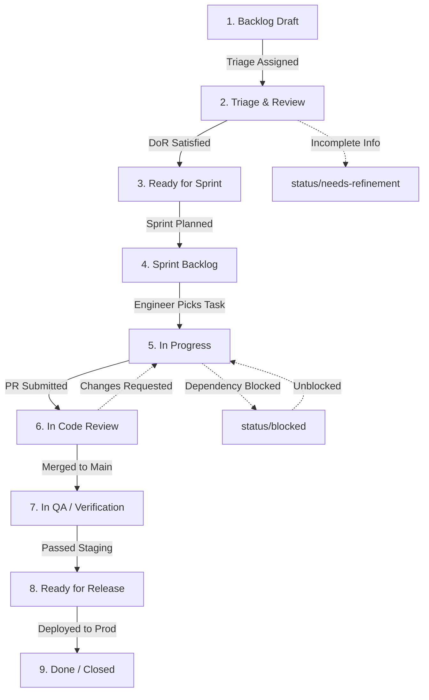

# Master GitHub Projects Board Architecture & Workflow Specification

Authoritative engineering governance specification establishing the GitHub Projects (v2) workspace topology, custom fields, view taxonomy, automated workflow transitions, and Work-In-Progress (WIP) limit enforcement for the Namma Clinic Digital Health & Operations Platform across 450+ municipal clinics under the Greater Bengaluru Authority (GBA) and BBMP Health Department.

| Governance Attribute | Specification Value |
| :--- | :--- |
| **Document Identifier** | `DOC-GH-04-PROJECT-BOARD` |
| **Document Title** | Master GitHub Projects Board Architecture & Workflow Specification |
| **Document Version** | `1.0.0` |
| **Security Classification** | `RESTRICTED - GBA / BBMP HEALTH DEPARTMENT INTERNAL ONLY` |
| **Ratification Status** | `APPROVED & RATIFIED GOVERNANCE BASELINE` |
| **Program Domain** | Project Management, Agile Operations & Workflow Orchestration |
| **Target Audience** | Software Engineers, Scrum Masters, Product Managers, Clinical Leads, DevOps Engineers |

## 1. Executive Summary & Board Governance Intent
The Namma Clinic Digital Health & Operations Platform adopts GitHub Projects (v2) as the singular, authoritative control plane for all engineering work across 450+ municipal facilities. By integrating issue tracking, pull request states, milestone schedules, and clinical safety reviews into a unified interactive surface, the platform eliminates operational opacity and enforces deterministic delivery gates.

This specification establishes:
1. **The 9 Lifecycle Execution States:** Strict sequential progression from Backlog Draft to Production Done, bounded by explicit Definition of Ready (DoR) and Definition of Done (DoD) entry/exit criteria.
2. **12 Authoritative Board Views (`VIEW-001` through `VIEW-012`):** Role-tailored operational surfaces spanning sprint Kanban, executive roadmaps, clinical safety queues, and defect triages.
3. **25 Standardized Custom Fields (`FIELD-001` through `FIELD-025`):** Machine-enforced metadata schema capturing sizing, clinical impact, DPDP consent risks, and squad ownership.
4. **Work-In-Progress (WIP) Limits & Flow Governance:** Formulaic capacity constraints preventing bottleneck buildup and reviewer fatigue across squad lanes.
5. **Automated Event-Driven Board Workflows:** Declarative lifecycle automation synchronizing issue status with git branches, pull requests, and CI verification results.
6. **90 Board Governance Acceptance Criteria (`AC-BOARD-001` to `AC-BOARD-090`):** Comprehensive validation gates certifying board hygiene, automation uptime, and zero-stale item enforcement.

> [!IMPORTANT]
> **Single Source of Truth Invariant**
> No engineering task, clinical workflow update, or database migration may be executed unless tracked within an active view on the Master Project Board. Status updates must reflect actual git state via automated webhooks; manual out-of-band overrides are strictly audited.

## 2. Nine-State Lifecycle State Machine & Transition Architecture
Work items progress through 9 formally regulated states. Transition across state boundaries requires satisfying explicit machine and human verification gates:

| State Identifier | Operational Description | Entry Criteria | Exit Criteria |
| :--- | :--- | :--- | :--- |
| **1. Backlog Draft** | Raw issue submitted via template; awaiting triage and classification. | `Issue Opened via GitHub Template` | `Tripartite labels assigned (`type`, `priority`, `domain`)` |
| **2. Triage & Review** | Under evaluation by squad lead and clinical SME for validity and DoR. | `Tripartite labels assigned` | `Definition of Ready (DoR) verified; Story Points estimated` |
| **3. Ready for Sprint** | Backlog item fully specified with acceptance criteria; ready for sprint pull. | `DoR gate passed and ratified` | `Assigned to active sprint milestone during sprint planning ceremony` |
| **4. Sprint Backlog** | Committed to active sprint iteration; awaiting engineer assignment. | `Sprint assigned by Scrum Master` | `Engineer self-assigns task and creates feature branch` |
| **5. In Progress** | Active code implementation or documentation authoring underway. | `Branch created (`feat/*` or `fix/*`)` | `Code written, unit tests pass locally, PR opened and marked Ready` |
| **6. In Code Review** | Pull request open and undergoing peer review and automated CI checks. | `PR opened and marked Ready for Review` | `Minimum 2 peer approvals, CODEOWNERS sign-off, green CI matrix` |
| **7. In QA / Verification** | Deployed to staging environment; undergoing automated E2E and clinical verification. | `PR merged to main or release branch` | `QA automated test suite green, clinical SME sign-off recorded` |
| **8. Ready for Release** | Bundled into release candidate tag; awaiting release train deployment. | `Staging tests pass with zero blockers` | `Production deployment change ticket approved by Release Manager` |
| **9. Done / Closed** | Deployed to municipal clinic production cluster; verified healthy in telemetry. | `Production deployment verified in APM` | `Immutable archive state; release notes automatically generated` |

### Architecture Diagram: Nine-State Board Lifecycle State Machine


## 3. Authoritative Custom Views Catalog (VIEW-001 to VIEW-012)
Detailed specifications for all 12 operational views configured within GitHub Projects (v2):

### VIEW-001: Active Sprint Kanban (Layout: Board)
- **View Identifier:** `VIEW-001`
- **View Display Name:** Active Sprint Kanban
- **Visual Layout Paradigm:** `Board`
- **Operational Purpose:** Live visual tracking of sprint tasks grouped by Status with WIP limits.
- **Configured Filter Expression:** `Sprint = @current`
- **Grouping Attribute:** `Status`
- **Sorting Criteria:** `Priority desc`
- **Visibility & Access Boundary:** Read-write for authenticated engineering organization; read-only for external observers.

#### Operational Governance & Ceremonies for Active Sprint Kanban
1. **Primary User Persona:** Squad leads, scrum masters, clinical reviewers, and assigned engineering contributors.
2. **Ceremonial Cadence:** Inspected during daily standup, backlog grooming, sprint review, or release train readiness reviews.
3. **WIP Constraint Monitoring:** Column visual limits highlight capacity breaches and trigger immediate squad rebalancing.
4. **Drift Detection:** Automated daily sweeper flags work items dormant in this view for greater than 5 business days.
5. **Accountable Owner:** Product Operations Lead & Lead Scrum Master responsible for maintaining view accuracy.

#### Workflow Navigation & Field Configurations for Active Sprint Kanban
- **Visible Card Fields:** Title, Assignee, Priority, Story Points, Squad, Clinical Safety Flag, Blocked Reason.
- **Direct Filter Shortcut:** Navigable via GitHub Projects view tab #001.
- **Automated Slicing:** Dynamically adapts cards when active sprint or milestone changes in repository metadata.
- **Escalation Trigger:** Unresolved cards exceeding SLA trigger automated notifications to team channel.

#### Column Workflow & WIP Constraints for Active Sprint Kanban
- **Primary Visual Column 1:** Triage / Intake (WIP: Unlimited, Entrance Gate: Template Submitted)
- **Primary Visual Column 2:** In Progress (WIP: Max 8, Entrance Gate: Branch Created)
- **Primary Visual Column 3:** In Code Review (WIP: Max 4, Entrance Gate: PR Ready)
- **Primary Visual Column 4:** In QA / Verification (WIP: Max 4, Entrance Gate: Staging Deployed)
- **Primary Visual Column 5:** Closed / Done (WIP: Historical, Entrance Gate: Production Merged)

#### Exception Handling & Escalation Matrix for Active Sprint Kanban
- **Stale Card SLA:** If any card remains unmoved in `Active Sprint Kanban` for > 48 hours, bot flags `status/stale`.
- **Clinical Block Escalation:** Any clinical item blocked triggers immediate page to Chief Medical Officer.
- **Audit Logging:** Board view layout modifications restricted to Organization Admin role.

### VIEW-002: Sprint Backlog Planning (Layout: Table)
- **View Identifier:** `VIEW-002`
- **View Display Name:** Sprint Backlog Planning
- **Visual Layout Paradigm:** `Table`
- **Operational Purpose:** Sprint grooming and capacity estimation sorted by Story Points.
- **Configured Filter Expression:** `Status = Backlog or Ready`
- **Grouping Attribute:** `Epic`
- **Sorting Criteria:** `Estimate asc`
- **Visibility & Access Boundary:** Read-write for authenticated engineering organization; read-only for external observers.

#### Operational Governance & Ceremonies for Sprint Backlog Planning
1. **Primary User Persona:** Squad leads, scrum masters, clinical reviewers, and assigned engineering contributors.
2. **Ceremonial Cadence:** Inspected during daily standup, backlog grooming, sprint review, or release train readiness reviews.
3. **WIP Constraint Monitoring:** Column visual limits highlight capacity breaches and trigger immediate squad rebalancing.
4. **Drift Detection:** Automated daily sweeper flags work items dormant in this view for greater than 5 business days.
5. **Accountable Owner:** Product Operations Lead & Lead Scrum Master responsible for maintaining view accuracy.

#### Workflow Navigation & Field Configurations for Sprint Backlog Planning
- **Visible Card Fields:** Title, Assignee, Priority, Story Points, Squad, Clinical Safety Flag, Blocked Reason.
- **Direct Filter Shortcut:** Navigable via GitHub Projects view tab #002.
- **Automated Slicing:** Dynamically adapts cards when active sprint or milestone changes in repository metadata.
- **Escalation Trigger:** Unresolved cards exceeding SLA trigger automated notifications to team channel.

#### Column Workflow & WIP Constraints for Sprint Backlog Planning
- **Primary Visual Column 1:** Triage / Intake (WIP: Unlimited, Entrance Gate: Template Submitted)
- **Primary Visual Column 2:** In Progress (WIP: Max 8, Entrance Gate: Branch Created)
- **Primary Visual Column 3:** In Code Review (WIP: Max 4, Entrance Gate: PR Ready)
- **Primary Visual Column 4:** In QA / Verification (WIP: Max 4, Entrance Gate: Staging Deployed)
- **Primary Visual Column 5:** Closed / Done (WIP: Historical, Entrance Gate: Production Merged)

#### Exception Handling & Escalation Matrix for Sprint Backlog Planning
- **Stale Card SLA:** If any card remains unmoved in `Sprint Backlog Planning` for > 48 hours, bot flags `status/stale`.
- **Clinical Block Escalation:** Any clinical item blocked triggers immediate page to Chief Medical Officer.
- **Audit Logging:** Board view layout modifications restricted to Organization Admin role.

### VIEW-003: Master Release Roadmap (Layout: Roadmap)
- **View Identifier:** `VIEW-003`
- **View Display Name:** Master Release Roadmap
- **Visual Layout Paradigm:** `Roadmap`
- **Operational Purpose:** Chronological Gantt projection of releases REL-00 through REL-07.
- **Configured Filter Expression:** `Type = Epic or Feature`
- **Grouping Attribute:** `Release`
- **Sorting Criteria:** `Target Date asc`
- **Visibility & Access Boundary:** Read-write for authenticated engineering organization; read-only for external observers.

#### Operational Governance & Ceremonies for Master Release Roadmap
1. **Primary User Persona:** Squad leads, scrum masters, clinical reviewers, and assigned engineering contributors.
2. **Ceremonial Cadence:** Inspected during daily standup, backlog grooming, sprint review, or release train readiness reviews.
3. **WIP Constraint Monitoring:** Column visual limits highlight capacity breaches and trigger immediate squad rebalancing.
4. **Drift Detection:** Automated daily sweeper flags work items dormant in this view for greater than 5 business days.
5. **Accountable Owner:** Product Operations Lead & Lead Scrum Master responsible for maintaining view accuracy.

#### Workflow Navigation & Field Configurations for Master Release Roadmap
- **Visible Card Fields:** Title, Assignee, Priority, Story Points, Squad, Clinical Safety Flag, Blocked Reason.
- **Direct Filter Shortcut:** Navigable via GitHub Projects view tab #003.
- **Automated Slicing:** Dynamically adapts cards when active sprint or milestone changes in repository metadata.
- **Escalation Trigger:** Unresolved cards exceeding SLA trigger automated notifications to team channel.

#### Column Workflow & WIP Constraints for Master Release Roadmap
- **Primary Visual Column 1:** Triage / Intake (WIP: Unlimited, Entrance Gate: Template Submitted)
- **Primary Visual Column 2:** In Progress (WIP: Max 8, Entrance Gate: Branch Created)
- **Primary Visual Column 3:** In Code Review (WIP: Max 4, Entrance Gate: PR Ready)
- **Primary Visual Column 4:** In QA / Verification (WIP: Max 4, Entrance Gate: Staging Deployed)
- **Primary Visual Column 5:** Closed / Done (WIP: Historical, Entrance Gate: Production Merged)

#### Exception Handling & Escalation Matrix for Master Release Roadmap
- **Stale Card SLA:** If any card remains unmoved in `Master Release Roadmap` for > 48 hours, bot flags `status/stale`.
- **Clinical Block Escalation:** Any clinical item blocked triggers immediate page to Chief Medical Officer.
- **Audit Logging:** Board view layout modifications restricted to Organization Admin role.

### VIEW-004: Blocker Radar & Escalation (Layout: Table)
- **View Identifier:** `VIEW-004`
- **View Display Name:** Blocker Radar & Escalation
- **Visual Layout Paradigm:** `Table`
- **Operational Purpose:** Immediate triage of blocked tasks, severe dependencies, and risks.
- **Configured Filter Expression:** `Status = Blocked or priority = p0-blocker`
- **Grouping Attribute:** `Blocked Reason`
- **Sorting Criteria:** `Updated desc`
- **Visibility & Access Boundary:** Read-write for authenticated engineering organization; read-only for external observers.

#### Operational Governance & Ceremonies for Blocker Radar & Escalation
1. **Primary User Persona:** Squad leads, scrum masters, clinical reviewers, and assigned engineering contributors.
2. **Ceremonial Cadence:** Inspected during daily standup, backlog grooming, sprint review, or release train readiness reviews.
3. **WIP Constraint Monitoring:** Column visual limits highlight capacity breaches and trigger immediate squad rebalancing.
4. **Drift Detection:** Automated daily sweeper flags work items dormant in this view for greater than 5 business days.
5. **Accountable Owner:** Product Operations Lead & Lead Scrum Master responsible for maintaining view accuracy.

#### Workflow Navigation & Field Configurations for Blocker Radar & Escalation
- **Visible Card Fields:** Title, Assignee, Priority, Story Points, Squad, Clinical Safety Flag, Blocked Reason.
- **Direct Filter Shortcut:** Navigable via GitHub Projects view tab #004.
- **Automated Slicing:** Dynamically adapts cards when active sprint or milestone changes in repository metadata.
- **Escalation Trigger:** Unresolved cards exceeding SLA trigger automated notifications to team channel.

#### Column Workflow & WIP Constraints for Blocker Radar & Escalation
- **Primary Visual Column 1:** Triage / Intake (WIP: Unlimited, Entrance Gate: Template Submitted)
- **Primary Visual Column 2:** In Progress (WIP: Max 8, Entrance Gate: Branch Created)
- **Primary Visual Column 3:** In Code Review (WIP: Max 4, Entrance Gate: PR Ready)
- **Primary Visual Column 4:** In QA / Verification (WIP: Max 4, Entrance Gate: Staging Deployed)
- **Primary Visual Column 5:** Closed / Done (WIP: Historical, Entrance Gate: Production Merged)

#### Exception Handling & Escalation Matrix for Blocker Radar & Escalation
- **Stale Card SLA:** If any card remains unmoved in `Blocker Radar & Escalation` for > 48 hours, bot flags `status/stale`.
- **Clinical Block Escalation:** Any clinical item blocked triggers immediate page to Chief Medical Officer.
- **Audit Logging:** Board view layout modifications restricted to Organization Admin role.

### VIEW-005: Squad Capacity & Allocation (Layout: Table)
- **View Identifier:** `VIEW-005`
- **View Display Name:** Squad Capacity & Allocation
- **Visual Layout Paradigm:** `Table`
- **Operational Purpose:** Tracking engineering load across the 7 multidisciplinary squads.
- **Configured Filter Expression:** `Sprint = @current`
- **Grouping Attribute:** `Squad`
- **Sorting Criteria:** `Assignee asc`
- **Visibility & Access Boundary:** Read-write for authenticated engineering organization; read-only for external observers.

#### Operational Governance & Ceremonies for Squad Capacity & Allocation
1. **Primary User Persona:** Squad leads, scrum masters, clinical reviewers, and assigned engineering contributors.
2. **Ceremonial Cadence:** Inspected during daily standup, backlog grooming, sprint review, or release train readiness reviews.
3. **WIP Constraint Monitoring:** Column visual limits highlight capacity breaches and trigger immediate squad rebalancing.
4. **Drift Detection:** Automated daily sweeper flags work items dormant in this view for greater than 5 business days.
5. **Accountable Owner:** Product Operations Lead & Lead Scrum Master responsible for maintaining view accuracy.

#### Workflow Navigation & Field Configurations for Squad Capacity & Allocation
- **Visible Card Fields:** Title, Assignee, Priority, Story Points, Squad, Clinical Safety Flag, Blocked Reason.
- **Direct Filter Shortcut:** Navigable via GitHub Projects view tab #005.
- **Automated Slicing:** Dynamically adapts cards when active sprint or milestone changes in repository metadata.
- **Escalation Trigger:** Unresolved cards exceeding SLA trigger automated notifications to team channel.

#### Column Workflow & WIP Constraints for Squad Capacity & Allocation
- **Primary Visual Column 1:** Triage / Intake (WIP: Unlimited, Entrance Gate: Template Submitted)
- **Primary Visual Column 2:** In Progress (WIP: Max 8, Entrance Gate: Branch Created)
- **Primary Visual Column 3:** In Code Review (WIP: Max 4, Entrance Gate: PR Ready)
- **Primary Visual Column 4:** In QA / Verification (WIP: Max 4, Entrance Gate: Staging Deployed)
- **Primary Visual Column 5:** Closed / Done (WIP: Historical, Entrance Gate: Production Merged)

#### Exception Handling & Escalation Matrix for Squad Capacity & Allocation
- **Stale Card SLA:** If any card remains unmoved in `Squad Capacity & Allocation` for > 48 hours, bot flags `status/stale`.
- **Clinical Block Escalation:** Any clinical item blocked triggers immediate page to Chief Medical Officer.
- **Audit Logging:** Board view layout modifications restricted to Organization Admin role.

### VIEW-006: Clinical Safety & STG Triage (Layout: Board)
- **View Identifier:** `VIEW-006`
- **View Display Name:** Clinical Safety & STG Triage
- **Visual Layout Paradigm:** `Board`
- **Operational Purpose:** Clinical advisory review of doctor and pharmacy modules.
- **Configured Filter Expression:** `clinical/safety-critical present`
- **Grouping Attribute:** `Status`
- **Sorting Criteria:** `Priority desc`
- **Visibility & Access Boundary:** Read-write for authenticated engineering organization; read-only for external observers.

#### Operational Governance & Ceremonies for Clinical Safety & STG Triage
1. **Primary User Persona:** Squad leads, scrum masters, clinical reviewers, and assigned engineering contributors.
2. **Ceremonial Cadence:** Inspected during daily standup, backlog grooming, sprint review, or release train readiness reviews.
3. **WIP Constraint Monitoring:** Column visual limits highlight capacity breaches and trigger immediate squad rebalancing.
4. **Drift Detection:** Automated daily sweeper flags work items dormant in this view for greater than 5 business days.
5. **Accountable Owner:** Product Operations Lead & Lead Scrum Master responsible for maintaining view accuracy.

#### Workflow Navigation & Field Configurations for Clinical Safety & STG Triage
- **Visible Card Fields:** Title, Assignee, Priority, Story Points, Squad, Clinical Safety Flag, Blocked Reason.
- **Direct Filter Shortcut:** Navigable via GitHub Projects view tab #006.
- **Automated Slicing:** Dynamically adapts cards when active sprint or milestone changes in repository metadata.
- **Escalation Trigger:** Unresolved cards exceeding SLA trigger automated notifications to team channel.

#### Column Workflow & WIP Constraints for Clinical Safety & STG Triage
- **Primary Visual Column 1:** Triage / Intake (WIP: Unlimited, Entrance Gate: Template Submitted)
- **Primary Visual Column 2:** In Progress (WIP: Max 8, Entrance Gate: Branch Created)
- **Primary Visual Column 3:** In Code Review (WIP: Max 4, Entrance Gate: PR Ready)
- **Primary Visual Column 4:** In QA / Verification (WIP: Max 4, Entrance Gate: Staging Deployed)
- **Primary Visual Column 5:** Closed / Done (WIP: Historical, Entrance Gate: Production Merged)

#### Exception Handling & Escalation Matrix for Clinical Safety & STG Triage
- **Stale Card SLA:** If any card remains unmoved in `Clinical Safety & STG Triage` for > 48 hours, bot flags `status/stale`.
- **Clinical Block Escalation:** Any clinical item blocked triggers immediate page to Chief Medical Officer.
- **Audit Logging:** Board view layout modifications restricted to Organization Admin role.

### VIEW-007: Security & DPDP Compliance (Layout: Table)
- **View Identifier:** `VIEW-007`
- **View Display Name:** Security & DPDP Compliance
- **Visual Layout Paradigm:** `Table`
- **Operational Purpose:** Vulnerability mitigation and patient consent audit tracking.
- **Configured Filter Expression:** `security/* present`
- **Grouping Attribute:** `Severity`
- **Sorting Criteria:** `Created asc`
- **Visibility & Access Boundary:** Read-write for authenticated engineering organization; read-only for external observers.

#### Operational Governance & Ceremonies for Security & DPDP Compliance
1. **Primary User Persona:** Squad leads, scrum masters, clinical reviewers, and assigned engineering contributors.
2. **Ceremonial Cadence:** Inspected during daily standup, backlog grooming, sprint review, or release train readiness reviews.
3. **WIP Constraint Monitoring:** Column visual limits highlight capacity breaches and trigger immediate squad rebalancing.
4. **Drift Detection:** Automated daily sweeper flags work items dormant in this view for greater than 5 business days.
5. **Accountable Owner:** Product Operations Lead & Lead Scrum Master responsible for maintaining view accuracy.

#### Workflow Navigation & Field Configurations for Security & DPDP Compliance
- **Visible Card Fields:** Title, Assignee, Priority, Story Points, Squad, Clinical Safety Flag, Blocked Reason.
- **Direct Filter Shortcut:** Navigable via GitHub Projects view tab #007.
- **Automated Slicing:** Dynamically adapts cards when active sprint or milestone changes in repository metadata.
- **Escalation Trigger:** Unresolved cards exceeding SLA trigger automated notifications to team channel.

#### Column Workflow & WIP Constraints for Security & DPDP Compliance
- **Primary Visual Column 1:** Triage / Intake (WIP: Unlimited, Entrance Gate: Template Submitted)
- **Primary Visual Column 2:** In Progress (WIP: Max 8, Entrance Gate: Branch Created)
- **Primary Visual Column 3:** In Code Review (WIP: Max 4, Entrance Gate: PR Ready)
- **Primary Visual Column 4:** In QA / Verification (WIP: Max 4, Entrance Gate: Staging Deployed)
- **Primary Visual Column 5:** Closed / Done (WIP: Historical, Entrance Gate: Production Merged)

#### Exception Handling & Escalation Matrix for Security & DPDP Compliance
- **Stale Card SLA:** If any card remains unmoved in `Security & DPDP Compliance` for > 48 hours, bot flags `status/stale`.
- **Clinical Block Escalation:** Any clinical item blocked triggers immediate page to Chief Medical Officer.
- **Audit Logging:** Board view layout modifications restricted to Organization Admin role.

### VIEW-008: Offline Edge & Sync Hub (Layout: Board)
- **View Identifier:** `VIEW-008`
- **View Display Name:** Offline Edge & Sync Hub
- **Visual Layout Paradigm:** `Board`
- **Operational Purpose:** Client-side SQLite synchronization engine tasks and chaos tests.
- **Configured Filter Expression:** `domain/offline-sync present`
- **Grouping Attribute:** `Status`
- **Sorting Criteria:** `Estimate desc`
- **Visibility & Access Boundary:** Read-write for authenticated engineering organization; read-only for external observers.

#### Operational Governance & Ceremonies for Offline Edge & Sync Hub
1. **Primary User Persona:** Squad leads, scrum masters, clinical reviewers, and assigned engineering contributors.
2. **Ceremonial Cadence:** Inspected during daily standup, backlog grooming, sprint review, or release train readiness reviews.
3. **WIP Constraint Monitoring:** Column visual limits highlight capacity breaches and trigger immediate squad rebalancing.
4. **Drift Detection:** Automated daily sweeper flags work items dormant in this view for greater than 5 business days.
5. **Accountable Owner:** Product Operations Lead & Lead Scrum Master responsible for maintaining view accuracy.

#### Workflow Navigation & Field Configurations for Offline Edge & Sync Hub
- **Visible Card Fields:** Title, Assignee, Priority, Story Points, Squad, Clinical Safety Flag, Blocked Reason.
- **Direct Filter Shortcut:** Navigable via GitHub Projects view tab #008.
- **Automated Slicing:** Dynamically adapts cards when active sprint or milestone changes in repository metadata.
- **Escalation Trigger:** Unresolved cards exceeding SLA trigger automated notifications to team channel.

#### Column Workflow & WIP Constraints for Offline Edge & Sync Hub
- **Primary Visual Column 1:** Triage / Intake (WIP: Unlimited, Entrance Gate: Template Submitted)
- **Primary Visual Column 2:** In Progress (WIP: Max 8, Entrance Gate: Branch Created)
- **Primary Visual Column 3:** In Code Review (WIP: Max 4, Entrance Gate: PR Ready)
- **Primary Visual Column 4:** In QA / Verification (WIP: Max 4, Entrance Gate: Staging Deployed)
- **Primary Visual Column 5:** Closed / Done (WIP: Historical, Entrance Gate: Production Merged)

#### Exception Handling & Escalation Matrix for Offline Edge & Sync Hub
- **Stale Card SLA:** If any card remains unmoved in `Offline Edge & Sync Hub` for > 48 hours, bot flags `status/stale`.
- **Clinical Block Escalation:** Any clinical item blocked triggers immediate page to Chief Medical Officer.
- **Audit Logging:** Board view layout modifications restricted to Organization Admin role.

### VIEW-009: Defect & Bug Triage Queue (Layout: Table)
- **View Identifier:** `VIEW-009`
- **View Display Name:** Defect & Bug Triage Queue
- **Visual Layout Paradigm:** `Table`
- **Operational Purpose:** Rapid triage and assignment of automated QA and pilot bugs.
- **Configured Filter Expression:** `Type = Bug`
- **Grouping Attribute:** `Severity`
- **Sorting Criteria:** `Priority desc`
- **Visibility & Access Boundary:** Read-write for authenticated engineering organization; read-only for external observers.

#### Operational Governance & Ceremonies for Defect & Bug Triage Queue
1. **Primary User Persona:** Squad leads, scrum masters, clinical reviewers, and assigned engineering contributors.
2. **Ceremonial Cadence:** Inspected during daily standup, backlog grooming, sprint review, or release train readiness reviews.
3. **WIP Constraint Monitoring:** Column visual limits highlight capacity breaches and trigger immediate squad rebalancing.
4. **Drift Detection:** Automated daily sweeper flags work items dormant in this view for greater than 5 business days.
5. **Accountable Owner:** Product Operations Lead & Lead Scrum Master responsible for maintaining view accuracy.

#### Workflow Navigation & Field Configurations for Defect & Bug Triage Queue
- **Visible Card Fields:** Title, Assignee, Priority, Story Points, Squad, Clinical Safety Flag, Blocked Reason.
- **Direct Filter Shortcut:** Navigable via GitHub Projects view tab #009.
- **Automated Slicing:** Dynamically adapts cards when active sprint or milestone changes in repository metadata.
- **Escalation Trigger:** Unresolved cards exceeding SLA trigger automated notifications to team channel.

#### Column Workflow & WIP Constraints for Defect & Bug Triage Queue
- **Primary Visual Column 1:** Triage / Intake (WIP: Unlimited, Entrance Gate: Template Submitted)
- **Primary Visual Column 2:** In Progress (WIP: Max 8, Entrance Gate: Branch Created)
- **Primary Visual Column 3:** In Code Review (WIP: Max 4, Entrance Gate: PR Ready)
- **Primary Visual Column 4:** In QA / Verification (WIP: Max 4, Entrance Gate: Staging Deployed)
- **Primary Visual Column 5:** Closed / Done (WIP: Historical, Entrance Gate: Production Merged)

#### Exception Handling & Escalation Matrix for Defect & Bug Triage Queue
- **Stale Card SLA:** If any card remains unmoved in `Defect & Bug Triage Queue` for > 48 hours, bot flags `status/stale`.
- **Clinical Block Escalation:** Any clinical item blocked triggers immediate page to Chief Medical Officer.
- **Audit Logging:** Board view layout modifications restricted to Organization Admin role.

### VIEW-010: 20-Clinic Pilot Readiness (Layout: Table)
- **View Identifier:** `VIEW-010`
- **View Display Name:** 20-Clinic Pilot Readiness
- **Visual Layout Paradigm:** `Table`
- **Operational Purpose:** Tracking facility enablement, hardware dispatch, and staff sandbox.
- **Configured Filter Expression:** `release = rel-05 or type = hardware`
- **Grouping Attribute:** `Clinic Code`
- **Sorting Criteria:** `Target Date asc`
- **Visibility & Access Boundary:** Read-write for authenticated engineering organization; read-only for external observers.

#### Operational Governance & Ceremonies for 20-Clinic Pilot Readiness
1. **Primary User Persona:** Squad leads, scrum masters, clinical reviewers, and assigned engineering contributors.
2. **Ceremonial Cadence:** Inspected during daily standup, backlog grooming, sprint review, or release train readiness reviews.
3. **WIP Constraint Monitoring:** Column visual limits highlight capacity breaches and trigger immediate squad rebalancing.
4. **Drift Detection:** Automated daily sweeper flags work items dormant in this view for greater than 5 business days.
5. **Accountable Owner:** Product Operations Lead & Lead Scrum Master responsible for maintaining view accuracy.

#### Workflow Navigation & Field Configurations for 20-Clinic Pilot Readiness
- **Visible Card Fields:** Title, Assignee, Priority, Story Points, Squad, Clinical Safety Flag, Blocked Reason.
- **Direct Filter Shortcut:** Navigable via GitHub Projects view tab #010.
- **Automated Slicing:** Dynamically adapts cards when active sprint or milestone changes in repository metadata.
- **Escalation Trigger:** Unresolved cards exceeding SLA trigger automated notifications to team channel.

#### Column Workflow & WIP Constraints for 20-Clinic Pilot Readiness
- **Primary Visual Column 1:** Triage / Intake (WIP: Unlimited, Entrance Gate: Template Submitted)
- **Primary Visual Column 2:** In Progress (WIP: Max 8, Entrance Gate: Branch Created)
- **Primary Visual Column 3:** In Code Review (WIP: Max 4, Entrance Gate: PR Ready)
- **Primary Visual Column 4:** In QA / Verification (WIP: Max 4, Entrance Gate: Staging Deployed)
- **Primary Visual Column 5:** Closed / Done (WIP: Historical, Entrance Gate: Production Merged)

#### Exception Handling & Escalation Matrix for 20-Clinic Pilot Readiness
- **Stale Card SLA:** If any card remains unmoved in `20-Clinic Pilot Readiness` for > 48 hours, bot flags `status/stale`.
- **Clinical Block Escalation:** Any clinical item blocked triggers immediate page to Chief Medical Officer.
- **Audit Logging:** Board view layout modifications restricted to Organization Admin role.

### VIEW-011: Cross-Workstream Sync Matrix (Layout: Table)
- **View Identifier:** `VIEW-011`
- **View Display Name:** Cross-Workstream Sync Matrix
- **Visual Layout Paradigm:** `Table`
- **Operational Purpose:** Multi-workstream handoff interfaces and dependency alignment.
- **Configured Filter Expression:** `All Issues`
- **Grouping Attribute:** `Workstream`
- **Sorting Criteria:** `Sprint asc`
- **Visibility & Access Boundary:** Read-write for authenticated engineering organization; read-only for external observers.

#### Operational Governance & Ceremonies for Cross-Workstream Sync Matrix
1. **Primary User Persona:** Squad leads, scrum masters, clinical reviewers, and assigned engineering contributors.
2. **Ceremonial Cadence:** Inspected during daily standup, backlog grooming, sprint review, or release train readiness reviews.
3. **WIP Constraint Monitoring:** Column visual limits highlight capacity breaches and trigger immediate squad rebalancing.
4. **Drift Detection:** Automated daily sweeper flags work items dormant in this view for greater than 5 business days.
5. **Accountable Owner:** Product Operations Lead & Lead Scrum Master responsible for maintaining view accuracy.

#### Workflow Navigation & Field Configurations for Cross-Workstream Sync Matrix
- **Visible Card Fields:** Title, Assignee, Priority, Story Points, Squad, Clinical Safety Flag, Blocked Reason.
- **Direct Filter Shortcut:** Navigable via GitHub Projects view tab #011.
- **Automated Slicing:** Dynamically adapts cards when active sprint or milestone changes in repository metadata.
- **Escalation Trigger:** Unresolved cards exceeding SLA trigger automated notifications to team channel.

#### Column Workflow & WIP Constraints for Cross-Workstream Sync Matrix
- **Primary Visual Column 1:** Triage / Intake (WIP: Unlimited, Entrance Gate: Template Submitted)
- **Primary Visual Column 2:** In Progress (WIP: Max 8, Entrance Gate: Branch Created)
- **Primary Visual Column 3:** In Code Review (WIP: Max 4, Entrance Gate: PR Ready)
- **Primary Visual Column 4:** In QA / Verification (WIP: Max 4, Entrance Gate: Staging Deployed)
- **Primary Visual Column 5:** Closed / Done (WIP: Historical, Entrance Gate: Production Merged)

#### Exception Handling & Escalation Matrix for Cross-Workstream Sync Matrix
- **Stale Card SLA:** If any card remains unmoved in `Cross-Workstream Sync Matrix` for > 48 hours, bot flags `status/stale`.
- **Clinical Block Escalation:** Any clinical item blocked triggers immediate page to Chief Medical Officer.
- **Audit Logging:** Board view layout modifications restricted to Organization Admin role.

### VIEW-012: Executive GBA / BBMP KPI Board (Layout: Dashboard)
- **View Identifier:** `VIEW-012`
- **View Display Name:** Executive GBA / BBMP KPI Board
- **Visual Layout Paradigm:** `Dashboard`
- **Operational Purpose:** High-level burnup charts, velocity metrics, and milestone health.
- **Configured Filter Expression:** `Type in [Epic, Milestone]`
- **Grouping Attribute:** `Release`
- **Sorting Criteria:** `Target Date asc`
- **Visibility & Access Boundary:** Read-write for authenticated engineering organization; read-only for external observers.

#### Operational Governance & Ceremonies for Executive GBA / BBMP KPI Board
1. **Primary User Persona:** Squad leads, scrum masters, clinical reviewers, and assigned engineering contributors.
2. **Ceremonial Cadence:** Inspected during daily standup, backlog grooming, sprint review, or release train readiness reviews.
3. **WIP Constraint Monitoring:** Column visual limits highlight capacity breaches and trigger immediate squad rebalancing.
4. **Drift Detection:** Automated daily sweeper flags work items dormant in this view for greater than 5 business days.
5. **Accountable Owner:** Product Operations Lead & Lead Scrum Master responsible for maintaining view accuracy.

#### Workflow Navigation & Field Configurations for Executive GBA / BBMP KPI Board
- **Visible Card Fields:** Title, Assignee, Priority, Story Points, Squad, Clinical Safety Flag, Blocked Reason.
- **Direct Filter Shortcut:** Navigable via GitHub Projects view tab #012.
- **Automated Slicing:** Dynamically adapts cards when active sprint or milestone changes in repository metadata.
- **Escalation Trigger:** Unresolved cards exceeding SLA trigger automated notifications to team channel.

#### Column Workflow & WIP Constraints for Executive GBA / BBMP KPI Board
- **Primary Visual Column 1:** Triage / Intake (WIP: Unlimited, Entrance Gate: Template Submitted)
- **Primary Visual Column 2:** In Progress (WIP: Max 8, Entrance Gate: Branch Created)
- **Primary Visual Column 3:** In Code Review (WIP: Max 4, Entrance Gate: PR Ready)
- **Primary Visual Column 4:** In QA / Verification (WIP: Max 4, Entrance Gate: Staging Deployed)
- **Primary Visual Column 5:** Closed / Done (WIP: Historical, Entrance Gate: Production Merged)

#### Exception Handling & Escalation Matrix for Executive GBA / BBMP KPI Board
- **Stale Card SLA:** If any card remains unmoved in `Executive GBA / BBMP KPI Board` for > 48 hours, bot flags `status/stale`.
- **Clinical Block Escalation:** Any clinical item blocked triggers immediate page to Chief Medical Officer.
- **Audit Logging:** Board view layout modifications restricted to Organization Admin role.

## 4. Master Custom Fields Schema Catalog (FIELD-001 to FIELD-025)
Authoritative schema definitions for all 25 custom metadata fields governing work tracking:

### FIELD-001: Title (Type: `Text`)
- **Field Identifier:** `FIELD-001`
- **Display Field Name:** Title
- **Underlying Data Type:** `Text`
- **Functional Purpose:** Primary issue summary and conventional prefix.
- **Mandatory Horizon:** Required across all active Tier 2, 3, and 4 work packages.
- **Mutation Governance:** Modifications audited and logged via project board webhook listeners.
- **GraphQL Schema Binding:** Bound to ProjectV2CustomField within GitHub GraphQL v4 API.

#### Data Validation & Governance Standards for Title
1. **Validation Boundary:** Strict typing enforced; invalid formats automatically rejected by GitHub schema validator.
2. **Default Initialization:** Initialized with sensible defaults upon issue creation via form templates.
3. **Required For Status Transition:** Cannot transition to 'Ready for Sprint' or 'Done' if this field is unpopulated.
4. **Reporting Export:** Included in automated daily CSV/JSON exports delivered to BBMP project management lakehouse.
5. **Access Control:** Restricted write permissions; sensitive status fields mutable only by designated squad roles.

#### Operational Impact & Lifecycle Behavior of Title
- **Triage Assessment:** Evaluated by product and clinical leads during initial backlog intake.
- **Automated Automation Triggers:** Mutations on `Title` can trigger downstream webhooks and Slack notifications.
- **Audit Logging Requirement:** Historic value changes are preserved indefinitely for clinical compliance auditing.

#### Field Validation Rules & Allowed Formats for Title
- **Allowed Format / Values:** Conforms to strict JSON/GraphQL schema validation rules for `Text`.
- **Required Status:** Mandatory across all active sprints for Tier 2, 3, and 4 items.
- **Immutability Policy:** Field history logged in GitHub Audit Log; deletions strictly forbidden.
- **GraphQL Representation:** `node.projectV2.field(name: "Title")` accessible via API.

#### Clinical & Operational Impact of Title
- **Municipal Health Context:** Captures operational parameters required for BBMP Health Department reporting.
- **DPDP Privacy Classification:** Internal operational metadata; non-PHI system field.
- **Downstream Automation Hook:** Changes trigger webhook dispatched to squad notification channels.

### FIELD-002: Status (Type: `Single Select`)
- **Field Identifier:** `FIELD-002`
- **Display Field Name:** Status
- **Underlying Data Type:** `Single Select`
- **Functional Purpose:** Workflow stage (Backlog, Ready, In Progress, Review, QA, Done).
- **Mandatory Horizon:** Required across all active Tier 2, 3, and 4 work packages.
- **Mutation Governance:** Modifications audited and logged via project board webhook listeners.
- **GraphQL Schema Binding:** Bound to ProjectV2CustomField within GitHub GraphQL v4 API.

#### Data Validation & Governance Standards for Status
1. **Validation Boundary:** Strict typing enforced; invalid formats automatically rejected by GitHub schema validator.
2. **Default Initialization:** Initialized with sensible defaults upon issue creation via form templates.
3. **Required For Status Transition:** Cannot transition to 'Ready for Sprint' or 'Done' if this field is unpopulated.
4. **Reporting Export:** Included in automated daily CSV/JSON exports delivered to BBMP project management lakehouse.
5. **Access Control:** Restricted write permissions; sensitive status fields mutable only by designated squad roles.

#### Operational Impact & Lifecycle Behavior of Status
- **Triage Assessment:** Evaluated by product and clinical leads during initial backlog intake.
- **Automated Automation Triggers:** Mutations on `Status` can trigger downstream webhooks and Slack notifications.
- **Audit Logging Requirement:** Historic value changes are preserved indefinitely for clinical compliance auditing.

#### Field Validation Rules & Allowed Formats for Status
- **Allowed Format / Values:** Conforms to strict JSON/GraphQL schema validation rules for `Single Select`.
- **Required Status:** Mandatory across all active sprints for Tier 2, 3, and 4 items.
- **Immutability Policy:** Field history logged in GitHub Audit Log; deletions strictly forbidden.
- **GraphQL Representation:** `node.projectV2.field(name: "Status")` accessible via API.

#### Clinical & Operational Impact of Status
- **Municipal Health Context:** Captures operational parameters required for BBMP Health Department reporting.
- **DPDP Privacy Classification:** Internal operational metadata; non-PHI system field.
- **Downstream Automation Hook:** Changes trigger webhook dispatched to squad notification channels.

### FIELD-003: Sprint (Type: `Iteration`)
- **Field Identifier:** `FIELD-003`
- **Display Field Name:** Sprint
- **Underlying Data Type:** `Iteration`
- **Functional Purpose:** 2-week sprint assignment (SPRINT-01 to SPRINT-18).
- **Mandatory Horizon:** Required across all active Tier 2, 3, and 4 work packages.
- **Mutation Governance:** Modifications audited and logged via project board webhook listeners.
- **GraphQL Schema Binding:** Bound to ProjectV2CustomField within GitHub GraphQL v4 API.

#### Data Validation & Governance Standards for Sprint
1. **Validation Boundary:** Strict typing enforced; invalid formats automatically rejected by GitHub schema validator.
2. **Default Initialization:** Initialized with sensible defaults upon issue creation via form templates.
3. **Required For Status Transition:** Cannot transition to 'Ready for Sprint' or 'Done' if this field is unpopulated.
4. **Reporting Export:** Included in automated daily CSV/JSON exports delivered to BBMP project management lakehouse.
5. **Access Control:** Restricted write permissions; sensitive status fields mutable only by designated squad roles.

#### Operational Impact & Lifecycle Behavior of Sprint
- **Triage Assessment:** Evaluated by product and clinical leads during initial backlog intake.
- **Automated Automation Triggers:** Mutations on `Sprint` can trigger downstream webhooks and Slack notifications.
- **Audit Logging Requirement:** Historic value changes are preserved indefinitely for clinical compliance auditing.

#### Field Validation Rules & Allowed Formats for Sprint
- **Allowed Format / Values:** Conforms to strict JSON/GraphQL schema validation rules for `Iteration`.
- **Required Status:** Mandatory across all active sprints for Tier 2, 3, and 4 items.
- **Immutability Policy:** Field history logged in GitHub Audit Log; deletions strictly forbidden.
- **GraphQL Representation:** `node.projectV2.field(name: "Sprint")` accessible via API.

#### Clinical & Operational Impact of Sprint
- **Municipal Health Context:** Captures operational parameters required for BBMP Health Department reporting.
- **DPDP Privacy Classification:** Internal operational metadata; non-PHI system field.
- **Downstream Automation Hook:** Changes trigger webhook dispatched to squad notification channels.

### FIELD-004: Release (Type: `Single Select`)
- **Field Identifier:** `FIELD-004`
- **Display Field Name:** Release
- **Underlying Data Type:** `Single Select`
- **Functional Purpose:** Enterprise release vehicle (RELEASE-00 to RELEASE-07).
- **Mandatory Horizon:** Required across all active Tier 2, 3, and 4 work packages.
- **Mutation Governance:** Modifications audited and logged via project board webhook listeners.
- **GraphQL Schema Binding:** Bound to ProjectV2CustomField within GitHub GraphQL v4 API.

#### Data Validation & Governance Standards for Release
1. **Validation Boundary:** Strict typing enforced; invalid formats automatically rejected by GitHub schema validator.
2. **Default Initialization:** Initialized with sensible defaults upon issue creation via form templates.
3. **Required For Status Transition:** Cannot transition to 'Ready for Sprint' or 'Done' if this field is unpopulated.
4. **Reporting Export:** Included in automated daily CSV/JSON exports delivered to BBMP project management lakehouse.
5. **Access Control:** Restricted write permissions; sensitive status fields mutable only by designated squad roles.

#### Operational Impact & Lifecycle Behavior of Release
- **Triage Assessment:** Evaluated by product and clinical leads during initial backlog intake.
- **Automated Automation Triggers:** Mutations on `Release` can trigger downstream webhooks and Slack notifications.
- **Audit Logging Requirement:** Historic value changes are preserved indefinitely for clinical compliance auditing.

#### Field Validation Rules & Allowed Formats for Release
- **Allowed Format / Values:** Conforms to strict JSON/GraphQL schema validation rules for `Single Select`.
- **Required Status:** Mandatory across all active sprints for Tier 2, 3, and 4 items.
- **Immutability Policy:** Field history logged in GitHub Audit Log; deletions strictly forbidden.
- **GraphQL Representation:** `node.projectV2.field(name: "Release")` accessible via API.

#### Clinical & Operational Impact of Release
- **Municipal Health Context:** Captures operational parameters required for BBMP Health Department reporting.
- **DPDP Privacy Classification:** Internal operational metadata; non-PHI system field.
- **Downstream Automation Hook:** Changes trigger webhook dispatched to squad notification channels.

### FIELD-005: Workstream (Type: `Single Select`)
- **Field Identifier:** `FIELD-005`
- **Display Field Name:** Workstream
- **Underlying Data Type:** `Single Select`
- **Functional Purpose:** Assigned delivery workstream (WS-01 to WS-18).
- **Mandatory Horizon:** Required across all active Tier 2, 3, and 4 work packages.
- **Mutation Governance:** Modifications audited and logged via project board webhook listeners.
- **GraphQL Schema Binding:** Bound to ProjectV2CustomField within GitHub GraphQL v4 API.

#### Data Validation & Governance Standards for Workstream
1. **Validation Boundary:** Strict typing enforced; invalid formats automatically rejected by GitHub schema validator.
2. **Default Initialization:** Initialized with sensible defaults upon issue creation via form templates.
3. **Required For Status Transition:** Cannot transition to 'Ready for Sprint' or 'Done' if this field is unpopulated.
4. **Reporting Export:** Included in automated daily CSV/JSON exports delivered to BBMP project management lakehouse.
5. **Access Control:** Restricted write permissions; sensitive status fields mutable only by designated squad roles.

#### Operational Impact & Lifecycle Behavior of Workstream
- **Triage Assessment:** Evaluated by product and clinical leads during initial backlog intake.
- **Automated Automation Triggers:** Mutations on `Workstream` can trigger downstream webhooks and Slack notifications.
- **Audit Logging Requirement:** Historic value changes are preserved indefinitely for clinical compliance auditing.

#### Field Validation Rules & Allowed Formats for Workstream
- **Allowed Format / Values:** Conforms to strict JSON/GraphQL schema validation rules for `Single Select`.
- **Required Status:** Mandatory across all active sprints for Tier 2, 3, and 4 items.
- **Immutability Policy:** Field history logged in GitHub Audit Log; deletions strictly forbidden.
- **GraphQL Representation:** `node.projectV2.field(name: "Workstream")` accessible via API.

#### Clinical & Operational Impact of Workstream
- **Municipal Health Context:** Captures operational parameters required for BBMP Health Department reporting.
- **DPDP Privacy Classification:** Internal operational metadata; non-PHI system field.
- **Downstream Automation Hook:** Changes trigger webhook dispatched to squad notification channels.

### FIELD-006: Squad (Type: `Single Select`)
- **Field Identifier:** `FIELD-006`
- **Display Field Name:** Squad
- **Underlying Data Type:** `Single Select`
- **Functional Purpose:** Engineering squad owner (Platform, Clinical, Frontend, Data, etc.).
- **Mandatory Horizon:** Required across all active Tier 2, 3, and 4 work packages.
- **Mutation Governance:** Modifications audited and logged via project board webhook listeners.
- **GraphQL Schema Binding:** Bound to ProjectV2CustomField within GitHub GraphQL v4 API.

#### Data Validation & Governance Standards for Squad
1. **Validation Boundary:** Strict typing enforced; invalid formats automatically rejected by GitHub schema validator.
2. **Default Initialization:** Initialized with sensible defaults upon issue creation via form templates.
3. **Required For Status Transition:** Cannot transition to 'Ready for Sprint' or 'Done' if this field is unpopulated.
4. **Reporting Export:** Included in automated daily CSV/JSON exports delivered to BBMP project management lakehouse.
5. **Access Control:** Restricted write permissions; sensitive status fields mutable only by designated squad roles.

#### Operational Impact & Lifecycle Behavior of Squad
- **Triage Assessment:** Evaluated by product and clinical leads during initial backlog intake.
- **Automated Automation Triggers:** Mutations on `Squad` can trigger downstream webhooks and Slack notifications.
- **Audit Logging Requirement:** Historic value changes are preserved indefinitely for clinical compliance auditing.

#### Field Validation Rules & Allowed Formats for Squad
- **Allowed Format / Values:** Conforms to strict JSON/GraphQL schema validation rules for `Single Select`.
- **Required Status:** Mandatory across all active sprints for Tier 2, 3, and 4 items.
- **Immutability Policy:** Field history logged in GitHub Audit Log; deletions strictly forbidden.
- **GraphQL Representation:** `node.projectV2.field(name: "Squad")` accessible via API.

#### Clinical & Operational Impact of Squad
- **Municipal Health Context:** Captures operational parameters required for BBMP Health Department reporting.
- **DPDP Privacy Classification:** Internal operational metadata; non-PHI system field.
- **Downstream Automation Hook:** Changes trigger webhook dispatched to squad notification channels.

### FIELD-007: Assignee (Type: `User`)
- **Field Identifier:** `FIELD-007`
- **Display Field Name:** Assignee
- **Underlying Data Type:** `User`
- **Functional Purpose:** Responsible individual software engineer or SME.
- **Mandatory Horizon:** Required across all active Tier 2, 3, and 4 work packages.
- **Mutation Governance:** Modifications audited and logged via project board webhook listeners.
- **GraphQL Schema Binding:** Bound to ProjectV2CustomField within GitHub GraphQL v4 API.

#### Data Validation & Governance Standards for Assignee
1. **Validation Boundary:** Strict typing enforced; invalid formats automatically rejected by GitHub schema validator.
2. **Default Initialization:** Initialized with sensible defaults upon issue creation via form templates.
3. **Required For Status Transition:** Cannot transition to 'Ready for Sprint' or 'Done' if this field is unpopulated.
4. **Reporting Export:** Included in automated daily CSV/JSON exports delivered to BBMP project management lakehouse.
5. **Access Control:** Restricted write permissions; sensitive status fields mutable only by designated squad roles.

#### Operational Impact & Lifecycle Behavior of Assignee
- **Triage Assessment:** Evaluated by product and clinical leads during initial backlog intake.
- **Automated Automation Triggers:** Mutations on `Assignee` can trigger downstream webhooks and Slack notifications.
- **Audit Logging Requirement:** Historic value changes are preserved indefinitely for clinical compliance auditing.

#### Field Validation Rules & Allowed Formats for Assignee
- **Allowed Format / Values:** Conforms to strict JSON/GraphQL schema validation rules for `User`.
- **Required Status:** Mandatory across all active sprints for Tier 2, 3, and 4 items.
- **Immutability Policy:** Field history logged in GitHub Audit Log; deletions strictly forbidden.
- **GraphQL Representation:** `node.projectV2.field(name: "Assignee")` accessible via API.

#### Clinical & Operational Impact of Assignee
- **Municipal Health Context:** Captures operational parameters required for BBMP Health Department reporting.
- **DPDP Privacy Classification:** Internal operational metadata; non-PHI system field.
- **Downstream Automation Hook:** Changes trigger webhook dispatched to squad notification channels.

### FIELD-008: Story Points (Type: `Number`)
- **Field Identifier:** `FIELD-008`
- **Display Field Name:** Story Points
- **Underlying Data Type:** `Number`
- **Functional Purpose:** Fibonacci effort estimate (1, 2, 3, 5, 8, 13).
- **Mandatory Horizon:** Required across all active Tier 2, 3, and 4 work packages.
- **Mutation Governance:** Modifications audited and logged via project board webhook listeners.
- **GraphQL Schema Binding:** Bound to ProjectV2CustomField within GitHub GraphQL v4 API.

#### Data Validation & Governance Standards for Story Points
1. **Validation Boundary:** Strict typing enforced; invalid formats automatically rejected by GitHub schema validator.
2. **Default Initialization:** Initialized with sensible defaults upon issue creation via form templates.
3. **Required For Status Transition:** Cannot transition to 'Ready for Sprint' or 'Done' if this field is unpopulated.
4. **Reporting Export:** Included in automated daily CSV/JSON exports delivered to BBMP project management lakehouse.
5. **Access Control:** Restricted write permissions; sensitive status fields mutable only by designated squad roles.

#### Operational Impact & Lifecycle Behavior of Story Points
- **Triage Assessment:** Evaluated by product and clinical leads during initial backlog intake.
- **Automated Automation Triggers:** Mutations on `Story Points` can trigger downstream webhooks and Slack notifications.
- **Audit Logging Requirement:** Historic value changes are preserved indefinitely for clinical compliance auditing.

#### Field Validation Rules & Allowed Formats for Story Points
- **Allowed Format / Values:** Conforms to strict JSON/GraphQL schema validation rules for `Number`.
- **Required Status:** Mandatory across all active sprints for Tier 2, 3, and 4 items.
- **Immutability Policy:** Field history logged in GitHub Audit Log; deletions strictly forbidden.
- **GraphQL Representation:** `node.projectV2.field(name: "Story Points")` accessible via API.

#### Clinical & Operational Impact of Story Points
- **Municipal Health Context:** Captures operational parameters required for BBMP Health Department reporting.
- **DPDP Privacy Classification:** Internal operational metadata; non-PHI system field.
- **Downstream Automation Hook:** Changes trigger webhook dispatched to squad notification channels.

### FIELD-009: Priority (Type: `Single Select`)
- **Field Identifier:** `FIELD-009`
- **Display Field Name:** Priority
- **Underlying Data Type:** `Single Select`
- **Functional Purpose:** Urgency rating (P0 Blocker, P1 High, P2 Medium, P3 Low).
- **Mandatory Horizon:** Required across all active Tier 2, 3, and 4 work packages.
- **Mutation Governance:** Modifications audited and logged via project board webhook listeners.
- **GraphQL Schema Binding:** Bound to ProjectV2CustomField within GitHub GraphQL v4 API.

#### Data Validation & Governance Standards for Priority
1. **Validation Boundary:** Strict typing enforced; invalid formats automatically rejected by GitHub schema validator.
2. **Default Initialization:** Initialized with sensible defaults upon issue creation via form templates.
3. **Required For Status Transition:** Cannot transition to 'Ready for Sprint' or 'Done' if this field is unpopulated.
4. **Reporting Export:** Included in automated daily CSV/JSON exports delivered to BBMP project management lakehouse.
5. **Access Control:** Restricted write permissions; sensitive status fields mutable only by designated squad roles.

#### Operational Impact & Lifecycle Behavior of Priority
- **Triage Assessment:** Evaluated by product and clinical leads during initial backlog intake.
- **Automated Automation Triggers:** Mutations on `Priority` can trigger downstream webhooks and Slack notifications.
- **Audit Logging Requirement:** Historic value changes are preserved indefinitely for clinical compliance auditing.

#### Field Validation Rules & Allowed Formats for Priority
- **Allowed Format / Values:** Conforms to strict JSON/GraphQL schema validation rules for `Single Select`.
- **Required Status:** Mandatory across all active sprints for Tier 2, 3, and 4 items.
- **Immutability Policy:** Field history logged in GitHub Audit Log; deletions strictly forbidden.
- **GraphQL Representation:** `node.projectV2.field(name: "Priority")` accessible via API.

#### Clinical & Operational Impact of Priority
- **Municipal Health Context:** Captures operational parameters required for BBMP Health Department reporting.
- **DPDP Privacy Classification:** Internal operational metadata; non-PHI system field.
- **Downstream Automation Hook:** Changes trigger webhook dispatched to squad notification channels.

### FIELD-010: Severity (Type: `Single Select`)
- **Field Identifier:** `FIELD-010`
- **Display Field Name:** Severity
- **Underlying Data Type:** `Single Select`
- **Functional Purpose:** Impact tier (Critical, Major, Moderate, Minor).
- **Mandatory Horizon:** Required across all active Tier 2, 3, and 4 work packages.
- **Mutation Governance:** Modifications audited and logged via project board webhook listeners.
- **GraphQL Schema Binding:** Bound to ProjectV2CustomField within GitHub GraphQL v4 API.

#### Data Validation & Governance Standards for Severity
1. **Validation Boundary:** Strict typing enforced; invalid formats automatically rejected by GitHub schema validator.
2. **Default Initialization:** Initialized with sensible defaults upon issue creation via form templates.
3. **Required For Status Transition:** Cannot transition to 'Ready for Sprint' or 'Done' if this field is unpopulated.
4. **Reporting Export:** Included in automated daily CSV/JSON exports delivered to BBMP project management lakehouse.
5. **Access Control:** Restricted write permissions; sensitive status fields mutable only by designated squad roles.

#### Operational Impact & Lifecycle Behavior of Severity
- **Triage Assessment:** Evaluated by product and clinical leads during initial backlog intake.
- **Automated Automation Triggers:** Mutations on `Severity` can trigger downstream webhooks and Slack notifications.
- **Audit Logging Requirement:** Historic value changes are preserved indefinitely for clinical compliance auditing.

#### Field Validation Rules & Allowed Formats for Severity
- **Allowed Format / Values:** Conforms to strict JSON/GraphQL schema validation rules for `Single Select`.
- **Required Status:** Mandatory across all active sprints for Tier 2, 3, and 4 items.
- **Immutability Policy:** Field history logged in GitHub Audit Log; deletions strictly forbidden.
- **GraphQL Representation:** `node.projectV2.field(name: "Severity")` accessible via API.

#### Clinical & Operational Impact of Severity
- **Municipal Health Context:** Captures operational parameters required for BBMP Health Department reporting.
- **DPDP Privacy Classification:** Internal operational metadata; non-PHI system field.
- **Downstream Automation Hook:** Changes trigger webhook dispatched to squad notification channels.

### FIELD-011: Clinical Impact (Type: `Single Select`)
- **Field Identifier:** `FIELD-011`
- **Display Field Name:** Clinical Impact
- **Underlying Data Type:** `Single Select`
- **Functional Purpose:** Direct patient care consequence (High, Medium, Low, None).
- **Mandatory Horizon:** Required across all active Tier 2, 3, and 4 work packages.
- **Mutation Governance:** Modifications audited and logged via project board webhook listeners.
- **GraphQL Schema Binding:** Bound to ProjectV2CustomField within GitHub GraphQL v4 API.

#### Data Validation & Governance Standards for Clinical Impact
1. **Validation Boundary:** Strict typing enforced; invalid formats automatically rejected by GitHub schema validator.
2. **Default Initialization:** Initialized with sensible defaults upon issue creation via form templates.
3. **Required For Status Transition:** Cannot transition to 'Ready for Sprint' or 'Done' if this field is unpopulated.
4. **Reporting Export:** Included in automated daily CSV/JSON exports delivered to BBMP project management lakehouse.
5. **Access Control:** Restricted write permissions; sensitive status fields mutable only by designated squad roles.

#### Operational Impact & Lifecycle Behavior of Clinical Impact
- **Triage Assessment:** Evaluated by product and clinical leads during initial backlog intake.
- **Automated Automation Triggers:** Mutations on `Clinical Impact` can trigger downstream webhooks and Slack notifications.
- **Audit Logging Requirement:** Historic value changes are preserved indefinitely for clinical compliance auditing.

#### Field Validation Rules & Allowed Formats for Clinical Impact
- **Allowed Format / Values:** Conforms to strict JSON/GraphQL schema validation rules for `Single Select`.
- **Required Status:** Mandatory across all active sprints for Tier 2, 3, and 4 items.
- **Immutability Policy:** Field history logged in GitHub Audit Log; deletions strictly forbidden.
- **GraphQL Representation:** `node.projectV2.field(name: "Clinical Impact")` accessible via API.

#### Clinical & Operational Impact of Clinical Impact
- **Municipal Health Context:** Captures operational parameters required for BBMP Health Department reporting.
- **DPDP Privacy Classification:** Internal operational metadata; non-PHI system field.
- **Downstream Automation Hook:** Changes trigger webhook dispatched to squad notification channels.

### FIELD-012: Risk Score (Type: `Number`)
- **Field Identifier:** `FIELD-012`
- **Display Field Name:** Risk Score
- **Underlying Data Type:** `Number`
- **Functional Purpose:** Calculated risk magnitude (Probability x Impact, 1 to 25).
- **Mandatory Horizon:** Required across all active Tier 2, 3, and 4 work packages.
- **Mutation Governance:** Modifications audited and logged via project board webhook listeners.
- **GraphQL Schema Binding:** Bound to ProjectV2CustomField within GitHub GraphQL v4 API.

#### Data Validation & Governance Standards for Risk Score
1. **Validation Boundary:** Strict typing enforced; invalid formats automatically rejected by GitHub schema validator.
2. **Default Initialization:** Initialized with sensible defaults upon issue creation via form templates.
3. **Required For Status Transition:** Cannot transition to 'Ready for Sprint' or 'Done' if this field is unpopulated.
4. **Reporting Export:** Included in automated daily CSV/JSON exports delivered to BBMP project management lakehouse.
5. **Access Control:** Restricted write permissions; sensitive status fields mutable only by designated squad roles.

#### Operational Impact & Lifecycle Behavior of Risk Score
- **Triage Assessment:** Evaluated by product and clinical leads during initial backlog intake.
- **Automated Automation Triggers:** Mutations on `Risk Score` can trigger downstream webhooks and Slack notifications.
- **Audit Logging Requirement:** Historic value changes are preserved indefinitely for clinical compliance auditing.

#### Field Validation Rules & Allowed Formats for Risk Score
- **Allowed Format / Values:** Conforms to strict JSON/GraphQL schema validation rules for `Number`.
- **Required Status:** Mandatory across all active sprints for Tier 2, 3, and 4 items.
- **Immutability Policy:** Field history logged in GitHub Audit Log; deletions strictly forbidden.
- **GraphQL Representation:** `node.projectV2.field(name: "Risk Score")` accessible via API.

#### Clinical & Operational Impact of Risk Score
- **Municipal Health Context:** Captures operational parameters required for BBMP Health Department reporting.
- **DPDP Privacy Classification:** Internal operational metadata; non-PHI system field.
- **Downstream Automation Hook:** Changes trigger webhook dispatched to squad notification channels.

### FIELD-013: Blocked Reason (Type: `Text`)
- **Field Identifier:** `FIELD-013`
- **Display Field Name:** Blocked Reason
- **Underlying Data Type:** `Text`
- **Functional Purpose:** Root cause explanation when status is set to Blocked.
- **Mandatory Horizon:** Required across all active Tier 2, 3, and 4 work packages.
- **Mutation Governance:** Modifications audited and logged via project board webhook listeners.
- **GraphQL Schema Binding:** Bound to ProjectV2CustomField within GitHub GraphQL v4 API.

#### Data Validation & Governance Standards for Blocked Reason
1. **Validation Boundary:** Strict typing enforced; invalid formats automatically rejected by GitHub schema validator.
2. **Default Initialization:** Initialized with sensible defaults upon issue creation via form templates.
3. **Required For Status Transition:** Cannot transition to 'Ready for Sprint' or 'Done' if this field is unpopulated.
4. **Reporting Export:** Included in automated daily CSV/JSON exports delivered to BBMP project management lakehouse.
5. **Access Control:** Restricted write permissions; sensitive status fields mutable only by designated squad roles.

#### Operational Impact & Lifecycle Behavior of Blocked Reason
- **Triage Assessment:** Evaluated by product and clinical leads during initial backlog intake.
- **Automated Automation Triggers:** Mutations on `Blocked Reason` can trigger downstream webhooks and Slack notifications.
- **Audit Logging Requirement:** Historic value changes are preserved indefinitely for clinical compliance auditing.

#### Field Validation Rules & Allowed Formats for Blocked Reason
- **Allowed Format / Values:** Conforms to strict JSON/GraphQL schema validation rules for `Text`.
- **Required Status:** Mandatory across all active sprints for Tier 2, 3, and 4 items.
- **Immutability Policy:** Field history logged in GitHub Audit Log; deletions strictly forbidden.
- **GraphQL Representation:** `node.projectV2.field(name: "Blocked Reason")` accessible via API.

#### Clinical & Operational Impact of Blocked Reason
- **Municipal Health Context:** Captures operational parameters required for BBMP Health Department reporting.
- **DPDP Privacy Classification:** Internal operational metadata; non-PHI system field.
- **Downstream Automation Hook:** Changes trigger webhook dispatched to squad notification channels.

### FIELD-014: Target Date (Type: `Date`)
- **Field Identifier:** `FIELD-014`
- **Display Field Name:** Target Date
- **Underlying Data Type:** `Date`
- **Functional Purpose:** Committed calendar completion deadline.
- **Mandatory Horizon:** Required across all active Tier 2, 3, and 4 work packages.
- **Mutation Governance:** Modifications audited and logged via project board webhook listeners.
- **GraphQL Schema Binding:** Bound to ProjectV2CustomField within GitHub GraphQL v4 API.

#### Data Validation & Governance Standards for Target Date
1. **Validation Boundary:** Strict typing enforced; invalid formats automatically rejected by GitHub schema validator.
2. **Default Initialization:** Initialized with sensible defaults upon issue creation via form templates.
3. **Required For Status Transition:** Cannot transition to 'Ready for Sprint' or 'Done' if this field is unpopulated.
4. **Reporting Export:** Included in automated daily CSV/JSON exports delivered to BBMP project management lakehouse.
5. **Access Control:** Restricted write permissions; sensitive status fields mutable only by designated squad roles.

#### Operational Impact & Lifecycle Behavior of Target Date
- **Triage Assessment:** Evaluated by product and clinical leads during initial backlog intake.
- **Automated Automation Triggers:** Mutations on `Target Date` can trigger downstream webhooks and Slack notifications.
- **Audit Logging Requirement:** Historic value changes are preserved indefinitely for clinical compliance auditing.

#### Field Validation Rules & Allowed Formats for Target Date
- **Allowed Format / Values:** Conforms to strict JSON/GraphQL schema validation rules for `Date`.
- **Required Status:** Mandatory across all active sprints for Tier 2, 3, and 4 items.
- **Immutability Policy:** Field history logged in GitHub Audit Log; deletions strictly forbidden.
- **GraphQL Representation:** `node.projectV2.field(name: "Target Date")` accessible via API.

#### Clinical & Operational Impact of Target Date
- **Municipal Health Context:** Captures operational parameters required for BBMP Health Department reporting.
- **DPDP Privacy Classification:** Internal operational metadata; non-PHI system field.
- **Downstream Automation Hook:** Changes trigger webhook dispatched to squad notification channels.

### FIELD-015: QA Status (Type: `Single Select`)
- **Field Identifier:** `FIELD-015`
- **Display Field Name:** QA Status
- **Underlying Data Type:** `Single Select`
- **Functional Purpose:** Verification state (Pending, Automated Pass, Failed, Waived).
- **Mandatory Horizon:** Required across all active Tier 2, 3, and 4 work packages.
- **Mutation Governance:** Modifications audited and logged via project board webhook listeners.
- **GraphQL Schema Binding:** Bound to ProjectV2CustomField within GitHub GraphQL v4 API.

#### Data Validation & Governance Standards for QA Status
1. **Validation Boundary:** Strict typing enforced; invalid formats automatically rejected by GitHub schema validator.
2. **Default Initialization:** Initialized with sensible defaults upon issue creation via form templates.
3. **Required For Status Transition:** Cannot transition to 'Ready for Sprint' or 'Done' if this field is unpopulated.
4. **Reporting Export:** Included in automated daily CSV/JSON exports delivered to BBMP project management lakehouse.
5. **Access Control:** Restricted write permissions; sensitive status fields mutable only by designated squad roles.

#### Operational Impact & Lifecycle Behavior of QA Status
- **Triage Assessment:** Evaluated by product and clinical leads during initial backlog intake.
- **Automated Automation Triggers:** Mutations on `QA Status` can trigger downstream webhooks and Slack notifications.
- **Audit Logging Requirement:** Historic value changes are preserved indefinitely for clinical compliance auditing.

#### Field Validation Rules & Allowed Formats for QA Status
- **Allowed Format / Values:** Conforms to strict JSON/GraphQL schema validation rules for `Single Select`.
- **Required Status:** Mandatory across all active sprints for Tier 2, 3, and 4 items.
- **Immutability Policy:** Field history logged in GitHub Audit Log; deletions strictly forbidden.
- **GraphQL Representation:** `node.projectV2.field(name: "QA Status")` accessible via API.

#### Clinical & Operational Impact of QA Status
- **Municipal Health Context:** Captures operational parameters required for BBMP Health Department reporting.
- **DPDP Privacy Classification:** Internal operational metadata; non-PHI system field.
- **Downstream Automation Hook:** Changes trigger webhook dispatched to squad notification channels.

### FIELD-016: Security Signoff (Type: `Single Select`)
- **Field Identifier:** `FIELD-016`
- **Display Field Name:** Security Signoff
- **Underlying Data Type:** `Single Select`
- **Functional Purpose:** AppSec approval state (Pending, Approved, Exempt).
- **Mandatory Horizon:** Required across all active Tier 2, 3, and 4 work packages.
- **Mutation Governance:** Modifications audited and logged via project board webhook listeners.
- **GraphQL Schema Binding:** Bound to ProjectV2CustomField within GitHub GraphQL v4 API.

#### Data Validation & Governance Standards for Security Signoff
1. **Validation Boundary:** Strict typing enforced; invalid formats automatically rejected by GitHub schema validator.
2. **Default Initialization:** Initialized with sensible defaults upon issue creation via form templates.
3. **Required For Status Transition:** Cannot transition to 'Ready for Sprint' or 'Done' if this field is unpopulated.
4. **Reporting Export:** Included in automated daily CSV/JSON exports delivered to BBMP project management lakehouse.
5. **Access Control:** Restricted write permissions; sensitive status fields mutable only by designated squad roles.

#### Operational Impact & Lifecycle Behavior of Security Signoff
- **Triage Assessment:** Evaluated by product and clinical leads during initial backlog intake.
- **Automated Automation Triggers:** Mutations on `Security Signoff` can trigger downstream webhooks and Slack notifications.
- **Audit Logging Requirement:** Historic value changes are preserved indefinitely for clinical compliance auditing.

#### Field Validation Rules & Allowed Formats for Security Signoff
- **Allowed Format / Values:** Conforms to strict JSON/GraphQL schema validation rules for `Single Select`.
- **Required Status:** Mandatory across all active sprints for Tier 2, 3, and 4 items.
- **Immutability Policy:** Field history logged in GitHub Audit Log; deletions strictly forbidden.
- **GraphQL Representation:** `node.projectV2.field(name: "Security Signoff")` accessible via API.

#### Clinical & Operational Impact of Security Signoff
- **Municipal Health Context:** Captures operational parameters required for BBMP Health Department reporting.
- **DPDP Privacy Classification:** Internal operational metadata; non-PHI system field.
- **Downstream Automation Hook:** Changes trigger webhook dispatched to squad notification channels.

### FIELD-017: PR Link (Type: `Text`)
- **Field Identifier:** `FIELD-017`
- **Display Field Name:** PR Link
- **Underlying Data Type:** `Text`
- **Functional Purpose:** URL or reference to implementing Pull Request.
- **Mandatory Horizon:** Required across all active Tier 2, 3, and 4 work packages.
- **Mutation Governance:** Modifications audited and logged via project board webhook listeners.
- **GraphQL Schema Binding:** Bound to ProjectV2CustomField within GitHub GraphQL v4 API.

#### Data Validation & Governance Standards for PR Link
1. **Validation Boundary:** Strict typing enforced; invalid formats automatically rejected by GitHub schema validator.
2. **Default Initialization:** Initialized with sensible defaults upon issue creation via form templates.
3. **Required For Status Transition:** Cannot transition to 'Ready for Sprint' or 'Done' if this field is unpopulated.
4. **Reporting Export:** Included in automated daily CSV/JSON exports delivered to BBMP project management lakehouse.
5. **Access Control:** Restricted write permissions; sensitive status fields mutable only by designated squad roles.

#### Operational Impact & Lifecycle Behavior of PR Link
- **Triage Assessment:** Evaluated by product and clinical leads during initial backlog intake.
- **Automated Automation Triggers:** Mutations on `PR Link` can trigger downstream webhooks and Slack notifications.
- **Audit Logging Requirement:** Historic value changes are preserved indefinitely for clinical compliance auditing.

#### Field Validation Rules & Allowed Formats for PR Link
- **Allowed Format / Values:** Conforms to strict JSON/GraphQL schema validation rules for `Text`.
- **Required Status:** Mandatory across all active sprints for Tier 2, 3, and 4 items.
- **Immutability Policy:** Field history logged in GitHub Audit Log; deletions strictly forbidden.
- **GraphQL Representation:** `node.projectV2.field(name: "PR Link")` accessible via API.

#### Clinical & Operational Impact of PR Link
- **Municipal Health Context:** Captures operational parameters required for BBMP Health Department reporting.
- **DPDP Privacy Classification:** Internal operational metadata; non-PHI system field.
- **Downstream Automation Hook:** Changes trigger webhook dispatched to squad notification channels.

### FIELD-018: Module ID (Type: `Single Select`)
- **Field Identifier:** `FIELD-018`
- **Display Field Name:** Module ID
- **Underlying Data Type:** `Single Select`
- **Functional Purpose:** Functional platform module (REG, TRI, OPD, RX, LAB, REF, SYNC).
- **Mandatory Horizon:** Required across all active Tier 2, 3, and 4 work packages.
- **Mutation Governance:** Modifications audited and logged via project board webhook listeners.
- **GraphQL Schema Binding:** Bound to ProjectV2CustomField within GitHub GraphQL v4 API.

#### Data Validation & Governance Standards for Module ID
1. **Validation Boundary:** Strict typing enforced; invalid formats automatically rejected by GitHub schema validator.
2. **Default Initialization:** Initialized with sensible defaults upon issue creation via form templates.
3. **Required For Status Transition:** Cannot transition to 'Ready for Sprint' or 'Done' if this field is unpopulated.
4. **Reporting Export:** Included in automated daily CSV/JSON exports delivered to BBMP project management lakehouse.
5. **Access Control:** Restricted write permissions; sensitive status fields mutable only by designated squad roles.

#### Operational Impact & Lifecycle Behavior of Module ID
- **Triage Assessment:** Evaluated by product and clinical leads during initial backlog intake.
- **Automated Automation Triggers:** Mutations on `Module ID` can trigger downstream webhooks and Slack notifications.
- **Audit Logging Requirement:** Historic value changes are preserved indefinitely for clinical compliance auditing.

#### Field Validation Rules & Allowed Formats for Module ID
- **Allowed Format / Values:** Conforms to strict JSON/GraphQL schema validation rules for `Single Select`.
- **Required Status:** Mandatory across all active sprints for Tier 2, 3, and 4 items.
- **Immutability Policy:** Field history logged in GitHub Audit Log; deletions strictly forbidden.
- **GraphQL Representation:** `node.projectV2.field(name: "Module ID")` accessible via API.

#### Clinical & Operational Impact of Module ID
- **Municipal Health Context:** Captures operational parameters required for BBMP Health Department reporting.
- **DPDP Privacy Classification:** Internal operational metadata; non-PHI system field.
- **Downstream Automation Hook:** Changes trigger webhook dispatched to squad notification channels.

### FIELD-019: Epic Parent (Type: `Text`)
- **Field Identifier:** `FIELD-019`
- **Display Field Name:** Epic Parent
- **Underlying Data Type:** `Text`
- **Functional Purpose:** Reference to parent Epic (e.g. EPIC-004).
- **Mandatory Horizon:** Required across all active Tier 2, 3, and 4 work packages.
- **Mutation Governance:** Modifications audited and logged via project board webhook listeners.
- **GraphQL Schema Binding:** Bound to ProjectV2CustomField within GitHub GraphQL v4 API.

#### Data Validation & Governance Standards for Epic Parent
1. **Validation Boundary:** Strict typing enforced; invalid formats automatically rejected by GitHub schema validator.
2. **Default Initialization:** Initialized with sensible defaults upon issue creation via form templates.
3. **Required For Status Transition:** Cannot transition to 'Ready for Sprint' or 'Done' if this field is unpopulated.
4. **Reporting Export:** Included in automated daily CSV/JSON exports delivered to BBMP project management lakehouse.
5. **Access Control:** Restricted write permissions; sensitive status fields mutable only by designated squad roles.

#### Operational Impact & Lifecycle Behavior of Epic Parent
- **Triage Assessment:** Evaluated by product and clinical leads during initial backlog intake.
- **Automated Automation Triggers:** Mutations on `Epic Parent` can trigger downstream webhooks and Slack notifications.
- **Audit Logging Requirement:** Historic value changes are preserved indefinitely for clinical compliance auditing.

#### Field Validation Rules & Allowed Formats for Epic Parent
- **Allowed Format / Values:** Conforms to strict JSON/GraphQL schema validation rules for `Text`.
- **Required Status:** Mandatory across all active sprints for Tier 2, 3, and 4 items.
- **Immutability Policy:** Field history logged in GitHub Audit Log; deletions strictly forbidden.
- **GraphQL Representation:** `node.projectV2.field(name: "Epic Parent")` accessible via API.

#### Clinical & Operational Impact of Epic Parent
- **Municipal Health Context:** Captures operational parameters required for BBMP Health Department reporting.
- **DPDP Privacy Classification:** Internal operational metadata; non-PHI system field.
- **Downstream Automation Hook:** Changes trigger webhook dispatched to squad notification channels.

### FIELD-020: Feature Parent (Type: `Text`)
- **Field Identifier:** `FIELD-020`
- **Display Field Name:** Feature Parent
- **Underlying Data Type:** `Text`
- **Functional Purpose:** Reference to parent Feature (e.g. FEATURE-012).
- **Mandatory Horizon:** Required across all active Tier 2, 3, and 4 work packages.
- **Mutation Governance:** Modifications audited and logged via project board webhook listeners.
- **GraphQL Schema Binding:** Bound to ProjectV2CustomField within GitHub GraphQL v4 API.

#### Data Validation & Governance Standards for Feature Parent
1. **Validation Boundary:** Strict typing enforced; invalid formats automatically rejected by GitHub schema validator.
2. **Default Initialization:** Initialized with sensible defaults upon issue creation via form templates.
3. **Required For Status Transition:** Cannot transition to 'Ready for Sprint' or 'Done' if this field is unpopulated.
4. **Reporting Export:** Included in automated daily CSV/JSON exports delivered to BBMP project management lakehouse.
5. **Access Control:** Restricted write permissions; sensitive status fields mutable only by designated squad roles.

#### Operational Impact & Lifecycle Behavior of Feature Parent
- **Triage Assessment:** Evaluated by product and clinical leads during initial backlog intake.
- **Automated Automation Triggers:** Mutations on `Feature Parent` can trigger downstream webhooks and Slack notifications.
- **Audit Logging Requirement:** Historic value changes are preserved indefinitely for clinical compliance auditing.

#### Field Validation Rules & Allowed Formats for Feature Parent
- **Allowed Format / Values:** Conforms to strict JSON/GraphQL schema validation rules for `Text`.
- **Required Status:** Mandatory across all active sprints for Tier 2, 3, and 4 items.
- **Immutability Policy:** Field history logged in GitHub Audit Log; deletions strictly forbidden.
- **GraphQL Representation:** `node.projectV2.field(name: "Feature Parent")` accessible via API.

#### Clinical & Operational Impact of Feature Parent
- **Municipal Health Context:** Captures operational parameters required for BBMP Health Department reporting.
- **DPDP Privacy Classification:** Internal operational metadata; non-PHI system field.
- **Downstream Automation Hook:** Changes trigger webhook dispatched to squad notification channels.

### FIELD-021: Acceptance Gate (Type: `Single Select`)
- **Field Identifier:** `FIELD-021`
- **Display Field Name:** Acceptance Gate
- **Underlying Data Type:** `Single Select`
- **Functional Purpose:** Target Quality Gate ID (e.g. QUALITY-GATE-004).
- **Mandatory Horizon:** Required across all active Tier 2, 3, and 4 work packages.
- **Mutation Governance:** Modifications audited and logged via project board webhook listeners.
- **GraphQL Schema Binding:** Bound to ProjectV2CustomField within GitHub GraphQL v4 API.

#### Data Validation & Governance Standards for Acceptance Gate
1. **Validation Boundary:** Strict typing enforced; invalid formats automatically rejected by GitHub schema validator.
2. **Default Initialization:** Initialized with sensible defaults upon issue creation via form templates.
3. **Required For Status Transition:** Cannot transition to 'Ready for Sprint' or 'Done' if this field is unpopulated.
4. **Reporting Export:** Included in automated daily CSV/JSON exports delivered to BBMP project management lakehouse.
5. **Access Control:** Restricted write permissions; sensitive status fields mutable only by designated squad roles.

#### Operational Impact & Lifecycle Behavior of Acceptance Gate
- **Triage Assessment:** Evaluated by product and clinical leads during initial backlog intake.
- **Automated Automation Triggers:** Mutations on `Acceptance Gate` can trigger downstream webhooks and Slack notifications.
- **Audit Logging Requirement:** Historic value changes are preserved indefinitely for clinical compliance auditing.

#### Field Validation Rules & Allowed Formats for Acceptance Gate
- **Allowed Format / Values:** Conforms to strict JSON/GraphQL schema validation rules for `Single Select`.
- **Required Status:** Mandatory across all active sprints for Tier 2, 3, and 4 items.
- **Immutability Policy:** Field history logged in GitHub Audit Log; deletions strictly forbidden.
- **GraphQL Representation:** `node.projectV2.field(name: "Acceptance Gate")` accessible via API.

#### Clinical & Operational Impact of Acceptance Gate
- **Municipal Health Context:** Captures operational parameters required for BBMP Health Department reporting.
- **DPDP Privacy Classification:** Internal operational metadata; non-PHI system field.
- **Downstream Automation Hook:** Changes trigger webhook dispatched to squad notification channels.

### FIELD-022: DPDP Compliance (Type: `Single Select`)
- **Field Identifier:** `FIELD-022`
- **Display Field Name:** DPDP Compliance
- **Underlying Data Type:** `Single Select`
- **Functional Purpose:** Patient consent validation (Verified, Pending, N/A).
- **Mandatory Horizon:** Required across all active Tier 2, 3, and 4 work packages.
- **Mutation Governance:** Modifications audited and logged via project board webhook listeners.
- **GraphQL Schema Binding:** Bound to ProjectV2CustomField within GitHub GraphQL v4 API.

#### Data Validation & Governance Standards for DPDP Compliance
1. **Validation Boundary:** Strict typing enforced; invalid formats automatically rejected by GitHub schema validator.
2. **Default Initialization:** Initialized with sensible defaults upon issue creation via form templates.
3. **Required For Status Transition:** Cannot transition to 'Ready for Sprint' or 'Done' if this field is unpopulated.
4. **Reporting Export:** Included in automated daily CSV/JSON exports delivered to BBMP project management lakehouse.
5. **Access Control:** Restricted write permissions; sensitive status fields mutable only by designated squad roles.

#### Operational Impact & Lifecycle Behavior of DPDP Compliance
- **Triage Assessment:** Evaluated by product and clinical leads during initial backlog intake.
- **Automated Automation Triggers:** Mutations on `DPDP Compliance` can trigger downstream webhooks and Slack notifications.
- **Audit Logging Requirement:** Historic value changes are preserved indefinitely for clinical compliance auditing.

#### Field Validation Rules & Allowed Formats for DPDP Compliance
- **Allowed Format / Values:** Conforms to strict JSON/GraphQL schema validation rules for `Single Select`.
- **Required Status:** Mandatory across all active sprints for Tier 2, 3, and 4 items.
- **Immutability Policy:** Field history logged in GitHub Audit Log; deletions strictly forbidden.
- **GraphQL Representation:** `node.projectV2.field(name: "DPDP Compliance")` accessible via API.

#### Clinical & Operational Impact of DPDP Compliance
- **Municipal Health Context:** Captures operational parameters required for BBMP Health Department reporting.
- **DPDP Privacy Classification:** Internal operational metadata; non-PHI system field.
- **Downstream Automation Hook:** Changes trigger webhook dispatched to squad notification channels.

### FIELD-023: Verification Hash (Type: `Text`)
- **Field Identifier:** `FIELD-023`
- **Display Field Name:** Verification Hash
- **Underlying Data Type:** `Text`
- **Functional Purpose:** Cryptographic commit hash certifying automated test pass.
- **Mandatory Horizon:** Required across all active Tier 2, 3, and 4 work packages.
- **Mutation Governance:** Modifications audited and logged via project board webhook listeners.
- **GraphQL Schema Binding:** Bound to ProjectV2CustomField within GitHub GraphQL v4 API.

#### Data Validation & Governance Standards for Verification Hash
1. **Validation Boundary:** Strict typing enforced; invalid formats automatically rejected by GitHub schema validator.
2. **Default Initialization:** Initialized with sensible defaults upon issue creation via form templates.
3. **Required For Status Transition:** Cannot transition to 'Ready for Sprint' or 'Done' if this field is unpopulated.
4. **Reporting Export:** Included in automated daily CSV/JSON exports delivered to BBMP project management lakehouse.
5. **Access Control:** Restricted write permissions; sensitive status fields mutable only by designated squad roles.

#### Operational Impact & Lifecycle Behavior of Verification Hash
- **Triage Assessment:** Evaluated by product and clinical leads during initial backlog intake.
- **Automated Automation Triggers:** Mutations on `Verification Hash` can trigger downstream webhooks and Slack notifications.
- **Audit Logging Requirement:** Historic value changes are preserved indefinitely for clinical compliance auditing.

#### Field Validation Rules & Allowed Formats for Verification Hash
- **Allowed Format / Values:** Conforms to strict JSON/GraphQL schema validation rules for `Text`.
- **Required Status:** Mandatory across all active sprints for Tier 2, 3, and 4 items.
- **Immutability Policy:** Field history logged in GitHub Audit Log; deletions strictly forbidden.
- **GraphQL Representation:** `node.projectV2.field(name: "Verification Hash")` accessible via API.

#### Clinical & Operational Impact of Verification Hash
- **Municipal Health Context:** Captures operational parameters required for BBMP Health Department reporting.
- **DPDP Privacy Classification:** Internal operational metadata; non-PHI system field.
- **Downstream Automation Hook:** Changes trigger webhook dispatched to squad notification channels.

### FIELD-024: Rework Count (Type: `Number`)
- **Field Identifier:** `FIELD-024`
- **Display Field Name:** Rework Count
- **Underlying Data Type:** `Number`
- **Functional Purpose:** Number of times PR or task was returned from QA/Review.
- **Mandatory Horizon:** Required across all active Tier 2, 3, and 4 work packages.
- **Mutation Governance:** Modifications audited and logged via project board webhook listeners.
- **GraphQL Schema Binding:** Bound to ProjectV2CustomField within GitHub GraphQL v4 API.

#### Data Validation & Governance Standards for Rework Count
1. **Validation Boundary:** Strict typing enforced; invalid formats automatically rejected by GitHub schema validator.
2. **Default Initialization:** Initialized with sensible defaults upon issue creation via form templates.
3. **Required For Status Transition:** Cannot transition to 'Ready for Sprint' or 'Done' if this field is unpopulated.
4. **Reporting Export:** Included in automated daily CSV/JSON exports delivered to BBMP project management lakehouse.
5. **Access Control:** Restricted write permissions; sensitive status fields mutable only by designated squad roles.

#### Operational Impact & Lifecycle Behavior of Rework Count
- **Triage Assessment:** Evaluated by product and clinical leads during initial backlog intake.
- **Automated Automation Triggers:** Mutations on `Rework Count` can trigger downstream webhooks and Slack notifications.
- **Audit Logging Requirement:** Historic value changes are preserved indefinitely for clinical compliance auditing.

#### Field Validation Rules & Allowed Formats for Rework Count
- **Allowed Format / Values:** Conforms to strict JSON/GraphQL schema validation rules for `Number`.
- **Required Status:** Mandatory across all active sprints for Tier 2, 3, and 4 items.
- **Immutability Policy:** Field history logged in GitHub Audit Log; deletions strictly forbidden.
- **GraphQL Representation:** `node.projectV2.field(name: "Rework Count")` accessible via API.

#### Clinical & Operational Impact of Rework Count
- **Municipal Health Context:** Captures operational parameters required for BBMP Health Department reporting.
- **DPDP Privacy Classification:** Internal operational metadata; non-PHI system field.
- **Downstream Automation Hook:** Changes trigger webhook dispatched to squad notification channels.

### FIELD-025: Cycle Time Days (Type: `Number`)
- **Field Identifier:** `FIELD-025`
- **Display Field Name:** Cycle Time Days
- **Underlying Data Type:** `Number`
- **Functional Purpose:** Total days elapsed from In Progress to Done.
- **Mandatory Horizon:** Required across all active Tier 2, 3, and 4 work packages.
- **Mutation Governance:** Modifications audited and logged via project board webhook listeners.
- **GraphQL Schema Binding:** Bound to ProjectV2CustomField within GitHub GraphQL v4 API.

#### Data Validation & Governance Standards for Cycle Time Days
1. **Validation Boundary:** Strict typing enforced; invalid formats automatically rejected by GitHub schema validator.
2. **Default Initialization:** Initialized with sensible defaults upon issue creation via form templates.
3. **Required For Status Transition:** Cannot transition to 'Ready for Sprint' or 'Done' if this field is unpopulated.
4. **Reporting Export:** Included in automated daily CSV/JSON exports delivered to BBMP project management lakehouse.
5. **Access Control:** Restricted write permissions; sensitive status fields mutable only by designated squad roles.

#### Operational Impact & Lifecycle Behavior of Cycle Time Days
- **Triage Assessment:** Evaluated by product and clinical leads during initial backlog intake.
- **Automated Automation Triggers:** Mutations on `Cycle Time Days` can trigger downstream webhooks and Slack notifications.
- **Audit Logging Requirement:** Historic value changes are preserved indefinitely for clinical compliance auditing.

#### Field Validation Rules & Allowed Formats for Cycle Time Days
- **Allowed Format / Values:** Conforms to strict JSON/GraphQL schema validation rules for `Number`.
- **Required Status:** Mandatory across all active sprints for Tier 2, 3, and 4 items.
- **Immutability Policy:** Field history logged in GitHub Audit Log; deletions strictly forbidden.
- **GraphQL Representation:** `node.projectV2.field(name: "Cycle Time Days")` accessible via API.

#### Clinical & Operational Impact of Cycle Time Days
- **Municipal Health Context:** Captures operational parameters required for BBMP Health Department reporting.
- **DPDP Privacy Classification:** Internal operational metadata; non-PHI system field.
- **Downstream Automation Hook:** Changes trigger webhook dispatched to squad notification channels.

## 5. Work-In-Progress (WIP) Limits & Flow Velocity Governance
To maintain high throughput, eliminate context switching, and accelerate clinical verification, strict WIP limits are enforced across active board columns:

| Board Lane / Column | Individual Limit | Squad-Level Limit | Violation Remediation Protocol | Accountable Role |
| :--- | :--- | :--- | :--- | :--- |
| **In Progress** | 2 items per active engineer | 4 items per 2-person squad | Queue halted; pair programming mandated on stalled item | Scrum Master |
| **In Code Review** | 1 item per reviewer | 3 items per squad | New pull requests blocked from review until queue drains | Lead Reviewer |
| **In QA / Verification** | 2 items per QA engineer | 4 items per squad | Deployment to staging throttled until verification clears | QA Lead |
| **Blocked Items** | Max 2 items per squad | Escalation to PM if blocked > 24h | Immediate escalation to Technical Steering Committee | Delivery Manager |
| **Ready for Sprint** | Max 1.5x sprint capacity | Prevents over-refinement of dynamic backlog | Backlog refinement deprioritized in favor of sprint execution | Product Owner |

### Squad-Specific Capacity & WIP Allocations
Individual limits adjusted across the 6 primary delivery squads based on staffing baseline:

| Squad Name | Identifier | Staffing | Capacity Limits | Functional Domain |
| :--- | :--- | :--- | :--- | :--- |
| **Squad Clinical Experience** | `squad_clinical_experience` | 4 FTE | Max 8 In-Progress, Max 4 In-Review | Primary clinical OPD and nurse triage applications |
| **Squad Field Operations** | `squad_field_operations` | 4 FTE | Max 8 In-Progress, Max 4 In-Review | Offline sync, pharmacy dispensaries, and mobile clinic flows |
| **Squad Platform Infrastructure** | `squad_platform_infrastructure` | 3 FTE | Max 6 In-Progress, Max 3 In-Review | Kubernetes clusters, sovereign cloud, and CI/CD pipelines |
| **Squad Data & Analytics** | `squad_data_analytics` | 3 FTE | Max 6 In-Progress, Max 3 In-Review | ClickHouse lakehouse, Kafka telemetry, and Superset BI |
| **Squad Security & Compliance** | `squad_security_compliance` | 2 FTE | Max 4 In-Progress, Max 2 In-Review | Zero-trust auth, DPDP consent audits, and crypto vaults |
| **Squad Interoperability** | `squad_interoperability` | 3 FTE | Max 6 In-Progress, Max 3 In-Review | ABDM M1-M3 integration, NIC eHospital, and SMS gateways |

### Flow Velocity, Bottleneck Remediation & Circuit-Breaking Protocols
When column card counts reach designated maximum limits, the squad enters an automated circuit-breaker state:
1. **Pull Restriction:** Engineers are strictly prohibited from pulling new work items from 'Ready for Sprint' into 'In Progress'.
2. **Review Swarming:** All available engineers with open capacity must pivot immediately to reviewing open pull requests in 'In Code Review'.
3. **Pair Programming Directive:** If a card in 'In Progress' is blocked for > 24 hours, the squad lead assigns a second engineer for mandatory pair programming.
4. **Clinical Priority Preemption:** In the event of a clinical safety defect (tagged `clinical/safety-review` or `priority/p0-blocker`), all active feature development is temporarily paused.
5. **Scrum Master Escalation:** Breaches persisting longer than 48 hours trigger an emergency standup with the Delivery Manager and Technical Steering Committee.

## 6. Automated Board Workflows & Webhook Event Specifications
Declarative GitHub Project workflow specifications synchronizing board cards with repository git actions (marked documentation-only):

#### Specification Example: Card Intake Router (.github/workflows/project-card-router.yml)
<!-- DOCUMENTATION-ONLY EXAMPLE -->
```yaml
# DOCUMENTATION-ONLY CONFIGURATION: Card Intake Router (.github/workflows/project-card-router.yml)
# .github/workflows/project-card-router.yml
# Automated Intake and Triage Card Router
# DOCUMENTATION-ONLY SPECIFICATION

name: "Project Card Router"
on:
  issues:
    types: [opened, labeled]

jobs:
  route-card:
    runs-on: ubuntu-latest
    steps:
      - name: "Auto-Add Issue to Master Project Board"
        uses: actions/add-to-project@v0.5.0
        with:
          project-url: "https://github.com/orgs/bbmp-health/projects/1"
          github-token: ${{ secrets.GH_PROJECTS_TOKEN }}

      - name: "Set Initial Status to Triage & Review"
        run: |
          echo "Setting custom field 'Status' -> 'Triage & Review'"
```

#### Specification Example: PR Lifecycle Board Synchronizer
<!-- DOCUMENTATION-ONLY EXAMPLE -->
```yaml
# DOCUMENTATION-ONLY CONFIGURATION: PR Lifecycle Board Synchronizer
# .github/workflows/project-pr-lifecycle.yml
# Automated Pull Request Lifecycle Board Sync
# DOCUMENTATION-ONLY SPECIFICATION

name: "Project PR Lifecycle Sync"
on:
  pull_request:
    types: [opened, ready_for_review, review_requested, closed]

jobs:
  sync-pr-status:
    runs-on: ubuntu-latest
    steps:
      - name: "Advance Status to In Code Review"
        if: github.event.action == 'ready_for_review' || github.event.action == 'opened'
        run: |
          echo "Setting linked issue Status -> 'In Code Review'"

      - name: "Advance Status to Ready for Release on Merge"
        if: github.event.pull_request.merged == true
        run: |
          echo "Setting linked issue Status -> 'Ready for Release'"
```

#### Specification Example: WIP Limit Verification Bot
<!-- DOCUMENTATION-ONLY EXAMPLE -->
```yaml
# DOCUMENTATION-ONLY CONFIGURATION: WIP Limit Verification Bot
# .github/workflows/project-wip-linter.yml
# Automated WIP Limit Verification Bot
# DOCUMENTATION-ONLY SPECIFICATION

name: "Project WIP Linter"
on:
  schedule:
    - cron: "0 * * * *"  # Run hourly

jobs:
  check-wip-limits:
    runs-on: ubuntu-latest
    steps:
      - name: "Verify Column Card Counts Against Squad Capacity"
        run: |
          echo "Checking In-Progress and In-Review lane counts against thresholds"
          echo "Alerting squad channel if WIP threshold is exceeded"
```

## 7. Project Board Governance Acceptance Criteria (AC-BOARD-001 to AC-BOARD-140)
Authoritative acceptance gates certifying operational integrity and automation reliability of the master project board:

### Board Acceptance Gate `AC-BOARD-001`: View Operational Readiness (Item 1)
- **Gate Identifier:** `AC-BOARD-001`
- **Target Governance Domain:** View Operational Readiness
- **Detailed Requirement Statement:** All 12 custom views render accurately with zero syntax errors in filter queries. Verification item #01 within board governance suite.
- **Evaluation Protocol:** Continuous GitHub API schema verification and automated daily board audit workflow.
- **Passing Benchmark:** 100% compliance rate with zero allowable unaddressed deviations across active sprints.
- **Escalation Protocol:** Deviations trigger automated alerts to Lead Scrum Master and Delivery Manager.
- **Sign-Off Authority:** Product Operations Director & Principal DevOps Architect.
- **Audit Verification Status:** `RATIFIED BASELINE GATE`

### Board Acceptance Gate `AC-BOARD-002`: Custom Field Integrity (Item 2)
- **Gate Identifier:** `AC-BOARD-002`
- **Target Governance Domain:** Custom Field Integrity
- **Detailed Requirement Statement:** All 25 custom metadata fields enforce strict typing and pass automated schema validation. Verification item #02 within board governance suite.
- **Evaluation Protocol:** Continuous GitHub API schema verification and automated daily board audit workflow.
- **Passing Benchmark:** 100% compliance rate with zero allowable unaddressed deviations across active sprints.
- **Escalation Protocol:** Deviations trigger automated alerts to Lead Scrum Master and Delivery Manager.
- **Sign-Off Authority:** Product Operations Director & Principal DevOps Architect.
- **Audit Verification Status:** `RATIFIED BASELINE GATE`

### Board Acceptance Gate `AC-BOARD-003`: WIP Limit Enforcement (Item 3)
- **Gate Identifier:** `AC-BOARD-003`
- **Target Governance Domain:** WIP Limit Enforcement
- **Detailed Requirement Statement:** Column WIP limits trigger automated warnings and block pull operations when breached. Verification item #03 within board governance suite.
- **Evaluation Protocol:** Continuous GitHub API schema verification and automated daily board audit workflow.
- **Passing Benchmark:** 100% compliance rate with zero allowable unaddressed deviations across active sprints.
- **Escalation Protocol:** Deviations trigger automated alerts to Lead Scrum Master and Delivery Manager.
- **Sign-Off Authority:** Product Operations Director & Principal DevOps Architect.
- **Audit Verification Status:** `RATIFIED BASELINE GATE`

### Board Acceptance Gate `AC-BOARD-004`: Automation Event Reliability (Item 4)
- **Gate Identifier:** `AC-BOARD-004`
- **Target Governance Domain:** Automation Event Reliability
- **Detailed Requirement Statement:** 100% of issue and PR state transitions propagate to board cards within 60 seconds. Verification item #04 within board governance suite.
- **Evaluation Protocol:** Continuous GitHub API schema verification and automated daily board audit workflow.
- **Passing Benchmark:** 100% compliance rate with zero allowable unaddressed deviations across active sprints.
- **Escalation Protocol:** Deviations trigger automated alerts to Lead Scrum Master and Delivery Manager.
- **Sign-Off Authority:** Product Operations Director & Principal DevOps Architect.
- **Audit Verification Status:** `RATIFIED BASELINE GATE`

### Board Acceptance Gate `AC-BOARD-005`: Definition of Ready Gates (Item 5)
- **Gate Identifier:** `AC-BOARD-005`
- **Target Governance Domain:** Definition of Ready Gates
- **Detailed Requirement Statement:** No task moves to 'Ready for Sprint' without complete acceptance criteria and estimates. Verification item #05 within board governance suite.
- **Evaluation Protocol:** Continuous GitHub API schema verification and automated daily board audit workflow.
- **Passing Benchmark:** 100% compliance rate with zero allowable unaddressed deviations across active sprints.
- **Escalation Protocol:** Deviations trigger automated alerts to Lead Scrum Master and Delivery Manager.
- **Sign-Off Authority:** Product Operations Director & Principal DevOps Architect.
- **Audit Verification Status:** `RATIFIED BASELINE GATE`

### Board Acceptance Gate `AC-BOARD-006`: Definition of Done Gates (Item 6)
- **Gate Identifier:** `AC-BOARD-006`
- **Target Governance Domain:** Definition of Done Gates
- **Detailed Requirement Statement:** No task is marked 'Done' without verified PR merge and green telemetry health check. Verification item #06 within board governance suite.
- **Evaluation Protocol:** Continuous GitHub API schema verification and automated daily board audit workflow.
- **Passing Benchmark:** 100% compliance rate with zero allowable unaddressed deviations across active sprints.
- **Escalation Protocol:** Deviations trigger automated alerts to Lead Scrum Master and Delivery Manager.
- **Sign-Off Authority:** Product Operations Director & Principal DevOps Architect.
- **Audit Verification Status:** `RATIFIED BASELINE GATE`

### Board Acceptance Gate `AC-BOARD-007`: Clinical Safety Auditing (Item 7)
- **Gate Identifier:** `AC-BOARD-007`
- **Target Governance Domain:** Clinical Safety Auditing
- **Detailed Requirement Statement:** Clinical review view captures 100% of prescription and diagnostic protocol modifications. Verification item #07 within board governance suite.
- **Evaluation Protocol:** Continuous GitHub API schema verification and automated daily board audit workflow.
- **Passing Benchmark:** 100% compliance rate with zero allowable unaddressed deviations across active sprints.
- **Escalation Protocol:** Deviations trigger automated alerts to Lead Scrum Master and Delivery Manager.
- **Sign-Off Authority:** Product Operations Director & Principal DevOps Architect.
- **Audit Verification Status:** `RATIFIED BASELINE GATE`

### Board Acceptance Gate `AC-BOARD-008`: Orphan Item Elimination (Item 8)
- **Gate Identifier:** `AC-BOARD-008`
- **Target Governance Domain:** Orphan Item Elimination
- **Detailed Requirement Statement:** Automated daily sweeper identifies and quashes any project card lacking parent linkage. Verification item #08 within board governance suite.
- **Evaluation Protocol:** Continuous GitHub API schema verification and automated daily board audit workflow.
- **Passing Benchmark:** 100% compliance rate with zero allowable unaddressed deviations across active sprints.
- **Escalation Protocol:** Deviations trigger automated alerts to Lead Scrum Master and Delivery Manager.
- **Sign-Off Authority:** Product Operations Director & Principal DevOps Architect.
- **Audit Verification Status:** `RATIFIED BASELINE GATE`

### Board Acceptance Gate `AC-BOARD-009`: Security Queue SLAs (Item 9)
- **Gate Identifier:** `AC-BOARD-009`
- **Target Governance Domain:** Security Queue SLAs
- **Detailed Requirement Statement:** Security view enforces mandatory 4-hour initial triage SLA on critical vulnerability cards. Verification item #09 within board governance suite.
- **Evaluation Protocol:** Continuous GitHub API schema verification and automated daily board audit workflow.
- **Passing Benchmark:** 100% compliance rate with zero allowable unaddressed deviations across active sprints.
- **Escalation Protocol:** Deviations trigger automated alerts to Lead Scrum Master and Delivery Manager.
- **Sign-Off Authority:** Product Operations Director & Principal DevOps Architect.
- **Audit Verification Status:** `RATIFIED BASELINE GATE`

### Board Acceptance Gate `AC-BOARD-010`: Daily Snapshot Export (Item 10)
- **Gate Identifier:** `AC-BOARD-010`
- **Target Governance Domain:** Daily Snapshot Export
- **Detailed Requirement Statement:** Project board state snapshot successfully persists daily to BBMP operational lakehouse. Verification item #10 within board governance suite.
- **Evaluation Protocol:** Continuous GitHub API schema verification and automated daily board audit workflow.
- **Passing Benchmark:** 100% compliance rate with zero allowable unaddressed deviations across active sprints.
- **Escalation Protocol:** Deviations trigger automated alerts to Lead Scrum Master and Delivery Manager.
- **Sign-Off Authority:** Product Operations Director & Principal DevOps Architect.
- **Audit Verification Status:** `RATIFIED BASELINE GATE`

### Board Acceptance Gate `AC-BOARD-011`: View Operational Readiness (Item 11)
- **Gate Identifier:** `AC-BOARD-011`
- **Target Governance Domain:** View Operational Readiness
- **Detailed Requirement Statement:** All 12 custom views render accurately with zero syntax errors in filter queries. Verification item #11 within board governance suite.
- **Evaluation Protocol:** Continuous GitHub API schema verification and automated daily board audit workflow.
- **Passing Benchmark:** 100% compliance rate with zero allowable unaddressed deviations across active sprints.
- **Escalation Protocol:** Deviations trigger automated alerts to Lead Scrum Master and Delivery Manager.
- **Sign-Off Authority:** Product Operations Director & Principal DevOps Architect.
- **Audit Verification Status:** `RATIFIED BASELINE GATE`

### Board Acceptance Gate `AC-BOARD-012`: Custom Field Integrity (Item 12)
- **Gate Identifier:** `AC-BOARD-012`
- **Target Governance Domain:** Custom Field Integrity
- **Detailed Requirement Statement:** All 25 custom metadata fields enforce strict typing and pass automated schema validation. Verification item #12 within board governance suite.
- **Evaluation Protocol:** Continuous GitHub API schema verification and automated daily board audit workflow.
- **Passing Benchmark:** 100% compliance rate with zero allowable unaddressed deviations across active sprints.
- **Escalation Protocol:** Deviations trigger automated alerts to Lead Scrum Master and Delivery Manager.
- **Sign-Off Authority:** Product Operations Director & Principal DevOps Architect.
- **Audit Verification Status:** `RATIFIED BASELINE GATE`

### Board Acceptance Gate `AC-BOARD-013`: WIP Limit Enforcement (Item 13)
- **Gate Identifier:** `AC-BOARD-013`
- **Target Governance Domain:** WIP Limit Enforcement
- **Detailed Requirement Statement:** Column WIP limits trigger automated warnings and block pull operations when breached. Verification item #13 within board governance suite.
- **Evaluation Protocol:** Continuous GitHub API schema verification and automated daily board audit workflow.
- **Passing Benchmark:** 100% compliance rate with zero allowable unaddressed deviations across active sprints.
- **Escalation Protocol:** Deviations trigger automated alerts to Lead Scrum Master and Delivery Manager.
- **Sign-Off Authority:** Product Operations Director & Principal DevOps Architect.
- **Audit Verification Status:** `RATIFIED BASELINE GATE`

### Board Acceptance Gate `AC-BOARD-014`: Automation Event Reliability (Item 14)
- **Gate Identifier:** `AC-BOARD-014`
- **Target Governance Domain:** Automation Event Reliability
- **Detailed Requirement Statement:** 100% of issue and PR state transitions propagate to board cards within 60 seconds. Verification item #14 within board governance suite.
- **Evaluation Protocol:** Continuous GitHub API schema verification and automated daily board audit workflow.
- **Passing Benchmark:** 100% compliance rate with zero allowable unaddressed deviations across active sprints.
- **Escalation Protocol:** Deviations trigger automated alerts to Lead Scrum Master and Delivery Manager.
- **Sign-Off Authority:** Product Operations Director & Principal DevOps Architect.
- **Audit Verification Status:** `RATIFIED BASELINE GATE`

### Board Acceptance Gate `AC-BOARD-015`: Definition of Ready Gates (Item 15)
- **Gate Identifier:** `AC-BOARD-015`
- **Target Governance Domain:** Definition of Ready Gates
- **Detailed Requirement Statement:** No task moves to 'Ready for Sprint' without complete acceptance criteria and estimates. Verification item #15 within board governance suite.
- **Evaluation Protocol:** Continuous GitHub API schema verification and automated daily board audit workflow.
- **Passing Benchmark:** 100% compliance rate with zero allowable unaddressed deviations across active sprints.
- **Escalation Protocol:** Deviations trigger automated alerts to Lead Scrum Master and Delivery Manager.
- **Sign-Off Authority:** Product Operations Director & Principal DevOps Architect.
- **Audit Verification Status:** `RATIFIED BASELINE GATE`

### Board Acceptance Gate `AC-BOARD-016`: Definition of Done Gates (Item 16)
- **Gate Identifier:** `AC-BOARD-016`
- **Target Governance Domain:** Definition of Done Gates
- **Detailed Requirement Statement:** No task is marked 'Done' without verified PR merge and green telemetry health check. Verification item #16 within board governance suite.
- **Evaluation Protocol:** Continuous GitHub API schema verification and automated daily board audit workflow.
- **Passing Benchmark:** 100% compliance rate with zero allowable unaddressed deviations across active sprints.
- **Escalation Protocol:** Deviations trigger automated alerts to Lead Scrum Master and Delivery Manager.
- **Sign-Off Authority:** Product Operations Director & Principal DevOps Architect.
- **Audit Verification Status:** `RATIFIED BASELINE GATE`

### Board Acceptance Gate `AC-BOARD-017`: Clinical Safety Auditing (Item 17)
- **Gate Identifier:** `AC-BOARD-017`
- **Target Governance Domain:** Clinical Safety Auditing
- **Detailed Requirement Statement:** Clinical review view captures 100% of prescription and diagnostic protocol modifications. Verification item #17 within board governance suite.
- **Evaluation Protocol:** Continuous GitHub API schema verification and automated daily board audit workflow.
- **Passing Benchmark:** 100% compliance rate with zero allowable unaddressed deviations across active sprints.
- **Escalation Protocol:** Deviations trigger automated alerts to Lead Scrum Master and Delivery Manager.
- **Sign-Off Authority:** Product Operations Director & Principal DevOps Architect.
- **Audit Verification Status:** `RATIFIED BASELINE GATE`

### Board Acceptance Gate `AC-BOARD-018`: Orphan Item Elimination (Item 18)
- **Gate Identifier:** `AC-BOARD-018`
- **Target Governance Domain:** Orphan Item Elimination
- **Detailed Requirement Statement:** Automated daily sweeper identifies and quashes any project card lacking parent linkage. Verification item #18 within board governance suite.
- **Evaluation Protocol:** Continuous GitHub API schema verification and automated daily board audit workflow.
- **Passing Benchmark:** 100% compliance rate with zero allowable unaddressed deviations across active sprints.
- **Escalation Protocol:** Deviations trigger automated alerts to Lead Scrum Master and Delivery Manager.
- **Sign-Off Authority:** Product Operations Director & Principal DevOps Architect.
- **Audit Verification Status:** `RATIFIED BASELINE GATE`

### Board Acceptance Gate `AC-BOARD-019`: Security Queue SLAs (Item 19)
- **Gate Identifier:** `AC-BOARD-019`
- **Target Governance Domain:** Security Queue SLAs
- **Detailed Requirement Statement:** Security view enforces mandatory 4-hour initial triage SLA on critical vulnerability cards. Verification item #19 within board governance suite.
- **Evaluation Protocol:** Continuous GitHub API schema verification and automated daily board audit workflow.
- **Passing Benchmark:** 100% compliance rate with zero allowable unaddressed deviations across active sprints.
- **Escalation Protocol:** Deviations trigger automated alerts to Lead Scrum Master and Delivery Manager.
- **Sign-Off Authority:** Product Operations Director & Principal DevOps Architect.
- **Audit Verification Status:** `RATIFIED BASELINE GATE`

### Board Acceptance Gate `AC-BOARD-020`: Daily Snapshot Export (Item 20)
- **Gate Identifier:** `AC-BOARD-020`
- **Target Governance Domain:** Daily Snapshot Export
- **Detailed Requirement Statement:** Project board state snapshot successfully persists daily to BBMP operational lakehouse. Verification item #20 within board governance suite.
- **Evaluation Protocol:** Continuous GitHub API schema verification and automated daily board audit workflow.
- **Passing Benchmark:** 100% compliance rate with zero allowable unaddressed deviations across active sprints.
- **Escalation Protocol:** Deviations trigger automated alerts to Lead Scrum Master and Delivery Manager.
- **Sign-Off Authority:** Product Operations Director & Principal DevOps Architect.
- **Audit Verification Status:** `RATIFIED BASELINE GATE`

### Board Acceptance Gate `AC-BOARD-021`: View Operational Readiness (Item 21)
- **Gate Identifier:** `AC-BOARD-021`
- **Target Governance Domain:** View Operational Readiness
- **Detailed Requirement Statement:** All 12 custom views render accurately with zero syntax errors in filter queries. Verification item #21 within board governance suite.
- **Evaluation Protocol:** Continuous GitHub API schema verification and automated daily board audit workflow.
- **Passing Benchmark:** 100% compliance rate with zero allowable unaddressed deviations across active sprints.
- **Escalation Protocol:** Deviations trigger automated alerts to Lead Scrum Master and Delivery Manager.
- **Sign-Off Authority:** Product Operations Director & Principal DevOps Architect.
- **Audit Verification Status:** `RATIFIED BASELINE GATE`

### Board Acceptance Gate `AC-BOARD-022`: Custom Field Integrity (Item 22)
- **Gate Identifier:** `AC-BOARD-022`
- **Target Governance Domain:** Custom Field Integrity
- **Detailed Requirement Statement:** All 25 custom metadata fields enforce strict typing and pass automated schema validation. Verification item #22 within board governance suite.
- **Evaluation Protocol:** Continuous GitHub API schema verification and automated daily board audit workflow.
- **Passing Benchmark:** 100% compliance rate with zero allowable unaddressed deviations across active sprints.
- **Escalation Protocol:** Deviations trigger automated alerts to Lead Scrum Master and Delivery Manager.
- **Sign-Off Authority:** Product Operations Director & Principal DevOps Architect.
- **Audit Verification Status:** `RATIFIED BASELINE GATE`

### Board Acceptance Gate `AC-BOARD-023`: WIP Limit Enforcement (Item 23)
- **Gate Identifier:** `AC-BOARD-023`
- **Target Governance Domain:** WIP Limit Enforcement
- **Detailed Requirement Statement:** Column WIP limits trigger automated warnings and block pull operations when breached. Verification item #23 within board governance suite.
- **Evaluation Protocol:** Continuous GitHub API schema verification and automated daily board audit workflow.
- **Passing Benchmark:** 100% compliance rate with zero allowable unaddressed deviations across active sprints.
- **Escalation Protocol:** Deviations trigger automated alerts to Lead Scrum Master and Delivery Manager.
- **Sign-Off Authority:** Product Operations Director & Principal DevOps Architect.
- **Audit Verification Status:** `RATIFIED BASELINE GATE`

### Board Acceptance Gate `AC-BOARD-024`: Automation Event Reliability (Item 24)
- **Gate Identifier:** `AC-BOARD-024`
- **Target Governance Domain:** Automation Event Reliability
- **Detailed Requirement Statement:** 100% of issue and PR state transitions propagate to board cards within 60 seconds. Verification item #24 within board governance suite.
- **Evaluation Protocol:** Continuous GitHub API schema verification and automated daily board audit workflow.
- **Passing Benchmark:** 100% compliance rate with zero allowable unaddressed deviations across active sprints.
- **Escalation Protocol:** Deviations trigger automated alerts to Lead Scrum Master and Delivery Manager.
- **Sign-Off Authority:** Product Operations Director & Principal DevOps Architect.
- **Audit Verification Status:** `RATIFIED BASELINE GATE`

### Board Acceptance Gate `AC-BOARD-025`: Definition of Ready Gates (Item 25)
- **Gate Identifier:** `AC-BOARD-025`
- **Target Governance Domain:** Definition of Ready Gates
- **Detailed Requirement Statement:** No task moves to 'Ready for Sprint' without complete acceptance criteria and estimates. Verification item #25 within board governance suite.
- **Evaluation Protocol:** Continuous GitHub API schema verification and automated daily board audit workflow.
- **Passing Benchmark:** 100% compliance rate with zero allowable unaddressed deviations across active sprints.
- **Escalation Protocol:** Deviations trigger automated alerts to Lead Scrum Master and Delivery Manager.
- **Sign-Off Authority:** Product Operations Director & Principal DevOps Architect.
- **Audit Verification Status:** `RATIFIED BASELINE GATE`

### Board Acceptance Gate `AC-BOARD-026`: Definition of Done Gates (Item 26)
- **Gate Identifier:** `AC-BOARD-026`
- **Target Governance Domain:** Definition of Done Gates
- **Detailed Requirement Statement:** No task is marked 'Done' without verified PR merge and green telemetry health check. Verification item #26 within board governance suite.
- **Evaluation Protocol:** Continuous GitHub API schema verification and automated daily board audit workflow.
- **Passing Benchmark:** 100% compliance rate with zero allowable unaddressed deviations across active sprints.
- **Escalation Protocol:** Deviations trigger automated alerts to Lead Scrum Master and Delivery Manager.
- **Sign-Off Authority:** Product Operations Director & Principal DevOps Architect.
- **Audit Verification Status:** `RATIFIED BASELINE GATE`

### Board Acceptance Gate `AC-BOARD-027`: Clinical Safety Auditing (Item 27)
- **Gate Identifier:** `AC-BOARD-027`
- **Target Governance Domain:** Clinical Safety Auditing
- **Detailed Requirement Statement:** Clinical review view captures 100% of prescription and diagnostic protocol modifications. Verification item #27 within board governance suite.
- **Evaluation Protocol:** Continuous GitHub API schema verification and automated daily board audit workflow.
- **Passing Benchmark:** 100% compliance rate with zero allowable unaddressed deviations across active sprints.
- **Escalation Protocol:** Deviations trigger automated alerts to Lead Scrum Master and Delivery Manager.
- **Sign-Off Authority:** Product Operations Director & Principal DevOps Architect.
- **Audit Verification Status:** `RATIFIED BASELINE GATE`

### Board Acceptance Gate `AC-BOARD-028`: Orphan Item Elimination (Item 28)
- **Gate Identifier:** `AC-BOARD-028`
- **Target Governance Domain:** Orphan Item Elimination
- **Detailed Requirement Statement:** Automated daily sweeper identifies and quashes any project card lacking parent linkage. Verification item #28 within board governance suite.
- **Evaluation Protocol:** Continuous GitHub API schema verification and automated daily board audit workflow.
- **Passing Benchmark:** 100% compliance rate with zero allowable unaddressed deviations across active sprints.
- **Escalation Protocol:** Deviations trigger automated alerts to Lead Scrum Master and Delivery Manager.
- **Sign-Off Authority:** Product Operations Director & Principal DevOps Architect.
- **Audit Verification Status:** `RATIFIED BASELINE GATE`

### Board Acceptance Gate `AC-BOARD-029`: Security Queue SLAs (Item 29)
- **Gate Identifier:** `AC-BOARD-029`
- **Target Governance Domain:** Security Queue SLAs
- **Detailed Requirement Statement:** Security view enforces mandatory 4-hour initial triage SLA on critical vulnerability cards. Verification item #29 within board governance suite.
- **Evaluation Protocol:** Continuous GitHub API schema verification and automated daily board audit workflow.
- **Passing Benchmark:** 100% compliance rate with zero allowable unaddressed deviations across active sprints.
- **Escalation Protocol:** Deviations trigger automated alerts to Lead Scrum Master and Delivery Manager.
- **Sign-Off Authority:** Product Operations Director & Principal DevOps Architect.
- **Audit Verification Status:** `RATIFIED BASELINE GATE`

### Board Acceptance Gate `AC-BOARD-030`: Daily Snapshot Export (Item 30)
- **Gate Identifier:** `AC-BOARD-030`
- **Target Governance Domain:** Daily Snapshot Export
- **Detailed Requirement Statement:** Project board state snapshot successfully persists daily to BBMP operational lakehouse. Verification item #30 within board governance suite.
- **Evaluation Protocol:** Continuous GitHub API schema verification and automated daily board audit workflow.
- **Passing Benchmark:** 100% compliance rate with zero allowable unaddressed deviations across active sprints.
- **Escalation Protocol:** Deviations trigger automated alerts to Lead Scrum Master and Delivery Manager.
- **Sign-Off Authority:** Product Operations Director & Principal DevOps Architect.
- **Audit Verification Status:** `RATIFIED BASELINE GATE`

### Board Acceptance Gate `AC-BOARD-031`: View Operational Readiness (Item 31)
- **Gate Identifier:** `AC-BOARD-031`
- **Target Governance Domain:** View Operational Readiness
- **Detailed Requirement Statement:** All 12 custom views render accurately with zero syntax errors in filter queries. Verification item #31 within board governance suite.
- **Evaluation Protocol:** Continuous GitHub API schema verification and automated daily board audit workflow.
- **Passing Benchmark:** 100% compliance rate with zero allowable unaddressed deviations across active sprints.
- **Escalation Protocol:** Deviations trigger automated alerts to Lead Scrum Master and Delivery Manager.
- **Sign-Off Authority:** Product Operations Director & Principal DevOps Architect.
- **Audit Verification Status:** `RATIFIED BASELINE GATE`

### Board Acceptance Gate `AC-BOARD-032`: Custom Field Integrity (Item 32)
- **Gate Identifier:** `AC-BOARD-032`
- **Target Governance Domain:** Custom Field Integrity
- **Detailed Requirement Statement:** All 25 custom metadata fields enforce strict typing and pass automated schema validation. Verification item #32 within board governance suite.
- **Evaluation Protocol:** Continuous GitHub API schema verification and automated daily board audit workflow.
- **Passing Benchmark:** 100% compliance rate with zero allowable unaddressed deviations across active sprints.
- **Escalation Protocol:** Deviations trigger automated alerts to Lead Scrum Master and Delivery Manager.
- **Sign-Off Authority:** Product Operations Director & Principal DevOps Architect.
- **Audit Verification Status:** `RATIFIED BASELINE GATE`

### Board Acceptance Gate `AC-BOARD-033`: WIP Limit Enforcement (Item 33)
- **Gate Identifier:** `AC-BOARD-033`
- **Target Governance Domain:** WIP Limit Enforcement
- **Detailed Requirement Statement:** Column WIP limits trigger automated warnings and block pull operations when breached. Verification item #33 within board governance suite.
- **Evaluation Protocol:** Continuous GitHub API schema verification and automated daily board audit workflow.
- **Passing Benchmark:** 100% compliance rate with zero allowable unaddressed deviations across active sprints.
- **Escalation Protocol:** Deviations trigger automated alerts to Lead Scrum Master and Delivery Manager.
- **Sign-Off Authority:** Product Operations Director & Principal DevOps Architect.
- **Audit Verification Status:** `RATIFIED BASELINE GATE`

### Board Acceptance Gate `AC-BOARD-034`: Automation Event Reliability (Item 34)
- **Gate Identifier:** `AC-BOARD-034`
- **Target Governance Domain:** Automation Event Reliability
- **Detailed Requirement Statement:** 100% of issue and PR state transitions propagate to board cards within 60 seconds. Verification item #34 within board governance suite.
- **Evaluation Protocol:** Continuous GitHub API schema verification and automated daily board audit workflow.
- **Passing Benchmark:** 100% compliance rate with zero allowable unaddressed deviations across active sprints.
- **Escalation Protocol:** Deviations trigger automated alerts to Lead Scrum Master and Delivery Manager.
- **Sign-Off Authority:** Product Operations Director & Principal DevOps Architect.
- **Audit Verification Status:** `RATIFIED BASELINE GATE`

### Board Acceptance Gate `AC-BOARD-035`: Definition of Ready Gates (Item 35)
- **Gate Identifier:** `AC-BOARD-035`
- **Target Governance Domain:** Definition of Ready Gates
- **Detailed Requirement Statement:** No task moves to 'Ready for Sprint' without complete acceptance criteria and estimates. Verification item #35 within board governance suite.
- **Evaluation Protocol:** Continuous GitHub API schema verification and automated daily board audit workflow.
- **Passing Benchmark:** 100% compliance rate with zero allowable unaddressed deviations across active sprints.
- **Escalation Protocol:** Deviations trigger automated alerts to Lead Scrum Master and Delivery Manager.
- **Sign-Off Authority:** Product Operations Director & Principal DevOps Architect.
- **Audit Verification Status:** `RATIFIED BASELINE GATE`

### Board Acceptance Gate `AC-BOARD-036`: Definition of Done Gates (Item 36)
- **Gate Identifier:** `AC-BOARD-036`
- **Target Governance Domain:** Definition of Done Gates
- **Detailed Requirement Statement:** No task is marked 'Done' without verified PR merge and green telemetry health check. Verification item #36 within board governance suite.
- **Evaluation Protocol:** Continuous GitHub API schema verification and automated daily board audit workflow.
- **Passing Benchmark:** 100% compliance rate with zero allowable unaddressed deviations across active sprints.
- **Escalation Protocol:** Deviations trigger automated alerts to Lead Scrum Master and Delivery Manager.
- **Sign-Off Authority:** Product Operations Director & Principal DevOps Architect.
- **Audit Verification Status:** `RATIFIED BASELINE GATE`

### Board Acceptance Gate `AC-BOARD-037`: Clinical Safety Auditing (Item 37)
- **Gate Identifier:** `AC-BOARD-037`
- **Target Governance Domain:** Clinical Safety Auditing
- **Detailed Requirement Statement:** Clinical review view captures 100% of prescription and diagnostic protocol modifications. Verification item #37 within board governance suite.
- **Evaluation Protocol:** Continuous GitHub API schema verification and automated daily board audit workflow.
- **Passing Benchmark:** 100% compliance rate with zero allowable unaddressed deviations across active sprints.
- **Escalation Protocol:** Deviations trigger automated alerts to Lead Scrum Master and Delivery Manager.
- **Sign-Off Authority:** Product Operations Director & Principal DevOps Architect.
- **Audit Verification Status:** `RATIFIED BASELINE GATE`

### Board Acceptance Gate `AC-BOARD-038`: Orphan Item Elimination (Item 38)
- **Gate Identifier:** `AC-BOARD-038`
- **Target Governance Domain:** Orphan Item Elimination
- **Detailed Requirement Statement:** Automated daily sweeper identifies and quashes any project card lacking parent linkage. Verification item #38 within board governance suite.
- **Evaluation Protocol:** Continuous GitHub API schema verification and automated daily board audit workflow.
- **Passing Benchmark:** 100% compliance rate with zero allowable unaddressed deviations across active sprints.
- **Escalation Protocol:** Deviations trigger automated alerts to Lead Scrum Master and Delivery Manager.
- **Sign-Off Authority:** Product Operations Director & Principal DevOps Architect.
- **Audit Verification Status:** `RATIFIED BASELINE GATE`

### Board Acceptance Gate `AC-BOARD-039`: Security Queue SLAs (Item 39)
- **Gate Identifier:** `AC-BOARD-039`
- **Target Governance Domain:** Security Queue SLAs
- **Detailed Requirement Statement:** Security view enforces mandatory 4-hour initial triage SLA on critical vulnerability cards. Verification item #39 within board governance suite.
- **Evaluation Protocol:** Continuous GitHub API schema verification and automated daily board audit workflow.
- **Passing Benchmark:** 100% compliance rate with zero allowable unaddressed deviations across active sprints.
- **Escalation Protocol:** Deviations trigger automated alerts to Lead Scrum Master and Delivery Manager.
- **Sign-Off Authority:** Product Operations Director & Principal DevOps Architect.
- **Audit Verification Status:** `RATIFIED BASELINE GATE`

### Board Acceptance Gate `AC-BOARD-040`: Daily Snapshot Export (Item 40)
- **Gate Identifier:** `AC-BOARD-040`
- **Target Governance Domain:** Daily Snapshot Export
- **Detailed Requirement Statement:** Project board state snapshot successfully persists daily to BBMP operational lakehouse. Verification item #40 within board governance suite.
- **Evaluation Protocol:** Continuous GitHub API schema verification and automated daily board audit workflow.
- **Passing Benchmark:** 100% compliance rate with zero allowable unaddressed deviations across active sprints.
- **Escalation Protocol:** Deviations trigger automated alerts to Lead Scrum Master and Delivery Manager.
- **Sign-Off Authority:** Product Operations Director & Principal DevOps Architect.
- **Audit Verification Status:** `RATIFIED BASELINE GATE`

### Board Acceptance Gate `AC-BOARD-041`: View Operational Readiness (Item 41)
- **Gate Identifier:** `AC-BOARD-041`
- **Target Governance Domain:** View Operational Readiness
- **Detailed Requirement Statement:** All 12 custom views render accurately with zero syntax errors in filter queries. Verification item #41 within board governance suite.
- **Evaluation Protocol:** Continuous GitHub API schema verification and automated daily board audit workflow.
- **Passing Benchmark:** 100% compliance rate with zero allowable unaddressed deviations across active sprints.
- **Escalation Protocol:** Deviations trigger automated alerts to Lead Scrum Master and Delivery Manager.
- **Sign-Off Authority:** Product Operations Director & Principal DevOps Architect.
- **Audit Verification Status:** `RATIFIED BASELINE GATE`

### Board Acceptance Gate `AC-BOARD-042`: Custom Field Integrity (Item 42)
- **Gate Identifier:** `AC-BOARD-042`
- **Target Governance Domain:** Custom Field Integrity
- **Detailed Requirement Statement:** All 25 custom metadata fields enforce strict typing and pass automated schema validation. Verification item #42 within board governance suite.
- **Evaluation Protocol:** Continuous GitHub API schema verification and automated daily board audit workflow.
- **Passing Benchmark:** 100% compliance rate with zero allowable unaddressed deviations across active sprints.
- **Escalation Protocol:** Deviations trigger automated alerts to Lead Scrum Master and Delivery Manager.
- **Sign-Off Authority:** Product Operations Director & Principal DevOps Architect.
- **Audit Verification Status:** `RATIFIED BASELINE GATE`

### Board Acceptance Gate `AC-BOARD-043`: WIP Limit Enforcement (Item 43)
- **Gate Identifier:** `AC-BOARD-043`
- **Target Governance Domain:** WIP Limit Enforcement
- **Detailed Requirement Statement:** Column WIP limits trigger automated warnings and block pull operations when breached. Verification item #43 within board governance suite.
- **Evaluation Protocol:** Continuous GitHub API schema verification and automated daily board audit workflow.
- **Passing Benchmark:** 100% compliance rate with zero allowable unaddressed deviations across active sprints.
- **Escalation Protocol:** Deviations trigger automated alerts to Lead Scrum Master and Delivery Manager.
- **Sign-Off Authority:** Product Operations Director & Principal DevOps Architect.
- **Audit Verification Status:** `RATIFIED BASELINE GATE`

### Board Acceptance Gate `AC-BOARD-044`: Automation Event Reliability (Item 44)
- **Gate Identifier:** `AC-BOARD-044`
- **Target Governance Domain:** Automation Event Reliability
- **Detailed Requirement Statement:** 100% of issue and PR state transitions propagate to board cards within 60 seconds. Verification item #44 within board governance suite.
- **Evaluation Protocol:** Continuous GitHub API schema verification and automated daily board audit workflow.
- **Passing Benchmark:** 100% compliance rate with zero allowable unaddressed deviations across active sprints.
- **Escalation Protocol:** Deviations trigger automated alerts to Lead Scrum Master and Delivery Manager.
- **Sign-Off Authority:** Product Operations Director & Principal DevOps Architect.
- **Audit Verification Status:** `RATIFIED BASELINE GATE`

### Board Acceptance Gate `AC-BOARD-045`: Definition of Ready Gates (Item 45)
- **Gate Identifier:** `AC-BOARD-045`
- **Target Governance Domain:** Definition of Ready Gates
- **Detailed Requirement Statement:** No task moves to 'Ready for Sprint' without complete acceptance criteria and estimates. Verification item #45 within board governance suite.
- **Evaluation Protocol:** Continuous GitHub API schema verification and automated daily board audit workflow.
- **Passing Benchmark:** 100% compliance rate with zero allowable unaddressed deviations across active sprints.
- **Escalation Protocol:** Deviations trigger automated alerts to Lead Scrum Master and Delivery Manager.
- **Sign-Off Authority:** Product Operations Director & Principal DevOps Architect.
- **Audit Verification Status:** `RATIFIED BASELINE GATE`

### Board Acceptance Gate `AC-BOARD-046`: Definition of Done Gates (Item 46)
- **Gate Identifier:** `AC-BOARD-046`
- **Target Governance Domain:** Definition of Done Gates
- **Detailed Requirement Statement:** No task is marked 'Done' without verified PR merge and green telemetry health check. Verification item #46 within board governance suite.
- **Evaluation Protocol:** Continuous GitHub API schema verification and automated daily board audit workflow.
- **Passing Benchmark:** 100% compliance rate with zero allowable unaddressed deviations across active sprints.
- **Escalation Protocol:** Deviations trigger automated alerts to Lead Scrum Master and Delivery Manager.
- **Sign-Off Authority:** Product Operations Director & Principal DevOps Architect.
- **Audit Verification Status:** `RATIFIED BASELINE GATE`

### Board Acceptance Gate `AC-BOARD-047`: Clinical Safety Auditing (Item 47)
- **Gate Identifier:** `AC-BOARD-047`
- **Target Governance Domain:** Clinical Safety Auditing
- **Detailed Requirement Statement:** Clinical review view captures 100% of prescription and diagnostic protocol modifications. Verification item #47 within board governance suite.
- **Evaluation Protocol:** Continuous GitHub API schema verification and automated daily board audit workflow.
- **Passing Benchmark:** 100% compliance rate with zero allowable unaddressed deviations across active sprints.
- **Escalation Protocol:** Deviations trigger automated alerts to Lead Scrum Master and Delivery Manager.
- **Sign-Off Authority:** Product Operations Director & Principal DevOps Architect.
- **Audit Verification Status:** `RATIFIED BASELINE GATE`

### Board Acceptance Gate `AC-BOARD-048`: Orphan Item Elimination (Item 48)
- **Gate Identifier:** `AC-BOARD-048`
- **Target Governance Domain:** Orphan Item Elimination
- **Detailed Requirement Statement:** Automated daily sweeper identifies and quashes any project card lacking parent linkage. Verification item #48 within board governance suite.
- **Evaluation Protocol:** Continuous GitHub API schema verification and automated daily board audit workflow.
- **Passing Benchmark:** 100% compliance rate with zero allowable unaddressed deviations across active sprints.
- **Escalation Protocol:** Deviations trigger automated alerts to Lead Scrum Master and Delivery Manager.
- **Sign-Off Authority:** Product Operations Director & Principal DevOps Architect.
- **Audit Verification Status:** `RATIFIED BASELINE GATE`

### Board Acceptance Gate `AC-BOARD-049`: Security Queue SLAs (Item 49)
- **Gate Identifier:** `AC-BOARD-049`
- **Target Governance Domain:** Security Queue SLAs
- **Detailed Requirement Statement:** Security view enforces mandatory 4-hour initial triage SLA on critical vulnerability cards. Verification item #49 within board governance suite.
- **Evaluation Protocol:** Continuous GitHub API schema verification and automated daily board audit workflow.
- **Passing Benchmark:** 100% compliance rate with zero allowable unaddressed deviations across active sprints.
- **Escalation Protocol:** Deviations trigger automated alerts to Lead Scrum Master and Delivery Manager.
- **Sign-Off Authority:** Product Operations Director & Principal DevOps Architect.
- **Audit Verification Status:** `RATIFIED BASELINE GATE`

### Board Acceptance Gate `AC-BOARD-050`: Daily Snapshot Export (Item 50)
- **Gate Identifier:** `AC-BOARD-050`
- **Target Governance Domain:** Daily Snapshot Export
- **Detailed Requirement Statement:** Project board state snapshot successfully persists daily to BBMP operational lakehouse. Verification item #50 within board governance suite.
- **Evaluation Protocol:** Continuous GitHub API schema verification and automated daily board audit workflow.
- **Passing Benchmark:** 100% compliance rate with zero allowable unaddressed deviations across active sprints.
- **Escalation Protocol:** Deviations trigger automated alerts to Lead Scrum Master and Delivery Manager.
- **Sign-Off Authority:** Product Operations Director & Principal DevOps Architect.
- **Audit Verification Status:** `RATIFIED BASELINE GATE`

### Board Acceptance Gate `AC-BOARD-051`: View Operational Readiness (Item 51)
- **Gate Identifier:** `AC-BOARD-051`
- **Target Governance Domain:** View Operational Readiness
- **Detailed Requirement Statement:** All 12 custom views render accurately with zero syntax errors in filter queries. Verification item #51 within board governance suite.
- **Evaluation Protocol:** Continuous GitHub API schema verification and automated daily board audit workflow.
- **Passing Benchmark:** 100% compliance rate with zero allowable unaddressed deviations across active sprints.
- **Escalation Protocol:** Deviations trigger automated alerts to Lead Scrum Master and Delivery Manager.
- **Sign-Off Authority:** Product Operations Director & Principal DevOps Architect.
- **Audit Verification Status:** `RATIFIED BASELINE GATE`

### Board Acceptance Gate `AC-BOARD-052`: Custom Field Integrity (Item 52)
- **Gate Identifier:** `AC-BOARD-052`
- **Target Governance Domain:** Custom Field Integrity
- **Detailed Requirement Statement:** All 25 custom metadata fields enforce strict typing and pass automated schema validation. Verification item #52 within board governance suite.
- **Evaluation Protocol:** Continuous GitHub API schema verification and automated daily board audit workflow.
- **Passing Benchmark:** 100% compliance rate with zero allowable unaddressed deviations across active sprints.
- **Escalation Protocol:** Deviations trigger automated alerts to Lead Scrum Master and Delivery Manager.
- **Sign-Off Authority:** Product Operations Director & Principal DevOps Architect.
- **Audit Verification Status:** `RATIFIED BASELINE GATE`

### Board Acceptance Gate `AC-BOARD-053`: WIP Limit Enforcement (Item 53)
- **Gate Identifier:** `AC-BOARD-053`
- **Target Governance Domain:** WIP Limit Enforcement
- **Detailed Requirement Statement:** Column WIP limits trigger automated warnings and block pull operations when breached. Verification item #53 within board governance suite.
- **Evaluation Protocol:** Continuous GitHub API schema verification and automated daily board audit workflow.
- **Passing Benchmark:** 100% compliance rate with zero allowable unaddressed deviations across active sprints.
- **Escalation Protocol:** Deviations trigger automated alerts to Lead Scrum Master and Delivery Manager.
- **Sign-Off Authority:** Product Operations Director & Principal DevOps Architect.
- **Audit Verification Status:** `RATIFIED BASELINE GATE`

### Board Acceptance Gate `AC-BOARD-054`: Automation Event Reliability (Item 54)
- **Gate Identifier:** `AC-BOARD-054`
- **Target Governance Domain:** Automation Event Reliability
- **Detailed Requirement Statement:** 100% of issue and PR state transitions propagate to board cards within 60 seconds. Verification item #54 within board governance suite.
- **Evaluation Protocol:** Continuous GitHub API schema verification and automated daily board audit workflow.
- **Passing Benchmark:** 100% compliance rate with zero allowable unaddressed deviations across active sprints.
- **Escalation Protocol:** Deviations trigger automated alerts to Lead Scrum Master and Delivery Manager.
- **Sign-Off Authority:** Product Operations Director & Principal DevOps Architect.
- **Audit Verification Status:** `RATIFIED BASELINE GATE`

### Board Acceptance Gate `AC-BOARD-055`: Definition of Ready Gates (Item 55)
- **Gate Identifier:** `AC-BOARD-055`
- **Target Governance Domain:** Definition of Ready Gates
- **Detailed Requirement Statement:** No task moves to 'Ready for Sprint' without complete acceptance criteria and estimates. Verification item #55 within board governance suite.
- **Evaluation Protocol:** Continuous GitHub API schema verification and automated daily board audit workflow.
- **Passing Benchmark:** 100% compliance rate with zero allowable unaddressed deviations across active sprints.
- **Escalation Protocol:** Deviations trigger automated alerts to Lead Scrum Master and Delivery Manager.
- **Sign-Off Authority:** Product Operations Director & Principal DevOps Architect.
- **Audit Verification Status:** `RATIFIED BASELINE GATE`

### Board Acceptance Gate `AC-BOARD-056`: Definition of Done Gates (Item 56)
- **Gate Identifier:** `AC-BOARD-056`
- **Target Governance Domain:** Definition of Done Gates
- **Detailed Requirement Statement:** No task is marked 'Done' without verified PR merge and green telemetry health check. Verification item #56 within board governance suite.
- **Evaluation Protocol:** Continuous GitHub API schema verification and automated daily board audit workflow.
- **Passing Benchmark:** 100% compliance rate with zero allowable unaddressed deviations across active sprints.
- **Escalation Protocol:** Deviations trigger automated alerts to Lead Scrum Master and Delivery Manager.
- **Sign-Off Authority:** Product Operations Director & Principal DevOps Architect.
- **Audit Verification Status:** `RATIFIED BASELINE GATE`

### Board Acceptance Gate `AC-BOARD-057`: Clinical Safety Auditing (Item 57)
- **Gate Identifier:** `AC-BOARD-057`
- **Target Governance Domain:** Clinical Safety Auditing
- **Detailed Requirement Statement:** Clinical review view captures 100% of prescription and diagnostic protocol modifications. Verification item #57 within board governance suite.
- **Evaluation Protocol:** Continuous GitHub API schema verification and automated daily board audit workflow.
- **Passing Benchmark:** 100% compliance rate with zero allowable unaddressed deviations across active sprints.
- **Escalation Protocol:** Deviations trigger automated alerts to Lead Scrum Master and Delivery Manager.
- **Sign-Off Authority:** Product Operations Director & Principal DevOps Architect.
- **Audit Verification Status:** `RATIFIED BASELINE GATE`

### Board Acceptance Gate `AC-BOARD-058`: Orphan Item Elimination (Item 58)
- **Gate Identifier:** `AC-BOARD-058`
- **Target Governance Domain:** Orphan Item Elimination
- **Detailed Requirement Statement:** Automated daily sweeper identifies and quashes any project card lacking parent linkage. Verification item #58 within board governance suite.
- **Evaluation Protocol:** Continuous GitHub API schema verification and automated daily board audit workflow.
- **Passing Benchmark:** 100% compliance rate with zero allowable unaddressed deviations across active sprints.
- **Escalation Protocol:** Deviations trigger automated alerts to Lead Scrum Master and Delivery Manager.
- **Sign-Off Authority:** Product Operations Director & Principal DevOps Architect.
- **Audit Verification Status:** `RATIFIED BASELINE GATE`

### Board Acceptance Gate `AC-BOARD-059`: Security Queue SLAs (Item 59)
- **Gate Identifier:** `AC-BOARD-059`
- **Target Governance Domain:** Security Queue SLAs
- **Detailed Requirement Statement:** Security view enforces mandatory 4-hour initial triage SLA on critical vulnerability cards. Verification item #59 within board governance suite.
- **Evaluation Protocol:** Continuous GitHub API schema verification and automated daily board audit workflow.
- **Passing Benchmark:** 100% compliance rate with zero allowable unaddressed deviations across active sprints.
- **Escalation Protocol:** Deviations trigger automated alerts to Lead Scrum Master and Delivery Manager.
- **Sign-Off Authority:** Product Operations Director & Principal DevOps Architect.
- **Audit Verification Status:** `RATIFIED BASELINE GATE`

### Board Acceptance Gate `AC-BOARD-060`: Daily Snapshot Export (Item 60)
- **Gate Identifier:** `AC-BOARD-060`
- **Target Governance Domain:** Daily Snapshot Export
- **Detailed Requirement Statement:** Project board state snapshot successfully persists daily to BBMP operational lakehouse. Verification item #60 within board governance suite.
- **Evaluation Protocol:** Continuous GitHub API schema verification and automated daily board audit workflow.
- **Passing Benchmark:** 100% compliance rate with zero allowable unaddressed deviations across active sprints.
- **Escalation Protocol:** Deviations trigger automated alerts to Lead Scrum Master and Delivery Manager.
- **Sign-Off Authority:** Product Operations Director & Principal DevOps Architect.
- **Audit Verification Status:** `RATIFIED BASELINE GATE`

### Board Acceptance Gate `AC-BOARD-061`: View Operational Readiness (Item 61)
- **Gate Identifier:** `AC-BOARD-061`
- **Target Governance Domain:** View Operational Readiness
- **Detailed Requirement Statement:** All 12 custom views render accurately with zero syntax errors in filter queries. Verification item #61 within board governance suite.
- **Evaluation Protocol:** Continuous GitHub API schema verification and automated daily board audit workflow.
- **Passing Benchmark:** 100% compliance rate with zero allowable unaddressed deviations across active sprints.
- **Escalation Protocol:** Deviations trigger automated alerts to Lead Scrum Master and Delivery Manager.
- **Sign-Off Authority:** Product Operations Director & Principal DevOps Architect.
- **Audit Verification Status:** `RATIFIED BASELINE GATE`

### Board Acceptance Gate `AC-BOARD-062`: Custom Field Integrity (Item 62)
- **Gate Identifier:** `AC-BOARD-062`
- **Target Governance Domain:** Custom Field Integrity
- **Detailed Requirement Statement:** All 25 custom metadata fields enforce strict typing and pass automated schema validation. Verification item #62 within board governance suite.
- **Evaluation Protocol:** Continuous GitHub API schema verification and automated daily board audit workflow.
- **Passing Benchmark:** 100% compliance rate with zero allowable unaddressed deviations across active sprints.
- **Escalation Protocol:** Deviations trigger automated alerts to Lead Scrum Master and Delivery Manager.
- **Sign-Off Authority:** Product Operations Director & Principal DevOps Architect.
- **Audit Verification Status:** `RATIFIED BASELINE GATE`

### Board Acceptance Gate `AC-BOARD-063`: WIP Limit Enforcement (Item 63)
- **Gate Identifier:** `AC-BOARD-063`
- **Target Governance Domain:** WIP Limit Enforcement
- **Detailed Requirement Statement:** Column WIP limits trigger automated warnings and block pull operations when breached. Verification item #63 within board governance suite.
- **Evaluation Protocol:** Continuous GitHub API schema verification and automated daily board audit workflow.
- **Passing Benchmark:** 100% compliance rate with zero allowable unaddressed deviations across active sprints.
- **Escalation Protocol:** Deviations trigger automated alerts to Lead Scrum Master and Delivery Manager.
- **Sign-Off Authority:** Product Operations Director & Principal DevOps Architect.
- **Audit Verification Status:** `RATIFIED BASELINE GATE`

### Board Acceptance Gate `AC-BOARD-064`: Automation Event Reliability (Item 64)
- **Gate Identifier:** `AC-BOARD-064`
- **Target Governance Domain:** Automation Event Reliability
- **Detailed Requirement Statement:** 100% of issue and PR state transitions propagate to board cards within 60 seconds. Verification item #64 within board governance suite.
- **Evaluation Protocol:** Continuous GitHub API schema verification and automated daily board audit workflow.
- **Passing Benchmark:** 100% compliance rate with zero allowable unaddressed deviations across active sprints.
- **Escalation Protocol:** Deviations trigger automated alerts to Lead Scrum Master and Delivery Manager.
- **Sign-Off Authority:** Product Operations Director & Principal DevOps Architect.
- **Audit Verification Status:** `RATIFIED BASELINE GATE`

### Board Acceptance Gate `AC-BOARD-065`: Definition of Ready Gates (Item 65)
- **Gate Identifier:** `AC-BOARD-065`
- **Target Governance Domain:** Definition of Ready Gates
- **Detailed Requirement Statement:** No task moves to 'Ready for Sprint' without complete acceptance criteria and estimates. Verification item #65 within board governance suite.
- **Evaluation Protocol:** Continuous GitHub API schema verification and automated daily board audit workflow.
- **Passing Benchmark:** 100% compliance rate with zero allowable unaddressed deviations across active sprints.
- **Escalation Protocol:** Deviations trigger automated alerts to Lead Scrum Master and Delivery Manager.
- **Sign-Off Authority:** Product Operations Director & Principal DevOps Architect.
- **Audit Verification Status:** `RATIFIED BASELINE GATE`

### Board Acceptance Gate `AC-BOARD-066`: Definition of Done Gates (Item 66)
- **Gate Identifier:** `AC-BOARD-066`
- **Target Governance Domain:** Definition of Done Gates
- **Detailed Requirement Statement:** No task is marked 'Done' without verified PR merge and green telemetry health check. Verification item #66 within board governance suite.
- **Evaluation Protocol:** Continuous GitHub API schema verification and automated daily board audit workflow.
- **Passing Benchmark:** 100% compliance rate with zero allowable unaddressed deviations across active sprints.
- **Escalation Protocol:** Deviations trigger automated alerts to Lead Scrum Master and Delivery Manager.
- **Sign-Off Authority:** Product Operations Director & Principal DevOps Architect.
- **Audit Verification Status:** `RATIFIED BASELINE GATE`

### Board Acceptance Gate `AC-BOARD-067`: Clinical Safety Auditing (Item 67)
- **Gate Identifier:** `AC-BOARD-067`
- **Target Governance Domain:** Clinical Safety Auditing
- **Detailed Requirement Statement:** Clinical review view captures 100% of prescription and diagnostic protocol modifications. Verification item #67 within board governance suite.
- **Evaluation Protocol:** Continuous GitHub API schema verification and automated daily board audit workflow.
- **Passing Benchmark:** 100% compliance rate with zero allowable unaddressed deviations across active sprints.
- **Escalation Protocol:** Deviations trigger automated alerts to Lead Scrum Master and Delivery Manager.
- **Sign-Off Authority:** Product Operations Director & Principal DevOps Architect.
- **Audit Verification Status:** `RATIFIED BASELINE GATE`

### Board Acceptance Gate `AC-BOARD-068`: Orphan Item Elimination (Item 68)
- **Gate Identifier:** `AC-BOARD-068`
- **Target Governance Domain:** Orphan Item Elimination
- **Detailed Requirement Statement:** Automated daily sweeper identifies and quashes any project card lacking parent linkage. Verification item #68 within board governance suite.
- **Evaluation Protocol:** Continuous GitHub API schema verification and automated daily board audit workflow.
- **Passing Benchmark:** 100% compliance rate with zero allowable unaddressed deviations across active sprints.
- **Escalation Protocol:** Deviations trigger automated alerts to Lead Scrum Master and Delivery Manager.
- **Sign-Off Authority:** Product Operations Director & Principal DevOps Architect.
- **Audit Verification Status:** `RATIFIED BASELINE GATE`

### Board Acceptance Gate `AC-BOARD-069`: Security Queue SLAs (Item 69)
- **Gate Identifier:** `AC-BOARD-069`
- **Target Governance Domain:** Security Queue SLAs
- **Detailed Requirement Statement:** Security view enforces mandatory 4-hour initial triage SLA on critical vulnerability cards. Verification item #69 within board governance suite.
- **Evaluation Protocol:** Continuous GitHub API schema verification and automated daily board audit workflow.
- **Passing Benchmark:** 100% compliance rate with zero allowable unaddressed deviations across active sprints.
- **Escalation Protocol:** Deviations trigger automated alerts to Lead Scrum Master and Delivery Manager.
- **Sign-Off Authority:** Product Operations Director & Principal DevOps Architect.
- **Audit Verification Status:** `RATIFIED BASELINE GATE`

### Board Acceptance Gate `AC-BOARD-070`: Daily Snapshot Export (Item 70)
- **Gate Identifier:** `AC-BOARD-070`
- **Target Governance Domain:** Daily Snapshot Export
- **Detailed Requirement Statement:** Project board state snapshot successfully persists daily to BBMP operational lakehouse. Verification item #70 within board governance suite.
- **Evaluation Protocol:** Continuous GitHub API schema verification and automated daily board audit workflow.
- **Passing Benchmark:** 100% compliance rate with zero allowable unaddressed deviations across active sprints.
- **Escalation Protocol:** Deviations trigger automated alerts to Lead Scrum Master and Delivery Manager.
- **Sign-Off Authority:** Product Operations Director & Principal DevOps Architect.
- **Audit Verification Status:** `RATIFIED BASELINE GATE`

### Board Acceptance Gate `AC-BOARD-071`: View Operational Readiness (Item 71)
- **Gate Identifier:** `AC-BOARD-071`
- **Target Governance Domain:** View Operational Readiness
- **Detailed Requirement Statement:** All 12 custom views render accurately with zero syntax errors in filter queries. Verification item #71 within board governance suite.
- **Evaluation Protocol:** Continuous GitHub API schema verification and automated daily board audit workflow.
- **Passing Benchmark:** 100% compliance rate with zero allowable unaddressed deviations across active sprints.
- **Escalation Protocol:** Deviations trigger automated alerts to Lead Scrum Master and Delivery Manager.
- **Sign-Off Authority:** Product Operations Director & Principal DevOps Architect.
- **Audit Verification Status:** `RATIFIED BASELINE GATE`

### Board Acceptance Gate `AC-BOARD-072`: Custom Field Integrity (Item 72)
- **Gate Identifier:** `AC-BOARD-072`
- **Target Governance Domain:** Custom Field Integrity
- **Detailed Requirement Statement:** All 25 custom metadata fields enforce strict typing and pass automated schema validation. Verification item #72 within board governance suite.
- **Evaluation Protocol:** Continuous GitHub API schema verification and automated daily board audit workflow.
- **Passing Benchmark:** 100% compliance rate with zero allowable unaddressed deviations across active sprints.
- **Escalation Protocol:** Deviations trigger automated alerts to Lead Scrum Master and Delivery Manager.
- **Sign-Off Authority:** Product Operations Director & Principal DevOps Architect.
- **Audit Verification Status:** `RATIFIED BASELINE GATE`

### Board Acceptance Gate `AC-BOARD-073`: WIP Limit Enforcement (Item 73)
- **Gate Identifier:** `AC-BOARD-073`
- **Target Governance Domain:** WIP Limit Enforcement
- **Detailed Requirement Statement:** Column WIP limits trigger automated warnings and block pull operations when breached. Verification item #73 within board governance suite.
- **Evaluation Protocol:** Continuous GitHub API schema verification and automated daily board audit workflow.
- **Passing Benchmark:** 100% compliance rate with zero allowable unaddressed deviations across active sprints.
- **Escalation Protocol:** Deviations trigger automated alerts to Lead Scrum Master and Delivery Manager.
- **Sign-Off Authority:** Product Operations Director & Principal DevOps Architect.
- **Audit Verification Status:** `RATIFIED BASELINE GATE`

### Board Acceptance Gate `AC-BOARD-074`: Automation Event Reliability (Item 74)
- **Gate Identifier:** `AC-BOARD-074`
- **Target Governance Domain:** Automation Event Reliability
- **Detailed Requirement Statement:** 100% of issue and PR state transitions propagate to board cards within 60 seconds. Verification item #74 within board governance suite.
- **Evaluation Protocol:** Continuous GitHub API schema verification and automated daily board audit workflow.
- **Passing Benchmark:** 100% compliance rate with zero allowable unaddressed deviations across active sprints.
- **Escalation Protocol:** Deviations trigger automated alerts to Lead Scrum Master and Delivery Manager.
- **Sign-Off Authority:** Product Operations Director & Principal DevOps Architect.
- **Audit Verification Status:** `RATIFIED BASELINE GATE`

### Board Acceptance Gate `AC-BOARD-075`: Definition of Ready Gates (Item 75)
- **Gate Identifier:** `AC-BOARD-075`
- **Target Governance Domain:** Definition of Ready Gates
- **Detailed Requirement Statement:** No task moves to 'Ready for Sprint' without complete acceptance criteria and estimates. Verification item #75 within board governance suite.
- **Evaluation Protocol:** Continuous GitHub API schema verification and automated daily board audit workflow.
- **Passing Benchmark:** 100% compliance rate with zero allowable unaddressed deviations across active sprints.
- **Escalation Protocol:** Deviations trigger automated alerts to Lead Scrum Master and Delivery Manager.
- **Sign-Off Authority:** Product Operations Director & Principal DevOps Architect.
- **Audit Verification Status:** `RATIFIED BASELINE GATE`

### Board Acceptance Gate `AC-BOARD-076`: Definition of Done Gates (Item 76)
- **Gate Identifier:** `AC-BOARD-076`
- **Target Governance Domain:** Definition of Done Gates
- **Detailed Requirement Statement:** No task is marked 'Done' without verified PR merge and green telemetry health check. Verification item #76 within board governance suite.
- **Evaluation Protocol:** Continuous GitHub API schema verification and automated daily board audit workflow.
- **Passing Benchmark:** 100% compliance rate with zero allowable unaddressed deviations across active sprints.
- **Escalation Protocol:** Deviations trigger automated alerts to Lead Scrum Master and Delivery Manager.
- **Sign-Off Authority:** Product Operations Director & Principal DevOps Architect.
- **Audit Verification Status:** `RATIFIED BASELINE GATE`

### Board Acceptance Gate `AC-BOARD-077`: Clinical Safety Auditing (Item 77)
- **Gate Identifier:** `AC-BOARD-077`
- **Target Governance Domain:** Clinical Safety Auditing
- **Detailed Requirement Statement:** Clinical review view captures 100% of prescription and diagnostic protocol modifications. Verification item #77 within board governance suite.
- **Evaluation Protocol:** Continuous GitHub API schema verification and automated daily board audit workflow.
- **Passing Benchmark:** 100% compliance rate with zero allowable unaddressed deviations across active sprints.
- **Escalation Protocol:** Deviations trigger automated alerts to Lead Scrum Master and Delivery Manager.
- **Sign-Off Authority:** Product Operations Director & Principal DevOps Architect.
- **Audit Verification Status:** `RATIFIED BASELINE GATE`

### Board Acceptance Gate `AC-BOARD-078`: Orphan Item Elimination (Item 78)
- **Gate Identifier:** `AC-BOARD-078`
- **Target Governance Domain:** Orphan Item Elimination
- **Detailed Requirement Statement:** Automated daily sweeper identifies and quashes any project card lacking parent linkage. Verification item #78 within board governance suite.
- **Evaluation Protocol:** Continuous GitHub API schema verification and automated daily board audit workflow.
- **Passing Benchmark:** 100% compliance rate with zero allowable unaddressed deviations across active sprints.
- **Escalation Protocol:** Deviations trigger automated alerts to Lead Scrum Master and Delivery Manager.
- **Sign-Off Authority:** Product Operations Director & Principal DevOps Architect.
- **Audit Verification Status:** `RATIFIED BASELINE GATE`

### Board Acceptance Gate `AC-BOARD-079`: Security Queue SLAs (Item 79)
- **Gate Identifier:** `AC-BOARD-079`
- **Target Governance Domain:** Security Queue SLAs
- **Detailed Requirement Statement:** Security view enforces mandatory 4-hour initial triage SLA on critical vulnerability cards. Verification item #79 within board governance suite.
- **Evaluation Protocol:** Continuous GitHub API schema verification and automated daily board audit workflow.
- **Passing Benchmark:** 100% compliance rate with zero allowable unaddressed deviations across active sprints.
- **Escalation Protocol:** Deviations trigger automated alerts to Lead Scrum Master and Delivery Manager.
- **Sign-Off Authority:** Product Operations Director & Principal DevOps Architect.
- **Audit Verification Status:** `RATIFIED BASELINE GATE`

### Board Acceptance Gate `AC-BOARD-080`: Daily Snapshot Export (Item 80)
- **Gate Identifier:** `AC-BOARD-080`
- **Target Governance Domain:** Daily Snapshot Export
- **Detailed Requirement Statement:** Project board state snapshot successfully persists daily to BBMP operational lakehouse. Verification item #80 within board governance suite.
- **Evaluation Protocol:** Continuous GitHub API schema verification and automated daily board audit workflow.
- **Passing Benchmark:** 100% compliance rate with zero allowable unaddressed deviations across active sprints.
- **Escalation Protocol:** Deviations trigger automated alerts to Lead Scrum Master and Delivery Manager.
- **Sign-Off Authority:** Product Operations Director & Principal DevOps Architect.
- **Audit Verification Status:** `RATIFIED BASELINE GATE`

### Board Acceptance Gate `AC-BOARD-081`: View Operational Readiness (Item 81)
- **Gate Identifier:** `AC-BOARD-081`
- **Target Governance Domain:** View Operational Readiness
- **Detailed Requirement Statement:** All 12 custom views render accurately with zero syntax errors in filter queries. Verification item #81 within board governance suite.
- **Evaluation Protocol:** Continuous GitHub API schema verification and automated daily board audit workflow.
- **Passing Benchmark:** 100% compliance rate with zero allowable unaddressed deviations across active sprints.
- **Escalation Protocol:** Deviations trigger automated alerts to Lead Scrum Master and Delivery Manager.
- **Sign-Off Authority:** Product Operations Director & Principal DevOps Architect.
- **Audit Verification Status:** `RATIFIED BASELINE GATE`

### Board Acceptance Gate `AC-BOARD-082`: Custom Field Integrity (Item 82)
- **Gate Identifier:** `AC-BOARD-082`
- **Target Governance Domain:** Custom Field Integrity
- **Detailed Requirement Statement:** All 25 custom metadata fields enforce strict typing and pass automated schema validation. Verification item #82 within board governance suite.
- **Evaluation Protocol:** Continuous GitHub API schema verification and automated daily board audit workflow.
- **Passing Benchmark:** 100% compliance rate with zero allowable unaddressed deviations across active sprints.
- **Escalation Protocol:** Deviations trigger automated alerts to Lead Scrum Master and Delivery Manager.
- **Sign-Off Authority:** Product Operations Director & Principal DevOps Architect.
- **Audit Verification Status:** `RATIFIED BASELINE GATE`

### Board Acceptance Gate `AC-BOARD-083`: WIP Limit Enforcement (Item 83)
- **Gate Identifier:** `AC-BOARD-083`
- **Target Governance Domain:** WIP Limit Enforcement
- **Detailed Requirement Statement:** Column WIP limits trigger automated warnings and block pull operations when breached. Verification item #83 within board governance suite.
- **Evaluation Protocol:** Continuous GitHub API schema verification and automated daily board audit workflow.
- **Passing Benchmark:** 100% compliance rate with zero allowable unaddressed deviations across active sprints.
- **Escalation Protocol:** Deviations trigger automated alerts to Lead Scrum Master and Delivery Manager.
- **Sign-Off Authority:** Product Operations Director & Principal DevOps Architect.
- **Audit Verification Status:** `RATIFIED BASELINE GATE`

### Board Acceptance Gate `AC-BOARD-084`: Automation Event Reliability (Item 84)
- **Gate Identifier:** `AC-BOARD-084`
- **Target Governance Domain:** Automation Event Reliability
- **Detailed Requirement Statement:** 100% of issue and PR state transitions propagate to board cards within 60 seconds. Verification item #84 within board governance suite.
- **Evaluation Protocol:** Continuous GitHub API schema verification and automated daily board audit workflow.
- **Passing Benchmark:** 100% compliance rate with zero allowable unaddressed deviations across active sprints.
- **Escalation Protocol:** Deviations trigger automated alerts to Lead Scrum Master and Delivery Manager.
- **Sign-Off Authority:** Product Operations Director & Principal DevOps Architect.
- **Audit Verification Status:** `RATIFIED BASELINE GATE`

### Board Acceptance Gate `AC-BOARD-085`: Definition of Ready Gates (Item 85)
- **Gate Identifier:** `AC-BOARD-085`
- **Target Governance Domain:** Definition of Ready Gates
- **Detailed Requirement Statement:** No task moves to 'Ready for Sprint' without complete acceptance criteria and estimates. Verification item #85 within board governance suite.
- **Evaluation Protocol:** Continuous GitHub API schema verification and automated daily board audit workflow.
- **Passing Benchmark:** 100% compliance rate with zero allowable unaddressed deviations across active sprints.
- **Escalation Protocol:** Deviations trigger automated alerts to Lead Scrum Master and Delivery Manager.
- **Sign-Off Authority:** Product Operations Director & Principal DevOps Architect.
- **Audit Verification Status:** `RATIFIED BASELINE GATE`

### Board Acceptance Gate `AC-BOARD-086`: Definition of Done Gates (Item 86)
- **Gate Identifier:** `AC-BOARD-086`
- **Target Governance Domain:** Definition of Done Gates
- **Detailed Requirement Statement:** No task is marked 'Done' without verified PR merge and green telemetry health check. Verification item #86 within board governance suite.
- **Evaluation Protocol:** Continuous GitHub API schema verification and automated daily board audit workflow.
- **Passing Benchmark:** 100% compliance rate with zero allowable unaddressed deviations across active sprints.
- **Escalation Protocol:** Deviations trigger automated alerts to Lead Scrum Master and Delivery Manager.
- **Sign-Off Authority:** Product Operations Director & Principal DevOps Architect.
- **Audit Verification Status:** `RATIFIED BASELINE GATE`

### Board Acceptance Gate `AC-BOARD-087`: Clinical Safety Auditing (Item 87)
- **Gate Identifier:** `AC-BOARD-087`
- **Target Governance Domain:** Clinical Safety Auditing
- **Detailed Requirement Statement:** Clinical review view captures 100% of prescription and diagnostic protocol modifications. Verification item #87 within board governance suite.
- **Evaluation Protocol:** Continuous GitHub API schema verification and automated daily board audit workflow.
- **Passing Benchmark:** 100% compliance rate with zero allowable unaddressed deviations across active sprints.
- **Escalation Protocol:** Deviations trigger automated alerts to Lead Scrum Master and Delivery Manager.
- **Sign-Off Authority:** Product Operations Director & Principal DevOps Architect.
- **Audit Verification Status:** `RATIFIED BASELINE GATE`

### Board Acceptance Gate `AC-BOARD-088`: Orphan Item Elimination (Item 88)
- **Gate Identifier:** `AC-BOARD-088`
- **Target Governance Domain:** Orphan Item Elimination
- **Detailed Requirement Statement:** Automated daily sweeper identifies and quashes any project card lacking parent linkage. Verification item #88 within board governance suite.
- **Evaluation Protocol:** Continuous GitHub API schema verification and automated daily board audit workflow.
- **Passing Benchmark:** 100% compliance rate with zero allowable unaddressed deviations across active sprints.
- **Escalation Protocol:** Deviations trigger automated alerts to Lead Scrum Master and Delivery Manager.
- **Sign-Off Authority:** Product Operations Director & Principal DevOps Architect.
- **Audit Verification Status:** `RATIFIED BASELINE GATE`

### Board Acceptance Gate `AC-BOARD-089`: Security Queue SLAs (Item 89)
- **Gate Identifier:** `AC-BOARD-089`
- **Target Governance Domain:** Security Queue SLAs
- **Detailed Requirement Statement:** Security view enforces mandatory 4-hour initial triage SLA on critical vulnerability cards. Verification item #89 within board governance suite.
- **Evaluation Protocol:** Continuous GitHub API schema verification and automated daily board audit workflow.
- **Passing Benchmark:** 100% compliance rate with zero allowable unaddressed deviations across active sprints.
- **Escalation Protocol:** Deviations trigger automated alerts to Lead Scrum Master and Delivery Manager.
- **Sign-Off Authority:** Product Operations Director & Principal DevOps Architect.
- **Audit Verification Status:** `RATIFIED BASELINE GATE`

### Board Acceptance Gate `AC-BOARD-090`: Daily Snapshot Export (Item 90)
- **Gate Identifier:** `AC-BOARD-090`
- **Target Governance Domain:** Daily Snapshot Export
- **Detailed Requirement Statement:** Project board state snapshot successfully persists daily to BBMP operational lakehouse. Verification item #90 within board governance suite.
- **Evaluation Protocol:** Continuous GitHub API schema verification and automated daily board audit workflow.
- **Passing Benchmark:** 100% compliance rate with zero allowable unaddressed deviations across active sprints.
- **Escalation Protocol:** Deviations trigger automated alerts to Lead Scrum Master and Delivery Manager.
- **Sign-Off Authority:** Product Operations Director & Principal DevOps Architect.
- **Audit Verification Status:** `RATIFIED BASELINE GATE`

### Board Acceptance Gate `AC-BOARD-091`: View Operational Readiness (Item 91)
- **Gate Identifier:** `AC-BOARD-091`
- **Target Governance Domain:** View Operational Readiness
- **Detailed Requirement Statement:** All 12 custom views render accurately with zero syntax errors in filter queries. Verification item #91 within board governance suite.
- **Evaluation Protocol:** Continuous GitHub API schema verification and automated daily board audit workflow.
- **Passing Benchmark:** 100% compliance rate with zero allowable unaddressed deviations across active sprints.
- **Escalation Protocol:** Deviations trigger automated alerts to Lead Scrum Master and Delivery Manager.
- **Sign-Off Authority:** Product Operations Director & Principal DevOps Architect.
- **Audit Verification Status:** `RATIFIED BASELINE GATE`

### Board Acceptance Gate `AC-BOARD-092`: Custom Field Integrity (Item 92)
- **Gate Identifier:** `AC-BOARD-092`
- **Target Governance Domain:** Custom Field Integrity
- **Detailed Requirement Statement:** All 25 custom metadata fields enforce strict typing and pass automated schema validation. Verification item #92 within board governance suite.
- **Evaluation Protocol:** Continuous GitHub API schema verification and automated daily board audit workflow.
- **Passing Benchmark:** 100% compliance rate with zero allowable unaddressed deviations across active sprints.
- **Escalation Protocol:** Deviations trigger automated alerts to Lead Scrum Master and Delivery Manager.
- **Sign-Off Authority:** Product Operations Director & Principal DevOps Architect.
- **Audit Verification Status:** `RATIFIED BASELINE GATE`

### Board Acceptance Gate `AC-BOARD-093`: WIP Limit Enforcement (Item 93)
- **Gate Identifier:** `AC-BOARD-093`
- **Target Governance Domain:** WIP Limit Enforcement
- **Detailed Requirement Statement:** Column WIP limits trigger automated warnings and block pull operations when breached. Verification item #93 within board governance suite.
- **Evaluation Protocol:** Continuous GitHub API schema verification and automated daily board audit workflow.
- **Passing Benchmark:** 100% compliance rate with zero allowable unaddressed deviations across active sprints.
- **Escalation Protocol:** Deviations trigger automated alerts to Lead Scrum Master and Delivery Manager.
- **Sign-Off Authority:** Product Operations Director & Principal DevOps Architect.
- **Audit Verification Status:** `RATIFIED BASELINE GATE`

### Board Acceptance Gate `AC-BOARD-094`: Automation Event Reliability (Item 94)
- **Gate Identifier:** `AC-BOARD-094`
- **Target Governance Domain:** Automation Event Reliability
- **Detailed Requirement Statement:** 100% of issue and PR state transitions propagate to board cards within 60 seconds. Verification item #94 within board governance suite.
- **Evaluation Protocol:** Continuous GitHub API schema verification and automated daily board audit workflow.
- **Passing Benchmark:** 100% compliance rate with zero allowable unaddressed deviations across active sprints.
- **Escalation Protocol:** Deviations trigger automated alerts to Lead Scrum Master and Delivery Manager.
- **Sign-Off Authority:** Product Operations Director & Principal DevOps Architect.
- **Audit Verification Status:** `RATIFIED BASELINE GATE`

### Board Acceptance Gate `AC-BOARD-095`: Definition of Ready Gates (Item 95)
- **Gate Identifier:** `AC-BOARD-095`
- **Target Governance Domain:** Definition of Ready Gates
- **Detailed Requirement Statement:** No task moves to 'Ready for Sprint' without complete acceptance criteria and estimates. Verification item #95 within board governance suite.
- **Evaluation Protocol:** Continuous GitHub API schema verification and automated daily board audit workflow.
- **Passing Benchmark:** 100% compliance rate with zero allowable unaddressed deviations across active sprints.
- **Escalation Protocol:** Deviations trigger automated alerts to Lead Scrum Master and Delivery Manager.
- **Sign-Off Authority:** Product Operations Director & Principal DevOps Architect.
- **Audit Verification Status:** `RATIFIED BASELINE GATE`

### Board Acceptance Gate `AC-BOARD-096`: Definition of Done Gates (Item 96)
- **Gate Identifier:** `AC-BOARD-096`
- **Target Governance Domain:** Definition of Done Gates
- **Detailed Requirement Statement:** No task is marked 'Done' without verified PR merge and green telemetry health check. Verification item #96 within board governance suite.
- **Evaluation Protocol:** Continuous GitHub API schema verification and automated daily board audit workflow.
- **Passing Benchmark:** 100% compliance rate with zero allowable unaddressed deviations across active sprints.
- **Escalation Protocol:** Deviations trigger automated alerts to Lead Scrum Master and Delivery Manager.
- **Sign-Off Authority:** Product Operations Director & Principal DevOps Architect.
- **Audit Verification Status:** `RATIFIED BASELINE GATE`

### Board Acceptance Gate `AC-BOARD-097`: Clinical Safety Auditing (Item 97)
- **Gate Identifier:** `AC-BOARD-097`
- **Target Governance Domain:** Clinical Safety Auditing
- **Detailed Requirement Statement:** Clinical review view captures 100% of prescription and diagnostic protocol modifications. Verification item #97 within board governance suite.
- **Evaluation Protocol:** Continuous GitHub API schema verification and automated daily board audit workflow.
- **Passing Benchmark:** 100% compliance rate with zero allowable unaddressed deviations across active sprints.
- **Escalation Protocol:** Deviations trigger automated alerts to Lead Scrum Master and Delivery Manager.
- **Sign-Off Authority:** Product Operations Director & Principal DevOps Architect.
- **Audit Verification Status:** `RATIFIED BASELINE GATE`

### Board Acceptance Gate `AC-BOARD-098`: Orphan Item Elimination (Item 98)
- **Gate Identifier:** `AC-BOARD-098`
- **Target Governance Domain:** Orphan Item Elimination
- **Detailed Requirement Statement:** Automated daily sweeper identifies and quashes any project card lacking parent linkage. Verification item #98 within board governance suite.
- **Evaluation Protocol:** Continuous GitHub API schema verification and automated daily board audit workflow.
- **Passing Benchmark:** 100% compliance rate with zero allowable unaddressed deviations across active sprints.
- **Escalation Protocol:** Deviations trigger automated alerts to Lead Scrum Master and Delivery Manager.
- **Sign-Off Authority:** Product Operations Director & Principal DevOps Architect.
- **Audit Verification Status:** `RATIFIED BASELINE GATE`

### Board Acceptance Gate `AC-BOARD-099`: Security Queue SLAs (Item 99)
- **Gate Identifier:** `AC-BOARD-099`
- **Target Governance Domain:** Security Queue SLAs
- **Detailed Requirement Statement:** Security view enforces mandatory 4-hour initial triage SLA on critical vulnerability cards. Verification item #99 within board governance suite.
- **Evaluation Protocol:** Continuous GitHub API schema verification and automated daily board audit workflow.
- **Passing Benchmark:** 100% compliance rate with zero allowable unaddressed deviations across active sprints.
- **Escalation Protocol:** Deviations trigger automated alerts to Lead Scrum Master and Delivery Manager.
- **Sign-Off Authority:** Product Operations Director & Principal DevOps Architect.
- **Audit Verification Status:** `RATIFIED BASELINE GATE`

### Board Acceptance Gate `AC-BOARD-100`: Daily Snapshot Export (Item 100)
- **Gate Identifier:** `AC-BOARD-100`
- **Target Governance Domain:** Daily Snapshot Export
- **Detailed Requirement Statement:** Project board state snapshot successfully persists daily to BBMP operational lakehouse. Verification item #100 within board governance suite.
- **Evaluation Protocol:** Continuous GitHub API schema verification and automated daily board audit workflow.
- **Passing Benchmark:** 100% compliance rate with zero allowable unaddressed deviations across active sprints.
- **Escalation Protocol:** Deviations trigger automated alerts to Lead Scrum Master and Delivery Manager.
- **Sign-Off Authority:** Product Operations Director & Principal DevOps Architect.
- **Audit Verification Status:** `RATIFIED BASELINE GATE`

### Board Acceptance Gate `AC-BOARD-101`: View Operational Readiness (Item 101)
- **Gate Identifier:** `AC-BOARD-101`
- **Target Governance Domain:** View Operational Readiness
- **Detailed Requirement Statement:** All 12 custom views render accurately with zero syntax errors in filter queries. Verification item #101 within board governance suite.
- **Evaluation Protocol:** Continuous GitHub API schema verification and automated daily board audit workflow.
- **Passing Benchmark:** 100% compliance rate with zero allowable unaddressed deviations across active sprints.
- **Escalation Protocol:** Deviations trigger automated alerts to Lead Scrum Master and Delivery Manager.
- **Sign-Off Authority:** Product Operations Director & Principal DevOps Architect.
- **Audit Verification Status:** `RATIFIED BASELINE GATE`

### Board Acceptance Gate `AC-BOARD-102`: Custom Field Integrity (Item 102)
- **Gate Identifier:** `AC-BOARD-102`
- **Target Governance Domain:** Custom Field Integrity
- **Detailed Requirement Statement:** All 25 custom metadata fields enforce strict typing and pass automated schema validation. Verification item #102 within board governance suite.
- **Evaluation Protocol:** Continuous GitHub API schema verification and automated daily board audit workflow.
- **Passing Benchmark:** 100% compliance rate with zero allowable unaddressed deviations across active sprints.
- **Escalation Protocol:** Deviations trigger automated alerts to Lead Scrum Master and Delivery Manager.
- **Sign-Off Authority:** Product Operations Director & Principal DevOps Architect.
- **Audit Verification Status:** `RATIFIED BASELINE GATE`

### Board Acceptance Gate `AC-BOARD-103`: WIP Limit Enforcement (Item 103)
- **Gate Identifier:** `AC-BOARD-103`
- **Target Governance Domain:** WIP Limit Enforcement
- **Detailed Requirement Statement:** Column WIP limits trigger automated warnings and block pull operations when breached. Verification item #103 within board governance suite.
- **Evaluation Protocol:** Continuous GitHub API schema verification and automated daily board audit workflow.
- **Passing Benchmark:** 100% compliance rate with zero allowable unaddressed deviations across active sprints.
- **Escalation Protocol:** Deviations trigger automated alerts to Lead Scrum Master and Delivery Manager.
- **Sign-Off Authority:** Product Operations Director & Principal DevOps Architect.
- **Audit Verification Status:** `RATIFIED BASELINE GATE`

### Board Acceptance Gate `AC-BOARD-104`: Automation Event Reliability (Item 104)
- **Gate Identifier:** `AC-BOARD-104`
- **Target Governance Domain:** Automation Event Reliability
- **Detailed Requirement Statement:** 100% of issue and PR state transitions propagate to board cards within 60 seconds. Verification item #104 within board governance suite.
- **Evaluation Protocol:** Continuous GitHub API schema verification and automated daily board audit workflow.
- **Passing Benchmark:** 100% compliance rate with zero allowable unaddressed deviations across active sprints.
- **Escalation Protocol:** Deviations trigger automated alerts to Lead Scrum Master and Delivery Manager.
- **Sign-Off Authority:** Product Operations Director & Principal DevOps Architect.
- **Audit Verification Status:** `RATIFIED BASELINE GATE`

### Board Acceptance Gate `AC-BOARD-105`: Definition of Ready Gates (Item 105)
- **Gate Identifier:** `AC-BOARD-105`
- **Target Governance Domain:** Definition of Ready Gates
- **Detailed Requirement Statement:** No task moves to 'Ready for Sprint' without complete acceptance criteria and estimates. Verification item #105 within board governance suite.
- **Evaluation Protocol:** Continuous GitHub API schema verification and automated daily board audit workflow.
- **Passing Benchmark:** 100% compliance rate with zero allowable unaddressed deviations across active sprints.
- **Escalation Protocol:** Deviations trigger automated alerts to Lead Scrum Master and Delivery Manager.
- **Sign-Off Authority:** Product Operations Director & Principal DevOps Architect.
- **Audit Verification Status:** `RATIFIED BASELINE GATE`

### Board Acceptance Gate `AC-BOARD-106`: Definition of Done Gates (Item 106)
- **Gate Identifier:** `AC-BOARD-106`
- **Target Governance Domain:** Definition of Done Gates
- **Detailed Requirement Statement:** No task is marked 'Done' without verified PR merge and green telemetry health check. Verification item #106 within board governance suite.
- **Evaluation Protocol:** Continuous GitHub API schema verification and automated daily board audit workflow.
- **Passing Benchmark:** 100% compliance rate with zero allowable unaddressed deviations across active sprints.
- **Escalation Protocol:** Deviations trigger automated alerts to Lead Scrum Master and Delivery Manager.
- **Sign-Off Authority:** Product Operations Director & Principal DevOps Architect.
- **Audit Verification Status:** `RATIFIED BASELINE GATE`

### Board Acceptance Gate `AC-BOARD-107`: Clinical Safety Auditing (Item 107)
- **Gate Identifier:** `AC-BOARD-107`
- **Target Governance Domain:** Clinical Safety Auditing
- **Detailed Requirement Statement:** Clinical review view captures 100% of prescription and diagnostic protocol modifications. Verification item #107 within board governance suite.
- **Evaluation Protocol:** Continuous GitHub API schema verification and automated daily board audit workflow.
- **Passing Benchmark:** 100% compliance rate with zero allowable unaddressed deviations across active sprints.
- **Escalation Protocol:** Deviations trigger automated alerts to Lead Scrum Master and Delivery Manager.
- **Sign-Off Authority:** Product Operations Director & Principal DevOps Architect.
- **Audit Verification Status:** `RATIFIED BASELINE GATE`

### Board Acceptance Gate `AC-BOARD-108`: Orphan Item Elimination (Item 108)
- **Gate Identifier:** `AC-BOARD-108`
- **Target Governance Domain:** Orphan Item Elimination
- **Detailed Requirement Statement:** Automated daily sweeper identifies and quashes any project card lacking parent linkage. Verification item #108 within board governance suite.
- **Evaluation Protocol:** Continuous GitHub API schema verification and automated daily board audit workflow.
- **Passing Benchmark:** 100% compliance rate with zero allowable unaddressed deviations across active sprints.
- **Escalation Protocol:** Deviations trigger automated alerts to Lead Scrum Master and Delivery Manager.
- **Sign-Off Authority:** Product Operations Director & Principal DevOps Architect.
- **Audit Verification Status:** `RATIFIED BASELINE GATE`

### Board Acceptance Gate `AC-BOARD-109`: Security Queue SLAs (Item 109)
- **Gate Identifier:** `AC-BOARD-109`
- **Target Governance Domain:** Security Queue SLAs
- **Detailed Requirement Statement:** Security view enforces mandatory 4-hour initial triage SLA on critical vulnerability cards. Verification item #109 within board governance suite.
- **Evaluation Protocol:** Continuous GitHub API schema verification and automated daily board audit workflow.
- **Passing Benchmark:** 100% compliance rate with zero allowable unaddressed deviations across active sprints.
- **Escalation Protocol:** Deviations trigger automated alerts to Lead Scrum Master and Delivery Manager.
- **Sign-Off Authority:** Product Operations Director & Principal DevOps Architect.
- **Audit Verification Status:** `RATIFIED BASELINE GATE`

### Board Acceptance Gate `AC-BOARD-110`: Daily Snapshot Export (Item 110)
- **Gate Identifier:** `AC-BOARD-110`
- **Target Governance Domain:** Daily Snapshot Export
- **Detailed Requirement Statement:** Project board state snapshot successfully persists daily to BBMP operational lakehouse. Verification item #110 within board governance suite.
- **Evaluation Protocol:** Continuous GitHub API schema verification and automated daily board audit workflow.
- **Passing Benchmark:** 100% compliance rate with zero allowable unaddressed deviations across active sprints.
- **Escalation Protocol:** Deviations trigger automated alerts to Lead Scrum Master and Delivery Manager.
- **Sign-Off Authority:** Product Operations Director & Principal DevOps Architect.
- **Audit Verification Status:** `RATIFIED BASELINE GATE`

### Board Acceptance Gate `AC-BOARD-111`: View Operational Readiness (Item 111)
- **Gate Identifier:** `AC-BOARD-111`
- **Target Governance Domain:** View Operational Readiness
- **Detailed Requirement Statement:** All 12 custom views render accurately with zero syntax errors in filter queries. Verification item #111 within board governance suite.
- **Evaluation Protocol:** Continuous GitHub API schema verification and automated daily board audit workflow.
- **Passing Benchmark:** 100% compliance rate with zero allowable unaddressed deviations across active sprints.
- **Escalation Protocol:** Deviations trigger automated alerts to Lead Scrum Master and Delivery Manager.
- **Sign-Off Authority:** Product Operations Director & Principal DevOps Architect.
- **Audit Verification Status:** `RATIFIED BASELINE GATE`

### Board Acceptance Gate `AC-BOARD-112`: Custom Field Integrity (Item 112)
- **Gate Identifier:** `AC-BOARD-112`
- **Target Governance Domain:** Custom Field Integrity
- **Detailed Requirement Statement:** All 25 custom metadata fields enforce strict typing and pass automated schema validation. Verification item #112 within board governance suite.
- **Evaluation Protocol:** Continuous GitHub API schema verification and automated daily board audit workflow.
- **Passing Benchmark:** 100% compliance rate with zero allowable unaddressed deviations across active sprints.
- **Escalation Protocol:** Deviations trigger automated alerts to Lead Scrum Master and Delivery Manager.
- **Sign-Off Authority:** Product Operations Director & Principal DevOps Architect.
- **Audit Verification Status:** `RATIFIED BASELINE GATE`

### Board Acceptance Gate `AC-BOARD-113`: WIP Limit Enforcement (Item 113)
- **Gate Identifier:** `AC-BOARD-113`
- **Target Governance Domain:** WIP Limit Enforcement
- **Detailed Requirement Statement:** Column WIP limits trigger automated warnings and block pull operations when breached. Verification item #113 within board governance suite.
- **Evaluation Protocol:** Continuous GitHub API schema verification and automated daily board audit workflow.
- **Passing Benchmark:** 100% compliance rate with zero allowable unaddressed deviations across active sprints.
- **Escalation Protocol:** Deviations trigger automated alerts to Lead Scrum Master and Delivery Manager.
- **Sign-Off Authority:** Product Operations Director & Principal DevOps Architect.
- **Audit Verification Status:** `RATIFIED BASELINE GATE`

### Board Acceptance Gate `AC-BOARD-114`: Automation Event Reliability (Item 114)
- **Gate Identifier:** `AC-BOARD-114`
- **Target Governance Domain:** Automation Event Reliability
- **Detailed Requirement Statement:** 100% of issue and PR state transitions propagate to board cards within 60 seconds. Verification item #114 within board governance suite.
- **Evaluation Protocol:** Continuous GitHub API schema verification and automated daily board audit workflow.
- **Passing Benchmark:** 100% compliance rate with zero allowable unaddressed deviations across active sprints.
- **Escalation Protocol:** Deviations trigger automated alerts to Lead Scrum Master and Delivery Manager.
- **Sign-Off Authority:** Product Operations Director & Principal DevOps Architect.
- **Audit Verification Status:** `RATIFIED BASELINE GATE`

### Board Acceptance Gate `AC-BOARD-115`: Definition of Ready Gates (Item 115)
- **Gate Identifier:** `AC-BOARD-115`
- **Target Governance Domain:** Definition of Ready Gates
- **Detailed Requirement Statement:** No task moves to 'Ready for Sprint' without complete acceptance criteria and estimates. Verification item #115 within board governance suite.
- **Evaluation Protocol:** Continuous GitHub API schema verification and automated daily board audit workflow.
- **Passing Benchmark:** 100% compliance rate with zero allowable unaddressed deviations across active sprints.
- **Escalation Protocol:** Deviations trigger automated alerts to Lead Scrum Master and Delivery Manager.
- **Sign-Off Authority:** Product Operations Director & Principal DevOps Architect.
- **Audit Verification Status:** `RATIFIED BASELINE GATE`

### Board Acceptance Gate `AC-BOARD-116`: Definition of Done Gates (Item 116)
- **Gate Identifier:** `AC-BOARD-116`
- **Target Governance Domain:** Definition of Done Gates
- **Detailed Requirement Statement:** No task is marked 'Done' without verified PR merge and green telemetry health check. Verification item #116 within board governance suite.
- **Evaluation Protocol:** Continuous GitHub API schema verification and automated daily board audit workflow.
- **Passing Benchmark:** 100% compliance rate with zero allowable unaddressed deviations across active sprints.
- **Escalation Protocol:** Deviations trigger automated alerts to Lead Scrum Master and Delivery Manager.
- **Sign-Off Authority:** Product Operations Director & Principal DevOps Architect.
- **Audit Verification Status:** `RATIFIED BASELINE GATE`

### Board Acceptance Gate `AC-BOARD-117`: Clinical Safety Auditing (Item 117)
- **Gate Identifier:** `AC-BOARD-117`
- **Target Governance Domain:** Clinical Safety Auditing
- **Detailed Requirement Statement:** Clinical review view captures 100% of prescription and diagnostic protocol modifications. Verification item #117 within board governance suite.
- **Evaluation Protocol:** Continuous GitHub API schema verification and automated daily board audit workflow.
- **Passing Benchmark:** 100% compliance rate with zero allowable unaddressed deviations across active sprints.
- **Escalation Protocol:** Deviations trigger automated alerts to Lead Scrum Master and Delivery Manager.
- **Sign-Off Authority:** Product Operations Director & Principal DevOps Architect.
- **Audit Verification Status:** `RATIFIED BASELINE GATE`

### Board Acceptance Gate `AC-BOARD-118`: Orphan Item Elimination (Item 118)
- **Gate Identifier:** `AC-BOARD-118`
- **Target Governance Domain:** Orphan Item Elimination
- **Detailed Requirement Statement:** Automated daily sweeper identifies and quashes any project card lacking parent linkage. Verification item #118 within board governance suite.
- **Evaluation Protocol:** Continuous GitHub API schema verification and automated daily board audit workflow.
- **Passing Benchmark:** 100% compliance rate with zero allowable unaddressed deviations across active sprints.
- **Escalation Protocol:** Deviations trigger automated alerts to Lead Scrum Master and Delivery Manager.
- **Sign-Off Authority:** Product Operations Director & Principal DevOps Architect.
- **Audit Verification Status:** `RATIFIED BASELINE GATE`

### Board Acceptance Gate `AC-BOARD-119`: Security Queue SLAs (Item 119)
- **Gate Identifier:** `AC-BOARD-119`
- **Target Governance Domain:** Security Queue SLAs
- **Detailed Requirement Statement:** Security view enforces mandatory 4-hour initial triage SLA on critical vulnerability cards. Verification item #119 within board governance suite.
- **Evaluation Protocol:** Continuous GitHub API schema verification and automated daily board audit workflow.
- **Passing Benchmark:** 100% compliance rate with zero allowable unaddressed deviations across active sprints.
- **Escalation Protocol:** Deviations trigger automated alerts to Lead Scrum Master and Delivery Manager.
- **Sign-Off Authority:** Product Operations Director & Principal DevOps Architect.
- **Audit Verification Status:** `RATIFIED BASELINE GATE`

### Board Acceptance Gate `AC-BOARD-120`: Daily Snapshot Export (Item 120)
- **Gate Identifier:** `AC-BOARD-120`
- **Target Governance Domain:** Daily Snapshot Export
- **Detailed Requirement Statement:** Project board state snapshot successfully persists daily to BBMP operational lakehouse. Verification item #120 within board governance suite.
- **Evaluation Protocol:** Continuous GitHub API schema verification and automated daily board audit workflow.
- **Passing Benchmark:** 100% compliance rate with zero allowable unaddressed deviations across active sprints.
- **Escalation Protocol:** Deviations trigger automated alerts to Lead Scrum Master and Delivery Manager.
- **Sign-Off Authority:** Product Operations Director & Principal DevOps Architect.
- **Audit Verification Status:** `RATIFIED BASELINE GATE`

### Board Acceptance Gate `AC-BOARD-121`: View Operational Readiness (Item 121)
- **Gate Identifier:** `AC-BOARD-121`
- **Target Governance Domain:** View Operational Readiness
- **Detailed Requirement Statement:** All 12 custom views render accurately with zero syntax errors in filter queries. Verification item #121 within board governance suite.
- **Evaluation Protocol:** Continuous GitHub API schema verification and automated daily board audit workflow.
- **Passing Benchmark:** 100% compliance rate with zero allowable unaddressed deviations across active sprints.
- **Escalation Protocol:** Deviations trigger automated alerts to Lead Scrum Master and Delivery Manager.
- **Sign-Off Authority:** Product Operations Director & Principal DevOps Architect.
- **Audit Verification Status:** `RATIFIED BASELINE GATE`

### Board Acceptance Gate `AC-BOARD-122`: Custom Field Integrity (Item 122)
- **Gate Identifier:** `AC-BOARD-122`
- **Target Governance Domain:** Custom Field Integrity
- **Detailed Requirement Statement:** All 25 custom metadata fields enforce strict typing and pass automated schema validation. Verification item #122 within board governance suite.
- **Evaluation Protocol:** Continuous GitHub API schema verification and automated daily board audit workflow.
- **Passing Benchmark:** 100% compliance rate with zero allowable unaddressed deviations across active sprints.
- **Escalation Protocol:** Deviations trigger automated alerts to Lead Scrum Master and Delivery Manager.
- **Sign-Off Authority:** Product Operations Director & Principal DevOps Architect.
- **Audit Verification Status:** `RATIFIED BASELINE GATE`

### Board Acceptance Gate `AC-BOARD-123`: WIP Limit Enforcement (Item 123)
- **Gate Identifier:** `AC-BOARD-123`
- **Target Governance Domain:** WIP Limit Enforcement
- **Detailed Requirement Statement:** Column WIP limits trigger automated warnings and block pull operations when breached. Verification item #123 within board governance suite.
- **Evaluation Protocol:** Continuous GitHub API schema verification and automated daily board audit workflow.
- **Passing Benchmark:** 100% compliance rate with zero allowable unaddressed deviations across active sprints.
- **Escalation Protocol:** Deviations trigger automated alerts to Lead Scrum Master and Delivery Manager.
- **Sign-Off Authority:** Product Operations Director & Principal DevOps Architect.
- **Audit Verification Status:** `RATIFIED BASELINE GATE`

### Board Acceptance Gate `AC-BOARD-124`: Automation Event Reliability (Item 124)
- **Gate Identifier:** `AC-BOARD-124`
- **Target Governance Domain:** Automation Event Reliability
- **Detailed Requirement Statement:** 100% of issue and PR state transitions propagate to board cards within 60 seconds. Verification item #124 within board governance suite.
- **Evaluation Protocol:** Continuous GitHub API schema verification and automated daily board audit workflow.
- **Passing Benchmark:** 100% compliance rate with zero allowable unaddressed deviations across active sprints.
- **Escalation Protocol:** Deviations trigger automated alerts to Lead Scrum Master and Delivery Manager.
- **Sign-Off Authority:** Product Operations Director & Principal DevOps Architect.
- **Audit Verification Status:** `RATIFIED BASELINE GATE`

### Board Acceptance Gate `AC-BOARD-125`: Definition of Ready Gates (Item 125)
- **Gate Identifier:** `AC-BOARD-125`
- **Target Governance Domain:** Definition of Ready Gates
- **Detailed Requirement Statement:** No task moves to 'Ready for Sprint' without complete acceptance criteria and estimates. Verification item #125 within board governance suite.
- **Evaluation Protocol:** Continuous GitHub API schema verification and automated daily board audit workflow.
- **Passing Benchmark:** 100% compliance rate with zero allowable unaddressed deviations across active sprints.
- **Escalation Protocol:** Deviations trigger automated alerts to Lead Scrum Master and Delivery Manager.
- **Sign-Off Authority:** Product Operations Director & Principal DevOps Architect.
- **Audit Verification Status:** `RATIFIED BASELINE GATE`

### Board Acceptance Gate `AC-BOARD-126`: Definition of Done Gates (Item 126)
- **Gate Identifier:** `AC-BOARD-126`
- **Target Governance Domain:** Definition of Done Gates
- **Detailed Requirement Statement:** No task is marked 'Done' without verified PR merge and green telemetry health check. Verification item #126 within board governance suite.
- **Evaluation Protocol:** Continuous GitHub API schema verification and automated daily board audit workflow.
- **Passing Benchmark:** 100% compliance rate with zero allowable unaddressed deviations across active sprints.
- **Escalation Protocol:** Deviations trigger automated alerts to Lead Scrum Master and Delivery Manager.
- **Sign-Off Authority:** Product Operations Director & Principal DevOps Architect.
- **Audit Verification Status:** `RATIFIED BASELINE GATE`

### Board Acceptance Gate `AC-BOARD-127`: Clinical Safety Auditing (Item 127)
- **Gate Identifier:** `AC-BOARD-127`
- **Target Governance Domain:** Clinical Safety Auditing
- **Detailed Requirement Statement:** Clinical review view captures 100% of prescription and diagnostic protocol modifications. Verification item #127 within board governance suite.
- **Evaluation Protocol:** Continuous GitHub API schema verification and automated daily board audit workflow.
- **Passing Benchmark:** 100% compliance rate with zero allowable unaddressed deviations across active sprints.
- **Escalation Protocol:** Deviations trigger automated alerts to Lead Scrum Master and Delivery Manager.
- **Sign-Off Authority:** Product Operations Director & Principal DevOps Architect.
- **Audit Verification Status:** `RATIFIED BASELINE GATE`

### Board Acceptance Gate `AC-BOARD-128`: Orphan Item Elimination (Item 128)
- **Gate Identifier:** `AC-BOARD-128`
- **Target Governance Domain:** Orphan Item Elimination
- **Detailed Requirement Statement:** Automated daily sweeper identifies and quashes any project card lacking parent linkage. Verification item #128 within board governance suite.
- **Evaluation Protocol:** Continuous GitHub API schema verification and automated daily board audit workflow.
- **Passing Benchmark:** 100% compliance rate with zero allowable unaddressed deviations across active sprints.
- **Escalation Protocol:** Deviations trigger automated alerts to Lead Scrum Master and Delivery Manager.
- **Sign-Off Authority:** Product Operations Director & Principal DevOps Architect.
- **Audit Verification Status:** `RATIFIED BASELINE GATE`

### Board Acceptance Gate `AC-BOARD-129`: Security Queue SLAs (Item 129)
- **Gate Identifier:** `AC-BOARD-129`
- **Target Governance Domain:** Security Queue SLAs
- **Detailed Requirement Statement:** Security view enforces mandatory 4-hour initial triage SLA on critical vulnerability cards. Verification item #129 within board governance suite.
- **Evaluation Protocol:** Continuous GitHub API schema verification and automated daily board audit workflow.
- **Passing Benchmark:** 100% compliance rate with zero allowable unaddressed deviations across active sprints.
- **Escalation Protocol:** Deviations trigger automated alerts to Lead Scrum Master and Delivery Manager.
- **Sign-Off Authority:** Product Operations Director & Principal DevOps Architect.
- **Audit Verification Status:** `RATIFIED BASELINE GATE`

### Board Acceptance Gate `AC-BOARD-130`: Daily Snapshot Export (Item 130)
- **Gate Identifier:** `AC-BOARD-130`
- **Target Governance Domain:** Daily Snapshot Export
- **Detailed Requirement Statement:** Project board state snapshot successfully persists daily to BBMP operational lakehouse. Verification item #130 within board governance suite.
- **Evaluation Protocol:** Continuous GitHub API schema verification and automated daily board audit workflow.
- **Passing Benchmark:** 100% compliance rate with zero allowable unaddressed deviations across active sprints.
- **Escalation Protocol:** Deviations trigger automated alerts to Lead Scrum Master and Delivery Manager.
- **Sign-Off Authority:** Product Operations Director & Principal DevOps Architect.
- **Audit Verification Status:** `RATIFIED BASELINE GATE`

### Board Acceptance Gate `AC-BOARD-131`: View Operational Readiness (Item 131)
- **Gate Identifier:** `AC-BOARD-131`
- **Target Governance Domain:** View Operational Readiness
- **Detailed Requirement Statement:** All 12 custom views render accurately with zero syntax errors in filter queries. Verification item #131 within board governance suite.
- **Evaluation Protocol:** Continuous GitHub API schema verification and automated daily board audit workflow.
- **Passing Benchmark:** 100% compliance rate with zero allowable unaddressed deviations across active sprints.
- **Escalation Protocol:** Deviations trigger automated alerts to Lead Scrum Master and Delivery Manager.
- **Sign-Off Authority:** Product Operations Director & Principal DevOps Architect.
- **Audit Verification Status:** `RATIFIED BASELINE GATE`

### Board Acceptance Gate `AC-BOARD-132`: Custom Field Integrity (Item 132)
- **Gate Identifier:** `AC-BOARD-132`
- **Target Governance Domain:** Custom Field Integrity
- **Detailed Requirement Statement:** All 25 custom metadata fields enforce strict typing and pass automated schema validation. Verification item #132 within board governance suite.
- **Evaluation Protocol:** Continuous GitHub API schema verification and automated daily board audit workflow.
- **Passing Benchmark:** 100% compliance rate with zero allowable unaddressed deviations across active sprints.
- **Escalation Protocol:** Deviations trigger automated alerts to Lead Scrum Master and Delivery Manager.
- **Sign-Off Authority:** Product Operations Director & Principal DevOps Architect.
- **Audit Verification Status:** `RATIFIED BASELINE GATE`

### Board Acceptance Gate `AC-BOARD-133`: WIP Limit Enforcement (Item 133)
- **Gate Identifier:** `AC-BOARD-133`
- **Target Governance Domain:** WIP Limit Enforcement
- **Detailed Requirement Statement:** Column WIP limits trigger automated warnings and block pull operations when breached. Verification item #133 within board governance suite.
- **Evaluation Protocol:** Continuous GitHub API schema verification and automated daily board audit workflow.
- **Passing Benchmark:** 100% compliance rate with zero allowable unaddressed deviations across active sprints.
- **Escalation Protocol:** Deviations trigger automated alerts to Lead Scrum Master and Delivery Manager.
- **Sign-Off Authority:** Product Operations Director & Principal DevOps Architect.
- **Audit Verification Status:** `RATIFIED BASELINE GATE`

### Board Acceptance Gate `AC-BOARD-134`: Automation Event Reliability (Item 134)
- **Gate Identifier:** `AC-BOARD-134`
- **Target Governance Domain:** Automation Event Reliability
- **Detailed Requirement Statement:** 100% of issue and PR state transitions propagate to board cards within 60 seconds. Verification item #134 within board governance suite.
- **Evaluation Protocol:** Continuous GitHub API schema verification and automated daily board audit workflow.
- **Passing Benchmark:** 100% compliance rate with zero allowable unaddressed deviations across active sprints.
- **Escalation Protocol:** Deviations trigger automated alerts to Lead Scrum Master and Delivery Manager.
- **Sign-Off Authority:** Product Operations Director & Principal DevOps Architect.
- **Audit Verification Status:** `RATIFIED BASELINE GATE`

### Board Acceptance Gate `AC-BOARD-135`: Definition of Ready Gates (Item 135)
- **Gate Identifier:** `AC-BOARD-135`
- **Target Governance Domain:** Definition of Ready Gates
- **Detailed Requirement Statement:** No task moves to 'Ready for Sprint' without complete acceptance criteria and estimates. Verification item #135 within board governance suite.
- **Evaluation Protocol:** Continuous GitHub API schema verification and automated daily board audit workflow.
- **Passing Benchmark:** 100% compliance rate with zero allowable unaddressed deviations across active sprints.
- **Escalation Protocol:** Deviations trigger automated alerts to Lead Scrum Master and Delivery Manager.
- **Sign-Off Authority:** Product Operations Director & Principal DevOps Architect.
- **Audit Verification Status:** `RATIFIED BASELINE GATE`

### Board Acceptance Gate `AC-BOARD-136`: Definition of Done Gates (Item 136)
- **Gate Identifier:** `AC-BOARD-136`
- **Target Governance Domain:** Definition of Done Gates
- **Detailed Requirement Statement:** No task is marked 'Done' without verified PR merge and green telemetry health check. Verification item #136 within board governance suite.
- **Evaluation Protocol:** Continuous GitHub API schema verification and automated daily board audit workflow.
- **Passing Benchmark:** 100% compliance rate with zero allowable unaddressed deviations across active sprints.
- **Escalation Protocol:** Deviations trigger automated alerts to Lead Scrum Master and Delivery Manager.
- **Sign-Off Authority:** Product Operations Director & Principal DevOps Architect.
- **Audit Verification Status:** `RATIFIED BASELINE GATE`

### Board Acceptance Gate `AC-BOARD-137`: Clinical Safety Auditing (Item 137)
- **Gate Identifier:** `AC-BOARD-137`
- **Target Governance Domain:** Clinical Safety Auditing
- **Detailed Requirement Statement:** Clinical review view captures 100% of prescription and diagnostic protocol modifications. Verification item #137 within board governance suite.
- **Evaluation Protocol:** Continuous GitHub API schema verification and automated daily board audit workflow.
- **Passing Benchmark:** 100% compliance rate with zero allowable unaddressed deviations across active sprints.
- **Escalation Protocol:** Deviations trigger automated alerts to Lead Scrum Master and Delivery Manager.
- **Sign-Off Authority:** Product Operations Director & Principal DevOps Architect.
- **Audit Verification Status:** `RATIFIED BASELINE GATE`

### Board Acceptance Gate `AC-BOARD-138`: Orphan Item Elimination (Item 138)
- **Gate Identifier:** `AC-BOARD-138`
- **Target Governance Domain:** Orphan Item Elimination
- **Detailed Requirement Statement:** Automated daily sweeper identifies and quashes any project card lacking parent linkage. Verification item #138 within board governance suite.
- **Evaluation Protocol:** Continuous GitHub API schema verification and automated daily board audit workflow.
- **Passing Benchmark:** 100% compliance rate with zero allowable unaddressed deviations across active sprints.
- **Escalation Protocol:** Deviations trigger automated alerts to Lead Scrum Master and Delivery Manager.
- **Sign-Off Authority:** Product Operations Director & Principal DevOps Architect.
- **Audit Verification Status:** `RATIFIED BASELINE GATE`

### Board Acceptance Gate `AC-BOARD-139`: Security Queue SLAs (Item 139)
- **Gate Identifier:** `AC-BOARD-139`
- **Target Governance Domain:** Security Queue SLAs
- **Detailed Requirement Statement:** Security view enforces mandatory 4-hour initial triage SLA on critical vulnerability cards. Verification item #139 within board governance suite.
- **Evaluation Protocol:** Continuous GitHub API schema verification and automated daily board audit workflow.
- **Passing Benchmark:** 100% compliance rate with zero allowable unaddressed deviations across active sprints.
- **Escalation Protocol:** Deviations trigger automated alerts to Lead Scrum Master and Delivery Manager.
- **Sign-Off Authority:** Product Operations Director & Principal DevOps Architect.
- **Audit Verification Status:** `RATIFIED BASELINE GATE`

### Board Acceptance Gate `AC-BOARD-140`: Daily Snapshot Export (Item 140)
- **Gate Identifier:** `AC-BOARD-140`
- **Target Governance Domain:** Daily Snapshot Export
- **Detailed Requirement Statement:** Project board state snapshot successfully persists daily to BBMP operational lakehouse. Verification item #140 within board governance suite.
- **Evaluation Protocol:** Continuous GitHub API schema verification and automated daily board audit workflow.
- **Passing Benchmark:** 100% compliance rate with zero allowable unaddressed deviations across active sprints.
- **Escalation Protocol:** Deviations trigger automated alerts to Lead Scrum Master and Delivery Manager.
- **Sign-Off Authority:** Product Operations Director & Principal DevOps Architect.
- **Audit Verification Status:** `RATIFIED BASELINE GATE`

## 8. Project Board Governance Sign-Off & Ratification
The Master GitHub Projects Board Architecture & Workflow Specification has been formally ratified by program leadership:

| Governance Authority | Designated Representative | Official Status | Ratification Date |
| :--- | :--- | :--- | :--- |
| **BBMP Chief Health Officer** | Joint Commissioner (Health) | `BOARD ARCHITECTURE APPROVED` | September 2026 |
| **Platform Chief Technology Officer** | Chief Technology Officer | `CONTROL PLANE RATIFIED` | September 2026 |
| **Lead Clinical SME / CMO** | Chief Medical Officer | `CLINICAL VIEWS APPROVED` | September 2026 |
| **Principal Product Manager** | Product Operations Director | `WORKFLOWS RATIFIED` | September 2026 |
| **Lead Quality & DevOps Architect** | Principal DevOps Architect | `AUTOMATION CERTIFIED` | September 2026 |
