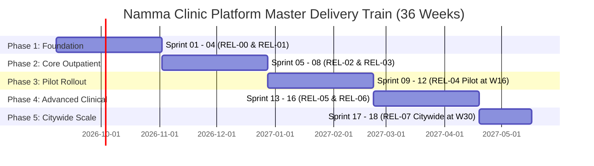

# Master Milestone Architecture & Delivery Train Specification

Authoritative engineering governance specification establishing the enterprise delivery train, sprint milestones, release vehicles, phase boundary gates, and statutory audit checkpoints for the Namma Clinic Digital Health & Operations Platform across 450+ municipal clinics under the Greater Bengaluru Authority (GBA) and BBMP Health Department.

| Governance Attribute | Specification Value |
| :--- | :--- |
| **Document Identifier** | `DOC-GH-05-MILESTONES` |
| **Document Title** | Master Milestone Architecture & Delivery Train Specification |
| **Document Version** | `1.0.0` |
| **Security Classification** | `RESTRICTED - GBA / BBMP HEALTH DEPARTMENT INTERNAL ONLY` |
| **Ratification Status** | `APPROVED & RATIFIED GOVERNANCE BASELINE` |
| **Program Domain** | Delivery Governance, Program Scheduling & Release Vehicles |
| **Target Audience** | Software Engineers, Delivery Managers, Scrum Masters, Release Engineers, Clinical Leads |

## 1. Executive Summary & Delivery Train Intent
To orchestrate complex multi-squad software delivery across 36 calendar weeks, the Namma Clinic platform institutes a synchronized delivery train model. Every deliverable is tied directly to an immutable milestone container within GitHub. Milestones act as temporal anchors enforcing rigorous entry and exit gates across 18 sprints, 8 enterprise releases, 5 program phases, and 4 clinical/statutory audits.

This specification establishes:
1. **The Four Master Milestone Categories:** Sprints (fortnightly delivery cadences), Releases (deployable enterprise vehicles), Phases (programmatic quality boundaries), and Audits (statutory clinical and security reviews).
2. **35 Authoritative Milestones (`MILESTONE-001` through `MILESTONE-035`):** Complete operational specifications including target execution windows, entry criteria, exit criteria, and designated sign-off authorities.
3. **Upstream Alignment Matrix:** Full synchronization with Phase 18 Sprint specifications, Phase 19 Release engineering standards, and the Phase 20 Master Timeplan (covering Weeks 01 through 36).
4. **Milestone Velocity & Slippage Governance:** Quantitative buffers, burnup chart metrics, and circuit-breaking protocols when milestones deviate from baseline.
5. **Automated Milestone Sync & GitHub CLI Specifications:** Declarative CLI commands and automation scripts creating, updating, and closing milestones.
6. **85 Milestone Governance Acceptance Criteria (`AC-MILE-001` to `AC-MILE-085`):** Uncompromising verification gates certifying zero overdue milestones and complete audit trail retention.

> [!IMPORTANT]
> **Milestone Delivery Train Invariant**
> Work items scheduled within a milestone cannot be carried over or closed without explicit formal review during the milestone closing ceremony. Any item failing exit criteria must be reassigned via formal change control to a downstream buffer sprint.

## 2. Enterprise Delivery Train & Temporal Roadmap
The 36-week program trajectory synchronizes 18 fortnightly sprints with 8 release vehicles and key clinical pilot milestones:

### Architecture Diagram: Delivery Train Roadmap & Phase Windows


## 3. Comprehensive Milestone Catalog (MILESTONE-001 to MILESTONE-035)
Exhaustive operational parameters, entry/exit criteria, and governance controls for all 35 platform milestones:

### MILESTONE-001: Sprint 01: Foundation Architecture & Scaffolding (Category: Sprint)
- **Milestone Identifier:** `MILESTONE-001`
- **Milestone Display Title:** Sprint 01: Foundation Architecture & Scaffolding
- **Milestone Category:** `Sprint`
- **Target Execution Window:** Weeks 01-02
- **Associated Sprint / Cadence:** `SPRINT-01`
- **Formal Entry Gate:** Architecture baseline approved; team onboarded.
- **Formal Exit Gate:** Fastify multi-tenant scaffolding operational; CI pipeline green.

#### Scope & Architectural Objectives for MILESTONE-001
- **Primary Mission:** Establish verified, tested operational capabilities for sprint 01: foundation architecture & scaffolding across target municipal clinics.
- **Technical Alignment:** Directly fulfills architectural requirements documented in `docs/18-sprints/`, `docs/19-releases/`, and `docs/20-timeplan/`.
- **Clinical Risk Horizon:** Evaluates potential disruption to municipal clinic patient flows, dispensary inventory, or consultation rooms.
- **Quality Gate Mapping:** Enforces automated test suites, static analysis, and zero open P0/P1 defects.

#### Primary Deliverables & Work Packages for MILESTONE-001
- **Backend & API Deliverable:** Microservice endpoints, data access layer, and domain contract tests.
- **Frontend & Mobile Deliverable:** React micro-frontend workflows, offline sync queue, and responsive UI.
- **Database & Migration Deliverable:** Flyway migration scripts, schema constraints, and RLS policies.
- **Clinical & Compliance Deliverable:** Verification against BBMP clinical formulary and DPDP data safety.
- **Documentation & Runbook Deliverable:** Operations runbooks, OpenAPI contract updates, and test reports.

#### Risk Analysis & Escalation Controls for MILESTONE-001
- **Primary Technical Risk:** Integration complexity or latency bottlenecks in distributed clinic sync.
- **Clinical Operational Hazard:** Potential disruptions to outpatient registration or prescription printing.
- **Mitigation Directive:** Pre-tested rollbacks, local SQLite offline mode fallback, and staging smoke tests.
- **Escalation SLA:** Blocker issues unresolved after 12 hours escalate directly to Program Delivery Manager.

#### Entry & Exit Governance Verification for MILESTONE-001
1. **Pre-Milestone Checklist:** All scheduled issues must be in 'Ready for Sprint' with complete acceptance criteria and sizing.
2. **Continuous Verification:** Daily automated burnup tracking monitors velocity and flags scope changes.
3. **Closing Ceremony Sign-Off:** Scrum Master, Technical Lead, and designated Clinical SME must formally sign off on closure.
4. **Remediation & Spillover Policy:** Unfinished items are reviewed during retro; spillover is re-estimated and reassigned.
5. **Audit Artifact Archival:** Milestone completion report and automated test logs are committed to repository records.

### MILESTONE-002: Sprint 02: Keycloak IAM & Security Baseline (Category: Sprint)
- **Milestone Identifier:** `MILESTONE-002`
- **Milestone Display Title:** Sprint 02: Keycloak IAM & Security Baseline
- **Milestone Category:** `Sprint`
- **Target Execution Window:** Weeks 03-04
- **Associated Sprint / Cadence:** `SPRINT-02`
- **Formal Entry Gate:** Scaffolding complete; Keycloak Helm charts ready.
- **Formal Exit Gate:** RBAC authentication and WORM audit ledger operational.

#### Scope & Architectural Objectives for MILESTONE-002
- **Primary Mission:** Establish verified, tested operational capabilities for sprint 02: keycloak iam & security baseline across target municipal clinics.
- **Technical Alignment:** Directly fulfills architectural requirements documented in `docs/18-sprints/`, `docs/19-releases/`, and `docs/20-timeplan/`.
- **Clinical Risk Horizon:** Evaluates potential disruption to municipal clinic patient flows, dispensary inventory, or consultation rooms.
- **Quality Gate Mapping:** Enforces automated test suites, static analysis, and zero open P0/P1 defects.

#### Primary Deliverables & Work Packages for MILESTONE-002
- **Backend & API Deliverable:** Microservice endpoints, data access layer, and domain contract tests.
- **Frontend & Mobile Deliverable:** React micro-frontend workflows, offline sync queue, and responsive UI.
- **Database & Migration Deliverable:** Flyway migration scripts, schema constraints, and RLS policies.
- **Clinical & Compliance Deliverable:** Verification against BBMP clinical formulary and DPDP data safety.
- **Documentation & Runbook Deliverable:** Operations runbooks, OpenAPI contract updates, and test reports.

#### Risk Analysis & Escalation Controls for MILESTONE-002
- **Primary Technical Risk:** Integration complexity or latency bottlenecks in distributed clinic sync.
- **Clinical Operational Hazard:** Potential disruptions to outpatient registration or prescription printing.
- **Mitigation Directive:** Pre-tested rollbacks, local SQLite offline mode fallback, and staging smoke tests.
- **Escalation SLA:** Blocker issues unresolved after 12 hours escalate directly to Program Delivery Manager.

#### Entry & Exit Governance Verification for MILESTONE-002
1. **Pre-Milestone Checklist:** All scheduled issues must be in 'Ready for Sprint' with complete acceptance criteria and sizing.
2. **Continuous Verification:** Daily automated burnup tracking monitors velocity and flags scope changes.
3. **Closing Ceremony Sign-Off:** Scrum Master, Technical Lead, and designated Clinical SME must formally sign off on closure.
4. **Remediation & Spillover Policy:** Unfinished items are reviewed during retro; spillover is re-estimated and reassigned.
5. **Audit Artifact Archival:** Milestone completion report and automated test logs are committed to repository records.

### MILESTONE-003: Sprint 03: Citizen Demographics & ABHA Minting (Category: Sprint)
- **Milestone Identifier:** `MILESTONE-003`
- **Milestone Display Title:** Sprint 03: Citizen Demographics & ABHA Minting
- **Milestone Category:** `Sprint`
- **Target Execution Window:** Weeks 05-06
- **Associated Sprint / Cadence:** `SPRINT-03`
- **Formal Entry Gate:** Keycloak active; database schema V003 applied.
- **Formal Exit Gate:** Citizen registration and ABHA M1 integration verified.

#### Scope & Architectural Objectives for MILESTONE-003
- **Primary Mission:** Establish verified, tested operational capabilities for sprint 03: citizen demographics & abha minting across target municipal clinics.
- **Technical Alignment:** Directly fulfills architectural requirements documented in `docs/18-sprints/`, `docs/19-releases/`, and `docs/20-timeplan/`.
- **Clinical Risk Horizon:** Evaluates potential disruption to municipal clinic patient flows, dispensary inventory, or consultation rooms.
- **Quality Gate Mapping:** Enforces automated test suites, static analysis, and zero open P0/P1 defects.

#### Primary Deliverables & Work Packages for MILESTONE-003
- **Backend & API Deliverable:** Microservice endpoints, data access layer, and domain contract tests.
- **Frontend & Mobile Deliverable:** React micro-frontend workflows, offline sync queue, and responsive UI.
- **Database & Migration Deliverable:** Flyway migration scripts, schema constraints, and RLS policies.
- **Clinical & Compliance Deliverable:** Verification against BBMP clinical formulary and DPDP data safety.
- **Documentation & Runbook Deliverable:** Operations runbooks, OpenAPI contract updates, and test reports.

#### Risk Analysis & Escalation Controls for MILESTONE-003
- **Primary Technical Risk:** Integration complexity or latency bottlenecks in distributed clinic sync.
- **Clinical Operational Hazard:** Potential disruptions to outpatient registration or prescription printing.
- **Mitigation Directive:** Pre-tested rollbacks, local SQLite offline mode fallback, and staging smoke tests.
- **Escalation SLA:** Blocker issues unresolved after 12 hours escalate directly to Program Delivery Manager.

#### Entry & Exit Governance Verification for MILESTONE-003
1. **Pre-Milestone Checklist:** All scheduled issues must be in 'Ready for Sprint' with complete acceptance criteria and sizing.
2. **Continuous Verification:** Daily automated burnup tracking monitors velocity and flags scope changes.
3. **Closing Ceremony Sign-Off:** Scrum Master, Technical Lead, and designated Clinical SME must formally sign off on closure.
4. **Remediation & Spillover Policy:** Unfinished items are reviewed during retro; spillover is re-estimated and reassigned.
5. **Audit Artifact Archival:** Milestone completion report and automated test logs are committed to repository records.

### MILESTONE-004: Sprint 04: Patient Search, Consent & Biometrics (Category: Sprint)
- **Milestone Identifier:** `MILESTONE-004`
- **Milestone Display Title:** Sprint 04: Patient Search, Consent & Biometrics
- **Milestone Category:** `Sprint`
- **Target Execution Window:** Weeks 07-08
- **Associated Sprint / Cadence:** `SPRINT-04`
- **Formal Entry Gate:** Registration active; DPDP consent engine defined.
- **Formal Exit Gate:** Bilingual phonetic search and DPDP consent verified.

#### Scope & Architectural Objectives for MILESTONE-004
- **Primary Mission:** Establish verified, tested operational capabilities for sprint 04: patient search, consent & biometrics across target municipal clinics.
- **Technical Alignment:** Directly fulfills architectural requirements documented in `docs/18-sprints/`, `docs/19-releases/`, and `docs/20-timeplan/`.
- **Clinical Risk Horizon:** Evaluates potential disruption to municipal clinic patient flows, dispensary inventory, or consultation rooms.
- **Quality Gate Mapping:** Enforces automated test suites, static analysis, and zero open P0/P1 defects.

#### Primary Deliverables & Work Packages for MILESTONE-004
- **Backend & API Deliverable:** Microservice endpoints, data access layer, and domain contract tests.
- **Frontend & Mobile Deliverable:** React micro-frontend workflows, offline sync queue, and responsive UI.
- **Database & Migration Deliverable:** Flyway migration scripts, schema constraints, and RLS policies.
- **Clinical & Compliance Deliverable:** Verification against BBMP clinical formulary and DPDP data safety.
- **Documentation & Runbook Deliverable:** Operations runbooks, OpenAPI contract updates, and test reports.

#### Risk Analysis & Escalation Controls for MILESTONE-004
- **Primary Technical Risk:** Integration complexity or latency bottlenecks in distributed clinic sync.
- **Clinical Operational Hazard:** Potential disruptions to outpatient registration or prescription printing.
- **Mitigation Directive:** Pre-tested rollbacks, local SQLite offline mode fallback, and staging smoke tests.
- **Escalation SLA:** Blocker issues unresolved after 12 hours escalate directly to Program Delivery Manager.

#### Entry & Exit Governance Verification for MILESTONE-004
1. **Pre-Milestone Checklist:** All scheduled issues must be in 'Ready for Sprint' with complete acceptance criteria and sizing.
2. **Continuous Verification:** Daily automated burnup tracking monitors velocity and flags scope changes.
3. **Closing Ceremony Sign-Off:** Scrum Master, Technical Lead, and designated Clinical SME must formally sign off on closure.
4. **Remediation & Spillover Policy:** Unfinished items are reviewed during retro; spillover is re-estimated and reassigned.
5. **Audit Artifact Archival:** Milestone completion report and automated test logs are committed to repository records.

### MILESTONE-005: Sprint 05: Token Dispenser & Queue Management (Category: Sprint)
- **Milestone Identifier:** `MILESTONE-005`
- **Milestone Display Title:** Sprint 05: Token Dispenser & Queue Management
- **Milestone Category:** `Sprint`
- **Target Execution Window:** Weeks 09-10
- **Associated Sprint / Cadence:** `SPRINT-05`
- **Formal Entry Gate:** Patient lookup passing; thermal printer SDK ready.
- **Formal Exit Gate:** Thermal token generation and queue orchestration verified.

#### Scope & Architectural Objectives for MILESTONE-005
- **Primary Mission:** Establish verified, tested operational capabilities for sprint 05: token dispenser & queue management across target municipal clinics.
- **Technical Alignment:** Directly fulfills architectural requirements documented in `docs/18-sprints/`, `docs/19-releases/`, and `docs/20-timeplan/`.
- **Clinical Risk Horizon:** Evaluates potential disruption to municipal clinic patient flows, dispensary inventory, or consultation rooms.
- **Quality Gate Mapping:** Enforces automated test suites, static analysis, and zero open P0/P1 defects.

#### Primary Deliverables & Work Packages for MILESTONE-005
- **Backend & API Deliverable:** Microservice endpoints, data access layer, and domain contract tests.
- **Frontend & Mobile Deliverable:** React micro-frontend workflows, offline sync queue, and responsive UI.
- **Database & Migration Deliverable:** Flyway migration scripts, schema constraints, and RLS policies.
- **Clinical & Compliance Deliverable:** Verification against BBMP clinical formulary and DPDP data safety.
- **Documentation & Runbook Deliverable:** Operations runbooks, OpenAPI contract updates, and test reports.

#### Risk Analysis & Escalation Controls for MILESTONE-005
- **Primary Technical Risk:** Integration complexity or latency bottlenecks in distributed clinic sync.
- **Clinical Operational Hazard:** Potential disruptions to outpatient registration or prescription printing.
- **Mitigation Directive:** Pre-tested rollbacks, local SQLite offline mode fallback, and staging smoke tests.
- **Escalation SLA:** Blocker issues unresolved after 12 hours escalate directly to Program Delivery Manager.

#### Entry & Exit Governance Verification for MILESTONE-005
1. **Pre-Milestone Checklist:** All scheduled issues must be in 'Ready for Sprint' with complete acceptance criteria and sizing.
2. **Continuous Verification:** Daily automated burnup tracking monitors velocity and flags scope changes.
3. **Closing Ceremony Sign-Off:** Scrum Master, Technical Lead, and designated Clinical SME must formally sign off on closure.
4. **Remediation & Spillover Policy:** Unfinished items are reviewed during retro; spillover is re-estimated and reassigned.
5. **Audit Artifact Archival:** Milestone completion report and automated test logs are committed to repository records.

### MILESTONE-006: Sprint 06: Nurse Triage & Danger Sign Alerts (Category: Sprint)
- **Milestone Identifier:** `MILESTONE-006`
- **Milestone Display Title:** Sprint 06: Nurse Triage & Danger Sign Alerts
- **Milestone Category:** `Sprint`
- **Target Execution Window:** Weeks 11-12
- **Associated Sprint / Cadence:** `SPRINT-06`
- **Formal Entry Gate:** Queue engine active; triage clinical schema approved.
- **Formal Exit Gate:** Digital vitals capture and danger alert triggers operational.

#### Scope & Architectural Objectives for MILESTONE-006
- **Primary Mission:** Establish verified, tested operational capabilities for sprint 06: nurse triage & danger sign alerts across target municipal clinics.
- **Technical Alignment:** Directly fulfills architectural requirements documented in `docs/18-sprints/`, `docs/19-releases/`, and `docs/20-timeplan/`.
- **Clinical Risk Horizon:** Evaluates potential disruption to municipal clinic patient flows, dispensary inventory, or consultation rooms.
- **Quality Gate Mapping:** Enforces automated test suites, static analysis, and zero open P0/P1 defects.

#### Primary Deliverables & Work Packages for MILESTONE-006
- **Backend & API Deliverable:** Microservice endpoints, data access layer, and domain contract tests.
- **Frontend & Mobile Deliverable:** React micro-frontend workflows, offline sync queue, and responsive UI.
- **Database & Migration Deliverable:** Flyway migration scripts, schema constraints, and RLS policies.
- **Clinical & Compliance Deliverable:** Verification against BBMP clinical formulary and DPDP data safety.
- **Documentation & Runbook Deliverable:** Operations runbooks, OpenAPI contract updates, and test reports.

#### Risk Analysis & Escalation Controls for MILESTONE-006
- **Primary Technical Risk:** Integration complexity or latency bottlenecks in distributed clinic sync.
- **Clinical Operational Hazard:** Potential disruptions to outpatient registration or prescription printing.
- **Mitigation Directive:** Pre-tested rollbacks, local SQLite offline mode fallback, and staging smoke tests.
- **Escalation SLA:** Blocker issues unresolved after 12 hours escalate directly to Program Delivery Manager.

#### Entry & Exit Governance Verification for MILESTONE-006
1. **Pre-Milestone Checklist:** All scheduled issues must be in 'Ready for Sprint' with complete acceptance criteria and sizing.
2. **Continuous Verification:** Daily automated burnup tracking monitors velocity and flags scope changes.
3. **Closing Ceremony Sign-Off:** Scrum Master, Technical Lead, and designated Clinical SME must formally sign off on closure.
4. **Remediation & Spillover Policy:** Unfinished items are reviewed during retro; spillover is re-estimated and reassigned.
5. **Audit Artifact Archival:** Milestone completion report and automated test logs are committed to repository records.

### MILESTONE-007: Sprint 07: Doctor Consultation & SOAP Workbench (Category: Sprint)
- **Milestone Identifier:** `MILESTONE-007`
- **Milestone Display Title:** Sprint 07: Doctor Consultation & SOAP Workbench
- **Milestone Category:** `Sprint`
- **Target Execution Window:** Weeks 13-14
- **Associated Sprint / Cadence:** `SPRINT-07`
- **Formal Entry Gate:** Triage vitals streaming; physician UI prototype ready.
- **Formal Exit Gate:** Physician clinical consultation console validated in sandbox.

#### Scope & Architectural Objectives for MILESTONE-007
- **Primary Mission:** Establish verified, tested operational capabilities for sprint 07: doctor consultation & soap workbench across target municipal clinics.
- **Technical Alignment:** Directly fulfills architectural requirements documented in `docs/18-sprints/`, `docs/19-releases/`, and `docs/20-timeplan/`.
- **Clinical Risk Horizon:** Evaluates potential disruption to municipal clinic patient flows, dispensary inventory, or consultation rooms.
- **Quality Gate Mapping:** Enforces automated test suites, static analysis, and zero open P0/P1 defects.

#### Primary Deliverables & Work Packages for MILESTONE-007
- **Backend & API Deliverable:** Microservice endpoints, data access layer, and domain contract tests.
- **Frontend & Mobile Deliverable:** React micro-frontend workflows, offline sync queue, and responsive UI.
- **Database & Migration Deliverable:** Flyway migration scripts, schema constraints, and RLS policies.
- **Clinical & Compliance Deliverable:** Verification against BBMP clinical formulary and DPDP data safety.
- **Documentation & Runbook Deliverable:** Operations runbooks, OpenAPI contract updates, and test reports.

#### Risk Analysis & Escalation Controls for MILESTONE-007
- **Primary Technical Risk:** Integration complexity or latency bottlenecks in distributed clinic sync.
- **Clinical Operational Hazard:** Potential disruptions to outpatient registration or prescription printing.
- **Mitigation Directive:** Pre-tested rollbacks, local SQLite offline mode fallback, and staging smoke tests.
- **Escalation SLA:** Blocker issues unresolved after 12 hours escalate directly to Program Delivery Manager.

#### Entry & Exit Governance Verification for MILESTONE-007
1. **Pre-Milestone Checklist:** All scheduled issues must be in 'Ready for Sprint' with complete acceptance criteria and sizing.
2. **Continuous Verification:** Daily automated burnup tracking monitors velocity and flags scope changes.
3. **Closing Ceremony Sign-Off:** Scrum Master, Technical Lead, and designated Clinical SME must formally sign off on closure.
4. **Remediation & Spillover Policy:** Unfinished items are reviewed during retro; spillover is re-estimated and reassigned.
5. **Audit Artifact Archival:** Milestone completion report and automated test logs are committed to repository records.

### MILESTONE-008: Sprint 08: Diagnosis Search & E-Prescriptions (Category: Sprint)
- **Milestone Identifier:** `MILESTONE-008`
- **Milestone Display Title:** Sprint 08: Diagnosis Search & E-Prescriptions
- **Milestone Category:** `Sprint`
- **Target Execution Window:** Weeks 15-16
- **Associated Sprint / Cadence:** `SPRINT-08`
- **Formal Entry Gate:** Doctor console active; ICD-10 catalog indexed.
- **Formal Exit Gate:** ICD-10 search and STG-compliant e-prescribing operational.

#### Scope & Architectural Objectives for MILESTONE-008
- **Primary Mission:** Establish verified, tested operational capabilities for sprint 08: diagnosis search & e-prescriptions across target municipal clinics.
- **Technical Alignment:** Directly fulfills architectural requirements documented in `docs/18-sprints/`, `docs/19-releases/`, and `docs/20-timeplan/`.
- **Clinical Risk Horizon:** Evaluates potential disruption to municipal clinic patient flows, dispensary inventory, or consultation rooms.
- **Quality Gate Mapping:** Enforces automated test suites, static analysis, and zero open P0/P1 defects.

#### Primary Deliverables & Work Packages for MILESTONE-008
- **Backend & API Deliverable:** Microservice endpoints, data access layer, and domain contract tests.
- **Frontend & Mobile Deliverable:** React micro-frontend workflows, offline sync queue, and responsive UI.
- **Database & Migration Deliverable:** Flyway migration scripts, schema constraints, and RLS policies.
- **Clinical & Compliance Deliverable:** Verification against BBMP clinical formulary and DPDP data safety.
- **Documentation & Runbook Deliverable:** Operations runbooks, OpenAPI contract updates, and test reports.

#### Risk Analysis & Escalation Controls for MILESTONE-008
- **Primary Technical Risk:** Integration complexity or latency bottlenecks in distributed clinic sync.
- **Clinical Operational Hazard:** Potential disruptions to outpatient registration or prescription printing.
- **Mitigation Directive:** Pre-tested rollbacks, local SQLite offline mode fallback, and staging smoke tests.
- **Escalation SLA:** Blocker issues unresolved after 12 hours escalate directly to Program Delivery Manager.

#### Entry & Exit Governance Verification for MILESTONE-008
1. **Pre-Milestone Checklist:** All scheduled issues must be in 'Ready for Sprint' with complete acceptance criteria and sizing.
2. **Continuous Verification:** Daily automated burnup tracking monitors velocity and flags scope changes.
3. **Closing Ceremony Sign-Off:** Scrum Master, Technical Lead, and designated Clinical SME must formally sign off on closure.
4. **Remediation & Spillover Policy:** Unfinished items are reviewed during retro; spillover is re-estimated and reassigned.
5. **Audit Artifact Archival:** Milestone completion report and automated test logs are committed to repository records.

### MILESTONE-009: Sprint 09: Pharmacy FEFO Dispensation (Category: Sprint)
- **Milestone Identifier:** `MILESTONE-009`
- **Milestone Display Title:** Sprint 09: Pharmacy FEFO Dispensation
- **Milestone Category:** `Sprint`
- **Target Execution Window:** Weeks 17-18
- **Associated Sprint / Cadence:** `SPRINT-09`
- **Formal Entry Gate:** Prescription pipeline verified; drug master loaded.
- **Formal Exit Gate:** FEFO batch allocation and barcode scanning verified.

#### Scope & Architectural Objectives for MILESTONE-009
- **Primary Mission:** Establish verified, tested operational capabilities for sprint 09: pharmacy fefo dispensation across target municipal clinics.
- **Technical Alignment:** Directly fulfills architectural requirements documented in `docs/18-sprints/`, `docs/19-releases/`, and `docs/20-timeplan/`.
- **Clinical Risk Horizon:** Evaluates potential disruption to municipal clinic patient flows, dispensary inventory, or consultation rooms.
- **Quality Gate Mapping:** Enforces automated test suites, static analysis, and zero open P0/P1 defects.

#### Primary Deliverables & Work Packages for MILESTONE-009
- **Backend & API Deliverable:** Microservice endpoints, data access layer, and domain contract tests.
- **Frontend & Mobile Deliverable:** React micro-frontend workflows, offline sync queue, and responsive UI.
- **Database & Migration Deliverable:** Flyway migration scripts, schema constraints, and RLS policies.
- **Clinical & Compliance Deliverable:** Verification against BBMP clinical formulary and DPDP data safety.
- **Documentation & Runbook Deliverable:** Operations runbooks, OpenAPI contract updates, and test reports.

#### Risk Analysis & Escalation Controls for MILESTONE-009
- **Primary Technical Risk:** Integration complexity or latency bottlenecks in distributed clinic sync.
- **Clinical Operational Hazard:** Potential disruptions to outpatient registration or prescription printing.
- **Mitigation Directive:** Pre-tested rollbacks, local SQLite offline mode fallback, and staging smoke tests.
- **Escalation SLA:** Blocker issues unresolved after 12 hours escalate directly to Program Delivery Manager.

#### Entry & Exit Governance Verification for MILESTONE-009
1. **Pre-Milestone Checklist:** All scheduled issues must be in 'Ready for Sprint' with complete acceptance criteria and sizing.
2. **Continuous Verification:** Daily automated burnup tracking monitors velocity and flags scope changes.
3. **Closing Ceremony Sign-Off:** Scrum Master, Technical Lead, and designated Clinical SME must formally sign off on closure.
4. **Remediation & Spillover Policy:** Unfinished items are reviewed during retro; spillover is re-estimated and reassigned.
5. **Audit Artifact Archival:** Milestone completion report and automated test logs are committed to repository records.

### MILESTONE-010: Sprint 10: Client SQLite & Offline Sync (Category: Sprint)
- **Milestone Identifier:** `MILESTONE-010`
- **Milestone Display Title:** Sprint 10: Client SQLite & Offline Sync
- **Milestone Category:** `Sprint`
- **Target Execution Window:** Weeks 19-20
- **Associated Sprint / Cadence:** `SPRINT-10`
- **Formal Entry Gate:** Core clinical intake stable; SQLite WASM ready.
- **Formal Exit Gate:** Autonomous offline intake and bi-directional sync passing.

#### Scope & Architectural Objectives for MILESTONE-010
- **Primary Mission:** Establish verified, tested operational capabilities for sprint 10: client sqlite & offline sync across target municipal clinics.
- **Technical Alignment:** Directly fulfills architectural requirements documented in `docs/18-sprints/`, `docs/19-releases/`, and `docs/20-timeplan/`.
- **Clinical Risk Horizon:** Evaluates potential disruption to municipal clinic patient flows, dispensary inventory, or consultation rooms.
- **Quality Gate Mapping:** Enforces automated test suites, static analysis, and zero open P0/P1 defects.

#### Primary Deliverables & Work Packages for MILESTONE-010
- **Backend & API Deliverable:** Microservice endpoints, data access layer, and domain contract tests.
- **Frontend & Mobile Deliverable:** React micro-frontend workflows, offline sync queue, and responsive UI.
- **Database & Migration Deliverable:** Flyway migration scripts, schema constraints, and RLS policies.
- **Clinical & Compliance Deliverable:** Verification against BBMP clinical formulary and DPDP data safety.
- **Documentation & Runbook Deliverable:** Operations runbooks, OpenAPI contract updates, and test reports.

#### Risk Analysis & Escalation Controls for MILESTONE-010
- **Primary Technical Risk:** Integration complexity or latency bottlenecks in distributed clinic sync.
- **Clinical Operational Hazard:** Potential disruptions to outpatient registration or prescription printing.
- **Mitigation Directive:** Pre-tested rollbacks, local SQLite offline mode fallback, and staging smoke tests.
- **Escalation SLA:** Blocker issues unresolved after 12 hours escalate directly to Program Delivery Manager.

#### Entry & Exit Governance Verification for MILESTONE-010
1. **Pre-Milestone Checklist:** All scheduled issues must be in 'Ready for Sprint' with complete acceptance criteria and sizing.
2. **Continuous Verification:** Daily automated burnup tracking monitors velocity and flags scope changes.
3. **Closing Ceremony Sign-Off:** Scrum Master, Technical Lead, and designated Clinical SME must formally sign off on closure.
4. **Remediation & Spillover Policy:** Unfinished items are reviewed during retro; spillover is re-estimated and reassigned.
5. **Audit Artifact Archival:** Milestone completion report and automated test logs are committed to repository records.

### MILESTONE-011: Sprint 11: Point-of-Care Laboratory Diagnostics (Category: Sprint)
- **Milestone Identifier:** `MILESTONE-011`
- **Milestone Display Title:** Sprint 11: Point-of-Care Laboratory Diagnostics
- **Milestone Category:** `Sprint`
- **Target Execution Window:** Weeks 21-22
- **Associated Sprint / Cadence:** `SPRINT-11`
- **Formal Entry Gate:** Doctor order entry ready; lab test catalog active.
- **Formal Exit Gate:** Rapid lab test ordering and result capture verified.

#### Scope & Architectural Objectives for MILESTONE-011
- **Primary Mission:** Establish verified, tested operational capabilities for sprint 11: point-of-care laboratory diagnostics across target municipal clinics.
- **Technical Alignment:** Directly fulfills architectural requirements documented in `docs/18-sprints/`, `docs/19-releases/`, and `docs/20-timeplan/`.
- **Clinical Risk Horizon:** Evaluates potential disruption to municipal clinic patient flows, dispensary inventory, or consultation rooms.
- **Quality Gate Mapping:** Enforces automated test suites, static analysis, and zero open P0/P1 defects.

#### Primary Deliverables & Work Packages for MILESTONE-011
- **Backend & API Deliverable:** Microservice endpoints, data access layer, and domain contract tests.
- **Frontend & Mobile Deliverable:** React micro-frontend workflows, offline sync queue, and responsive UI.
- **Database & Migration Deliverable:** Flyway migration scripts, schema constraints, and RLS policies.
- **Clinical & Compliance Deliverable:** Verification against BBMP clinical formulary and DPDP data safety.
- **Documentation & Runbook Deliverable:** Operations runbooks, OpenAPI contract updates, and test reports.

#### Risk Analysis & Escalation Controls for MILESTONE-011
- **Primary Technical Risk:** Integration complexity or latency bottlenecks in distributed clinic sync.
- **Clinical Operational Hazard:** Potential disruptions to outpatient registration or prescription printing.
- **Mitigation Directive:** Pre-tested rollbacks, local SQLite offline mode fallback, and staging smoke tests.
- **Escalation SLA:** Blocker issues unresolved after 12 hours escalate directly to Program Delivery Manager.

#### Entry & Exit Governance Verification for MILESTONE-011
1. **Pre-Milestone Checklist:** All scheduled issues must be in 'Ready for Sprint' with complete acceptance criteria and sizing.
2. **Continuous Verification:** Daily automated burnup tracking monitors velocity and flags scope changes.
3. **Closing Ceremony Sign-Off:** Scrum Master, Technical Lead, and designated Clinical SME must formally sign off on closure.
4. **Remediation & Spillover Policy:** Unfinished items are reviewed during retro; spillover is re-estimated and reassigned.
5. **Audit Artifact Archival:** Milestone completion report and automated test logs are committed to repository records.

### MILESTONE-012: Sprint 12: Secondary Referrals & SMS Alerts (Category: Sprint)
- **Milestone Identifier:** `MILESTONE-012`
- **Milestone Display Title:** Sprint 12: Secondary Referrals & SMS Alerts
- **Milestone Category:** `Sprint`
- **Target Execution Window:** Weeks 23-24
- **Associated Sprint / Cadence:** `SPRINT-12`
- **Formal Entry Gate:** Consultation active; NIC eHospital gateway mock ready.
- **Formal Exit Gate:** Secondary hospital referral and bilingual SMS active.

#### Scope & Architectural Objectives for MILESTONE-012
- **Primary Mission:** Establish verified, tested operational capabilities for sprint 12: secondary referrals & sms alerts across target municipal clinics.
- **Technical Alignment:** Directly fulfills architectural requirements documented in `docs/18-sprints/`, `docs/19-releases/`, and `docs/20-timeplan/`.
- **Clinical Risk Horizon:** Evaluates potential disruption to municipal clinic patient flows, dispensary inventory, or consultation rooms.
- **Quality Gate Mapping:** Enforces automated test suites, static analysis, and zero open P0/P1 defects.

#### Primary Deliverables & Work Packages for MILESTONE-012
- **Backend & API Deliverable:** Microservice endpoints, data access layer, and domain contract tests.
- **Frontend & Mobile Deliverable:** React micro-frontend workflows, offline sync queue, and responsive UI.
- **Database & Migration Deliverable:** Flyway migration scripts, schema constraints, and RLS policies.
- **Clinical & Compliance Deliverable:** Verification against BBMP clinical formulary and DPDP data safety.
- **Documentation & Runbook Deliverable:** Operations runbooks, OpenAPI contract updates, and test reports.

#### Risk Analysis & Escalation Controls for MILESTONE-012
- **Primary Technical Risk:** Integration complexity or latency bottlenecks in distributed clinic sync.
- **Clinical Operational Hazard:** Potential disruptions to outpatient registration or prescription printing.
- **Mitigation Directive:** Pre-tested rollbacks, local SQLite offline mode fallback, and staging smoke tests.
- **Escalation SLA:** Blocker issues unresolved after 12 hours escalate directly to Program Delivery Manager.

#### Entry & Exit Governance Verification for MILESTONE-012
1. **Pre-Milestone Checklist:** All scheduled issues must be in 'Ready for Sprint' with complete acceptance criteria and sizing.
2. **Continuous Verification:** Daily automated burnup tracking monitors velocity and flags scope changes.
3. **Closing Ceremony Sign-Off:** Scrum Master, Technical Lead, and designated Clinical SME must formally sign off on closure.
4. **Remediation & Spillover Policy:** Unfinished items are reviewed during retro; spillover is re-estimated and reassigned.
5. **Audit Artifact Archival:** Milestone completion report and automated test logs are committed to repository records.

### MILESTONE-013: Sprint 13: Pharmacy Inventory & Central Supply (Category: Sprint)
- **Milestone Identifier:** `MILESTONE-013`
- **Milestone Display Title:** Sprint 13: Pharmacy Inventory & Central Supply
- **Milestone Category:** `Sprint`
- **Target Execution Window:** Weeks 25-26
- **Associated Sprint / Cadence:** `SPRINT-13`
- **Formal Entry Gate:** Clinic dispensing verified; warehouse schemas applied.
- **Formal Exit Gate:** Central warehouse stock transfer and near-expiry alerts verified.

#### Scope & Architectural Objectives for MILESTONE-013
- **Primary Mission:** Establish verified, tested operational capabilities for sprint 13: pharmacy inventory & central supply across target municipal clinics.
- **Technical Alignment:** Directly fulfills architectural requirements documented in `docs/18-sprints/`, `docs/19-releases/`, and `docs/20-timeplan/`.
- **Clinical Risk Horizon:** Evaluates potential disruption to municipal clinic patient flows, dispensary inventory, or consultation rooms.
- **Quality Gate Mapping:** Enforces automated test suites, static analysis, and zero open P0/P1 defects.

#### Primary Deliverables & Work Packages for MILESTONE-013
- **Backend & API Deliverable:** Microservice endpoints, data access layer, and domain contract tests.
- **Frontend & Mobile Deliverable:** React micro-frontend workflows, offline sync queue, and responsive UI.
- **Database & Migration Deliverable:** Flyway migration scripts, schema constraints, and RLS policies.
- **Clinical & Compliance Deliverable:** Verification against BBMP clinical formulary and DPDP data safety.
- **Documentation & Runbook Deliverable:** Operations runbooks, OpenAPI contract updates, and test reports.

#### Risk Analysis & Escalation Controls for MILESTONE-013
- **Primary Technical Risk:** Integration complexity or latency bottlenecks in distributed clinic sync.
- **Clinical Operational Hazard:** Potential disruptions to outpatient registration or prescription printing.
- **Mitigation Directive:** Pre-tested rollbacks, local SQLite offline mode fallback, and staging smoke tests.
- **Escalation SLA:** Blocker issues unresolved after 12 hours escalate directly to Program Delivery Manager.

#### Entry & Exit Governance Verification for MILESTONE-013
1. **Pre-Milestone Checklist:** All scheduled issues must be in 'Ready for Sprint' with complete acceptance criteria and sizing.
2. **Continuous Verification:** Daily automated burnup tracking monitors velocity and flags scope changes.
3. **Closing Ceremony Sign-Off:** Scrum Master, Technical Lead, and designated Clinical SME must formally sign off on closure.
4. **Remediation & Spillover Policy:** Unfinished items are reviewed during retro; spillover is re-estimated and reassigned.
5. **Audit Artifact Archival:** Milestone completion report and automated test logs are committed to repository records.

### MILESTONE-014: Sprint 14: ClickHouse Lakehouse & Heatmaps (Category: Sprint)
- **Milestone Identifier:** `MILESTONE-014`
- **Milestone Display Title:** Sprint 14: ClickHouse Lakehouse & Heatmaps
- **Milestone Category:** `Sprint`
- **Target Execution Window:** Weeks 27-28
- **Associated Sprint / Cadence:** `SPRINT-14`
- **Formal Entry Gate:** Kafka event streams active; ClickHouse cluster ready.
- **Formal Exit Gate:** Streaming OLAP lakehouse and Superset heatmaps operational.

#### Scope & Architectural Objectives for MILESTONE-014
- **Primary Mission:** Establish verified, tested operational capabilities for sprint 14: clickhouse lakehouse & heatmaps across target municipal clinics.
- **Technical Alignment:** Directly fulfills architectural requirements documented in `docs/18-sprints/`, `docs/19-releases/`, and `docs/20-timeplan/`.
- **Clinical Risk Horizon:** Evaluates potential disruption to municipal clinic patient flows, dispensary inventory, or consultation rooms.
- **Quality Gate Mapping:** Enforces automated test suites, static analysis, and zero open P0/P1 defects.

#### Primary Deliverables & Work Packages for MILESTONE-014
- **Backend & API Deliverable:** Microservice endpoints, data access layer, and domain contract tests.
- **Frontend & Mobile Deliverable:** React micro-frontend workflows, offline sync queue, and responsive UI.
- **Database & Migration Deliverable:** Flyway migration scripts, schema constraints, and RLS policies.
- **Clinical & Compliance Deliverable:** Verification against BBMP clinical formulary and DPDP data safety.
- **Documentation & Runbook Deliverable:** Operations runbooks, OpenAPI contract updates, and test reports.

#### Risk Analysis & Escalation Controls for MILESTONE-014
- **Primary Technical Risk:** Integration complexity or latency bottlenecks in distributed clinic sync.
- **Clinical Operational Hazard:** Potential disruptions to outpatient registration or prescription printing.
- **Mitigation Directive:** Pre-tested rollbacks, local SQLite offline mode fallback, and staging smoke tests.
- **Escalation SLA:** Blocker issues unresolved after 12 hours escalate directly to Program Delivery Manager.

#### Entry & Exit Governance Verification for MILESTONE-014
1. **Pre-Milestone Checklist:** All scheduled issues must be in 'Ready for Sprint' with complete acceptance criteria and sizing.
2. **Continuous Verification:** Daily automated burnup tracking monitors velocity and flags scope changes.
3. **Closing Ceremony Sign-Off:** Scrum Master, Technical Lead, and designated Clinical SME must formally sign off on closure.
4. **Remediation & Spillover Policy:** Unfinished items are reviewed during retro; spillover is re-estimated and reassigned.
5. **Audit Artifact Archival:** Milestone completion report and automated test logs are committed to repository records.

### MILESTONE-015: Sprint 15: Clinical AI Decision Support (Category: Sprint)
- **Milestone Identifier:** `MILESTONE-015`
- **Milestone Display Title:** Sprint 15: Clinical AI Decision Support
- **Milestone Category:** `Sprint`
- **Target Execution Window:** Weeks 29-30
- **Associated Sprint / Cadence:** `SPRINT-15`
- **Formal Entry Gate:** Prescription stream active; STG rules compiled.
- **Formal Exit Gate:** Adverse drug interaction alerts and dosage checking verified.

#### Scope & Architectural Objectives for MILESTONE-015
- **Primary Mission:** Establish verified, tested operational capabilities for sprint 15: clinical ai decision support across target municipal clinics.
- **Technical Alignment:** Directly fulfills architectural requirements documented in `docs/18-sprints/`, `docs/19-releases/`, and `docs/20-timeplan/`.
- **Clinical Risk Horizon:** Evaluates potential disruption to municipal clinic patient flows, dispensary inventory, or consultation rooms.
- **Quality Gate Mapping:** Enforces automated test suites, static analysis, and zero open P0/P1 defects.

#### Primary Deliverables & Work Packages for MILESTONE-015
- **Backend & API Deliverable:** Microservice endpoints, data access layer, and domain contract tests.
- **Frontend & Mobile Deliverable:** React micro-frontend workflows, offline sync queue, and responsive UI.
- **Database & Migration Deliverable:** Flyway migration scripts, schema constraints, and RLS policies.
- **Clinical & Compliance Deliverable:** Verification against BBMP clinical formulary and DPDP data safety.
- **Documentation & Runbook Deliverable:** Operations runbooks, OpenAPI contract updates, and test reports.

#### Risk Analysis & Escalation Controls for MILESTONE-015
- **Primary Technical Risk:** Integration complexity or latency bottlenecks in distributed clinic sync.
- **Clinical Operational Hazard:** Potential disruptions to outpatient registration or prescription printing.
- **Mitigation Directive:** Pre-tested rollbacks, local SQLite offline mode fallback, and staging smoke tests.
- **Escalation SLA:** Blocker issues unresolved after 12 hours escalate directly to Program Delivery Manager.

#### Entry & Exit Governance Verification for MILESTONE-015
1. **Pre-Milestone Checklist:** All scheduled issues must be in 'Ready for Sprint' with complete acceptance criteria and sizing.
2. **Continuous Verification:** Daily automated burnup tracking monitors velocity and flags scope changes.
3. **Closing Ceremony Sign-Off:** Scrum Master, Technical Lead, and designated Clinical SME must formally sign off on closure.
4. **Remediation & Spillover Policy:** Unfinished items are reviewed during retro; spillover is re-estimated and reassigned.
5. **Audit Artifact Archival:** Milestone completion report and automated test logs are committed to repository records.

### MILESTONE-016: Sprint 16: ABDM M1-M3 Gateway Compliance (Category: Sprint)
- **Milestone Identifier:** `MILESTONE-016`
- **Milestone Display Title:** Sprint 16: ABDM M1-M3 Gateway Compliance
- **Milestone Category:** `Sprint`
- **Target Execution Window:** Weeks 31-32
- **Associated Sprint / Cadence:** `SPRINT-16`
- **Formal Entry Gate:** Patient demographic engine ready; NHA sandbox access.
- **Formal Exit Gate:** ABDM Health Information Provider (HIP/HIU) certified.

#### Scope & Architectural Objectives for MILESTONE-016
- **Primary Mission:** Establish verified, tested operational capabilities for sprint 16: abdm m1-m3 gateway compliance across target municipal clinics.
- **Technical Alignment:** Directly fulfills architectural requirements documented in `docs/18-sprints/`, `docs/19-releases/`, and `docs/20-timeplan/`.
- **Clinical Risk Horizon:** Evaluates potential disruption to municipal clinic patient flows, dispensary inventory, or consultation rooms.
- **Quality Gate Mapping:** Enforces automated test suites, static analysis, and zero open P0/P1 defects.

#### Primary Deliverables & Work Packages for MILESTONE-016
- **Backend & API Deliverable:** Microservice endpoints, data access layer, and domain contract tests.
- **Frontend & Mobile Deliverable:** React micro-frontend workflows, offline sync queue, and responsive UI.
- **Database & Migration Deliverable:** Flyway migration scripts, schema constraints, and RLS policies.
- **Clinical & Compliance Deliverable:** Verification against BBMP clinical formulary and DPDP data safety.
- **Documentation & Runbook Deliverable:** Operations runbooks, OpenAPI contract updates, and test reports.

#### Risk Analysis & Escalation Controls for MILESTONE-016
- **Primary Technical Risk:** Integration complexity or latency bottlenecks in distributed clinic sync.
- **Clinical Operational Hazard:** Potential disruptions to outpatient registration or prescription printing.
- **Mitigation Directive:** Pre-tested rollbacks, local SQLite offline mode fallback, and staging smoke tests.
- **Escalation SLA:** Blocker issues unresolved after 12 hours escalate directly to Program Delivery Manager.

#### Entry & Exit Governance Verification for MILESTONE-016
1. **Pre-Milestone Checklist:** All scheduled issues must be in 'Ready for Sprint' with complete acceptance criteria and sizing.
2. **Continuous Verification:** Daily automated burnup tracking monitors velocity and flags scope changes.
3. **Closing Ceremony Sign-Off:** Scrum Master, Technical Lead, and designated Clinical SME must formally sign off on closure.
4. **Remediation & Spillover Policy:** Unfinished items are reviewed during retro; spillover is re-estimated and reassigned.
5. **Audit Artifact Archival:** Milestone completion report and automated test logs are committed to repository records.

### MILESTONE-017: Sprint 17: Zero-Trust Security Hardening & DR (Category: Sprint)
- **Milestone Identifier:** `MILESTONE-017`
- **Milestone Display Title:** Sprint 17: Zero-Trust Security Hardening & DR
- **Milestone Category:** `Sprint`
- **Target Execution Window:** Weeks 33-34
- **Associated Sprint / Cadence:** `SPRINT-17`
- **Formal Entry Gate:** All functional modules green; DR data center active.
- **Formal Exit Gate:** External VAPT passed zero high CVEs; DR failover sub-15m.

#### Scope & Architectural Objectives for MILESTONE-017
- **Primary Mission:** Establish verified, tested operational capabilities for sprint 17: zero-trust security hardening & dr across target municipal clinics.
- **Technical Alignment:** Directly fulfills architectural requirements documented in `docs/18-sprints/`, `docs/19-releases/`, and `docs/20-timeplan/`.
- **Clinical Risk Horizon:** Evaluates potential disruption to municipal clinic patient flows, dispensary inventory, or consultation rooms.
- **Quality Gate Mapping:** Enforces automated test suites, static analysis, and zero open P0/P1 defects.

#### Primary Deliverables & Work Packages for MILESTONE-017
- **Backend & API Deliverable:** Microservice endpoints, data access layer, and domain contract tests.
- **Frontend & Mobile Deliverable:** React micro-frontend workflows, offline sync queue, and responsive UI.
- **Database & Migration Deliverable:** Flyway migration scripts, schema constraints, and RLS policies.
- **Clinical & Compliance Deliverable:** Verification against BBMP clinical formulary and DPDP data safety.
- **Documentation & Runbook Deliverable:** Operations runbooks, OpenAPI contract updates, and test reports.

#### Risk Analysis & Escalation Controls for MILESTONE-017
- **Primary Technical Risk:** Integration complexity or latency bottlenecks in distributed clinic sync.
- **Clinical Operational Hazard:** Potential disruptions to outpatient registration or prescription printing.
- **Mitigation Directive:** Pre-tested rollbacks, local SQLite offline mode fallback, and staging smoke tests.
- **Escalation SLA:** Blocker issues unresolved after 12 hours escalate directly to Program Delivery Manager.

#### Entry & Exit Governance Verification for MILESTONE-017
1. **Pre-Milestone Checklist:** All scheduled issues must be in 'Ready for Sprint' with complete acceptance criteria and sizing.
2. **Continuous Verification:** Daily automated burnup tracking monitors velocity and flags scope changes.
3. **Closing Ceremony Sign-Off:** Scrum Master, Technical Lead, and designated Clinical SME must formally sign off on closure.
4. **Remediation & Spillover Policy:** Unfinished items are reviewed during retro; spillover is re-estimated and reassigned.
5. **Audit Artifact Archival:** Milestone completion report and automated test logs are committed to repository records.

### MILESTONE-018: Sprint 18: 20-Clinic Pilot & UAT Cutover (Category: Sprint)
- **Milestone Identifier:** `MILESTONE-018`
- **Milestone Display Title:** Sprint 18: 20-Clinic Pilot & UAT Cutover
- **Milestone Category:** `Sprint`
- **Target Execution Window:** Weeks 35-36
- **Associated Sprint / Cadence:** `SPRINT-18`
- **Formal Entry Gate:** Pilot clinics provisioned; staff trained in sandbox.
- **Formal Exit Gate:** 15,000 live patient encounters; signed clinical UAT.

#### Scope & Architectural Objectives for MILESTONE-018
- **Primary Mission:** Establish verified, tested operational capabilities for sprint 18: 20-clinic pilot & uat cutover across target municipal clinics.
- **Technical Alignment:** Directly fulfills architectural requirements documented in `docs/18-sprints/`, `docs/19-releases/`, and `docs/20-timeplan/`.
- **Clinical Risk Horizon:** Evaluates potential disruption to municipal clinic patient flows, dispensary inventory, or consultation rooms.
- **Quality Gate Mapping:** Enforces automated test suites, static analysis, and zero open P0/P1 defects.

#### Primary Deliverables & Work Packages for MILESTONE-018
- **Backend & API Deliverable:** Microservice endpoints, data access layer, and domain contract tests.
- **Frontend & Mobile Deliverable:** React micro-frontend workflows, offline sync queue, and responsive UI.
- **Database & Migration Deliverable:** Flyway migration scripts, schema constraints, and RLS policies.
- **Clinical & Compliance Deliverable:** Verification against BBMP clinical formulary and DPDP data safety.
- **Documentation & Runbook Deliverable:** Operations runbooks, OpenAPI contract updates, and test reports.

#### Risk Analysis & Escalation Controls for MILESTONE-018
- **Primary Technical Risk:** Integration complexity or latency bottlenecks in distributed clinic sync.
- **Clinical Operational Hazard:** Potential disruptions to outpatient registration or prescription printing.
- **Mitigation Directive:** Pre-tested rollbacks, local SQLite offline mode fallback, and staging smoke tests.
- **Escalation SLA:** Blocker issues unresolved after 12 hours escalate directly to Program Delivery Manager.

#### Entry & Exit Governance Verification for MILESTONE-018
1. **Pre-Milestone Checklist:** All scheduled issues must be in 'Ready for Sprint' with complete acceptance criteria and sizing.
2. **Continuous Verification:** Daily automated burnup tracking monitors velocity and flags scope changes.
3. **Closing Ceremony Sign-Off:** Scrum Master, Technical Lead, and designated Clinical SME must formally sign off on closure.
4. **Remediation & Spillover Policy:** Unfinished items are reviewed during retro; spillover is re-estimated and reassigned.
5. **Audit Artifact Archival:** Milestone completion report and automated test logs are committed to repository records.

### MILESTONE-019: Release 00: Scaffolding & Foundation Gate (Category: Release)
- **Milestone Identifier:** `MILESTONE-019`
- **Milestone Display Title:** Release 00: Scaffolding & Foundation Gate
- **Milestone Category:** `Release`
- **Target Execution Window:** Week 04
- **Associated Sprint / Cadence:** `SPRINT-02`
- **Formal Entry Gate:** Dev/CI environments live.
- **Formal Exit Gate:** Core platform foundation certified compliant.

#### Scope & Architectural Objectives for MILESTONE-019
- **Primary Mission:** Establish verified, tested operational capabilities for release 00: scaffolding & foundation gate across target municipal clinics.
- **Technical Alignment:** Directly fulfills architectural requirements documented in `docs/18-sprints/`, `docs/19-releases/`, and `docs/20-timeplan/`.
- **Clinical Risk Horizon:** Evaluates potential disruption to municipal clinic patient flows, dispensary inventory, or consultation rooms.
- **Quality Gate Mapping:** Enforces automated test suites, static analysis, and zero open P0/P1 defects.

#### Primary Deliverables & Work Packages for MILESTONE-019
- **Backend & API Deliverable:** Microservice endpoints, data access layer, and domain contract tests.
- **Frontend & Mobile Deliverable:** React micro-frontend workflows, offline sync queue, and responsive UI.
- **Database & Migration Deliverable:** Flyway migration scripts, schema constraints, and RLS policies.
- **Clinical & Compliance Deliverable:** Verification against BBMP clinical formulary and DPDP data safety.
- **Documentation & Runbook Deliverable:** Operations runbooks, OpenAPI contract updates, and test reports.

#### Risk Analysis & Escalation Controls for MILESTONE-019
- **Primary Technical Risk:** Integration complexity or latency bottlenecks in distributed clinic sync.
- **Clinical Operational Hazard:** Potential disruptions to outpatient registration or prescription printing.
- **Mitigation Directive:** Pre-tested rollbacks, local SQLite offline mode fallback, and staging smoke tests.
- **Escalation SLA:** Blocker issues unresolved after 12 hours escalate directly to Program Delivery Manager.

#### Entry & Exit Governance Verification for MILESTONE-019
1. **Pre-Milestone Checklist:** All scheduled issues must be in 'Ready for Sprint' with complete acceptance criteria and sizing.
2. **Continuous Verification:** Daily automated burnup tracking monitors velocity and flags scope changes.
3. **Closing Ceremony Sign-Off:** Scrum Master, Technical Lead, and designated Clinical SME must formally sign off on closure.
4. **Remediation & Spillover Policy:** Unfinished items are reviewed during retro; spillover is re-estimated and reassigned.
5. **Audit Artifact Archival:** Milestone completion report and automated test logs are committed to repository records.

### MILESTONE-020: Release 01: Core Patient Intake Gate (Category: Release)
- **Milestone Identifier:** `MILESTONE-020`
- **Milestone Display Title:** Release 01: Core Patient Intake Gate
- **Milestone Category:** `Release`
- **Target Execution Window:** Week 10
- **Associated Sprint / Cadence:** `SPRINT-05`
- **Formal Entry Gate:** Registration and queue tested.
- **Formal Exit Gate:** Patient intake flow approved for clinical testing.

#### Scope & Architectural Objectives for MILESTONE-020
- **Primary Mission:** Establish verified, tested operational capabilities for release 01: core patient intake gate across target municipal clinics.
- **Technical Alignment:** Directly fulfills architectural requirements documented in `docs/18-sprints/`, `docs/19-releases/`, and `docs/20-timeplan/`.
- **Clinical Risk Horizon:** Evaluates potential disruption to municipal clinic patient flows, dispensary inventory, or consultation rooms.
- **Quality Gate Mapping:** Enforces automated test suites, static analysis, and zero open P0/P1 defects.

#### Primary Deliverables & Work Packages for MILESTONE-020
- **Backend & API Deliverable:** Microservice endpoints, data access layer, and domain contract tests.
- **Frontend & Mobile Deliverable:** React micro-frontend workflows, offline sync queue, and responsive UI.
- **Database & Migration Deliverable:** Flyway migration scripts, schema constraints, and RLS policies.
- **Clinical & Compliance Deliverable:** Verification against BBMP clinical formulary and DPDP data safety.
- **Documentation & Runbook Deliverable:** Operations runbooks, OpenAPI contract updates, and test reports.

#### Risk Analysis & Escalation Controls for MILESTONE-020
- **Primary Technical Risk:** Integration complexity or latency bottlenecks in distributed clinic sync.
- **Clinical Operational Hazard:** Potential disruptions to outpatient registration or prescription printing.
- **Mitigation Directive:** Pre-tested rollbacks, local SQLite offline mode fallback, and staging smoke tests.
- **Escalation SLA:** Blocker issues unresolved after 12 hours escalate directly to Program Delivery Manager.

#### Entry & Exit Governance Verification for MILESTONE-020
1. **Pre-Milestone Checklist:** All scheduled issues must be in 'Ready for Sprint' with complete acceptance criteria and sizing.
2. **Continuous Verification:** Daily automated burnup tracking monitors velocity and flags scope changes.
3. **Closing Ceremony Sign-Off:** Scrum Master, Technical Lead, and designated Clinical SME must formally sign off on closure.
4. **Remediation & Spillover Policy:** Unfinished items are reviewed during retro; spillover is re-estimated and reassigned.
5. **Audit Artifact Archival:** Milestone completion report and automated test logs are committed to repository records.

### MILESTONE-021: Release 02: Clinical OPD Consultation Gate (Category: Release)
- **Milestone Identifier:** `MILESTONE-021`
- **Milestone Display Title:** Release 02: Clinical OPD Consultation Gate
- **Milestone Category:** `Release`
- **Target Execution Window:** Week 16
- **Associated Sprint / Cadence:** `SPRINT-08`
- **Formal Entry Gate:** Triage and doctor workbench integrated.
- **Formal Exit Gate:** CMO signs off consultation and e-prescription flow.

#### Scope & Architectural Objectives for MILESTONE-021
- **Primary Mission:** Establish verified, tested operational capabilities for release 02: clinical opd consultation gate across target municipal clinics.
- **Technical Alignment:** Directly fulfills architectural requirements documented in `docs/18-sprints/`, `docs/19-releases/`, and `docs/20-timeplan/`.
- **Clinical Risk Horizon:** Evaluates potential disruption to municipal clinic patient flows, dispensary inventory, or consultation rooms.
- **Quality Gate Mapping:** Enforces automated test suites, static analysis, and zero open P0/P1 defects.

#### Primary Deliverables & Work Packages for MILESTONE-021
- **Backend & API Deliverable:** Microservice endpoints, data access layer, and domain contract tests.
- **Frontend & Mobile Deliverable:** React micro-frontend workflows, offline sync queue, and responsive UI.
- **Database & Migration Deliverable:** Flyway migration scripts, schema constraints, and RLS policies.
- **Clinical & Compliance Deliverable:** Verification against BBMP clinical formulary and DPDP data safety.
- **Documentation & Runbook Deliverable:** Operations runbooks, OpenAPI contract updates, and test reports.

#### Risk Analysis & Escalation Controls for MILESTONE-021
- **Primary Technical Risk:** Integration complexity or latency bottlenecks in distributed clinic sync.
- **Clinical Operational Hazard:** Potential disruptions to outpatient registration or prescription printing.
- **Mitigation Directive:** Pre-tested rollbacks, local SQLite offline mode fallback, and staging smoke tests.
- **Escalation SLA:** Blocker issues unresolved after 12 hours escalate directly to Program Delivery Manager.

#### Entry & Exit Governance Verification for MILESTONE-021
1. **Pre-Milestone Checklist:** All scheduled issues must be in 'Ready for Sprint' with complete acceptance criteria and sizing.
2. **Continuous Verification:** Daily automated burnup tracking monitors velocity and flags scope changes.
3. **Closing Ceremony Sign-Off:** Scrum Master, Technical Lead, and designated Clinical SME must formally sign off on closure.
4. **Remediation & Spillover Policy:** Unfinished items are reviewed during retro; spillover is re-estimated and reassigned.
5. **Audit Artifact Archival:** Milestone completion report and automated test logs are committed to repository records.

### MILESTONE-022: Release 03: Pharmacy, Labs & Referrals Gate (Category: Release)
- **Milestone Identifier:** `MILESTONE-022`
- **Milestone Display Title:** Release 03: Pharmacy, Labs & Referrals Gate
- **Milestone Category:** `Release`
- **Target Execution Window:** Week 26
- **Associated Sprint / Cadence:** `SPRINT-13`
- **Formal Entry Gate:** FEFO and lab diagnostic routes verified.
- **Formal Exit Gate:** Full dispensary and secondary referral operational.

#### Scope & Architectural Objectives for MILESTONE-022
- **Primary Mission:** Establish verified, tested operational capabilities for release 03: pharmacy, labs & referrals gate across target municipal clinics.
- **Technical Alignment:** Directly fulfills architectural requirements documented in `docs/18-sprints/`, `docs/19-releases/`, and `docs/20-timeplan/`.
- **Clinical Risk Horizon:** Evaluates potential disruption to municipal clinic patient flows, dispensary inventory, or consultation rooms.
- **Quality Gate Mapping:** Enforces automated test suites, static analysis, and zero open P0/P1 defects.

#### Primary Deliverables & Work Packages for MILESTONE-022
- **Backend & API Deliverable:** Microservice endpoints, data access layer, and domain contract tests.
- **Frontend & Mobile Deliverable:** React micro-frontend workflows, offline sync queue, and responsive UI.
- **Database & Migration Deliverable:** Flyway migration scripts, schema constraints, and RLS policies.
- **Clinical & Compliance Deliverable:** Verification against BBMP clinical formulary and DPDP data safety.
- **Documentation & Runbook Deliverable:** Operations runbooks, OpenAPI contract updates, and test reports.

#### Risk Analysis & Escalation Controls for MILESTONE-022
- **Primary Technical Risk:** Integration complexity or latency bottlenecks in distributed clinic sync.
- **Clinical Operational Hazard:** Potential disruptions to outpatient registration or prescription printing.
- **Mitigation Directive:** Pre-tested rollbacks, local SQLite offline mode fallback, and staging smoke tests.
- **Escalation SLA:** Blocker issues unresolved after 12 hours escalate directly to Program Delivery Manager.

#### Entry & Exit Governance Verification for MILESTONE-022
1. **Pre-Milestone Checklist:** All scheduled issues must be in 'Ready for Sprint' with complete acceptance criteria and sizing.
2. **Continuous Verification:** Daily automated burnup tracking monitors velocity and flags scope changes.
3. **Closing Ceremony Sign-Off:** Scrum Master, Technical Lead, and designated Clinical SME must formally sign off on closure.
4. **Remediation & Spillover Policy:** Unfinished items are reviewed during retro; spillover is re-estimated and reassigned.
5. **Audit Artifact Archival:** Milestone completion report and automated test logs are committed to repository records.

### MILESTONE-023: Release 04: Analytics & Offline Edge Gate (Category: Release)
- **Milestone Identifier:** `MILESTONE-023`
- **Milestone Display Title:** Release 04: Analytics & Offline Edge Gate
- **Milestone Category:** `Release`
- **Target Execution Window:** Week 28
- **Associated Sprint / Cadence:** `SPRINT-14`
- **Formal Entry Gate:** Offline engine and ClickHouse running.
- **Formal Exit Gate:** Offline chaos test passed; lakehouse ingestion certified.

#### Scope & Architectural Objectives for MILESTONE-023
- **Primary Mission:** Establish verified, tested operational capabilities for release 04: analytics & offline edge gate across target municipal clinics.
- **Technical Alignment:** Directly fulfills architectural requirements documented in `docs/18-sprints/`, `docs/19-releases/`, and `docs/20-timeplan/`.
- **Clinical Risk Horizon:** Evaluates potential disruption to municipal clinic patient flows, dispensary inventory, or consultation rooms.
- **Quality Gate Mapping:** Enforces automated test suites, static analysis, and zero open P0/P1 defects.

#### Primary Deliverables & Work Packages for MILESTONE-023
- **Backend & API Deliverable:** Microservice endpoints, data access layer, and domain contract tests.
- **Frontend & Mobile Deliverable:** React micro-frontend workflows, offline sync queue, and responsive UI.
- **Database & Migration Deliverable:** Flyway migration scripts, schema constraints, and RLS policies.
- **Clinical & Compliance Deliverable:** Verification against BBMP clinical formulary and DPDP data safety.
- **Documentation & Runbook Deliverable:** Operations runbooks, OpenAPI contract updates, and test reports.

#### Risk Analysis & Escalation Controls for MILESTONE-023
- **Primary Technical Risk:** Integration complexity or latency bottlenecks in distributed clinic sync.
- **Clinical Operational Hazard:** Potential disruptions to outpatient registration or prescription printing.
- **Mitigation Directive:** Pre-tested rollbacks, local SQLite offline mode fallback, and staging smoke tests.
- **Escalation SLA:** Blocker issues unresolved after 12 hours escalate directly to Program Delivery Manager.

#### Entry & Exit Governance Verification for MILESTONE-023
1. **Pre-Milestone Checklist:** All scheduled issues must be in 'Ready for Sprint' with complete acceptance criteria and sizing.
2. **Continuous Verification:** Daily automated burnup tracking monitors velocity and flags scope changes.
3. **Closing Ceremony Sign-Off:** Scrum Master, Technical Lead, and designated Clinical SME must formally sign off on closure.
4. **Remediation & Spillover Policy:** Unfinished items are reviewed during retro; spillover is re-estimated and reassigned.
5. **Audit Artifact Archival:** Milestone completion report and automated test logs are committed to repository records.

### MILESTONE-024: Release 05: 20-Clinic Field Pilot Gate (Category: Release)
- **Milestone Identifier:** `MILESTONE-024`
- **Milestone Display Title:** Release 05: 20-Clinic Field Pilot Gate
- **Milestone Category:** `Release`
- **Target Execution Window:** Week 36
- **Associated Sprint / Cadence:** `SPRINT-18`
- **Formal Entry Gate:** Hardened build deployed to 20 pilot centers.
- **Formal Exit Gate:** Formal clinical UAT ratification signed by BBMP CMO.

#### Scope & Architectural Objectives for MILESTONE-024
- **Primary Mission:** Establish verified, tested operational capabilities for release 05: 20-clinic field pilot gate across target municipal clinics.
- **Technical Alignment:** Directly fulfills architectural requirements documented in `docs/18-sprints/`, `docs/19-releases/`, and `docs/20-timeplan/`.
- **Clinical Risk Horizon:** Evaluates potential disruption to municipal clinic patient flows, dispensary inventory, or consultation rooms.
- **Quality Gate Mapping:** Enforces automated test suites, static analysis, and zero open P0/P1 defects.

#### Primary Deliverables & Work Packages for MILESTONE-024
- **Backend & API Deliverable:** Microservice endpoints, data access layer, and domain contract tests.
- **Frontend & Mobile Deliverable:** React micro-frontend workflows, offline sync queue, and responsive UI.
- **Database & Migration Deliverable:** Flyway migration scripts, schema constraints, and RLS policies.
- **Clinical & Compliance Deliverable:** Verification against BBMP clinical formulary and DPDP data safety.
- **Documentation & Runbook Deliverable:** Operations runbooks, OpenAPI contract updates, and test reports.

#### Risk Analysis & Escalation Controls for MILESTONE-024
- **Primary Technical Risk:** Integration complexity or latency bottlenecks in distributed clinic sync.
- **Clinical Operational Hazard:** Potential disruptions to outpatient registration or prescription printing.
- **Mitigation Directive:** Pre-tested rollbacks, local SQLite offline mode fallback, and staging smoke tests.
- **Escalation SLA:** Blocker issues unresolved after 12 hours escalate directly to Program Delivery Manager.

#### Entry & Exit Governance Verification for MILESTONE-024
1. **Pre-Milestone Checklist:** All scheduled issues must be in 'Ready for Sprint' with complete acceptance criteria and sizing.
2. **Continuous Verification:** Daily automated burnup tracking monitors velocity and flags scope changes.
3. **Closing Ceremony Sign-Off:** Scrum Master, Technical Lead, and designated Clinical SME must formally sign off on closure.
4. **Remediation & Spillover Policy:** Unfinished items are reviewed during retro; spillover is re-estimated and reassigned.
5. **Audit Artifact Archival:** Milestone completion report and automated test logs are committed to repository records.

### MILESTONE-025: Release 06: Citywide Production Scale Gate (Category: Release)
- **Milestone Identifier:** `MILESTONE-025`
- **Milestone Display Title:** Release 06: Citywide Production Scale Gate
- **Milestone Category:** `Release`
- **Target Execution Window:** Month 11
- **Associated Sprint / Cadence:** `PLANNED-S19+`
- **Formal Entry Gate:** Pilot evaluation completed with zero P0 bugs.
- **Formal Exit Gate:** Scaling to 350+ facilities across all 8 BBMP zones.

#### Scope & Architectural Objectives for MILESTONE-025
- **Primary Mission:** Establish verified, tested operational capabilities for release 06: citywide production scale gate across target municipal clinics.
- **Technical Alignment:** Directly fulfills architectural requirements documented in `docs/18-sprints/`, `docs/19-releases/`, and `docs/20-timeplan/`.
- **Clinical Risk Horizon:** Evaluates potential disruption to municipal clinic patient flows, dispensary inventory, or consultation rooms.
- **Quality Gate Mapping:** Enforces automated test suites, static analysis, and zero open P0/P1 defects.

#### Primary Deliverables & Work Packages for MILESTONE-025
- **Backend & API Deliverable:** Microservice endpoints, data access layer, and domain contract tests.
- **Frontend & Mobile Deliverable:** React micro-frontend workflows, offline sync queue, and responsive UI.
- **Database & Migration Deliverable:** Flyway migration scripts, schema constraints, and RLS policies.
- **Clinical & Compliance Deliverable:** Verification against BBMP clinical formulary and DPDP data safety.
- **Documentation & Runbook Deliverable:** Operations runbooks, OpenAPI contract updates, and test reports.

#### Risk Analysis & Escalation Controls for MILESTONE-025
- **Primary Technical Risk:** Integration complexity or latency bottlenecks in distributed clinic sync.
- **Clinical Operational Hazard:** Potential disruptions to outpatient registration or prescription printing.
- **Mitigation Directive:** Pre-tested rollbacks, local SQLite offline mode fallback, and staging smoke tests.
- **Escalation SLA:** Blocker issues unresolved after 12 hours escalate directly to Program Delivery Manager.

#### Entry & Exit Governance Verification for MILESTONE-025
1. **Pre-Milestone Checklist:** All scheduled issues must be in 'Ready for Sprint' with complete acceptance criteria and sizing.
2. **Continuous Verification:** Daily automated burnup tracking monitors velocity and flags scope changes.
3. **Closing Ceremony Sign-Off:** Scrum Master, Technical Lead, and designated Clinical SME must formally sign off on closure.
4. **Remediation & Spillover Policy:** Unfinished items are reviewed during retro; spillover is re-estimated and reassigned.
5. **Audit Artifact Archival:** Milestone completion report and automated test logs are committed to repository records.

### MILESTONE-026: Release 07: AI & ABDM National Stack Gate (Category: Release)
- **Milestone Identifier:** `MILESTONE-026`
- **Milestone Display Title:** Release 07: AI & ABDM National Stack Gate
- **Milestone Category:** `Release`
- **Target Execution Window:** Month 12
- **Associated Sprint / Cadence:** `PLANNED-S20+`
- **Formal Entry Gate:** ABDM sandbox and AI models validated.
- **Formal Exit Gate:** National ABDM registry compliance and CDS live.

#### Scope & Architectural Objectives for MILESTONE-026
- **Primary Mission:** Establish verified, tested operational capabilities for release 07: ai & abdm national stack gate across target municipal clinics.
- **Technical Alignment:** Directly fulfills architectural requirements documented in `docs/18-sprints/`, `docs/19-releases/`, and `docs/20-timeplan/`.
- **Clinical Risk Horizon:** Evaluates potential disruption to municipal clinic patient flows, dispensary inventory, or consultation rooms.
- **Quality Gate Mapping:** Enforces automated test suites, static analysis, and zero open P0/P1 defects.

#### Primary Deliverables & Work Packages for MILESTONE-026
- **Backend & API Deliverable:** Microservice endpoints, data access layer, and domain contract tests.
- **Frontend & Mobile Deliverable:** React micro-frontend workflows, offline sync queue, and responsive UI.
- **Database & Migration Deliverable:** Flyway migration scripts, schema constraints, and RLS policies.
- **Clinical & Compliance Deliverable:** Verification against BBMP clinical formulary and DPDP data safety.
- **Documentation & Runbook Deliverable:** Operations runbooks, OpenAPI contract updates, and test reports.

#### Risk Analysis & Escalation Controls for MILESTONE-026
- **Primary Technical Risk:** Integration complexity or latency bottlenecks in distributed clinic sync.
- **Clinical Operational Hazard:** Potential disruptions to outpatient registration or prescription printing.
- **Mitigation Directive:** Pre-tested rollbacks, local SQLite offline mode fallback, and staging smoke tests.
- **Escalation SLA:** Blocker issues unresolved after 12 hours escalate directly to Program Delivery Manager.

#### Entry & Exit Governance Verification for MILESTONE-026
1. **Pre-Milestone Checklist:** All scheduled issues must be in 'Ready for Sprint' with complete acceptance criteria and sizing.
2. **Continuous Verification:** Daily automated burnup tracking monitors velocity and flags scope changes.
3. **Closing Ceremony Sign-Off:** Scrum Master, Technical Lead, and designated Clinical SME must formally sign off on closure.
4. **Remediation & Spillover Policy:** Unfinished items are reviewed during retro; spillover is re-estimated and reassigned.
5. **Audit Artifact Archival:** Milestone completion report and automated test logs are committed to repository records.

### MILESTONE-027: Phase 1 Gate: Foundation & Core Outpatient (Category: Phase)
- **Milestone Identifier:** `MILESTONE-027`
- **Milestone Display Title:** Phase 1 Gate: Foundation & Core Outpatient
- **Milestone Category:** `Phase`
- **Target Execution Window:** Week 08
- **Associated Sprint / Cadence:** `SPRINT-04`
- **Formal Entry Gate:** Program charter active.
- **Formal Exit Gate:** Quality Gate 004 verified green.

#### Scope & Architectural Objectives for MILESTONE-027
- **Primary Mission:** Establish verified, tested operational capabilities for phase 1 gate: foundation & core outpatient across target municipal clinics.
- **Technical Alignment:** Directly fulfills architectural requirements documented in `docs/18-sprints/`, `docs/19-releases/`, and `docs/20-timeplan/`.
- **Clinical Risk Horizon:** Evaluates potential disruption to municipal clinic patient flows, dispensary inventory, or consultation rooms.
- **Quality Gate Mapping:** Enforces automated test suites, static analysis, and zero open P0/P1 defects.

#### Primary Deliverables & Work Packages for MILESTONE-027
- **Backend & API Deliverable:** Microservice endpoints, data access layer, and domain contract tests.
- **Frontend & Mobile Deliverable:** React micro-frontend workflows, offline sync queue, and responsive UI.
- **Database & Migration Deliverable:** Flyway migration scripts, schema constraints, and RLS policies.
- **Clinical & Compliance Deliverable:** Verification against BBMP clinical formulary and DPDP data safety.
- **Documentation & Runbook Deliverable:** Operations runbooks, OpenAPI contract updates, and test reports.

#### Risk Analysis & Escalation Controls for MILESTONE-027
- **Primary Technical Risk:** Integration complexity or latency bottlenecks in distributed clinic sync.
- **Clinical Operational Hazard:** Potential disruptions to outpatient registration or prescription printing.
- **Mitigation Directive:** Pre-tested rollbacks, local SQLite offline mode fallback, and staging smoke tests.
- **Escalation SLA:** Blocker issues unresolved after 12 hours escalate directly to Program Delivery Manager.

#### Entry & Exit Governance Verification for MILESTONE-027
1. **Pre-Milestone Checklist:** All scheduled issues must be in 'Ready for Sprint' with complete acceptance criteria and sizing.
2. **Continuous Verification:** Daily automated burnup tracking monitors velocity and flags scope changes.
3. **Closing Ceremony Sign-Off:** Scrum Master, Technical Lead, and designated Clinical SME must formally sign off on closure.
4. **Remediation & Spillover Policy:** Unfinished items are reviewed during retro; spillover is re-estimated and reassigned.
5. **Audit Artifact Archival:** Milestone completion report and automated test logs are committed to repository records.

### MILESTONE-028: Phase 2 Gate: Clinical Consultation & Rx (Category: Phase)
- **Milestone Identifier:** `MILESTONE-028`
- **Milestone Display Title:** Phase 2 Gate: Clinical Consultation & Rx
- **Milestone Category:** `Phase`
- **Target Execution Window:** Week 16
- **Associated Sprint / Cadence:** `SPRINT-08`
- **Formal Entry Gate:** Phase 1 ratified.
- **Formal Exit Gate:** Quality Gate 008 verified green.

#### Scope & Architectural Objectives for MILESTONE-028
- **Primary Mission:** Establish verified, tested operational capabilities for phase 2 gate: clinical consultation & rx across target municipal clinics.
- **Technical Alignment:** Directly fulfills architectural requirements documented in `docs/18-sprints/`, `docs/19-releases/`, and `docs/20-timeplan/`.
- **Clinical Risk Horizon:** Evaluates potential disruption to municipal clinic patient flows, dispensary inventory, or consultation rooms.
- **Quality Gate Mapping:** Enforces automated test suites, static analysis, and zero open P0/P1 defects.

#### Primary Deliverables & Work Packages for MILESTONE-028
- **Backend & API Deliverable:** Microservice endpoints, data access layer, and domain contract tests.
- **Frontend & Mobile Deliverable:** React micro-frontend workflows, offline sync queue, and responsive UI.
- **Database & Migration Deliverable:** Flyway migration scripts, schema constraints, and RLS policies.
- **Clinical & Compliance Deliverable:** Verification against BBMP clinical formulary and DPDP data safety.
- **Documentation & Runbook Deliverable:** Operations runbooks, OpenAPI contract updates, and test reports.

#### Risk Analysis & Escalation Controls for MILESTONE-028
- **Primary Technical Risk:** Integration complexity or latency bottlenecks in distributed clinic sync.
- **Clinical Operational Hazard:** Potential disruptions to outpatient registration or prescription printing.
- **Mitigation Directive:** Pre-tested rollbacks, local SQLite offline mode fallback, and staging smoke tests.
- **Escalation SLA:** Blocker issues unresolved after 12 hours escalate directly to Program Delivery Manager.

#### Entry & Exit Governance Verification for MILESTONE-028
1. **Pre-Milestone Checklist:** All scheduled issues must be in 'Ready for Sprint' with complete acceptance criteria and sizing.
2. **Continuous Verification:** Daily automated burnup tracking monitors velocity and flags scope changes.
3. **Closing Ceremony Sign-Off:** Scrum Master, Technical Lead, and designated Clinical SME must formally sign off on closure.
4. **Remediation & Spillover Policy:** Unfinished items are reviewed during retro; spillover is re-estimated and reassigned.
5. **Audit Artifact Archival:** Milestone completion report and automated test logs are committed to repository records.

### MILESTONE-029: Phase 3 Gate: Logistics, Labs & Referrals (Category: Phase)
- **Milestone Identifier:** `MILESTONE-029`
- **Milestone Display Title:** Phase 3 Gate: Logistics, Labs & Referrals
- **Milestone Category:** `Phase`
- **Target Execution Window:** Week 24
- **Associated Sprint / Cadence:** `SPRINT-12`
- **Formal Entry Gate:** Phase 2 ratified.
- **Formal Exit Gate:** Quality Gate 012 verified green.

#### Scope & Architectural Objectives for MILESTONE-029
- **Primary Mission:** Establish verified, tested operational capabilities for phase 3 gate: logistics, labs & referrals across target municipal clinics.
- **Technical Alignment:** Directly fulfills architectural requirements documented in `docs/18-sprints/`, `docs/19-releases/`, and `docs/20-timeplan/`.
- **Clinical Risk Horizon:** Evaluates potential disruption to municipal clinic patient flows, dispensary inventory, or consultation rooms.
- **Quality Gate Mapping:** Enforces automated test suites, static analysis, and zero open P0/P1 defects.

#### Primary Deliverables & Work Packages for MILESTONE-029
- **Backend & API Deliverable:** Microservice endpoints, data access layer, and domain contract tests.
- **Frontend & Mobile Deliverable:** React micro-frontend workflows, offline sync queue, and responsive UI.
- **Database & Migration Deliverable:** Flyway migration scripts, schema constraints, and RLS policies.
- **Clinical & Compliance Deliverable:** Verification against BBMP clinical formulary and DPDP data safety.
- **Documentation & Runbook Deliverable:** Operations runbooks, OpenAPI contract updates, and test reports.

#### Risk Analysis & Escalation Controls for MILESTONE-029
- **Primary Technical Risk:** Integration complexity or latency bottlenecks in distributed clinic sync.
- **Clinical Operational Hazard:** Potential disruptions to outpatient registration or prescription printing.
- **Mitigation Directive:** Pre-tested rollbacks, local SQLite offline mode fallback, and staging smoke tests.
- **Escalation SLA:** Blocker issues unresolved after 12 hours escalate directly to Program Delivery Manager.

#### Entry & Exit Governance Verification for MILESTONE-029
1. **Pre-Milestone Checklist:** All scheduled issues must be in 'Ready for Sprint' with complete acceptance criteria and sizing.
2. **Continuous Verification:** Daily automated burnup tracking monitors velocity and flags scope changes.
3. **Closing Ceremony Sign-Off:** Scrum Master, Technical Lead, and designated Clinical SME must formally sign off on closure.
4. **Remediation & Spillover Policy:** Unfinished items are reviewed during retro; spillover is re-estimated and reassigned.
5. **Audit Artifact Archival:** Milestone completion report and automated test logs are committed to repository records.

### MILESTONE-030: Phase 4 Gate: Offline Resilience & Security (Category: Phase)
- **Milestone Identifier:** `MILESTONE-030`
- **Milestone Display Title:** Phase 4 Gate: Offline Resilience & Security
- **Milestone Category:** `Phase`
- **Target Execution Window:** Week 32
- **Associated Sprint / Cadence:** `SPRINT-16`
- **Formal Entry Gate:** Phase 3 ratified.
- **Formal Exit Gate:** Quality Gate 016 verified green.

#### Scope & Architectural Objectives for MILESTONE-030
- **Primary Mission:** Establish verified, tested operational capabilities for phase 4 gate: offline resilience & security across target municipal clinics.
- **Technical Alignment:** Directly fulfills architectural requirements documented in `docs/18-sprints/`, `docs/19-releases/`, and `docs/20-timeplan/`.
- **Clinical Risk Horizon:** Evaluates potential disruption to municipal clinic patient flows, dispensary inventory, or consultation rooms.
- **Quality Gate Mapping:** Enforces automated test suites, static analysis, and zero open P0/P1 defects.

#### Primary Deliverables & Work Packages for MILESTONE-030
- **Backend & API Deliverable:** Microservice endpoints, data access layer, and domain contract tests.
- **Frontend & Mobile Deliverable:** React micro-frontend workflows, offline sync queue, and responsive UI.
- **Database & Migration Deliverable:** Flyway migration scripts, schema constraints, and RLS policies.
- **Clinical & Compliance Deliverable:** Verification against BBMP clinical formulary and DPDP data safety.
- **Documentation & Runbook Deliverable:** Operations runbooks, OpenAPI contract updates, and test reports.

#### Risk Analysis & Escalation Controls for MILESTONE-030
- **Primary Technical Risk:** Integration complexity or latency bottlenecks in distributed clinic sync.
- **Clinical Operational Hazard:** Potential disruptions to outpatient registration or prescription printing.
- **Mitigation Directive:** Pre-tested rollbacks, local SQLite offline mode fallback, and staging smoke tests.
- **Escalation SLA:** Blocker issues unresolved after 12 hours escalate directly to Program Delivery Manager.

#### Entry & Exit Governance Verification for MILESTONE-030
1. **Pre-Milestone Checklist:** All scheduled issues must be in 'Ready for Sprint' with complete acceptance criteria and sizing.
2. **Continuous Verification:** Daily automated burnup tracking monitors velocity and flags scope changes.
3. **Closing Ceremony Sign-Off:** Scrum Master, Technical Lead, and designated Clinical SME must formally sign off on closure.
4. **Remediation & Spillover Policy:** Unfinished items are reviewed during retro; spillover is re-estimated and reassigned.
5. **Audit Artifact Archival:** Milestone completion report and automated test logs are committed to repository records.

### MILESTONE-031: Phase 5 Gate: 20-Clinic Live Field Pilot (Category: Phase)
- **Milestone Identifier:** `MILESTONE-031`
- **Milestone Display Title:** Phase 5 Gate: 20-Clinic Live Field Pilot
- **Milestone Category:** `Phase`
- **Target Execution Window:** Week 36
- **Associated Sprint / Cadence:** `SPRINT-18`
- **Formal Entry Gate:** Phase 4 ratified.
- **Formal Exit Gate:** Quality Gate 020 verified green.

#### Scope & Architectural Objectives for MILESTONE-031
- **Primary Mission:** Establish verified, tested operational capabilities for phase 5 gate: 20-clinic live field pilot across target municipal clinics.
- **Technical Alignment:** Directly fulfills architectural requirements documented in `docs/18-sprints/`, `docs/19-releases/`, and `docs/20-timeplan/`.
- **Clinical Risk Horizon:** Evaluates potential disruption to municipal clinic patient flows, dispensary inventory, or consultation rooms.
- **Quality Gate Mapping:** Enforces automated test suites, static analysis, and zero open P0/P1 defects.

#### Primary Deliverables & Work Packages for MILESTONE-031
- **Backend & API Deliverable:** Microservice endpoints, data access layer, and domain contract tests.
- **Frontend & Mobile Deliverable:** React micro-frontend workflows, offline sync queue, and responsive UI.
- **Database & Migration Deliverable:** Flyway migration scripts, schema constraints, and RLS policies.
- **Clinical & Compliance Deliverable:** Verification against BBMP clinical formulary and DPDP data safety.
- **Documentation & Runbook Deliverable:** Operations runbooks, OpenAPI contract updates, and test reports.

#### Risk Analysis & Escalation Controls for MILESTONE-031
- **Primary Technical Risk:** Integration complexity or latency bottlenecks in distributed clinic sync.
- **Clinical Operational Hazard:** Potential disruptions to outpatient registration or prescription printing.
- **Mitigation Directive:** Pre-tested rollbacks, local SQLite offline mode fallback, and staging smoke tests.
- **Escalation SLA:** Blocker issues unresolved after 12 hours escalate directly to Program Delivery Manager.

#### Entry & Exit Governance Verification for MILESTONE-031
1. **Pre-Milestone Checklist:** All scheduled issues must be in 'Ready for Sprint' with complete acceptance criteria and sizing.
2. **Continuous Verification:** Daily automated burnup tracking monitors velocity and flags scope changes.
3. **Closing Ceremony Sign-Off:** Scrum Master, Technical Lead, and designated Clinical SME must formally sign off on closure.
4. **Remediation & Spillover Policy:** Unfinished items are reviewed during retro; spillover is re-estimated and reassigned.
5. **Audit Artifact Archival:** Milestone completion report and automated test logs are committed to repository records.

### MILESTONE-032: Mid-Program Architecture & Security Audit (Category: Audit)
- **Milestone Identifier:** `MILESTONE-032`
- **Milestone Display Title:** Mid-Program Architecture & Security Audit
- **Milestone Category:** `Audit`
- **Target Execution Window:** Week 18
- **Associated Sprint / Cadence:** `SPRINT-09`
- **Formal Entry Gate:** Sprints 01-08 completed.
- **Formal Exit Gate:** Independent external security and code review sign-off.

#### Scope & Architectural Objectives for MILESTONE-032
- **Primary Mission:** Establish verified, tested operational capabilities for mid-program architecture & security audit across target municipal clinics.
- **Technical Alignment:** Directly fulfills architectural requirements documented in `docs/18-sprints/`, `docs/19-releases/`, and `docs/20-timeplan/`.
- **Clinical Risk Horizon:** Evaluates potential disruption to municipal clinic patient flows, dispensary inventory, or consultation rooms.
- **Quality Gate Mapping:** Enforces automated test suites, static analysis, and zero open P0/P1 defects.

#### Primary Deliverables & Work Packages for MILESTONE-032
- **Backend & API Deliverable:** Microservice endpoints, data access layer, and domain contract tests.
- **Frontend & Mobile Deliverable:** React micro-frontend workflows, offline sync queue, and responsive UI.
- **Database & Migration Deliverable:** Flyway migration scripts, schema constraints, and RLS policies.
- **Clinical & Compliance Deliverable:** Verification against BBMP clinical formulary and DPDP data safety.
- **Documentation & Runbook Deliverable:** Operations runbooks, OpenAPI contract updates, and test reports.

#### Risk Analysis & Escalation Controls for MILESTONE-032
- **Primary Technical Risk:** Integration complexity or latency bottlenecks in distributed clinic sync.
- **Clinical Operational Hazard:** Potential disruptions to outpatient registration or prescription printing.
- **Mitigation Directive:** Pre-tested rollbacks, local SQLite offline mode fallback, and staging smoke tests.
- **Escalation SLA:** Blocker issues unresolved after 12 hours escalate directly to Program Delivery Manager.

#### Entry & Exit Governance Verification for MILESTONE-032
1. **Pre-Milestone Checklist:** All scheduled issues must be in 'Ready for Sprint' with complete acceptance criteria and sizing.
2. **Continuous Verification:** Daily automated burnup tracking monitors velocity and flags scope changes.
3. **Closing Ceremony Sign-Off:** Scrum Master, Technical Lead, and designated Clinical SME must formally sign off on closure.
4. **Remediation & Spillover Policy:** Unfinished items are reviewed during retro; spillover is re-estimated and reassigned.
5. **Audit Artifact Archival:** Milestone completion report and automated test logs are committed to repository records.

### MILESTONE-033: Pre-Pilot Clinic Infrastructure Certification (Category: Audit)
- **Milestone Identifier:** `MILESTONE-033`
- **Milestone Display Title:** Pre-Pilot Clinic Infrastructure Certification
- **Milestone Category:** `Audit`
- **Target Execution Window:** Week 32
- **Associated Sprint / Cadence:** `SPRINT-16`
- **Formal Entry Gate:** Hardware delivered to 20 clinics.
- **Formal Exit Gate:** 20 Facility Readiness Certificates signed by ZHOs.

#### Scope & Architectural Objectives for MILESTONE-033
- **Primary Mission:** Establish verified, tested operational capabilities for pre-pilot clinic infrastructure certification across target municipal clinics.
- **Technical Alignment:** Directly fulfills architectural requirements documented in `docs/18-sprints/`, `docs/19-releases/`, and `docs/20-timeplan/`.
- **Clinical Risk Horizon:** Evaluates potential disruption to municipal clinic patient flows, dispensary inventory, or consultation rooms.
- **Quality Gate Mapping:** Enforces automated test suites, static analysis, and zero open P0/P1 defects.

#### Primary Deliverables & Work Packages for MILESTONE-033
- **Backend & API Deliverable:** Microservice endpoints, data access layer, and domain contract tests.
- **Frontend & Mobile Deliverable:** React micro-frontend workflows, offline sync queue, and responsive UI.
- **Database & Migration Deliverable:** Flyway migration scripts, schema constraints, and RLS policies.
- **Clinical & Compliance Deliverable:** Verification against BBMP clinical formulary and DPDP data safety.
- **Documentation & Runbook Deliverable:** Operations runbooks, OpenAPI contract updates, and test reports.

#### Risk Analysis & Escalation Controls for MILESTONE-033
- **Primary Technical Risk:** Integration complexity or latency bottlenecks in distributed clinic sync.
- **Clinical Operational Hazard:** Potential disruptions to outpatient registration or prescription printing.
- **Mitigation Directive:** Pre-tested rollbacks, local SQLite offline mode fallback, and staging smoke tests.
- **Escalation SLA:** Blocker issues unresolved after 12 hours escalate directly to Program Delivery Manager.

#### Entry & Exit Governance Verification for MILESTONE-033
1. **Pre-Milestone Checklist:** All scheduled issues must be in 'Ready for Sprint' with complete acceptance criteria and sizing.
2. **Continuous Verification:** Daily automated burnup tracking monitors velocity and flags scope changes.
3. **Closing Ceremony Sign-Off:** Scrum Master, Technical Lead, and designated Clinical SME must formally sign off on closure.
4. **Remediation & Spillover Policy:** Unfinished items are reviewed during retro; spillover is re-estimated and reassigned.
5. **Audit Artifact Archival:** Milestone completion report and automated test logs are committed to repository records.

### MILESTONE-034: Municipal Legal & DPDP Compliance Review (Category: Audit)
- **Milestone Identifier:** `MILESTONE-034`
- **Milestone Display Title:** Municipal Legal & DPDP Compliance Review
- **Milestone Category:** `Audit`
- **Target Execution Window:** Week 34
- **Associated Sprint / Cadence:** `SPRINT-17`
- **Formal Entry Gate:** Consent engine deployed to staging.
- **Formal Exit Gate:** BBMP Legal Counsel formal data privacy clearance.

#### Scope & Architectural Objectives for MILESTONE-034
- **Primary Mission:** Establish verified, tested operational capabilities for municipal legal & dpdp compliance review across target municipal clinics.
- **Technical Alignment:** Directly fulfills architectural requirements documented in `docs/18-sprints/`, `docs/19-releases/`, and `docs/20-timeplan/`.
- **Clinical Risk Horizon:** Evaluates potential disruption to municipal clinic patient flows, dispensary inventory, or consultation rooms.
- **Quality Gate Mapping:** Enforces automated test suites, static analysis, and zero open P0/P1 defects.

#### Primary Deliverables & Work Packages for MILESTONE-034
- **Backend & API Deliverable:** Microservice endpoints, data access layer, and domain contract tests.
- **Frontend & Mobile Deliverable:** React micro-frontend workflows, offline sync queue, and responsive UI.
- **Database & Migration Deliverable:** Flyway migration scripts, schema constraints, and RLS policies.
- **Clinical & Compliance Deliverable:** Verification against BBMP clinical formulary and DPDP data safety.
- **Documentation & Runbook Deliverable:** Operations runbooks, OpenAPI contract updates, and test reports.

#### Risk Analysis & Escalation Controls for MILESTONE-034
- **Primary Technical Risk:** Integration complexity or latency bottlenecks in distributed clinic sync.
- **Clinical Operational Hazard:** Potential disruptions to outpatient registration or prescription printing.
- **Mitigation Directive:** Pre-tested rollbacks, local SQLite offline mode fallback, and staging smoke tests.
- **Escalation SLA:** Blocker issues unresolved after 12 hours escalate directly to Program Delivery Manager.

#### Entry & Exit Governance Verification for MILESTONE-034
1. **Pre-Milestone Checklist:** All scheduled issues must be in 'Ready for Sprint' with complete acceptance criteria and sizing.
2. **Continuous Verification:** Daily automated burnup tracking monitors velocity and flags scope changes.
3. **Closing Ceremony Sign-Off:** Scrum Master, Technical Lead, and designated Clinical SME must formally sign off on closure.
4. **Remediation & Spillover Policy:** Unfinished items are reviewed during retro; spillover is re-estimated and reassigned.
5. **Audit Artifact Archival:** Milestone completion report and automated test logs are committed to repository records.

### MILESTONE-035: Citywide Scale Cutover Cabinet Authorization (Category: Audit)
- **Milestone Identifier:** `MILESTONE-035`
- **Milestone Display Title:** Citywide Scale Cutover Cabinet Authorization
- **Milestone Category:** `Audit`
- **Target Execution Window:** Week 36
- **Associated Sprint / Cadence:** `SPRINT-18`
- **Formal Entry Gate:** Pilot UAT certificate submitted.
- **Formal Exit Gate:** Greater Bengaluru Authority Cabinet scale-up order.

#### Scope & Architectural Objectives for MILESTONE-035
- **Primary Mission:** Establish verified, tested operational capabilities for citywide scale cutover cabinet authorization across target municipal clinics.
- **Technical Alignment:** Directly fulfills architectural requirements documented in `docs/18-sprints/`, `docs/19-releases/`, and `docs/20-timeplan/`.
- **Clinical Risk Horizon:** Evaluates potential disruption to municipal clinic patient flows, dispensary inventory, or consultation rooms.
- **Quality Gate Mapping:** Enforces automated test suites, static analysis, and zero open P0/P1 defects.

#### Primary Deliverables & Work Packages for MILESTONE-035
- **Backend & API Deliverable:** Microservice endpoints, data access layer, and domain contract tests.
- **Frontend & Mobile Deliverable:** React micro-frontend workflows, offline sync queue, and responsive UI.
- **Database & Migration Deliverable:** Flyway migration scripts, schema constraints, and RLS policies.
- **Clinical & Compliance Deliverable:** Verification against BBMP clinical formulary and DPDP data safety.
- **Documentation & Runbook Deliverable:** Operations runbooks, OpenAPI contract updates, and test reports.

#### Risk Analysis & Escalation Controls for MILESTONE-035
- **Primary Technical Risk:** Integration complexity or latency bottlenecks in distributed clinic sync.
- **Clinical Operational Hazard:** Potential disruptions to outpatient registration or prescription printing.
- **Mitigation Directive:** Pre-tested rollbacks, local SQLite offline mode fallback, and staging smoke tests.
- **Escalation SLA:** Blocker issues unresolved after 12 hours escalate directly to Program Delivery Manager.

#### Entry & Exit Governance Verification for MILESTONE-035
1. **Pre-Milestone Checklist:** All scheduled issues must be in 'Ready for Sprint' with complete acceptance criteria and sizing.
2. **Continuous Verification:** Daily automated burnup tracking monitors velocity and flags scope changes.
3. **Closing Ceremony Sign-Off:** Scrum Master, Technical Lead, and designated Clinical SME must formally sign off on closure.
4. **Remediation & Spillover Policy:** Unfinished items are reviewed during retro; spillover is re-estimated and reassigned.
5. **Audit Artifact Archival:** Milestone completion report and automated test logs are committed to repository records.

## 4. Milestone Velocity, Burnup & Slippage Governance
Milestone progress is tracked dynamically using automated burnup charts and mathematical velocity models:

- **Ideal Velocity Baseline:** 45 to 55 Story Points per fortnight per full-stack squad.
- **Warning Threshold (Amber):** If burnup falls > 15% behind planned trajectory by day 7 of sprint window.
- **Critical Threshold (Red):** If burnup falls > 25% behind planned trajectory or an unresolved P0 blocker exists > 24 hours.
- **Scope Creep Policy:** Sprints have locked scope upon Day 1; new issues require 1:1 de-scoping approved by Product Owner.
- **Buffer Reallocation:** Unallocated capacity in buffer sprints (Weeks 15-16, 29-30, 35-36) is reserved for clinical stabilization.

## 5. Milestone Automation & GitHub CLI Specifications
Declarative GitHub CLI commands and automation workflows for provisioning and managing milestone lifecycles (marked documentation-only):

#### Specification Example: Milestone Provisioning CLI Script (.sh)
<!-- DOCUMENTATION-ONLY EXAMPLE -->
```bash
# DOCUMENTATION-ONLY CONFIGURATION: Milestone Provisioning CLI Script (.sh)
# scripts/provision_milestones.sh
# Automated GitHub Milestone Provisioning Script
# DOCUMENTATION-ONLY SPECIFICATION

REPO="bbmp-health/namma-clinic-platform"

echo "Provisioning Sprint Milestones (01 to 18)..."
gh api --method POST -H "Accept: application/vnd.github+json" /repos/$REPO/milestones \
  -f title="Sprint 01: Foundation Architecture & Scaffolding" \
  -f state="open" \
  -f description="Weeks 01-02: Fastify multi-tenant foundation, CI pipeline green" \
  -f due_on="2026-09-20T18:00:00Z"

echo "Provisioning Release Milestones (REL-00 to REL-07)..."
gh api --method POST -H "Accept: application/vnd.github+json" /repos/$REPO/milestones \
  -f title="Release 00: Foundation & Core Services Gate" \
  -f state="open" \
  -f description="Week 04: Foundation architecture and core database baseline" \
  -f due_on="2026-10-04T18:00:00Z"

echo "Provisioning Phase Gate Milestones (Phase 1 to Phase 5)..."
gh api --method POST -H "Accept: application/vnd.github+json" /repos/$REPO/milestones \
  -f title="Phase 1 Gate: Foundation & Core Outpatient" \
  -f state="open" \
  -f description="Week 08: Operational outpatient workflow readiness" \
  -f due_on="2026-11-01T18:00:00Z"

echo "Milestone provisioning completed successfully."
```

## 6. Milestone Governance Acceptance Criteria (AC-MILE-001 to AC-MILE-145)
Authoritative acceptance gates certifying delivery train compliance and milestone discipline:

### Milestone Acceptance Gate `AC-MILE-001`: Milestone Temporal Integrity (Item 1)
- **Gate Identifier:** `AC-MILE-001`
- **Target Governance Domain:** Milestone Temporal Integrity
- **Detailed Requirement Statement:** All milestones possess unambiguous start, review, and hard completion target dates. Verification item #01 within milestone governance suite.
- **Evaluation Protocol:** Automated GitHub API audit tool running daily against milestone deadlines.
- **Passing Benchmark:** 100% on-time completion or formally approved schedule adjustment recorded in changelog.
- **Escalation Protocol:** Breaches escalated to Joint Commissioner (Health) and Technical Steering Committee.
- **Sign-Off Authority:** Delivery Manager & Principal Product Operations Director.
- **Audit Verification Status:** `RATIFIED BASELINE GATE`

### Milestone Acceptance Gate `AC-MILE-002`: Upstream Alignment (Item 2)
- **Gate Identifier:** `AC-MILE-002`
- **Target Governance Domain:** Upstream Alignment
- **Detailed Requirement Statement:** 100% of sprint and release milestones trace directly to Phase 18, 19, and 20 baselines. Verification item #02 within milestone governance suite.
- **Evaluation Protocol:** Automated GitHub API audit tool running daily against milestone deadlines.
- **Passing Benchmark:** 100% on-time completion or formally approved schedule adjustment recorded in changelog.
- **Escalation Protocol:** Breaches escalated to Joint Commissioner (Health) and Technical Steering Committee.
- **Sign-Off Authority:** Delivery Manager & Principal Product Operations Director.
- **Audit Verification Status:** `RATIFIED BASELINE GATE`

### Milestone Acceptance Gate `AC-MILE-003`: Entry Gate Certification (Item 3)
- **Gate Identifier:** `AC-MILE-003`
- **Target Governance Domain:** Entry Gate Certification
- **Detailed Requirement Statement:** No milestone opens without passing prerequisites verified by Scrum Master. Verification item #03 within milestone governance suite.
- **Evaluation Protocol:** Automated GitHub API audit tool running daily against milestone deadlines.
- **Passing Benchmark:** 100% on-time completion or formally approved schedule adjustment recorded in changelog.
- **Escalation Protocol:** Breaches escalated to Joint Commissioner (Health) and Technical Steering Committee.
- **Sign-Off Authority:** Delivery Manager & Principal Product Operations Director.
- **Audit Verification Status:** `RATIFIED BASELINE GATE`

### Milestone Acceptance Gate `AC-MILE-004`: Exit Gate Certification (Item 4)
- **Gate Identifier:** `AC-MILE-004`
- **Target Governance Domain:** Exit Gate Certification
- **Detailed Requirement Statement:** No milestone closes without 100% passing automated tests and formal sign-offs. Verification item #04 within milestone governance suite.
- **Evaluation Protocol:** Automated GitHub API audit tool running daily against milestone deadlines.
- **Passing Benchmark:** 100% on-time completion or formally approved schedule adjustment recorded in changelog.
- **Escalation Protocol:** Breaches escalated to Joint Commissioner (Health) and Technical Steering Committee.
- **Sign-Off Authority:** Delivery Manager & Principal Product Operations Director.
- **Audit Verification Status:** `RATIFIED BASELINE GATE`

### Milestone Acceptance Gate `AC-MILE-005`: Zero Overdue Toleration (Item 5)
- **Gate Identifier:** `AC-MILE-005`
- **Target Governance Domain:** Zero Overdue Toleration
- **Detailed Requirement Statement:** Overdue milestones trigger automatic escalation to Delivery Manager within 24 hours. Verification item #05 within milestone governance suite.
- **Evaluation Protocol:** Automated GitHub API audit tool running daily against milestone deadlines.
- **Passing Benchmark:** 100% on-time completion or formally approved schedule adjustment recorded in changelog.
- **Escalation Protocol:** Breaches escalated to Joint Commissioner (Health) and Technical Steering Committee.
- **Sign-Off Authority:** Delivery Manager & Principal Product Operations Director.
- **Audit Verification Status:** `RATIFIED BASELINE GATE`

### Milestone Acceptance Gate `AC-MILE-006`: Clinical Safety Auditing (Item 6)
- **Gate Identifier:** `AC-MILE-006`
- **Target Governance Domain:** Clinical Safety Auditing
- **Detailed Requirement Statement:** Clinical milestones require Chief Medical Officer sign-off prior to state closure. Verification item #06 within milestone governance suite.
- **Evaluation Protocol:** Automated GitHub API audit tool running daily against milestone deadlines.
- **Passing Benchmark:** 100% on-time completion or formally approved schedule adjustment recorded in changelog.
- **Escalation Protocol:** Breaches escalated to Joint Commissioner (Health) and Technical Steering Committee.
- **Sign-Off Authority:** Delivery Manager & Principal Product Operations Director.
- **Audit Verification Status:** `RATIFIED BASELINE GATE`

### Milestone Acceptance Gate `AC-MILE-007`: DPDP Consent Verification (Item 7)
- **Gate Identifier:** `AC-MILE-007`
- **Target Governance Domain:** DPDP Consent Verification
- **Detailed Requirement Statement:** Data-related milestones mandate Data Protection Officer sign-off. Verification item #07 within milestone governance suite.
- **Evaluation Protocol:** Automated GitHub API audit tool running daily against milestone deadlines.
- **Passing Benchmark:** 100% on-time completion or formally approved schedule adjustment recorded in changelog.
- **Escalation Protocol:** Breaches escalated to Joint Commissioner (Health) and Technical Steering Committee.
- **Sign-Off Authority:** Delivery Manager & Principal Product Operations Director.
- **Audit Verification Status:** `RATIFIED BASELINE GATE`

### Milestone Acceptance Gate `AC-MILE-008`: Velocity Variance Alerts (Item 8)
- **Gate Identifier:** `AC-MILE-008`
- **Target Governance Domain:** Velocity Variance Alerts
- **Detailed Requirement Statement:** Velocity deviations exceeding 15% trigger mid-sprint scope adjustment meetings. Verification item #08 within milestone governance suite.
- **Evaluation Protocol:** Automated GitHub API audit tool running daily against milestone deadlines.
- **Passing Benchmark:** 100% on-time completion or formally approved schedule adjustment recorded in changelog.
- **Escalation Protocol:** Breaches escalated to Joint Commissioner (Health) and Technical Steering Committee.
- **Sign-Off Authority:** Delivery Manager & Principal Product Operations Director.
- **Audit Verification Status:** `RATIFIED BASELINE GATE`

### Milestone Acceptance Gate `AC-MILE-009`: Historical Audit Retention (Item 9)
- **Gate Identifier:** `AC-MILE-009`
- **Target Governance Domain:** Historical Audit Retention
- **Detailed Requirement Statement:** All closed milestones retain complete historical issue and PR linkages permanently. Verification item #09 within milestone governance suite.
- **Evaluation Protocol:** Automated GitHub API audit tool running daily against milestone deadlines.
- **Passing Benchmark:** 100% on-time completion or formally approved schedule adjustment recorded in changelog.
- **Escalation Protocol:** Breaches escalated to Joint Commissioner (Health) and Technical Steering Committee.
- **Sign-Off Authority:** Delivery Manager & Principal Product Operations Director.
- **Audit Verification Status:** `RATIFIED BASELINE GATE`

### Milestone Acceptance Gate `AC-MILE-010`: Automated Telemetry Sync (Item 10)
- **Gate Identifier:** `AC-MILE-010`
- **Target Governance Domain:** Automated Telemetry Sync
- **Detailed Requirement Statement:** Milestone progress telemetry streams to BBMP operational dashboard in real-time. Verification item #10 within milestone governance suite.
- **Evaluation Protocol:** Automated GitHub API audit tool running daily against milestone deadlines.
- **Passing Benchmark:** 100% on-time completion or formally approved schedule adjustment recorded in changelog.
- **Escalation Protocol:** Breaches escalated to Joint Commissioner (Health) and Technical Steering Committee.
- **Sign-Off Authority:** Delivery Manager & Principal Product Operations Director.
- **Audit Verification Status:** `RATIFIED BASELINE GATE`

### Milestone Acceptance Gate `AC-MILE-011`: Milestone Temporal Integrity (Item 11)
- **Gate Identifier:** `AC-MILE-011`
- **Target Governance Domain:** Milestone Temporal Integrity
- **Detailed Requirement Statement:** All milestones possess unambiguous start, review, and hard completion target dates. Verification item #11 within milestone governance suite.
- **Evaluation Protocol:** Automated GitHub API audit tool running daily against milestone deadlines.
- **Passing Benchmark:** 100% on-time completion or formally approved schedule adjustment recorded in changelog.
- **Escalation Protocol:** Breaches escalated to Joint Commissioner (Health) and Technical Steering Committee.
- **Sign-Off Authority:** Delivery Manager & Principal Product Operations Director.
- **Audit Verification Status:** `RATIFIED BASELINE GATE`

### Milestone Acceptance Gate `AC-MILE-012`: Upstream Alignment (Item 12)
- **Gate Identifier:** `AC-MILE-012`
- **Target Governance Domain:** Upstream Alignment
- **Detailed Requirement Statement:** 100% of sprint and release milestones trace directly to Phase 18, 19, and 20 baselines. Verification item #12 within milestone governance suite.
- **Evaluation Protocol:** Automated GitHub API audit tool running daily against milestone deadlines.
- **Passing Benchmark:** 100% on-time completion or formally approved schedule adjustment recorded in changelog.
- **Escalation Protocol:** Breaches escalated to Joint Commissioner (Health) and Technical Steering Committee.
- **Sign-Off Authority:** Delivery Manager & Principal Product Operations Director.
- **Audit Verification Status:** `RATIFIED BASELINE GATE`

### Milestone Acceptance Gate `AC-MILE-013`: Entry Gate Certification (Item 13)
- **Gate Identifier:** `AC-MILE-013`
- **Target Governance Domain:** Entry Gate Certification
- **Detailed Requirement Statement:** No milestone opens without passing prerequisites verified by Scrum Master. Verification item #13 within milestone governance suite.
- **Evaluation Protocol:** Automated GitHub API audit tool running daily against milestone deadlines.
- **Passing Benchmark:** 100% on-time completion or formally approved schedule adjustment recorded in changelog.
- **Escalation Protocol:** Breaches escalated to Joint Commissioner (Health) and Technical Steering Committee.
- **Sign-Off Authority:** Delivery Manager & Principal Product Operations Director.
- **Audit Verification Status:** `RATIFIED BASELINE GATE`

### Milestone Acceptance Gate `AC-MILE-014`: Exit Gate Certification (Item 14)
- **Gate Identifier:** `AC-MILE-014`
- **Target Governance Domain:** Exit Gate Certification
- **Detailed Requirement Statement:** No milestone closes without 100% passing automated tests and formal sign-offs. Verification item #14 within milestone governance suite.
- **Evaluation Protocol:** Automated GitHub API audit tool running daily against milestone deadlines.
- **Passing Benchmark:** 100% on-time completion or formally approved schedule adjustment recorded in changelog.
- **Escalation Protocol:** Breaches escalated to Joint Commissioner (Health) and Technical Steering Committee.
- **Sign-Off Authority:** Delivery Manager & Principal Product Operations Director.
- **Audit Verification Status:** `RATIFIED BASELINE GATE`

### Milestone Acceptance Gate `AC-MILE-015`: Zero Overdue Toleration (Item 15)
- **Gate Identifier:** `AC-MILE-015`
- **Target Governance Domain:** Zero Overdue Toleration
- **Detailed Requirement Statement:** Overdue milestones trigger automatic escalation to Delivery Manager within 24 hours. Verification item #15 within milestone governance suite.
- **Evaluation Protocol:** Automated GitHub API audit tool running daily against milestone deadlines.
- **Passing Benchmark:** 100% on-time completion or formally approved schedule adjustment recorded in changelog.
- **Escalation Protocol:** Breaches escalated to Joint Commissioner (Health) and Technical Steering Committee.
- **Sign-Off Authority:** Delivery Manager & Principal Product Operations Director.
- **Audit Verification Status:** `RATIFIED BASELINE GATE`

### Milestone Acceptance Gate `AC-MILE-016`: Clinical Safety Auditing (Item 16)
- **Gate Identifier:** `AC-MILE-016`
- **Target Governance Domain:** Clinical Safety Auditing
- **Detailed Requirement Statement:** Clinical milestones require Chief Medical Officer sign-off prior to state closure. Verification item #16 within milestone governance suite.
- **Evaluation Protocol:** Automated GitHub API audit tool running daily against milestone deadlines.
- **Passing Benchmark:** 100% on-time completion or formally approved schedule adjustment recorded in changelog.
- **Escalation Protocol:** Breaches escalated to Joint Commissioner (Health) and Technical Steering Committee.
- **Sign-Off Authority:** Delivery Manager & Principal Product Operations Director.
- **Audit Verification Status:** `RATIFIED BASELINE GATE`

### Milestone Acceptance Gate `AC-MILE-017`: DPDP Consent Verification (Item 17)
- **Gate Identifier:** `AC-MILE-017`
- **Target Governance Domain:** DPDP Consent Verification
- **Detailed Requirement Statement:** Data-related milestones mandate Data Protection Officer sign-off. Verification item #17 within milestone governance suite.
- **Evaluation Protocol:** Automated GitHub API audit tool running daily against milestone deadlines.
- **Passing Benchmark:** 100% on-time completion or formally approved schedule adjustment recorded in changelog.
- **Escalation Protocol:** Breaches escalated to Joint Commissioner (Health) and Technical Steering Committee.
- **Sign-Off Authority:** Delivery Manager & Principal Product Operations Director.
- **Audit Verification Status:** `RATIFIED BASELINE GATE`

### Milestone Acceptance Gate `AC-MILE-018`: Velocity Variance Alerts (Item 18)
- **Gate Identifier:** `AC-MILE-018`
- **Target Governance Domain:** Velocity Variance Alerts
- **Detailed Requirement Statement:** Velocity deviations exceeding 15% trigger mid-sprint scope adjustment meetings. Verification item #18 within milestone governance suite.
- **Evaluation Protocol:** Automated GitHub API audit tool running daily against milestone deadlines.
- **Passing Benchmark:** 100% on-time completion or formally approved schedule adjustment recorded in changelog.
- **Escalation Protocol:** Breaches escalated to Joint Commissioner (Health) and Technical Steering Committee.
- **Sign-Off Authority:** Delivery Manager & Principal Product Operations Director.
- **Audit Verification Status:** `RATIFIED BASELINE GATE`

### Milestone Acceptance Gate `AC-MILE-019`: Historical Audit Retention (Item 19)
- **Gate Identifier:** `AC-MILE-019`
- **Target Governance Domain:** Historical Audit Retention
- **Detailed Requirement Statement:** All closed milestones retain complete historical issue and PR linkages permanently. Verification item #19 within milestone governance suite.
- **Evaluation Protocol:** Automated GitHub API audit tool running daily against milestone deadlines.
- **Passing Benchmark:** 100% on-time completion or formally approved schedule adjustment recorded in changelog.
- **Escalation Protocol:** Breaches escalated to Joint Commissioner (Health) and Technical Steering Committee.
- **Sign-Off Authority:** Delivery Manager & Principal Product Operations Director.
- **Audit Verification Status:** `RATIFIED BASELINE GATE`

### Milestone Acceptance Gate `AC-MILE-020`: Automated Telemetry Sync (Item 20)
- **Gate Identifier:** `AC-MILE-020`
- **Target Governance Domain:** Automated Telemetry Sync
- **Detailed Requirement Statement:** Milestone progress telemetry streams to BBMP operational dashboard in real-time. Verification item #20 within milestone governance suite.
- **Evaluation Protocol:** Automated GitHub API audit tool running daily against milestone deadlines.
- **Passing Benchmark:** 100% on-time completion or formally approved schedule adjustment recorded in changelog.
- **Escalation Protocol:** Breaches escalated to Joint Commissioner (Health) and Technical Steering Committee.
- **Sign-Off Authority:** Delivery Manager & Principal Product Operations Director.
- **Audit Verification Status:** `RATIFIED BASELINE GATE`

### Milestone Acceptance Gate `AC-MILE-021`: Milestone Temporal Integrity (Item 21)
- **Gate Identifier:** `AC-MILE-021`
- **Target Governance Domain:** Milestone Temporal Integrity
- **Detailed Requirement Statement:** All milestones possess unambiguous start, review, and hard completion target dates. Verification item #21 within milestone governance suite.
- **Evaluation Protocol:** Automated GitHub API audit tool running daily against milestone deadlines.
- **Passing Benchmark:** 100% on-time completion or formally approved schedule adjustment recorded in changelog.
- **Escalation Protocol:** Breaches escalated to Joint Commissioner (Health) and Technical Steering Committee.
- **Sign-Off Authority:** Delivery Manager & Principal Product Operations Director.
- **Audit Verification Status:** `RATIFIED BASELINE GATE`

### Milestone Acceptance Gate `AC-MILE-022`: Upstream Alignment (Item 22)
- **Gate Identifier:** `AC-MILE-022`
- **Target Governance Domain:** Upstream Alignment
- **Detailed Requirement Statement:** 100% of sprint and release milestones trace directly to Phase 18, 19, and 20 baselines. Verification item #22 within milestone governance suite.
- **Evaluation Protocol:** Automated GitHub API audit tool running daily against milestone deadlines.
- **Passing Benchmark:** 100% on-time completion or formally approved schedule adjustment recorded in changelog.
- **Escalation Protocol:** Breaches escalated to Joint Commissioner (Health) and Technical Steering Committee.
- **Sign-Off Authority:** Delivery Manager & Principal Product Operations Director.
- **Audit Verification Status:** `RATIFIED BASELINE GATE`

### Milestone Acceptance Gate `AC-MILE-023`: Entry Gate Certification (Item 23)
- **Gate Identifier:** `AC-MILE-023`
- **Target Governance Domain:** Entry Gate Certification
- **Detailed Requirement Statement:** No milestone opens without passing prerequisites verified by Scrum Master. Verification item #23 within milestone governance suite.
- **Evaluation Protocol:** Automated GitHub API audit tool running daily against milestone deadlines.
- **Passing Benchmark:** 100% on-time completion or formally approved schedule adjustment recorded in changelog.
- **Escalation Protocol:** Breaches escalated to Joint Commissioner (Health) and Technical Steering Committee.
- **Sign-Off Authority:** Delivery Manager & Principal Product Operations Director.
- **Audit Verification Status:** `RATIFIED BASELINE GATE`

### Milestone Acceptance Gate `AC-MILE-024`: Exit Gate Certification (Item 24)
- **Gate Identifier:** `AC-MILE-024`
- **Target Governance Domain:** Exit Gate Certification
- **Detailed Requirement Statement:** No milestone closes without 100% passing automated tests and formal sign-offs. Verification item #24 within milestone governance suite.
- **Evaluation Protocol:** Automated GitHub API audit tool running daily against milestone deadlines.
- **Passing Benchmark:** 100% on-time completion or formally approved schedule adjustment recorded in changelog.
- **Escalation Protocol:** Breaches escalated to Joint Commissioner (Health) and Technical Steering Committee.
- **Sign-Off Authority:** Delivery Manager & Principal Product Operations Director.
- **Audit Verification Status:** `RATIFIED BASELINE GATE`

### Milestone Acceptance Gate `AC-MILE-025`: Zero Overdue Toleration (Item 25)
- **Gate Identifier:** `AC-MILE-025`
- **Target Governance Domain:** Zero Overdue Toleration
- **Detailed Requirement Statement:** Overdue milestones trigger automatic escalation to Delivery Manager within 24 hours. Verification item #25 within milestone governance suite.
- **Evaluation Protocol:** Automated GitHub API audit tool running daily against milestone deadlines.
- **Passing Benchmark:** 100% on-time completion or formally approved schedule adjustment recorded in changelog.
- **Escalation Protocol:** Breaches escalated to Joint Commissioner (Health) and Technical Steering Committee.
- **Sign-Off Authority:** Delivery Manager & Principal Product Operations Director.
- **Audit Verification Status:** `RATIFIED BASELINE GATE`

### Milestone Acceptance Gate `AC-MILE-026`: Clinical Safety Auditing (Item 26)
- **Gate Identifier:** `AC-MILE-026`
- **Target Governance Domain:** Clinical Safety Auditing
- **Detailed Requirement Statement:** Clinical milestones require Chief Medical Officer sign-off prior to state closure. Verification item #26 within milestone governance suite.
- **Evaluation Protocol:** Automated GitHub API audit tool running daily against milestone deadlines.
- **Passing Benchmark:** 100% on-time completion or formally approved schedule adjustment recorded in changelog.
- **Escalation Protocol:** Breaches escalated to Joint Commissioner (Health) and Technical Steering Committee.
- **Sign-Off Authority:** Delivery Manager & Principal Product Operations Director.
- **Audit Verification Status:** `RATIFIED BASELINE GATE`

### Milestone Acceptance Gate `AC-MILE-027`: DPDP Consent Verification (Item 27)
- **Gate Identifier:** `AC-MILE-027`
- **Target Governance Domain:** DPDP Consent Verification
- **Detailed Requirement Statement:** Data-related milestones mandate Data Protection Officer sign-off. Verification item #27 within milestone governance suite.
- **Evaluation Protocol:** Automated GitHub API audit tool running daily against milestone deadlines.
- **Passing Benchmark:** 100% on-time completion or formally approved schedule adjustment recorded in changelog.
- **Escalation Protocol:** Breaches escalated to Joint Commissioner (Health) and Technical Steering Committee.
- **Sign-Off Authority:** Delivery Manager & Principal Product Operations Director.
- **Audit Verification Status:** `RATIFIED BASELINE GATE`

### Milestone Acceptance Gate `AC-MILE-028`: Velocity Variance Alerts (Item 28)
- **Gate Identifier:** `AC-MILE-028`
- **Target Governance Domain:** Velocity Variance Alerts
- **Detailed Requirement Statement:** Velocity deviations exceeding 15% trigger mid-sprint scope adjustment meetings. Verification item #28 within milestone governance suite.
- **Evaluation Protocol:** Automated GitHub API audit tool running daily against milestone deadlines.
- **Passing Benchmark:** 100% on-time completion or formally approved schedule adjustment recorded in changelog.
- **Escalation Protocol:** Breaches escalated to Joint Commissioner (Health) and Technical Steering Committee.
- **Sign-Off Authority:** Delivery Manager & Principal Product Operations Director.
- **Audit Verification Status:** `RATIFIED BASELINE GATE`

### Milestone Acceptance Gate `AC-MILE-029`: Historical Audit Retention (Item 29)
- **Gate Identifier:** `AC-MILE-029`
- **Target Governance Domain:** Historical Audit Retention
- **Detailed Requirement Statement:** All closed milestones retain complete historical issue and PR linkages permanently. Verification item #29 within milestone governance suite.
- **Evaluation Protocol:** Automated GitHub API audit tool running daily against milestone deadlines.
- **Passing Benchmark:** 100% on-time completion or formally approved schedule adjustment recorded in changelog.
- **Escalation Protocol:** Breaches escalated to Joint Commissioner (Health) and Technical Steering Committee.
- **Sign-Off Authority:** Delivery Manager & Principal Product Operations Director.
- **Audit Verification Status:** `RATIFIED BASELINE GATE`

### Milestone Acceptance Gate `AC-MILE-030`: Automated Telemetry Sync (Item 30)
- **Gate Identifier:** `AC-MILE-030`
- **Target Governance Domain:** Automated Telemetry Sync
- **Detailed Requirement Statement:** Milestone progress telemetry streams to BBMP operational dashboard in real-time. Verification item #30 within milestone governance suite.
- **Evaluation Protocol:** Automated GitHub API audit tool running daily against milestone deadlines.
- **Passing Benchmark:** 100% on-time completion or formally approved schedule adjustment recorded in changelog.
- **Escalation Protocol:** Breaches escalated to Joint Commissioner (Health) and Technical Steering Committee.
- **Sign-Off Authority:** Delivery Manager & Principal Product Operations Director.
- **Audit Verification Status:** `RATIFIED BASELINE GATE`

### Milestone Acceptance Gate `AC-MILE-031`: Milestone Temporal Integrity (Item 31)
- **Gate Identifier:** `AC-MILE-031`
- **Target Governance Domain:** Milestone Temporal Integrity
- **Detailed Requirement Statement:** All milestones possess unambiguous start, review, and hard completion target dates. Verification item #31 within milestone governance suite.
- **Evaluation Protocol:** Automated GitHub API audit tool running daily against milestone deadlines.
- **Passing Benchmark:** 100% on-time completion or formally approved schedule adjustment recorded in changelog.
- **Escalation Protocol:** Breaches escalated to Joint Commissioner (Health) and Technical Steering Committee.
- **Sign-Off Authority:** Delivery Manager & Principal Product Operations Director.
- **Audit Verification Status:** `RATIFIED BASELINE GATE`

### Milestone Acceptance Gate `AC-MILE-032`: Upstream Alignment (Item 32)
- **Gate Identifier:** `AC-MILE-032`
- **Target Governance Domain:** Upstream Alignment
- **Detailed Requirement Statement:** 100% of sprint and release milestones trace directly to Phase 18, 19, and 20 baselines. Verification item #32 within milestone governance suite.
- **Evaluation Protocol:** Automated GitHub API audit tool running daily against milestone deadlines.
- **Passing Benchmark:** 100% on-time completion or formally approved schedule adjustment recorded in changelog.
- **Escalation Protocol:** Breaches escalated to Joint Commissioner (Health) and Technical Steering Committee.
- **Sign-Off Authority:** Delivery Manager & Principal Product Operations Director.
- **Audit Verification Status:** `RATIFIED BASELINE GATE`

### Milestone Acceptance Gate `AC-MILE-033`: Entry Gate Certification (Item 33)
- **Gate Identifier:** `AC-MILE-033`
- **Target Governance Domain:** Entry Gate Certification
- **Detailed Requirement Statement:** No milestone opens without passing prerequisites verified by Scrum Master. Verification item #33 within milestone governance suite.
- **Evaluation Protocol:** Automated GitHub API audit tool running daily against milestone deadlines.
- **Passing Benchmark:** 100% on-time completion or formally approved schedule adjustment recorded in changelog.
- **Escalation Protocol:** Breaches escalated to Joint Commissioner (Health) and Technical Steering Committee.
- **Sign-Off Authority:** Delivery Manager & Principal Product Operations Director.
- **Audit Verification Status:** `RATIFIED BASELINE GATE`

### Milestone Acceptance Gate `AC-MILE-034`: Exit Gate Certification (Item 34)
- **Gate Identifier:** `AC-MILE-034`
- **Target Governance Domain:** Exit Gate Certification
- **Detailed Requirement Statement:** No milestone closes without 100% passing automated tests and formal sign-offs. Verification item #34 within milestone governance suite.
- **Evaluation Protocol:** Automated GitHub API audit tool running daily against milestone deadlines.
- **Passing Benchmark:** 100% on-time completion or formally approved schedule adjustment recorded in changelog.
- **Escalation Protocol:** Breaches escalated to Joint Commissioner (Health) and Technical Steering Committee.
- **Sign-Off Authority:** Delivery Manager & Principal Product Operations Director.
- **Audit Verification Status:** `RATIFIED BASELINE GATE`

### Milestone Acceptance Gate `AC-MILE-035`: Zero Overdue Toleration (Item 35)
- **Gate Identifier:** `AC-MILE-035`
- **Target Governance Domain:** Zero Overdue Toleration
- **Detailed Requirement Statement:** Overdue milestones trigger automatic escalation to Delivery Manager within 24 hours. Verification item #35 within milestone governance suite.
- **Evaluation Protocol:** Automated GitHub API audit tool running daily against milestone deadlines.
- **Passing Benchmark:** 100% on-time completion or formally approved schedule adjustment recorded in changelog.
- **Escalation Protocol:** Breaches escalated to Joint Commissioner (Health) and Technical Steering Committee.
- **Sign-Off Authority:** Delivery Manager & Principal Product Operations Director.
- **Audit Verification Status:** `RATIFIED BASELINE GATE`

### Milestone Acceptance Gate `AC-MILE-036`: Clinical Safety Auditing (Item 36)
- **Gate Identifier:** `AC-MILE-036`
- **Target Governance Domain:** Clinical Safety Auditing
- **Detailed Requirement Statement:** Clinical milestones require Chief Medical Officer sign-off prior to state closure. Verification item #36 within milestone governance suite.
- **Evaluation Protocol:** Automated GitHub API audit tool running daily against milestone deadlines.
- **Passing Benchmark:** 100% on-time completion or formally approved schedule adjustment recorded in changelog.
- **Escalation Protocol:** Breaches escalated to Joint Commissioner (Health) and Technical Steering Committee.
- **Sign-Off Authority:** Delivery Manager & Principal Product Operations Director.
- **Audit Verification Status:** `RATIFIED BASELINE GATE`

### Milestone Acceptance Gate `AC-MILE-037`: DPDP Consent Verification (Item 37)
- **Gate Identifier:** `AC-MILE-037`
- **Target Governance Domain:** DPDP Consent Verification
- **Detailed Requirement Statement:** Data-related milestones mandate Data Protection Officer sign-off. Verification item #37 within milestone governance suite.
- **Evaluation Protocol:** Automated GitHub API audit tool running daily against milestone deadlines.
- **Passing Benchmark:** 100% on-time completion or formally approved schedule adjustment recorded in changelog.
- **Escalation Protocol:** Breaches escalated to Joint Commissioner (Health) and Technical Steering Committee.
- **Sign-Off Authority:** Delivery Manager & Principal Product Operations Director.
- **Audit Verification Status:** `RATIFIED BASELINE GATE`

### Milestone Acceptance Gate `AC-MILE-038`: Velocity Variance Alerts (Item 38)
- **Gate Identifier:** `AC-MILE-038`
- **Target Governance Domain:** Velocity Variance Alerts
- **Detailed Requirement Statement:** Velocity deviations exceeding 15% trigger mid-sprint scope adjustment meetings. Verification item #38 within milestone governance suite.
- **Evaluation Protocol:** Automated GitHub API audit tool running daily against milestone deadlines.
- **Passing Benchmark:** 100% on-time completion or formally approved schedule adjustment recorded in changelog.
- **Escalation Protocol:** Breaches escalated to Joint Commissioner (Health) and Technical Steering Committee.
- **Sign-Off Authority:** Delivery Manager & Principal Product Operations Director.
- **Audit Verification Status:** `RATIFIED BASELINE GATE`

### Milestone Acceptance Gate `AC-MILE-039`: Historical Audit Retention (Item 39)
- **Gate Identifier:** `AC-MILE-039`
- **Target Governance Domain:** Historical Audit Retention
- **Detailed Requirement Statement:** All closed milestones retain complete historical issue and PR linkages permanently. Verification item #39 within milestone governance suite.
- **Evaluation Protocol:** Automated GitHub API audit tool running daily against milestone deadlines.
- **Passing Benchmark:** 100% on-time completion or formally approved schedule adjustment recorded in changelog.
- **Escalation Protocol:** Breaches escalated to Joint Commissioner (Health) and Technical Steering Committee.
- **Sign-Off Authority:** Delivery Manager & Principal Product Operations Director.
- **Audit Verification Status:** `RATIFIED BASELINE GATE`

### Milestone Acceptance Gate `AC-MILE-040`: Automated Telemetry Sync (Item 40)
- **Gate Identifier:** `AC-MILE-040`
- **Target Governance Domain:** Automated Telemetry Sync
- **Detailed Requirement Statement:** Milestone progress telemetry streams to BBMP operational dashboard in real-time. Verification item #40 within milestone governance suite.
- **Evaluation Protocol:** Automated GitHub API audit tool running daily against milestone deadlines.
- **Passing Benchmark:** 100% on-time completion or formally approved schedule adjustment recorded in changelog.
- **Escalation Protocol:** Breaches escalated to Joint Commissioner (Health) and Technical Steering Committee.
- **Sign-Off Authority:** Delivery Manager & Principal Product Operations Director.
- **Audit Verification Status:** `RATIFIED BASELINE GATE`

### Milestone Acceptance Gate `AC-MILE-041`: Milestone Temporal Integrity (Item 41)
- **Gate Identifier:** `AC-MILE-041`
- **Target Governance Domain:** Milestone Temporal Integrity
- **Detailed Requirement Statement:** All milestones possess unambiguous start, review, and hard completion target dates. Verification item #41 within milestone governance suite.
- **Evaluation Protocol:** Automated GitHub API audit tool running daily against milestone deadlines.
- **Passing Benchmark:** 100% on-time completion or formally approved schedule adjustment recorded in changelog.
- **Escalation Protocol:** Breaches escalated to Joint Commissioner (Health) and Technical Steering Committee.
- **Sign-Off Authority:** Delivery Manager & Principal Product Operations Director.
- **Audit Verification Status:** `RATIFIED BASELINE GATE`

### Milestone Acceptance Gate `AC-MILE-042`: Upstream Alignment (Item 42)
- **Gate Identifier:** `AC-MILE-042`
- **Target Governance Domain:** Upstream Alignment
- **Detailed Requirement Statement:** 100% of sprint and release milestones trace directly to Phase 18, 19, and 20 baselines. Verification item #42 within milestone governance suite.
- **Evaluation Protocol:** Automated GitHub API audit tool running daily against milestone deadlines.
- **Passing Benchmark:** 100% on-time completion or formally approved schedule adjustment recorded in changelog.
- **Escalation Protocol:** Breaches escalated to Joint Commissioner (Health) and Technical Steering Committee.
- **Sign-Off Authority:** Delivery Manager & Principal Product Operations Director.
- **Audit Verification Status:** `RATIFIED BASELINE GATE`

### Milestone Acceptance Gate `AC-MILE-043`: Entry Gate Certification (Item 43)
- **Gate Identifier:** `AC-MILE-043`
- **Target Governance Domain:** Entry Gate Certification
- **Detailed Requirement Statement:** No milestone opens without passing prerequisites verified by Scrum Master. Verification item #43 within milestone governance suite.
- **Evaluation Protocol:** Automated GitHub API audit tool running daily against milestone deadlines.
- **Passing Benchmark:** 100% on-time completion or formally approved schedule adjustment recorded in changelog.
- **Escalation Protocol:** Breaches escalated to Joint Commissioner (Health) and Technical Steering Committee.
- **Sign-Off Authority:** Delivery Manager & Principal Product Operations Director.
- **Audit Verification Status:** `RATIFIED BASELINE GATE`

### Milestone Acceptance Gate `AC-MILE-044`: Exit Gate Certification (Item 44)
- **Gate Identifier:** `AC-MILE-044`
- **Target Governance Domain:** Exit Gate Certification
- **Detailed Requirement Statement:** No milestone closes without 100% passing automated tests and formal sign-offs. Verification item #44 within milestone governance suite.
- **Evaluation Protocol:** Automated GitHub API audit tool running daily against milestone deadlines.
- **Passing Benchmark:** 100% on-time completion or formally approved schedule adjustment recorded in changelog.
- **Escalation Protocol:** Breaches escalated to Joint Commissioner (Health) and Technical Steering Committee.
- **Sign-Off Authority:** Delivery Manager & Principal Product Operations Director.
- **Audit Verification Status:** `RATIFIED BASELINE GATE`

### Milestone Acceptance Gate `AC-MILE-045`: Zero Overdue Toleration (Item 45)
- **Gate Identifier:** `AC-MILE-045`
- **Target Governance Domain:** Zero Overdue Toleration
- **Detailed Requirement Statement:** Overdue milestones trigger automatic escalation to Delivery Manager within 24 hours. Verification item #45 within milestone governance suite.
- **Evaluation Protocol:** Automated GitHub API audit tool running daily against milestone deadlines.
- **Passing Benchmark:** 100% on-time completion or formally approved schedule adjustment recorded in changelog.
- **Escalation Protocol:** Breaches escalated to Joint Commissioner (Health) and Technical Steering Committee.
- **Sign-Off Authority:** Delivery Manager & Principal Product Operations Director.
- **Audit Verification Status:** `RATIFIED BASELINE GATE`

### Milestone Acceptance Gate `AC-MILE-046`: Clinical Safety Auditing (Item 46)
- **Gate Identifier:** `AC-MILE-046`
- **Target Governance Domain:** Clinical Safety Auditing
- **Detailed Requirement Statement:** Clinical milestones require Chief Medical Officer sign-off prior to state closure. Verification item #46 within milestone governance suite.
- **Evaluation Protocol:** Automated GitHub API audit tool running daily against milestone deadlines.
- **Passing Benchmark:** 100% on-time completion or formally approved schedule adjustment recorded in changelog.
- **Escalation Protocol:** Breaches escalated to Joint Commissioner (Health) and Technical Steering Committee.
- **Sign-Off Authority:** Delivery Manager & Principal Product Operations Director.
- **Audit Verification Status:** `RATIFIED BASELINE GATE`

### Milestone Acceptance Gate `AC-MILE-047`: DPDP Consent Verification (Item 47)
- **Gate Identifier:** `AC-MILE-047`
- **Target Governance Domain:** DPDP Consent Verification
- **Detailed Requirement Statement:** Data-related milestones mandate Data Protection Officer sign-off. Verification item #47 within milestone governance suite.
- **Evaluation Protocol:** Automated GitHub API audit tool running daily against milestone deadlines.
- **Passing Benchmark:** 100% on-time completion or formally approved schedule adjustment recorded in changelog.
- **Escalation Protocol:** Breaches escalated to Joint Commissioner (Health) and Technical Steering Committee.
- **Sign-Off Authority:** Delivery Manager & Principal Product Operations Director.
- **Audit Verification Status:** `RATIFIED BASELINE GATE`

### Milestone Acceptance Gate `AC-MILE-048`: Velocity Variance Alerts (Item 48)
- **Gate Identifier:** `AC-MILE-048`
- **Target Governance Domain:** Velocity Variance Alerts
- **Detailed Requirement Statement:** Velocity deviations exceeding 15% trigger mid-sprint scope adjustment meetings. Verification item #48 within milestone governance suite.
- **Evaluation Protocol:** Automated GitHub API audit tool running daily against milestone deadlines.
- **Passing Benchmark:** 100% on-time completion or formally approved schedule adjustment recorded in changelog.
- **Escalation Protocol:** Breaches escalated to Joint Commissioner (Health) and Technical Steering Committee.
- **Sign-Off Authority:** Delivery Manager & Principal Product Operations Director.
- **Audit Verification Status:** `RATIFIED BASELINE GATE`

### Milestone Acceptance Gate `AC-MILE-049`: Historical Audit Retention (Item 49)
- **Gate Identifier:** `AC-MILE-049`
- **Target Governance Domain:** Historical Audit Retention
- **Detailed Requirement Statement:** All closed milestones retain complete historical issue and PR linkages permanently. Verification item #49 within milestone governance suite.
- **Evaluation Protocol:** Automated GitHub API audit tool running daily against milestone deadlines.
- **Passing Benchmark:** 100% on-time completion or formally approved schedule adjustment recorded in changelog.
- **Escalation Protocol:** Breaches escalated to Joint Commissioner (Health) and Technical Steering Committee.
- **Sign-Off Authority:** Delivery Manager & Principal Product Operations Director.
- **Audit Verification Status:** `RATIFIED BASELINE GATE`

### Milestone Acceptance Gate `AC-MILE-050`: Automated Telemetry Sync (Item 50)
- **Gate Identifier:** `AC-MILE-050`
- **Target Governance Domain:** Automated Telemetry Sync
- **Detailed Requirement Statement:** Milestone progress telemetry streams to BBMP operational dashboard in real-time. Verification item #50 within milestone governance suite.
- **Evaluation Protocol:** Automated GitHub API audit tool running daily against milestone deadlines.
- **Passing Benchmark:** 100% on-time completion or formally approved schedule adjustment recorded in changelog.
- **Escalation Protocol:** Breaches escalated to Joint Commissioner (Health) and Technical Steering Committee.
- **Sign-Off Authority:** Delivery Manager & Principal Product Operations Director.
- **Audit Verification Status:** `RATIFIED BASELINE GATE`

### Milestone Acceptance Gate `AC-MILE-051`: Milestone Temporal Integrity (Item 51)
- **Gate Identifier:** `AC-MILE-051`
- **Target Governance Domain:** Milestone Temporal Integrity
- **Detailed Requirement Statement:** All milestones possess unambiguous start, review, and hard completion target dates. Verification item #51 within milestone governance suite.
- **Evaluation Protocol:** Automated GitHub API audit tool running daily against milestone deadlines.
- **Passing Benchmark:** 100% on-time completion or formally approved schedule adjustment recorded in changelog.
- **Escalation Protocol:** Breaches escalated to Joint Commissioner (Health) and Technical Steering Committee.
- **Sign-Off Authority:** Delivery Manager & Principal Product Operations Director.
- **Audit Verification Status:** `RATIFIED BASELINE GATE`

### Milestone Acceptance Gate `AC-MILE-052`: Upstream Alignment (Item 52)
- **Gate Identifier:** `AC-MILE-052`
- **Target Governance Domain:** Upstream Alignment
- **Detailed Requirement Statement:** 100% of sprint and release milestones trace directly to Phase 18, 19, and 20 baselines. Verification item #52 within milestone governance suite.
- **Evaluation Protocol:** Automated GitHub API audit tool running daily against milestone deadlines.
- **Passing Benchmark:** 100% on-time completion or formally approved schedule adjustment recorded in changelog.
- **Escalation Protocol:** Breaches escalated to Joint Commissioner (Health) and Technical Steering Committee.
- **Sign-Off Authority:** Delivery Manager & Principal Product Operations Director.
- **Audit Verification Status:** `RATIFIED BASELINE GATE`

### Milestone Acceptance Gate `AC-MILE-053`: Entry Gate Certification (Item 53)
- **Gate Identifier:** `AC-MILE-053`
- **Target Governance Domain:** Entry Gate Certification
- **Detailed Requirement Statement:** No milestone opens without passing prerequisites verified by Scrum Master. Verification item #53 within milestone governance suite.
- **Evaluation Protocol:** Automated GitHub API audit tool running daily against milestone deadlines.
- **Passing Benchmark:** 100% on-time completion or formally approved schedule adjustment recorded in changelog.
- **Escalation Protocol:** Breaches escalated to Joint Commissioner (Health) and Technical Steering Committee.
- **Sign-Off Authority:** Delivery Manager & Principal Product Operations Director.
- **Audit Verification Status:** `RATIFIED BASELINE GATE`

### Milestone Acceptance Gate `AC-MILE-054`: Exit Gate Certification (Item 54)
- **Gate Identifier:** `AC-MILE-054`
- **Target Governance Domain:** Exit Gate Certification
- **Detailed Requirement Statement:** No milestone closes without 100% passing automated tests and formal sign-offs. Verification item #54 within milestone governance suite.
- **Evaluation Protocol:** Automated GitHub API audit tool running daily against milestone deadlines.
- **Passing Benchmark:** 100% on-time completion or formally approved schedule adjustment recorded in changelog.
- **Escalation Protocol:** Breaches escalated to Joint Commissioner (Health) and Technical Steering Committee.
- **Sign-Off Authority:** Delivery Manager & Principal Product Operations Director.
- **Audit Verification Status:** `RATIFIED BASELINE GATE`

### Milestone Acceptance Gate `AC-MILE-055`: Zero Overdue Toleration (Item 55)
- **Gate Identifier:** `AC-MILE-055`
- **Target Governance Domain:** Zero Overdue Toleration
- **Detailed Requirement Statement:** Overdue milestones trigger automatic escalation to Delivery Manager within 24 hours. Verification item #55 within milestone governance suite.
- **Evaluation Protocol:** Automated GitHub API audit tool running daily against milestone deadlines.
- **Passing Benchmark:** 100% on-time completion or formally approved schedule adjustment recorded in changelog.
- **Escalation Protocol:** Breaches escalated to Joint Commissioner (Health) and Technical Steering Committee.
- **Sign-Off Authority:** Delivery Manager & Principal Product Operations Director.
- **Audit Verification Status:** `RATIFIED BASELINE GATE`

### Milestone Acceptance Gate `AC-MILE-056`: Clinical Safety Auditing (Item 56)
- **Gate Identifier:** `AC-MILE-056`
- **Target Governance Domain:** Clinical Safety Auditing
- **Detailed Requirement Statement:** Clinical milestones require Chief Medical Officer sign-off prior to state closure. Verification item #56 within milestone governance suite.
- **Evaluation Protocol:** Automated GitHub API audit tool running daily against milestone deadlines.
- **Passing Benchmark:** 100% on-time completion or formally approved schedule adjustment recorded in changelog.
- **Escalation Protocol:** Breaches escalated to Joint Commissioner (Health) and Technical Steering Committee.
- **Sign-Off Authority:** Delivery Manager & Principal Product Operations Director.
- **Audit Verification Status:** `RATIFIED BASELINE GATE`

### Milestone Acceptance Gate `AC-MILE-057`: DPDP Consent Verification (Item 57)
- **Gate Identifier:** `AC-MILE-057`
- **Target Governance Domain:** DPDP Consent Verification
- **Detailed Requirement Statement:** Data-related milestones mandate Data Protection Officer sign-off. Verification item #57 within milestone governance suite.
- **Evaluation Protocol:** Automated GitHub API audit tool running daily against milestone deadlines.
- **Passing Benchmark:** 100% on-time completion or formally approved schedule adjustment recorded in changelog.
- **Escalation Protocol:** Breaches escalated to Joint Commissioner (Health) and Technical Steering Committee.
- **Sign-Off Authority:** Delivery Manager & Principal Product Operations Director.
- **Audit Verification Status:** `RATIFIED BASELINE GATE`

### Milestone Acceptance Gate `AC-MILE-058`: Velocity Variance Alerts (Item 58)
- **Gate Identifier:** `AC-MILE-058`
- **Target Governance Domain:** Velocity Variance Alerts
- **Detailed Requirement Statement:** Velocity deviations exceeding 15% trigger mid-sprint scope adjustment meetings. Verification item #58 within milestone governance suite.
- **Evaluation Protocol:** Automated GitHub API audit tool running daily against milestone deadlines.
- **Passing Benchmark:** 100% on-time completion or formally approved schedule adjustment recorded in changelog.
- **Escalation Protocol:** Breaches escalated to Joint Commissioner (Health) and Technical Steering Committee.
- **Sign-Off Authority:** Delivery Manager & Principal Product Operations Director.
- **Audit Verification Status:** `RATIFIED BASELINE GATE`

### Milestone Acceptance Gate `AC-MILE-059`: Historical Audit Retention (Item 59)
- **Gate Identifier:** `AC-MILE-059`
- **Target Governance Domain:** Historical Audit Retention
- **Detailed Requirement Statement:** All closed milestones retain complete historical issue and PR linkages permanently. Verification item #59 within milestone governance suite.
- **Evaluation Protocol:** Automated GitHub API audit tool running daily against milestone deadlines.
- **Passing Benchmark:** 100% on-time completion or formally approved schedule adjustment recorded in changelog.
- **Escalation Protocol:** Breaches escalated to Joint Commissioner (Health) and Technical Steering Committee.
- **Sign-Off Authority:** Delivery Manager & Principal Product Operations Director.
- **Audit Verification Status:** `RATIFIED BASELINE GATE`

### Milestone Acceptance Gate `AC-MILE-060`: Automated Telemetry Sync (Item 60)
- **Gate Identifier:** `AC-MILE-060`
- **Target Governance Domain:** Automated Telemetry Sync
- **Detailed Requirement Statement:** Milestone progress telemetry streams to BBMP operational dashboard in real-time. Verification item #60 within milestone governance suite.
- **Evaluation Protocol:** Automated GitHub API audit tool running daily against milestone deadlines.
- **Passing Benchmark:** 100% on-time completion or formally approved schedule adjustment recorded in changelog.
- **Escalation Protocol:** Breaches escalated to Joint Commissioner (Health) and Technical Steering Committee.
- **Sign-Off Authority:** Delivery Manager & Principal Product Operations Director.
- **Audit Verification Status:** `RATIFIED BASELINE GATE`

### Milestone Acceptance Gate `AC-MILE-061`: Milestone Temporal Integrity (Item 61)
- **Gate Identifier:** `AC-MILE-061`
- **Target Governance Domain:** Milestone Temporal Integrity
- **Detailed Requirement Statement:** All milestones possess unambiguous start, review, and hard completion target dates. Verification item #61 within milestone governance suite.
- **Evaluation Protocol:** Automated GitHub API audit tool running daily against milestone deadlines.
- **Passing Benchmark:** 100% on-time completion or formally approved schedule adjustment recorded in changelog.
- **Escalation Protocol:** Breaches escalated to Joint Commissioner (Health) and Technical Steering Committee.
- **Sign-Off Authority:** Delivery Manager & Principal Product Operations Director.
- **Audit Verification Status:** `RATIFIED BASELINE GATE`

### Milestone Acceptance Gate `AC-MILE-062`: Upstream Alignment (Item 62)
- **Gate Identifier:** `AC-MILE-062`
- **Target Governance Domain:** Upstream Alignment
- **Detailed Requirement Statement:** 100% of sprint and release milestones trace directly to Phase 18, 19, and 20 baselines. Verification item #62 within milestone governance suite.
- **Evaluation Protocol:** Automated GitHub API audit tool running daily against milestone deadlines.
- **Passing Benchmark:** 100% on-time completion or formally approved schedule adjustment recorded in changelog.
- **Escalation Protocol:** Breaches escalated to Joint Commissioner (Health) and Technical Steering Committee.
- **Sign-Off Authority:** Delivery Manager & Principal Product Operations Director.
- **Audit Verification Status:** `RATIFIED BASELINE GATE`

### Milestone Acceptance Gate `AC-MILE-063`: Entry Gate Certification (Item 63)
- **Gate Identifier:** `AC-MILE-063`
- **Target Governance Domain:** Entry Gate Certification
- **Detailed Requirement Statement:** No milestone opens without passing prerequisites verified by Scrum Master. Verification item #63 within milestone governance suite.
- **Evaluation Protocol:** Automated GitHub API audit tool running daily against milestone deadlines.
- **Passing Benchmark:** 100% on-time completion or formally approved schedule adjustment recorded in changelog.
- **Escalation Protocol:** Breaches escalated to Joint Commissioner (Health) and Technical Steering Committee.
- **Sign-Off Authority:** Delivery Manager & Principal Product Operations Director.
- **Audit Verification Status:** `RATIFIED BASELINE GATE`

### Milestone Acceptance Gate `AC-MILE-064`: Exit Gate Certification (Item 64)
- **Gate Identifier:** `AC-MILE-064`
- **Target Governance Domain:** Exit Gate Certification
- **Detailed Requirement Statement:** No milestone closes without 100% passing automated tests and formal sign-offs. Verification item #64 within milestone governance suite.
- **Evaluation Protocol:** Automated GitHub API audit tool running daily against milestone deadlines.
- **Passing Benchmark:** 100% on-time completion or formally approved schedule adjustment recorded in changelog.
- **Escalation Protocol:** Breaches escalated to Joint Commissioner (Health) and Technical Steering Committee.
- **Sign-Off Authority:** Delivery Manager & Principal Product Operations Director.
- **Audit Verification Status:** `RATIFIED BASELINE GATE`

### Milestone Acceptance Gate `AC-MILE-065`: Zero Overdue Toleration (Item 65)
- **Gate Identifier:** `AC-MILE-065`
- **Target Governance Domain:** Zero Overdue Toleration
- **Detailed Requirement Statement:** Overdue milestones trigger automatic escalation to Delivery Manager within 24 hours. Verification item #65 within milestone governance suite.
- **Evaluation Protocol:** Automated GitHub API audit tool running daily against milestone deadlines.
- **Passing Benchmark:** 100% on-time completion or formally approved schedule adjustment recorded in changelog.
- **Escalation Protocol:** Breaches escalated to Joint Commissioner (Health) and Technical Steering Committee.
- **Sign-Off Authority:** Delivery Manager & Principal Product Operations Director.
- **Audit Verification Status:** `RATIFIED BASELINE GATE`

### Milestone Acceptance Gate `AC-MILE-066`: Clinical Safety Auditing (Item 66)
- **Gate Identifier:** `AC-MILE-066`
- **Target Governance Domain:** Clinical Safety Auditing
- **Detailed Requirement Statement:** Clinical milestones require Chief Medical Officer sign-off prior to state closure. Verification item #66 within milestone governance suite.
- **Evaluation Protocol:** Automated GitHub API audit tool running daily against milestone deadlines.
- **Passing Benchmark:** 100% on-time completion or formally approved schedule adjustment recorded in changelog.
- **Escalation Protocol:** Breaches escalated to Joint Commissioner (Health) and Technical Steering Committee.
- **Sign-Off Authority:** Delivery Manager & Principal Product Operations Director.
- **Audit Verification Status:** `RATIFIED BASELINE GATE`

### Milestone Acceptance Gate `AC-MILE-067`: DPDP Consent Verification (Item 67)
- **Gate Identifier:** `AC-MILE-067`
- **Target Governance Domain:** DPDP Consent Verification
- **Detailed Requirement Statement:** Data-related milestones mandate Data Protection Officer sign-off. Verification item #67 within milestone governance suite.
- **Evaluation Protocol:** Automated GitHub API audit tool running daily against milestone deadlines.
- **Passing Benchmark:** 100% on-time completion or formally approved schedule adjustment recorded in changelog.
- **Escalation Protocol:** Breaches escalated to Joint Commissioner (Health) and Technical Steering Committee.
- **Sign-Off Authority:** Delivery Manager & Principal Product Operations Director.
- **Audit Verification Status:** `RATIFIED BASELINE GATE`

### Milestone Acceptance Gate `AC-MILE-068`: Velocity Variance Alerts (Item 68)
- **Gate Identifier:** `AC-MILE-068`
- **Target Governance Domain:** Velocity Variance Alerts
- **Detailed Requirement Statement:** Velocity deviations exceeding 15% trigger mid-sprint scope adjustment meetings. Verification item #68 within milestone governance suite.
- **Evaluation Protocol:** Automated GitHub API audit tool running daily against milestone deadlines.
- **Passing Benchmark:** 100% on-time completion or formally approved schedule adjustment recorded in changelog.
- **Escalation Protocol:** Breaches escalated to Joint Commissioner (Health) and Technical Steering Committee.
- **Sign-Off Authority:** Delivery Manager & Principal Product Operations Director.
- **Audit Verification Status:** `RATIFIED BASELINE GATE`

### Milestone Acceptance Gate `AC-MILE-069`: Historical Audit Retention (Item 69)
- **Gate Identifier:** `AC-MILE-069`
- **Target Governance Domain:** Historical Audit Retention
- **Detailed Requirement Statement:** All closed milestones retain complete historical issue and PR linkages permanently. Verification item #69 within milestone governance suite.
- **Evaluation Protocol:** Automated GitHub API audit tool running daily against milestone deadlines.
- **Passing Benchmark:** 100% on-time completion or formally approved schedule adjustment recorded in changelog.
- **Escalation Protocol:** Breaches escalated to Joint Commissioner (Health) and Technical Steering Committee.
- **Sign-Off Authority:** Delivery Manager & Principal Product Operations Director.
- **Audit Verification Status:** `RATIFIED BASELINE GATE`

### Milestone Acceptance Gate `AC-MILE-070`: Automated Telemetry Sync (Item 70)
- **Gate Identifier:** `AC-MILE-070`
- **Target Governance Domain:** Automated Telemetry Sync
- **Detailed Requirement Statement:** Milestone progress telemetry streams to BBMP operational dashboard in real-time. Verification item #70 within milestone governance suite.
- **Evaluation Protocol:** Automated GitHub API audit tool running daily against milestone deadlines.
- **Passing Benchmark:** 100% on-time completion or formally approved schedule adjustment recorded in changelog.
- **Escalation Protocol:** Breaches escalated to Joint Commissioner (Health) and Technical Steering Committee.
- **Sign-Off Authority:** Delivery Manager & Principal Product Operations Director.
- **Audit Verification Status:** `RATIFIED BASELINE GATE`

### Milestone Acceptance Gate `AC-MILE-071`: Milestone Temporal Integrity (Item 71)
- **Gate Identifier:** `AC-MILE-071`
- **Target Governance Domain:** Milestone Temporal Integrity
- **Detailed Requirement Statement:** All milestones possess unambiguous start, review, and hard completion target dates. Verification item #71 within milestone governance suite.
- **Evaluation Protocol:** Automated GitHub API audit tool running daily against milestone deadlines.
- **Passing Benchmark:** 100% on-time completion or formally approved schedule adjustment recorded in changelog.
- **Escalation Protocol:** Breaches escalated to Joint Commissioner (Health) and Technical Steering Committee.
- **Sign-Off Authority:** Delivery Manager & Principal Product Operations Director.
- **Audit Verification Status:** `RATIFIED BASELINE GATE`

### Milestone Acceptance Gate `AC-MILE-072`: Upstream Alignment (Item 72)
- **Gate Identifier:** `AC-MILE-072`
- **Target Governance Domain:** Upstream Alignment
- **Detailed Requirement Statement:** 100% of sprint and release milestones trace directly to Phase 18, 19, and 20 baselines. Verification item #72 within milestone governance suite.
- **Evaluation Protocol:** Automated GitHub API audit tool running daily against milestone deadlines.
- **Passing Benchmark:** 100% on-time completion or formally approved schedule adjustment recorded in changelog.
- **Escalation Protocol:** Breaches escalated to Joint Commissioner (Health) and Technical Steering Committee.
- **Sign-Off Authority:** Delivery Manager & Principal Product Operations Director.
- **Audit Verification Status:** `RATIFIED BASELINE GATE`

### Milestone Acceptance Gate `AC-MILE-073`: Entry Gate Certification (Item 73)
- **Gate Identifier:** `AC-MILE-073`
- **Target Governance Domain:** Entry Gate Certification
- **Detailed Requirement Statement:** No milestone opens without passing prerequisites verified by Scrum Master. Verification item #73 within milestone governance suite.
- **Evaluation Protocol:** Automated GitHub API audit tool running daily against milestone deadlines.
- **Passing Benchmark:** 100% on-time completion or formally approved schedule adjustment recorded in changelog.
- **Escalation Protocol:** Breaches escalated to Joint Commissioner (Health) and Technical Steering Committee.
- **Sign-Off Authority:** Delivery Manager & Principal Product Operations Director.
- **Audit Verification Status:** `RATIFIED BASELINE GATE`

### Milestone Acceptance Gate `AC-MILE-074`: Exit Gate Certification (Item 74)
- **Gate Identifier:** `AC-MILE-074`
- **Target Governance Domain:** Exit Gate Certification
- **Detailed Requirement Statement:** No milestone closes without 100% passing automated tests and formal sign-offs. Verification item #74 within milestone governance suite.
- **Evaluation Protocol:** Automated GitHub API audit tool running daily against milestone deadlines.
- **Passing Benchmark:** 100% on-time completion or formally approved schedule adjustment recorded in changelog.
- **Escalation Protocol:** Breaches escalated to Joint Commissioner (Health) and Technical Steering Committee.
- **Sign-Off Authority:** Delivery Manager & Principal Product Operations Director.
- **Audit Verification Status:** `RATIFIED BASELINE GATE`

### Milestone Acceptance Gate `AC-MILE-075`: Zero Overdue Toleration (Item 75)
- **Gate Identifier:** `AC-MILE-075`
- **Target Governance Domain:** Zero Overdue Toleration
- **Detailed Requirement Statement:** Overdue milestones trigger automatic escalation to Delivery Manager within 24 hours. Verification item #75 within milestone governance suite.
- **Evaluation Protocol:** Automated GitHub API audit tool running daily against milestone deadlines.
- **Passing Benchmark:** 100% on-time completion or formally approved schedule adjustment recorded in changelog.
- **Escalation Protocol:** Breaches escalated to Joint Commissioner (Health) and Technical Steering Committee.
- **Sign-Off Authority:** Delivery Manager & Principal Product Operations Director.
- **Audit Verification Status:** `RATIFIED BASELINE GATE`

### Milestone Acceptance Gate `AC-MILE-076`: Clinical Safety Auditing (Item 76)
- **Gate Identifier:** `AC-MILE-076`
- **Target Governance Domain:** Clinical Safety Auditing
- **Detailed Requirement Statement:** Clinical milestones require Chief Medical Officer sign-off prior to state closure. Verification item #76 within milestone governance suite.
- **Evaluation Protocol:** Automated GitHub API audit tool running daily against milestone deadlines.
- **Passing Benchmark:** 100% on-time completion or formally approved schedule adjustment recorded in changelog.
- **Escalation Protocol:** Breaches escalated to Joint Commissioner (Health) and Technical Steering Committee.
- **Sign-Off Authority:** Delivery Manager & Principal Product Operations Director.
- **Audit Verification Status:** `RATIFIED BASELINE GATE`

### Milestone Acceptance Gate `AC-MILE-077`: DPDP Consent Verification (Item 77)
- **Gate Identifier:** `AC-MILE-077`
- **Target Governance Domain:** DPDP Consent Verification
- **Detailed Requirement Statement:** Data-related milestones mandate Data Protection Officer sign-off. Verification item #77 within milestone governance suite.
- **Evaluation Protocol:** Automated GitHub API audit tool running daily against milestone deadlines.
- **Passing Benchmark:** 100% on-time completion or formally approved schedule adjustment recorded in changelog.
- **Escalation Protocol:** Breaches escalated to Joint Commissioner (Health) and Technical Steering Committee.
- **Sign-Off Authority:** Delivery Manager & Principal Product Operations Director.
- **Audit Verification Status:** `RATIFIED BASELINE GATE`

### Milestone Acceptance Gate `AC-MILE-078`: Velocity Variance Alerts (Item 78)
- **Gate Identifier:** `AC-MILE-078`
- **Target Governance Domain:** Velocity Variance Alerts
- **Detailed Requirement Statement:** Velocity deviations exceeding 15% trigger mid-sprint scope adjustment meetings. Verification item #78 within milestone governance suite.
- **Evaluation Protocol:** Automated GitHub API audit tool running daily against milestone deadlines.
- **Passing Benchmark:** 100% on-time completion or formally approved schedule adjustment recorded in changelog.
- **Escalation Protocol:** Breaches escalated to Joint Commissioner (Health) and Technical Steering Committee.
- **Sign-Off Authority:** Delivery Manager & Principal Product Operations Director.
- **Audit Verification Status:** `RATIFIED BASELINE GATE`

### Milestone Acceptance Gate `AC-MILE-079`: Historical Audit Retention (Item 79)
- **Gate Identifier:** `AC-MILE-079`
- **Target Governance Domain:** Historical Audit Retention
- **Detailed Requirement Statement:** All closed milestones retain complete historical issue and PR linkages permanently. Verification item #79 within milestone governance suite.
- **Evaluation Protocol:** Automated GitHub API audit tool running daily against milestone deadlines.
- **Passing Benchmark:** 100% on-time completion or formally approved schedule adjustment recorded in changelog.
- **Escalation Protocol:** Breaches escalated to Joint Commissioner (Health) and Technical Steering Committee.
- **Sign-Off Authority:** Delivery Manager & Principal Product Operations Director.
- **Audit Verification Status:** `RATIFIED BASELINE GATE`

### Milestone Acceptance Gate `AC-MILE-080`: Automated Telemetry Sync (Item 80)
- **Gate Identifier:** `AC-MILE-080`
- **Target Governance Domain:** Automated Telemetry Sync
- **Detailed Requirement Statement:** Milestone progress telemetry streams to BBMP operational dashboard in real-time. Verification item #80 within milestone governance suite.
- **Evaluation Protocol:** Automated GitHub API audit tool running daily against milestone deadlines.
- **Passing Benchmark:** 100% on-time completion or formally approved schedule adjustment recorded in changelog.
- **Escalation Protocol:** Breaches escalated to Joint Commissioner (Health) and Technical Steering Committee.
- **Sign-Off Authority:** Delivery Manager & Principal Product Operations Director.
- **Audit Verification Status:** `RATIFIED BASELINE GATE`

### Milestone Acceptance Gate `AC-MILE-081`: Milestone Temporal Integrity (Item 81)
- **Gate Identifier:** `AC-MILE-081`
- **Target Governance Domain:** Milestone Temporal Integrity
- **Detailed Requirement Statement:** All milestones possess unambiguous start, review, and hard completion target dates. Verification item #81 within milestone governance suite.
- **Evaluation Protocol:** Automated GitHub API audit tool running daily against milestone deadlines.
- **Passing Benchmark:** 100% on-time completion or formally approved schedule adjustment recorded in changelog.
- **Escalation Protocol:** Breaches escalated to Joint Commissioner (Health) and Technical Steering Committee.
- **Sign-Off Authority:** Delivery Manager & Principal Product Operations Director.
- **Audit Verification Status:** `RATIFIED BASELINE GATE`

### Milestone Acceptance Gate `AC-MILE-082`: Upstream Alignment (Item 82)
- **Gate Identifier:** `AC-MILE-082`
- **Target Governance Domain:** Upstream Alignment
- **Detailed Requirement Statement:** 100% of sprint and release milestones trace directly to Phase 18, 19, and 20 baselines. Verification item #82 within milestone governance suite.
- **Evaluation Protocol:** Automated GitHub API audit tool running daily against milestone deadlines.
- **Passing Benchmark:** 100% on-time completion or formally approved schedule adjustment recorded in changelog.
- **Escalation Protocol:** Breaches escalated to Joint Commissioner (Health) and Technical Steering Committee.
- **Sign-Off Authority:** Delivery Manager & Principal Product Operations Director.
- **Audit Verification Status:** `RATIFIED BASELINE GATE`

### Milestone Acceptance Gate `AC-MILE-083`: Entry Gate Certification (Item 83)
- **Gate Identifier:** `AC-MILE-083`
- **Target Governance Domain:** Entry Gate Certification
- **Detailed Requirement Statement:** No milestone opens without passing prerequisites verified by Scrum Master. Verification item #83 within milestone governance suite.
- **Evaluation Protocol:** Automated GitHub API audit tool running daily against milestone deadlines.
- **Passing Benchmark:** 100% on-time completion or formally approved schedule adjustment recorded in changelog.
- **Escalation Protocol:** Breaches escalated to Joint Commissioner (Health) and Technical Steering Committee.
- **Sign-Off Authority:** Delivery Manager & Principal Product Operations Director.
- **Audit Verification Status:** `RATIFIED BASELINE GATE`

### Milestone Acceptance Gate `AC-MILE-084`: Exit Gate Certification (Item 84)
- **Gate Identifier:** `AC-MILE-084`
- **Target Governance Domain:** Exit Gate Certification
- **Detailed Requirement Statement:** No milestone closes without 100% passing automated tests and formal sign-offs. Verification item #84 within milestone governance suite.
- **Evaluation Protocol:** Automated GitHub API audit tool running daily against milestone deadlines.
- **Passing Benchmark:** 100% on-time completion or formally approved schedule adjustment recorded in changelog.
- **Escalation Protocol:** Breaches escalated to Joint Commissioner (Health) and Technical Steering Committee.
- **Sign-Off Authority:** Delivery Manager & Principal Product Operations Director.
- **Audit Verification Status:** `RATIFIED BASELINE GATE`

### Milestone Acceptance Gate `AC-MILE-085`: Zero Overdue Toleration (Item 85)
- **Gate Identifier:** `AC-MILE-085`
- **Target Governance Domain:** Zero Overdue Toleration
- **Detailed Requirement Statement:** Overdue milestones trigger automatic escalation to Delivery Manager within 24 hours. Verification item #85 within milestone governance suite.
- **Evaluation Protocol:** Automated GitHub API audit tool running daily against milestone deadlines.
- **Passing Benchmark:** 100% on-time completion or formally approved schedule adjustment recorded in changelog.
- **Escalation Protocol:** Breaches escalated to Joint Commissioner (Health) and Technical Steering Committee.
- **Sign-Off Authority:** Delivery Manager & Principal Product Operations Director.
- **Audit Verification Status:** `RATIFIED BASELINE GATE`

### Milestone Acceptance Gate `AC-MILE-086`: Clinical Safety Auditing (Item 86)
- **Gate Identifier:** `AC-MILE-086`
- **Target Governance Domain:** Clinical Safety Auditing
- **Detailed Requirement Statement:** Clinical milestones require Chief Medical Officer sign-off prior to state closure. Verification item #86 within milestone governance suite.
- **Evaluation Protocol:** Automated GitHub API audit tool running daily against milestone deadlines.
- **Passing Benchmark:** 100% on-time completion or formally approved schedule adjustment recorded in changelog.
- **Escalation Protocol:** Breaches escalated to Joint Commissioner (Health) and Technical Steering Committee.
- **Sign-Off Authority:** Delivery Manager & Principal Product Operations Director.
- **Audit Verification Status:** `RATIFIED BASELINE GATE`

### Milestone Acceptance Gate `AC-MILE-087`: DPDP Consent Verification (Item 87)
- **Gate Identifier:** `AC-MILE-087`
- **Target Governance Domain:** DPDP Consent Verification
- **Detailed Requirement Statement:** Data-related milestones mandate Data Protection Officer sign-off. Verification item #87 within milestone governance suite.
- **Evaluation Protocol:** Automated GitHub API audit tool running daily against milestone deadlines.
- **Passing Benchmark:** 100% on-time completion or formally approved schedule adjustment recorded in changelog.
- **Escalation Protocol:** Breaches escalated to Joint Commissioner (Health) and Technical Steering Committee.
- **Sign-Off Authority:** Delivery Manager & Principal Product Operations Director.
- **Audit Verification Status:** `RATIFIED BASELINE GATE`

### Milestone Acceptance Gate `AC-MILE-088`: Velocity Variance Alerts (Item 88)
- **Gate Identifier:** `AC-MILE-088`
- **Target Governance Domain:** Velocity Variance Alerts
- **Detailed Requirement Statement:** Velocity deviations exceeding 15% trigger mid-sprint scope adjustment meetings. Verification item #88 within milestone governance suite.
- **Evaluation Protocol:** Automated GitHub API audit tool running daily against milestone deadlines.
- **Passing Benchmark:** 100% on-time completion or formally approved schedule adjustment recorded in changelog.
- **Escalation Protocol:** Breaches escalated to Joint Commissioner (Health) and Technical Steering Committee.
- **Sign-Off Authority:** Delivery Manager & Principal Product Operations Director.
- **Audit Verification Status:** `RATIFIED BASELINE GATE`

### Milestone Acceptance Gate `AC-MILE-089`: Historical Audit Retention (Item 89)
- **Gate Identifier:** `AC-MILE-089`
- **Target Governance Domain:** Historical Audit Retention
- **Detailed Requirement Statement:** All closed milestones retain complete historical issue and PR linkages permanently. Verification item #89 within milestone governance suite.
- **Evaluation Protocol:** Automated GitHub API audit tool running daily against milestone deadlines.
- **Passing Benchmark:** 100% on-time completion or formally approved schedule adjustment recorded in changelog.
- **Escalation Protocol:** Breaches escalated to Joint Commissioner (Health) and Technical Steering Committee.
- **Sign-Off Authority:** Delivery Manager & Principal Product Operations Director.
- **Audit Verification Status:** `RATIFIED BASELINE GATE`

### Milestone Acceptance Gate `AC-MILE-090`: Automated Telemetry Sync (Item 90)
- **Gate Identifier:** `AC-MILE-090`
- **Target Governance Domain:** Automated Telemetry Sync
- **Detailed Requirement Statement:** Milestone progress telemetry streams to BBMP operational dashboard in real-time. Verification item #90 within milestone governance suite.
- **Evaluation Protocol:** Automated GitHub API audit tool running daily against milestone deadlines.
- **Passing Benchmark:** 100% on-time completion or formally approved schedule adjustment recorded in changelog.
- **Escalation Protocol:** Breaches escalated to Joint Commissioner (Health) and Technical Steering Committee.
- **Sign-Off Authority:** Delivery Manager & Principal Product Operations Director.
- **Audit Verification Status:** `RATIFIED BASELINE GATE`

### Milestone Acceptance Gate `AC-MILE-091`: Milestone Temporal Integrity (Item 91)
- **Gate Identifier:** `AC-MILE-091`
- **Target Governance Domain:** Milestone Temporal Integrity
- **Detailed Requirement Statement:** All milestones possess unambiguous start, review, and hard completion target dates. Verification item #91 within milestone governance suite.
- **Evaluation Protocol:** Automated GitHub API audit tool running daily against milestone deadlines.
- **Passing Benchmark:** 100% on-time completion or formally approved schedule adjustment recorded in changelog.
- **Escalation Protocol:** Breaches escalated to Joint Commissioner (Health) and Technical Steering Committee.
- **Sign-Off Authority:** Delivery Manager & Principal Product Operations Director.
- **Audit Verification Status:** `RATIFIED BASELINE GATE`

### Milestone Acceptance Gate `AC-MILE-092`: Upstream Alignment (Item 92)
- **Gate Identifier:** `AC-MILE-092`
- **Target Governance Domain:** Upstream Alignment
- **Detailed Requirement Statement:** 100% of sprint and release milestones trace directly to Phase 18, 19, and 20 baselines. Verification item #92 within milestone governance suite.
- **Evaluation Protocol:** Automated GitHub API audit tool running daily against milestone deadlines.
- **Passing Benchmark:** 100% on-time completion or formally approved schedule adjustment recorded in changelog.
- **Escalation Protocol:** Breaches escalated to Joint Commissioner (Health) and Technical Steering Committee.
- **Sign-Off Authority:** Delivery Manager & Principal Product Operations Director.
- **Audit Verification Status:** `RATIFIED BASELINE GATE`

### Milestone Acceptance Gate `AC-MILE-093`: Entry Gate Certification (Item 93)
- **Gate Identifier:** `AC-MILE-093`
- **Target Governance Domain:** Entry Gate Certification
- **Detailed Requirement Statement:** No milestone opens without passing prerequisites verified by Scrum Master. Verification item #93 within milestone governance suite.
- **Evaluation Protocol:** Automated GitHub API audit tool running daily against milestone deadlines.
- **Passing Benchmark:** 100% on-time completion or formally approved schedule adjustment recorded in changelog.
- **Escalation Protocol:** Breaches escalated to Joint Commissioner (Health) and Technical Steering Committee.
- **Sign-Off Authority:** Delivery Manager & Principal Product Operations Director.
- **Audit Verification Status:** `RATIFIED BASELINE GATE`

### Milestone Acceptance Gate `AC-MILE-094`: Exit Gate Certification (Item 94)
- **Gate Identifier:** `AC-MILE-094`
- **Target Governance Domain:** Exit Gate Certification
- **Detailed Requirement Statement:** No milestone closes without 100% passing automated tests and formal sign-offs. Verification item #94 within milestone governance suite.
- **Evaluation Protocol:** Automated GitHub API audit tool running daily against milestone deadlines.
- **Passing Benchmark:** 100% on-time completion or formally approved schedule adjustment recorded in changelog.
- **Escalation Protocol:** Breaches escalated to Joint Commissioner (Health) and Technical Steering Committee.
- **Sign-Off Authority:** Delivery Manager & Principal Product Operations Director.
- **Audit Verification Status:** `RATIFIED BASELINE GATE`

### Milestone Acceptance Gate `AC-MILE-095`: Zero Overdue Toleration (Item 95)
- **Gate Identifier:** `AC-MILE-095`
- **Target Governance Domain:** Zero Overdue Toleration
- **Detailed Requirement Statement:** Overdue milestones trigger automatic escalation to Delivery Manager within 24 hours. Verification item #95 within milestone governance suite.
- **Evaluation Protocol:** Automated GitHub API audit tool running daily against milestone deadlines.
- **Passing Benchmark:** 100% on-time completion or formally approved schedule adjustment recorded in changelog.
- **Escalation Protocol:** Breaches escalated to Joint Commissioner (Health) and Technical Steering Committee.
- **Sign-Off Authority:** Delivery Manager & Principal Product Operations Director.
- **Audit Verification Status:** `RATIFIED BASELINE GATE`

### Milestone Acceptance Gate `AC-MILE-096`: Clinical Safety Auditing (Item 96)
- **Gate Identifier:** `AC-MILE-096`
- **Target Governance Domain:** Clinical Safety Auditing
- **Detailed Requirement Statement:** Clinical milestones require Chief Medical Officer sign-off prior to state closure. Verification item #96 within milestone governance suite.
- **Evaluation Protocol:** Automated GitHub API audit tool running daily against milestone deadlines.
- **Passing Benchmark:** 100% on-time completion or formally approved schedule adjustment recorded in changelog.
- **Escalation Protocol:** Breaches escalated to Joint Commissioner (Health) and Technical Steering Committee.
- **Sign-Off Authority:** Delivery Manager & Principal Product Operations Director.
- **Audit Verification Status:** `RATIFIED BASELINE GATE`

### Milestone Acceptance Gate `AC-MILE-097`: DPDP Consent Verification (Item 97)
- **Gate Identifier:** `AC-MILE-097`
- **Target Governance Domain:** DPDP Consent Verification
- **Detailed Requirement Statement:** Data-related milestones mandate Data Protection Officer sign-off. Verification item #97 within milestone governance suite.
- **Evaluation Protocol:** Automated GitHub API audit tool running daily against milestone deadlines.
- **Passing Benchmark:** 100% on-time completion or formally approved schedule adjustment recorded in changelog.
- **Escalation Protocol:** Breaches escalated to Joint Commissioner (Health) and Technical Steering Committee.
- **Sign-Off Authority:** Delivery Manager & Principal Product Operations Director.
- **Audit Verification Status:** `RATIFIED BASELINE GATE`

### Milestone Acceptance Gate `AC-MILE-098`: Velocity Variance Alerts (Item 98)
- **Gate Identifier:** `AC-MILE-098`
- **Target Governance Domain:** Velocity Variance Alerts
- **Detailed Requirement Statement:** Velocity deviations exceeding 15% trigger mid-sprint scope adjustment meetings. Verification item #98 within milestone governance suite.
- **Evaluation Protocol:** Automated GitHub API audit tool running daily against milestone deadlines.
- **Passing Benchmark:** 100% on-time completion or formally approved schedule adjustment recorded in changelog.
- **Escalation Protocol:** Breaches escalated to Joint Commissioner (Health) and Technical Steering Committee.
- **Sign-Off Authority:** Delivery Manager & Principal Product Operations Director.
- **Audit Verification Status:** `RATIFIED BASELINE GATE`

### Milestone Acceptance Gate `AC-MILE-099`: Historical Audit Retention (Item 99)
- **Gate Identifier:** `AC-MILE-099`
- **Target Governance Domain:** Historical Audit Retention
- **Detailed Requirement Statement:** All closed milestones retain complete historical issue and PR linkages permanently. Verification item #99 within milestone governance suite.
- **Evaluation Protocol:** Automated GitHub API audit tool running daily against milestone deadlines.
- **Passing Benchmark:** 100% on-time completion or formally approved schedule adjustment recorded in changelog.
- **Escalation Protocol:** Breaches escalated to Joint Commissioner (Health) and Technical Steering Committee.
- **Sign-Off Authority:** Delivery Manager & Principal Product Operations Director.
- **Audit Verification Status:** `RATIFIED BASELINE GATE`

### Milestone Acceptance Gate `AC-MILE-100`: Automated Telemetry Sync (Item 100)
- **Gate Identifier:** `AC-MILE-100`
- **Target Governance Domain:** Automated Telemetry Sync
- **Detailed Requirement Statement:** Milestone progress telemetry streams to BBMP operational dashboard in real-time. Verification item #100 within milestone governance suite.
- **Evaluation Protocol:** Automated GitHub API audit tool running daily against milestone deadlines.
- **Passing Benchmark:** 100% on-time completion or formally approved schedule adjustment recorded in changelog.
- **Escalation Protocol:** Breaches escalated to Joint Commissioner (Health) and Technical Steering Committee.
- **Sign-Off Authority:** Delivery Manager & Principal Product Operations Director.
- **Audit Verification Status:** `RATIFIED BASELINE GATE`

### Milestone Acceptance Gate `AC-MILE-101`: Milestone Temporal Integrity (Item 101)
- **Gate Identifier:** `AC-MILE-101`
- **Target Governance Domain:** Milestone Temporal Integrity
- **Detailed Requirement Statement:** All milestones possess unambiguous start, review, and hard completion target dates. Verification item #101 within milestone governance suite.
- **Evaluation Protocol:** Automated GitHub API audit tool running daily against milestone deadlines.
- **Passing Benchmark:** 100% on-time completion or formally approved schedule adjustment recorded in changelog.
- **Escalation Protocol:** Breaches escalated to Joint Commissioner (Health) and Technical Steering Committee.
- **Sign-Off Authority:** Delivery Manager & Principal Product Operations Director.
- **Audit Verification Status:** `RATIFIED BASELINE GATE`

### Milestone Acceptance Gate `AC-MILE-102`: Upstream Alignment (Item 102)
- **Gate Identifier:** `AC-MILE-102`
- **Target Governance Domain:** Upstream Alignment
- **Detailed Requirement Statement:** 100% of sprint and release milestones trace directly to Phase 18, 19, and 20 baselines. Verification item #102 within milestone governance suite.
- **Evaluation Protocol:** Automated GitHub API audit tool running daily against milestone deadlines.
- **Passing Benchmark:** 100% on-time completion or formally approved schedule adjustment recorded in changelog.
- **Escalation Protocol:** Breaches escalated to Joint Commissioner (Health) and Technical Steering Committee.
- **Sign-Off Authority:** Delivery Manager & Principal Product Operations Director.
- **Audit Verification Status:** `RATIFIED BASELINE GATE`

### Milestone Acceptance Gate `AC-MILE-103`: Entry Gate Certification (Item 103)
- **Gate Identifier:** `AC-MILE-103`
- **Target Governance Domain:** Entry Gate Certification
- **Detailed Requirement Statement:** No milestone opens without passing prerequisites verified by Scrum Master. Verification item #103 within milestone governance suite.
- **Evaluation Protocol:** Automated GitHub API audit tool running daily against milestone deadlines.
- **Passing Benchmark:** 100% on-time completion or formally approved schedule adjustment recorded in changelog.
- **Escalation Protocol:** Breaches escalated to Joint Commissioner (Health) and Technical Steering Committee.
- **Sign-Off Authority:** Delivery Manager & Principal Product Operations Director.
- **Audit Verification Status:** `RATIFIED BASELINE GATE`

### Milestone Acceptance Gate `AC-MILE-104`: Exit Gate Certification (Item 104)
- **Gate Identifier:** `AC-MILE-104`
- **Target Governance Domain:** Exit Gate Certification
- **Detailed Requirement Statement:** No milestone closes without 100% passing automated tests and formal sign-offs. Verification item #104 within milestone governance suite.
- **Evaluation Protocol:** Automated GitHub API audit tool running daily against milestone deadlines.
- **Passing Benchmark:** 100% on-time completion or formally approved schedule adjustment recorded in changelog.
- **Escalation Protocol:** Breaches escalated to Joint Commissioner (Health) and Technical Steering Committee.
- **Sign-Off Authority:** Delivery Manager & Principal Product Operations Director.
- **Audit Verification Status:** `RATIFIED BASELINE GATE`

### Milestone Acceptance Gate `AC-MILE-105`: Zero Overdue Toleration (Item 105)
- **Gate Identifier:** `AC-MILE-105`
- **Target Governance Domain:** Zero Overdue Toleration
- **Detailed Requirement Statement:** Overdue milestones trigger automatic escalation to Delivery Manager within 24 hours. Verification item #105 within milestone governance suite.
- **Evaluation Protocol:** Automated GitHub API audit tool running daily against milestone deadlines.
- **Passing Benchmark:** 100% on-time completion or formally approved schedule adjustment recorded in changelog.
- **Escalation Protocol:** Breaches escalated to Joint Commissioner (Health) and Technical Steering Committee.
- **Sign-Off Authority:** Delivery Manager & Principal Product Operations Director.
- **Audit Verification Status:** `RATIFIED BASELINE GATE`

### Milestone Acceptance Gate `AC-MILE-106`: Clinical Safety Auditing (Item 106)
- **Gate Identifier:** `AC-MILE-106`
- **Target Governance Domain:** Clinical Safety Auditing
- **Detailed Requirement Statement:** Clinical milestones require Chief Medical Officer sign-off prior to state closure. Verification item #106 within milestone governance suite.
- **Evaluation Protocol:** Automated GitHub API audit tool running daily against milestone deadlines.
- **Passing Benchmark:** 100% on-time completion or formally approved schedule adjustment recorded in changelog.
- **Escalation Protocol:** Breaches escalated to Joint Commissioner (Health) and Technical Steering Committee.
- **Sign-Off Authority:** Delivery Manager & Principal Product Operations Director.
- **Audit Verification Status:** `RATIFIED BASELINE GATE`

### Milestone Acceptance Gate `AC-MILE-107`: DPDP Consent Verification (Item 107)
- **Gate Identifier:** `AC-MILE-107`
- **Target Governance Domain:** DPDP Consent Verification
- **Detailed Requirement Statement:** Data-related milestones mandate Data Protection Officer sign-off. Verification item #107 within milestone governance suite.
- **Evaluation Protocol:** Automated GitHub API audit tool running daily against milestone deadlines.
- **Passing Benchmark:** 100% on-time completion or formally approved schedule adjustment recorded in changelog.
- **Escalation Protocol:** Breaches escalated to Joint Commissioner (Health) and Technical Steering Committee.
- **Sign-Off Authority:** Delivery Manager & Principal Product Operations Director.
- **Audit Verification Status:** `RATIFIED BASELINE GATE`

### Milestone Acceptance Gate `AC-MILE-108`: Velocity Variance Alerts (Item 108)
- **Gate Identifier:** `AC-MILE-108`
- **Target Governance Domain:** Velocity Variance Alerts
- **Detailed Requirement Statement:** Velocity deviations exceeding 15% trigger mid-sprint scope adjustment meetings. Verification item #108 within milestone governance suite.
- **Evaluation Protocol:** Automated GitHub API audit tool running daily against milestone deadlines.
- **Passing Benchmark:** 100% on-time completion or formally approved schedule adjustment recorded in changelog.
- **Escalation Protocol:** Breaches escalated to Joint Commissioner (Health) and Technical Steering Committee.
- **Sign-Off Authority:** Delivery Manager & Principal Product Operations Director.
- **Audit Verification Status:** `RATIFIED BASELINE GATE`

### Milestone Acceptance Gate `AC-MILE-109`: Historical Audit Retention (Item 109)
- **Gate Identifier:** `AC-MILE-109`
- **Target Governance Domain:** Historical Audit Retention
- **Detailed Requirement Statement:** All closed milestones retain complete historical issue and PR linkages permanently. Verification item #109 within milestone governance suite.
- **Evaluation Protocol:** Automated GitHub API audit tool running daily against milestone deadlines.
- **Passing Benchmark:** 100% on-time completion or formally approved schedule adjustment recorded in changelog.
- **Escalation Protocol:** Breaches escalated to Joint Commissioner (Health) and Technical Steering Committee.
- **Sign-Off Authority:** Delivery Manager & Principal Product Operations Director.
- **Audit Verification Status:** `RATIFIED BASELINE GATE`

### Milestone Acceptance Gate `AC-MILE-110`: Automated Telemetry Sync (Item 110)
- **Gate Identifier:** `AC-MILE-110`
- **Target Governance Domain:** Automated Telemetry Sync
- **Detailed Requirement Statement:** Milestone progress telemetry streams to BBMP operational dashboard in real-time. Verification item #110 within milestone governance suite.
- **Evaluation Protocol:** Automated GitHub API audit tool running daily against milestone deadlines.
- **Passing Benchmark:** 100% on-time completion or formally approved schedule adjustment recorded in changelog.
- **Escalation Protocol:** Breaches escalated to Joint Commissioner (Health) and Technical Steering Committee.
- **Sign-Off Authority:** Delivery Manager & Principal Product Operations Director.
- **Audit Verification Status:** `RATIFIED BASELINE GATE`

### Milestone Acceptance Gate `AC-MILE-111`: Milestone Temporal Integrity (Item 111)
- **Gate Identifier:** `AC-MILE-111`
- **Target Governance Domain:** Milestone Temporal Integrity
- **Detailed Requirement Statement:** All milestones possess unambiguous start, review, and hard completion target dates. Verification item #111 within milestone governance suite.
- **Evaluation Protocol:** Automated GitHub API audit tool running daily against milestone deadlines.
- **Passing Benchmark:** 100% on-time completion or formally approved schedule adjustment recorded in changelog.
- **Escalation Protocol:** Breaches escalated to Joint Commissioner (Health) and Technical Steering Committee.
- **Sign-Off Authority:** Delivery Manager & Principal Product Operations Director.
- **Audit Verification Status:** `RATIFIED BASELINE GATE`

### Milestone Acceptance Gate `AC-MILE-112`: Upstream Alignment (Item 112)
- **Gate Identifier:** `AC-MILE-112`
- **Target Governance Domain:** Upstream Alignment
- **Detailed Requirement Statement:** 100% of sprint and release milestones trace directly to Phase 18, 19, and 20 baselines. Verification item #112 within milestone governance suite.
- **Evaluation Protocol:** Automated GitHub API audit tool running daily against milestone deadlines.
- **Passing Benchmark:** 100% on-time completion or formally approved schedule adjustment recorded in changelog.
- **Escalation Protocol:** Breaches escalated to Joint Commissioner (Health) and Technical Steering Committee.
- **Sign-Off Authority:** Delivery Manager & Principal Product Operations Director.
- **Audit Verification Status:** `RATIFIED BASELINE GATE`

### Milestone Acceptance Gate `AC-MILE-113`: Entry Gate Certification (Item 113)
- **Gate Identifier:** `AC-MILE-113`
- **Target Governance Domain:** Entry Gate Certification
- **Detailed Requirement Statement:** No milestone opens without passing prerequisites verified by Scrum Master. Verification item #113 within milestone governance suite.
- **Evaluation Protocol:** Automated GitHub API audit tool running daily against milestone deadlines.
- **Passing Benchmark:** 100% on-time completion or formally approved schedule adjustment recorded in changelog.
- **Escalation Protocol:** Breaches escalated to Joint Commissioner (Health) and Technical Steering Committee.
- **Sign-Off Authority:** Delivery Manager & Principal Product Operations Director.
- **Audit Verification Status:** `RATIFIED BASELINE GATE`

### Milestone Acceptance Gate `AC-MILE-114`: Exit Gate Certification (Item 114)
- **Gate Identifier:** `AC-MILE-114`
- **Target Governance Domain:** Exit Gate Certification
- **Detailed Requirement Statement:** No milestone closes without 100% passing automated tests and formal sign-offs. Verification item #114 within milestone governance suite.
- **Evaluation Protocol:** Automated GitHub API audit tool running daily against milestone deadlines.
- **Passing Benchmark:** 100% on-time completion or formally approved schedule adjustment recorded in changelog.
- **Escalation Protocol:** Breaches escalated to Joint Commissioner (Health) and Technical Steering Committee.
- **Sign-Off Authority:** Delivery Manager & Principal Product Operations Director.
- **Audit Verification Status:** `RATIFIED BASELINE GATE`

### Milestone Acceptance Gate `AC-MILE-115`: Zero Overdue Toleration (Item 115)
- **Gate Identifier:** `AC-MILE-115`
- **Target Governance Domain:** Zero Overdue Toleration
- **Detailed Requirement Statement:** Overdue milestones trigger automatic escalation to Delivery Manager within 24 hours. Verification item #115 within milestone governance suite.
- **Evaluation Protocol:** Automated GitHub API audit tool running daily against milestone deadlines.
- **Passing Benchmark:** 100% on-time completion or formally approved schedule adjustment recorded in changelog.
- **Escalation Protocol:** Breaches escalated to Joint Commissioner (Health) and Technical Steering Committee.
- **Sign-Off Authority:** Delivery Manager & Principal Product Operations Director.
- **Audit Verification Status:** `RATIFIED BASELINE GATE`

### Milestone Acceptance Gate `AC-MILE-116`: Clinical Safety Auditing (Item 116)
- **Gate Identifier:** `AC-MILE-116`
- **Target Governance Domain:** Clinical Safety Auditing
- **Detailed Requirement Statement:** Clinical milestones require Chief Medical Officer sign-off prior to state closure. Verification item #116 within milestone governance suite.
- **Evaluation Protocol:** Automated GitHub API audit tool running daily against milestone deadlines.
- **Passing Benchmark:** 100% on-time completion or formally approved schedule adjustment recorded in changelog.
- **Escalation Protocol:** Breaches escalated to Joint Commissioner (Health) and Technical Steering Committee.
- **Sign-Off Authority:** Delivery Manager & Principal Product Operations Director.
- **Audit Verification Status:** `RATIFIED BASELINE GATE`

### Milestone Acceptance Gate `AC-MILE-117`: DPDP Consent Verification (Item 117)
- **Gate Identifier:** `AC-MILE-117`
- **Target Governance Domain:** DPDP Consent Verification
- **Detailed Requirement Statement:** Data-related milestones mandate Data Protection Officer sign-off. Verification item #117 within milestone governance suite.
- **Evaluation Protocol:** Automated GitHub API audit tool running daily against milestone deadlines.
- **Passing Benchmark:** 100% on-time completion or formally approved schedule adjustment recorded in changelog.
- **Escalation Protocol:** Breaches escalated to Joint Commissioner (Health) and Technical Steering Committee.
- **Sign-Off Authority:** Delivery Manager & Principal Product Operations Director.
- **Audit Verification Status:** `RATIFIED BASELINE GATE`

### Milestone Acceptance Gate `AC-MILE-118`: Velocity Variance Alerts (Item 118)
- **Gate Identifier:** `AC-MILE-118`
- **Target Governance Domain:** Velocity Variance Alerts
- **Detailed Requirement Statement:** Velocity deviations exceeding 15% trigger mid-sprint scope adjustment meetings. Verification item #118 within milestone governance suite.
- **Evaluation Protocol:** Automated GitHub API audit tool running daily against milestone deadlines.
- **Passing Benchmark:** 100% on-time completion or formally approved schedule adjustment recorded in changelog.
- **Escalation Protocol:** Breaches escalated to Joint Commissioner (Health) and Technical Steering Committee.
- **Sign-Off Authority:** Delivery Manager & Principal Product Operations Director.
- **Audit Verification Status:** `RATIFIED BASELINE GATE`

### Milestone Acceptance Gate `AC-MILE-119`: Historical Audit Retention (Item 119)
- **Gate Identifier:** `AC-MILE-119`
- **Target Governance Domain:** Historical Audit Retention
- **Detailed Requirement Statement:** All closed milestones retain complete historical issue and PR linkages permanently. Verification item #119 within milestone governance suite.
- **Evaluation Protocol:** Automated GitHub API audit tool running daily against milestone deadlines.
- **Passing Benchmark:** 100% on-time completion or formally approved schedule adjustment recorded in changelog.
- **Escalation Protocol:** Breaches escalated to Joint Commissioner (Health) and Technical Steering Committee.
- **Sign-Off Authority:** Delivery Manager & Principal Product Operations Director.
- **Audit Verification Status:** `RATIFIED BASELINE GATE`

### Milestone Acceptance Gate `AC-MILE-120`: Automated Telemetry Sync (Item 120)
- **Gate Identifier:** `AC-MILE-120`
- **Target Governance Domain:** Automated Telemetry Sync
- **Detailed Requirement Statement:** Milestone progress telemetry streams to BBMP operational dashboard in real-time. Verification item #120 within milestone governance suite.
- **Evaluation Protocol:** Automated GitHub API audit tool running daily against milestone deadlines.
- **Passing Benchmark:** 100% on-time completion or formally approved schedule adjustment recorded in changelog.
- **Escalation Protocol:** Breaches escalated to Joint Commissioner (Health) and Technical Steering Committee.
- **Sign-Off Authority:** Delivery Manager & Principal Product Operations Director.
- **Audit Verification Status:** `RATIFIED BASELINE GATE`

### Milestone Acceptance Gate `AC-MILE-121`: Milestone Temporal Integrity (Item 121)
- **Gate Identifier:** `AC-MILE-121`
- **Target Governance Domain:** Milestone Temporal Integrity
- **Detailed Requirement Statement:** All milestones possess unambiguous start, review, and hard completion target dates. Verification item #121 within milestone governance suite.
- **Evaluation Protocol:** Automated GitHub API audit tool running daily against milestone deadlines.
- **Passing Benchmark:** 100% on-time completion or formally approved schedule adjustment recorded in changelog.
- **Escalation Protocol:** Breaches escalated to Joint Commissioner (Health) and Technical Steering Committee.
- **Sign-Off Authority:** Delivery Manager & Principal Product Operations Director.
- **Audit Verification Status:** `RATIFIED BASELINE GATE`

### Milestone Acceptance Gate `AC-MILE-122`: Upstream Alignment (Item 122)
- **Gate Identifier:** `AC-MILE-122`
- **Target Governance Domain:** Upstream Alignment
- **Detailed Requirement Statement:** 100% of sprint and release milestones trace directly to Phase 18, 19, and 20 baselines. Verification item #122 within milestone governance suite.
- **Evaluation Protocol:** Automated GitHub API audit tool running daily against milestone deadlines.
- **Passing Benchmark:** 100% on-time completion or formally approved schedule adjustment recorded in changelog.
- **Escalation Protocol:** Breaches escalated to Joint Commissioner (Health) and Technical Steering Committee.
- **Sign-Off Authority:** Delivery Manager & Principal Product Operations Director.
- **Audit Verification Status:** `RATIFIED BASELINE GATE`

### Milestone Acceptance Gate `AC-MILE-123`: Entry Gate Certification (Item 123)
- **Gate Identifier:** `AC-MILE-123`
- **Target Governance Domain:** Entry Gate Certification
- **Detailed Requirement Statement:** No milestone opens without passing prerequisites verified by Scrum Master. Verification item #123 within milestone governance suite.
- **Evaluation Protocol:** Automated GitHub API audit tool running daily against milestone deadlines.
- **Passing Benchmark:** 100% on-time completion or formally approved schedule adjustment recorded in changelog.
- **Escalation Protocol:** Breaches escalated to Joint Commissioner (Health) and Technical Steering Committee.
- **Sign-Off Authority:** Delivery Manager & Principal Product Operations Director.
- **Audit Verification Status:** `RATIFIED BASELINE GATE`

### Milestone Acceptance Gate `AC-MILE-124`: Exit Gate Certification (Item 124)
- **Gate Identifier:** `AC-MILE-124`
- **Target Governance Domain:** Exit Gate Certification
- **Detailed Requirement Statement:** No milestone closes without 100% passing automated tests and formal sign-offs. Verification item #124 within milestone governance suite.
- **Evaluation Protocol:** Automated GitHub API audit tool running daily against milestone deadlines.
- **Passing Benchmark:** 100% on-time completion or formally approved schedule adjustment recorded in changelog.
- **Escalation Protocol:** Breaches escalated to Joint Commissioner (Health) and Technical Steering Committee.
- **Sign-Off Authority:** Delivery Manager & Principal Product Operations Director.
- **Audit Verification Status:** `RATIFIED BASELINE GATE`

### Milestone Acceptance Gate `AC-MILE-125`: Zero Overdue Toleration (Item 125)
- **Gate Identifier:** `AC-MILE-125`
- **Target Governance Domain:** Zero Overdue Toleration
- **Detailed Requirement Statement:** Overdue milestones trigger automatic escalation to Delivery Manager within 24 hours. Verification item #125 within milestone governance suite.
- **Evaluation Protocol:** Automated GitHub API audit tool running daily against milestone deadlines.
- **Passing Benchmark:** 100% on-time completion or formally approved schedule adjustment recorded in changelog.
- **Escalation Protocol:** Breaches escalated to Joint Commissioner (Health) and Technical Steering Committee.
- **Sign-Off Authority:** Delivery Manager & Principal Product Operations Director.
- **Audit Verification Status:** `RATIFIED BASELINE GATE`

### Milestone Acceptance Gate `AC-MILE-126`: Clinical Safety Auditing (Item 126)
- **Gate Identifier:** `AC-MILE-126`
- **Target Governance Domain:** Clinical Safety Auditing
- **Detailed Requirement Statement:** Clinical milestones require Chief Medical Officer sign-off prior to state closure. Verification item #126 within milestone governance suite.
- **Evaluation Protocol:** Automated GitHub API audit tool running daily against milestone deadlines.
- **Passing Benchmark:** 100% on-time completion or formally approved schedule adjustment recorded in changelog.
- **Escalation Protocol:** Breaches escalated to Joint Commissioner (Health) and Technical Steering Committee.
- **Sign-Off Authority:** Delivery Manager & Principal Product Operations Director.
- **Audit Verification Status:** `RATIFIED BASELINE GATE`

### Milestone Acceptance Gate `AC-MILE-127`: DPDP Consent Verification (Item 127)
- **Gate Identifier:** `AC-MILE-127`
- **Target Governance Domain:** DPDP Consent Verification
- **Detailed Requirement Statement:** Data-related milestones mandate Data Protection Officer sign-off. Verification item #127 within milestone governance suite.
- **Evaluation Protocol:** Automated GitHub API audit tool running daily against milestone deadlines.
- **Passing Benchmark:** 100% on-time completion or formally approved schedule adjustment recorded in changelog.
- **Escalation Protocol:** Breaches escalated to Joint Commissioner (Health) and Technical Steering Committee.
- **Sign-Off Authority:** Delivery Manager & Principal Product Operations Director.
- **Audit Verification Status:** `RATIFIED BASELINE GATE`

### Milestone Acceptance Gate `AC-MILE-128`: Velocity Variance Alerts (Item 128)
- **Gate Identifier:** `AC-MILE-128`
- **Target Governance Domain:** Velocity Variance Alerts
- **Detailed Requirement Statement:** Velocity deviations exceeding 15% trigger mid-sprint scope adjustment meetings. Verification item #128 within milestone governance suite.
- **Evaluation Protocol:** Automated GitHub API audit tool running daily against milestone deadlines.
- **Passing Benchmark:** 100% on-time completion or formally approved schedule adjustment recorded in changelog.
- **Escalation Protocol:** Breaches escalated to Joint Commissioner (Health) and Technical Steering Committee.
- **Sign-Off Authority:** Delivery Manager & Principal Product Operations Director.
- **Audit Verification Status:** `RATIFIED BASELINE GATE`

### Milestone Acceptance Gate `AC-MILE-129`: Historical Audit Retention (Item 129)
- **Gate Identifier:** `AC-MILE-129`
- **Target Governance Domain:** Historical Audit Retention
- **Detailed Requirement Statement:** All closed milestones retain complete historical issue and PR linkages permanently. Verification item #129 within milestone governance suite.
- **Evaluation Protocol:** Automated GitHub API audit tool running daily against milestone deadlines.
- **Passing Benchmark:** 100% on-time completion or formally approved schedule adjustment recorded in changelog.
- **Escalation Protocol:** Breaches escalated to Joint Commissioner (Health) and Technical Steering Committee.
- **Sign-Off Authority:** Delivery Manager & Principal Product Operations Director.
- **Audit Verification Status:** `RATIFIED BASELINE GATE`

### Milestone Acceptance Gate `AC-MILE-130`: Automated Telemetry Sync (Item 130)
- **Gate Identifier:** `AC-MILE-130`
- **Target Governance Domain:** Automated Telemetry Sync
- **Detailed Requirement Statement:** Milestone progress telemetry streams to BBMP operational dashboard in real-time. Verification item #130 within milestone governance suite.
- **Evaluation Protocol:** Automated GitHub API audit tool running daily against milestone deadlines.
- **Passing Benchmark:** 100% on-time completion or formally approved schedule adjustment recorded in changelog.
- **Escalation Protocol:** Breaches escalated to Joint Commissioner (Health) and Technical Steering Committee.
- **Sign-Off Authority:** Delivery Manager & Principal Product Operations Director.
- **Audit Verification Status:** `RATIFIED BASELINE GATE`

### Milestone Acceptance Gate `AC-MILE-131`: Milestone Temporal Integrity (Item 131)
- **Gate Identifier:** `AC-MILE-131`
- **Target Governance Domain:** Milestone Temporal Integrity
- **Detailed Requirement Statement:** All milestones possess unambiguous start, review, and hard completion target dates. Verification item #131 within milestone governance suite.
- **Evaluation Protocol:** Automated GitHub API audit tool running daily against milestone deadlines.
- **Passing Benchmark:** 100% on-time completion or formally approved schedule adjustment recorded in changelog.
- **Escalation Protocol:** Breaches escalated to Joint Commissioner (Health) and Technical Steering Committee.
- **Sign-Off Authority:** Delivery Manager & Principal Product Operations Director.
- **Audit Verification Status:** `RATIFIED BASELINE GATE`

### Milestone Acceptance Gate `AC-MILE-132`: Upstream Alignment (Item 132)
- **Gate Identifier:** `AC-MILE-132`
- **Target Governance Domain:** Upstream Alignment
- **Detailed Requirement Statement:** 100% of sprint and release milestones trace directly to Phase 18, 19, and 20 baselines. Verification item #132 within milestone governance suite.
- **Evaluation Protocol:** Automated GitHub API audit tool running daily against milestone deadlines.
- **Passing Benchmark:** 100% on-time completion or formally approved schedule adjustment recorded in changelog.
- **Escalation Protocol:** Breaches escalated to Joint Commissioner (Health) and Technical Steering Committee.
- **Sign-Off Authority:** Delivery Manager & Principal Product Operations Director.
- **Audit Verification Status:** `RATIFIED BASELINE GATE`

### Milestone Acceptance Gate `AC-MILE-133`: Entry Gate Certification (Item 133)
- **Gate Identifier:** `AC-MILE-133`
- **Target Governance Domain:** Entry Gate Certification
- **Detailed Requirement Statement:** No milestone opens without passing prerequisites verified by Scrum Master. Verification item #133 within milestone governance suite.
- **Evaluation Protocol:** Automated GitHub API audit tool running daily against milestone deadlines.
- **Passing Benchmark:** 100% on-time completion or formally approved schedule adjustment recorded in changelog.
- **Escalation Protocol:** Breaches escalated to Joint Commissioner (Health) and Technical Steering Committee.
- **Sign-Off Authority:** Delivery Manager & Principal Product Operations Director.
- **Audit Verification Status:** `RATIFIED BASELINE GATE`

### Milestone Acceptance Gate `AC-MILE-134`: Exit Gate Certification (Item 134)
- **Gate Identifier:** `AC-MILE-134`
- **Target Governance Domain:** Exit Gate Certification
- **Detailed Requirement Statement:** No milestone closes without 100% passing automated tests and formal sign-offs. Verification item #134 within milestone governance suite.
- **Evaluation Protocol:** Automated GitHub API audit tool running daily against milestone deadlines.
- **Passing Benchmark:** 100% on-time completion or formally approved schedule adjustment recorded in changelog.
- **Escalation Protocol:** Breaches escalated to Joint Commissioner (Health) and Technical Steering Committee.
- **Sign-Off Authority:** Delivery Manager & Principal Product Operations Director.
- **Audit Verification Status:** `RATIFIED BASELINE GATE`

### Milestone Acceptance Gate `AC-MILE-135`: Zero Overdue Toleration (Item 135)
- **Gate Identifier:** `AC-MILE-135`
- **Target Governance Domain:** Zero Overdue Toleration
- **Detailed Requirement Statement:** Overdue milestones trigger automatic escalation to Delivery Manager within 24 hours. Verification item #135 within milestone governance suite.
- **Evaluation Protocol:** Automated GitHub API audit tool running daily against milestone deadlines.
- **Passing Benchmark:** 100% on-time completion or formally approved schedule adjustment recorded in changelog.
- **Escalation Protocol:** Breaches escalated to Joint Commissioner (Health) and Technical Steering Committee.
- **Sign-Off Authority:** Delivery Manager & Principal Product Operations Director.
- **Audit Verification Status:** `RATIFIED BASELINE GATE`

### Milestone Acceptance Gate `AC-MILE-136`: Clinical Safety Auditing (Item 136)
- **Gate Identifier:** `AC-MILE-136`
- **Target Governance Domain:** Clinical Safety Auditing
- **Detailed Requirement Statement:** Clinical milestones require Chief Medical Officer sign-off prior to state closure. Verification item #136 within milestone governance suite.
- **Evaluation Protocol:** Automated GitHub API audit tool running daily against milestone deadlines.
- **Passing Benchmark:** 100% on-time completion or formally approved schedule adjustment recorded in changelog.
- **Escalation Protocol:** Breaches escalated to Joint Commissioner (Health) and Technical Steering Committee.
- **Sign-Off Authority:** Delivery Manager & Principal Product Operations Director.
- **Audit Verification Status:** `RATIFIED BASELINE GATE`

### Milestone Acceptance Gate `AC-MILE-137`: DPDP Consent Verification (Item 137)
- **Gate Identifier:** `AC-MILE-137`
- **Target Governance Domain:** DPDP Consent Verification
- **Detailed Requirement Statement:** Data-related milestones mandate Data Protection Officer sign-off. Verification item #137 within milestone governance suite.
- **Evaluation Protocol:** Automated GitHub API audit tool running daily against milestone deadlines.
- **Passing Benchmark:** 100% on-time completion or formally approved schedule adjustment recorded in changelog.
- **Escalation Protocol:** Breaches escalated to Joint Commissioner (Health) and Technical Steering Committee.
- **Sign-Off Authority:** Delivery Manager & Principal Product Operations Director.
- **Audit Verification Status:** `RATIFIED BASELINE GATE`

### Milestone Acceptance Gate `AC-MILE-138`: Velocity Variance Alerts (Item 138)
- **Gate Identifier:** `AC-MILE-138`
- **Target Governance Domain:** Velocity Variance Alerts
- **Detailed Requirement Statement:** Velocity deviations exceeding 15% trigger mid-sprint scope adjustment meetings. Verification item #138 within milestone governance suite.
- **Evaluation Protocol:** Automated GitHub API audit tool running daily against milestone deadlines.
- **Passing Benchmark:** 100% on-time completion or formally approved schedule adjustment recorded in changelog.
- **Escalation Protocol:** Breaches escalated to Joint Commissioner (Health) and Technical Steering Committee.
- **Sign-Off Authority:** Delivery Manager & Principal Product Operations Director.
- **Audit Verification Status:** `RATIFIED BASELINE GATE`

### Milestone Acceptance Gate `AC-MILE-139`: Historical Audit Retention (Item 139)
- **Gate Identifier:** `AC-MILE-139`
- **Target Governance Domain:** Historical Audit Retention
- **Detailed Requirement Statement:** All closed milestones retain complete historical issue and PR linkages permanently. Verification item #139 within milestone governance suite.
- **Evaluation Protocol:** Automated GitHub API audit tool running daily against milestone deadlines.
- **Passing Benchmark:** 100% on-time completion or formally approved schedule adjustment recorded in changelog.
- **Escalation Protocol:** Breaches escalated to Joint Commissioner (Health) and Technical Steering Committee.
- **Sign-Off Authority:** Delivery Manager & Principal Product Operations Director.
- **Audit Verification Status:** `RATIFIED BASELINE GATE`

### Milestone Acceptance Gate `AC-MILE-140`: Automated Telemetry Sync (Item 140)
- **Gate Identifier:** `AC-MILE-140`
- **Target Governance Domain:** Automated Telemetry Sync
- **Detailed Requirement Statement:** Milestone progress telemetry streams to BBMP operational dashboard in real-time. Verification item #140 within milestone governance suite.
- **Evaluation Protocol:** Automated GitHub API audit tool running daily against milestone deadlines.
- **Passing Benchmark:** 100% on-time completion or formally approved schedule adjustment recorded in changelog.
- **Escalation Protocol:** Breaches escalated to Joint Commissioner (Health) and Technical Steering Committee.
- **Sign-Off Authority:** Delivery Manager & Principal Product Operations Director.
- **Audit Verification Status:** `RATIFIED BASELINE GATE`

### Milestone Acceptance Gate `AC-MILE-141`: Milestone Temporal Integrity (Item 141)
- **Gate Identifier:** `AC-MILE-141`
- **Target Governance Domain:** Milestone Temporal Integrity
- **Detailed Requirement Statement:** All milestones possess unambiguous start, review, and hard completion target dates. Verification item #141 within milestone governance suite.
- **Evaluation Protocol:** Automated GitHub API audit tool running daily against milestone deadlines.
- **Passing Benchmark:** 100% on-time completion or formally approved schedule adjustment recorded in changelog.
- **Escalation Protocol:** Breaches escalated to Joint Commissioner (Health) and Technical Steering Committee.
- **Sign-Off Authority:** Delivery Manager & Principal Product Operations Director.
- **Audit Verification Status:** `RATIFIED BASELINE GATE`

### Milestone Acceptance Gate `AC-MILE-142`: Upstream Alignment (Item 142)
- **Gate Identifier:** `AC-MILE-142`
- **Target Governance Domain:** Upstream Alignment
- **Detailed Requirement Statement:** 100% of sprint and release milestones trace directly to Phase 18, 19, and 20 baselines. Verification item #142 within milestone governance suite.
- **Evaluation Protocol:** Automated GitHub API audit tool running daily against milestone deadlines.
- **Passing Benchmark:** 100% on-time completion or formally approved schedule adjustment recorded in changelog.
- **Escalation Protocol:** Breaches escalated to Joint Commissioner (Health) and Technical Steering Committee.
- **Sign-Off Authority:** Delivery Manager & Principal Product Operations Director.
- **Audit Verification Status:** `RATIFIED BASELINE GATE`

### Milestone Acceptance Gate `AC-MILE-143`: Entry Gate Certification (Item 143)
- **Gate Identifier:** `AC-MILE-143`
- **Target Governance Domain:** Entry Gate Certification
- **Detailed Requirement Statement:** No milestone opens without passing prerequisites verified by Scrum Master. Verification item #143 within milestone governance suite.
- **Evaluation Protocol:** Automated GitHub API audit tool running daily against milestone deadlines.
- **Passing Benchmark:** 100% on-time completion or formally approved schedule adjustment recorded in changelog.
- **Escalation Protocol:** Breaches escalated to Joint Commissioner (Health) and Technical Steering Committee.
- **Sign-Off Authority:** Delivery Manager & Principal Product Operations Director.
- **Audit Verification Status:** `RATIFIED BASELINE GATE`

### Milestone Acceptance Gate `AC-MILE-144`: Exit Gate Certification (Item 144)
- **Gate Identifier:** `AC-MILE-144`
- **Target Governance Domain:** Exit Gate Certification
- **Detailed Requirement Statement:** No milestone closes without 100% passing automated tests and formal sign-offs. Verification item #144 within milestone governance suite.
- **Evaluation Protocol:** Automated GitHub API audit tool running daily against milestone deadlines.
- **Passing Benchmark:** 100% on-time completion or formally approved schedule adjustment recorded in changelog.
- **Escalation Protocol:** Breaches escalated to Joint Commissioner (Health) and Technical Steering Committee.
- **Sign-Off Authority:** Delivery Manager & Principal Product Operations Director.
- **Audit Verification Status:** `RATIFIED BASELINE GATE`

### Milestone Acceptance Gate `AC-MILE-145`: Zero Overdue Toleration (Item 145)
- **Gate Identifier:** `AC-MILE-145`
- **Target Governance Domain:** Zero Overdue Toleration
- **Detailed Requirement Statement:** Overdue milestones trigger automatic escalation to Delivery Manager within 24 hours. Verification item #145 within milestone governance suite.
- **Evaluation Protocol:** Automated GitHub API audit tool running daily against milestone deadlines.
- **Passing Benchmark:** 100% on-time completion or formally approved schedule adjustment recorded in changelog.
- **Escalation Protocol:** Breaches escalated to Joint Commissioner (Health) and Technical Steering Committee.
- **Sign-Off Authority:** Delivery Manager & Principal Product Operations Director.
- **Audit Verification Status:** `RATIFIED BASELINE GATE`

## 7. Milestone Governance Sign-Off & Ratification
The Master Milestone Architecture & Delivery Train Specification has been formally ratified by program leadership:

| Governance Authority | Designated Representative | Official Status | Ratification Date |
| :--- | :--- | :--- | :--- |
| **BBMP Chief Health Officer** | Joint Commissioner (Health) | `SCHEDULE APPROVED` | September 2026 |
| **Platform Chief Technology Officer** | Chief Technology Officer | `DELIVERY TRAIN RATIFIED` | September 2026 |
| **Lead Clinical SME / CMO** | Chief Medical Officer | `CLINICAL GATES APPROVED` | September 2026 |
| **Principal Product Manager** | Product Operations Director | `PHASE BOUNDARIES RATIFIED` | September 2026 |
| **Lead Quality & DevOps Architect** | Principal DevOps Architect | `QUALITY GATES CERTIFIED` | September 2026 |
