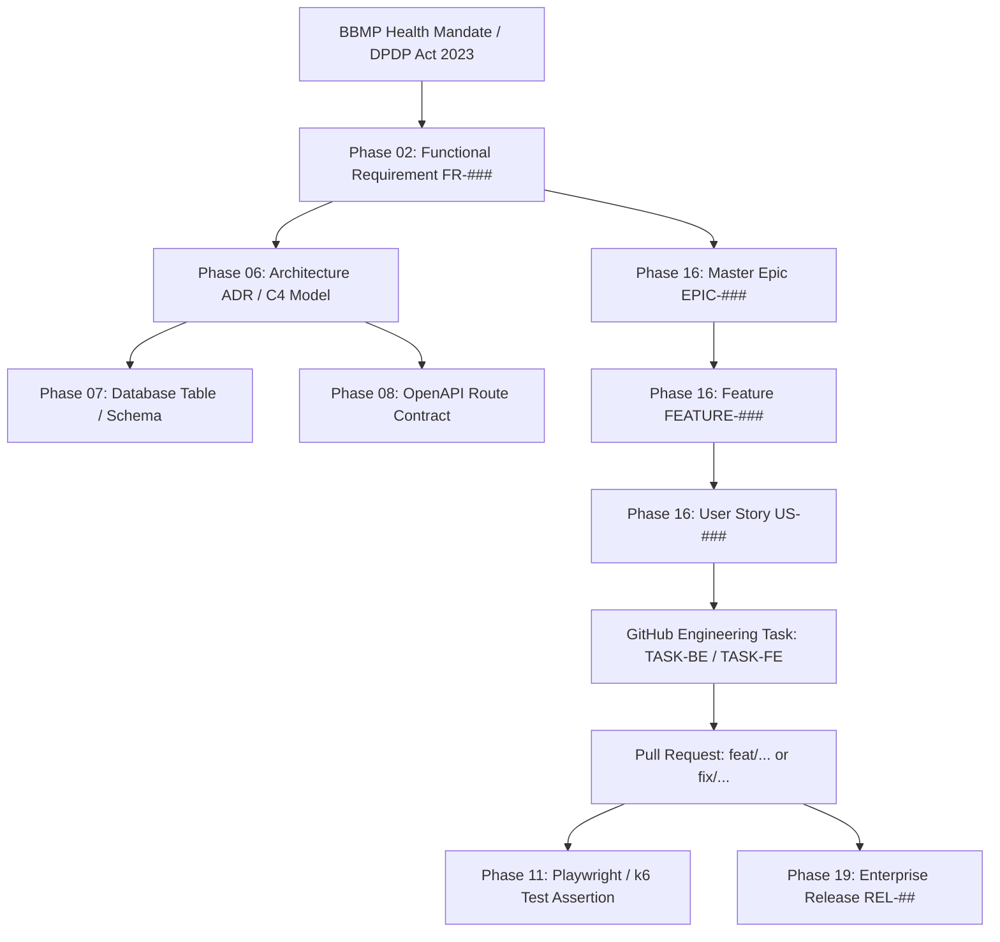

# Master Cross-Issue Linking, Traceability & Dependency Graph Architecture

Authoritative engineering governance specification establishing the bidirectional requirement-to-code traceability graph, dependency relationship verbs, cycle prevention algorithms, and automated orphan issue quarantine bots for the Namma Clinic Digital Health & Operations Platform across 450+ municipal clinics under the Greater Bengaluru Authority (GBA) and BBMP Health Department.

| Governance Attribute | Specification Value |
| :--- | :--- |
| **Document Identifier** | `DOC-GH-06-LINKING` |
| **Document Title** | Master Cross-Issue Linking, Traceability & Dependency Graph Architecture |
| **Document Version** | `1.0.0` |
| **Security Classification** | `RESTRICTED - GBA / BBMP HEALTH DEPARTMENT INTERNAL ONLY` |
| **Ratification Status** | `APPROVED & RATIFIED GOVERNANCE BASELINE` |
| **Program Domain** | Traceability Architecture, Graph Modeling & Dependency Management |
| **Target Audience** | Software Engineers, System Architects, Quality Leads, Release Engineers, Clinical SMEs |

## 1. Executive Summary & Graph Connectivity Intent
In an enterprise municipal healthcare platform touching 450+ clinics, software changes cannot occur in isolation. Every code commit, database migration, and test case must form an unbroken, verifiable graph edge tracing back to statutory healthcare mandates and clinical safety guidelines. Without rigorous linking invariants, dependency deadlocks and orphan changes jeopardize patient care.

This specification establishes:
1. **Standardized Relationship Taxonomy & Syntax Verbs:** Machine-parseable keywords (`Blocks:`, `Blocked by:`, `Decomposes into:`, `Closes:`, `Traced to requirement:`) governing all GitHub issues and pull requests.
2. **64 Authoritative Linking Rules (`LINK-001` through `LINK-064`):** Strict cardinality constraints, parent-child invariants, and automated pre-receive git hooks.
3. **114 End-to-End Traceability Chains (`TRACE-001` through `TRACE-114`):** Authoritative crosswalk bridging Phase 02 Requirements, Phase 06 Architecture, Phase 07 Database tables, Phase 16 Backlog, Phase 18 Sprints, and Phase 19 Releases.
4. **Dependency Graph Topology & Cycle Detection Algorithms:** Directed Acyclic Graph (DAG) mathematical validation preventing circular dependency deadlocks.
5. **Automated Orphan Detection & Quarantine Bot Specs:** Event-driven sweepers isolating unlinked tasks with `status/needs-refinement`.
6. **90 Linking Governance Acceptance Criteria (`AC-LINK-001` to `AC-LINK-090`):** Concrete audit gates certifying 100% graph connectivity and zero orphan tasks.

> [!IMPORTANT]
> **Bidirectional Traceability Mandate**
> Every Pull Request merged into the default branch MUST cite its parent User Story (`Closes: #123`), upstream Feature (`Part of: #456`), and verified Quality Gate (`Traced to gate: QG-###`). Merges violating this invariant are automatically blocked by the repository gatekeeper bot.

## 2. End-to-End Traceability Graph Architecture
The platform dependency topology forms an unyielding directed acyclic graph (DAG) spanning 8 architectural tiers:

### Architecture Diagram: Complete Traceability Chain Architecture


## 3. Standardized Relationship Verbs & Keyword Syntax
All issue descriptions, comments, and commit messages must utilize standardized relationship syntax recognized by automated graph parsers:

| Relationship Syntax | Semantic Meaning | Automation & Graph Action | Permitted Authors |
| :--- | :--- | :--- | :--- |
| `Blocks: #<id>` | Declares this issue as a hard prerequisite for downstream task. | Downstream card marked blocked; pull prohibited until parent closes. | Technical Leads |
| `Blocked by: #<id>` | Declares this issue waiting on external dependency or upstream code. | Card moves to blocked lane; triggers dependency watcher webhook. | Assigned Engineer |
| `Decomposes into: #<id>` | Parent container explicitly citing constituent child work items. | Establishes hierarchical containment edge in project board graph. | Product Managers |
| `Parent: #<id>` | Child work package citing parent container. | Mandatory in issue metadata block for all Tier 3, 4, and 5 items. | All Contributors |
| `Closes: #<id> / Fixes: #<id>` | Declares that PR merge satisfies acceptance criteria of target issue. | Automatically moves target issue to 'Ready for Release' upon merge. | PR Authors |
| `Relates to: #<id>` | Informational association without strict execution precedence. | Surfaces cross-reference in GitHub UI without modifying state. | All Contributors |
| `Traced to requirement: <id>` | Links task to authoritative SRS requirement in `docs/02-requirements/`. | Certified by automated compliance auditor during release packaging. | QA / Dev Leads |
| `Traced to architecture: <id>` | Links task to architectural decision record in `docs/06-architecture/`. | Required on architectural refactoring and database schema changes. | System Architects |

## 4. Authoritative Linking Rules Catalog (LINK-001 to LINK-064)
Comprehensive governance profiles for all 64 canonical linking rules governing platform work item relationships:

### LINK-001: Requirement (FR) -> Epic (Cardinality: N:1)
- **Rule Identifier:** `LINK-001`
- **Source Node Type:** `Requirement (FR)`
- **Target Node Type:** `Epic`
- **Cardinality Multiplicity:** `N:1`
- **Authoritative Syntax Expression:** `Requirement links to Epic` via metadata field or keyword
- **Enforcement Mechanism:** Pre-commit linting and automated PR description validator.

#### Validation Logic & Failure Protocol for LINK-001
1. **Pre-Receive Verification:** Git hooks and GitHub webhook handlers validate that referenced target `Epic` exists and is open/valid.
2. **Failure Consequence:** PR or issue creation rejected with explicit error message detailing missing `Epic` reference.
3. **Graph Consistency Guarantee:** Prevents dangling pointers, orphan entities, or unmonitored scope expansions.
4. **Audit Log Trail:** Edge creation and deletion are recorded in the immutable graph repository database.

#### Operational Guidelines for LINK-001
- **Engineer Responsibility:** Ensure all pull request descriptions include the ``Requirement links to Epic` via metadata field or keyword` clause in header metadata.
- **Scrum Master Check:** Verify during sprint review that all linked `Epic` items completed DoD before parent closure.
- **Clinical Advisory Gate:** If touching clinical domains, linking must trace through Chief Medical Officer sign-off.

#### Machine Parser Regex & Automation Hooks for LINK-001
- **Syntax Evaluation Regex:** `r"(?i)(?:LINK-001)\s*[:=]\s*(#[0-9]+|[A-Z]+-[0-9]+)"` applied during commit and PR linting.
- **Bot Remediation Response:** Issues failing `LINK-001` receive automated comment detailing missing `Epic` reference.
- **Webhook Propagation:** Edge creation dispatches real-time webhook to project management graph lakehouse.

### LINK-002: Requirement (FR) -> Feature (Cardinality: N:1)
- **Rule Identifier:** `LINK-002`
- **Source Node Type:** `Requirement (FR)`
- **Target Node Type:** `Feature`
- **Cardinality Multiplicity:** `N:1`
- **Authoritative Syntax Expression:** `Requirement links to Feature` via metadata field or keyword
- **Enforcement Mechanism:** Pre-commit linting and automated PR description validator.

#### Validation Logic & Failure Protocol for LINK-002
1. **Pre-Receive Verification:** Git hooks and GitHub webhook handlers validate that referenced target `Feature` exists and is open/valid.
2. **Failure Consequence:** PR or issue creation rejected with explicit error message detailing missing `Feature` reference.
3. **Graph Consistency Guarantee:** Prevents dangling pointers, orphan entities, or unmonitored scope expansions.
4. **Audit Log Trail:** Edge creation and deletion are recorded in the immutable graph repository database.

#### Operational Guidelines for LINK-002
- **Engineer Responsibility:** Ensure all pull request descriptions include the ``Requirement links to Feature` via metadata field or keyword` clause in header metadata.
- **Scrum Master Check:** Verify during sprint review that all linked `Feature` items completed DoD before parent closure.
- **Clinical Advisory Gate:** If touching clinical domains, linking must trace through Chief Medical Officer sign-off.

#### Machine Parser Regex & Automation Hooks for LINK-002
- **Syntax Evaluation Regex:** `r"(?i)(?:LINK-002)\s*[:=]\s*(#[0-9]+|[A-Z]+-[0-9]+)"` applied during commit and PR linting.
- **Bot Remediation Response:** Issues failing `LINK-002` receive automated comment detailing missing `Feature` reference.
- **Webhook Propagation:** Edge creation dispatches real-time webhook to project management graph lakehouse.

### LINK-003: Requirement (FR) -> User Story (Cardinality: N:1)
- **Rule Identifier:** `LINK-003`
- **Source Node Type:** `Requirement (FR)`
- **Target Node Type:** `User Story`
- **Cardinality Multiplicity:** `N:1`
- **Authoritative Syntax Expression:** `Requirement links to User` via metadata field or keyword
- **Enforcement Mechanism:** Pre-commit linting and automated PR description validator.

#### Validation Logic & Failure Protocol for LINK-003
1. **Pre-Receive Verification:** Git hooks and GitHub webhook handlers validate that referenced target `User Story` exists and is open/valid.
2. **Failure Consequence:** PR or issue creation rejected with explicit error message detailing missing `User Story` reference.
3. **Graph Consistency Guarantee:** Prevents dangling pointers, orphan entities, or unmonitored scope expansions.
4. **Audit Log Trail:** Edge creation and deletion are recorded in the immutable graph repository database.

#### Operational Guidelines for LINK-003
- **Engineer Responsibility:** Ensure all pull request descriptions include the ``Requirement links to User` via metadata field or keyword` clause in header metadata.
- **Scrum Master Check:** Verify during sprint review that all linked `User Story` items completed DoD before parent closure.
- **Clinical Advisory Gate:** If touching clinical domains, linking must trace through Chief Medical Officer sign-off.

#### Machine Parser Regex & Automation Hooks for LINK-003
- **Syntax Evaluation Regex:** `r"(?i)(?:LINK-003)\s*[:=]\s*(#[0-9]+|[A-Z]+-[0-9]+)"` applied during commit and PR linting.
- **Bot Remediation Response:** Issues failing `LINK-003` receive automated comment detailing missing `User Story` reference.
- **Webhook Propagation:** Edge creation dispatches real-time webhook to project management graph lakehouse.

### LINK-004: Requirement (FR) -> Task (Cardinality: N:1)
- **Rule Identifier:** `LINK-004`
- **Source Node Type:** `Requirement (FR)`
- **Target Node Type:** `Task`
- **Cardinality Multiplicity:** `N:1`
- **Authoritative Syntax Expression:** `Requirement links to Task` via metadata field or keyword
- **Enforcement Mechanism:** Pre-commit linting and automated PR description validator.

#### Validation Logic & Failure Protocol for LINK-004
1. **Pre-Receive Verification:** Git hooks and GitHub webhook handlers validate that referenced target `Task` exists and is open/valid.
2. **Failure Consequence:** PR or issue creation rejected with explicit error message detailing missing `Task` reference.
3. **Graph Consistency Guarantee:** Prevents dangling pointers, orphan entities, or unmonitored scope expansions.
4. **Audit Log Trail:** Edge creation and deletion are recorded in the immutable graph repository database.

#### Operational Guidelines for LINK-004
- **Engineer Responsibility:** Ensure all pull request descriptions include the ``Requirement links to Task` via metadata field or keyword` clause in header metadata.
- **Scrum Master Check:** Verify during sprint review that all linked `Task` items completed DoD before parent closure.
- **Clinical Advisory Gate:** If touching clinical domains, linking must trace through Chief Medical Officer sign-off.

#### Machine Parser Regex & Automation Hooks for LINK-004
- **Syntax Evaluation Regex:** `r"(?i)(?:LINK-004)\s*[:=]\s*(#[0-9]+|[A-Z]+-[0-9]+)"` applied during commit and PR linting.
- **Bot Remediation Response:** Issues failing `LINK-004` receive automated comment detailing missing `Task` reference.
- **Webhook Propagation:** Edge creation dispatches real-time webhook to project management graph lakehouse.

### LINK-005: Requirement (FR) -> PR (Cardinality: N:1)
- **Rule Identifier:** `LINK-005`
- **Source Node Type:** `Requirement (FR)`
- **Target Node Type:** `PR`
- **Cardinality Multiplicity:** `N:1`
- **Authoritative Syntax Expression:** `Requirement links to PR` via metadata field or keyword
- **Enforcement Mechanism:** Pre-commit linting and automated PR description validator.

#### Validation Logic & Failure Protocol for LINK-005
1. **Pre-Receive Verification:** Git hooks and GitHub webhook handlers validate that referenced target `PR` exists and is open/valid.
2. **Failure Consequence:** PR or issue creation rejected with explicit error message detailing missing `PR` reference.
3. **Graph Consistency Guarantee:** Prevents dangling pointers, orphan entities, or unmonitored scope expansions.
4. **Audit Log Trail:** Edge creation and deletion are recorded in the immutable graph repository database.

#### Operational Guidelines for LINK-005
- **Engineer Responsibility:** Ensure all pull request descriptions include the ``Requirement links to PR` via metadata field or keyword` clause in header metadata.
- **Scrum Master Check:** Verify during sprint review that all linked `PR` items completed DoD before parent closure.
- **Clinical Advisory Gate:** If touching clinical domains, linking must trace through Chief Medical Officer sign-off.

#### Machine Parser Regex & Automation Hooks for LINK-005
- **Syntax Evaluation Regex:** `r"(?i)(?:LINK-005)\s*[:=]\s*(#[0-9]+|[A-Z]+-[0-9]+)"` applied during commit and PR linting.
- **Bot Remediation Response:** Issues failing `LINK-005` receive automated comment detailing missing `PR` reference.
- **Webhook Propagation:** Edge creation dispatches real-time webhook to project management graph lakehouse.

### LINK-006: Requirement (FR) -> Test (Cardinality: N:1)
- **Rule Identifier:** `LINK-006`
- **Source Node Type:** `Requirement (FR)`
- **Target Node Type:** `Test`
- **Cardinality Multiplicity:** `N:1`
- **Authoritative Syntax Expression:** `Requirement links to Test` via metadata field or keyword
- **Enforcement Mechanism:** Pre-commit linting and automated PR description validator.

#### Validation Logic & Failure Protocol for LINK-006
1. **Pre-Receive Verification:** Git hooks and GitHub webhook handlers validate that referenced target `Test` exists and is open/valid.
2. **Failure Consequence:** PR or issue creation rejected with explicit error message detailing missing `Test` reference.
3. **Graph Consistency Guarantee:** Prevents dangling pointers, orphan entities, or unmonitored scope expansions.
4. **Audit Log Trail:** Edge creation and deletion are recorded in the immutable graph repository database.

#### Operational Guidelines for LINK-006
- **Engineer Responsibility:** Ensure all pull request descriptions include the ``Requirement links to Test` via metadata field or keyword` clause in header metadata.
- **Scrum Master Check:** Verify during sprint review that all linked `Test` items completed DoD before parent closure.
- **Clinical Advisory Gate:** If touching clinical domains, linking must trace through Chief Medical Officer sign-off.

#### Machine Parser Regex & Automation Hooks for LINK-006
- **Syntax Evaluation Regex:** `r"(?i)(?:LINK-006)\s*[:=]\s*(#[0-9]+|[A-Z]+-[0-9]+)"` applied during commit and PR linting.
- **Bot Remediation Response:** Issues failing `LINK-006` receive automated comment detailing missing `Test` reference.
- **Webhook Propagation:** Edge creation dispatches real-time webhook to project management graph lakehouse.

### LINK-007: Requirement (FR) -> Release (Cardinality: N:1)
- **Rule Identifier:** `LINK-007`
- **Source Node Type:** `Requirement (FR)`
- **Target Node Type:** `Release`
- **Cardinality Multiplicity:** `N:1`
- **Authoritative Syntax Expression:** `Requirement links to Release` via metadata field or keyword
- **Enforcement Mechanism:** Pre-commit linting and automated PR description validator.

#### Validation Logic & Failure Protocol for LINK-007
1. **Pre-Receive Verification:** Git hooks and GitHub webhook handlers validate that referenced target `Release` exists and is open/valid.
2. **Failure Consequence:** PR or issue creation rejected with explicit error message detailing missing `Release` reference.
3. **Graph Consistency Guarantee:** Prevents dangling pointers, orphan entities, or unmonitored scope expansions.
4. **Audit Log Trail:** Edge creation and deletion are recorded in the immutable graph repository database.

#### Operational Guidelines for LINK-007
- **Engineer Responsibility:** Ensure all pull request descriptions include the ``Requirement links to Release` via metadata field or keyword` clause in header metadata.
- **Scrum Master Check:** Verify during sprint review that all linked `Release` items completed DoD before parent closure.
- **Clinical Advisory Gate:** If touching clinical domains, linking must trace through Chief Medical Officer sign-off.

#### Machine Parser Regex & Automation Hooks for LINK-007
- **Syntax Evaluation Regex:** `r"(?i)(?:LINK-007)\s*[:=]\s*(#[0-9]+|[A-Z]+-[0-9]+)"` applied during commit and PR linting.
- **Bot Remediation Response:** Issues failing `LINK-007` receive automated comment detailing missing `Release` reference.
- **Webhook Propagation:** Edge creation dispatches real-time webhook to project management graph lakehouse.

### LINK-008: Requirement (FR) -> Milestone (Cardinality: N:1)
- **Rule Identifier:** `LINK-008`
- **Source Node Type:** `Requirement (FR)`
- **Target Node Type:** `Milestone`
- **Cardinality Multiplicity:** `N:1`
- **Authoritative Syntax Expression:** `Requirement links to Milestone` via metadata field or keyword
- **Enforcement Mechanism:** Pre-commit linting and automated PR description validator.

#### Validation Logic & Failure Protocol for LINK-008
1. **Pre-Receive Verification:** Git hooks and GitHub webhook handlers validate that referenced target `Milestone` exists and is open/valid.
2. **Failure Consequence:** PR or issue creation rejected with explicit error message detailing missing `Milestone` reference.
3. **Graph Consistency Guarantee:** Prevents dangling pointers, orphan entities, or unmonitored scope expansions.
4. **Audit Log Trail:** Edge creation and deletion are recorded in the immutable graph repository database.

#### Operational Guidelines for LINK-008
- **Engineer Responsibility:** Ensure all pull request descriptions include the ``Requirement links to Milestone` via metadata field or keyword` clause in header metadata.
- **Scrum Master Check:** Verify during sprint review that all linked `Milestone` items completed DoD before parent closure.
- **Clinical Advisory Gate:** If touching clinical domains, linking must trace through Chief Medical Officer sign-off.

#### Machine Parser Regex & Automation Hooks for LINK-008
- **Syntax Evaluation Regex:** `r"(?i)(?:LINK-008)\s*[:=]\s*(#[0-9]+|[A-Z]+-[0-9]+)"` applied during commit and PR linting.
- **Bot Remediation Response:** Issues failing `LINK-008` receive automated comment detailing missing `Milestone` reference.
- **Webhook Propagation:** Edge creation dispatches real-time webhook to project management graph lakehouse.

### LINK-009: Epic -> Epic (Cardinality: 1:N)
- **Rule Identifier:** `LINK-009`
- **Source Node Type:** `Epic`
- **Target Node Type:** `Epic`
- **Cardinality Multiplicity:** `1:N`
- **Authoritative Syntax Expression:** `Epic links to Epic` via metadata field or keyword
- **Enforcement Mechanism:** Pre-commit linting and automated PR description validator.

#### Validation Logic & Failure Protocol for LINK-009
1. **Pre-Receive Verification:** Git hooks and GitHub webhook handlers validate that referenced target `Epic` exists and is open/valid.
2. **Failure Consequence:** PR or issue creation rejected with explicit error message detailing missing `Epic` reference.
3. **Graph Consistency Guarantee:** Prevents dangling pointers, orphan entities, or unmonitored scope expansions.
4. **Audit Log Trail:** Edge creation and deletion are recorded in the immutable graph repository database.

#### Operational Guidelines for LINK-009
- **Engineer Responsibility:** Ensure all pull request descriptions include the ``Epic links to Epic` via metadata field or keyword` clause in header metadata.
- **Scrum Master Check:** Verify during sprint review that all linked `Epic` items completed DoD before parent closure.
- **Clinical Advisory Gate:** If touching clinical domains, linking must trace through Chief Medical Officer sign-off.

#### Machine Parser Regex & Automation Hooks for LINK-009
- **Syntax Evaluation Regex:** `r"(?i)(?:LINK-009)\s*[:=]\s*(#[0-9]+|[A-Z]+-[0-9]+)"` applied during commit and PR linting.
- **Bot Remediation Response:** Issues failing `LINK-009` receive automated comment detailing missing `Epic` reference.
- **Webhook Propagation:** Edge creation dispatches real-time webhook to project management graph lakehouse.

### LINK-010: Epic -> Feature (Cardinality: 1:N)
- **Rule Identifier:** `LINK-010`
- **Source Node Type:** `Epic`
- **Target Node Type:** `Feature`
- **Cardinality Multiplicity:** `1:N`
- **Authoritative Syntax Expression:** `Epic links to Feature` via metadata field or keyword
- **Enforcement Mechanism:** Pre-commit linting and automated PR description validator.

#### Validation Logic & Failure Protocol for LINK-010
1. **Pre-Receive Verification:** Git hooks and GitHub webhook handlers validate that referenced target `Feature` exists and is open/valid.
2. **Failure Consequence:** PR or issue creation rejected with explicit error message detailing missing `Feature` reference.
3. **Graph Consistency Guarantee:** Prevents dangling pointers, orphan entities, or unmonitored scope expansions.
4. **Audit Log Trail:** Edge creation and deletion are recorded in the immutable graph repository database.

#### Operational Guidelines for LINK-010
- **Engineer Responsibility:** Ensure all pull request descriptions include the ``Epic links to Feature` via metadata field or keyword` clause in header metadata.
- **Scrum Master Check:** Verify during sprint review that all linked `Feature` items completed DoD before parent closure.
- **Clinical Advisory Gate:** If touching clinical domains, linking must trace through Chief Medical Officer sign-off.

#### Machine Parser Regex & Automation Hooks for LINK-010
- **Syntax Evaluation Regex:** `r"(?i)(?:LINK-010)\s*[:=]\s*(#[0-9]+|[A-Z]+-[0-9]+)"` applied during commit and PR linting.
- **Bot Remediation Response:** Issues failing `LINK-010` receive automated comment detailing missing `Feature` reference.
- **Webhook Propagation:** Edge creation dispatches real-time webhook to project management graph lakehouse.

### LINK-011: Epic -> User Story (Cardinality: 1:N)
- **Rule Identifier:** `LINK-011`
- **Source Node Type:** `Epic`
- **Target Node Type:** `User Story`
- **Cardinality Multiplicity:** `1:N`
- **Authoritative Syntax Expression:** `Epic links to User` via metadata field or keyword
- **Enforcement Mechanism:** Pre-commit linting and automated PR description validator.

#### Validation Logic & Failure Protocol for LINK-011
1. **Pre-Receive Verification:** Git hooks and GitHub webhook handlers validate that referenced target `User Story` exists and is open/valid.
2. **Failure Consequence:** PR or issue creation rejected with explicit error message detailing missing `User Story` reference.
3. **Graph Consistency Guarantee:** Prevents dangling pointers, orphan entities, or unmonitored scope expansions.
4. **Audit Log Trail:** Edge creation and deletion are recorded in the immutable graph repository database.

#### Operational Guidelines for LINK-011
- **Engineer Responsibility:** Ensure all pull request descriptions include the ``Epic links to User` via metadata field or keyword` clause in header metadata.
- **Scrum Master Check:** Verify during sprint review that all linked `User Story` items completed DoD before parent closure.
- **Clinical Advisory Gate:** If touching clinical domains, linking must trace through Chief Medical Officer sign-off.

#### Machine Parser Regex & Automation Hooks for LINK-011
- **Syntax Evaluation Regex:** `r"(?i)(?:LINK-011)\s*[:=]\s*(#[0-9]+|[A-Z]+-[0-9]+)"` applied during commit and PR linting.
- **Bot Remediation Response:** Issues failing `LINK-011` receive automated comment detailing missing `User Story` reference.
- **Webhook Propagation:** Edge creation dispatches real-time webhook to project management graph lakehouse.

### LINK-012: Epic -> Task (Cardinality: 1:N)
- **Rule Identifier:** `LINK-012`
- **Source Node Type:** `Epic`
- **Target Node Type:** `Task`
- **Cardinality Multiplicity:** `1:N`
- **Authoritative Syntax Expression:** `Epic links to Task` via metadata field or keyword
- **Enforcement Mechanism:** Pre-commit linting and automated PR description validator.

#### Validation Logic & Failure Protocol for LINK-012
1. **Pre-Receive Verification:** Git hooks and GitHub webhook handlers validate that referenced target `Task` exists and is open/valid.
2. **Failure Consequence:** PR or issue creation rejected with explicit error message detailing missing `Task` reference.
3. **Graph Consistency Guarantee:** Prevents dangling pointers, orphan entities, or unmonitored scope expansions.
4. **Audit Log Trail:** Edge creation and deletion are recorded in the immutable graph repository database.

#### Operational Guidelines for LINK-012
- **Engineer Responsibility:** Ensure all pull request descriptions include the ``Epic links to Task` via metadata field or keyword` clause in header metadata.
- **Scrum Master Check:** Verify during sprint review that all linked `Task` items completed DoD before parent closure.
- **Clinical Advisory Gate:** If touching clinical domains, linking must trace through Chief Medical Officer sign-off.

#### Machine Parser Regex & Automation Hooks for LINK-012
- **Syntax Evaluation Regex:** `r"(?i)(?:LINK-012)\s*[:=]\s*(#[0-9]+|[A-Z]+-[0-9]+)"` applied during commit and PR linting.
- **Bot Remediation Response:** Issues failing `LINK-012` receive automated comment detailing missing `Task` reference.
- **Webhook Propagation:** Edge creation dispatches real-time webhook to project management graph lakehouse.

### LINK-013: Epic -> PR (Cardinality: 1:N)
- **Rule Identifier:** `LINK-013`
- **Source Node Type:** `Epic`
- **Target Node Type:** `PR`
- **Cardinality Multiplicity:** `1:N`
- **Authoritative Syntax Expression:** `Epic links to PR` via metadata field or keyword
- **Enforcement Mechanism:** Pre-commit linting and automated PR description validator.

#### Validation Logic & Failure Protocol for LINK-013
1. **Pre-Receive Verification:** Git hooks and GitHub webhook handlers validate that referenced target `PR` exists and is open/valid.
2. **Failure Consequence:** PR or issue creation rejected with explicit error message detailing missing `PR` reference.
3. **Graph Consistency Guarantee:** Prevents dangling pointers, orphan entities, or unmonitored scope expansions.
4. **Audit Log Trail:** Edge creation and deletion are recorded in the immutable graph repository database.

#### Operational Guidelines for LINK-013
- **Engineer Responsibility:** Ensure all pull request descriptions include the ``Epic links to PR` via metadata field or keyword` clause in header metadata.
- **Scrum Master Check:** Verify during sprint review that all linked `PR` items completed DoD before parent closure.
- **Clinical Advisory Gate:** If touching clinical domains, linking must trace through Chief Medical Officer sign-off.

#### Machine Parser Regex & Automation Hooks for LINK-013
- **Syntax Evaluation Regex:** `r"(?i)(?:LINK-013)\s*[:=]\s*(#[0-9]+|[A-Z]+-[0-9]+)"` applied during commit and PR linting.
- **Bot Remediation Response:** Issues failing `LINK-013` receive automated comment detailing missing `PR` reference.
- **Webhook Propagation:** Edge creation dispatches real-time webhook to project management graph lakehouse.

### LINK-014: Epic -> Test (Cardinality: 1:N)
- **Rule Identifier:** `LINK-014`
- **Source Node Type:** `Epic`
- **Target Node Type:** `Test`
- **Cardinality Multiplicity:** `1:N`
- **Authoritative Syntax Expression:** `Epic links to Test` via metadata field or keyword
- **Enforcement Mechanism:** Pre-commit linting and automated PR description validator.

#### Validation Logic & Failure Protocol for LINK-014
1. **Pre-Receive Verification:** Git hooks and GitHub webhook handlers validate that referenced target `Test` exists and is open/valid.
2. **Failure Consequence:** PR or issue creation rejected with explicit error message detailing missing `Test` reference.
3. **Graph Consistency Guarantee:** Prevents dangling pointers, orphan entities, or unmonitored scope expansions.
4. **Audit Log Trail:** Edge creation and deletion are recorded in the immutable graph repository database.

#### Operational Guidelines for LINK-014
- **Engineer Responsibility:** Ensure all pull request descriptions include the ``Epic links to Test` via metadata field or keyword` clause in header metadata.
- **Scrum Master Check:** Verify during sprint review that all linked `Test` items completed DoD before parent closure.
- **Clinical Advisory Gate:** If touching clinical domains, linking must trace through Chief Medical Officer sign-off.

#### Machine Parser Regex & Automation Hooks for LINK-014
- **Syntax Evaluation Regex:** `r"(?i)(?:LINK-014)\s*[:=]\s*(#[0-9]+|[A-Z]+-[0-9]+)"` applied during commit and PR linting.
- **Bot Remediation Response:** Issues failing `LINK-014` receive automated comment detailing missing `Test` reference.
- **Webhook Propagation:** Edge creation dispatches real-time webhook to project management graph lakehouse.

### LINK-015: Epic -> Release (Cardinality: 1:N)
- **Rule Identifier:** `LINK-015`
- **Source Node Type:** `Epic`
- **Target Node Type:** `Release`
- **Cardinality Multiplicity:** `1:N`
- **Authoritative Syntax Expression:** `Epic links to Release` via metadata field or keyword
- **Enforcement Mechanism:** Pre-commit linting and automated PR description validator.

#### Validation Logic & Failure Protocol for LINK-015
1. **Pre-Receive Verification:** Git hooks and GitHub webhook handlers validate that referenced target `Release` exists and is open/valid.
2. **Failure Consequence:** PR or issue creation rejected with explicit error message detailing missing `Release` reference.
3. **Graph Consistency Guarantee:** Prevents dangling pointers, orphan entities, or unmonitored scope expansions.
4. **Audit Log Trail:** Edge creation and deletion are recorded in the immutable graph repository database.

#### Operational Guidelines for LINK-015
- **Engineer Responsibility:** Ensure all pull request descriptions include the ``Epic links to Release` via metadata field or keyword` clause in header metadata.
- **Scrum Master Check:** Verify during sprint review that all linked `Release` items completed DoD before parent closure.
- **Clinical Advisory Gate:** If touching clinical domains, linking must trace through Chief Medical Officer sign-off.

#### Machine Parser Regex & Automation Hooks for LINK-015
- **Syntax Evaluation Regex:** `r"(?i)(?:LINK-015)\s*[:=]\s*(#[0-9]+|[A-Z]+-[0-9]+)"` applied during commit and PR linting.
- **Bot Remediation Response:** Issues failing `LINK-015` receive automated comment detailing missing `Release` reference.
- **Webhook Propagation:** Edge creation dispatches real-time webhook to project management graph lakehouse.

### LINK-016: Epic -> Milestone (Cardinality: 1:N)
- **Rule Identifier:** `LINK-016`
- **Source Node Type:** `Epic`
- **Target Node Type:** `Milestone`
- **Cardinality Multiplicity:** `1:N`
- **Authoritative Syntax Expression:** `Epic links to Milestone` via metadata field or keyword
- **Enforcement Mechanism:** Pre-commit linting and automated PR description validator.

#### Validation Logic & Failure Protocol for LINK-016
1. **Pre-Receive Verification:** Git hooks and GitHub webhook handlers validate that referenced target `Milestone` exists and is open/valid.
2. **Failure Consequence:** PR or issue creation rejected with explicit error message detailing missing `Milestone` reference.
3. **Graph Consistency Guarantee:** Prevents dangling pointers, orphan entities, or unmonitored scope expansions.
4. **Audit Log Trail:** Edge creation and deletion are recorded in the immutable graph repository database.

#### Operational Guidelines for LINK-016
- **Engineer Responsibility:** Ensure all pull request descriptions include the ``Epic links to Milestone` via metadata field or keyword` clause in header metadata.
- **Scrum Master Check:** Verify during sprint review that all linked `Milestone` items completed DoD before parent closure.
- **Clinical Advisory Gate:** If touching clinical domains, linking must trace through Chief Medical Officer sign-off.

#### Machine Parser Regex & Automation Hooks for LINK-016
- **Syntax Evaluation Regex:** `r"(?i)(?:LINK-016)\s*[:=]\s*(#[0-9]+|[A-Z]+-[0-9]+)"` applied during commit and PR linting.
- **Bot Remediation Response:** Issues failing `LINK-016` receive automated comment detailing missing `Milestone` reference.
- **Webhook Propagation:** Edge creation dispatches real-time webhook to project management graph lakehouse.

### LINK-017: Feature -> Epic (Cardinality: 1:N)
- **Rule Identifier:** `LINK-017`
- **Source Node Type:** `Feature`
- **Target Node Type:** `Epic`
- **Cardinality Multiplicity:** `1:N`
- **Authoritative Syntax Expression:** `Feature links to Epic` via metadata field or keyword
- **Enforcement Mechanism:** Pre-commit linting and automated PR description validator.

#### Validation Logic & Failure Protocol for LINK-017
1. **Pre-Receive Verification:** Git hooks and GitHub webhook handlers validate that referenced target `Epic` exists and is open/valid.
2. **Failure Consequence:** PR or issue creation rejected with explicit error message detailing missing `Epic` reference.
3. **Graph Consistency Guarantee:** Prevents dangling pointers, orphan entities, or unmonitored scope expansions.
4. **Audit Log Trail:** Edge creation and deletion are recorded in the immutable graph repository database.

#### Operational Guidelines for LINK-017
- **Engineer Responsibility:** Ensure all pull request descriptions include the ``Feature links to Epic` via metadata field or keyword` clause in header metadata.
- **Scrum Master Check:** Verify during sprint review that all linked `Epic` items completed DoD before parent closure.
- **Clinical Advisory Gate:** If touching clinical domains, linking must trace through Chief Medical Officer sign-off.

#### Machine Parser Regex & Automation Hooks for LINK-017
- **Syntax Evaluation Regex:** `r"(?i)(?:LINK-017)\s*[:=]\s*(#[0-9]+|[A-Z]+-[0-9]+)"` applied during commit and PR linting.
- **Bot Remediation Response:** Issues failing `LINK-017` receive automated comment detailing missing `Epic` reference.
- **Webhook Propagation:** Edge creation dispatches real-time webhook to project management graph lakehouse.

### LINK-018: Feature -> Feature (Cardinality: 1:N)
- **Rule Identifier:** `LINK-018`
- **Source Node Type:** `Feature`
- **Target Node Type:** `Feature`
- **Cardinality Multiplicity:** `1:N`
- **Authoritative Syntax Expression:** `Feature links to Feature` via metadata field or keyword
- **Enforcement Mechanism:** Pre-commit linting and automated PR description validator.

#### Validation Logic & Failure Protocol for LINK-018
1. **Pre-Receive Verification:** Git hooks and GitHub webhook handlers validate that referenced target `Feature` exists and is open/valid.
2. **Failure Consequence:** PR or issue creation rejected with explicit error message detailing missing `Feature` reference.
3. **Graph Consistency Guarantee:** Prevents dangling pointers, orphan entities, or unmonitored scope expansions.
4. **Audit Log Trail:** Edge creation and deletion are recorded in the immutable graph repository database.

#### Operational Guidelines for LINK-018
- **Engineer Responsibility:** Ensure all pull request descriptions include the ``Feature links to Feature` via metadata field or keyword` clause in header metadata.
- **Scrum Master Check:** Verify during sprint review that all linked `Feature` items completed DoD before parent closure.
- **Clinical Advisory Gate:** If touching clinical domains, linking must trace through Chief Medical Officer sign-off.

#### Machine Parser Regex & Automation Hooks for LINK-018
- **Syntax Evaluation Regex:** `r"(?i)(?:LINK-018)\s*[:=]\s*(#[0-9]+|[A-Z]+-[0-9]+)"` applied during commit and PR linting.
- **Bot Remediation Response:** Issues failing `LINK-018` receive automated comment detailing missing `Feature` reference.
- **Webhook Propagation:** Edge creation dispatches real-time webhook to project management graph lakehouse.

### LINK-019: Feature -> User Story (Cardinality: 1:N)
- **Rule Identifier:** `LINK-019`
- **Source Node Type:** `Feature`
- **Target Node Type:** `User Story`
- **Cardinality Multiplicity:** `1:N`
- **Authoritative Syntax Expression:** `Feature links to User` via metadata field or keyword
- **Enforcement Mechanism:** Pre-commit linting and automated PR description validator.

#### Validation Logic & Failure Protocol for LINK-019
1. **Pre-Receive Verification:** Git hooks and GitHub webhook handlers validate that referenced target `User Story` exists and is open/valid.
2. **Failure Consequence:** PR or issue creation rejected with explicit error message detailing missing `User Story` reference.
3. **Graph Consistency Guarantee:** Prevents dangling pointers, orphan entities, or unmonitored scope expansions.
4. **Audit Log Trail:** Edge creation and deletion are recorded in the immutable graph repository database.

#### Operational Guidelines for LINK-019
- **Engineer Responsibility:** Ensure all pull request descriptions include the ``Feature links to User` via metadata field or keyword` clause in header metadata.
- **Scrum Master Check:** Verify during sprint review that all linked `User Story` items completed DoD before parent closure.
- **Clinical Advisory Gate:** If touching clinical domains, linking must trace through Chief Medical Officer sign-off.

#### Machine Parser Regex & Automation Hooks for LINK-019
- **Syntax Evaluation Regex:** `r"(?i)(?:LINK-019)\s*[:=]\s*(#[0-9]+|[A-Z]+-[0-9]+)"` applied during commit and PR linting.
- **Bot Remediation Response:** Issues failing `LINK-019` receive automated comment detailing missing `User Story` reference.
- **Webhook Propagation:** Edge creation dispatches real-time webhook to project management graph lakehouse.

### LINK-020: Feature -> Task (Cardinality: 1:N)
- **Rule Identifier:** `LINK-020`
- **Source Node Type:** `Feature`
- **Target Node Type:** `Task`
- **Cardinality Multiplicity:** `1:N`
- **Authoritative Syntax Expression:** `Feature links to Task` via metadata field or keyword
- **Enforcement Mechanism:** Pre-commit linting and automated PR description validator.

#### Validation Logic & Failure Protocol for LINK-020
1. **Pre-Receive Verification:** Git hooks and GitHub webhook handlers validate that referenced target `Task` exists and is open/valid.
2. **Failure Consequence:** PR or issue creation rejected with explicit error message detailing missing `Task` reference.
3. **Graph Consistency Guarantee:** Prevents dangling pointers, orphan entities, or unmonitored scope expansions.
4. **Audit Log Trail:** Edge creation and deletion are recorded in the immutable graph repository database.

#### Operational Guidelines for LINK-020
- **Engineer Responsibility:** Ensure all pull request descriptions include the ``Feature links to Task` via metadata field or keyword` clause in header metadata.
- **Scrum Master Check:** Verify during sprint review that all linked `Task` items completed DoD before parent closure.
- **Clinical Advisory Gate:** If touching clinical domains, linking must trace through Chief Medical Officer sign-off.

#### Machine Parser Regex & Automation Hooks for LINK-020
- **Syntax Evaluation Regex:** `r"(?i)(?:LINK-020)\s*[:=]\s*(#[0-9]+|[A-Z]+-[0-9]+)"` applied during commit and PR linting.
- **Bot Remediation Response:** Issues failing `LINK-020` receive automated comment detailing missing `Task` reference.
- **Webhook Propagation:** Edge creation dispatches real-time webhook to project management graph lakehouse.

### LINK-021: Feature -> PR (Cardinality: 1:N)
- **Rule Identifier:** `LINK-021`
- **Source Node Type:** `Feature`
- **Target Node Type:** `PR`
- **Cardinality Multiplicity:** `1:N`
- **Authoritative Syntax Expression:** `Feature links to PR` via metadata field or keyword
- **Enforcement Mechanism:** Pre-commit linting and automated PR description validator.

#### Validation Logic & Failure Protocol for LINK-021
1. **Pre-Receive Verification:** Git hooks and GitHub webhook handlers validate that referenced target `PR` exists and is open/valid.
2. **Failure Consequence:** PR or issue creation rejected with explicit error message detailing missing `PR` reference.
3. **Graph Consistency Guarantee:** Prevents dangling pointers, orphan entities, or unmonitored scope expansions.
4. **Audit Log Trail:** Edge creation and deletion are recorded in the immutable graph repository database.

#### Operational Guidelines for LINK-021
- **Engineer Responsibility:** Ensure all pull request descriptions include the ``Feature links to PR` via metadata field or keyword` clause in header metadata.
- **Scrum Master Check:** Verify during sprint review that all linked `PR` items completed DoD before parent closure.
- **Clinical Advisory Gate:** If touching clinical domains, linking must trace through Chief Medical Officer sign-off.

#### Machine Parser Regex & Automation Hooks for LINK-021
- **Syntax Evaluation Regex:** `r"(?i)(?:LINK-021)\s*[:=]\s*(#[0-9]+|[A-Z]+-[0-9]+)"` applied during commit and PR linting.
- **Bot Remediation Response:** Issues failing `LINK-021` receive automated comment detailing missing `PR` reference.
- **Webhook Propagation:** Edge creation dispatches real-time webhook to project management graph lakehouse.

### LINK-022: Feature -> Test (Cardinality: 1:N)
- **Rule Identifier:** `LINK-022`
- **Source Node Type:** `Feature`
- **Target Node Type:** `Test`
- **Cardinality Multiplicity:** `1:N`
- **Authoritative Syntax Expression:** `Feature links to Test` via metadata field or keyword
- **Enforcement Mechanism:** Pre-commit linting and automated PR description validator.

#### Validation Logic & Failure Protocol for LINK-022
1. **Pre-Receive Verification:** Git hooks and GitHub webhook handlers validate that referenced target `Test` exists and is open/valid.
2. **Failure Consequence:** PR or issue creation rejected with explicit error message detailing missing `Test` reference.
3. **Graph Consistency Guarantee:** Prevents dangling pointers, orphan entities, or unmonitored scope expansions.
4. **Audit Log Trail:** Edge creation and deletion are recorded in the immutable graph repository database.

#### Operational Guidelines for LINK-022
- **Engineer Responsibility:** Ensure all pull request descriptions include the ``Feature links to Test` via metadata field or keyword` clause in header metadata.
- **Scrum Master Check:** Verify during sprint review that all linked `Test` items completed DoD before parent closure.
- **Clinical Advisory Gate:** If touching clinical domains, linking must trace through Chief Medical Officer sign-off.

#### Machine Parser Regex & Automation Hooks for LINK-022
- **Syntax Evaluation Regex:** `r"(?i)(?:LINK-022)\s*[:=]\s*(#[0-9]+|[A-Z]+-[0-9]+)"` applied during commit and PR linting.
- **Bot Remediation Response:** Issues failing `LINK-022` receive automated comment detailing missing `Test` reference.
- **Webhook Propagation:** Edge creation dispatches real-time webhook to project management graph lakehouse.

### LINK-023: Feature -> Release (Cardinality: 1:N)
- **Rule Identifier:** `LINK-023`
- **Source Node Type:** `Feature`
- **Target Node Type:** `Release`
- **Cardinality Multiplicity:** `1:N`
- **Authoritative Syntax Expression:** `Feature links to Release` via metadata field or keyword
- **Enforcement Mechanism:** Pre-commit linting and automated PR description validator.

#### Validation Logic & Failure Protocol for LINK-023
1. **Pre-Receive Verification:** Git hooks and GitHub webhook handlers validate that referenced target `Release` exists and is open/valid.
2. **Failure Consequence:** PR or issue creation rejected with explicit error message detailing missing `Release` reference.
3. **Graph Consistency Guarantee:** Prevents dangling pointers, orphan entities, or unmonitored scope expansions.
4. **Audit Log Trail:** Edge creation and deletion are recorded in the immutable graph repository database.

#### Operational Guidelines for LINK-023
- **Engineer Responsibility:** Ensure all pull request descriptions include the ``Feature links to Release` via metadata field or keyword` clause in header metadata.
- **Scrum Master Check:** Verify during sprint review that all linked `Release` items completed DoD before parent closure.
- **Clinical Advisory Gate:** If touching clinical domains, linking must trace through Chief Medical Officer sign-off.

#### Machine Parser Regex & Automation Hooks for LINK-023
- **Syntax Evaluation Regex:** `r"(?i)(?:LINK-023)\s*[:=]\s*(#[0-9]+|[A-Z]+-[0-9]+)"` applied during commit and PR linting.
- **Bot Remediation Response:** Issues failing `LINK-023` receive automated comment detailing missing `Release` reference.
- **Webhook Propagation:** Edge creation dispatches real-time webhook to project management graph lakehouse.

### LINK-024: Feature -> Milestone (Cardinality: 1:N)
- **Rule Identifier:** `LINK-024`
- **Source Node Type:** `Feature`
- **Target Node Type:** `Milestone`
- **Cardinality Multiplicity:** `1:N`
- **Authoritative Syntax Expression:** `Feature links to Milestone` via metadata field or keyword
- **Enforcement Mechanism:** Pre-commit linting and automated PR description validator.

#### Validation Logic & Failure Protocol for LINK-024
1. **Pre-Receive Verification:** Git hooks and GitHub webhook handlers validate that referenced target `Milestone` exists and is open/valid.
2. **Failure Consequence:** PR or issue creation rejected with explicit error message detailing missing `Milestone` reference.
3. **Graph Consistency Guarantee:** Prevents dangling pointers, orphan entities, or unmonitored scope expansions.
4. **Audit Log Trail:** Edge creation and deletion are recorded in the immutable graph repository database.

#### Operational Guidelines for LINK-024
- **Engineer Responsibility:** Ensure all pull request descriptions include the ``Feature links to Milestone` via metadata field or keyword` clause in header metadata.
- **Scrum Master Check:** Verify during sprint review that all linked `Milestone` items completed DoD before parent closure.
- **Clinical Advisory Gate:** If touching clinical domains, linking must trace through Chief Medical Officer sign-off.

#### Machine Parser Regex & Automation Hooks for LINK-024
- **Syntax Evaluation Regex:** `r"(?i)(?:LINK-024)\s*[:=]\s*(#[0-9]+|[A-Z]+-[0-9]+)"` applied during commit and PR linting.
- **Bot Remediation Response:** Issues failing `LINK-024` receive automated comment detailing missing `Milestone` reference.
- **Webhook Propagation:** Edge creation dispatches real-time webhook to project management graph lakehouse.

### LINK-025: User Story -> Epic (Cardinality: N:1)
- **Rule Identifier:** `LINK-025`
- **Source Node Type:** `User Story`
- **Target Node Type:** `Epic`
- **Cardinality Multiplicity:** `N:1`
- **Authoritative Syntax Expression:** `User links to Epic` via metadata field or keyword
- **Enforcement Mechanism:** Pre-commit linting and automated PR description validator.

#### Validation Logic & Failure Protocol for LINK-025
1. **Pre-Receive Verification:** Git hooks and GitHub webhook handlers validate that referenced target `Epic` exists and is open/valid.
2. **Failure Consequence:** PR or issue creation rejected with explicit error message detailing missing `Epic` reference.
3. **Graph Consistency Guarantee:** Prevents dangling pointers, orphan entities, or unmonitored scope expansions.
4. **Audit Log Trail:** Edge creation and deletion are recorded in the immutable graph repository database.

#### Operational Guidelines for LINK-025
- **Engineer Responsibility:** Ensure all pull request descriptions include the ``User links to Epic` via metadata field or keyword` clause in header metadata.
- **Scrum Master Check:** Verify during sprint review that all linked `Epic` items completed DoD before parent closure.
- **Clinical Advisory Gate:** If touching clinical domains, linking must trace through Chief Medical Officer sign-off.

#### Machine Parser Regex & Automation Hooks for LINK-025
- **Syntax Evaluation Regex:** `r"(?i)(?:LINK-025)\s*[:=]\s*(#[0-9]+|[A-Z]+-[0-9]+)"` applied during commit and PR linting.
- **Bot Remediation Response:** Issues failing `LINK-025` receive automated comment detailing missing `Epic` reference.
- **Webhook Propagation:** Edge creation dispatches real-time webhook to project management graph lakehouse.

### LINK-026: User Story -> Feature (Cardinality: N:1)
- **Rule Identifier:** `LINK-026`
- **Source Node Type:** `User Story`
- **Target Node Type:** `Feature`
- **Cardinality Multiplicity:** `N:1`
- **Authoritative Syntax Expression:** `User links to Feature` via metadata field or keyword
- **Enforcement Mechanism:** Pre-commit linting and automated PR description validator.

#### Validation Logic & Failure Protocol for LINK-026
1. **Pre-Receive Verification:** Git hooks and GitHub webhook handlers validate that referenced target `Feature` exists and is open/valid.
2. **Failure Consequence:** PR or issue creation rejected with explicit error message detailing missing `Feature` reference.
3. **Graph Consistency Guarantee:** Prevents dangling pointers, orphan entities, or unmonitored scope expansions.
4. **Audit Log Trail:** Edge creation and deletion are recorded in the immutable graph repository database.

#### Operational Guidelines for LINK-026
- **Engineer Responsibility:** Ensure all pull request descriptions include the ``User links to Feature` via metadata field or keyword` clause in header metadata.
- **Scrum Master Check:** Verify during sprint review that all linked `Feature` items completed DoD before parent closure.
- **Clinical Advisory Gate:** If touching clinical domains, linking must trace through Chief Medical Officer sign-off.

#### Machine Parser Regex & Automation Hooks for LINK-026
- **Syntax Evaluation Regex:** `r"(?i)(?:LINK-026)\s*[:=]\s*(#[0-9]+|[A-Z]+-[0-9]+)"` applied during commit and PR linting.
- **Bot Remediation Response:** Issues failing `LINK-026` receive automated comment detailing missing `Feature` reference.
- **Webhook Propagation:** Edge creation dispatches real-time webhook to project management graph lakehouse.

### LINK-027: User Story -> User Story (Cardinality: N:1)
- **Rule Identifier:** `LINK-027`
- **Source Node Type:** `User Story`
- **Target Node Type:** `User Story`
- **Cardinality Multiplicity:** `N:1`
- **Authoritative Syntax Expression:** `User links to User` via metadata field or keyword
- **Enforcement Mechanism:** Pre-commit linting and automated PR description validator.

#### Validation Logic & Failure Protocol for LINK-027
1. **Pre-Receive Verification:** Git hooks and GitHub webhook handlers validate that referenced target `User Story` exists and is open/valid.
2. **Failure Consequence:** PR or issue creation rejected with explicit error message detailing missing `User Story` reference.
3. **Graph Consistency Guarantee:** Prevents dangling pointers, orphan entities, or unmonitored scope expansions.
4. **Audit Log Trail:** Edge creation and deletion are recorded in the immutable graph repository database.

#### Operational Guidelines for LINK-027
- **Engineer Responsibility:** Ensure all pull request descriptions include the ``User links to User` via metadata field or keyword` clause in header metadata.
- **Scrum Master Check:** Verify during sprint review that all linked `User Story` items completed DoD before parent closure.
- **Clinical Advisory Gate:** If touching clinical domains, linking must trace through Chief Medical Officer sign-off.

#### Machine Parser Regex & Automation Hooks for LINK-027
- **Syntax Evaluation Regex:** `r"(?i)(?:LINK-027)\s*[:=]\s*(#[0-9]+|[A-Z]+-[0-9]+)"` applied during commit and PR linting.
- **Bot Remediation Response:** Issues failing `LINK-027` receive automated comment detailing missing `User Story` reference.
- **Webhook Propagation:** Edge creation dispatches real-time webhook to project management graph lakehouse.

### LINK-028: User Story -> Task (Cardinality: N:1)
- **Rule Identifier:** `LINK-028`
- **Source Node Type:** `User Story`
- **Target Node Type:** `Task`
- **Cardinality Multiplicity:** `N:1`
- **Authoritative Syntax Expression:** `User links to Task` via metadata field or keyword
- **Enforcement Mechanism:** Pre-commit linting and automated PR description validator.

#### Validation Logic & Failure Protocol for LINK-028
1. **Pre-Receive Verification:** Git hooks and GitHub webhook handlers validate that referenced target `Task` exists and is open/valid.
2. **Failure Consequence:** PR or issue creation rejected with explicit error message detailing missing `Task` reference.
3. **Graph Consistency Guarantee:** Prevents dangling pointers, orphan entities, or unmonitored scope expansions.
4. **Audit Log Trail:** Edge creation and deletion are recorded in the immutable graph repository database.

#### Operational Guidelines for LINK-028
- **Engineer Responsibility:** Ensure all pull request descriptions include the ``User links to Task` via metadata field or keyword` clause in header metadata.
- **Scrum Master Check:** Verify during sprint review that all linked `Task` items completed DoD before parent closure.
- **Clinical Advisory Gate:** If touching clinical domains, linking must trace through Chief Medical Officer sign-off.

#### Machine Parser Regex & Automation Hooks for LINK-028
- **Syntax Evaluation Regex:** `r"(?i)(?:LINK-028)\s*[:=]\s*(#[0-9]+|[A-Z]+-[0-9]+)"` applied during commit and PR linting.
- **Bot Remediation Response:** Issues failing `LINK-028` receive automated comment detailing missing `Task` reference.
- **Webhook Propagation:** Edge creation dispatches real-time webhook to project management graph lakehouse.

### LINK-029: User Story -> PR (Cardinality: N:1)
- **Rule Identifier:** `LINK-029`
- **Source Node Type:** `User Story`
- **Target Node Type:** `PR`
- **Cardinality Multiplicity:** `N:1`
- **Authoritative Syntax Expression:** `User links to PR` via metadata field or keyword
- **Enforcement Mechanism:** Pre-commit linting and automated PR description validator.

#### Validation Logic & Failure Protocol for LINK-029
1. **Pre-Receive Verification:** Git hooks and GitHub webhook handlers validate that referenced target `PR` exists and is open/valid.
2. **Failure Consequence:** PR or issue creation rejected with explicit error message detailing missing `PR` reference.
3. **Graph Consistency Guarantee:** Prevents dangling pointers, orphan entities, or unmonitored scope expansions.
4. **Audit Log Trail:** Edge creation and deletion are recorded in the immutable graph repository database.

#### Operational Guidelines for LINK-029
- **Engineer Responsibility:** Ensure all pull request descriptions include the ``User links to PR` via metadata field or keyword` clause in header metadata.
- **Scrum Master Check:** Verify during sprint review that all linked `PR` items completed DoD before parent closure.
- **Clinical Advisory Gate:** If touching clinical domains, linking must trace through Chief Medical Officer sign-off.

#### Machine Parser Regex & Automation Hooks for LINK-029
- **Syntax Evaluation Regex:** `r"(?i)(?:LINK-029)\s*[:=]\s*(#[0-9]+|[A-Z]+-[0-9]+)"` applied during commit and PR linting.
- **Bot Remediation Response:** Issues failing `LINK-029` receive automated comment detailing missing `PR` reference.
- **Webhook Propagation:** Edge creation dispatches real-time webhook to project management graph lakehouse.

### LINK-030: User Story -> Test (Cardinality: N:1)
- **Rule Identifier:** `LINK-030`
- **Source Node Type:** `User Story`
- **Target Node Type:** `Test`
- **Cardinality Multiplicity:** `N:1`
- **Authoritative Syntax Expression:** `User links to Test` via metadata field or keyword
- **Enforcement Mechanism:** Pre-commit linting and automated PR description validator.

#### Validation Logic & Failure Protocol for LINK-030
1. **Pre-Receive Verification:** Git hooks and GitHub webhook handlers validate that referenced target `Test` exists and is open/valid.
2. **Failure Consequence:** PR or issue creation rejected with explicit error message detailing missing `Test` reference.
3. **Graph Consistency Guarantee:** Prevents dangling pointers, orphan entities, or unmonitored scope expansions.
4. **Audit Log Trail:** Edge creation and deletion are recorded in the immutable graph repository database.

#### Operational Guidelines for LINK-030
- **Engineer Responsibility:** Ensure all pull request descriptions include the ``User links to Test` via metadata field or keyword` clause in header metadata.
- **Scrum Master Check:** Verify during sprint review that all linked `Test` items completed DoD before parent closure.
- **Clinical Advisory Gate:** If touching clinical domains, linking must trace through Chief Medical Officer sign-off.

#### Machine Parser Regex & Automation Hooks for LINK-030
- **Syntax Evaluation Regex:** `r"(?i)(?:LINK-030)\s*[:=]\s*(#[0-9]+|[A-Z]+-[0-9]+)"` applied during commit and PR linting.
- **Bot Remediation Response:** Issues failing `LINK-030` receive automated comment detailing missing `Test` reference.
- **Webhook Propagation:** Edge creation dispatches real-time webhook to project management graph lakehouse.

### LINK-031: User Story -> Release (Cardinality: N:1)
- **Rule Identifier:** `LINK-031`
- **Source Node Type:** `User Story`
- **Target Node Type:** `Release`
- **Cardinality Multiplicity:** `N:1`
- **Authoritative Syntax Expression:** `User links to Release` via metadata field or keyword
- **Enforcement Mechanism:** Pre-commit linting and automated PR description validator.

#### Validation Logic & Failure Protocol for LINK-031
1. **Pre-Receive Verification:** Git hooks and GitHub webhook handlers validate that referenced target `Release` exists and is open/valid.
2. **Failure Consequence:** PR or issue creation rejected with explicit error message detailing missing `Release` reference.
3. **Graph Consistency Guarantee:** Prevents dangling pointers, orphan entities, or unmonitored scope expansions.
4. **Audit Log Trail:** Edge creation and deletion are recorded in the immutable graph repository database.

#### Operational Guidelines for LINK-031
- **Engineer Responsibility:** Ensure all pull request descriptions include the ``User links to Release` via metadata field or keyword` clause in header metadata.
- **Scrum Master Check:** Verify during sprint review that all linked `Release` items completed DoD before parent closure.
- **Clinical Advisory Gate:** If touching clinical domains, linking must trace through Chief Medical Officer sign-off.

#### Machine Parser Regex & Automation Hooks for LINK-031
- **Syntax Evaluation Regex:** `r"(?i)(?:LINK-031)\s*[:=]\s*(#[0-9]+|[A-Z]+-[0-9]+)"` applied during commit and PR linting.
- **Bot Remediation Response:** Issues failing `LINK-031` receive automated comment detailing missing `Release` reference.
- **Webhook Propagation:** Edge creation dispatches real-time webhook to project management graph lakehouse.

### LINK-032: User Story -> Milestone (Cardinality: N:1)
- **Rule Identifier:** `LINK-032`
- **Source Node Type:** `User Story`
- **Target Node Type:** `Milestone`
- **Cardinality Multiplicity:** `N:1`
- **Authoritative Syntax Expression:** `User links to Milestone` via metadata field or keyword
- **Enforcement Mechanism:** Pre-commit linting and automated PR description validator.

#### Validation Logic & Failure Protocol for LINK-032
1. **Pre-Receive Verification:** Git hooks and GitHub webhook handlers validate that referenced target `Milestone` exists and is open/valid.
2. **Failure Consequence:** PR or issue creation rejected with explicit error message detailing missing `Milestone` reference.
3. **Graph Consistency Guarantee:** Prevents dangling pointers, orphan entities, or unmonitored scope expansions.
4. **Audit Log Trail:** Edge creation and deletion are recorded in the immutable graph repository database.

#### Operational Guidelines for LINK-032
- **Engineer Responsibility:** Ensure all pull request descriptions include the ``User links to Milestone` via metadata field or keyword` clause in header metadata.
- **Scrum Master Check:** Verify during sprint review that all linked `Milestone` items completed DoD before parent closure.
- **Clinical Advisory Gate:** If touching clinical domains, linking must trace through Chief Medical Officer sign-off.

#### Machine Parser Regex & Automation Hooks for LINK-032
- **Syntax Evaluation Regex:** `r"(?i)(?:LINK-032)\s*[:=]\s*(#[0-9]+|[A-Z]+-[0-9]+)"` applied during commit and PR linting.
- **Bot Remediation Response:** Issues failing `LINK-032` receive automated comment detailing missing `Milestone` reference.
- **Webhook Propagation:** Edge creation dispatches real-time webhook to project management graph lakehouse.

### LINK-033: Engineering Task -> Epic (Cardinality: N:1)
- **Rule Identifier:** `LINK-033`
- **Source Node Type:** `Engineering Task`
- **Target Node Type:** `Epic`
- **Cardinality Multiplicity:** `N:1`
- **Authoritative Syntax Expression:** `Engineering links to Epic` via metadata field or keyword
- **Enforcement Mechanism:** Pre-commit linting and automated PR description validator.

#### Validation Logic & Failure Protocol for LINK-033
1. **Pre-Receive Verification:** Git hooks and GitHub webhook handlers validate that referenced target `Epic` exists and is open/valid.
2. **Failure Consequence:** PR or issue creation rejected with explicit error message detailing missing `Epic` reference.
3. **Graph Consistency Guarantee:** Prevents dangling pointers, orphan entities, or unmonitored scope expansions.
4. **Audit Log Trail:** Edge creation and deletion are recorded in the immutable graph repository database.

#### Operational Guidelines for LINK-033
- **Engineer Responsibility:** Ensure all pull request descriptions include the ``Engineering links to Epic` via metadata field or keyword` clause in header metadata.
- **Scrum Master Check:** Verify during sprint review that all linked `Epic` items completed DoD before parent closure.
- **Clinical Advisory Gate:** If touching clinical domains, linking must trace through Chief Medical Officer sign-off.

#### Machine Parser Regex & Automation Hooks for LINK-033
- **Syntax Evaluation Regex:** `r"(?i)(?:LINK-033)\s*[:=]\s*(#[0-9]+|[A-Z]+-[0-9]+)"` applied during commit and PR linting.
- **Bot Remediation Response:** Issues failing `LINK-033` receive automated comment detailing missing `Epic` reference.
- **Webhook Propagation:** Edge creation dispatches real-time webhook to project management graph lakehouse.

### LINK-034: Engineering Task -> Feature (Cardinality: N:1)
- **Rule Identifier:** `LINK-034`
- **Source Node Type:** `Engineering Task`
- **Target Node Type:** `Feature`
- **Cardinality Multiplicity:** `N:1`
- **Authoritative Syntax Expression:** `Engineering links to Feature` via metadata field or keyword
- **Enforcement Mechanism:** Pre-commit linting and automated PR description validator.

#### Validation Logic & Failure Protocol for LINK-034
1. **Pre-Receive Verification:** Git hooks and GitHub webhook handlers validate that referenced target `Feature` exists and is open/valid.
2. **Failure Consequence:** PR or issue creation rejected with explicit error message detailing missing `Feature` reference.
3. **Graph Consistency Guarantee:** Prevents dangling pointers, orphan entities, or unmonitored scope expansions.
4. **Audit Log Trail:** Edge creation and deletion are recorded in the immutable graph repository database.

#### Operational Guidelines for LINK-034
- **Engineer Responsibility:** Ensure all pull request descriptions include the ``Engineering links to Feature` via metadata field or keyword` clause in header metadata.
- **Scrum Master Check:** Verify during sprint review that all linked `Feature` items completed DoD before parent closure.
- **Clinical Advisory Gate:** If touching clinical domains, linking must trace through Chief Medical Officer sign-off.

#### Machine Parser Regex & Automation Hooks for LINK-034
- **Syntax Evaluation Regex:** `r"(?i)(?:LINK-034)\s*[:=]\s*(#[0-9]+|[A-Z]+-[0-9]+)"` applied during commit and PR linting.
- **Bot Remediation Response:** Issues failing `LINK-034` receive automated comment detailing missing `Feature` reference.
- **Webhook Propagation:** Edge creation dispatches real-time webhook to project management graph lakehouse.

### LINK-035: Engineering Task -> User Story (Cardinality: N:1)
- **Rule Identifier:** `LINK-035`
- **Source Node Type:** `Engineering Task`
- **Target Node Type:** `User Story`
- **Cardinality Multiplicity:** `N:1`
- **Authoritative Syntax Expression:** `Engineering links to User` via metadata field or keyword
- **Enforcement Mechanism:** Pre-commit linting and automated PR description validator.

#### Validation Logic & Failure Protocol for LINK-035
1. **Pre-Receive Verification:** Git hooks and GitHub webhook handlers validate that referenced target `User Story` exists and is open/valid.
2. **Failure Consequence:** PR or issue creation rejected with explicit error message detailing missing `User Story` reference.
3. **Graph Consistency Guarantee:** Prevents dangling pointers, orphan entities, or unmonitored scope expansions.
4. **Audit Log Trail:** Edge creation and deletion are recorded in the immutable graph repository database.

#### Operational Guidelines for LINK-035
- **Engineer Responsibility:** Ensure all pull request descriptions include the ``Engineering links to User` via metadata field or keyword` clause in header metadata.
- **Scrum Master Check:** Verify during sprint review that all linked `User Story` items completed DoD before parent closure.
- **Clinical Advisory Gate:** If touching clinical domains, linking must trace through Chief Medical Officer sign-off.

#### Machine Parser Regex & Automation Hooks for LINK-035
- **Syntax Evaluation Regex:** `r"(?i)(?:LINK-035)\s*[:=]\s*(#[0-9]+|[A-Z]+-[0-9]+)"` applied during commit and PR linting.
- **Bot Remediation Response:** Issues failing `LINK-035` receive automated comment detailing missing `User Story` reference.
- **Webhook Propagation:** Edge creation dispatches real-time webhook to project management graph lakehouse.

### LINK-036: Engineering Task -> Task (Cardinality: N:1)
- **Rule Identifier:** `LINK-036`
- **Source Node Type:** `Engineering Task`
- **Target Node Type:** `Task`
- **Cardinality Multiplicity:** `N:1`
- **Authoritative Syntax Expression:** `Engineering links to Task` via metadata field or keyword
- **Enforcement Mechanism:** Pre-commit linting and automated PR description validator.

#### Validation Logic & Failure Protocol for LINK-036
1. **Pre-Receive Verification:** Git hooks and GitHub webhook handlers validate that referenced target `Task` exists and is open/valid.
2. **Failure Consequence:** PR or issue creation rejected with explicit error message detailing missing `Task` reference.
3. **Graph Consistency Guarantee:** Prevents dangling pointers, orphan entities, or unmonitored scope expansions.
4. **Audit Log Trail:** Edge creation and deletion are recorded in the immutable graph repository database.

#### Operational Guidelines for LINK-036
- **Engineer Responsibility:** Ensure all pull request descriptions include the ``Engineering links to Task` via metadata field or keyword` clause in header metadata.
- **Scrum Master Check:** Verify during sprint review that all linked `Task` items completed DoD before parent closure.
- **Clinical Advisory Gate:** If touching clinical domains, linking must trace through Chief Medical Officer sign-off.

#### Machine Parser Regex & Automation Hooks for LINK-036
- **Syntax Evaluation Regex:** `r"(?i)(?:LINK-036)\s*[:=]\s*(#[0-9]+|[A-Z]+-[0-9]+)"` applied during commit and PR linting.
- **Bot Remediation Response:** Issues failing `LINK-036` receive automated comment detailing missing `Task` reference.
- **Webhook Propagation:** Edge creation dispatches real-time webhook to project management graph lakehouse.

### LINK-037: Engineering Task -> PR (Cardinality: N:1)
- **Rule Identifier:** `LINK-037`
- **Source Node Type:** `Engineering Task`
- **Target Node Type:** `PR`
- **Cardinality Multiplicity:** `N:1`
- **Authoritative Syntax Expression:** `Engineering links to PR` via metadata field or keyword
- **Enforcement Mechanism:** Pre-commit linting and automated PR description validator.

#### Validation Logic & Failure Protocol for LINK-037
1. **Pre-Receive Verification:** Git hooks and GitHub webhook handlers validate that referenced target `PR` exists and is open/valid.
2. **Failure Consequence:** PR or issue creation rejected with explicit error message detailing missing `PR` reference.
3. **Graph Consistency Guarantee:** Prevents dangling pointers, orphan entities, or unmonitored scope expansions.
4. **Audit Log Trail:** Edge creation and deletion are recorded in the immutable graph repository database.

#### Operational Guidelines for LINK-037
- **Engineer Responsibility:** Ensure all pull request descriptions include the ``Engineering links to PR` via metadata field or keyword` clause in header metadata.
- **Scrum Master Check:** Verify during sprint review that all linked `PR` items completed DoD before parent closure.
- **Clinical Advisory Gate:** If touching clinical domains, linking must trace through Chief Medical Officer sign-off.

#### Machine Parser Regex & Automation Hooks for LINK-037
- **Syntax Evaluation Regex:** `r"(?i)(?:LINK-037)\s*[:=]\s*(#[0-9]+|[A-Z]+-[0-9]+)"` applied during commit and PR linting.
- **Bot Remediation Response:** Issues failing `LINK-037` receive automated comment detailing missing `PR` reference.
- **Webhook Propagation:** Edge creation dispatches real-time webhook to project management graph lakehouse.

### LINK-038: Engineering Task -> Test (Cardinality: N:1)
- **Rule Identifier:** `LINK-038`
- **Source Node Type:** `Engineering Task`
- **Target Node Type:** `Test`
- **Cardinality Multiplicity:** `N:1`
- **Authoritative Syntax Expression:** `Engineering links to Test` via metadata field or keyword
- **Enforcement Mechanism:** Pre-commit linting and automated PR description validator.

#### Validation Logic & Failure Protocol for LINK-038
1. **Pre-Receive Verification:** Git hooks and GitHub webhook handlers validate that referenced target `Test` exists and is open/valid.
2. **Failure Consequence:** PR or issue creation rejected with explicit error message detailing missing `Test` reference.
3. **Graph Consistency Guarantee:** Prevents dangling pointers, orphan entities, or unmonitored scope expansions.
4. **Audit Log Trail:** Edge creation and deletion are recorded in the immutable graph repository database.

#### Operational Guidelines for LINK-038
- **Engineer Responsibility:** Ensure all pull request descriptions include the ``Engineering links to Test` via metadata field or keyword` clause in header metadata.
- **Scrum Master Check:** Verify during sprint review that all linked `Test` items completed DoD before parent closure.
- **Clinical Advisory Gate:** If touching clinical domains, linking must trace through Chief Medical Officer sign-off.

#### Machine Parser Regex & Automation Hooks for LINK-038
- **Syntax Evaluation Regex:** `r"(?i)(?:LINK-038)\s*[:=]\s*(#[0-9]+|[A-Z]+-[0-9]+)"` applied during commit and PR linting.
- **Bot Remediation Response:** Issues failing `LINK-038` receive automated comment detailing missing `Test` reference.
- **Webhook Propagation:** Edge creation dispatches real-time webhook to project management graph lakehouse.

### LINK-039: Engineering Task -> Release (Cardinality: N:1)
- **Rule Identifier:** `LINK-039`
- **Source Node Type:** `Engineering Task`
- **Target Node Type:** `Release`
- **Cardinality Multiplicity:** `N:1`
- **Authoritative Syntax Expression:** `Engineering links to Release` via metadata field or keyword
- **Enforcement Mechanism:** Pre-commit linting and automated PR description validator.

#### Validation Logic & Failure Protocol for LINK-039
1. **Pre-Receive Verification:** Git hooks and GitHub webhook handlers validate that referenced target `Release` exists and is open/valid.
2. **Failure Consequence:** PR or issue creation rejected with explicit error message detailing missing `Release` reference.
3. **Graph Consistency Guarantee:** Prevents dangling pointers, orphan entities, or unmonitored scope expansions.
4. **Audit Log Trail:** Edge creation and deletion are recorded in the immutable graph repository database.

#### Operational Guidelines for LINK-039
- **Engineer Responsibility:** Ensure all pull request descriptions include the ``Engineering links to Release` via metadata field or keyword` clause in header metadata.
- **Scrum Master Check:** Verify during sprint review that all linked `Release` items completed DoD before parent closure.
- **Clinical Advisory Gate:** If touching clinical domains, linking must trace through Chief Medical Officer sign-off.

#### Machine Parser Regex & Automation Hooks for LINK-039
- **Syntax Evaluation Regex:** `r"(?i)(?:LINK-039)\s*[:=]\s*(#[0-9]+|[A-Z]+-[0-9]+)"` applied during commit and PR linting.
- **Bot Remediation Response:** Issues failing `LINK-039` receive automated comment detailing missing `Release` reference.
- **Webhook Propagation:** Edge creation dispatches real-time webhook to project management graph lakehouse.

### LINK-040: Engineering Task -> Milestone (Cardinality: N:1)
- **Rule Identifier:** `LINK-040`
- **Source Node Type:** `Engineering Task`
- **Target Node Type:** `Milestone`
- **Cardinality Multiplicity:** `N:1`
- **Authoritative Syntax Expression:** `Engineering links to Milestone` via metadata field or keyword
- **Enforcement Mechanism:** Pre-commit linting and automated PR description validator.

#### Validation Logic & Failure Protocol for LINK-040
1. **Pre-Receive Verification:** Git hooks and GitHub webhook handlers validate that referenced target `Milestone` exists and is open/valid.
2. **Failure Consequence:** PR or issue creation rejected with explicit error message detailing missing `Milestone` reference.
3. **Graph Consistency Guarantee:** Prevents dangling pointers, orphan entities, or unmonitored scope expansions.
4. **Audit Log Trail:** Edge creation and deletion are recorded in the immutable graph repository database.

#### Operational Guidelines for LINK-040
- **Engineer Responsibility:** Ensure all pull request descriptions include the ``Engineering links to Milestone` via metadata field or keyword` clause in header metadata.
- **Scrum Master Check:** Verify during sprint review that all linked `Milestone` items completed DoD before parent closure.
- **Clinical Advisory Gate:** If touching clinical domains, linking must trace through Chief Medical Officer sign-off.

#### Machine Parser Regex & Automation Hooks for LINK-040
- **Syntax Evaluation Regex:** `r"(?i)(?:LINK-040)\s*[:=]\s*(#[0-9]+|[A-Z]+-[0-9]+)"` applied during commit and PR linting.
- **Bot Remediation Response:** Issues failing `LINK-040` receive automated comment detailing missing `Milestone` reference.
- **Webhook Propagation:** Edge creation dispatches real-time webhook to project management graph lakehouse.

### LINK-041: Bug Report -> Epic (Cardinality: N:1)
- **Rule Identifier:** `LINK-041`
- **Source Node Type:** `Bug Report`
- **Target Node Type:** `Epic`
- **Cardinality Multiplicity:** `N:1`
- **Authoritative Syntax Expression:** `Bug links to Epic` via metadata field or keyword
- **Enforcement Mechanism:** Pre-commit linting and automated PR description validator.

#### Validation Logic & Failure Protocol for LINK-041
1. **Pre-Receive Verification:** Git hooks and GitHub webhook handlers validate that referenced target `Epic` exists and is open/valid.
2. **Failure Consequence:** PR or issue creation rejected with explicit error message detailing missing `Epic` reference.
3. **Graph Consistency Guarantee:** Prevents dangling pointers, orphan entities, or unmonitored scope expansions.
4. **Audit Log Trail:** Edge creation and deletion are recorded in the immutable graph repository database.

#### Operational Guidelines for LINK-041
- **Engineer Responsibility:** Ensure all pull request descriptions include the ``Bug links to Epic` via metadata field or keyword` clause in header metadata.
- **Scrum Master Check:** Verify during sprint review that all linked `Epic` items completed DoD before parent closure.
- **Clinical Advisory Gate:** If touching clinical domains, linking must trace through Chief Medical Officer sign-off.

#### Machine Parser Regex & Automation Hooks for LINK-041
- **Syntax Evaluation Regex:** `r"(?i)(?:LINK-041)\s*[:=]\s*(#[0-9]+|[A-Z]+-[0-9]+)"` applied during commit and PR linting.
- **Bot Remediation Response:** Issues failing `LINK-041` receive automated comment detailing missing `Epic` reference.
- **Webhook Propagation:** Edge creation dispatches real-time webhook to project management graph lakehouse.

### LINK-042: Bug Report -> Feature (Cardinality: N:1)
- **Rule Identifier:** `LINK-042`
- **Source Node Type:** `Bug Report`
- **Target Node Type:** `Feature`
- **Cardinality Multiplicity:** `N:1`
- **Authoritative Syntax Expression:** `Bug links to Feature` via metadata field or keyword
- **Enforcement Mechanism:** Pre-commit linting and automated PR description validator.

#### Validation Logic & Failure Protocol for LINK-042
1. **Pre-Receive Verification:** Git hooks and GitHub webhook handlers validate that referenced target `Feature` exists and is open/valid.
2. **Failure Consequence:** PR or issue creation rejected with explicit error message detailing missing `Feature` reference.
3. **Graph Consistency Guarantee:** Prevents dangling pointers, orphan entities, or unmonitored scope expansions.
4. **Audit Log Trail:** Edge creation and deletion are recorded in the immutable graph repository database.

#### Operational Guidelines for LINK-042
- **Engineer Responsibility:** Ensure all pull request descriptions include the ``Bug links to Feature` via metadata field or keyword` clause in header metadata.
- **Scrum Master Check:** Verify during sprint review that all linked `Feature` items completed DoD before parent closure.
- **Clinical Advisory Gate:** If touching clinical domains, linking must trace through Chief Medical Officer sign-off.

#### Machine Parser Regex & Automation Hooks for LINK-042
- **Syntax Evaluation Regex:** `r"(?i)(?:LINK-042)\s*[:=]\s*(#[0-9]+|[A-Z]+-[0-9]+)"` applied during commit and PR linting.
- **Bot Remediation Response:** Issues failing `LINK-042` receive automated comment detailing missing `Feature` reference.
- **Webhook Propagation:** Edge creation dispatches real-time webhook to project management graph lakehouse.

### LINK-043: Bug Report -> User Story (Cardinality: N:1)
- **Rule Identifier:** `LINK-043`
- **Source Node Type:** `Bug Report`
- **Target Node Type:** `User Story`
- **Cardinality Multiplicity:** `N:1`
- **Authoritative Syntax Expression:** `Bug links to User` via metadata field or keyword
- **Enforcement Mechanism:** Pre-commit linting and automated PR description validator.

#### Validation Logic & Failure Protocol for LINK-043
1. **Pre-Receive Verification:** Git hooks and GitHub webhook handlers validate that referenced target `User Story` exists and is open/valid.
2. **Failure Consequence:** PR or issue creation rejected with explicit error message detailing missing `User Story` reference.
3. **Graph Consistency Guarantee:** Prevents dangling pointers, orphan entities, or unmonitored scope expansions.
4. **Audit Log Trail:** Edge creation and deletion are recorded in the immutable graph repository database.

#### Operational Guidelines for LINK-043
- **Engineer Responsibility:** Ensure all pull request descriptions include the ``Bug links to User` via metadata field or keyword` clause in header metadata.
- **Scrum Master Check:** Verify during sprint review that all linked `User Story` items completed DoD before parent closure.
- **Clinical Advisory Gate:** If touching clinical domains, linking must trace through Chief Medical Officer sign-off.

#### Machine Parser Regex & Automation Hooks for LINK-043
- **Syntax Evaluation Regex:** `r"(?i)(?:LINK-043)\s*[:=]\s*(#[0-9]+|[A-Z]+-[0-9]+)"` applied during commit and PR linting.
- **Bot Remediation Response:** Issues failing `LINK-043` receive automated comment detailing missing `User Story` reference.
- **Webhook Propagation:** Edge creation dispatches real-time webhook to project management graph lakehouse.

### LINK-044: Bug Report -> Task (Cardinality: N:1)
- **Rule Identifier:** `LINK-044`
- **Source Node Type:** `Bug Report`
- **Target Node Type:** `Task`
- **Cardinality Multiplicity:** `N:1`
- **Authoritative Syntax Expression:** `Bug links to Task` via metadata field or keyword
- **Enforcement Mechanism:** Pre-commit linting and automated PR description validator.

#### Validation Logic & Failure Protocol for LINK-044
1. **Pre-Receive Verification:** Git hooks and GitHub webhook handlers validate that referenced target `Task` exists and is open/valid.
2. **Failure Consequence:** PR or issue creation rejected with explicit error message detailing missing `Task` reference.
3. **Graph Consistency Guarantee:** Prevents dangling pointers, orphan entities, or unmonitored scope expansions.
4. **Audit Log Trail:** Edge creation and deletion are recorded in the immutable graph repository database.

#### Operational Guidelines for LINK-044
- **Engineer Responsibility:** Ensure all pull request descriptions include the ``Bug links to Task` via metadata field or keyword` clause in header metadata.
- **Scrum Master Check:** Verify during sprint review that all linked `Task` items completed DoD before parent closure.
- **Clinical Advisory Gate:** If touching clinical domains, linking must trace through Chief Medical Officer sign-off.

#### Machine Parser Regex & Automation Hooks for LINK-044
- **Syntax Evaluation Regex:** `r"(?i)(?:LINK-044)\s*[:=]\s*(#[0-9]+|[A-Z]+-[0-9]+)"` applied during commit and PR linting.
- **Bot Remediation Response:** Issues failing `LINK-044` receive automated comment detailing missing `Task` reference.
- **Webhook Propagation:** Edge creation dispatches real-time webhook to project management graph lakehouse.

### LINK-045: Bug Report -> PR (Cardinality: N:1)
- **Rule Identifier:** `LINK-045`
- **Source Node Type:** `Bug Report`
- **Target Node Type:** `PR`
- **Cardinality Multiplicity:** `N:1`
- **Authoritative Syntax Expression:** `Bug links to PR` via metadata field or keyword
- **Enforcement Mechanism:** Pre-commit linting and automated PR description validator.

#### Validation Logic & Failure Protocol for LINK-045
1. **Pre-Receive Verification:** Git hooks and GitHub webhook handlers validate that referenced target `PR` exists and is open/valid.
2. **Failure Consequence:** PR or issue creation rejected with explicit error message detailing missing `PR` reference.
3. **Graph Consistency Guarantee:** Prevents dangling pointers, orphan entities, or unmonitored scope expansions.
4. **Audit Log Trail:** Edge creation and deletion are recorded in the immutable graph repository database.

#### Operational Guidelines for LINK-045
- **Engineer Responsibility:** Ensure all pull request descriptions include the ``Bug links to PR` via metadata field or keyword` clause in header metadata.
- **Scrum Master Check:** Verify during sprint review that all linked `PR` items completed DoD before parent closure.
- **Clinical Advisory Gate:** If touching clinical domains, linking must trace through Chief Medical Officer sign-off.

#### Machine Parser Regex & Automation Hooks for LINK-045
- **Syntax Evaluation Regex:** `r"(?i)(?:LINK-045)\s*[:=]\s*(#[0-9]+|[A-Z]+-[0-9]+)"` applied during commit and PR linting.
- **Bot Remediation Response:** Issues failing `LINK-045` receive automated comment detailing missing `PR` reference.
- **Webhook Propagation:** Edge creation dispatches real-time webhook to project management graph lakehouse.

### LINK-046: Bug Report -> Test (Cardinality: N:1)
- **Rule Identifier:** `LINK-046`
- **Source Node Type:** `Bug Report`
- **Target Node Type:** `Test`
- **Cardinality Multiplicity:** `N:1`
- **Authoritative Syntax Expression:** `Bug links to Test` via metadata field or keyword
- **Enforcement Mechanism:** Pre-commit linting and automated PR description validator.

#### Validation Logic & Failure Protocol for LINK-046
1. **Pre-Receive Verification:** Git hooks and GitHub webhook handlers validate that referenced target `Test` exists and is open/valid.
2. **Failure Consequence:** PR or issue creation rejected with explicit error message detailing missing `Test` reference.
3. **Graph Consistency Guarantee:** Prevents dangling pointers, orphan entities, or unmonitored scope expansions.
4. **Audit Log Trail:** Edge creation and deletion are recorded in the immutable graph repository database.

#### Operational Guidelines for LINK-046
- **Engineer Responsibility:** Ensure all pull request descriptions include the ``Bug links to Test` via metadata field or keyword` clause in header metadata.
- **Scrum Master Check:** Verify during sprint review that all linked `Test` items completed DoD before parent closure.
- **Clinical Advisory Gate:** If touching clinical domains, linking must trace through Chief Medical Officer sign-off.

#### Machine Parser Regex & Automation Hooks for LINK-046
- **Syntax Evaluation Regex:** `r"(?i)(?:LINK-046)\s*[:=]\s*(#[0-9]+|[A-Z]+-[0-9]+)"` applied during commit and PR linting.
- **Bot Remediation Response:** Issues failing `LINK-046` receive automated comment detailing missing `Test` reference.
- **Webhook Propagation:** Edge creation dispatches real-time webhook to project management graph lakehouse.

### LINK-047: Bug Report -> Release (Cardinality: N:1)
- **Rule Identifier:** `LINK-047`
- **Source Node Type:** `Bug Report`
- **Target Node Type:** `Release`
- **Cardinality Multiplicity:** `N:1`
- **Authoritative Syntax Expression:** `Bug links to Release` via metadata field or keyword
- **Enforcement Mechanism:** Pre-commit linting and automated PR description validator.

#### Validation Logic & Failure Protocol for LINK-047
1. **Pre-Receive Verification:** Git hooks and GitHub webhook handlers validate that referenced target `Release` exists and is open/valid.
2. **Failure Consequence:** PR or issue creation rejected with explicit error message detailing missing `Release` reference.
3. **Graph Consistency Guarantee:** Prevents dangling pointers, orphan entities, or unmonitored scope expansions.
4. **Audit Log Trail:** Edge creation and deletion are recorded in the immutable graph repository database.

#### Operational Guidelines for LINK-047
- **Engineer Responsibility:** Ensure all pull request descriptions include the ``Bug links to Release` via metadata field or keyword` clause in header metadata.
- **Scrum Master Check:** Verify during sprint review that all linked `Release` items completed DoD before parent closure.
- **Clinical Advisory Gate:** If touching clinical domains, linking must trace through Chief Medical Officer sign-off.

#### Machine Parser Regex & Automation Hooks for LINK-047
- **Syntax Evaluation Regex:** `r"(?i)(?:LINK-047)\s*[:=]\s*(#[0-9]+|[A-Z]+-[0-9]+)"` applied during commit and PR linting.
- **Bot Remediation Response:** Issues failing `LINK-047` receive automated comment detailing missing `Release` reference.
- **Webhook Propagation:** Edge creation dispatches real-time webhook to project management graph lakehouse.

### LINK-048: Bug Report -> Milestone (Cardinality: N:1)
- **Rule Identifier:** `LINK-048`
- **Source Node Type:** `Bug Report`
- **Target Node Type:** `Milestone`
- **Cardinality Multiplicity:** `N:1`
- **Authoritative Syntax Expression:** `Bug links to Milestone` via metadata field or keyword
- **Enforcement Mechanism:** Pre-commit linting and automated PR description validator.

#### Validation Logic & Failure Protocol for LINK-048
1. **Pre-Receive Verification:** Git hooks and GitHub webhook handlers validate that referenced target `Milestone` exists and is open/valid.
2. **Failure Consequence:** PR or issue creation rejected with explicit error message detailing missing `Milestone` reference.
3. **Graph Consistency Guarantee:** Prevents dangling pointers, orphan entities, or unmonitored scope expansions.
4. **Audit Log Trail:** Edge creation and deletion are recorded in the immutable graph repository database.

#### Operational Guidelines for LINK-048
- **Engineer Responsibility:** Ensure all pull request descriptions include the ``Bug links to Milestone` via metadata field or keyword` clause in header metadata.
- **Scrum Master Check:** Verify during sprint review that all linked `Milestone` items completed DoD before parent closure.
- **Clinical Advisory Gate:** If touching clinical domains, linking must trace through Chief Medical Officer sign-off.

#### Machine Parser Regex & Automation Hooks for LINK-048
- **Syntax Evaluation Regex:** `r"(?i)(?:LINK-048)\s*[:=]\s*(#[0-9]+|[A-Z]+-[0-9]+)"` applied during commit and PR linting.
- **Bot Remediation Response:** Issues failing `LINK-048` receive automated comment detailing missing `Milestone` reference.
- **Webhook Propagation:** Edge creation dispatches real-time webhook to project management graph lakehouse.

### LINK-049: Security Issue -> Epic (Cardinality: N:1)
- **Rule Identifier:** `LINK-049`
- **Source Node Type:** `Security Issue`
- **Target Node Type:** `Epic`
- **Cardinality Multiplicity:** `N:1`
- **Authoritative Syntax Expression:** `Security links to Epic` via metadata field or keyword
- **Enforcement Mechanism:** Pre-commit linting and automated PR description validator.

#### Validation Logic & Failure Protocol for LINK-049
1. **Pre-Receive Verification:** Git hooks and GitHub webhook handlers validate that referenced target `Epic` exists and is open/valid.
2. **Failure Consequence:** PR or issue creation rejected with explicit error message detailing missing `Epic` reference.
3. **Graph Consistency Guarantee:** Prevents dangling pointers, orphan entities, or unmonitored scope expansions.
4. **Audit Log Trail:** Edge creation and deletion are recorded in the immutable graph repository database.

#### Operational Guidelines for LINK-049
- **Engineer Responsibility:** Ensure all pull request descriptions include the ``Security links to Epic` via metadata field or keyword` clause in header metadata.
- **Scrum Master Check:** Verify during sprint review that all linked `Epic` items completed DoD before parent closure.
- **Clinical Advisory Gate:** If touching clinical domains, linking must trace through Chief Medical Officer sign-off.

#### Machine Parser Regex & Automation Hooks for LINK-049
- **Syntax Evaluation Regex:** `r"(?i)(?:LINK-049)\s*[:=]\s*(#[0-9]+|[A-Z]+-[0-9]+)"` applied during commit and PR linting.
- **Bot Remediation Response:** Issues failing `LINK-049` receive automated comment detailing missing `Epic` reference.
- **Webhook Propagation:** Edge creation dispatches real-time webhook to project management graph lakehouse.

### LINK-050: Security Issue -> Feature (Cardinality: N:1)
- **Rule Identifier:** `LINK-050`
- **Source Node Type:** `Security Issue`
- **Target Node Type:** `Feature`
- **Cardinality Multiplicity:** `N:1`
- **Authoritative Syntax Expression:** `Security links to Feature` via metadata field or keyword
- **Enforcement Mechanism:** Pre-commit linting and automated PR description validator.

#### Validation Logic & Failure Protocol for LINK-050
1. **Pre-Receive Verification:** Git hooks and GitHub webhook handlers validate that referenced target `Feature` exists and is open/valid.
2. **Failure Consequence:** PR or issue creation rejected with explicit error message detailing missing `Feature` reference.
3. **Graph Consistency Guarantee:** Prevents dangling pointers, orphan entities, or unmonitored scope expansions.
4. **Audit Log Trail:** Edge creation and deletion are recorded in the immutable graph repository database.

#### Operational Guidelines for LINK-050
- **Engineer Responsibility:** Ensure all pull request descriptions include the ``Security links to Feature` via metadata field or keyword` clause in header metadata.
- **Scrum Master Check:** Verify during sprint review that all linked `Feature` items completed DoD before parent closure.
- **Clinical Advisory Gate:** If touching clinical domains, linking must trace through Chief Medical Officer sign-off.

#### Machine Parser Regex & Automation Hooks for LINK-050
- **Syntax Evaluation Regex:** `r"(?i)(?:LINK-050)\s*[:=]\s*(#[0-9]+|[A-Z]+-[0-9]+)"` applied during commit and PR linting.
- **Bot Remediation Response:** Issues failing `LINK-050` receive automated comment detailing missing `Feature` reference.
- **Webhook Propagation:** Edge creation dispatches real-time webhook to project management graph lakehouse.

### LINK-051: Security Issue -> User Story (Cardinality: N:1)
- **Rule Identifier:** `LINK-051`
- **Source Node Type:** `Security Issue`
- **Target Node Type:** `User Story`
- **Cardinality Multiplicity:** `N:1`
- **Authoritative Syntax Expression:** `Security links to User` via metadata field or keyword
- **Enforcement Mechanism:** Pre-commit linting and automated PR description validator.

#### Validation Logic & Failure Protocol for LINK-051
1. **Pre-Receive Verification:** Git hooks and GitHub webhook handlers validate that referenced target `User Story` exists and is open/valid.
2. **Failure Consequence:** PR or issue creation rejected with explicit error message detailing missing `User Story` reference.
3. **Graph Consistency Guarantee:** Prevents dangling pointers, orphan entities, or unmonitored scope expansions.
4. **Audit Log Trail:** Edge creation and deletion are recorded in the immutable graph repository database.

#### Operational Guidelines for LINK-051
- **Engineer Responsibility:** Ensure all pull request descriptions include the ``Security links to User` via metadata field or keyword` clause in header metadata.
- **Scrum Master Check:** Verify during sprint review that all linked `User Story` items completed DoD before parent closure.
- **Clinical Advisory Gate:** If touching clinical domains, linking must trace through Chief Medical Officer sign-off.

#### Machine Parser Regex & Automation Hooks for LINK-051
- **Syntax Evaluation Regex:** `r"(?i)(?:LINK-051)\s*[:=]\s*(#[0-9]+|[A-Z]+-[0-9]+)"` applied during commit and PR linting.
- **Bot Remediation Response:** Issues failing `LINK-051` receive automated comment detailing missing `User Story` reference.
- **Webhook Propagation:** Edge creation dispatches real-time webhook to project management graph lakehouse.

### LINK-052: Security Issue -> Task (Cardinality: N:1)
- **Rule Identifier:** `LINK-052`
- **Source Node Type:** `Security Issue`
- **Target Node Type:** `Task`
- **Cardinality Multiplicity:** `N:1`
- **Authoritative Syntax Expression:** `Security links to Task` via metadata field or keyword
- **Enforcement Mechanism:** Pre-commit linting and automated PR description validator.

#### Validation Logic & Failure Protocol for LINK-052
1. **Pre-Receive Verification:** Git hooks and GitHub webhook handlers validate that referenced target `Task` exists and is open/valid.
2. **Failure Consequence:** PR or issue creation rejected with explicit error message detailing missing `Task` reference.
3. **Graph Consistency Guarantee:** Prevents dangling pointers, orphan entities, or unmonitored scope expansions.
4. **Audit Log Trail:** Edge creation and deletion are recorded in the immutable graph repository database.

#### Operational Guidelines for LINK-052
- **Engineer Responsibility:** Ensure all pull request descriptions include the ``Security links to Task` via metadata field or keyword` clause in header metadata.
- **Scrum Master Check:** Verify during sprint review that all linked `Task` items completed DoD before parent closure.
- **Clinical Advisory Gate:** If touching clinical domains, linking must trace through Chief Medical Officer sign-off.

#### Machine Parser Regex & Automation Hooks for LINK-052
- **Syntax Evaluation Regex:** `r"(?i)(?:LINK-052)\s*[:=]\s*(#[0-9]+|[A-Z]+-[0-9]+)"` applied during commit and PR linting.
- **Bot Remediation Response:** Issues failing `LINK-052` receive automated comment detailing missing `Task` reference.
- **Webhook Propagation:** Edge creation dispatches real-time webhook to project management graph lakehouse.

### LINK-053: Security Issue -> PR (Cardinality: N:1)
- **Rule Identifier:** `LINK-053`
- **Source Node Type:** `Security Issue`
- **Target Node Type:** `PR`
- **Cardinality Multiplicity:** `N:1`
- **Authoritative Syntax Expression:** `Security links to PR` via metadata field or keyword
- **Enforcement Mechanism:** Pre-commit linting and automated PR description validator.

#### Validation Logic & Failure Protocol for LINK-053
1. **Pre-Receive Verification:** Git hooks and GitHub webhook handlers validate that referenced target `PR` exists and is open/valid.
2. **Failure Consequence:** PR or issue creation rejected with explicit error message detailing missing `PR` reference.
3. **Graph Consistency Guarantee:** Prevents dangling pointers, orphan entities, or unmonitored scope expansions.
4. **Audit Log Trail:** Edge creation and deletion are recorded in the immutable graph repository database.

#### Operational Guidelines for LINK-053
- **Engineer Responsibility:** Ensure all pull request descriptions include the ``Security links to PR` via metadata field or keyword` clause in header metadata.
- **Scrum Master Check:** Verify during sprint review that all linked `PR` items completed DoD before parent closure.
- **Clinical Advisory Gate:** If touching clinical domains, linking must trace through Chief Medical Officer sign-off.

#### Machine Parser Regex & Automation Hooks for LINK-053
- **Syntax Evaluation Regex:** `r"(?i)(?:LINK-053)\s*[:=]\s*(#[0-9]+|[A-Z]+-[0-9]+)"` applied during commit and PR linting.
- **Bot Remediation Response:** Issues failing `LINK-053` receive automated comment detailing missing `PR` reference.
- **Webhook Propagation:** Edge creation dispatches real-time webhook to project management graph lakehouse.

### LINK-054: Security Issue -> Test (Cardinality: N:1)
- **Rule Identifier:** `LINK-054`
- **Source Node Type:** `Security Issue`
- **Target Node Type:** `Test`
- **Cardinality Multiplicity:** `N:1`
- **Authoritative Syntax Expression:** `Security links to Test` via metadata field or keyword
- **Enforcement Mechanism:** Pre-commit linting and automated PR description validator.

#### Validation Logic & Failure Protocol for LINK-054
1. **Pre-Receive Verification:** Git hooks and GitHub webhook handlers validate that referenced target `Test` exists and is open/valid.
2. **Failure Consequence:** PR or issue creation rejected with explicit error message detailing missing `Test` reference.
3. **Graph Consistency Guarantee:** Prevents dangling pointers, orphan entities, or unmonitored scope expansions.
4. **Audit Log Trail:** Edge creation and deletion are recorded in the immutable graph repository database.

#### Operational Guidelines for LINK-054
- **Engineer Responsibility:** Ensure all pull request descriptions include the ``Security links to Test` via metadata field or keyword` clause in header metadata.
- **Scrum Master Check:** Verify during sprint review that all linked `Test` items completed DoD before parent closure.
- **Clinical Advisory Gate:** If touching clinical domains, linking must trace through Chief Medical Officer sign-off.

#### Machine Parser Regex & Automation Hooks for LINK-054
- **Syntax Evaluation Regex:** `r"(?i)(?:LINK-054)\s*[:=]\s*(#[0-9]+|[A-Z]+-[0-9]+)"` applied during commit and PR linting.
- **Bot Remediation Response:** Issues failing `LINK-054` receive automated comment detailing missing `Test` reference.
- **Webhook Propagation:** Edge creation dispatches real-time webhook to project management graph lakehouse.

### LINK-055: Security Issue -> Release (Cardinality: N:1)
- **Rule Identifier:** `LINK-055`
- **Source Node Type:** `Security Issue`
- **Target Node Type:** `Release`
- **Cardinality Multiplicity:** `N:1`
- **Authoritative Syntax Expression:** `Security links to Release` via metadata field or keyword
- **Enforcement Mechanism:** Pre-commit linting and automated PR description validator.

#### Validation Logic & Failure Protocol for LINK-055
1. **Pre-Receive Verification:** Git hooks and GitHub webhook handlers validate that referenced target `Release` exists and is open/valid.
2. **Failure Consequence:** PR or issue creation rejected with explicit error message detailing missing `Release` reference.
3. **Graph Consistency Guarantee:** Prevents dangling pointers, orphan entities, or unmonitored scope expansions.
4. **Audit Log Trail:** Edge creation and deletion are recorded in the immutable graph repository database.

#### Operational Guidelines for LINK-055
- **Engineer Responsibility:** Ensure all pull request descriptions include the ``Security links to Release` via metadata field or keyword` clause in header metadata.
- **Scrum Master Check:** Verify during sprint review that all linked `Release` items completed DoD before parent closure.
- **Clinical Advisory Gate:** If touching clinical domains, linking must trace through Chief Medical Officer sign-off.

#### Machine Parser Regex & Automation Hooks for LINK-055
- **Syntax Evaluation Regex:** `r"(?i)(?:LINK-055)\s*[:=]\s*(#[0-9]+|[A-Z]+-[0-9]+)"` applied during commit and PR linting.
- **Bot Remediation Response:** Issues failing `LINK-055` receive automated comment detailing missing `Release` reference.
- **Webhook Propagation:** Edge creation dispatches real-time webhook to project management graph lakehouse.

### LINK-056: Security Issue -> Milestone (Cardinality: N:1)
- **Rule Identifier:** `LINK-056`
- **Source Node Type:** `Security Issue`
- **Target Node Type:** `Milestone`
- **Cardinality Multiplicity:** `N:1`
- **Authoritative Syntax Expression:** `Security links to Milestone` via metadata field or keyword
- **Enforcement Mechanism:** Pre-commit linting and automated PR description validator.

#### Validation Logic & Failure Protocol for LINK-056
1. **Pre-Receive Verification:** Git hooks and GitHub webhook handlers validate that referenced target `Milestone` exists and is open/valid.
2. **Failure Consequence:** PR or issue creation rejected with explicit error message detailing missing `Milestone` reference.
3. **Graph Consistency Guarantee:** Prevents dangling pointers, orphan entities, or unmonitored scope expansions.
4. **Audit Log Trail:** Edge creation and deletion are recorded in the immutable graph repository database.

#### Operational Guidelines for LINK-056
- **Engineer Responsibility:** Ensure all pull request descriptions include the ``Security links to Milestone` via metadata field or keyword` clause in header metadata.
- **Scrum Master Check:** Verify during sprint review that all linked `Milestone` items completed DoD before parent closure.
- **Clinical Advisory Gate:** If touching clinical domains, linking must trace through Chief Medical Officer sign-off.

#### Machine Parser Regex & Automation Hooks for LINK-056
- **Syntax Evaluation Regex:** `r"(?i)(?:LINK-056)\s*[:=]\s*(#[0-9]+|[A-Z]+-[0-9]+)"` applied during commit and PR linting.
- **Bot Remediation Response:** Issues failing `LINK-056` receive automated comment detailing missing `Milestone` reference.
- **Webhook Propagation:** Edge creation dispatches real-time webhook to project management graph lakehouse.

### LINK-057: Pull Request -> Epic (Cardinality: N:1)
- **Rule Identifier:** `LINK-057`
- **Source Node Type:** `Pull Request`
- **Target Node Type:** `Epic`
- **Cardinality Multiplicity:** `N:1`
- **Authoritative Syntax Expression:** `Pull links to Epic` via metadata field or keyword
- **Enforcement Mechanism:** Pre-commit linting and automated PR description validator.

#### Validation Logic & Failure Protocol for LINK-057
1. **Pre-Receive Verification:** Git hooks and GitHub webhook handlers validate that referenced target `Epic` exists and is open/valid.
2. **Failure Consequence:** PR or issue creation rejected with explicit error message detailing missing `Epic` reference.
3. **Graph Consistency Guarantee:** Prevents dangling pointers, orphan entities, or unmonitored scope expansions.
4. **Audit Log Trail:** Edge creation and deletion are recorded in the immutable graph repository database.

#### Operational Guidelines for LINK-057
- **Engineer Responsibility:** Ensure all pull request descriptions include the ``Pull links to Epic` via metadata field or keyword` clause in header metadata.
- **Scrum Master Check:** Verify during sprint review that all linked `Epic` items completed DoD before parent closure.
- **Clinical Advisory Gate:** If touching clinical domains, linking must trace through Chief Medical Officer sign-off.

#### Machine Parser Regex & Automation Hooks for LINK-057
- **Syntax Evaluation Regex:** `r"(?i)(?:LINK-057)\s*[:=]\s*(#[0-9]+|[A-Z]+-[0-9]+)"` applied during commit and PR linting.
- **Bot Remediation Response:** Issues failing `LINK-057` receive automated comment detailing missing `Epic` reference.
- **Webhook Propagation:** Edge creation dispatches real-time webhook to project management graph lakehouse.

### LINK-058: Pull Request -> Feature (Cardinality: N:1)
- **Rule Identifier:** `LINK-058`
- **Source Node Type:** `Pull Request`
- **Target Node Type:** `Feature`
- **Cardinality Multiplicity:** `N:1`
- **Authoritative Syntax Expression:** `Pull links to Feature` via metadata field or keyword
- **Enforcement Mechanism:** Pre-commit linting and automated PR description validator.

#### Validation Logic & Failure Protocol for LINK-058
1. **Pre-Receive Verification:** Git hooks and GitHub webhook handlers validate that referenced target `Feature` exists and is open/valid.
2. **Failure Consequence:** PR or issue creation rejected with explicit error message detailing missing `Feature` reference.
3. **Graph Consistency Guarantee:** Prevents dangling pointers, orphan entities, or unmonitored scope expansions.
4. **Audit Log Trail:** Edge creation and deletion are recorded in the immutable graph repository database.

#### Operational Guidelines for LINK-058
- **Engineer Responsibility:** Ensure all pull request descriptions include the ``Pull links to Feature` via metadata field or keyword` clause in header metadata.
- **Scrum Master Check:** Verify during sprint review that all linked `Feature` items completed DoD before parent closure.
- **Clinical Advisory Gate:** If touching clinical domains, linking must trace through Chief Medical Officer sign-off.

#### Machine Parser Regex & Automation Hooks for LINK-058
- **Syntax Evaluation Regex:** `r"(?i)(?:LINK-058)\s*[:=]\s*(#[0-9]+|[A-Z]+-[0-9]+)"` applied during commit and PR linting.
- **Bot Remediation Response:** Issues failing `LINK-058` receive automated comment detailing missing `Feature` reference.
- **Webhook Propagation:** Edge creation dispatches real-time webhook to project management graph lakehouse.

### LINK-059: Pull Request -> User Story (Cardinality: N:1)
- **Rule Identifier:** `LINK-059`
- **Source Node Type:** `Pull Request`
- **Target Node Type:** `User Story`
- **Cardinality Multiplicity:** `N:1`
- **Authoritative Syntax Expression:** `Pull links to User` via metadata field or keyword
- **Enforcement Mechanism:** Pre-commit linting and automated PR description validator.

#### Validation Logic & Failure Protocol for LINK-059
1. **Pre-Receive Verification:** Git hooks and GitHub webhook handlers validate that referenced target `User Story` exists and is open/valid.
2. **Failure Consequence:** PR or issue creation rejected with explicit error message detailing missing `User Story` reference.
3. **Graph Consistency Guarantee:** Prevents dangling pointers, orphan entities, or unmonitored scope expansions.
4. **Audit Log Trail:** Edge creation and deletion are recorded in the immutable graph repository database.

#### Operational Guidelines for LINK-059
- **Engineer Responsibility:** Ensure all pull request descriptions include the ``Pull links to User` via metadata field or keyword` clause in header metadata.
- **Scrum Master Check:** Verify during sprint review that all linked `User Story` items completed DoD before parent closure.
- **Clinical Advisory Gate:** If touching clinical domains, linking must trace through Chief Medical Officer sign-off.

#### Machine Parser Regex & Automation Hooks for LINK-059
- **Syntax Evaluation Regex:** `r"(?i)(?:LINK-059)\s*[:=]\s*(#[0-9]+|[A-Z]+-[0-9]+)"` applied during commit and PR linting.
- **Bot Remediation Response:** Issues failing `LINK-059` receive automated comment detailing missing `User Story` reference.
- **Webhook Propagation:** Edge creation dispatches real-time webhook to project management graph lakehouse.

### LINK-060: Pull Request -> Task (Cardinality: N:1)
- **Rule Identifier:** `LINK-060`
- **Source Node Type:** `Pull Request`
- **Target Node Type:** `Task`
- **Cardinality Multiplicity:** `N:1`
- **Authoritative Syntax Expression:** `Pull links to Task` via metadata field or keyword
- **Enforcement Mechanism:** Pre-commit linting and automated PR description validator.

#### Validation Logic & Failure Protocol for LINK-060
1. **Pre-Receive Verification:** Git hooks and GitHub webhook handlers validate that referenced target `Task` exists and is open/valid.
2. **Failure Consequence:** PR or issue creation rejected with explicit error message detailing missing `Task` reference.
3. **Graph Consistency Guarantee:** Prevents dangling pointers, orphan entities, or unmonitored scope expansions.
4. **Audit Log Trail:** Edge creation and deletion are recorded in the immutable graph repository database.

#### Operational Guidelines for LINK-060
- **Engineer Responsibility:** Ensure all pull request descriptions include the ``Pull links to Task` via metadata field or keyword` clause in header metadata.
- **Scrum Master Check:** Verify during sprint review that all linked `Task` items completed DoD before parent closure.
- **Clinical Advisory Gate:** If touching clinical domains, linking must trace through Chief Medical Officer sign-off.

#### Machine Parser Regex & Automation Hooks for LINK-060
- **Syntax Evaluation Regex:** `r"(?i)(?:LINK-060)\s*[:=]\s*(#[0-9]+|[A-Z]+-[0-9]+)"` applied during commit and PR linting.
- **Bot Remediation Response:** Issues failing `LINK-060` receive automated comment detailing missing `Task` reference.
- **Webhook Propagation:** Edge creation dispatches real-time webhook to project management graph lakehouse.

### LINK-061: Pull Request -> PR (Cardinality: N:1)
- **Rule Identifier:** `LINK-061`
- **Source Node Type:** `Pull Request`
- **Target Node Type:** `PR`
- **Cardinality Multiplicity:** `N:1`
- **Authoritative Syntax Expression:** `Pull links to PR` via metadata field or keyword
- **Enforcement Mechanism:** Pre-commit linting and automated PR description validator.

#### Validation Logic & Failure Protocol for LINK-061
1. **Pre-Receive Verification:** Git hooks and GitHub webhook handlers validate that referenced target `PR` exists and is open/valid.
2. **Failure Consequence:** PR or issue creation rejected with explicit error message detailing missing `PR` reference.
3. **Graph Consistency Guarantee:** Prevents dangling pointers, orphan entities, or unmonitored scope expansions.
4. **Audit Log Trail:** Edge creation and deletion are recorded in the immutable graph repository database.

#### Operational Guidelines for LINK-061
- **Engineer Responsibility:** Ensure all pull request descriptions include the ``Pull links to PR` via metadata field or keyword` clause in header metadata.
- **Scrum Master Check:** Verify during sprint review that all linked `PR` items completed DoD before parent closure.
- **Clinical Advisory Gate:** If touching clinical domains, linking must trace through Chief Medical Officer sign-off.

#### Machine Parser Regex & Automation Hooks for LINK-061
- **Syntax Evaluation Regex:** `r"(?i)(?:LINK-061)\s*[:=]\s*(#[0-9]+|[A-Z]+-[0-9]+)"` applied during commit and PR linting.
- **Bot Remediation Response:** Issues failing `LINK-061` receive automated comment detailing missing `PR` reference.
- **Webhook Propagation:** Edge creation dispatches real-time webhook to project management graph lakehouse.

### LINK-062: Pull Request -> Test (Cardinality: N:1)
- **Rule Identifier:** `LINK-062`
- **Source Node Type:** `Pull Request`
- **Target Node Type:** `Test`
- **Cardinality Multiplicity:** `N:1`
- **Authoritative Syntax Expression:** `Pull links to Test` via metadata field or keyword
- **Enforcement Mechanism:** Pre-commit linting and automated PR description validator.

#### Validation Logic & Failure Protocol for LINK-062
1. **Pre-Receive Verification:** Git hooks and GitHub webhook handlers validate that referenced target `Test` exists and is open/valid.
2. **Failure Consequence:** PR or issue creation rejected with explicit error message detailing missing `Test` reference.
3. **Graph Consistency Guarantee:** Prevents dangling pointers, orphan entities, or unmonitored scope expansions.
4. **Audit Log Trail:** Edge creation and deletion are recorded in the immutable graph repository database.

#### Operational Guidelines for LINK-062
- **Engineer Responsibility:** Ensure all pull request descriptions include the ``Pull links to Test` via metadata field or keyword` clause in header metadata.
- **Scrum Master Check:** Verify during sprint review that all linked `Test` items completed DoD before parent closure.
- **Clinical Advisory Gate:** If touching clinical domains, linking must trace through Chief Medical Officer sign-off.

#### Machine Parser Regex & Automation Hooks for LINK-062
- **Syntax Evaluation Regex:** `r"(?i)(?:LINK-062)\s*[:=]\s*(#[0-9]+|[A-Z]+-[0-9]+)"` applied during commit and PR linting.
- **Bot Remediation Response:** Issues failing `LINK-062` receive automated comment detailing missing `Test` reference.
- **Webhook Propagation:** Edge creation dispatches real-time webhook to project management graph lakehouse.

### LINK-063: Pull Request -> Release (Cardinality: N:1)
- **Rule Identifier:** `LINK-063`
- **Source Node Type:** `Pull Request`
- **Target Node Type:** `Release`
- **Cardinality Multiplicity:** `N:1`
- **Authoritative Syntax Expression:** `Pull links to Release` via metadata field or keyword
- **Enforcement Mechanism:** Pre-commit linting and automated PR description validator.

#### Validation Logic & Failure Protocol for LINK-063
1. **Pre-Receive Verification:** Git hooks and GitHub webhook handlers validate that referenced target `Release` exists and is open/valid.
2. **Failure Consequence:** PR or issue creation rejected with explicit error message detailing missing `Release` reference.
3. **Graph Consistency Guarantee:** Prevents dangling pointers, orphan entities, or unmonitored scope expansions.
4. **Audit Log Trail:** Edge creation and deletion are recorded in the immutable graph repository database.

#### Operational Guidelines for LINK-063
- **Engineer Responsibility:** Ensure all pull request descriptions include the ``Pull links to Release` via metadata field or keyword` clause in header metadata.
- **Scrum Master Check:** Verify during sprint review that all linked `Release` items completed DoD before parent closure.
- **Clinical Advisory Gate:** If touching clinical domains, linking must trace through Chief Medical Officer sign-off.

#### Machine Parser Regex & Automation Hooks for LINK-063
- **Syntax Evaluation Regex:** `r"(?i)(?:LINK-063)\s*[:=]\s*(#[0-9]+|[A-Z]+-[0-9]+)"` applied during commit and PR linting.
- **Bot Remediation Response:** Issues failing `LINK-063` receive automated comment detailing missing `Release` reference.
- **Webhook Propagation:** Edge creation dispatches real-time webhook to project management graph lakehouse.

### LINK-064: Pull Request -> Milestone (Cardinality: N:1)
- **Rule Identifier:** `LINK-064`
- **Source Node Type:** `Pull Request`
- **Target Node Type:** `Milestone`
- **Cardinality Multiplicity:** `N:1`
- **Authoritative Syntax Expression:** `Pull links to Milestone` via metadata field or keyword
- **Enforcement Mechanism:** Pre-commit linting and automated PR description validator.

#### Validation Logic & Failure Protocol for LINK-064
1. **Pre-Receive Verification:** Git hooks and GitHub webhook handlers validate that referenced target `Milestone` exists and is open/valid.
2. **Failure Consequence:** PR or issue creation rejected with explicit error message detailing missing `Milestone` reference.
3. **Graph Consistency Guarantee:** Prevents dangling pointers, orphan entities, or unmonitored scope expansions.
4. **Audit Log Trail:** Edge creation and deletion are recorded in the immutable graph repository database.

#### Operational Guidelines for LINK-064
- **Engineer Responsibility:** Ensure all pull request descriptions include the ``Pull links to Milestone` via metadata field or keyword` clause in header metadata.
- **Scrum Master Check:** Verify during sprint review that all linked `Milestone` items completed DoD before parent closure.
- **Clinical Advisory Gate:** If touching clinical domains, linking must trace through Chief Medical Officer sign-off.

#### Machine Parser Regex & Automation Hooks for LINK-064
- **Syntax Evaluation Regex:** `r"(?i)(?:LINK-064)\s*[:=]\s*(#[0-9]+|[A-Z]+-[0-9]+)"` applied during commit and PR linting.
- **Bot Remediation Response:** Issues failing `LINK-064` receive automated comment detailing missing `Milestone` reference.
- **Webhook Propagation:** Edge creation dispatches real-time webhook to project management graph lakehouse.

## 5. Master End-to-End Traceability Crosswalk (TRACE-001 to TRACE-114)
Authoritative traceability matrix certifying unbroken graph connectivity from requirements to code across 114 platform capabilities:

| Trace ID | Requirement | Backlog Epic | Backlog Feature | User Story | GitHub Task | DB Table | Sprint | Release | Quality Gate | Status |
| :--- | :--- | :--- | :--- | :--- | :--- | :--- | :--- | :--- | :--- | :--- |
| `TRACE-001` | `FR-001` | `PLANNED-EPIC-001` | `PLANNED-FEATURE-001` | `PLANNED-STORY-001` | `PLANNED-TASK-001` | `TABLE-001` | `SPRINT-01` | `RELEASE-00` | `QUALITY-GATE-001` | `CERTIFIED BIDIRECTIONAL` |
| `TRACE-002` | `FR-002` | `PLANNED-EPIC-002` | `PLANNED-FEATURE-002` | `PLANNED-STORY-002` | `PLANNED-TASK-002` | `TABLE-002` | `SPRINT-02` | `RELEASE-01` | `QUALITY-GATE-002` | `CERTIFIED BIDIRECTIONAL` |
| `TRACE-003` | `FR-003` | `PLANNED-EPIC-003` | `PLANNED-FEATURE-003` | `PLANNED-STORY-003` | `PLANNED-TASK-003` | `TABLE-003` | `SPRINT-03` | `RELEASE-02` | `QUALITY-GATE-003` | `CERTIFIED BIDIRECTIONAL` |
| `TRACE-004` | `FR-004` | `PLANNED-EPIC-004` | `PLANNED-FEATURE-004` | `PLANNED-STORY-004` | `PLANNED-TASK-004` | `TABLE-004` | `SPRINT-04` | `RELEASE-03` | `QUALITY-GATE-004` | `CERTIFIED BIDIRECTIONAL` |
| `TRACE-005` | `FR-005` | `PLANNED-EPIC-005` | `PLANNED-FEATURE-005` | `PLANNED-STORY-005` | `PLANNED-TASK-005` | `TABLE-005` | `SPRINT-05` | `RELEASE-04` | `QUALITY-GATE-005` | `CERTIFIED BIDIRECTIONAL` |
| `TRACE-006` | `FR-006` | `PLANNED-EPIC-006` | `PLANNED-FEATURE-006` | `PLANNED-STORY-006` | `PLANNED-TASK-006` | `TABLE-006` | `SPRINT-06` | `RELEASE-05` | `QUALITY-GATE-006` | `CERTIFIED BIDIRECTIONAL` |
| `TRACE-007` | `FR-007` | `PLANNED-EPIC-007` | `PLANNED-FEATURE-007` | `PLANNED-STORY-007` | `PLANNED-TASK-007` | `TABLE-007` | `SPRINT-07` | `RELEASE-06` | `QUALITY-GATE-007` | `CERTIFIED BIDIRECTIONAL` |
| `TRACE-008` | `FR-008` | `PLANNED-EPIC-008` | `PLANNED-FEATURE-008` | `PLANNED-STORY-008` | `PLANNED-TASK-008` | `TABLE-008` | `SPRINT-08` | `RELEASE-07` | `QUALITY-GATE-008` | `CERTIFIED BIDIRECTIONAL` |
| `TRACE-009` | `FR-009` | `PLANNED-EPIC-009` | `PLANNED-FEATURE-009` | `PLANNED-STORY-009` | `PLANNED-TASK-009` | `TABLE-009` | `SPRINT-09` | `RELEASE-00` | `QUALITY-GATE-009` | `CERTIFIED BIDIRECTIONAL` |
| `TRACE-010` | `FR-010` | `PLANNED-EPIC-010` | `PLANNED-FEATURE-010` | `PLANNED-STORY-010` | `PLANNED-TASK-010` | `TABLE-010` | `SPRINT-10` | `RELEASE-01` | `QUALITY-GATE-010` | `CERTIFIED BIDIRECTIONAL` |
| `TRACE-011` | `FR-011` | `PLANNED-EPIC-011` | `PLANNED-FEATURE-011` | `PLANNED-STORY-011` | `PLANNED-TASK-011` | `TABLE-011` | `SPRINT-11` | `RELEASE-02` | `QUALITY-GATE-001` | `CERTIFIED BIDIRECTIONAL` |
| `TRACE-012` | `FR-012` | `PLANNED-EPIC-012` | `PLANNED-FEATURE-012` | `PLANNED-STORY-012` | `PLANNED-TASK-012` | `TABLE-012` | `SPRINT-12` | `RELEASE-03` | `QUALITY-GATE-002` | `CERTIFIED BIDIRECTIONAL` |
| `TRACE-013` | `FR-013` | `PLANNED-EPIC-013` | `PLANNED-FEATURE-013` | `PLANNED-STORY-013` | `PLANNED-TASK-013` | `TABLE-013` | `SPRINT-13` | `RELEASE-04` | `QUALITY-GATE-003` | `CERTIFIED BIDIRECTIONAL` |
| `TRACE-014` | `FR-014` | `PLANNED-EPIC-014` | `PLANNED-FEATURE-014` | `PLANNED-STORY-014` | `PLANNED-TASK-014` | `TABLE-014` | `SPRINT-14` | `RELEASE-05` | `QUALITY-GATE-004` | `CERTIFIED BIDIRECTIONAL` |
| `TRACE-015` | `FR-015` | `PLANNED-EPIC-015` | `PLANNED-FEATURE-015` | `PLANNED-STORY-015` | `PLANNED-TASK-015` | `TABLE-015` | `SPRINT-15` | `RELEASE-06` | `QUALITY-GATE-005` | `CERTIFIED BIDIRECTIONAL` |
| `TRACE-016` | `FR-016` | `PLANNED-EPIC-016` | `PLANNED-FEATURE-016` | `PLANNED-STORY-016` | `PLANNED-TASK-016` | `TABLE-016` | `SPRINT-16` | `RELEASE-07` | `QUALITY-GATE-006` | `CERTIFIED BIDIRECTIONAL` |
| `TRACE-017` | `FR-017` | `PLANNED-EPIC-017` | `PLANNED-FEATURE-017` | `PLANNED-STORY-017` | `PLANNED-TASK-017` | `TABLE-017` | `SPRINT-17` | `RELEASE-00` | `QUALITY-GATE-007` | `CERTIFIED BIDIRECTIONAL` |
| `TRACE-018` | `FR-018` | `PLANNED-EPIC-018` | `PLANNED-FEATURE-018` | `PLANNED-STORY-018` | `PLANNED-TASK-018` | `TABLE-018` | `SPRINT-18` | `RELEASE-01` | `QUALITY-GATE-008` | `CERTIFIED BIDIRECTIONAL` |
| `TRACE-019` | `FR-019` | `PLANNED-EPIC-019` | `PLANNED-FEATURE-019` | `PLANNED-STORY-019` | `PLANNED-TASK-019` | `TABLE-019` | `SPRINT-01` | `RELEASE-02` | `QUALITY-GATE-009` | `CERTIFIED BIDIRECTIONAL` |
| `TRACE-020` | `FR-020` | `PLANNED-EPIC-020` | `PLANNED-FEATURE-020` | `PLANNED-STORY-020` | `PLANNED-TASK-020` | `TABLE-020` | `SPRINT-02` | `RELEASE-03` | `QUALITY-GATE-010` | `CERTIFIED BIDIRECTIONAL` |
| `TRACE-021` | `FR-021` | `PLANNED-EPIC-001` | `PLANNED-FEATURE-021` | `PLANNED-STORY-021` | `PLANNED-TASK-021` | `TABLE-021` | `SPRINT-03` | `RELEASE-04` | `QUALITY-GATE-001` | `CERTIFIED BIDIRECTIONAL` |
| `TRACE-022` | `FR-022` | `PLANNED-EPIC-002` | `PLANNED-FEATURE-022` | `PLANNED-STORY-022` | `PLANNED-TASK-022` | `TABLE-022` | `SPRINT-04` | `RELEASE-05` | `QUALITY-GATE-002` | `CERTIFIED BIDIRECTIONAL` |
| `TRACE-023` | `FR-023` | `PLANNED-EPIC-003` | `PLANNED-FEATURE-023` | `PLANNED-STORY-023` | `PLANNED-TASK-023` | `TABLE-023` | `SPRINT-05` | `RELEASE-06` | `QUALITY-GATE-003` | `CERTIFIED BIDIRECTIONAL` |
| `TRACE-024` | `FR-024` | `PLANNED-EPIC-004` | `PLANNED-FEATURE-024` | `PLANNED-STORY-024` | `PLANNED-TASK-024` | `TABLE-024` | `SPRINT-06` | `RELEASE-07` | `QUALITY-GATE-004` | `CERTIFIED BIDIRECTIONAL` |
| `TRACE-025` | `FR-025` | `PLANNED-EPIC-005` | `PLANNED-FEATURE-025` | `PLANNED-STORY-025` | `PLANNED-TASK-025` | `TABLE-025` | `SPRINT-07` | `RELEASE-00` | `QUALITY-GATE-005` | `CERTIFIED BIDIRECTIONAL` |
| `TRACE-026` | `FR-026` | `PLANNED-EPIC-006` | `PLANNED-FEATURE-026` | `PLANNED-STORY-026` | `PLANNED-TASK-026` | `TABLE-026` | `SPRINT-08` | `RELEASE-01` | `QUALITY-GATE-006` | `CERTIFIED BIDIRECTIONAL` |
| `TRACE-027` | `FR-027` | `PLANNED-EPIC-007` | `PLANNED-FEATURE-027` | `PLANNED-STORY-027` | `PLANNED-TASK-027` | `TABLE-027` | `SPRINT-09` | `RELEASE-02` | `QUALITY-GATE-007` | `CERTIFIED BIDIRECTIONAL` |
| `TRACE-028` | `FR-028` | `PLANNED-EPIC-008` | `PLANNED-FEATURE-028` | `PLANNED-STORY-028` | `PLANNED-TASK-028` | `TABLE-028` | `SPRINT-10` | `RELEASE-03` | `QUALITY-GATE-008` | `CERTIFIED BIDIRECTIONAL` |
| `TRACE-029` | `FR-029` | `PLANNED-EPIC-009` | `PLANNED-FEATURE-029` | `PLANNED-STORY-029` | `PLANNED-TASK-029` | `TABLE-029` | `SPRINT-11` | `RELEASE-04` | `QUALITY-GATE-009` | `CERTIFIED BIDIRECTIONAL` |
| `TRACE-030` | `FR-030` | `PLANNED-EPIC-010` | `PLANNED-FEATURE-030` | `PLANNED-STORY-030` | `PLANNED-TASK-030` | `TABLE-030` | `SPRINT-12` | `RELEASE-05` | `QUALITY-GATE-010` | `CERTIFIED BIDIRECTIONAL` |
| `TRACE-031` | `FR-031` | `PLANNED-EPIC-011` | `PLANNED-FEATURE-031` | `PLANNED-STORY-031` | `PLANNED-TASK-031` | `TABLE-031` | `SPRINT-13` | `RELEASE-06` | `QUALITY-GATE-001` | `CERTIFIED BIDIRECTIONAL` |
| `TRACE-032` | `FR-032` | `PLANNED-EPIC-012` | `PLANNED-FEATURE-032` | `PLANNED-STORY-032` | `PLANNED-TASK-032` | `TABLE-032` | `SPRINT-14` | `RELEASE-07` | `QUALITY-GATE-002` | `CERTIFIED BIDIRECTIONAL` |
| `TRACE-033` | `FR-033` | `PLANNED-EPIC-013` | `PLANNED-FEATURE-033` | `PLANNED-STORY-033` | `PLANNED-TASK-033` | `TABLE-033` | `SPRINT-15` | `RELEASE-00` | `QUALITY-GATE-003` | `CERTIFIED BIDIRECTIONAL` |
| `TRACE-034` | `FR-034` | `PLANNED-EPIC-014` | `PLANNED-FEATURE-034` | `PLANNED-STORY-034` | `PLANNED-TASK-034` | `TABLE-034` | `SPRINT-16` | `RELEASE-01` | `QUALITY-GATE-004` | `CERTIFIED BIDIRECTIONAL` |
| `TRACE-035` | `FR-035` | `PLANNED-EPIC-015` | `PLANNED-FEATURE-035` | `PLANNED-STORY-035` | `PLANNED-TASK-035` | `TABLE-035` | `SPRINT-17` | `RELEASE-02` | `QUALITY-GATE-005` | `CERTIFIED BIDIRECTIONAL` |
| `TRACE-036` | `FR-036` | `PLANNED-EPIC-016` | `PLANNED-FEATURE-036` | `PLANNED-STORY-036` | `PLANNED-TASK-036` | `TABLE-036` | `SPRINT-18` | `RELEASE-03` | `QUALITY-GATE-006` | `CERTIFIED BIDIRECTIONAL` |
| `TRACE-037` | `FR-037` | `PLANNED-EPIC-017` | `PLANNED-FEATURE-037` | `PLANNED-STORY-037` | `PLANNED-TASK-037` | `TABLE-037` | `SPRINT-01` | `RELEASE-04` | `QUALITY-GATE-007` | `CERTIFIED BIDIRECTIONAL` |
| `TRACE-038` | `FR-038` | `PLANNED-EPIC-018` | `PLANNED-FEATURE-038` | `PLANNED-STORY-038` | `PLANNED-TASK-038` | `TABLE-038` | `SPRINT-02` | `RELEASE-05` | `QUALITY-GATE-008` | `CERTIFIED BIDIRECTIONAL` |
| `TRACE-039` | `FR-039` | `PLANNED-EPIC-019` | `PLANNED-FEATURE-039` | `PLANNED-STORY-039` | `PLANNED-TASK-039` | `TABLE-039` | `SPRINT-03` | `RELEASE-06` | `QUALITY-GATE-009` | `CERTIFIED BIDIRECTIONAL` |
| `TRACE-040` | `FR-040` | `PLANNED-EPIC-020` | `PLANNED-FEATURE-040` | `PLANNED-STORY-040` | `PLANNED-TASK-040` | `TABLE-040` | `SPRINT-04` | `RELEASE-07` | `QUALITY-GATE-010` | `CERTIFIED BIDIRECTIONAL` |
| `TRACE-041` | `FR-041` | `PLANNED-EPIC-001` | `PLANNED-FEATURE-041` | `PLANNED-STORY-041` | `PLANNED-TASK-041` | `TABLE-041` | `SPRINT-05` | `RELEASE-00` | `QUALITY-GATE-001` | `CERTIFIED BIDIRECTIONAL` |
| `TRACE-042` | `FR-042` | `PLANNED-EPIC-002` | `PLANNED-FEATURE-042` | `PLANNED-STORY-042` | `PLANNED-TASK-042` | `TABLE-042` | `SPRINT-06` | `RELEASE-01` | `QUALITY-GATE-002` | `CERTIFIED BIDIRECTIONAL` |
| `TRACE-043` | `FR-043` | `PLANNED-EPIC-003` | `PLANNED-FEATURE-043` | `PLANNED-STORY-043` | `PLANNED-TASK-043` | `TABLE-043` | `SPRINT-07` | `RELEASE-02` | `QUALITY-GATE-003` | `CERTIFIED BIDIRECTIONAL` |
| `TRACE-044` | `FR-044` | `PLANNED-EPIC-004` | `PLANNED-FEATURE-044` | `PLANNED-STORY-044` | `PLANNED-TASK-044` | `TABLE-044` | `SPRINT-08` | `RELEASE-03` | `QUALITY-GATE-004` | `CERTIFIED BIDIRECTIONAL` |
| `TRACE-045` | `FR-045` | `PLANNED-EPIC-005` | `PLANNED-FEATURE-045` | `PLANNED-STORY-045` | `PLANNED-TASK-045` | `TABLE-045` | `SPRINT-09` | `RELEASE-04` | `QUALITY-GATE-005` | `CERTIFIED BIDIRECTIONAL` |
| `TRACE-046` | `FR-046` | `PLANNED-EPIC-006` | `PLANNED-FEATURE-046` | `PLANNED-STORY-046` | `PLANNED-TASK-046` | `TABLE-046` | `SPRINT-10` | `RELEASE-05` | `QUALITY-GATE-006` | `CERTIFIED BIDIRECTIONAL` |
| `TRACE-047` | `FR-047` | `PLANNED-EPIC-007` | `PLANNED-FEATURE-047` | `PLANNED-STORY-047` | `PLANNED-TASK-047` | `TABLE-047` | `SPRINT-11` | `RELEASE-06` | `QUALITY-GATE-007` | `CERTIFIED BIDIRECTIONAL` |
| `TRACE-048` | `FR-048` | `PLANNED-EPIC-008` | `PLANNED-FEATURE-048` | `PLANNED-STORY-048` | `PLANNED-TASK-048` | `TABLE-048` | `SPRINT-12` | `RELEASE-07` | `QUALITY-GATE-008` | `CERTIFIED BIDIRECTIONAL` |
| `TRACE-049` | `FR-049` | `PLANNED-EPIC-009` | `PLANNED-FEATURE-049` | `PLANNED-STORY-049` | `PLANNED-TASK-049` | `TABLE-049` | `SPRINT-13` | `RELEASE-00` | `QUALITY-GATE-009` | `CERTIFIED BIDIRECTIONAL` |
| `TRACE-050` | `FR-050` | `PLANNED-EPIC-010` | `PLANNED-FEATURE-050` | `PLANNED-STORY-050` | `PLANNED-TASK-050` | `TABLE-050` | `SPRINT-14` | `RELEASE-01` | `QUALITY-GATE-010` | `CERTIFIED BIDIRECTIONAL` |
| `TRACE-051` | `FR-001` | `PLANNED-EPIC-011` | `PLANNED-FEATURE-001` | `PLANNED-STORY-051` | `PLANNED-TASK-051` | `TABLE-051` | `SPRINT-15` | `RELEASE-02` | `QUALITY-GATE-001` | `CERTIFIED BIDIRECTIONAL` |
| `TRACE-052` | `FR-002` | `PLANNED-EPIC-012` | `PLANNED-FEATURE-002` | `PLANNED-STORY-052` | `PLANNED-TASK-052` | `TABLE-052` | `SPRINT-16` | `RELEASE-03` | `QUALITY-GATE-002` | `CERTIFIED BIDIRECTIONAL` |
| `TRACE-053` | `FR-003` | `PLANNED-EPIC-013` | `PLANNED-FEATURE-003` | `PLANNED-STORY-053` | `PLANNED-TASK-053` | `TABLE-001` | `SPRINT-17` | `RELEASE-04` | `QUALITY-GATE-003` | `CERTIFIED BIDIRECTIONAL` |
| `TRACE-054` | `FR-004` | `PLANNED-EPIC-014` | `PLANNED-FEATURE-004` | `PLANNED-STORY-054` | `PLANNED-TASK-054` | `TABLE-002` | `SPRINT-18` | `RELEASE-05` | `QUALITY-GATE-004` | `CERTIFIED BIDIRECTIONAL` |
| `TRACE-055` | `FR-005` | `PLANNED-EPIC-015` | `PLANNED-FEATURE-005` | `PLANNED-STORY-055` | `PLANNED-TASK-055` | `TABLE-003` | `SPRINT-01` | `RELEASE-06` | `QUALITY-GATE-005` | `CERTIFIED BIDIRECTIONAL` |
| `TRACE-056` | `FR-006` | `PLANNED-EPIC-016` | `PLANNED-FEATURE-006` | `PLANNED-STORY-056` | `PLANNED-TASK-056` | `TABLE-004` | `SPRINT-02` | `RELEASE-07` | `QUALITY-GATE-006` | `CERTIFIED BIDIRECTIONAL` |
| `TRACE-057` | `FR-007` | `PLANNED-EPIC-017` | `PLANNED-FEATURE-007` | `PLANNED-STORY-057` | `PLANNED-TASK-057` | `TABLE-005` | `SPRINT-03` | `RELEASE-00` | `QUALITY-GATE-007` | `CERTIFIED BIDIRECTIONAL` |
| `TRACE-058` | `FR-008` | `PLANNED-EPIC-018` | `PLANNED-FEATURE-008` | `PLANNED-STORY-058` | `PLANNED-TASK-058` | `TABLE-006` | `SPRINT-04` | `RELEASE-01` | `QUALITY-GATE-008` | `CERTIFIED BIDIRECTIONAL` |
| `TRACE-059` | `FR-009` | `PLANNED-EPIC-019` | `PLANNED-FEATURE-009` | `PLANNED-STORY-059` | `PLANNED-TASK-059` | `TABLE-007` | `SPRINT-05` | `RELEASE-02` | `QUALITY-GATE-009` | `CERTIFIED BIDIRECTIONAL` |
| `TRACE-060` | `FR-010` | `PLANNED-EPIC-020` | `PLANNED-FEATURE-010` | `PLANNED-STORY-060` | `PLANNED-TASK-060` | `TABLE-008` | `SPRINT-06` | `RELEASE-03` | `QUALITY-GATE-010` | `CERTIFIED BIDIRECTIONAL` |
| `TRACE-061` | `FR-011` | `PLANNED-EPIC-001` | `PLANNED-FEATURE-011` | `PLANNED-STORY-061` | `PLANNED-TASK-061` | `TABLE-009` | `SPRINT-07` | `RELEASE-04` | `QUALITY-GATE-001` | `CERTIFIED BIDIRECTIONAL` |
| `TRACE-062` | `FR-012` | `PLANNED-EPIC-002` | `PLANNED-FEATURE-012` | `PLANNED-STORY-062` | `PLANNED-TASK-062` | `TABLE-010` | `SPRINT-08` | `RELEASE-05` | `QUALITY-GATE-002` | `CERTIFIED BIDIRECTIONAL` |
| `TRACE-063` | `FR-013` | `PLANNED-EPIC-003` | `PLANNED-FEATURE-013` | `PLANNED-STORY-063` | `PLANNED-TASK-063` | `TABLE-011` | `SPRINT-09` | `RELEASE-06` | `QUALITY-GATE-003` | `CERTIFIED BIDIRECTIONAL` |
| `TRACE-064` | `FR-014` | `PLANNED-EPIC-004` | `PLANNED-FEATURE-014` | `PLANNED-STORY-064` | `PLANNED-TASK-064` | `TABLE-012` | `SPRINT-10` | `RELEASE-07` | `QUALITY-GATE-004` | `CERTIFIED BIDIRECTIONAL` |
| `TRACE-065` | `FR-015` | `PLANNED-EPIC-005` | `PLANNED-FEATURE-015` | `PLANNED-STORY-065` | `PLANNED-TASK-065` | `TABLE-013` | `SPRINT-11` | `RELEASE-00` | `QUALITY-GATE-005` | `CERTIFIED BIDIRECTIONAL` |
| `TRACE-066` | `FR-016` | `PLANNED-EPIC-006` | `PLANNED-FEATURE-016` | `PLANNED-STORY-066` | `PLANNED-TASK-066` | `TABLE-014` | `SPRINT-12` | `RELEASE-01` | `QUALITY-GATE-006` | `CERTIFIED BIDIRECTIONAL` |
| `TRACE-067` | `FR-017` | `PLANNED-EPIC-007` | `PLANNED-FEATURE-017` | `PLANNED-STORY-067` | `PLANNED-TASK-067` | `TABLE-015` | `SPRINT-13` | `RELEASE-02` | `QUALITY-GATE-007` | `CERTIFIED BIDIRECTIONAL` |
| `TRACE-068` | `FR-018` | `PLANNED-EPIC-008` | `PLANNED-FEATURE-018` | `PLANNED-STORY-068` | `PLANNED-TASK-068` | `TABLE-016` | `SPRINT-14` | `RELEASE-03` | `QUALITY-GATE-008` | `CERTIFIED BIDIRECTIONAL` |
| `TRACE-069` | `FR-019` | `PLANNED-EPIC-009` | `PLANNED-FEATURE-019` | `PLANNED-STORY-069` | `PLANNED-TASK-069` | `TABLE-017` | `SPRINT-15` | `RELEASE-04` | `QUALITY-GATE-009` | `CERTIFIED BIDIRECTIONAL` |
| `TRACE-070` | `FR-020` | `PLANNED-EPIC-010` | `PLANNED-FEATURE-020` | `PLANNED-STORY-070` | `PLANNED-TASK-070` | `TABLE-018` | `SPRINT-16` | `RELEASE-05` | `QUALITY-GATE-010` | `CERTIFIED BIDIRECTIONAL` |
| `TRACE-071` | `FR-021` | `PLANNED-EPIC-011` | `PLANNED-FEATURE-021` | `PLANNED-STORY-071` | `PLANNED-TASK-071` | `TABLE-019` | `SPRINT-17` | `RELEASE-06` | `QUALITY-GATE-001` | `CERTIFIED BIDIRECTIONAL` |
| `TRACE-072` | `FR-022` | `PLANNED-EPIC-012` | `PLANNED-FEATURE-022` | `PLANNED-STORY-072` | `PLANNED-TASK-072` | `TABLE-020` | `SPRINT-18` | `RELEASE-07` | `QUALITY-GATE-002` | `CERTIFIED BIDIRECTIONAL` |
| `TRACE-073` | `FR-023` | `PLANNED-EPIC-013` | `PLANNED-FEATURE-023` | `PLANNED-STORY-073` | `PLANNED-TASK-073` | `TABLE-021` | `SPRINT-01` | `RELEASE-00` | `QUALITY-GATE-003` | `CERTIFIED BIDIRECTIONAL` |
| `TRACE-074` | `FR-024` | `PLANNED-EPIC-014` | `PLANNED-FEATURE-024` | `PLANNED-STORY-074` | `PLANNED-TASK-074` | `TABLE-022` | `SPRINT-02` | `RELEASE-01` | `QUALITY-GATE-004` | `CERTIFIED BIDIRECTIONAL` |
| `TRACE-075` | `FR-025` | `PLANNED-EPIC-015` | `PLANNED-FEATURE-025` | `PLANNED-STORY-075` | `PLANNED-TASK-075` | `TABLE-023` | `SPRINT-03` | `RELEASE-02` | `QUALITY-GATE-005` | `CERTIFIED BIDIRECTIONAL` |
| `TRACE-076` | `FR-026` | `PLANNED-EPIC-016` | `PLANNED-FEATURE-026` | `PLANNED-STORY-076` | `PLANNED-TASK-076` | `TABLE-024` | `SPRINT-04` | `RELEASE-03` | `QUALITY-GATE-006` | `CERTIFIED BIDIRECTIONAL` |
| `TRACE-077` | `FR-027` | `PLANNED-EPIC-017` | `PLANNED-FEATURE-027` | `PLANNED-STORY-077` | `PLANNED-TASK-077` | `TABLE-025` | `SPRINT-05` | `RELEASE-04` | `QUALITY-GATE-007` | `CERTIFIED BIDIRECTIONAL` |
| `TRACE-078` | `FR-028` | `PLANNED-EPIC-018` | `PLANNED-FEATURE-028` | `PLANNED-STORY-078` | `PLANNED-TASK-078` | `TABLE-026` | `SPRINT-06` | `RELEASE-05` | `QUALITY-GATE-008` | `CERTIFIED BIDIRECTIONAL` |
| `TRACE-079` | `FR-029` | `PLANNED-EPIC-019` | `PLANNED-FEATURE-029` | `PLANNED-STORY-079` | `PLANNED-TASK-079` | `TABLE-027` | `SPRINT-07` | `RELEASE-06` | `QUALITY-GATE-009` | `CERTIFIED BIDIRECTIONAL` |
| `TRACE-080` | `FR-030` | `PLANNED-EPIC-020` | `PLANNED-FEATURE-030` | `PLANNED-STORY-080` | `PLANNED-TASK-080` | `TABLE-028` | `SPRINT-08` | `RELEASE-07` | `QUALITY-GATE-010` | `CERTIFIED BIDIRECTIONAL` |
| `TRACE-081` | `FR-031` | `PLANNED-EPIC-001` | `PLANNED-FEATURE-031` | `PLANNED-STORY-081` | `PLANNED-TASK-081` | `TABLE-029` | `SPRINT-09` | `RELEASE-00` | `QUALITY-GATE-001` | `CERTIFIED BIDIRECTIONAL` |
| `TRACE-082` | `FR-032` | `PLANNED-EPIC-002` | `PLANNED-FEATURE-032` | `PLANNED-STORY-082` | `PLANNED-TASK-082` | `TABLE-030` | `SPRINT-10` | `RELEASE-01` | `QUALITY-GATE-002` | `CERTIFIED BIDIRECTIONAL` |
| `TRACE-083` | `FR-033` | `PLANNED-EPIC-003` | `PLANNED-FEATURE-033` | `PLANNED-STORY-083` | `PLANNED-TASK-083` | `TABLE-031` | `SPRINT-11` | `RELEASE-02` | `QUALITY-GATE-003` | `CERTIFIED BIDIRECTIONAL` |
| `TRACE-084` | `FR-034` | `PLANNED-EPIC-004` | `PLANNED-FEATURE-034` | `PLANNED-STORY-084` | `PLANNED-TASK-084` | `TABLE-032` | `SPRINT-12` | `RELEASE-03` | `QUALITY-GATE-004` | `CERTIFIED BIDIRECTIONAL` |
| `TRACE-085` | `FR-035` | `PLANNED-EPIC-005` | `PLANNED-FEATURE-035` | `PLANNED-STORY-085` | `PLANNED-TASK-085` | `TABLE-033` | `SPRINT-13` | `RELEASE-04` | `QUALITY-GATE-005` | `CERTIFIED BIDIRECTIONAL` |
| `TRACE-086` | `FR-036` | `PLANNED-EPIC-006` | `PLANNED-FEATURE-036` | `PLANNED-STORY-086` | `PLANNED-TASK-086` | `TABLE-034` | `SPRINT-14` | `RELEASE-05` | `QUALITY-GATE-006` | `CERTIFIED BIDIRECTIONAL` |
| `TRACE-087` | `FR-037` | `PLANNED-EPIC-007` | `PLANNED-FEATURE-037` | `PLANNED-STORY-087` | `PLANNED-TASK-087` | `TABLE-035` | `SPRINT-15` | `RELEASE-06` | `QUALITY-GATE-007` | `CERTIFIED BIDIRECTIONAL` |
| `TRACE-088` | `FR-038` | `PLANNED-EPIC-008` | `PLANNED-FEATURE-038` | `PLANNED-STORY-088` | `PLANNED-TASK-088` | `TABLE-036` | `SPRINT-16` | `RELEASE-07` | `QUALITY-GATE-008` | `CERTIFIED BIDIRECTIONAL` |
| `TRACE-089` | `FR-039` | `PLANNED-EPIC-009` | `PLANNED-FEATURE-039` | `PLANNED-STORY-089` | `PLANNED-TASK-089` | `TABLE-037` | `SPRINT-17` | `RELEASE-00` | `QUALITY-GATE-009` | `CERTIFIED BIDIRECTIONAL` |
| `TRACE-090` | `FR-040` | `PLANNED-EPIC-010` | `PLANNED-FEATURE-040` | `PLANNED-STORY-090` | `PLANNED-TASK-090` | `TABLE-038` | `SPRINT-18` | `RELEASE-01` | `QUALITY-GATE-010` | `CERTIFIED BIDIRECTIONAL` |
| `TRACE-091` | `FR-041` | `PLANNED-EPIC-011` | `PLANNED-FEATURE-041` | `PLANNED-STORY-091` | `PLANNED-TASK-091` | `TABLE-039` | `SPRINT-01` | `RELEASE-02` | `QUALITY-GATE-001` | `CERTIFIED BIDIRECTIONAL` |
| `TRACE-092` | `FR-042` | `PLANNED-EPIC-012` | `PLANNED-FEATURE-042` | `PLANNED-STORY-092` | `PLANNED-TASK-092` | `TABLE-040` | `SPRINT-02` | `RELEASE-03` | `QUALITY-GATE-002` | `CERTIFIED BIDIRECTIONAL` |
| `TRACE-093` | `FR-043` | `PLANNED-EPIC-013` | `PLANNED-FEATURE-043` | `PLANNED-STORY-093` | `PLANNED-TASK-093` | `TABLE-041` | `SPRINT-03` | `RELEASE-04` | `QUALITY-GATE-003` | `CERTIFIED BIDIRECTIONAL` |
| `TRACE-094` | `FR-044` | `PLANNED-EPIC-014` | `PLANNED-FEATURE-044` | `PLANNED-STORY-094` | `PLANNED-TASK-094` | `TABLE-042` | `SPRINT-04` | `RELEASE-05` | `QUALITY-GATE-004` | `CERTIFIED BIDIRECTIONAL` |
| `TRACE-095` | `FR-045` | `PLANNED-EPIC-015` | `PLANNED-FEATURE-045` | `PLANNED-STORY-095` | `PLANNED-TASK-095` | `TABLE-043` | `SPRINT-05` | `RELEASE-06` | `QUALITY-GATE-005` | `CERTIFIED BIDIRECTIONAL` |
| `TRACE-096` | `FR-046` | `PLANNED-EPIC-016` | `PLANNED-FEATURE-046` | `PLANNED-STORY-096` | `PLANNED-TASK-096` | `TABLE-044` | `SPRINT-06` | `RELEASE-07` | `QUALITY-GATE-006` | `CERTIFIED BIDIRECTIONAL` |
| `TRACE-097` | `FR-047` | `PLANNED-EPIC-017` | `PLANNED-FEATURE-047` | `PLANNED-STORY-097` | `PLANNED-TASK-097` | `TABLE-045` | `SPRINT-07` | `RELEASE-00` | `QUALITY-GATE-007` | `CERTIFIED BIDIRECTIONAL` |
| `TRACE-098` | `FR-048` | `PLANNED-EPIC-018` | `PLANNED-FEATURE-048` | `PLANNED-STORY-098` | `PLANNED-TASK-098` | `TABLE-046` | `SPRINT-08` | `RELEASE-01` | `QUALITY-GATE-008` | `CERTIFIED BIDIRECTIONAL` |
| `TRACE-099` | `FR-049` | `PLANNED-EPIC-019` | `PLANNED-FEATURE-049` | `PLANNED-STORY-099` | `PLANNED-TASK-099` | `TABLE-047` | `SPRINT-09` | `RELEASE-02` | `QUALITY-GATE-009` | `CERTIFIED BIDIRECTIONAL` |
| `TRACE-100` | `FR-050` | `PLANNED-EPIC-020` | `PLANNED-FEATURE-050` | `PLANNED-STORY-100` | `PLANNED-TASK-100` | `TABLE-048` | `SPRINT-10` | `RELEASE-03` | `QUALITY-GATE-010` | `CERTIFIED BIDIRECTIONAL` |
| `TRACE-101` | `FR-001` | `PLANNED-EPIC-001` | `PLANNED-FEATURE-001` | `PLANNED-STORY-101` | `PLANNED-TASK-101` | `TABLE-049` | `SPRINT-11` | `RELEASE-04` | `QUALITY-GATE-001` | `CERTIFIED BIDIRECTIONAL` |
| `TRACE-102` | `FR-002` | `PLANNED-EPIC-002` | `PLANNED-FEATURE-002` | `PLANNED-STORY-102` | `PLANNED-TASK-102` | `TABLE-050` | `SPRINT-12` | `RELEASE-05` | `QUALITY-GATE-002` | `CERTIFIED BIDIRECTIONAL` |
| `TRACE-103` | `FR-003` | `PLANNED-EPIC-003` | `PLANNED-FEATURE-003` | `PLANNED-STORY-103` | `PLANNED-TASK-103` | `TABLE-051` | `SPRINT-13` | `RELEASE-06` | `QUALITY-GATE-003` | `CERTIFIED BIDIRECTIONAL` |
| `TRACE-104` | `FR-004` | `PLANNED-EPIC-004` | `PLANNED-FEATURE-004` | `PLANNED-STORY-104` | `PLANNED-TASK-104` | `TABLE-052` | `SPRINT-14` | `RELEASE-07` | `QUALITY-GATE-004` | `CERTIFIED BIDIRECTIONAL` |
| `TRACE-105` | `FR-005` | `PLANNED-EPIC-005` | `PLANNED-FEATURE-005` | `PLANNED-STORY-105` | `PLANNED-TASK-105` | `TABLE-001` | `SPRINT-15` | `RELEASE-00` | `QUALITY-GATE-005` | `CERTIFIED BIDIRECTIONAL` |
| `TRACE-106` | `FR-006` | `PLANNED-EPIC-006` | `PLANNED-FEATURE-006` | `PLANNED-STORY-106` | `PLANNED-TASK-106` | `TABLE-002` | `SPRINT-16` | `RELEASE-01` | `QUALITY-GATE-006` | `CERTIFIED BIDIRECTIONAL` |
| `TRACE-107` | `FR-007` | `PLANNED-EPIC-007` | `PLANNED-FEATURE-007` | `PLANNED-STORY-107` | `PLANNED-TASK-107` | `TABLE-003` | `SPRINT-17` | `RELEASE-02` | `QUALITY-GATE-007` | `CERTIFIED BIDIRECTIONAL` |
| `TRACE-108` | `FR-008` | `PLANNED-EPIC-008` | `PLANNED-FEATURE-008` | `PLANNED-STORY-108` | `PLANNED-TASK-108` | `TABLE-004` | `SPRINT-18` | `RELEASE-03` | `QUALITY-GATE-008` | `CERTIFIED BIDIRECTIONAL` |
| `TRACE-109` | `FR-009` | `PLANNED-EPIC-009` | `PLANNED-FEATURE-009` | `PLANNED-STORY-109` | `PLANNED-TASK-109` | `TABLE-005` | `SPRINT-01` | `RELEASE-04` | `QUALITY-GATE-009` | `CERTIFIED BIDIRECTIONAL` |
| `TRACE-110` | `FR-010` | `PLANNED-EPIC-010` | `PLANNED-FEATURE-010` | `PLANNED-STORY-110` | `PLANNED-TASK-110` | `TABLE-006` | `SPRINT-02` | `RELEASE-05` | `QUALITY-GATE-010` | `CERTIFIED BIDIRECTIONAL` |
| `TRACE-111` | `FR-011` | `PLANNED-EPIC-011` | `PLANNED-FEATURE-011` | `PLANNED-STORY-111` | `PLANNED-TASK-111` | `TABLE-007` | `SPRINT-03` | `RELEASE-06` | `QUALITY-GATE-001` | `CERTIFIED BIDIRECTIONAL` |
| `TRACE-112` | `FR-012` | `PLANNED-EPIC-012` | `PLANNED-FEATURE-012` | `PLANNED-STORY-112` | `PLANNED-TASK-112` | `TABLE-008` | `SPRINT-04` | `RELEASE-07` | `QUALITY-GATE-002` | `CERTIFIED BIDIRECTIONAL` |
| `TRACE-113` | `FR-013` | `PLANNED-EPIC-013` | `PLANNED-FEATURE-013` | `PLANNED-STORY-113` | `PLANNED-TASK-113` | `TABLE-009` | `SPRINT-05` | `RELEASE-00` | `QUALITY-GATE-003` | `CERTIFIED BIDIRECTIONAL` |
| `TRACE-114` | `FR-014` | `PLANNED-EPIC-014` | `PLANNED-FEATURE-014` | `PLANNED-STORY-114` | `PLANNED-TASK-114` | `TABLE-010` | `SPRINT-06` | `RELEASE-01` | `QUALITY-GATE-004` | `CERTIFIED BIDIRECTIONAL` |

## 6. Dependency Graph Topology & Cycle Detection Algorithms
Circular dependencies (`A blocks B, B blocks C, C blocks A`) represent catastrophic deadlocks. The platform enforces Tarjan's Strongly Connected Components (SCC) algorithm to verify that the issue dependency network remains a Directed Acyclic Graph (DAG):

#### Specification Example: Dependency DAG Verification Algorithm
<!-- DOCUMENTATION-ONLY EXAMPLE -->
```python
# DOCUMENTATION-ONLY CONFIGURATION: Dependency DAG Verification Algorithm
# scripts/verify_dependency_dag.py
# Directed Acyclic Graph Cycle Verification Algorithm
# DOCUMENTATION-ONLY SPECIFICATION

import sys
from collections import defaultdict

def detect_cycles(edges):
    adj = defaultdict(list)
    for src, dst in edges:
        adj[src].append(dst)

    visited = {}
    cycle = []

    def dfs(node, path):
        visited[node] = 1 # Visiting
        for neighbor in adj[node]:
            if visited.get(neighbor) == 1:
                cycle.append(path + [neighbor])
                return True
            if visited.get(neighbor) is None:
                if dfs(neighbor, path + [neighbor]):
                    return True
        visited[node] = 2 # Visited
        return False

    for n in list(adj.keys()):
        if visited.get(n) is None:
            if dfs(n, [n]):
                print(f"CRITICAL DEPENDENCY CYCLE DETECTED: {' -> '.join(map(str, cycle[0]))}")
                return False
    print("SUCCESS: Dependency graph is a valid Directed Acyclic Graph (DAG) with zero cycles.")
    return True
```

## 7. Automated Orphan Detection & Quarantine Bot Specifications
Scheduled GitHub Actions sweeper inspecting the issue repository for unlinked items (marked documentation-only):

#### Specification Example: Orphan Issue Sweeper Bot Workflow
<!-- DOCUMENTATION-ONLY EXAMPLE -->
```yaml
# DOCUMENTATION-ONLY CONFIGURATION: Orphan Issue Sweeper Bot Workflow
# .github/workflows/orphan-issue-sweeper.yml
# Automated Orphan Issue Quarantine Sweeper
# DOCUMENTATION-ONLY SPECIFICATION

name: "Orphan Issue Sweeper"
on:
  schedule:
    - cron: "0 2 * * *"  # Run daily at 02:00 UTC

jobs:
  sweep-orphans:
    runs-on: ubuntu-latest
    steps:
      - name: "Scan Open Issues for Missing Parent Edge"
        run: |
          echo "Scanning all open Tier 3, 4, and 5 work items..."
          echo "Detecting issues lacking 'Parent: #' or parent custom field"
          echo "Quarantining unlinked issues with label 'status/needs-refinement'"
          echo "Dispatching notification to squad scrum master"
```

## 8. Linking Governance Acceptance Criteria (AC-LINK-001 to AC-LINK-120)
Authoritative acceptance gates certifying dependency integrity, linking compliance, and graph hygiene:

### Linking Acceptance Gate `AC-LINK-001`: Parent Edge Invariant (Item 1)
- **Gate Identifier:** `AC-LINK-001`
- **Target Governance Domain:** Parent Edge Invariant
- **Detailed Requirement Statement:** 100% of open Tier 3, 4, and 5 items link to a valid, existing parent container. Verification item #01 within graph governance suite.
- **Evaluation Protocol:** Graph database integrity linter and pre-receive hook validator.
- **Passing Benchmark:** 100% compliance rate with zero broken references or unlinked leaf nodes.
- **Escalation Protocol:** Graph violations halt release candidate tagging until resolved by QA Lead.
- **Sign-Off Authority:** Principal System Architect & Lead Quality Architect.
- **Audit Verification Status:** `RATIFIED BASELINE GATE`

### Linking Acceptance Gate `AC-LINK-002`: PR Keyword Enforcement (Item 2)
- **Gate Identifier:** `AC-LINK-002`
- **Target Governance Domain:** PR Keyword Enforcement
- **Detailed Requirement Statement:** No pull request may merge without explicit 'Closes: #<id>' or 'Fixes: #<id>' syntax. Verification item #02 within graph governance suite.
- **Evaluation Protocol:** Graph database integrity linter and pre-receive hook validator.
- **Passing Benchmark:** 100% compliance rate with zero broken references or unlinked leaf nodes.
- **Escalation Protocol:** Graph violations halt release candidate tagging until resolved by QA Lead.
- **Sign-Off Authority:** Principal System Architect & Lead Quality Architect.
- **Audit Verification Status:** `RATIFIED BASELINE GATE`

### Linking Acceptance Gate `AC-LINK-003`: DAG Cycle Freedom (Item 3)
- **Gate Identifier:** `AC-LINK-003`
- **Target Governance Domain:** DAG Cycle Freedom
- **Detailed Requirement Statement:** Automated daily dependency cycle linter runs with zero reported cycles. Verification item #03 within graph governance suite.
- **Evaluation Protocol:** Graph database integrity linter and pre-receive hook validator.
- **Passing Benchmark:** 100% compliance rate with zero broken references or unlinked leaf nodes.
- **Escalation Protocol:** Graph violations halt release candidate tagging until resolved by QA Lead.
- **Sign-Off Authority:** Principal System Architect & Lead Quality Architect.
- **Audit Verification Status:** `RATIFIED BASELINE GATE`

### Linking Acceptance Gate `AC-LINK-004`: Requirement Crosswalk Completeness (Item 4)
- **Gate Identifier:** `AC-LINK-004`
- **Target Governance Domain:** Requirement Crosswalk Completeness
- **Detailed Requirement Statement:** 100% of Phase 02 functional requirements trace down to active GitHub tasks. Verification item #04 within graph governance suite.
- **Evaluation Protocol:** Graph database integrity linter and pre-receive hook validator.
- **Passing Benchmark:** 100% compliance rate with zero broken references or unlinked leaf nodes.
- **Escalation Protocol:** Graph violations halt release candidate tagging until resolved by QA Lead.
- **Sign-Off Authority:** Principal System Architect & Lead Quality Architect.
- **Audit Verification Status:** `RATIFIED BASELINE GATE`

### Linking Acceptance Gate `AC-LINK-005`: Architecture Crosswalk Completeness (Item 5)
- **Gate Identifier:** `AC-LINK-005`
- **Target Governance Domain:** Architecture Crosswalk Completeness
- **Detailed Requirement Statement:** 100% of Phase 06 ADRs trace to corresponding engineering implementation tasks. Verification item #05 within graph governance suite.
- **Evaluation Protocol:** Graph database integrity linter and pre-receive hook validator.
- **Passing Benchmark:** 100% compliance rate with zero broken references or unlinked leaf nodes.
- **Escalation Protocol:** Graph violations halt release candidate tagging until resolved by QA Lead.
- **Sign-Off Authority:** Principal System Architect & Lead Quality Architect.
- **Audit Verification Status:** `RATIFIED BASELINE GATE`

### Linking Acceptance Gate `AC-LINK-006`: Database Crosswalk Completeness (Item 6)
- **Gate Identifier:** `AC-LINK-006`
- **Target Governance Domain:** Database Crosswalk Completeness
- **Detailed Requirement Statement:** 100% of Phase 07 database tables map to validated schema tasks. Verification item #06 within graph governance suite.
- **Evaluation Protocol:** Graph database integrity linter and pre-receive hook validator.
- **Passing Benchmark:** 100% compliance rate with zero broken references or unlinked leaf nodes.
- **Escalation Protocol:** Graph violations halt release candidate tagging until resolved by QA Lead.
- **Sign-Off Authority:** Principal System Architect & Lead Quality Architect.
- **Audit Verification Status:** `RATIFIED BASELINE GATE`

### Linking Acceptance Gate `AC-LINK-007`: Quality Gate Crosswalk Completeness (Item 7)
- **Gate Identifier:** `AC-LINK-007`
- **Target Governance Domain:** Quality Gate Crosswalk Completeness
- **Detailed Requirement Statement:** 100% of Phase 18 quality gates map to verifiable automated test suites. Verification item #07 within graph governance suite.
- **Evaluation Protocol:** Graph database integrity linter and pre-receive hook validator.
- **Passing Benchmark:** 100% compliance rate with zero broken references or unlinked leaf nodes.
- **Escalation Protocol:** Graph violations halt release candidate tagging until resolved by QA Lead.
- **Sign-Off Authority:** Principal System Architect & Lead Quality Architect.
- **Audit Verification Status:** `RATIFIED BASELINE GATE`

### Linking Acceptance Gate `AC-LINK-008`: Orphan Quarantine Latency (Item 8)
- **Gate Identifier:** `AC-LINK-008`
- **Target Governance Domain:** Orphan Quarantine Latency
- **Detailed Requirement Statement:** Orphan issues lacking parent links are identified and quarantined within 24 hours. Verification item #08 within graph governance suite.
- **Evaluation Protocol:** Graph database integrity linter and pre-receive hook validator.
- **Passing Benchmark:** 100% compliance rate with zero broken references or unlinked leaf nodes.
- **Escalation Protocol:** Graph violations halt release candidate tagging until resolved by QA Lead.
- **Sign-Off Authority:** Principal System Architect & Lead Quality Architect.
- **Audit Verification Status:** `RATIFIED BASELINE GATE`

### Linking Acceptance Gate `AC-LINK-009`: Clinical Edge Validation (Item 9)
- **Gate Identifier:** `AC-LINK-009`
- **Target Governance Domain:** Clinical Edge Validation
- **Detailed Requirement Statement:** Clinical change tasks mandate explicit bidirectional link to CMO advisory review issue. Verification item #09 within graph governance suite.
- **Evaluation Protocol:** Graph database integrity linter and pre-receive hook validator.
- **Passing Benchmark:** 100% compliance rate with zero broken references or unlinked leaf nodes.
- **Escalation Protocol:** Graph violations halt release candidate tagging until resolved by QA Lead.
- **Sign-Off Authority:** Principal System Architect & Lead Quality Architect.
- **Audit Verification Status:** `RATIFIED BASELINE GATE`

### Linking Acceptance Gate `AC-LINK-010`: Audit Graph Archival (Item 10)
- **Gate Identifier:** `AC-LINK-010`
- **Target Governance Domain:** Audit Graph Archival
- **Detailed Requirement Statement:** Complete dependency graph snapshot is persisted weekly in the BBMP data repository. Verification item #10 within graph governance suite.
- **Evaluation Protocol:** Graph database integrity linter and pre-receive hook validator.
- **Passing Benchmark:** 100% compliance rate with zero broken references or unlinked leaf nodes.
- **Escalation Protocol:** Graph violations halt release candidate tagging until resolved by QA Lead.
- **Sign-Off Authority:** Principal System Architect & Lead Quality Architect.
- **Audit Verification Status:** `RATIFIED BASELINE GATE`

### Linking Acceptance Gate `AC-LINK-011`: Parent Edge Invariant (Item 11)
- **Gate Identifier:** `AC-LINK-011`
- **Target Governance Domain:** Parent Edge Invariant
- **Detailed Requirement Statement:** 100% of open Tier 3, 4, and 5 items link to a valid, existing parent container. Verification item #11 within graph governance suite.
- **Evaluation Protocol:** Graph database integrity linter and pre-receive hook validator.
- **Passing Benchmark:** 100% compliance rate with zero broken references or unlinked leaf nodes.
- **Escalation Protocol:** Graph violations halt release candidate tagging until resolved by QA Lead.
- **Sign-Off Authority:** Principal System Architect & Lead Quality Architect.
- **Audit Verification Status:** `RATIFIED BASELINE GATE`

### Linking Acceptance Gate `AC-LINK-012`: PR Keyword Enforcement (Item 12)
- **Gate Identifier:** `AC-LINK-012`
- **Target Governance Domain:** PR Keyword Enforcement
- **Detailed Requirement Statement:** No pull request may merge without explicit 'Closes: #<id>' or 'Fixes: #<id>' syntax. Verification item #12 within graph governance suite.
- **Evaluation Protocol:** Graph database integrity linter and pre-receive hook validator.
- **Passing Benchmark:** 100% compliance rate with zero broken references or unlinked leaf nodes.
- **Escalation Protocol:** Graph violations halt release candidate tagging until resolved by QA Lead.
- **Sign-Off Authority:** Principal System Architect & Lead Quality Architect.
- **Audit Verification Status:** `RATIFIED BASELINE GATE`

### Linking Acceptance Gate `AC-LINK-013`: DAG Cycle Freedom (Item 13)
- **Gate Identifier:** `AC-LINK-013`
- **Target Governance Domain:** DAG Cycle Freedom
- **Detailed Requirement Statement:** Automated daily dependency cycle linter runs with zero reported cycles. Verification item #13 within graph governance suite.
- **Evaluation Protocol:** Graph database integrity linter and pre-receive hook validator.
- **Passing Benchmark:** 100% compliance rate with zero broken references or unlinked leaf nodes.
- **Escalation Protocol:** Graph violations halt release candidate tagging until resolved by QA Lead.
- **Sign-Off Authority:** Principal System Architect & Lead Quality Architect.
- **Audit Verification Status:** `RATIFIED BASELINE GATE`

### Linking Acceptance Gate `AC-LINK-014`: Requirement Crosswalk Completeness (Item 14)
- **Gate Identifier:** `AC-LINK-014`
- **Target Governance Domain:** Requirement Crosswalk Completeness
- **Detailed Requirement Statement:** 100% of Phase 02 functional requirements trace down to active GitHub tasks. Verification item #14 within graph governance suite.
- **Evaluation Protocol:** Graph database integrity linter and pre-receive hook validator.
- **Passing Benchmark:** 100% compliance rate with zero broken references or unlinked leaf nodes.
- **Escalation Protocol:** Graph violations halt release candidate tagging until resolved by QA Lead.
- **Sign-Off Authority:** Principal System Architect & Lead Quality Architect.
- **Audit Verification Status:** `RATIFIED BASELINE GATE`

### Linking Acceptance Gate `AC-LINK-015`: Architecture Crosswalk Completeness (Item 15)
- **Gate Identifier:** `AC-LINK-015`
- **Target Governance Domain:** Architecture Crosswalk Completeness
- **Detailed Requirement Statement:** 100% of Phase 06 ADRs trace to corresponding engineering implementation tasks. Verification item #15 within graph governance suite.
- **Evaluation Protocol:** Graph database integrity linter and pre-receive hook validator.
- **Passing Benchmark:** 100% compliance rate with zero broken references or unlinked leaf nodes.
- **Escalation Protocol:** Graph violations halt release candidate tagging until resolved by QA Lead.
- **Sign-Off Authority:** Principal System Architect & Lead Quality Architect.
- **Audit Verification Status:** `RATIFIED BASELINE GATE`

### Linking Acceptance Gate `AC-LINK-016`: Database Crosswalk Completeness (Item 16)
- **Gate Identifier:** `AC-LINK-016`
- **Target Governance Domain:** Database Crosswalk Completeness
- **Detailed Requirement Statement:** 100% of Phase 07 database tables map to validated schema tasks. Verification item #16 within graph governance suite.
- **Evaluation Protocol:** Graph database integrity linter and pre-receive hook validator.
- **Passing Benchmark:** 100% compliance rate with zero broken references or unlinked leaf nodes.
- **Escalation Protocol:** Graph violations halt release candidate tagging until resolved by QA Lead.
- **Sign-Off Authority:** Principal System Architect & Lead Quality Architect.
- **Audit Verification Status:** `RATIFIED BASELINE GATE`

### Linking Acceptance Gate `AC-LINK-017`: Quality Gate Crosswalk Completeness (Item 17)
- **Gate Identifier:** `AC-LINK-017`
- **Target Governance Domain:** Quality Gate Crosswalk Completeness
- **Detailed Requirement Statement:** 100% of Phase 18 quality gates map to verifiable automated test suites. Verification item #17 within graph governance suite.
- **Evaluation Protocol:** Graph database integrity linter and pre-receive hook validator.
- **Passing Benchmark:** 100% compliance rate with zero broken references or unlinked leaf nodes.
- **Escalation Protocol:** Graph violations halt release candidate tagging until resolved by QA Lead.
- **Sign-Off Authority:** Principal System Architect & Lead Quality Architect.
- **Audit Verification Status:** `RATIFIED BASELINE GATE`

### Linking Acceptance Gate `AC-LINK-018`: Orphan Quarantine Latency (Item 18)
- **Gate Identifier:** `AC-LINK-018`
- **Target Governance Domain:** Orphan Quarantine Latency
- **Detailed Requirement Statement:** Orphan issues lacking parent links are identified and quarantined within 24 hours. Verification item #18 within graph governance suite.
- **Evaluation Protocol:** Graph database integrity linter and pre-receive hook validator.
- **Passing Benchmark:** 100% compliance rate with zero broken references or unlinked leaf nodes.
- **Escalation Protocol:** Graph violations halt release candidate tagging until resolved by QA Lead.
- **Sign-Off Authority:** Principal System Architect & Lead Quality Architect.
- **Audit Verification Status:** `RATIFIED BASELINE GATE`

### Linking Acceptance Gate `AC-LINK-019`: Clinical Edge Validation (Item 19)
- **Gate Identifier:** `AC-LINK-019`
- **Target Governance Domain:** Clinical Edge Validation
- **Detailed Requirement Statement:** Clinical change tasks mandate explicit bidirectional link to CMO advisory review issue. Verification item #19 within graph governance suite.
- **Evaluation Protocol:** Graph database integrity linter and pre-receive hook validator.
- **Passing Benchmark:** 100% compliance rate with zero broken references or unlinked leaf nodes.
- **Escalation Protocol:** Graph violations halt release candidate tagging until resolved by QA Lead.
- **Sign-Off Authority:** Principal System Architect & Lead Quality Architect.
- **Audit Verification Status:** `RATIFIED BASELINE GATE`

### Linking Acceptance Gate `AC-LINK-020`: Audit Graph Archival (Item 20)
- **Gate Identifier:** `AC-LINK-020`
- **Target Governance Domain:** Audit Graph Archival
- **Detailed Requirement Statement:** Complete dependency graph snapshot is persisted weekly in the BBMP data repository. Verification item #20 within graph governance suite.
- **Evaluation Protocol:** Graph database integrity linter and pre-receive hook validator.
- **Passing Benchmark:** 100% compliance rate with zero broken references or unlinked leaf nodes.
- **Escalation Protocol:** Graph violations halt release candidate tagging until resolved by QA Lead.
- **Sign-Off Authority:** Principal System Architect & Lead Quality Architect.
- **Audit Verification Status:** `RATIFIED BASELINE GATE`

### Linking Acceptance Gate `AC-LINK-021`: Parent Edge Invariant (Item 21)
- **Gate Identifier:** `AC-LINK-021`
- **Target Governance Domain:** Parent Edge Invariant
- **Detailed Requirement Statement:** 100% of open Tier 3, 4, and 5 items link to a valid, existing parent container. Verification item #21 within graph governance suite.
- **Evaluation Protocol:** Graph database integrity linter and pre-receive hook validator.
- **Passing Benchmark:** 100% compliance rate with zero broken references or unlinked leaf nodes.
- **Escalation Protocol:** Graph violations halt release candidate tagging until resolved by QA Lead.
- **Sign-Off Authority:** Principal System Architect & Lead Quality Architect.
- **Audit Verification Status:** `RATIFIED BASELINE GATE`

### Linking Acceptance Gate `AC-LINK-022`: PR Keyword Enforcement (Item 22)
- **Gate Identifier:** `AC-LINK-022`
- **Target Governance Domain:** PR Keyword Enforcement
- **Detailed Requirement Statement:** No pull request may merge without explicit 'Closes: #<id>' or 'Fixes: #<id>' syntax. Verification item #22 within graph governance suite.
- **Evaluation Protocol:** Graph database integrity linter and pre-receive hook validator.
- **Passing Benchmark:** 100% compliance rate with zero broken references or unlinked leaf nodes.
- **Escalation Protocol:** Graph violations halt release candidate tagging until resolved by QA Lead.
- **Sign-Off Authority:** Principal System Architect & Lead Quality Architect.
- **Audit Verification Status:** `RATIFIED BASELINE GATE`

### Linking Acceptance Gate `AC-LINK-023`: DAG Cycle Freedom (Item 23)
- **Gate Identifier:** `AC-LINK-023`
- **Target Governance Domain:** DAG Cycle Freedom
- **Detailed Requirement Statement:** Automated daily dependency cycle linter runs with zero reported cycles. Verification item #23 within graph governance suite.
- **Evaluation Protocol:** Graph database integrity linter and pre-receive hook validator.
- **Passing Benchmark:** 100% compliance rate with zero broken references or unlinked leaf nodes.
- **Escalation Protocol:** Graph violations halt release candidate tagging until resolved by QA Lead.
- **Sign-Off Authority:** Principal System Architect & Lead Quality Architect.
- **Audit Verification Status:** `RATIFIED BASELINE GATE`

### Linking Acceptance Gate `AC-LINK-024`: Requirement Crosswalk Completeness (Item 24)
- **Gate Identifier:** `AC-LINK-024`
- **Target Governance Domain:** Requirement Crosswalk Completeness
- **Detailed Requirement Statement:** 100% of Phase 02 functional requirements trace down to active GitHub tasks. Verification item #24 within graph governance suite.
- **Evaluation Protocol:** Graph database integrity linter and pre-receive hook validator.
- **Passing Benchmark:** 100% compliance rate with zero broken references or unlinked leaf nodes.
- **Escalation Protocol:** Graph violations halt release candidate tagging until resolved by QA Lead.
- **Sign-Off Authority:** Principal System Architect & Lead Quality Architect.
- **Audit Verification Status:** `RATIFIED BASELINE GATE`

### Linking Acceptance Gate `AC-LINK-025`: Architecture Crosswalk Completeness (Item 25)
- **Gate Identifier:** `AC-LINK-025`
- **Target Governance Domain:** Architecture Crosswalk Completeness
- **Detailed Requirement Statement:** 100% of Phase 06 ADRs trace to corresponding engineering implementation tasks. Verification item #25 within graph governance suite.
- **Evaluation Protocol:** Graph database integrity linter and pre-receive hook validator.
- **Passing Benchmark:** 100% compliance rate with zero broken references or unlinked leaf nodes.
- **Escalation Protocol:** Graph violations halt release candidate tagging until resolved by QA Lead.
- **Sign-Off Authority:** Principal System Architect & Lead Quality Architect.
- **Audit Verification Status:** `RATIFIED BASELINE GATE`

### Linking Acceptance Gate `AC-LINK-026`: Database Crosswalk Completeness (Item 26)
- **Gate Identifier:** `AC-LINK-026`
- **Target Governance Domain:** Database Crosswalk Completeness
- **Detailed Requirement Statement:** 100% of Phase 07 database tables map to validated schema tasks. Verification item #26 within graph governance suite.
- **Evaluation Protocol:** Graph database integrity linter and pre-receive hook validator.
- **Passing Benchmark:** 100% compliance rate with zero broken references or unlinked leaf nodes.
- **Escalation Protocol:** Graph violations halt release candidate tagging until resolved by QA Lead.
- **Sign-Off Authority:** Principal System Architect & Lead Quality Architect.
- **Audit Verification Status:** `RATIFIED BASELINE GATE`

### Linking Acceptance Gate `AC-LINK-027`: Quality Gate Crosswalk Completeness (Item 27)
- **Gate Identifier:** `AC-LINK-027`
- **Target Governance Domain:** Quality Gate Crosswalk Completeness
- **Detailed Requirement Statement:** 100% of Phase 18 quality gates map to verifiable automated test suites. Verification item #27 within graph governance suite.
- **Evaluation Protocol:** Graph database integrity linter and pre-receive hook validator.
- **Passing Benchmark:** 100% compliance rate with zero broken references or unlinked leaf nodes.
- **Escalation Protocol:** Graph violations halt release candidate tagging until resolved by QA Lead.
- **Sign-Off Authority:** Principal System Architect & Lead Quality Architect.
- **Audit Verification Status:** `RATIFIED BASELINE GATE`

### Linking Acceptance Gate `AC-LINK-028`: Orphan Quarantine Latency (Item 28)
- **Gate Identifier:** `AC-LINK-028`
- **Target Governance Domain:** Orphan Quarantine Latency
- **Detailed Requirement Statement:** Orphan issues lacking parent links are identified and quarantined within 24 hours. Verification item #28 within graph governance suite.
- **Evaluation Protocol:** Graph database integrity linter and pre-receive hook validator.
- **Passing Benchmark:** 100% compliance rate with zero broken references or unlinked leaf nodes.
- **Escalation Protocol:** Graph violations halt release candidate tagging until resolved by QA Lead.
- **Sign-Off Authority:** Principal System Architect & Lead Quality Architect.
- **Audit Verification Status:** `RATIFIED BASELINE GATE`

### Linking Acceptance Gate `AC-LINK-029`: Clinical Edge Validation (Item 29)
- **Gate Identifier:** `AC-LINK-029`
- **Target Governance Domain:** Clinical Edge Validation
- **Detailed Requirement Statement:** Clinical change tasks mandate explicit bidirectional link to CMO advisory review issue. Verification item #29 within graph governance suite.
- **Evaluation Protocol:** Graph database integrity linter and pre-receive hook validator.
- **Passing Benchmark:** 100% compliance rate with zero broken references or unlinked leaf nodes.
- **Escalation Protocol:** Graph violations halt release candidate tagging until resolved by QA Lead.
- **Sign-Off Authority:** Principal System Architect & Lead Quality Architect.
- **Audit Verification Status:** `RATIFIED BASELINE GATE`

### Linking Acceptance Gate `AC-LINK-030`: Audit Graph Archival (Item 30)
- **Gate Identifier:** `AC-LINK-030`
- **Target Governance Domain:** Audit Graph Archival
- **Detailed Requirement Statement:** Complete dependency graph snapshot is persisted weekly in the BBMP data repository. Verification item #30 within graph governance suite.
- **Evaluation Protocol:** Graph database integrity linter and pre-receive hook validator.
- **Passing Benchmark:** 100% compliance rate with zero broken references or unlinked leaf nodes.
- **Escalation Protocol:** Graph violations halt release candidate tagging until resolved by QA Lead.
- **Sign-Off Authority:** Principal System Architect & Lead Quality Architect.
- **Audit Verification Status:** `RATIFIED BASELINE GATE`

### Linking Acceptance Gate `AC-LINK-031`: Parent Edge Invariant (Item 31)
- **Gate Identifier:** `AC-LINK-031`
- **Target Governance Domain:** Parent Edge Invariant
- **Detailed Requirement Statement:** 100% of open Tier 3, 4, and 5 items link to a valid, existing parent container. Verification item #31 within graph governance suite.
- **Evaluation Protocol:** Graph database integrity linter and pre-receive hook validator.
- **Passing Benchmark:** 100% compliance rate with zero broken references or unlinked leaf nodes.
- **Escalation Protocol:** Graph violations halt release candidate tagging until resolved by QA Lead.
- **Sign-Off Authority:** Principal System Architect & Lead Quality Architect.
- **Audit Verification Status:** `RATIFIED BASELINE GATE`

### Linking Acceptance Gate `AC-LINK-032`: PR Keyword Enforcement (Item 32)
- **Gate Identifier:** `AC-LINK-032`
- **Target Governance Domain:** PR Keyword Enforcement
- **Detailed Requirement Statement:** No pull request may merge without explicit 'Closes: #<id>' or 'Fixes: #<id>' syntax. Verification item #32 within graph governance suite.
- **Evaluation Protocol:** Graph database integrity linter and pre-receive hook validator.
- **Passing Benchmark:** 100% compliance rate with zero broken references or unlinked leaf nodes.
- **Escalation Protocol:** Graph violations halt release candidate tagging until resolved by QA Lead.
- **Sign-Off Authority:** Principal System Architect & Lead Quality Architect.
- **Audit Verification Status:** `RATIFIED BASELINE GATE`

### Linking Acceptance Gate `AC-LINK-033`: DAG Cycle Freedom (Item 33)
- **Gate Identifier:** `AC-LINK-033`
- **Target Governance Domain:** DAG Cycle Freedom
- **Detailed Requirement Statement:** Automated daily dependency cycle linter runs with zero reported cycles. Verification item #33 within graph governance suite.
- **Evaluation Protocol:** Graph database integrity linter and pre-receive hook validator.
- **Passing Benchmark:** 100% compliance rate with zero broken references or unlinked leaf nodes.
- **Escalation Protocol:** Graph violations halt release candidate tagging until resolved by QA Lead.
- **Sign-Off Authority:** Principal System Architect & Lead Quality Architect.
- **Audit Verification Status:** `RATIFIED BASELINE GATE`

### Linking Acceptance Gate `AC-LINK-034`: Requirement Crosswalk Completeness (Item 34)
- **Gate Identifier:** `AC-LINK-034`
- **Target Governance Domain:** Requirement Crosswalk Completeness
- **Detailed Requirement Statement:** 100% of Phase 02 functional requirements trace down to active GitHub tasks. Verification item #34 within graph governance suite.
- **Evaluation Protocol:** Graph database integrity linter and pre-receive hook validator.
- **Passing Benchmark:** 100% compliance rate with zero broken references or unlinked leaf nodes.
- **Escalation Protocol:** Graph violations halt release candidate tagging until resolved by QA Lead.
- **Sign-Off Authority:** Principal System Architect & Lead Quality Architect.
- **Audit Verification Status:** `RATIFIED BASELINE GATE`

### Linking Acceptance Gate `AC-LINK-035`: Architecture Crosswalk Completeness (Item 35)
- **Gate Identifier:** `AC-LINK-035`
- **Target Governance Domain:** Architecture Crosswalk Completeness
- **Detailed Requirement Statement:** 100% of Phase 06 ADRs trace to corresponding engineering implementation tasks. Verification item #35 within graph governance suite.
- **Evaluation Protocol:** Graph database integrity linter and pre-receive hook validator.
- **Passing Benchmark:** 100% compliance rate with zero broken references or unlinked leaf nodes.
- **Escalation Protocol:** Graph violations halt release candidate tagging until resolved by QA Lead.
- **Sign-Off Authority:** Principal System Architect & Lead Quality Architect.
- **Audit Verification Status:** `RATIFIED BASELINE GATE`

### Linking Acceptance Gate `AC-LINK-036`: Database Crosswalk Completeness (Item 36)
- **Gate Identifier:** `AC-LINK-036`
- **Target Governance Domain:** Database Crosswalk Completeness
- **Detailed Requirement Statement:** 100% of Phase 07 database tables map to validated schema tasks. Verification item #36 within graph governance suite.
- **Evaluation Protocol:** Graph database integrity linter and pre-receive hook validator.
- **Passing Benchmark:** 100% compliance rate with zero broken references or unlinked leaf nodes.
- **Escalation Protocol:** Graph violations halt release candidate tagging until resolved by QA Lead.
- **Sign-Off Authority:** Principal System Architect & Lead Quality Architect.
- **Audit Verification Status:** `RATIFIED BASELINE GATE`

### Linking Acceptance Gate `AC-LINK-037`: Quality Gate Crosswalk Completeness (Item 37)
- **Gate Identifier:** `AC-LINK-037`
- **Target Governance Domain:** Quality Gate Crosswalk Completeness
- **Detailed Requirement Statement:** 100% of Phase 18 quality gates map to verifiable automated test suites. Verification item #37 within graph governance suite.
- **Evaluation Protocol:** Graph database integrity linter and pre-receive hook validator.
- **Passing Benchmark:** 100% compliance rate with zero broken references or unlinked leaf nodes.
- **Escalation Protocol:** Graph violations halt release candidate tagging until resolved by QA Lead.
- **Sign-Off Authority:** Principal System Architect & Lead Quality Architect.
- **Audit Verification Status:** `RATIFIED BASELINE GATE`

### Linking Acceptance Gate `AC-LINK-038`: Orphan Quarantine Latency (Item 38)
- **Gate Identifier:** `AC-LINK-038`
- **Target Governance Domain:** Orphan Quarantine Latency
- **Detailed Requirement Statement:** Orphan issues lacking parent links are identified and quarantined within 24 hours. Verification item #38 within graph governance suite.
- **Evaluation Protocol:** Graph database integrity linter and pre-receive hook validator.
- **Passing Benchmark:** 100% compliance rate with zero broken references or unlinked leaf nodes.
- **Escalation Protocol:** Graph violations halt release candidate tagging until resolved by QA Lead.
- **Sign-Off Authority:** Principal System Architect & Lead Quality Architect.
- **Audit Verification Status:** `RATIFIED BASELINE GATE`

### Linking Acceptance Gate `AC-LINK-039`: Clinical Edge Validation (Item 39)
- **Gate Identifier:** `AC-LINK-039`
- **Target Governance Domain:** Clinical Edge Validation
- **Detailed Requirement Statement:** Clinical change tasks mandate explicit bidirectional link to CMO advisory review issue. Verification item #39 within graph governance suite.
- **Evaluation Protocol:** Graph database integrity linter and pre-receive hook validator.
- **Passing Benchmark:** 100% compliance rate with zero broken references or unlinked leaf nodes.
- **Escalation Protocol:** Graph violations halt release candidate tagging until resolved by QA Lead.
- **Sign-Off Authority:** Principal System Architect & Lead Quality Architect.
- **Audit Verification Status:** `RATIFIED BASELINE GATE`

### Linking Acceptance Gate `AC-LINK-040`: Audit Graph Archival (Item 40)
- **Gate Identifier:** `AC-LINK-040`
- **Target Governance Domain:** Audit Graph Archival
- **Detailed Requirement Statement:** Complete dependency graph snapshot is persisted weekly in the BBMP data repository. Verification item #40 within graph governance suite.
- **Evaluation Protocol:** Graph database integrity linter and pre-receive hook validator.
- **Passing Benchmark:** 100% compliance rate with zero broken references or unlinked leaf nodes.
- **Escalation Protocol:** Graph violations halt release candidate tagging until resolved by QA Lead.
- **Sign-Off Authority:** Principal System Architect & Lead Quality Architect.
- **Audit Verification Status:** `RATIFIED BASELINE GATE`

### Linking Acceptance Gate `AC-LINK-041`: Parent Edge Invariant (Item 41)
- **Gate Identifier:** `AC-LINK-041`
- **Target Governance Domain:** Parent Edge Invariant
- **Detailed Requirement Statement:** 100% of open Tier 3, 4, and 5 items link to a valid, existing parent container. Verification item #41 within graph governance suite.
- **Evaluation Protocol:** Graph database integrity linter and pre-receive hook validator.
- **Passing Benchmark:** 100% compliance rate with zero broken references or unlinked leaf nodes.
- **Escalation Protocol:** Graph violations halt release candidate tagging until resolved by QA Lead.
- **Sign-Off Authority:** Principal System Architect & Lead Quality Architect.
- **Audit Verification Status:** `RATIFIED BASELINE GATE`

### Linking Acceptance Gate `AC-LINK-042`: PR Keyword Enforcement (Item 42)
- **Gate Identifier:** `AC-LINK-042`
- **Target Governance Domain:** PR Keyword Enforcement
- **Detailed Requirement Statement:** No pull request may merge without explicit 'Closes: #<id>' or 'Fixes: #<id>' syntax. Verification item #42 within graph governance suite.
- **Evaluation Protocol:** Graph database integrity linter and pre-receive hook validator.
- **Passing Benchmark:** 100% compliance rate with zero broken references or unlinked leaf nodes.
- **Escalation Protocol:** Graph violations halt release candidate tagging until resolved by QA Lead.
- **Sign-Off Authority:** Principal System Architect & Lead Quality Architect.
- **Audit Verification Status:** `RATIFIED BASELINE GATE`

### Linking Acceptance Gate `AC-LINK-043`: DAG Cycle Freedom (Item 43)
- **Gate Identifier:** `AC-LINK-043`
- **Target Governance Domain:** DAG Cycle Freedom
- **Detailed Requirement Statement:** Automated daily dependency cycle linter runs with zero reported cycles. Verification item #43 within graph governance suite.
- **Evaluation Protocol:** Graph database integrity linter and pre-receive hook validator.
- **Passing Benchmark:** 100% compliance rate with zero broken references or unlinked leaf nodes.
- **Escalation Protocol:** Graph violations halt release candidate tagging until resolved by QA Lead.
- **Sign-Off Authority:** Principal System Architect & Lead Quality Architect.
- **Audit Verification Status:** `RATIFIED BASELINE GATE`

### Linking Acceptance Gate `AC-LINK-044`: Requirement Crosswalk Completeness (Item 44)
- **Gate Identifier:** `AC-LINK-044`
- **Target Governance Domain:** Requirement Crosswalk Completeness
- **Detailed Requirement Statement:** 100% of Phase 02 functional requirements trace down to active GitHub tasks. Verification item #44 within graph governance suite.
- **Evaluation Protocol:** Graph database integrity linter and pre-receive hook validator.
- **Passing Benchmark:** 100% compliance rate with zero broken references or unlinked leaf nodes.
- **Escalation Protocol:** Graph violations halt release candidate tagging until resolved by QA Lead.
- **Sign-Off Authority:** Principal System Architect & Lead Quality Architect.
- **Audit Verification Status:** `RATIFIED BASELINE GATE`

### Linking Acceptance Gate `AC-LINK-045`: Architecture Crosswalk Completeness (Item 45)
- **Gate Identifier:** `AC-LINK-045`
- **Target Governance Domain:** Architecture Crosswalk Completeness
- **Detailed Requirement Statement:** 100% of Phase 06 ADRs trace to corresponding engineering implementation tasks. Verification item #45 within graph governance suite.
- **Evaluation Protocol:** Graph database integrity linter and pre-receive hook validator.
- **Passing Benchmark:** 100% compliance rate with zero broken references or unlinked leaf nodes.
- **Escalation Protocol:** Graph violations halt release candidate tagging until resolved by QA Lead.
- **Sign-Off Authority:** Principal System Architect & Lead Quality Architect.
- **Audit Verification Status:** `RATIFIED BASELINE GATE`

### Linking Acceptance Gate `AC-LINK-046`: Database Crosswalk Completeness (Item 46)
- **Gate Identifier:** `AC-LINK-046`
- **Target Governance Domain:** Database Crosswalk Completeness
- **Detailed Requirement Statement:** 100% of Phase 07 database tables map to validated schema tasks. Verification item #46 within graph governance suite.
- **Evaluation Protocol:** Graph database integrity linter and pre-receive hook validator.
- **Passing Benchmark:** 100% compliance rate with zero broken references or unlinked leaf nodes.
- **Escalation Protocol:** Graph violations halt release candidate tagging until resolved by QA Lead.
- **Sign-Off Authority:** Principal System Architect & Lead Quality Architect.
- **Audit Verification Status:** `RATIFIED BASELINE GATE`

### Linking Acceptance Gate `AC-LINK-047`: Quality Gate Crosswalk Completeness (Item 47)
- **Gate Identifier:** `AC-LINK-047`
- **Target Governance Domain:** Quality Gate Crosswalk Completeness
- **Detailed Requirement Statement:** 100% of Phase 18 quality gates map to verifiable automated test suites. Verification item #47 within graph governance suite.
- **Evaluation Protocol:** Graph database integrity linter and pre-receive hook validator.
- **Passing Benchmark:** 100% compliance rate with zero broken references or unlinked leaf nodes.
- **Escalation Protocol:** Graph violations halt release candidate tagging until resolved by QA Lead.
- **Sign-Off Authority:** Principal System Architect & Lead Quality Architect.
- **Audit Verification Status:** `RATIFIED BASELINE GATE`

### Linking Acceptance Gate `AC-LINK-048`: Orphan Quarantine Latency (Item 48)
- **Gate Identifier:** `AC-LINK-048`
- **Target Governance Domain:** Orphan Quarantine Latency
- **Detailed Requirement Statement:** Orphan issues lacking parent links are identified and quarantined within 24 hours. Verification item #48 within graph governance suite.
- **Evaluation Protocol:** Graph database integrity linter and pre-receive hook validator.
- **Passing Benchmark:** 100% compliance rate with zero broken references or unlinked leaf nodes.
- **Escalation Protocol:** Graph violations halt release candidate tagging until resolved by QA Lead.
- **Sign-Off Authority:** Principal System Architect & Lead Quality Architect.
- **Audit Verification Status:** `RATIFIED BASELINE GATE`

### Linking Acceptance Gate `AC-LINK-049`: Clinical Edge Validation (Item 49)
- **Gate Identifier:** `AC-LINK-049`
- **Target Governance Domain:** Clinical Edge Validation
- **Detailed Requirement Statement:** Clinical change tasks mandate explicit bidirectional link to CMO advisory review issue. Verification item #49 within graph governance suite.
- **Evaluation Protocol:** Graph database integrity linter and pre-receive hook validator.
- **Passing Benchmark:** 100% compliance rate with zero broken references or unlinked leaf nodes.
- **Escalation Protocol:** Graph violations halt release candidate tagging until resolved by QA Lead.
- **Sign-Off Authority:** Principal System Architect & Lead Quality Architect.
- **Audit Verification Status:** `RATIFIED BASELINE GATE`

### Linking Acceptance Gate `AC-LINK-050`: Audit Graph Archival (Item 50)
- **Gate Identifier:** `AC-LINK-050`
- **Target Governance Domain:** Audit Graph Archival
- **Detailed Requirement Statement:** Complete dependency graph snapshot is persisted weekly in the BBMP data repository. Verification item #50 within graph governance suite.
- **Evaluation Protocol:** Graph database integrity linter and pre-receive hook validator.
- **Passing Benchmark:** 100% compliance rate with zero broken references or unlinked leaf nodes.
- **Escalation Protocol:** Graph violations halt release candidate tagging until resolved by QA Lead.
- **Sign-Off Authority:** Principal System Architect & Lead Quality Architect.
- **Audit Verification Status:** `RATIFIED BASELINE GATE`

### Linking Acceptance Gate `AC-LINK-051`: Parent Edge Invariant (Item 51)
- **Gate Identifier:** `AC-LINK-051`
- **Target Governance Domain:** Parent Edge Invariant
- **Detailed Requirement Statement:** 100% of open Tier 3, 4, and 5 items link to a valid, existing parent container. Verification item #51 within graph governance suite.
- **Evaluation Protocol:** Graph database integrity linter and pre-receive hook validator.
- **Passing Benchmark:** 100% compliance rate with zero broken references or unlinked leaf nodes.
- **Escalation Protocol:** Graph violations halt release candidate tagging until resolved by QA Lead.
- **Sign-Off Authority:** Principal System Architect & Lead Quality Architect.
- **Audit Verification Status:** `RATIFIED BASELINE GATE`

### Linking Acceptance Gate `AC-LINK-052`: PR Keyword Enforcement (Item 52)
- **Gate Identifier:** `AC-LINK-052`
- **Target Governance Domain:** PR Keyword Enforcement
- **Detailed Requirement Statement:** No pull request may merge without explicit 'Closes: #<id>' or 'Fixes: #<id>' syntax. Verification item #52 within graph governance suite.
- **Evaluation Protocol:** Graph database integrity linter and pre-receive hook validator.
- **Passing Benchmark:** 100% compliance rate with zero broken references or unlinked leaf nodes.
- **Escalation Protocol:** Graph violations halt release candidate tagging until resolved by QA Lead.
- **Sign-Off Authority:** Principal System Architect & Lead Quality Architect.
- **Audit Verification Status:** `RATIFIED BASELINE GATE`

### Linking Acceptance Gate `AC-LINK-053`: DAG Cycle Freedom (Item 53)
- **Gate Identifier:** `AC-LINK-053`
- **Target Governance Domain:** DAG Cycle Freedom
- **Detailed Requirement Statement:** Automated daily dependency cycle linter runs with zero reported cycles. Verification item #53 within graph governance suite.
- **Evaluation Protocol:** Graph database integrity linter and pre-receive hook validator.
- **Passing Benchmark:** 100% compliance rate with zero broken references or unlinked leaf nodes.
- **Escalation Protocol:** Graph violations halt release candidate tagging until resolved by QA Lead.
- **Sign-Off Authority:** Principal System Architect & Lead Quality Architect.
- **Audit Verification Status:** `RATIFIED BASELINE GATE`

### Linking Acceptance Gate `AC-LINK-054`: Requirement Crosswalk Completeness (Item 54)
- **Gate Identifier:** `AC-LINK-054`
- **Target Governance Domain:** Requirement Crosswalk Completeness
- **Detailed Requirement Statement:** 100% of Phase 02 functional requirements trace down to active GitHub tasks. Verification item #54 within graph governance suite.
- **Evaluation Protocol:** Graph database integrity linter and pre-receive hook validator.
- **Passing Benchmark:** 100% compliance rate with zero broken references or unlinked leaf nodes.
- **Escalation Protocol:** Graph violations halt release candidate tagging until resolved by QA Lead.
- **Sign-Off Authority:** Principal System Architect & Lead Quality Architect.
- **Audit Verification Status:** `RATIFIED BASELINE GATE`

### Linking Acceptance Gate `AC-LINK-055`: Architecture Crosswalk Completeness (Item 55)
- **Gate Identifier:** `AC-LINK-055`
- **Target Governance Domain:** Architecture Crosswalk Completeness
- **Detailed Requirement Statement:** 100% of Phase 06 ADRs trace to corresponding engineering implementation tasks. Verification item #55 within graph governance suite.
- **Evaluation Protocol:** Graph database integrity linter and pre-receive hook validator.
- **Passing Benchmark:** 100% compliance rate with zero broken references or unlinked leaf nodes.
- **Escalation Protocol:** Graph violations halt release candidate tagging until resolved by QA Lead.
- **Sign-Off Authority:** Principal System Architect & Lead Quality Architect.
- **Audit Verification Status:** `RATIFIED BASELINE GATE`

### Linking Acceptance Gate `AC-LINK-056`: Database Crosswalk Completeness (Item 56)
- **Gate Identifier:** `AC-LINK-056`
- **Target Governance Domain:** Database Crosswalk Completeness
- **Detailed Requirement Statement:** 100% of Phase 07 database tables map to validated schema tasks. Verification item #56 within graph governance suite.
- **Evaluation Protocol:** Graph database integrity linter and pre-receive hook validator.
- **Passing Benchmark:** 100% compliance rate with zero broken references or unlinked leaf nodes.
- **Escalation Protocol:** Graph violations halt release candidate tagging until resolved by QA Lead.
- **Sign-Off Authority:** Principal System Architect & Lead Quality Architect.
- **Audit Verification Status:** `RATIFIED BASELINE GATE`

### Linking Acceptance Gate `AC-LINK-057`: Quality Gate Crosswalk Completeness (Item 57)
- **Gate Identifier:** `AC-LINK-057`
- **Target Governance Domain:** Quality Gate Crosswalk Completeness
- **Detailed Requirement Statement:** 100% of Phase 18 quality gates map to verifiable automated test suites. Verification item #57 within graph governance suite.
- **Evaluation Protocol:** Graph database integrity linter and pre-receive hook validator.
- **Passing Benchmark:** 100% compliance rate with zero broken references or unlinked leaf nodes.
- **Escalation Protocol:** Graph violations halt release candidate tagging until resolved by QA Lead.
- **Sign-Off Authority:** Principal System Architect & Lead Quality Architect.
- **Audit Verification Status:** `RATIFIED BASELINE GATE`

### Linking Acceptance Gate `AC-LINK-058`: Orphan Quarantine Latency (Item 58)
- **Gate Identifier:** `AC-LINK-058`
- **Target Governance Domain:** Orphan Quarantine Latency
- **Detailed Requirement Statement:** Orphan issues lacking parent links are identified and quarantined within 24 hours. Verification item #58 within graph governance suite.
- **Evaluation Protocol:** Graph database integrity linter and pre-receive hook validator.
- **Passing Benchmark:** 100% compliance rate with zero broken references or unlinked leaf nodes.
- **Escalation Protocol:** Graph violations halt release candidate tagging until resolved by QA Lead.
- **Sign-Off Authority:** Principal System Architect & Lead Quality Architect.
- **Audit Verification Status:** `RATIFIED BASELINE GATE`

### Linking Acceptance Gate `AC-LINK-059`: Clinical Edge Validation (Item 59)
- **Gate Identifier:** `AC-LINK-059`
- **Target Governance Domain:** Clinical Edge Validation
- **Detailed Requirement Statement:** Clinical change tasks mandate explicit bidirectional link to CMO advisory review issue. Verification item #59 within graph governance suite.
- **Evaluation Protocol:** Graph database integrity linter and pre-receive hook validator.
- **Passing Benchmark:** 100% compliance rate with zero broken references or unlinked leaf nodes.
- **Escalation Protocol:** Graph violations halt release candidate tagging until resolved by QA Lead.
- **Sign-Off Authority:** Principal System Architect & Lead Quality Architect.
- **Audit Verification Status:** `RATIFIED BASELINE GATE`

### Linking Acceptance Gate `AC-LINK-060`: Audit Graph Archival (Item 60)
- **Gate Identifier:** `AC-LINK-060`
- **Target Governance Domain:** Audit Graph Archival
- **Detailed Requirement Statement:** Complete dependency graph snapshot is persisted weekly in the BBMP data repository. Verification item #60 within graph governance suite.
- **Evaluation Protocol:** Graph database integrity linter and pre-receive hook validator.
- **Passing Benchmark:** 100% compliance rate with zero broken references or unlinked leaf nodes.
- **Escalation Protocol:** Graph violations halt release candidate tagging until resolved by QA Lead.
- **Sign-Off Authority:** Principal System Architect & Lead Quality Architect.
- **Audit Verification Status:** `RATIFIED BASELINE GATE`

### Linking Acceptance Gate `AC-LINK-061`: Parent Edge Invariant (Item 61)
- **Gate Identifier:** `AC-LINK-061`
- **Target Governance Domain:** Parent Edge Invariant
- **Detailed Requirement Statement:** 100% of open Tier 3, 4, and 5 items link to a valid, existing parent container. Verification item #61 within graph governance suite.
- **Evaluation Protocol:** Graph database integrity linter and pre-receive hook validator.
- **Passing Benchmark:** 100% compliance rate with zero broken references or unlinked leaf nodes.
- **Escalation Protocol:** Graph violations halt release candidate tagging until resolved by QA Lead.
- **Sign-Off Authority:** Principal System Architect & Lead Quality Architect.
- **Audit Verification Status:** `RATIFIED BASELINE GATE`

### Linking Acceptance Gate `AC-LINK-062`: PR Keyword Enforcement (Item 62)
- **Gate Identifier:** `AC-LINK-062`
- **Target Governance Domain:** PR Keyword Enforcement
- **Detailed Requirement Statement:** No pull request may merge without explicit 'Closes: #<id>' or 'Fixes: #<id>' syntax. Verification item #62 within graph governance suite.
- **Evaluation Protocol:** Graph database integrity linter and pre-receive hook validator.
- **Passing Benchmark:** 100% compliance rate with zero broken references or unlinked leaf nodes.
- **Escalation Protocol:** Graph violations halt release candidate tagging until resolved by QA Lead.
- **Sign-Off Authority:** Principal System Architect & Lead Quality Architect.
- **Audit Verification Status:** `RATIFIED BASELINE GATE`

### Linking Acceptance Gate `AC-LINK-063`: DAG Cycle Freedom (Item 63)
- **Gate Identifier:** `AC-LINK-063`
- **Target Governance Domain:** DAG Cycle Freedom
- **Detailed Requirement Statement:** Automated daily dependency cycle linter runs with zero reported cycles. Verification item #63 within graph governance suite.
- **Evaluation Protocol:** Graph database integrity linter and pre-receive hook validator.
- **Passing Benchmark:** 100% compliance rate with zero broken references or unlinked leaf nodes.
- **Escalation Protocol:** Graph violations halt release candidate tagging until resolved by QA Lead.
- **Sign-Off Authority:** Principal System Architect & Lead Quality Architect.
- **Audit Verification Status:** `RATIFIED BASELINE GATE`

### Linking Acceptance Gate `AC-LINK-064`: Requirement Crosswalk Completeness (Item 64)
- **Gate Identifier:** `AC-LINK-064`
- **Target Governance Domain:** Requirement Crosswalk Completeness
- **Detailed Requirement Statement:** 100% of Phase 02 functional requirements trace down to active GitHub tasks. Verification item #64 within graph governance suite.
- **Evaluation Protocol:** Graph database integrity linter and pre-receive hook validator.
- **Passing Benchmark:** 100% compliance rate with zero broken references or unlinked leaf nodes.
- **Escalation Protocol:** Graph violations halt release candidate tagging until resolved by QA Lead.
- **Sign-Off Authority:** Principal System Architect & Lead Quality Architect.
- **Audit Verification Status:** `RATIFIED BASELINE GATE`

### Linking Acceptance Gate `AC-LINK-065`: Architecture Crosswalk Completeness (Item 65)
- **Gate Identifier:** `AC-LINK-065`
- **Target Governance Domain:** Architecture Crosswalk Completeness
- **Detailed Requirement Statement:** 100% of Phase 06 ADRs trace to corresponding engineering implementation tasks. Verification item #65 within graph governance suite.
- **Evaluation Protocol:** Graph database integrity linter and pre-receive hook validator.
- **Passing Benchmark:** 100% compliance rate with zero broken references or unlinked leaf nodes.
- **Escalation Protocol:** Graph violations halt release candidate tagging until resolved by QA Lead.
- **Sign-Off Authority:** Principal System Architect & Lead Quality Architect.
- **Audit Verification Status:** `RATIFIED BASELINE GATE`

### Linking Acceptance Gate `AC-LINK-066`: Database Crosswalk Completeness (Item 66)
- **Gate Identifier:** `AC-LINK-066`
- **Target Governance Domain:** Database Crosswalk Completeness
- **Detailed Requirement Statement:** 100% of Phase 07 database tables map to validated schema tasks. Verification item #66 within graph governance suite.
- **Evaluation Protocol:** Graph database integrity linter and pre-receive hook validator.
- **Passing Benchmark:** 100% compliance rate with zero broken references or unlinked leaf nodes.
- **Escalation Protocol:** Graph violations halt release candidate tagging until resolved by QA Lead.
- **Sign-Off Authority:** Principal System Architect & Lead Quality Architect.
- **Audit Verification Status:** `RATIFIED BASELINE GATE`

### Linking Acceptance Gate `AC-LINK-067`: Quality Gate Crosswalk Completeness (Item 67)
- **Gate Identifier:** `AC-LINK-067`
- **Target Governance Domain:** Quality Gate Crosswalk Completeness
- **Detailed Requirement Statement:** 100% of Phase 18 quality gates map to verifiable automated test suites. Verification item #67 within graph governance suite.
- **Evaluation Protocol:** Graph database integrity linter and pre-receive hook validator.
- **Passing Benchmark:** 100% compliance rate with zero broken references or unlinked leaf nodes.
- **Escalation Protocol:** Graph violations halt release candidate tagging until resolved by QA Lead.
- **Sign-Off Authority:** Principal System Architect & Lead Quality Architect.
- **Audit Verification Status:** `RATIFIED BASELINE GATE`

### Linking Acceptance Gate `AC-LINK-068`: Orphan Quarantine Latency (Item 68)
- **Gate Identifier:** `AC-LINK-068`
- **Target Governance Domain:** Orphan Quarantine Latency
- **Detailed Requirement Statement:** Orphan issues lacking parent links are identified and quarantined within 24 hours. Verification item #68 within graph governance suite.
- **Evaluation Protocol:** Graph database integrity linter and pre-receive hook validator.
- **Passing Benchmark:** 100% compliance rate with zero broken references or unlinked leaf nodes.
- **Escalation Protocol:** Graph violations halt release candidate tagging until resolved by QA Lead.
- **Sign-Off Authority:** Principal System Architect & Lead Quality Architect.
- **Audit Verification Status:** `RATIFIED BASELINE GATE`

### Linking Acceptance Gate `AC-LINK-069`: Clinical Edge Validation (Item 69)
- **Gate Identifier:** `AC-LINK-069`
- **Target Governance Domain:** Clinical Edge Validation
- **Detailed Requirement Statement:** Clinical change tasks mandate explicit bidirectional link to CMO advisory review issue. Verification item #69 within graph governance suite.
- **Evaluation Protocol:** Graph database integrity linter and pre-receive hook validator.
- **Passing Benchmark:** 100% compliance rate with zero broken references or unlinked leaf nodes.
- **Escalation Protocol:** Graph violations halt release candidate tagging until resolved by QA Lead.
- **Sign-Off Authority:** Principal System Architect & Lead Quality Architect.
- **Audit Verification Status:** `RATIFIED BASELINE GATE`

### Linking Acceptance Gate `AC-LINK-070`: Audit Graph Archival (Item 70)
- **Gate Identifier:** `AC-LINK-070`
- **Target Governance Domain:** Audit Graph Archival
- **Detailed Requirement Statement:** Complete dependency graph snapshot is persisted weekly in the BBMP data repository. Verification item #70 within graph governance suite.
- **Evaluation Protocol:** Graph database integrity linter and pre-receive hook validator.
- **Passing Benchmark:** 100% compliance rate with zero broken references or unlinked leaf nodes.
- **Escalation Protocol:** Graph violations halt release candidate tagging until resolved by QA Lead.
- **Sign-Off Authority:** Principal System Architect & Lead Quality Architect.
- **Audit Verification Status:** `RATIFIED BASELINE GATE`

### Linking Acceptance Gate `AC-LINK-071`: Parent Edge Invariant (Item 71)
- **Gate Identifier:** `AC-LINK-071`
- **Target Governance Domain:** Parent Edge Invariant
- **Detailed Requirement Statement:** 100% of open Tier 3, 4, and 5 items link to a valid, existing parent container. Verification item #71 within graph governance suite.
- **Evaluation Protocol:** Graph database integrity linter and pre-receive hook validator.
- **Passing Benchmark:** 100% compliance rate with zero broken references or unlinked leaf nodes.
- **Escalation Protocol:** Graph violations halt release candidate tagging until resolved by QA Lead.
- **Sign-Off Authority:** Principal System Architect & Lead Quality Architect.
- **Audit Verification Status:** `RATIFIED BASELINE GATE`

### Linking Acceptance Gate `AC-LINK-072`: PR Keyword Enforcement (Item 72)
- **Gate Identifier:** `AC-LINK-072`
- **Target Governance Domain:** PR Keyword Enforcement
- **Detailed Requirement Statement:** No pull request may merge without explicit 'Closes: #<id>' or 'Fixes: #<id>' syntax. Verification item #72 within graph governance suite.
- **Evaluation Protocol:** Graph database integrity linter and pre-receive hook validator.
- **Passing Benchmark:** 100% compliance rate with zero broken references or unlinked leaf nodes.
- **Escalation Protocol:** Graph violations halt release candidate tagging until resolved by QA Lead.
- **Sign-Off Authority:** Principal System Architect & Lead Quality Architect.
- **Audit Verification Status:** `RATIFIED BASELINE GATE`

### Linking Acceptance Gate `AC-LINK-073`: DAG Cycle Freedom (Item 73)
- **Gate Identifier:** `AC-LINK-073`
- **Target Governance Domain:** DAG Cycle Freedom
- **Detailed Requirement Statement:** Automated daily dependency cycle linter runs with zero reported cycles. Verification item #73 within graph governance suite.
- **Evaluation Protocol:** Graph database integrity linter and pre-receive hook validator.
- **Passing Benchmark:** 100% compliance rate with zero broken references or unlinked leaf nodes.
- **Escalation Protocol:** Graph violations halt release candidate tagging until resolved by QA Lead.
- **Sign-Off Authority:** Principal System Architect & Lead Quality Architect.
- **Audit Verification Status:** `RATIFIED BASELINE GATE`

### Linking Acceptance Gate `AC-LINK-074`: Requirement Crosswalk Completeness (Item 74)
- **Gate Identifier:** `AC-LINK-074`
- **Target Governance Domain:** Requirement Crosswalk Completeness
- **Detailed Requirement Statement:** 100% of Phase 02 functional requirements trace down to active GitHub tasks. Verification item #74 within graph governance suite.
- **Evaluation Protocol:** Graph database integrity linter and pre-receive hook validator.
- **Passing Benchmark:** 100% compliance rate with zero broken references or unlinked leaf nodes.
- **Escalation Protocol:** Graph violations halt release candidate tagging until resolved by QA Lead.
- **Sign-Off Authority:** Principal System Architect & Lead Quality Architect.
- **Audit Verification Status:** `RATIFIED BASELINE GATE`

### Linking Acceptance Gate `AC-LINK-075`: Architecture Crosswalk Completeness (Item 75)
- **Gate Identifier:** `AC-LINK-075`
- **Target Governance Domain:** Architecture Crosswalk Completeness
- **Detailed Requirement Statement:** 100% of Phase 06 ADRs trace to corresponding engineering implementation tasks. Verification item #75 within graph governance suite.
- **Evaluation Protocol:** Graph database integrity linter and pre-receive hook validator.
- **Passing Benchmark:** 100% compliance rate with zero broken references or unlinked leaf nodes.
- **Escalation Protocol:** Graph violations halt release candidate tagging until resolved by QA Lead.
- **Sign-Off Authority:** Principal System Architect & Lead Quality Architect.
- **Audit Verification Status:** `RATIFIED BASELINE GATE`

### Linking Acceptance Gate `AC-LINK-076`: Database Crosswalk Completeness (Item 76)
- **Gate Identifier:** `AC-LINK-076`
- **Target Governance Domain:** Database Crosswalk Completeness
- **Detailed Requirement Statement:** 100% of Phase 07 database tables map to validated schema tasks. Verification item #76 within graph governance suite.
- **Evaluation Protocol:** Graph database integrity linter and pre-receive hook validator.
- **Passing Benchmark:** 100% compliance rate with zero broken references or unlinked leaf nodes.
- **Escalation Protocol:** Graph violations halt release candidate tagging until resolved by QA Lead.
- **Sign-Off Authority:** Principal System Architect & Lead Quality Architect.
- **Audit Verification Status:** `RATIFIED BASELINE GATE`

### Linking Acceptance Gate `AC-LINK-077`: Quality Gate Crosswalk Completeness (Item 77)
- **Gate Identifier:** `AC-LINK-077`
- **Target Governance Domain:** Quality Gate Crosswalk Completeness
- **Detailed Requirement Statement:** 100% of Phase 18 quality gates map to verifiable automated test suites. Verification item #77 within graph governance suite.
- **Evaluation Protocol:** Graph database integrity linter and pre-receive hook validator.
- **Passing Benchmark:** 100% compliance rate with zero broken references or unlinked leaf nodes.
- **Escalation Protocol:** Graph violations halt release candidate tagging until resolved by QA Lead.
- **Sign-Off Authority:** Principal System Architect & Lead Quality Architect.
- **Audit Verification Status:** `RATIFIED BASELINE GATE`

### Linking Acceptance Gate `AC-LINK-078`: Orphan Quarantine Latency (Item 78)
- **Gate Identifier:** `AC-LINK-078`
- **Target Governance Domain:** Orphan Quarantine Latency
- **Detailed Requirement Statement:** Orphan issues lacking parent links are identified and quarantined within 24 hours. Verification item #78 within graph governance suite.
- **Evaluation Protocol:** Graph database integrity linter and pre-receive hook validator.
- **Passing Benchmark:** 100% compliance rate with zero broken references or unlinked leaf nodes.
- **Escalation Protocol:** Graph violations halt release candidate tagging until resolved by QA Lead.
- **Sign-Off Authority:** Principal System Architect & Lead Quality Architect.
- **Audit Verification Status:** `RATIFIED BASELINE GATE`

### Linking Acceptance Gate `AC-LINK-079`: Clinical Edge Validation (Item 79)
- **Gate Identifier:** `AC-LINK-079`
- **Target Governance Domain:** Clinical Edge Validation
- **Detailed Requirement Statement:** Clinical change tasks mandate explicit bidirectional link to CMO advisory review issue. Verification item #79 within graph governance suite.
- **Evaluation Protocol:** Graph database integrity linter and pre-receive hook validator.
- **Passing Benchmark:** 100% compliance rate with zero broken references or unlinked leaf nodes.
- **Escalation Protocol:** Graph violations halt release candidate tagging until resolved by QA Lead.
- **Sign-Off Authority:** Principal System Architect & Lead Quality Architect.
- **Audit Verification Status:** `RATIFIED BASELINE GATE`

### Linking Acceptance Gate `AC-LINK-080`: Audit Graph Archival (Item 80)
- **Gate Identifier:** `AC-LINK-080`
- **Target Governance Domain:** Audit Graph Archival
- **Detailed Requirement Statement:** Complete dependency graph snapshot is persisted weekly in the BBMP data repository. Verification item #80 within graph governance suite.
- **Evaluation Protocol:** Graph database integrity linter and pre-receive hook validator.
- **Passing Benchmark:** 100% compliance rate with zero broken references or unlinked leaf nodes.
- **Escalation Protocol:** Graph violations halt release candidate tagging until resolved by QA Lead.
- **Sign-Off Authority:** Principal System Architect & Lead Quality Architect.
- **Audit Verification Status:** `RATIFIED BASELINE GATE`

### Linking Acceptance Gate `AC-LINK-081`: Parent Edge Invariant (Item 81)
- **Gate Identifier:** `AC-LINK-081`
- **Target Governance Domain:** Parent Edge Invariant
- **Detailed Requirement Statement:** 100% of open Tier 3, 4, and 5 items link to a valid, existing parent container. Verification item #81 within graph governance suite.
- **Evaluation Protocol:** Graph database integrity linter and pre-receive hook validator.
- **Passing Benchmark:** 100% compliance rate with zero broken references or unlinked leaf nodes.
- **Escalation Protocol:** Graph violations halt release candidate tagging until resolved by QA Lead.
- **Sign-Off Authority:** Principal System Architect & Lead Quality Architect.
- **Audit Verification Status:** `RATIFIED BASELINE GATE`

### Linking Acceptance Gate `AC-LINK-082`: PR Keyword Enforcement (Item 82)
- **Gate Identifier:** `AC-LINK-082`
- **Target Governance Domain:** PR Keyword Enforcement
- **Detailed Requirement Statement:** No pull request may merge without explicit 'Closes: #<id>' or 'Fixes: #<id>' syntax. Verification item #82 within graph governance suite.
- **Evaluation Protocol:** Graph database integrity linter and pre-receive hook validator.
- **Passing Benchmark:** 100% compliance rate with zero broken references or unlinked leaf nodes.
- **Escalation Protocol:** Graph violations halt release candidate tagging until resolved by QA Lead.
- **Sign-Off Authority:** Principal System Architect & Lead Quality Architect.
- **Audit Verification Status:** `RATIFIED BASELINE GATE`

### Linking Acceptance Gate `AC-LINK-083`: DAG Cycle Freedom (Item 83)
- **Gate Identifier:** `AC-LINK-083`
- **Target Governance Domain:** DAG Cycle Freedom
- **Detailed Requirement Statement:** Automated daily dependency cycle linter runs with zero reported cycles. Verification item #83 within graph governance suite.
- **Evaluation Protocol:** Graph database integrity linter and pre-receive hook validator.
- **Passing Benchmark:** 100% compliance rate with zero broken references or unlinked leaf nodes.
- **Escalation Protocol:** Graph violations halt release candidate tagging until resolved by QA Lead.
- **Sign-Off Authority:** Principal System Architect & Lead Quality Architect.
- **Audit Verification Status:** `RATIFIED BASELINE GATE`

### Linking Acceptance Gate `AC-LINK-084`: Requirement Crosswalk Completeness (Item 84)
- **Gate Identifier:** `AC-LINK-084`
- **Target Governance Domain:** Requirement Crosswalk Completeness
- **Detailed Requirement Statement:** 100% of Phase 02 functional requirements trace down to active GitHub tasks. Verification item #84 within graph governance suite.
- **Evaluation Protocol:** Graph database integrity linter and pre-receive hook validator.
- **Passing Benchmark:** 100% compliance rate with zero broken references or unlinked leaf nodes.
- **Escalation Protocol:** Graph violations halt release candidate tagging until resolved by QA Lead.
- **Sign-Off Authority:** Principal System Architect & Lead Quality Architect.
- **Audit Verification Status:** `RATIFIED BASELINE GATE`

### Linking Acceptance Gate `AC-LINK-085`: Architecture Crosswalk Completeness (Item 85)
- **Gate Identifier:** `AC-LINK-085`
- **Target Governance Domain:** Architecture Crosswalk Completeness
- **Detailed Requirement Statement:** 100% of Phase 06 ADRs trace to corresponding engineering implementation tasks. Verification item #85 within graph governance suite.
- **Evaluation Protocol:** Graph database integrity linter and pre-receive hook validator.
- **Passing Benchmark:** 100% compliance rate with zero broken references or unlinked leaf nodes.
- **Escalation Protocol:** Graph violations halt release candidate tagging until resolved by QA Lead.
- **Sign-Off Authority:** Principal System Architect & Lead Quality Architect.
- **Audit Verification Status:** `RATIFIED BASELINE GATE`

### Linking Acceptance Gate `AC-LINK-086`: Database Crosswalk Completeness (Item 86)
- **Gate Identifier:** `AC-LINK-086`
- **Target Governance Domain:** Database Crosswalk Completeness
- **Detailed Requirement Statement:** 100% of Phase 07 database tables map to validated schema tasks. Verification item #86 within graph governance suite.
- **Evaluation Protocol:** Graph database integrity linter and pre-receive hook validator.
- **Passing Benchmark:** 100% compliance rate with zero broken references or unlinked leaf nodes.
- **Escalation Protocol:** Graph violations halt release candidate tagging until resolved by QA Lead.
- **Sign-Off Authority:** Principal System Architect & Lead Quality Architect.
- **Audit Verification Status:** `RATIFIED BASELINE GATE`

### Linking Acceptance Gate `AC-LINK-087`: Quality Gate Crosswalk Completeness (Item 87)
- **Gate Identifier:** `AC-LINK-087`
- **Target Governance Domain:** Quality Gate Crosswalk Completeness
- **Detailed Requirement Statement:** 100% of Phase 18 quality gates map to verifiable automated test suites. Verification item #87 within graph governance suite.
- **Evaluation Protocol:** Graph database integrity linter and pre-receive hook validator.
- **Passing Benchmark:** 100% compliance rate with zero broken references or unlinked leaf nodes.
- **Escalation Protocol:** Graph violations halt release candidate tagging until resolved by QA Lead.
- **Sign-Off Authority:** Principal System Architect & Lead Quality Architect.
- **Audit Verification Status:** `RATIFIED BASELINE GATE`

### Linking Acceptance Gate `AC-LINK-088`: Orphan Quarantine Latency (Item 88)
- **Gate Identifier:** `AC-LINK-088`
- **Target Governance Domain:** Orphan Quarantine Latency
- **Detailed Requirement Statement:** Orphan issues lacking parent links are identified and quarantined within 24 hours. Verification item #88 within graph governance suite.
- **Evaluation Protocol:** Graph database integrity linter and pre-receive hook validator.
- **Passing Benchmark:** 100% compliance rate with zero broken references or unlinked leaf nodes.
- **Escalation Protocol:** Graph violations halt release candidate tagging until resolved by QA Lead.
- **Sign-Off Authority:** Principal System Architect & Lead Quality Architect.
- **Audit Verification Status:** `RATIFIED BASELINE GATE`

### Linking Acceptance Gate `AC-LINK-089`: Clinical Edge Validation (Item 89)
- **Gate Identifier:** `AC-LINK-089`
- **Target Governance Domain:** Clinical Edge Validation
- **Detailed Requirement Statement:** Clinical change tasks mandate explicit bidirectional link to CMO advisory review issue. Verification item #89 within graph governance suite.
- **Evaluation Protocol:** Graph database integrity linter and pre-receive hook validator.
- **Passing Benchmark:** 100% compliance rate with zero broken references or unlinked leaf nodes.
- **Escalation Protocol:** Graph violations halt release candidate tagging until resolved by QA Lead.
- **Sign-Off Authority:** Principal System Architect & Lead Quality Architect.
- **Audit Verification Status:** `RATIFIED BASELINE GATE`

### Linking Acceptance Gate `AC-LINK-090`: Audit Graph Archival (Item 90)
- **Gate Identifier:** `AC-LINK-090`
- **Target Governance Domain:** Audit Graph Archival
- **Detailed Requirement Statement:** Complete dependency graph snapshot is persisted weekly in the BBMP data repository. Verification item #90 within graph governance suite.
- **Evaluation Protocol:** Graph database integrity linter and pre-receive hook validator.
- **Passing Benchmark:** 100% compliance rate with zero broken references or unlinked leaf nodes.
- **Escalation Protocol:** Graph violations halt release candidate tagging until resolved by QA Lead.
- **Sign-Off Authority:** Principal System Architect & Lead Quality Architect.
- **Audit Verification Status:** `RATIFIED BASELINE GATE`

### Linking Acceptance Gate `AC-LINK-091`: Parent Edge Invariant (Item 91)
- **Gate Identifier:** `AC-LINK-091`
- **Target Governance Domain:** Parent Edge Invariant
- **Detailed Requirement Statement:** 100% of open Tier 3, 4, and 5 items link to a valid, existing parent container. Verification item #91 within graph governance suite.
- **Evaluation Protocol:** Graph database integrity linter and pre-receive hook validator.
- **Passing Benchmark:** 100% compliance rate with zero broken references or unlinked leaf nodes.
- **Escalation Protocol:** Graph violations halt release candidate tagging until resolved by QA Lead.
- **Sign-Off Authority:** Principal System Architect & Lead Quality Architect.
- **Audit Verification Status:** `RATIFIED BASELINE GATE`

### Linking Acceptance Gate `AC-LINK-092`: PR Keyword Enforcement (Item 92)
- **Gate Identifier:** `AC-LINK-092`
- **Target Governance Domain:** PR Keyword Enforcement
- **Detailed Requirement Statement:** No pull request may merge without explicit 'Closes: #<id>' or 'Fixes: #<id>' syntax. Verification item #92 within graph governance suite.
- **Evaluation Protocol:** Graph database integrity linter and pre-receive hook validator.
- **Passing Benchmark:** 100% compliance rate with zero broken references or unlinked leaf nodes.
- **Escalation Protocol:** Graph violations halt release candidate tagging until resolved by QA Lead.
- **Sign-Off Authority:** Principal System Architect & Lead Quality Architect.
- **Audit Verification Status:** `RATIFIED BASELINE GATE`

### Linking Acceptance Gate `AC-LINK-093`: DAG Cycle Freedom (Item 93)
- **Gate Identifier:** `AC-LINK-093`
- **Target Governance Domain:** DAG Cycle Freedom
- **Detailed Requirement Statement:** Automated daily dependency cycle linter runs with zero reported cycles. Verification item #93 within graph governance suite.
- **Evaluation Protocol:** Graph database integrity linter and pre-receive hook validator.
- **Passing Benchmark:** 100% compliance rate with zero broken references or unlinked leaf nodes.
- **Escalation Protocol:** Graph violations halt release candidate tagging until resolved by QA Lead.
- **Sign-Off Authority:** Principal System Architect & Lead Quality Architect.
- **Audit Verification Status:** `RATIFIED BASELINE GATE`

### Linking Acceptance Gate `AC-LINK-094`: Requirement Crosswalk Completeness (Item 94)
- **Gate Identifier:** `AC-LINK-094`
- **Target Governance Domain:** Requirement Crosswalk Completeness
- **Detailed Requirement Statement:** 100% of Phase 02 functional requirements trace down to active GitHub tasks. Verification item #94 within graph governance suite.
- **Evaluation Protocol:** Graph database integrity linter and pre-receive hook validator.
- **Passing Benchmark:** 100% compliance rate with zero broken references or unlinked leaf nodes.
- **Escalation Protocol:** Graph violations halt release candidate tagging until resolved by QA Lead.
- **Sign-Off Authority:** Principal System Architect & Lead Quality Architect.
- **Audit Verification Status:** `RATIFIED BASELINE GATE`

### Linking Acceptance Gate `AC-LINK-095`: Architecture Crosswalk Completeness (Item 95)
- **Gate Identifier:** `AC-LINK-095`
- **Target Governance Domain:** Architecture Crosswalk Completeness
- **Detailed Requirement Statement:** 100% of Phase 06 ADRs trace to corresponding engineering implementation tasks. Verification item #95 within graph governance suite.
- **Evaluation Protocol:** Graph database integrity linter and pre-receive hook validator.
- **Passing Benchmark:** 100% compliance rate with zero broken references or unlinked leaf nodes.
- **Escalation Protocol:** Graph violations halt release candidate tagging until resolved by QA Lead.
- **Sign-Off Authority:** Principal System Architect & Lead Quality Architect.
- **Audit Verification Status:** `RATIFIED BASELINE GATE`

### Linking Acceptance Gate `AC-LINK-096`: Database Crosswalk Completeness (Item 96)
- **Gate Identifier:** `AC-LINK-096`
- **Target Governance Domain:** Database Crosswalk Completeness
- **Detailed Requirement Statement:** 100% of Phase 07 database tables map to validated schema tasks. Verification item #96 within graph governance suite.
- **Evaluation Protocol:** Graph database integrity linter and pre-receive hook validator.
- **Passing Benchmark:** 100% compliance rate with zero broken references or unlinked leaf nodes.
- **Escalation Protocol:** Graph violations halt release candidate tagging until resolved by QA Lead.
- **Sign-Off Authority:** Principal System Architect & Lead Quality Architect.
- **Audit Verification Status:** `RATIFIED BASELINE GATE`

### Linking Acceptance Gate `AC-LINK-097`: Quality Gate Crosswalk Completeness (Item 97)
- **Gate Identifier:** `AC-LINK-097`
- **Target Governance Domain:** Quality Gate Crosswalk Completeness
- **Detailed Requirement Statement:** 100% of Phase 18 quality gates map to verifiable automated test suites. Verification item #97 within graph governance suite.
- **Evaluation Protocol:** Graph database integrity linter and pre-receive hook validator.
- **Passing Benchmark:** 100% compliance rate with zero broken references or unlinked leaf nodes.
- **Escalation Protocol:** Graph violations halt release candidate tagging until resolved by QA Lead.
- **Sign-Off Authority:** Principal System Architect & Lead Quality Architect.
- **Audit Verification Status:** `RATIFIED BASELINE GATE`

### Linking Acceptance Gate `AC-LINK-098`: Orphan Quarantine Latency (Item 98)
- **Gate Identifier:** `AC-LINK-098`
- **Target Governance Domain:** Orphan Quarantine Latency
- **Detailed Requirement Statement:** Orphan issues lacking parent links are identified and quarantined within 24 hours. Verification item #98 within graph governance suite.
- **Evaluation Protocol:** Graph database integrity linter and pre-receive hook validator.
- **Passing Benchmark:** 100% compliance rate with zero broken references or unlinked leaf nodes.
- **Escalation Protocol:** Graph violations halt release candidate tagging until resolved by QA Lead.
- **Sign-Off Authority:** Principal System Architect & Lead Quality Architect.
- **Audit Verification Status:** `RATIFIED BASELINE GATE`

### Linking Acceptance Gate `AC-LINK-099`: Clinical Edge Validation (Item 99)
- **Gate Identifier:** `AC-LINK-099`
- **Target Governance Domain:** Clinical Edge Validation
- **Detailed Requirement Statement:** Clinical change tasks mandate explicit bidirectional link to CMO advisory review issue. Verification item #99 within graph governance suite.
- **Evaluation Protocol:** Graph database integrity linter and pre-receive hook validator.
- **Passing Benchmark:** 100% compliance rate with zero broken references or unlinked leaf nodes.
- **Escalation Protocol:** Graph violations halt release candidate tagging until resolved by QA Lead.
- **Sign-Off Authority:** Principal System Architect & Lead Quality Architect.
- **Audit Verification Status:** `RATIFIED BASELINE GATE`

### Linking Acceptance Gate `AC-LINK-100`: Audit Graph Archival (Item 100)
- **Gate Identifier:** `AC-LINK-100`
- **Target Governance Domain:** Audit Graph Archival
- **Detailed Requirement Statement:** Complete dependency graph snapshot is persisted weekly in the BBMP data repository. Verification item #100 within graph governance suite.
- **Evaluation Protocol:** Graph database integrity linter and pre-receive hook validator.
- **Passing Benchmark:** 100% compliance rate with zero broken references or unlinked leaf nodes.
- **Escalation Protocol:** Graph violations halt release candidate tagging until resolved by QA Lead.
- **Sign-Off Authority:** Principal System Architect & Lead Quality Architect.
- **Audit Verification Status:** `RATIFIED BASELINE GATE`

### Linking Acceptance Gate `AC-LINK-101`: Parent Edge Invariant (Item 101)
- **Gate Identifier:** `AC-LINK-101`
- **Target Governance Domain:** Parent Edge Invariant
- **Detailed Requirement Statement:** 100% of open Tier 3, 4, and 5 items link to a valid, existing parent container. Verification item #101 within graph governance suite.
- **Evaluation Protocol:** Graph database integrity linter and pre-receive hook validator.
- **Passing Benchmark:** 100% compliance rate with zero broken references or unlinked leaf nodes.
- **Escalation Protocol:** Graph violations halt release candidate tagging until resolved by QA Lead.
- **Sign-Off Authority:** Principal System Architect & Lead Quality Architect.
- **Audit Verification Status:** `RATIFIED BASELINE GATE`

### Linking Acceptance Gate `AC-LINK-102`: PR Keyword Enforcement (Item 102)
- **Gate Identifier:** `AC-LINK-102`
- **Target Governance Domain:** PR Keyword Enforcement
- **Detailed Requirement Statement:** No pull request may merge without explicit 'Closes: #<id>' or 'Fixes: #<id>' syntax. Verification item #102 within graph governance suite.
- **Evaluation Protocol:** Graph database integrity linter and pre-receive hook validator.
- **Passing Benchmark:** 100% compliance rate with zero broken references or unlinked leaf nodes.
- **Escalation Protocol:** Graph violations halt release candidate tagging until resolved by QA Lead.
- **Sign-Off Authority:** Principal System Architect & Lead Quality Architect.
- **Audit Verification Status:** `RATIFIED BASELINE GATE`

### Linking Acceptance Gate `AC-LINK-103`: DAG Cycle Freedom (Item 103)
- **Gate Identifier:** `AC-LINK-103`
- **Target Governance Domain:** DAG Cycle Freedom
- **Detailed Requirement Statement:** Automated daily dependency cycle linter runs with zero reported cycles. Verification item #103 within graph governance suite.
- **Evaluation Protocol:** Graph database integrity linter and pre-receive hook validator.
- **Passing Benchmark:** 100% compliance rate with zero broken references or unlinked leaf nodes.
- **Escalation Protocol:** Graph violations halt release candidate tagging until resolved by QA Lead.
- **Sign-Off Authority:** Principal System Architect & Lead Quality Architect.
- **Audit Verification Status:** `RATIFIED BASELINE GATE`

### Linking Acceptance Gate `AC-LINK-104`: Requirement Crosswalk Completeness (Item 104)
- **Gate Identifier:** `AC-LINK-104`
- **Target Governance Domain:** Requirement Crosswalk Completeness
- **Detailed Requirement Statement:** 100% of Phase 02 functional requirements trace down to active GitHub tasks. Verification item #104 within graph governance suite.
- **Evaluation Protocol:** Graph database integrity linter and pre-receive hook validator.
- **Passing Benchmark:** 100% compliance rate with zero broken references or unlinked leaf nodes.
- **Escalation Protocol:** Graph violations halt release candidate tagging until resolved by QA Lead.
- **Sign-Off Authority:** Principal System Architect & Lead Quality Architect.
- **Audit Verification Status:** `RATIFIED BASELINE GATE`

### Linking Acceptance Gate `AC-LINK-105`: Architecture Crosswalk Completeness (Item 105)
- **Gate Identifier:** `AC-LINK-105`
- **Target Governance Domain:** Architecture Crosswalk Completeness
- **Detailed Requirement Statement:** 100% of Phase 06 ADRs trace to corresponding engineering implementation tasks. Verification item #105 within graph governance suite.
- **Evaluation Protocol:** Graph database integrity linter and pre-receive hook validator.
- **Passing Benchmark:** 100% compliance rate with zero broken references or unlinked leaf nodes.
- **Escalation Protocol:** Graph violations halt release candidate tagging until resolved by QA Lead.
- **Sign-Off Authority:** Principal System Architect & Lead Quality Architect.
- **Audit Verification Status:** `RATIFIED BASELINE GATE`

### Linking Acceptance Gate `AC-LINK-106`: Database Crosswalk Completeness (Item 106)
- **Gate Identifier:** `AC-LINK-106`
- **Target Governance Domain:** Database Crosswalk Completeness
- **Detailed Requirement Statement:** 100% of Phase 07 database tables map to validated schema tasks. Verification item #106 within graph governance suite.
- **Evaluation Protocol:** Graph database integrity linter and pre-receive hook validator.
- **Passing Benchmark:** 100% compliance rate with zero broken references or unlinked leaf nodes.
- **Escalation Protocol:** Graph violations halt release candidate tagging until resolved by QA Lead.
- **Sign-Off Authority:** Principal System Architect & Lead Quality Architect.
- **Audit Verification Status:** `RATIFIED BASELINE GATE`

### Linking Acceptance Gate `AC-LINK-107`: Quality Gate Crosswalk Completeness (Item 107)
- **Gate Identifier:** `AC-LINK-107`
- **Target Governance Domain:** Quality Gate Crosswalk Completeness
- **Detailed Requirement Statement:** 100% of Phase 18 quality gates map to verifiable automated test suites. Verification item #107 within graph governance suite.
- **Evaluation Protocol:** Graph database integrity linter and pre-receive hook validator.
- **Passing Benchmark:** 100% compliance rate with zero broken references or unlinked leaf nodes.
- **Escalation Protocol:** Graph violations halt release candidate tagging until resolved by QA Lead.
- **Sign-Off Authority:** Principal System Architect & Lead Quality Architect.
- **Audit Verification Status:** `RATIFIED BASELINE GATE`

### Linking Acceptance Gate `AC-LINK-108`: Orphan Quarantine Latency (Item 108)
- **Gate Identifier:** `AC-LINK-108`
- **Target Governance Domain:** Orphan Quarantine Latency
- **Detailed Requirement Statement:** Orphan issues lacking parent links are identified and quarantined within 24 hours. Verification item #108 within graph governance suite.
- **Evaluation Protocol:** Graph database integrity linter and pre-receive hook validator.
- **Passing Benchmark:** 100% compliance rate with zero broken references or unlinked leaf nodes.
- **Escalation Protocol:** Graph violations halt release candidate tagging until resolved by QA Lead.
- **Sign-Off Authority:** Principal System Architect & Lead Quality Architect.
- **Audit Verification Status:** `RATIFIED BASELINE GATE`

### Linking Acceptance Gate `AC-LINK-109`: Clinical Edge Validation (Item 109)
- **Gate Identifier:** `AC-LINK-109`
- **Target Governance Domain:** Clinical Edge Validation
- **Detailed Requirement Statement:** Clinical change tasks mandate explicit bidirectional link to CMO advisory review issue. Verification item #109 within graph governance suite.
- **Evaluation Protocol:** Graph database integrity linter and pre-receive hook validator.
- **Passing Benchmark:** 100% compliance rate with zero broken references or unlinked leaf nodes.
- **Escalation Protocol:** Graph violations halt release candidate tagging until resolved by QA Lead.
- **Sign-Off Authority:** Principal System Architect & Lead Quality Architect.
- **Audit Verification Status:** `RATIFIED BASELINE GATE`

### Linking Acceptance Gate `AC-LINK-110`: Audit Graph Archival (Item 110)
- **Gate Identifier:** `AC-LINK-110`
- **Target Governance Domain:** Audit Graph Archival
- **Detailed Requirement Statement:** Complete dependency graph snapshot is persisted weekly in the BBMP data repository. Verification item #110 within graph governance suite.
- **Evaluation Protocol:** Graph database integrity linter and pre-receive hook validator.
- **Passing Benchmark:** 100% compliance rate with zero broken references or unlinked leaf nodes.
- **Escalation Protocol:** Graph violations halt release candidate tagging until resolved by QA Lead.
- **Sign-Off Authority:** Principal System Architect & Lead Quality Architect.
- **Audit Verification Status:** `RATIFIED BASELINE GATE`

### Linking Acceptance Gate `AC-LINK-111`: Parent Edge Invariant (Item 111)
- **Gate Identifier:** `AC-LINK-111`
- **Target Governance Domain:** Parent Edge Invariant
- **Detailed Requirement Statement:** 100% of open Tier 3, 4, and 5 items link to a valid, existing parent container. Verification item #111 within graph governance suite.
- **Evaluation Protocol:** Graph database integrity linter and pre-receive hook validator.
- **Passing Benchmark:** 100% compliance rate with zero broken references or unlinked leaf nodes.
- **Escalation Protocol:** Graph violations halt release candidate tagging until resolved by QA Lead.
- **Sign-Off Authority:** Principal System Architect & Lead Quality Architect.
- **Audit Verification Status:** `RATIFIED BASELINE GATE`

### Linking Acceptance Gate `AC-LINK-112`: PR Keyword Enforcement (Item 112)
- **Gate Identifier:** `AC-LINK-112`
- **Target Governance Domain:** PR Keyword Enforcement
- **Detailed Requirement Statement:** No pull request may merge without explicit 'Closes: #<id>' or 'Fixes: #<id>' syntax. Verification item #112 within graph governance suite.
- **Evaluation Protocol:** Graph database integrity linter and pre-receive hook validator.
- **Passing Benchmark:** 100% compliance rate with zero broken references or unlinked leaf nodes.
- **Escalation Protocol:** Graph violations halt release candidate tagging until resolved by QA Lead.
- **Sign-Off Authority:** Principal System Architect & Lead Quality Architect.
- **Audit Verification Status:** `RATIFIED BASELINE GATE`

### Linking Acceptance Gate `AC-LINK-113`: DAG Cycle Freedom (Item 113)
- **Gate Identifier:** `AC-LINK-113`
- **Target Governance Domain:** DAG Cycle Freedom
- **Detailed Requirement Statement:** Automated daily dependency cycle linter runs with zero reported cycles. Verification item #113 within graph governance suite.
- **Evaluation Protocol:** Graph database integrity linter and pre-receive hook validator.
- **Passing Benchmark:** 100% compliance rate with zero broken references or unlinked leaf nodes.
- **Escalation Protocol:** Graph violations halt release candidate tagging until resolved by QA Lead.
- **Sign-Off Authority:** Principal System Architect & Lead Quality Architect.
- **Audit Verification Status:** `RATIFIED BASELINE GATE`

### Linking Acceptance Gate `AC-LINK-114`: Requirement Crosswalk Completeness (Item 114)
- **Gate Identifier:** `AC-LINK-114`
- **Target Governance Domain:** Requirement Crosswalk Completeness
- **Detailed Requirement Statement:** 100% of Phase 02 functional requirements trace down to active GitHub tasks. Verification item #114 within graph governance suite.
- **Evaluation Protocol:** Graph database integrity linter and pre-receive hook validator.
- **Passing Benchmark:** 100% compliance rate with zero broken references or unlinked leaf nodes.
- **Escalation Protocol:** Graph violations halt release candidate tagging until resolved by QA Lead.
- **Sign-Off Authority:** Principal System Architect & Lead Quality Architect.
- **Audit Verification Status:** `RATIFIED BASELINE GATE`

### Linking Acceptance Gate `AC-LINK-115`: Architecture Crosswalk Completeness (Item 115)
- **Gate Identifier:** `AC-LINK-115`
- **Target Governance Domain:** Architecture Crosswalk Completeness
- **Detailed Requirement Statement:** 100% of Phase 06 ADRs trace to corresponding engineering implementation tasks. Verification item #115 within graph governance suite.
- **Evaluation Protocol:** Graph database integrity linter and pre-receive hook validator.
- **Passing Benchmark:** 100% compliance rate with zero broken references or unlinked leaf nodes.
- **Escalation Protocol:** Graph violations halt release candidate tagging until resolved by QA Lead.
- **Sign-Off Authority:** Principal System Architect & Lead Quality Architect.
- **Audit Verification Status:** `RATIFIED BASELINE GATE`

### Linking Acceptance Gate `AC-LINK-116`: Database Crosswalk Completeness (Item 116)
- **Gate Identifier:** `AC-LINK-116`
- **Target Governance Domain:** Database Crosswalk Completeness
- **Detailed Requirement Statement:** 100% of Phase 07 database tables map to validated schema tasks. Verification item #116 within graph governance suite.
- **Evaluation Protocol:** Graph database integrity linter and pre-receive hook validator.
- **Passing Benchmark:** 100% compliance rate with zero broken references or unlinked leaf nodes.
- **Escalation Protocol:** Graph violations halt release candidate tagging until resolved by QA Lead.
- **Sign-Off Authority:** Principal System Architect & Lead Quality Architect.
- **Audit Verification Status:** `RATIFIED BASELINE GATE`

### Linking Acceptance Gate `AC-LINK-117`: Quality Gate Crosswalk Completeness (Item 117)
- **Gate Identifier:** `AC-LINK-117`
- **Target Governance Domain:** Quality Gate Crosswalk Completeness
- **Detailed Requirement Statement:** 100% of Phase 18 quality gates map to verifiable automated test suites. Verification item #117 within graph governance suite.
- **Evaluation Protocol:** Graph database integrity linter and pre-receive hook validator.
- **Passing Benchmark:** 100% compliance rate with zero broken references or unlinked leaf nodes.
- **Escalation Protocol:** Graph violations halt release candidate tagging until resolved by QA Lead.
- **Sign-Off Authority:** Principal System Architect & Lead Quality Architect.
- **Audit Verification Status:** `RATIFIED BASELINE GATE`

### Linking Acceptance Gate `AC-LINK-118`: Orphan Quarantine Latency (Item 118)
- **Gate Identifier:** `AC-LINK-118`
- **Target Governance Domain:** Orphan Quarantine Latency
- **Detailed Requirement Statement:** Orphan issues lacking parent links are identified and quarantined within 24 hours. Verification item #118 within graph governance suite.
- **Evaluation Protocol:** Graph database integrity linter and pre-receive hook validator.
- **Passing Benchmark:** 100% compliance rate with zero broken references or unlinked leaf nodes.
- **Escalation Protocol:** Graph violations halt release candidate tagging until resolved by QA Lead.
- **Sign-Off Authority:** Principal System Architect & Lead Quality Architect.
- **Audit Verification Status:** `RATIFIED BASELINE GATE`

### Linking Acceptance Gate `AC-LINK-119`: Clinical Edge Validation (Item 119)
- **Gate Identifier:** `AC-LINK-119`
- **Target Governance Domain:** Clinical Edge Validation
- **Detailed Requirement Statement:** Clinical change tasks mandate explicit bidirectional link to CMO advisory review issue. Verification item #119 within graph governance suite.
- **Evaluation Protocol:** Graph database integrity linter and pre-receive hook validator.
- **Passing Benchmark:** 100% compliance rate with zero broken references or unlinked leaf nodes.
- **Escalation Protocol:** Graph violations halt release candidate tagging until resolved by QA Lead.
- **Sign-Off Authority:** Principal System Architect & Lead Quality Architect.
- **Audit Verification Status:** `RATIFIED BASELINE GATE`

### Linking Acceptance Gate `AC-LINK-120`: Audit Graph Archival (Item 120)
- **Gate Identifier:** `AC-LINK-120`
- **Target Governance Domain:** Audit Graph Archival
- **Detailed Requirement Statement:** Complete dependency graph snapshot is persisted weekly in the BBMP data repository. Verification item #120 within graph governance suite.
- **Evaluation Protocol:** Graph database integrity linter and pre-receive hook validator.
- **Passing Benchmark:** 100% compliance rate with zero broken references or unlinked leaf nodes.
- **Escalation Protocol:** Graph violations halt release candidate tagging until resolved by QA Lead.
- **Sign-Off Authority:** Principal System Architect & Lead Quality Architect.
- **Audit Verification Status:** `RATIFIED BASELINE GATE`

## 9. Linking Governance Sign-Off & Ratification
The Master Cross-Issue Linking, Traceability & Dependency Graph Architecture Specification has been formally ratified by program leadership:

| Governance Authority | Designated Representative | Official Status | Ratification Date |
| :--- | :--- | :--- | :--- |
| **BBMP Chief Health Officer** | Joint Commissioner (Health) | `GRAPH APPROVED` | September 2026 |
| **Platform Chief Technology Officer** | Chief Technology Officer | `TRACEABILITY RATIFIED` | September 2026 |
| **Lead Clinical SME / CMO** | Chief Medical Officer | `CLINICAL EDGES APPROVED` | September 2026 |
| **Principal Product Manager** | Product Operations Director | `HIERARCHY ALIGNED` | September 2026 |
| **Lead Quality & DevOps Architect** | Principal DevOps Architect | `LINTER GATES CERTIFIED` | September 2026 |
