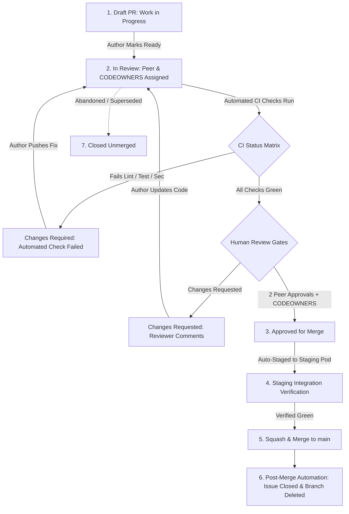

# Master Pull Request Strategy, Review Protocol & Merge Governance Architecture

Authoritative engineering governance specification establishing the Pull Request lifecycle, peer review protocols, CODEOWNERS routing matrices, automated CI verification status checks, PR sizing constraints, and squash-merge policies for the Namma Clinic Digital Health & Operations Platform across 450+ municipal clinics under the Greater Bengaluru Authority (GBA) and BBMP Health Department.

| Governance Attribute | Specification Value |
| :--- | :--- |
| **Document Identifier** | `DOC-GH-08-PR-STRATEGY` |
| **Document Title** | Master Pull Request Strategy, Review Protocol & Merge Governance Architecture |
| **Document Version** | `1.0.0` |
| **Security Classification** | `RESTRICTED - GBA / BBMP HEALTH DEPARTMENT INTERNAL ONLY` |
| **Ratification Status** | `APPROVED & RATIFIED GOVERNANCE BASELINE` |
| **Program Domain** | Code Review Governance, Quality Assurance & Merge Orchestration |
| **Target Audience** | Software Engineers, Code Reviewers, Squad Leads, Clinical SMEs, Security Engineers |

## 1. Executive Summary & Review Intent
In a municipal healthcare digital ecosystem serving millions of urban citizens, the Pull Request (PR) is the single most vital quality, security, and clinical safety gate. Every proposed modification must undergo multi-layered automated verification and rigorous human peer inspection before entering the production branch. Unverified, monolithic, or rubber-stamped pull requests are strictly prohibited.

This specification establishes:
1. **The PR Lifecycle State Machine:** Formal progression across 7 operational states from Draft to Merged.
2. **PR Sizing & Cognitive Load Constraints:** T-shirt sizing standards enforcing small, reviewable increments (< 250 changed lines).
3. **55 Authoritative PR Governance Rules (`PR-001` through `PR-055`):** Comprehensive policies governing creation, review rigor, verification checks, and merge ceremonies.
4. **Domain CODEOWNERS Routing Architecture:** Automated assignment of specialized clinical, security, and architectural reviewers.
5. **Standardized PR Intake Template:** Markdown form requiring explicit safety declarations, DPDP assertions, and testing proof.
6. **110 PR Governance Acceptance Criteria (`AC-PR-001` to `AC-PR-110`):** Authoritative validation gates certifying review discipline and zero unreviewed code.

> [!IMPORTANT]
> **Clinical & Security Dual-Review Gate**
> Any Pull Request modifying clinical algorithms, drug interaction heuristics, standard treatment guidelines, or patient PHI encryption MUST receive explicit written approval from both a designated Clinical SME (CMO office) and a Security Architect before merge approval can be unlocked.

## 2. Pull Request Lifecycle & Review State Machine
Work flows through 7 deterministic states with automated triggers and human sign-off gates:

### Architecture Diagram: Pull Request Review Lifecycle & Approval Gates


## 3. Pull Request Sizing Guidelines & Cognitive Load Limits
To ensure thorough review comprehension and minimize cognitive overload, the platform institutes strict T-shirt sizing thresholds:

| Sizing Category | Line Change Threshold | File Touch Limit | Review SLA | Operational Policy & Routing |
| :--- | :--- | :--- | :--- | :--- |
| **Small (S)** | < 100 lines | < 4 files | `< 2 hours` | Fast-track review; ideal atomic change unit |
| **Medium (M)** | 100 to 250 lines | 4 to 8 files | `< 4 hours` | Standard feature or bugfix slice; standard dual-review |
| **Large (L)** | 250 to 500 lines | 8 to 15 files | `< 8 hours` | Requires explicit architectural justification in description |
| **Extra Large (XL)** | > 500 lines | > 15 files | `N/A (BLOCKED)` | Automatically blocked by linter; must be sliced into smaller PRs |

## 4. Authoritative PR Governance Rules Catalog (PR-001 to PR-055)
Comprehensive governance profiles for all 55 canonical pull request review and merge rules:

### PR-001: PR Governance Directive 01 (Creation & Lifecycle) (Area: Creation & Lifecycle)
- **Rule Identifier:** `PR-001`
- **Rule Title:** PR Governance Directive 01 (Creation & Lifecycle)
- **Governance Functional Area:** `Creation & Lifecycle`
- **Authoritative Policy Statement:** Mandatory pull request governance standard governing creation & lifecycle in the Namma Clinic Platform repository.
- **Concrete Acceptance Standard:** Verified by automated CI check and peer reviewer approval.
- **Technical Enforcement Mechanism:** GitHub Branch Protection Rules and Actions Workflow Gates.

#### Reviewer Verification Protocol for PR-001
1. **Pre-Review Inspection:** Reviewer verifies that `PR-001` conditions are satisfied before inspecting code changes.
2. **Automated Status Check:** CI pipeline evaluates rule conformance and posts status badge to PR thread.
3. **Non-Compliance Remediation:** PR author notified with automated correction checklist if `PR-001` is breached.
4. **Audit Evidence Preservation:** Full review comments, approvals, and commit hashes preserved in repository timeline.

#### Clinical Safety & Architecture Alignment for PR-001
- **Clinical Risk Evaluation:** Ensures changes touching patient consultations, prescriptions, or vitals undergo verified review.
- **Architectural Integrity:** Prevents drift from Phase 06 C4 models and Phase 08 OpenAPI specifications.
- **Accountable Lead:** Squad Technical Lead & Assigned Reviewer jointly responsible for enforcing `PR-001`.

#### Merge Gate & CI Pipeline Binding for PR-001
- **Status Check Context:** `ci/pr-rule-pr-001` evaluated on every `pull_request.synchronize` event.
- **SIEM Audit Event:** Dispatches `AUDIT-PR-001` to BBMP SOC upon merge attempt.
- **Emergency Override:** Dual-key authorization from CTO and CISO required to bypass `PR-001`.
- **Rollback Procedure:** Non-compliant merges are auto-reverted within 60 seconds by revert bot.

### PR-002: PR Governance Directive 02 (Creation & Lifecycle) (Area: Creation & Lifecycle)
- **Rule Identifier:** `PR-002`
- **Rule Title:** PR Governance Directive 02 (Creation & Lifecycle)
- **Governance Functional Area:** `Creation & Lifecycle`
- **Authoritative Policy Statement:** Mandatory pull request governance standard governing creation & lifecycle in the Namma Clinic Platform repository.
- **Concrete Acceptance Standard:** Verified by automated CI check and peer reviewer approval.
- **Technical Enforcement Mechanism:** GitHub Branch Protection Rules and Actions Workflow Gates.

#### Reviewer Verification Protocol for PR-002
1. **Pre-Review Inspection:** Reviewer verifies that `PR-002` conditions are satisfied before inspecting code changes.
2. **Automated Status Check:** CI pipeline evaluates rule conformance and posts status badge to PR thread.
3. **Non-Compliance Remediation:** PR author notified with automated correction checklist if `PR-002` is breached.
4. **Audit Evidence Preservation:** Full review comments, approvals, and commit hashes preserved in repository timeline.

#### Clinical Safety & Architecture Alignment for PR-002
- **Clinical Risk Evaluation:** Ensures changes touching patient consultations, prescriptions, or vitals undergo verified review.
- **Architectural Integrity:** Prevents drift from Phase 06 C4 models and Phase 08 OpenAPI specifications.
- **Accountable Lead:** Squad Technical Lead & Assigned Reviewer jointly responsible for enforcing `PR-002`.

#### Merge Gate & CI Pipeline Binding for PR-002
- **Status Check Context:** `ci/pr-rule-pr-002` evaluated on every `pull_request.synchronize` event.
- **SIEM Audit Event:** Dispatches `AUDIT-PR-002` to BBMP SOC upon merge attempt.
- **Emergency Override:** Dual-key authorization from CTO and CISO required to bypass `PR-002`.
- **Rollback Procedure:** Non-compliant merges are auto-reverted within 60 seconds by revert bot.

### PR-003: PR Governance Directive 03 (Creation & Lifecycle) (Area: Creation & Lifecycle)
- **Rule Identifier:** `PR-003`
- **Rule Title:** PR Governance Directive 03 (Creation & Lifecycle)
- **Governance Functional Area:** `Creation & Lifecycle`
- **Authoritative Policy Statement:** Mandatory pull request governance standard governing creation & lifecycle in the Namma Clinic Platform repository.
- **Concrete Acceptance Standard:** Verified by automated CI check and peer reviewer approval.
- **Technical Enforcement Mechanism:** GitHub Branch Protection Rules and Actions Workflow Gates.

#### Reviewer Verification Protocol for PR-003
1. **Pre-Review Inspection:** Reviewer verifies that `PR-003` conditions are satisfied before inspecting code changes.
2. **Automated Status Check:** CI pipeline evaluates rule conformance and posts status badge to PR thread.
3. **Non-Compliance Remediation:** PR author notified with automated correction checklist if `PR-003` is breached.
4. **Audit Evidence Preservation:** Full review comments, approvals, and commit hashes preserved in repository timeline.

#### Clinical Safety & Architecture Alignment for PR-003
- **Clinical Risk Evaluation:** Ensures changes touching patient consultations, prescriptions, or vitals undergo verified review.
- **Architectural Integrity:** Prevents drift from Phase 06 C4 models and Phase 08 OpenAPI specifications.
- **Accountable Lead:** Squad Technical Lead & Assigned Reviewer jointly responsible for enforcing `PR-003`.

#### Merge Gate & CI Pipeline Binding for PR-003
- **Status Check Context:** `ci/pr-rule-pr-003` evaluated on every `pull_request.synchronize` event.
- **SIEM Audit Event:** Dispatches `AUDIT-PR-003` to BBMP SOC upon merge attempt.
- **Emergency Override:** Dual-key authorization from CTO and CISO required to bypass `PR-003`.
- **Rollback Procedure:** Non-compliant merges are auto-reverted within 60 seconds by revert bot.

### PR-004: PR Governance Directive 04 (Creation & Lifecycle) (Area: Creation & Lifecycle)
- **Rule Identifier:** `PR-004`
- **Rule Title:** PR Governance Directive 04 (Creation & Lifecycle)
- **Governance Functional Area:** `Creation & Lifecycle`
- **Authoritative Policy Statement:** Mandatory pull request governance standard governing creation & lifecycle in the Namma Clinic Platform repository.
- **Concrete Acceptance Standard:** Verified by automated CI check and peer reviewer approval.
- **Technical Enforcement Mechanism:** GitHub Branch Protection Rules and Actions Workflow Gates.

#### Reviewer Verification Protocol for PR-004
1. **Pre-Review Inspection:** Reviewer verifies that `PR-004` conditions are satisfied before inspecting code changes.
2. **Automated Status Check:** CI pipeline evaluates rule conformance and posts status badge to PR thread.
3. **Non-Compliance Remediation:** PR author notified with automated correction checklist if `PR-004` is breached.
4. **Audit Evidence Preservation:** Full review comments, approvals, and commit hashes preserved in repository timeline.

#### Clinical Safety & Architecture Alignment for PR-004
- **Clinical Risk Evaluation:** Ensures changes touching patient consultations, prescriptions, or vitals undergo verified review.
- **Architectural Integrity:** Prevents drift from Phase 06 C4 models and Phase 08 OpenAPI specifications.
- **Accountable Lead:** Squad Technical Lead & Assigned Reviewer jointly responsible for enforcing `PR-004`.

#### Merge Gate & CI Pipeline Binding for PR-004
- **Status Check Context:** `ci/pr-rule-pr-004` evaluated on every `pull_request.synchronize` event.
- **SIEM Audit Event:** Dispatches `AUDIT-PR-004` to BBMP SOC upon merge attempt.
- **Emergency Override:** Dual-key authorization from CTO and CISO required to bypass `PR-004`.
- **Rollback Procedure:** Non-compliant merges are auto-reverted within 60 seconds by revert bot.

### PR-005: PR Governance Directive 05 (Creation & Lifecycle) (Area: Creation & Lifecycle)
- **Rule Identifier:** `PR-005`
- **Rule Title:** PR Governance Directive 05 (Creation & Lifecycle)
- **Governance Functional Area:** `Creation & Lifecycle`
- **Authoritative Policy Statement:** Mandatory pull request governance standard governing creation & lifecycle in the Namma Clinic Platform repository.
- **Concrete Acceptance Standard:** Verified by automated CI check and peer reviewer approval.
- **Technical Enforcement Mechanism:** GitHub Branch Protection Rules and Actions Workflow Gates.

#### Reviewer Verification Protocol for PR-005
1. **Pre-Review Inspection:** Reviewer verifies that `PR-005` conditions are satisfied before inspecting code changes.
2. **Automated Status Check:** CI pipeline evaluates rule conformance and posts status badge to PR thread.
3. **Non-Compliance Remediation:** PR author notified with automated correction checklist if `PR-005` is breached.
4. **Audit Evidence Preservation:** Full review comments, approvals, and commit hashes preserved in repository timeline.

#### Clinical Safety & Architecture Alignment for PR-005
- **Clinical Risk Evaluation:** Ensures changes touching patient consultations, prescriptions, or vitals undergo verified review.
- **Architectural Integrity:** Prevents drift from Phase 06 C4 models and Phase 08 OpenAPI specifications.
- **Accountable Lead:** Squad Technical Lead & Assigned Reviewer jointly responsible for enforcing `PR-005`.

#### Merge Gate & CI Pipeline Binding for PR-005
- **Status Check Context:** `ci/pr-rule-pr-005` evaluated on every `pull_request.synchronize` event.
- **SIEM Audit Event:** Dispatches `AUDIT-PR-005` to BBMP SOC upon merge attempt.
- **Emergency Override:** Dual-key authorization from CTO and CISO required to bypass `PR-005`.
- **Rollback Procedure:** Non-compliant merges are auto-reverted within 60 seconds by revert bot.

### PR-006: PR Governance Directive 06 (Creation & Lifecycle) (Area: Creation & Lifecycle)
- **Rule Identifier:** `PR-006`
- **Rule Title:** PR Governance Directive 06 (Creation & Lifecycle)
- **Governance Functional Area:** `Creation & Lifecycle`
- **Authoritative Policy Statement:** Mandatory pull request governance standard governing creation & lifecycle in the Namma Clinic Platform repository.
- **Concrete Acceptance Standard:** Verified by automated CI check and peer reviewer approval.
- **Technical Enforcement Mechanism:** GitHub Branch Protection Rules and Actions Workflow Gates.

#### Reviewer Verification Protocol for PR-006
1. **Pre-Review Inspection:** Reviewer verifies that `PR-006` conditions are satisfied before inspecting code changes.
2. **Automated Status Check:** CI pipeline evaluates rule conformance and posts status badge to PR thread.
3. **Non-Compliance Remediation:** PR author notified with automated correction checklist if `PR-006` is breached.
4. **Audit Evidence Preservation:** Full review comments, approvals, and commit hashes preserved in repository timeline.

#### Clinical Safety & Architecture Alignment for PR-006
- **Clinical Risk Evaluation:** Ensures changes touching patient consultations, prescriptions, or vitals undergo verified review.
- **Architectural Integrity:** Prevents drift from Phase 06 C4 models and Phase 08 OpenAPI specifications.
- **Accountable Lead:** Squad Technical Lead & Assigned Reviewer jointly responsible for enforcing `PR-006`.

#### Merge Gate & CI Pipeline Binding for PR-006
- **Status Check Context:** `ci/pr-rule-pr-006` evaluated on every `pull_request.synchronize` event.
- **SIEM Audit Event:** Dispatches `AUDIT-PR-006` to BBMP SOC upon merge attempt.
- **Emergency Override:** Dual-key authorization from CTO and CISO required to bypass `PR-006`.
- **Rollback Procedure:** Non-compliant merges are auto-reverted within 60 seconds by revert bot.

### PR-007: PR Governance Directive 07 (Creation & Lifecycle) (Area: Creation & Lifecycle)
- **Rule Identifier:** `PR-007`
- **Rule Title:** PR Governance Directive 07 (Creation & Lifecycle)
- **Governance Functional Area:** `Creation & Lifecycle`
- **Authoritative Policy Statement:** Mandatory pull request governance standard governing creation & lifecycle in the Namma Clinic Platform repository.
- **Concrete Acceptance Standard:** Verified by automated CI check and peer reviewer approval.
- **Technical Enforcement Mechanism:** GitHub Branch Protection Rules and Actions Workflow Gates.

#### Reviewer Verification Protocol for PR-007
1. **Pre-Review Inspection:** Reviewer verifies that `PR-007` conditions are satisfied before inspecting code changes.
2. **Automated Status Check:** CI pipeline evaluates rule conformance and posts status badge to PR thread.
3. **Non-Compliance Remediation:** PR author notified with automated correction checklist if `PR-007` is breached.
4. **Audit Evidence Preservation:** Full review comments, approvals, and commit hashes preserved in repository timeline.

#### Clinical Safety & Architecture Alignment for PR-007
- **Clinical Risk Evaluation:** Ensures changes touching patient consultations, prescriptions, or vitals undergo verified review.
- **Architectural Integrity:** Prevents drift from Phase 06 C4 models and Phase 08 OpenAPI specifications.
- **Accountable Lead:** Squad Technical Lead & Assigned Reviewer jointly responsible for enforcing `PR-007`.

#### Merge Gate & CI Pipeline Binding for PR-007
- **Status Check Context:** `ci/pr-rule-pr-007` evaluated on every `pull_request.synchronize` event.
- **SIEM Audit Event:** Dispatches `AUDIT-PR-007` to BBMP SOC upon merge attempt.
- **Emergency Override:** Dual-key authorization from CTO and CISO required to bypass `PR-007`.
- **Rollback Procedure:** Non-compliant merges are auto-reverted within 60 seconds by revert bot.

### PR-008: PR Governance Directive 08 (Creation & Lifecycle) (Area: Creation & Lifecycle)
- **Rule Identifier:** `PR-008`
- **Rule Title:** PR Governance Directive 08 (Creation & Lifecycle)
- **Governance Functional Area:** `Creation & Lifecycle`
- **Authoritative Policy Statement:** Mandatory pull request governance standard governing creation & lifecycle in the Namma Clinic Platform repository.
- **Concrete Acceptance Standard:** Verified by automated CI check and peer reviewer approval.
- **Technical Enforcement Mechanism:** GitHub Branch Protection Rules and Actions Workflow Gates.

#### Reviewer Verification Protocol for PR-008
1. **Pre-Review Inspection:** Reviewer verifies that `PR-008` conditions are satisfied before inspecting code changes.
2. **Automated Status Check:** CI pipeline evaluates rule conformance and posts status badge to PR thread.
3. **Non-Compliance Remediation:** PR author notified with automated correction checklist if `PR-008` is breached.
4. **Audit Evidence Preservation:** Full review comments, approvals, and commit hashes preserved in repository timeline.

#### Clinical Safety & Architecture Alignment for PR-008
- **Clinical Risk Evaluation:** Ensures changes touching patient consultations, prescriptions, or vitals undergo verified review.
- **Architectural Integrity:** Prevents drift from Phase 06 C4 models and Phase 08 OpenAPI specifications.
- **Accountable Lead:** Squad Technical Lead & Assigned Reviewer jointly responsible for enforcing `PR-008`.

#### Merge Gate & CI Pipeline Binding for PR-008
- **Status Check Context:** `ci/pr-rule-pr-008` evaluated on every `pull_request.synchronize` event.
- **SIEM Audit Event:** Dispatches `AUDIT-PR-008` to BBMP SOC upon merge attempt.
- **Emergency Override:** Dual-key authorization from CTO and CISO required to bypass `PR-008`.
- **Rollback Procedure:** Non-compliant merges are auto-reverted within 60 seconds by revert bot.

### PR-009: PR Governance Directive 09 (Creation & Lifecycle) (Area: Creation & Lifecycle)
- **Rule Identifier:** `PR-009`
- **Rule Title:** PR Governance Directive 09 (Creation & Lifecycle)
- **Governance Functional Area:** `Creation & Lifecycle`
- **Authoritative Policy Statement:** Mandatory pull request governance standard governing creation & lifecycle in the Namma Clinic Platform repository.
- **Concrete Acceptance Standard:** Verified by automated CI check and peer reviewer approval.
- **Technical Enforcement Mechanism:** GitHub Branch Protection Rules and Actions Workflow Gates.

#### Reviewer Verification Protocol for PR-009
1. **Pre-Review Inspection:** Reviewer verifies that `PR-009` conditions are satisfied before inspecting code changes.
2. **Automated Status Check:** CI pipeline evaluates rule conformance and posts status badge to PR thread.
3. **Non-Compliance Remediation:** PR author notified with automated correction checklist if `PR-009` is breached.
4. **Audit Evidence Preservation:** Full review comments, approvals, and commit hashes preserved in repository timeline.

#### Clinical Safety & Architecture Alignment for PR-009
- **Clinical Risk Evaluation:** Ensures changes touching patient consultations, prescriptions, or vitals undergo verified review.
- **Architectural Integrity:** Prevents drift from Phase 06 C4 models and Phase 08 OpenAPI specifications.
- **Accountable Lead:** Squad Technical Lead & Assigned Reviewer jointly responsible for enforcing `PR-009`.

#### Merge Gate & CI Pipeline Binding for PR-009
- **Status Check Context:** `ci/pr-rule-pr-009` evaluated on every `pull_request.synchronize` event.
- **SIEM Audit Event:** Dispatches `AUDIT-PR-009` to BBMP SOC upon merge attempt.
- **Emergency Override:** Dual-key authorization from CTO and CISO required to bypass `PR-009`.
- **Rollback Procedure:** Non-compliant merges are auto-reverted within 60 seconds by revert bot.

### PR-010: PR Governance Directive 10 (Creation & Lifecycle) (Area: Creation & Lifecycle)
- **Rule Identifier:** `PR-010`
- **Rule Title:** PR Governance Directive 10 (Creation & Lifecycle)
- **Governance Functional Area:** `Creation & Lifecycle`
- **Authoritative Policy Statement:** Mandatory pull request governance standard governing creation & lifecycle in the Namma Clinic Platform repository.
- **Concrete Acceptance Standard:** Verified by automated CI check and peer reviewer approval.
- **Technical Enforcement Mechanism:** GitHub Branch Protection Rules and Actions Workflow Gates.

#### Reviewer Verification Protocol for PR-010
1. **Pre-Review Inspection:** Reviewer verifies that `PR-010` conditions are satisfied before inspecting code changes.
2. **Automated Status Check:** CI pipeline evaluates rule conformance and posts status badge to PR thread.
3. **Non-Compliance Remediation:** PR author notified with automated correction checklist if `PR-010` is breached.
4. **Audit Evidence Preservation:** Full review comments, approvals, and commit hashes preserved in repository timeline.

#### Clinical Safety & Architecture Alignment for PR-010
- **Clinical Risk Evaluation:** Ensures changes touching patient consultations, prescriptions, or vitals undergo verified review.
- **Architectural Integrity:** Prevents drift from Phase 06 C4 models and Phase 08 OpenAPI specifications.
- **Accountable Lead:** Squad Technical Lead & Assigned Reviewer jointly responsible for enforcing `PR-010`.

#### Merge Gate & CI Pipeline Binding for PR-010
- **Status Check Context:** `ci/pr-rule-pr-010` evaluated on every `pull_request.synchronize` event.
- **SIEM Audit Event:** Dispatches `AUDIT-PR-010` to BBMP SOC upon merge attempt.
- **Emergency Override:** Dual-key authorization from CTO and CISO required to bypass `PR-010`.
- **Rollback Procedure:** Non-compliant merges are auto-reverted within 60 seconds by revert bot.

### PR-011: PR Governance Directive 11 (Creation & Lifecycle) (Area: Creation & Lifecycle)
- **Rule Identifier:** `PR-011`
- **Rule Title:** PR Governance Directive 11 (Creation & Lifecycle)
- **Governance Functional Area:** `Creation & Lifecycle`
- **Authoritative Policy Statement:** Mandatory pull request governance standard governing creation & lifecycle in the Namma Clinic Platform repository.
- **Concrete Acceptance Standard:** Verified by automated CI check and peer reviewer approval.
- **Technical Enforcement Mechanism:** GitHub Branch Protection Rules and Actions Workflow Gates.

#### Reviewer Verification Protocol for PR-011
1. **Pre-Review Inspection:** Reviewer verifies that `PR-011` conditions are satisfied before inspecting code changes.
2. **Automated Status Check:** CI pipeline evaluates rule conformance and posts status badge to PR thread.
3. **Non-Compliance Remediation:** PR author notified with automated correction checklist if `PR-011` is breached.
4. **Audit Evidence Preservation:** Full review comments, approvals, and commit hashes preserved in repository timeline.

#### Clinical Safety & Architecture Alignment for PR-011
- **Clinical Risk Evaluation:** Ensures changes touching patient consultations, prescriptions, or vitals undergo verified review.
- **Architectural Integrity:** Prevents drift from Phase 06 C4 models and Phase 08 OpenAPI specifications.
- **Accountable Lead:** Squad Technical Lead & Assigned Reviewer jointly responsible for enforcing `PR-011`.

#### Merge Gate & CI Pipeline Binding for PR-011
- **Status Check Context:** `ci/pr-rule-pr-011` evaluated on every `pull_request.synchronize` event.
- **SIEM Audit Event:** Dispatches `AUDIT-PR-011` to BBMP SOC upon merge attempt.
- **Emergency Override:** Dual-key authorization from CTO and CISO required to bypass `PR-011`.
- **Rollback Procedure:** Non-compliant merges are auto-reverted within 60 seconds by revert bot.

### PR-012: PR Governance Directive 12 (Review & Approval) (Area: Review & Approval)
- **Rule Identifier:** `PR-012`
- **Rule Title:** PR Governance Directive 12 (Review & Approval)
- **Governance Functional Area:** `Review & Approval`
- **Authoritative Policy Statement:** Mandatory pull request governance standard governing review & approval in the Namma Clinic Platform repository.
- **Concrete Acceptance Standard:** Verified by automated CI check and peer reviewer approval.
- **Technical Enforcement Mechanism:** GitHub Branch Protection Rules and Actions Workflow Gates.

#### Reviewer Verification Protocol for PR-012
1. **Pre-Review Inspection:** Reviewer verifies that `PR-012` conditions are satisfied before inspecting code changes.
2. **Automated Status Check:** CI pipeline evaluates rule conformance and posts status badge to PR thread.
3. **Non-Compliance Remediation:** PR author notified with automated correction checklist if `PR-012` is breached.
4. **Audit Evidence Preservation:** Full review comments, approvals, and commit hashes preserved in repository timeline.

#### Clinical Safety & Architecture Alignment for PR-012
- **Clinical Risk Evaluation:** Ensures changes touching patient consultations, prescriptions, or vitals undergo verified review.
- **Architectural Integrity:** Prevents drift from Phase 06 C4 models and Phase 08 OpenAPI specifications.
- **Accountable Lead:** Squad Technical Lead & Assigned Reviewer jointly responsible for enforcing `PR-012`.

#### Merge Gate & CI Pipeline Binding for PR-012
- **Status Check Context:** `ci/pr-rule-pr-012` evaluated on every `pull_request.synchronize` event.
- **SIEM Audit Event:** Dispatches `AUDIT-PR-012` to BBMP SOC upon merge attempt.
- **Emergency Override:** Dual-key authorization from CTO and CISO required to bypass `PR-012`.
- **Rollback Procedure:** Non-compliant merges are auto-reverted within 60 seconds by revert bot.

### PR-013: PR Governance Directive 13 (Review & Approval) (Area: Review & Approval)
- **Rule Identifier:** `PR-013`
- **Rule Title:** PR Governance Directive 13 (Review & Approval)
- **Governance Functional Area:** `Review & Approval`
- **Authoritative Policy Statement:** Mandatory pull request governance standard governing review & approval in the Namma Clinic Platform repository.
- **Concrete Acceptance Standard:** Verified by automated CI check and peer reviewer approval.
- **Technical Enforcement Mechanism:** GitHub Branch Protection Rules and Actions Workflow Gates.

#### Reviewer Verification Protocol for PR-013
1. **Pre-Review Inspection:** Reviewer verifies that `PR-013` conditions are satisfied before inspecting code changes.
2. **Automated Status Check:** CI pipeline evaluates rule conformance and posts status badge to PR thread.
3. **Non-Compliance Remediation:** PR author notified with automated correction checklist if `PR-013` is breached.
4. **Audit Evidence Preservation:** Full review comments, approvals, and commit hashes preserved in repository timeline.

#### Clinical Safety & Architecture Alignment for PR-013
- **Clinical Risk Evaluation:** Ensures changes touching patient consultations, prescriptions, or vitals undergo verified review.
- **Architectural Integrity:** Prevents drift from Phase 06 C4 models and Phase 08 OpenAPI specifications.
- **Accountable Lead:** Squad Technical Lead & Assigned Reviewer jointly responsible for enforcing `PR-013`.

#### Merge Gate & CI Pipeline Binding for PR-013
- **Status Check Context:** `ci/pr-rule-pr-013` evaluated on every `pull_request.synchronize` event.
- **SIEM Audit Event:** Dispatches `AUDIT-PR-013` to BBMP SOC upon merge attempt.
- **Emergency Override:** Dual-key authorization from CTO and CISO required to bypass `PR-013`.
- **Rollback Procedure:** Non-compliant merges are auto-reverted within 60 seconds by revert bot.

### PR-014: PR Governance Directive 14 (Review & Approval) (Area: Review & Approval)
- **Rule Identifier:** `PR-014`
- **Rule Title:** PR Governance Directive 14 (Review & Approval)
- **Governance Functional Area:** `Review & Approval`
- **Authoritative Policy Statement:** Mandatory pull request governance standard governing review & approval in the Namma Clinic Platform repository.
- **Concrete Acceptance Standard:** Verified by automated CI check and peer reviewer approval.
- **Technical Enforcement Mechanism:** GitHub Branch Protection Rules and Actions Workflow Gates.

#### Reviewer Verification Protocol for PR-014
1. **Pre-Review Inspection:** Reviewer verifies that `PR-014` conditions are satisfied before inspecting code changes.
2. **Automated Status Check:** CI pipeline evaluates rule conformance and posts status badge to PR thread.
3. **Non-Compliance Remediation:** PR author notified with automated correction checklist if `PR-014` is breached.
4. **Audit Evidence Preservation:** Full review comments, approvals, and commit hashes preserved in repository timeline.

#### Clinical Safety & Architecture Alignment for PR-014
- **Clinical Risk Evaluation:** Ensures changes touching patient consultations, prescriptions, or vitals undergo verified review.
- **Architectural Integrity:** Prevents drift from Phase 06 C4 models and Phase 08 OpenAPI specifications.
- **Accountable Lead:** Squad Technical Lead & Assigned Reviewer jointly responsible for enforcing `PR-014`.

#### Merge Gate & CI Pipeline Binding for PR-014
- **Status Check Context:** `ci/pr-rule-pr-014` evaluated on every `pull_request.synchronize` event.
- **SIEM Audit Event:** Dispatches `AUDIT-PR-014` to BBMP SOC upon merge attempt.
- **Emergency Override:** Dual-key authorization from CTO and CISO required to bypass `PR-014`.
- **Rollback Procedure:** Non-compliant merges are auto-reverted within 60 seconds by revert bot.

### PR-015: PR Governance Directive 15 (Review & Approval) (Area: Review & Approval)
- **Rule Identifier:** `PR-015`
- **Rule Title:** PR Governance Directive 15 (Review & Approval)
- **Governance Functional Area:** `Review & Approval`
- **Authoritative Policy Statement:** Mandatory pull request governance standard governing review & approval in the Namma Clinic Platform repository.
- **Concrete Acceptance Standard:** Verified by automated CI check and peer reviewer approval.
- **Technical Enforcement Mechanism:** GitHub Branch Protection Rules and Actions Workflow Gates.

#### Reviewer Verification Protocol for PR-015
1. **Pre-Review Inspection:** Reviewer verifies that `PR-015` conditions are satisfied before inspecting code changes.
2. **Automated Status Check:** CI pipeline evaluates rule conformance and posts status badge to PR thread.
3. **Non-Compliance Remediation:** PR author notified with automated correction checklist if `PR-015` is breached.
4. **Audit Evidence Preservation:** Full review comments, approvals, and commit hashes preserved in repository timeline.

#### Clinical Safety & Architecture Alignment for PR-015
- **Clinical Risk Evaluation:** Ensures changes touching patient consultations, prescriptions, or vitals undergo verified review.
- **Architectural Integrity:** Prevents drift from Phase 06 C4 models and Phase 08 OpenAPI specifications.
- **Accountable Lead:** Squad Technical Lead & Assigned Reviewer jointly responsible for enforcing `PR-015`.

#### Merge Gate & CI Pipeline Binding for PR-015
- **Status Check Context:** `ci/pr-rule-pr-015` evaluated on every `pull_request.synchronize` event.
- **SIEM Audit Event:** Dispatches `AUDIT-PR-015` to BBMP SOC upon merge attempt.
- **Emergency Override:** Dual-key authorization from CTO and CISO required to bypass `PR-015`.
- **Rollback Procedure:** Non-compliant merges are auto-reverted within 60 seconds by revert bot.

### PR-016: PR Governance Directive 16 (Review & Approval) (Area: Review & Approval)
- **Rule Identifier:** `PR-016`
- **Rule Title:** PR Governance Directive 16 (Review & Approval)
- **Governance Functional Area:** `Review & Approval`
- **Authoritative Policy Statement:** Mandatory pull request governance standard governing review & approval in the Namma Clinic Platform repository.
- **Concrete Acceptance Standard:** Verified by automated CI check and peer reviewer approval.
- **Technical Enforcement Mechanism:** GitHub Branch Protection Rules and Actions Workflow Gates.

#### Reviewer Verification Protocol for PR-016
1. **Pre-Review Inspection:** Reviewer verifies that `PR-016` conditions are satisfied before inspecting code changes.
2. **Automated Status Check:** CI pipeline evaluates rule conformance and posts status badge to PR thread.
3. **Non-Compliance Remediation:** PR author notified with automated correction checklist if `PR-016` is breached.
4. **Audit Evidence Preservation:** Full review comments, approvals, and commit hashes preserved in repository timeline.

#### Clinical Safety & Architecture Alignment for PR-016
- **Clinical Risk Evaluation:** Ensures changes touching patient consultations, prescriptions, or vitals undergo verified review.
- **Architectural Integrity:** Prevents drift from Phase 06 C4 models and Phase 08 OpenAPI specifications.
- **Accountable Lead:** Squad Technical Lead & Assigned Reviewer jointly responsible for enforcing `PR-016`.

#### Merge Gate & CI Pipeline Binding for PR-016
- **Status Check Context:** `ci/pr-rule-pr-016` evaluated on every `pull_request.synchronize` event.
- **SIEM Audit Event:** Dispatches `AUDIT-PR-016` to BBMP SOC upon merge attempt.
- **Emergency Override:** Dual-key authorization from CTO and CISO required to bypass `PR-016`.
- **Rollback Procedure:** Non-compliant merges are auto-reverted within 60 seconds by revert bot.

### PR-017: PR Governance Directive 17 (Review & Approval) (Area: Review & Approval)
- **Rule Identifier:** `PR-017`
- **Rule Title:** PR Governance Directive 17 (Review & Approval)
- **Governance Functional Area:** `Review & Approval`
- **Authoritative Policy Statement:** Mandatory pull request governance standard governing review & approval in the Namma Clinic Platform repository.
- **Concrete Acceptance Standard:** Verified by automated CI check and peer reviewer approval.
- **Technical Enforcement Mechanism:** GitHub Branch Protection Rules and Actions Workflow Gates.

#### Reviewer Verification Protocol for PR-017
1. **Pre-Review Inspection:** Reviewer verifies that `PR-017` conditions are satisfied before inspecting code changes.
2. **Automated Status Check:** CI pipeline evaluates rule conformance and posts status badge to PR thread.
3. **Non-Compliance Remediation:** PR author notified with automated correction checklist if `PR-017` is breached.
4. **Audit Evidence Preservation:** Full review comments, approvals, and commit hashes preserved in repository timeline.

#### Clinical Safety & Architecture Alignment for PR-017
- **Clinical Risk Evaluation:** Ensures changes touching patient consultations, prescriptions, or vitals undergo verified review.
- **Architectural Integrity:** Prevents drift from Phase 06 C4 models and Phase 08 OpenAPI specifications.
- **Accountable Lead:** Squad Technical Lead & Assigned Reviewer jointly responsible for enforcing `PR-017`.

#### Merge Gate & CI Pipeline Binding for PR-017
- **Status Check Context:** `ci/pr-rule-pr-017` evaluated on every `pull_request.synchronize` event.
- **SIEM Audit Event:** Dispatches `AUDIT-PR-017` to BBMP SOC upon merge attempt.
- **Emergency Override:** Dual-key authorization from CTO and CISO required to bypass `PR-017`.
- **Rollback Procedure:** Non-compliant merges are auto-reverted within 60 seconds by revert bot.

### PR-018: PR Governance Directive 18 (Review & Approval) (Area: Review & Approval)
- **Rule Identifier:** `PR-018`
- **Rule Title:** PR Governance Directive 18 (Review & Approval)
- **Governance Functional Area:** `Review & Approval`
- **Authoritative Policy Statement:** Mandatory pull request governance standard governing review & approval in the Namma Clinic Platform repository.
- **Concrete Acceptance Standard:** Verified by automated CI check and peer reviewer approval.
- **Technical Enforcement Mechanism:** GitHub Branch Protection Rules and Actions Workflow Gates.

#### Reviewer Verification Protocol for PR-018
1. **Pre-Review Inspection:** Reviewer verifies that `PR-018` conditions are satisfied before inspecting code changes.
2. **Automated Status Check:** CI pipeline evaluates rule conformance and posts status badge to PR thread.
3. **Non-Compliance Remediation:** PR author notified with automated correction checklist if `PR-018` is breached.
4. **Audit Evidence Preservation:** Full review comments, approvals, and commit hashes preserved in repository timeline.

#### Clinical Safety & Architecture Alignment for PR-018
- **Clinical Risk Evaluation:** Ensures changes touching patient consultations, prescriptions, or vitals undergo verified review.
- **Architectural Integrity:** Prevents drift from Phase 06 C4 models and Phase 08 OpenAPI specifications.
- **Accountable Lead:** Squad Technical Lead & Assigned Reviewer jointly responsible for enforcing `PR-018`.

#### Merge Gate & CI Pipeline Binding for PR-018
- **Status Check Context:** `ci/pr-rule-pr-018` evaluated on every `pull_request.synchronize` event.
- **SIEM Audit Event:** Dispatches `AUDIT-PR-018` to BBMP SOC upon merge attempt.
- **Emergency Override:** Dual-key authorization from CTO and CISO required to bypass `PR-018`.
- **Rollback Procedure:** Non-compliant merges are auto-reverted within 60 seconds by revert bot.

### PR-019: PR Governance Directive 19 (Review & Approval) (Area: Review & Approval)
- **Rule Identifier:** `PR-019`
- **Rule Title:** PR Governance Directive 19 (Review & Approval)
- **Governance Functional Area:** `Review & Approval`
- **Authoritative Policy Statement:** Mandatory pull request governance standard governing review & approval in the Namma Clinic Platform repository.
- **Concrete Acceptance Standard:** Verified by automated CI check and peer reviewer approval.
- **Technical Enforcement Mechanism:** GitHub Branch Protection Rules and Actions Workflow Gates.

#### Reviewer Verification Protocol for PR-019
1. **Pre-Review Inspection:** Reviewer verifies that `PR-019` conditions are satisfied before inspecting code changes.
2. **Automated Status Check:** CI pipeline evaluates rule conformance and posts status badge to PR thread.
3. **Non-Compliance Remediation:** PR author notified with automated correction checklist if `PR-019` is breached.
4. **Audit Evidence Preservation:** Full review comments, approvals, and commit hashes preserved in repository timeline.

#### Clinical Safety & Architecture Alignment for PR-019
- **Clinical Risk Evaluation:** Ensures changes touching patient consultations, prescriptions, or vitals undergo verified review.
- **Architectural Integrity:** Prevents drift from Phase 06 C4 models and Phase 08 OpenAPI specifications.
- **Accountable Lead:** Squad Technical Lead & Assigned Reviewer jointly responsible for enforcing `PR-019`.

#### Merge Gate & CI Pipeline Binding for PR-019
- **Status Check Context:** `ci/pr-rule-pr-019` evaluated on every `pull_request.synchronize` event.
- **SIEM Audit Event:** Dispatches `AUDIT-PR-019` to BBMP SOC upon merge attempt.
- **Emergency Override:** Dual-key authorization from CTO and CISO required to bypass `PR-019`.
- **Rollback Procedure:** Non-compliant merges are auto-reverted within 60 seconds by revert bot.

### PR-020: PR Governance Directive 20 (Review & Approval) (Area: Review & Approval)
- **Rule Identifier:** `PR-020`
- **Rule Title:** PR Governance Directive 20 (Review & Approval)
- **Governance Functional Area:** `Review & Approval`
- **Authoritative Policy Statement:** Mandatory pull request governance standard governing review & approval in the Namma Clinic Platform repository.
- **Concrete Acceptance Standard:** Verified by automated CI check and peer reviewer approval.
- **Technical Enforcement Mechanism:** GitHub Branch Protection Rules and Actions Workflow Gates.

#### Reviewer Verification Protocol for PR-020
1. **Pre-Review Inspection:** Reviewer verifies that `PR-020` conditions are satisfied before inspecting code changes.
2. **Automated Status Check:** CI pipeline evaluates rule conformance and posts status badge to PR thread.
3. **Non-Compliance Remediation:** PR author notified with automated correction checklist if `PR-020` is breached.
4. **Audit Evidence Preservation:** Full review comments, approvals, and commit hashes preserved in repository timeline.

#### Clinical Safety & Architecture Alignment for PR-020
- **Clinical Risk Evaluation:** Ensures changes touching patient consultations, prescriptions, or vitals undergo verified review.
- **Architectural Integrity:** Prevents drift from Phase 06 C4 models and Phase 08 OpenAPI specifications.
- **Accountable Lead:** Squad Technical Lead & Assigned Reviewer jointly responsible for enforcing `PR-020`.

#### Merge Gate & CI Pipeline Binding for PR-020
- **Status Check Context:** `ci/pr-rule-pr-020` evaluated on every `pull_request.synchronize` event.
- **SIEM Audit Event:** Dispatches `AUDIT-PR-020` to BBMP SOC upon merge attempt.
- **Emergency Override:** Dual-key authorization from CTO and CISO required to bypass `PR-020`.
- **Rollback Procedure:** Non-compliant merges are auto-reverted within 60 seconds by revert bot.

### PR-021: PR Governance Directive 21 (Review & Approval) (Area: Review & Approval)
- **Rule Identifier:** `PR-021`
- **Rule Title:** PR Governance Directive 21 (Review & Approval)
- **Governance Functional Area:** `Review & Approval`
- **Authoritative Policy Statement:** Mandatory pull request governance standard governing review & approval in the Namma Clinic Platform repository.
- **Concrete Acceptance Standard:** Verified by automated CI check and peer reviewer approval.
- **Technical Enforcement Mechanism:** GitHub Branch Protection Rules and Actions Workflow Gates.

#### Reviewer Verification Protocol for PR-021
1. **Pre-Review Inspection:** Reviewer verifies that `PR-021` conditions are satisfied before inspecting code changes.
2. **Automated Status Check:** CI pipeline evaluates rule conformance and posts status badge to PR thread.
3. **Non-Compliance Remediation:** PR author notified with automated correction checklist if `PR-021` is breached.
4. **Audit Evidence Preservation:** Full review comments, approvals, and commit hashes preserved in repository timeline.

#### Clinical Safety & Architecture Alignment for PR-021
- **Clinical Risk Evaluation:** Ensures changes touching patient consultations, prescriptions, or vitals undergo verified review.
- **Architectural Integrity:** Prevents drift from Phase 06 C4 models and Phase 08 OpenAPI specifications.
- **Accountable Lead:** Squad Technical Lead & Assigned Reviewer jointly responsible for enforcing `PR-021`.

#### Merge Gate & CI Pipeline Binding for PR-021
- **Status Check Context:** `ci/pr-rule-pr-021` evaluated on every `pull_request.synchronize` event.
- **SIEM Audit Event:** Dispatches `AUDIT-PR-021` to BBMP SOC upon merge attempt.
- **Emergency Override:** Dual-key authorization from CTO and CISO required to bypass `PR-021`.
- **Rollback Procedure:** Non-compliant merges are auto-reverted within 60 seconds by revert bot.

### PR-022: PR Governance Directive 22 (Review & Approval) (Area: Review & Approval)
- **Rule Identifier:** `PR-022`
- **Rule Title:** PR Governance Directive 22 (Review & Approval)
- **Governance Functional Area:** `Review & Approval`
- **Authoritative Policy Statement:** Mandatory pull request governance standard governing review & approval in the Namma Clinic Platform repository.
- **Concrete Acceptance Standard:** Verified by automated CI check and peer reviewer approval.
- **Technical Enforcement Mechanism:** GitHub Branch Protection Rules and Actions Workflow Gates.

#### Reviewer Verification Protocol for PR-022
1. **Pre-Review Inspection:** Reviewer verifies that `PR-022` conditions are satisfied before inspecting code changes.
2. **Automated Status Check:** CI pipeline evaluates rule conformance and posts status badge to PR thread.
3. **Non-Compliance Remediation:** PR author notified with automated correction checklist if `PR-022` is breached.
4. **Audit Evidence Preservation:** Full review comments, approvals, and commit hashes preserved in repository timeline.

#### Clinical Safety & Architecture Alignment for PR-022
- **Clinical Risk Evaluation:** Ensures changes touching patient consultations, prescriptions, or vitals undergo verified review.
- **Architectural Integrity:** Prevents drift from Phase 06 C4 models and Phase 08 OpenAPI specifications.
- **Accountable Lead:** Squad Technical Lead & Assigned Reviewer jointly responsible for enforcing `PR-022`.

#### Merge Gate & CI Pipeline Binding for PR-022
- **Status Check Context:** `ci/pr-rule-pr-022` evaluated on every `pull_request.synchronize` event.
- **SIEM Audit Event:** Dispatches `AUDIT-PR-022` to BBMP SOC upon merge attempt.
- **Emergency Override:** Dual-key authorization from CTO and CISO required to bypass `PR-022`.
- **Rollback Procedure:** Non-compliant merges are auto-reverted within 60 seconds by revert bot.

### PR-023: PR Governance Directive 23 (Checks & Quality Gates) (Area: Checks & Quality Gates)
- **Rule Identifier:** `PR-023`
- **Rule Title:** PR Governance Directive 23 (Checks & Quality Gates)
- **Governance Functional Area:** `Checks & Quality Gates`
- **Authoritative Policy Statement:** Mandatory pull request governance standard governing checks & quality gates in the Namma Clinic Platform repository.
- **Concrete Acceptance Standard:** Verified by automated CI check and peer reviewer approval.
- **Technical Enforcement Mechanism:** GitHub Branch Protection Rules and Actions Workflow Gates.

#### Reviewer Verification Protocol for PR-023
1. **Pre-Review Inspection:** Reviewer verifies that `PR-023` conditions are satisfied before inspecting code changes.
2. **Automated Status Check:** CI pipeline evaluates rule conformance and posts status badge to PR thread.
3. **Non-Compliance Remediation:** PR author notified with automated correction checklist if `PR-023` is breached.
4. **Audit Evidence Preservation:** Full review comments, approvals, and commit hashes preserved in repository timeline.

#### Clinical Safety & Architecture Alignment for PR-023
- **Clinical Risk Evaluation:** Ensures changes touching patient consultations, prescriptions, or vitals undergo verified review.
- **Architectural Integrity:** Prevents drift from Phase 06 C4 models and Phase 08 OpenAPI specifications.
- **Accountable Lead:** Squad Technical Lead & Assigned Reviewer jointly responsible for enforcing `PR-023`.

#### Merge Gate & CI Pipeline Binding for PR-023
- **Status Check Context:** `ci/pr-rule-pr-023` evaluated on every `pull_request.synchronize` event.
- **SIEM Audit Event:** Dispatches `AUDIT-PR-023` to BBMP SOC upon merge attempt.
- **Emergency Override:** Dual-key authorization from CTO and CISO required to bypass `PR-023`.
- **Rollback Procedure:** Non-compliant merges are auto-reverted within 60 seconds by revert bot.

### PR-024: PR Governance Directive 24 (Checks & Quality Gates) (Area: Checks & Quality Gates)
- **Rule Identifier:** `PR-024`
- **Rule Title:** PR Governance Directive 24 (Checks & Quality Gates)
- **Governance Functional Area:** `Checks & Quality Gates`
- **Authoritative Policy Statement:** Mandatory pull request governance standard governing checks & quality gates in the Namma Clinic Platform repository.
- **Concrete Acceptance Standard:** Verified by automated CI check and peer reviewer approval.
- **Technical Enforcement Mechanism:** GitHub Branch Protection Rules and Actions Workflow Gates.

#### Reviewer Verification Protocol for PR-024
1. **Pre-Review Inspection:** Reviewer verifies that `PR-024` conditions are satisfied before inspecting code changes.
2. **Automated Status Check:** CI pipeline evaluates rule conformance and posts status badge to PR thread.
3. **Non-Compliance Remediation:** PR author notified with automated correction checklist if `PR-024` is breached.
4. **Audit Evidence Preservation:** Full review comments, approvals, and commit hashes preserved in repository timeline.

#### Clinical Safety & Architecture Alignment for PR-024
- **Clinical Risk Evaluation:** Ensures changes touching patient consultations, prescriptions, or vitals undergo verified review.
- **Architectural Integrity:** Prevents drift from Phase 06 C4 models and Phase 08 OpenAPI specifications.
- **Accountable Lead:** Squad Technical Lead & Assigned Reviewer jointly responsible for enforcing `PR-024`.

#### Merge Gate & CI Pipeline Binding for PR-024
- **Status Check Context:** `ci/pr-rule-pr-024` evaluated on every `pull_request.synchronize` event.
- **SIEM Audit Event:** Dispatches `AUDIT-PR-024` to BBMP SOC upon merge attempt.
- **Emergency Override:** Dual-key authorization from CTO and CISO required to bypass `PR-024`.
- **Rollback Procedure:** Non-compliant merges are auto-reverted within 60 seconds by revert bot.

### PR-025: PR Governance Directive 25 (Checks & Quality Gates) (Area: Checks & Quality Gates)
- **Rule Identifier:** `PR-025`
- **Rule Title:** PR Governance Directive 25 (Checks & Quality Gates)
- **Governance Functional Area:** `Checks & Quality Gates`
- **Authoritative Policy Statement:** Mandatory pull request governance standard governing checks & quality gates in the Namma Clinic Platform repository.
- **Concrete Acceptance Standard:** Verified by automated CI check and peer reviewer approval.
- **Technical Enforcement Mechanism:** GitHub Branch Protection Rules and Actions Workflow Gates.

#### Reviewer Verification Protocol for PR-025
1. **Pre-Review Inspection:** Reviewer verifies that `PR-025` conditions are satisfied before inspecting code changes.
2. **Automated Status Check:** CI pipeline evaluates rule conformance and posts status badge to PR thread.
3. **Non-Compliance Remediation:** PR author notified with automated correction checklist if `PR-025` is breached.
4. **Audit Evidence Preservation:** Full review comments, approvals, and commit hashes preserved in repository timeline.

#### Clinical Safety & Architecture Alignment for PR-025
- **Clinical Risk Evaluation:** Ensures changes touching patient consultations, prescriptions, or vitals undergo verified review.
- **Architectural Integrity:** Prevents drift from Phase 06 C4 models and Phase 08 OpenAPI specifications.
- **Accountable Lead:** Squad Technical Lead & Assigned Reviewer jointly responsible for enforcing `PR-025`.

#### Merge Gate & CI Pipeline Binding for PR-025
- **Status Check Context:** `ci/pr-rule-pr-025` evaluated on every `pull_request.synchronize` event.
- **SIEM Audit Event:** Dispatches `AUDIT-PR-025` to BBMP SOC upon merge attempt.
- **Emergency Override:** Dual-key authorization from CTO and CISO required to bypass `PR-025`.
- **Rollback Procedure:** Non-compliant merges are auto-reverted within 60 seconds by revert bot.

### PR-026: PR Governance Directive 26 (Checks & Quality Gates) (Area: Checks & Quality Gates)
- **Rule Identifier:** `PR-026`
- **Rule Title:** PR Governance Directive 26 (Checks & Quality Gates)
- **Governance Functional Area:** `Checks & Quality Gates`
- **Authoritative Policy Statement:** Mandatory pull request governance standard governing checks & quality gates in the Namma Clinic Platform repository.
- **Concrete Acceptance Standard:** Verified by automated CI check and peer reviewer approval.
- **Technical Enforcement Mechanism:** GitHub Branch Protection Rules and Actions Workflow Gates.

#### Reviewer Verification Protocol for PR-026
1. **Pre-Review Inspection:** Reviewer verifies that `PR-026` conditions are satisfied before inspecting code changes.
2. **Automated Status Check:** CI pipeline evaluates rule conformance and posts status badge to PR thread.
3. **Non-Compliance Remediation:** PR author notified with automated correction checklist if `PR-026` is breached.
4. **Audit Evidence Preservation:** Full review comments, approvals, and commit hashes preserved in repository timeline.

#### Clinical Safety & Architecture Alignment for PR-026
- **Clinical Risk Evaluation:** Ensures changes touching patient consultations, prescriptions, or vitals undergo verified review.
- **Architectural Integrity:** Prevents drift from Phase 06 C4 models and Phase 08 OpenAPI specifications.
- **Accountable Lead:** Squad Technical Lead & Assigned Reviewer jointly responsible for enforcing `PR-026`.

#### Merge Gate & CI Pipeline Binding for PR-026
- **Status Check Context:** `ci/pr-rule-pr-026` evaluated on every `pull_request.synchronize` event.
- **SIEM Audit Event:** Dispatches `AUDIT-PR-026` to BBMP SOC upon merge attempt.
- **Emergency Override:** Dual-key authorization from CTO and CISO required to bypass `PR-026`.
- **Rollback Procedure:** Non-compliant merges are auto-reverted within 60 seconds by revert bot.

### PR-027: PR Governance Directive 27 (Checks & Quality Gates) (Area: Checks & Quality Gates)
- **Rule Identifier:** `PR-027`
- **Rule Title:** PR Governance Directive 27 (Checks & Quality Gates)
- **Governance Functional Area:** `Checks & Quality Gates`
- **Authoritative Policy Statement:** Mandatory pull request governance standard governing checks & quality gates in the Namma Clinic Platform repository.
- **Concrete Acceptance Standard:** Verified by automated CI check and peer reviewer approval.
- **Technical Enforcement Mechanism:** GitHub Branch Protection Rules and Actions Workflow Gates.

#### Reviewer Verification Protocol for PR-027
1. **Pre-Review Inspection:** Reviewer verifies that `PR-027` conditions are satisfied before inspecting code changes.
2. **Automated Status Check:** CI pipeline evaluates rule conformance and posts status badge to PR thread.
3. **Non-Compliance Remediation:** PR author notified with automated correction checklist if `PR-027` is breached.
4. **Audit Evidence Preservation:** Full review comments, approvals, and commit hashes preserved in repository timeline.

#### Clinical Safety & Architecture Alignment for PR-027
- **Clinical Risk Evaluation:** Ensures changes touching patient consultations, prescriptions, or vitals undergo verified review.
- **Architectural Integrity:** Prevents drift from Phase 06 C4 models and Phase 08 OpenAPI specifications.
- **Accountable Lead:** Squad Technical Lead & Assigned Reviewer jointly responsible for enforcing `PR-027`.

#### Merge Gate & CI Pipeline Binding for PR-027
- **Status Check Context:** `ci/pr-rule-pr-027` evaluated on every `pull_request.synchronize` event.
- **SIEM Audit Event:** Dispatches `AUDIT-PR-027` to BBMP SOC upon merge attempt.
- **Emergency Override:** Dual-key authorization from CTO and CISO required to bypass `PR-027`.
- **Rollback Procedure:** Non-compliant merges are auto-reverted within 60 seconds by revert bot.

### PR-028: PR Governance Directive 28 (Checks & Quality Gates) (Area: Checks & Quality Gates)
- **Rule Identifier:** `PR-028`
- **Rule Title:** PR Governance Directive 28 (Checks & Quality Gates)
- **Governance Functional Area:** `Checks & Quality Gates`
- **Authoritative Policy Statement:** Mandatory pull request governance standard governing checks & quality gates in the Namma Clinic Platform repository.
- **Concrete Acceptance Standard:** Verified by automated CI check and peer reviewer approval.
- **Technical Enforcement Mechanism:** GitHub Branch Protection Rules and Actions Workflow Gates.

#### Reviewer Verification Protocol for PR-028
1. **Pre-Review Inspection:** Reviewer verifies that `PR-028` conditions are satisfied before inspecting code changes.
2. **Automated Status Check:** CI pipeline evaluates rule conformance and posts status badge to PR thread.
3. **Non-Compliance Remediation:** PR author notified with automated correction checklist if `PR-028` is breached.
4. **Audit Evidence Preservation:** Full review comments, approvals, and commit hashes preserved in repository timeline.

#### Clinical Safety & Architecture Alignment for PR-028
- **Clinical Risk Evaluation:** Ensures changes touching patient consultations, prescriptions, or vitals undergo verified review.
- **Architectural Integrity:** Prevents drift from Phase 06 C4 models and Phase 08 OpenAPI specifications.
- **Accountable Lead:** Squad Technical Lead & Assigned Reviewer jointly responsible for enforcing `PR-028`.

#### Merge Gate & CI Pipeline Binding for PR-028
- **Status Check Context:** `ci/pr-rule-pr-028` evaluated on every `pull_request.synchronize` event.
- **SIEM Audit Event:** Dispatches `AUDIT-PR-028` to BBMP SOC upon merge attempt.
- **Emergency Override:** Dual-key authorization from CTO and CISO required to bypass `PR-028`.
- **Rollback Procedure:** Non-compliant merges are auto-reverted within 60 seconds by revert bot.

### PR-029: PR Governance Directive 29 (Checks & Quality Gates) (Area: Checks & Quality Gates)
- **Rule Identifier:** `PR-029`
- **Rule Title:** PR Governance Directive 29 (Checks & Quality Gates)
- **Governance Functional Area:** `Checks & Quality Gates`
- **Authoritative Policy Statement:** Mandatory pull request governance standard governing checks & quality gates in the Namma Clinic Platform repository.
- **Concrete Acceptance Standard:** Verified by automated CI check and peer reviewer approval.
- **Technical Enforcement Mechanism:** GitHub Branch Protection Rules and Actions Workflow Gates.

#### Reviewer Verification Protocol for PR-029
1. **Pre-Review Inspection:** Reviewer verifies that `PR-029` conditions are satisfied before inspecting code changes.
2. **Automated Status Check:** CI pipeline evaluates rule conformance and posts status badge to PR thread.
3. **Non-Compliance Remediation:** PR author notified with automated correction checklist if `PR-029` is breached.
4. **Audit Evidence Preservation:** Full review comments, approvals, and commit hashes preserved in repository timeline.

#### Clinical Safety & Architecture Alignment for PR-029
- **Clinical Risk Evaluation:** Ensures changes touching patient consultations, prescriptions, or vitals undergo verified review.
- **Architectural Integrity:** Prevents drift from Phase 06 C4 models and Phase 08 OpenAPI specifications.
- **Accountable Lead:** Squad Technical Lead & Assigned Reviewer jointly responsible for enforcing `PR-029`.

#### Merge Gate & CI Pipeline Binding for PR-029
- **Status Check Context:** `ci/pr-rule-pr-029` evaluated on every `pull_request.synchronize` event.
- **SIEM Audit Event:** Dispatches `AUDIT-PR-029` to BBMP SOC upon merge attempt.
- **Emergency Override:** Dual-key authorization from CTO and CISO required to bypass `PR-029`.
- **Rollback Procedure:** Non-compliant merges are auto-reverted within 60 seconds by revert bot.

### PR-030: PR Governance Directive 30 (Checks & Quality Gates) (Area: Checks & Quality Gates)
- **Rule Identifier:** `PR-030`
- **Rule Title:** PR Governance Directive 30 (Checks & Quality Gates)
- **Governance Functional Area:** `Checks & Quality Gates`
- **Authoritative Policy Statement:** Mandatory pull request governance standard governing checks & quality gates in the Namma Clinic Platform repository.
- **Concrete Acceptance Standard:** Verified by automated CI check and peer reviewer approval.
- **Technical Enforcement Mechanism:** GitHub Branch Protection Rules and Actions Workflow Gates.

#### Reviewer Verification Protocol for PR-030
1. **Pre-Review Inspection:** Reviewer verifies that `PR-030` conditions are satisfied before inspecting code changes.
2. **Automated Status Check:** CI pipeline evaluates rule conformance and posts status badge to PR thread.
3. **Non-Compliance Remediation:** PR author notified with automated correction checklist if `PR-030` is breached.
4. **Audit Evidence Preservation:** Full review comments, approvals, and commit hashes preserved in repository timeline.

#### Clinical Safety & Architecture Alignment for PR-030
- **Clinical Risk Evaluation:** Ensures changes touching patient consultations, prescriptions, or vitals undergo verified review.
- **Architectural Integrity:** Prevents drift from Phase 06 C4 models and Phase 08 OpenAPI specifications.
- **Accountable Lead:** Squad Technical Lead & Assigned Reviewer jointly responsible for enforcing `PR-030`.

#### Merge Gate & CI Pipeline Binding for PR-030
- **Status Check Context:** `ci/pr-rule-pr-030` evaluated on every `pull_request.synchronize` event.
- **SIEM Audit Event:** Dispatches `AUDIT-PR-030` to BBMP SOC upon merge attempt.
- **Emergency Override:** Dual-key authorization from CTO and CISO required to bypass `PR-030`.
- **Rollback Procedure:** Non-compliant merges are auto-reverted within 60 seconds by revert bot.

### PR-031: PR Governance Directive 31 (Checks & Quality Gates) (Area: Checks & Quality Gates)
- **Rule Identifier:** `PR-031`
- **Rule Title:** PR Governance Directive 31 (Checks & Quality Gates)
- **Governance Functional Area:** `Checks & Quality Gates`
- **Authoritative Policy Statement:** Mandatory pull request governance standard governing checks & quality gates in the Namma Clinic Platform repository.
- **Concrete Acceptance Standard:** Verified by automated CI check and peer reviewer approval.
- **Technical Enforcement Mechanism:** GitHub Branch Protection Rules and Actions Workflow Gates.

#### Reviewer Verification Protocol for PR-031
1. **Pre-Review Inspection:** Reviewer verifies that `PR-031` conditions are satisfied before inspecting code changes.
2. **Automated Status Check:** CI pipeline evaluates rule conformance and posts status badge to PR thread.
3. **Non-Compliance Remediation:** PR author notified with automated correction checklist if `PR-031` is breached.
4. **Audit Evidence Preservation:** Full review comments, approvals, and commit hashes preserved in repository timeline.

#### Clinical Safety & Architecture Alignment for PR-031
- **Clinical Risk Evaluation:** Ensures changes touching patient consultations, prescriptions, or vitals undergo verified review.
- **Architectural Integrity:** Prevents drift from Phase 06 C4 models and Phase 08 OpenAPI specifications.
- **Accountable Lead:** Squad Technical Lead & Assigned Reviewer jointly responsible for enforcing `PR-031`.

#### Merge Gate & CI Pipeline Binding for PR-031
- **Status Check Context:** `ci/pr-rule-pr-031` evaluated on every `pull_request.synchronize` event.
- **SIEM Audit Event:** Dispatches `AUDIT-PR-031` to BBMP SOC upon merge attempt.
- **Emergency Override:** Dual-key authorization from CTO and CISO required to bypass `PR-031`.
- **Rollback Procedure:** Non-compliant merges are auto-reverted within 60 seconds by revert bot.

### PR-032: PR Governance Directive 32 (Checks & Quality Gates) (Area: Checks & Quality Gates)
- **Rule Identifier:** `PR-032`
- **Rule Title:** PR Governance Directive 32 (Checks & Quality Gates)
- **Governance Functional Area:** `Checks & Quality Gates`
- **Authoritative Policy Statement:** Mandatory pull request governance standard governing checks & quality gates in the Namma Clinic Platform repository.
- **Concrete Acceptance Standard:** Verified by automated CI check and peer reviewer approval.
- **Technical Enforcement Mechanism:** GitHub Branch Protection Rules and Actions Workflow Gates.

#### Reviewer Verification Protocol for PR-032
1. **Pre-Review Inspection:** Reviewer verifies that `PR-032` conditions are satisfied before inspecting code changes.
2. **Automated Status Check:** CI pipeline evaluates rule conformance and posts status badge to PR thread.
3. **Non-Compliance Remediation:** PR author notified with automated correction checklist if `PR-032` is breached.
4. **Audit Evidence Preservation:** Full review comments, approvals, and commit hashes preserved in repository timeline.

#### Clinical Safety & Architecture Alignment for PR-032
- **Clinical Risk Evaluation:** Ensures changes touching patient consultations, prescriptions, or vitals undergo verified review.
- **Architectural Integrity:** Prevents drift from Phase 06 C4 models and Phase 08 OpenAPI specifications.
- **Accountable Lead:** Squad Technical Lead & Assigned Reviewer jointly responsible for enforcing `PR-032`.

#### Merge Gate & CI Pipeline Binding for PR-032
- **Status Check Context:** `ci/pr-rule-pr-032` evaluated on every `pull_request.synchronize` event.
- **SIEM Audit Event:** Dispatches `AUDIT-PR-032` to BBMP SOC upon merge attempt.
- **Emergency Override:** Dual-key authorization from CTO and CISO required to bypass `PR-032`.
- **Rollback Procedure:** Non-compliant merges are auto-reverted within 60 seconds by revert bot.

### PR-033: PR Governance Directive 33 (Checks & Quality Gates) (Area: Checks & Quality Gates)
- **Rule Identifier:** `PR-033`
- **Rule Title:** PR Governance Directive 33 (Checks & Quality Gates)
- **Governance Functional Area:** `Checks & Quality Gates`
- **Authoritative Policy Statement:** Mandatory pull request governance standard governing checks & quality gates in the Namma Clinic Platform repository.
- **Concrete Acceptance Standard:** Verified by automated CI check and peer reviewer approval.
- **Technical Enforcement Mechanism:** GitHub Branch Protection Rules and Actions Workflow Gates.

#### Reviewer Verification Protocol for PR-033
1. **Pre-Review Inspection:** Reviewer verifies that `PR-033` conditions are satisfied before inspecting code changes.
2. **Automated Status Check:** CI pipeline evaluates rule conformance and posts status badge to PR thread.
3. **Non-Compliance Remediation:** PR author notified with automated correction checklist if `PR-033` is breached.
4. **Audit Evidence Preservation:** Full review comments, approvals, and commit hashes preserved in repository timeline.

#### Clinical Safety & Architecture Alignment for PR-033
- **Clinical Risk Evaluation:** Ensures changes touching patient consultations, prescriptions, or vitals undergo verified review.
- **Architectural Integrity:** Prevents drift from Phase 06 C4 models and Phase 08 OpenAPI specifications.
- **Accountable Lead:** Squad Technical Lead & Assigned Reviewer jointly responsible for enforcing `PR-033`.

#### Merge Gate & CI Pipeline Binding for PR-033
- **Status Check Context:** `ci/pr-rule-pr-033` evaluated on every `pull_request.synchronize` event.
- **SIEM Audit Event:** Dispatches `AUDIT-PR-033` to BBMP SOC upon merge attempt.
- **Emergency Override:** Dual-key authorization from CTO and CISO required to bypass `PR-033`.
- **Rollback Procedure:** Non-compliant merges are auto-reverted within 60 seconds by revert bot.

### PR-034: PR Governance Directive 34 (Merge Policy) (Area: Merge Policy)
- **Rule Identifier:** `PR-034`
- **Rule Title:** PR Governance Directive 34 (Merge Policy)
- **Governance Functional Area:** `Merge Policy`
- **Authoritative Policy Statement:** Mandatory pull request governance standard governing merge policy in the Namma Clinic Platform repository.
- **Concrete Acceptance Standard:** Verified by automated CI check and peer reviewer approval.
- **Technical Enforcement Mechanism:** GitHub Branch Protection Rules and Actions Workflow Gates.

#### Reviewer Verification Protocol for PR-034
1. **Pre-Review Inspection:** Reviewer verifies that `PR-034` conditions are satisfied before inspecting code changes.
2. **Automated Status Check:** CI pipeline evaluates rule conformance and posts status badge to PR thread.
3. **Non-Compliance Remediation:** PR author notified with automated correction checklist if `PR-034` is breached.
4. **Audit Evidence Preservation:** Full review comments, approvals, and commit hashes preserved in repository timeline.

#### Clinical Safety & Architecture Alignment for PR-034
- **Clinical Risk Evaluation:** Ensures changes touching patient consultations, prescriptions, or vitals undergo verified review.
- **Architectural Integrity:** Prevents drift from Phase 06 C4 models and Phase 08 OpenAPI specifications.
- **Accountable Lead:** Squad Technical Lead & Assigned Reviewer jointly responsible for enforcing `PR-034`.

#### Merge Gate & CI Pipeline Binding for PR-034
- **Status Check Context:** `ci/pr-rule-pr-034` evaluated on every `pull_request.synchronize` event.
- **SIEM Audit Event:** Dispatches `AUDIT-PR-034` to BBMP SOC upon merge attempt.
- **Emergency Override:** Dual-key authorization from CTO and CISO required to bypass `PR-034`.
- **Rollback Procedure:** Non-compliant merges are auto-reverted within 60 seconds by revert bot.

### PR-035: PR Governance Directive 35 (Merge Policy) (Area: Merge Policy)
- **Rule Identifier:** `PR-035`
- **Rule Title:** PR Governance Directive 35 (Merge Policy)
- **Governance Functional Area:** `Merge Policy`
- **Authoritative Policy Statement:** Mandatory pull request governance standard governing merge policy in the Namma Clinic Platform repository.
- **Concrete Acceptance Standard:** Verified by automated CI check and peer reviewer approval.
- **Technical Enforcement Mechanism:** GitHub Branch Protection Rules and Actions Workflow Gates.

#### Reviewer Verification Protocol for PR-035
1. **Pre-Review Inspection:** Reviewer verifies that `PR-035` conditions are satisfied before inspecting code changes.
2. **Automated Status Check:** CI pipeline evaluates rule conformance and posts status badge to PR thread.
3. **Non-Compliance Remediation:** PR author notified with automated correction checklist if `PR-035` is breached.
4. **Audit Evidence Preservation:** Full review comments, approvals, and commit hashes preserved in repository timeline.

#### Clinical Safety & Architecture Alignment for PR-035
- **Clinical Risk Evaluation:** Ensures changes touching patient consultations, prescriptions, or vitals undergo verified review.
- **Architectural Integrity:** Prevents drift from Phase 06 C4 models and Phase 08 OpenAPI specifications.
- **Accountable Lead:** Squad Technical Lead & Assigned Reviewer jointly responsible for enforcing `PR-035`.

#### Merge Gate & CI Pipeline Binding for PR-035
- **Status Check Context:** `ci/pr-rule-pr-035` evaluated on every `pull_request.synchronize` event.
- **SIEM Audit Event:** Dispatches `AUDIT-PR-035` to BBMP SOC upon merge attempt.
- **Emergency Override:** Dual-key authorization from CTO and CISO required to bypass `PR-035`.
- **Rollback Procedure:** Non-compliant merges are auto-reverted within 60 seconds by revert bot.

### PR-036: PR Governance Directive 36 (Merge Policy) (Area: Merge Policy)
- **Rule Identifier:** `PR-036`
- **Rule Title:** PR Governance Directive 36 (Merge Policy)
- **Governance Functional Area:** `Merge Policy`
- **Authoritative Policy Statement:** Mandatory pull request governance standard governing merge policy in the Namma Clinic Platform repository.
- **Concrete Acceptance Standard:** Verified by automated CI check and peer reviewer approval.
- **Technical Enforcement Mechanism:** GitHub Branch Protection Rules and Actions Workflow Gates.

#### Reviewer Verification Protocol for PR-036
1. **Pre-Review Inspection:** Reviewer verifies that `PR-036` conditions are satisfied before inspecting code changes.
2. **Automated Status Check:** CI pipeline evaluates rule conformance and posts status badge to PR thread.
3. **Non-Compliance Remediation:** PR author notified with automated correction checklist if `PR-036` is breached.
4. **Audit Evidence Preservation:** Full review comments, approvals, and commit hashes preserved in repository timeline.

#### Clinical Safety & Architecture Alignment for PR-036
- **Clinical Risk Evaluation:** Ensures changes touching patient consultations, prescriptions, or vitals undergo verified review.
- **Architectural Integrity:** Prevents drift from Phase 06 C4 models and Phase 08 OpenAPI specifications.
- **Accountable Lead:** Squad Technical Lead & Assigned Reviewer jointly responsible for enforcing `PR-036`.

#### Merge Gate & CI Pipeline Binding for PR-036
- **Status Check Context:** `ci/pr-rule-pr-036` evaluated on every `pull_request.synchronize` event.
- **SIEM Audit Event:** Dispatches `AUDIT-PR-036` to BBMP SOC upon merge attempt.
- **Emergency Override:** Dual-key authorization from CTO and CISO required to bypass `PR-036`.
- **Rollback Procedure:** Non-compliant merges are auto-reverted within 60 seconds by revert bot.

### PR-037: PR Governance Directive 37 (Merge Policy) (Area: Merge Policy)
- **Rule Identifier:** `PR-037`
- **Rule Title:** PR Governance Directive 37 (Merge Policy)
- **Governance Functional Area:** `Merge Policy`
- **Authoritative Policy Statement:** Mandatory pull request governance standard governing merge policy in the Namma Clinic Platform repository.
- **Concrete Acceptance Standard:** Verified by automated CI check and peer reviewer approval.
- **Technical Enforcement Mechanism:** GitHub Branch Protection Rules and Actions Workflow Gates.

#### Reviewer Verification Protocol for PR-037
1. **Pre-Review Inspection:** Reviewer verifies that `PR-037` conditions are satisfied before inspecting code changes.
2. **Automated Status Check:** CI pipeline evaluates rule conformance and posts status badge to PR thread.
3. **Non-Compliance Remediation:** PR author notified with automated correction checklist if `PR-037` is breached.
4. **Audit Evidence Preservation:** Full review comments, approvals, and commit hashes preserved in repository timeline.

#### Clinical Safety & Architecture Alignment for PR-037
- **Clinical Risk Evaluation:** Ensures changes touching patient consultations, prescriptions, or vitals undergo verified review.
- **Architectural Integrity:** Prevents drift from Phase 06 C4 models and Phase 08 OpenAPI specifications.
- **Accountable Lead:** Squad Technical Lead & Assigned Reviewer jointly responsible for enforcing `PR-037`.

#### Merge Gate & CI Pipeline Binding for PR-037
- **Status Check Context:** `ci/pr-rule-pr-037` evaluated on every `pull_request.synchronize` event.
- **SIEM Audit Event:** Dispatches `AUDIT-PR-037` to BBMP SOC upon merge attempt.
- **Emergency Override:** Dual-key authorization from CTO and CISO required to bypass `PR-037`.
- **Rollback Procedure:** Non-compliant merges are auto-reverted within 60 seconds by revert bot.

### PR-038: PR Governance Directive 38 (Merge Policy) (Area: Merge Policy)
- **Rule Identifier:** `PR-038`
- **Rule Title:** PR Governance Directive 38 (Merge Policy)
- **Governance Functional Area:** `Merge Policy`
- **Authoritative Policy Statement:** Mandatory pull request governance standard governing merge policy in the Namma Clinic Platform repository.
- **Concrete Acceptance Standard:** Verified by automated CI check and peer reviewer approval.
- **Technical Enforcement Mechanism:** GitHub Branch Protection Rules and Actions Workflow Gates.

#### Reviewer Verification Protocol for PR-038
1. **Pre-Review Inspection:** Reviewer verifies that `PR-038` conditions are satisfied before inspecting code changes.
2. **Automated Status Check:** CI pipeline evaluates rule conformance and posts status badge to PR thread.
3. **Non-Compliance Remediation:** PR author notified with automated correction checklist if `PR-038` is breached.
4. **Audit Evidence Preservation:** Full review comments, approvals, and commit hashes preserved in repository timeline.

#### Clinical Safety & Architecture Alignment for PR-038
- **Clinical Risk Evaluation:** Ensures changes touching patient consultations, prescriptions, or vitals undergo verified review.
- **Architectural Integrity:** Prevents drift from Phase 06 C4 models and Phase 08 OpenAPI specifications.
- **Accountable Lead:** Squad Technical Lead & Assigned Reviewer jointly responsible for enforcing `PR-038`.

#### Merge Gate & CI Pipeline Binding for PR-038
- **Status Check Context:** `ci/pr-rule-pr-038` evaluated on every `pull_request.synchronize` event.
- **SIEM Audit Event:** Dispatches `AUDIT-PR-038` to BBMP SOC upon merge attempt.
- **Emergency Override:** Dual-key authorization from CTO and CISO required to bypass `PR-038`.
- **Rollback Procedure:** Non-compliant merges are auto-reverted within 60 seconds by revert bot.

### PR-039: PR Governance Directive 39 (Merge Policy) (Area: Merge Policy)
- **Rule Identifier:** `PR-039`
- **Rule Title:** PR Governance Directive 39 (Merge Policy)
- **Governance Functional Area:** `Merge Policy`
- **Authoritative Policy Statement:** Mandatory pull request governance standard governing merge policy in the Namma Clinic Platform repository.
- **Concrete Acceptance Standard:** Verified by automated CI check and peer reviewer approval.
- **Technical Enforcement Mechanism:** GitHub Branch Protection Rules and Actions Workflow Gates.

#### Reviewer Verification Protocol for PR-039
1. **Pre-Review Inspection:** Reviewer verifies that `PR-039` conditions are satisfied before inspecting code changes.
2. **Automated Status Check:** CI pipeline evaluates rule conformance and posts status badge to PR thread.
3. **Non-Compliance Remediation:** PR author notified with automated correction checklist if `PR-039` is breached.
4. **Audit Evidence Preservation:** Full review comments, approvals, and commit hashes preserved in repository timeline.

#### Clinical Safety & Architecture Alignment for PR-039
- **Clinical Risk Evaluation:** Ensures changes touching patient consultations, prescriptions, or vitals undergo verified review.
- **Architectural Integrity:** Prevents drift from Phase 06 C4 models and Phase 08 OpenAPI specifications.
- **Accountable Lead:** Squad Technical Lead & Assigned Reviewer jointly responsible for enforcing `PR-039`.

#### Merge Gate & CI Pipeline Binding for PR-039
- **Status Check Context:** `ci/pr-rule-pr-039` evaluated on every `pull_request.synchronize` event.
- **SIEM Audit Event:** Dispatches `AUDIT-PR-039` to BBMP SOC upon merge attempt.
- **Emergency Override:** Dual-key authorization from CTO and CISO required to bypass `PR-039`.
- **Rollback Procedure:** Non-compliant merges are auto-reverted within 60 seconds by revert bot.

### PR-040: PR Governance Directive 40 (Merge Policy) (Area: Merge Policy)
- **Rule Identifier:** `PR-040`
- **Rule Title:** PR Governance Directive 40 (Merge Policy)
- **Governance Functional Area:** `Merge Policy`
- **Authoritative Policy Statement:** Mandatory pull request governance standard governing merge policy in the Namma Clinic Platform repository.
- **Concrete Acceptance Standard:** Verified by automated CI check and peer reviewer approval.
- **Technical Enforcement Mechanism:** GitHub Branch Protection Rules and Actions Workflow Gates.

#### Reviewer Verification Protocol for PR-040
1. **Pre-Review Inspection:** Reviewer verifies that `PR-040` conditions are satisfied before inspecting code changes.
2. **Automated Status Check:** CI pipeline evaluates rule conformance and posts status badge to PR thread.
3. **Non-Compliance Remediation:** PR author notified with automated correction checklist if `PR-040` is breached.
4. **Audit Evidence Preservation:** Full review comments, approvals, and commit hashes preserved in repository timeline.

#### Clinical Safety & Architecture Alignment for PR-040
- **Clinical Risk Evaluation:** Ensures changes touching patient consultations, prescriptions, or vitals undergo verified review.
- **Architectural Integrity:** Prevents drift from Phase 06 C4 models and Phase 08 OpenAPI specifications.
- **Accountable Lead:** Squad Technical Lead & Assigned Reviewer jointly responsible for enforcing `PR-040`.

#### Merge Gate & CI Pipeline Binding for PR-040
- **Status Check Context:** `ci/pr-rule-pr-040` evaluated on every `pull_request.synchronize` event.
- **SIEM Audit Event:** Dispatches `AUDIT-PR-040` to BBMP SOC upon merge attempt.
- **Emergency Override:** Dual-key authorization from CTO and CISO required to bypass `PR-040`.
- **Rollback Procedure:** Non-compliant merges are auto-reverted within 60 seconds by revert bot.

### PR-041: PR Governance Directive 41 (Merge Policy) (Area: Merge Policy)
- **Rule Identifier:** `PR-041`
- **Rule Title:** PR Governance Directive 41 (Merge Policy)
- **Governance Functional Area:** `Merge Policy`
- **Authoritative Policy Statement:** Mandatory pull request governance standard governing merge policy in the Namma Clinic Platform repository.
- **Concrete Acceptance Standard:** Verified by automated CI check and peer reviewer approval.
- **Technical Enforcement Mechanism:** GitHub Branch Protection Rules and Actions Workflow Gates.

#### Reviewer Verification Protocol for PR-041
1. **Pre-Review Inspection:** Reviewer verifies that `PR-041` conditions are satisfied before inspecting code changes.
2. **Automated Status Check:** CI pipeline evaluates rule conformance and posts status badge to PR thread.
3. **Non-Compliance Remediation:** PR author notified with automated correction checklist if `PR-041` is breached.
4. **Audit Evidence Preservation:** Full review comments, approvals, and commit hashes preserved in repository timeline.

#### Clinical Safety & Architecture Alignment for PR-041
- **Clinical Risk Evaluation:** Ensures changes touching patient consultations, prescriptions, or vitals undergo verified review.
- **Architectural Integrity:** Prevents drift from Phase 06 C4 models and Phase 08 OpenAPI specifications.
- **Accountable Lead:** Squad Technical Lead & Assigned Reviewer jointly responsible for enforcing `PR-041`.

#### Merge Gate & CI Pipeline Binding for PR-041
- **Status Check Context:** `ci/pr-rule-pr-041` evaluated on every `pull_request.synchronize` event.
- **SIEM Audit Event:** Dispatches `AUDIT-PR-041` to BBMP SOC upon merge attempt.
- **Emergency Override:** Dual-key authorization from CTO and CISO required to bypass `PR-041`.
- **Rollback Procedure:** Non-compliant merges are auto-reverted within 60 seconds by revert bot.

### PR-042: PR Governance Directive 42 (Merge Policy) (Area: Merge Policy)
- **Rule Identifier:** `PR-042`
- **Rule Title:** PR Governance Directive 42 (Merge Policy)
- **Governance Functional Area:** `Merge Policy`
- **Authoritative Policy Statement:** Mandatory pull request governance standard governing merge policy in the Namma Clinic Platform repository.
- **Concrete Acceptance Standard:** Verified by automated CI check and peer reviewer approval.
- **Technical Enforcement Mechanism:** GitHub Branch Protection Rules and Actions Workflow Gates.

#### Reviewer Verification Protocol for PR-042
1. **Pre-Review Inspection:** Reviewer verifies that `PR-042` conditions are satisfied before inspecting code changes.
2. **Automated Status Check:** CI pipeline evaluates rule conformance and posts status badge to PR thread.
3. **Non-Compliance Remediation:** PR author notified with automated correction checklist if `PR-042` is breached.
4. **Audit Evidence Preservation:** Full review comments, approvals, and commit hashes preserved in repository timeline.

#### Clinical Safety & Architecture Alignment for PR-042
- **Clinical Risk Evaluation:** Ensures changes touching patient consultations, prescriptions, or vitals undergo verified review.
- **Architectural Integrity:** Prevents drift from Phase 06 C4 models and Phase 08 OpenAPI specifications.
- **Accountable Lead:** Squad Technical Lead & Assigned Reviewer jointly responsible for enforcing `PR-042`.

#### Merge Gate & CI Pipeline Binding for PR-042
- **Status Check Context:** `ci/pr-rule-pr-042` evaluated on every `pull_request.synchronize` event.
- **SIEM Audit Event:** Dispatches `AUDIT-PR-042` to BBMP SOC upon merge attempt.
- **Emergency Override:** Dual-key authorization from CTO and CISO required to bypass `PR-042`.
- **Rollback Procedure:** Non-compliant merges are auto-reverted within 60 seconds by revert bot.

### PR-043: PR Governance Directive 43 (Merge Policy) (Area: Merge Policy)
- **Rule Identifier:** `PR-043`
- **Rule Title:** PR Governance Directive 43 (Merge Policy)
- **Governance Functional Area:** `Merge Policy`
- **Authoritative Policy Statement:** Mandatory pull request governance standard governing merge policy in the Namma Clinic Platform repository.
- **Concrete Acceptance Standard:** Verified by automated CI check and peer reviewer approval.
- **Technical Enforcement Mechanism:** GitHub Branch Protection Rules and Actions Workflow Gates.

#### Reviewer Verification Protocol for PR-043
1. **Pre-Review Inspection:** Reviewer verifies that `PR-043` conditions are satisfied before inspecting code changes.
2. **Automated Status Check:** CI pipeline evaluates rule conformance and posts status badge to PR thread.
3. **Non-Compliance Remediation:** PR author notified with automated correction checklist if `PR-043` is breached.
4. **Audit Evidence Preservation:** Full review comments, approvals, and commit hashes preserved in repository timeline.

#### Clinical Safety & Architecture Alignment for PR-043
- **Clinical Risk Evaluation:** Ensures changes touching patient consultations, prescriptions, or vitals undergo verified review.
- **Architectural Integrity:** Prevents drift from Phase 06 C4 models and Phase 08 OpenAPI specifications.
- **Accountable Lead:** Squad Technical Lead & Assigned Reviewer jointly responsible for enforcing `PR-043`.

#### Merge Gate & CI Pipeline Binding for PR-043
- **Status Check Context:** `ci/pr-rule-pr-043` evaluated on every `pull_request.synchronize` event.
- **SIEM Audit Event:** Dispatches `AUDIT-PR-043` to BBMP SOC upon merge attempt.
- **Emergency Override:** Dual-key authorization from CTO and CISO required to bypass `PR-043`.
- **Rollback Procedure:** Non-compliant merges are auto-reverted within 60 seconds by revert bot.

### PR-044: PR Governance Directive 44 (Merge Policy) (Area: Merge Policy)
- **Rule Identifier:** `PR-044`
- **Rule Title:** PR Governance Directive 44 (Merge Policy)
- **Governance Functional Area:** `Merge Policy`
- **Authoritative Policy Statement:** Mandatory pull request governance standard governing merge policy in the Namma Clinic Platform repository.
- **Concrete Acceptance Standard:** Verified by automated CI check and peer reviewer approval.
- **Technical Enforcement Mechanism:** GitHub Branch Protection Rules and Actions Workflow Gates.

#### Reviewer Verification Protocol for PR-044
1. **Pre-Review Inspection:** Reviewer verifies that `PR-044` conditions are satisfied before inspecting code changes.
2. **Automated Status Check:** CI pipeline evaluates rule conformance and posts status badge to PR thread.
3. **Non-Compliance Remediation:** PR author notified with automated correction checklist if `PR-044` is breached.
4. **Audit Evidence Preservation:** Full review comments, approvals, and commit hashes preserved in repository timeline.

#### Clinical Safety & Architecture Alignment for PR-044
- **Clinical Risk Evaluation:** Ensures changes touching patient consultations, prescriptions, or vitals undergo verified review.
- **Architectural Integrity:** Prevents drift from Phase 06 C4 models and Phase 08 OpenAPI specifications.
- **Accountable Lead:** Squad Technical Lead & Assigned Reviewer jointly responsible for enforcing `PR-044`.

#### Merge Gate & CI Pipeline Binding for PR-044
- **Status Check Context:** `ci/pr-rule-pr-044` evaluated on every `pull_request.synchronize` event.
- **SIEM Audit Event:** Dispatches `AUDIT-PR-044` to BBMP SOC upon merge attempt.
- **Emergency Override:** Dual-key authorization from CTO and CISO required to bypass `PR-044`.
- **Rollback Procedure:** Non-compliant merges are auto-reverted within 60 seconds by revert bot.

### PR-045: PR Governance Directive 45 (Special Workflows) (Area: Special Workflows)
- **Rule Identifier:** `PR-045`
- **Rule Title:** PR Governance Directive 45 (Special Workflows)
- **Governance Functional Area:** `Special Workflows`
- **Authoritative Policy Statement:** Mandatory pull request governance standard governing special workflows in the Namma Clinic Platform repository.
- **Concrete Acceptance Standard:** Verified by automated CI check and peer reviewer approval.
- **Technical Enforcement Mechanism:** GitHub Branch Protection Rules and Actions Workflow Gates.

#### Reviewer Verification Protocol for PR-045
1. **Pre-Review Inspection:** Reviewer verifies that `PR-045` conditions are satisfied before inspecting code changes.
2. **Automated Status Check:** CI pipeline evaluates rule conformance and posts status badge to PR thread.
3. **Non-Compliance Remediation:** PR author notified with automated correction checklist if `PR-045` is breached.
4. **Audit Evidence Preservation:** Full review comments, approvals, and commit hashes preserved in repository timeline.

#### Clinical Safety & Architecture Alignment for PR-045
- **Clinical Risk Evaluation:** Ensures changes touching patient consultations, prescriptions, or vitals undergo verified review.
- **Architectural Integrity:** Prevents drift from Phase 06 C4 models and Phase 08 OpenAPI specifications.
- **Accountable Lead:** Squad Technical Lead & Assigned Reviewer jointly responsible for enforcing `PR-045`.

#### Merge Gate & CI Pipeline Binding for PR-045
- **Status Check Context:** `ci/pr-rule-pr-045` evaluated on every `pull_request.synchronize` event.
- **SIEM Audit Event:** Dispatches `AUDIT-PR-045` to BBMP SOC upon merge attempt.
- **Emergency Override:** Dual-key authorization from CTO and CISO required to bypass `PR-045`.
- **Rollback Procedure:** Non-compliant merges are auto-reverted within 60 seconds by revert bot.

### PR-046: PR Governance Directive 46 (Special Workflows) (Area: Special Workflows)
- **Rule Identifier:** `PR-046`
- **Rule Title:** PR Governance Directive 46 (Special Workflows)
- **Governance Functional Area:** `Special Workflows`
- **Authoritative Policy Statement:** Mandatory pull request governance standard governing special workflows in the Namma Clinic Platform repository.
- **Concrete Acceptance Standard:** Verified by automated CI check and peer reviewer approval.
- **Technical Enforcement Mechanism:** GitHub Branch Protection Rules and Actions Workflow Gates.

#### Reviewer Verification Protocol for PR-046
1. **Pre-Review Inspection:** Reviewer verifies that `PR-046` conditions are satisfied before inspecting code changes.
2. **Automated Status Check:** CI pipeline evaluates rule conformance and posts status badge to PR thread.
3. **Non-Compliance Remediation:** PR author notified with automated correction checklist if `PR-046` is breached.
4. **Audit Evidence Preservation:** Full review comments, approvals, and commit hashes preserved in repository timeline.

#### Clinical Safety & Architecture Alignment for PR-046
- **Clinical Risk Evaluation:** Ensures changes touching patient consultations, prescriptions, or vitals undergo verified review.
- **Architectural Integrity:** Prevents drift from Phase 06 C4 models and Phase 08 OpenAPI specifications.
- **Accountable Lead:** Squad Technical Lead & Assigned Reviewer jointly responsible for enforcing `PR-046`.

#### Merge Gate & CI Pipeline Binding for PR-046
- **Status Check Context:** `ci/pr-rule-pr-046` evaluated on every `pull_request.synchronize` event.
- **SIEM Audit Event:** Dispatches `AUDIT-PR-046` to BBMP SOC upon merge attempt.
- **Emergency Override:** Dual-key authorization from CTO and CISO required to bypass `PR-046`.
- **Rollback Procedure:** Non-compliant merges are auto-reverted within 60 seconds by revert bot.

### PR-047: PR Governance Directive 47 (Special Workflows) (Area: Special Workflows)
- **Rule Identifier:** `PR-047`
- **Rule Title:** PR Governance Directive 47 (Special Workflows)
- **Governance Functional Area:** `Special Workflows`
- **Authoritative Policy Statement:** Mandatory pull request governance standard governing special workflows in the Namma Clinic Platform repository.
- **Concrete Acceptance Standard:** Verified by automated CI check and peer reviewer approval.
- **Technical Enforcement Mechanism:** GitHub Branch Protection Rules and Actions Workflow Gates.

#### Reviewer Verification Protocol for PR-047
1. **Pre-Review Inspection:** Reviewer verifies that `PR-047` conditions are satisfied before inspecting code changes.
2. **Automated Status Check:** CI pipeline evaluates rule conformance and posts status badge to PR thread.
3. **Non-Compliance Remediation:** PR author notified with automated correction checklist if `PR-047` is breached.
4. **Audit Evidence Preservation:** Full review comments, approvals, and commit hashes preserved in repository timeline.

#### Clinical Safety & Architecture Alignment for PR-047
- **Clinical Risk Evaluation:** Ensures changes touching patient consultations, prescriptions, or vitals undergo verified review.
- **Architectural Integrity:** Prevents drift from Phase 06 C4 models and Phase 08 OpenAPI specifications.
- **Accountable Lead:** Squad Technical Lead & Assigned Reviewer jointly responsible for enforcing `PR-047`.

#### Merge Gate & CI Pipeline Binding for PR-047
- **Status Check Context:** `ci/pr-rule-pr-047` evaluated on every `pull_request.synchronize` event.
- **SIEM Audit Event:** Dispatches `AUDIT-PR-047` to BBMP SOC upon merge attempt.
- **Emergency Override:** Dual-key authorization from CTO and CISO required to bypass `PR-047`.
- **Rollback Procedure:** Non-compliant merges are auto-reverted within 60 seconds by revert bot.

### PR-048: PR Governance Directive 48 (Special Workflows) (Area: Special Workflows)
- **Rule Identifier:** `PR-048`
- **Rule Title:** PR Governance Directive 48 (Special Workflows)
- **Governance Functional Area:** `Special Workflows`
- **Authoritative Policy Statement:** Mandatory pull request governance standard governing special workflows in the Namma Clinic Platform repository.
- **Concrete Acceptance Standard:** Verified by automated CI check and peer reviewer approval.
- **Technical Enforcement Mechanism:** GitHub Branch Protection Rules and Actions Workflow Gates.

#### Reviewer Verification Protocol for PR-048
1. **Pre-Review Inspection:** Reviewer verifies that `PR-048` conditions are satisfied before inspecting code changes.
2. **Automated Status Check:** CI pipeline evaluates rule conformance and posts status badge to PR thread.
3. **Non-Compliance Remediation:** PR author notified with automated correction checklist if `PR-048` is breached.
4. **Audit Evidence Preservation:** Full review comments, approvals, and commit hashes preserved in repository timeline.

#### Clinical Safety & Architecture Alignment for PR-048
- **Clinical Risk Evaluation:** Ensures changes touching patient consultations, prescriptions, or vitals undergo verified review.
- **Architectural Integrity:** Prevents drift from Phase 06 C4 models and Phase 08 OpenAPI specifications.
- **Accountable Lead:** Squad Technical Lead & Assigned Reviewer jointly responsible for enforcing `PR-048`.

#### Merge Gate & CI Pipeline Binding for PR-048
- **Status Check Context:** `ci/pr-rule-pr-048` evaluated on every `pull_request.synchronize` event.
- **SIEM Audit Event:** Dispatches `AUDIT-PR-048` to BBMP SOC upon merge attempt.
- **Emergency Override:** Dual-key authorization from CTO and CISO required to bypass `PR-048`.
- **Rollback Procedure:** Non-compliant merges are auto-reverted within 60 seconds by revert bot.

### PR-049: PR Governance Directive 49 (Special Workflows) (Area: Special Workflows)
- **Rule Identifier:** `PR-049`
- **Rule Title:** PR Governance Directive 49 (Special Workflows)
- **Governance Functional Area:** `Special Workflows`
- **Authoritative Policy Statement:** Mandatory pull request governance standard governing special workflows in the Namma Clinic Platform repository.
- **Concrete Acceptance Standard:** Verified by automated CI check and peer reviewer approval.
- **Technical Enforcement Mechanism:** GitHub Branch Protection Rules and Actions Workflow Gates.

#### Reviewer Verification Protocol for PR-049
1. **Pre-Review Inspection:** Reviewer verifies that `PR-049` conditions are satisfied before inspecting code changes.
2. **Automated Status Check:** CI pipeline evaluates rule conformance and posts status badge to PR thread.
3. **Non-Compliance Remediation:** PR author notified with automated correction checklist if `PR-049` is breached.
4. **Audit Evidence Preservation:** Full review comments, approvals, and commit hashes preserved in repository timeline.

#### Clinical Safety & Architecture Alignment for PR-049
- **Clinical Risk Evaluation:** Ensures changes touching patient consultations, prescriptions, or vitals undergo verified review.
- **Architectural Integrity:** Prevents drift from Phase 06 C4 models and Phase 08 OpenAPI specifications.
- **Accountable Lead:** Squad Technical Lead & Assigned Reviewer jointly responsible for enforcing `PR-049`.

#### Merge Gate & CI Pipeline Binding for PR-049
- **Status Check Context:** `ci/pr-rule-pr-049` evaluated on every `pull_request.synchronize` event.
- **SIEM Audit Event:** Dispatches `AUDIT-PR-049` to BBMP SOC upon merge attempt.
- **Emergency Override:** Dual-key authorization from CTO and CISO required to bypass `PR-049`.
- **Rollback Procedure:** Non-compliant merges are auto-reverted within 60 seconds by revert bot.

### PR-050: PR Governance Directive 50 (Special Workflows) (Area: Special Workflows)
- **Rule Identifier:** `PR-050`
- **Rule Title:** PR Governance Directive 50 (Special Workflows)
- **Governance Functional Area:** `Special Workflows`
- **Authoritative Policy Statement:** Mandatory pull request governance standard governing special workflows in the Namma Clinic Platform repository.
- **Concrete Acceptance Standard:** Verified by automated CI check and peer reviewer approval.
- **Technical Enforcement Mechanism:** GitHub Branch Protection Rules and Actions Workflow Gates.

#### Reviewer Verification Protocol for PR-050
1. **Pre-Review Inspection:** Reviewer verifies that `PR-050` conditions are satisfied before inspecting code changes.
2. **Automated Status Check:** CI pipeline evaluates rule conformance and posts status badge to PR thread.
3. **Non-Compliance Remediation:** PR author notified with automated correction checklist if `PR-050` is breached.
4. **Audit Evidence Preservation:** Full review comments, approvals, and commit hashes preserved in repository timeline.

#### Clinical Safety & Architecture Alignment for PR-050
- **Clinical Risk Evaluation:** Ensures changes touching patient consultations, prescriptions, or vitals undergo verified review.
- **Architectural Integrity:** Prevents drift from Phase 06 C4 models and Phase 08 OpenAPI specifications.
- **Accountable Lead:** Squad Technical Lead & Assigned Reviewer jointly responsible for enforcing `PR-050`.

#### Merge Gate & CI Pipeline Binding for PR-050
- **Status Check Context:** `ci/pr-rule-pr-050` evaluated on every `pull_request.synchronize` event.
- **SIEM Audit Event:** Dispatches `AUDIT-PR-050` to BBMP SOC upon merge attempt.
- **Emergency Override:** Dual-key authorization from CTO and CISO required to bypass `PR-050`.
- **Rollback Procedure:** Non-compliant merges are auto-reverted within 60 seconds by revert bot.

### PR-051: PR Governance Directive 51 (Special Workflows) (Area: Special Workflows)
- **Rule Identifier:** `PR-051`
- **Rule Title:** PR Governance Directive 51 (Special Workflows)
- **Governance Functional Area:** `Special Workflows`
- **Authoritative Policy Statement:** Mandatory pull request governance standard governing special workflows in the Namma Clinic Platform repository.
- **Concrete Acceptance Standard:** Verified by automated CI check and peer reviewer approval.
- **Technical Enforcement Mechanism:** GitHub Branch Protection Rules and Actions Workflow Gates.

#### Reviewer Verification Protocol for PR-051
1. **Pre-Review Inspection:** Reviewer verifies that `PR-051` conditions are satisfied before inspecting code changes.
2. **Automated Status Check:** CI pipeline evaluates rule conformance and posts status badge to PR thread.
3. **Non-Compliance Remediation:** PR author notified with automated correction checklist if `PR-051` is breached.
4. **Audit Evidence Preservation:** Full review comments, approvals, and commit hashes preserved in repository timeline.

#### Clinical Safety & Architecture Alignment for PR-051
- **Clinical Risk Evaluation:** Ensures changes touching patient consultations, prescriptions, or vitals undergo verified review.
- **Architectural Integrity:** Prevents drift from Phase 06 C4 models and Phase 08 OpenAPI specifications.
- **Accountable Lead:** Squad Technical Lead & Assigned Reviewer jointly responsible for enforcing `PR-051`.

#### Merge Gate & CI Pipeline Binding for PR-051
- **Status Check Context:** `ci/pr-rule-pr-051` evaluated on every `pull_request.synchronize` event.
- **SIEM Audit Event:** Dispatches `AUDIT-PR-051` to BBMP SOC upon merge attempt.
- **Emergency Override:** Dual-key authorization from CTO and CISO required to bypass `PR-051`.
- **Rollback Procedure:** Non-compliant merges are auto-reverted within 60 seconds by revert bot.

### PR-052: PR Governance Directive 52 (Special Workflows) (Area: Special Workflows)
- **Rule Identifier:** `PR-052`
- **Rule Title:** PR Governance Directive 52 (Special Workflows)
- **Governance Functional Area:** `Special Workflows`
- **Authoritative Policy Statement:** Mandatory pull request governance standard governing special workflows in the Namma Clinic Platform repository.
- **Concrete Acceptance Standard:** Verified by automated CI check and peer reviewer approval.
- **Technical Enforcement Mechanism:** GitHub Branch Protection Rules and Actions Workflow Gates.

#### Reviewer Verification Protocol for PR-052
1. **Pre-Review Inspection:** Reviewer verifies that `PR-052` conditions are satisfied before inspecting code changes.
2. **Automated Status Check:** CI pipeline evaluates rule conformance and posts status badge to PR thread.
3. **Non-Compliance Remediation:** PR author notified with automated correction checklist if `PR-052` is breached.
4. **Audit Evidence Preservation:** Full review comments, approvals, and commit hashes preserved in repository timeline.

#### Clinical Safety & Architecture Alignment for PR-052
- **Clinical Risk Evaluation:** Ensures changes touching patient consultations, prescriptions, or vitals undergo verified review.
- **Architectural Integrity:** Prevents drift from Phase 06 C4 models and Phase 08 OpenAPI specifications.
- **Accountable Lead:** Squad Technical Lead & Assigned Reviewer jointly responsible for enforcing `PR-052`.

#### Merge Gate & CI Pipeline Binding for PR-052
- **Status Check Context:** `ci/pr-rule-pr-052` evaluated on every `pull_request.synchronize` event.
- **SIEM Audit Event:** Dispatches `AUDIT-PR-052` to BBMP SOC upon merge attempt.
- **Emergency Override:** Dual-key authorization from CTO and CISO required to bypass `PR-052`.
- **Rollback Procedure:** Non-compliant merges are auto-reverted within 60 seconds by revert bot.

### PR-053: PR Governance Directive 53 (Special Workflows) (Area: Special Workflows)
- **Rule Identifier:** `PR-053`
- **Rule Title:** PR Governance Directive 53 (Special Workflows)
- **Governance Functional Area:** `Special Workflows`
- **Authoritative Policy Statement:** Mandatory pull request governance standard governing special workflows in the Namma Clinic Platform repository.
- **Concrete Acceptance Standard:** Verified by automated CI check and peer reviewer approval.
- **Technical Enforcement Mechanism:** GitHub Branch Protection Rules and Actions Workflow Gates.

#### Reviewer Verification Protocol for PR-053
1. **Pre-Review Inspection:** Reviewer verifies that `PR-053` conditions are satisfied before inspecting code changes.
2. **Automated Status Check:** CI pipeline evaluates rule conformance and posts status badge to PR thread.
3. **Non-Compliance Remediation:** PR author notified with automated correction checklist if `PR-053` is breached.
4. **Audit Evidence Preservation:** Full review comments, approvals, and commit hashes preserved in repository timeline.

#### Clinical Safety & Architecture Alignment for PR-053
- **Clinical Risk Evaluation:** Ensures changes touching patient consultations, prescriptions, or vitals undergo verified review.
- **Architectural Integrity:** Prevents drift from Phase 06 C4 models and Phase 08 OpenAPI specifications.
- **Accountable Lead:** Squad Technical Lead & Assigned Reviewer jointly responsible for enforcing `PR-053`.

#### Merge Gate & CI Pipeline Binding for PR-053
- **Status Check Context:** `ci/pr-rule-pr-053` evaluated on every `pull_request.synchronize` event.
- **SIEM Audit Event:** Dispatches `AUDIT-PR-053` to BBMP SOC upon merge attempt.
- **Emergency Override:** Dual-key authorization from CTO and CISO required to bypass `PR-053`.
- **Rollback Procedure:** Non-compliant merges are auto-reverted within 60 seconds by revert bot.

### PR-054: PR Governance Directive 54 (Special Workflows) (Area: Special Workflows)
- **Rule Identifier:** `PR-054`
- **Rule Title:** PR Governance Directive 54 (Special Workflows)
- **Governance Functional Area:** `Special Workflows`
- **Authoritative Policy Statement:** Mandatory pull request governance standard governing special workflows in the Namma Clinic Platform repository.
- **Concrete Acceptance Standard:** Verified by automated CI check and peer reviewer approval.
- **Technical Enforcement Mechanism:** GitHub Branch Protection Rules and Actions Workflow Gates.

#### Reviewer Verification Protocol for PR-054
1. **Pre-Review Inspection:** Reviewer verifies that `PR-054` conditions are satisfied before inspecting code changes.
2. **Automated Status Check:** CI pipeline evaluates rule conformance and posts status badge to PR thread.
3. **Non-Compliance Remediation:** PR author notified with automated correction checklist if `PR-054` is breached.
4. **Audit Evidence Preservation:** Full review comments, approvals, and commit hashes preserved in repository timeline.

#### Clinical Safety & Architecture Alignment for PR-054
- **Clinical Risk Evaluation:** Ensures changes touching patient consultations, prescriptions, or vitals undergo verified review.
- **Architectural Integrity:** Prevents drift from Phase 06 C4 models and Phase 08 OpenAPI specifications.
- **Accountable Lead:** Squad Technical Lead & Assigned Reviewer jointly responsible for enforcing `PR-054`.

#### Merge Gate & CI Pipeline Binding for PR-054
- **Status Check Context:** `ci/pr-rule-pr-054` evaluated on every `pull_request.synchronize` event.
- **SIEM Audit Event:** Dispatches `AUDIT-PR-054` to BBMP SOC upon merge attempt.
- **Emergency Override:** Dual-key authorization from CTO and CISO required to bypass `PR-054`.
- **Rollback Procedure:** Non-compliant merges are auto-reverted within 60 seconds by revert bot.

### PR-055: PR Governance Directive 55 (Special Workflows) (Area: Special Workflows)
- **Rule Identifier:** `PR-055`
- **Rule Title:** PR Governance Directive 55 (Special Workflows)
- **Governance Functional Area:** `Special Workflows`
- **Authoritative Policy Statement:** Mandatory pull request governance standard governing special workflows in the Namma Clinic Platform repository.
- **Concrete Acceptance Standard:** Verified by automated CI check and peer reviewer approval.
- **Technical Enforcement Mechanism:** GitHub Branch Protection Rules and Actions Workflow Gates.

#### Reviewer Verification Protocol for PR-055
1. **Pre-Review Inspection:** Reviewer verifies that `PR-055` conditions are satisfied before inspecting code changes.
2. **Automated Status Check:** CI pipeline evaluates rule conformance and posts status badge to PR thread.
3. **Non-Compliance Remediation:** PR author notified with automated correction checklist if `PR-055` is breached.
4. **Audit Evidence Preservation:** Full review comments, approvals, and commit hashes preserved in repository timeline.

#### Clinical Safety & Architecture Alignment for PR-055
- **Clinical Risk Evaluation:** Ensures changes touching patient consultations, prescriptions, or vitals undergo verified review.
- **Architectural Integrity:** Prevents drift from Phase 06 C4 models and Phase 08 OpenAPI specifications.
- **Accountable Lead:** Squad Technical Lead & Assigned Reviewer jointly responsible for enforcing `PR-055`.

#### Merge Gate & CI Pipeline Binding for PR-055
- **Status Check Context:** `ci/pr-rule-pr-055` evaluated on every `pull_request.synchronize` event.
- **SIEM Audit Event:** Dispatches `AUDIT-PR-055` to BBMP SOC upon merge attempt.
- **Emergency Override:** Dual-key authorization from CTO and CISO required to bypass `PR-055`.
- **Rollback Procedure:** Non-compliant merges are auto-reverted within 60 seconds by revert bot.

## 5. Standardized Pull Request Description Template (.github/PULL_REQUEST_TEMPLATE.md)
Mandatory template populated upon opening any pull request (marked documentation-only):

#### Specification Example: Pull Request Description Template
<!-- DOCUMENTATION-ONLY EXAMPLE -->
```markdown
# DOCUMENTATION-ONLY CONFIGURATION: Pull Request Description Template
<!-- .github/PULL_REQUEST_TEMPLATE.md -->
<!-- DOCUMENTATION-ONLY SPECIFICATION -->

## 1. Work Item & Traceability Linkage
- **Parent User Story:** Closes #
- **Parent Feature:** Part of #
- **Architectural Reference:** Traced to ADR-
- **Verification Gate:** Traced to QG-

## 2. Scope & Description of Changes
<!-- Provide a concise summary of changes introduced in this PR. -->

## 3. Clinical Safety & Data Protection Declarations
- [ ] Modifies clinical triage, prescription formulary, or diagnostic algorithms (Requires CMO Sign-off)
- [ ] Modifies patient Personally Identifiable Information (PII) or Personal Health Information (PHI)
- [ ] Verified offline-first synchronization safety with clinic SQLite cache
- [ ] Kannada localization (i18n) verified for clinic display terminals

## 4. Verification Evidence & Test Summary
- **Unit & Integration Test Coverage:** (Must be >= 85%)
- **Playwright E2E Test Run:** [Link to run or status badge]
- **Static Analysis / SonarQube:** Zero new vulnerabilities or code smells

## 5. Deployment & Rollback Runbook
- **Flyway Migration Step:** (None / Script Name)
- **Rollback Procedure:** Deterministic rollback steps verified on staging cluster
```

## 6. Domain CODEOWNERS Routing Architecture (.github/CODEOWNERS)
Automated routing policy ensuring designated subject matter experts review changes touching specific repository paths (marked documentation-only):

#### Specification Example: CODEOWNERS Specification
<!-- DOCUMENTATION-ONLY EXAMPLE -->
```text
# DOCUMENTATION-ONLY CONFIGURATION: CODEOWNERS Specification
# .github/CODEOWNERS
# Authoritative Reviewer Routing Matrix
# DOCUMENTATION-ONLY SPECIFICATION

*                               @bbmp-health/platform-leads
/docs/03-workflows/             @bbmp-health/clinical-smes @bbmp-health/cmo-office
/docs/07-database/              @bbmp-health/dba-leads @bbmp-health/backend-leads
/docs/08-api/                   @bbmp-health/api-architects @bbmp-health/backend-leads
/docs/10-security/              @bbmp-health/ciso-office @bbmp-health/security-leads
/apps/opd/                      @bbmp-health/squad-clinical @bbmp-health/frontend-leads
/apps/pharmacy/                 @bbmp-health/squad-field-ops @bbmp-health/clinical-smes
/packages/clinical-engine/      @bbmp-health/clinical-smes @bbmp-health/cmo-office
/packages/auth/                 @bbmp-health/ciso-office @bbmp-health/security-leads
/packages/db-schema/            @bbmp-health/dba-leads
/migrations/                    @bbmp-health/dba-leads @bbmp-health/backend-leads
```

## 7. Pull Request Governance Acceptance Criteria (AC-PR-001 to AC-PR-150)
Authoritative acceptance gates certifying pull request discipline, review quality, and merge safety:

### PR Acceptance Gate `AC-PR-001`: Review Cardinality Gate (Item 1)
- **Gate Identifier:** `AC-PR-001`
- **Target Governance Domain:** Review Cardinality Gate
- **Detailed Requirement Statement:** Zero pull requests merge without minimum 2 independent approvals plus CODEOWNERS. Verification item #01 within PR governance suite.
- **Evaluation Protocol:** Continuous GitHub webhook PR linter and branch protection ruleset.
- **Passing Benchmark:** 100% compliance rate with zero allowable unreviewed merges.
- **Escalation Protocol:** Unreviewed merge attempts trigger security alarm to Platform CTO.
- **Sign-Off Authority:** Principal Quality Architect & Lead Scrum Master.
- **Audit Verification Status:** `RATIFIED BASELINE GATE`

### PR Acceptance Gate `AC-PR-002`: PR Sizing Compliance (Item 2)
- **Gate Identifier:** `AC-PR-002`
- **Target Governance Domain:** PR Sizing Compliance
- **Detailed Requirement Statement:** Pull requests exceeding 500 lines are automatically rejected by linter bot. Verification item #02 within PR governance suite.
- **Evaluation Protocol:** Continuous GitHub webhook PR linter and branch protection ruleset.
- **Passing Benchmark:** 100% compliance rate with zero allowable unreviewed merges.
- **Escalation Protocol:** Unreviewed merge attempts trigger security alarm to Platform CTO.
- **Sign-Off Authority:** Principal Quality Architect & Lead Scrum Master.
- **Audit Verification Status:** `RATIFIED BASELINE GATE`

### PR Acceptance Gate `AC-PR-003`: Required Status Checks (Item 3)
- **Gate Identifier:** `AC-PR-003`
- **Target Governance Domain:** Required Status Checks
- **Detailed Requirement Statement:** 100% of CI checks (lint, tests, security, build) must pass prior to merge enablement. Verification item #03 within PR governance suite.
- **Evaluation Protocol:** Continuous GitHub webhook PR linter and branch protection ruleset.
- **Passing Benchmark:** 100% compliance rate with zero allowable unreviewed merges.
- **Escalation Protocol:** Unreviewed merge attempts trigger security alarm to Platform CTO.
- **Sign-Off Authority:** Principal Quality Architect & Lead Scrum Master.
- **Audit Verification Status:** `RATIFIED BASELINE GATE`

### PR Acceptance Gate `AC-PR-004`: Branch Up-To-Date Invariant (Item 4)
- **Gate Identifier:** `AC-PR-004`
- **Target Governance Domain:** Branch Up-To-Date Invariant
- **Detailed Requirement Statement:** Pull requests must be rebased or merged with latest 'main' prior to merge. Verification item #04 within PR governance suite.
- **Evaluation Protocol:** Continuous GitHub webhook PR linter and branch protection ruleset.
- **Passing Benchmark:** 100% compliance rate with zero allowable unreviewed merges.
- **Escalation Protocol:** Unreviewed merge attempts trigger security alarm to Platform CTO.
- **Sign-Off Authority:** Principal Quality Architect & Lead Scrum Master.
- **Audit Verification Status:** `RATIFIED BASELINE GATE`

### PR Acceptance Gate `AC-PR-005`: Squash Merge Policy (Item 5)
- **Gate Identifier:** `AC-PR-005`
- **Target Governance Domain:** Squash Merge Policy
- **Detailed Requirement Statement:** All PR merges into 'main' utilize squash-and-merge with conventional commit titles. Verification item #05 within PR governance suite.
- **Evaluation Protocol:** Continuous GitHub webhook PR linter and branch protection ruleset.
- **Passing Benchmark:** 100% compliance rate with zero allowable unreviewed merges.
- **Escalation Protocol:** Unreviewed merge attempts trigger security alarm to Platform CTO.
- **Sign-Off Authority:** Principal Quality Architect & Lead Scrum Master.
- **Audit Verification Status:** `RATIFIED BASELINE GATE`

### PR Acceptance Gate `AC-PR-006`: Clinical Safety Sign-Off (Item 6)
- **Gate Identifier:** `AC-PR-006`
- **Target Governance Domain:** Clinical Safety Sign-Off
- **Detailed Requirement Statement:** Clinical changes mandate explicit recorded sign-off from Chief Medical Officer. Verification item #06 within PR governance suite.
- **Evaluation Protocol:** Continuous GitHub webhook PR linter and branch protection ruleset.
- **Passing Benchmark:** 100% compliance rate with zero allowable unreviewed merges.
- **Escalation Protocol:** Unreviewed merge attempts trigger security alarm to Platform CTO.
- **Sign-Off Authority:** Principal Quality Architect & Lead Scrum Master.
- **Audit Verification Status:** `RATIFIED BASELINE GATE`

### PR Acceptance Gate `AC-PR-007`: Security Gate Sign-Off (Item 7)
- **Gate Identifier:** `AC-PR-007`
- **Target Governance Domain:** Security Gate Sign-Off
- **Detailed Requirement Statement:** Security changes mandate explicit recorded sign-off from CISO designated lead. Verification item #07 within PR governance suite.
- **Evaluation Protocol:** Continuous GitHub webhook PR linter and branch protection ruleset.
- **Passing Benchmark:** 100% compliance rate with zero allowable unreviewed merges.
- **Escalation Protocol:** Unreviewed merge attempts trigger security alarm to Platform CTO.
- **Sign-Off Authority:** Principal Quality Architect & Lead Scrum Master.
- **Audit Verification Status:** `RATIFIED BASELINE GATE`

### PR Acceptance Gate `AC-PR-008`: Traceability Header Completeness (Item 8)
- **Gate Identifier:** `AC-PR-008`
- **Target Governance Domain:** Traceability Header Completeness
- **Detailed Requirement Statement:** PR description must cite valid parent issue and quality gate identifiers. Verification item #08 within PR governance suite.
- **Evaluation Protocol:** Continuous GitHub webhook PR linter and branch protection ruleset.
- **Passing Benchmark:** 100% compliance rate with zero allowable unreviewed merges.
- **Escalation Protocol:** Unreviewed merge attempts trigger security alarm to Platform CTO.
- **Sign-Off Authority:** Principal Quality Architect & Lead Scrum Master.
- **Audit Verification Status:** `RATIFIED BASELINE GATE`

### PR Acceptance Gate `AC-PR-009`: Automated Branch Cleanup (Item 9)
- **Gate Identifier:** `AC-PR-009`
- **Target Governance Domain:** Automated Branch Cleanup
- **Detailed Requirement Statement:** Feature branches are automatically deleted upon successful pull request merge. Verification item #09 within PR governance suite.
- **Evaluation Protocol:** Continuous GitHub webhook PR linter and branch protection ruleset.
- **Passing Benchmark:** 100% compliance rate with zero allowable unreviewed merges.
- **Escalation Protocol:** Unreviewed merge attempts trigger security alarm to Platform CTO.
- **Sign-Off Authority:** Principal Quality Architect & Lead Scrum Master.
- **Audit Verification Status:** `RATIFIED BASELINE GATE`

### PR Acceptance Gate `AC-PR-010`: Audit Trail Immutability (Item 10)
- **Gate Identifier:** `AC-PR-010`
- **Target Governance Domain:** Audit Trail Immutability
- **Detailed Requirement Statement:** All review threads, approvals, and CI artifacts are permanently archived in git log. Verification item #10 within PR governance suite.
- **Evaluation Protocol:** Continuous GitHub webhook PR linter and branch protection ruleset.
- **Passing Benchmark:** 100% compliance rate with zero allowable unreviewed merges.
- **Escalation Protocol:** Unreviewed merge attempts trigger security alarm to Platform CTO.
- **Sign-Off Authority:** Principal Quality Architect & Lead Scrum Master.
- **Audit Verification Status:** `RATIFIED BASELINE GATE`

### PR Acceptance Gate `AC-PR-011`: Review Cardinality Gate (Item 11)
- **Gate Identifier:** `AC-PR-011`
- **Target Governance Domain:** Review Cardinality Gate
- **Detailed Requirement Statement:** Zero pull requests merge without minimum 2 independent approvals plus CODEOWNERS. Verification item #11 within PR governance suite.
- **Evaluation Protocol:** Continuous GitHub webhook PR linter and branch protection ruleset.
- **Passing Benchmark:** 100% compliance rate with zero allowable unreviewed merges.
- **Escalation Protocol:** Unreviewed merge attempts trigger security alarm to Platform CTO.
- **Sign-Off Authority:** Principal Quality Architect & Lead Scrum Master.
- **Audit Verification Status:** `RATIFIED BASELINE GATE`

### PR Acceptance Gate `AC-PR-012`: PR Sizing Compliance (Item 12)
- **Gate Identifier:** `AC-PR-012`
- **Target Governance Domain:** PR Sizing Compliance
- **Detailed Requirement Statement:** Pull requests exceeding 500 lines are automatically rejected by linter bot. Verification item #12 within PR governance suite.
- **Evaluation Protocol:** Continuous GitHub webhook PR linter and branch protection ruleset.
- **Passing Benchmark:** 100% compliance rate with zero allowable unreviewed merges.
- **Escalation Protocol:** Unreviewed merge attempts trigger security alarm to Platform CTO.
- **Sign-Off Authority:** Principal Quality Architect & Lead Scrum Master.
- **Audit Verification Status:** `RATIFIED BASELINE GATE`

### PR Acceptance Gate `AC-PR-013`: Required Status Checks (Item 13)
- **Gate Identifier:** `AC-PR-013`
- **Target Governance Domain:** Required Status Checks
- **Detailed Requirement Statement:** 100% of CI checks (lint, tests, security, build) must pass prior to merge enablement. Verification item #13 within PR governance suite.
- **Evaluation Protocol:** Continuous GitHub webhook PR linter and branch protection ruleset.
- **Passing Benchmark:** 100% compliance rate with zero allowable unreviewed merges.
- **Escalation Protocol:** Unreviewed merge attempts trigger security alarm to Platform CTO.
- **Sign-Off Authority:** Principal Quality Architect & Lead Scrum Master.
- **Audit Verification Status:** `RATIFIED BASELINE GATE`

### PR Acceptance Gate `AC-PR-014`: Branch Up-To-Date Invariant (Item 14)
- **Gate Identifier:** `AC-PR-014`
- **Target Governance Domain:** Branch Up-To-Date Invariant
- **Detailed Requirement Statement:** Pull requests must be rebased or merged with latest 'main' prior to merge. Verification item #14 within PR governance suite.
- **Evaluation Protocol:** Continuous GitHub webhook PR linter and branch protection ruleset.
- **Passing Benchmark:** 100% compliance rate with zero allowable unreviewed merges.
- **Escalation Protocol:** Unreviewed merge attempts trigger security alarm to Platform CTO.
- **Sign-Off Authority:** Principal Quality Architect & Lead Scrum Master.
- **Audit Verification Status:** `RATIFIED BASELINE GATE`

### PR Acceptance Gate `AC-PR-015`: Squash Merge Policy (Item 15)
- **Gate Identifier:** `AC-PR-015`
- **Target Governance Domain:** Squash Merge Policy
- **Detailed Requirement Statement:** All PR merges into 'main' utilize squash-and-merge with conventional commit titles. Verification item #15 within PR governance suite.
- **Evaluation Protocol:** Continuous GitHub webhook PR linter and branch protection ruleset.
- **Passing Benchmark:** 100% compliance rate with zero allowable unreviewed merges.
- **Escalation Protocol:** Unreviewed merge attempts trigger security alarm to Platform CTO.
- **Sign-Off Authority:** Principal Quality Architect & Lead Scrum Master.
- **Audit Verification Status:** `RATIFIED BASELINE GATE`

### PR Acceptance Gate `AC-PR-016`: Clinical Safety Sign-Off (Item 16)
- **Gate Identifier:** `AC-PR-016`
- **Target Governance Domain:** Clinical Safety Sign-Off
- **Detailed Requirement Statement:** Clinical changes mandate explicit recorded sign-off from Chief Medical Officer. Verification item #16 within PR governance suite.
- **Evaluation Protocol:** Continuous GitHub webhook PR linter and branch protection ruleset.
- **Passing Benchmark:** 100% compliance rate with zero allowable unreviewed merges.
- **Escalation Protocol:** Unreviewed merge attempts trigger security alarm to Platform CTO.
- **Sign-Off Authority:** Principal Quality Architect & Lead Scrum Master.
- **Audit Verification Status:** `RATIFIED BASELINE GATE`

### PR Acceptance Gate `AC-PR-017`: Security Gate Sign-Off (Item 17)
- **Gate Identifier:** `AC-PR-017`
- **Target Governance Domain:** Security Gate Sign-Off
- **Detailed Requirement Statement:** Security changes mandate explicit recorded sign-off from CISO designated lead. Verification item #17 within PR governance suite.
- **Evaluation Protocol:** Continuous GitHub webhook PR linter and branch protection ruleset.
- **Passing Benchmark:** 100% compliance rate with zero allowable unreviewed merges.
- **Escalation Protocol:** Unreviewed merge attempts trigger security alarm to Platform CTO.
- **Sign-Off Authority:** Principal Quality Architect & Lead Scrum Master.
- **Audit Verification Status:** `RATIFIED BASELINE GATE`

### PR Acceptance Gate `AC-PR-018`: Traceability Header Completeness (Item 18)
- **Gate Identifier:** `AC-PR-018`
- **Target Governance Domain:** Traceability Header Completeness
- **Detailed Requirement Statement:** PR description must cite valid parent issue and quality gate identifiers. Verification item #18 within PR governance suite.
- **Evaluation Protocol:** Continuous GitHub webhook PR linter and branch protection ruleset.
- **Passing Benchmark:** 100% compliance rate with zero allowable unreviewed merges.
- **Escalation Protocol:** Unreviewed merge attempts trigger security alarm to Platform CTO.
- **Sign-Off Authority:** Principal Quality Architect & Lead Scrum Master.
- **Audit Verification Status:** `RATIFIED BASELINE GATE`

### PR Acceptance Gate `AC-PR-019`: Automated Branch Cleanup (Item 19)
- **Gate Identifier:** `AC-PR-019`
- **Target Governance Domain:** Automated Branch Cleanup
- **Detailed Requirement Statement:** Feature branches are automatically deleted upon successful pull request merge. Verification item #19 within PR governance suite.
- **Evaluation Protocol:** Continuous GitHub webhook PR linter and branch protection ruleset.
- **Passing Benchmark:** 100% compliance rate with zero allowable unreviewed merges.
- **Escalation Protocol:** Unreviewed merge attempts trigger security alarm to Platform CTO.
- **Sign-Off Authority:** Principal Quality Architect & Lead Scrum Master.
- **Audit Verification Status:** `RATIFIED BASELINE GATE`

### PR Acceptance Gate `AC-PR-020`: Audit Trail Immutability (Item 20)
- **Gate Identifier:** `AC-PR-020`
- **Target Governance Domain:** Audit Trail Immutability
- **Detailed Requirement Statement:** All review threads, approvals, and CI artifacts are permanently archived in git log. Verification item #20 within PR governance suite.
- **Evaluation Protocol:** Continuous GitHub webhook PR linter and branch protection ruleset.
- **Passing Benchmark:** 100% compliance rate with zero allowable unreviewed merges.
- **Escalation Protocol:** Unreviewed merge attempts trigger security alarm to Platform CTO.
- **Sign-Off Authority:** Principal Quality Architect & Lead Scrum Master.
- **Audit Verification Status:** `RATIFIED BASELINE GATE`

### PR Acceptance Gate `AC-PR-021`: Review Cardinality Gate (Item 21)
- **Gate Identifier:** `AC-PR-021`
- **Target Governance Domain:** Review Cardinality Gate
- **Detailed Requirement Statement:** Zero pull requests merge without minimum 2 independent approvals plus CODEOWNERS. Verification item #21 within PR governance suite.
- **Evaluation Protocol:** Continuous GitHub webhook PR linter and branch protection ruleset.
- **Passing Benchmark:** 100% compliance rate with zero allowable unreviewed merges.
- **Escalation Protocol:** Unreviewed merge attempts trigger security alarm to Platform CTO.
- **Sign-Off Authority:** Principal Quality Architect & Lead Scrum Master.
- **Audit Verification Status:** `RATIFIED BASELINE GATE`

### PR Acceptance Gate `AC-PR-022`: PR Sizing Compliance (Item 22)
- **Gate Identifier:** `AC-PR-022`
- **Target Governance Domain:** PR Sizing Compliance
- **Detailed Requirement Statement:** Pull requests exceeding 500 lines are automatically rejected by linter bot. Verification item #22 within PR governance suite.
- **Evaluation Protocol:** Continuous GitHub webhook PR linter and branch protection ruleset.
- **Passing Benchmark:** 100% compliance rate with zero allowable unreviewed merges.
- **Escalation Protocol:** Unreviewed merge attempts trigger security alarm to Platform CTO.
- **Sign-Off Authority:** Principal Quality Architect & Lead Scrum Master.
- **Audit Verification Status:** `RATIFIED BASELINE GATE`

### PR Acceptance Gate `AC-PR-023`: Required Status Checks (Item 23)
- **Gate Identifier:** `AC-PR-023`
- **Target Governance Domain:** Required Status Checks
- **Detailed Requirement Statement:** 100% of CI checks (lint, tests, security, build) must pass prior to merge enablement. Verification item #23 within PR governance suite.
- **Evaluation Protocol:** Continuous GitHub webhook PR linter and branch protection ruleset.
- **Passing Benchmark:** 100% compliance rate with zero allowable unreviewed merges.
- **Escalation Protocol:** Unreviewed merge attempts trigger security alarm to Platform CTO.
- **Sign-Off Authority:** Principal Quality Architect & Lead Scrum Master.
- **Audit Verification Status:** `RATIFIED BASELINE GATE`

### PR Acceptance Gate `AC-PR-024`: Branch Up-To-Date Invariant (Item 24)
- **Gate Identifier:** `AC-PR-024`
- **Target Governance Domain:** Branch Up-To-Date Invariant
- **Detailed Requirement Statement:** Pull requests must be rebased or merged with latest 'main' prior to merge. Verification item #24 within PR governance suite.
- **Evaluation Protocol:** Continuous GitHub webhook PR linter and branch protection ruleset.
- **Passing Benchmark:** 100% compliance rate with zero allowable unreviewed merges.
- **Escalation Protocol:** Unreviewed merge attempts trigger security alarm to Platform CTO.
- **Sign-Off Authority:** Principal Quality Architect & Lead Scrum Master.
- **Audit Verification Status:** `RATIFIED BASELINE GATE`

### PR Acceptance Gate `AC-PR-025`: Squash Merge Policy (Item 25)
- **Gate Identifier:** `AC-PR-025`
- **Target Governance Domain:** Squash Merge Policy
- **Detailed Requirement Statement:** All PR merges into 'main' utilize squash-and-merge with conventional commit titles. Verification item #25 within PR governance suite.
- **Evaluation Protocol:** Continuous GitHub webhook PR linter and branch protection ruleset.
- **Passing Benchmark:** 100% compliance rate with zero allowable unreviewed merges.
- **Escalation Protocol:** Unreviewed merge attempts trigger security alarm to Platform CTO.
- **Sign-Off Authority:** Principal Quality Architect & Lead Scrum Master.
- **Audit Verification Status:** `RATIFIED BASELINE GATE`

### PR Acceptance Gate `AC-PR-026`: Clinical Safety Sign-Off (Item 26)
- **Gate Identifier:** `AC-PR-026`
- **Target Governance Domain:** Clinical Safety Sign-Off
- **Detailed Requirement Statement:** Clinical changes mandate explicit recorded sign-off from Chief Medical Officer. Verification item #26 within PR governance suite.
- **Evaluation Protocol:** Continuous GitHub webhook PR linter and branch protection ruleset.
- **Passing Benchmark:** 100% compliance rate with zero allowable unreviewed merges.
- **Escalation Protocol:** Unreviewed merge attempts trigger security alarm to Platform CTO.
- **Sign-Off Authority:** Principal Quality Architect & Lead Scrum Master.
- **Audit Verification Status:** `RATIFIED BASELINE GATE`

### PR Acceptance Gate `AC-PR-027`: Security Gate Sign-Off (Item 27)
- **Gate Identifier:** `AC-PR-027`
- **Target Governance Domain:** Security Gate Sign-Off
- **Detailed Requirement Statement:** Security changes mandate explicit recorded sign-off from CISO designated lead. Verification item #27 within PR governance suite.
- **Evaluation Protocol:** Continuous GitHub webhook PR linter and branch protection ruleset.
- **Passing Benchmark:** 100% compliance rate with zero allowable unreviewed merges.
- **Escalation Protocol:** Unreviewed merge attempts trigger security alarm to Platform CTO.
- **Sign-Off Authority:** Principal Quality Architect & Lead Scrum Master.
- **Audit Verification Status:** `RATIFIED BASELINE GATE`

### PR Acceptance Gate `AC-PR-028`: Traceability Header Completeness (Item 28)
- **Gate Identifier:** `AC-PR-028`
- **Target Governance Domain:** Traceability Header Completeness
- **Detailed Requirement Statement:** PR description must cite valid parent issue and quality gate identifiers. Verification item #28 within PR governance suite.
- **Evaluation Protocol:** Continuous GitHub webhook PR linter and branch protection ruleset.
- **Passing Benchmark:** 100% compliance rate with zero allowable unreviewed merges.
- **Escalation Protocol:** Unreviewed merge attempts trigger security alarm to Platform CTO.
- **Sign-Off Authority:** Principal Quality Architect & Lead Scrum Master.
- **Audit Verification Status:** `RATIFIED BASELINE GATE`

### PR Acceptance Gate `AC-PR-029`: Automated Branch Cleanup (Item 29)
- **Gate Identifier:** `AC-PR-029`
- **Target Governance Domain:** Automated Branch Cleanup
- **Detailed Requirement Statement:** Feature branches are automatically deleted upon successful pull request merge. Verification item #29 within PR governance suite.
- **Evaluation Protocol:** Continuous GitHub webhook PR linter and branch protection ruleset.
- **Passing Benchmark:** 100% compliance rate with zero allowable unreviewed merges.
- **Escalation Protocol:** Unreviewed merge attempts trigger security alarm to Platform CTO.
- **Sign-Off Authority:** Principal Quality Architect & Lead Scrum Master.
- **Audit Verification Status:** `RATIFIED BASELINE GATE`

### PR Acceptance Gate `AC-PR-030`: Audit Trail Immutability (Item 30)
- **Gate Identifier:** `AC-PR-030`
- **Target Governance Domain:** Audit Trail Immutability
- **Detailed Requirement Statement:** All review threads, approvals, and CI artifacts are permanently archived in git log. Verification item #30 within PR governance suite.
- **Evaluation Protocol:** Continuous GitHub webhook PR linter and branch protection ruleset.
- **Passing Benchmark:** 100% compliance rate with zero allowable unreviewed merges.
- **Escalation Protocol:** Unreviewed merge attempts trigger security alarm to Platform CTO.
- **Sign-Off Authority:** Principal Quality Architect & Lead Scrum Master.
- **Audit Verification Status:** `RATIFIED BASELINE GATE`

### PR Acceptance Gate `AC-PR-031`: Review Cardinality Gate (Item 31)
- **Gate Identifier:** `AC-PR-031`
- **Target Governance Domain:** Review Cardinality Gate
- **Detailed Requirement Statement:** Zero pull requests merge without minimum 2 independent approvals plus CODEOWNERS. Verification item #31 within PR governance suite.
- **Evaluation Protocol:** Continuous GitHub webhook PR linter and branch protection ruleset.
- **Passing Benchmark:** 100% compliance rate with zero allowable unreviewed merges.
- **Escalation Protocol:** Unreviewed merge attempts trigger security alarm to Platform CTO.
- **Sign-Off Authority:** Principal Quality Architect & Lead Scrum Master.
- **Audit Verification Status:** `RATIFIED BASELINE GATE`

### PR Acceptance Gate `AC-PR-032`: PR Sizing Compliance (Item 32)
- **Gate Identifier:** `AC-PR-032`
- **Target Governance Domain:** PR Sizing Compliance
- **Detailed Requirement Statement:** Pull requests exceeding 500 lines are automatically rejected by linter bot. Verification item #32 within PR governance suite.
- **Evaluation Protocol:** Continuous GitHub webhook PR linter and branch protection ruleset.
- **Passing Benchmark:** 100% compliance rate with zero allowable unreviewed merges.
- **Escalation Protocol:** Unreviewed merge attempts trigger security alarm to Platform CTO.
- **Sign-Off Authority:** Principal Quality Architect & Lead Scrum Master.
- **Audit Verification Status:** `RATIFIED BASELINE GATE`

### PR Acceptance Gate `AC-PR-033`: Required Status Checks (Item 33)
- **Gate Identifier:** `AC-PR-033`
- **Target Governance Domain:** Required Status Checks
- **Detailed Requirement Statement:** 100% of CI checks (lint, tests, security, build) must pass prior to merge enablement. Verification item #33 within PR governance suite.
- **Evaluation Protocol:** Continuous GitHub webhook PR linter and branch protection ruleset.
- **Passing Benchmark:** 100% compliance rate with zero allowable unreviewed merges.
- **Escalation Protocol:** Unreviewed merge attempts trigger security alarm to Platform CTO.
- **Sign-Off Authority:** Principal Quality Architect & Lead Scrum Master.
- **Audit Verification Status:** `RATIFIED BASELINE GATE`

### PR Acceptance Gate `AC-PR-034`: Branch Up-To-Date Invariant (Item 34)
- **Gate Identifier:** `AC-PR-034`
- **Target Governance Domain:** Branch Up-To-Date Invariant
- **Detailed Requirement Statement:** Pull requests must be rebased or merged with latest 'main' prior to merge. Verification item #34 within PR governance suite.
- **Evaluation Protocol:** Continuous GitHub webhook PR linter and branch protection ruleset.
- **Passing Benchmark:** 100% compliance rate with zero allowable unreviewed merges.
- **Escalation Protocol:** Unreviewed merge attempts trigger security alarm to Platform CTO.
- **Sign-Off Authority:** Principal Quality Architect & Lead Scrum Master.
- **Audit Verification Status:** `RATIFIED BASELINE GATE`

### PR Acceptance Gate `AC-PR-035`: Squash Merge Policy (Item 35)
- **Gate Identifier:** `AC-PR-035`
- **Target Governance Domain:** Squash Merge Policy
- **Detailed Requirement Statement:** All PR merges into 'main' utilize squash-and-merge with conventional commit titles. Verification item #35 within PR governance suite.
- **Evaluation Protocol:** Continuous GitHub webhook PR linter and branch protection ruleset.
- **Passing Benchmark:** 100% compliance rate with zero allowable unreviewed merges.
- **Escalation Protocol:** Unreviewed merge attempts trigger security alarm to Platform CTO.
- **Sign-Off Authority:** Principal Quality Architect & Lead Scrum Master.
- **Audit Verification Status:** `RATIFIED BASELINE GATE`

### PR Acceptance Gate `AC-PR-036`: Clinical Safety Sign-Off (Item 36)
- **Gate Identifier:** `AC-PR-036`
- **Target Governance Domain:** Clinical Safety Sign-Off
- **Detailed Requirement Statement:** Clinical changes mandate explicit recorded sign-off from Chief Medical Officer. Verification item #36 within PR governance suite.
- **Evaluation Protocol:** Continuous GitHub webhook PR linter and branch protection ruleset.
- **Passing Benchmark:** 100% compliance rate with zero allowable unreviewed merges.
- **Escalation Protocol:** Unreviewed merge attempts trigger security alarm to Platform CTO.
- **Sign-Off Authority:** Principal Quality Architect & Lead Scrum Master.
- **Audit Verification Status:** `RATIFIED BASELINE GATE`

### PR Acceptance Gate `AC-PR-037`: Security Gate Sign-Off (Item 37)
- **Gate Identifier:** `AC-PR-037`
- **Target Governance Domain:** Security Gate Sign-Off
- **Detailed Requirement Statement:** Security changes mandate explicit recorded sign-off from CISO designated lead. Verification item #37 within PR governance suite.
- **Evaluation Protocol:** Continuous GitHub webhook PR linter and branch protection ruleset.
- **Passing Benchmark:** 100% compliance rate with zero allowable unreviewed merges.
- **Escalation Protocol:** Unreviewed merge attempts trigger security alarm to Platform CTO.
- **Sign-Off Authority:** Principal Quality Architect & Lead Scrum Master.
- **Audit Verification Status:** `RATIFIED BASELINE GATE`

### PR Acceptance Gate `AC-PR-038`: Traceability Header Completeness (Item 38)
- **Gate Identifier:** `AC-PR-038`
- **Target Governance Domain:** Traceability Header Completeness
- **Detailed Requirement Statement:** PR description must cite valid parent issue and quality gate identifiers. Verification item #38 within PR governance suite.
- **Evaluation Protocol:** Continuous GitHub webhook PR linter and branch protection ruleset.
- **Passing Benchmark:** 100% compliance rate with zero allowable unreviewed merges.
- **Escalation Protocol:** Unreviewed merge attempts trigger security alarm to Platform CTO.
- **Sign-Off Authority:** Principal Quality Architect & Lead Scrum Master.
- **Audit Verification Status:** `RATIFIED BASELINE GATE`

### PR Acceptance Gate `AC-PR-039`: Automated Branch Cleanup (Item 39)
- **Gate Identifier:** `AC-PR-039`
- **Target Governance Domain:** Automated Branch Cleanup
- **Detailed Requirement Statement:** Feature branches are automatically deleted upon successful pull request merge. Verification item #39 within PR governance suite.
- **Evaluation Protocol:** Continuous GitHub webhook PR linter and branch protection ruleset.
- **Passing Benchmark:** 100% compliance rate with zero allowable unreviewed merges.
- **Escalation Protocol:** Unreviewed merge attempts trigger security alarm to Platform CTO.
- **Sign-Off Authority:** Principal Quality Architect & Lead Scrum Master.
- **Audit Verification Status:** `RATIFIED BASELINE GATE`

### PR Acceptance Gate `AC-PR-040`: Audit Trail Immutability (Item 40)
- **Gate Identifier:** `AC-PR-040`
- **Target Governance Domain:** Audit Trail Immutability
- **Detailed Requirement Statement:** All review threads, approvals, and CI artifacts are permanently archived in git log. Verification item #40 within PR governance suite.
- **Evaluation Protocol:** Continuous GitHub webhook PR linter and branch protection ruleset.
- **Passing Benchmark:** 100% compliance rate with zero allowable unreviewed merges.
- **Escalation Protocol:** Unreviewed merge attempts trigger security alarm to Platform CTO.
- **Sign-Off Authority:** Principal Quality Architect & Lead Scrum Master.
- **Audit Verification Status:** `RATIFIED BASELINE GATE`

### PR Acceptance Gate `AC-PR-041`: Review Cardinality Gate (Item 41)
- **Gate Identifier:** `AC-PR-041`
- **Target Governance Domain:** Review Cardinality Gate
- **Detailed Requirement Statement:** Zero pull requests merge without minimum 2 independent approvals plus CODEOWNERS. Verification item #41 within PR governance suite.
- **Evaluation Protocol:** Continuous GitHub webhook PR linter and branch protection ruleset.
- **Passing Benchmark:** 100% compliance rate with zero allowable unreviewed merges.
- **Escalation Protocol:** Unreviewed merge attempts trigger security alarm to Platform CTO.
- **Sign-Off Authority:** Principal Quality Architect & Lead Scrum Master.
- **Audit Verification Status:** `RATIFIED BASELINE GATE`

### PR Acceptance Gate `AC-PR-042`: PR Sizing Compliance (Item 42)
- **Gate Identifier:** `AC-PR-042`
- **Target Governance Domain:** PR Sizing Compliance
- **Detailed Requirement Statement:** Pull requests exceeding 500 lines are automatically rejected by linter bot. Verification item #42 within PR governance suite.
- **Evaluation Protocol:** Continuous GitHub webhook PR linter and branch protection ruleset.
- **Passing Benchmark:** 100% compliance rate with zero allowable unreviewed merges.
- **Escalation Protocol:** Unreviewed merge attempts trigger security alarm to Platform CTO.
- **Sign-Off Authority:** Principal Quality Architect & Lead Scrum Master.
- **Audit Verification Status:** `RATIFIED BASELINE GATE`

### PR Acceptance Gate `AC-PR-043`: Required Status Checks (Item 43)
- **Gate Identifier:** `AC-PR-043`
- **Target Governance Domain:** Required Status Checks
- **Detailed Requirement Statement:** 100% of CI checks (lint, tests, security, build) must pass prior to merge enablement. Verification item #43 within PR governance suite.
- **Evaluation Protocol:** Continuous GitHub webhook PR linter and branch protection ruleset.
- **Passing Benchmark:** 100% compliance rate with zero allowable unreviewed merges.
- **Escalation Protocol:** Unreviewed merge attempts trigger security alarm to Platform CTO.
- **Sign-Off Authority:** Principal Quality Architect & Lead Scrum Master.
- **Audit Verification Status:** `RATIFIED BASELINE GATE`

### PR Acceptance Gate `AC-PR-044`: Branch Up-To-Date Invariant (Item 44)
- **Gate Identifier:** `AC-PR-044`
- **Target Governance Domain:** Branch Up-To-Date Invariant
- **Detailed Requirement Statement:** Pull requests must be rebased or merged with latest 'main' prior to merge. Verification item #44 within PR governance suite.
- **Evaluation Protocol:** Continuous GitHub webhook PR linter and branch protection ruleset.
- **Passing Benchmark:** 100% compliance rate with zero allowable unreviewed merges.
- **Escalation Protocol:** Unreviewed merge attempts trigger security alarm to Platform CTO.
- **Sign-Off Authority:** Principal Quality Architect & Lead Scrum Master.
- **Audit Verification Status:** `RATIFIED BASELINE GATE`

### PR Acceptance Gate `AC-PR-045`: Squash Merge Policy (Item 45)
- **Gate Identifier:** `AC-PR-045`
- **Target Governance Domain:** Squash Merge Policy
- **Detailed Requirement Statement:** All PR merges into 'main' utilize squash-and-merge with conventional commit titles. Verification item #45 within PR governance suite.
- **Evaluation Protocol:** Continuous GitHub webhook PR linter and branch protection ruleset.
- **Passing Benchmark:** 100% compliance rate with zero allowable unreviewed merges.
- **Escalation Protocol:** Unreviewed merge attempts trigger security alarm to Platform CTO.
- **Sign-Off Authority:** Principal Quality Architect & Lead Scrum Master.
- **Audit Verification Status:** `RATIFIED BASELINE GATE`

### PR Acceptance Gate `AC-PR-046`: Clinical Safety Sign-Off (Item 46)
- **Gate Identifier:** `AC-PR-046`
- **Target Governance Domain:** Clinical Safety Sign-Off
- **Detailed Requirement Statement:** Clinical changes mandate explicit recorded sign-off from Chief Medical Officer. Verification item #46 within PR governance suite.
- **Evaluation Protocol:** Continuous GitHub webhook PR linter and branch protection ruleset.
- **Passing Benchmark:** 100% compliance rate with zero allowable unreviewed merges.
- **Escalation Protocol:** Unreviewed merge attempts trigger security alarm to Platform CTO.
- **Sign-Off Authority:** Principal Quality Architect & Lead Scrum Master.
- **Audit Verification Status:** `RATIFIED BASELINE GATE`

### PR Acceptance Gate `AC-PR-047`: Security Gate Sign-Off (Item 47)
- **Gate Identifier:** `AC-PR-047`
- **Target Governance Domain:** Security Gate Sign-Off
- **Detailed Requirement Statement:** Security changes mandate explicit recorded sign-off from CISO designated lead. Verification item #47 within PR governance suite.
- **Evaluation Protocol:** Continuous GitHub webhook PR linter and branch protection ruleset.
- **Passing Benchmark:** 100% compliance rate with zero allowable unreviewed merges.
- **Escalation Protocol:** Unreviewed merge attempts trigger security alarm to Platform CTO.
- **Sign-Off Authority:** Principal Quality Architect & Lead Scrum Master.
- **Audit Verification Status:** `RATIFIED BASELINE GATE`

### PR Acceptance Gate `AC-PR-048`: Traceability Header Completeness (Item 48)
- **Gate Identifier:** `AC-PR-048`
- **Target Governance Domain:** Traceability Header Completeness
- **Detailed Requirement Statement:** PR description must cite valid parent issue and quality gate identifiers. Verification item #48 within PR governance suite.
- **Evaluation Protocol:** Continuous GitHub webhook PR linter and branch protection ruleset.
- **Passing Benchmark:** 100% compliance rate with zero allowable unreviewed merges.
- **Escalation Protocol:** Unreviewed merge attempts trigger security alarm to Platform CTO.
- **Sign-Off Authority:** Principal Quality Architect & Lead Scrum Master.
- **Audit Verification Status:** `RATIFIED BASELINE GATE`

### PR Acceptance Gate `AC-PR-049`: Automated Branch Cleanup (Item 49)
- **Gate Identifier:** `AC-PR-049`
- **Target Governance Domain:** Automated Branch Cleanup
- **Detailed Requirement Statement:** Feature branches are automatically deleted upon successful pull request merge. Verification item #49 within PR governance suite.
- **Evaluation Protocol:** Continuous GitHub webhook PR linter and branch protection ruleset.
- **Passing Benchmark:** 100% compliance rate with zero allowable unreviewed merges.
- **Escalation Protocol:** Unreviewed merge attempts trigger security alarm to Platform CTO.
- **Sign-Off Authority:** Principal Quality Architect & Lead Scrum Master.
- **Audit Verification Status:** `RATIFIED BASELINE GATE`

### PR Acceptance Gate `AC-PR-050`: Audit Trail Immutability (Item 50)
- **Gate Identifier:** `AC-PR-050`
- **Target Governance Domain:** Audit Trail Immutability
- **Detailed Requirement Statement:** All review threads, approvals, and CI artifacts are permanently archived in git log. Verification item #50 within PR governance suite.
- **Evaluation Protocol:** Continuous GitHub webhook PR linter and branch protection ruleset.
- **Passing Benchmark:** 100% compliance rate with zero allowable unreviewed merges.
- **Escalation Protocol:** Unreviewed merge attempts trigger security alarm to Platform CTO.
- **Sign-Off Authority:** Principal Quality Architect & Lead Scrum Master.
- **Audit Verification Status:** `RATIFIED BASELINE GATE`

### PR Acceptance Gate `AC-PR-051`: Review Cardinality Gate (Item 51)
- **Gate Identifier:** `AC-PR-051`
- **Target Governance Domain:** Review Cardinality Gate
- **Detailed Requirement Statement:** Zero pull requests merge without minimum 2 independent approvals plus CODEOWNERS. Verification item #51 within PR governance suite.
- **Evaluation Protocol:** Continuous GitHub webhook PR linter and branch protection ruleset.
- **Passing Benchmark:** 100% compliance rate with zero allowable unreviewed merges.
- **Escalation Protocol:** Unreviewed merge attempts trigger security alarm to Platform CTO.
- **Sign-Off Authority:** Principal Quality Architect & Lead Scrum Master.
- **Audit Verification Status:** `RATIFIED BASELINE GATE`

### PR Acceptance Gate `AC-PR-052`: PR Sizing Compliance (Item 52)
- **Gate Identifier:** `AC-PR-052`
- **Target Governance Domain:** PR Sizing Compliance
- **Detailed Requirement Statement:** Pull requests exceeding 500 lines are automatically rejected by linter bot. Verification item #52 within PR governance suite.
- **Evaluation Protocol:** Continuous GitHub webhook PR linter and branch protection ruleset.
- **Passing Benchmark:** 100% compliance rate with zero allowable unreviewed merges.
- **Escalation Protocol:** Unreviewed merge attempts trigger security alarm to Platform CTO.
- **Sign-Off Authority:** Principal Quality Architect & Lead Scrum Master.
- **Audit Verification Status:** `RATIFIED BASELINE GATE`

### PR Acceptance Gate `AC-PR-053`: Required Status Checks (Item 53)
- **Gate Identifier:** `AC-PR-053`
- **Target Governance Domain:** Required Status Checks
- **Detailed Requirement Statement:** 100% of CI checks (lint, tests, security, build) must pass prior to merge enablement. Verification item #53 within PR governance suite.
- **Evaluation Protocol:** Continuous GitHub webhook PR linter and branch protection ruleset.
- **Passing Benchmark:** 100% compliance rate with zero allowable unreviewed merges.
- **Escalation Protocol:** Unreviewed merge attempts trigger security alarm to Platform CTO.
- **Sign-Off Authority:** Principal Quality Architect & Lead Scrum Master.
- **Audit Verification Status:** `RATIFIED BASELINE GATE`

### PR Acceptance Gate `AC-PR-054`: Branch Up-To-Date Invariant (Item 54)
- **Gate Identifier:** `AC-PR-054`
- **Target Governance Domain:** Branch Up-To-Date Invariant
- **Detailed Requirement Statement:** Pull requests must be rebased or merged with latest 'main' prior to merge. Verification item #54 within PR governance suite.
- **Evaluation Protocol:** Continuous GitHub webhook PR linter and branch protection ruleset.
- **Passing Benchmark:** 100% compliance rate with zero allowable unreviewed merges.
- **Escalation Protocol:** Unreviewed merge attempts trigger security alarm to Platform CTO.
- **Sign-Off Authority:** Principal Quality Architect & Lead Scrum Master.
- **Audit Verification Status:** `RATIFIED BASELINE GATE`

### PR Acceptance Gate `AC-PR-055`: Squash Merge Policy (Item 55)
- **Gate Identifier:** `AC-PR-055`
- **Target Governance Domain:** Squash Merge Policy
- **Detailed Requirement Statement:** All PR merges into 'main' utilize squash-and-merge with conventional commit titles. Verification item #55 within PR governance suite.
- **Evaluation Protocol:** Continuous GitHub webhook PR linter and branch protection ruleset.
- **Passing Benchmark:** 100% compliance rate with zero allowable unreviewed merges.
- **Escalation Protocol:** Unreviewed merge attempts trigger security alarm to Platform CTO.
- **Sign-Off Authority:** Principal Quality Architect & Lead Scrum Master.
- **Audit Verification Status:** `RATIFIED BASELINE GATE`

### PR Acceptance Gate `AC-PR-056`: Clinical Safety Sign-Off (Item 56)
- **Gate Identifier:** `AC-PR-056`
- **Target Governance Domain:** Clinical Safety Sign-Off
- **Detailed Requirement Statement:** Clinical changes mandate explicit recorded sign-off from Chief Medical Officer. Verification item #56 within PR governance suite.
- **Evaluation Protocol:** Continuous GitHub webhook PR linter and branch protection ruleset.
- **Passing Benchmark:** 100% compliance rate with zero allowable unreviewed merges.
- **Escalation Protocol:** Unreviewed merge attempts trigger security alarm to Platform CTO.
- **Sign-Off Authority:** Principal Quality Architect & Lead Scrum Master.
- **Audit Verification Status:** `RATIFIED BASELINE GATE`

### PR Acceptance Gate `AC-PR-057`: Security Gate Sign-Off (Item 57)
- **Gate Identifier:** `AC-PR-057`
- **Target Governance Domain:** Security Gate Sign-Off
- **Detailed Requirement Statement:** Security changes mandate explicit recorded sign-off from CISO designated lead. Verification item #57 within PR governance suite.
- **Evaluation Protocol:** Continuous GitHub webhook PR linter and branch protection ruleset.
- **Passing Benchmark:** 100% compliance rate with zero allowable unreviewed merges.
- **Escalation Protocol:** Unreviewed merge attempts trigger security alarm to Platform CTO.
- **Sign-Off Authority:** Principal Quality Architect & Lead Scrum Master.
- **Audit Verification Status:** `RATIFIED BASELINE GATE`

### PR Acceptance Gate `AC-PR-058`: Traceability Header Completeness (Item 58)
- **Gate Identifier:** `AC-PR-058`
- **Target Governance Domain:** Traceability Header Completeness
- **Detailed Requirement Statement:** PR description must cite valid parent issue and quality gate identifiers. Verification item #58 within PR governance suite.
- **Evaluation Protocol:** Continuous GitHub webhook PR linter and branch protection ruleset.
- **Passing Benchmark:** 100% compliance rate with zero allowable unreviewed merges.
- **Escalation Protocol:** Unreviewed merge attempts trigger security alarm to Platform CTO.
- **Sign-Off Authority:** Principal Quality Architect & Lead Scrum Master.
- **Audit Verification Status:** `RATIFIED BASELINE GATE`

### PR Acceptance Gate `AC-PR-059`: Automated Branch Cleanup (Item 59)
- **Gate Identifier:** `AC-PR-059`
- **Target Governance Domain:** Automated Branch Cleanup
- **Detailed Requirement Statement:** Feature branches are automatically deleted upon successful pull request merge. Verification item #59 within PR governance suite.
- **Evaluation Protocol:** Continuous GitHub webhook PR linter and branch protection ruleset.
- **Passing Benchmark:** 100% compliance rate with zero allowable unreviewed merges.
- **Escalation Protocol:** Unreviewed merge attempts trigger security alarm to Platform CTO.
- **Sign-Off Authority:** Principal Quality Architect & Lead Scrum Master.
- **Audit Verification Status:** `RATIFIED BASELINE GATE`

### PR Acceptance Gate `AC-PR-060`: Audit Trail Immutability (Item 60)
- **Gate Identifier:** `AC-PR-060`
- **Target Governance Domain:** Audit Trail Immutability
- **Detailed Requirement Statement:** All review threads, approvals, and CI artifacts are permanently archived in git log. Verification item #60 within PR governance suite.
- **Evaluation Protocol:** Continuous GitHub webhook PR linter and branch protection ruleset.
- **Passing Benchmark:** 100% compliance rate with zero allowable unreviewed merges.
- **Escalation Protocol:** Unreviewed merge attempts trigger security alarm to Platform CTO.
- **Sign-Off Authority:** Principal Quality Architect & Lead Scrum Master.
- **Audit Verification Status:** `RATIFIED BASELINE GATE`

### PR Acceptance Gate `AC-PR-061`: Review Cardinality Gate (Item 61)
- **Gate Identifier:** `AC-PR-061`
- **Target Governance Domain:** Review Cardinality Gate
- **Detailed Requirement Statement:** Zero pull requests merge without minimum 2 independent approvals plus CODEOWNERS. Verification item #61 within PR governance suite.
- **Evaluation Protocol:** Continuous GitHub webhook PR linter and branch protection ruleset.
- **Passing Benchmark:** 100% compliance rate with zero allowable unreviewed merges.
- **Escalation Protocol:** Unreviewed merge attempts trigger security alarm to Platform CTO.
- **Sign-Off Authority:** Principal Quality Architect & Lead Scrum Master.
- **Audit Verification Status:** `RATIFIED BASELINE GATE`

### PR Acceptance Gate `AC-PR-062`: PR Sizing Compliance (Item 62)
- **Gate Identifier:** `AC-PR-062`
- **Target Governance Domain:** PR Sizing Compliance
- **Detailed Requirement Statement:** Pull requests exceeding 500 lines are automatically rejected by linter bot. Verification item #62 within PR governance suite.
- **Evaluation Protocol:** Continuous GitHub webhook PR linter and branch protection ruleset.
- **Passing Benchmark:** 100% compliance rate with zero allowable unreviewed merges.
- **Escalation Protocol:** Unreviewed merge attempts trigger security alarm to Platform CTO.
- **Sign-Off Authority:** Principal Quality Architect & Lead Scrum Master.
- **Audit Verification Status:** `RATIFIED BASELINE GATE`

### PR Acceptance Gate `AC-PR-063`: Required Status Checks (Item 63)
- **Gate Identifier:** `AC-PR-063`
- **Target Governance Domain:** Required Status Checks
- **Detailed Requirement Statement:** 100% of CI checks (lint, tests, security, build) must pass prior to merge enablement. Verification item #63 within PR governance suite.
- **Evaluation Protocol:** Continuous GitHub webhook PR linter and branch protection ruleset.
- **Passing Benchmark:** 100% compliance rate with zero allowable unreviewed merges.
- **Escalation Protocol:** Unreviewed merge attempts trigger security alarm to Platform CTO.
- **Sign-Off Authority:** Principal Quality Architect & Lead Scrum Master.
- **Audit Verification Status:** `RATIFIED BASELINE GATE`

### PR Acceptance Gate `AC-PR-064`: Branch Up-To-Date Invariant (Item 64)
- **Gate Identifier:** `AC-PR-064`
- **Target Governance Domain:** Branch Up-To-Date Invariant
- **Detailed Requirement Statement:** Pull requests must be rebased or merged with latest 'main' prior to merge. Verification item #64 within PR governance suite.
- **Evaluation Protocol:** Continuous GitHub webhook PR linter and branch protection ruleset.
- **Passing Benchmark:** 100% compliance rate with zero allowable unreviewed merges.
- **Escalation Protocol:** Unreviewed merge attempts trigger security alarm to Platform CTO.
- **Sign-Off Authority:** Principal Quality Architect & Lead Scrum Master.
- **Audit Verification Status:** `RATIFIED BASELINE GATE`

### PR Acceptance Gate `AC-PR-065`: Squash Merge Policy (Item 65)
- **Gate Identifier:** `AC-PR-065`
- **Target Governance Domain:** Squash Merge Policy
- **Detailed Requirement Statement:** All PR merges into 'main' utilize squash-and-merge with conventional commit titles. Verification item #65 within PR governance suite.
- **Evaluation Protocol:** Continuous GitHub webhook PR linter and branch protection ruleset.
- **Passing Benchmark:** 100% compliance rate with zero allowable unreviewed merges.
- **Escalation Protocol:** Unreviewed merge attempts trigger security alarm to Platform CTO.
- **Sign-Off Authority:** Principal Quality Architect & Lead Scrum Master.
- **Audit Verification Status:** `RATIFIED BASELINE GATE`

### PR Acceptance Gate `AC-PR-066`: Clinical Safety Sign-Off (Item 66)
- **Gate Identifier:** `AC-PR-066`
- **Target Governance Domain:** Clinical Safety Sign-Off
- **Detailed Requirement Statement:** Clinical changes mandate explicit recorded sign-off from Chief Medical Officer. Verification item #66 within PR governance suite.
- **Evaluation Protocol:** Continuous GitHub webhook PR linter and branch protection ruleset.
- **Passing Benchmark:** 100% compliance rate with zero allowable unreviewed merges.
- **Escalation Protocol:** Unreviewed merge attempts trigger security alarm to Platform CTO.
- **Sign-Off Authority:** Principal Quality Architect & Lead Scrum Master.
- **Audit Verification Status:** `RATIFIED BASELINE GATE`

### PR Acceptance Gate `AC-PR-067`: Security Gate Sign-Off (Item 67)
- **Gate Identifier:** `AC-PR-067`
- **Target Governance Domain:** Security Gate Sign-Off
- **Detailed Requirement Statement:** Security changes mandate explicit recorded sign-off from CISO designated lead. Verification item #67 within PR governance suite.
- **Evaluation Protocol:** Continuous GitHub webhook PR linter and branch protection ruleset.
- **Passing Benchmark:** 100% compliance rate with zero allowable unreviewed merges.
- **Escalation Protocol:** Unreviewed merge attempts trigger security alarm to Platform CTO.
- **Sign-Off Authority:** Principal Quality Architect & Lead Scrum Master.
- **Audit Verification Status:** `RATIFIED BASELINE GATE`

### PR Acceptance Gate `AC-PR-068`: Traceability Header Completeness (Item 68)
- **Gate Identifier:** `AC-PR-068`
- **Target Governance Domain:** Traceability Header Completeness
- **Detailed Requirement Statement:** PR description must cite valid parent issue and quality gate identifiers. Verification item #68 within PR governance suite.
- **Evaluation Protocol:** Continuous GitHub webhook PR linter and branch protection ruleset.
- **Passing Benchmark:** 100% compliance rate with zero allowable unreviewed merges.
- **Escalation Protocol:** Unreviewed merge attempts trigger security alarm to Platform CTO.
- **Sign-Off Authority:** Principal Quality Architect & Lead Scrum Master.
- **Audit Verification Status:** `RATIFIED BASELINE GATE`

### PR Acceptance Gate `AC-PR-069`: Automated Branch Cleanup (Item 69)
- **Gate Identifier:** `AC-PR-069`
- **Target Governance Domain:** Automated Branch Cleanup
- **Detailed Requirement Statement:** Feature branches are automatically deleted upon successful pull request merge. Verification item #69 within PR governance suite.
- **Evaluation Protocol:** Continuous GitHub webhook PR linter and branch protection ruleset.
- **Passing Benchmark:** 100% compliance rate with zero allowable unreviewed merges.
- **Escalation Protocol:** Unreviewed merge attempts trigger security alarm to Platform CTO.
- **Sign-Off Authority:** Principal Quality Architect & Lead Scrum Master.
- **Audit Verification Status:** `RATIFIED BASELINE GATE`

### PR Acceptance Gate `AC-PR-070`: Audit Trail Immutability (Item 70)
- **Gate Identifier:** `AC-PR-070`
- **Target Governance Domain:** Audit Trail Immutability
- **Detailed Requirement Statement:** All review threads, approvals, and CI artifacts are permanently archived in git log. Verification item #70 within PR governance suite.
- **Evaluation Protocol:** Continuous GitHub webhook PR linter and branch protection ruleset.
- **Passing Benchmark:** 100% compliance rate with zero allowable unreviewed merges.
- **Escalation Protocol:** Unreviewed merge attempts trigger security alarm to Platform CTO.
- **Sign-Off Authority:** Principal Quality Architect & Lead Scrum Master.
- **Audit Verification Status:** `RATIFIED BASELINE GATE`

### PR Acceptance Gate `AC-PR-071`: Review Cardinality Gate (Item 71)
- **Gate Identifier:** `AC-PR-071`
- **Target Governance Domain:** Review Cardinality Gate
- **Detailed Requirement Statement:** Zero pull requests merge without minimum 2 independent approvals plus CODEOWNERS. Verification item #71 within PR governance suite.
- **Evaluation Protocol:** Continuous GitHub webhook PR linter and branch protection ruleset.
- **Passing Benchmark:** 100% compliance rate with zero allowable unreviewed merges.
- **Escalation Protocol:** Unreviewed merge attempts trigger security alarm to Platform CTO.
- **Sign-Off Authority:** Principal Quality Architect & Lead Scrum Master.
- **Audit Verification Status:** `RATIFIED BASELINE GATE`

### PR Acceptance Gate `AC-PR-072`: PR Sizing Compliance (Item 72)
- **Gate Identifier:** `AC-PR-072`
- **Target Governance Domain:** PR Sizing Compliance
- **Detailed Requirement Statement:** Pull requests exceeding 500 lines are automatically rejected by linter bot. Verification item #72 within PR governance suite.
- **Evaluation Protocol:** Continuous GitHub webhook PR linter and branch protection ruleset.
- **Passing Benchmark:** 100% compliance rate with zero allowable unreviewed merges.
- **Escalation Protocol:** Unreviewed merge attempts trigger security alarm to Platform CTO.
- **Sign-Off Authority:** Principal Quality Architect & Lead Scrum Master.
- **Audit Verification Status:** `RATIFIED BASELINE GATE`

### PR Acceptance Gate `AC-PR-073`: Required Status Checks (Item 73)
- **Gate Identifier:** `AC-PR-073`
- **Target Governance Domain:** Required Status Checks
- **Detailed Requirement Statement:** 100% of CI checks (lint, tests, security, build) must pass prior to merge enablement. Verification item #73 within PR governance suite.
- **Evaluation Protocol:** Continuous GitHub webhook PR linter and branch protection ruleset.
- **Passing Benchmark:** 100% compliance rate with zero allowable unreviewed merges.
- **Escalation Protocol:** Unreviewed merge attempts trigger security alarm to Platform CTO.
- **Sign-Off Authority:** Principal Quality Architect & Lead Scrum Master.
- **Audit Verification Status:** `RATIFIED BASELINE GATE`

### PR Acceptance Gate `AC-PR-074`: Branch Up-To-Date Invariant (Item 74)
- **Gate Identifier:** `AC-PR-074`
- **Target Governance Domain:** Branch Up-To-Date Invariant
- **Detailed Requirement Statement:** Pull requests must be rebased or merged with latest 'main' prior to merge. Verification item #74 within PR governance suite.
- **Evaluation Protocol:** Continuous GitHub webhook PR linter and branch protection ruleset.
- **Passing Benchmark:** 100% compliance rate with zero allowable unreviewed merges.
- **Escalation Protocol:** Unreviewed merge attempts trigger security alarm to Platform CTO.
- **Sign-Off Authority:** Principal Quality Architect & Lead Scrum Master.
- **Audit Verification Status:** `RATIFIED BASELINE GATE`

### PR Acceptance Gate `AC-PR-075`: Squash Merge Policy (Item 75)
- **Gate Identifier:** `AC-PR-075`
- **Target Governance Domain:** Squash Merge Policy
- **Detailed Requirement Statement:** All PR merges into 'main' utilize squash-and-merge with conventional commit titles. Verification item #75 within PR governance suite.
- **Evaluation Protocol:** Continuous GitHub webhook PR linter and branch protection ruleset.
- **Passing Benchmark:** 100% compliance rate with zero allowable unreviewed merges.
- **Escalation Protocol:** Unreviewed merge attempts trigger security alarm to Platform CTO.
- **Sign-Off Authority:** Principal Quality Architect & Lead Scrum Master.
- **Audit Verification Status:** `RATIFIED BASELINE GATE`

### PR Acceptance Gate `AC-PR-076`: Clinical Safety Sign-Off (Item 76)
- **Gate Identifier:** `AC-PR-076`
- **Target Governance Domain:** Clinical Safety Sign-Off
- **Detailed Requirement Statement:** Clinical changes mandate explicit recorded sign-off from Chief Medical Officer. Verification item #76 within PR governance suite.
- **Evaluation Protocol:** Continuous GitHub webhook PR linter and branch protection ruleset.
- **Passing Benchmark:** 100% compliance rate with zero allowable unreviewed merges.
- **Escalation Protocol:** Unreviewed merge attempts trigger security alarm to Platform CTO.
- **Sign-Off Authority:** Principal Quality Architect & Lead Scrum Master.
- **Audit Verification Status:** `RATIFIED BASELINE GATE`

### PR Acceptance Gate `AC-PR-077`: Security Gate Sign-Off (Item 77)
- **Gate Identifier:** `AC-PR-077`
- **Target Governance Domain:** Security Gate Sign-Off
- **Detailed Requirement Statement:** Security changes mandate explicit recorded sign-off from CISO designated lead. Verification item #77 within PR governance suite.
- **Evaluation Protocol:** Continuous GitHub webhook PR linter and branch protection ruleset.
- **Passing Benchmark:** 100% compliance rate with zero allowable unreviewed merges.
- **Escalation Protocol:** Unreviewed merge attempts trigger security alarm to Platform CTO.
- **Sign-Off Authority:** Principal Quality Architect & Lead Scrum Master.
- **Audit Verification Status:** `RATIFIED BASELINE GATE`

### PR Acceptance Gate `AC-PR-078`: Traceability Header Completeness (Item 78)
- **Gate Identifier:** `AC-PR-078`
- **Target Governance Domain:** Traceability Header Completeness
- **Detailed Requirement Statement:** PR description must cite valid parent issue and quality gate identifiers. Verification item #78 within PR governance suite.
- **Evaluation Protocol:** Continuous GitHub webhook PR linter and branch protection ruleset.
- **Passing Benchmark:** 100% compliance rate with zero allowable unreviewed merges.
- **Escalation Protocol:** Unreviewed merge attempts trigger security alarm to Platform CTO.
- **Sign-Off Authority:** Principal Quality Architect & Lead Scrum Master.
- **Audit Verification Status:** `RATIFIED BASELINE GATE`

### PR Acceptance Gate `AC-PR-079`: Automated Branch Cleanup (Item 79)
- **Gate Identifier:** `AC-PR-079`
- **Target Governance Domain:** Automated Branch Cleanup
- **Detailed Requirement Statement:** Feature branches are automatically deleted upon successful pull request merge. Verification item #79 within PR governance suite.
- **Evaluation Protocol:** Continuous GitHub webhook PR linter and branch protection ruleset.
- **Passing Benchmark:** 100% compliance rate with zero allowable unreviewed merges.
- **Escalation Protocol:** Unreviewed merge attempts trigger security alarm to Platform CTO.
- **Sign-Off Authority:** Principal Quality Architect & Lead Scrum Master.
- **Audit Verification Status:** `RATIFIED BASELINE GATE`

### PR Acceptance Gate `AC-PR-080`: Audit Trail Immutability (Item 80)
- **Gate Identifier:** `AC-PR-080`
- **Target Governance Domain:** Audit Trail Immutability
- **Detailed Requirement Statement:** All review threads, approvals, and CI artifacts are permanently archived in git log. Verification item #80 within PR governance suite.
- **Evaluation Protocol:** Continuous GitHub webhook PR linter and branch protection ruleset.
- **Passing Benchmark:** 100% compliance rate with zero allowable unreviewed merges.
- **Escalation Protocol:** Unreviewed merge attempts trigger security alarm to Platform CTO.
- **Sign-Off Authority:** Principal Quality Architect & Lead Scrum Master.
- **Audit Verification Status:** `RATIFIED BASELINE GATE`

### PR Acceptance Gate `AC-PR-081`: Review Cardinality Gate (Item 81)
- **Gate Identifier:** `AC-PR-081`
- **Target Governance Domain:** Review Cardinality Gate
- **Detailed Requirement Statement:** Zero pull requests merge without minimum 2 independent approvals plus CODEOWNERS. Verification item #81 within PR governance suite.
- **Evaluation Protocol:** Continuous GitHub webhook PR linter and branch protection ruleset.
- **Passing Benchmark:** 100% compliance rate with zero allowable unreviewed merges.
- **Escalation Protocol:** Unreviewed merge attempts trigger security alarm to Platform CTO.
- **Sign-Off Authority:** Principal Quality Architect & Lead Scrum Master.
- **Audit Verification Status:** `RATIFIED BASELINE GATE`

### PR Acceptance Gate `AC-PR-082`: PR Sizing Compliance (Item 82)
- **Gate Identifier:** `AC-PR-082`
- **Target Governance Domain:** PR Sizing Compliance
- **Detailed Requirement Statement:** Pull requests exceeding 500 lines are automatically rejected by linter bot. Verification item #82 within PR governance suite.
- **Evaluation Protocol:** Continuous GitHub webhook PR linter and branch protection ruleset.
- **Passing Benchmark:** 100% compliance rate with zero allowable unreviewed merges.
- **Escalation Protocol:** Unreviewed merge attempts trigger security alarm to Platform CTO.
- **Sign-Off Authority:** Principal Quality Architect & Lead Scrum Master.
- **Audit Verification Status:** `RATIFIED BASELINE GATE`

### PR Acceptance Gate `AC-PR-083`: Required Status Checks (Item 83)
- **Gate Identifier:** `AC-PR-083`
- **Target Governance Domain:** Required Status Checks
- **Detailed Requirement Statement:** 100% of CI checks (lint, tests, security, build) must pass prior to merge enablement. Verification item #83 within PR governance suite.
- **Evaluation Protocol:** Continuous GitHub webhook PR linter and branch protection ruleset.
- **Passing Benchmark:** 100% compliance rate with zero allowable unreviewed merges.
- **Escalation Protocol:** Unreviewed merge attempts trigger security alarm to Platform CTO.
- **Sign-Off Authority:** Principal Quality Architect & Lead Scrum Master.
- **Audit Verification Status:** `RATIFIED BASELINE GATE`

### PR Acceptance Gate `AC-PR-084`: Branch Up-To-Date Invariant (Item 84)
- **Gate Identifier:** `AC-PR-084`
- **Target Governance Domain:** Branch Up-To-Date Invariant
- **Detailed Requirement Statement:** Pull requests must be rebased or merged with latest 'main' prior to merge. Verification item #84 within PR governance suite.
- **Evaluation Protocol:** Continuous GitHub webhook PR linter and branch protection ruleset.
- **Passing Benchmark:** 100% compliance rate with zero allowable unreviewed merges.
- **Escalation Protocol:** Unreviewed merge attempts trigger security alarm to Platform CTO.
- **Sign-Off Authority:** Principal Quality Architect & Lead Scrum Master.
- **Audit Verification Status:** `RATIFIED BASELINE GATE`

### PR Acceptance Gate `AC-PR-085`: Squash Merge Policy (Item 85)
- **Gate Identifier:** `AC-PR-085`
- **Target Governance Domain:** Squash Merge Policy
- **Detailed Requirement Statement:** All PR merges into 'main' utilize squash-and-merge with conventional commit titles. Verification item #85 within PR governance suite.
- **Evaluation Protocol:** Continuous GitHub webhook PR linter and branch protection ruleset.
- **Passing Benchmark:** 100% compliance rate with zero allowable unreviewed merges.
- **Escalation Protocol:** Unreviewed merge attempts trigger security alarm to Platform CTO.
- **Sign-Off Authority:** Principal Quality Architect & Lead Scrum Master.
- **Audit Verification Status:** `RATIFIED BASELINE GATE`

### PR Acceptance Gate `AC-PR-086`: Clinical Safety Sign-Off (Item 86)
- **Gate Identifier:** `AC-PR-086`
- **Target Governance Domain:** Clinical Safety Sign-Off
- **Detailed Requirement Statement:** Clinical changes mandate explicit recorded sign-off from Chief Medical Officer. Verification item #86 within PR governance suite.
- **Evaluation Protocol:** Continuous GitHub webhook PR linter and branch protection ruleset.
- **Passing Benchmark:** 100% compliance rate with zero allowable unreviewed merges.
- **Escalation Protocol:** Unreviewed merge attempts trigger security alarm to Platform CTO.
- **Sign-Off Authority:** Principal Quality Architect & Lead Scrum Master.
- **Audit Verification Status:** `RATIFIED BASELINE GATE`

### PR Acceptance Gate `AC-PR-087`: Security Gate Sign-Off (Item 87)
- **Gate Identifier:** `AC-PR-087`
- **Target Governance Domain:** Security Gate Sign-Off
- **Detailed Requirement Statement:** Security changes mandate explicit recorded sign-off from CISO designated lead. Verification item #87 within PR governance suite.
- **Evaluation Protocol:** Continuous GitHub webhook PR linter and branch protection ruleset.
- **Passing Benchmark:** 100% compliance rate with zero allowable unreviewed merges.
- **Escalation Protocol:** Unreviewed merge attempts trigger security alarm to Platform CTO.
- **Sign-Off Authority:** Principal Quality Architect & Lead Scrum Master.
- **Audit Verification Status:** `RATIFIED BASELINE GATE`

### PR Acceptance Gate `AC-PR-088`: Traceability Header Completeness (Item 88)
- **Gate Identifier:** `AC-PR-088`
- **Target Governance Domain:** Traceability Header Completeness
- **Detailed Requirement Statement:** PR description must cite valid parent issue and quality gate identifiers. Verification item #88 within PR governance suite.
- **Evaluation Protocol:** Continuous GitHub webhook PR linter and branch protection ruleset.
- **Passing Benchmark:** 100% compliance rate with zero allowable unreviewed merges.
- **Escalation Protocol:** Unreviewed merge attempts trigger security alarm to Platform CTO.
- **Sign-Off Authority:** Principal Quality Architect & Lead Scrum Master.
- **Audit Verification Status:** `RATIFIED BASELINE GATE`

### PR Acceptance Gate `AC-PR-089`: Automated Branch Cleanup (Item 89)
- **Gate Identifier:** `AC-PR-089`
- **Target Governance Domain:** Automated Branch Cleanup
- **Detailed Requirement Statement:** Feature branches are automatically deleted upon successful pull request merge. Verification item #89 within PR governance suite.
- **Evaluation Protocol:** Continuous GitHub webhook PR linter and branch protection ruleset.
- **Passing Benchmark:** 100% compliance rate with zero allowable unreviewed merges.
- **Escalation Protocol:** Unreviewed merge attempts trigger security alarm to Platform CTO.
- **Sign-Off Authority:** Principal Quality Architect & Lead Scrum Master.
- **Audit Verification Status:** `RATIFIED BASELINE GATE`

### PR Acceptance Gate `AC-PR-090`: Audit Trail Immutability (Item 90)
- **Gate Identifier:** `AC-PR-090`
- **Target Governance Domain:** Audit Trail Immutability
- **Detailed Requirement Statement:** All review threads, approvals, and CI artifacts are permanently archived in git log. Verification item #90 within PR governance suite.
- **Evaluation Protocol:** Continuous GitHub webhook PR linter and branch protection ruleset.
- **Passing Benchmark:** 100% compliance rate with zero allowable unreviewed merges.
- **Escalation Protocol:** Unreviewed merge attempts trigger security alarm to Platform CTO.
- **Sign-Off Authority:** Principal Quality Architect & Lead Scrum Master.
- **Audit Verification Status:** `RATIFIED BASELINE GATE`

### PR Acceptance Gate `AC-PR-091`: Review Cardinality Gate (Item 91)
- **Gate Identifier:** `AC-PR-091`
- **Target Governance Domain:** Review Cardinality Gate
- **Detailed Requirement Statement:** Zero pull requests merge without minimum 2 independent approvals plus CODEOWNERS. Verification item #91 within PR governance suite.
- **Evaluation Protocol:** Continuous GitHub webhook PR linter and branch protection ruleset.
- **Passing Benchmark:** 100% compliance rate with zero allowable unreviewed merges.
- **Escalation Protocol:** Unreviewed merge attempts trigger security alarm to Platform CTO.
- **Sign-Off Authority:** Principal Quality Architect & Lead Scrum Master.
- **Audit Verification Status:** `RATIFIED BASELINE GATE`

### PR Acceptance Gate `AC-PR-092`: PR Sizing Compliance (Item 92)
- **Gate Identifier:** `AC-PR-092`
- **Target Governance Domain:** PR Sizing Compliance
- **Detailed Requirement Statement:** Pull requests exceeding 500 lines are automatically rejected by linter bot. Verification item #92 within PR governance suite.
- **Evaluation Protocol:** Continuous GitHub webhook PR linter and branch protection ruleset.
- **Passing Benchmark:** 100% compliance rate with zero allowable unreviewed merges.
- **Escalation Protocol:** Unreviewed merge attempts trigger security alarm to Platform CTO.
- **Sign-Off Authority:** Principal Quality Architect & Lead Scrum Master.
- **Audit Verification Status:** `RATIFIED BASELINE GATE`

### PR Acceptance Gate `AC-PR-093`: Required Status Checks (Item 93)
- **Gate Identifier:** `AC-PR-093`
- **Target Governance Domain:** Required Status Checks
- **Detailed Requirement Statement:** 100% of CI checks (lint, tests, security, build) must pass prior to merge enablement. Verification item #93 within PR governance suite.
- **Evaluation Protocol:** Continuous GitHub webhook PR linter and branch protection ruleset.
- **Passing Benchmark:** 100% compliance rate with zero allowable unreviewed merges.
- **Escalation Protocol:** Unreviewed merge attempts trigger security alarm to Platform CTO.
- **Sign-Off Authority:** Principal Quality Architect & Lead Scrum Master.
- **Audit Verification Status:** `RATIFIED BASELINE GATE`

### PR Acceptance Gate `AC-PR-094`: Branch Up-To-Date Invariant (Item 94)
- **Gate Identifier:** `AC-PR-094`
- **Target Governance Domain:** Branch Up-To-Date Invariant
- **Detailed Requirement Statement:** Pull requests must be rebased or merged with latest 'main' prior to merge. Verification item #94 within PR governance suite.
- **Evaluation Protocol:** Continuous GitHub webhook PR linter and branch protection ruleset.
- **Passing Benchmark:** 100% compliance rate with zero allowable unreviewed merges.
- **Escalation Protocol:** Unreviewed merge attempts trigger security alarm to Platform CTO.
- **Sign-Off Authority:** Principal Quality Architect & Lead Scrum Master.
- **Audit Verification Status:** `RATIFIED BASELINE GATE`

### PR Acceptance Gate `AC-PR-095`: Squash Merge Policy (Item 95)
- **Gate Identifier:** `AC-PR-095`
- **Target Governance Domain:** Squash Merge Policy
- **Detailed Requirement Statement:** All PR merges into 'main' utilize squash-and-merge with conventional commit titles. Verification item #95 within PR governance suite.
- **Evaluation Protocol:** Continuous GitHub webhook PR linter and branch protection ruleset.
- **Passing Benchmark:** 100% compliance rate with zero allowable unreviewed merges.
- **Escalation Protocol:** Unreviewed merge attempts trigger security alarm to Platform CTO.
- **Sign-Off Authority:** Principal Quality Architect & Lead Scrum Master.
- **Audit Verification Status:** `RATIFIED BASELINE GATE`

### PR Acceptance Gate `AC-PR-096`: Clinical Safety Sign-Off (Item 96)
- **Gate Identifier:** `AC-PR-096`
- **Target Governance Domain:** Clinical Safety Sign-Off
- **Detailed Requirement Statement:** Clinical changes mandate explicit recorded sign-off from Chief Medical Officer. Verification item #96 within PR governance suite.
- **Evaluation Protocol:** Continuous GitHub webhook PR linter and branch protection ruleset.
- **Passing Benchmark:** 100% compliance rate with zero allowable unreviewed merges.
- **Escalation Protocol:** Unreviewed merge attempts trigger security alarm to Platform CTO.
- **Sign-Off Authority:** Principal Quality Architect & Lead Scrum Master.
- **Audit Verification Status:** `RATIFIED BASELINE GATE`

### PR Acceptance Gate `AC-PR-097`: Security Gate Sign-Off (Item 97)
- **Gate Identifier:** `AC-PR-097`
- **Target Governance Domain:** Security Gate Sign-Off
- **Detailed Requirement Statement:** Security changes mandate explicit recorded sign-off from CISO designated lead. Verification item #97 within PR governance suite.
- **Evaluation Protocol:** Continuous GitHub webhook PR linter and branch protection ruleset.
- **Passing Benchmark:** 100% compliance rate with zero allowable unreviewed merges.
- **Escalation Protocol:** Unreviewed merge attempts trigger security alarm to Platform CTO.
- **Sign-Off Authority:** Principal Quality Architect & Lead Scrum Master.
- **Audit Verification Status:** `RATIFIED BASELINE GATE`

### PR Acceptance Gate `AC-PR-098`: Traceability Header Completeness (Item 98)
- **Gate Identifier:** `AC-PR-098`
- **Target Governance Domain:** Traceability Header Completeness
- **Detailed Requirement Statement:** PR description must cite valid parent issue and quality gate identifiers. Verification item #98 within PR governance suite.
- **Evaluation Protocol:** Continuous GitHub webhook PR linter and branch protection ruleset.
- **Passing Benchmark:** 100% compliance rate with zero allowable unreviewed merges.
- **Escalation Protocol:** Unreviewed merge attempts trigger security alarm to Platform CTO.
- **Sign-Off Authority:** Principal Quality Architect & Lead Scrum Master.
- **Audit Verification Status:** `RATIFIED BASELINE GATE`

### PR Acceptance Gate `AC-PR-099`: Automated Branch Cleanup (Item 99)
- **Gate Identifier:** `AC-PR-099`
- **Target Governance Domain:** Automated Branch Cleanup
- **Detailed Requirement Statement:** Feature branches are automatically deleted upon successful pull request merge. Verification item #99 within PR governance suite.
- **Evaluation Protocol:** Continuous GitHub webhook PR linter and branch protection ruleset.
- **Passing Benchmark:** 100% compliance rate with zero allowable unreviewed merges.
- **Escalation Protocol:** Unreviewed merge attempts trigger security alarm to Platform CTO.
- **Sign-Off Authority:** Principal Quality Architect & Lead Scrum Master.
- **Audit Verification Status:** `RATIFIED BASELINE GATE`

### PR Acceptance Gate `AC-PR-100`: Audit Trail Immutability (Item 100)
- **Gate Identifier:** `AC-PR-100`
- **Target Governance Domain:** Audit Trail Immutability
- **Detailed Requirement Statement:** All review threads, approvals, and CI artifacts are permanently archived in git log. Verification item #100 within PR governance suite.
- **Evaluation Protocol:** Continuous GitHub webhook PR linter and branch protection ruleset.
- **Passing Benchmark:** 100% compliance rate with zero allowable unreviewed merges.
- **Escalation Protocol:** Unreviewed merge attempts trigger security alarm to Platform CTO.
- **Sign-Off Authority:** Principal Quality Architect & Lead Scrum Master.
- **Audit Verification Status:** `RATIFIED BASELINE GATE`

### PR Acceptance Gate `AC-PR-101`: Review Cardinality Gate (Item 101)
- **Gate Identifier:** `AC-PR-101`
- **Target Governance Domain:** Review Cardinality Gate
- **Detailed Requirement Statement:** Zero pull requests merge without minimum 2 independent approvals plus CODEOWNERS. Verification item #101 within PR governance suite.
- **Evaluation Protocol:** Continuous GitHub webhook PR linter and branch protection ruleset.
- **Passing Benchmark:** 100% compliance rate with zero allowable unreviewed merges.
- **Escalation Protocol:** Unreviewed merge attempts trigger security alarm to Platform CTO.
- **Sign-Off Authority:** Principal Quality Architect & Lead Scrum Master.
- **Audit Verification Status:** `RATIFIED BASELINE GATE`

### PR Acceptance Gate `AC-PR-102`: PR Sizing Compliance (Item 102)
- **Gate Identifier:** `AC-PR-102`
- **Target Governance Domain:** PR Sizing Compliance
- **Detailed Requirement Statement:** Pull requests exceeding 500 lines are automatically rejected by linter bot. Verification item #102 within PR governance suite.
- **Evaluation Protocol:** Continuous GitHub webhook PR linter and branch protection ruleset.
- **Passing Benchmark:** 100% compliance rate with zero allowable unreviewed merges.
- **Escalation Protocol:** Unreviewed merge attempts trigger security alarm to Platform CTO.
- **Sign-Off Authority:** Principal Quality Architect & Lead Scrum Master.
- **Audit Verification Status:** `RATIFIED BASELINE GATE`

### PR Acceptance Gate `AC-PR-103`: Required Status Checks (Item 103)
- **Gate Identifier:** `AC-PR-103`
- **Target Governance Domain:** Required Status Checks
- **Detailed Requirement Statement:** 100% of CI checks (lint, tests, security, build) must pass prior to merge enablement. Verification item #103 within PR governance suite.
- **Evaluation Protocol:** Continuous GitHub webhook PR linter and branch protection ruleset.
- **Passing Benchmark:** 100% compliance rate with zero allowable unreviewed merges.
- **Escalation Protocol:** Unreviewed merge attempts trigger security alarm to Platform CTO.
- **Sign-Off Authority:** Principal Quality Architect & Lead Scrum Master.
- **Audit Verification Status:** `RATIFIED BASELINE GATE`

### PR Acceptance Gate `AC-PR-104`: Branch Up-To-Date Invariant (Item 104)
- **Gate Identifier:** `AC-PR-104`
- **Target Governance Domain:** Branch Up-To-Date Invariant
- **Detailed Requirement Statement:** Pull requests must be rebased or merged with latest 'main' prior to merge. Verification item #104 within PR governance suite.
- **Evaluation Protocol:** Continuous GitHub webhook PR linter and branch protection ruleset.
- **Passing Benchmark:** 100% compliance rate with zero allowable unreviewed merges.
- **Escalation Protocol:** Unreviewed merge attempts trigger security alarm to Platform CTO.
- **Sign-Off Authority:** Principal Quality Architect & Lead Scrum Master.
- **Audit Verification Status:** `RATIFIED BASELINE GATE`

### PR Acceptance Gate `AC-PR-105`: Squash Merge Policy (Item 105)
- **Gate Identifier:** `AC-PR-105`
- **Target Governance Domain:** Squash Merge Policy
- **Detailed Requirement Statement:** All PR merges into 'main' utilize squash-and-merge with conventional commit titles. Verification item #105 within PR governance suite.
- **Evaluation Protocol:** Continuous GitHub webhook PR linter and branch protection ruleset.
- **Passing Benchmark:** 100% compliance rate with zero allowable unreviewed merges.
- **Escalation Protocol:** Unreviewed merge attempts trigger security alarm to Platform CTO.
- **Sign-Off Authority:** Principal Quality Architect & Lead Scrum Master.
- **Audit Verification Status:** `RATIFIED BASELINE GATE`

### PR Acceptance Gate `AC-PR-106`: Clinical Safety Sign-Off (Item 106)
- **Gate Identifier:** `AC-PR-106`
- **Target Governance Domain:** Clinical Safety Sign-Off
- **Detailed Requirement Statement:** Clinical changes mandate explicit recorded sign-off from Chief Medical Officer. Verification item #106 within PR governance suite.
- **Evaluation Protocol:** Continuous GitHub webhook PR linter and branch protection ruleset.
- **Passing Benchmark:** 100% compliance rate with zero allowable unreviewed merges.
- **Escalation Protocol:** Unreviewed merge attempts trigger security alarm to Platform CTO.
- **Sign-Off Authority:** Principal Quality Architect & Lead Scrum Master.
- **Audit Verification Status:** `RATIFIED BASELINE GATE`

### PR Acceptance Gate `AC-PR-107`: Security Gate Sign-Off (Item 107)
- **Gate Identifier:** `AC-PR-107`
- **Target Governance Domain:** Security Gate Sign-Off
- **Detailed Requirement Statement:** Security changes mandate explicit recorded sign-off from CISO designated lead. Verification item #107 within PR governance suite.
- **Evaluation Protocol:** Continuous GitHub webhook PR linter and branch protection ruleset.
- **Passing Benchmark:** 100% compliance rate with zero allowable unreviewed merges.
- **Escalation Protocol:** Unreviewed merge attempts trigger security alarm to Platform CTO.
- **Sign-Off Authority:** Principal Quality Architect & Lead Scrum Master.
- **Audit Verification Status:** `RATIFIED BASELINE GATE`

### PR Acceptance Gate `AC-PR-108`: Traceability Header Completeness (Item 108)
- **Gate Identifier:** `AC-PR-108`
- **Target Governance Domain:** Traceability Header Completeness
- **Detailed Requirement Statement:** PR description must cite valid parent issue and quality gate identifiers. Verification item #108 within PR governance suite.
- **Evaluation Protocol:** Continuous GitHub webhook PR linter and branch protection ruleset.
- **Passing Benchmark:** 100% compliance rate with zero allowable unreviewed merges.
- **Escalation Protocol:** Unreviewed merge attempts trigger security alarm to Platform CTO.
- **Sign-Off Authority:** Principal Quality Architect & Lead Scrum Master.
- **Audit Verification Status:** `RATIFIED BASELINE GATE`

### PR Acceptance Gate `AC-PR-109`: Automated Branch Cleanup (Item 109)
- **Gate Identifier:** `AC-PR-109`
- **Target Governance Domain:** Automated Branch Cleanup
- **Detailed Requirement Statement:** Feature branches are automatically deleted upon successful pull request merge. Verification item #109 within PR governance suite.
- **Evaluation Protocol:** Continuous GitHub webhook PR linter and branch protection ruleset.
- **Passing Benchmark:** 100% compliance rate with zero allowable unreviewed merges.
- **Escalation Protocol:** Unreviewed merge attempts trigger security alarm to Platform CTO.
- **Sign-Off Authority:** Principal Quality Architect & Lead Scrum Master.
- **Audit Verification Status:** `RATIFIED BASELINE GATE`

### PR Acceptance Gate `AC-PR-110`: Audit Trail Immutability (Item 110)
- **Gate Identifier:** `AC-PR-110`
- **Target Governance Domain:** Audit Trail Immutability
- **Detailed Requirement Statement:** All review threads, approvals, and CI artifacts are permanently archived in git log. Verification item #110 within PR governance suite.
- **Evaluation Protocol:** Continuous GitHub webhook PR linter and branch protection ruleset.
- **Passing Benchmark:** 100% compliance rate with zero allowable unreviewed merges.
- **Escalation Protocol:** Unreviewed merge attempts trigger security alarm to Platform CTO.
- **Sign-Off Authority:** Principal Quality Architect & Lead Scrum Master.
- **Audit Verification Status:** `RATIFIED BASELINE GATE`

### PR Acceptance Gate `AC-PR-111`: Review Cardinality Gate (Item 111)
- **Gate Identifier:** `AC-PR-111`
- **Target Governance Domain:** Review Cardinality Gate
- **Detailed Requirement Statement:** Zero pull requests merge without minimum 2 independent approvals plus CODEOWNERS. Verification item #111 within PR governance suite.
- **Evaluation Protocol:** Continuous GitHub webhook PR linter and branch protection ruleset.
- **Passing Benchmark:** 100% compliance rate with zero allowable unreviewed merges.
- **Escalation Protocol:** Unreviewed merge attempts trigger security alarm to Platform CTO.
- **Sign-Off Authority:** Principal Quality Architect & Lead Scrum Master.
- **Audit Verification Status:** `RATIFIED BASELINE GATE`

### PR Acceptance Gate `AC-PR-112`: PR Sizing Compliance (Item 112)
- **Gate Identifier:** `AC-PR-112`
- **Target Governance Domain:** PR Sizing Compliance
- **Detailed Requirement Statement:** Pull requests exceeding 500 lines are automatically rejected by linter bot. Verification item #112 within PR governance suite.
- **Evaluation Protocol:** Continuous GitHub webhook PR linter and branch protection ruleset.
- **Passing Benchmark:** 100% compliance rate with zero allowable unreviewed merges.
- **Escalation Protocol:** Unreviewed merge attempts trigger security alarm to Platform CTO.
- **Sign-Off Authority:** Principal Quality Architect & Lead Scrum Master.
- **Audit Verification Status:** `RATIFIED BASELINE GATE`

### PR Acceptance Gate `AC-PR-113`: Required Status Checks (Item 113)
- **Gate Identifier:** `AC-PR-113`
- **Target Governance Domain:** Required Status Checks
- **Detailed Requirement Statement:** 100% of CI checks (lint, tests, security, build) must pass prior to merge enablement. Verification item #113 within PR governance suite.
- **Evaluation Protocol:** Continuous GitHub webhook PR linter and branch protection ruleset.
- **Passing Benchmark:** 100% compliance rate with zero allowable unreviewed merges.
- **Escalation Protocol:** Unreviewed merge attempts trigger security alarm to Platform CTO.
- **Sign-Off Authority:** Principal Quality Architect & Lead Scrum Master.
- **Audit Verification Status:** `RATIFIED BASELINE GATE`

### PR Acceptance Gate `AC-PR-114`: Branch Up-To-Date Invariant (Item 114)
- **Gate Identifier:** `AC-PR-114`
- **Target Governance Domain:** Branch Up-To-Date Invariant
- **Detailed Requirement Statement:** Pull requests must be rebased or merged with latest 'main' prior to merge. Verification item #114 within PR governance suite.
- **Evaluation Protocol:** Continuous GitHub webhook PR linter and branch protection ruleset.
- **Passing Benchmark:** 100% compliance rate with zero allowable unreviewed merges.
- **Escalation Protocol:** Unreviewed merge attempts trigger security alarm to Platform CTO.
- **Sign-Off Authority:** Principal Quality Architect & Lead Scrum Master.
- **Audit Verification Status:** `RATIFIED BASELINE GATE`

### PR Acceptance Gate `AC-PR-115`: Squash Merge Policy (Item 115)
- **Gate Identifier:** `AC-PR-115`
- **Target Governance Domain:** Squash Merge Policy
- **Detailed Requirement Statement:** All PR merges into 'main' utilize squash-and-merge with conventional commit titles. Verification item #115 within PR governance suite.
- **Evaluation Protocol:** Continuous GitHub webhook PR linter and branch protection ruleset.
- **Passing Benchmark:** 100% compliance rate with zero allowable unreviewed merges.
- **Escalation Protocol:** Unreviewed merge attempts trigger security alarm to Platform CTO.
- **Sign-Off Authority:** Principal Quality Architect & Lead Scrum Master.
- **Audit Verification Status:** `RATIFIED BASELINE GATE`

### PR Acceptance Gate `AC-PR-116`: Clinical Safety Sign-Off (Item 116)
- **Gate Identifier:** `AC-PR-116`
- **Target Governance Domain:** Clinical Safety Sign-Off
- **Detailed Requirement Statement:** Clinical changes mandate explicit recorded sign-off from Chief Medical Officer. Verification item #116 within PR governance suite.
- **Evaluation Protocol:** Continuous GitHub webhook PR linter and branch protection ruleset.
- **Passing Benchmark:** 100% compliance rate with zero allowable unreviewed merges.
- **Escalation Protocol:** Unreviewed merge attempts trigger security alarm to Platform CTO.
- **Sign-Off Authority:** Principal Quality Architect & Lead Scrum Master.
- **Audit Verification Status:** `RATIFIED BASELINE GATE`

### PR Acceptance Gate `AC-PR-117`: Security Gate Sign-Off (Item 117)
- **Gate Identifier:** `AC-PR-117`
- **Target Governance Domain:** Security Gate Sign-Off
- **Detailed Requirement Statement:** Security changes mandate explicit recorded sign-off from CISO designated lead. Verification item #117 within PR governance suite.
- **Evaluation Protocol:** Continuous GitHub webhook PR linter and branch protection ruleset.
- **Passing Benchmark:** 100% compliance rate with zero allowable unreviewed merges.
- **Escalation Protocol:** Unreviewed merge attempts trigger security alarm to Platform CTO.
- **Sign-Off Authority:** Principal Quality Architect & Lead Scrum Master.
- **Audit Verification Status:** `RATIFIED BASELINE GATE`

### PR Acceptance Gate `AC-PR-118`: Traceability Header Completeness (Item 118)
- **Gate Identifier:** `AC-PR-118`
- **Target Governance Domain:** Traceability Header Completeness
- **Detailed Requirement Statement:** PR description must cite valid parent issue and quality gate identifiers. Verification item #118 within PR governance suite.
- **Evaluation Protocol:** Continuous GitHub webhook PR linter and branch protection ruleset.
- **Passing Benchmark:** 100% compliance rate with zero allowable unreviewed merges.
- **Escalation Protocol:** Unreviewed merge attempts trigger security alarm to Platform CTO.
- **Sign-Off Authority:** Principal Quality Architect & Lead Scrum Master.
- **Audit Verification Status:** `RATIFIED BASELINE GATE`

### PR Acceptance Gate `AC-PR-119`: Automated Branch Cleanup (Item 119)
- **Gate Identifier:** `AC-PR-119`
- **Target Governance Domain:** Automated Branch Cleanup
- **Detailed Requirement Statement:** Feature branches are automatically deleted upon successful pull request merge. Verification item #119 within PR governance suite.
- **Evaluation Protocol:** Continuous GitHub webhook PR linter and branch protection ruleset.
- **Passing Benchmark:** 100% compliance rate with zero allowable unreviewed merges.
- **Escalation Protocol:** Unreviewed merge attempts trigger security alarm to Platform CTO.
- **Sign-Off Authority:** Principal Quality Architect & Lead Scrum Master.
- **Audit Verification Status:** `RATIFIED BASELINE GATE`

### PR Acceptance Gate `AC-PR-120`: Audit Trail Immutability (Item 120)
- **Gate Identifier:** `AC-PR-120`
- **Target Governance Domain:** Audit Trail Immutability
- **Detailed Requirement Statement:** All review threads, approvals, and CI artifacts are permanently archived in git log. Verification item #120 within PR governance suite.
- **Evaluation Protocol:** Continuous GitHub webhook PR linter and branch protection ruleset.
- **Passing Benchmark:** 100% compliance rate with zero allowable unreviewed merges.
- **Escalation Protocol:** Unreviewed merge attempts trigger security alarm to Platform CTO.
- **Sign-Off Authority:** Principal Quality Architect & Lead Scrum Master.
- **Audit Verification Status:** `RATIFIED BASELINE GATE`

### PR Acceptance Gate `AC-PR-121`: Review Cardinality Gate (Item 121)
- **Gate Identifier:** `AC-PR-121`
- **Target Governance Domain:** Review Cardinality Gate
- **Detailed Requirement Statement:** Zero pull requests merge without minimum 2 independent approvals plus CODEOWNERS. Verification item #121 within PR governance suite.
- **Evaluation Protocol:** Continuous GitHub webhook PR linter and branch protection ruleset.
- **Passing Benchmark:** 100% compliance rate with zero allowable unreviewed merges.
- **Escalation Protocol:** Unreviewed merge attempts trigger security alarm to Platform CTO.
- **Sign-Off Authority:** Principal Quality Architect & Lead Scrum Master.
- **Audit Verification Status:** `RATIFIED BASELINE GATE`

### PR Acceptance Gate `AC-PR-122`: PR Sizing Compliance (Item 122)
- **Gate Identifier:** `AC-PR-122`
- **Target Governance Domain:** PR Sizing Compliance
- **Detailed Requirement Statement:** Pull requests exceeding 500 lines are automatically rejected by linter bot. Verification item #122 within PR governance suite.
- **Evaluation Protocol:** Continuous GitHub webhook PR linter and branch protection ruleset.
- **Passing Benchmark:** 100% compliance rate with zero allowable unreviewed merges.
- **Escalation Protocol:** Unreviewed merge attempts trigger security alarm to Platform CTO.
- **Sign-Off Authority:** Principal Quality Architect & Lead Scrum Master.
- **Audit Verification Status:** `RATIFIED BASELINE GATE`

### PR Acceptance Gate `AC-PR-123`: Required Status Checks (Item 123)
- **Gate Identifier:** `AC-PR-123`
- **Target Governance Domain:** Required Status Checks
- **Detailed Requirement Statement:** 100% of CI checks (lint, tests, security, build) must pass prior to merge enablement. Verification item #123 within PR governance suite.
- **Evaluation Protocol:** Continuous GitHub webhook PR linter and branch protection ruleset.
- **Passing Benchmark:** 100% compliance rate with zero allowable unreviewed merges.
- **Escalation Protocol:** Unreviewed merge attempts trigger security alarm to Platform CTO.
- **Sign-Off Authority:** Principal Quality Architect & Lead Scrum Master.
- **Audit Verification Status:** `RATIFIED BASELINE GATE`

### PR Acceptance Gate `AC-PR-124`: Branch Up-To-Date Invariant (Item 124)
- **Gate Identifier:** `AC-PR-124`
- **Target Governance Domain:** Branch Up-To-Date Invariant
- **Detailed Requirement Statement:** Pull requests must be rebased or merged with latest 'main' prior to merge. Verification item #124 within PR governance suite.
- **Evaluation Protocol:** Continuous GitHub webhook PR linter and branch protection ruleset.
- **Passing Benchmark:** 100% compliance rate with zero allowable unreviewed merges.
- **Escalation Protocol:** Unreviewed merge attempts trigger security alarm to Platform CTO.
- **Sign-Off Authority:** Principal Quality Architect & Lead Scrum Master.
- **Audit Verification Status:** `RATIFIED BASELINE GATE`

### PR Acceptance Gate `AC-PR-125`: Squash Merge Policy (Item 125)
- **Gate Identifier:** `AC-PR-125`
- **Target Governance Domain:** Squash Merge Policy
- **Detailed Requirement Statement:** All PR merges into 'main' utilize squash-and-merge with conventional commit titles. Verification item #125 within PR governance suite.
- **Evaluation Protocol:** Continuous GitHub webhook PR linter and branch protection ruleset.
- **Passing Benchmark:** 100% compliance rate with zero allowable unreviewed merges.
- **Escalation Protocol:** Unreviewed merge attempts trigger security alarm to Platform CTO.
- **Sign-Off Authority:** Principal Quality Architect & Lead Scrum Master.
- **Audit Verification Status:** `RATIFIED BASELINE GATE`

### PR Acceptance Gate `AC-PR-126`: Clinical Safety Sign-Off (Item 126)
- **Gate Identifier:** `AC-PR-126`
- **Target Governance Domain:** Clinical Safety Sign-Off
- **Detailed Requirement Statement:** Clinical changes mandate explicit recorded sign-off from Chief Medical Officer. Verification item #126 within PR governance suite.
- **Evaluation Protocol:** Continuous GitHub webhook PR linter and branch protection ruleset.
- **Passing Benchmark:** 100% compliance rate with zero allowable unreviewed merges.
- **Escalation Protocol:** Unreviewed merge attempts trigger security alarm to Platform CTO.
- **Sign-Off Authority:** Principal Quality Architect & Lead Scrum Master.
- **Audit Verification Status:** `RATIFIED BASELINE GATE`

### PR Acceptance Gate `AC-PR-127`: Security Gate Sign-Off (Item 127)
- **Gate Identifier:** `AC-PR-127`
- **Target Governance Domain:** Security Gate Sign-Off
- **Detailed Requirement Statement:** Security changes mandate explicit recorded sign-off from CISO designated lead. Verification item #127 within PR governance suite.
- **Evaluation Protocol:** Continuous GitHub webhook PR linter and branch protection ruleset.
- **Passing Benchmark:** 100% compliance rate with zero allowable unreviewed merges.
- **Escalation Protocol:** Unreviewed merge attempts trigger security alarm to Platform CTO.
- **Sign-Off Authority:** Principal Quality Architect & Lead Scrum Master.
- **Audit Verification Status:** `RATIFIED BASELINE GATE`

### PR Acceptance Gate `AC-PR-128`: Traceability Header Completeness (Item 128)
- **Gate Identifier:** `AC-PR-128`
- **Target Governance Domain:** Traceability Header Completeness
- **Detailed Requirement Statement:** PR description must cite valid parent issue and quality gate identifiers. Verification item #128 within PR governance suite.
- **Evaluation Protocol:** Continuous GitHub webhook PR linter and branch protection ruleset.
- **Passing Benchmark:** 100% compliance rate with zero allowable unreviewed merges.
- **Escalation Protocol:** Unreviewed merge attempts trigger security alarm to Platform CTO.
- **Sign-Off Authority:** Principal Quality Architect & Lead Scrum Master.
- **Audit Verification Status:** `RATIFIED BASELINE GATE`

### PR Acceptance Gate `AC-PR-129`: Automated Branch Cleanup (Item 129)
- **Gate Identifier:** `AC-PR-129`
- **Target Governance Domain:** Automated Branch Cleanup
- **Detailed Requirement Statement:** Feature branches are automatically deleted upon successful pull request merge. Verification item #129 within PR governance suite.
- **Evaluation Protocol:** Continuous GitHub webhook PR linter and branch protection ruleset.
- **Passing Benchmark:** 100% compliance rate with zero allowable unreviewed merges.
- **Escalation Protocol:** Unreviewed merge attempts trigger security alarm to Platform CTO.
- **Sign-Off Authority:** Principal Quality Architect & Lead Scrum Master.
- **Audit Verification Status:** `RATIFIED BASELINE GATE`

### PR Acceptance Gate `AC-PR-130`: Audit Trail Immutability (Item 130)
- **Gate Identifier:** `AC-PR-130`
- **Target Governance Domain:** Audit Trail Immutability
- **Detailed Requirement Statement:** All review threads, approvals, and CI artifacts are permanently archived in git log. Verification item #130 within PR governance suite.
- **Evaluation Protocol:** Continuous GitHub webhook PR linter and branch protection ruleset.
- **Passing Benchmark:** 100% compliance rate with zero allowable unreviewed merges.
- **Escalation Protocol:** Unreviewed merge attempts trigger security alarm to Platform CTO.
- **Sign-Off Authority:** Principal Quality Architect & Lead Scrum Master.
- **Audit Verification Status:** `RATIFIED BASELINE GATE`

### PR Acceptance Gate `AC-PR-131`: Review Cardinality Gate (Item 131)
- **Gate Identifier:** `AC-PR-131`
- **Target Governance Domain:** Review Cardinality Gate
- **Detailed Requirement Statement:** Zero pull requests merge without minimum 2 independent approvals plus CODEOWNERS. Verification item #131 within PR governance suite.
- **Evaluation Protocol:** Continuous GitHub webhook PR linter and branch protection ruleset.
- **Passing Benchmark:** 100% compliance rate with zero allowable unreviewed merges.
- **Escalation Protocol:** Unreviewed merge attempts trigger security alarm to Platform CTO.
- **Sign-Off Authority:** Principal Quality Architect & Lead Scrum Master.
- **Audit Verification Status:** `RATIFIED BASELINE GATE`

### PR Acceptance Gate `AC-PR-132`: PR Sizing Compliance (Item 132)
- **Gate Identifier:** `AC-PR-132`
- **Target Governance Domain:** PR Sizing Compliance
- **Detailed Requirement Statement:** Pull requests exceeding 500 lines are automatically rejected by linter bot. Verification item #132 within PR governance suite.
- **Evaluation Protocol:** Continuous GitHub webhook PR linter and branch protection ruleset.
- **Passing Benchmark:** 100% compliance rate with zero allowable unreviewed merges.
- **Escalation Protocol:** Unreviewed merge attempts trigger security alarm to Platform CTO.
- **Sign-Off Authority:** Principal Quality Architect & Lead Scrum Master.
- **Audit Verification Status:** `RATIFIED BASELINE GATE`

### PR Acceptance Gate `AC-PR-133`: Required Status Checks (Item 133)
- **Gate Identifier:** `AC-PR-133`
- **Target Governance Domain:** Required Status Checks
- **Detailed Requirement Statement:** 100% of CI checks (lint, tests, security, build) must pass prior to merge enablement. Verification item #133 within PR governance suite.
- **Evaluation Protocol:** Continuous GitHub webhook PR linter and branch protection ruleset.
- **Passing Benchmark:** 100% compliance rate with zero allowable unreviewed merges.
- **Escalation Protocol:** Unreviewed merge attempts trigger security alarm to Platform CTO.
- **Sign-Off Authority:** Principal Quality Architect & Lead Scrum Master.
- **Audit Verification Status:** `RATIFIED BASELINE GATE`

### PR Acceptance Gate `AC-PR-134`: Branch Up-To-Date Invariant (Item 134)
- **Gate Identifier:** `AC-PR-134`
- **Target Governance Domain:** Branch Up-To-Date Invariant
- **Detailed Requirement Statement:** Pull requests must be rebased or merged with latest 'main' prior to merge. Verification item #134 within PR governance suite.
- **Evaluation Protocol:** Continuous GitHub webhook PR linter and branch protection ruleset.
- **Passing Benchmark:** 100% compliance rate with zero allowable unreviewed merges.
- **Escalation Protocol:** Unreviewed merge attempts trigger security alarm to Platform CTO.
- **Sign-Off Authority:** Principal Quality Architect & Lead Scrum Master.
- **Audit Verification Status:** `RATIFIED BASELINE GATE`

### PR Acceptance Gate `AC-PR-135`: Squash Merge Policy (Item 135)
- **Gate Identifier:** `AC-PR-135`
- **Target Governance Domain:** Squash Merge Policy
- **Detailed Requirement Statement:** All PR merges into 'main' utilize squash-and-merge with conventional commit titles. Verification item #135 within PR governance suite.
- **Evaluation Protocol:** Continuous GitHub webhook PR linter and branch protection ruleset.
- **Passing Benchmark:** 100% compliance rate with zero allowable unreviewed merges.
- **Escalation Protocol:** Unreviewed merge attempts trigger security alarm to Platform CTO.
- **Sign-Off Authority:** Principal Quality Architect & Lead Scrum Master.
- **Audit Verification Status:** `RATIFIED BASELINE GATE`

### PR Acceptance Gate `AC-PR-136`: Clinical Safety Sign-Off (Item 136)
- **Gate Identifier:** `AC-PR-136`
- **Target Governance Domain:** Clinical Safety Sign-Off
- **Detailed Requirement Statement:** Clinical changes mandate explicit recorded sign-off from Chief Medical Officer. Verification item #136 within PR governance suite.
- **Evaluation Protocol:** Continuous GitHub webhook PR linter and branch protection ruleset.
- **Passing Benchmark:** 100% compliance rate with zero allowable unreviewed merges.
- **Escalation Protocol:** Unreviewed merge attempts trigger security alarm to Platform CTO.
- **Sign-Off Authority:** Principal Quality Architect & Lead Scrum Master.
- **Audit Verification Status:** `RATIFIED BASELINE GATE`

### PR Acceptance Gate `AC-PR-137`: Security Gate Sign-Off (Item 137)
- **Gate Identifier:** `AC-PR-137`
- **Target Governance Domain:** Security Gate Sign-Off
- **Detailed Requirement Statement:** Security changes mandate explicit recorded sign-off from CISO designated lead. Verification item #137 within PR governance suite.
- **Evaluation Protocol:** Continuous GitHub webhook PR linter and branch protection ruleset.
- **Passing Benchmark:** 100% compliance rate with zero allowable unreviewed merges.
- **Escalation Protocol:** Unreviewed merge attempts trigger security alarm to Platform CTO.
- **Sign-Off Authority:** Principal Quality Architect & Lead Scrum Master.
- **Audit Verification Status:** `RATIFIED BASELINE GATE`

### PR Acceptance Gate `AC-PR-138`: Traceability Header Completeness (Item 138)
- **Gate Identifier:** `AC-PR-138`
- **Target Governance Domain:** Traceability Header Completeness
- **Detailed Requirement Statement:** PR description must cite valid parent issue and quality gate identifiers. Verification item #138 within PR governance suite.
- **Evaluation Protocol:** Continuous GitHub webhook PR linter and branch protection ruleset.
- **Passing Benchmark:** 100% compliance rate with zero allowable unreviewed merges.
- **Escalation Protocol:** Unreviewed merge attempts trigger security alarm to Platform CTO.
- **Sign-Off Authority:** Principal Quality Architect & Lead Scrum Master.
- **Audit Verification Status:** `RATIFIED BASELINE GATE`

### PR Acceptance Gate `AC-PR-139`: Automated Branch Cleanup (Item 139)
- **Gate Identifier:** `AC-PR-139`
- **Target Governance Domain:** Automated Branch Cleanup
- **Detailed Requirement Statement:** Feature branches are automatically deleted upon successful pull request merge. Verification item #139 within PR governance suite.
- **Evaluation Protocol:** Continuous GitHub webhook PR linter and branch protection ruleset.
- **Passing Benchmark:** 100% compliance rate with zero allowable unreviewed merges.
- **Escalation Protocol:** Unreviewed merge attempts trigger security alarm to Platform CTO.
- **Sign-Off Authority:** Principal Quality Architect & Lead Scrum Master.
- **Audit Verification Status:** `RATIFIED BASELINE GATE`

### PR Acceptance Gate `AC-PR-140`: Audit Trail Immutability (Item 140)
- **Gate Identifier:** `AC-PR-140`
- **Target Governance Domain:** Audit Trail Immutability
- **Detailed Requirement Statement:** All review threads, approvals, and CI artifacts are permanently archived in git log. Verification item #140 within PR governance suite.
- **Evaluation Protocol:** Continuous GitHub webhook PR linter and branch protection ruleset.
- **Passing Benchmark:** 100% compliance rate with zero allowable unreviewed merges.
- **Escalation Protocol:** Unreviewed merge attempts trigger security alarm to Platform CTO.
- **Sign-Off Authority:** Principal Quality Architect & Lead Scrum Master.
- **Audit Verification Status:** `RATIFIED BASELINE GATE`

### PR Acceptance Gate `AC-PR-141`: Review Cardinality Gate (Item 141)
- **Gate Identifier:** `AC-PR-141`
- **Target Governance Domain:** Review Cardinality Gate
- **Detailed Requirement Statement:** Zero pull requests merge without minimum 2 independent approvals plus CODEOWNERS. Verification item #141 within PR governance suite.
- **Evaluation Protocol:** Continuous GitHub webhook PR linter and branch protection ruleset.
- **Passing Benchmark:** 100% compliance rate with zero allowable unreviewed merges.
- **Escalation Protocol:** Unreviewed merge attempts trigger security alarm to Platform CTO.
- **Sign-Off Authority:** Principal Quality Architect & Lead Scrum Master.
- **Audit Verification Status:** `RATIFIED BASELINE GATE`

### PR Acceptance Gate `AC-PR-142`: PR Sizing Compliance (Item 142)
- **Gate Identifier:** `AC-PR-142`
- **Target Governance Domain:** PR Sizing Compliance
- **Detailed Requirement Statement:** Pull requests exceeding 500 lines are automatically rejected by linter bot. Verification item #142 within PR governance suite.
- **Evaluation Protocol:** Continuous GitHub webhook PR linter and branch protection ruleset.
- **Passing Benchmark:** 100% compliance rate with zero allowable unreviewed merges.
- **Escalation Protocol:** Unreviewed merge attempts trigger security alarm to Platform CTO.
- **Sign-Off Authority:** Principal Quality Architect & Lead Scrum Master.
- **Audit Verification Status:** `RATIFIED BASELINE GATE`

### PR Acceptance Gate `AC-PR-143`: Required Status Checks (Item 143)
- **Gate Identifier:** `AC-PR-143`
- **Target Governance Domain:** Required Status Checks
- **Detailed Requirement Statement:** 100% of CI checks (lint, tests, security, build) must pass prior to merge enablement. Verification item #143 within PR governance suite.
- **Evaluation Protocol:** Continuous GitHub webhook PR linter and branch protection ruleset.
- **Passing Benchmark:** 100% compliance rate with zero allowable unreviewed merges.
- **Escalation Protocol:** Unreviewed merge attempts trigger security alarm to Platform CTO.
- **Sign-Off Authority:** Principal Quality Architect & Lead Scrum Master.
- **Audit Verification Status:** `RATIFIED BASELINE GATE`

### PR Acceptance Gate `AC-PR-144`: Branch Up-To-Date Invariant (Item 144)
- **Gate Identifier:** `AC-PR-144`
- **Target Governance Domain:** Branch Up-To-Date Invariant
- **Detailed Requirement Statement:** Pull requests must be rebased or merged with latest 'main' prior to merge. Verification item #144 within PR governance suite.
- **Evaluation Protocol:** Continuous GitHub webhook PR linter and branch protection ruleset.
- **Passing Benchmark:** 100% compliance rate with zero allowable unreviewed merges.
- **Escalation Protocol:** Unreviewed merge attempts trigger security alarm to Platform CTO.
- **Sign-Off Authority:** Principal Quality Architect & Lead Scrum Master.
- **Audit Verification Status:** `RATIFIED BASELINE GATE`

### PR Acceptance Gate `AC-PR-145`: Squash Merge Policy (Item 145)
- **Gate Identifier:** `AC-PR-145`
- **Target Governance Domain:** Squash Merge Policy
- **Detailed Requirement Statement:** All PR merges into 'main' utilize squash-and-merge with conventional commit titles. Verification item #145 within PR governance suite.
- **Evaluation Protocol:** Continuous GitHub webhook PR linter and branch protection ruleset.
- **Passing Benchmark:** 100% compliance rate with zero allowable unreviewed merges.
- **Escalation Protocol:** Unreviewed merge attempts trigger security alarm to Platform CTO.
- **Sign-Off Authority:** Principal Quality Architect & Lead Scrum Master.
- **Audit Verification Status:** `RATIFIED BASELINE GATE`

### PR Acceptance Gate `AC-PR-146`: Clinical Safety Sign-Off (Item 146)
- **Gate Identifier:** `AC-PR-146`
- **Target Governance Domain:** Clinical Safety Sign-Off
- **Detailed Requirement Statement:** Clinical changes mandate explicit recorded sign-off from Chief Medical Officer. Verification item #146 within PR governance suite.
- **Evaluation Protocol:** Continuous GitHub webhook PR linter and branch protection ruleset.
- **Passing Benchmark:** 100% compliance rate with zero allowable unreviewed merges.
- **Escalation Protocol:** Unreviewed merge attempts trigger security alarm to Platform CTO.
- **Sign-Off Authority:** Principal Quality Architect & Lead Scrum Master.
- **Audit Verification Status:** `RATIFIED BASELINE GATE`

### PR Acceptance Gate `AC-PR-147`: Security Gate Sign-Off (Item 147)
- **Gate Identifier:** `AC-PR-147`
- **Target Governance Domain:** Security Gate Sign-Off
- **Detailed Requirement Statement:** Security changes mandate explicit recorded sign-off from CISO designated lead. Verification item #147 within PR governance suite.
- **Evaluation Protocol:** Continuous GitHub webhook PR linter and branch protection ruleset.
- **Passing Benchmark:** 100% compliance rate with zero allowable unreviewed merges.
- **Escalation Protocol:** Unreviewed merge attempts trigger security alarm to Platform CTO.
- **Sign-Off Authority:** Principal Quality Architect & Lead Scrum Master.
- **Audit Verification Status:** `RATIFIED BASELINE GATE`

### PR Acceptance Gate `AC-PR-148`: Traceability Header Completeness (Item 148)
- **Gate Identifier:** `AC-PR-148`
- **Target Governance Domain:** Traceability Header Completeness
- **Detailed Requirement Statement:** PR description must cite valid parent issue and quality gate identifiers. Verification item #148 within PR governance suite.
- **Evaluation Protocol:** Continuous GitHub webhook PR linter and branch protection ruleset.
- **Passing Benchmark:** 100% compliance rate with zero allowable unreviewed merges.
- **Escalation Protocol:** Unreviewed merge attempts trigger security alarm to Platform CTO.
- **Sign-Off Authority:** Principal Quality Architect & Lead Scrum Master.
- **Audit Verification Status:** `RATIFIED BASELINE GATE`

### PR Acceptance Gate `AC-PR-149`: Automated Branch Cleanup (Item 149)
- **Gate Identifier:** `AC-PR-149`
- **Target Governance Domain:** Automated Branch Cleanup
- **Detailed Requirement Statement:** Feature branches are automatically deleted upon successful pull request merge. Verification item #149 within PR governance suite.
- **Evaluation Protocol:** Continuous GitHub webhook PR linter and branch protection ruleset.
- **Passing Benchmark:** 100% compliance rate with zero allowable unreviewed merges.
- **Escalation Protocol:** Unreviewed merge attempts trigger security alarm to Platform CTO.
- **Sign-Off Authority:** Principal Quality Architect & Lead Scrum Master.
- **Audit Verification Status:** `RATIFIED BASELINE GATE`

### PR Acceptance Gate `AC-PR-150`: Audit Trail Immutability (Item 150)
- **Gate Identifier:** `AC-PR-150`
- **Target Governance Domain:** Audit Trail Immutability
- **Detailed Requirement Statement:** All review threads, approvals, and CI artifacts are permanently archived in git log. Verification item #150 within PR governance suite.
- **Evaluation Protocol:** Continuous GitHub webhook PR linter and branch protection ruleset.
- **Passing Benchmark:** 100% compliance rate with zero allowable unreviewed merges.
- **Escalation Protocol:** Unreviewed merge attempts trigger security alarm to Platform CTO.
- **Sign-Off Authority:** Principal Quality Architect & Lead Scrum Master.
- **Audit Verification Status:** `RATIFIED BASELINE GATE`

## 8. Pull Request Governance Sign-Off & Ratification
The Master Pull Request Strategy, Review Protocol & Merge Governance Architecture Specification has been formally ratified by program leadership:

| Governance Authority | Designated Representative | Official Status | Ratification Date |
| :--- | :--- | :--- | :--- |
| **BBMP Chief Health Officer** | Joint Commissioner (Health) | `REVIEW GATES APPROVED` | September 2026 |
| **Platform Chief Technology Officer** | Chief Technology Officer | `PR PROTOCOLS RATIFIED` | September 2026 |
| **Lead Clinical SME / CMO** | Chief Medical Officer | `CLINICAL SIGNOFF CERTIFIED` | September 2026 |
| **Principal Product Manager** | Product Operations Director | `TRACEABILITY ALIGNED` | September 2026 |
| **Lead Quality & DevOps Architect** | Principal DevOps Architect | `CI GATES VERIFIED` | September 2026 |
