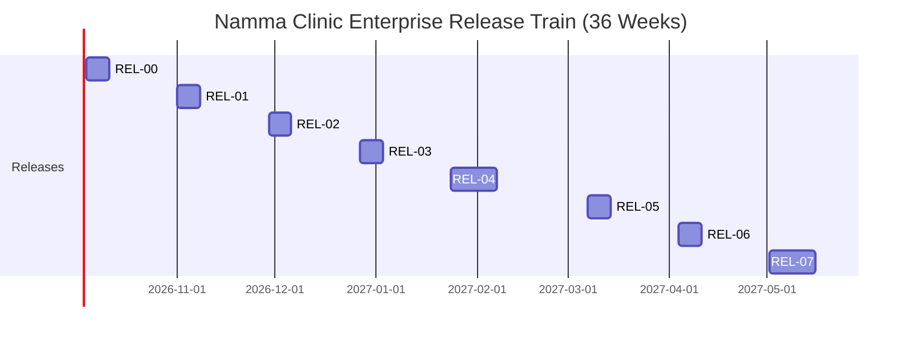

# Master Release Management, SemVer & Clinical Deployment Governance Architecture

Authoritative engineering governance specification establishing the enterprise release management lifecycle, Semantic Versioning (SemVer) standards, release candidate certification protocols, clinical rollback runbooks, and automated changelog generation for the Namma Clinic Digital Health & Operations Platform across 450+ municipal clinics under the Greater Bengaluru Authority (GBA) and BBMP Health Department.

| Governance Attribute | Specification Value |
| :--- | :--- |
| **Document Identifier** | `DOC-GH-09-RELEASE-MGMT` |
| **Document Title** | Master Release Management, SemVer & Clinical Deployment Governance Architecture |
| **Document Version** | `1.0.0` |
| **Security Classification** | `RESTRICTED - GBA / BBMP HEALTH DEPARTMENT INTERNAL ONLY` |
| **Ratification Status** | `APPROVED & RATIFIED GOVERNANCE BASELINE` |
| **Program Domain** | Release Engineering, Deployment Operations & Change Management |
| **Target Audience** | Release Engineers, DevOps Leads, Clinical Leads, Delivery Managers, Security Architects |

## 1. Executive Summary & Release Engineering Intent
In a healthcare platform managing clinical workflows across 450+ municipal dispensaries, release failures are not merely operational setbacks — they are potential clinical safety events. The release engineering discipline mandates deterministic, auditable, and rollback-capable deployment pipelines with explicit clinical and statutory sign-off at every gate.

This specification establishes:
1. **The 8-Release Enterprise Delivery Train:** Vehicles `REL-00` through `REL-07` spanning 36 calendar weeks from foundation scaffolding to citywide production launch.
2. **Semantic Versioning (SemVer) Standards:** Strict `MAJOR.MINOR.PATCH-rc.N` conventions with pre-release candidate tagging.
3. **45 Authoritative Release Governance Rules (`RELRULE-001` through `RELRULE-045`):** Policies governing versioning, RC certification, changelog generation, rollback protocols, and clinical deploy approval.
4. **Release Candidate Certification Checklist:** 15-gate verification matrix mandating zero P0 defects, 100% staging tests green, and CMO clinical approval.
5. **Automated Changelog & GitHub Release Drafting:** Declarative specifications for conventional-commit based changelog generators.
6. **120 Release Governance Acceptance Criteria (`AC-REL-001` to `AC-REL-120`):** Authoritative verification gates certifying deployment safety, version integrity, and full audit trails.

> [!IMPORTANT]
> **Clinical Safety Deployment Invariant**
> No release candidate may be promoted to production deployment at any municipal clinic without signed written approval from the Chief Medical Officer (CMO), verified zero-P0 staging test results, and a deterministic rollback runbook committed to the repository. Violations trigger immediate deployment halt and incident review.

## 2. Enterprise Release Train Roadmap (REL-00 to REL-07)
The platform delivers value via 8 enterprise release vehicles, each bundling sprint deliverables into deployment-ready packages:

### Architecture Diagram: Enterprise Release Train Gantt Roadmap


### 2.1. Release Vehicle Summary

| Release ID | Release Title | Target Week | Scope Summary | Exit Gate |
| :--- | :--- | :--- | :--- | :--- |
| **`REL-00`** | Foundation & Scaffolding Gate | `Week 04` | Core platform scaffolding, CI/CD pipeline, multi-tenant Fastify, PostgreSQL baseline. | Development environment certification |
| **`REL-01`** | Core OPD & Patient Registration | `Week 08` | Outpatient registration, consultation workflow, vitals capture, basic prescription generation. | Staging clinic functional smoke test |
| **`REL-02`** | Pharmacy, Formulary & Dispensing | `Week 12` | Digital formulary, dispensing workflow, stock management, offline-first medication sync. | Pharmacist acceptance test at pilot dispensary |
| **`REL-03`** | Laboratory, Diagnostics & Referral | `Week 16` | Lab order management, LOINC coding, diagnostic report viewing, referral workflow. | Lab technician workflow validation |
| **`REL-04`** | Pilot Deployment (5 Clinics) | `Week 20` | Full stack deployment at 5 designated BBMP pilot clinics with live patients. | Field operational readiness certification |
| **`REL-05`** | Advanced Clinical: ANC, NCD, Immunization | `Week 24` | Antenatal care, NCD screening (HTN/DM), UIP immunization scheduling. | Clinical protocol compliance verification |
| **`REL-06`** | Data Analytics, BI & Reporting | `Week 28` | ClickHouse analytics pipeline, Superset dashboards, BBMP ward-level KPIs. | Executive dashboard acceptance review |
| **`REL-07`** | Citywide Production Launch (450+ Clinics) | `Week 32-36` | Progressive rollout across all BBMP urban PHCs and dispensaries. | Citywide operational readiness certification |

### 2.2. Detailed Profile: REL-00 — Foundation & Scaffolding Gate
- **Release Identifier:** `REL-00`
- **Release Display Title:** Foundation & Scaffolding Gate
- **Target Deployment Window:** Week 04
- **Primary Scope:** Core platform scaffolding, CI/CD pipeline, multi-tenant Fastify, PostgreSQL baseline.
- **Exit Gate Verification:** Development environment certification
- **SemVer Tag Pattern:** `v00.0.0` for GA, `v00.0.0-rc.N` for candidates.
- **Rollback Target:** Previous stable `REL-00` tag or last-known-good staging checkpoint.

### 2.2. Detailed Profile: REL-01 — Core OPD & Patient Registration
- **Release Identifier:** `REL-01`
- **Release Display Title:** Core OPD & Patient Registration
- **Target Deployment Window:** Week 08
- **Primary Scope:** Outpatient registration, consultation workflow, vitals capture, basic prescription generation.
- **Exit Gate Verification:** Staging clinic functional smoke test
- **SemVer Tag Pattern:** `v01.0.0` for GA, `v01.0.0-rc.N` for candidates.
- **Rollback Target:** Previous stable `REL-01` tag or last-known-good staging checkpoint.

### 2.2. Detailed Profile: REL-02 — Pharmacy, Formulary & Dispensing
- **Release Identifier:** `REL-02`
- **Release Display Title:** Pharmacy, Formulary & Dispensing
- **Target Deployment Window:** Week 12
- **Primary Scope:** Digital formulary, dispensing workflow, stock management, offline-first medication sync.
- **Exit Gate Verification:** Pharmacist acceptance test at pilot dispensary
- **SemVer Tag Pattern:** `v02.0.0` for GA, `v02.0.0-rc.N` for candidates.
- **Rollback Target:** Previous stable `REL-02` tag or last-known-good staging checkpoint.

### 2.2. Detailed Profile: REL-03 — Laboratory, Diagnostics & Referral
- **Release Identifier:** `REL-03`
- **Release Display Title:** Laboratory, Diagnostics & Referral
- **Target Deployment Window:** Week 16
- **Primary Scope:** Lab order management, LOINC coding, diagnostic report viewing, referral workflow.
- **Exit Gate Verification:** Lab technician workflow validation
- **SemVer Tag Pattern:** `v03.0.0` for GA, `v03.0.0-rc.N` for candidates.
- **Rollback Target:** Previous stable `REL-03` tag or last-known-good staging checkpoint.

### 2.2. Detailed Profile: REL-04 — Pilot Deployment (5 Clinics)
- **Release Identifier:** `REL-04`
- **Release Display Title:** Pilot Deployment (5 Clinics)
- **Target Deployment Window:** Week 20
- **Primary Scope:** Full stack deployment at 5 designated BBMP pilot clinics with live patients.
- **Exit Gate Verification:** Field operational readiness certification
- **SemVer Tag Pattern:** `v04.0.0` for GA, `v04.0.0-rc.N` for candidates.
- **Rollback Target:** Previous stable `REL-04` tag or last-known-good staging checkpoint.

### 2.2. Detailed Profile: REL-05 — Advanced Clinical: ANC, NCD, Immunization
- **Release Identifier:** `REL-05`
- **Release Display Title:** Advanced Clinical: ANC, NCD, Immunization
- **Target Deployment Window:** Week 24
- **Primary Scope:** Antenatal care, NCD screening (HTN/DM), UIP immunization scheduling.
- **Exit Gate Verification:** Clinical protocol compliance verification
- **SemVer Tag Pattern:** `v05.0.0` for GA, `v05.0.0-rc.N` for candidates.
- **Rollback Target:** Previous stable `REL-05` tag or last-known-good staging checkpoint.

### 2.2. Detailed Profile: REL-06 — Data Analytics, BI & Reporting
- **Release Identifier:** `REL-06`
- **Release Display Title:** Data Analytics, BI & Reporting
- **Target Deployment Window:** Week 28
- **Primary Scope:** ClickHouse analytics pipeline, Superset dashboards, BBMP ward-level KPIs.
- **Exit Gate Verification:** Executive dashboard acceptance review
- **SemVer Tag Pattern:** `v06.0.0` for GA, `v06.0.0-rc.N` for candidates.
- **Rollback Target:** Previous stable `REL-06` tag or last-known-good staging checkpoint.

### 2.2. Detailed Profile: REL-07 — Citywide Production Launch (450+ Clinics)
- **Release Identifier:** `REL-07`
- **Release Display Title:** Citywide Production Launch (450+ Clinics)
- **Target Deployment Window:** Week 32-36
- **Primary Scope:** Progressive rollout across all BBMP urban PHCs and dispensaries.
- **Exit Gate Verification:** Citywide operational readiness certification
- **SemVer Tag Pattern:** `v07.0.0` for GA, `v07.0.0-rc.N` for candidates.
- **Rollback Target:** Previous stable `REL-07` tag or last-known-good staging checkpoint.

## 3. Semantic Versioning (SemVer) & Tag Naming Standards
All release artifacts follow strict Semantic Versioning 2.0.0 conventions:

- **`MAJOR.MINOR.PATCH`:** Increment MAJOR for breaking API contract changes, MINOR for backward-compatible feature additions, PATCH for backward-compatible defect fixes.
- **Pre-Release Candidates:** Tagged as `vX.Y.Z-rc.N` (e.g., `v1.0.0-rc.1`, `v1.0.0-rc.2`).
- **Build Metadata:** Append `+build.<sha>` for CI traceability (e.g., `v1.0.0-rc.1+build.abc1234`).
- **Immutability Invariant:** Once a semantic version tag is published to the repository, it is permanently frozen. Re-tagging is strictly prohibited.
- **Clinical Safety Boundary:** Any change modifying clinical algorithms or drug interaction rules mandates MAJOR version increment regardless of API contract impact.

## 4. Authoritative Release Governance Rules Catalog (RELRULE-001 to RELRULE-045)
Comprehensive governance profiles for all 45 canonical release management rules:

### RELRULE-001: Release Engineering Rule 01: Versioning & SemVer (Area: Versioning & SemVer)
- **Rule Identifier:** `RELRULE-001`
- **Rule Title:** Release Engineering Rule 01: Versioning & SemVer
- **Governance Functional Area:** `Versioning & SemVer`
- **Authoritative Policy Statement:** Authoritative release management protocol governing versioning & semver for GBA / BBMP healthcare platform deployments.
- **Concrete Acceptance Standard:** Validated by Release Train Engineer, Chief Medical Officer, and CISO sign-off.
- **Governance Quality Gate Linkage:** `QUALITY-GATE-002`

#### Verification & Enforcement Directives for RELRULE-001
1. **Pre-Release Check:** Release Train Engineer verifies `RELRULE-001` conformance during RC certification review.
2. **Automated Gate:** GitHub Actions release pipeline evaluates rule adherence before tag promotion.
3. **Non-Compliance Remediation:** Release candidate tag revoked and returned to staging for re-certification.
4. **Audit Evidence:** All verification artifacts persisted in release notes and compliance archive.

#### Clinical & Operational Impact of RELRULE-001
- **Clinical Safety Boundary:** Ensures municipal clinic software updates are verified against patient safety baselines.
- **Regulatory Alignment:** Satisfies BBMP Health Department and DPDP Act 2023 deployment audit requirements.
- **Escalation Protocol:** Violations escalate to Joint Commissioner (Health) and Technical Steering Committee.

### RELRULE-002: Release Engineering Rule 02: Versioning & SemVer (Area: Versioning & SemVer)
- **Rule Identifier:** `RELRULE-002`
- **Rule Title:** Release Engineering Rule 02: Versioning & SemVer
- **Governance Functional Area:** `Versioning & SemVer`
- **Authoritative Policy Statement:** Authoritative release management protocol governing versioning & semver for GBA / BBMP healthcare platform deployments.
- **Concrete Acceptance Standard:** Validated by Release Train Engineer, Chief Medical Officer, and CISO sign-off.
- **Governance Quality Gate Linkage:** `QUALITY-GATE-003`

#### Verification & Enforcement Directives for RELRULE-002
1. **Pre-Release Check:** Release Train Engineer verifies `RELRULE-002` conformance during RC certification review.
2. **Automated Gate:** GitHub Actions release pipeline evaluates rule adherence before tag promotion.
3. **Non-Compliance Remediation:** Release candidate tag revoked and returned to staging for re-certification.
4. **Audit Evidence:** All verification artifacts persisted in release notes and compliance archive.

#### Clinical & Operational Impact of RELRULE-002
- **Clinical Safety Boundary:** Ensures municipal clinic software updates are verified against patient safety baselines.
- **Regulatory Alignment:** Satisfies BBMP Health Department and DPDP Act 2023 deployment audit requirements.
- **Escalation Protocol:** Violations escalate to Joint Commissioner (Health) and Technical Steering Committee.

### RELRULE-003: Release Engineering Rule 03: Versioning & SemVer (Area: Versioning & SemVer)
- **Rule Identifier:** `RELRULE-003`
- **Rule Title:** Release Engineering Rule 03: Versioning & SemVer
- **Governance Functional Area:** `Versioning & SemVer`
- **Authoritative Policy Statement:** Authoritative release management protocol governing versioning & semver for GBA / BBMP healthcare platform deployments.
- **Concrete Acceptance Standard:** Validated by Release Train Engineer, Chief Medical Officer, and CISO sign-off.
- **Governance Quality Gate Linkage:** `QUALITY-GATE-004`

#### Verification & Enforcement Directives for RELRULE-003
1. **Pre-Release Check:** Release Train Engineer verifies `RELRULE-003` conformance during RC certification review.
2. **Automated Gate:** GitHub Actions release pipeline evaluates rule adherence before tag promotion.
3. **Non-Compliance Remediation:** Release candidate tag revoked and returned to staging for re-certification.
4. **Audit Evidence:** All verification artifacts persisted in release notes and compliance archive.

#### Clinical & Operational Impact of RELRULE-003
- **Clinical Safety Boundary:** Ensures municipal clinic software updates are verified against patient safety baselines.
- **Regulatory Alignment:** Satisfies BBMP Health Department and DPDP Act 2023 deployment audit requirements.
- **Escalation Protocol:** Violations escalate to Joint Commissioner (Health) and Technical Steering Committee.

### RELRULE-004: Release Engineering Rule 04: Versioning & SemVer (Area: Versioning & SemVer)
- **Rule Identifier:** `RELRULE-004`
- **Rule Title:** Release Engineering Rule 04: Versioning & SemVer
- **Governance Functional Area:** `Versioning & SemVer`
- **Authoritative Policy Statement:** Authoritative release management protocol governing versioning & semver for GBA / BBMP healthcare platform deployments.
- **Concrete Acceptance Standard:** Validated by Release Train Engineer, Chief Medical Officer, and CISO sign-off.
- **Governance Quality Gate Linkage:** `QUALITY-GATE-005`

#### Verification & Enforcement Directives for RELRULE-004
1. **Pre-Release Check:** Release Train Engineer verifies `RELRULE-004` conformance during RC certification review.
2. **Automated Gate:** GitHub Actions release pipeline evaluates rule adherence before tag promotion.
3. **Non-Compliance Remediation:** Release candidate tag revoked and returned to staging for re-certification.
4. **Audit Evidence:** All verification artifacts persisted in release notes and compliance archive.

#### Clinical & Operational Impact of RELRULE-004
- **Clinical Safety Boundary:** Ensures municipal clinic software updates are verified against patient safety baselines.
- **Regulatory Alignment:** Satisfies BBMP Health Department and DPDP Act 2023 deployment audit requirements.
- **Escalation Protocol:** Violations escalate to Joint Commissioner (Health) and Technical Steering Committee.

### RELRULE-005: Release Engineering Rule 05: Versioning & SemVer (Area: Versioning & SemVer)
- **Rule Identifier:** `RELRULE-005`
- **Rule Title:** Release Engineering Rule 05: Versioning & SemVer
- **Governance Functional Area:** `Versioning & SemVer`
- **Authoritative Policy Statement:** Authoritative release management protocol governing versioning & semver for GBA / BBMP healthcare platform deployments.
- **Concrete Acceptance Standard:** Validated by Release Train Engineer, Chief Medical Officer, and CISO sign-off.
- **Governance Quality Gate Linkage:** `QUALITY-GATE-006`

#### Verification & Enforcement Directives for RELRULE-005
1. **Pre-Release Check:** Release Train Engineer verifies `RELRULE-005` conformance during RC certification review.
2. **Automated Gate:** GitHub Actions release pipeline evaluates rule adherence before tag promotion.
3. **Non-Compliance Remediation:** Release candidate tag revoked and returned to staging for re-certification.
4. **Audit Evidence:** All verification artifacts persisted in release notes and compliance archive.

#### Clinical & Operational Impact of RELRULE-005
- **Clinical Safety Boundary:** Ensures municipal clinic software updates are verified against patient safety baselines.
- **Regulatory Alignment:** Satisfies BBMP Health Department and DPDP Act 2023 deployment audit requirements.
- **Escalation Protocol:** Violations escalate to Joint Commissioner (Health) and Technical Steering Committee.

### RELRULE-006: Release Engineering Rule 06: Versioning & SemVer (Area: Versioning & SemVer)
- **Rule Identifier:** `RELRULE-006`
- **Rule Title:** Release Engineering Rule 06: Versioning & SemVer
- **Governance Functional Area:** `Versioning & SemVer`
- **Authoritative Policy Statement:** Authoritative release management protocol governing versioning & semver for GBA / BBMP healthcare platform deployments.
- **Concrete Acceptance Standard:** Validated by Release Train Engineer, Chief Medical Officer, and CISO sign-off.
- **Governance Quality Gate Linkage:** `QUALITY-GATE-007`

#### Verification & Enforcement Directives for RELRULE-006
1. **Pre-Release Check:** Release Train Engineer verifies `RELRULE-006` conformance during RC certification review.
2. **Automated Gate:** GitHub Actions release pipeline evaluates rule adherence before tag promotion.
3. **Non-Compliance Remediation:** Release candidate tag revoked and returned to staging for re-certification.
4. **Audit Evidence:** All verification artifacts persisted in release notes and compliance archive.

#### Clinical & Operational Impact of RELRULE-006
- **Clinical Safety Boundary:** Ensures municipal clinic software updates are verified against patient safety baselines.
- **Regulatory Alignment:** Satisfies BBMP Health Department and DPDP Act 2023 deployment audit requirements.
- **Escalation Protocol:** Violations escalate to Joint Commissioner (Health) and Technical Steering Committee.

### RELRULE-007: Release Engineering Rule 07: Versioning & SemVer (Area: Versioning & SemVer)
- **Rule Identifier:** `RELRULE-007`
- **Rule Title:** Release Engineering Rule 07: Versioning & SemVer
- **Governance Functional Area:** `Versioning & SemVer`
- **Authoritative Policy Statement:** Authoritative release management protocol governing versioning & semver for GBA / BBMP healthcare platform deployments.
- **Concrete Acceptance Standard:** Validated by Release Train Engineer, Chief Medical Officer, and CISO sign-off.
- **Governance Quality Gate Linkage:** `QUALITY-GATE-008`

#### Verification & Enforcement Directives for RELRULE-007
1. **Pre-Release Check:** Release Train Engineer verifies `RELRULE-007` conformance during RC certification review.
2. **Automated Gate:** GitHub Actions release pipeline evaluates rule adherence before tag promotion.
3. **Non-Compliance Remediation:** Release candidate tag revoked and returned to staging for re-certification.
4. **Audit Evidence:** All verification artifacts persisted in release notes and compliance archive.

#### Clinical & Operational Impact of RELRULE-007
- **Clinical Safety Boundary:** Ensures municipal clinic software updates are verified against patient safety baselines.
- **Regulatory Alignment:** Satisfies BBMP Health Department and DPDP Act 2023 deployment audit requirements.
- **Escalation Protocol:** Violations escalate to Joint Commissioner (Health) and Technical Steering Committee.

### RELRULE-008: Release Engineering Rule 08: Versioning & SemVer (Area: Versioning & SemVer)
- **Rule Identifier:** `RELRULE-008`
- **Rule Title:** Release Engineering Rule 08: Versioning & SemVer
- **Governance Functional Area:** `Versioning & SemVer`
- **Authoritative Policy Statement:** Authoritative release management protocol governing versioning & semver for GBA / BBMP healthcare platform deployments.
- **Concrete Acceptance Standard:** Validated by Release Train Engineer, Chief Medical Officer, and CISO sign-off.
- **Governance Quality Gate Linkage:** `QUALITY-GATE-009`

#### Verification & Enforcement Directives for RELRULE-008
1. **Pre-Release Check:** Release Train Engineer verifies `RELRULE-008` conformance during RC certification review.
2. **Automated Gate:** GitHub Actions release pipeline evaluates rule adherence before tag promotion.
3. **Non-Compliance Remediation:** Release candidate tag revoked and returned to staging for re-certification.
4. **Audit Evidence:** All verification artifacts persisted in release notes and compliance archive.

#### Clinical & Operational Impact of RELRULE-008
- **Clinical Safety Boundary:** Ensures municipal clinic software updates are verified against patient safety baselines.
- **Regulatory Alignment:** Satisfies BBMP Health Department and DPDP Act 2023 deployment audit requirements.
- **Escalation Protocol:** Violations escalate to Joint Commissioner (Health) and Technical Steering Committee.

### RELRULE-009: Release Engineering Rule 09: Versioning & SemVer (Area: Versioning & SemVer)
- **Rule Identifier:** `RELRULE-009`
- **Rule Title:** Release Engineering Rule 09: Versioning & SemVer
- **Governance Functional Area:** `Versioning & SemVer`
- **Authoritative Policy Statement:** Authoritative release management protocol governing versioning & semver for GBA / BBMP healthcare platform deployments.
- **Concrete Acceptance Standard:** Validated by Release Train Engineer, Chief Medical Officer, and CISO sign-off.
- **Governance Quality Gate Linkage:** `QUALITY-GATE-010`

#### Verification & Enforcement Directives for RELRULE-009
1. **Pre-Release Check:** Release Train Engineer verifies `RELRULE-009` conformance during RC certification review.
2. **Automated Gate:** GitHub Actions release pipeline evaluates rule adherence before tag promotion.
3. **Non-Compliance Remediation:** Release candidate tag revoked and returned to staging for re-certification.
4. **Audit Evidence:** All verification artifacts persisted in release notes and compliance archive.

#### Clinical & Operational Impact of RELRULE-009
- **Clinical Safety Boundary:** Ensures municipal clinic software updates are verified against patient safety baselines.
- **Regulatory Alignment:** Satisfies BBMP Health Department and DPDP Act 2023 deployment audit requirements.
- **Escalation Protocol:** Violations escalate to Joint Commissioner (Health) and Technical Steering Committee.

### RELRULE-010: Release Engineering Rule 10: Release Candidate Process (Area: Release Candidate Process)
- **Rule Identifier:** `RELRULE-010`
- **Rule Title:** Release Engineering Rule 10: Release Candidate Process
- **Governance Functional Area:** `Release Candidate Process`
- **Authoritative Policy Statement:** Authoritative release management protocol governing release candidate process for GBA / BBMP healthcare platform deployments.
- **Concrete Acceptance Standard:** Validated by Release Train Engineer, Chief Medical Officer, and CISO sign-off.
- **Governance Quality Gate Linkage:** `QUALITY-GATE-001`

#### Verification & Enforcement Directives for RELRULE-010
1. **Pre-Release Check:** Release Train Engineer verifies `RELRULE-010` conformance during RC certification review.
2. **Automated Gate:** GitHub Actions release pipeline evaluates rule adherence before tag promotion.
3. **Non-Compliance Remediation:** Release candidate tag revoked and returned to staging for re-certification.
4. **Audit Evidence:** All verification artifacts persisted in release notes and compliance archive.

#### Clinical & Operational Impact of RELRULE-010
- **Clinical Safety Boundary:** Ensures municipal clinic software updates are verified against patient safety baselines.
- **Regulatory Alignment:** Satisfies BBMP Health Department and DPDP Act 2023 deployment audit requirements.
- **Escalation Protocol:** Violations escalate to Joint Commissioner (Health) and Technical Steering Committee.

### RELRULE-011: Release Engineering Rule 11: Release Candidate Process (Area: Release Candidate Process)
- **Rule Identifier:** `RELRULE-011`
- **Rule Title:** Release Engineering Rule 11: Release Candidate Process
- **Governance Functional Area:** `Release Candidate Process`
- **Authoritative Policy Statement:** Authoritative release management protocol governing release candidate process for GBA / BBMP healthcare platform deployments.
- **Concrete Acceptance Standard:** Validated by Release Train Engineer, Chief Medical Officer, and CISO sign-off.
- **Governance Quality Gate Linkage:** `QUALITY-GATE-002`

#### Verification & Enforcement Directives for RELRULE-011
1. **Pre-Release Check:** Release Train Engineer verifies `RELRULE-011` conformance during RC certification review.
2. **Automated Gate:** GitHub Actions release pipeline evaluates rule adherence before tag promotion.
3. **Non-Compliance Remediation:** Release candidate tag revoked and returned to staging for re-certification.
4. **Audit Evidence:** All verification artifacts persisted in release notes and compliance archive.

#### Clinical & Operational Impact of RELRULE-011
- **Clinical Safety Boundary:** Ensures municipal clinic software updates are verified against patient safety baselines.
- **Regulatory Alignment:** Satisfies BBMP Health Department and DPDP Act 2023 deployment audit requirements.
- **Escalation Protocol:** Violations escalate to Joint Commissioner (Health) and Technical Steering Committee.

### RELRULE-012: Release Engineering Rule 12: Release Candidate Process (Area: Release Candidate Process)
- **Rule Identifier:** `RELRULE-012`
- **Rule Title:** Release Engineering Rule 12: Release Candidate Process
- **Governance Functional Area:** `Release Candidate Process`
- **Authoritative Policy Statement:** Authoritative release management protocol governing release candidate process for GBA / BBMP healthcare platform deployments.
- **Concrete Acceptance Standard:** Validated by Release Train Engineer, Chief Medical Officer, and CISO sign-off.
- **Governance Quality Gate Linkage:** `QUALITY-GATE-003`

#### Verification & Enforcement Directives for RELRULE-012
1. **Pre-Release Check:** Release Train Engineer verifies `RELRULE-012` conformance during RC certification review.
2. **Automated Gate:** GitHub Actions release pipeline evaluates rule adherence before tag promotion.
3. **Non-Compliance Remediation:** Release candidate tag revoked and returned to staging for re-certification.
4. **Audit Evidence:** All verification artifacts persisted in release notes and compliance archive.

#### Clinical & Operational Impact of RELRULE-012
- **Clinical Safety Boundary:** Ensures municipal clinic software updates are verified against patient safety baselines.
- **Regulatory Alignment:** Satisfies BBMP Health Department and DPDP Act 2023 deployment audit requirements.
- **Escalation Protocol:** Violations escalate to Joint Commissioner (Health) and Technical Steering Committee.

### RELRULE-013: Release Engineering Rule 13: Release Candidate Process (Area: Release Candidate Process)
- **Rule Identifier:** `RELRULE-013`
- **Rule Title:** Release Engineering Rule 13: Release Candidate Process
- **Governance Functional Area:** `Release Candidate Process`
- **Authoritative Policy Statement:** Authoritative release management protocol governing release candidate process for GBA / BBMP healthcare platform deployments.
- **Concrete Acceptance Standard:** Validated by Release Train Engineer, Chief Medical Officer, and CISO sign-off.
- **Governance Quality Gate Linkage:** `QUALITY-GATE-004`

#### Verification & Enforcement Directives for RELRULE-013
1. **Pre-Release Check:** Release Train Engineer verifies `RELRULE-013` conformance during RC certification review.
2. **Automated Gate:** GitHub Actions release pipeline evaluates rule adherence before tag promotion.
3. **Non-Compliance Remediation:** Release candidate tag revoked and returned to staging for re-certification.
4. **Audit Evidence:** All verification artifacts persisted in release notes and compliance archive.

#### Clinical & Operational Impact of RELRULE-013
- **Clinical Safety Boundary:** Ensures municipal clinic software updates are verified against patient safety baselines.
- **Regulatory Alignment:** Satisfies BBMP Health Department and DPDP Act 2023 deployment audit requirements.
- **Escalation Protocol:** Violations escalate to Joint Commissioner (Health) and Technical Steering Committee.

### RELRULE-014: Release Engineering Rule 14: Release Candidate Process (Area: Release Candidate Process)
- **Rule Identifier:** `RELRULE-014`
- **Rule Title:** Release Engineering Rule 14: Release Candidate Process
- **Governance Functional Area:** `Release Candidate Process`
- **Authoritative Policy Statement:** Authoritative release management protocol governing release candidate process for GBA / BBMP healthcare platform deployments.
- **Concrete Acceptance Standard:** Validated by Release Train Engineer, Chief Medical Officer, and CISO sign-off.
- **Governance Quality Gate Linkage:** `QUALITY-GATE-005`

#### Verification & Enforcement Directives for RELRULE-014
1. **Pre-Release Check:** Release Train Engineer verifies `RELRULE-014` conformance during RC certification review.
2. **Automated Gate:** GitHub Actions release pipeline evaluates rule adherence before tag promotion.
3. **Non-Compliance Remediation:** Release candidate tag revoked and returned to staging for re-certification.
4. **Audit Evidence:** All verification artifacts persisted in release notes and compliance archive.

#### Clinical & Operational Impact of RELRULE-014
- **Clinical Safety Boundary:** Ensures municipal clinic software updates are verified against patient safety baselines.
- **Regulatory Alignment:** Satisfies BBMP Health Department and DPDP Act 2023 deployment audit requirements.
- **Escalation Protocol:** Violations escalate to Joint Commissioner (Health) and Technical Steering Committee.

### RELRULE-015: Release Engineering Rule 15: Release Candidate Process (Area: Release Candidate Process)
- **Rule Identifier:** `RELRULE-015`
- **Rule Title:** Release Engineering Rule 15: Release Candidate Process
- **Governance Functional Area:** `Release Candidate Process`
- **Authoritative Policy Statement:** Authoritative release management protocol governing release candidate process for GBA / BBMP healthcare platform deployments.
- **Concrete Acceptance Standard:** Validated by Release Train Engineer, Chief Medical Officer, and CISO sign-off.
- **Governance Quality Gate Linkage:** `QUALITY-GATE-006`

#### Verification & Enforcement Directives for RELRULE-015
1. **Pre-Release Check:** Release Train Engineer verifies `RELRULE-015` conformance during RC certification review.
2. **Automated Gate:** GitHub Actions release pipeline evaluates rule adherence before tag promotion.
3. **Non-Compliance Remediation:** Release candidate tag revoked and returned to staging for re-certification.
4. **Audit Evidence:** All verification artifacts persisted in release notes and compliance archive.

#### Clinical & Operational Impact of RELRULE-015
- **Clinical Safety Boundary:** Ensures municipal clinic software updates are verified against patient safety baselines.
- **Regulatory Alignment:** Satisfies BBMP Health Department and DPDP Act 2023 deployment audit requirements.
- **Escalation Protocol:** Violations escalate to Joint Commissioner (Health) and Technical Steering Committee.

### RELRULE-016: Release Engineering Rule 16: Release Candidate Process (Area: Release Candidate Process)
- **Rule Identifier:** `RELRULE-016`
- **Rule Title:** Release Engineering Rule 16: Release Candidate Process
- **Governance Functional Area:** `Release Candidate Process`
- **Authoritative Policy Statement:** Authoritative release management protocol governing release candidate process for GBA / BBMP healthcare platform deployments.
- **Concrete Acceptance Standard:** Validated by Release Train Engineer, Chief Medical Officer, and CISO sign-off.
- **Governance Quality Gate Linkage:** `QUALITY-GATE-007`

#### Verification & Enforcement Directives for RELRULE-016
1. **Pre-Release Check:** Release Train Engineer verifies `RELRULE-016` conformance during RC certification review.
2. **Automated Gate:** GitHub Actions release pipeline evaluates rule adherence before tag promotion.
3. **Non-Compliance Remediation:** Release candidate tag revoked and returned to staging for re-certification.
4. **Audit Evidence:** All verification artifacts persisted in release notes and compliance archive.

#### Clinical & Operational Impact of RELRULE-016
- **Clinical Safety Boundary:** Ensures municipal clinic software updates are verified against patient safety baselines.
- **Regulatory Alignment:** Satisfies BBMP Health Department and DPDP Act 2023 deployment audit requirements.
- **Escalation Protocol:** Violations escalate to Joint Commissioner (Health) and Technical Steering Committee.

### RELRULE-017: Release Engineering Rule 17: Release Candidate Process (Area: Release Candidate Process)
- **Rule Identifier:** `RELRULE-017`
- **Rule Title:** Release Engineering Rule 17: Release Candidate Process
- **Governance Functional Area:** `Release Candidate Process`
- **Authoritative Policy Statement:** Authoritative release management protocol governing release candidate process for GBA / BBMP healthcare platform deployments.
- **Concrete Acceptance Standard:** Validated by Release Train Engineer, Chief Medical Officer, and CISO sign-off.
- **Governance Quality Gate Linkage:** `QUALITY-GATE-008`

#### Verification & Enforcement Directives for RELRULE-017
1. **Pre-Release Check:** Release Train Engineer verifies `RELRULE-017` conformance during RC certification review.
2. **Automated Gate:** GitHub Actions release pipeline evaluates rule adherence before tag promotion.
3. **Non-Compliance Remediation:** Release candidate tag revoked and returned to staging for re-certification.
4. **Audit Evidence:** All verification artifacts persisted in release notes and compliance archive.

#### Clinical & Operational Impact of RELRULE-017
- **Clinical Safety Boundary:** Ensures municipal clinic software updates are verified against patient safety baselines.
- **Regulatory Alignment:** Satisfies BBMP Health Department and DPDP Act 2023 deployment audit requirements.
- **Escalation Protocol:** Violations escalate to Joint Commissioner (Health) and Technical Steering Committee.

### RELRULE-018: Release Engineering Rule 18: Release Candidate Process (Area: Release Candidate Process)
- **Rule Identifier:** `RELRULE-018`
- **Rule Title:** Release Engineering Rule 18: Release Candidate Process
- **Governance Functional Area:** `Release Candidate Process`
- **Authoritative Policy Statement:** Authoritative release management protocol governing release candidate process for GBA / BBMP healthcare platform deployments.
- **Concrete Acceptance Standard:** Validated by Release Train Engineer, Chief Medical Officer, and CISO sign-off.
- **Governance Quality Gate Linkage:** `QUALITY-GATE-009`

#### Verification & Enforcement Directives for RELRULE-018
1. **Pre-Release Check:** Release Train Engineer verifies `RELRULE-018` conformance during RC certification review.
2. **Automated Gate:** GitHub Actions release pipeline evaluates rule adherence before tag promotion.
3. **Non-Compliance Remediation:** Release candidate tag revoked and returned to staging for re-certification.
4. **Audit Evidence:** All verification artifacts persisted in release notes and compliance archive.

#### Clinical & Operational Impact of RELRULE-018
- **Clinical Safety Boundary:** Ensures municipal clinic software updates are verified against patient safety baselines.
- **Regulatory Alignment:** Satisfies BBMP Health Department and DPDP Act 2023 deployment audit requirements.
- **Escalation Protocol:** Violations escalate to Joint Commissioner (Health) and Technical Steering Committee.

### RELRULE-019: Release Engineering Rule 19: Changelog & Notes (Area: Changelog & Notes)
- **Rule Identifier:** `RELRULE-019`
- **Rule Title:** Release Engineering Rule 19: Changelog & Notes
- **Governance Functional Area:** `Changelog & Notes`
- **Authoritative Policy Statement:** Authoritative release management protocol governing changelog & notes for GBA / BBMP healthcare platform deployments.
- **Concrete Acceptance Standard:** Validated by Release Train Engineer, Chief Medical Officer, and CISO sign-off.
- **Governance Quality Gate Linkage:** `QUALITY-GATE-010`

#### Verification & Enforcement Directives for RELRULE-019
1. **Pre-Release Check:** Release Train Engineer verifies `RELRULE-019` conformance during RC certification review.
2. **Automated Gate:** GitHub Actions release pipeline evaluates rule adherence before tag promotion.
3. **Non-Compliance Remediation:** Release candidate tag revoked and returned to staging for re-certification.
4. **Audit Evidence:** All verification artifacts persisted in release notes and compliance archive.

#### Clinical & Operational Impact of RELRULE-019
- **Clinical Safety Boundary:** Ensures municipal clinic software updates are verified against patient safety baselines.
- **Regulatory Alignment:** Satisfies BBMP Health Department and DPDP Act 2023 deployment audit requirements.
- **Escalation Protocol:** Violations escalate to Joint Commissioner (Health) and Technical Steering Committee.

### RELRULE-020: Release Engineering Rule 20: Changelog & Notes (Area: Changelog & Notes)
- **Rule Identifier:** `RELRULE-020`
- **Rule Title:** Release Engineering Rule 20: Changelog & Notes
- **Governance Functional Area:** `Changelog & Notes`
- **Authoritative Policy Statement:** Authoritative release management protocol governing changelog & notes for GBA / BBMP healthcare platform deployments.
- **Concrete Acceptance Standard:** Validated by Release Train Engineer, Chief Medical Officer, and CISO sign-off.
- **Governance Quality Gate Linkage:** `QUALITY-GATE-001`

#### Verification & Enforcement Directives for RELRULE-020
1. **Pre-Release Check:** Release Train Engineer verifies `RELRULE-020` conformance during RC certification review.
2. **Automated Gate:** GitHub Actions release pipeline evaluates rule adherence before tag promotion.
3. **Non-Compliance Remediation:** Release candidate tag revoked and returned to staging for re-certification.
4. **Audit Evidence:** All verification artifacts persisted in release notes and compliance archive.

#### Clinical & Operational Impact of RELRULE-020
- **Clinical Safety Boundary:** Ensures municipal clinic software updates are verified against patient safety baselines.
- **Regulatory Alignment:** Satisfies BBMP Health Department and DPDP Act 2023 deployment audit requirements.
- **Escalation Protocol:** Violations escalate to Joint Commissioner (Health) and Technical Steering Committee.

### RELRULE-021: Release Engineering Rule 21: Changelog & Notes (Area: Changelog & Notes)
- **Rule Identifier:** `RELRULE-021`
- **Rule Title:** Release Engineering Rule 21: Changelog & Notes
- **Governance Functional Area:** `Changelog & Notes`
- **Authoritative Policy Statement:** Authoritative release management protocol governing changelog & notes for GBA / BBMP healthcare platform deployments.
- **Concrete Acceptance Standard:** Validated by Release Train Engineer, Chief Medical Officer, and CISO sign-off.
- **Governance Quality Gate Linkage:** `QUALITY-GATE-002`

#### Verification & Enforcement Directives for RELRULE-021
1. **Pre-Release Check:** Release Train Engineer verifies `RELRULE-021` conformance during RC certification review.
2. **Automated Gate:** GitHub Actions release pipeline evaluates rule adherence before tag promotion.
3. **Non-Compliance Remediation:** Release candidate tag revoked and returned to staging for re-certification.
4. **Audit Evidence:** All verification artifacts persisted in release notes and compliance archive.

#### Clinical & Operational Impact of RELRULE-021
- **Clinical Safety Boundary:** Ensures municipal clinic software updates are verified against patient safety baselines.
- **Regulatory Alignment:** Satisfies BBMP Health Department and DPDP Act 2023 deployment audit requirements.
- **Escalation Protocol:** Violations escalate to Joint Commissioner (Health) and Technical Steering Committee.

### RELRULE-022: Release Engineering Rule 22: Changelog & Notes (Area: Changelog & Notes)
- **Rule Identifier:** `RELRULE-022`
- **Rule Title:** Release Engineering Rule 22: Changelog & Notes
- **Governance Functional Area:** `Changelog & Notes`
- **Authoritative Policy Statement:** Authoritative release management protocol governing changelog & notes for GBA / BBMP healthcare platform deployments.
- **Concrete Acceptance Standard:** Validated by Release Train Engineer, Chief Medical Officer, and CISO sign-off.
- **Governance Quality Gate Linkage:** `QUALITY-GATE-003`

#### Verification & Enforcement Directives for RELRULE-022
1. **Pre-Release Check:** Release Train Engineer verifies `RELRULE-022` conformance during RC certification review.
2. **Automated Gate:** GitHub Actions release pipeline evaluates rule adherence before tag promotion.
3. **Non-Compliance Remediation:** Release candidate tag revoked and returned to staging for re-certification.
4. **Audit Evidence:** All verification artifacts persisted in release notes and compliance archive.

#### Clinical & Operational Impact of RELRULE-022
- **Clinical Safety Boundary:** Ensures municipal clinic software updates are verified against patient safety baselines.
- **Regulatory Alignment:** Satisfies BBMP Health Department and DPDP Act 2023 deployment audit requirements.
- **Escalation Protocol:** Violations escalate to Joint Commissioner (Health) and Technical Steering Committee.

### RELRULE-023: Release Engineering Rule 23: Changelog & Notes (Area: Changelog & Notes)
- **Rule Identifier:** `RELRULE-023`
- **Rule Title:** Release Engineering Rule 23: Changelog & Notes
- **Governance Functional Area:** `Changelog & Notes`
- **Authoritative Policy Statement:** Authoritative release management protocol governing changelog & notes for GBA / BBMP healthcare platform deployments.
- **Concrete Acceptance Standard:** Validated by Release Train Engineer, Chief Medical Officer, and CISO sign-off.
- **Governance Quality Gate Linkage:** `QUALITY-GATE-004`

#### Verification & Enforcement Directives for RELRULE-023
1. **Pre-Release Check:** Release Train Engineer verifies `RELRULE-023` conformance during RC certification review.
2. **Automated Gate:** GitHub Actions release pipeline evaluates rule adherence before tag promotion.
3. **Non-Compliance Remediation:** Release candidate tag revoked and returned to staging for re-certification.
4. **Audit Evidence:** All verification artifacts persisted in release notes and compliance archive.

#### Clinical & Operational Impact of RELRULE-023
- **Clinical Safety Boundary:** Ensures municipal clinic software updates are verified against patient safety baselines.
- **Regulatory Alignment:** Satisfies BBMP Health Department and DPDP Act 2023 deployment audit requirements.
- **Escalation Protocol:** Violations escalate to Joint Commissioner (Health) and Technical Steering Committee.

### RELRULE-024: Release Engineering Rule 24: Changelog & Notes (Area: Changelog & Notes)
- **Rule Identifier:** `RELRULE-024`
- **Rule Title:** Release Engineering Rule 24: Changelog & Notes
- **Governance Functional Area:** `Changelog & Notes`
- **Authoritative Policy Statement:** Authoritative release management protocol governing changelog & notes for GBA / BBMP healthcare platform deployments.
- **Concrete Acceptance Standard:** Validated by Release Train Engineer, Chief Medical Officer, and CISO sign-off.
- **Governance Quality Gate Linkage:** `QUALITY-GATE-005`

#### Verification & Enforcement Directives for RELRULE-024
1. **Pre-Release Check:** Release Train Engineer verifies `RELRULE-024` conformance during RC certification review.
2. **Automated Gate:** GitHub Actions release pipeline evaluates rule adherence before tag promotion.
3. **Non-Compliance Remediation:** Release candidate tag revoked and returned to staging for re-certification.
4. **Audit Evidence:** All verification artifacts persisted in release notes and compliance archive.

#### Clinical & Operational Impact of RELRULE-024
- **Clinical Safety Boundary:** Ensures municipal clinic software updates are verified against patient safety baselines.
- **Regulatory Alignment:** Satisfies BBMP Health Department and DPDP Act 2023 deployment audit requirements.
- **Escalation Protocol:** Violations escalate to Joint Commissioner (Health) and Technical Steering Committee.

### RELRULE-025: Release Engineering Rule 25: Changelog & Notes (Area: Changelog & Notes)
- **Rule Identifier:** `RELRULE-025`
- **Rule Title:** Release Engineering Rule 25: Changelog & Notes
- **Governance Functional Area:** `Changelog & Notes`
- **Authoritative Policy Statement:** Authoritative release management protocol governing changelog & notes for GBA / BBMP healthcare platform deployments.
- **Concrete Acceptance Standard:** Validated by Release Train Engineer, Chief Medical Officer, and CISO sign-off.
- **Governance Quality Gate Linkage:** `QUALITY-GATE-006`

#### Verification & Enforcement Directives for RELRULE-025
1. **Pre-Release Check:** Release Train Engineer verifies `RELRULE-025` conformance during RC certification review.
2. **Automated Gate:** GitHub Actions release pipeline evaluates rule adherence before tag promotion.
3. **Non-Compliance Remediation:** Release candidate tag revoked and returned to staging for re-certification.
4. **Audit Evidence:** All verification artifacts persisted in release notes and compliance archive.

#### Clinical & Operational Impact of RELRULE-025
- **Clinical Safety Boundary:** Ensures municipal clinic software updates are verified against patient safety baselines.
- **Regulatory Alignment:** Satisfies BBMP Health Department and DPDP Act 2023 deployment audit requirements.
- **Escalation Protocol:** Violations escalate to Joint Commissioner (Health) and Technical Steering Committee.

### RELRULE-026: Release Engineering Rule 26: Changelog & Notes (Area: Changelog & Notes)
- **Rule Identifier:** `RELRULE-026`
- **Rule Title:** Release Engineering Rule 26: Changelog & Notes
- **Governance Functional Area:** `Changelog & Notes`
- **Authoritative Policy Statement:** Authoritative release management protocol governing changelog & notes for GBA / BBMP healthcare platform deployments.
- **Concrete Acceptance Standard:** Validated by Release Train Engineer, Chief Medical Officer, and CISO sign-off.
- **Governance Quality Gate Linkage:** `QUALITY-GATE-007`

#### Verification & Enforcement Directives for RELRULE-026
1. **Pre-Release Check:** Release Train Engineer verifies `RELRULE-026` conformance during RC certification review.
2. **Automated Gate:** GitHub Actions release pipeline evaluates rule adherence before tag promotion.
3. **Non-Compliance Remediation:** Release candidate tag revoked and returned to staging for re-certification.
4. **Audit Evidence:** All verification artifacts persisted in release notes and compliance archive.

#### Clinical & Operational Impact of RELRULE-026
- **Clinical Safety Boundary:** Ensures municipal clinic software updates are verified against patient safety baselines.
- **Regulatory Alignment:** Satisfies BBMP Health Department and DPDP Act 2023 deployment audit requirements.
- **Escalation Protocol:** Violations escalate to Joint Commissioner (Health) and Technical Steering Committee.

### RELRULE-027: Release Engineering Rule 27: Changelog & Notes (Area: Changelog & Notes)
- **Rule Identifier:** `RELRULE-027`
- **Rule Title:** Release Engineering Rule 27: Changelog & Notes
- **Governance Functional Area:** `Changelog & Notes`
- **Authoritative Policy Statement:** Authoritative release management protocol governing changelog & notes for GBA / BBMP healthcare platform deployments.
- **Concrete Acceptance Standard:** Validated by Release Train Engineer, Chief Medical Officer, and CISO sign-off.
- **Governance Quality Gate Linkage:** `QUALITY-GATE-008`

#### Verification & Enforcement Directives for RELRULE-027
1. **Pre-Release Check:** Release Train Engineer verifies `RELRULE-027` conformance during RC certification review.
2. **Automated Gate:** GitHub Actions release pipeline evaluates rule adherence before tag promotion.
3. **Non-Compliance Remediation:** Release candidate tag revoked and returned to staging for re-certification.
4. **Audit Evidence:** All verification artifacts persisted in release notes and compliance archive.

#### Clinical & Operational Impact of RELRULE-027
- **Clinical Safety Boundary:** Ensures municipal clinic software updates are verified against patient safety baselines.
- **Regulatory Alignment:** Satisfies BBMP Health Department and DPDP Act 2023 deployment audit requirements.
- **Escalation Protocol:** Violations escalate to Joint Commissioner (Health) and Technical Steering Committee.

### RELRULE-028: Release Engineering Rule 28: Sign-Off & Gating (Area: Sign-Off & Gating)
- **Rule Identifier:** `RELRULE-028`
- **Rule Title:** Release Engineering Rule 28: Sign-Off & Gating
- **Governance Functional Area:** `Sign-Off & Gating`
- **Authoritative Policy Statement:** Authoritative release management protocol governing sign-off & gating for GBA / BBMP healthcare platform deployments.
- **Concrete Acceptance Standard:** Validated by Release Train Engineer, Chief Medical Officer, and CISO sign-off.
- **Governance Quality Gate Linkage:** `QUALITY-GATE-009`

#### Verification & Enforcement Directives for RELRULE-028
1. **Pre-Release Check:** Release Train Engineer verifies `RELRULE-028` conformance during RC certification review.
2. **Automated Gate:** GitHub Actions release pipeline evaluates rule adherence before tag promotion.
3. **Non-Compliance Remediation:** Release candidate tag revoked and returned to staging for re-certification.
4. **Audit Evidence:** All verification artifacts persisted in release notes and compliance archive.

#### Clinical & Operational Impact of RELRULE-028
- **Clinical Safety Boundary:** Ensures municipal clinic software updates are verified against patient safety baselines.
- **Regulatory Alignment:** Satisfies BBMP Health Department and DPDP Act 2023 deployment audit requirements.
- **Escalation Protocol:** Violations escalate to Joint Commissioner (Health) and Technical Steering Committee.

### RELRULE-029: Release Engineering Rule 29: Sign-Off & Gating (Area: Sign-Off & Gating)
- **Rule Identifier:** `RELRULE-029`
- **Rule Title:** Release Engineering Rule 29: Sign-Off & Gating
- **Governance Functional Area:** `Sign-Off & Gating`
- **Authoritative Policy Statement:** Authoritative release management protocol governing sign-off & gating for GBA / BBMP healthcare platform deployments.
- **Concrete Acceptance Standard:** Validated by Release Train Engineer, Chief Medical Officer, and CISO sign-off.
- **Governance Quality Gate Linkage:** `QUALITY-GATE-010`

#### Verification & Enforcement Directives for RELRULE-029
1. **Pre-Release Check:** Release Train Engineer verifies `RELRULE-029` conformance during RC certification review.
2. **Automated Gate:** GitHub Actions release pipeline evaluates rule adherence before tag promotion.
3. **Non-Compliance Remediation:** Release candidate tag revoked and returned to staging for re-certification.
4. **Audit Evidence:** All verification artifacts persisted in release notes and compliance archive.

#### Clinical & Operational Impact of RELRULE-029
- **Clinical Safety Boundary:** Ensures municipal clinic software updates are verified against patient safety baselines.
- **Regulatory Alignment:** Satisfies BBMP Health Department and DPDP Act 2023 deployment audit requirements.
- **Escalation Protocol:** Violations escalate to Joint Commissioner (Health) and Technical Steering Committee.

### RELRULE-030: Release Engineering Rule 30: Sign-Off & Gating (Area: Sign-Off & Gating)
- **Rule Identifier:** `RELRULE-030`
- **Rule Title:** Release Engineering Rule 30: Sign-Off & Gating
- **Governance Functional Area:** `Sign-Off & Gating`
- **Authoritative Policy Statement:** Authoritative release management protocol governing sign-off & gating for GBA / BBMP healthcare platform deployments.
- **Concrete Acceptance Standard:** Validated by Release Train Engineer, Chief Medical Officer, and CISO sign-off.
- **Governance Quality Gate Linkage:** `QUALITY-GATE-001`

#### Verification & Enforcement Directives for RELRULE-030
1. **Pre-Release Check:** Release Train Engineer verifies `RELRULE-030` conformance during RC certification review.
2. **Automated Gate:** GitHub Actions release pipeline evaluates rule adherence before tag promotion.
3. **Non-Compliance Remediation:** Release candidate tag revoked and returned to staging for re-certification.
4. **Audit Evidence:** All verification artifacts persisted in release notes and compliance archive.

#### Clinical & Operational Impact of RELRULE-030
- **Clinical Safety Boundary:** Ensures municipal clinic software updates are verified against patient safety baselines.
- **Regulatory Alignment:** Satisfies BBMP Health Department and DPDP Act 2023 deployment audit requirements.
- **Escalation Protocol:** Violations escalate to Joint Commissioner (Health) and Technical Steering Committee.

### RELRULE-031: Release Engineering Rule 31: Sign-Off & Gating (Area: Sign-Off & Gating)
- **Rule Identifier:** `RELRULE-031`
- **Rule Title:** Release Engineering Rule 31: Sign-Off & Gating
- **Governance Functional Area:** `Sign-Off & Gating`
- **Authoritative Policy Statement:** Authoritative release management protocol governing sign-off & gating for GBA / BBMP healthcare platform deployments.
- **Concrete Acceptance Standard:** Validated by Release Train Engineer, Chief Medical Officer, and CISO sign-off.
- **Governance Quality Gate Linkage:** `QUALITY-GATE-002`

#### Verification & Enforcement Directives for RELRULE-031
1. **Pre-Release Check:** Release Train Engineer verifies `RELRULE-031` conformance during RC certification review.
2. **Automated Gate:** GitHub Actions release pipeline evaluates rule adherence before tag promotion.
3. **Non-Compliance Remediation:** Release candidate tag revoked and returned to staging for re-certification.
4. **Audit Evidence:** All verification artifacts persisted in release notes and compliance archive.

#### Clinical & Operational Impact of RELRULE-031
- **Clinical Safety Boundary:** Ensures municipal clinic software updates are verified against patient safety baselines.
- **Regulatory Alignment:** Satisfies BBMP Health Department and DPDP Act 2023 deployment audit requirements.
- **Escalation Protocol:** Violations escalate to Joint Commissioner (Health) and Technical Steering Committee.

### RELRULE-032: Release Engineering Rule 32: Sign-Off & Gating (Area: Sign-Off & Gating)
- **Rule Identifier:** `RELRULE-032`
- **Rule Title:** Release Engineering Rule 32: Sign-Off & Gating
- **Governance Functional Area:** `Sign-Off & Gating`
- **Authoritative Policy Statement:** Authoritative release management protocol governing sign-off & gating for GBA / BBMP healthcare platform deployments.
- **Concrete Acceptance Standard:** Validated by Release Train Engineer, Chief Medical Officer, and CISO sign-off.
- **Governance Quality Gate Linkage:** `QUALITY-GATE-003`

#### Verification & Enforcement Directives for RELRULE-032
1. **Pre-Release Check:** Release Train Engineer verifies `RELRULE-032` conformance during RC certification review.
2. **Automated Gate:** GitHub Actions release pipeline evaluates rule adherence before tag promotion.
3. **Non-Compliance Remediation:** Release candidate tag revoked and returned to staging for re-certification.
4. **Audit Evidence:** All verification artifacts persisted in release notes and compliance archive.

#### Clinical & Operational Impact of RELRULE-032
- **Clinical Safety Boundary:** Ensures municipal clinic software updates are verified against patient safety baselines.
- **Regulatory Alignment:** Satisfies BBMP Health Department and DPDP Act 2023 deployment audit requirements.
- **Escalation Protocol:** Violations escalate to Joint Commissioner (Health) and Technical Steering Committee.

### RELRULE-033: Release Engineering Rule 33: Sign-Off & Gating (Area: Sign-Off & Gating)
- **Rule Identifier:** `RELRULE-033`
- **Rule Title:** Release Engineering Rule 33: Sign-Off & Gating
- **Governance Functional Area:** `Sign-Off & Gating`
- **Authoritative Policy Statement:** Authoritative release management protocol governing sign-off & gating for GBA / BBMP healthcare platform deployments.
- **Concrete Acceptance Standard:** Validated by Release Train Engineer, Chief Medical Officer, and CISO sign-off.
- **Governance Quality Gate Linkage:** `QUALITY-GATE-004`

#### Verification & Enforcement Directives for RELRULE-033
1. **Pre-Release Check:** Release Train Engineer verifies `RELRULE-033` conformance during RC certification review.
2. **Automated Gate:** GitHub Actions release pipeline evaluates rule adherence before tag promotion.
3. **Non-Compliance Remediation:** Release candidate tag revoked and returned to staging for re-certification.
4. **Audit Evidence:** All verification artifacts persisted in release notes and compliance archive.

#### Clinical & Operational Impact of RELRULE-033
- **Clinical Safety Boundary:** Ensures municipal clinic software updates are verified against patient safety baselines.
- **Regulatory Alignment:** Satisfies BBMP Health Department and DPDP Act 2023 deployment audit requirements.
- **Escalation Protocol:** Violations escalate to Joint Commissioner (Health) and Technical Steering Committee.

### RELRULE-034: Release Engineering Rule 34: Sign-Off & Gating (Area: Sign-Off & Gating)
- **Rule Identifier:** `RELRULE-034`
- **Rule Title:** Release Engineering Rule 34: Sign-Off & Gating
- **Governance Functional Area:** `Sign-Off & Gating`
- **Authoritative Policy Statement:** Authoritative release management protocol governing sign-off & gating for GBA / BBMP healthcare platform deployments.
- **Concrete Acceptance Standard:** Validated by Release Train Engineer, Chief Medical Officer, and CISO sign-off.
- **Governance Quality Gate Linkage:** `QUALITY-GATE-005`

#### Verification & Enforcement Directives for RELRULE-034
1. **Pre-Release Check:** Release Train Engineer verifies `RELRULE-034` conformance during RC certification review.
2. **Automated Gate:** GitHub Actions release pipeline evaluates rule adherence before tag promotion.
3. **Non-Compliance Remediation:** Release candidate tag revoked and returned to staging for re-certification.
4. **Audit Evidence:** All verification artifacts persisted in release notes and compliance archive.

#### Clinical & Operational Impact of RELRULE-034
- **Clinical Safety Boundary:** Ensures municipal clinic software updates are verified against patient safety baselines.
- **Regulatory Alignment:** Satisfies BBMP Health Department and DPDP Act 2023 deployment audit requirements.
- **Escalation Protocol:** Violations escalate to Joint Commissioner (Health) and Technical Steering Committee.

### RELRULE-035: Release Engineering Rule 35: Sign-Off & Gating (Area: Sign-Off & Gating)
- **Rule Identifier:** `RELRULE-035`
- **Rule Title:** Release Engineering Rule 35: Sign-Off & Gating
- **Governance Functional Area:** `Sign-Off & Gating`
- **Authoritative Policy Statement:** Authoritative release management protocol governing sign-off & gating for GBA / BBMP healthcare platform deployments.
- **Concrete Acceptance Standard:** Validated by Release Train Engineer, Chief Medical Officer, and CISO sign-off.
- **Governance Quality Gate Linkage:** `QUALITY-GATE-006`

#### Verification & Enforcement Directives for RELRULE-035
1. **Pre-Release Check:** Release Train Engineer verifies `RELRULE-035` conformance during RC certification review.
2. **Automated Gate:** GitHub Actions release pipeline evaluates rule adherence before tag promotion.
3. **Non-Compliance Remediation:** Release candidate tag revoked and returned to staging for re-certification.
4. **Audit Evidence:** All verification artifacts persisted in release notes and compliance archive.

#### Clinical & Operational Impact of RELRULE-035
- **Clinical Safety Boundary:** Ensures municipal clinic software updates are verified against patient safety baselines.
- **Regulatory Alignment:** Satisfies BBMP Health Department and DPDP Act 2023 deployment audit requirements.
- **Escalation Protocol:** Violations escalate to Joint Commissioner (Health) and Technical Steering Committee.

### RELRULE-036: Release Engineering Rule 36: Sign-Off & Gating (Area: Sign-Off & Gating)
- **Rule Identifier:** `RELRULE-036`
- **Rule Title:** Release Engineering Rule 36: Sign-Off & Gating
- **Governance Functional Area:** `Sign-Off & Gating`
- **Authoritative Policy Statement:** Authoritative release management protocol governing sign-off & gating for GBA / BBMP healthcare platform deployments.
- **Concrete Acceptance Standard:** Validated by Release Train Engineer, Chief Medical Officer, and CISO sign-off.
- **Governance Quality Gate Linkage:** `QUALITY-GATE-007`

#### Verification & Enforcement Directives for RELRULE-036
1. **Pre-Release Check:** Release Train Engineer verifies `RELRULE-036` conformance during RC certification review.
2. **Automated Gate:** GitHub Actions release pipeline evaluates rule adherence before tag promotion.
3. **Non-Compliance Remediation:** Release candidate tag revoked and returned to staging for re-certification.
4. **Audit Evidence:** All verification artifacts persisted in release notes and compliance archive.

#### Clinical & Operational Impact of RELRULE-036
- **Clinical Safety Boundary:** Ensures municipal clinic software updates are verified against patient safety baselines.
- **Regulatory Alignment:** Satisfies BBMP Health Department and DPDP Act 2023 deployment audit requirements.
- **Escalation Protocol:** Violations escalate to Joint Commissioner (Health) and Technical Steering Committee.

### RELRULE-037: Release Engineering Rule 37: Production Cutover & Rollback (Area: Production Cutover & Rollback)
- **Rule Identifier:** `RELRULE-037`
- **Rule Title:** Release Engineering Rule 37: Production Cutover & Rollback
- **Governance Functional Area:** `Production Cutover & Rollback`
- **Authoritative Policy Statement:** Authoritative release management protocol governing production cutover & rollback for GBA / BBMP healthcare platform deployments.
- **Concrete Acceptance Standard:** Validated by Release Train Engineer, Chief Medical Officer, and CISO sign-off.
- **Governance Quality Gate Linkage:** `QUALITY-GATE-008`

#### Verification & Enforcement Directives for RELRULE-037
1. **Pre-Release Check:** Release Train Engineer verifies `RELRULE-037` conformance during RC certification review.
2. **Automated Gate:** GitHub Actions release pipeline evaluates rule adherence before tag promotion.
3. **Non-Compliance Remediation:** Release candidate tag revoked and returned to staging for re-certification.
4. **Audit Evidence:** All verification artifacts persisted in release notes and compliance archive.

#### Clinical & Operational Impact of RELRULE-037
- **Clinical Safety Boundary:** Ensures municipal clinic software updates are verified against patient safety baselines.
- **Regulatory Alignment:** Satisfies BBMP Health Department and DPDP Act 2023 deployment audit requirements.
- **Escalation Protocol:** Violations escalate to Joint Commissioner (Health) and Technical Steering Committee.

### RELRULE-038: Release Engineering Rule 38: Production Cutover & Rollback (Area: Production Cutover & Rollback)
- **Rule Identifier:** `RELRULE-038`
- **Rule Title:** Release Engineering Rule 38: Production Cutover & Rollback
- **Governance Functional Area:** `Production Cutover & Rollback`
- **Authoritative Policy Statement:** Authoritative release management protocol governing production cutover & rollback for GBA / BBMP healthcare platform deployments.
- **Concrete Acceptance Standard:** Validated by Release Train Engineer, Chief Medical Officer, and CISO sign-off.
- **Governance Quality Gate Linkage:** `QUALITY-GATE-009`

#### Verification & Enforcement Directives for RELRULE-038
1. **Pre-Release Check:** Release Train Engineer verifies `RELRULE-038` conformance during RC certification review.
2. **Automated Gate:** GitHub Actions release pipeline evaluates rule adherence before tag promotion.
3. **Non-Compliance Remediation:** Release candidate tag revoked and returned to staging for re-certification.
4. **Audit Evidence:** All verification artifacts persisted in release notes and compliance archive.

#### Clinical & Operational Impact of RELRULE-038
- **Clinical Safety Boundary:** Ensures municipal clinic software updates are verified against patient safety baselines.
- **Regulatory Alignment:** Satisfies BBMP Health Department and DPDP Act 2023 deployment audit requirements.
- **Escalation Protocol:** Violations escalate to Joint Commissioner (Health) and Technical Steering Committee.

### RELRULE-039: Release Engineering Rule 39: Production Cutover & Rollback (Area: Production Cutover & Rollback)
- **Rule Identifier:** `RELRULE-039`
- **Rule Title:** Release Engineering Rule 39: Production Cutover & Rollback
- **Governance Functional Area:** `Production Cutover & Rollback`
- **Authoritative Policy Statement:** Authoritative release management protocol governing production cutover & rollback for GBA / BBMP healthcare platform deployments.
- **Concrete Acceptance Standard:** Validated by Release Train Engineer, Chief Medical Officer, and CISO sign-off.
- **Governance Quality Gate Linkage:** `QUALITY-GATE-010`

#### Verification & Enforcement Directives for RELRULE-039
1. **Pre-Release Check:** Release Train Engineer verifies `RELRULE-039` conformance during RC certification review.
2. **Automated Gate:** GitHub Actions release pipeline evaluates rule adherence before tag promotion.
3. **Non-Compliance Remediation:** Release candidate tag revoked and returned to staging for re-certification.
4. **Audit Evidence:** All verification artifacts persisted in release notes and compliance archive.

#### Clinical & Operational Impact of RELRULE-039
- **Clinical Safety Boundary:** Ensures municipal clinic software updates are verified against patient safety baselines.
- **Regulatory Alignment:** Satisfies BBMP Health Department and DPDP Act 2023 deployment audit requirements.
- **Escalation Protocol:** Violations escalate to Joint Commissioner (Health) and Technical Steering Committee.

### RELRULE-040: Release Engineering Rule 40: Production Cutover & Rollback (Area: Production Cutover & Rollback)
- **Rule Identifier:** `RELRULE-040`
- **Rule Title:** Release Engineering Rule 40: Production Cutover & Rollback
- **Governance Functional Area:** `Production Cutover & Rollback`
- **Authoritative Policy Statement:** Authoritative release management protocol governing production cutover & rollback for GBA / BBMP healthcare platform deployments.
- **Concrete Acceptance Standard:** Validated by Release Train Engineer, Chief Medical Officer, and CISO sign-off.
- **Governance Quality Gate Linkage:** `QUALITY-GATE-001`

#### Verification & Enforcement Directives for RELRULE-040
1. **Pre-Release Check:** Release Train Engineer verifies `RELRULE-040` conformance during RC certification review.
2. **Automated Gate:** GitHub Actions release pipeline evaluates rule adherence before tag promotion.
3. **Non-Compliance Remediation:** Release candidate tag revoked and returned to staging for re-certification.
4. **Audit Evidence:** All verification artifacts persisted in release notes and compliance archive.

#### Clinical & Operational Impact of RELRULE-040
- **Clinical Safety Boundary:** Ensures municipal clinic software updates are verified against patient safety baselines.
- **Regulatory Alignment:** Satisfies BBMP Health Department and DPDP Act 2023 deployment audit requirements.
- **Escalation Protocol:** Violations escalate to Joint Commissioner (Health) and Technical Steering Committee.

### RELRULE-041: Release Engineering Rule 41: Production Cutover & Rollback (Area: Production Cutover & Rollback)
- **Rule Identifier:** `RELRULE-041`
- **Rule Title:** Release Engineering Rule 41: Production Cutover & Rollback
- **Governance Functional Area:** `Production Cutover & Rollback`
- **Authoritative Policy Statement:** Authoritative release management protocol governing production cutover & rollback for GBA / BBMP healthcare platform deployments.
- **Concrete Acceptance Standard:** Validated by Release Train Engineer, Chief Medical Officer, and CISO sign-off.
- **Governance Quality Gate Linkage:** `QUALITY-GATE-002`

#### Verification & Enforcement Directives for RELRULE-041
1. **Pre-Release Check:** Release Train Engineer verifies `RELRULE-041` conformance during RC certification review.
2. **Automated Gate:** GitHub Actions release pipeline evaluates rule adherence before tag promotion.
3. **Non-Compliance Remediation:** Release candidate tag revoked and returned to staging for re-certification.
4. **Audit Evidence:** All verification artifacts persisted in release notes and compliance archive.

#### Clinical & Operational Impact of RELRULE-041
- **Clinical Safety Boundary:** Ensures municipal clinic software updates are verified against patient safety baselines.
- **Regulatory Alignment:** Satisfies BBMP Health Department and DPDP Act 2023 deployment audit requirements.
- **Escalation Protocol:** Violations escalate to Joint Commissioner (Health) and Technical Steering Committee.

### RELRULE-042: Release Engineering Rule 42: Production Cutover & Rollback (Area: Production Cutover & Rollback)
- **Rule Identifier:** `RELRULE-042`
- **Rule Title:** Release Engineering Rule 42: Production Cutover & Rollback
- **Governance Functional Area:** `Production Cutover & Rollback`
- **Authoritative Policy Statement:** Authoritative release management protocol governing production cutover & rollback for GBA / BBMP healthcare platform deployments.
- **Concrete Acceptance Standard:** Validated by Release Train Engineer, Chief Medical Officer, and CISO sign-off.
- **Governance Quality Gate Linkage:** `QUALITY-GATE-003`

#### Verification & Enforcement Directives for RELRULE-042
1. **Pre-Release Check:** Release Train Engineer verifies `RELRULE-042` conformance during RC certification review.
2. **Automated Gate:** GitHub Actions release pipeline evaluates rule adherence before tag promotion.
3. **Non-Compliance Remediation:** Release candidate tag revoked and returned to staging for re-certification.
4. **Audit Evidence:** All verification artifacts persisted in release notes and compliance archive.

#### Clinical & Operational Impact of RELRULE-042
- **Clinical Safety Boundary:** Ensures municipal clinic software updates are verified against patient safety baselines.
- **Regulatory Alignment:** Satisfies BBMP Health Department and DPDP Act 2023 deployment audit requirements.
- **Escalation Protocol:** Violations escalate to Joint Commissioner (Health) and Technical Steering Committee.

### RELRULE-043: Release Engineering Rule 43: Production Cutover & Rollback (Area: Production Cutover & Rollback)
- **Rule Identifier:** `RELRULE-043`
- **Rule Title:** Release Engineering Rule 43: Production Cutover & Rollback
- **Governance Functional Area:** `Production Cutover & Rollback`
- **Authoritative Policy Statement:** Authoritative release management protocol governing production cutover & rollback for GBA / BBMP healthcare platform deployments.
- **Concrete Acceptance Standard:** Validated by Release Train Engineer, Chief Medical Officer, and CISO sign-off.
- **Governance Quality Gate Linkage:** `QUALITY-GATE-004`

#### Verification & Enforcement Directives for RELRULE-043
1. **Pre-Release Check:** Release Train Engineer verifies `RELRULE-043` conformance during RC certification review.
2. **Automated Gate:** GitHub Actions release pipeline evaluates rule adherence before tag promotion.
3. **Non-Compliance Remediation:** Release candidate tag revoked and returned to staging for re-certification.
4. **Audit Evidence:** All verification artifacts persisted in release notes and compliance archive.

#### Clinical & Operational Impact of RELRULE-043
- **Clinical Safety Boundary:** Ensures municipal clinic software updates are verified against patient safety baselines.
- **Regulatory Alignment:** Satisfies BBMP Health Department and DPDP Act 2023 deployment audit requirements.
- **Escalation Protocol:** Violations escalate to Joint Commissioner (Health) and Technical Steering Committee.

### RELRULE-044: Release Engineering Rule 44: Production Cutover & Rollback (Area: Production Cutover & Rollback)
- **Rule Identifier:** `RELRULE-044`
- **Rule Title:** Release Engineering Rule 44: Production Cutover & Rollback
- **Governance Functional Area:** `Production Cutover & Rollback`
- **Authoritative Policy Statement:** Authoritative release management protocol governing production cutover & rollback for GBA / BBMP healthcare platform deployments.
- **Concrete Acceptance Standard:** Validated by Release Train Engineer, Chief Medical Officer, and CISO sign-off.
- **Governance Quality Gate Linkage:** `QUALITY-GATE-005`

#### Verification & Enforcement Directives for RELRULE-044
1. **Pre-Release Check:** Release Train Engineer verifies `RELRULE-044` conformance during RC certification review.
2. **Automated Gate:** GitHub Actions release pipeline evaluates rule adherence before tag promotion.
3. **Non-Compliance Remediation:** Release candidate tag revoked and returned to staging for re-certification.
4. **Audit Evidence:** All verification artifacts persisted in release notes and compliance archive.

#### Clinical & Operational Impact of RELRULE-044
- **Clinical Safety Boundary:** Ensures municipal clinic software updates are verified against patient safety baselines.
- **Regulatory Alignment:** Satisfies BBMP Health Department and DPDP Act 2023 deployment audit requirements.
- **Escalation Protocol:** Violations escalate to Joint Commissioner (Health) and Technical Steering Committee.

### RELRULE-045: Release Engineering Rule 45: Production Cutover & Rollback (Area: Production Cutover & Rollback)
- **Rule Identifier:** `RELRULE-045`
- **Rule Title:** Release Engineering Rule 45: Production Cutover & Rollback
- **Governance Functional Area:** `Production Cutover & Rollback`
- **Authoritative Policy Statement:** Authoritative release management protocol governing production cutover & rollback for GBA / BBMP healthcare platform deployments.
- **Concrete Acceptance Standard:** Validated by Release Train Engineer, Chief Medical Officer, and CISO sign-off.
- **Governance Quality Gate Linkage:** `QUALITY-GATE-006`

#### Verification & Enforcement Directives for RELRULE-045
1. **Pre-Release Check:** Release Train Engineer verifies `RELRULE-045` conformance during RC certification review.
2. **Automated Gate:** GitHub Actions release pipeline evaluates rule adherence before tag promotion.
3. **Non-Compliance Remediation:** Release candidate tag revoked and returned to staging for re-certification.
4. **Audit Evidence:** All verification artifacts persisted in release notes and compliance archive.

#### Clinical & Operational Impact of RELRULE-045
- **Clinical Safety Boundary:** Ensures municipal clinic software updates are verified against patient safety baselines.
- **Regulatory Alignment:** Satisfies BBMP Health Department and DPDP Act 2023 deployment audit requirements.
- **Escalation Protocol:** Violations escalate to Joint Commissioner (Health) and Technical Steering Committee.

## 5. Release Candidate Certification Checklist (15-Gate Matrix)
Before any release candidate is promoted to production, it must clear all 15 verification gates:

| Gate ID | Gate Title | Gate Description |
| :--- | :--- | :--- |
| **`RC-GATE-01`** | Zero Open P0 Blockers | No critical severity defects remain unresolved. |
| **`RC-GATE-02`** | Zero Open P1 Defects | All major defects either resolved or formally accepted with workaround. |
| **`RC-GATE-03`** | 100% Automated Tests Green | Full CI matrix (unit, integration, E2E, contract) passes with zero failures. |
| **`RC-GATE-04`** | Staging Environment Verified | RC deployed to staging k8s cluster and smoke-tested successfully. |
| **`RC-GATE-05`** | SonarQube Quality Gate | Code coverage >= 85%, zero new critical vulnerabilities, zero code smells. |
| **`RC-GATE-06`** | Trivy Container Scan | Zero HIGH/CRITICAL CVE vulnerabilities in Docker image layers. |
| **`RC-GATE-07`** | DPDP Consent Verification | Data Protection Officer confirms no new PHI exposure or consent gaps. |
| **`RC-GATE-08`** | Offline Sync Validation | Clinic SQLite offline-first sync verified with 100% round-trip consistency. |
| **`RC-GATE-09`** | Flyway Migration Verified | Database schema migrations are idempotent and rollback-tested. |
| **`RC-GATE-10`** | Clinical SME Sign-Off | Chief Medical Officer confirms clinical workflow correctness. |
| **`RC-GATE-11`** | Accessibility Audit | WCAG 2.1 AA compliance verified on critical user flows. |
| **`RC-GATE-12`** | Kannada i18n Verified | All clinic-facing UI strings display correctly in Kannada script. |
| **`RC-GATE-13`** | Load Test Baseline | k6 load tests confirm < 200ms P95 API response under 10k concurrent users. |
| **`RC-GATE-14`** | Rollback Runbook Committed | Deterministic rollback procedure documented and committed to `docs/`. |
| **`RC-GATE-15`** | Release Notes Finalized | Automated changelog generated and human-curated release notes approved. |

### RC-GATE-01: Zero Open P0 Blockers
- **Gate Identifier:** `RC-GATE-01`
- **Gate Title:** Zero Open P0 Blockers
- **Gate Requirement:** No critical severity defects remain unresolved.
- **Verification Method:** Automated CI/CD pipeline check and manual reviewer attestation.
- **Sign-Off Authority:** Release Train Engineer and designated Clinical or Security lead.

### RC-GATE-02: Zero Open P1 Defects
- **Gate Identifier:** `RC-GATE-02`
- **Gate Title:** Zero Open P1 Defects
- **Gate Requirement:** All major defects either resolved or formally accepted with workaround.
- **Verification Method:** Automated CI/CD pipeline check and manual reviewer attestation.
- **Sign-Off Authority:** Release Train Engineer and designated Clinical or Security lead.

### RC-GATE-03: 100% Automated Tests Green
- **Gate Identifier:** `RC-GATE-03`
- **Gate Title:** 100% Automated Tests Green
- **Gate Requirement:** Full CI matrix (unit, integration, E2E, contract) passes with zero failures.
- **Verification Method:** Automated CI/CD pipeline check and manual reviewer attestation.
- **Sign-Off Authority:** Release Train Engineer and designated Clinical or Security lead.

### RC-GATE-04: Staging Environment Verified
- **Gate Identifier:** `RC-GATE-04`
- **Gate Title:** Staging Environment Verified
- **Gate Requirement:** RC deployed to staging k8s cluster and smoke-tested successfully.
- **Verification Method:** Automated CI/CD pipeline check and manual reviewer attestation.
- **Sign-Off Authority:** Release Train Engineer and designated Clinical or Security lead.

### RC-GATE-05: SonarQube Quality Gate
- **Gate Identifier:** `RC-GATE-05`
- **Gate Title:** SonarQube Quality Gate
- **Gate Requirement:** Code coverage >= 85%, zero new critical vulnerabilities, zero code smells.
- **Verification Method:** Automated CI/CD pipeline check and manual reviewer attestation.
- **Sign-Off Authority:** Release Train Engineer and designated Clinical or Security lead.

### RC-GATE-06: Trivy Container Scan
- **Gate Identifier:** `RC-GATE-06`
- **Gate Title:** Trivy Container Scan
- **Gate Requirement:** Zero HIGH/CRITICAL CVE vulnerabilities in Docker image layers.
- **Verification Method:** Automated CI/CD pipeline check and manual reviewer attestation.
- **Sign-Off Authority:** Release Train Engineer and designated Clinical or Security lead.

### RC-GATE-07: DPDP Consent Verification
- **Gate Identifier:** `RC-GATE-07`
- **Gate Title:** DPDP Consent Verification
- **Gate Requirement:** Data Protection Officer confirms no new PHI exposure or consent gaps.
- **Verification Method:** Automated CI/CD pipeline check and manual reviewer attestation.
- **Sign-Off Authority:** Release Train Engineer and designated Clinical or Security lead.

### RC-GATE-08: Offline Sync Validation
- **Gate Identifier:** `RC-GATE-08`
- **Gate Title:** Offline Sync Validation
- **Gate Requirement:** Clinic SQLite offline-first sync verified with 100% round-trip consistency.
- **Verification Method:** Automated CI/CD pipeline check and manual reviewer attestation.
- **Sign-Off Authority:** Release Train Engineer and designated Clinical or Security lead.

### RC-GATE-09: Flyway Migration Verified
- **Gate Identifier:** `RC-GATE-09`
- **Gate Title:** Flyway Migration Verified
- **Gate Requirement:** Database schema migrations are idempotent and rollback-tested.
- **Verification Method:** Automated CI/CD pipeline check and manual reviewer attestation.
- **Sign-Off Authority:** Release Train Engineer and designated Clinical or Security lead.

### RC-GATE-10: Clinical SME Sign-Off
- **Gate Identifier:** `RC-GATE-10`
- **Gate Title:** Clinical SME Sign-Off
- **Gate Requirement:** Chief Medical Officer confirms clinical workflow correctness.
- **Verification Method:** Automated CI/CD pipeline check and manual reviewer attestation.
- **Sign-Off Authority:** Release Train Engineer and designated Clinical or Security lead.

### RC-GATE-11: Accessibility Audit
- **Gate Identifier:** `RC-GATE-11`
- **Gate Title:** Accessibility Audit
- **Gate Requirement:** WCAG 2.1 AA compliance verified on critical user flows.
- **Verification Method:** Automated CI/CD pipeline check and manual reviewer attestation.
- **Sign-Off Authority:** Release Train Engineer and designated Clinical or Security lead.

### RC-GATE-12: Kannada i18n Verified
- **Gate Identifier:** `RC-GATE-12`
- **Gate Title:** Kannada i18n Verified
- **Gate Requirement:** All clinic-facing UI strings display correctly in Kannada script.
- **Verification Method:** Automated CI/CD pipeline check and manual reviewer attestation.
- **Sign-Off Authority:** Release Train Engineer and designated Clinical or Security lead.

### RC-GATE-13: Load Test Baseline
- **Gate Identifier:** `RC-GATE-13`
- **Gate Title:** Load Test Baseline
- **Gate Requirement:** k6 load tests confirm < 200ms P95 API response under 10k concurrent users.
- **Verification Method:** Automated CI/CD pipeline check and manual reviewer attestation.
- **Sign-Off Authority:** Release Train Engineer and designated Clinical or Security lead.

### RC-GATE-14: Rollback Runbook Committed
- **Gate Identifier:** `RC-GATE-14`
- **Gate Title:** Rollback Runbook Committed
- **Gate Requirement:** Deterministic rollback procedure documented and committed to `docs/`.
- **Verification Method:** Automated CI/CD pipeline check and manual reviewer attestation.
- **Sign-Off Authority:** Release Train Engineer and designated Clinical or Security lead.

### RC-GATE-15: Release Notes Finalized
- **Gate Identifier:** `RC-GATE-15`
- **Gate Title:** Release Notes Finalized
- **Gate Requirement:** Automated changelog generated and human-curated release notes approved.
- **Verification Method:** Automated CI/CD pipeline check and manual reviewer attestation.
- **Sign-Off Authority:** Release Train Engineer and designated Clinical or Security lead.

## 6. Automated Changelog Generation & GitHub Release Drafting Specifications
Declarative configuration for conventional-commit based changelog generators (marked documentation-only):

#### Specification Example: Release Drafter Configuration (.github/release-drafter.yml)
<!-- DOCUMENTATION-ONLY EXAMPLE -->
```yaml
# DOCUMENTATION-ONLY CONFIGURATION: Release Drafter Configuration (.github/release-drafter.yml)
# .github/release-drafter.yml
# Automated GitHub Release Notes Drafter
# DOCUMENTATION-ONLY SPECIFICATION

name-template: 'v$RESOLVED_VERSION'
tag-template: 'v$RESOLVED_VERSION'
categories:
  - title: 'Clinical Features'
    labels: ['type/feature', 'domain/clinical-opd']
  - title: 'Platform Features'
    labels: ['type/feature']
  - title: 'Bug Fixes'
    labels: ['type/bug']
  - title: 'Security Patches'
    labels: ['type/security']
  - title: 'Documentation'
    labels: ['type/documentation']
  - title: 'Technical Debt & Refactoring'
    labels: ['type/debt']
change-template: '- $TITLE (#$NUMBER) by @$AUTHOR'
version-resolver:
  major:
    labels: ['semver/major', 'breaking-change']
  minor:
    labels: ['semver/minor', 'type/feature']
  patch:
    labels: ['semver/patch', 'type/bug']
  default: patch
```

## 7. Release Governance Acceptance Criteria (AC-REL-001 to AC-REL-150)
Authoritative acceptance gates certifying release engineering discipline and deployment safety:

### Release Acceptance Gate `AC-REL-001`: SemVer Tag Integrity (Item 1)
- **Gate Identifier:** `AC-REL-001`
- **Target Governance Domain:** SemVer Tag Integrity
- **Detailed Requirement Statement:** All published tags strictly conform to Semantic Versioning 2.0.0 format. Verification item #01 within release governance suite.
- **Evaluation Protocol:** Release Train Engineer certification checklist and automated CI/CD pipeline gate.
- **Passing Benchmark:** 100% compliance rate with zero allowable bypasses for clinical deployments.
- **Escalation Protocol:** Violations trigger immediate deployment halt and TSC incident review.
- **Sign-Off Authority:** Release Train Engineer & Joint Commissioner (Health) office.
- **Audit Verification Status:** `RATIFIED BASELINE GATE`

### Release Acceptance Gate `AC-REL-002`: RC Certification Completeness (Item 2)
- **Gate Identifier:** `AC-REL-002`
- **Target Governance Domain:** RC Certification Completeness
- **Detailed Requirement Statement:** No RC tag is promoted without passing all 15 certification gate checks. Verification item #02 within release governance suite.
- **Evaluation Protocol:** Release Train Engineer certification checklist and automated CI/CD pipeline gate.
- **Passing Benchmark:** 100% compliance rate with zero allowable bypasses for clinical deployments.
- **Escalation Protocol:** Violations trigger immediate deployment halt and TSC incident review.
- **Sign-Off Authority:** Release Train Engineer & Joint Commissioner (Health) office.
- **Audit Verification Status:** `RATIFIED BASELINE GATE`

### Release Acceptance Gate `AC-REL-003`: Zero P0 Invariant (Item 3)
- **Gate Identifier:** `AC-REL-003`
- **Target Governance Domain:** Zero P0 Invariant
- **Detailed Requirement Statement:** No release candidate deploys with unresolved patient-safety blockers. Verification item #03 within release governance suite.
- **Evaluation Protocol:** Release Train Engineer certification checklist and automated CI/CD pipeline gate.
- **Passing Benchmark:** 100% compliance rate with zero allowable bypasses for clinical deployments.
- **Escalation Protocol:** Violations trigger immediate deployment halt and TSC incident review.
- **Sign-Off Authority:** Release Train Engineer & Joint Commissioner (Health) office.
- **Audit Verification Status:** `RATIFIED BASELINE GATE`

### Release Acceptance Gate `AC-REL-004`: Clinical CMO Sign-Off (Item 4)
- **Gate Identifier:** `AC-REL-004`
- **Target Governance Domain:** Clinical CMO Sign-Off
- **Detailed Requirement Statement:** Chief Medical Officer approval recorded in GitHub release thread before production deploy. Verification item #04 within release governance suite.
- **Evaluation Protocol:** Release Train Engineer certification checklist and automated CI/CD pipeline gate.
- **Passing Benchmark:** 100% compliance rate with zero allowable bypasses for clinical deployments.
- **Escalation Protocol:** Violations trigger immediate deployment halt and TSC incident review.
- **Sign-Off Authority:** Release Train Engineer & Joint Commissioner (Health) office.
- **Audit Verification Status:** `RATIFIED BASELINE GATE`

### Release Acceptance Gate `AC-REL-005`: DPDP Data Officer Sign-Off (Item 5)
- **Gate Identifier:** `AC-REL-005`
- **Target Governance Domain:** DPDP Data Officer Sign-Off
- **Detailed Requirement Statement:** Data Protection Officer confirms zero new PHI exposure risks. Verification item #05 within release governance suite.
- **Evaluation Protocol:** Release Train Engineer certification checklist and automated CI/CD pipeline gate.
- **Passing Benchmark:** 100% compliance rate with zero allowable bypasses for clinical deployments.
- **Escalation Protocol:** Violations trigger immediate deployment halt and TSC incident review.
- **Sign-Off Authority:** Release Train Engineer & Joint Commissioner (Health) office.
- **Audit Verification Status:** `RATIFIED BASELINE GATE`

### Release Acceptance Gate `AC-REL-006`: Rollback Runbook Presence (Item 6)
- **Gate Identifier:** `AC-REL-006`
- **Target Governance Domain:** Rollback Runbook Presence
- **Detailed Requirement Statement:** Deterministic rollback procedure committed to `docs/` before RC tag creation. Verification item #06 within release governance suite.
- **Evaluation Protocol:** Release Train Engineer certification checklist and automated CI/CD pipeline gate.
- **Passing Benchmark:** 100% compliance rate with zero allowable bypasses for clinical deployments.
- **Escalation Protocol:** Violations trigger immediate deployment halt and TSC incident review.
- **Sign-Off Authority:** Release Train Engineer & Joint Commissioner (Health) office.
- **Audit Verification Status:** `RATIFIED BASELINE GATE`

### Release Acceptance Gate `AC-REL-007`: Changelog Accuracy (Item 7)
- **Gate Identifier:** `AC-REL-007`
- **Target Governance Domain:** Changelog Accuracy
- **Detailed Requirement Statement:** Automated changelog verified against merged PR titles with zero discrepancies. Verification item #07 within release governance suite.
- **Evaluation Protocol:** Release Train Engineer certification checklist and automated CI/CD pipeline gate.
- **Passing Benchmark:** 100% compliance rate with zero allowable bypasses for clinical deployments.
- **Escalation Protocol:** Violations trigger immediate deployment halt and TSC incident review.
- **Sign-Off Authority:** Release Train Engineer & Joint Commissioner (Health) office.
- **Audit Verification Status:** `RATIFIED BASELINE GATE`

### Release Acceptance Gate `AC-REL-008`: Staging Test Verification (Item 8)
- **Gate Identifier:** `AC-REL-008`
- **Target Governance Domain:** Staging Test Verification
- **Detailed Requirement Statement:** Staging E2E test suite passes with zero failures before promotion. Verification item #08 within release governance suite.
- **Evaluation Protocol:** Release Train Engineer certification checklist and automated CI/CD pipeline gate.
- **Passing Benchmark:** 100% compliance rate with zero allowable bypasses for clinical deployments.
- **Escalation Protocol:** Violations trigger immediate deployment halt and TSC incident review.
- **Sign-Off Authority:** Release Train Engineer & Joint Commissioner (Health) office.
- **Audit Verification Status:** `RATIFIED BASELINE GATE`

### Release Acceptance Gate `AC-REL-009`: Tag Immutability Enforcement (Item 9)
- **Gate Identifier:** `AC-REL-009`
- **Target Governance Domain:** Tag Immutability Enforcement
- **Detailed Requirement Statement:** Published version tags cannot be force-pushed, deleted, or re-assigned. Verification item #09 within release governance suite.
- **Evaluation Protocol:** Release Train Engineer certification checklist and automated CI/CD pipeline gate.
- **Passing Benchmark:** 100% compliance rate with zero allowable bypasses for clinical deployments.
- **Escalation Protocol:** Violations trigger immediate deployment halt and TSC incident review.
- **Sign-Off Authority:** Release Train Engineer & Joint Commissioner (Health) office.
- **Audit Verification Status:** `RATIFIED BASELINE GATE`

### Release Acceptance Gate `AC-REL-010`: Audit Trail Completeness (Item 10)
- **Gate Identifier:** `AC-REL-010`
- **Target Governance Domain:** Audit Trail Completeness
- **Detailed Requirement Statement:** Full deployment audit record retained in BBMP compliance lakehouse permanently. Verification item #10 within release governance suite.
- **Evaluation Protocol:** Release Train Engineer certification checklist and automated CI/CD pipeline gate.
- **Passing Benchmark:** 100% compliance rate with zero allowable bypasses for clinical deployments.
- **Escalation Protocol:** Violations trigger immediate deployment halt and TSC incident review.
- **Sign-Off Authority:** Release Train Engineer & Joint Commissioner (Health) office.
- **Audit Verification Status:** `RATIFIED BASELINE GATE`

### Release Acceptance Gate `AC-REL-011`: SemVer Tag Integrity (Item 11)
- **Gate Identifier:** `AC-REL-011`
- **Target Governance Domain:** SemVer Tag Integrity
- **Detailed Requirement Statement:** All published tags strictly conform to Semantic Versioning 2.0.0 format. Verification item #11 within release governance suite.
- **Evaluation Protocol:** Release Train Engineer certification checklist and automated CI/CD pipeline gate.
- **Passing Benchmark:** 100% compliance rate with zero allowable bypasses for clinical deployments.
- **Escalation Protocol:** Violations trigger immediate deployment halt and TSC incident review.
- **Sign-Off Authority:** Release Train Engineer & Joint Commissioner (Health) office.
- **Audit Verification Status:** `RATIFIED BASELINE GATE`

### Release Acceptance Gate `AC-REL-012`: RC Certification Completeness (Item 12)
- **Gate Identifier:** `AC-REL-012`
- **Target Governance Domain:** RC Certification Completeness
- **Detailed Requirement Statement:** No RC tag is promoted without passing all 15 certification gate checks. Verification item #12 within release governance suite.
- **Evaluation Protocol:** Release Train Engineer certification checklist and automated CI/CD pipeline gate.
- **Passing Benchmark:** 100% compliance rate with zero allowable bypasses for clinical deployments.
- **Escalation Protocol:** Violations trigger immediate deployment halt and TSC incident review.
- **Sign-Off Authority:** Release Train Engineer & Joint Commissioner (Health) office.
- **Audit Verification Status:** `RATIFIED BASELINE GATE`

### Release Acceptance Gate `AC-REL-013`: Zero P0 Invariant (Item 13)
- **Gate Identifier:** `AC-REL-013`
- **Target Governance Domain:** Zero P0 Invariant
- **Detailed Requirement Statement:** No release candidate deploys with unresolved patient-safety blockers. Verification item #13 within release governance suite.
- **Evaluation Protocol:** Release Train Engineer certification checklist and automated CI/CD pipeline gate.
- **Passing Benchmark:** 100% compliance rate with zero allowable bypasses for clinical deployments.
- **Escalation Protocol:** Violations trigger immediate deployment halt and TSC incident review.
- **Sign-Off Authority:** Release Train Engineer & Joint Commissioner (Health) office.
- **Audit Verification Status:** `RATIFIED BASELINE GATE`

### Release Acceptance Gate `AC-REL-014`: Clinical CMO Sign-Off (Item 14)
- **Gate Identifier:** `AC-REL-014`
- **Target Governance Domain:** Clinical CMO Sign-Off
- **Detailed Requirement Statement:** Chief Medical Officer approval recorded in GitHub release thread before production deploy. Verification item #14 within release governance suite.
- **Evaluation Protocol:** Release Train Engineer certification checklist and automated CI/CD pipeline gate.
- **Passing Benchmark:** 100% compliance rate with zero allowable bypasses for clinical deployments.
- **Escalation Protocol:** Violations trigger immediate deployment halt and TSC incident review.
- **Sign-Off Authority:** Release Train Engineer & Joint Commissioner (Health) office.
- **Audit Verification Status:** `RATIFIED BASELINE GATE`

### Release Acceptance Gate `AC-REL-015`: DPDP Data Officer Sign-Off (Item 15)
- **Gate Identifier:** `AC-REL-015`
- **Target Governance Domain:** DPDP Data Officer Sign-Off
- **Detailed Requirement Statement:** Data Protection Officer confirms zero new PHI exposure risks. Verification item #15 within release governance suite.
- **Evaluation Protocol:** Release Train Engineer certification checklist and automated CI/CD pipeline gate.
- **Passing Benchmark:** 100% compliance rate with zero allowable bypasses for clinical deployments.
- **Escalation Protocol:** Violations trigger immediate deployment halt and TSC incident review.
- **Sign-Off Authority:** Release Train Engineer & Joint Commissioner (Health) office.
- **Audit Verification Status:** `RATIFIED BASELINE GATE`

### Release Acceptance Gate `AC-REL-016`: Rollback Runbook Presence (Item 16)
- **Gate Identifier:** `AC-REL-016`
- **Target Governance Domain:** Rollback Runbook Presence
- **Detailed Requirement Statement:** Deterministic rollback procedure committed to `docs/` before RC tag creation. Verification item #16 within release governance suite.
- **Evaluation Protocol:** Release Train Engineer certification checklist and automated CI/CD pipeline gate.
- **Passing Benchmark:** 100% compliance rate with zero allowable bypasses for clinical deployments.
- **Escalation Protocol:** Violations trigger immediate deployment halt and TSC incident review.
- **Sign-Off Authority:** Release Train Engineer & Joint Commissioner (Health) office.
- **Audit Verification Status:** `RATIFIED BASELINE GATE`

### Release Acceptance Gate `AC-REL-017`: Changelog Accuracy (Item 17)
- **Gate Identifier:** `AC-REL-017`
- **Target Governance Domain:** Changelog Accuracy
- **Detailed Requirement Statement:** Automated changelog verified against merged PR titles with zero discrepancies. Verification item #17 within release governance suite.
- **Evaluation Protocol:** Release Train Engineer certification checklist and automated CI/CD pipeline gate.
- **Passing Benchmark:** 100% compliance rate with zero allowable bypasses for clinical deployments.
- **Escalation Protocol:** Violations trigger immediate deployment halt and TSC incident review.
- **Sign-Off Authority:** Release Train Engineer & Joint Commissioner (Health) office.
- **Audit Verification Status:** `RATIFIED BASELINE GATE`

### Release Acceptance Gate `AC-REL-018`: Staging Test Verification (Item 18)
- **Gate Identifier:** `AC-REL-018`
- **Target Governance Domain:** Staging Test Verification
- **Detailed Requirement Statement:** Staging E2E test suite passes with zero failures before promotion. Verification item #18 within release governance suite.
- **Evaluation Protocol:** Release Train Engineer certification checklist and automated CI/CD pipeline gate.
- **Passing Benchmark:** 100% compliance rate with zero allowable bypasses for clinical deployments.
- **Escalation Protocol:** Violations trigger immediate deployment halt and TSC incident review.
- **Sign-Off Authority:** Release Train Engineer & Joint Commissioner (Health) office.
- **Audit Verification Status:** `RATIFIED BASELINE GATE`

### Release Acceptance Gate `AC-REL-019`: Tag Immutability Enforcement (Item 19)
- **Gate Identifier:** `AC-REL-019`
- **Target Governance Domain:** Tag Immutability Enforcement
- **Detailed Requirement Statement:** Published version tags cannot be force-pushed, deleted, or re-assigned. Verification item #19 within release governance suite.
- **Evaluation Protocol:** Release Train Engineer certification checklist and automated CI/CD pipeline gate.
- **Passing Benchmark:** 100% compliance rate with zero allowable bypasses for clinical deployments.
- **Escalation Protocol:** Violations trigger immediate deployment halt and TSC incident review.
- **Sign-Off Authority:** Release Train Engineer & Joint Commissioner (Health) office.
- **Audit Verification Status:** `RATIFIED BASELINE GATE`

### Release Acceptance Gate `AC-REL-020`: Audit Trail Completeness (Item 20)
- **Gate Identifier:** `AC-REL-020`
- **Target Governance Domain:** Audit Trail Completeness
- **Detailed Requirement Statement:** Full deployment audit record retained in BBMP compliance lakehouse permanently. Verification item #20 within release governance suite.
- **Evaluation Protocol:** Release Train Engineer certification checklist and automated CI/CD pipeline gate.
- **Passing Benchmark:** 100% compliance rate with zero allowable bypasses for clinical deployments.
- **Escalation Protocol:** Violations trigger immediate deployment halt and TSC incident review.
- **Sign-Off Authority:** Release Train Engineer & Joint Commissioner (Health) office.
- **Audit Verification Status:** `RATIFIED BASELINE GATE`

### Release Acceptance Gate `AC-REL-021`: SemVer Tag Integrity (Item 21)
- **Gate Identifier:** `AC-REL-021`
- **Target Governance Domain:** SemVer Tag Integrity
- **Detailed Requirement Statement:** All published tags strictly conform to Semantic Versioning 2.0.0 format. Verification item #21 within release governance suite.
- **Evaluation Protocol:** Release Train Engineer certification checklist and automated CI/CD pipeline gate.
- **Passing Benchmark:** 100% compliance rate with zero allowable bypasses for clinical deployments.
- **Escalation Protocol:** Violations trigger immediate deployment halt and TSC incident review.
- **Sign-Off Authority:** Release Train Engineer & Joint Commissioner (Health) office.
- **Audit Verification Status:** `RATIFIED BASELINE GATE`

### Release Acceptance Gate `AC-REL-022`: RC Certification Completeness (Item 22)
- **Gate Identifier:** `AC-REL-022`
- **Target Governance Domain:** RC Certification Completeness
- **Detailed Requirement Statement:** No RC tag is promoted without passing all 15 certification gate checks. Verification item #22 within release governance suite.
- **Evaluation Protocol:** Release Train Engineer certification checklist and automated CI/CD pipeline gate.
- **Passing Benchmark:** 100% compliance rate with zero allowable bypasses for clinical deployments.
- **Escalation Protocol:** Violations trigger immediate deployment halt and TSC incident review.
- **Sign-Off Authority:** Release Train Engineer & Joint Commissioner (Health) office.
- **Audit Verification Status:** `RATIFIED BASELINE GATE`

### Release Acceptance Gate `AC-REL-023`: Zero P0 Invariant (Item 23)
- **Gate Identifier:** `AC-REL-023`
- **Target Governance Domain:** Zero P0 Invariant
- **Detailed Requirement Statement:** No release candidate deploys with unresolved patient-safety blockers. Verification item #23 within release governance suite.
- **Evaluation Protocol:** Release Train Engineer certification checklist and automated CI/CD pipeline gate.
- **Passing Benchmark:** 100% compliance rate with zero allowable bypasses for clinical deployments.
- **Escalation Protocol:** Violations trigger immediate deployment halt and TSC incident review.
- **Sign-Off Authority:** Release Train Engineer & Joint Commissioner (Health) office.
- **Audit Verification Status:** `RATIFIED BASELINE GATE`

### Release Acceptance Gate `AC-REL-024`: Clinical CMO Sign-Off (Item 24)
- **Gate Identifier:** `AC-REL-024`
- **Target Governance Domain:** Clinical CMO Sign-Off
- **Detailed Requirement Statement:** Chief Medical Officer approval recorded in GitHub release thread before production deploy. Verification item #24 within release governance suite.
- **Evaluation Protocol:** Release Train Engineer certification checklist and automated CI/CD pipeline gate.
- **Passing Benchmark:** 100% compliance rate with zero allowable bypasses for clinical deployments.
- **Escalation Protocol:** Violations trigger immediate deployment halt and TSC incident review.
- **Sign-Off Authority:** Release Train Engineer & Joint Commissioner (Health) office.
- **Audit Verification Status:** `RATIFIED BASELINE GATE`

### Release Acceptance Gate `AC-REL-025`: DPDP Data Officer Sign-Off (Item 25)
- **Gate Identifier:** `AC-REL-025`
- **Target Governance Domain:** DPDP Data Officer Sign-Off
- **Detailed Requirement Statement:** Data Protection Officer confirms zero new PHI exposure risks. Verification item #25 within release governance suite.
- **Evaluation Protocol:** Release Train Engineer certification checklist and automated CI/CD pipeline gate.
- **Passing Benchmark:** 100% compliance rate with zero allowable bypasses for clinical deployments.
- **Escalation Protocol:** Violations trigger immediate deployment halt and TSC incident review.
- **Sign-Off Authority:** Release Train Engineer & Joint Commissioner (Health) office.
- **Audit Verification Status:** `RATIFIED BASELINE GATE`

### Release Acceptance Gate `AC-REL-026`: Rollback Runbook Presence (Item 26)
- **Gate Identifier:** `AC-REL-026`
- **Target Governance Domain:** Rollback Runbook Presence
- **Detailed Requirement Statement:** Deterministic rollback procedure committed to `docs/` before RC tag creation. Verification item #26 within release governance suite.
- **Evaluation Protocol:** Release Train Engineer certification checklist and automated CI/CD pipeline gate.
- **Passing Benchmark:** 100% compliance rate with zero allowable bypasses for clinical deployments.
- **Escalation Protocol:** Violations trigger immediate deployment halt and TSC incident review.
- **Sign-Off Authority:** Release Train Engineer & Joint Commissioner (Health) office.
- **Audit Verification Status:** `RATIFIED BASELINE GATE`

### Release Acceptance Gate `AC-REL-027`: Changelog Accuracy (Item 27)
- **Gate Identifier:** `AC-REL-027`
- **Target Governance Domain:** Changelog Accuracy
- **Detailed Requirement Statement:** Automated changelog verified against merged PR titles with zero discrepancies. Verification item #27 within release governance suite.
- **Evaluation Protocol:** Release Train Engineer certification checklist and automated CI/CD pipeline gate.
- **Passing Benchmark:** 100% compliance rate with zero allowable bypasses for clinical deployments.
- **Escalation Protocol:** Violations trigger immediate deployment halt and TSC incident review.
- **Sign-Off Authority:** Release Train Engineer & Joint Commissioner (Health) office.
- **Audit Verification Status:** `RATIFIED BASELINE GATE`

### Release Acceptance Gate `AC-REL-028`: Staging Test Verification (Item 28)
- **Gate Identifier:** `AC-REL-028`
- **Target Governance Domain:** Staging Test Verification
- **Detailed Requirement Statement:** Staging E2E test suite passes with zero failures before promotion. Verification item #28 within release governance suite.
- **Evaluation Protocol:** Release Train Engineer certification checklist and automated CI/CD pipeline gate.
- **Passing Benchmark:** 100% compliance rate with zero allowable bypasses for clinical deployments.
- **Escalation Protocol:** Violations trigger immediate deployment halt and TSC incident review.
- **Sign-Off Authority:** Release Train Engineer & Joint Commissioner (Health) office.
- **Audit Verification Status:** `RATIFIED BASELINE GATE`

### Release Acceptance Gate `AC-REL-029`: Tag Immutability Enforcement (Item 29)
- **Gate Identifier:** `AC-REL-029`
- **Target Governance Domain:** Tag Immutability Enforcement
- **Detailed Requirement Statement:** Published version tags cannot be force-pushed, deleted, or re-assigned. Verification item #29 within release governance suite.
- **Evaluation Protocol:** Release Train Engineer certification checklist and automated CI/CD pipeline gate.
- **Passing Benchmark:** 100% compliance rate with zero allowable bypasses for clinical deployments.
- **Escalation Protocol:** Violations trigger immediate deployment halt and TSC incident review.
- **Sign-Off Authority:** Release Train Engineer & Joint Commissioner (Health) office.
- **Audit Verification Status:** `RATIFIED BASELINE GATE`

### Release Acceptance Gate `AC-REL-030`: Audit Trail Completeness (Item 30)
- **Gate Identifier:** `AC-REL-030`
- **Target Governance Domain:** Audit Trail Completeness
- **Detailed Requirement Statement:** Full deployment audit record retained in BBMP compliance lakehouse permanently. Verification item #30 within release governance suite.
- **Evaluation Protocol:** Release Train Engineer certification checklist and automated CI/CD pipeline gate.
- **Passing Benchmark:** 100% compliance rate with zero allowable bypasses for clinical deployments.
- **Escalation Protocol:** Violations trigger immediate deployment halt and TSC incident review.
- **Sign-Off Authority:** Release Train Engineer & Joint Commissioner (Health) office.
- **Audit Verification Status:** `RATIFIED BASELINE GATE`

### Release Acceptance Gate `AC-REL-031`: SemVer Tag Integrity (Item 31)
- **Gate Identifier:** `AC-REL-031`
- **Target Governance Domain:** SemVer Tag Integrity
- **Detailed Requirement Statement:** All published tags strictly conform to Semantic Versioning 2.0.0 format. Verification item #31 within release governance suite.
- **Evaluation Protocol:** Release Train Engineer certification checklist and automated CI/CD pipeline gate.
- **Passing Benchmark:** 100% compliance rate with zero allowable bypasses for clinical deployments.
- **Escalation Protocol:** Violations trigger immediate deployment halt and TSC incident review.
- **Sign-Off Authority:** Release Train Engineer & Joint Commissioner (Health) office.
- **Audit Verification Status:** `RATIFIED BASELINE GATE`

### Release Acceptance Gate `AC-REL-032`: RC Certification Completeness (Item 32)
- **Gate Identifier:** `AC-REL-032`
- **Target Governance Domain:** RC Certification Completeness
- **Detailed Requirement Statement:** No RC tag is promoted without passing all 15 certification gate checks. Verification item #32 within release governance suite.
- **Evaluation Protocol:** Release Train Engineer certification checklist and automated CI/CD pipeline gate.
- **Passing Benchmark:** 100% compliance rate with zero allowable bypasses for clinical deployments.
- **Escalation Protocol:** Violations trigger immediate deployment halt and TSC incident review.
- **Sign-Off Authority:** Release Train Engineer & Joint Commissioner (Health) office.
- **Audit Verification Status:** `RATIFIED BASELINE GATE`

### Release Acceptance Gate `AC-REL-033`: Zero P0 Invariant (Item 33)
- **Gate Identifier:** `AC-REL-033`
- **Target Governance Domain:** Zero P0 Invariant
- **Detailed Requirement Statement:** No release candidate deploys with unresolved patient-safety blockers. Verification item #33 within release governance suite.
- **Evaluation Protocol:** Release Train Engineer certification checklist and automated CI/CD pipeline gate.
- **Passing Benchmark:** 100% compliance rate with zero allowable bypasses for clinical deployments.
- **Escalation Protocol:** Violations trigger immediate deployment halt and TSC incident review.
- **Sign-Off Authority:** Release Train Engineer & Joint Commissioner (Health) office.
- **Audit Verification Status:** `RATIFIED BASELINE GATE`

### Release Acceptance Gate `AC-REL-034`: Clinical CMO Sign-Off (Item 34)
- **Gate Identifier:** `AC-REL-034`
- **Target Governance Domain:** Clinical CMO Sign-Off
- **Detailed Requirement Statement:** Chief Medical Officer approval recorded in GitHub release thread before production deploy. Verification item #34 within release governance suite.
- **Evaluation Protocol:** Release Train Engineer certification checklist and automated CI/CD pipeline gate.
- **Passing Benchmark:** 100% compliance rate with zero allowable bypasses for clinical deployments.
- **Escalation Protocol:** Violations trigger immediate deployment halt and TSC incident review.
- **Sign-Off Authority:** Release Train Engineer & Joint Commissioner (Health) office.
- **Audit Verification Status:** `RATIFIED BASELINE GATE`

### Release Acceptance Gate `AC-REL-035`: DPDP Data Officer Sign-Off (Item 35)
- **Gate Identifier:** `AC-REL-035`
- **Target Governance Domain:** DPDP Data Officer Sign-Off
- **Detailed Requirement Statement:** Data Protection Officer confirms zero new PHI exposure risks. Verification item #35 within release governance suite.
- **Evaluation Protocol:** Release Train Engineer certification checklist and automated CI/CD pipeline gate.
- **Passing Benchmark:** 100% compliance rate with zero allowable bypasses for clinical deployments.
- **Escalation Protocol:** Violations trigger immediate deployment halt and TSC incident review.
- **Sign-Off Authority:** Release Train Engineer & Joint Commissioner (Health) office.
- **Audit Verification Status:** `RATIFIED BASELINE GATE`

### Release Acceptance Gate `AC-REL-036`: Rollback Runbook Presence (Item 36)
- **Gate Identifier:** `AC-REL-036`
- **Target Governance Domain:** Rollback Runbook Presence
- **Detailed Requirement Statement:** Deterministic rollback procedure committed to `docs/` before RC tag creation. Verification item #36 within release governance suite.
- **Evaluation Protocol:** Release Train Engineer certification checklist and automated CI/CD pipeline gate.
- **Passing Benchmark:** 100% compliance rate with zero allowable bypasses for clinical deployments.
- **Escalation Protocol:** Violations trigger immediate deployment halt and TSC incident review.
- **Sign-Off Authority:** Release Train Engineer & Joint Commissioner (Health) office.
- **Audit Verification Status:** `RATIFIED BASELINE GATE`

### Release Acceptance Gate `AC-REL-037`: Changelog Accuracy (Item 37)
- **Gate Identifier:** `AC-REL-037`
- **Target Governance Domain:** Changelog Accuracy
- **Detailed Requirement Statement:** Automated changelog verified against merged PR titles with zero discrepancies. Verification item #37 within release governance suite.
- **Evaluation Protocol:** Release Train Engineer certification checklist and automated CI/CD pipeline gate.
- **Passing Benchmark:** 100% compliance rate with zero allowable bypasses for clinical deployments.
- **Escalation Protocol:** Violations trigger immediate deployment halt and TSC incident review.
- **Sign-Off Authority:** Release Train Engineer & Joint Commissioner (Health) office.
- **Audit Verification Status:** `RATIFIED BASELINE GATE`

### Release Acceptance Gate `AC-REL-038`: Staging Test Verification (Item 38)
- **Gate Identifier:** `AC-REL-038`
- **Target Governance Domain:** Staging Test Verification
- **Detailed Requirement Statement:** Staging E2E test suite passes with zero failures before promotion. Verification item #38 within release governance suite.
- **Evaluation Protocol:** Release Train Engineer certification checklist and automated CI/CD pipeline gate.
- **Passing Benchmark:** 100% compliance rate with zero allowable bypasses for clinical deployments.
- **Escalation Protocol:** Violations trigger immediate deployment halt and TSC incident review.
- **Sign-Off Authority:** Release Train Engineer & Joint Commissioner (Health) office.
- **Audit Verification Status:** `RATIFIED BASELINE GATE`

### Release Acceptance Gate `AC-REL-039`: Tag Immutability Enforcement (Item 39)
- **Gate Identifier:** `AC-REL-039`
- **Target Governance Domain:** Tag Immutability Enforcement
- **Detailed Requirement Statement:** Published version tags cannot be force-pushed, deleted, or re-assigned. Verification item #39 within release governance suite.
- **Evaluation Protocol:** Release Train Engineer certification checklist and automated CI/CD pipeline gate.
- **Passing Benchmark:** 100% compliance rate with zero allowable bypasses for clinical deployments.
- **Escalation Protocol:** Violations trigger immediate deployment halt and TSC incident review.
- **Sign-Off Authority:** Release Train Engineer & Joint Commissioner (Health) office.
- **Audit Verification Status:** `RATIFIED BASELINE GATE`

### Release Acceptance Gate `AC-REL-040`: Audit Trail Completeness (Item 40)
- **Gate Identifier:** `AC-REL-040`
- **Target Governance Domain:** Audit Trail Completeness
- **Detailed Requirement Statement:** Full deployment audit record retained in BBMP compliance lakehouse permanently. Verification item #40 within release governance suite.
- **Evaluation Protocol:** Release Train Engineer certification checklist and automated CI/CD pipeline gate.
- **Passing Benchmark:** 100% compliance rate with zero allowable bypasses for clinical deployments.
- **Escalation Protocol:** Violations trigger immediate deployment halt and TSC incident review.
- **Sign-Off Authority:** Release Train Engineer & Joint Commissioner (Health) office.
- **Audit Verification Status:** `RATIFIED BASELINE GATE`

### Release Acceptance Gate `AC-REL-041`: SemVer Tag Integrity (Item 41)
- **Gate Identifier:** `AC-REL-041`
- **Target Governance Domain:** SemVer Tag Integrity
- **Detailed Requirement Statement:** All published tags strictly conform to Semantic Versioning 2.0.0 format. Verification item #41 within release governance suite.
- **Evaluation Protocol:** Release Train Engineer certification checklist and automated CI/CD pipeline gate.
- **Passing Benchmark:** 100% compliance rate with zero allowable bypasses for clinical deployments.
- **Escalation Protocol:** Violations trigger immediate deployment halt and TSC incident review.
- **Sign-Off Authority:** Release Train Engineer & Joint Commissioner (Health) office.
- **Audit Verification Status:** `RATIFIED BASELINE GATE`

### Release Acceptance Gate `AC-REL-042`: RC Certification Completeness (Item 42)
- **Gate Identifier:** `AC-REL-042`
- **Target Governance Domain:** RC Certification Completeness
- **Detailed Requirement Statement:** No RC tag is promoted without passing all 15 certification gate checks. Verification item #42 within release governance suite.
- **Evaluation Protocol:** Release Train Engineer certification checklist and automated CI/CD pipeline gate.
- **Passing Benchmark:** 100% compliance rate with zero allowable bypasses for clinical deployments.
- **Escalation Protocol:** Violations trigger immediate deployment halt and TSC incident review.
- **Sign-Off Authority:** Release Train Engineer & Joint Commissioner (Health) office.
- **Audit Verification Status:** `RATIFIED BASELINE GATE`

### Release Acceptance Gate `AC-REL-043`: Zero P0 Invariant (Item 43)
- **Gate Identifier:** `AC-REL-043`
- **Target Governance Domain:** Zero P0 Invariant
- **Detailed Requirement Statement:** No release candidate deploys with unresolved patient-safety blockers. Verification item #43 within release governance suite.
- **Evaluation Protocol:** Release Train Engineer certification checklist and automated CI/CD pipeline gate.
- **Passing Benchmark:** 100% compliance rate with zero allowable bypasses for clinical deployments.
- **Escalation Protocol:** Violations trigger immediate deployment halt and TSC incident review.
- **Sign-Off Authority:** Release Train Engineer & Joint Commissioner (Health) office.
- **Audit Verification Status:** `RATIFIED BASELINE GATE`

### Release Acceptance Gate `AC-REL-044`: Clinical CMO Sign-Off (Item 44)
- **Gate Identifier:** `AC-REL-044`
- **Target Governance Domain:** Clinical CMO Sign-Off
- **Detailed Requirement Statement:** Chief Medical Officer approval recorded in GitHub release thread before production deploy. Verification item #44 within release governance suite.
- **Evaluation Protocol:** Release Train Engineer certification checklist and automated CI/CD pipeline gate.
- **Passing Benchmark:** 100% compliance rate with zero allowable bypasses for clinical deployments.
- **Escalation Protocol:** Violations trigger immediate deployment halt and TSC incident review.
- **Sign-Off Authority:** Release Train Engineer & Joint Commissioner (Health) office.
- **Audit Verification Status:** `RATIFIED BASELINE GATE`

### Release Acceptance Gate `AC-REL-045`: DPDP Data Officer Sign-Off (Item 45)
- **Gate Identifier:** `AC-REL-045`
- **Target Governance Domain:** DPDP Data Officer Sign-Off
- **Detailed Requirement Statement:** Data Protection Officer confirms zero new PHI exposure risks. Verification item #45 within release governance suite.
- **Evaluation Protocol:** Release Train Engineer certification checklist and automated CI/CD pipeline gate.
- **Passing Benchmark:** 100% compliance rate with zero allowable bypasses for clinical deployments.
- **Escalation Protocol:** Violations trigger immediate deployment halt and TSC incident review.
- **Sign-Off Authority:** Release Train Engineer & Joint Commissioner (Health) office.
- **Audit Verification Status:** `RATIFIED BASELINE GATE`

### Release Acceptance Gate `AC-REL-046`: Rollback Runbook Presence (Item 46)
- **Gate Identifier:** `AC-REL-046`
- **Target Governance Domain:** Rollback Runbook Presence
- **Detailed Requirement Statement:** Deterministic rollback procedure committed to `docs/` before RC tag creation. Verification item #46 within release governance suite.
- **Evaluation Protocol:** Release Train Engineer certification checklist and automated CI/CD pipeline gate.
- **Passing Benchmark:** 100% compliance rate with zero allowable bypasses for clinical deployments.
- **Escalation Protocol:** Violations trigger immediate deployment halt and TSC incident review.
- **Sign-Off Authority:** Release Train Engineer & Joint Commissioner (Health) office.
- **Audit Verification Status:** `RATIFIED BASELINE GATE`

### Release Acceptance Gate `AC-REL-047`: Changelog Accuracy (Item 47)
- **Gate Identifier:** `AC-REL-047`
- **Target Governance Domain:** Changelog Accuracy
- **Detailed Requirement Statement:** Automated changelog verified against merged PR titles with zero discrepancies. Verification item #47 within release governance suite.
- **Evaluation Protocol:** Release Train Engineer certification checklist and automated CI/CD pipeline gate.
- **Passing Benchmark:** 100% compliance rate with zero allowable bypasses for clinical deployments.
- **Escalation Protocol:** Violations trigger immediate deployment halt and TSC incident review.
- **Sign-Off Authority:** Release Train Engineer & Joint Commissioner (Health) office.
- **Audit Verification Status:** `RATIFIED BASELINE GATE`

### Release Acceptance Gate `AC-REL-048`: Staging Test Verification (Item 48)
- **Gate Identifier:** `AC-REL-048`
- **Target Governance Domain:** Staging Test Verification
- **Detailed Requirement Statement:** Staging E2E test suite passes with zero failures before promotion. Verification item #48 within release governance suite.
- **Evaluation Protocol:** Release Train Engineer certification checklist and automated CI/CD pipeline gate.
- **Passing Benchmark:** 100% compliance rate with zero allowable bypasses for clinical deployments.
- **Escalation Protocol:** Violations trigger immediate deployment halt and TSC incident review.
- **Sign-Off Authority:** Release Train Engineer & Joint Commissioner (Health) office.
- **Audit Verification Status:** `RATIFIED BASELINE GATE`

### Release Acceptance Gate `AC-REL-049`: Tag Immutability Enforcement (Item 49)
- **Gate Identifier:** `AC-REL-049`
- **Target Governance Domain:** Tag Immutability Enforcement
- **Detailed Requirement Statement:** Published version tags cannot be force-pushed, deleted, or re-assigned. Verification item #49 within release governance suite.
- **Evaluation Protocol:** Release Train Engineer certification checklist and automated CI/CD pipeline gate.
- **Passing Benchmark:** 100% compliance rate with zero allowable bypasses for clinical deployments.
- **Escalation Protocol:** Violations trigger immediate deployment halt and TSC incident review.
- **Sign-Off Authority:** Release Train Engineer & Joint Commissioner (Health) office.
- **Audit Verification Status:** `RATIFIED BASELINE GATE`

### Release Acceptance Gate `AC-REL-050`: Audit Trail Completeness (Item 50)
- **Gate Identifier:** `AC-REL-050`
- **Target Governance Domain:** Audit Trail Completeness
- **Detailed Requirement Statement:** Full deployment audit record retained in BBMP compliance lakehouse permanently. Verification item #50 within release governance suite.
- **Evaluation Protocol:** Release Train Engineer certification checklist and automated CI/CD pipeline gate.
- **Passing Benchmark:** 100% compliance rate with zero allowable bypasses for clinical deployments.
- **Escalation Protocol:** Violations trigger immediate deployment halt and TSC incident review.
- **Sign-Off Authority:** Release Train Engineer & Joint Commissioner (Health) office.
- **Audit Verification Status:** `RATIFIED BASELINE GATE`

### Release Acceptance Gate `AC-REL-051`: SemVer Tag Integrity (Item 51)
- **Gate Identifier:** `AC-REL-051`
- **Target Governance Domain:** SemVer Tag Integrity
- **Detailed Requirement Statement:** All published tags strictly conform to Semantic Versioning 2.0.0 format. Verification item #51 within release governance suite.
- **Evaluation Protocol:** Release Train Engineer certification checklist and automated CI/CD pipeline gate.
- **Passing Benchmark:** 100% compliance rate with zero allowable bypasses for clinical deployments.
- **Escalation Protocol:** Violations trigger immediate deployment halt and TSC incident review.
- **Sign-Off Authority:** Release Train Engineer & Joint Commissioner (Health) office.
- **Audit Verification Status:** `RATIFIED BASELINE GATE`

### Release Acceptance Gate `AC-REL-052`: RC Certification Completeness (Item 52)
- **Gate Identifier:** `AC-REL-052`
- **Target Governance Domain:** RC Certification Completeness
- **Detailed Requirement Statement:** No RC tag is promoted without passing all 15 certification gate checks. Verification item #52 within release governance suite.
- **Evaluation Protocol:** Release Train Engineer certification checklist and automated CI/CD pipeline gate.
- **Passing Benchmark:** 100% compliance rate with zero allowable bypasses for clinical deployments.
- **Escalation Protocol:** Violations trigger immediate deployment halt and TSC incident review.
- **Sign-Off Authority:** Release Train Engineer & Joint Commissioner (Health) office.
- **Audit Verification Status:** `RATIFIED BASELINE GATE`

### Release Acceptance Gate `AC-REL-053`: Zero P0 Invariant (Item 53)
- **Gate Identifier:** `AC-REL-053`
- **Target Governance Domain:** Zero P0 Invariant
- **Detailed Requirement Statement:** No release candidate deploys with unresolved patient-safety blockers. Verification item #53 within release governance suite.
- **Evaluation Protocol:** Release Train Engineer certification checklist and automated CI/CD pipeline gate.
- **Passing Benchmark:** 100% compliance rate with zero allowable bypasses for clinical deployments.
- **Escalation Protocol:** Violations trigger immediate deployment halt and TSC incident review.
- **Sign-Off Authority:** Release Train Engineer & Joint Commissioner (Health) office.
- **Audit Verification Status:** `RATIFIED BASELINE GATE`

### Release Acceptance Gate `AC-REL-054`: Clinical CMO Sign-Off (Item 54)
- **Gate Identifier:** `AC-REL-054`
- **Target Governance Domain:** Clinical CMO Sign-Off
- **Detailed Requirement Statement:** Chief Medical Officer approval recorded in GitHub release thread before production deploy. Verification item #54 within release governance suite.
- **Evaluation Protocol:** Release Train Engineer certification checklist and automated CI/CD pipeline gate.
- **Passing Benchmark:** 100% compliance rate with zero allowable bypasses for clinical deployments.
- **Escalation Protocol:** Violations trigger immediate deployment halt and TSC incident review.
- **Sign-Off Authority:** Release Train Engineer & Joint Commissioner (Health) office.
- **Audit Verification Status:** `RATIFIED BASELINE GATE`

### Release Acceptance Gate `AC-REL-055`: DPDP Data Officer Sign-Off (Item 55)
- **Gate Identifier:** `AC-REL-055`
- **Target Governance Domain:** DPDP Data Officer Sign-Off
- **Detailed Requirement Statement:** Data Protection Officer confirms zero new PHI exposure risks. Verification item #55 within release governance suite.
- **Evaluation Protocol:** Release Train Engineer certification checklist and automated CI/CD pipeline gate.
- **Passing Benchmark:** 100% compliance rate with zero allowable bypasses for clinical deployments.
- **Escalation Protocol:** Violations trigger immediate deployment halt and TSC incident review.
- **Sign-Off Authority:** Release Train Engineer & Joint Commissioner (Health) office.
- **Audit Verification Status:** `RATIFIED BASELINE GATE`

### Release Acceptance Gate `AC-REL-056`: Rollback Runbook Presence (Item 56)
- **Gate Identifier:** `AC-REL-056`
- **Target Governance Domain:** Rollback Runbook Presence
- **Detailed Requirement Statement:** Deterministic rollback procedure committed to `docs/` before RC tag creation. Verification item #56 within release governance suite.
- **Evaluation Protocol:** Release Train Engineer certification checklist and automated CI/CD pipeline gate.
- **Passing Benchmark:** 100% compliance rate with zero allowable bypasses for clinical deployments.
- **Escalation Protocol:** Violations trigger immediate deployment halt and TSC incident review.
- **Sign-Off Authority:** Release Train Engineer & Joint Commissioner (Health) office.
- **Audit Verification Status:** `RATIFIED BASELINE GATE`

### Release Acceptance Gate `AC-REL-057`: Changelog Accuracy (Item 57)
- **Gate Identifier:** `AC-REL-057`
- **Target Governance Domain:** Changelog Accuracy
- **Detailed Requirement Statement:** Automated changelog verified against merged PR titles with zero discrepancies. Verification item #57 within release governance suite.
- **Evaluation Protocol:** Release Train Engineer certification checklist and automated CI/CD pipeline gate.
- **Passing Benchmark:** 100% compliance rate with zero allowable bypasses for clinical deployments.
- **Escalation Protocol:** Violations trigger immediate deployment halt and TSC incident review.
- **Sign-Off Authority:** Release Train Engineer & Joint Commissioner (Health) office.
- **Audit Verification Status:** `RATIFIED BASELINE GATE`

### Release Acceptance Gate `AC-REL-058`: Staging Test Verification (Item 58)
- **Gate Identifier:** `AC-REL-058`
- **Target Governance Domain:** Staging Test Verification
- **Detailed Requirement Statement:** Staging E2E test suite passes with zero failures before promotion. Verification item #58 within release governance suite.
- **Evaluation Protocol:** Release Train Engineer certification checklist and automated CI/CD pipeline gate.
- **Passing Benchmark:** 100% compliance rate with zero allowable bypasses for clinical deployments.
- **Escalation Protocol:** Violations trigger immediate deployment halt and TSC incident review.
- **Sign-Off Authority:** Release Train Engineer & Joint Commissioner (Health) office.
- **Audit Verification Status:** `RATIFIED BASELINE GATE`

### Release Acceptance Gate `AC-REL-059`: Tag Immutability Enforcement (Item 59)
- **Gate Identifier:** `AC-REL-059`
- **Target Governance Domain:** Tag Immutability Enforcement
- **Detailed Requirement Statement:** Published version tags cannot be force-pushed, deleted, or re-assigned. Verification item #59 within release governance suite.
- **Evaluation Protocol:** Release Train Engineer certification checklist and automated CI/CD pipeline gate.
- **Passing Benchmark:** 100% compliance rate with zero allowable bypasses for clinical deployments.
- **Escalation Protocol:** Violations trigger immediate deployment halt and TSC incident review.
- **Sign-Off Authority:** Release Train Engineer & Joint Commissioner (Health) office.
- **Audit Verification Status:** `RATIFIED BASELINE GATE`

### Release Acceptance Gate `AC-REL-060`: Audit Trail Completeness (Item 60)
- **Gate Identifier:** `AC-REL-060`
- **Target Governance Domain:** Audit Trail Completeness
- **Detailed Requirement Statement:** Full deployment audit record retained in BBMP compliance lakehouse permanently. Verification item #60 within release governance suite.
- **Evaluation Protocol:** Release Train Engineer certification checklist and automated CI/CD pipeline gate.
- **Passing Benchmark:** 100% compliance rate with zero allowable bypasses for clinical deployments.
- **Escalation Protocol:** Violations trigger immediate deployment halt and TSC incident review.
- **Sign-Off Authority:** Release Train Engineer & Joint Commissioner (Health) office.
- **Audit Verification Status:** `RATIFIED BASELINE GATE`

### Release Acceptance Gate `AC-REL-061`: SemVer Tag Integrity (Item 61)
- **Gate Identifier:** `AC-REL-061`
- **Target Governance Domain:** SemVer Tag Integrity
- **Detailed Requirement Statement:** All published tags strictly conform to Semantic Versioning 2.0.0 format. Verification item #61 within release governance suite.
- **Evaluation Protocol:** Release Train Engineer certification checklist and automated CI/CD pipeline gate.
- **Passing Benchmark:** 100% compliance rate with zero allowable bypasses for clinical deployments.
- **Escalation Protocol:** Violations trigger immediate deployment halt and TSC incident review.
- **Sign-Off Authority:** Release Train Engineer & Joint Commissioner (Health) office.
- **Audit Verification Status:** `RATIFIED BASELINE GATE`

### Release Acceptance Gate `AC-REL-062`: RC Certification Completeness (Item 62)
- **Gate Identifier:** `AC-REL-062`
- **Target Governance Domain:** RC Certification Completeness
- **Detailed Requirement Statement:** No RC tag is promoted without passing all 15 certification gate checks. Verification item #62 within release governance suite.
- **Evaluation Protocol:** Release Train Engineer certification checklist and automated CI/CD pipeline gate.
- **Passing Benchmark:** 100% compliance rate with zero allowable bypasses for clinical deployments.
- **Escalation Protocol:** Violations trigger immediate deployment halt and TSC incident review.
- **Sign-Off Authority:** Release Train Engineer & Joint Commissioner (Health) office.
- **Audit Verification Status:** `RATIFIED BASELINE GATE`

### Release Acceptance Gate `AC-REL-063`: Zero P0 Invariant (Item 63)
- **Gate Identifier:** `AC-REL-063`
- **Target Governance Domain:** Zero P0 Invariant
- **Detailed Requirement Statement:** No release candidate deploys with unresolved patient-safety blockers. Verification item #63 within release governance suite.
- **Evaluation Protocol:** Release Train Engineer certification checklist and automated CI/CD pipeline gate.
- **Passing Benchmark:** 100% compliance rate with zero allowable bypasses for clinical deployments.
- **Escalation Protocol:** Violations trigger immediate deployment halt and TSC incident review.
- **Sign-Off Authority:** Release Train Engineer & Joint Commissioner (Health) office.
- **Audit Verification Status:** `RATIFIED BASELINE GATE`

### Release Acceptance Gate `AC-REL-064`: Clinical CMO Sign-Off (Item 64)
- **Gate Identifier:** `AC-REL-064`
- **Target Governance Domain:** Clinical CMO Sign-Off
- **Detailed Requirement Statement:** Chief Medical Officer approval recorded in GitHub release thread before production deploy. Verification item #64 within release governance suite.
- **Evaluation Protocol:** Release Train Engineer certification checklist and automated CI/CD pipeline gate.
- **Passing Benchmark:** 100% compliance rate with zero allowable bypasses for clinical deployments.
- **Escalation Protocol:** Violations trigger immediate deployment halt and TSC incident review.
- **Sign-Off Authority:** Release Train Engineer & Joint Commissioner (Health) office.
- **Audit Verification Status:** `RATIFIED BASELINE GATE`

### Release Acceptance Gate `AC-REL-065`: DPDP Data Officer Sign-Off (Item 65)
- **Gate Identifier:** `AC-REL-065`
- **Target Governance Domain:** DPDP Data Officer Sign-Off
- **Detailed Requirement Statement:** Data Protection Officer confirms zero new PHI exposure risks. Verification item #65 within release governance suite.
- **Evaluation Protocol:** Release Train Engineer certification checklist and automated CI/CD pipeline gate.
- **Passing Benchmark:** 100% compliance rate with zero allowable bypasses for clinical deployments.
- **Escalation Protocol:** Violations trigger immediate deployment halt and TSC incident review.
- **Sign-Off Authority:** Release Train Engineer & Joint Commissioner (Health) office.
- **Audit Verification Status:** `RATIFIED BASELINE GATE`

### Release Acceptance Gate `AC-REL-066`: Rollback Runbook Presence (Item 66)
- **Gate Identifier:** `AC-REL-066`
- **Target Governance Domain:** Rollback Runbook Presence
- **Detailed Requirement Statement:** Deterministic rollback procedure committed to `docs/` before RC tag creation. Verification item #66 within release governance suite.
- **Evaluation Protocol:** Release Train Engineer certification checklist and automated CI/CD pipeline gate.
- **Passing Benchmark:** 100% compliance rate with zero allowable bypasses for clinical deployments.
- **Escalation Protocol:** Violations trigger immediate deployment halt and TSC incident review.
- **Sign-Off Authority:** Release Train Engineer & Joint Commissioner (Health) office.
- **Audit Verification Status:** `RATIFIED BASELINE GATE`

### Release Acceptance Gate `AC-REL-067`: Changelog Accuracy (Item 67)
- **Gate Identifier:** `AC-REL-067`
- **Target Governance Domain:** Changelog Accuracy
- **Detailed Requirement Statement:** Automated changelog verified against merged PR titles with zero discrepancies. Verification item #67 within release governance suite.
- **Evaluation Protocol:** Release Train Engineer certification checklist and automated CI/CD pipeline gate.
- **Passing Benchmark:** 100% compliance rate with zero allowable bypasses for clinical deployments.
- **Escalation Protocol:** Violations trigger immediate deployment halt and TSC incident review.
- **Sign-Off Authority:** Release Train Engineer & Joint Commissioner (Health) office.
- **Audit Verification Status:** `RATIFIED BASELINE GATE`

### Release Acceptance Gate `AC-REL-068`: Staging Test Verification (Item 68)
- **Gate Identifier:** `AC-REL-068`
- **Target Governance Domain:** Staging Test Verification
- **Detailed Requirement Statement:** Staging E2E test suite passes with zero failures before promotion. Verification item #68 within release governance suite.
- **Evaluation Protocol:** Release Train Engineer certification checklist and automated CI/CD pipeline gate.
- **Passing Benchmark:** 100% compliance rate with zero allowable bypasses for clinical deployments.
- **Escalation Protocol:** Violations trigger immediate deployment halt and TSC incident review.
- **Sign-Off Authority:** Release Train Engineer & Joint Commissioner (Health) office.
- **Audit Verification Status:** `RATIFIED BASELINE GATE`

### Release Acceptance Gate `AC-REL-069`: Tag Immutability Enforcement (Item 69)
- **Gate Identifier:** `AC-REL-069`
- **Target Governance Domain:** Tag Immutability Enforcement
- **Detailed Requirement Statement:** Published version tags cannot be force-pushed, deleted, or re-assigned. Verification item #69 within release governance suite.
- **Evaluation Protocol:** Release Train Engineer certification checklist and automated CI/CD pipeline gate.
- **Passing Benchmark:** 100% compliance rate with zero allowable bypasses for clinical deployments.
- **Escalation Protocol:** Violations trigger immediate deployment halt and TSC incident review.
- **Sign-Off Authority:** Release Train Engineer & Joint Commissioner (Health) office.
- **Audit Verification Status:** `RATIFIED BASELINE GATE`

### Release Acceptance Gate `AC-REL-070`: Audit Trail Completeness (Item 70)
- **Gate Identifier:** `AC-REL-070`
- **Target Governance Domain:** Audit Trail Completeness
- **Detailed Requirement Statement:** Full deployment audit record retained in BBMP compliance lakehouse permanently. Verification item #70 within release governance suite.
- **Evaluation Protocol:** Release Train Engineer certification checklist and automated CI/CD pipeline gate.
- **Passing Benchmark:** 100% compliance rate with zero allowable bypasses for clinical deployments.
- **Escalation Protocol:** Violations trigger immediate deployment halt and TSC incident review.
- **Sign-Off Authority:** Release Train Engineer & Joint Commissioner (Health) office.
- **Audit Verification Status:** `RATIFIED BASELINE GATE`

### Release Acceptance Gate `AC-REL-071`: SemVer Tag Integrity (Item 71)
- **Gate Identifier:** `AC-REL-071`
- **Target Governance Domain:** SemVer Tag Integrity
- **Detailed Requirement Statement:** All published tags strictly conform to Semantic Versioning 2.0.0 format. Verification item #71 within release governance suite.
- **Evaluation Protocol:** Release Train Engineer certification checklist and automated CI/CD pipeline gate.
- **Passing Benchmark:** 100% compliance rate with zero allowable bypasses for clinical deployments.
- **Escalation Protocol:** Violations trigger immediate deployment halt and TSC incident review.
- **Sign-Off Authority:** Release Train Engineer & Joint Commissioner (Health) office.
- **Audit Verification Status:** `RATIFIED BASELINE GATE`

### Release Acceptance Gate `AC-REL-072`: RC Certification Completeness (Item 72)
- **Gate Identifier:** `AC-REL-072`
- **Target Governance Domain:** RC Certification Completeness
- **Detailed Requirement Statement:** No RC tag is promoted without passing all 15 certification gate checks. Verification item #72 within release governance suite.
- **Evaluation Protocol:** Release Train Engineer certification checklist and automated CI/CD pipeline gate.
- **Passing Benchmark:** 100% compliance rate with zero allowable bypasses for clinical deployments.
- **Escalation Protocol:** Violations trigger immediate deployment halt and TSC incident review.
- **Sign-Off Authority:** Release Train Engineer & Joint Commissioner (Health) office.
- **Audit Verification Status:** `RATIFIED BASELINE GATE`

### Release Acceptance Gate `AC-REL-073`: Zero P0 Invariant (Item 73)
- **Gate Identifier:** `AC-REL-073`
- **Target Governance Domain:** Zero P0 Invariant
- **Detailed Requirement Statement:** No release candidate deploys with unresolved patient-safety blockers. Verification item #73 within release governance suite.
- **Evaluation Protocol:** Release Train Engineer certification checklist and automated CI/CD pipeline gate.
- **Passing Benchmark:** 100% compliance rate with zero allowable bypasses for clinical deployments.
- **Escalation Protocol:** Violations trigger immediate deployment halt and TSC incident review.
- **Sign-Off Authority:** Release Train Engineer & Joint Commissioner (Health) office.
- **Audit Verification Status:** `RATIFIED BASELINE GATE`

### Release Acceptance Gate `AC-REL-074`: Clinical CMO Sign-Off (Item 74)
- **Gate Identifier:** `AC-REL-074`
- **Target Governance Domain:** Clinical CMO Sign-Off
- **Detailed Requirement Statement:** Chief Medical Officer approval recorded in GitHub release thread before production deploy. Verification item #74 within release governance suite.
- **Evaluation Protocol:** Release Train Engineer certification checklist and automated CI/CD pipeline gate.
- **Passing Benchmark:** 100% compliance rate with zero allowable bypasses for clinical deployments.
- **Escalation Protocol:** Violations trigger immediate deployment halt and TSC incident review.
- **Sign-Off Authority:** Release Train Engineer & Joint Commissioner (Health) office.
- **Audit Verification Status:** `RATIFIED BASELINE GATE`

### Release Acceptance Gate `AC-REL-075`: DPDP Data Officer Sign-Off (Item 75)
- **Gate Identifier:** `AC-REL-075`
- **Target Governance Domain:** DPDP Data Officer Sign-Off
- **Detailed Requirement Statement:** Data Protection Officer confirms zero new PHI exposure risks. Verification item #75 within release governance suite.
- **Evaluation Protocol:** Release Train Engineer certification checklist and automated CI/CD pipeline gate.
- **Passing Benchmark:** 100% compliance rate with zero allowable bypasses for clinical deployments.
- **Escalation Protocol:** Violations trigger immediate deployment halt and TSC incident review.
- **Sign-Off Authority:** Release Train Engineer & Joint Commissioner (Health) office.
- **Audit Verification Status:** `RATIFIED BASELINE GATE`

### Release Acceptance Gate `AC-REL-076`: Rollback Runbook Presence (Item 76)
- **Gate Identifier:** `AC-REL-076`
- **Target Governance Domain:** Rollback Runbook Presence
- **Detailed Requirement Statement:** Deterministic rollback procedure committed to `docs/` before RC tag creation. Verification item #76 within release governance suite.
- **Evaluation Protocol:** Release Train Engineer certification checklist and automated CI/CD pipeline gate.
- **Passing Benchmark:** 100% compliance rate with zero allowable bypasses for clinical deployments.
- **Escalation Protocol:** Violations trigger immediate deployment halt and TSC incident review.
- **Sign-Off Authority:** Release Train Engineer & Joint Commissioner (Health) office.
- **Audit Verification Status:** `RATIFIED BASELINE GATE`

### Release Acceptance Gate `AC-REL-077`: Changelog Accuracy (Item 77)
- **Gate Identifier:** `AC-REL-077`
- **Target Governance Domain:** Changelog Accuracy
- **Detailed Requirement Statement:** Automated changelog verified against merged PR titles with zero discrepancies. Verification item #77 within release governance suite.
- **Evaluation Protocol:** Release Train Engineer certification checklist and automated CI/CD pipeline gate.
- **Passing Benchmark:** 100% compliance rate with zero allowable bypasses for clinical deployments.
- **Escalation Protocol:** Violations trigger immediate deployment halt and TSC incident review.
- **Sign-Off Authority:** Release Train Engineer & Joint Commissioner (Health) office.
- **Audit Verification Status:** `RATIFIED BASELINE GATE`

### Release Acceptance Gate `AC-REL-078`: Staging Test Verification (Item 78)
- **Gate Identifier:** `AC-REL-078`
- **Target Governance Domain:** Staging Test Verification
- **Detailed Requirement Statement:** Staging E2E test suite passes with zero failures before promotion. Verification item #78 within release governance suite.
- **Evaluation Protocol:** Release Train Engineer certification checklist and automated CI/CD pipeline gate.
- **Passing Benchmark:** 100% compliance rate with zero allowable bypasses for clinical deployments.
- **Escalation Protocol:** Violations trigger immediate deployment halt and TSC incident review.
- **Sign-Off Authority:** Release Train Engineer & Joint Commissioner (Health) office.
- **Audit Verification Status:** `RATIFIED BASELINE GATE`

### Release Acceptance Gate `AC-REL-079`: Tag Immutability Enforcement (Item 79)
- **Gate Identifier:** `AC-REL-079`
- **Target Governance Domain:** Tag Immutability Enforcement
- **Detailed Requirement Statement:** Published version tags cannot be force-pushed, deleted, or re-assigned. Verification item #79 within release governance suite.
- **Evaluation Protocol:** Release Train Engineer certification checklist and automated CI/CD pipeline gate.
- **Passing Benchmark:** 100% compliance rate with zero allowable bypasses for clinical deployments.
- **Escalation Protocol:** Violations trigger immediate deployment halt and TSC incident review.
- **Sign-Off Authority:** Release Train Engineer & Joint Commissioner (Health) office.
- **Audit Verification Status:** `RATIFIED BASELINE GATE`

### Release Acceptance Gate `AC-REL-080`: Audit Trail Completeness (Item 80)
- **Gate Identifier:** `AC-REL-080`
- **Target Governance Domain:** Audit Trail Completeness
- **Detailed Requirement Statement:** Full deployment audit record retained in BBMP compliance lakehouse permanently. Verification item #80 within release governance suite.
- **Evaluation Protocol:** Release Train Engineer certification checklist and automated CI/CD pipeline gate.
- **Passing Benchmark:** 100% compliance rate with zero allowable bypasses for clinical deployments.
- **Escalation Protocol:** Violations trigger immediate deployment halt and TSC incident review.
- **Sign-Off Authority:** Release Train Engineer & Joint Commissioner (Health) office.
- **Audit Verification Status:** `RATIFIED BASELINE GATE`

### Release Acceptance Gate `AC-REL-081`: SemVer Tag Integrity (Item 81)
- **Gate Identifier:** `AC-REL-081`
- **Target Governance Domain:** SemVer Tag Integrity
- **Detailed Requirement Statement:** All published tags strictly conform to Semantic Versioning 2.0.0 format. Verification item #81 within release governance suite.
- **Evaluation Protocol:** Release Train Engineer certification checklist and automated CI/CD pipeline gate.
- **Passing Benchmark:** 100% compliance rate with zero allowable bypasses for clinical deployments.
- **Escalation Protocol:** Violations trigger immediate deployment halt and TSC incident review.
- **Sign-Off Authority:** Release Train Engineer & Joint Commissioner (Health) office.
- **Audit Verification Status:** `RATIFIED BASELINE GATE`

### Release Acceptance Gate `AC-REL-082`: RC Certification Completeness (Item 82)
- **Gate Identifier:** `AC-REL-082`
- **Target Governance Domain:** RC Certification Completeness
- **Detailed Requirement Statement:** No RC tag is promoted without passing all 15 certification gate checks. Verification item #82 within release governance suite.
- **Evaluation Protocol:** Release Train Engineer certification checklist and automated CI/CD pipeline gate.
- **Passing Benchmark:** 100% compliance rate with zero allowable bypasses for clinical deployments.
- **Escalation Protocol:** Violations trigger immediate deployment halt and TSC incident review.
- **Sign-Off Authority:** Release Train Engineer & Joint Commissioner (Health) office.
- **Audit Verification Status:** `RATIFIED BASELINE GATE`

### Release Acceptance Gate `AC-REL-083`: Zero P0 Invariant (Item 83)
- **Gate Identifier:** `AC-REL-083`
- **Target Governance Domain:** Zero P0 Invariant
- **Detailed Requirement Statement:** No release candidate deploys with unresolved patient-safety blockers. Verification item #83 within release governance suite.
- **Evaluation Protocol:** Release Train Engineer certification checklist and automated CI/CD pipeline gate.
- **Passing Benchmark:** 100% compliance rate with zero allowable bypasses for clinical deployments.
- **Escalation Protocol:** Violations trigger immediate deployment halt and TSC incident review.
- **Sign-Off Authority:** Release Train Engineer & Joint Commissioner (Health) office.
- **Audit Verification Status:** `RATIFIED BASELINE GATE`

### Release Acceptance Gate `AC-REL-084`: Clinical CMO Sign-Off (Item 84)
- **Gate Identifier:** `AC-REL-084`
- **Target Governance Domain:** Clinical CMO Sign-Off
- **Detailed Requirement Statement:** Chief Medical Officer approval recorded in GitHub release thread before production deploy. Verification item #84 within release governance suite.
- **Evaluation Protocol:** Release Train Engineer certification checklist and automated CI/CD pipeline gate.
- **Passing Benchmark:** 100% compliance rate with zero allowable bypasses for clinical deployments.
- **Escalation Protocol:** Violations trigger immediate deployment halt and TSC incident review.
- **Sign-Off Authority:** Release Train Engineer & Joint Commissioner (Health) office.
- **Audit Verification Status:** `RATIFIED BASELINE GATE`

### Release Acceptance Gate `AC-REL-085`: DPDP Data Officer Sign-Off (Item 85)
- **Gate Identifier:** `AC-REL-085`
- **Target Governance Domain:** DPDP Data Officer Sign-Off
- **Detailed Requirement Statement:** Data Protection Officer confirms zero new PHI exposure risks. Verification item #85 within release governance suite.
- **Evaluation Protocol:** Release Train Engineer certification checklist and automated CI/CD pipeline gate.
- **Passing Benchmark:** 100% compliance rate with zero allowable bypasses for clinical deployments.
- **Escalation Protocol:** Violations trigger immediate deployment halt and TSC incident review.
- **Sign-Off Authority:** Release Train Engineer & Joint Commissioner (Health) office.
- **Audit Verification Status:** `RATIFIED BASELINE GATE`

### Release Acceptance Gate `AC-REL-086`: Rollback Runbook Presence (Item 86)
- **Gate Identifier:** `AC-REL-086`
- **Target Governance Domain:** Rollback Runbook Presence
- **Detailed Requirement Statement:** Deterministic rollback procedure committed to `docs/` before RC tag creation. Verification item #86 within release governance suite.
- **Evaluation Protocol:** Release Train Engineer certification checklist and automated CI/CD pipeline gate.
- **Passing Benchmark:** 100% compliance rate with zero allowable bypasses for clinical deployments.
- **Escalation Protocol:** Violations trigger immediate deployment halt and TSC incident review.
- **Sign-Off Authority:** Release Train Engineer & Joint Commissioner (Health) office.
- **Audit Verification Status:** `RATIFIED BASELINE GATE`

### Release Acceptance Gate `AC-REL-087`: Changelog Accuracy (Item 87)
- **Gate Identifier:** `AC-REL-087`
- **Target Governance Domain:** Changelog Accuracy
- **Detailed Requirement Statement:** Automated changelog verified against merged PR titles with zero discrepancies. Verification item #87 within release governance suite.
- **Evaluation Protocol:** Release Train Engineer certification checklist and automated CI/CD pipeline gate.
- **Passing Benchmark:** 100% compliance rate with zero allowable bypasses for clinical deployments.
- **Escalation Protocol:** Violations trigger immediate deployment halt and TSC incident review.
- **Sign-Off Authority:** Release Train Engineer & Joint Commissioner (Health) office.
- **Audit Verification Status:** `RATIFIED BASELINE GATE`

### Release Acceptance Gate `AC-REL-088`: Staging Test Verification (Item 88)
- **Gate Identifier:** `AC-REL-088`
- **Target Governance Domain:** Staging Test Verification
- **Detailed Requirement Statement:** Staging E2E test suite passes with zero failures before promotion. Verification item #88 within release governance suite.
- **Evaluation Protocol:** Release Train Engineer certification checklist and automated CI/CD pipeline gate.
- **Passing Benchmark:** 100% compliance rate with zero allowable bypasses for clinical deployments.
- **Escalation Protocol:** Violations trigger immediate deployment halt and TSC incident review.
- **Sign-Off Authority:** Release Train Engineer & Joint Commissioner (Health) office.
- **Audit Verification Status:** `RATIFIED BASELINE GATE`

### Release Acceptance Gate `AC-REL-089`: Tag Immutability Enforcement (Item 89)
- **Gate Identifier:** `AC-REL-089`
- **Target Governance Domain:** Tag Immutability Enforcement
- **Detailed Requirement Statement:** Published version tags cannot be force-pushed, deleted, or re-assigned. Verification item #89 within release governance suite.
- **Evaluation Protocol:** Release Train Engineer certification checklist and automated CI/CD pipeline gate.
- **Passing Benchmark:** 100% compliance rate with zero allowable bypasses for clinical deployments.
- **Escalation Protocol:** Violations trigger immediate deployment halt and TSC incident review.
- **Sign-Off Authority:** Release Train Engineer & Joint Commissioner (Health) office.
- **Audit Verification Status:** `RATIFIED BASELINE GATE`

### Release Acceptance Gate `AC-REL-090`: Audit Trail Completeness (Item 90)
- **Gate Identifier:** `AC-REL-090`
- **Target Governance Domain:** Audit Trail Completeness
- **Detailed Requirement Statement:** Full deployment audit record retained in BBMP compliance lakehouse permanently. Verification item #90 within release governance suite.
- **Evaluation Protocol:** Release Train Engineer certification checklist and automated CI/CD pipeline gate.
- **Passing Benchmark:** 100% compliance rate with zero allowable bypasses for clinical deployments.
- **Escalation Protocol:** Violations trigger immediate deployment halt and TSC incident review.
- **Sign-Off Authority:** Release Train Engineer & Joint Commissioner (Health) office.
- **Audit Verification Status:** `RATIFIED BASELINE GATE`

### Release Acceptance Gate `AC-REL-091`: SemVer Tag Integrity (Item 91)
- **Gate Identifier:** `AC-REL-091`
- **Target Governance Domain:** SemVer Tag Integrity
- **Detailed Requirement Statement:** All published tags strictly conform to Semantic Versioning 2.0.0 format. Verification item #91 within release governance suite.
- **Evaluation Protocol:** Release Train Engineer certification checklist and automated CI/CD pipeline gate.
- **Passing Benchmark:** 100% compliance rate with zero allowable bypasses for clinical deployments.
- **Escalation Protocol:** Violations trigger immediate deployment halt and TSC incident review.
- **Sign-Off Authority:** Release Train Engineer & Joint Commissioner (Health) office.
- **Audit Verification Status:** `RATIFIED BASELINE GATE`

### Release Acceptance Gate `AC-REL-092`: RC Certification Completeness (Item 92)
- **Gate Identifier:** `AC-REL-092`
- **Target Governance Domain:** RC Certification Completeness
- **Detailed Requirement Statement:** No RC tag is promoted without passing all 15 certification gate checks. Verification item #92 within release governance suite.
- **Evaluation Protocol:** Release Train Engineer certification checklist and automated CI/CD pipeline gate.
- **Passing Benchmark:** 100% compliance rate with zero allowable bypasses for clinical deployments.
- **Escalation Protocol:** Violations trigger immediate deployment halt and TSC incident review.
- **Sign-Off Authority:** Release Train Engineer & Joint Commissioner (Health) office.
- **Audit Verification Status:** `RATIFIED BASELINE GATE`

### Release Acceptance Gate `AC-REL-093`: Zero P0 Invariant (Item 93)
- **Gate Identifier:** `AC-REL-093`
- **Target Governance Domain:** Zero P0 Invariant
- **Detailed Requirement Statement:** No release candidate deploys with unresolved patient-safety blockers. Verification item #93 within release governance suite.
- **Evaluation Protocol:** Release Train Engineer certification checklist and automated CI/CD pipeline gate.
- **Passing Benchmark:** 100% compliance rate with zero allowable bypasses for clinical deployments.
- **Escalation Protocol:** Violations trigger immediate deployment halt and TSC incident review.
- **Sign-Off Authority:** Release Train Engineer & Joint Commissioner (Health) office.
- **Audit Verification Status:** `RATIFIED BASELINE GATE`

### Release Acceptance Gate `AC-REL-094`: Clinical CMO Sign-Off (Item 94)
- **Gate Identifier:** `AC-REL-094`
- **Target Governance Domain:** Clinical CMO Sign-Off
- **Detailed Requirement Statement:** Chief Medical Officer approval recorded in GitHub release thread before production deploy. Verification item #94 within release governance suite.
- **Evaluation Protocol:** Release Train Engineer certification checklist and automated CI/CD pipeline gate.
- **Passing Benchmark:** 100% compliance rate with zero allowable bypasses for clinical deployments.
- **Escalation Protocol:** Violations trigger immediate deployment halt and TSC incident review.
- **Sign-Off Authority:** Release Train Engineer & Joint Commissioner (Health) office.
- **Audit Verification Status:** `RATIFIED BASELINE GATE`

### Release Acceptance Gate `AC-REL-095`: DPDP Data Officer Sign-Off (Item 95)
- **Gate Identifier:** `AC-REL-095`
- **Target Governance Domain:** DPDP Data Officer Sign-Off
- **Detailed Requirement Statement:** Data Protection Officer confirms zero new PHI exposure risks. Verification item #95 within release governance suite.
- **Evaluation Protocol:** Release Train Engineer certification checklist and automated CI/CD pipeline gate.
- **Passing Benchmark:** 100% compliance rate with zero allowable bypasses for clinical deployments.
- **Escalation Protocol:** Violations trigger immediate deployment halt and TSC incident review.
- **Sign-Off Authority:** Release Train Engineer & Joint Commissioner (Health) office.
- **Audit Verification Status:** `RATIFIED BASELINE GATE`

### Release Acceptance Gate `AC-REL-096`: Rollback Runbook Presence (Item 96)
- **Gate Identifier:** `AC-REL-096`
- **Target Governance Domain:** Rollback Runbook Presence
- **Detailed Requirement Statement:** Deterministic rollback procedure committed to `docs/` before RC tag creation. Verification item #96 within release governance suite.
- **Evaluation Protocol:** Release Train Engineer certification checklist and automated CI/CD pipeline gate.
- **Passing Benchmark:** 100% compliance rate with zero allowable bypasses for clinical deployments.
- **Escalation Protocol:** Violations trigger immediate deployment halt and TSC incident review.
- **Sign-Off Authority:** Release Train Engineer & Joint Commissioner (Health) office.
- **Audit Verification Status:** `RATIFIED BASELINE GATE`

### Release Acceptance Gate `AC-REL-097`: Changelog Accuracy (Item 97)
- **Gate Identifier:** `AC-REL-097`
- **Target Governance Domain:** Changelog Accuracy
- **Detailed Requirement Statement:** Automated changelog verified against merged PR titles with zero discrepancies. Verification item #97 within release governance suite.
- **Evaluation Protocol:** Release Train Engineer certification checklist and automated CI/CD pipeline gate.
- **Passing Benchmark:** 100% compliance rate with zero allowable bypasses for clinical deployments.
- **Escalation Protocol:** Violations trigger immediate deployment halt and TSC incident review.
- **Sign-Off Authority:** Release Train Engineer & Joint Commissioner (Health) office.
- **Audit Verification Status:** `RATIFIED BASELINE GATE`

### Release Acceptance Gate `AC-REL-098`: Staging Test Verification (Item 98)
- **Gate Identifier:** `AC-REL-098`
- **Target Governance Domain:** Staging Test Verification
- **Detailed Requirement Statement:** Staging E2E test suite passes with zero failures before promotion. Verification item #98 within release governance suite.
- **Evaluation Protocol:** Release Train Engineer certification checklist and automated CI/CD pipeline gate.
- **Passing Benchmark:** 100% compliance rate with zero allowable bypasses for clinical deployments.
- **Escalation Protocol:** Violations trigger immediate deployment halt and TSC incident review.
- **Sign-Off Authority:** Release Train Engineer & Joint Commissioner (Health) office.
- **Audit Verification Status:** `RATIFIED BASELINE GATE`

### Release Acceptance Gate `AC-REL-099`: Tag Immutability Enforcement (Item 99)
- **Gate Identifier:** `AC-REL-099`
- **Target Governance Domain:** Tag Immutability Enforcement
- **Detailed Requirement Statement:** Published version tags cannot be force-pushed, deleted, or re-assigned. Verification item #99 within release governance suite.
- **Evaluation Protocol:** Release Train Engineer certification checklist and automated CI/CD pipeline gate.
- **Passing Benchmark:** 100% compliance rate with zero allowable bypasses for clinical deployments.
- **Escalation Protocol:** Violations trigger immediate deployment halt and TSC incident review.
- **Sign-Off Authority:** Release Train Engineer & Joint Commissioner (Health) office.
- **Audit Verification Status:** `RATIFIED BASELINE GATE`

### Release Acceptance Gate `AC-REL-100`: Audit Trail Completeness (Item 100)
- **Gate Identifier:** `AC-REL-100`
- **Target Governance Domain:** Audit Trail Completeness
- **Detailed Requirement Statement:** Full deployment audit record retained in BBMP compliance lakehouse permanently. Verification item #100 within release governance suite.
- **Evaluation Protocol:** Release Train Engineer certification checklist and automated CI/CD pipeline gate.
- **Passing Benchmark:** 100% compliance rate with zero allowable bypasses for clinical deployments.
- **Escalation Protocol:** Violations trigger immediate deployment halt and TSC incident review.
- **Sign-Off Authority:** Release Train Engineer & Joint Commissioner (Health) office.
- **Audit Verification Status:** `RATIFIED BASELINE GATE`

### Release Acceptance Gate `AC-REL-101`: SemVer Tag Integrity (Item 101)
- **Gate Identifier:** `AC-REL-101`
- **Target Governance Domain:** SemVer Tag Integrity
- **Detailed Requirement Statement:** All published tags strictly conform to Semantic Versioning 2.0.0 format. Verification item #101 within release governance suite.
- **Evaluation Protocol:** Release Train Engineer certification checklist and automated CI/CD pipeline gate.
- **Passing Benchmark:** 100% compliance rate with zero allowable bypasses for clinical deployments.
- **Escalation Protocol:** Violations trigger immediate deployment halt and TSC incident review.
- **Sign-Off Authority:** Release Train Engineer & Joint Commissioner (Health) office.
- **Audit Verification Status:** `RATIFIED BASELINE GATE`

### Release Acceptance Gate `AC-REL-102`: RC Certification Completeness (Item 102)
- **Gate Identifier:** `AC-REL-102`
- **Target Governance Domain:** RC Certification Completeness
- **Detailed Requirement Statement:** No RC tag is promoted without passing all 15 certification gate checks. Verification item #102 within release governance suite.
- **Evaluation Protocol:** Release Train Engineer certification checklist and automated CI/CD pipeline gate.
- **Passing Benchmark:** 100% compliance rate with zero allowable bypasses for clinical deployments.
- **Escalation Protocol:** Violations trigger immediate deployment halt and TSC incident review.
- **Sign-Off Authority:** Release Train Engineer & Joint Commissioner (Health) office.
- **Audit Verification Status:** `RATIFIED BASELINE GATE`

### Release Acceptance Gate `AC-REL-103`: Zero P0 Invariant (Item 103)
- **Gate Identifier:** `AC-REL-103`
- **Target Governance Domain:** Zero P0 Invariant
- **Detailed Requirement Statement:** No release candidate deploys with unresolved patient-safety blockers. Verification item #103 within release governance suite.
- **Evaluation Protocol:** Release Train Engineer certification checklist and automated CI/CD pipeline gate.
- **Passing Benchmark:** 100% compliance rate with zero allowable bypasses for clinical deployments.
- **Escalation Protocol:** Violations trigger immediate deployment halt and TSC incident review.
- **Sign-Off Authority:** Release Train Engineer & Joint Commissioner (Health) office.
- **Audit Verification Status:** `RATIFIED BASELINE GATE`

### Release Acceptance Gate `AC-REL-104`: Clinical CMO Sign-Off (Item 104)
- **Gate Identifier:** `AC-REL-104`
- **Target Governance Domain:** Clinical CMO Sign-Off
- **Detailed Requirement Statement:** Chief Medical Officer approval recorded in GitHub release thread before production deploy. Verification item #104 within release governance suite.
- **Evaluation Protocol:** Release Train Engineer certification checklist and automated CI/CD pipeline gate.
- **Passing Benchmark:** 100% compliance rate with zero allowable bypasses for clinical deployments.
- **Escalation Protocol:** Violations trigger immediate deployment halt and TSC incident review.
- **Sign-Off Authority:** Release Train Engineer & Joint Commissioner (Health) office.
- **Audit Verification Status:** `RATIFIED BASELINE GATE`

### Release Acceptance Gate `AC-REL-105`: DPDP Data Officer Sign-Off (Item 105)
- **Gate Identifier:** `AC-REL-105`
- **Target Governance Domain:** DPDP Data Officer Sign-Off
- **Detailed Requirement Statement:** Data Protection Officer confirms zero new PHI exposure risks. Verification item #105 within release governance suite.
- **Evaluation Protocol:** Release Train Engineer certification checklist and automated CI/CD pipeline gate.
- **Passing Benchmark:** 100% compliance rate with zero allowable bypasses for clinical deployments.
- **Escalation Protocol:** Violations trigger immediate deployment halt and TSC incident review.
- **Sign-Off Authority:** Release Train Engineer & Joint Commissioner (Health) office.
- **Audit Verification Status:** `RATIFIED BASELINE GATE`

### Release Acceptance Gate `AC-REL-106`: Rollback Runbook Presence (Item 106)
- **Gate Identifier:** `AC-REL-106`
- **Target Governance Domain:** Rollback Runbook Presence
- **Detailed Requirement Statement:** Deterministic rollback procedure committed to `docs/` before RC tag creation. Verification item #106 within release governance suite.
- **Evaluation Protocol:** Release Train Engineer certification checklist and automated CI/CD pipeline gate.
- **Passing Benchmark:** 100% compliance rate with zero allowable bypasses for clinical deployments.
- **Escalation Protocol:** Violations trigger immediate deployment halt and TSC incident review.
- **Sign-Off Authority:** Release Train Engineer & Joint Commissioner (Health) office.
- **Audit Verification Status:** `RATIFIED BASELINE GATE`

### Release Acceptance Gate `AC-REL-107`: Changelog Accuracy (Item 107)
- **Gate Identifier:** `AC-REL-107`
- **Target Governance Domain:** Changelog Accuracy
- **Detailed Requirement Statement:** Automated changelog verified against merged PR titles with zero discrepancies. Verification item #107 within release governance suite.
- **Evaluation Protocol:** Release Train Engineer certification checklist and automated CI/CD pipeline gate.
- **Passing Benchmark:** 100% compliance rate with zero allowable bypasses for clinical deployments.
- **Escalation Protocol:** Violations trigger immediate deployment halt and TSC incident review.
- **Sign-Off Authority:** Release Train Engineer & Joint Commissioner (Health) office.
- **Audit Verification Status:** `RATIFIED BASELINE GATE`

### Release Acceptance Gate `AC-REL-108`: Staging Test Verification (Item 108)
- **Gate Identifier:** `AC-REL-108`
- **Target Governance Domain:** Staging Test Verification
- **Detailed Requirement Statement:** Staging E2E test suite passes with zero failures before promotion. Verification item #108 within release governance suite.
- **Evaluation Protocol:** Release Train Engineer certification checklist and automated CI/CD pipeline gate.
- **Passing Benchmark:** 100% compliance rate with zero allowable bypasses for clinical deployments.
- **Escalation Protocol:** Violations trigger immediate deployment halt and TSC incident review.
- **Sign-Off Authority:** Release Train Engineer & Joint Commissioner (Health) office.
- **Audit Verification Status:** `RATIFIED BASELINE GATE`

### Release Acceptance Gate `AC-REL-109`: Tag Immutability Enforcement (Item 109)
- **Gate Identifier:** `AC-REL-109`
- **Target Governance Domain:** Tag Immutability Enforcement
- **Detailed Requirement Statement:** Published version tags cannot be force-pushed, deleted, or re-assigned. Verification item #109 within release governance suite.
- **Evaluation Protocol:** Release Train Engineer certification checklist and automated CI/CD pipeline gate.
- **Passing Benchmark:** 100% compliance rate with zero allowable bypasses for clinical deployments.
- **Escalation Protocol:** Violations trigger immediate deployment halt and TSC incident review.
- **Sign-Off Authority:** Release Train Engineer & Joint Commissioner (Health) office.
- **Audit Verification Status:** `RATIFIED BASELINE GATE`

### Release Acceptance Gate `AC-REL-110`: Audit Trail Completeness (Item 110)
- **Gate Identifier:** `AC-REL-110`
- **Target Governance Domain:** Audit Trail Completeness
- **Detailed Requirement Statement:** Full deployment audit record retained in BBMP compliance lakehouse permanently. Verification item #110 within release governance suite.
- **Evaluation Protocol:** Release Train Engineer certification checklist and automated CI/CD pipeline gate.
- **Passing Benchmark:** 100% compliance rate with zero allowable bypasses for clinical deployments.
- **Escalation Protocol:** Violations trigger immediate deployment halt and TSC incident review.
- **Sign-Off Authority:** Release Train Engineer & Joint Commissioner (Health) office.
- **Audit Verification Status:** `RATIFIED BASELINE GATE`

### Release Acceptance Gate `AC-REL-111`: SemVer Tag Integrity (Item 111)
- **Gate Identifier:** `AC-REL-111`
- **Target Governance Domain:** SemVer Tag Integrity
- **Detailed Requirement Statement:** All published tags strictly conform to Semantic Versioning 2.0.0 format. Verification item #111 within release governance suite.
- **Evaluation Protocol:** Release Train Engineer certification checklist and automated CI/CD pipeline gate.
- **Passing Benchmark:** 100% compliance rate with zero allowable bypasses for clinical deployments.
- **Escalation Protocol:** Violations trigger immediate deployment halt and TSC incident review.
- **Sign-Off Authority:** Release Train Engineer & Joint Commissioner (Health) office.
- **Audit Verification Status:** `RATIFIED BASELINE GATE`

### Release Acceptance Gate `AC-REL-112`: RC Certification Completeness (Item 112)
- **Gate Identifier:** `AC-REL-112`
- **Target Governance Domain:** RC Certification Completeness
- **Detailed Requirement Statement:** No RC tag is promoted without passing all 15 certification gate checks. Verification item #112 within release governance suite.
- **Evaluation Protocol:** Release Train Engineer certification checklist and automated CI/CD pipeline gate.
- **Passing Benchmark:** 100% compliance rate with zero allowable bypasses for clinical deployments.
- **Escalation Protocol:** Violations trigger immediate deployment halt and TSC incident review.
- **Sign-Off Authority:** Release Train Engineer & Joint Commissioner (Health) office.
- **Audit Verification Status:** `RATIFIED BASELINE GATE`

### Release Acceptance Gate `AC-REL-113`: Zero P0 Invariant (Item 113)
- **Gate Identifier:** `AC-REL-113`
- **Target Governance Domain:** Zero P0 Invariant
- **Detailed Requirement Statement:** No release candidate deploys with unresolved patient-safety blockers. Verification item #113 within release governance suite.
- **Evaluation Protocol:** Release Train Engineer certification checklist and automated CI/CD pipeline gate.
- **Passing Benchmark:** 100% compliance rate with zero allowable bypasses for clinical deployments.
- **Escalation Protocol:** Violations trigger immediate deployment halt and TSC incident review.
- **Sign-Off Authority:** Release Train Engineer & Joint Commissioner (Health) office.
- **Audit Verification Status:** `RATIFIED BASELINE GATE`

### Release Acceptance Gate `AC-REL-114`: Clinical CMO Sign-Off (Item 114)
- **Gate Identifier:** `AC-REL-114`
- **Target Governance Domain:** Clinical CMO Sign-Off
- **Detailed Requirement Statement:** Chief Medical Officer approval recorded in GitHub release thread before production deploy. Verification item #114 within release governance suite.
- **Evaluation Protocol:** Release Train Engineer certification checklist and automated CI/CD pipeline gate.
- **Passing Benchmark:** 100% compliance rate with zero allowable bypasses for clinical deployments.
- **Escalation Protocol:** Violations trigger immediate deployment halt and TSC incident review.
- **Sign-Off Authority:** Release Train Engineer & Joint Commissioner (Health) office.
- **Audit Verification Status:** `RATIFIED BASELINE GATE`

### Release Acceptance Gate `AC-REL-115`: DPDP Data Officer Sign-Off (Item 115)
- **Gate Identifier:** `AC-REL-115`
- **Target Governance Domain:** DPDP Data Officer Sign-Off
- **Detailed Requirement Statement:** Data Protection Officer confirms zero new PHI exposure risks. Verification item #115 within release governance suite.
- **Evaluation Protocol:** Release Train Engineer certification checklist and automated CI/CD pipeline gate.
- **Passing Benchmark:** 100% compliance rate with zero allowable bypasses for clinical deployments.
- **Escalation Protocol:** Violations trigger immediate deployment halt and TSC incident review.
- **Sign-Off Authority:** Release Train Engineer & Joint Commissioner (Health) office.
- **Audit Verification Status:** `RATIFIED BASELINE GATE`

### Release Acceptance Gate `AC-REL-116`: Rollback Runbook Presence (Item 116)
- **Gate Identifier:** `AC-REL-116`
- **Target Governance Domain:** Rollback Runbook Presence
- **Detailed Requirement Statement:** Deterministic rollback procedure committed to `docs/` before RC tag creation. Verification item #116 within release governance suite.
- **Evaluation Protocol:** Release Train Engineer certification checklist and automated CI/CD pipeline gate.
- **Passing Benchmark:** 100% compliance rate with zero allowable bypasses for clinical deployments.
- **Escalation Protocol:** Violations trigger immediate deployment halt and TSC incident review.
- **Sign-Off Authority:** Release Train Engineer & Joint Commissioner (Health) office.
- **Audit Verification Status:** `RATIFIED BASELINE GATE`

### Release Acceptance Gate `AC-REL-117`: Changelog Accuracy (Item 117)
- **Gate Identifier:** `AC-REL-117`
- **Target Governance Domain:** Changelog Accuracy
- **Detailed Requirement Statement:** Automated changelog verified against merged PR titles with zero discrepancies. Verification item #117 within release governance suite.
- **Evaluation Protocol:** Release Train Engineer certification checklist and automated CI/CD pipeline gate.
- **Passing Benchmark:** 100% compliance rate with zero allowable bypasses for clinical deployments.
- **Escalation Protocol:** Violations trigger immediate deployment halt and TSC incident review.
- **Sign-Off Authority:** Release Train Engineer & Joint Commissioner (Health) office.
- **Audit Verification Status:** `RATIFIED BASELINE GATE`

### Release Acceptance Gate `AC-REL-118`: Staging Test Verification (Item 118)
- **Gate Identifier:** `AC-REL-118`
- **Target Governance Domain:** Staging Test Verification
- **Detailed Requirement Statement:** Staging E2E test suite passes with zero failures before promotion. Verification item #118 within release governance suite.
- **Evaluation Protocol:** Release Train Engineer certification checklist and automated CI/CD pipeline gate.
- **Passing Benchmark:** 100% compliance rate with zero allowable bypasses for clinical deployments.
- **Escalation Protocol:** Violations trigger immediate deployment halt and TSC incident review.
- **Sign-Off Authority:** Release Train Engineer & Joint Commissioner (Health) office.
- **Audit Verification Status:** `RATIFIED BASELINE GATE`

### Release Acceptance Gate `AC-REL-119`: Tag Immutability Enforcement (Item 119)
- **Gate Identifier:** `AC-REL-119`
- **Target Governance Domain:** Tag Immutability Enforcement
- **Detailed Requirement Statement:** Published version tags cannot be force-pushed, deleted, or re-assigned. Verification item #119 within release governance suite.
- **Evaluation Protocol:** Release Train Engineer certification checklist and automated CI/CD pipeline gate.
- **Passing Benchmark:** 100% compliance rate with zero allowable bypasses for clinical deployments.
- **Escalation Protocol:** Violations trigger immediate deployment halt and TSC incident review.
- **Sign-Off Authority:** Release Train Engineer & Joint Commissioner (Health) office.
- **Audit Verification Status:** `RATIFIED BASELINE GATE`

### Release Acceptance Gate `AC-REL-120`: Audit Trail Completeness (Item 120)
- **Gate Identifier:** `AC-REL-120`
- **Target Governance Domain:** Audit Trail Completeness
- **Detailed Requirement Statement:** Full deployment audit record retained in BBMP compliance lakehouse permanently. Verification item #120 within release governance suite.
- **Evaluation Protocol:** Release Train Engineer certification checklist and automated CI/CD pipeline gate.
- **Passing Benchmark:** 100% compliance rate with zero allowable bypasses for clinical deployments.
- **Escalation Protocol:** Violations trigger immediate deployment halt and TSC incident review.
- **Sign-Off Authority:** Release Train Engineer & Joint Commissioner (Health) office.
- **Audit Verification Status:** `RATIFIED BASELINE GATE`

### Release Acceptance Gate `AC-REL-121`: SemVer Tag Integrity (Item 121)
- **Gate Identifier:** `AC-REL-121`
- **Target Governance Domain:** SemVer Tag Integrity
- **Detailed Requirement Statement:** All published tags strictly conform to Semantic Versioning 2.0.0 format. Verification item #121 within release governance suite.
- **Evaluation Protocol:** Release Train Engineer certification checklist and automated CI/CD pipeline gate.
- **Passing Benchmark:** 100% compliance rate with zero allowable bypasses for clinical deployments.
- **Escalation Protocol:** Violations trigger immediate deployment halt and TSC incident review.
- **Sign-Off Authority:** Release Train Engineer & Joint Commissioner (Health) office.
- **Audit Verification Status:** `RATIFIED BASELINE GATE`

### Release Acceptance Gate `AC-REL-122`: RC Certification Completeness (Item 122)
- **Gate Identifier:** `AC-REL-122`
- **Target Governance Domain:** RC Certification Completeness
- **Detailed Requirement Statement:** No RC tag is promoted without passing all 15 certification gate checks. Verification item #122 within release governance suite.
- **Evaluation Protocol:** Release Train Engineer certification checklist and automated CI/CD pipeline gate.
- **Passing Benchmark:** 100% compliance rate with zero allowable bypasses for clinical deployments.
- **Escalation Protocol:** Violations trigger immediate deployment halt and TSC incident review.
- **Sign-Off Authority:** Release Train Engineer & Joint Commissioner (Health) office.
- **Audit Verification Status:** `RATIFIED BASELINE GATE`

### Release Acceptance Gate `AC-REL-123`: Zero P0 Invariant (Item 123)
- **Gate Identifier:** `AC-REL-123`
- **Target Governance Domain:** Zero P0 Invariant
- **Detailed Requirement Statement:** No release candidate deploys with unresolved patient-safety blockers. Verification item #123 within release governance suite.
- **Evaluation Protocol:** Release Train Engineer certification checklist and automated CI/CD pipeline gate.
- **Passing Benchmark:** 100% compliance rate with zero allowable bypasses for clinical deployments.
- **Escalation Protocol:** Violations trigger immediate deployment halt and TSC incident review.
- **Sign-Off Authority:** Release Train Engineer & Joint Commissioner (Health) office.
- **Audit Verification Status:** `RATIFIED BASELINE GATE`

### Release Acceptance Gate `AC-REL-124`: Clinical CMO Sign-Off (Item 124)
- **Gate Identifier:** `AC-REL-124`
- **Target Governance Domain:** Clinical CMO Sign-Off
- **Detailed Requirement Statement:** Chief Medical Officer approval recorded in GitHub release thread before production deploy. Verification item #124 within release governance suite.
- **Evaluation Protocol:** Release Train Engineer certification checklist and automated CI/CD pipeline gate.
- **Passing Benchmark:** 100% compliance rate with zero allowable bypasses for clinical deployments.
- **Escalation Protocol:** Violations trigger immediate deployment halt and TSC incident review.
- **Sign-Off Authority:** Release Train Engineer & Joint Commissioner (Health) office.
- **Audit Verification Status:** `RATIFIED BASELINE GATE`

### Release Acceptance Gate `AC-REL-125`: DPDP Data Officer Sign-Off (Item 125)
- **Gate Identifier:** `AC-REL-125`
- **Target Governance Domain:** DPDP Data Officer Sign-Off
- **Detailed Requirement Statement:** Data Protection Officer confirms zero new PHI exposure risks. Verification item #125 within release governance suite.
- **Evaluation Protocol:** Release Train Engineer certification checklist and automated CI/CD pipeline gate.
- **Passing Benchmark:** 100% compliance rate with zero allowable bypasses for clinical deployments.
- **Escalation Protocol:** Violations trigger immediate deployment halt and TSC incident review.
- **Sign-Off Authority:** Release Train Engineer & Joint Commissioner (Health) office.
- **Audit Verification Status:** `RATIFIED BASELINE GATE`

### Release Acceptance Gate `AC-REL-126`: Rollback Runbook Presence (Item 126)
- **Gate Identifier:** `AC-REL-126`
- **Target Governance Domain:** Rollback Runbook Presence
- **Detailed Requirement Statement:** Deterministic rollback procedure committed to `docs/` before RC tag creation. Verification item #126 within release governance suite.
- **Evaluation Protocol:** Release Train Engineer certification checklist and automated CI/CD pipeline gate.
- **Passing Benchmark:** 100% compliance rate with zero allowable bypasses for clinical deployments.
- **Escalation Protocol:** Violations trigger immediate deployment halt and TSC incident review.
- **Sign-Off Authority:** Release Train Engineer & Joint Commissioner (Health) office.
- **Audit Verification Status:** `RATIFIED BASELINE GATE`

### Release Acceptance Gate `AC-REL-127`: Changelog Accuracy (Item 127)
- **Gate Identifier:** `AC-REL-127`
- **Target Governance Domain:** Changelog Accuracy
- **Detailed Requirement Statement:** Automated changelog verified against merged PR titles with zero discrepancies. Verification item #127 within release governance suite.
- **Evaluation Protocol:** Release Train Engineer certification checklist and automated CI/CD pipeline gate.
- **Passing Benchmark:** 100% compliance rate with zero allowable bypasses for clinical deployments.
- **Escalation Protocol:** Violations trigger immediate deployment halt and TSC incident review.
- **Sign-Off Authority:** Release Train Engineer & Joint Commissioner (Health) office.
- **Audit Verification Status:** `RATIFIED BASELINE GATE`

### Release Acceptance Gate `AC-REL-128`: Staging Test Verification (Item 128)
- **Gate Identifier:** `AC-REL-128`
- **Target Governance Domain:** Staging Test Verification
- **Detailed Requirement Statement:** Staging E2E test suite passes with zero failures before promotion. Verification item #128 within release governance suite.
- **Evaluation Protocol:** Release Train Engineer certification checklist and automated CI/CD pipeline gate.
- **Passing Benchmark:** 100% compliance rate with zero allowable bypasses for clinical deployments.
- **Escalation Protocol:** Violations trigger immediate deployment halt and TSC incident review.
- **Sign-Off Authority:** Release Train Engineer & Joint Commissioner (Health) office.
- **Audit Verification Status:** `RATIFIED BASELINE GATE`

### Release Acceptance Gate `AC-REL-129`: Tag Immutability Enforcement (Item 129)
- **Gate Identifier:** `AC-REL-129`
- **Target Governance Domain:** Tag Immutability Enforcement
- **Detailed Requirement Statement:** Published version tags cannot be force-pushed, deleted, or re-assigned. Verification item #129 within release governance suite.
- **Evaluation Protocol:** Release Train Engineer certification checklist and automated CI/CD pipeline gate.
- **Passing Benchmark:** 100% compliance rate with zero allowable bypasses for clinical deployments.
- **Escalation Protocol:** Violations trigger immediate deployment halt and TSC incident review.
- **Sign-Off Authority:** Release Train Engineer & Joint Commissioner (Health) office.
- **Audit Verification Status:** `RATIFIED BASELINE GATE`

### Release Acceptance Gate `AC-REL-130`: Audit Trail Completeness (Item 130)
- **Gate Identifier:** `AC-REL-130`
- **Target Governance Domain:** Audit Trail Completeness
- **Detailed Requirement Statement:** Full deployment audit record retained in BBMP compliance lakehouse permanently. Verification item #130 within release governance suite.
- **Evaluation Protocol:** Release Train Engineer certification checklist and automated CI/CD pipeline gate.
- **Passing Benchmark:** 100% compliance rate with zero allowable bypasses for clinical deployments.
- **Escalation Protocol:** Violations trigger immediate deployment halt and TSC incident review.
- **Sign-Off Authority:** Release Train Engineer & Joint Commissioner (Health) office.
- **Audit Verification Status:** `RATIFIED BASELINE GATE`

### Release Acceptance Gate `AC-REL-131`: SemVer Tag Integrity (Item 131)
- **Gate Identifier:** `AC-REL-131`
- **Target Governance Domain:** SemVer Tag Integrity
- **Detailed Requirement Statement:** All published tags strictly conform to Semantic Versioning 2.0.0 format. Verification item #131 within release governance suite.
- **Evaluation Protocol:** Release Train Engineer certification checklist and automated CI/CD pipeline gate.
- **Passing Benchmark:** 100% compliance rate with zero allowable bypasses for clinical deployments.
- **Escalation Protocol:** Violations trigger immediate deployment halt and TSC incident review.
- **Sign-Off Authority:** Release Train Engineer & Joint Commissioner (Health) office.
- **Audit Verification Status:** `RATIFIED BASELINE GATE`

### Release Acceptance Gate `AC-REL-132`: RC Certification Completeness (Item 132)
- **Gate Identifier:** `AC-REL-132`
- **Target Governance Domain:** RC Certification Completeness
- **Detailed Requirement Statement:** No RC tag is promoted without passing all 15 certification gate checks. Verification item #132 within release governance suite.
- **Evaluation Protocol:** Release Train Engineer certification checklist and automated CI/CD pipeline gate.
- **Passing Benchmark:** 100% compliance rate with zero allowable bypasses for clinical deployments.
- **Escalation Protocol:** Violations trigger immediate deployment halt and TSC incident review.
- **Sign-Off Authority:** Release Train Engineer & Joint Commissioner (Health) office.
- **Audit Verification Status:** `RATIFIED BASELINE GATE`

### Release Acceptance Gate `AC-REL-133`: Zero P0 Invariant (Item 133)
- **Gate Identifier:** `AC-REL-133`
- **Target Governance Domain:** Zero P0 Invariant
- **Detailed Requirement Statement:** No release candidate deploys with unresolved patient-safety blockers. Verification item #133 within release governance suite.
- **Evaluation Protocol:** Release Train Engineer certification checklist and automated CI/CD pipeline gate.
- **Passing Benchmark:** 100% compliance rate with zero allowable bypasses for clinical deployments.
- **Escalation Protocol:** Violations trigger immediate deployment halt and TSC incident review.
- **Sign-Off Authority:** Release Train Engineer & Joint Commissioner (Health) office.
- **Audit Verification Status:** `RATIFIED BASELINE GATE`

### Release Acceptance Gate `AC-REL-134`: Clinical CMO Sign-Off (Item 134)
- **Gate Identifier:** `AC-REL-134`
- **Target Governance Domain:** Clinical CMO Sign-Off
- **Detailed Requirement Statement:** Chief Medical Officer approval recorded in GitHub release thread before production deploy. Verification item #134 within release governance suite.
- **Evaluation Protocol:** Release Train Engineer certification checklist and automated CI/CD pipeline gate.
- **Passing Benchmark:** 100% compliance rate with zero allowable bypasses for clinical deployments.
- **Escalation Protocol:** Violations trigger immediate deployment halt and TSC incident review.
- **Sign-Off Authority:** Release Train Engineer & Joint Commissioner (Health) office.
- **Audit Verification Status:** `RATIFIED BASELINE GATE`

### Release Acceptance Gate `AC-REL-135`: DPDP Data Officer Sign-Off (Item 135)
- **Gate Identifier:** `AC-REL-135`
- **Target Governance Domain:** DPDP Data Officer Sign-Off
- **Detailed Requirement Statement:** Data Protection Officer confirms zero new PHI exposure risks. Verification item #135 within release governance suite.
- **Evaluation Protocol:** Release Train Engineer certification checklist and automated CI/CD pipeline gate.
- **Passing Benchmark:** 100% compliance rate with zero allowable bypasses for clinical deployments.
- **Escalation Protocol:** Violations trigger immediate deployment halt and TSC incident review.
- **Sign-Off Authority:** Release Train Engineer & Joint Commissioner (Health) office.
- **Audit Verification Status:** `RATIFIED BASELINE GATE`

### Release Acceptance Gate `AC-REL-136`: Rollback Runbook Presence (Item 136)
- **Gate Identifier:** `AC-REL-136`
- **Target Governance Domain:** Rollback Runbook Presence
- **Detailed Requirement Statement:** Deterministic rollback procedure committed to `docs/` before RC tag creation. Verification item #136 within release governance suite.
- **Evaluation Protocol:** Release Train Engineer certification checklist and automated CI/CD pipeline gate.
- **Passing Benchmark:** 100% compliance rate with zero allowable bypasses for clinical deployments.
- **Escalation Protocol:** Violations trigger immediate deployment halt and TSC incident review.
- **Sign-Off Authority:** Release Train Engineer & Joint Commissioner (Health) office.
- **Audit Verification Status:** `RATIFIED BASELINE GATE`

### Release Acceptance Gate `AC-REL-137`: Changelog Accuracy (Item 137)
- **Gate Identifier:** `AC-REL-137`
- **Target Governance Domain:** Changelog Accuracy
- **Detailed Requirement Statement:** Automated changelog verified against merged PR titles with zero discrepancies. Verification item #137 within release governance suite.
- **Evaluation Protocol:** Release Train Engineer certification checklist and automated CI/CD pipeline gate.
- **Passing Benchmark:** 100% compliance rate with zero allowable bypasses for clinical deployments.
- **Escalation Protocol:** Violations trigger immediate deployment halt and TSC incident review.
- **Sign-Off Authority:** Release Train Engineer & Joint Commissioner (Health) office.
- **Audit Verification Status:** `RATIFIED BASELINE GATE`

### Release Acceptance Gate `AC-REL-138`: Staging Test Verification (Item 138)
- **Gate Identifier:** `AC-REL-138`
- **Target Governance Domain:** Staging Test Verification
- **Detailed Requirement Statement:** Staging E2E test suite passes with zero failures before promotion. Verification item #138 within release governance suite.
- **Evaluation Protocol:** Release Train Engineer certification checklist and automated CI/CD pipeline gate.
- **Passing Benchmark:** 100% compliance rate with zero allowable bypasses for clinical deployments.
- **Escalation Protocol:** Violations trigger immediate deployment halt and TSC incident review.
- **Sign-Off Authority:** Release Train Engineer & Joint Commissioner (Health) office.
- **Audit Verification Status:** `RATIFIED BASELINE GATE`

### Release Acceptance Gate `AC-REL-139`: Tag Immutability Enforcement (Item 139)
- **Gate Identifier:** `AC-REL-139`
- **Target Governance Domain:** Tag Immutability Enforcement
- **Detailed Requirement Statement:** Published version tags cannot be force-pushed, deleted, or re-assigned. Verification item #139 within release governance suite.
- **Evaluation Protocol:** Release Train Engineer certification checklist and automated CI/CD pipeline gate.
- **Passing Benchmark:** 100% compliance rate with zero allowable bypasses for clinical deployments.
- **Escalation Protocol:** Violations trigger immediate deployment halt and TSC incident review.
- **Sign-Off Authority:** Release Train Engineer & Joint Commissioner (Health) office.
- **Audit Verification Status:** `RATIFIED BASELINE GATE`

### Release Acceptance Gate `AC-REL-140`: Audit Trail Completeness (Item 140)
- **Gate Identifier:** `AC-REL-140`
- **Target Governance Domain:** Audit Trail Completeness
- **Detailed Requirement Statement:** Full deployment audit record retained in BBMP compliance lakehouse permanently. Verification item #140 within release governance suite.
- **Evaluation Protocol:** Release Train Engineer certification checklist and automated CI/CD pipeline gate.
- **Passing Benchmark:** 100% compliance rate with zero allowable bypasses for clinical deployments.
- **Escalation Protocol:** Violations trigger immediate deployment halt and TSC incident review.
- **Sign-Off Authority:** Release Train Engineer & Joint Commissioner (Health) office.
- **Audit Verification Status:** `RATIFIED BASELINE GATE`

### Release Acceptance Gate `AC-REL-141`: SemVer Tag Integrity (Item 141)
- **Gate Identifier:** `AC-REL-141`
- **Target Governance Domain:** SemVer Tag Integrity
- **Detailed Requirement Statement:** All published tags strictly conform to Semantic Versioning 2.0.0 format. Verification item #141 within release governance suite.
- **Evaluation Protocol:** Release Train Engineer certification checklist and automated CI/CD pipeline gate.
- **Passing Benchmark:** 100% compliance rate with zero allowable bypasses for clinical deployments.
- **Escalation Protocol:** Violations trigger immediate deployment halt and TSC incident review.
- **Sign-Off Authority:** Release Train Engineer & Joint Commissioner (Health) office.
- **Audit Verification Status:** `RATIFIED BASELINE GATE`

### Release Acceptance Gate `AC-REL-142`: RC Certification Completeness (Item 142)
- **Gate Identifier:** `AC-REL-142`
- **Target Governance Domain:** RC Certification Completeness
- **Detailed Requirement Statement:** No RC tag is promoted without passing all 15 certification gate checks. Verification item #142 within release governance suite.
- **Evaluation Protocol:** Release Train Engineer certification checklist and automated CI/CD pipeline gate.
- **Passing Benchmark:** 100% compliance rate with zero allowable bypasses for clinical deployments.
- **Escalation Protocol:** Violations trigger immediate deployment halt and TSC incident review.
- **Sign-Off Authority:** Release Train Engineer & Joint Commissioner (Health) office.
- **Audit Verification Status:** `RATIFIED BASELINE GATE`

### Release Acceptance Gate `AC-REL-143`: Zero P0 Invariant (Item 143)
- **Gate Identifier:** `AC-REL-143`
- **Target Governance Domain:** Zero P0 Invariant
- **Detailed Requirement Statement:** No release candidate deploys with unresolved patient-safety blockers. Verification item #143 within release governance suite.
- **Evaluation Protocol:** Release Train Engineer certification checklist and automated CI/CD pipeline gate.
- **Passing Benchmark:** 100% compliance rate with zero allowable bypasses for clinical deployments.
- **Escalation Protocol:** Violations trigger immediate deployment halt and TSC incident review.
- **Sign-Off Authority:** Release Train Engineer & Joint Commissioner (Health) office.
- **Audit Verification Status:** `RATIFIED BASELINE GATE`

### Release Acceptance Gate `AC-REL-144`: Clinical CMO Sign-Off (Item 144)
- **Gate Identifier:** `AC-REL-144`
- **Target Governance Domain:** Clinical CMO Sign-Off
- **Detailed Requirement Statement:** Chief Medical Officer approval recorded in GitHub release thread before production deploy. Verification item #144 within release governance suite.
- **Evaluation Protocol:** Release Train Engineer certification checklist and automated CI/CD pipeline gate.
- **Passing Benchmark:** 100% compliance rate with zero allowable bypasses for clinical deployments.
- **Escalation Protocol:** Violations trigger immediate deployment halt and TSC incident review.
- **Sign-Off Authority:** Release Train Engineer & Joint Commissioner (Health) office.
- **Audit Verification Status:** `RATIFIED BASELINE GATE`

### Release Acceptance Gate `AC-REL-145`: DPDP Data Officer Sign-Off (Item 145)
- **Gate Identifier:** `AC-REL-145`
- **Target Governance Domain:** DPDP Data Officer Sign-Off
- **Detailed Requirement Statement:** Data Protection Officer confirms zero new PHI exposure risks. Verification item #145 within release governance suite.
- **Evaluation Protocol:** Release Train Engineer certification checklist and automated CI/CD pipeline gate.
- **Passing Benchmark:** 100% compliance rate with zero allowable bypasses for clinical deployments.
- **Escalation Protocol:** Violations trigger immediate deployment halt and TSC incident review.
- **Sign-Off Authority:** Release Train Engineer & Joint Commissioner (Health) office.
- **Audit Verification Status:** `RATIFIED BASELINE GATE`

### Release Acceptance Gate `AC-REL-146`: Rollback Runbook Presence (Item 146)
- **Gate Identifier:** `AC-REL-146`
- **Target Governance Domain:** Rollback Runbook Presence
- **Detailed Requirement Statement:** Deterministic rollback procedure committed to `docs/` before RC tag creation. Verification item #146 within release governance suite.
- **Evaluation Protocol:** Release Train Engineer certification checklist and automated CI/CD pipeline gate.
- **Passing Benchmark:** 100% compliance rate with zero allowable bypasses for clinical deployments.
- **Escalation Protocol:** Violations trigger immediate deployment halt and TSC incident review.
- **Sign-Off Authority:** Release Train Engineer & Joint Commissioner (Health) office.
- **Audit Verification Status:** `RATIFIED BASELINE GATE`

### Release Acceptance Gate `AC-REL-147`: Changelog Accuracy (Item 147)
- **Gate Identifier:** `AC-REL-147`
- **Target Governance Domain:** Changelog Accuracy
- **Detailed Requirement Statement:** Automated changelog verified against merged PR titles with zero discrepancies. Verification item #147 within release governance suite.
- **Evaluation Protocol:** Release Train Engineer certification checklist and automated CI/CD pipeline gate.
- **Passing Benchmark:** 100% compliance rate with zero allowable bypasses for clinical deployments.
- **Escalation Protocol:** Violations trigger immediate deployment halt and TSC incident review.
- **Sign-Off Authority:** Release Train Engineer & Joint Commissioner (Health) office.
- **Audit Verification Status:** `RATIFIED BASELINE GATE`

### Release Acceptance Gate `AC-REL-148`: Staging Test Verification (Item 148)
- **Gate Identifier:** `AC-REL-148`
- **Target Governance Domain:** Staging Test Verification
- **Detailed Requirement Statement:** Staging E2E test suite passes with zero failures before promotion. Verification item #148 within release governance suite.
- **Evaluation Protocol:** Release Train Engineer certification checklist and automated CI/CD pipeline gate.
- **Passing Benchmark:** 100% compliance rate with zero allowable bypasses for clinical deployments.
- **Escalation Protocol:** Violations trigger immediate deployment halt and TSC incident review.
- **Sign-Off Authority:** Release Train Engineer & Joint Commissioner (Health) office.
- **Audit Verification Status:** `RATIFIED BASELINE GATE`

### Release Acceptance Gate `AC-REL-149`: Tag Immutability Enforcement (Item 149)
- **Gate Identifier:** `AC-REL-149`
- **Target Governance Domain:** Tag Immutability Enforcement
- **Detailed Requirement Statement:** Published version tags cannot be force-pushed, deleted, or re-assigned. Verification item #149 within release governance suite.
- **Evaluation Protocol:** Release Train Engineer certification checklist and automated CI/CD pipeline gate.
- **Passing Benchmark:** 100% compliance rate with zero allowable bypasses for clinical deployments.
- **Escalation Protocol:** Violations trigger immediate deployment halt and TSC incident review.
- **Sign-Off Authority:** Release Train Engineer & Joint Commissioner (Health) office.
- **Audit Verification Status:** `RATIFIED BASELINE GATE`

### Release Acceptance Gate `AC-REL-150`: Audit Trail Completeness (Item 150)
- **Gate Identifier:** `AC-REL-150`
- **Target Governance Domain:** Audit Trail Completeness
- **Detailed Requirement Statement:** Full deployment audit record retained in BBMP compliance lakehouse permanently. Verification item #150 within release governance suite.
- **Evaluation Protocol:** Release Train Engineer certification checklist and automated CI/CD pipeline gate.
- **Passing Benchmark:** 100% compliance rate with zero allowable bypasses for clinical deployments.
- **Escalation Protocol:** Violations trigger immediate deployment halt and TSC incident review.
- **Sign-Off Authority:** Release Train Engineer & Joint Commissioner (Health) office.
- **Audit Verification Status:** `RATIFIED BASELINE GATE`

## 8. Release Governance Sign-Off & Ratification
The Master Release Management, SemVer & Clinical Deployment Governance Architecture Specification has been formally ratified by program leadership:

| Governance Authority | Designated Representative | Official Status | Ratification Date |
| :--- | :--- | :--- | :--- |
| **BBMP Chief Health Officer** | Joint Commissioner (Health) | `DEPLOYMENT GATES APPROVED` | September 2026 |
| **Platform Chief Technology Officer** | Chief Technology Officer | `RELEASE TRAIN RATIFIED` | September 2026 |
| **Lead Clinical SME / CMO** | Chief Medical Officer | `CLINICAL SIGNOFF CERTIFIED` | September 2026 |
| **Principal Product Manager** | Product Operations Director | `SEMVER STANDARDS ALIGNED` | September 2026 |
| **Lead Quality & DevOps Architect** | Principal DevOps Architect | `CI/CD PIPELINE CERTIFIED` | September 2026 |
