# 📐 Workflow Mapping Document
## Namma Clinic Digital Health Platform — Phase 0 Deliverable 0.2
### K Mati | Kushagramati Analytics Pvt Ltd
### Date: September 2026 | Version 1.0

---

## 1. Document Purpose

This document maps all clinical and operational workflows at Namma Clinics from the **as-is (current manual process)** to the **to-be (digital platform process)**. Each workflow includes the actors involved, step-by-step process flow, time estimates, decision points, exception handling, and data captured. These maps serve as the functional requirements baseline for platform development.

---

## 2. Workflow Index

| # | Workflow | Actors | Criticality |
|---|---|---|---|
| W1 | OPD Registration (New Patient) | Reception/Nurse | 🔴 Critical |
| W2 | OPD Registration (Repeat Patient) | Reception/Nurse | 🔴 Critical |
| W3 | Queue & Token Management | Reception | 🔴 Critical |
| W4 | Triage / Nurse Vitals | Nurse | 🔴 Critical |
| W5 | Doctor EMR Consultation | Doctor | 🔴 Critical |
| W6 | Pharmacy Dispensing | Pharmacist | 🔴 Critical |
| W7 | Lab / Diagnostics | Lab Technician | 🔴 Critical |
| W8 | Referral Creation & Tracking | Doctor, Reception | 🟡 High |
| W9 | Immunization & MCH | Nurse, Doctor | 🟡 High |
| W10 | NCD Screening | Nurse, Doctor | 🟡 High |
| W11 | Telemedicine / Teleconsultation | Doctor | 🟢 Standard |
| W12 | Monthly Reporting | DEO, Zonal MO | 🟢 Standard |

---

## 3. Workflow W1 — OPD Registration (New Patient)

### 3.1 As-Is (Manual)

```
Patient arrives → Waits in line → Clerk/Nurse asks name, age, address →
Writes in register → Assigns serial number → Hands paper slip → Patient waits
```
**Time:** 4–6 minutes | **Pain points:** Illegible handwriting, duplicates, no search, ABHA not captured.

### 3.2 To-Be (Digital Platform)

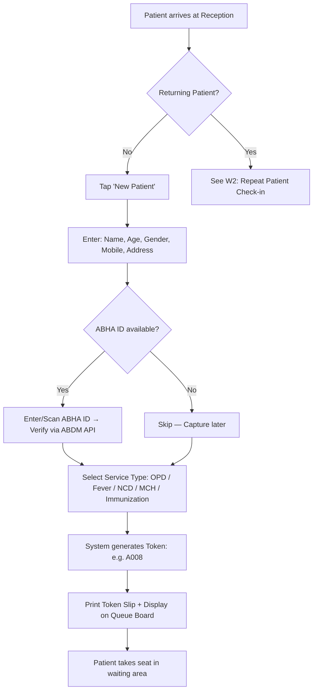

### 3.3 Data Captured

| Field | Required | Type | Notes |
|---|---|---|---|
| Full Name | ✅ | Text | Transliterated to Kannada (optional) |
| Age | ✅ | Number | Years |
| Gender | ✅ | Select | Male / Female / Other |
| Mobile Number | ✅ | Text (10 digits) | Primary identifier for repeat search |
| Address | Optional | Text | Area, Bengaluru |
| ABHA ID | Optional | Text | 14-digit ABHA number |
| Blood Group | Optional | Select | A+, B+, O+, AB+, etc. |
| Known Conditions | Optional | Multi-select | Hypertension, Diabetes, Asthma, etc. |
| Service Type | ✅ | Select | General OPD / Fever / NCD / MCH / Immunization |

### 3.4 Business Rules

1. **Duplicate Detection:** If mobile number matches an existing patient, system prompts "Patient already registered. Check in instead?"
2. **Patient ID Generation:** Auto-generated format `NC-YYYY-NNNNN` (e.g., NC-2026-00142)
3. **ABHA Verification:** If ABHA ID entered, validate against ABDM sandbox. If verification fails, capture ID as text (manual entry) with flag.

**Target time:** 2–4 minutes

---

## 4. Workflow W2 — OPD Registration (Repeat Patient)

### 4.1 To-Be (Digital Platform)

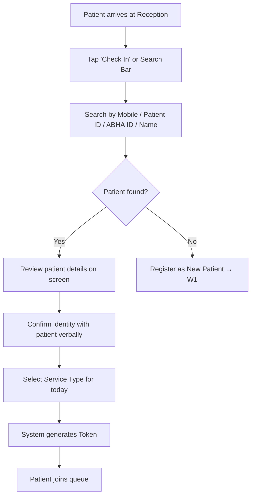

### 4.2 Business Rules

1. Search returns results ranked by: exact mobile match > partial mobile > name similarity > ABHA match.
2. System shows last visit date, last diagnosis, and known conditions for quick verification.
3. If patient has pending referral from a previous visit, system shows alert.

**Target time:** 1–2 minutes

---

## 5. Workflow W3 — Queue & Token Management

### 5.1 To-Be (Digital Platform)

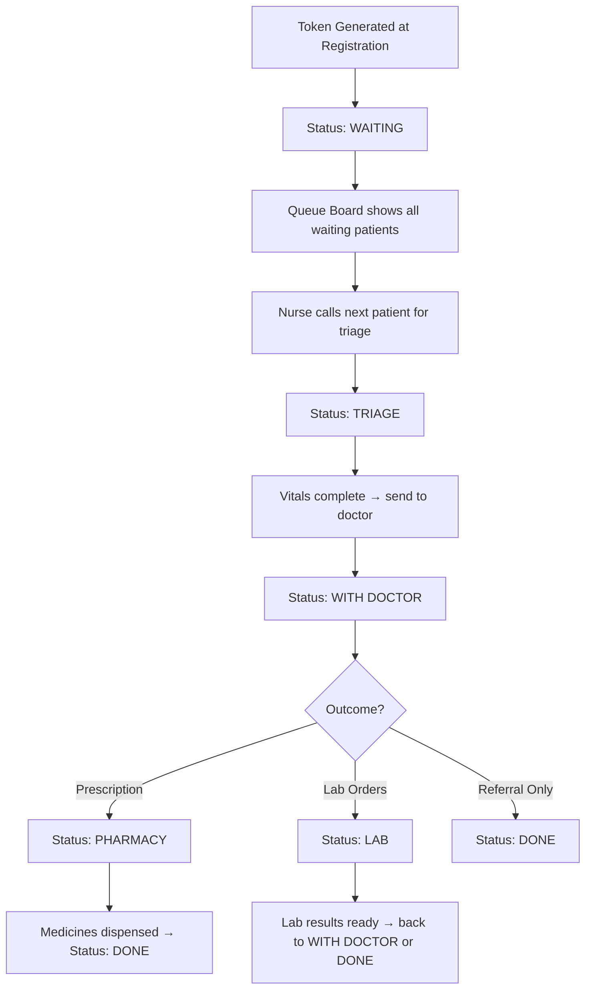

### 5.2 Token Format & Display

- **Token Format:** `A001` through `A999` per clinic per day (resets daily)
- **Queue Board Display:** Large-screen or wall-mounted monitor in waiting area showing:
  - Current token being served at each station (Triage, Doctor, Pharmacy)
  - Count of patients waiting
  - Estimated wait time
- **Priority Logic:** 
  - Danger-flagged patients (from triage) get priority
  - Pregnant women (MCH) get priority
  - Regular queue is FIFO

### 5.3 Status Transitions

| From | To | Triggered By | Notes |
|---|---|---|---|
| — | Waiting | Registration creates token | Initial state |
| Waiting | Triage | Nurse opens patient record | Auto-transition |
| Triage | With Doctor | Nurse saves vitals | Auto-transition |
| With Doctor | Pharmacy | Doctor saves prescription | Auto-transition |
| With Doctor | Lab | Doctor orders lab test | Auto-transition |
| With Doctor | Done | Doctor closes (no Rx, no lab) | Manual |
| Pharmacy | Done | Pharmacist dispenses all medicines | Auto-transition |
| Lab | With Doctor | Lab results entered → needs review | Auto-transition |
| Lab | Done | Lab results entered → no further action | Manual |

---

## 6. Workflow W4 — Triage / Nurse Vitals

### 6.1 To-Be (Digital Platform)

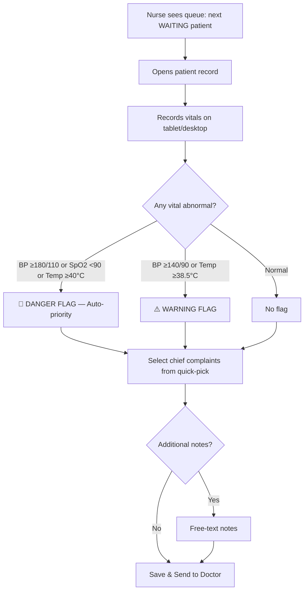

### 6.2 Vitals Captured

| Vital | Equipment | Normal Range | Warning | Danger |
|---|---|---|---|---|
| BP Systolic (mmHg) | Digital BP monitor | 90–120 | 140–179 | ≥180 or <80 |
| BP Diastolic (mmHg) | Digital BP monitor | 60–80 | 90–109 | ≥110 or <50 |
| Pulse (bpm) | BP monitor / manual | 60–100 | 55–59 or 101–110 | <40 or >140 |
| Temperature (°C) | Digital thermometer | 36.1–37.5 | 37.6–38.4 | ≥38.5 or <35 |
| SpO₂ (%) | Pulse oximeter | 95–100 | 90–94 | <90 |
| Blood Sugar (mg/dL) | Glucometer | 70–140 (random) | 141–250 | >400 or <50 |
| Weight (kg) | Weighing scale | — | — | — |
| Height (cm) | Stadiometer | — | — | — |
| BMI | Auto-calculated | 18.5–24.9 | 25–29.9 | ≥30 or <16 |

### 6.3 Chief Complaint Quick-Picks

**Categories and items (selectable chips, multi-select):**

| Category | Quick-Pick Options |
|---|---|
| General | Fever, Headache, Body pain, Weakness/Fatigue, Dizziness |
| Respiratory | Cough, Cold/Runny nose, Sore throat, Breathlessness |
| GI | Vomiting, Diarrhea, Abdominal pain, Constipation, Acidity |
| Cardiovascular | Chest pain, Palpitations, Swelling in feet |
| Urinary | Burning urination, Increased frequency, Blood in urine |
| Skin | Rash, Itching, Boils, Wound |
| MCH | Missed period, Pregnancy follow-up, Breast pain |
| NCD | Known HTN follow-up, Known DM follow-up, Weight gain |

**Target time:** 2–5 minutes

---

## 7. Workflow W5 — Doctor EMR Consultation

### 7.1 To-Be (Digital Platform)

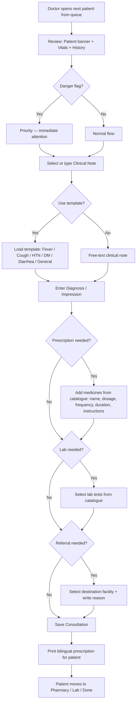

### 7.2 Clinical Note Templates

| Template | Pre-filled Structure |
|---|---|
| **Fever** | `Patient presents with fever for [X] days. H/o chills/rigors: [Y/N]. Throat: [clear/congested]. Chest: [clear/crepitations]. Abdomen: [soft/tender]. [Additional findings].` |
| **Cough / URTI** | `Cough with [dry/productive] sputum for [X] days. Breathlessness: [Y/N]. Chest auscultation: [bilateral clear / rhonchi / crepitations]. SPO2: [X]%.` |
| **Hypertension** | `Known hypertensive on [medication]. Compliance: [good/poor]. BP today: [X/Y mmHg]. Chest pain: [N]. Breathlessness: [N]. Pedal edema: [N]. Fundoscopy: [not done/normal].` |
| **Diabetes** | `Known diabetic on [medication]. Blood sugar today: [fasting/random] [X] mg/dL. HbA1c: [last value]. Foot examination: [normal/ulcers]. Visual complaints: [N]. Diet adherence: [good/poor].` |
| **Diarrhea / GI** | `Loose stools [X] episodes/day for [Y] days. Blood/mucus: [Y/N]. Vomiting: [Y/N]. Dehydration: [mild/moderate/severe]. Abdomen: [soft/tender/distended].` |
| **General OPD** | `Patient presents with [chief complaint]. Duration: [X] days. H/o: [relevant history]. Examination: [findings]. [Additional notes].` |

### 7.3 Prescription Builder

```
Medicine Selection: Autocomplete from 30+ medicine catalogue
→ Dosage: [1 tablet / 2 tablets / ½ tablet / 5ml / 10ml]
→ Frequency: [Once daily / Twice daily / Thrice daily / Four times / Bedtime / SOS]
→ Duration: [3 / 5 / 7 / 10 / 14 / 30 / 90 days / Continue]
→ Instructions: [Before meals / After meals / With food / Morning / Night / With water]
```

### 7.4 Prescription Printout (Bilingual Format)

```
╔══════════════════════════════════════════════════════════╗
║  🏥 NAMMA CLINIC — NC-Rajajinagar-01                   ║
║  ನಮ್ಮ ಕ್ಲಿನಿಕ್ — ರಾಜಾಜಿನಗರ                              ║
║  BBMP / GBA Health Department                          ║
╠══════════════════════════════════════════════════════════╣
║  Patient: Ramesh Kumar (ರಮೇಶ್ ಕುಮಾರ್)                    ║
║  ID: NC-2026-001 | Age: 52Y | M | ABHA: 12-3456-7890  ║
║  Date: 02-Sep-2026 | Token: A001                       ║
╠══════════════════════════════════════════════════════════╣
║  Diagnosis: Essential Hypertension - Uncontrolled       ║
║  ರೋಗನಿರ್ಣಯ: ಅಗತ್ಯ ಅಧಿಕ ರಕ್ತದೊತ್ತಡ                        ║
╠══════════════════════════════════════════════════════════╣
║  Rx:                                                    ║
║  1. Amlodipine 5mg — 1 tab, Once daily, Morning — 30d  ║
║     ಅಮ್ಲೋಡಿಪಿನ್ 5mg — 1 ಮಾತ್ರೆ, ದಿನಕ್ಕೊಮ್ಮೆ, ಬೆಳಿಗ್ಗೆ     ║
║  2. Atenolol 50mg — 1 tab, Once daily, Morning — 30d   ║
║     ಅಟೆನೊಲೋಲ್ 50mg — 1 ಮಾತ್ರೆ, ದಿನಕ್ಕೊಮ್ಮೆ, ಬೆಳಿಗ್ಗೆ       ║
╠══════════════════════════════════════════════════════════╣
║  Follow-up: After 15 days  |  Doctor: Dr. Priya Nair   ║
║  ಅನುಸರಣೆ: 15 ದಿನಗಳ ನಂತರ                                ║
╚══════════════════════════════════════════════════════════╝
```

**Target time:** 3–6 minutes per consultation

---

## 8. Workflow W6 — Pharmacy Dispensing

### 8.1 To-Be (Digital Platform)

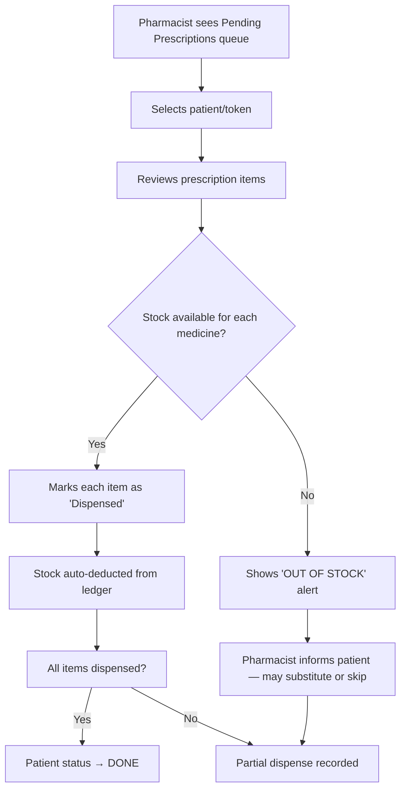

### 8.2 Stock Management Sub-workflows

#### 8.2.1 Stock Intake
```
Medicine shipment arrives → Pharmacist opens 'Stock Intake' →
Enter: Medicine name, Batch No, Qty, Expiry Date → Confirm → Stock updated
```

#### 8.2.2 Low Stock Alert
```
System checks stock daily at 8 AM →
If currentStock ≤ minThreshold → Flag as LOW STOCK (amber) →
If currentStock = 0 → Flag as OUT OF STOCK (red) →
Alert shown on Pharmacy dashboard + Zonal dashboard
```

#### 8.2.3 Indent Workflow
```
Pharmacist opens 'Raise Indent' → Auto-populated with low/out-of-stock items →
Adjust quantities → Submit → Indent sent to Central Drug Store →
Status: Submitted → Approved → Supplied → Received
```

#### 8.2.4 Expiry Management
```
System flags medicines expiring within 60 days → Shows on dashboard →
Pharmacist quarantines expired stock → Adjusts stock (wastage entry) →
Monthly expiry report auto-generated
```

---

## 9. Workflow W7 — Lab / Diagnostics

### 9.1 To-Be (Digital Platform)

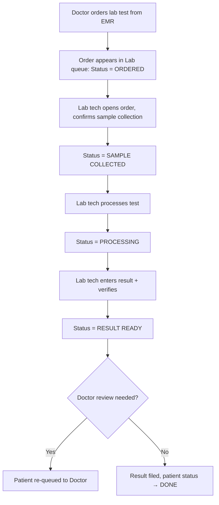

### 9.2 Lab Test Catalogue

| Category | Tests | Method |
|---|---|---|
| Hematology | CBC, Haemoglobin, ESR | Automated / Manual |
| Blood Sugar | Fasting Glucose, PP Glucose, Random, HbA1c | Glucometer / Autoanalyzer |
| Serology | Dengue NS1, Dengue IgM/IgG, Malaria RDT, Widal, HIV Rapid | RDT Kit |
| Urine | Routine & Microscopy, Urine Pregnancy Test | Dipstick / Microscopy |
| Biochemistry | Serum Creatinine, Lipid Profile, LFT, Thyroid (TSH) | Autoanalyzer (if available) |
| Microbiology | Sputum AFB Smear | Microscopy |

### 9.3 Normal Ranges Reference (displayed alongside result entry)

| Test | Normal Range | Unit |
|---|---|---|
| Haemoglobin | Male: 13–17, Female: 12–15 | g/dL |
| WBC Count | 4,000–11,000 | /cumm |
| Platelet Count | 1.5–4.0 lakh | /cumm |
| Fasting Glucose | 70–100 | mg/dL |
| PP Glucose | <140 | mg/dL |
| HbA1c | <5.7% (normal), 5.7–6.4 (pre-diabetic), ≥6.5 (diabetic) | % |
| Serum Creatinine | 0.6–1.2 | mg/dL |
| TSH | 0.4–4.0 | mIU/L |

---

## 10. Workflow W8 — Referral Creation & Tracking

### 10.1 To-Be (Digital Platform)

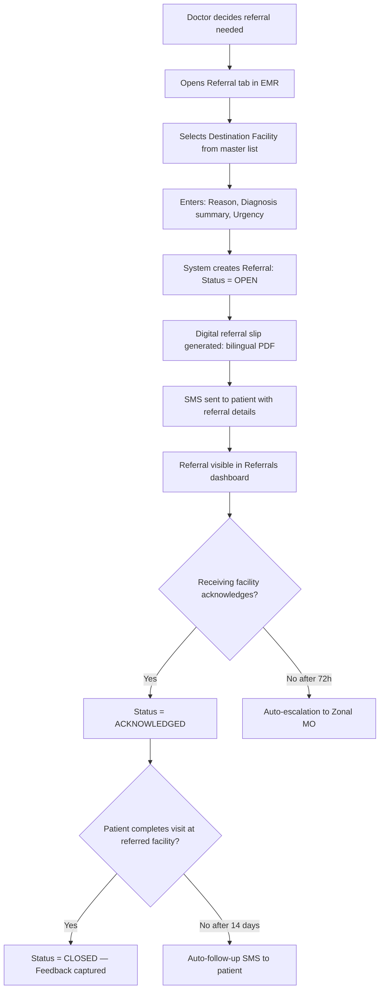

### 10.2 Referral Slip Fields

| Field | Source |
|---|---|
| Patient Name, ID, Age, Gender | Patient Master |
| Referring Clinic | Clinic profile |
| Referring Doctor | Doctor profile |
| Destination Facility | Doctor selection from master |
| Diagnosis / Clinical Summary | From current visit EMR |
| Reason for Referral | Doctor free-text |
| Urgency | Select: Routine / Urgent / Emergency |
| Date & Time | System auto-fill |
| Referral ID | Auto-generated: `REF-NC-YYYY-NNNNN` |

---

## 11. Workflow W9 — Immunization & MCH

### 11.1 Immunization Workflow

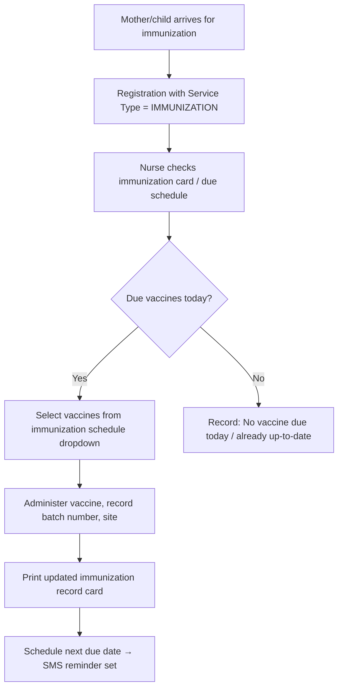

### 11.2 MCH (Antenatal Care) Workflow

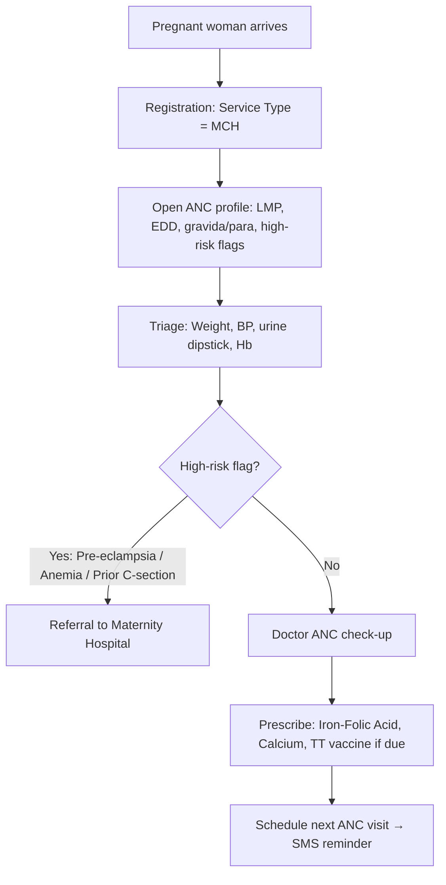

### 11.3 Immunization Schedule Reference

| Age | Vaccine | Dose |
|---|---|---|
| Birth | BCG, OPV-0, Hep-B Birth dose | — |
| 6 weeks | OPV-1, Pentavalent-1, Rotavirus-1, fIPV-1, PCV-1 | 1st |
| 10 weeks | OPV-2, Pentavalent-2, Rotavirus-2 | 2nd |
| 14 weeks | OPV-3, Pentavalent-3, Rotavirus-3, fIPV-2, PCV-2 | 3rd |
| 9 months | MR-1, JE-1, PCV Booster, OPV Booster | 1st |
| 16–24 months | DPT Booster-1, MR-2, OPV Booster, JE-2 | Booster |
| 5–6 years | DPT Booster-2 | Booster |

---

## 12. Workflow W10 — NCD Screening

### 12.1 To-Be (Digital Platform)

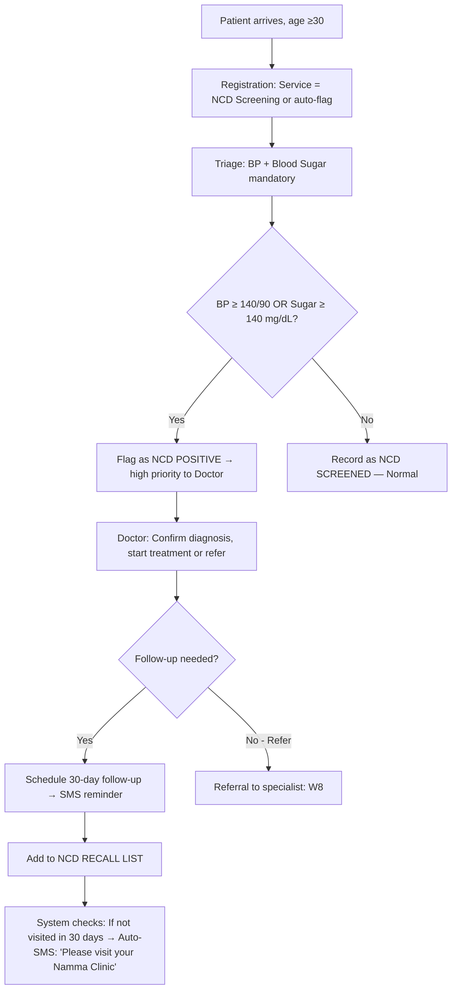

### 12.2 NCD Register Data Points

| Field | Type | Notes |
|---|---|---|
| Screening Date | Date | Auto-filled |
| BP Reading | Numeric | Sys/Dia |
| Blood Sugar | Numeric | Fasting / Random / PP — specify type |
| BMI | Calculated | From weight + height |
| Family History | Multi-select | Hypertension, Diabetes, Cardiac, Stroke |
| Tobacco Use | Select | Never / Former / Current |
| Alcohol Use | Select | Never / Occasional / Regular |
| Risk Score | Calculated | WHO/ISH risk chart (future AI integration) |
| Classification | Auto | Normal / Pre-Hypertensive / Hypertensive / Pre-Diabetic / Diabetic |

---

## 13. Workflow W11 — Telemedicine

### 13.1 To-Be (Digital Platform)

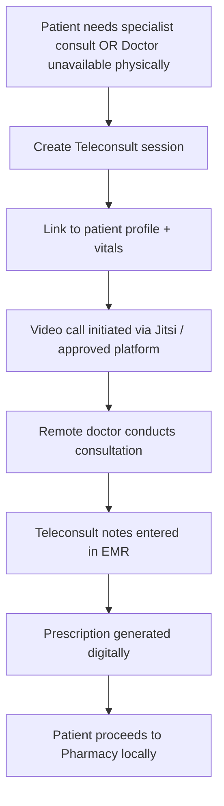

### 13.2 Telemedicine Use Cases at Namma Clinics

| Use Case | Scenario | Frequency |
|---|---|---|
| Specialist consult | Dermatology, psychiatry, ophthalmology — not available at Namma Clinic | 2–5/week/clinic |
| Doctor leave coverage | If clinic MO is absent, remote MO covers via teleconsult | 1–3 days/month |
| Second opinion | Complex case — local MO seeks opinion from senior doctor | 1–2/week |
| Follow-up | Post-referral follow-up with specialist at referred hospital | 2–3/week |

---

## 14. Workflow W12 — Monthly Reporting

### 14.1 As-Is (Manual)

```
End of month → DEO/Nurse manually counts patients from register →
Tallies by service type, age group, disease category →
Fills BBMP monthly report form (paper) → Sends to Zonal Office →
Zonal MO compiles all clinics → Sends to BBMP HQ
Time: 2–3 days per clinic for compilation
```

### 14.2 To-Be (Digital Platform — Auto-Generated)

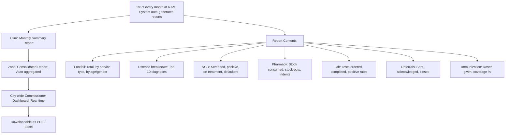

### 14.3 Report Hierarchy

| Level | Recipients | Frequency | Delivery |
|---|---|---|---|
| Clinic | Clinic MO, Clinic Admin | Daily snapshot + Monthly | Dashboard + PDF |
| Zone | Zonal MO, Zonal Health Officer | Weekly + Monthly | Dashboard + Excel/PDF |
| City | Special Commissioner, Addl Director Health | Real-time dashboard + Monthly summary | Dashboard + PDF + Email |
| State | DHFW Karnataka (if required) | Quarterly | PDF / API (future) |

---

## 15. Cross-Workflow Data Flow Diagram

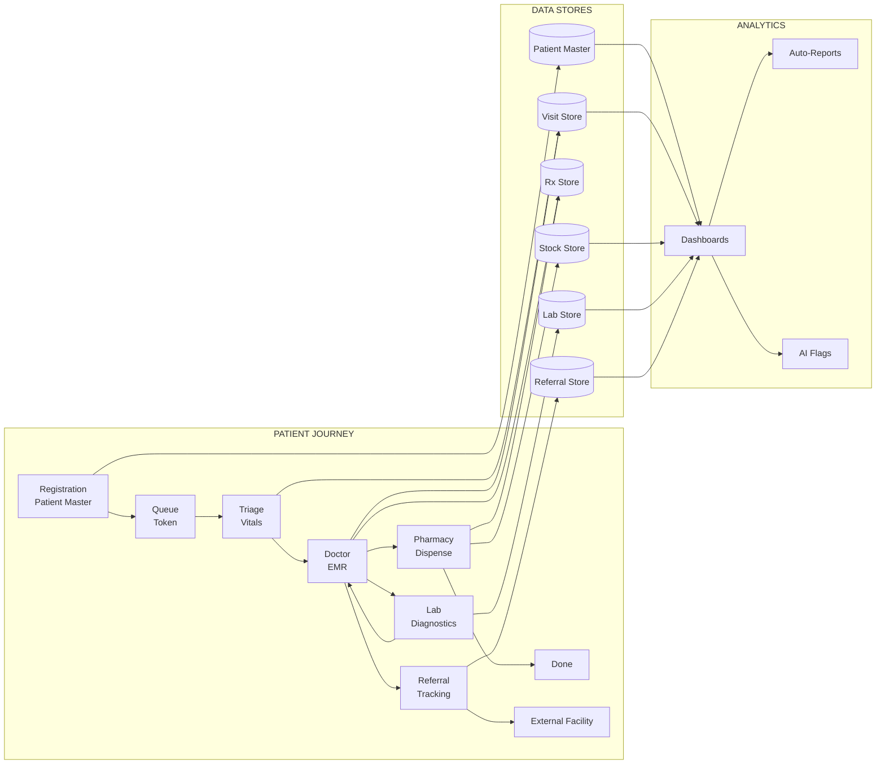

---

## 16. Exception Handling Matrix

| Exception | Workflow | Handling |
|---|---|---|
| Patient has no mobile number | W1 Registration | Allow registration without mobile, use Patient ID as identifier |
| Patient brought by family (unconscious) | W1 Registration | Register under family member's details, flag as "brought by relative" |
| Internet down during registration | W1, W3 | Offline mode: data cached locally, syncs when online |
| Vital equipment malfunction (BP monitor) | W4 Triage | Allow manual entry with "equipment down" flag |
| Medicine out of stock during dispensing | W6 Pharmacy | Record as "not dispensed — out of stock", alert on patient slip |
| Lab equipment malfunction | W7 Lab | Mark test as "deferred", offer to reschedule |
| Patient leaves without seeing doctor (LAMA) | W3 Queue | Mark as "LAMA" — Left Against Medical Advice |
| Power outage during consultation | All | UPS provides 30-min backup; offline mode auto-activates |
| Patient identity mismatch at pharmacy | W6 Pharmacy | Re-verify token number and patient photo (future: biometric) |

---

**Document Control**

| Version | Date | Author | Changes |
|---|---|---|---|
| 1.0 | Sep 2, 2026 | K Mati — Clinical Advisory Team | Initial release — all 12 workflows mapped |

---
*© 2026 Kushagramati Analytics Pvt Ltd. Confidential — Prepared for GBA / BBMP Health Department.*
